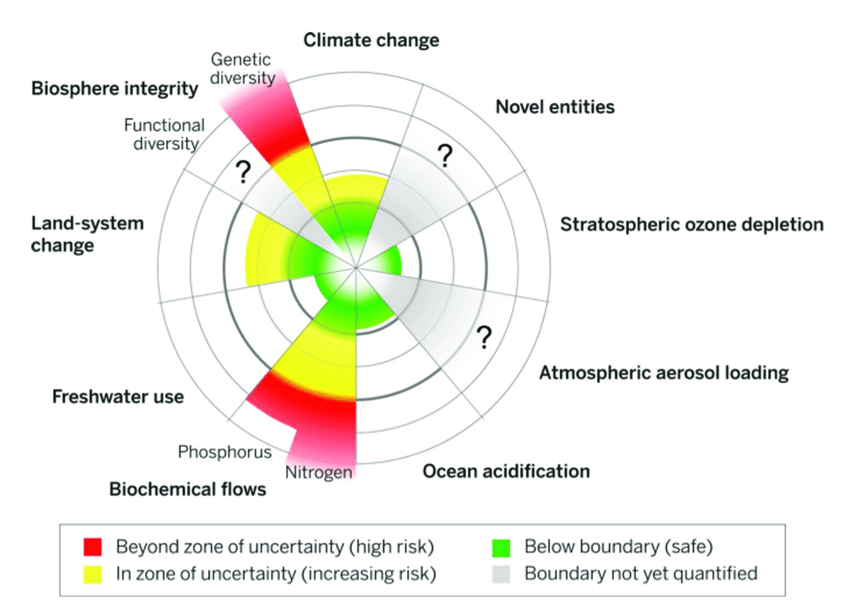
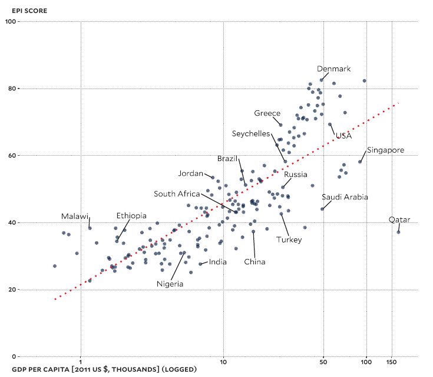

## Environmental problems we write about:

* As a species we face many environmental challenges...
* Recently climate change has been getting most of our attention:


<figcaption>source: Google Ngram Viewer</figcaption>

## Planetary boundaries:

{ height=50% }
<figcaption>source: @steffen2015planetary </figcaption>

* We are in the midst of the world's 6th extinction crisis: @pimm1995future, @lawton1995extinction, @de2015estimating, @pimm2014biodiversity, @diaz2019global.

* 8 billion mouths to feed has created great stress on nitrogen and phosphorus cycles.

* What is needed is a measure of how well we are doing at addressing this multifaceted problem.

## Environmental Performance Index:

* Environmental Performance Index (EPI) is a data-driven summary of the state of sustainability based on 32 performance indicators across 11 issue categories.

{ height=35% }
<figcaption>source: @epi20</figcaption>

* Strong correlation between EPI scores and GDP/capita. Is it because:

    - economic prosperity makes it possible for nations to invest in policies and programs that lead to desirable outcomes  OR
    
    - economic prosperity allows rich countries to outsource the production of environmentally damaging goods. 

*  Trade data and standard EPI scores can be used to create a weighted EPI score that crudely addresses these leakages.

    - the relationship between gdp/capita and epi scores still exists using this weighted EPI score.

## How the sausage is made:

<!-- -->


## Confounds: wealth and governance.

<!-- -->

## What I am interested in: inequity

*  seems plausible the distribution of income might be related to EPI scores.

{height=600px}&emsp;vs.&emsp;{height=600px}<figcaption> Antilla &emsp; &emsp; &emsp;&emsp; &emsp; &emsp; &emsp;&emsp;&emsp; &emsp; &emsp; &emsp; &emsp; &emsp; &emsp;elsewhere in Mumbai.</figcaption>

  -   Are EPI scores correlated with the share of income the top 10% of earners?
  -   Are EPI scores correlated with the proportion of people living below the \$5.50/day poverty line?
  -   Or does inequity create a universal incentive to over-exploit? i.e. a "rat race" 

## Rat race?


```{=html}
<div id="htmlwidget-d8822df4a704a528edfa" style="width:1536px;height:864px;" class="plotly html-widget"></div>
<script type="application/json" data-for="htmlwidget-d8822df4a704a528edfa">{"x":{"data":[{"x":[37.9,27.4,23.9,31.3,23.4,52.2,27.4,47.4,28,50.9,23.7,21.3,30.1,25.9,35.9,37.7,22,27.6,40.7,41.9,30.6,32.7,24.7,23.8,45.8,48.5,33.9,24.1,26.9,23.6,34.2,53.2,42.2,33.5,36.8,null,31.9,40.7,20.6,31,26.4,43.2,42.4,27.2,31.6,40.3,33.6],"y":[1974,1919.1102,1881.0354,2099.0146,1707.126,1985,1827,2366.2217,1971.4967,2074,1577.5864,1849.1888,1778.8678,1756.1083,2111.6992,2479.3877,2193.4773,1710.0775,2064.0278,2003.2617,2122.1006,1856.0651,2073.9438,1682.3013,2276.562,2315.4497,2445.5898,1578.3605,1864.4515,1579.7845,2143.271,1993.3912,2134.4941,2053.4819,2182.9209,2863.7393,1917.9247,1961.8099,1516.8071,1821.8396,2313.9087,2710.0938,1957,1785.3964,1801.3328,1997,2629.6807],"text":["Argentina","Australia","Austria","Bangladesh","Belgium","Brazil","Canada","Chile","China","Colombia","Denmark","Finland","France","Germany","Greece","Hong Kong","Hungary","Iceland","India","Indonesia","Ireland","Italy","Japan","Luxembourg","Malaysia","Mexico","Myanmar","Netherlands","New Zealand","Norway","Pakistan","Peru","Philippines","Portugal","Singapore","South Korea","Spain","Sri Lanka","Sweden","Switzerland","Taiwan","Thailand","Turkey","United Kingdom","United States","Venezuela","Vietnam"],"hovertext":["gini_disp: 37.9<br />hours: 1974.000<br />year: 1980<br />country_name: Argentina","gini_disp: 27.4<br />hours: 1919.110<br />year: 1980<br />country_name: Australia","gini_disp: 23.9<br />hours: 1881.035<br />year: 1980<br />country_name: Austria","gini_disp: 31.3<br />hours: 2099.015<br />year: 1980<br />country_name: Bangladesh","gini_disp: 23.4<br />hours: 1707.126<br />year: 1980<br />country_name: Belgium","gini_disp: 52.2<br />hours: 1985.000<br />year: 1980<br />country_name: Brazil","gini_disp: 27.4<br />hours: 1827.000<br />year: 1980<br />country_name: Canada","gini_disp: 47.4<br />hours: 2366.222<br />year: 1980<br />country_name: Chile","gini_disp: 28.0<br />hours: 1971.497<br />year: 1980<br />country_name: China","gini_disp: 50.9<br />hours: 2074.000<br />year: 1980<br />country_name: Colombia","gini_disp: 23.7<br />hours: 1577.586<br />year: 1980<br />country_name: Denmark","gini_disp: 21.3<br />hours: 1849.189<br />year: 1980<br />country_name: Finland","gini_disp: 30.1<br />hours: 1778.868<br />year: 1980<br />country_name: France","gini_disp: 25.9<br />hours: 1756.108<br />year: 1980<br />country_name: Germany","gini_disp: 35.9<br />hours: 2111.699<br />year: 1980<br />country_name: Greece","gini_disp: 37.7<br />hours: 2479.388<br />year: 1980<br />country_name: Hong Kong","gini_disp: 22.0<br />hours: 2193.477<br />year: 1980<br />country_name: Hungary","gini_disp: 27.6<br />hours: 1710.078<br />year: 1980<br />country_name: Iceland","gini_disp: 40.7<br />hours: 2064.028<br />year: 1980<br />country_name: India","gini_disp: 41.9<br />hours: 2003.262<br />year: 1980<br />country_name: Indonesia","gini_disp: 30.6<br />hours: 2122.101<br />year: 1980<br />country_name: Ireland","gini_disp: 32.7<br />hours: 1856.065<br />year: 1980<br />country_name: Italy","gini_disp: 24.7<br />hours: 2073.944<br />year: 1980<br />country_name: Japan","gini_disp: 23.8<br />hours: 1682.301<br />year: 1980<br />country_name: Luxembourg","gini_disp: 45.8<br />hours: 2276.562<br />year: 1980<br />country_name: Malaysia","gini_disp: 48.5<br />hours: 2315.450<br />year: 1980<br />country_name: Mexico","gini_disp: 33.9<br />hours: 2445.590<br />year: 1980<br />country_name: Myanmar","gini_disp: 24.1<br />hours: 1578.361<br />year: 1980<br />country_name: Netherlands","gini_disp: 26.9<br />hours: 1864.451<br />year: 1980<br />country_name: New Zealand","gini_disp: 23.6<br />hours: 1579.784<br />year: 1980<br />country_name: Norway","gini_disp: 34.2<br />hours: 2143.271<br />year: 1980<br />country_name: Pakistan","gini_disp: 53.2<br />hours: 1993.391<br />year: 1980<br />country_name: Peru","gini_disp: 42.2<br />hours: 2134.494<br />year: 1980<br />country_name: Philippines","gini_disp: 33.5<br />hours: 2053.482<br />year: 1980<br />country_name: Portugal","gini_disp: 36.8<br />hours: 2182.921<br />year: 1980<br />country_name: Singapore","gini_disp:   NA<br />hours: 2863.739<br />year: 1980<br />country_name: South Korea","gini_disp: 31.9<br />hours: 1917.925<br />year: 1980<br />country_name: Spain","gini_disp: 40.7<br />hours: 1961.810<br />year: 1980<br />country_name: Sri Lanka","gini_disp: 20.6<br />hours: 1516.807<br />year: 1980<br />country_name: Sweden","gini_disp: 31.0<br />hours: 1821.840<br />year: 1980<br />country_name: Switzerland","gini_disp: 26.4<br />hours: 2313.909<br />year: 1980<br />country_name: Taiwan","gini_disp: 43.2<br />hours: 2710.094<br />year: 1980<br />country_name: Thailand","gini_disp: 42.4<br />hours: 1957.000<br />year: 1980<br />country_name: Turkey","gini_disp: 27.2<br />hours: 1785.396<br />year: 1980<br />country_name: United Kingdom","gini_disp: 31.6<br />hours: 1801.333<br />year: 1980<br />country_name: United States","gini_disp: 40.3<br />hours: 1997.000<br />year: 1980<br />country_name: Venezuela","gini_disp: 33.6<br />hours: 2629.681<br />year: 1980<br />country_name: Vietnam"],"frame":"1980","textfont":{"size":14.6645669291339,"color":"rgba(0,0,0,1)"},"type":"scatter","mode":"text","hoveron":"points","showlegend":false,"xaxis":"x","yaxis":"y","hoverinfo":"text","visible":true},{"x":[20.6,21.0126582278481,21.4253164556962,21.8379746835443,22.2506329113924,22.6632911392405,23.0759493670886,23.4886075949367,23.9012658227848,24.3139240506329,24.726582278481,25.1392405063291,25.5518987341772,25.9645569620253,26.3772151898734,26.7898734177215,27.2025316455696,27.6151898734177,28.0278481012658,28.4405063291139,28.853164556962,29.2658227848101,29.6784810126582,30.0911392405063,30.5037974683544,30.9164556962025,31.3291139240506,31.7417721518987,32.1544303797468,32.5670886075949,32.979746835443,33.3924050632911,33.8050632911392,34.2177215189873,34.6303797468354,35.0430379746835,35.4556962025316,35.8683544303798,36.2810126582279,36.6936708860759,37.1063291139241,37.5189873417722,37.9316455696203,38.3443037974684,38.7569620253165,39.1696202531646,39.5822784810127,39.9949367088608,40.4075949367089,40.820253164557,41.2329113924051,41.6455696202532,42.0582278481013,42.4708860759494,42.8835443037975,43.2962025316456,43.7088607594937,44.1215189873418,44.5341772151899,44.946835443038,45.3594936708861,45.7721518987342,46.1848101265823,46.5974683544304,47.0101265822785,47.4227848101266,47.8354430379747,48.2481012658228,48.6607594936709,49.073417721519,49.4860759493671,49.8987341772152,50.3113924050633,50.7240506329114,51.1367088607595,51.5493670886076,51.9620253164557,52.3746835443038,52.7873417721519,53.2],"y":[1799.5614471372,1806.01381000981,1812.46617288242,1818.91853575503,1825.37089862764,1831.82326150025,1838.27562437287,1844.72798724548,1851.18035011809,1857.6327129907,1864.08507586331,1870.53743873592,1876.98980160853,1883.44216448114,1889.89452735376,1896.34689022637,1902.79925309898,1909.25161597159,1915.7039788442,1922.15634171681,1928.60870458942,1935.06106746203,1941.51343033465,1947.96579320726,1954.41815607987,1960.87051895248,1967.32288182509,1973.7752446977,1980.22760757031,1986.67997044292,1993.13233331554,1999.58469618815,2006.03705906076,2012.48942193337,2018.94178480598,2025.39414767859,2031.8465105512,2038.29887342381,2044.75123629643,2051.20359916904,2057.65596204165,2064.10832491426,2070.56068778687,2077.01305065948,2083.46541353209,2089.9177764047,2096.37013927732,2102.82250214993,2109.27486502254,2115.72722789515,2122.17959076776,2128.63195364037,2135.08431651298,2141.53667938559,2147.98904225821,2154.44140513082,2160.89376800343,2167.34613087604,2173.79849374865,2180.25085662126,2186.70321949387,2193.15558236648,2199.60794523909,2206.06030811171,2212.51267098432,2218.96503385693,2225.41739672954,2231.86975960215,2238.32212247476,2244.77448534737,2251.22684821999,2257.6792110926,2264.13157396521,2270.58393683782,2277.03629971043,2283.48866258304,2289.94102545565,2296.39338832826,2302.84575120087,2309.29811407349],"text":["gini_disp: 20.60000<br />hours: 1799.561<br />year: 1980","gini_disp: 21.01266<br />hours: 1806.014<br />year: 1980","gini_disp: 21.42532<br />hours: 1812.466<br />year: 1980","gini_disp: 21.83797<br />hours: 1818.919<br />year: 1980","gini_disp: 22.25063<br />hours: 1825.371<br />year: 1980","gini_disp: 22.66329<br />hours: 1831.823<br />year: 1980","gini_disp: 23.07595<br />hours: 1838.276<br />year: 1980","gini_disp: 23.48861<br />hours: 1844.728<br />year: 1980","gini_disp: 23.90127<br />hours: 1851.180<br />year: 1980","gini_disp: 24.31392<br />hours: 1857.633<br />year: 1980","gini_disp: 24.72658<br />hours: 1864.085<br />year: 1980","gini_disp: 25.13924<br />hours: 1870.537<br />year: 1980","gini_disp: 25.55190<br />hours: 1876.990<br />year: 1980","gini_disp: 25.96456<br />hours: 1883.442<br />year: 1980","gini_disp: 26.37722<br />hours: 1889.895<br />year: 1980","gini_disp: 26.78987<br />hours: 1896.347<br />year: 1980","gini_disp: 27.20253<br />hours: 1902.799<br />year: 1980","gini_disp: 27.61519<br />hours: 1909.252<br />year: 1980","gini_disp: 28.02785<br />hours: 1915.704<br />year: 1980","gini_disp: 28.44051<br />hours: 1922.156<br />year: 1980","gini_disp: 28.85316<br />hours: 1928.609<br />year: 1980","gini_disp: 29.26582<br />hours: 1935.061<br />year: 1980","gini_disp: 29.67848<br />hours: 1941.513<br />year: 1980","gini_disp: 30.09114<br />hours: 1947.966<br />year: 1980","gini_disp: 30.50380<br />hours: 1954.418<br />year: 1980","gini_disp: 30.91646<br />hours: 1960.871<br />year: 1980","gini_disp: 31.32911<br />hours: 1967.323<br />year: 1980","gini_disp: 31.74177<br />hours: 1973.775<br />year: 1980","gini_disp: 32.15443<br />hours: 1980.228<br />year: 1980","gini_disp: 32.56709<br />hours: 1986.680<br />year: 1980","gini_disp: 32.97975<br />hours: 1993.132<br />year: 1980","gini_disp: 33.39241<br />hours: 1999.585<br />year: 1980","gini_disp: 33.80506<br />hours: 2006.037<br />year: 1980","gini_disp: 34.21772<br />hours: 2012.489<br />year: 1980","gini_disp: 34.63038<br />hours: 2018.942<br />year: 1980","gini_disp: 35.04304<br />hours: 2025.394<br />year: 1980","gini_disp: 35.45570<br />hours: 2031.847<br />year: 1980","gini_disp: 35.86835<br />hours: 2038.299<br />year: 1980","gini_disp: 36.28101<br />hours: 2044.751<br />year: 1980","gini_disp: 36.69367<br />hours: 2051.204<br />year: 1980","gini_disp: 37.10633<br />hours: 2057.656<br />year: 1980","gini_disp: 37.51899<br />hours: 2064.108<br />year: 1980","gini_disp: 37.93165<br />hours: 2070.561<br />year: 1980","gini_disp: 38.34430<br />hours: 2077.013<br />year: 1980","gini_disp: 38.75696<br />hours: 2083.465<br />year: 1980","gini_disp: 39.16962<br />hours: 2089.918<br />year: 1980","gini_disp: 39.58228<br />hours: 2096.370<br />year: 1980","gini_disp: 39.99494<br />hours: 2102.823<br />year: 1980","gini_disp: 40.40759<br />hours: 2109.275<br />year: 1980","gini_disp: 40.82025<br />hours: 2115.727<br />year: 1980","gini_disp: 41.23291<br />hours: 2122.180<br />year: 1980","gini_disp: 41.64557<br />hours: 2128.632<br />year: 1980","gini_disp: 42.05823<br />hours: 2135.084<br />year: 1980","gini_disp: 42.47089<br />hours: 2141.537<br />year: 1980","gini_disp: 42.88354<br />hours: 2147.989<br />year: 1980","gini_disp: 43.29620<br />hours: 2154.441<br />year: 1980","gini_disp: 43.70886<br />hours: 2160.894<br />year: 1980","gini_disp: 44.12152<br />hours: 2167.346<br />year: 1980","gini_disp: 44.53418<br />hours: 2173.798<br />year: 1980","gini_disp: 44.94684<br />hours: 2180.251<br />year: 1980","gini_disp: 45.35949<br />hours: 2186.703<br />year: 1980","gini_disp: 45.77215<br />hours: 2193.156<br />year: 1980","gini_disp: 46.18481<br />hours: 2199.608<br />year: 1980","gini_disp: 46.59747<br />hours: 2206.060<br />year: 1980","gini_disp: 47.01013<br />hours: 2212.513<br />year: 1980","gini_disp: 47.42278<br />hours: 2218.965<br />year: 1980","gini_disp: 47.83544<br />hours: 2225.417<br />year: 1980","gini_disp: 48.24810<br />hours: 2231.870<br />year: 1980","gini_disp: 48.66076<br />hours: 2238.322<br />year: 1980","gini_disp: 49.07342<br />hours: 2244.774<br />year: 1980","gini_disp: 49.48608<br />hours: 2251.227<br />year: 1980","gini_disp: 49.89873<br />hours: 2257.679<br />year: 1980","gini_disp: 50.31139<br />hours: 2264.132<br />year: 1980","gini_disp: 50.72405<br />hours: 2270.584<br />year: 1980","gini_disp: 51.13671<br />hours: 2277.036<br />year: 1980","gini_disp: 51.54937<br />hours: 2283.489<br />year: 1980","gini_disp: 51.96203<br />hours: 2289.941<br />year: 1980","gini_disp: 52.37468<br />hours: 2296.393<br />year: 1980","gini_disp: 52.78734<br />hours: 2302.846<br />year: 1980","gini_disp: 53.20000<br />hours: 2309.298<br />year: 1980"],"frame":"1980","type":"scatter","mode":"lines","name":"fitted values","line":{"width":3.77952755905512,"color":"rgba(51,102,255,1)","dash":"solid"},"hoveron":"points","showlegend":false,"xaxis":"x","yaxis":"y","hoverinfo":"text","visible":true},{"x":[20.6,21.0126582278481,21.4253164556962,21.8379746835443,22.2506329113924,22.6632911392405,23.0759493670886,23.4886075949367,23.9012658227848,24.3139240506329,24.726582278481,25.1392405063291,25.5518987341772,25.9645569620253,26.3772151898734,26.7898734177215,27.2025316455696,27.6151898734177,28.0278481012658,28.4405063291139,28.853164556962,29.2658227848101,29.6784810126582,30.0911392405063,30.5037974683544,30.9164556962025,31.3291139240506,31.7417721518987,32.1544303797468,32.5670886075949,32.979746835443,33.3924050632911,33.8050632911392,34.2177215189873,34.6303797468354,35.0430379746835,35.4556962025316,35.8683544303798,36.2810126582279,36.6936708860759,37.1063291139241,37.5189873417722,37.9316455696203,38.3443037974684,38.7569620253165,39.1696202531646,39.5822784810127,39.9949367088608,40.4075949367089,40.820253164557,41.2329113924051,41.6455696202532,42.0582278481013,42.4708860759494,42.8835443037975,43.2962025316456,43.7088607594937,44.1215189873418,44.5341772151899,44.946835443038,45.3594936708861,45.7721518987342,46.1848101265823,46.5974683544304,47.0101265822785,47.4227848101266,47.8354430379747,48.2481012658228,48.6607594936709,49.073417721519,49.4860759493671,49.8987341772152,50.3113924050633,50.7240506329114,51.1367088607595,51.5493670886076,51.9620253164557,52.3746835443038,52.7873417721519,53.2,53.2,52.7873417721519,52.3746835443038,51.9620253164557,51.5493670886076,51.1367088607595,50.7240506329114,50.3113924050633,49.8987341772152,49.4860759493671,49.073417721519,48.6607594936709,48.2481012658228,47.8354430379747,47.4227848101266,47.0101265822785,46.5974683544304,46.1848101265823,45.7721518987342,45.3594936708861,44.946835443038,44.5341772151899,44.1215189873418,43.7088607594937,43.2962025316456,42.8835443037975,42.4708860759494,42.0582278481013,41.6455696202532,41.2329113924051,40.820253164557,40.4075949367089,39.9949367088608,39.5822784810127,39.1696202531646,38.7569620253165,38.3443037974684,37.9316455696203,37.5189873417722,37.1063291139241,36.6936708860759,36.2810126582279,35.8683544303798,35.4556962025316,35.0430379746835,34.6303797468354,34.2177215189873,33.8050632911392,33.3924050632911,32.979746835443,32.5670886075949,32.1544303797468,31.7417721518987,31.3291139240506,30.9164556962025,30.5037974683544,30.0911392405063,29.6784810126582,29.2658227848101,28.853164556962,28.4405063291139,28.0278481012658,27.6151898734177,27.2025316455696,26.7898734177215,26.3772151898734,25.9645569620253,25.5518987341772,25.1392405063291,24.726582278481,24.3139240506329,23.9012658227848,23.4886075949367,23.0759493670886,22.6632911392405,22.2506329113924,21.8379746835443,21.4253164556962,21.0126582278481,20.6,20.6],"y":[1676.72896178485,1685.8418019452,1694.92529934106,1703.9774388854,1712.9960441785,1721.97876486306,1730.9230634503,1739.82620176054,1748.68522718355,1757.49695904164,1766.25797543266,1774.96460104377,1783.6128965595,1792.19865043941,1800.71737400733,1809.16430097024,1817.53439265826,1825.82235043071,1834.02263680364,1842.12950688908,1850.13705165867,1858.03925431169,1865.83006060001,1873.50346330848,1881.05360019856,1888.4748636166,1895.76201871192,1902.91032591813,1909.9156621847,1916.77463459275,1923.4846796373,1930.04414174986,1936.45232563146,1942.70951861293,1948.81698138711,1954.7769078019,1960.59235665677,1966.26716031936,1971.80581625887,1977.21336817676,1982.49528331755,1987.65733187699,1992.70547336519,1997.64575352113,2002.48421408684,2007.22681657065,2011.87938014293,2016.44753305544,2020.93667645618,2025.35195916283,2029.6982618206,2033.98018886353,2038.20206678142,2042.36794733325,2046.48161451604,2050.54659427419,2054.56616610636,2058.54337588533,2062.48104934707,2066.38180582707,2070.24807192373,2074.08209485336,2077.88595532916,2081.66157985103,2085.41075233533,2089.1351250463,2092.83622881554,2096.51548255393,2100.1742020735,2103.81360824566,2107.43483452828,2111.03893389738,2114.62688522133,2118.19959911553,2121.75792331545,2125.30264760447,2128.83450833147,2132.35419255144,2135.86234181996,2139.3595556708,2479.23667247617,2469.82916058179,2460.43258410509,2451.04754257983,2441.67467756161,2432.31467610541,2422.96827456011,2413.63626270909,2404.31948828781,2395.01886191169,2385.73536244909,2376.47004287603,2367.22403665037,2357.99856464354,2348.79494266756,2339.61458963331,2330.45903637238,2321.32993514903,2312.22906987961,2303.15836706401,2294.11990741545,2285.11593815023,2276.14888586675,2267.22136990049,2258.33621598745,2249.49647000037,2240.70541143793,2231.96656624454,2223.28371841721,2214.66091971492,2206.10249662747,2197.6130535889,2189.19747124442,2180.8608984117,2172.60873623876,2164.44661297734,2156.38034779783,2148.41590220855,2140.55931795153,2132.81664076574,2125.19383016131,2117.69665633398,2110.33058652827,2103.10066444564,2096.01138755529,2089.06658822485,2082.26932525381,2075.62179249005,2069.12525062643,2062.77998699377,2056.5853062931,2050.53955295593,2044.64016347727,2038.88374493826,2033.26617428836,2027.78271196118,2022.42812310604,2017.19680006928,2012.08288061237,2007.08035752017,2002.18317654454,1997.38532088476,1992.68088151247,1988.0641135397,1983.5294794825,1979.07168070018,1974.68567852287,1970.36670665757,1966.11027642808,1961.91217629396,1957.76846693976,1953.67547305263,1949.62977273042,1945.62818529543,1941.66775813745,1937.74575307678,1933.85963262467,1930.00704642378,1926.18581807441,1922.39393248955,1676.72896178485],"text":["gini_disp: 20.60000<br />hours: 1799.561<br />year: 1980","gini_disp: 21.01266<br />hours: 1806.014<br />year: 1980","gini_disp: 21.42532<br />hours: 1812.466<br />year: 1980","gini_disp: 21.83797<br />hours: 1818.919<br />year: 1980","gini_disp: 22.25063<br />hours: 1825.371<br />year: 1980","gini_disp: 22.66329<br />hours: 1831.823<br />year: 1980","gini_disp: 23.07595<br />hours: 1838.276<br />year: 1980","gini_disp: 23.48861<br />hours: 1844.728<br />year: 1980","gini_disp: 23.90127<br />hours: 1851.180<br />year: 1980","gini_disp: 24.31392<br />hours: 1857.633<br />year: 1980","gini_disp: 24.72658<br />hours: 1864.085<br />year: 1980","gini_disp: 25.13924<br />hours: 1870.537<br />year: 1980","gini_disp: 25.55190<br />hours: 1876.990<br />year: 1980","gini_disp: 25.96456<br />hours: 1883.442<br />year: 1980","gini_disp: 26.37722<br />hours: 1889.895<br />year: 1980","gini_disp: 26.78987<br />hours: 1896.347<br />year: 1980","gini_disp: 27.20253<br />hours: 1902.799<br />year: 1980","gini_disp: 27.61519<br />hours: 1909.252<br />year: 1980","gini_disp: 28.02785<br />hours: 1915.704<br />year: 1980","gini_disp: 28.44051<br />hours: 1922.156<br />year: 1980","gini_disp: 28.85316<br />hours: 1928.609<br />year: 1980","gini_disp: 29.26582<br />hours: 1935.061<br />year: 1980","gini_disp: 29.67848<br />hours: 1941.513<br />year: 1980","gini_disp: 30.09114<br />hours: 1947.966<br />year: 1980","gini_disp: 30.50380<br />hours: 1954.418<br />year: 1980","gini_disp: 30.91646<br />hours: 1960.871<br />year: 1980","gini_disp: 31.32911<br />hours: 1967.323<br />year: 1980","gini_disp: 31.74177<br />hours: 1973.775<br />year: 1980","gini_disp: 32.15443<br />hours: 1980.228<br />year: 1980","gini_disp: 32.56709<br />hours: 1986.680<br />year: 1980","gini_disp: 32.97975<br />hours: 1993.132<br />year: 1980","gini_disp: 33.39241<br />hours: 1999.585<br />year: 1980","gini_disp: 33.80506<br />hours: 2006.037<br />year: 1980","gini_disp: 34.21772<br />hours: 2012.489<br />year: 1980","gini_disp: 34.63038<br />hours: 2018.942<br />year: 1980","gini_disp: 35.04304<br />hours: 2025.394<br />year: 1980","gini_disp: 35.45570<br />hours: 2031.847<br />year: 1980","gini_disp: 35.86835<br />hours: 2038.299<br />year: 1980","gini_disp: 36.28101<br />hours: 2044.751<br />year: 1980","gini_disp: 36.69367<br />hours: 2051.204<br />year: 1980","gini_disp: 37.10633<br />hours: 2057.656<br />year: 1980","gini_disp: 37.51899<br />hours: 2064.108<br />year: 1980","gini_disp: 37.93165<br />hours: 2070.561<br />year: 1980","gini_disp: 38.34430<br />hours: 2077.013<br />year: 1980","gini_disp: 38.75696<br />hours: 2083.465<br />year: 1980","gini_disp: 39.16962<br />hours: 2089.918<br />year: 1980","gini_disp: 39.58228<br />hours: 2096.370<br />year: 1980","gini_disp: 39.99494<br />hours: 2102.823<br />year: 1980","gini_disp: 40.40759<br />hours: 2109.275<br />year: 1980","gini_disp: 40.82025<br />hours: 2115.727<br />year: 1980","gini_disp: 41.23291<br />hours: 2122.180<br />year: 1980","gini_disp: 41.64557<br />hours: 2128.632<br />year: 1980","gini_disp: 42.05823<br />hours: 2135.084<br />year: 1980","gini_disp: 42.47089<br />hours: 2141.537<br />year: 1980","gini_disp: 42.88354<br />hours: 2147.989<br />year: 1980","gini_disp: 43.29620<br />hours: 2154.441<br />year: 1980","gini_disp: 43.70886<br />hours: 2160.894<br />year: 1980","gini_disp: 44.12152<br />hours: 2167.346<br />year: 1980","gini_disp: 44.53418<br />hours: 2173.798<br />year: 1980","gini_disp: 44.94684<br />hours: 2180.251<br />year: 1980","gini_disp: 45.35949<br />hours: 2186.703<br />year: 1980","gini_disp: 45.77215<br />hours: 2193.156<br />year: 1980","gini_disp: 46.18481<br />hours: 2199.608<br />year: 1980","gini_disp: 46.59747<br />hours: 2206.060<br />year: 1980","gini_disp: 47.01013<br />hours: 2212.513<br />year: 1980","gini_disp: 47.42278<br />hours: 2218.965<br />year: 1980","gini_disp: 47.83544<br />hours: 2225.417<br />year: 1980","gini_disp: 48.24810<br />hours: 2231.870<br />year: 1980","gini_disp: 48.66076<br />hours: 2238.322<br />year: 1980","gini_disp: 49.07342<br />hours: 2244.774<br />year: 1980","gini_disp: 49.48608<br />hours: 2251.227<br />year: 1980","gini_disp: 49.89873<br />hours: 2257.679<br />year: 1980","gini_disp: 50.31139<br />hours: 2264.132<br />year: 1980","gini_disp: 50.72405<br />hours: 2270.584<br />year: 1980","gini_disp: 51.13671<br />hours: 2277.036<br />year: 1980","gini_disp: 51.54937<br />hours: 2283.489<br />year: 1980","gini_disp: 51.96203<br />hours: 2289.941<br />year: 1980","gini_disp: 52.37468<br />hours: 2296.393<br />year: 1980","gini_disp: 52.78734<br />hours: 2302.846<br />year: 1980","gini_disp: 53.20000<br />hours: 2309.298<br />year: 1980","gini_disp: 53.20000<br />hours: 2309.298<br />year: 1980","gini_disp: 52.78734<br />hours: 2302.846<br />year: 1980","gini_disp: 52.37468<br />hours: 2296.393<br />year: 1980","gini_disp: 51.96203<br />hours: 2289.941<br />year: 1980","gini_disp: 51.54937<br />hours: 2283.489<br />year: 1980","gini_disp: 51.13671<br />hours: 2277.036<br />year: 1980","gini_disp: 50.72405<br />hours: 2270.584<br />year: 1980","gini_disp: 50.31139<br />hours: 2264.132<br />year: 1980","gini_disp: 49.89873<br />hours: 2257.679<br />year: 1980","gini_disp: 49.48608<br />hours: 2251.227<br />year: 1980","gini_disp: 49.07342<br />hours: 2244.774<br />year: 1980","gini_disp: 48.66076<br />hours: 2238.322<br />year: 1980","gini_disp: 48.24810<br />hours: 2231.870<br />year: 1980","gini_disp: 47.83544<br />hours: 2225.417<br />year: 1980","gini_disp: 47.42278<br />hours: 2218.965<br />year: 1980","gini_disp: 47.01013<br />hours: 2212.513<br />year: 1980","gini_disp: 46.59747<br />hours: 2206.060<br />year: 1980","gini_disp: 46.18481<br />hours: 2199.608<br />year: 1980","gini_disp: 45.77215<br />hours: 2193.156<br />year: 1980","gini_disp: 45.35949<br />hours: 2186.703<br />year: 1980","gini_disp: 44.94684<br />hours: 2180.251<br />year: 1980","gini_disp: 44.53418<br />hours: 2173.798<br />year: 1980","gini_disp: 44.12152<br />hours: 2167.346<br />year: 1980","gini_disp: 43.70886<br />hours: 2160.894<br />year: 1980","gini_disp: 43.29620<br />hours: 2154.441<br />year: 1980","gini_disp: 42.88354<br />hours: 2147.989<br />year: 1980","gini_disp: 42.47089<br />hours: 2141.537<br />year: 1980","gini_disp: 42.05823<br />hours: 2135.084<br />year: 1980","gini_disp: 41.64557<br />hours: 2128.632<br />year: 1980","gini_disp: 41.23291<br />hours: 2122.180<br />year: 1980","gini_disp: 40.82025<br />hours: 2115.727<br />year: 1980","gini_disp: 40.40759<br />hours: 2109.275<br />year: 1980","gini_disp: 39.99494<br />hours: 2102.823<br />year: 1980","gini_disp: 39.58228<br />hours: 2096.370<br />year: 1980","gini_disp: 39.16962<br />hours: 2089.918<br />year: 1980","gini_disp: 38.75696<br />hours: 2083.465<br />year: 1980","gini_disp: 38.34430<br />hours: 2077.013<br />year: 1980","gini_disp: 37.93165<br />hours: 2070.561<br />year: 1980","gini_disp: 37.51899<br />hours: 2064.108<br />year: 1980","gini_disp: 37.10633<br />hours: 2057.656<br />year: 1980","gini_disp: 36.69367<br />hours: 2051.204<br />year: 1980","gini_disp: 36.28101<br />hours: 2044.751<br />year: 1980","gini_disp: 35.86835<br />hours: 2038.299<br />year: 1980","gini_disp: 35.45570<br />hours: 2031.847<br />year: 1980","gini_disp: 35.04304<br />hours: 2025.394<br />year: 1980","gini_disp: 34.63038<br />hours: 2018.942<br />year: 1980","gini_disp: 34.21772<br />hours: 2012.489<br />year: 1980","gini_disp: 33.80506<br />hours: 2006.037<br />year: 1980","gini_disp: 33.39241<br />hours: 1999.585<br />year: 1980","gini_disp: 32.97975<br />hours: 1993.132<br />year: 1980","gini_disp: 32.56709<br />hours: 1986.680<br />year: 1980","gini_disp: 32.15443<br />hours: 1980.228<br />year: 1980","gini_disp: 31.74177<br />hours: 1973.775<br />year: 1980","gini_disp: 31.32911<br />hours: 1967.323<br />year: 1980","gini_disp: 30.91646<br />hours: 1960.871<br />year: 1980","gini_disp: 30.50380<br />hours: 1954.418<br />year: 1980","gini_disp: 30.09114<br />hours: 1947.966<br />year: 1980","gini_disp: 29.67848<br />hours: 1941.513<br />year: 1980","gini_disp: 29.26582<br />hours: 1935.061<br />year: 1980","gini_disp: 28.85316<br />hours: 1928.609<br />year: 1980","gini_disp: 28.44051<br />hours: 1922.156<br />year: 1980","gini_disp: 28.02785<br />hours: 1915.704<br />year: 1980","gini_disp: 27.61519<br />hours: 1909.252<br />year: 1980","gini_disp: 27.20253<br />hours: 1902.799<br />year: 1980","gini_disp: 26.78987<br />hours: 1896.347<br />year: 1980","gini_disp: 26.37722<br />hours: 1889.895<br />year: 1980","gini_disp: 25.96456<br />hours: 1883.442<br />year: 1980","gini_disp: 25.55190<br />hours: 1876.990<br />year: 1980","gini_disp: 25.13924<br />hours: 1870.537<br />year: 1980","gini_disp: 24.72658<br />hours: 1864.085<br />year: 1980","gini_disp: 24.31392<br />hours: 1857.633<br />year: 1980","gini_disp: 23.90127<br />hours: 1851.180<br />year: 1980","gini_disp: 23.48861<br />hours: 1844.728<br />year: 1980","gini_disp: 23.07595<br />hours: 1838.276<br />year: 1980","gini_disp: 22.66329<br />hours: 1831.823<br />year: 1980","gini_disp: 22.25063<br />hours: 1825.371<br />year: 1980","gini_disp: 21.83797<br />hours: 1818.919<br />year: 1980","gini_disp: 21.42532<br />hours: 1812.466<br />year: 1980","gini_disp: 21.01266<br />hours: 1806.014<br />year: 1980","gini_disp: 20.60000<br />hours: 1799.561<br />year: 1980","gini_disp: 20.60000<br />hours: 1799.561<br />year: 1980"],"frame":"1980","type":"scatter","mode":"lines","line":{"width":3.77952755905512,"color":"transparent","dash":"solid"},"fill":"toself","fillcolor":"rgba(153,153,153,0.4)","hoveron":"points","hoverinfo":"x+y","showlegend":false,"xaxis":"x","yaxis":"y","visible":true}],"layout":{"margin":{"t":28.98833079655,"r":7.30593607305936,"b":42.9426686960934,"l":48.9497716894977},"plot_bgcolor":"rgba(235,235,235,1)","paper_bgcolor":"rgba(255,255,255,1)","font":{"color":"rgba(0,0,0,1)","family":"","size":14.6118721461187},"xaxis":{"domain":[0,1],"automargin":true,"type":"linear","autorange":false,"range":[15.2,65.8],"tickmode":"array","ticktext":["20","30","40","50","60"],"tickvals":[20,30,40,50,60],"categoryorder":"array","categoryarray":["20","30","40","50","60"],"nticks":null,"ticks":"outside","tickcolor":"rgba(51,51,51,1)","ticklen":3.65296803652968,"tickwidth":0.66417600664176,"showticklabels":true,"tickfont":{"color":"rgba(77,77,77,1)","family":"","size":11.689497716895},"tickangle":-0,"showline":false,"linecolor":null,"linewidth":0,"showgrid":true,"gridcolor":"rgba(255,255,255,1)","gridwidth":0.66417600664176,"zeroline":false,"anchor":"y","title":{"text":"Gini coefficient for disposable income","font":{"color":"rgba(0,0,0,1)","family":"","size":14.6118721461187}},"hoverformat":".2f"},"yaxis":{"domain":[0,1],"automargin":true,"type":"linear","autorange":false,"range":[1276.044395,2988.577305],"tickmode":"array","ticktext":["1500","2000","2500"],"tickvals":[1500,2000,2500],"categoryorder":"array","categoryarray":["1500","2000","2500"],"nticks":null,"ticks":"outside","tickcolor":"rgba(51,51,51,1)","ticklen":3.65296803652968,"tickwidth":0.66417600664176,"showticklabels":true,"tickfont":{"color":"rgba(77,77,77,1)","family":"","size":11.689497716895},"tickangle":-0,"showline":false,"linecolor":null,"linewidth":0,"showgrid":true,"gridcolor":"rgba(255,255,255,1)","gridwidth":0.66417600664176,"zeroline":false,"anchor":"x","title":{"text":"Average annual hours of work","font":{"color":"rgba(0,0,0,1)","family":"","size":14.6118721461187}},"hoverformat":".2f"},"shapes":[{"type":"rect","fillcolor":null,"line":{"color":null,"width":0,"linetype":[]},"yref":"paper","xref":"paper","x0":0,"x1":1,"y0":0,"y1":1}],"showlegend":false,"legend":{"bgcolor":"rgba(255,255,255,1)","bordercolor":"transparent","borderwidth":1.88976377952756,"font":{"color":"rgba(0,0,0,1)","family":"","size":11.689497716895}},"hovermode":"closest","barmode":"relative","sliders":[{"currentvalue":{"prefix":"~year: ","xanchor":"right","font":{"size":16,"color":"rgba(204,204,204,1)"}},"steps":[{"method":"animate","args":[["1980"],{"transition":{"duration":0,"easing":"linear"},"frame":{"duration":500,"redraw":true},"mode":"immediate"}],"label":"1980","value":"1980"},{"method":"animate","args":[["1981"],{"transition":{"duration":0,"easing":"linear"},"frame":{"duration":500,"redraw":true},"mode":"immediate"}],"label":"1981","value":"1981"},{"method":"animate","args":[["1982"],{"transition":{"duration":0,"easing":"linear"},"frame":{"duration":500,"redraw":true},"mode":"immediate"}],"label":"1982","value":"1982"},{"method":"animate","args":[["1983"],{"transition":{"duration":0,"easing":"linear"},"frame":{"duration":500,"redraw":true},"mode":"immediate"}],"label":"1983","value":"1983"},{"method":"animate","args":[["1984"],{"transition":{"duration":0,"easing":"linear"},"frame":{"duration":500,"redraw":true},"mode":"immediate"}],"label":"1984","value":"1984"},{"method":"animate","args":[["1985"],{"transition":{"duration":0,"easing":"linear"},"frame":{"duration":500,"redraw":true},"mode":"immediate"}],"label":"1985","value":"1985"},{"method":"animate","args":[["1986"],{"transition":{"duration":0,"easing":"linear"},"frame":{"duration":500,"redraw":true},"mode":"immediate"}],"label":"1986","value":"1986"},{"method":"animate","args":[["1987"],{"transition":{"duration":0,"easing":"linear"},"frame":{"duration":500,"redraw":true},"mode":"immediate"}],"label":"1987","value":"1987"},{"method":"animate","args":[["1988"],{"transition":{"duration":0,"easing":"linear"},"frame":{"duration":500,"redraw":true},"mode":"immediate"}],"label":"1988","value":"1988"},{"method":"animate","args":[["1989"],{"transition":{"duration":0,"easing":"linear"},"frame":{"duration":500,"redraw":true},"mode":"immediate"}],"label":"1989","value":"1989"},{"method":"animate","args":[["1990"],{"transition":{"duration":0,"easing":"linear"},"frame":{"duration":500,"redraw":true},"mode":"immediate"}],"label":"1990","value":"1990"},{"method":"animate","args":[["1991"],{"transition":{"duration":0,"easing":"linear"},"frame":{"duration":500,"redraw":true},"mode":"immediate"}],"label":"1991","value":"1991"},{"method":"animate","args":[["1992"],{"transition":{"duration":0,"easing":"linear"},"frame":{"duration":500,"redraw":true},"mode":"immediate"}],"label":"1992","value":"1992"},{"method":"animate","args":[["1993"],{"transition":{"duration":0,"easing":"linear"},"frame":{"duration":500,"redraw":true},"mode":"immediate"}],"label":"1993","value":"1993"},{"method":"animate","args":[["1994"],{"transition":{"duration":0,"easing":"linear"},"frame":{"duration":500,"redraw":true},"mode":"immediate"}],"label":"1994","value":"1994"},{"method":"animate","args":[["1995"],{"transition":{"duration":0,"easing":"linear"},"frame":{"duration":500,"redraw":true},"mode":"immediate"}],"label":"1995","value":"1995"},{"method":"animate","args":[["1996"],{"transition":{"duration":0,"easing":"linear"},"frame":{"duration":500,"redraw":true},"mode":"immediate"}],"label":"1996","value":"1996"},{"method":"animate","args":[["1997"],{"transition":{"duration":0,"easing":"linear"},"frame":{"duration":500,"redraw":true},"mode":"immediate"}],"label":"1997","value":"1997"},{"method":"animate","args":[["1998"],{"transition":{"duration":0,"easing":"linear"},"frame":{"duration":500,"redraw":true},"mode":"immediate"}],"label":"1998","value":"1998"},{"method":"animate","args":[["1999"],{"transition":{"duration":0,"easing":"linear"},"frame":{"duration":500,"redraw":true},"mode":"immediate"}],"label":"1999","value":"1999"},{"method":"animate","args":[["2000"],{"transition":{"duration":0,"easing":"linear"},"frame":{"duration":500,"redraw":true},"mode":"immediate"}],"label":"2000","value":"2000"},{"method":"animate","args":[["2001"],{"transition":{"duration":0,"easing":"linear"},"frame":{"duration":500,"redraw":true},"mode":"immediate"}],"label":"2001","value":"2001"},{"method":"animate","args":[["2002"],{"transition":{"duration":0,"easing":"linear"},"frame":{"duration":500,"redraw":true},"mode":"immediate"}],"label":"2002","value":"2002"},{"method":"animate","args":[["2003"],{"transition":{"duration":0,"easing":"linear"},"frame":{"duration":500,"redraw":true},"mode":"immediate"}],"label":"2003","value":"2003"},{"method":"animate","args":[["2004"],{"transition":{"duration":0,"easing":"linear"},"frame":{"duration":500,"redraw":true},"mode":"immediate"}],"label":"2004","value":"2004"},{"method":"animate","args":[["2005"],{"transition":{"duration":0,"easing":"linear"},"frame":{"duration":500,"redraw":true},"mode":"immediate"}],"label":"2005","value":"2005"},{"method":"animate","args":[["2006"],{"transition":{"duration":0,"easing":"linear"},"frame":{"duration":500,"redraw":true},"mode":"immediate"}],"label":"2006","value":"2006"},{"method":"animate","args":[["2007"],{"transition":{"duration":0,"easing":"linear"},"frame":{"duration":500,"redraw":true},"mode":"immediate"}],"label":"2007","value":"2007"},{"method":"animate","args":[["2008"],{"transition":{"duration":0,"easing":"linear"},"frame":{"duration":500,"redraw":true},"mode":"immediate"}],"label":"2008","value":"2008"},{"method":"animate","args":[["2009"],{"transition":{"duration":0,"easing":"linear"},"frame":{"duration":500,"redraw":true},"mode":"immediate"}],"label":"2009","value":"2009"},{"method":"animate","args":[["2010"],{"transition":{"duration":0,"easing":"linear"},"frame":{"duration":500,"redraw":true},"mode":"immediate"}],"label":"2010","value":"2010"},{"method":"animate","args":[["2011"],{"transition":{"duration":0,"easing":"linear"},"frame":{"duration":500,"redraw":true},"mode":"immediate"}],"label":"2011","value":"2011"},{"method":"animate","args":[["2012"],{"transition":{"duration":0,"easing":"linear"},"frame":{"duration":500,"redraw":true},"mode":"immediate"}],"label":"2012","value":"2012"},{"method":"animate","args":[["2013"],{"transition":{"duration":0,"easing":"linear"},"frame":{"duration":500,"redraw":true},"mode":"immediate"}],"label":"2013","value":"2013"},{"method":"animate","args":[["2014"],{"transition":{"duration":0,"easing":"linear"},"frame":{"duration":500,"redraw":true},"mode":"immediate"}],"label":"2014","value":"2014"},{"method":"animate","args":[["2015"],{"transition":{"duration":0,"easing":"linear"},"frame":{"duration":500,"redraw":true},"mode":"immediate"}],"label":"2015","value":"2015"},{"method":"animate","args":[["2016"],{"transition":{"duration":0,"easing":"linear"},"frame":{"duration":500,"redraw":true},"mode":"immediate"}],"label":"2016","value":"2016"},{"method":"animate","args":[["2017"],{"transition":{"duration":0,"easing":"linear"},"frame":{"duration":500,"redraw":true},"mode":"immediate"}],"label":"2017","value":"2017"}],"visible":true,"pad":{"t":40}}],"updatemenus":[{"type":"buttons","direction":"right","showactive":false,"y":0,"x":0,"yanchor":"top","xanchor":"right","pad":{"t":60,"r":5},"buttons":[{"label":"Play","method":"animate","args":[null,{"fromcurrent":true,"mode":"immediate","transition":{"duration":0,"easing":"linear"},"frame":{"duration":500,"redraw":true}}]}]}]},"config":{"doubleClick":"reset","showSendToCloud":false},"source":"A","attrs":{"13eda10b58921":{"x":{},"y":{},"frame":{},"label":{},"type":"scatter"},"13eda3f8dc6f6":{"x":{},"y":{},"frame":{},"label":{}}},"cur_data":"13eda10b58921","visdat":{"13eda10b58921":["function (y) ","x"],"13eda3f8dc6f6":["function (y) ","x"]},"highlight":{"on":"plotly_click","persistent":false,"dynamic":false,"selectize":false,"opacityDim":0.2,"selected":{"opacity":1},"debounce":0},"frames":[{"name":"1980","data":[{"x":[37.9,27.4,23.9,31.3,23.4,52.2,27.4,47.4,28,50.9,23.7,21.3,30.1,25.9,35.9,37.7,22,27.6,40.7,41.9,30.6,32.7,24.7,23.8,45.8,48.5,33.9,24.1,26.9,23.6,34.2,53.2,42.2,33.5,36.8,null,31.9,40.7,20.6,31,26.4,43.2,42.4,27.2,31.6,40.3,33.6],"y":[1974,1919.1102,1881.0354,2099.0146,1707.126,1985,1827,2366.2217,1971.4967,2074,1577.5864,1849.1888,1778.8678,1756.1083,2111.6992,2479.3877,2193.4773,1710.0775,2064.0278,2003.2617,2122.1006,1856.0651,2073.9438,1682.3013,2276.562,2315.4497,2445.5898,1578.3605,1864.4515,1579.7845,2143.271,1993.3912,2134.4941,2053.4819,2182.9209,2863.7393,1917.9247,1961.8099,1516.8071,1821.8396,2313.9087,2710.0938,1957,1785.3964,1801.3328,1997,2629.6807],"text":["Argentina","Australia","Austria","Bangladesh","Belgium","Brazil","Canada","Chile","China","Colombia","Denmark","Finland","France","Germany","Greece","Hong Kong","Hungary","Iceland","India","Indonesia","Ireland","Italy","Japan","Luxembourg","Malaysia","Mexico","Myanmar","Netherlands","New Zealand","Norway","Pakistan","Peru","Philippines","Portugal","Singapore","South Korea","Spain","Sri Lanka","Sweden","Switzerland","Taiwan","Thailand","Turkey","United Kingdom","United States","Venezuela","Vietnam"],"hovertext":["gini_disp: 37.9<br />hours: 1974.000<br />year: 1980<br />country_name: Argentina","gini_disp: 27.4<br />hours: 1919.110<br />year: 1980<br />country_name: Australia","gini_disp: 23.9<br />hours: 1881.035<br />year: 1980<br />country_name: Austria","gini_disp: 31.3<br />hours: 2099.015<br />year: 1980<br />country_name: Bangladesh","gini_disp: 23.4<br />hours: 1707.126<br />year: 1980<br />country_name: Belgium","gini_disp: 52.2<br />hours: 1985.000<br />year: 1980<br />country_name: Brazil","gini_disp: 27.4<br />hours: 1827.000<br />year: 1980<br />country_name: Canada","gini_disp: 47.4<br />hours: 2366.222<br />year: 1980<br />country_name: Chile","gini_disp: 28.0<br />hours: 1971.497<br />year: 1980<br />country_name: China","gini_disp: 50.9<br />hours: 2074.000<br />year: 1980<br />country_name: Colombia","gini_disp: 23.7<br />hours: 1577.586<br />year: 1980<br />country_name: Denmark","gini_disp: 21.3<br />hours: 1849.189<br />year: 1980<br />country_name: Finland","gini_disp: 30.1<br />hours: 1778.868<br />year: 1980<br />country_name: France","gini_disp: 25.9<br />hours: 1756.108<br />year: 1980<br />country_name: Germany","gini_disp: 35.9<br />hours: 2111.699<br />year: 1980<br />country_name: Greece","gini_disp: 37.7<br />hours: 2479.388<br />year: 1980<br />country_name: Hong Kong","gini_disp: 22.0<br />hours: 2193.477<br />year: 1980<br />country_name: Hungary","gini_disp: 27.6<br />hours: 1710.078<br />year: 1980<br />country_name: Iceland","gini_disp: 40.7<br />hours: 2064.028<br />year: 1980<br />country_name: India","gini_disp: 41.9<br />hours: 2003.262<br />year: 1980<br />country_name: Indonesia","gini_disp: 30.6<br />hours: 2122.101<br />year: 1980<br />country_name: Ireland","gini_disp: 32.7<br />hours: 1856.065<br />year: 1980<br />country_name: Italy","gini_disp: 24.7<br />hours: 2073.944<br />year: 1980<br />country_name: Japan","gini_disp: 23.8<br />hours: 1682.301<br />year: 1980<br />country_name: Luxembourg","gini_disp: 45.8<br />hours: 2276.562<br />year: 1980<br />country_name: Malaysia","gini_disp: 48.5<br />hours: 2315.450<br />year: 1980<br />country_name: Mexico","gini_disp: 33.9<br />hours: 2445.590<br />year: 1980<br />country_name: Myanmar","gini_disp: 24.1<br />hours: 1578.361<br />year: 1980<br />country_name: Netherlands","gini_disp: 26.9<br />hours: 1864.451<br />year: 1980<br />country_name: New Zealand","gini_disp: 23.6<br />hours: 1579.784<br />year: 1980<br />country_name: Norway","gini_disp: 34.2<br />hours: 2143.271<br />year: 1980<br />country_name: Pakistan","gini_disp: 53.2<br />hours: 1993.391<br />year: 1980<br />country_name: Peru","gini_disp: 42.2<br />hours: 2134.494<br />year: 1980<br />country_name: Philippines","gini_disp: 33.5<br />hours: 2053.482<br />year: 1980<br />country_name: Portugal","gini_disp: 36.8<br />hours: 2182.921<br />year: 1980<br />country_name: Singapore","gini_disp:   NA<br />hours: 2863.739<br />year: 1980<br />country_name: South Korea","gini_disp: 31.9<br />hours: 1917.925<br />year: 1980<br />country_name: Spain","gini_disp: 40.7<br />hours: 1961.810<br />year: 1980<br />country_name: Sri Lanka","gini_disp: 20.6<br />hours: 1516.807<br />year: 1980<br />country_name: Sweden","gini_disp: 31.0<br />hours: 1821.840<br />year: 1980<br />country_name: Switzerland","gini_disp: 26.4<br />hours: 2313.909<br />year: 1980<br />country_name: Taiwan","gini_disp: 43.2<br />hours: 2710.094<br />year: 1980<br />country_name: Thailand","gini_disp: 42.4<br />hours: 1957.000<br />year: 1980<br />country_name: Turkey","gini_disp: 27.2<br />hours: 1785.396<br />year: 1980<br />country_name: United Kingdom","gini_disp: 31.6<br />hours: 1801.333<br />year: 1980<br />country_name: United States","gini_disp: 40.3<br />hours: 1997.000<br />year: 1980<br />country_name: Venezuela","gini_disp: 33.6<br />hours: 2629.681<br />year: 1980<br />country_name: Vietnam"],"frame":"1980","textfont":{"size":14.6645669291339,"color":"rgba(0,0,0,1)"},"type":"scatter","mode":"text","hoveron":"points","showlegend":false,"xaxis":"x","yaxis":"y","hoverinfo":"text","visible":true},{"x":[20.6,21.0126582278481,21.4253164556962,21.8379746835443,22.2506329113924,22.6632911392405,23.0759493670886,23.4886075949367,23.9012658227848,24.3139240506329,24.726582278481,25.1392405063291,25.5518987341772,25.9645569620253,26.3772151898734,26.7898734177215,27.2025316455696,27.6151898734177,28.0278481012658,28.4405063291139,28.853164556962,29.2658227848101,29.6784810126582,30.0911392405063,30.5037974683544,30.9164556962025,31.3291139240506,31.7417721518987,32.1544303797468,32.5670886075949,32.979746835443,33.3924050632911,33.8050632911392,34.2177215189873,34.6303797468354,35.0430379746835,35.4556962025316,35.8683544303798,36.2810126582279,36.6936708860759,37.1063291139241,37.5189873417722,37.9316455696203,38.3443037974684,38.7569620253165,39.1696202531646,39.5822784810127,39.9949367088608,40.4075949367089,40.820253164557,41.2329113924051,41.6455696202532,42.0582278481013,42.4708860759494,42.8835443037975,43.2962025316456,43.7088607594937,44.1215189873418,44.5341772151899,44.946835443038,45.3594936708861,45.7721518987342,46.1848101265823,46.5974683544304,47.0101265822785,47.4227848101266,47.8354430379747,48.2481012658228,48.6607594936709,49.073417721519,49.4860759493671,49.8987341772152,50.3113924050633,50.7240506329114,51.1367088607595,51.5493670886076,51.9620253164557,52.3746835443038,52.7873417721519,53.2],"y":[1799.5614471372,1806.01381000981,1812.46617288242,1818.91853575503,1825.37089862764,1831.82326150025,1838.27562437287,1844.72798724548,1851.18035011809,1857.6327129907,1864.08507586331,1870.53743873592,1876.98980160853,1883.44216448114,1889.89452735376,1896.34689022637,1902.79925309898,1909.25161597159,1915.7039788442,1922.15634171681,1928.60870458942,1935.06106746203,1941.51343033465,1947.96579320726,1954.41815607987,1960.87051895248,1967.32288182509,1973.7752446977,1980.22760757031,1986.67997044292,1993.13233331554,1999.58469618815,2006.03705906076,2012.48942193337,2018.94178480598,2025.39414767859,2031.8465105512,2038.29887342381,2044.75123629643,2051.20359916904,2057.65596204165,2064.10832491426,2070.56068778687,2077.01305065948,2083.46541353209,2089.9177764047,2096.37013927732,2102.82250214993,2109.27486502254,2115.72722789515,2122.17959076776,2128.63195364037,2135.08431651298,2141.53667938559,2147.98904225821,2154.44140513082,2160.89376800343,2167.34613087604,2173.79849374865,2180.25085662126,2186.70321949387,2193.15558236648,2199.60794523909,2206.06030811171,2212.51267098432,2218.96503385693,2225.41739672954,2231.86975960215,2238.32212247476,2244.77448534737,2251.22684821999,2257.6792110926,2264.13157396521,2270.58393683782,2277.03629971043,2283.48866258304,2289.94102545565,2296.39338832826,2302.84575120087,2309.29811407349],"text":["gini_disp: 20.60000<br />hours: 1799.561<br />year: 1980","gini_disp: 21.01266<br />hours: 1806.014<br />year: 1980","gini_disp: 21.42532<br />hours: 1812.466<br />year: 1980","gini_disp: 21.83797<br />hours: 1818.919<br />year: 1980","gini_disp: 22.25063<br />hours: 1825.371<br />year: 1980","gini_disp: 22.66329<br />hours: 1831.823<br />year: 1980","gini_disp: 23.07595<br />hours: 1838.276<br />year: 1980","gini_disp: 23.48861<br />hours: 1844.728<br />year: 1980","gini_disp: 23.90127<br />hours: 1851.180<br />year: 1980","gini_disp: 24.31392<br />hours: 1857.633<br />year: 1980","gini_disp: 24.72658<br />hours: 1864.085<br />year: 1980","gini_disp: 25.13924<br />hours: 1870.537<br />year: 1980","gini_disp: 25.55190<br />hours: 1876.990<br />year: 1980","gini_disp: 25.96456<br />hours: 1883.442<br />year: 1980","gini_disp: 26.37722<br />hours: 1889.895<br />year: 1980","gini_disp: 26.78987<br />hours: 1896.347<br />year: 1980","gini_disp: 27.20253<br />hours: 1902.799<br />year: 1980","gini_disp: 27.61519<br />hours: 1909.252<br />year: 1980","gini_disp: 28.02785<br />hours: 1915.704<br />year: 1980","gini_disp: 28.44051<br />hours: 1922.156<br />year: 1980","gini_disp: 28.85316<br />hours: 1928.609<br />year: 1980","gini_disp: 29.26582<br />hours: 1935.061<br />year: 1980","gini_disp: 29.67848<br />hours: 1941.513<br />year: 1980","gini_disp: 30.09114<br />hours: 1947.966<br />year: 1980","gini_disp: 30.50380<br />hours: 1954.418<br />year: 1980","gini_disp: 30.91646<br />hours: 1960.871<br />year: 1980","gini_disp: 31.32911<br />hours: 1967.323<br />year: 1980","gini_disp: 31.74177<br />hours: 1973.775<br />year: 1980","gini_disp: 32.15443<br />hours: 1980.228<br />year: 1980","gini_disp: 32.56709<br />hours: 1986.680<br />year: 1980","gini_disp: 32.97975<br />hours: 1993.132<br />year: 1980","gini_disp: 33.39241<br />hours: 1999.585<br />year: 1980","gini_disp: 33.80506<br />hours: 2006.037<br />year: 1980","gini_disp: 34.21772<br />hours: 2012.489<br />year: 1980","gini_disp: 34.63038<br />hours: 2018.942<br />year: 1980","gini_disp: 35.04304<br />hours: 2025.394<br />year: 1980","gini_disp: 35.45570<br />hours: 2031.847<br />year: 1980","gini_disp: 35.86835<br />hours: 2038.299<br />year: 1980","gini_disp: 36.28101<br />hours: 2044.751<br />year: 1980","gini_disp: 36.69367<br />hours: 2051.204<br />year: 1980","gini_disp: 37.10633<br />hours: 2057.656<br />year: 1980","gini_disp: 37.51899<br />hours: 2064.108<br />year: 1980","gini_disp: 37.93165<br />hours: 2070.561<br />year: 1980","gini_disp: 38.34430<br />hours: 2077.013<br />year: 1980","gini_disp: 38.75696<br />hours: 2083.465<br />year: 1980","gini_disp: 39.16962<br />hours: 2089.918<br />year: 1980","gini_disp: 39.58228<br />hours: 2096.370<br />year: 1980","gini_disp: 39.99494<br />hours: 2102.823<br />year: 1980","gini_disp: 40.40759<br />hours: 2109.275<br />year: 1980","gini_disp: 40.82025<br />hours: 2115.727<br />year: 1980","gini_disp: 41.23291<br />hours: 2122.180<br />year: 1980","gini_disp: 41.64557<br />hours: 2128.632<br />year: 1980","gini_disp: 42.05823<br />hours: 2135.084<br />year: 1980","gini_disp: 42.47089<br />hours: 2141.537<br />year: 1980","gini_disp: 42.88354<br />hours: 2147.989<br />year: 1980","gini_disp: 43.29620<br />hours: 2154.441<br />year: 1980","gini_disp: 43.70886<br />hours: 2160.894<br />year: 1980","gini_disp: 44.12152<br />hours: 2167.346<br />year: 1980","gini_disp: 44.53418<br />hours: 2173.798<br />year: 1980","gini_disp: 44.94684<br />hours: 2180.251<br />year: 1980","gini_disp: 45.35949<br />hours: 2186.703<br />year: 1980","gini_disp: 45.77215<br />hours: 2193.156<br />year: 1980","gini_disp: 46.18481<br />hours: 2199.608<br />year: 1980","gini_disp: 46.59747<br />hours: 2206.060<br />year: 1980","gini_disp: 47.01013<br />hours: 2212.513<br />year: 1980","gini_disp: 47.42278<br />hours: 2218.965<br />year: 1980","gini_disp: 47.83544<br />hours: 2225.417<br />year: 1980","gini_disp: 48.24810<br />hours: 2231.870<br />year: 1980","gini_disp: 48.66076<br />hours: 2238.322<br />year: 1980","gini_disp: 49.07342<br />hours: 2244.774<br />year: 1980","gini_disp: 49.48608<br />hours: 2251.227<br />year: 1980","gini_disp: 49.89873<br />hours: 2257.679<br />year: 1980","gini_disp: 50.31139<br />hours: 2264.132<br />year: 1980","gini_disp: 50.72405<br />hours: 2270.584<br />year: 1980","gini_disp: 51.13671<br />hours: 2277.036<br />year: 1980","gini_disp: 51.54937<br />hours: 2283.489<br />year: 1980","gini_disp: 51.96203<br />hours: 2289.941<br />year: 1980","gini_disp: 52.37468<br />hours: 2296.393<br />year: 1980","gini_disp: 52.78734<br />hours: 2302.846<br />year: 1980","gini_disp: 53.20000<br />hours: 2309.298<br />year: 1980"],"frame":"1980","type":"scatter","mode":"lines","name":"fitted values","line":{"width":3.77952755905512,"color":"rgba(51,102,255,1)","dash":"solid"},"hoveron":"points","showlegend":false,"xaxis":"x","yaxis":"y","hoverinfo":"text","visible":true},{"x":[20.6,21.0126582278481,21.4253164556962,21.8379746835443,22.2506329113924,22.6632911392405,23.0759493670886,23.4886075949367,23.9012658227848,24.3139240506329,24.726582278481,25.1392405063291,25.5518987341772,25.9645569620253,26.3772151898734,26.7898734177215,27.2025316455696,27.6151898734177,28.0278481012658,28.4405063291139,28.853164556962,29.2658227848101,29.6784810126582,30.0911392405063,30.5037974683544,30.9164556962025,31.3291139240506,31.7417721518987,32.1544303797468,32.5670886075949,32.979746835443,33.3924050632911,33.8050632911392,34.2177215189873,34.6303797468354,35.0430379746835,35.4556962025316,35.8683544303798,36.2810126582279,36.6936708860759,37.1063291139241,37.5189873417722,37.9316455696203,38.3443037974684,38.7569620253165,39.1696202531646,39.5822784810127,39.9949367088608,40.4075949367089,40.820253164557,41.2329113924051,41.6455696202532,42.0582278481013,42.4708860759494,42.8835443037975,43.2962025316456,43.7088607594937,44.1215189873418,44.5341772151899,44.946835443038,45.3594936708861,45.7721518987342,46.1848101265823,46.5974683544304,47.0101265822785,47.4227848101266,47.8354430379747,48.2481012658228,48.6607594936709,49.073417721519,49.4860759493671,49.8987341772152,50.3113924050633,50.7240506329114,51.1367088607595,51.5493670886076,51.9620253164557,52.3746835443038,52.7873417721519,53.2,53.2,52.7873417721519,52.3746835443038,51.9620253164557,51.5493670886076,51.1367088607595,50.7240506329114,50.3113924050633,49.8987341772152,49.4860759493671,49.073417721519,48.6607594936709,48.2481012658228,47.8354430379747,47.4227848101266,47.0101265822785,46.5974683544304,46.1848101265823,45.7721518987342,45.3594936708861,44.946835443038,44.5341772151899,44.1215189873418,43.7088607594937,43.2962025316456,42.8835443037975,42.4708860759494,42.0582278481013,41.6455696202532,41.2329113924051,40.820253164557,40.4075949367089,39.9949367088608,39.5822784810127,39.1696202531646,38.7569620253165,38.3443037974684,37.9316455696203,37.5189873417722,37.1063291139241,36.6936708860759,36.2810126582279,35.8683544303798,35.4556962025316,35.0430379746835,34.6303797468354,34.2177215189873,33.8050632911392,33.3924050632911,32.979746835443,32.5670886075949,32.1544303797468,31.7417721518987,31.3291139240506,30.9164556962025,30.5037974683544,30.0911392405063,29.6784810126582,29.2658227848101,28.853164556962,28.4405063291139,28.0278481012658,27.6151898734177,27.2025316455696,26.7898734177215,26.3772151898734,25.9645569620253,25.5518987341772,25.1392405063291,24.726582278481,24.3139240506329,23.9012658227848,23.4886075949367,23.0759493670886,22.6632911392405,22.2506329113924,21.8379746835443,21.4253164556962,21.0126582278481,20.6,20.6],"y":[1676.72896178485,1685.8418019452,1694.92529934106,1703.9774388854,1712.9960441785,1721.97876486306,1730.9230634503,1739.82620176054,1748.68522718355,1757.49695904164,1766.25797543266,1774.96460104377,1783.6128965595,1792.19865043941,1800.71737400733,1809.16430097024,1817.53439265826,1825.82235043071,1834.02263680364,1842.12950688908,1850.13705165867,1858.03925431169,1865.83006060001,1873.50346330848,1881.05360019856,1888.4748636166,1895.76201871192,1902.91032591813,1909.9156621847,1916.77463459275,1923.4846796373,1930.04414174986,1936.45232563146,1942.70951861293,1948.81698138711,1954.7769078019,1960.59235665677,1966.26716031936,1971.80581625887,1977.21336817676,1982.49528331755,1987.65733187699,1992.70547336519,1997.64575352113,2002.48421408684,2007.22681657065,2011.87938014293,2016.44753305544,2020.93667645618,2025.35195916283,2029.6982618206,2033.98018886353,2038.20206678142,2042.36794733325,2046.48161451604,2050.54659427419,2054.56616610636,2058.54337588533,2062.48104934707,2066.38180582707,2070.24807192373,2074.08209485336,2077.88595532916,2081.66157985103,2085.41075233533,2089.1351250463,2092.83622881554,2096.51548255393,2100.1742020735,2103.81360824566,2107.43483452828,2111.03893389738,2114.62688522133,2118.19959911553,2121.75792331545,2125.30264760447,2128.83450833147,2132.35419255144,2135.86234181996,2139.3595556708,2479.23667247617,2469.82916058179,2460.43258410509,2451.04754257983,2441.67467756161,2432.31467610541,2422.96827456011,2413.63626270909,2404.31948828781,2395.01886191169,2385.73536244909,2376.47004287603,2367.22403665037,2357.99856464354,2348.79494266756,2339.61458963331,2330.45903637238,2321.32993514903,2312.22906987961,2303.15836706401,2294.11990741545,2285.11593815023,2276.14888586675,2267.22136990049,2258.33621598745,2249.49647000037,2240.70541143793,2231.96656624454,2223.28371841721,2214.66091971492,2206.10249662747,2197.6130535889,2189.19747124442,2180.8608984117,2172.60873623876,2164.44661297734,2156.38034779783,2148.41590220855,2140.55931795153,2132.81664076574,2125.19383016131,2117.69665633398,2110.33058652827,2103.10066444564,2096.01138755529,2089.06658822485,2082.26932525381,2075.62179249005,2069.12525062643,2062.77998699377,2056.5853062931,2050.53955295593,2044.64016347727,2038.88374493826,2033.26617428836,2027.78271196118,2022.42812310604,2017.19680006928,2012.08288061237,2007.08035752017,2002.18317654454,1997.38532088476,1992.68088151247,1988.0641135397,1983.5294794825,1979.07168070018,1974.68567852287,1970.36670665757,1966.11027642808,1961.91217629396,1957.76846693976,1953.67547305263,1949.62977273042,1945.62818529543,1941.66775813745,1937.74575307678,1933.85963262467,1930.00704642378,1926.18581807441,1922.39393248955,1676.72896178485],"text":["gini_disp: 20.60000<br />hours: 1799.561<br />year: 1980","gini_disp: 21.01266<br />hours: 1806.014<br />year: 1980","gini_disp: 21.42532<br />hours: 1812.466<br />year: 1980","gini_disp: 21.83797<br />hours: 1818.919<br />year: 1980","gini_disp: 22.25063<br />hours: 1825.371<br />year: 1980","gini_disp: 22.66329<br />hours: 1831.823<br />year: 1980","gini_disp: 23.07595<br />hours: 1838.276<br />year: 1980","gini_disp: 23.48861<br />hours: 1844.728<br />year: 1980","gini_disp: 23.90127<br />hours: 1851.180<br />year: 1980","gini_disp: 24.31392<br />hours: 1857.633<br />year: 1980","gini_disp: 24.72658<br />hours: 1864.085<br />year: 1980","gini_disp: 25.13924<br />hours: 1870.537<br />year: 1980","gini_disp: 25.55190<br />hours: 1876.990<br />year: 1980","gini_disp: 25.96456<br />hours: 1883.442<br />year: 1980","gini_disp: 26.37722<br />hours: 1889.895<br />year: 1980","gini_disp: 26.78987<br />hours: 1896.347<br />year: 1980","gini_disp: 27.20253<br />hours: 1902.799<br />year: 1980","gini_disp: 27.61519<br />hours: 1909.252<br />year: 1980","gini_disp: 28.02785<br />hours: 1915.704<br />year: 1980","gini_disp: 28.44051<br />hours: 1922.156<br />year: 1980","gini_disp: 28.85316<br />hours: 1928.609<br />year: 1980","gini_disp: 29.26582<br />hours: 1935.061<br />year: 1980","gini_disp: 29.67848<br />hours: 1941.513<br />year: 1980","gini_disp: 30.09114<br />hours: 1947.966<br />year: 1980","gini_disp: 30.50380<br />hours: 1954.418<br />year: 1980","gini_disp: 30.91646<br />hours: 1960.871<br />year: 1980","gini_disp: 31.32911<br />hours: 1967.323<br />year: 1980","gini_disp: 31.74177<br />hours: 1973.775<br />year: 1980","gini_disp: 32.15443<br />hours: 1980.228<br />year: 1980","gini_disp: 32.56709<br />hours: 1986.680<br />year: 1980","gini_disp: 32.97975<br />hours: 1993.132<br />year: 1980","gini_disp: 33.39241<br />hours: 1999.585<br />year: 1980","gini_disp: 33.80506<br />hours: 2006.037<br />year: 1980","gini_disp: 34.21772<br />hours: 2012.489<br />year: 1980","gini_disp: 34.63038<br />hours: 2018.942<br />year: 1980","gini_disp: 35.04304<br />hours: 2025.394<br />year: 1980","gini_disp: 35.45570<br />hours: 2031.847<br />year: 1980","gini_disp: 35.86835<br />hours: 2038.299<br />year: 1980","gini_disp: 36.28101<br />hours: 2044.751<br />year: 1980","gini_disp: 36.69367<br />hours: 2051.204<br />year: 1980","gini_disp: 37.10633<br />hours: 2057.656<br />year: 1980","gini_disp: 37.51899<br />hours: 2064.108<br />year: 1980","gini_disp: 37.93165<br />hours: 2070.561<br />year: 1980","gini_disp: 38.34430<br />hours: 2077.013<br />year: 1980","gini_disp: 38.75696<br />hours: 2083.465<br />year: 1980","gini_disp: 39.16962<br />hours: 2089.918<br />year: 1980","gini_disp: 39.58228<br />hours: 2096.370<br />year: 1980","gini_disp: 39.99494<br />hours: 2102.823<br />year: 1980","gini_disp: 40.40759<br />hours: 2109.275<br />year: 1980","gini_disp: 40.82025<br />hours: 2115.727<br />year: 1980","gini_disp: 41.23291<br />hours: 2122.180<br />year: 1980","gini_disp: 41.64557<br />hours: 2128.632<br />year: 1980","gini_disp: 42.05823<br />hours: 2135.084<br />year: 1980","gini_disp: 42.47089<br />hours: 2141.537<br />year: 1980","gini_disp: 42.88354<br />hours: 2147.989<br />year: 1980","gini_disp: 43.29620<br />hours: 2154.441<br />year: 1980","gini_disp: 43.70886<br />hours: 2160.894<br />year: 1980","gini_disp: 44.12152<br />hours: 2167.346<br />year: 1980","gini_disp: 44.53418<br />hours: 2173.798<br />year: 1980","gini_disp: 44.94684<br />hours: 2180.251<br />year: 1980","gini_disp: 45.35949<br />hours: 2186.703<br />year: 1980","gini_disp: 45.77215<br />hours: 2193.156<br />year: 1980","gini_disp: 46.18481<br />hours: 2199.608<br />year: 1980","gini_disp: 46.59747<br />hours: 2206.060<br />year: 1980","gini_disp: 47.01013<br />hours: 2212.513<br />year: 1980","gini_disp: 47.42278<br />hours: 2218.965<br />year: 1980","gini_disp: 47.83544<br />hours: 2225.417<br />year: 1980","gini_disp: 48.24810<br />hours: 2231.870<br />year: 1980","gini_disp: 48.66076<br />hours: 2238.322<br />year: 1980","gini_disp: 49.07342<br />hours: 2244.774<br />year: 1980","gini_disp: 49.48608<br />hours: 2251.227<br />year: 1980","gini_disp: 49.89873<br />hours: 2257.679<br />year: 1980","gini_disp: 50.31139<br />hours: 2264.132<br />year: 1980","gini_disp: 50.72405<br />hours: 2270.584<br />year: 1980","gini_disp: 51.13671<br />hours: 2277.036<br />year: 1980","gini_disp: 51.54937<br />hours: 2283.489<br />year: 1980","gini_disp: 51.96203<br />hours: 2289.941<br />year: 1980","gini_disp: 52.37468<br />hours: 2296.393<br />year: 1980","gini_disp: 52.78734<br />hours: 2302.846<br />year: 1980","gini_disp: 53.20000<br />hours: 2309.298<br />year: 1980","gini_disp: 53.20000<br />hours: 2309.298<br />year: 1980","gini_disp: 52.78734<br />hours: 2302.846<br />year: 1980","gini_disp: 52.37468<br />hours: 2296.393<br />year: 1980","gini_disp: 51.96203<br />hours: 2289.941<br />year: 1980","gini_disp: 51.54937<br />hours: 2283.489<br />year: 1980","gini_disp: 51.13671<br />hours: 2277.036<br />year: 1980","gini_disp: 50.72405<br />hours: 2270.584<br />year: 1980","gini_disp: 50.31139<br />hours: 2264.132<br />year: 1980","gini_disp: 49.89873<br />hours: 2257.679<br />year: 1980","gini_disp: 49.48608<br />hours: 2251.227<br />year: 1980","gini_disp: 49.07342<br />hours: 2244.774<br />year: 1980","gini_disp: 48.66076<br />hours: 2238.322<br />year: 1980","gini_disp: 48.24810<br />hours: 2231.870<br />year: 1980","gini_disp: 47.83544<br />hours: 2225.417<br />year: 1980","gini_disp: 47.42278<br />hours: 2218.965<br />year: 1980","gini_disp: 47.01013<br />hours: 2212.513<br />year: 1980","gini_disp: 46.59747<br />hours: 2206.060<br />year: 1980","gini_disp: 46.18481<br />hours: 2199.608<br />year: 1980","gini_disp: 45.77215<br />hours: 2193.156<br />year: 1980","gini_disp: 45.35949<br />hours: 2186.703<br />year: 1980","gini_disp: 44.94684<br />hours: 2180.251<br />year: 1980","gini_disp: 44.53418<br />hours: 2173.798<br />year: 1980","gini_disp: 44.12152<br />hours: 2167.346<br />year: 1980","gini_disp: 43.70886<br />hours: 2160.894<br />year: 1980","gini_disp: 43.29620<br />hours: 2154.441<br />year: 1980","gini_disp: 42.88354<br />hours: 2147.989<br />year: 1980","gini_disp: 42.47089<br />hours: 2141.537<br />year: 1980","gini_disp: 42.05823<br />hours: 2135.084<br />year: 1980","gini_disp: 41.64557<br />hours: 2128.632<br />year: 1980","gini_disp: 41.23291<br />hours: 2122.180<br />year: 1980","gini_disp: 40.82025<br />hours: 2115.727<br />year: 1980","gini_disp: 40.40759<br />hours: 2109.275<br />year: 1980","gini_disp: 39.99494<br />hours: 2102.823<br />year: 1980","gini_disp: 39.58228<br />hours: 2096.370<br />year: 1980","gini_disp: 39.16962<br />hours: 2089.918<br />year: 1980","gini_disp: 38.75696<br />hours: 2083.465<br />year: 1980","gini_disp: 38.34430<br />hours: 2077.013<br />year: 1980","gini_disp: 37.93165<br />hours: 2070.561<br />year: 1980","gini_disp: 37.51899<br />hours: 2064.108<br />year: 1980","gini_disp: 37.10633<br />hours: 2057.656<br />year: 1980","gini_disp: 36.69367<br />hours: 2051.204<br />year: 1980","gini_disp: 36.28101<br />hours: 2044.751<br />year: 1980","gini_disp: 35.86835<br />hours: 2038.299<br />year: 1980","gini_disp: 35.45570<br />hours: 2031.847<br />year: 1980","gini_disp: 35.04304<br />hours: 2025.394<br />year: 1980","gini_disp: 34.63038<br />hours: 2018.942<br />year: 1980","gini_disp: 34.21772<br />hours: 2012.489<br />year: 1980","gini_disp: 33.80506<br />hours: 2006.037<br />year: 1980","gini_disp: 33.39241<br />hours: 1999.585<br />year: 1980","gini_disp: 32.97975<br />hours: 1993.132<br />year: 1980","gini_disp: 32.56709<br />hours: 1986.680<br />year: 1980","gini_disp: 32.15443<br />hours: 1980.228<br />year: 1980","gini_disp: 31.74177<br />hours: 1973.775<br />year: 1980","gini_disp: 31.32911<br />hours: 1967.323<br />year: 1980","gini_disp: 30.91646<br />hours: 1960.871<br />year: 1980","gini_disp: 30.50380<br />hours: 1954.418<br />year: 1980","gini_disp: 30.09114<br />hours: 1947.966<br />year: 1980","gini_disp: 29.67848<br />hours: 1941.513<br />year: 1980","gini_disp: 29.26582<br />hours: 1935.061<br />year: 1980","gini_disp: 28.85316<br />hours: 1928.609<br />year: 1980","gini_disp: 28.44051<br />hours: 1922.156<br />year: 1980","gini_disp: 28.02785<br />hours: 1915.704<br />year: 1980","gini_disp: 27.61519<br />hours: 1909.252<br />year: 1980","gini_disp: 27.20253<br />hours: 1902.799<br />year: 1980","gini_disp: 26.78987<br />hours: 1896.347<br />year: 1980","gini_disp: 26.37722<br />hours: 1889.895<br />year: 1980","gini_disp: 25.96456<br />hours: 1883.442<br />year: 1980","gini_disp: 25.55190<br />hours: 1876.990<br />year: 1980","gini_disp: 25.13924<br />hours: 1870.537<br />year: 1980","gini_disp: 24.72658<br />hours: 1864.085<br />year: 1980","gini_disp: 24.31392<br />hours: 1857.633<br />year: 1980","gini_disp: 23.90127<br />hours: 1851.180<br />year: 1980","gini_disp: 23.48861<br />hours: 1844.728<br />year: 1980","gini_disp: 23.07595<br />hours: 1838.276<br />year: 1980","gini_disp: 22.66329<br />hours: 1831.823<br />year: 1980","gini_disp: 22.25063<br />hours: 1825.371<br />year: 1980","gini_disp: 21.83797<br />hours: 1818.919<br />year: 1980","gini_disp: 21.42532<br />hours: 1812.466<br />year: 1980","gini_disp: 21.01266<br />hours: 1806.014<br />year: 1980","gini_disp: 20.60000<br />hours: 1799.561<br />year: 1980","gini_disp: 20.60000<br />hours: 1799.561<br />year: 1980"],"frame":"1980","type":"scatter","mode":"lines","line":{"width":3.77952755905512,"color":"transparent","dash":"solid"},"fill":"toself","fillcolor":"rgba(153,153,153,0.4)","hoveron":"points","hoverinfo":"x+y","showlegend":false,"xaxis":"x","yaxis":"y","visible":true}],"traces":[0,1,2]},{"name":"1981","data":[{"x":[38.4,27.9,23.9,31.2,23.4,52.3,28.1,47.5,27.9,51,23.5,20.8,30.4,25.5,35.6,37.7,21.9,27.6,40.6,41.7,30.8,30.7,32.1,25.1,23.8,45.6,48.2,33.9,24.1,26.9,23.9,34.2,53.2,42.2,33.5,36.9,null,31.7,41,20.3,31.1,26.6,43.4,42.4,27.6,32,40.2,33.6],"y":[1961.2301,1900.6442,1819.1412,2103.7871,1683.522,1974.0968,1812,2371.7322,1971.1016,2063.2231,1546.246,1854.7941,1759.6193,1734.0441,2111.7839,2466.1563,2192.4775,1703.6434,2063.623,2034.144,2090.7085,1966.0331,1862.3245,2068.8276,1658.0519,2277.6987,2316.4517,2444.5784,1577.8354,1861.2894,1569.9088,2125.9895,1986.9596,2135.5039,2036.1785,2208.874,2879.7378,1884.1837,1969.6782,1508.4111,1802.5231,2310.124,2632.8503,1950,1749.12,1788.8071,1985.9822,2631.8984],"text":["Argentina","Australia","Austria","Bangladesh","Belgium","Brazil","Canada","Chile","China","Colombia","Denmark","Finland","France","Germany","Greece","Hong Kong","Hungary","Iceland","India","Indonesia","Ireland","Israel","Italy","Japan","Luxembourg","Malaysia","Mexico","Myanmar","Netherlands","New Zealand","Norway","Pakistan","Peru","Philippines","Portugal","Singapore","South Korea","Spain","Sri Lanka","Sweden","Switzerland","Taiwan","Thailand","Turkey","United Kingdom","United States","Venezuela","Vietnam"],"hovertext":["gini_disp: 38.4<br />hours: 1961.230<br />year: 1981<br />country_name: Argentina","gini_disp: 27.9<br />hours: 1900.644<br />year: 1981<br />country_name: Australia","gini_disp: 23.9<br />hours: 1819.141<br />year: 1981<br />country_name: Austria","gini_disp: 31.2<br />hours: 2103.787<br />year: 1981<br />country_name: Bangladesh","gini_disp: 23.4<br />hours: 1683.522<br />year: 1981<br />country_name: Belgium","gini_disp: 52.3<br />hours: 1974.097<br />year: 1981<br />country_name: Brazil","gini_disp: 28.1<br />hours: 1812.000<br />year: 1981<br />country_name: Canada","gini_disp: 47.5<br />hours: 2371.732<br />year: 1981<br />country_name: Chile","gini_disp: 27.9<br />hours: 1971.102<br />year: 1981<br />country_name: China","gini_disp: 51.0<br />hours: 2063.223<br />year: 1981<br />country_name: Colombia","gini_disp: 23.5<br />hours: 1546.246<br />year: 1981<br />country_name: Denmark","gini_disp: 20.8<br />hours: 1854.794<br />year: 1981<br />country_name: Finland","gini_disp: 30.4<br />hours: 1759.619<br />year: 1981<br />country_name: France","gini_disp: 25.5<br />hours: 1734.044<br />year: 1981<br />country_name: Germany","gini_disp: 35.6<br />hours: 2111.784<br />year: 1981<br />country_name: Greece","gini_disp: 37.7<br />hours: 2466.156<br />year: 1981<br />country_name: Hong Kong","gini_disp: 21.9<br />hours: 2192.477<br />year: 1981<br />country_name: Hungary","gini_disp: 27.6<br />hours: 1703.643<br />year: 1981<br />country_name: Iceland","gini_disp: 40.6<br />hours: 2063.623<br />year: 1981<br />country_name: India","gini_disp: 41.7<br />hours: 2034.144<br />year: 1981<br />country_name: Indonesia","gini_disp: 30.8<br />hours: 2090.709<br />year: 1981<br />country_name: Ireland","gini_disp: 30.7<br />hours: 1966.033<br />year: 1981<br />country_name: Israel","gini_disp: 32.1<br />hours: 1862.324<br />year: 1981<br />country_name: Italy","gini_disp: 25.1<br />hours: 2068.828<br />year: 1981<br />country_name: Japan","gini_disp: 23.8<br />hours: 1658.052<br />year: 1981<br />country_name: Luxembourg","gini_disp: 45.6<br />hours: 2277.699<br />year: 1981<br />country_name: Malaysia","gini_disp: 48.2<br />hours: 2316.452<br />year: 1981<br />country_name: Mexico","gini_disp: 33.9<br />hours: 2444.578<br />year: 1981<br />country_name: Myanmar","gini_disp: 24.1<br />hours: 1577.835<br />year: 1981<br />country_name: Netherlands","gini_disp: 26.9<br />hours: 1861.289<br />year: 1981<br />country_name: New Zealand","gini_disp: 23.9<br />hours: 1569.909<br />year: 1981<br />country_name: Norway","gini_disp: 34.2<br />hours: 2125.990<br />year: 1981<br />country_name: Pakistan","gini_disp: 53.2<br />hours: 1986.960<br />year: 1981<br />country_name: Peru","gini_disp: 42.2<br />hours: 2135.504<br />year: 1981<br />country_name: Philippines","gini_disp: 33.5<br />hours: 2036.178<br />year: 1981<br />country_name: Portugal","gini_disp: 36.9<br />hours: 2208.874<br />year: 1981<br />country_name: Singapore","gini_disp:   NA<br />hours: 2879.738<br />year: 1981<br />country_name: South Korea","gini_disp: 31.7<br />hours: 1884.184<br />year: 1981<br />country_name: Spain","gini_disp: 41.0<br />hours: 1969.678<br />year: 1981<br />country_name: Sri Lanka","gini_disp: 20.3<br />hours: 1508.411<br />year: 1981<br />country_name: Sweden","gini_disp: 31.1<br />hours: 1802.523<br />year: 1981<br />country_name: Switzerland","gini_disp: 26.6<br />hours: 2310.124<br />year: 1981<br />country_name: Taiwan","gini_disp: 43.4<br />hours: 2632.850<br />year: 1981<br />country_name: Thailand","gini_disp: 42.4<br />hours: 1950.000<br />year: 1981<br />country_name: Turkey","gini_disp: 27.6<br />hours: 1749.120<br />year: 1981<br />country_name: United Kingdom","gini_disp: 32.0<br />hours: 1788.807<br />year: 1981<br />country_name: United States","gini_disp: 40.2<br />hours: 1985.982<br />year: 1981<br />country_name: Venezuela","gini_disp: 33.6<br />hours: 2631.898<br />year: 1981<br />country_name: Vietnam"],"frame":"1981","textfont":{"size":14.6645669291339,"color":"rgba(0,0,0,1)"},"type":"scatter","mode":"text","hoveron":"points","showlegend":false,"xaxis":"x","yaxis":"y","hoverinfo":"text","visible":true},{"x":[20.3,20.7164556962025,21.1329113924051,21.5493670886076,21.9658227848101,22.3822784810127,22.7987341772152,23.2151898734177,23.6316455696203,24.0481012658228,24.4645569620253,24.8810126582278,25.2974683544304,25.7139240506329,26.1303797468354,26.546835443038,26.9632911392405,27.379746835443,27.7962025316456,28.2126582278481,28.6291139240506,29.0455696202532,29.4620253164557,29.8784810126582,30.2949367088608,30.7113924050633,31.1278481012658,31.5443037974684,31.9607594936709,32.3772151898734,32.793670886076,33.2101265822785,33.626582278481,34.0430379746835,34.4594936708861,34.8759493670886,35.2924050632911,35.7088607594937,36.1253164556962,36.5417721518987,36.9582278481013,37.3746835443038,37.7911392405063,38.2075949367089,38.6240506329114,39.0405063291139,39.4569620253165,39.873417721519,40.2898734177215,40.7063291139241,41.1227848101266,41.5392405063291,41.9556962025316,42.3721518987342,42.7886075949367,43.2050632911392,43.6215189873418,44.0379746835443,44.4544303797468,44.8708860759494,45.2873417721519,45.7037974683544,46.120253164557,46.5367088607595,46.953164556962,47.3696202531646,47.7860759493671,48.2025316455696,48.6189873417722,49.0354430379747,49.4518987341772,49.8683544303798,50.2848101265823,50.7012658227848,51.1177215189873,51.5341772151899,51.9506329113924,52.3670886075949,52.7835443037975,53.2],"y":[1779.13745460327,1785.81661469557,1792.49577478788,1799.17493488018,1805.85409497248,1812.53325506479,1819.21241515709,1825.89157524939,1832.5707353417,1839.249895434,1845.9290555263,1852.6082156186,1859.28737571091,1865.96653580321,1872.64569589551,1879.32485598782,1886.00401608012,1892.68317617242,1899.36233626473,1906.04149635703,1912.72065644933,1919.39981654164,1926.07897663394,1932.75813672624,1939.43729681854,1946.11645691085,1952.79561700315,1959.47477709545,1966.15393718776,1972.83309728006,1979.51225737236,1986.19141746467,1992.87057755697,1999.54973764927,2006.22889774157,2012.90805783388,2019.58721792618,2026.26637801848,2032.94553811079,2039.62469820309,2046.30385829539,2052.9830183877,2059.66217848,2066.3413385723,2073.02049866461,2079.69965875691,2086.37881884921,2093.05797894151,2099.73713903382,2106.41629912612,2113.09545921842,2119.77461931073,2126.45377940303,2133.13293949533,2139.81209958764,2146.49125967994,2153.17041977224,2159.84957986455,2166.52873995685,2173.20790004915,2179.88706014145,2186.56622023376,2193.24538032606,2199.92454041836,2206.60370051067,2213.28286060297,2219.96202069527,2226.64118078758,2233.32034087988,2239.99950097218,2246.67866106448,2253.35782115679,2260.03698124909,2266.71614134139,2273.3953014337,2280.074461526,2286.7536216183,2293.43278171061,2300.11194180291,2306.79110189521],"text":["gini_disp: 20.30000<br />hours: 1779.137<br />year: 1981","gini_disp: 20.71646<br />hours: 1785.817<br />year: 1981","gini_disp: 21.13291<br />hours: 1792.496<br />year: 1981","gini_disp: 21.54937<br />hours: 1799.175<br />year: 1981","gini_disp: 21.96582<br />hours: 1805.854<br />year: 1981","gini_disp: 22.38228<br />hours: 1812.533<br />year: 1981","gini_disp: 22.79873<br />hours: 1819.212<br />year: 1981","gini_disp: 23.21519<br />hours: 1825.892<br />year: 1981","gini_disp: 23.63165<br />hours: 1832.571<br />year: 1981","gini_disp: 24.04810<br />hours: 1839.250<br />year: 1981","gini_disp: 24.46456<br />hours: 1845.929<br />year: 1981","gini_disp: 24.88101<br />hours: 1852.608<br />year: 1981","gini_disp: 25.29747<br />hours: 1859.287<br />year: 1981","gini_disp: 25.71392<br />hours: 1865.967<br />year: 1981","gini_disp: 26.13038<br />hours: 1872.646<br />year: 1981","gini_disp: 26.54684<br />hours: 1879.325<br />year: 1981","gini_disp: 26.96329<br />hours: 1886.004<br />year: 1981","gini_disp: 27.37975<br />hours: 1892.683<br />year: 1981","gini_disp: 27.79620<br />hours: 1899.362<br />year: 1981","gini_disp: 28.21266<br />hours: 1906.041<br />year: 1981","gini_disp: 28.62911<br />hours: 1912.721<br />year: 1981","gini_disp: 29.04557<br />hours: 1919.400<br />year: 1981","gini_disp: 29.46203<br />hours: 1926.079<br />year: 1981","gini_disp: 29.87848<br />hours: 1932.758<br />year: 1981","gini_disp: 30.29494<br />hours: 1939.437<br />year: 1981","gini_disp: 30.71139<br />hours: 1946.116<br />year: 1981","gini_disp: 31.12785<br />hours: 1952.796<br />year: 1981","gini_disp: 31.54430<br />hours: 1959.475<br />year: 1981","gini_disp: 31.96076<br />hours: 1966.154<br />year: 1981","gini_disp: 32.37722<br />hours: 1972.833<br />year: 1981","gini_disp: 32.79367<br />hours: 1979.512<br />year: 1981","gini_disp: 33.21013<br />hours: 1986.191<br />year: 1981","gini_disp: 33.62658<br />hours: 1992.871<br />year: 1981","gini_disp: 34.04304<br />hours: 1999.550<br />year: 1981","gini_disp: 34.45949<br />hours: 2006.229<br />year: 1981","gini_disp: 34.87595<br />hours: 2012.908<br />year: 1981","gini_disp: 35.29241<br />hours: 2019.587<br />year: 1981","gini_disp: 35.70886<br />hours: 2026.266<br />year: 1981","gini_disp: 36.12532<br />hours: 2032.946<br />year: 1981","gini_disp: 36.54177<br />hours: 2039.625<br />year: 1981","gini_disp: 36.95823<br />hours: 2046.304<br />year: 1981","gini_disp: 37.37468<br />hours: 2052.983<br />year: 1981","gini_disp: 37.79114<br />hours: 2059.662<br />year: 1981","gini_disp: 38.20759<br />hours: 2066.341<br />year: 1981","gini_disp: 38.62405<br />hours: 2073.020<br />year: 1981","gini_disp: 39.04051<br />hours: 2079.700<br />year: 1981","gini_disp: 39.45696<br />hours: 2086.379<br />year: 1981","gini_disp: 39.87342<br />hours: 2093.058<br />year: 1981","gini_disp: 40.28987<br />hours: 2099.737<br />year: 1981","gini_disp: 40.70633<br />hours: 2106.416<br />year: 1981","gini_disp: 41.12278<br />hours: 2113.095<br />year: 1981","gini_disp: 41.53924<br />hours: 2119.775<br />year: 1981","gini_disp: 41.95570<br />hours: 2126.454<br />year: 1981","gini_disp: 42.37215<br />hours: 2133.133<br />year: 1981","gini_disp: 42.78861<br />hours: 2139.812<br />year: 1981","gini_disp: 43.20506<br />hours: 2146.491<br />year: 1981","gini_disp: 43.62152<br />hours: 2153.170<br />year: 1981","gini_disp: 44.03797<br />hours: 2159.850<br />year: 1981","gini_disp: 44.45443<br />hours: 2166.529<br />year: 1981","gini_disp: 44.87089<br />hours: 2173.208<br />year: 1981","gini_disp: 45.28734<br />hours: 2179.887<br />year: 1981","gini_disp: 45.70380<br />hours: 2186.566<br />year: 1981","gini_disp: 46.12025<br />hours: 2193.245<br />year: 1981","gini_disp: 46.53671<br />hours: 2199.925<br />year: 1981","gini_disp: 46.95316<br />hours: 2206.604<br />year: 1981","gini_disp: 47.36962<br />hours: 2213.283<br />year: 1981","gini_disp: 47.78608<br />hours: 2219.962<br />year: 1981","gini_disp: 48.20253<br />hours: 2226.641<br />year: 1981","gini_disp: 48.61899<br />hours: 2233.320<br />year: 1981","gini_disp: 49.03544<br />hours: 2240.000<br />year: 1981","gini_disp: 49.45190<br />hours: 2246.679<br />year: 1981","gini_disp: 49.86835<br />hours: 2253.358<br />year: 1981","gini_disp: 50.28481<br />hours: 2260.037<br />year: 1981","gini_disp: 50.70127<br />hours: 2266.716<br />year: 1981","gini_disp: 51.11772<br />hours: 2273.395<br />year: 1981","gini_disp: 51.53418<br />hours: 2280.074<br />year: 1981","gini_disp: 51.95063<br />hours: 2286.754<br />year: 1981","gini_disp: 52.36709<br />hours: 2293.433<br />year: 1981","gini_disp: 52.78354<br />hours: 2300.112<br />year: 1981","gini_disp: 53.20000<br />hours: 2306.791<br />year: 1981"],"frame":"1981","type":"scatter","mode":"lines","name":"fitted values","line":{"width":3.77952755905512,"color":"rgba(51,102,255,1)","dash":"solid"},"hoveron":"points","showlegend":false,"xaxis":"x","yaxis":"y","hoverinfo":"text","visible":true},{"x":[20.3,20.7164556962025,21.1329113924051,21.5493670886076,21.9658227848101,22.3822784810127,22.7987341772152,23.2151898734177,23.6316455696203,24.0481012658228,24.4645569620253,24.8810126582278,25.2974683544304,25.7139240506329,26.1303797468354,26.546835443038,26.9632911392405,27.379746835443,27.7962025316456,28.2126582278481,28.6291139240506,29.0455696202532,29.4620253164557,29.8784810126582,30.2949367088608,30.7113924050633,31.1278481012658,31.5443037974684,31.9607594936709,32.3772151898734,32.793670886076,33.2101265822785,33.626582278481,34.0430379746835,34.4594936708861,34.8759493670886,35.2924050632911,35.7088607594937,36.1253164556962,36.5417721518987,36.9582278481013,37.3746835443038,37.7911392405063,38.2075949367089,38.6240506329114,39.0405063291139,39.4569620253165,39.873417721519,40.2898734177215,40.7063291139241,41.1227848101266,41.5392405063291,41.9556962025316,42.3721518987342,42.7886075949367,43.2050632911392,43.6215189873418,44.0379746835443,44.4544303797468,44.8708860759494,45.2873417721519,45.7037974683544,46.120253164557,46.5367088607595,46.953164556962,47.3696202531646,47.7860759493671,48.2025316455696,48.6189873417722,49.0354430379747,49.4518987341772,49.8683544303798,50.2848101265823,50.7012658227848,51.1177215189873,51.5341772151899,51.9506329113924,52.3670886075949,52.7835443037975,53.2,53.2,52.7835443037975,52.3670886075949,51.9506329113924,51.5341772151899,51.1177215189873,50.7012658227848,50.2848101265823,49.8683544303798,49.4518987341772,49.0354430379747,48.6189873417722,48.2025316455696,47.7860759493671,47.3696202531646,46.953164556962,46.5367088607595,46.120253164557,45.7037974683544,45.2873417721519,44.8708860759494,44.4544303797468,44.0379746835443,43.6215189873418,43.2050632911392,42.7886075949367,42.3721518987342,41.9556962025316,41.5392405063291,41.1227848101266,40.7063291139241,40.2898734177215,39.873417721519,39.4569620253165,39.0405063291139,38.6240506329114,38.2075949367089,37.7911392405063,37.3746835443038,36.9582278481013,36.5417721518987,36.1253164556962,35.7088607594937,35.2924050632911,34.8759493670886,34.4594936708861,34.0430379746835,33.626582278481,33.2101265822785,32.793670886076,32.3772151898734,31.9607594936709,31.5443037974684,31.1278481012658,30.7113924050633,30.2949367088608,29.8784810126582,29.4620253164557,29.0455696202532,28.6291139240506,28.2126582278481,27.7962025316456,27.379746835443,26.9632911392405,26.546835443038,26.1303797468354,25.7139240506329,25.2974683544304,24.8810126582278,24.4645569620253,24.0481012658228,23.6316455696203,23.2151898734177,22.7987341772152,22.3822784810127,21.9658227848101,21.5493670886076,21.1329113924051,20.7164556962025,20.3,20.3],"y":[1656.64776926954,1666.00110176938,1675.32644923562,1684.62187228048,1693.88527324267,1703.11438321833,1712.30674841892,1721.45971596637,1730.57041929375,1739.63576339217,1748.65241023563,1757.61676482665,1766.52496243856,1775.37285778619,1784.15601703301,1792.86971373635,1801.50893003218,1810.06836455387,1818.54244874139,1826.92537329862,1835.21112655592,1843.39354634768,1851.46638666891,1859.42339978817,1867.25843363646,1874.96554316594,1882.53911302519,1889.97398743325,1897.26560171556,1904.4101087997,1911.40449328462,1918.24666569181,1924.93553029923,1931.47102154546,1937.85410622621,1944.08675131337,1950.17185985893,1956.11317974489,1961.91519171984,1967.58298405902,1973.12212127578,1978.53851370404,1983.83829365486,1989.02770245064,1994.11299117183,1999.1003365818,2003.99577253842,2008.80513630817,2013.53402857864,2018.18778559172,2022.77146164953,2027.28982022916,2031.74733203284,2036.14817845628,2040.49625914857,2044.79520253697,2049.0483783846,2053.2589116284,2057.42969690275,2061.56341329049,2065.6625389567,2069.72936541405,2073.76601124323,2077.77443515154,2081.75644829839,2085.71372585162,2089.6478177646,2093.56015878332,2097.45207770583,2101.32480592595,2105.17948529872,2109.0171753684,2112.83886000149,2116.64545346721,2120.43780600691,2124.21670893271,2127.98289929324,2131.73706414267,2135.47984444644,2139.2118386549,2474.37036513552,2464.74403915938,2455.12849927854,2445.52434394337,2435.93221411929,2426.35279686048,2416.78682921558,2407.23510249669,2397.69846694518,2388.17783683025,2378.67419601841,2369.18860405393,2359.72220279183,2350.27622362594,2340.85199535432,2331.45095272294,2322.07464568519,2312.72474940889,2303.40307505347,2294.11158132621,2284.85238680782,2275.62778301094,2266.44024810069,2257.29246115988,2248.18731682291,2239.1279400267,2230.11770053439,2221.16022677322,2212.25941839229,2203.41945678732,2194.64481266052,2185.94024948899,2177.31082157486,2168.76186516,2160.29898093202,2151.92800615738,2143.65497469396,2135.48606330514,2127.42752307135,2119.48559531501,2111.66641234716,2103.97588450173,2096.41957629208,2089.00257599343,2081.72936435439,2074.60368925694,2067.62845375308,2060.80562481471,2054.13616923752,2047.62002146011,2041.25608576042,2035.04227265995,2028.97556675766,2023.05212098111,2017.26737065575,2011.61616000063,2006.09287366432,2000.69156659897,1995.40608673559,1990.23018634275,1985.15761941544,1980.18222378806,1975.29798779098,1970.49910212806,1965.77999823929,1961.13537475802,1956.56021382024,1952.04978898325,1947.59966641056,1943.20570081697,1938.86402747582,1934.57105138964,1930.32343453242,1926.11808189526,1921.95212691124,1917.8229167023,1913.72799747988,1909.66510034014,1905.63212762177,1901.627139937,1656.64776926954],"text":["gini_disp: 20.30000<br />hours: 1779.137<br />year: 1981","gini_disp: 20.71646<br />hours: 1785.817<br />year: 1981","gini_disp: 21.13291<br />hours: 1792.496<br />year: 1981","gini_disp: 21.54937<br />hours: 1799.175<br />year: 1981","gini_disp: 21.96582<br />hours: 1805.854<br />year: 1981","gini_disp: 22.38228<br />hours: 1812.533<br />year: 1981","gini_disp: 22.79873<br />hours: 1819.212<br />year: 1981","gini_disp: 23.21519<br />hours: 1825.892<br />year: 1981","gini_disp: 23.63165<br />hours: 1832.571<br />year: 1981","gini_disp: 24.04810<br />hours: 1839.250<br />year: 1981","gini_disp: 24.46456<br />hours: 1845.929<br />year: 1981","gini_disp: 24.88101<br />hours: 1852.608<br />year: 1981","gini_disp: 25.29747<br />hours: 1859.287<br />year: 1981","gini_disp: 25.71392<br />hours: 1865.967<br />year: 1981","gini_disp: 26.13038<br />hours: 1872.646<br />year: 1981","gini_disp: 26.54684<br />hours: 1879.325<br />year: 1981","gini_disp: 26.96329<br />hours: 1886.004<br />year: 1981","gini_disp: 27.37975<br />hours: 1892.683<br />year: 1981","gini_disp: 27.79620<br />hours: 1899.362<br />year: 1981","gini_disp: 28.21266<br />hours: 1906.041<br />year: 1981","gini_disp: 28.62911<br />hours: 1912.721<br />year: 1981","gini_disp: 29.04557<br />hours: 1919.400<br />year: 1981","gini_disp: 29.46203<br />hours: 1926.079<br />year: 1981","gini_disp: 29.87848<br />hours: 1932.758<br />year: 1981","gini_disp: 30.29494<br />hours: 1939.437<br />year: 1981","gini_disp: 30.71139<br />hours: 1946.116<br />year: 1981","gini_disp: 31.12785<br />hours: 1952.796<br />year: 1981","gini_disp: 31.54430<br />hours: 1959.475<br />year: 1981","gini_disp: 31.96076<br />hours: 1966.154<br />year: 1981","gini_disp: 32.37722<br />hours: 1972.833<br />year: 1981","gini_disp: 32.79367<br />hours: 1979.512<br />year: 1981","gini_disp: 33.21013<br />hours: 1986.191<br />year: 1981","gini_disp: 33.62658<br />hours: 1992.871<br />year: 1981","gini_disp: 34.04304<br />hours: 1999.550<br />year: 1981","gini_disp: 34.45949<br />hours: 2006.229<br />year: 1981","gini_disp: 34.87595<br />hours: 2012.908<br />year: 1981","gini_disp: 35.29241<br />hours: 2019.587<br />year: 1981","gini_disp: 35.70886<br />hours: 2026.266<br />year: 1981","gini_disp: 36.12532<br />hours: 2032.946<br />year: 1981","gini_disp: 36.54177<br />hours: 2039.625<br />year: 1981","gini_disp: 36.95823<br />hours: 2046.304<br />year: 1981","gini_disp: 37.37468<br />hours: 2052.983<br />year: 1981","gini_disp: 37.79114<br />hours: 2059.662<br />year: 1981","gini_disp: 38.20759<br />hours: 2066.341<br />year: 1981","gini_disp: 38.62405<br />hours: 2073.020<br />year: 1981","gini_disp: 39.04051<br />hours: 2079.700<br />year: 1981","gini_disp: 39.45696<br />hours: 2086.379<br />year: 1981","gini_disp: 39.87342<br />hours: 2093.058<br />year: 1981","gini_disp: 40.28987<br />hours: 2099.737<br />year: 1981","gini_disp: 40.70633<br />hours: 2106.416<br />year: 1981","gini_disp: 41.12278<br />hours: 2113.095<br />year: 1981","gini_disp: 41.53924<br />hours: 2119.775<br />year: 1981","gini_disp: 41.95570<br />hours: 2126.454<br />year: 1981","gini_disp: 42.37215<br />hours: 2133.133<br />year: 1981","gini_disp: 42.78861<br />hours: 2139.812<br />year: 1981","gini_disp: 43.20506<br />hours: 2146.491<br />year: 1981","gini_disp: 43.62152<br />hours: 2153.170<br />year: 1981","gini_disp: 44.03797<br />hours: 2159.850<br />year: 1981","gini_disp: 44.45443<br />hours: 2166.529<br />year: 1981","gini_disp: 44.87089<br />hours: 2173.208<br />year: 1981","gini_disp: 45.28734<br />hours: 2179.887<br />year: 1981","gini_disp: 45.70380<br />hours: 2186.566<br />year: 1981","gini_disp: 46.12025<br />hours: 2193.245<br />year: 1981","gini_disp: 46.53671<br />hours: 2199.925<br />year: 1981","gini_disp: 46.95316<br />hours: 2206.604<br />year: 1981","gini_disp: 47.36962<br />hours: 2213.283<br />year: 1981","gini_disp: 47.78608<br />hours: 2219.962<br />year: 1981","gini_disp: 48.20253<br />hours: 2226.641<br />year: 1981","gini_disp: 48.61899<br />hours: 2233.320<br />year: 1981","gini_disp: 49.03544<br />hours: 2240.000<br />year: 1981","gini_disp: 49.45190<br />hours: 2246.679<br />year: 1981","gini_disp: 49.86835<br />hours: 2253.358<br />year: 1981","gini_disp: 50.28481<br />hours: 2260.037<br />year: 1981","gini_disp: 50.70127<br />hours: 2266.716<br />year: 1981","gini_disp: 51.11772<br />hours: 2273.395<br />year: 1981","gini_disp: 51.53418<br />hours: 2280.074<br />year: 1981","gini_disp: 51.95063<br />hours: 2286.754<br />year: 1981","gini_disp: 52.36709<br />hours: 2293.433<br />year: 1981","gini_disp: 52.78354<br />hours: 2300.112<br />year: 1981","gini_disp: 53.20000<br />hours: 2306.791<br />year: 1981","gini_disp: 53.20000<br />hours: 2306.791<br />year: 1981","gini_disp: 52.78354<br />hours: 2300.112<br />year: 1981","gini_disp: 52.36709<br />hours: 2293.433<br />year: 1981","gini_disp: 51.95063<br />hours: 2286.754<br />year: 1981","gini_disp: 51.53418<br />hours: 2280.074<br />year: 1981","gini_disp: 51.11772<br />hours: 2273.395<br />year: 1981","gini_disp: 50.70127<br />hours: 2266.716<br />year: 1981","gini_disp: 50.28481<br />hours: 2260.037<br />year: 1981","gini_disp: 49.86835<br />hours: 2253.358<br />year: 1981","gini_disp: 49.45190<br />hours: 2246.679<br />year: 1981","gini_disp: 49.03544<br />hours: 2240.000<br />year: 1981","gini_disp: 48.61899<br />hours: 2233.320<br />year: 1981","gini_disp: 48.20253<br />hours: 2226.641<br />year: 1981","gini_disp: 47.78608<br />hours: 2219.962<br />year: 1981","gini_disp: 47.36962<br />hours: 2213.283<br />year: 1981","gini_disp: 46.95316<br />hours: 2206.604<br />year: 1981","gini_disp: 46.53671<br />hours: 2199.925<br />year: 1981","gini_disp: 46.12025<br />hours: 2193.245<br />year: 1981","gini_disp: 45.70380<br />hours: 2186.566<br />year: 1981","gini_disp: 45.28734<br />hours: 2179.887<br />year: 1981","gini_disp: 44.87089<br />hours: 2173.208<br />year: 1981","gini_disp: 44.45443<br />hours: 2166.529<br />year: 1981","gini_disp: 44.03797<br />hours: 2159.850<br />year: 1981","gini_disp: 43.62152<br />hours: 2153.170<br />year: 1981","gini_disp: 43.20506<br />hours: 2146.491<br />year: 1981","gini_disp: 42.78861<br />hours: 2139.812<br />year: 1981","gini_disp: 42.37215<br />hours: 2133.133<br />year: 1981","gini_disp: 41.95570<br />hours: 2126.454<br />year: 1981","gini_disp: 41.53924<br />hours: 2119.775<br />year: 1981","gini_disp: 41.12278<br />hours: 2113.095<br />year: 1981","gini_disp: 40.70633<br />hours: 2106.416<br />year: 1981","gini_disp: 40.28987<br />hours: 2099.737<br />year: 1981","gini_disp: 39.87342<br />hours: 2093.058<br />year: 1981","gini_disp: 39.45696<br />hours: 2086.379<br />year: 1981","gini_disp: 39.04051<br />hours: 2079.700<br />year: 1981","gini_disp: 38.62405<br />hours: 2073.020<br />year: 1981","gini_disp: 38.20759<br />hours: 2066.341<br />year: 1981","gini_disp: 37.79114<br />hours: 2059.662<br />year: 1981","gini_disp: 37.37468<br />hours: 2052.983<br />year: 1981","gini_disp: 36.95823<br />hours: 2046.304<br />year: 1981","gini_disp: 36.54177<br />hours: 2039.625<br />year: 1981","gini_disp: 36.12532<br />hours: 2032.946<br />year: 1981","gini_disp: 35.70886<br />hours: 2026.266<br />year: 1981","gini_disp: 35.29241<br />hours: 2019.587<br />year: 1981","gini_disp: 34.87595<br />hours: 2012.908<br />year: 1981","gini_disp: 34.45949<br />hours: 2006.229<br />year: 1981","gini_disp: 34.04304<br />hours: 1999.550<br />year: 1981","gini_disp: 33.62658<br />hours: 1992.871<br />year: 1981","gini_disp: 33.21013<br />hours: 1986.191<br />year: 1981","gini_disp: 32.79367<br />hours: 1979.512<br />year: 1981","gini_disp: 32.37722<br />hours: 1972.833<br />year: 1981","gini_disp: 31.96076<br />hours: 1966.154<br />year: 1981","gini_disp: 31.54430<br />hours: 1959.475<br />year: 1981","gini_disp: 31.12785<br />hours: 1952.796<br />year: 1981","gini_disp: 30.71139<br />hours: 1946.116<br />year: 1981","gini_disp: 30.29494<br />hours: 1939.437<br />year: 1981","gini_disp: 29.87848<br />hours: 1932.758<br />year: 1981","gini_disp: 29.46203<br />hours: 1926.079<br />year: 1981","gini_disp: 29.04557<br />hours: 1919.400<br />year: 1981","gini_disp: 28.62911<br />hours: 1912.721<br />year: 1981","gini_disp: 28.21266<br />hours: 1906.041<br />year: 1981","gini_disp: 27.79620<br />hours: 1899.362<br />year: 1981","gini_disp: 27.37975<br />hours: 1892.683<br />year: 1981","gini_disp: 26.96329<br />hours: 1886.004<br />year: 1981","gini_disp: 26.54684<br />hours: 1879.325<br />year: 1981","gini_disp: 26.13038<br />hours: 1872.646<br />year: 1981","gini_disp: 25.71392<br />hours: 1865.967<br />year: 1981","gini_disp: 25.29747<br />hours: 1859.287<br />year: 1981","gini_disp: 24.88101<br />hours: 1852.608<br />year: 1981","gini_disp: 24.46456<br />hours: 1845.929<br />year: 1981","gini_disp: 24.04810<br />hours: 1839.250<br />year: 1981","gini_disp: 23.63165<br />hours: 1832.571<br />year: 1981","gini_disp: 23.21519<br />hours: 1825.892<br />year: 1981","gini_disp: 22.79873<br />hours: 1819.212<br />year: 1981","gini_disp: 22.38228<br />hours: 1812.533<br />year: 1981","gini_disp: 21.96582<br />hours: 1805.854<br />year: 1981","gini_disp: 21.54937<br />hours: 1799.175<br />year: 1981","gini_disp: 21.13291<br />hours: 1792.496<br />year: 1981","gini_disp: 20.71646<br />hours: 1785.817<br />year: 1981","gini_disp: 20.30000<br />hours: 1779.137<br />year: 1981","gini_disp: 20.30000<br />hours: 1779.137<br />year: 1981"],"frame":"1981","type":"scatter","mode":"lines","line":{"width":3.77952755905512,"color":"transparent","dash":"solid"},"fill":"toself","fillcolor":"rgba(153,153,153,0.4)","hoveron":"points","hoverinfo":"x+y","showlegend":false,"xaxis":"x","yaxis":"y","visible":true}],"traces":[0,1,2]},{"name":"1982","data":[{"x":[38.8,27.8,23.9,31.2,23.4,52.5,28,47.7,27.6,51,23.2,20.8,30.8,25.7,35.2,37.9,21.8,27.6,40.6,41.5,31,30.8,31.7,25.4,23.8,45.4,47.8,33.9,24.3,26.9,24.2,34.2,53.2,42.1,33.6,36.9,null,31.5,41.2,20.5,31.1,26.8,43.5,42.4,27.9,32.6,40,33.6],"y":[1948.5427,1881.5066,1835.1189,2117.376,1669.516,1963.2535,1789,2377.2556,1970.7063,2052.5022,1552.7933,1840.2738,1687.9171,1723.012,2111.3945,2441.6013,2099.4998,1706.3849,2064.1531,2013.3235,2083.3838,1941.761,1873.733,2068.6187,1640.4119,2278.4895,2317.4539,2443.6143,1563.3324,1846.8429,1558.481,2129.3101,1980.5486,2131.0586,2016.1331,2215.0676,2892.7366,1862.4357,1972.9618,1522.5421,1791.4211,2269.4377,2348.6577,1943,1745.4192,1771.0435,1975.0251,2633.2598],"text":["Argentina","Australia","Austria","Bangladesh","Belgium","Brazil","Canada","Chile","China","Colombia","Denmark","Finland","France","Germany","Greece","Hong Kong","Hungary","Iceland","India","Indonesia","Ireland","Israel","Italy","Japan","Luxembourg","Malaysia","Mexico","Myanmar","Netherlands","New Zealand","Norway","Pakistan","Peru","Philippines","Portugal","Singapore","South Korea","Spain","Sri Lanka","Sweden","Switzerland","Taiwan","Thailand","Turkey","United Kingdom","United States","Venezuela","Vietnam"],"hovertext":["gini_disp: 38.8<br />hours: 1948.543<br />year: 1982<br />country_name: Argentina","gini_disp: 27.8<br />hours: 1881.507<br />year: 1982<br />country_name: Australia","gini_disp: 23.9<br />hours: 1835.119<br />year: 1982<br />country_name: Austria","gini_disp: 31.2<br />hours: 2117.376<br />year: 1982<br />country_name: Bangladesh","gini_disp: 23.4<br />hours: 1669.516<br />year: 1982<br />country_name: Belgium","gini_disp: 52.5<br />hours: 1963.254<br />year: 1982<br />country_name: Brazil","gini_disp: 28.0<br />hours: 1789.000<br />year: 1982<br />country_name: Canada","gini_disp: 47.7<br />hours: 2377.256<br />year: 1982<br />country_name: Chile","gini_disp: 27.6<br />hours: 1970.706<br />year: 1982<br />country_name: China","gini_disp: 51.0<br />hours: 2052.502<br />year: 1982<br />country_name: Colombia","gini_disp: 23.2<br />hours: 1552.793<br />year: 1982<br />country_name: Denmark","gini_disp: 20.8<br />hours: 1840.274<br />year: 1982<br />country_name: Finland","gini_disp: 30.8<br />hours: 1687.917<br />year: 1982<br />country_name: France","gini_disp: 25.7<br />hours: 1723.012<br />year: 1982<br />country_name: Germany","gini_disp: 35.2<br />hours: 2111.394<br />year: 1982<br />country_name: Greece","gini_disp: 37.9<br />hours: 2441.601<br />year: 1982<br />country_name: Hong Kong","gini_disp: 21.8<br />hours: 2099.500<br />year: 1982<br />country_name: Hungary","gini_disp: 27.6<br />hours: 1706.385<br />year: 1982<br />country_name: Iceland","gini_disp: 40.6<br />hours: 2064.153<br />year: 1982<br />country_name: India","gini_disp: 41.5<br />hours: 2013.323<br />year: 1982<br />country_name: Indonesia","gini_disp: 31.0<br />hours: 2083.384<br />year: 1982<br />country_name: Ireland","gini_disp: 30.8<br />hours: 1941.761<br />year: 1982<br />country_name: Israel","gini_disp: 31.7<br />hours: 1873.733<br />year: 1982<br />country_name: Italy","gini_disp: 25.4<br />hours: 2068.619<br />year: 1982<br />country_name: Japan","gini_disp: 23.8<br />hours: 1640.412<br />year: 1982<br />country_name: Luxembourg","gini_disp: 45.4<br />hours: 2278.490<br />year: 1982<br />country_name: Malaysia","gini_disp: 47.8<br />hours: 2317.454<br />year: 1982<br />country_name: Mexico","gini_disp: 33.9<br />hours: 2443.614<br />year: 1982<br />country_name: Myanmar","gini_disp: 24.3<br />hours: 1563.332<br />year: 1982<br />country_name: Netherlands","gini_disp: 26.9<br />hours: 1846.843<br />year: 1982<br />country_name: New Zealand","gini_disp: 24.2<br />hours: 1558.481<br />year: 1982<br />country_name: Norway","gini_disp: 34.2<br />hours: 2129.310<br />year: 1982<br />country_name: Pakistan","gini_disp: 53.2<br />hours: 1980.549<br />year: 1982<br />country_name: Peru","gini_disp: 42.1<br />hours: 2131.059<br />year: 1982<br />country_name: Philippines","gini_disp: 33.6<br />hours: 2016.133<br />year: 1982<br />country_name: Portugal","gini_disp: 36.9<br />hours: 2215.068<br />year: 1982<br />country_name: Singapore","gini_disp:   NA<br />hours: 2892.737<br />year: 1982<br />country_name: South Korea","gini_disp: 31.5<br />hours: 1862.436<br />year: 1982<br />country_name: Spain","gini_disp: 41.2<br />hours: 1972.962<br />year: 1982<br />country_name: Sri Lanka","gini_disp: 20.5<br />hours: 1522.542<br />year: 1982<br />country_name: Sweden","gini_disp: 31.1<br />hours: 1791.421<br />year: 1982<br />country_name: Switzerland","gini_disp: 26.8<br />hours: 2269.438<br />year: 1982<br />country_name: Taiwan","gini_disp: 43.5<br />hours: 2348.658<br />year: 1982<br />country_name: Thailand","gini_disp: 42.4<br />hours: 1943.000<br />year: 1982<br />country_name: Turkey","gini_disp: 27.9<br />hours: 1745.419<br />year: 1982<br />country_name: United Kingdom","gini_disp: 32.6<br />hours: 1771.043<br />year: 1982<br />country_name: United States","gini_disp: 40.0<br />hours: 1975.025<br />year: 1982<br />country_name: Venezuela","gini_disp: 33.6<br />hours: 2633.260<br />year: 1982<br />country_name: Vietnam"],"frame":"1982","textfont":{"size":14.6645669291339,"color":"rgba(0,0,0,1)"},"type":"scatter","mode":"text","hoveron":"points","showlegend":false,"xaxis":"x","yaxis":"y","hoverinfo":"text","visible":true},{"x":[20.5,20.9139240506329,21.3278481012658,21.7417721518987,22.1556962025316,22.5696202531646,22.9835443037975,23.3974683544304,23.8113924050633,24.2253164556962,24.6392405063291,25.053164556962,25.4670886075949,25.8810126582278,26.2949367088608,26.7088607594937,27.1227848101266,27.5367088607595,27.9506329113924,28.3645569620253,28.7784810126582,29.1924050632911,29.6063291139241,30.020253164557,30.4341772151899,30.8481012658228,31.2620253164557,31.6759493670886,32.0898734177215,32.5037974683544,32.9177215189873,33.3316455696203,33.7455696202532,34.1594936708861,34.573417721519,34.9873417721519,35.4012658227848,35.8151898734177,36.2291139240506,36.6430379746835,37.0569620253165,37.4708860759494,37.8848101265823,38.2987341772152,38.7126582278481,39.126582278481,39.5405063291139,39.9544303797468,40.3683544303798,40.7822784810127,41.1962025316456,41.6101265822785,42.0240506329114,42.4379746835443,42.8518987341772,43.2658227848101,43.679746835443,44.093670886076,44.5075949367089,44.9215189873418,45.3354430379747,45.7493670886076,46.1632911392405,46.5772151898734,46.9911392405063,47.4050632911392,47.8189873417722,48.2329113924051,48.646835443038,49.0607594936709,49.4746835443038,49.8886075949367,50.3025316455696,50.7164556962025,51.1303797468354,51.5443037974684,51.9582278481013,52.3721518987342,52.7860759493671,53.2],"y":[1770.62036274008,1777.10237953631,1783.58439633254,1790.06641312876,1796.54842992499,1803.03044672122,1809.51246351744,1815.99448031367,1822.47649710989,1828.95851390612,1835.44053070235,1841.92254749857,1848.4045642948,1854.88658109103,1861.36859788725,1867.85061468348,1874.33263147971,1880.81464827593,1887.29666507216,1893.77868186838,1900.26069866461,1906.74271546084,1913.22473225706,1919.70674905329,1926.18876584952,1932.67078264574,1939.15279944197,1945.63481623819,1952.11683303442,1958.59884983065,1965.08086662687,1971.5628834231,1978.04490021933,1984.52691701555,1991.00893381178,1997.490950608,2003.97296740423,2010.45498420046,2016.93700099668,2023.41901779291,2029.90103458914,2036.38305138536,2042.86506818159,2049.34708497782,2055.82910177404,2062.31111857027,2068.79313536649,2075.27515216272,2081.75716895895,2088.23918575517,2094.7212025514,2101.20321934763,2107.68523614385,2114.16725294008,2120.6492697363,2127.13128653253,2133.61330332876,2140.09532012498,2146.57733692121,2153.05935371744,2159.54137051366,2166.02338730989,2172.50540410611,2178.98742090234,2185.46943769857,2191.95145449479,2198.43347129102,2204.91548808725,2211.39750488347,2217.8795216797,2224.36153847592,2230.84355527215,2237.32557206838,2243.8075888646,2250.28960566083,2256.77162245706,2263.25363925328,2269.73565604951,2276.21767284573,2282.69968964196],"text":["gini_disp: 20.50000<br />hours: 1770.620<br />year: 1982","gini_disp: 20.91392<br />hours: 1777.102<br />year: 1982","gini_disp: 21.32785<br />hours: 1783.584<br />year: 1982","gini_disp: 21.74177<br />hours: 1790.066<br />year: 1982","gini_disp: 22.15570<br />hours: 1796.548<br />year: 1982","gini_disp: 22.56962<br />hours: 1803.030<br />year: 1982","gini_disp: 22.98354<br />hours: 1809.512<br />year: 1982","gini_disp: 23.39747<br />hours: 1815.994<br />year: 1982","gini_disp: 23.81139<br />hours: 1822.476<br />year: 1982","gini_disp: 24.22532<br />hours: 1828.959<br />year: 1982","gini_disp: 24.63924<br />hours: 1835.441<br />year: 1982","gini_disp: 25.05316<br />hours: 1841.923<br />year: 1982","gini_disp: 25.46709<br />hours: 1848.405<br />year: 1982","gini_disp: 25.88101<br />hours: 1854.887<br />year: 1982","gini_disp: 26.29494<br />hours: 1861.369<br />year: 1982","gini_disp: 26.70886<br />hours: 1867.851<br />year: 1982","gini_disp: 27.12278<br />hours: 1874.333<br />year: 1982","gini_disp: 27.53671<br />hours: 1880.815<br />year: 1982","gini_disp: 27.95063<br />hours: 1887.297<br />year: 1982","gini_disp: 28.36456<br />hours: 1893.779<br />year: 1982","gini_disp: 28.77848<br />hours: 1900.261<br />year: 1982","gini_disp: 29.19241<br />hours: 1906.743<br />year: 1982","gini_disp: 29.60633<br />hours: 1913.225<br />year: 1982","gini_disp: 30.02025<br />hours: 1919.707<br />year: 1982","gini_disp: 30.43418<br />hours: 1926.189<br />year: 1982","gini_disp: 30.84810<br />hours: 1932.671<br />year: 1982","gini_disp: 31.26203<br />hours: 1939.153<br />year: 1982","gini_disp: 31.67595<br />hours: 1945.635<br />year: 1982","gini_disp: 32.08987<br />hours: 1952.117<br />year: 1982","gini_disp: 32.50380<br />hours: 1958.599<br />year: 1982","gini_disp: 32.91772<br />hours: 1965.081<br />year: 1982","gini_disp: 33.33165<br />hours: 1971.563<br />year: 1982","gini_disp: 33.74557<br />hours: 1978.045<br />year: 1982","gini_disp: 34.15949<br />hours: 1984.527<br />year: 1982","gini_disp: 34.57342<br />hours: 1991.009<br />year: 1982","gini_disp: 34.98734<br />hours: 1997.491<br />year: 1982","gini_disp: 35.40127<br />hours: 2003.973<br />year: 1982","gini_disp: 35.81519<br />hours: 2010.455<br />year: 1982","gini_disp: 36.22911<br />hours: 2016.937<br />year: 1982","gini_disp: 36.64304<br />hours: 2023.419<br />year: 1982","gini_disp: 37.05696<br />hours: 2029.901<br />year: 1982","gini_disp: 37.47089<br />hours: 2036.383<br />year: 1982","gini_disp: 37.88481<br />hours: 2042.865<br />year: 1982","gini_disp: 38.29873<br />hours: 2049.347<br />year: 1982","gini_disp: 38.71266<br />hours: 2055.829<br />year: 1982","gini_disp: 39.12658<br />hours: 2062.311<br />year: 1982","gini_disp: 39.54051<br />hours: 2068.793<br />year: 1982","gini_disp: 39.95443<br />hours: 2075.275<br />year: 1982","gini_disp: 40.36835<br />hours: 2081.757<br />year: 1982","gini_disp: 40.78228<br />hours: 2088.239<br />year: 1982","gini_disp: 41.19620<br />hours: 2094.721<br />year: 1982","gini_disp: 41.61013<br />hours: 2101.203<br />year: 1982","gini_disp: 42.02405<br />hours: 2107.685<br />year: 1982","gini_disp: 42.43797<br />hours: 2114.167<br />year: 1982","gini_disp: 42.85190<br />hours: 2120.649<br />year: 1982","gini_disp: 43.26582<br />hours: 2127.131<br />year: 1982","gini_disp: 43.67975<br />hours: 2133.613<br />year: 1982","gini_disp: 44.09367<br />hours: 2140.095<br />year: 1982","gini_disp: 44.50759<br />hours: 2146.577<br />year: 1982","gini_disp: 44.92152<br />hours: 2153.059<br />year: 1982","gini_disp: 45.33544<br />hours: 2159.541<br />year: 1982","gini_disp: 45.74937<br />hours: 2166.023<br />year: 1982","gini_disp: 46.16329<br />hours: 2172.505<br />year: 1982","gini_disp: 46.57722<br />hours: 2178.987<br />year: 1982","gini_disp: 46.99114<br />hours: 2185.469<br />year: 1982","gini_disp: 47.40506<br />hours: 2191.951<br />year: 1982","gini_disp: 47.81899<br />hours: 2198.433<br />year: 1982","gini_disp: 48.23291<br />hours: 2204.915<br />year: 1982","gini_disp: 48.64684<br />hours: 2211.398<br />year: 1982","gini_disp: 49.06076<br />hours: 2217.880<br />year: 1982","gini_disp: 49.47468<br />hours: 2224.362<br />year: 1982","gini_disp: 49.88861<br />hours: 2230.844<br />year: 1982","gini_disp: 50.30253<br />hours: 2237.326<br />year: 1982","gini_disp: 50.71646<br />hours: 2243.808<br />year: 1982","gini_disp: 51.13038<br />hours: 2250.290<br />year: 1982","gini_disp: 51.54430<br />hours: 2256.772<br />year: 1982","gini_disp: 51.95823<br />hours: 2263.254<br />year: 1982","gini_disp: 52.37215<br />hours: 2269.736<br />year: 1982","gini_disp: 52.78608<br />hours: 2276.218<br />year: 1982","gini_disp: 53.20000<br />hours: 2282.700<br />year: 1982"],"frame":"1982","type":"scatter","mode":"lines","name":"fitted values","line":{"width":3.77952755905512,"color":"rgba(51,102,255,1)","dash":"solid"},"hoveron":"points","showlegend":false,"xaxis":"x","yaxis":"y","hoverinfo":"text","visible":true},{"x":[20.5,20.9139240506329,21.3278481012658,21.7417721518987,22.1556962025316,22.5696202531646,22.9835443037975,23.3974683544304,23.8113924050633,24.2253164556962,24.6392405063291,25.053164556962,25.4670886075949,25.8810126582278,26.2949367088608,26.7088607594937,27.1227848101266,27.5367088607595,27.9506329113924,28.3645569620253,28.7784810126582,29.1924050632911,29.6063291139241,30.020253164557,30.4341772151899,30.8481012658228,31.2620253164557,31.6759493670886,32.0898734177215,32.5037974683544,32.9177215189873,33.3316455696203,33.7455696202532,34.1594936708861,34.573417721519,34.9873417721519,35.4012658227848,35.8151898734177,36.2291139240506,36.6430379746835,37.0569620253165,37.4708860759494,37.8848101265823,38.2987341772152,38.7126582278481,39.126582278481,39.5405063291139,39.9544303797468,40.3683544303798,40.7822784810127,41.1962025316456,41.6101265822785,42.0240506329114,42.4379746835443,42.8518987341772,43.2658227848101,43.679746835443,44.093670886076,44.5075949367089,44.9215189873418,45.3354430379747,45.7493670886076,46.1632911392405,46.5772151898734,46.9911392405063,47.4050632911392,47.8189873417722,48.2329113924051,48.646835443038,49.0607594936709,49.4746835443038,49.8886075949367,50.3025316455696,50.7164556962025,51.1303797468354,51.5443037974684,51.9582278481013,52.3721518987342,52.7860759493671,53.2,53.2,52.7860759493671,52.3721518987342,51.9582278481013,51.5443037974684,51.1303797468354,50.7164556962025,50.3025316455696,49.8886075949367,49.4746835443038,49.0607594936709,48.646835443038,48.2329113924051,47.8189873417722,47.4050632911392,46.9911392405063,46.5772151898734,46.1632911392405,45.7493670886076,45.3354430379747,44.9215189873418,44.5075949367089,44.093670886076,43.679746835443,43.2658227848101,42.8518987341772,42.4379746835443,42.0240506329114,41.6101265822785,41.1962025316456,40.7822784810127,40.3683544303798,39.9544303797468,39.5405063291139,39.126582278481,38.7126582278481,38.2987341772152,37.8848101265823,37.4708860759494,37.0569620253165,36.6430379746835,36.2291139240506,35.8151898734177,35.4012658227848,34.9873417721519,34.573417721519,34.1594936708861,33.7455696202532,33.3316455696203,32.9177215189873,32.5037974683544,32.0898734177215,31.6759493670886,31.2620253164557,30.8481012658228,30.4341772151899,30.020253164557,29.6063291139241,29.1924050632911,28.7784810126582,28.3645569620253,27.9506329113924,27.5367088607595,27.1227848101266,26.7088607594937,26.2949367088608,25.8810126582278,25.4670886075949,25.053164556962,24.6392405063291,24.2253164556962,23.8113924050633,23.3974683544304,22.9835443037975,22.5696202531646,22.1556962025316,21.7417721518987,21.3278481012658,20.9139240506329,20.5,20.5],"y":[1654.6431277009,1663.65824385198,1672.64628000956,1681.60535908763,1690.53345130199,1699.42836180275,1708.28771770513,1717.10895463686,1725.88930297792,1734.62577404083,1743.3151465295,1751.95395372389,1760.53847196738,1769.06471118432,1777.52840832417,1785.92502481095,1794.24974926231,1802.49750691578,1810.66297733821,1818.74062206618,1826.72472379277,1834.60943853458,1842.38886183687,1850.05710946665,1857.60841218165,1865.03722306053,1872.33833459027,1879.50700134181,1886.53906278552,1893.43105980396,1900.18033795873,1906.78513072866,1913.24461684666,1919.55894748817,1925.72924124097,1931.75754724209,1937.64677927096,1943.40062561871,1949.02344096905,1954.5201272014,1959.89600996838,1965.15671722544,1970.30806478519,1975.35595264314,1980.3062744649,1985.16484138425,1989.93732022991,1994.62918551624,1999.24568399999,2003.79181029438,2008.27229190126,2012.69158202646,2017.05385863998,2021.36302839442,2025.62273419444,2029.83636539605,2034.00706979331,2038.13776671389,2042.23116068876,2046.28975528517,2050.31586679435,2054.31163755014,2058.27904872204,2062.21993247954,2066.13598346587,2070.02876955084,2073.89974185568,2077.75024406002,2081.58152101311,2085.39472667947,2089.19093145438,2092.97112888751,2096.73624185408,2100.48712821326,2104.22458599212,2107.94935813271,2111.66213683732,2115.36356754538,2119.05425257301,2122.73475444423,2442.66462483969,2433.38109311846,2424.10774455364,2414.84514166924,2405.59388678141,2396.35462532954,2387.12804951595,2377.91490228267,2368.7159816568,2359.53214549747,2350.36431667993,2341.21348875383,2332.08073211447,2322.96720072636,2313.87413943875,2304.80289193126,2295.75490932514,2286.73175949019,2277.73513706963,2268.76687423297,2259.8289521497,2250.92351315366,2242.05287353608,2233.2195368642,2224.42620766901,2215.67580527817,2206.97147748573,2198.31661364772,2189.71485666879,2181.17011320154,2172.68656121596,2164.2686539179,2155.9211188092,2147.64895050308,2139.45739575629,2131.35192908318,2123.33821731249,2115.42207157799,2107.60938554528,2099.90605920989,2092.31790838442,2084.85056102432,2077.50934278221,2070.2991555375,2063.22435397392,2056.28862638259,2049.49488654293,2042.84518359199,2036.34063611754,2029.98139529501,2023.76663985733,2017.69460328332,2011.76263113458,2005.96726429367,2000.30434223095,1994.76911951738,1989.35638863993,1984.06060267726,1978.8759923871,1973.79667353645,1968.81674167059,1963.93035280611,1959.13178963609,1954.4155136971,1949.776204556,1945.20878745034,1940.70845099773,1936.27065662222,1931.89114127326,1927.5659148752,1923.29125377141,1919.06369124187,1914.88000599048,1910.73720932975,1906.63253163968,1902.56340854799,1898.5274671699,1894.52251265552,1890.54651522064,1886.59759777927,1654.6431277009],"text":["gini_disp: 20.50000<br />hours: 1770.620<br />year: 1982","gini_disp: 20.91392<br />hours: 1777.102<br />year: 1982","gini_disp: 21.32785<br />hours: 1783.584<br />year: 1982","gini_disp: 21.74177<br />hours: 1790.066<br />year: 1982","gini_disp: 22.15570<br />hours: 1796.548<br />year: 1982","gini_disp: 22.56962<br />hours: 1803.030<br />year: 1982","gini_disp: 22.98354<br />hours: 1809.512<br />year: 1982","gini_disp: 23.39747<br />hours: 1815.994<br />year: 1982","gini_disp: 23.81139<br />hours: 1822.476<br />year: 1982","gini_disp: 24.22532<br />hours: 1828.959<br />year: 1982","gini_disp: 24.63924<br />hours: 1835.441<br />year: 1982","gini_disp: 25.05316<br />hours: 1841.923<br />year: 1982","gini_disp: 25.46709<br />hours: 1848.405<br />year: 1982","gini_disp: 25.88101<br />hours: 1854.887<br />year: 1982","gini_disp: 26.29494<br />hours: 1861.369<br />year: 1982","gini_disp: 26.70886<br />hours: 1867.851<br />year: 1982","gini_disp: 27.12278<br />hours: 1874.333<br />year: 1982","gini_disp: 27.53671<br />hours: 1880.815<br />year: 1982","gini_disp: 27.95063<br />hours: 1887.297<br />year: 1982","gini_disp: 28.36456<br />hours: 1893.779<br />year: 1982","gini_disp: 28.77848<br />hours: 1900.261<br />year: 1982","gini_disp: 29.19241<br />hours: 1906.743<br />year: 1982","gini_disp: 29.60633<br />hours: 1913.225<br />year: 1982","gini_disp: 30.02025<br />hours: 1919.707<br />year: 1982","gini_disp: 30.43418<br />hours: 1926.189<br />year: 1982","gini_disp: 30.84810<br />hours: 1932.671<br />year: 1982","gini_disp: 31.26203<br />hours: 1939.153<br />year: 1982","gini_disp: 31.67595<br />hours: 1945.635<br />year: 1982","gini_disp: 32.08987<br />hours: 1952.117<br />year: 1982","gini_disp: 32.50380<br />hours: 1958.599<br />year: 1982","gini_disp: 32.91772<br />hours: 1965.081<br />year: 1982","gini_disp: 33.33165<br />hours: 1971.563<br />year: 1982","gini_disp: 33.74557<br />hours: 1978.045<br />year: 1982","gini_disp: 34.15949<br />hours: 1984.527<br />year: 1982","gini_disp: 34.57342<br />hours: 1991.009<br />year: 1982","gini_disp: 34.98734<br />hours: 1997.491<br />year: 1982","gini_disp: 35.40127<br />hours: 2003.973<br />year: 1982","gini_disp: 35.81519<br />hours: 2010.455<br />year: 1982","gini_disp: 36.22911<br />hours: 2016.937<br />year: 1982","gini_disp: 36.64304<br />hours: 2023.419<br />year: 1982","gini_disp: 37.05696<br />hours: 2029.901<br />year: 1982","gini_disp: 37.47089<br />hours: 2036.383<br />year: 1982","gini_disp: 37.88481<br />hours: 2042.865<br />year: 1982","gini_disp: 38.29873<br />hours: 2049.347<br />year: 1982","gini_disp: 38.71266<br />hours: 2055.829<br />year: 1982","gini_disp: 39.12658<br />hours: 2062.311<br />year: 1982","gini_disp: 39.54051<br />hours: 2068.793<br />year: 1982","gini_disp: 39.95443<br />hours: 2075.275<br />year: 1982","gini_disp: 40.36835<br />hours: 2081.757<br />year: 1982","gini_disp: 40.78228<br />hours: 2088.239<br />year: 1982","gini_disp: 41.19620<br />hours: 2094.721<br />year: 1982","gini_disp: 41.61013<br />hours: 2101.203<br />year: 1982","gini_disp: 42.02405<br />hours: 2107.685<br />year: 1982","gini_disp: 42.43797<br />hours: 2114.167<br />year: 1982","gini_disp: 42.85190<br />hours: 2120.649<br />year: 1982","gini_disp: 43.26582<br />hours: 2127.131<br />year: 1982","gini_disp: 43.67975<br />hours: 2133.613<br />year: 1982","gini_disp: 44.09367<br />hours: 2140.095<br />year: 1982","gini_disp: 44.50759<br />hours: 2146.577<br />year: 1982","gini_disp: 44.92152<br />hours: 2153.059<br />year: 1982","gini_disp: 45.33544<br />hours: 2159.541<br />year: 1982","gini_disp: 45.74937<br />hours: 2166.023<br />year: 1982","gini_disp: 46.16329<br />hours: 2172.505<br />year: 1982","gini_disp: 46.57722<br />hours: 2178.987<br />year: 1982","gini_disp: 46.99114<br />hours: 2185.469<br />year: 1982","gini_disp: 47.40506<br />hours: 2191.951<br />year: 1982","gini_disp: 47.81899<br />hours: 2198.433<br />year: 1982","gini_disp: 48.23291<br />hours: 2204.915<br />year: 1982","gini_disp: 48.64684<br />hours: 2211.398<br />year: 1982","gini_disp: 49.06076<br />hours: 2217.880<br />year: 1982","gini_disp: 49.47468<br />hours: 2224.362<br />year: 1982","gini_disp: 49.88861<br />hours: 2230.844<br />year: 1982","gini_disp: 50.30253<br />hours: 2237.326<br />year: 1982","gini_disp: 50.71646<br />hours: 2243.808<br />year: 1982","gini_disp: 51.13038<br />hours: 2250.290<br />year: 1982","gini_disp: 51.54430<br />hours: 2256.772<br />year: 1982","gini_disp: 51.95823<br />hours: 2263.254<br />year: 1982","gini_disp: 52.37215<br />hours: 2269.736<br />year: 1982","gini_disp: 52.78608<br />hours: 2276.218<br />year: 1982","gini_disp: 53.20000<br />hours: 2282.700<br />year: 1982","gini_disp: 53.20000<br />hours: 2282.700<br />year: 1982","gini_disp: 52.78608<br />hours: 2276.218<br />year: 1982","gini_disp: 52.37215<br />hours: 2269.736<br />year: 1982","gini_disp: 51.95823<br />hours: 2263.254<br />year: 1982","gini_disp: 51.54430<br />hours: 2256.772<br />year: 1982","gini_disp: 51.13038<br />hours: 2250.290<br />year: 1982","gini_disp: 50.71646<br />hours: 2243.808<br />year: 1982","gini_disp: 50.30253<br />hours: 2237.326<br />year: 1982","gini_disp: 49.88861<br />hours: 2230.844<br />year: 1982","gini_disp: 49.47468<br />hours: 2224.362<br />year: 1982","gini_disp: 49.06076<br />hours: 2217.880<br />year: 1982","gini_disp: 48.64684<br />hours: 2211.398<br />year: 1982","gini_disp: 48.23291<br />hours: 2204.915<br />year: 1982","gini_disp: 47.81899<br />hours: 2198.433<br />year: 1982","gini_disp: 47.40506<br />hours: 2191.951<br />year: 1982","gini_disp: 46.99114<br />hours: 2185.469<br />year: 1982","gini_disp: 46.57722<br />hours: 2178.987<br />year: 1982","gini_disp: 46.16329<br />hours: 2172.505<br />year: 1982","gini_disp: 45.74937<br />hours: 2166.023<br />year: 1982","gini_disp: 45.33544<br />hours: 2159.541<br />year: 1982","gini_disp: 44.92152<br />hours: 2153.059<br />year: 1982","gini_disp: 44.50759<br />hours: 2146.577<br />year: 1982","gini_disp: 44.09367<br />hours: 2140.095<br />year: 1982","gini_disp: 43.67975<br />hours: 2133.613<br />year: 1982","gini_disp: 43.26582<br />hours: 2127.131<br />year: 1982","gini_disp: 42.85190<br />hours: 2120.649<br />year: 1982","gini_disp: 42.43797<br />hours: 2114.167<br />year: 1982","gini_disp: 42.02405<br />hours: 2107.685<br />year: 1982","gini_disp: 41.61013<br />hours: 2101.203<br />year: 1982","gini_disp: 41.19620<br />hours: 2094.721<br />year: 1982","gini_disp: 40.78228<br />hours: 2088.239<br />year: 1982","gini_disp: 40.36835<br />hours: 2081.757<br />year: 1982","gini_disp: 39.95443<br />hours: 2075.275<br />year: 1982","gini_disp: 39.54051<br />hours: 2068.793<br />year: 1982","gini_disp: 39.12658<br />hours: 2062.311<br />year: 1982","gini_disp: 38.71266<br />hours: 2055.829<br />year: 1982","gini_disp: 38.29873<br />hours: 2049.347<br />year: 1982","gini_disp: 37.88481<br />hours: 2042.865<br />year: 1982","gini_disp: 37.47089<br />hours: 2036.383<br />year: 1982","gini_disp: 37.05696<br />hours: 2029.901<br />year: 1982","gini_disp: 36.64304<br />hours: 2023.419<br />year: 1982","gini_disp: 36.22911<br />hours: 2016.937<br />year: 1982","gini_disp: 35.81519<br />hours: 2010.455<br />year: 1982","gini_disp: 35.40127<br />hours: 2003.973<br />year: 1982","gini_disp: 34.98734<br />hours: 1997.491<br />year: 1982","gini_disp: 34.57342<br />hours: 1991.009<br />year: 1982","gini_disp: 34.15949<br />hours: 1984.527<br />year: 1982","gini_disp: 33.74557<br />hours: 1978.045<br />year: 1982","gini_disp: 33.33165<br />hours: 1971.563<br />year: 1982","gini_disp: 32.91772<br />hours: 1965.081<br />year: 1982","gini_disp: 32.50380<br />hours: 1958.599<br />year: 1982","gini_disp: 32.08987<br />hours: 1952.117<br />year: 1982","gini_disp: 31.67595<br />hours: 1945.635<br />year: 1982","gini_disp: 31.26203<br />hours: 1939.153<br />year: 1982","gini_disp: 30.84810<br />hours: 1932.671<br />year: 1982","gini_disp: 30.43418<br />hours: 1926.189<br />year: 1982","gini_disp: 30.02025<br />hours: 1919.707<br />year: 1982","gini_disp: 29.60633<br />hours: 1913.225<br />year: 1982","gini_disp: 29.19241<br />hours: 1906.743<br />year: 1982","gini_disp: 28.77848<br />hours: 1900.261<br />year: 1982","gini_disp: 28.36456<br />hours: 1893.779<br />year: 1982","gini_disp: 27.95063<br />hours: 1887.297<br />year: 1982","gini_disp: 27.53671<br />hours: 1880.815<br />year: 1982","gini_disp: 27.12278<br />hours: 1874.333<br />year: 1982","gini_disp: 26.70886<br />hours: 1867.851<br />year: 1982","gini_disp: 26.29494<br />hours: 1861.369<br />year: 1982","gini_disp: 25.88101<br />hours: 1854.887<br />year: 1982","gini_disp: 25.46709<br />hours: 1848.405<br />year: 1982","gini_disp: 25.05316<br />hours: 1841.923<br />year: 1982","gini_disp: 24.63924<br />hours: 1835.441<br />year: 1982","gini_disp: 24.22532<br />hours: 1828.959<br />year: 1982","gini_disp: 23.81139<br />hours: 1822.476<br />year: 1982","gini_disp: 23.39747<br />hours: 1815.994<br />year: 1982","gini_disp: 22.98354<br />hours: 1809.512<br />year: 1982","gini_disp: 22.56962<br />hours: 1803.030<br />year: 1982","gini_disp: 22.15570<br />hours: 1796.548<br />year: 1982","gini_disp: 21.74177<br />hours: 1790.066<br />year: 1982","gini_disp: 21.32785<br />hours: 1783.584<br />year: 1982","gini_disp: 20.91392<br />hours: 1777.102<br />year: 1982","gini_disp: 20.50000<br />hours: 1770.620<br />year: 1982","gini_disp: 20.50000<br />hours: 1770.620<br />year: 1982"],"frame":"1982","type":"scatter","mode":"lines","line":{"width":3.77952755905512,"color":"transparent","dash":"solid"},"fill":"toself","fillcolor":"rgba(153,153,153,0.4)","hoveron":"points","hoverinfo":"x+y","showlegend":false,"xaxis":"x","yaxis":"y","visible":true}],"traces":[0,1,2]},{"name":"1983","data":[{"x":[39.2,27.9,23.9,31,23.4,52.5,28.5,47.8,27.6,51.1,23,20.7,31.1,25.8,35,37.9,21.8,27.6,40.7,41.3,31.3,30.9,31.4,25.8,23.8,45.2,47.5,33.9,24.4,26.8,23.9,34.3,53.1,42,33.6,36.9,null,31.3,41.4,20.8,31,27,43.7,42.4,28.4,33,40.1,33.6],"y":[1935.9375,1869.0269,1829.9122,2130.7109,1675.5209,1952.4698,1779,2382.7917,1970.1927,2041.8372,1545.7714,1822.6447,1670.7448,1709.974,2108.8662,2410.731,2079.5046,1706.3986,2065.1204,2051.5149,2073.1814,1928.6136,1873.0464,2074.8601,1634.7815,2277.4053,2318.4563,2442.689,1548.4104,1844.5219,1553.8071,2132.9883,1974.1583,2141.8547,1998.1772,2220.1228,2910.7349,1830.6687,1986.3512,1531.8391,1776.668,2254.772,2682.0732,1935,1739.5485,1779.0808,1964.1285,2634.9053],"text":["Argentina","Australia","Austria","Bangladesh","Belgium","Brazil","Canada","Chile","China","Colombia","Denmark","Finland","France","Germany","Greece","Hong Kong","Hungary","Iceland","India","Indonesia","Ireland","Israel","Italy","Japan","Luxembourg","Malaysia","Mexico","Myanmar","Netherlands","New Zealand","Norway","Pakistan","Peru","Philippines","Portugal","Singapore","South Korea","Spain","Sri Lanka","Sweden","Switzerland","Taiwan","Thailand","Turkey","United Kingdom","United States","Venezuela","Vietnam"],"hovertext":["gini_disp: 39.2<br />hours: 1935.938<br />year: 1983<br />country_name: Argentina","gini_disp: 27.9<br />hours: 1869.027<br />year: 1983<br />country_name: Australia","gini_disp: 23.9<br />hours: 1829.912<br />year: 1983<br />country_name: Austria","gini_disp: 31.0<br />hours: 2130.711<br />year: 1983<br />country_name: Bangladesh","gini_disp: 23.4<br />hours: 1675.521<br />year: 1983<br />country_name: Belgium","gini_disp: 52.5<br />hours: 1952.470<br />year: 1983<br />country_name: Brazil","gini_disp: 28.5<br />hours: 1779.000<br />year: 1983<br />country_name: Canada","gini_disp: 47.8<br />hours: 2382.792<br />year: 1983<br />country_name: Chile","gini_disp: 27.6<br />hours: 1970.193<br />year: 1983<br />country_name: China","gini_disp: 51.1<br />hours: 2041.837<br />year: 1983<br />country_name: Colombia","gini_disp: 23.0<br />hours: 1545.771<br />year: 1983<br />country_name: Denmark","gini_disp: 20.7<br />hours: 1822.645<br />year: 1983<br />country_name: Finland","gini_disp: 31.1<br />hours: 1670.745<br />year: 1983<br />country_name: France","gini_disp: 25.8<br />hours: 1709.974<br />year: 1983<br />country_name: Germany","gini_disp: 35.0<br />hours: 2108.866<br />year: 1983<br />country_name: Greece","gini_disp: 37.9<br />hours: 2410.731<br />year: 1983<br />country_name: Hong Kong","gini_disp: 21.8<br />hours: 2079.505<br />year: 1983<br />country_name: Hungary","gini_disp: 27.6<br />hours: 1706.399<br />year: 1983<br />country_name: Iceland","gini_disp: 40.7<br />hours: 2065.120<br />year: 1983<br />country_name: India","gini_disp: 41.3<br />hours: 2051.515<br />year: 1983<br />country_name: Indonesia","gini_disp: 31.3<br />hours: 2073.181<br />year: 1983<br />country_name: Ireland","gini_disp: 30.9<br />hours: 1928.614<br />year: 1983<br />country_name: Israel","gini_disp: 31.4<br />hours: 1873.046<br />year: 1983<br />country_name: Italy","gini_disp: 25.8<br />hours: 2074.860<br />year: 1983<br />country_name: Japan","gini_disp: 23.8<br />hours: 1634.782<br />year: 1983<br />country_name: Luxembourg","gini_disp: 45.2<br />hours: 2277.405<br />year: 1983<br />country_name: Malaysia","gini_disp: 47.5<br />hours: 2318.456<br />year: 1983<br />country_name: Mexico","gini_disp: 33.9<br />hours: 2442.689<br />year: 1983<br />country_name: Myanmar","gini_disp: 24.4<br />hours: 1548.410<br />year: 1983<br />country_name: Netherlands","gini_disp: 26.8<br />hours: 1844.522<br />year: 1983<br />country_name: New Zealand","gini_disp: 23.9<br />hours: 1553.807<br />year: 1983<br />country_name: Norway","gini_disp: 34.3<br />hours: 2132.988<br />year: 1983<br />country_name: Pakistan","gini_disp: 53.1<br />hours: 1974.158<br />year: 1983<br />country_name: Peru","gini_disp: 42.0<br />hours: 2141.855<br />year: 1983<br />country_name: Philippines","gini_disp: 33.6<br />hours: 1998.177<br />year: 1983<br />country_name: Portugal","gini_disp: 36.9<br />hours: 2220.123<br />year: 1983<br />country_name: Singapore","gini_disp:   NA<br />hours: 2910.735<br />year: 1983<br />country_name: South Korea","gini_disp: 31.3<br />hours: 1830.669<br />year: 1983<br />country_name: Spain","gini_disp: 41.4<br />hours: 1986.351<br />year: 1983<br />country_name: Sri Lanka","gini_disp: 20.8<br />hours: 1531.839<br />year: 1983<br />country_name: Sweden","gini_disp: 31.0<br />hours: 1776.668<br />year: 1983<br />country_name: Switzerland","gini_disp: 27.0<br />hours: 2254.772<br />year: 1983<br />country_name: Taiwan","gini_disp: 43.7<br />hours: 2682.073<br />year: 1983<br />country_name: Thailand","gini_disp: 42.4<br />hours: 1935.000<br />year: 1983<br />country_name: Turkey","gini_disp: 28.4<br />hours: 1739.549<br />year: 1983<br />country_name: United Kingdom","gini_disp: 33.0<br />hours: 1779.081<br />year: 1983<br />country_name: United States","gini_disp: 40.1<br />hours: 1964.129<br />year: 1983<br />country_name: Venezuela","gini_disp: 33.6<br />hours: 2634.905<br />year: 1983<br />country_name: Vietnam"],"frame":"1983","textfont":{"size":14.6645669291339,"color":"rgba(0,0,0,1)"},"type":"scatter","mode":"text","hoveron":"points","showlegend":false,"xaxis":"x","yaxis":"y","hoverinfo":"text","visible":true},{"x":[20.7,21.1101265822785,21.520253164557,21.9303797468354,22.3405063291139,22.7506329113924,23.1607594936709,23.5708860759494,23.9810126582278,24.3911392405063,24.8012658227848,25.2113924050633,25.6215189873418,26.0316455696203,26.4417721518987,26.8518987341772,27.2620253164557,27.6721518987342,28.0822784810127,28.4924050632911,28.9025316455696,29.3126582278481,29.7227848101266,30.1329113924051,30.5430379746835,30.953164556962,31.3632911392405,31.773417721519,32.1835443037975,32.593670886076,33.0037974683544,33.4139240506329,33.8240506329114,34.2341772151899,34.6443037974684,35.0544303797468,35.4645569620253,35.8746835443038,36.2848101265823,36.6949367088608,37.1050632911392,37.5151898734177,37.9253164556962,38.3354430379747,38.7455696202532,39.1556962025316,39.5658227848101,39.9759493670886,40.3860759493671,40.7962025316456,41.2063291139241,41.6164556962025,42.026582278481,42.4367088607595,42.846835443038,43.2569620253165,43.6670886075949,44.0772151898734,44.4873417721519,44.8974683544304,45.3075949367089,45.7177215189873,46.1278481012658,46.5379746835443,46.9481012658228,47.3582278481013,47.7683544303798,48.1784810126582,48.5886075949367,48.9987341772152,49.4088607594937,49.8189873417722,50.2291139240506,50.6392405063291,51.0493670886076,51.4594936708861,51.8696202531646,52.279746835443,52.6898734177215,53.1],"y":[1760.18072862527,1767.0994263754,1774.01812412553,1780.93682187565,1787.85551962578,1794.77421737591,1801.69291512603,1808.61161287616,1815.53031062629,1822.44900837641,1829.36770612654,1836.28640387667,1843.2051016268,1850.12379937692,1857.04249712705,1863.96119487718,1870.8798926273,1877.79859037743,1884.71728812756,1891.63598587768,1898.55468362781,1905.47338137794,1912.39207912806,1919.31077687819,1926.22947462832,1933.14817237844,1940.06687012857,1946.9855678787,1953.90426562882,1960.82296337895,1967.74166112908,1974.6603588792,1981.57905662933,1988.49775437946,1995.41645212958,2002.33514987971,2009.25384762984,2016.17254537997,2023.09124313009,2030.00994088022,2036.92863863035,2043.84733638047,2050.7660341306,2057.68473188073,2064.60342963085,2071.52212738098,2078.44082513111,2085.35952288123,2092.27822063136,2099.19691838149,2106.11561613161,2113.03431388174,2119.95301163187,2126.87170938199,2133.79040713212,2140.70910488225,2147.62780263237,2154.5465003825,2161.46519813263,2168.38389588276,2175.30259363288,2182.22129138301,2189.13998913314,2196.05868688326,2202.97738463339,2209.89608238352,2216.81478013364,2223.73347788377,2230.6521756339,2237.57087338402,2244.48957113415,2251.40826888428,2258.3269666344,2265.24566438453,2272.16436213466,2279.08305988478,2286.00175763491,2292.92045538504,2299.83915313516,2306.75785088529],"text":["gini_disp: 20.70000<br />hours: 1760.181<br />year: 1983","gini_disp: 21.11013<br />hours: 1767.099<br />year: 1983","gini_disp: 21.52025<br />hours: 1774.018<br />year: 1983","gini_disp: 21.93038<br />hours: 1780.937<br />year: 1983","gini_disp: 22.34051<br />hours: 1787.856<br />year: 1983","gini_disp: 22.75063<br />hours: 1794.774<br />year: 1983","gini_disp: 23.16076<br />hours: 1801.693<br />year: 1983","gini_disp: 23.57089<br />hours: 1808.612<br />year: 1983","gini_disp: 23.98101<br />hours: 1815.530<br />year: 1983","gini_disp: 24.39114<br />hours: 1822.449<br />year: 1983","gini_disp: 24.80127<br />hours: 1829.368<br />year: 1983","gini_disp: 25.21139<br />hours: 1836.286<br />year: 1983","gini_disp: 25.62152<br />hours: 1843.205<br />year: 1983","gini_disp: 26.03165<br />hours: 1850.124<br />year: 1983","gini_disp: 26.44177<br />hours: 1857.042<br />year: 1983","gini_disp: 26.85190<br />hours: 1863.961<br />year: 1983","gini_disp: 27.26203<br />hours: 1870.880<br />year: 1983","gini_disp: 27.67215<br />hours: 1877.799<br />year: 1983","gini_disp: 28.08228<br />hours: 1884.717<br />year: 1983","gini_disp: 28.49241<br />hours: 1891.636<br />year: 1983","gini_disp: 28.90253<br />hours: 1898.555<br />year: 1983","gini_disp: 29.31266<br />hours: 1905.473<br />year: 1983","gini_disp: 29.72278<br />hours: 1912.392<br />year: 1983","gini_disp: 30.13291<br />hours: 1919.311<br />year: 1983","gini_disp: 30.54304<br />hours: 1926.229<br />year: 1983","gini_disp: 30.95316<br />hours: 1933.148<br />year: 1983","gini_disp: 31.36329<br />hours: 1940.067<br />year: 1983","gini_disp: 31.77342<br />hours: 1946.986<br />year: 1983","gini_disp: 32.18354<br />hours: 1953.904<br />year: 1983","gini_disp: 32.59367<br />hours: 1960.823<br />year: 1983","gini_disp: 33.00380<br />hours: 1967.742<br />year: 1983","gini_disp: 33.41392<br />hours: 1974.660<br />year: 1983","gini_disp: 33.82405<br />hours: 1981.579<br />year: 1983","gini_disp: 34.23418<br />hours: 1988.498<br />year: 1983","gini_disp: 34.64430<br />hours: 1995.416<br />year: 1983","gini_disp: 35.05443<br />hours: 2002.335<br />year: 1983","gini_disp: 35.46456<br />hours: 2009.254<br />year: 1983","gini_disp: 35.87468<br />hours: 2016.173<br />year: 1983","gini_disp: 36.28481<br />hours: 2023.091<br />year: 1983","gini_disp: 36.69494<br />hours: 2030.010<br />year: 1983","gini_disp: 37.10506<br />hours: 2036.929<br />year: 1983","gini_disp: 37.51519<br />hours: 2043.847<br />year: 1983","gini_disp: 37.92532<br />hours: 2050.766<br />year: 1983","gini_disp: 38.33544<br />hours: 2057.685<br />year: 1983","gini_disp: 38.74557<br />hours: 2064.603<br />year: 1983","gini_disp: 39.15570<br />hours: 2071.522<br />year: 1983","gini_disp: 39.56582<br />hours: 2078.441<br />year: 1983","gini_disp: 39.97595<br />hours: 2085.360<br />year: 1983","gini_disp: 40.38608<br />hours: 2092.278<br />year: 1983","gini_disp: 40.79620<br />hours: 2099.197<br />year: 1983","gini_disp: 41.20633<br />hours: 2106.116<br />year: 1983","gini_disp: 41.61646<br />hours: 2113.034<br />year: 1983","gini_disp: 42.02658<br />hours: 2119.953<br />year: 1983","gini_disp: 42.43671<br />hours: 2126.872<br />year: 1983","gini_disp: 42.84684<br />hours: 2133.790<br />year: 1983","gini_disp: 43.25696<br />hours: 2140.709<br />year: 1983","gini_disp: 43.66709<br />hours: 2147.628<br />year: 1983","gini_disp: 44.07722<br />hours: 2154.547<br />year: 1983","gini_disp: 44.48734<br />hours: 2161.465<br />year: 1983","gini_disp: 44.89747<br />hours: 2168.384<br />year: 1983","gini_disp: 45.30759<br />hours: 2175.303<br />year: 1983","gini_disp: 45.71772<br />hours: 2182.221<br />year: 1983","gini_disp: 46.12785<br />hours: 2189.140<br />year: 1983","gini_disp: 46.53797<br />hours: 2196.059<br />year: 1983","gini_disp: 46.94810<br />hours: 2202.977<br />year: 1983","gini_disp: 47.35823<br />hours: 2209.896<br />year: 1983","gini_disp: 47.76835<br />hours: 2216.815<br />year: 1983","gini_disp: 48.17848<br />hours: 2223.733<br />year: 1983","gini_disp: 48.58861<br />hours: 2230.652<br />year: 1983","gini_disp: 48.99873<br />hours: 2237.571<br />year: 1983","gini_disp: 49.40886<br />hours: 2244.490<br />year: 1983","gini_disp: 49.81899<br />hours: 2251.408<br />year: 1983","gini_disp: 50.22911<br />hours: 2258.327<br />year: 1983","gini_disp: 50.63924<br />hours: 2265.246<br />year: 1983","gini_disp: 51.04937<br />hours: 2272.164<br />year: 1983","gini_disp: 51.45949<br />hours: 2279.083<br />year: 1983","gini_disp: 51.86962<br />hours: 2286.002<br />year: 1983","gini_disp: 52.27975<br />hours: 2292.920<br />year: 1983","gini_disp: 52.68987<br />hours: 2299.839<br />year: 1983","gini_disp: 53.10000<br />hours: 2306.758<br />year: 1983"],"frame":"1983","type":"scatter","mode":"lines","name":"fitted values","line":{"width":3.77952755905512,"color":"rgba(51,102,255,1)","dash":"solid"},"hoveron":"points","showlegend":false,"xaxis":"x","yaxis":"y","hoverinfo":"text","visible":true},{"x":[20.7,21.1101265822785,21.520253164557,21.9303797468354,22.3405063291139,22.7506329113924,23.1607594936709,23.5708860759494,23.9810126582278,24.3911392405063,24.8012658227848,25.2113924050633,25.6215189873418,26.0316455696203,26.4417721518987,26.8518987341772,27.2620253164557,27.6721518987342,28.0822784810127,28.4924050632911,28.9025316455696,29.3126582278481,29.7227848101266,30.1329113924051,30.5430379746835,30.953164556962,31.3632911392405,31.773417721519,32.1835443037975,32.593670886076,33.0037974683544,33.4139240506329,33.8240506329114,34.2341772151899,34.6443037974684,35.0544303797468,35.4645569620253,35.8746835443038,36.2848101265823,36.6949367088608,37.1050632911392,37.5151898734177,37.9253164556962,38.3354430379747,38.7455696202532,39.1556962025316,39.5658227848101,39.9759493670886,40.3860759493671,40.7962025316456,41.2063291139241,41.6164556962025,42.026582278481,42.4367088607595,42.846835443038,43.2569620253165,43.6670886075949,44.0772151898734,44.4873417721519,44.8974683544304,45.3075949367089,45.7177215189873,46.1278481012658,46.5379746835443,46.9481012658228,47.3582278481013,47.7683544303798,48.1784810126582,48.5886075949367,48.9987341772152,49.4088607594937,49.8189873417722,50.2291139240506,50.6392405063291,51.0493670886076,51.4594936708861,51.8696202531646,52.279746835443,52.6898734177215,53.1,53.1,52.6898734177215,52.279746835443,51.8696202531646,51.4594936708861,51.0493670886076,50.6392405063291,50.2291139240506,49.8189873417722,49.4088607594937,48.9987341772152,48.5886075949367,48.1784810126582,47.7683544303798,47.3582278481013,46.9481012658228,46.5379746835443,46.1278481012658,45.7177215189873,45.3075949367089,44.8974683544304,44.4873417721519,44.0772151898734,43.6670886075949,43.2569620253165,42.846835443038,42.4367088607595,42.026582278481,41.6164556962025,41.2063291139241,40.7962025316456,40.3860759493671,39.9759493670886,39.5658227848101,39.1556962025316,38.7455696202532,38.3354430379747,37.9253164556962,37.5151898734177,37.1050632911392,36.6949367088608,36.2848101265823,35.8746835443038,35.4645569620253,35.0544303797468,34.6443037974684,34.2341772151899,33.8240506329114,33.4139240506329,33.0037974683544,32.593670886076,32.1835443037975,31.773417721519,31.3632911392405,30.953164556962,30.5430379746835,30.1329113924051,29.7227848101266,29.3126582278481,28.9025316455696,28.4924050632911,28.0822784810127,27.6721518987342,27.2620253164557,26.8518987341772,26.4417721518987,26.0316455696203,25.6215189873418,25.2113924050633,24.8012658227848,24.3911392405063,23.9810126582278,23.5708860759494,23.1607594936709,22.7506329113924,22.3405063291139,21.9303797468354,21.520253164557,21.1101265822785,20.7,20.7],"y":[1638.22830160849,1647.80274031495,1657.34833868387,1666.86310428359,1676.34488364956,1685.79134942574,1695.19998692074,1704.56808021262,1713.89269799811,1723.17067945879,1732.39862051226,1741.5728609309,1750.68947294663,1759.74425211591,1768.73271139297,1777.65007954451,1786.49130522467,1795.2510681982,1803.9237993285,1812.50371100206,1820.98483960364,1829.3611014413,1837.62636310364,1845.77452657664,1853.79962853947,1861.69595211364,1869.45814802314,1877.08136075046,1884.56135401293,1891.89462893813,1899.07852788805,1906.11131713214,1912.99224257094,1919.72155441758,1926.30049897848,1932.73127815514,1939.01697968722,1945.16148315722,1951.16934814747,1957.04569156554,1962.79606105143,1968.42631067009,1973.94248396404,1979.35070810142,1984.65710149132,1989.86769599599,1994.98837383761,2000.0248185151,2004.98247851359,2009.86654227793,2014.68192279055,2019.43325009799,2024.12487022662,2028.76084908001,2033.34498009096,2037.88079458766,2042.37157401442,2046.82036331269,2051.22998491395,2055.60305292161,2059.9419871636,2064.24902688338,2068.52624390626,2072.77555517251,2076.99873457139,2081.1974240426,2085.37314393593,2089.52730263766,2093.66120548505,2097.77606299849,2101.8729984667,2105.95305492353,2110.01720155605,2114.06633958414,2118.10130765084,2122.12288676135,2126.13180480678,2130.12874070682,2134.11432820313,2138.08915933316,2475.42654243742,2465.5639780672,2455.71217006325,2445.87171046304,2436.04323300822,2426.22741661847,2416.42498918492,2406.63673171276,2396.86348284502,2387.1061438016,2377.36568376956,2367.64314578274,2357.93965312988,2348.25641633136,2338.59474072443,2328.95603469539,2319.34181859401,2309.75373436001,2300.19355588263,2290.66320010216,2281.1647388439,2271.70041135131,2262.27263745231,2252.88403125033,2243.53741517684,2234.23583417328,2224.98256968398,2215.78115303712,2206.63537766549,2197.54930947268,2188.52729448504,2179.57396274913,2170.69422724736,2161.8932764246,2153.17655876597,2144.54975777039,2136.01875566003,2127.58958429716,2119.26836209086,2111.06121620926,2102.9741901949,2095.01313811272,2087.18360760271,2079.49071557246,2071.93902160428,2064.53240528069,2057.27395434133,2050.16587068773,2043.20940062627,2036.40479437011,2029.75129781977,2023.24717724471,2016.88977500694,2010.675592234,2004.60039264325,1998.65932071716,1992.84702717974,1987.15779515249,1981.58566131457,1976.12452765198,1970.76826075331,1965.51077692662,1960.34611255666,1955.26848002994,1950.27231020984,1945.35228286113,1940.50334663793,1935.72073030696,1930.99994682244,1926.33679174083,1921.72733729404,1917.16792325446,1912.6551455397,1908.18584333133,1903.75708532607,1899.366155602,1895.01053946772,1890.68790956719,1886.39611243585,1882.13315564206,1638.22830160849],"text":["gini_disp: 20.70000<br />hours: 1760.181<br />year: 1983","gini_disp: 21.11013<br />hours: 1767.099<br />year: 1983","gini_disp: 21.52025<br />hours: 1774.018<br />year: 1983","gini_disp: 21.93038<br />hours: 1780.937<br />year: 1983","gini_disp: 22.34051<br />hours: 1787.856<br />year: 1983","gini_disp: 22.75063<br />hours: 1794.774<br />year: 1983","gini_disp: 23.16076<br />hours: 1801.693<br />year: 1983","gini_disp: 23.57089<br />hours: 1808.612<br />year: 1983","gini_disp: 23.98101<br />hours: 1815.530<br />year: 1983","gini_disp: 24.39114<br />hours: 1822.449<br />year: 1983","gini_disp: 24.80127<br />hours: 1829.368<br />year: 1983","gini_disp: 25.21139<br />hours: 1836.286<br />year: 1983","gini_disp: 25.62152<br />hours: 1843.205<br />year: 1983","gini_disp: 26.03165<br />hours: 1850.124<br />year: 1983","gini_disp: 26.44177<br />hours: 1857.042<br />year: 1983","gini_disp: 26.85190<br />hours: 1863.961<br />year: 1983","gini_disp: 27.26203<br />hours: 1870.880<br />year: 1983","gini_disp: 27.67215<br />hours: 1877.799<br />year: 1983","gini_disp: 28.08228<br />hours: 1884.717<br />year: 1983","gini_disp: 28.49241<br />hours: 1891.636<br />year: 1983","gini_disp: 28.90253<br />hours: 1898.555<br />year: 1983","gini_disp: 29.31266<br />hours: 1905.473<br />year: 1983","gini_disp: 29.72278<br />hours: 1912.392<br />year: 1983","gini_disp: 30.13291<br />hours: 1919.311<br />year: 1983","gini_disp: 30.54304<br />hours: 1926.229<br />year: 1983","gini_disp: 30.95316<br />hours: 1933.148<br />year: 1983","gini_disp: 31.36329<br />hours: 1940.067<br />year: 1983","gini_disp: 31.77342<br />hours: 1946.986<br />year: 1983","gini_disp: 32.18354<br />hours: 1953.904<br />year: 1983","gini_disp: 32.59367<br />hours: 1960.823<br />year: 1983","gini_disp: 33.00380<br />hours: 1967.742<br />year: 1983","gini_disp: 33.41392<br />hours: 1974.660<br />year: 1983","gini_disp: 33.82405<br />hours: 1981.579<br />year: 1983","gini_disp: 34.23418<br />hours: 1988.498<br />year: 1983","gini_disp: 34.64430<br />hours: 1995.416<br />year: 1983","gini_disp: 35.05443<br />hours: 2002.335<br />year: 1983","gini_disp: 35.46456<br />hours: 2009.254<br />year: 1983","gini_disp: 35.87468<br />hours: 2016.173<br />year: 1983","gini_disp: 36.28481<br />hours: 2023.091<br />year: 1983","gini_disp: 36.69494<br />hours: 2030.010<br />year: 1983","gini_disp: 37.10506<br />hours: 2036.929<br />year: 1983","gini_disp: 37.51519<br />hours: 2043.847<br />year: 1983","gini_disp: 37.92532<br />hours: 2050.766<br />year: 1983","gini_disp: 38.33544<br />hours: 2057.685<br />year: 1983","gini_disp: 38.74557<br />hours: 2064.603<br />year: 1983","gini_disp: 39.15570<br />hours: 2071.522<br />year: 1983","gini_disp: 39.56582<br />hours: 2078.441<br />year: 1983","gini_disp: 39.97595<br />hours: 2085.360<br />year: 1983","gini_disp: 40.38608<br />hours: 2092.278<br />year: 1983","gini_disp: 40.79620<br />hours: 2099.197<br />year: 1983","gini_disp: 41.20633<br />hours: 2106.116<br />year: 1983","gini_disp: 41.61646<br />hours: 2113.034<br />year: 1983","gini_disp: 42.02658<br />hours: 2119.953<br />year: 1983","gini_disp: 42.43671<br />hours: 2126.872<br />year: 1983","gini_disp: 42.84684<br />hours: 2133.790<br />year: 1983","gini_disp: 43.25696<br />hours: 2140.709<br />year: 1983","gini_disp: 43.66709<br />hours: 2147.628<br />year: 1983","gini_disp: 44.07722<br />hours: 2154.547<br />year: 1983","gini_disp: 44.48734<br />hours: 2161.465<br />year: 1983","gini_disp: 44.89747<br />hours: 2168.384<br />year: 1983","gini_disp: 45.30759<br />hours: 2175.303<br />year: 1983","gini_disp: 45.71772<br />hours: 2182.221<br />year: 1983","gini_disp: 46.12785<br />hours: 2189.140<br />year: 1983","gini_disp: 46.53797<br />hours: 2196.059<br />year: 1983","gini_disp: 46.94810<br />hours: 2202.977<br />year: 1983","gini_disp: 47.35823<br />hours: 2209.896<br />year: 1983","gini_disp: 47.76835<br />hours: 2216.815<br />year: 1983","gini_disp: 48.17848<br />hours: 2223.733<br />year: 1983","gini_disp: 48.58861<br />hours: 2230.652<br />year: 1983","gini_disp: 48.99873<br />hours: 2237.571<br />year: 1983","gini_disp: 49.40886<br />hours: 2244.490<br />year: 1983","gini_disp: 49.81899<br />hours: 2251.408<br />year: 1983","gini_disp: 50.22911<br />hours: 2258.327<br />year: 1983","gini_disp: 50.63924<br />hours: 2265.246<br />year: 1983","gini_disp: 51.04937<br />hours: 2272.164<br />year: 1983","gini_disp: 51.45949<br />hours: 2279.083<br />year: 1983","gini_disp: 51.86962<br />hours: 2286.002<br />year: 1983","gini_disp: 52.27975<br />hours: 2292.920<br />year: 1983","gini_disp: 52.68987<br />hours: 2299.839<br />year: 1983","gini_disp: 53.10000<br />hours: 2306.758<br />year: 1983","gini_disp: 53.10000<br />hours: 2306.758<br />year: 1983","gini_disp: 52.68987<br />hours: 2299.839<br />year: 1983","gini_disp: 52.27975<br />hours: 2292.920<br />year: 1983","gini_disp: 51.86962<br />hours: 2286.002<br />year: 1983","gini_disp: 51.45949<br />hours: 2279.083<br />year: 1983","gini_disp: 51.04937<br />hours: 2272.164<br />year: 1983","gini_disp: 50.63924<br />hours: 2265.246<br />year: 1983","gini_disp: 50.22911<br />hours: 2258.327<br />year: 1983","gini_disp: 49.81899<br />hours: 2251.408<br />year: 1983","gini_disp: 49.40886<br />hours: 2244.490<br />year: 1983","gini_disp: 48.99873<br />hours: 2237.571<br />year: 1983","gini_disp: 48.58861<br />hours: 2230.652<br />year: 1983","gini_disp: 48.17848<br />hours: 2223.733<br />year: 1983","gini_disp: 47.76835<br />hours: 2216.815<br />year: 1983","gini_disp: 47.35823<br />hours: 2209.896<br />year: 1983","gini_disp: 46.94810<br />hours: 2202.977<br />year: 1983","gini_disp: 46.53797<br />hours: 2196.059<br />year: 1983","gini_disp: 46.12785<br />hours: 2189.140<br />year: 1983","gini_disp: 45.71772<br />hours: 2182.221<br />year: 1983","gini_disp: 45.30759<br />hours: 2175.303<br />year: 1983","gini_disp: 44.89747<br />hours: 2168.384<br />year: 1983","gini_disp: 44.48734<br />hours: 2161.465<br />year: 1983","gini_disp: 44.07722<br />hours: 2154.547<br />year: 1983","gini_disp: 43.66709<br />hours: 2147.628<br />year: 1983","gini_disp: 43.25696<br />hours: 2140.709<br />year: 1983","gini_disp: 42.84684<br />hours: 2133.790<br />year: 1983","gini_disp: 42.43671<br />hours: 2126.872<br />year: 1983","gini_disp: 42.02658<br />hours: 2119.953<br />year: 1983","gini_disp: 41.61646<br />hours: 2113.034<br />year: 1983","gini_disp: 41.20633<br />hours: 2106.116<br />year: 1983","gini_disp: 40.79620<br />hours: 2099.197<br />year: 1983","gini_disp: 40.38608<br />hours: 2092.278<br />year: 1983","gini_disp: 39.97595<br />hours: 2085.360<br />year: 1983","gini_disp: 39.56582<br />hours: 2078.441<br />year: 1983","gini_disp: 39.15570<br />hours: 2071.522<br />year: 1983","gini_disp: 38.74557<br />hours: 2064.603<br />year: 1983","gini_disp: 38.33544<br />hours: 2057.685<br />year: 1983","gini_disp: 37.92532<br />hours: 2050.766<br />year: 1983","gini_disp: 37.51519<br />hours: 2043.847<br />year: 1983","gini_disp: 37.10506<br />hours: 2036.929<br />year: 1983","gini_disp: 36.69494<br />hours: 2030.010<br />year: 1983","gini_disp: 36.28481<br />hours: 2023.091<br />year: 1983","gini_disp: 35.87468<br />hours: 2016.173<br />year: 1983","gini_disp: 35.46456<br />hours: 2009.254<br />year: 1983","gini_disp: 35.05443<br />hours: 2002.335<br />year: 1983","gini_disp: 34.64430<br />hours: 1995.416<br />year: 1983","gini_disp: 34.23418<br />hours: 1988.498<br />year: 1983","gini_disp: 33.82405<br />hours: 1981.579<br />year: 1983","gini_disp: 33.41392<br />hours: 1974.660<br />year: 1983","gini_disp: 33.00380<br />hours: 1967.742<br />year: 1983","gini_disp: 32.59367<br />hours: 1960.823<br />year: 1983","gini_disp: 32.18354<br />hours: 1953.904<br />year: 1983","gini_disp: 31.77342<br />hours: 1946.986<br />year: 1983","gini_disp: 31.36329<br />hours: 1940.067<br />year: 1983","gini_disp: 30.95316<br />hours: 1933.148<br />year: 1983","gini_disp: 30.54304<br />hours: 1926.229<br />year: 1983","gini_disp: 30.13291<br />hours: 1919.311<br />year: 1983","gini_disp: 29.72278<br />hours: 1912.392<br />year: 1983","gini_disp: 29.31266<br />hours: 1905.473<br />year: 1983","gini_disp: 28.90253<br />hours: 1898.555<br />year: 1983","gini_disp: 28.49241<br />hours: 1891.636<br />year: 1983","gini_disp: 28.08228<br />hours: 1884.717<br />year: 1983","gini_disp: 27.67215<br />hours: 1877.799<br />year: 1983","gini_disp: 27.26203<br />hours: 1870.880<br />year: 1983","gini_disp: 26.85190<br />hours: 1863.961<br />year: 1983","gini_disp: 26.44177<br />hours: 1857.042<br />year: 1983","gini_disp: 26.03165<br />hours: 1850.124<br />year: 1983","gini_disp: 25.62152<br />hours: 1843.205<br />year: 1983","gini_disp: 25.21139<br />hours: 1836.286<br />year: 1983","gini_disp: 24.80127<br />hours: 1829.368<br />year: 1983","gini_disp: 24.39114<br />hours: 1822.449<br />year: 1983","gini_disp: 23.98101<br />hours: 1815.530<br />year: 1983","gini_disp: 23.57089<br />hours: 1808.612<br />year: 1983","gini_disp: 23.16076<br />hours: 1801.693<br />year: 1983","gini_disp: 22.75063<br />hours: 1794.774<br />year: 1983","gini_disp: 22.34051<br />hours: 1787.856<br />year: 1983","gini_disp: 21.93038<br />hours: 1780.937<br />year: 1983","gini_disp: 21.52025<br />hours: 1774.018<br />year: 1983","gini_disp: 21.11013<br />hours: 1767.099<br />year: 1983","gini_disp: 20.70000<br />hours: 1760.181<br />year: 1983","gini_disp: 20.70000<br />hours: 1760.181<br />year: 1983"],"frame":"1983","type":"scatter","mode":"lines","line":{"width":3.77952755905512,"color":"transparent","dash":"solid"},"fill":"toself","fillcolor":"rgba(153,153,153,0.4)","hoveron":"points","hoverinfo":"x+y","showlegend":false,"xaxis":"x","yaxis":"y","visible":true}],"traces":[0,1,2]},{"name":"1984","data":[{"x":[39.7,28,23.7,31,23.3,52.5,28.4,48.2,27.8,51.1,22.9,20.7,31.5,25.4,34.8,38,21.8,27.6,40.8,41.2,31.5,31.1,31.3,26.3,23.8,45.1,47.2,33.9,24.4,26.7,23.6,34.3,53.1,41.9,33.6,37,null,31,41.6,21,30.9,27,43.8,42.4,28.9,33.2,40.2,33.6],"y":[1923.4137,1883.6864,1825.9255,2143.5508,1699.528,1941.7454,1789,2388.3411,1969.7229,2031.2274,1540.6416,1813.7013,1664.9539,1698.942,2108.4956,2381.7666,2007.5217,1704.5583,2066.7083,2056.8665,2055.1309,1931.6477,1862.6731,2089.2798,1621.1965,2283.334,2319.4595,2443.3994,1540.2925,1852.9146,1548.6146,2140.3125,1967.7887,2172.7959,1981.213,2229.2292,2906.7354,1786.1127,1966.2671,1534.0171,1757.5706,2254.2988,2700.7273,1871,1745.7526,1794.722,1953.2921,2637.0962],"text":["Argentina","Australia","Austria","Bangladesh","Belgium","Brazil","Canada","Chile","China","Colombia","Denmark","Finland","France","Germany","Greece","Hong Kong","Hungary","Iceland","India","Indonesia","Ireland","Israel","Italy","Japan","Luxembourg","Malaysia","Mexico","Myanmar","Netherlands","New Zealand","Norway","Pakistan","Peru","Philippines","Portugal","Singapore","South Korea","Spain","Sri Lanka","Sweden","Switzerland","Taiwan","Thailand","Turkey","United Kingdom","United States","Venezuela","Vietnam"],"hovertext":["gini_disp: 39.7<br />hours: 1923.414<br />year: 1984<br />country_name: Argentina","gini_disp: 28.0<br />hours: 1883.686<br />year: 1984<br />country_name: Australia","gini_disp: 23.7<br />hours: 1825.926<br />year: 1984<br />country_name: Austria","gini_disp: 31.0<br />hours: 2143.551<br />year: 1984<br />country_name: Bangladesh","gini_disp: 23.3<br />hours: 1699.528<br />year: 1984<br />country_name: Belgium","gini_disp: 52.5<br />hours: 1941.745<br />year: 1984<br />country_name: Brazil","gini_disp: 28.4<br />hours: 1789.000<br />year: 1984<br />country_name: Canada","gini_disp: 48.2<br />hours: 2388.341<br />year: 1984<br />country_name: Chile","gini_disp: 27.8<br />hours: 1969.723<br />year: 1984<br />country_name: China","gini_disp: 51.1<br />hours: 2031.227<br />year: 1984<br />country_name: Colombia","gini_disp: 22.9<br />hours: 1540.642<br />year: 1984<br />country_name: Denmark","gini_disp: 20.7<br />hours: 1813.701<br />year: 1984<br />country_name: Finland","gini_disp: 31.5<br />hours: 1664.954<br />year: 1984<br />country_name: France","gini_disp: 25.4<br />hours: 1698.942<br />year: 1984<br />country_name: Germany","gini_disp: 34.8<br />hours: 2108.496<br />year: 1984<br />country_name: Greece","gini_disp: 38.0<br />hours: 2381.767<br />year: 1984<br />country_name: Hong Kong","gini_disp: 21.8<br />hours: 2007.522<br />year: 1984<br />country_name: Hungary","gini_disp: 27.6<br />hours: 1704.558<br />year: 1984<br />country_name: Iceland","gini_disp: 40.8<br />hours: 2066.708<br />year: 1984<br />country_name: India","gini_disp: 41.2<br />hours: 2056.867<br />year: 1984<br />country_name: Indonesia","gini_disp: 31.5<br />hours: 2055.131<br />year: 1984<br />country_name: Ireland","gini_disp: 31.1<br />hours: 1931.648<br />year: 1984<br />country_name: Israel","gini_disp: 31.3<br />hours: 1862.673<br />year: 1984<br />country_name: Italy","gini_disp: 26.3<br />hours: 2089.280<br />year: 1984<br />country_name: Japan","gini_disp: 23.8<br />hours: 1621.197<br />year: 1984<br />country_name: Luxembourg","gini_disp: 45.1<br />hours: 2283.334<br />year: 1984<br />country_name: Malaysia","gini_disp: 47.2<br />hours: 2319.459<br />year: 1984<br />country_name: Mexico","gini_disp: 33.9<br />hours: 2443.399<br />year: 1984<br />country_name: Myanmar","gini_disp: 24.4<br />hours: 1540.293<br />year: 1984<br />country_name: Netherlands","gini_disp: 26.7<br />hours: 1852.915<br />year: 1984<br />country_name: New Zealand","gini_disp: 23.6<br />hours: 1548.615<br />year: 1984<br />country_name: Norway","gini_disp: 34.3<br />hours: 2140.312<br />year: 1984<br />country_name: Pakistan","gini_disp: 53.1<br />hours: 1967.789<br />year: 1984<br />country_name: Peru","gini_disp: 41.9<br />hours: 2172.796<br />year: 1984<br />country_name: Philippines","gini_disp: 33.6<br />hours: 1981.213<br />year: 1984<br />country_name: Portugal","gini_disp: 37.0<br />hours: 2229.229<br />year: 1984<br />country_name: Singapore","gini_disp:   NA<br />hours: 2906.735<br />year: 1984<br />country_name: South Korea","gini_disp: 31.0<br />hours: 1786.113<br />year: 1984<br />country_name: Spain","gini_disp: 41.6<br />hours: 1966.267<br />year: 1984<br />country_name: Sri Lanka","gini_disp: 21.0<br />hours: 1534.017<br />year: 1984<br />country_name: Sweden","gini_disp: 30.9<br />hours: 1757.571<br />year: 1984<br />country_name: Switzerland","gini_disp: 27.0<br />hours: 2254.299<br />year: 1984<br />country_name: Taiwan","gini_disp: 43.8<br />hours: 2700.727<br />year: 1984<br />country_name: Thailand","gini_disp: 42.4<br />hours: 1871.000<br />year: 1984<br />country_name: Turkey","gini_disp: 28.9<br />hours: 1745.753<br />year: 1984<br />country_name: United Kingdom","gini_disp: 33.2<br />hours: 1794.722<br />year: 1984<br />country_name: United States","gini_disp: 40.2<br />hours: 1953.292<br />year: 1984<br />country_name: Venezuela","gini_disp: 33.6<br />hours: 2637.096<br />year: 1984<br />country_name: Vietnam"],"frame":"1984","textfont":{"size":14.6645669291339,"color":"rgba(0,0,0,1)"},"type":"scatter","mode":"text","hoveron":"points","showlegend":false,"xaxis":"x","yaxis":"y","hoverinfo":"text","visible":true},{"x":[20.7,21.1101265822785,21.520253164557,21.9303797468354,22.3405063291139,22.7506329113924,23.1607594936709,23.5708860759494,23.9810126582278,24.3911392405063,24.8012658227848,25.2113924050633,25.6215189873418,26.0316455696203,26.4417721518987,26.8518987341772,27.2620253164557,27.6721518987342,28.0822784810127,28.4924050632911,28.9025316455696,29.3126582278481,29.7227848101266,30.1329113924051,30.5430379746835,30.953164556962,31.3632911392405,31.773417721519,32.1835443037975,32.593670886076,33.0037974683544,33.4139240506329,33.8240506329114,34.2341772151899,34.6443037974684,35.0544303797468,35.4645569620253,35.8746835443038,36.2848101265823,36.6949367088608,37.1050632911392,37.5151898734177,37.9253164556962,38.3354430379747,38.7455696202532,39.1556962025316,39.5658227848101,39.9759493670886,40.3860759493671,40.7962025316456,41.2063291139241,41.6164556962025,42.026582278481,42.4367088607595,42.846835443038,43.2569620253165,43.6670886075949,44.0772151898734,44.4873417721519,44.8974683544304,45.3075949367089,45.7177215189873,46.1278481012658,46.5379746835443,46.9481012658228,47.3582278481013,47.7683544303798,48.1784810126582,48.5886075949367,48.9987341772152,49.4088607594937,49.8189873417722,50.2291139240506,50.6392405063291,51.0493670886076,51.4594936708861,51.8696202531646,52.279746835443,52.6898734177215,53.1],"y":[1754.43735750464,1761.3793421771,1768.32132684955,1775.26331152201,1782.20529619446,1789.14728086692,1796.08926553937,1803.03125021182,1809.97323488428,1816.91521955673,1823.85720422919,1830.79918890164,1837.7411735741,1844.68315824655,1851.62514291901,1858.56712759146,1865.50911226392,1872.45109693637,1879.39308160883,1886.33506628128,1893.27705095373,1900.21903562619,1907.16102029864,1914.1030049711,1921.04498964355,1927.98697431601,1934.92895898846,1941.87094366092,1948.81292833337,1955.75491300583,1962.69689767828,1969.63888235074,1976.58086702319,1983.52285169564,1990.4648363681,1997.40682104055,2004.34880571301,2011.29079038546,2018.23277505792,2025.17475973037,2032.11674440283,2039.05872907528,2046.00071374774,2052.94269842019,2059.88468309264,2066.8266677651,2073.76865243755,2080.71063711001,2087.65262178246,2094.59460645492,2101.53659112737,2108.47857579983,2115.42056047228,2122.36254514474,2129.30452981719,2136.24651448965,2143.1884991621,2150.13048383455,2157.07246850701,2164.01445317946,2170.95643785192,2177.89842252437,2184.84040719683,2191.78239186928,2198.72437654174,2205.66636121419,2212.60834588665,2219.5503305591,2226.49231523156,2233.43429990401,2240.37628457646,2247.31826924892,2254.26025392137,2261.20223859383,2268.14422326628,2275.08620793874,2282.02819261119,2288.97017728365,2295.9121619561,2302.85414662856],"text":["gini_disp: 20.70000<br />hours: 1754.437<br />year: 1984","gini_disp: 21.11013<br />hours: 1761.379<br />year: 1984","gini_disp: 21.52025<br />hours: 1768.321<br />year: 1984","gini_disp: 21.93038<br />hours: 1775.263<br />year: 1984","gini_disp: 22.34051<br />hours: 1782.205<br />year: 1984","gini_disp: 22.75063<br />hours: 1789.147<br />year: 1984","gini_disp: 23.16076<br />hours: 1796.089<br />year: 1984","gini_disp: 23.57089<br />hours: 1803.031<br />year: 1984","gini_disp: 23.98101<br />hours: 1809.973<br />year: 1984","gini_disp: 24.39114<br />hours: 1816.915<br />year: 1984","gini_disp: 24.80127<br />hours: 1823.857<br />year: 1984","gini_disp: 25.21139<br />hours: 1830.799<br />year: 1984","gini_disp: 25.62152<br />hours: 1837.741<br />year: 1984","gini_disp: 26.03165<br />hours: 1844.683<br />year: 1984","gini_disp: 26.44177<br />hours: 1851.625<br />year: 1984","gini_disp: 26.85190<br />hours: 1858.567<br />year: 1984","gini_disp: 27.26203<br />hours: 1865.509<br />year: 1984","gini_disp: 27.67215<br />hours: 1872.451<br />year: 1984","gini_disp: 28.08228<br />hours: 1879.393<br />year: 1984","gini_disp: 28.49241<br />hours: 1886.335<br />year: 1984","gini_disp: 28.90253<br />hours: 1893.277<br />year: 1984","gini_disp: 29.31266<br />hours: 1900.219<br />year: 1984","gini_disp: 29.72278<br />hours: 1907.161<br />year: 1984","gini_disp: 30.13291<br />hours: 1914.103<br />year: 1984","gini_disp: 30.54304<br />hours: 1921.045<br />year: 1984","gini_disp: 30.95316<br />hours: 1927.987<br />year: 1984","gini_disp: 31.36329<br />hours: 1934.929<br />year: 1984","gini_disp: 31.77342<br />hours: 1941.871<br />year: 1984","gini_disp: 32.18354<br />hours: 1948.813<br />year: 1984","gini_disp: 32.59367<br />hours: 1955.755<br />year: 1984","gini_disp: 33.00380<br />hours: 1962.697<br />year: 1984","gini_disp: 33.41392<br />hours: 1969.639<br />year: 1984","gini_disp: 33.82405<br />hours: 1976.581<br />year: 1984","gini_disp: 34.23418<br />hours: 1983.523<br />year: 1984","gini_disp: 34.64430<br />hours: 1990.465<br />year: 1984","gini_disp: 35.05443<br />hours: 1997.407<br />year: 1984","gini_disp: 35.46456<br />hours: 2004.349<br />year: 1984","gini_disp: 35.87468<br />hours: 2011.291<br />year: 1984","gini_disp: 36.28481<br />hours: 2018.233<br />year: 1984","gini_disp: 36.69494<br />hours: 2025.175<br />year: 1984","gini_disp: 37.10506<br />hours: 2032.117<br />year: 1984","gini_disp: 37.51519<br />hours: 2039.059<br />year: 1984","gini_disp: 37.92532<br />hours: 2046.001<br />year: 1984","gini_disp: 38.33544<br />hours: 2052.943<br />year: 1984","gini_disp: 38.74557<br />hours: 2059.885<br />year: 1984","gini_disp: 39.15570<br />hours: 2066.827<br />year: 1984","gini_disp: 39.56582<br />hours: 2073.769<br />year: 1984","gini_disp: 39.97595<br />hours: 2080.711<br />year: 1984","gini_disp: 40.38608<br />hours: 2087.653<br />year: 1984","gini_disp: 40.79620<br />hours: 2094.595<br />year: 1984","gini_disp: 41.20633<br />hours: 2101.537<br />year: 1984","gini_disp: 41.61646<br />hours: 2108.479<br />year: 1984","gini_disp: 42.02658<br />hours: 2115.421<br />year: 1984","gini_disp: 42.43671<br />hours: 2122.363<br />year: 1984","gini_disp: 42.84684<br />hours: 2129.305<br />year: 1984","gini_disp: 43.25696<br />hours: 2136.247<br />year: 1984","gini_disp: 43.66709<br />hours: 2143.188<br />year: 1984","gini_disp: 44.07722<br />hours: 2150.130<br />year: 1984","gini_disp: 44.48734<br />hours: 2157.072<br />year: 1984","gini_disp: 44.89747<br />hours: 2164.014<br />year: 1984","gini_disp: 45.30759<br />hours: 2170.956<br />year: 1984","gini_disp: 45.71772<br />hours: 2177.898<br />year: 1984","gini_disp: 46.12785<br />hours: 2184.840<br />year: 1984","gini_disp: 46.53797<br />hours: 2191.782<br />year: 1984","gini_disp: 46.94810<br />hours: 2198.724<br />year: 1984","gini_disp: 47.35823<br />hours: 2205.666<br />year: 1984","gini_disp: 47.76835<br />hours: 2212.608<br />year: 1984","gini_disp: 48.17848<br />hours: 2219.550<br />year: 1984","gini_disp: 48.58861<br />hours: 2226.492<br />year: 1984","gini_disp: 48.99873<br />hours: 2233.434<br />year: 1984","gini_disp: 49.40886<br />hours: 2240.376<br />year: 1984","gini_disp: 49.81899<br />hours: 2247.318<br />year: 1984","gini_disp: 50.22911<br />hours: 2254.260<br />year: 1984","gini_disp: 50.63924<br />hours: 2261.202<br />year: 1984","gini_disp: 51.04937<br />hours: 2268.144<br />year: 1984","gini_disp: 51.45949<br />hours: 2275.086<br />year: 1984","gini_disp: 51.86962<br />hours: 2282.028<br />year: 1984","gini_disp: 52.27975<br />hours: 2288.970<br />year: 1984","gini_disp: 52.68987<br />hours: 2295.912<br />year: 1984","gini_disp: 53.10000<br />hours: 2302.854<br />year: 1984"],"frame":"1984","type":"scatter","mode":"lines","name":"fitted values","line":{"width":3.77952755905512,"color":"rgba(51,102,255,1)","dash":"solid"},"hoveron":"points","showlegend":false,"xaxis":"x","yaxis":"y","hoverinfo":"text","visible":true},{"x":[20.7,21.1101265822785,21.520253164557,21.9303797468354,22.3405063291139,22.7506329113924,23.1607594936709,23.5708860759494,23.9810126582278,24.3911392405063,24.8012658227848,25.2113924050633,25.6215189873418,26.0316455696203,26.4417721518987,26.8518987341772,27.2620253164557,27.6721518987342,28.0822784810127,28.4924050632911,28.9025316455696,29.3126582278481,29.7227848101266,30.1329113924051,30.5430379746835,30.953164556962,31.3632911392405,31.773417721519,32.1835443037975,32.593670886076,33.0037974683544,33.4139240506329,33.8240506329114,34.2341772151899,34.6443037974684,35.0544303797468,35.4645569620253,35.8746835443038,36.2848101265823,36.6949367088608,37.1050632911392,37.5151898734177,37.9253164556962,38.3354430379747,38.7455696202532,39.1556962025316,39.5658227848101,39.9759493670886,40.3860759493671,40.7962025316456,41.2063291139241,41.6164556962025,42.026582278481,42.4367088607595,42.846835443038,43.2569620253165,43.6670886075949,44.0772151898734,44.4873417721519,44.8974683544304,45.3075949367089,45.7177215189873,46.1278481012658,46.5379746835443,46.9481012658228,47.3582278481013,47.7683544303798,48.1784810126582,48.5886075949367,48.9987341772152,49.4088607594937,49.8189873417722,50.2291139240506,50.6392405063291,51.0493670886076,51.4594936708861,51.8696202531646,52.279746835443,52.6898734177215,53.1,53.1,52.6898734177215,52.279746835443,51.8696202531646,51.4594936708861,51.0493670886076,50.6392405063291,50.2291139240506,49.8189873417722,49.4088607594937,48.9987341772152,48.5886075949367,48.1784810126582,47.7683544303798,47.3582278481013,46.9481012658228,46.5379746835443,46.1278481012658,45.7177215189873,45.3075949367089,44.8974683544304,44.4873417721519,44.0772151898734,43.6670886075949,43.2569620253165,42.846835443038,42.4367088607595,42.026582278481,41.6164556962025,41.2063291139241,40.7962025316456,40.3860759493671,39.9759493670886,39.5658227848101,39.1556962025316,38.7455696202532,38.3354430379747,37.9253164556962,37.5151898734177,37.1050632911392,36.6949367088608,36.2848101265823,35.8746835443038,35.4645569620253,35.0544303797468,34.6443037974684,34.2341772151899,33.8240506329114,33.4139240506329,33.0037974683544,32.593670886076,32.1835443037975,31.773417721519,31.3632911392405,30.953164556962,30.5430379746835,30.1329113924051,29.7227848101266,29.3126582278481,28.9025316455696,28.4924050632911,28.0822784810127,27.6721518987342,27.2620253164557,26.8518987341772,26.4417721518987,26.0316455696203,25.6215189873418,25.2113924050633,24.8012658227848,24.3911392405063,23.9810126582278,23.5708860759494,23.1607594936709,22.7506329113924,22.3405063291139,21.9303797468354,21.520253164557,21.1101265822785,20.7,20.7],"y":[1631.00209095632,1640.62661164542,1650.2221044738,1659.78656835454,1669.31784077415,1678.81358491738,1688.27127620365,1697.68818836713,1707.06137927408,1716.38767674703,1725.66366476002,1734.88567048265,1744.04975278521,1753.15169297217,1762.18698868374,1771.15085208941,1780.03821368322,1788.84373315999,1797.56181898272,1806.18665831061,1814.71225890675,1823.13250443921,1831.44122418561,1839.63227751218,1847.69965260687,1855.63757781755,1863.44064264054,1871.10392403502,1878.62311246877,1885.99463113007,1893.21574127192,1900.28462685298,1907.20045258487,1913.96339114913,1920.57461754377,1927.03627098581,1933.35138720639,1939.5238060117,1945.5580604076,1951.45925427317,1957.23293552522,1962.88497105371,1968.42142861219,1973.84846952163,1979.17225468241,1984.39886513396,1989.53423734952,1994.5841126489,1999.55399955612,2004.44914759807,2009.27453089269,2014.03483986734,2018.73447953544,2023.37757290718,2027.96796828723,2032.5092493991,2037.00474745725,2041.45755447461,2045.87053724172,2050.2463515407,2054.58745626425,2058.89612719812,2063.17447029588,2067.42443433155,2071.6478228592,2075.84630544234,2080.02142814102,2084.17462326319,2088.30721839997,2092.4204447736,2096.51544493262,2100.59327983258,2104.65493534172,2108.70132821189,2112.73331155407,2116.7516798565,2120.75717358195,2124.75048337838,2128.73225393527,2132.70308751558,2473.00520574153,2463.09206997693,2453.18987118892,2443.29921164044,2433.42073602097,2423.55513497849,2413.70314897576,2403.86557250103,2394.04325866526,2384.23712422031,2374.44815503442,2364.67741206314,2354.92603785501,2345.19526363228,2335.48641698605,2325.80093022427,2316.14034940702,2306.50634409778,2296.90071785063,2287.32541943959,2277.78255481823,2268.27439977229,2258.8034131945,2249.37225086695,2239.98377958019,2230.64109134716,2221.34751738229,2212.10664140913,2202.92231173232,2193.79865136205,2184.74006531177,2175.7512440088,2166.83716157112,2158.00306752559,2149.25447039624,2140.59711150288,2132.03692731875,2123.57999888328,2115.23248709685,2107.00055328044,2098.89026518757,2090.90748970824,2083.05777475922,2075.34622421963,2067.7773710953,2060.35505519243,2053.08231224216,2045.96128146151,2038.99313784849,2032.17805408464,2025.51519488158,2019.00274419797,2012.63796328681,2006.41727533638,2000.33637081446,1994.39032668023,1988.57373243002,1982.88081641168,1977.30556681317,1971.84184300072,1966.48347425195,1961.22434423493,1956.05846071275,1950.98001084461,1945.98340309351,1941.06329715427,1936.21462352093,1931.43259436299,1926.71270732064,1922.05074369835,1917.44276236644,1912.88509049448,1908.37431205652,1903.90725487509,1899.48097681645,1895.09275161477,1890.74005468947,1886.42054922531,1882.13207270877,1877.87262405296,1631.00209095632],"text":["gini_disp: 20.70000<br />hours: 1754.437<br />year: 1984","gini_disp: 21.11013<br />hours: 1761.379<br />year: 1984","gini_disp: 21.52025<br />hours: 1768.321<br />year: 1984","gini_disp: 21.93038<br />hours: 1775.263<br />year: 1984","gini_disp: 22.34051<br />hours: 1782.205<br />year: 1984","gini_disp: 22.75063<br />hours: 1789.147<br />year: 1984","gini_disp: 23.16076<br />hours: 1796.089<br />year: 1984","gini_disp: 23.57089<br />hours: 1803.031<br />year: 1984","gini_disp: 23.98101<br />hours: 1809.973<br />year: 1984","gini_disp: 24.39114<br />hours: 1816.915<br />year: 1984","gini_disp: 24.80127<br />hours: 1823.857<br />year: 1984","gini_disp: 25.21139<br />hours: 1830.799<br />year: 1984","gini_disp: 25.62152<br />hours: 1837.741<br />year: 1984","gini_disp: 26.03165<br />hours: 1844.683<br />year: 1984","gini_disp: 26.44177<br />hours: 1851.625<br />year: 1984","gini_disp: 26.85190<br />hours: 1858.567<br />year: 1984","gini_disp: 27.26203<br />hours: 1865.509<br />year: 1984","gini_disp: 27.67215<br />hours: 1872.451<br />year: 1984","gini_disp: 28.08228<br />hours: 1879.393<br />year: 1984","gini_disp: 28.49241<br />hours: 1886.335<br />year: 1984","gini_disp: 28.90253<br />hours: 1893.277<br />year: 1984","gini_disp: 29.31266<br />hours: 1900.219<br />year: 1984","gini_disp: 29.72278<br />hours: 1907.161<br />year: 1984","gini_disp: 30.13291<br />hours: 1914.103<br />year: 1984","gini_disp: 30.54304<br />hours: 1921.045<br />year: 1984","gini_disp: 30.95316<br />hours: 1927.987<br />year: 1984","gini_disp: 31.36329<br />hours: 1934.929<br />year: 1984","gini_disp: 31.77342<br />hours: 1941.871<br />year: 1984","gini_disp: 32.18354<br />hours: 1948.813<br />year: 1984","gini_disp: 32.59367<br />hours: 1955.755<br />year: 1984","gini_disp: 33.00380<br />hours: 1962.697<br />year: 1984","gini_disp: 33.41392<br />hours: 1969.639<br />year: 1984","gini_disp: 33.82405<br />hours: 1976.581<br />year: 1984","gini_disp: 34.23418<br />hours: 1983.523<br />year: 1984","gini_disp: 34.64430<br />hours: 1990.465<br />year: 1984","gini_disp: 35.05443<br />hours: 1997.407<br />year: 1984","gini_disp: 35.46456<br />hours: 2004.349<br />year: 1984","gini_disp: 35.87468<br />hours: 2011.291<br />year: 1984","gini_disp: 36.28481<br />hours: 2018.233<br />year: 1984","gini_disp: 36.69494<br />hours: 2025.175<br />year: 1984","gini_disp: 37.10506<br />hours: 2032.117<br />year: 1984","gini_disp: 37.51519<br />hours: 2039.059<br />year: 1984","gini_disp: 37.92532<br />hours: 2046.001<br />year: 1984","gini_disp: 38.33544<br />hours: 2052.943<br />year: 1984","gini_disp: 38.74557<br />hours: 2059.885<br />year: 1984","gini_disp: 39.15570<br />hours: 2066.827<br />year: 1984","gini_disp: 39.56582<br />hours: 2073.769<br />year: 1984","gini_disp: 39.97595<br />hours: 2080.711<br />year: 1984","gini_disp: 40.38608<br />hours: 2087.653<br />year: 1984","gini_disp: 40.79620<br />hours: 2094.595<br />year: 1984","gini_disp: 41.20633<br />hours: 2101.537<br />year: 1984","gini_disp: 41.61646<br />hours: 2108.479<br />year: 1984","gini_disp: 42.02658<br />hours: 2115.421<br />year: 1984","gini_disp: 42.43671<br />hours: 2122.363<br />year: 1984","gini_disp: 42.84684<br />hours: 2129.305<br />year: 1984","gini_disp: 43.25696<br />hours: 2136.247<br />year: 1984","gini_disp: 43.66709<br />hours: 2143.188<br />year: 1984","gini_disp: 44.07722<br />hours: 2150.130<br />year: 1984","gini_disp: 44.48734<br />hours: 2157.072<br />year: 1984","gini_disp: 44.89747<br />hours: 2164.014<br />year: 1984","gini_disp: 45.30759<br />hours: 2170.956<br />year: 1984","gini_disp: 45.71772<br />hours: 2177.898<br />year: 1984","gini_disp: 46.12785<br />hours: 2184.840<br />year: 1984","gini_disp: 46.53797<br />hours: 2191.782<br />year: 1984","gini_disp: 46.94810<br />hours: 2198.724<br />year: 1984","gini_disp: 47.35823<br />hours: 2205.666<br />year: 1984","gini_disp: 47.76835<br />hours: 2212.608<br />year: 1984","gini_disp: 48.17848<br />hours: 2219.550<br />year: 1984","gini_disp: 48.58861<br />hours: 2226.492<br />year: 1984","gini_disp: 48.99873<br />hours: 2233.434<br />year: 1984","gini_disp: 49.40886<br />hours: 2240.376<br />year: 1984","gini_disp: 49.81899<br />hours: 2247.318<br />year: 1984","gini_disp: 50.22911<br />hours: 2254.260<br />year: 1984","gini_disp: 50.63924<br />hours: 2261.202<br />year: 1984","gini_disp: 51.04937<br />hours: 2268.144<br />year: 1984","gini_disp: 51.45949<br />hours: 2275.086<br />year: 1984","gini_disp: 51.86962<br />hours: 2282.028<br />year: 1984","gini_disp: 52.27975<br />hours: 2288.970<br />year: 1984","gini_disp: 52.68987<br />hours: 2295.912<br />year: 1984","gini_disp: 53.10000<br />hours: 2302.854<br />year: 1984","gini_disp: 53.10000<br />hours: 2302.854<br />year: 1984","gini_disp: 52.68987<br />hours: 2295.912<br />year: 1984","gini_disp: 52.27975<br />hours: 2288.970<br />year: 1984","gini_disp: 51.86962<br />hours: 2282.028<br />year: 1984","gini_disp: 51.45949<br />hours: 2275.086<br />year: 1984","gini_disp: 51.04937<br />hours: 2268.144<br />year: 1984","gini_disp: 50.63924<br />hours: 2261.202<br />year: 1984","gini_disp: 50.22911<br />hours: 2254.260<br />year: 1984","gini_disp: 49.81899<br />hours: 2247.318<br />year: 1984","gini_disp: 49.40886<br />hours: 2240.376<br />year: 1984","gini_disp: 48.99873<br />hours: 2233.434<br />year: 1984","gini_disp: 48.58861<br />hours: 2226.492<br />year: 1984","gini_disp: 48.17848<br />hours: 2219.550<br />year: 1984","gini_disp: 47.76835<br />hours: 2212.608<br />year: 1984","gini_disp: 47.35823<br />hours: 2205.666<br />year: 1984","gini_disp: 46.94810<br />hours: 2198.724<br />year: 1984","gini_disp: 46.53797<br />hours: 2191.782<br />year: 1984","gini_disp: 46.12785<br />hours: 2184.840<br />year: 1984","gini_disp: 45.71772<br />hours: 2177.898<br />year: 1984","gini_disp: 45.30759<br />hours: 2170.956<br />year: 1984","gini_disp: 44.89747<br />hours: 2164.014<br />year: 1984","gini_disp: 44.48734<br />hours: 2157.072<br />year: 1984","gini_disp: 44.07722<br />hours: 2150.130<br />year: 1984","gini_disp: 43.66709<br />hours: 2143.188<br />year: 1984","gini_disp: 43.25696<br />hours: 2136.247<br />year: 1984","gini_disp: 42.84684<br />hours: 2129.305<br />year: 1984","gini_disp: 42.43671<br />hours: 2122.363<br />year: 1984","gini_disp: 42.02658<br />hours: 2115.421<br />year: 1984","gini_disp: 41.61646<br />hours: 2108.479<br />year: 1984","gini_disp: 41.20633<br />hours: 2101.537<br />year: 1984","gini_disp: 40.79620<br />hours: 2094.595<br />year: 1984","gini_disp: 40.38608<br />hours: 2087.653<br />year: 1984","gini_disp: 39.97595<br />hours: 2080.711<br />year: 1984","gini_disp: 39.56582<br />hours: 2073.769<br />year: 1984","gini_disp: 39.15570<br />hours: 2066.827<br />year: 1984","gini_disp: 38.74557<br />hours: 2059.885<br />year: 1984","gini_disp: 38.33544<br />hours: 2052.943<br />year: 1984","gini_disp: 37.92532<br />hours: 2046.001<br />year: 1984","gini_disp: 37.51519<br />hours: 2039.059<br />year: 1984","gini_disp: 37.10506<br />hours: 2032.117<br />year: 1984","gini_disp: 36.69494<br />hours: 2025.175<br />year: 1984","gini_disp: 36.28481<br />hours: 2018.233<br />year: 1984","gini_disp: 35.87468<br />hours: 2011.291<br />year: 1984","gini_disp: 35.46456<br />hours: 2004.349<br />year: 1984","gini_disp: 35.05443<br />hours: 1997.407<br />year: 1984","gini_disp: 34.64430<br />hours: 1990.465<br />year: 1984","gini_disp: 34.23418<br />hours: 1983.523<br />year: 1984","gini_disp: 33.82405<br />hours: 1976.581<br />year: 1984","gini_disp: 33.41392<br />hours: 1969.639<br />year: 1984","gini_disp: 33.00380<br />hours: 1962.697<br />year: 1984","gini_disp: 32.59367<br />hours: 1955.755<br />year: 1984","gini_disp: 32.18354<br />hours: 1948.813<br />year: 1984","gini_disp: 31.77342<br />hours: 1941.871<br />year: 1984","gini_disp: 31.36329<br />hours: 1934.929<br />year: 1984","gini_disp: 30.95316<br />hours: 1927.987<br />year: 1984","gini_disp: 30.54304<br />hours: 1921.045<br />year: 1984","gini_disp: 30.13291<br />hours: 1914.103<br />year: 1984","gini_disp: 29.72278<br />hours: 1907.161<br />year: 1984","gini_disp: 29.31266<br />hours: 1900.219<br />year: 1984","gini_disp: 28.90253<br />hours: 1893.277<br />year: 1984","gini_disp: 28.49241<br />hours: 1886.335<br />year: 1984","gini_disp: 28.08228<br />hours: 1879.393<br />year: 1984","gini_disp: 27.67215<br />hours: 1872.451<br />year: 1984","gini_disp: 27.26203<br />hours: 1865.509<br />year: 1984","gini_disp: 26.85190<br />hours: 1858.567<br />year: 1984","gini_disp: 26.44177<br />hours: 1851.625<br />year: 1984","gini_disp: 26.03165<br />hours: 1844.683<br />year: 1984","gini_disp: 25.62152<br />hours: 1837.741<br />year: 1984","gini_disp: 25.21139<br />hours: 1830.799<br />year: 1984","gini_disp: 24.80127<br />hours: 1823.857<br />year: 1984","gini_disp: 24.39114<br />hours: 1816.915<br />year: 1984","gini_disp: 23.98101<br />hours: 1809.973<br />year: 1984","gini_disp: 23.57089<br />hours: 1803.031<br />year: 1984","gini_disp: 23.16076<br />hours: 1796.089<br />year: 1984","gini_disp: 22.75063<br />hours: 1789.147<br />year: 1984","gini_disp: 22.34051<br />hours: 1782.205<br />year: 1984","gini_disp: 21.93038<br />hours: 1775.263<br />year: 1984","gini_disp: 21.52025<br />hours: 1768.321<br />year: 1984","gini_disp: 21.11013<br />hours: 1761.379<br />year: 1984","gini_disp: 20.70000<br />hours: 1754.437<br />year: 1984","gini_disp: 20.70000<br />hours: 1754.437<br />year: 1984"],"frame":"1984","type":"scatter","mode":"lines","line":{"width":3.77952755905512,"color":"transparent","dash":"solid"},"fill":"toself","fillcolor":"rgba(153,153,153,0.4)","hoveron":"points","hoverinfo":"x+y","showlegend":false,"xaxis":"x","yaxis":"y","visible":true}],"traces":[0,1,2]},{"name":"1985","data":[{"x":[40.1,28.6,23.6,31.1,23.1,52.5,28.2,48.5,28.3,51.2,22.8,20.6,31,24.9,34.6,38.1,21.9,27.6,40.9,41.1,31.8,31.2,32.2,26.6,23.8,44.8,47.3,33.9,24.3,26.7,23.3,34.3,53.1,41.9,33.7,null,37.1,null,30.8,41.9,21.3,30.8,27,44,42.4,29.7,33.6,40.3,33.6],"y":[1910.9711,1870.23,1821.5303,2111.8611,1705.5309,1931.0797,1795,2393.9031,1969.3905,2020.6729,1527.7089,1813.3021,1630.4366,1675.8749,2107.4692,2356.0828,1980.5281,1703.6495,2068.6077,2029.0776,2062.1941,1931.6477,1859.1587,2076.7673,1634.8575,2279.4492,2320.4629,2444.1794,1523.8414,1837.2321,1542.6471,2157.97,1961.4396,2174.2009,1966.8304,1959.8116,2189.9102,2881.7375,1776.2207,1893.4132,1538.0541,1751.3289,2244.3638,2672.2749,1898,1748.0818,1800.7004,1942.5154,2638.3945],"text":["Argentina","Australia","Austria","Bangladesh","Belgium","Brazil","Canada","Chile","China","Colombia","Denmark","Finland","France","Germany","Greece","Hong Kong","Hungary","Iceland","India","Indonesia","Ireland","Israel","Italy","Japan","Luxembourg","Malaysia","Mexico","Myanmar","Netherlands","New Zealand","Norway","Pakistan","Peru","Philippines","Portugal","Saint Lucia","Singapore","South Korea","Spain","Sri Lanka","Sweden","Switzerland","Taiwan","Thailand","Turkey","United Kingdom","United States","Venezuela","Vietnam"],"hovertext":["gini_disp: 40.1<br />hours: 1910.971<br />year: 1985<br />country_name: Argentina","gini_disp: 28.6<br />hours: 1870.230<br />year: 1985<br />country_name: Australia","gini_disp: 23.6<br />hours: 1821.530<br />year: 1985<br />country_name: Austria","gini_disp: 31.1<br />hours: 2111.861<br />year: 1985<br />country_name: Bangladesh","gini_disp: 23.1<br />hours: 1705.531<br />year: 1985<br />country_name: Belgium","gini_disp: 52.5<br />hours: 1931.080<br />year: 1985<br />country_name: Brazil","gini_disp: 28.2<br />hours: 1795.000<br />year: 1985<br />country_name: Canada","gini_disp: 48.5<br />hours: 2393.903<br />year: 1985<br />country_name: Chile","gini_disp: 28.3<br />hours: 1969.390<br />year: 1985<br />country_name: China","gini_disp: 51.2<br />hours: 2020.673<br />year: 1985<br />country_name: Colombia","gini_disp: 22.8<br />hours: 1527.709<br />year: 1985<br />country_name: Denmark","gini_disp: 20.6<br />hours: 1813.302<br />year: 1985<br />country_name: Finland","gini_disp: 31.0<br />hours: 1630.437<br />year: 1985<br />country_name: France","gini_disp: 24.9<br />hours: 1675.875<br />year: 1985<br />country_name: Germany","gini_disp: 34.6<br />hours: 2107.469<br />year: 1985<br />country_name: Greece","gini_disp: 38.1<br />hours: 2356.083<br />year: 1985<br />country_name: Hong Kong","gini_disp: 21.9<br />hours: 1980.528<br />year: 1985<br />country_name: Hungary","gini_disp: 27.6<br />hours: 1703.649<br />year: 1985<br />country_name: Iceland","gini_disp: 40.9<br />hours: 2068.608<br />year: 1985<br />country_name: India","gini_disp: 41.1<br />hours: 2029.078<br />year: 1985<br />country_name: Indonesia","gini_disp: 31.8<br />hours: 2062.194<br />year: 1985<br />country_name: Ireland","gini_disp: 31.2<br />hours: 1931.648<br />year: 1985<br />country_name: Israel","gini_disp: 32.2<br />hours: 1859.159<br />year: 1985<br />country_name: Italy","gini_disp: 26.6<br />hours: 2076.767<br />year: 1985<br />country_name: Japan","gini_disp: 23.8<br />hours: 1634.858<br />year: 1985<br />country_name: Luxembourg","gini_disp: 44.8<br />hours: 2279.449<br />year: 1985<br />country_name: Malaysia","gini_disp: 47.3<br />hours: 2320.463<br />year: 1985<br />country_name: Mexico","gini_disp: 33.9<br />hours: 2444.179<br />year: 1985<br />country_name: Myanmar","gini_disp: 24.3<br />hours: 1523.841<br />year: 1985<br />country_name: Netherlands","gini_disp: 26.7<br />hours: 1837.232<br />year: 1985<br />country_name: New Zealand","gini_disp: 23.3<br />hours: 1542.647<br />year: 1985<br />country_name: Norway","gini_disp: 34.3<br />hours: 2157.970<br />year: 1985<br />country_name: Pakistan","gini_disp: 53.1<br />hours: 1961.440<br />year: 1985<br />country_name: Peru","gini_disp: 41.9<br />hours: 2174.201<br />year: 1985<br />country_name: Philippines","gini_disp: 33.7<br />hours: 1966.830<br />year: 1985<br />country_name: Portugal","gini_disp:   NA<br />hours: 1959.812<br />year: 1985<br />country_name: Saint Lucia","gini_disp: 37.1<br />hours: 2189.910<br />year: 1985<br />country_name: Singapore","gini_disp:   NA<br />hours: 2881.738<br />year: 1985<br />country_name: South Korea","gini_disp: 30.8<br />hours: 1776.221<br />year: 1985<br />country_name: Spain","gini_disp: 41.9<br />hours: 1893.413<br />year: 1985<br />country_name: Sri Lanka","gini_disp: 21.3<br />hours: 1538.054<br />year: 1985<br />country_name: Sweden","gini_disp: 30.8<br />hours: 1751.329<br />year: 1985<br />country_name: Switzerland","gini_disp: 27.0<br />hours: 2244.364<br />year: 1985<br />country_name: Taiwan","gini_disp: 44.0<br />hours: 2672.275<br />year: 1985<br />country_name: Thailand","gini_disp: 42.4<br />hours: 1898.000<br />year: 1985<br />country_name: Turkey","gini_disp: 29.7<br />hours: 1748.082<br />year: 1985<br />country_name: United Kingdom","gini_disp: 33.6<br />hours: 1800.700<br />year: 1985<br />country_name: United States","gini_disp: 40.3<br />hours: 1942.515<br />year: 1985<br />country_name: Venezuela","gini_disp: 33.6<br />hours: 2638.394<br />year: 1985<br />country_name: Vietnam"],"frame":"1985","textfont":{"size":14.6645669291339,"color":"rgba(0,0,0,1)"},"type":"scatter","mode":"text","hoveron":"points","showlegend":false,"xaxis":"x","yaxis":"y","hoverinfo":"text","visible":true},{"x":[20.6,21.0113924050633,21.4227848101266,21.8341772151899,22.2455696202532,22.6569620253165,23.0683544303797,23.479746835443,23.8911392405063,24.3025316455696,24.7139240506329,25.1253164556962,25.5367088607595,25.9481012658228,26.3594936708861,26.7708860759494,27.1822784810127,27.593670886076,28.0050632911392,28.4164556962025,28.8278481012658,29.2392405063291,29.6506329113924,30.0620253164557,30.473417721519,30.8848101265823,31.2962025316456,31.7075949367089,32.1189873417722,32.5303797468354,32.9417721518987,33.353164556962,33.7645569620253,34.1759493670886,34.5873417721519,34.9987341772152,35.4101265822785,35.8215189873418,36.2329113924051,36.6443037974684,37.0556962025316,37.4670886075949,37.8784810126582,38.2898734177215,38.7012658227848,39.1126582278481,39.5240506329114,39.9354430379747,40.346835443038,40.7582278481013,41.1696202531646,41.5810126582278,41.9924050632911,42.4037974683544,42.8151898734177,43.226582278481,43.6379746835443,44.0493670886076,44.4607594936709,44.8721518987342,45.2835443037975,45.6949367088608,46.1063291139241,46.5177215189873,46.9291139240506,47.3405063291139,47.7518987341772,48.1632911392405,48.5746835443038,48.9860759493671,49.3974683544304,49.8088607594937,50.220253164557,50.6316455696203,51.0430379746835,51.4544303797468,51.8658227848101,52.2772151898734,52.6886075949367,53.1],"y":[1744.64245987021,1751.56119910634,1758.47993834246,1765.39867757859,1772.31741681472,1779.23615605084,1786.15489528697,1793.07363452309,1799.99237375922,1806.91111299535,1813.82985223147,1820.7485914676,1827.66733070372,1834.58606993985,1841.50480917598,1848.4235484121,1855.34228764823,1862.26102688435,1869.17976612048,1876.0985053566,1883.01724459273,1889.93598382886,1896.85472306498,1903.77346230111,1910.69220153723,1917.61094077336,1924.52968000949,1931.44841924561,1938.36715848174,1945.28589771786,1952.20463695399,1959.12337619012,1966.04211542624,1972.96085466237,1979.87959389849,1986.79833313462,1993.71707237075,2000.63581160687,2007.554550843,2014.47329007912,2021.39202931525,2028.31076855138,2035.2295077875,2042.14824702363,2049.06698625975,2055.98572549588,2062.904464732,2069.82320396813,2076.74194320426,2083.66068244038,2090.57942167651,2097.49816091263,2104.41690014876,2111.33563938489,2118.25437862101,2125.17311785714,2132.09185709326,2139.01059632939,2145.92933556552,2152.84807480164,2159.76681403777,2166.68555327389,2173.60429251002,2180.52303174615,2187.44177098227,2194.3605102184,2201.27924945452,2208.19798869065,2215.11672792678,2222.0354671629,2228.95420639903,2235.87294563515,2242.79168487128,2249.7104241074,2256.62916334353,2263.54790257966,2270.46664181578,2277.38538105191,2284.30412028803,2291.22285952416],"text":["gini_disp: 20.60000<br />hours: 1744.642<br />year: 1985","gini_disp: 21.01139<br />hours: 1751.561<br />year: 1985","gini_disp: 21.42278<br />hours: 1758.480<br />year: 1985","gini_disp: 21.83418<br />hours: 1765.399<br />year: 1985","gini_disp: 22.24557<br />hours: 1772.317<br />year: 1985","gini_disp: 22.65696<br />hours: 1779.236<br />year: 1985","gini_disp: 23.06835<br />hours: 1786.155<br />year: 1985","gini_disp: 23.47975<br />hours: 1793.074<br />year: 1985","gini_disp: 23.89114<br />hours: 1799.992<br />year: 1985","gini_disp: 24.30253<br />hours: 1806.911<br />year: 1985","gini_disp: 24.71392<br />hours: 1813.830<br />year: 1985","gini_disp: 25.12532<br />hours: 1820.749<br />year: 1985","gini_disp: 25.53671<br />hours: 1827.667<br />year: 1985","gini_disp: 25.94810<br />hours: 1834.586<br />year: 1985","gini_disp: 26.35949<br />hours: 1841.505<br />year: 1985","gini_disp: 26.77089<br />hours: 1848.424<br />year: 1985","gini_disp: 27.18228<br />hours: 1855.342<br />year: 1985","gini_disp: 27.59367<br />hours: 1862.261<br />year: 1985","gini_disp: 28.00506<br />hours: 1869.180<br />year: 1985","gini_disp: 28.41646<br />hours: 1876.099<br />year: 1985","gini_disp: 28.82785<br />hours: 1883.017<br />year: 1985","gini_disp: 29.23924<br />hours: 1889.936<br />year: 1985","gini_disp: 29.65063<br />hours: 1896.855<br />year: 1985","gini_disp: 30.06203<br />hours: 1903.773<br />year: 1985","gini_disp: 30.47342<br />hours: 1910.692<br />year: 1985","gini_disp: 30.88481<br />hours: 1917.611<br />year: 1985","gini_disp: 31.29620<br />hours: 1924.530<br />year: 1985","gini_disp: 31.70759<br />hours: 1931.448<br />year: 1985","gini_disp: 32.11899<br />hours: 1938.367<br />year: 1985","gini_disp: 32.53038<br />hours: 1945.286<br />year: 1985","gini_disp: 32.94177<br />hours: 1952.205<br />year: 1985","gini_disp: 33.35316<br />hours: 1959.123<br />year: 1985","gini_disp: 33.76456<br />hours: 1966.042<br />year: 1985","gini_disp: 34.17595<br />hours: 1972.961<br />year: 1985","gini_disp: 34.58734<br />hours: 1979.880<br />year: 1985","gini_disp: 34.99873<br />hours: 1986.798<br />year: 1985","gini_disp: 35.41013<br />hours: 1993.717<br />year: 1985","gini_disp: 35.82152<br />hours: 2000.636<br />year: 1985","gini_disp: 36.23291<br />hours: 2007.555<br />year: 1985","gini_disp: 36.64430<br />hours: 2014.473<br />year: 1985","gini_disp: 37.05570<br />hours: 2021.392<br />year: 1985","gini_disp: 37.46709<br />hours: 2028.311<br />year: 1985","gini_disp: 37.87848<br />hours: 2035.230<br />year: 1985","gini_disp: 38.28987<br />hours: 2042.148<br />year: 1985","gini_disp: 38.70127<br />hours: 2049.067<br />year: 1985","gini_disp: 39.11266<br />hours: 2055.986<br />year: 1985","gini_disp: 39.52405<br />hours: 2062.904<br />year: 1985","gini_disp: 39.93544<br />hours: 2069.823<br />year: 1985","gini_disp: 40.34684<br />hours: 2076.742<br />year: 1985","gini_disp: 40.75823<br />hours: 2083.661<br />year: 1985","gini_disp: 41.16962<br />hours: 2090.579<br />year: 1985","gini_disp: 41.58101<br />hours: 2097.498<br />year: 1985","gini_disp: 41.99241<br />hours: 2104.417<br />year: 1985","gini_disp: 42.40380<br />hours: 2111.336<br />year: 1985","gini_disp: 42.81519<br />hours: 2118.254<br />year: 1985","gini_disp: 43.22658<br />hours: 2125.173<br />year: 1985","gini_disp: 43.63797<br />hours: 2132.092<br />year: 1985","gini_disp: 44.04937<br />hours: 2139.011<br />year: 1985","gini_disp: 44.46076<br />hours: 2145.929<br />year: 1985","gini_disp: 44.87215<br />hours: 2152.848<br />year: 1985","gini_disp: 45.28354<br />hours: 2159.767<br />year: 1985","gini_disp: 45.69494<br />hours: 2166.686<br />year: 1985","gini_disp: 46.10633<br />hours: 2173.604<br />year: 1985","gini_disp: 46.51772<br />hours: 2180.523<br />year: 1985","gini_disp: 46.92911<br />hours: 2187.442<br />year: 1985","gini_disp: 47.34051<br />hours: 2194.361<br />year: 1985","gini_disp: 47.75190<br />hours: 2201.279<br />year: 1985","gini_disp: 48.16329<br />hours: 2208.198<br />year: 1985","gini_disp: 48.57468<br />hours: 2215.117<br />year: 1985","gini_disp: 48.98608<br />hours: 2222.035<br />year: 1985","gini_disp: 49.39747<br />hours: 2228.954<br />year: 1985","gini_disp: 49.80886<br />hours: 2235.873<br />year: 1985","gini_disp: 50.22025<br />hours: 2242.792<br />year: 1985","gini_disp: 50.63165<br />hours: 2249.710<br />year: 1985","gini_disp: 51.04304<br />hours: 2256.629<br />year: 1985","gini_disp: 51.45443<br />hours: 2263.548<br />year: 1985","gini_disp: 51.86582<br />hours: 2270.467<br />year: 1985","gini_disp: 52.27722<br />hours: 2277.385<br />year: 1985","gini_disp: 52.68861<br />hours: 2284.304<br />year: 1985","gini_disp: 53.10000<br />hours: 2291.223<br />year: 1985"],"frame":"1985","type":"scatter","mode":"lines","name":"fitted values","line":{"width":3.77952755905512,"color":"rgba(51,102,255,1)","dash":"solid"},"hoveron":"points","showlegend":false,"xaxis":"x","yaxis":"y","hoverinfo":"text","visible":true},{"x":[20.6,21.0113924050633,21.4227848101266,21.8341772151899,22.2455696202532,22.6569620253165,23.0683544303797,23.479746835443,23.8911392405063,24.3025316455696,24.7139240506329,25.1253164556962,25.5367088607595,25.9481012658228,26.3594936708861,26.7708860759494,27.1822784810127,27.593670886076,28.0050632911392,28.4164556962025,28.8278481012658,29.2392405063291,29.6506329113924,30.0620253164557,30.473417721519,30.8848101265823,31.2962025316456,31.7075949367089,32.1189873417722,32.5303797468354,32.9417721518987,33.353164556962,33.7645569620253,34.1759493670886,34.5873417721519,34.9987341772152,35.4101265822785,35.8215189873418,36.2329113924051,36.6443037974684,37.0556962025316,37.4670886075949,37.8784810126582,38.2898734177215,38.7012658227848,39.1126582278481,39.5240506329114,39.9354430379747,40.346835443038,40.7582278481013,41.1696202531646,41.5810126582278,41.9924050632911,42.4037974683544,42.8151898734177,43.226582278481,43.6379746835443,44.0493670886076,44.4607594936709,44.8721518987342,45.2835443037975,45.6949367088608,46.1063291139241,46.5177215189873,46.9291139240506,47.3405063291139,47.7518987341772,48.1632911392405,48.5746835443038,48.9860759493671,49.3974683544304,49.8088607594937,50.220253164557,50.6316455696203,51.0430379746835,51.4544303797468,51.8658227848101,52.2772151898734,52.6886075949367,53.1,53.1,52.6886075949367,52.2772151898734,51.8658227848101,51.4544303797468,51.0430379746835,50.6316455696203,50.220253164557,49.8088607594937,49.3974683544304,48.9860759493671,48.5746835443038,48.1632911392405,47.7518987341772,47.3405063291139,46.9291139240506,46.5177215189873,46.1063291139241,45.6949367088608,45.2835443037975,44.8721518987342,44.4607594936709,44.0493670886076,43.6379746835443,43.226582278481,42.8151898734177,42.4037974683544,41.9924050632911,41.5810126582278,41.1696202531646,40.7582278481013,40.346835443038,39.9354430379747,39.5240506329114,39.1126582278481,38.7012658227848,38.2898734177215,37.8784810126582,37.4670886075949,37.0556962025316,36.6443037974684,36.2329113924051,35.8215189873418,35.4101265822785,34.9987341772152,34.5873417721519,34.1759493670886,33.7645569620253,33.353164556962,32.9417721518987,32.5303797468354,32.1189873417722,31.7075949367089,31.2962025316456,30.8848101265823,30.473417721519,30.0620253164557,29.6506329113924,29.2392405063291,28.8278481012658,28.4164556962025,28.0050632911392,27.593670886076,27.1822784810127,26.7708860759494,26.3594936708861,25.9481012658228,25.5367088607595,25.1253164556962,24.7139240506329,24.3025316455696,23.8911392405063,23.479746835443,23.0683544303797,22.6569620253165,22.2455696202532,21.8341772151899,21.4227848101266,21.0113924050633,20.6,20.6],"y":[1620.85753808062,1630.45721792329,1640.02859609912,1649.56972815294,1659.07851274114,1668.55267900275,1677.98977331107,1687.38714552093,1696.74193488325,1706.05105586918,1715.31118423478,1724.51874376365,1733.6698942528,1742.76052145524,1751.78622985937,1760.74233936697,1769.62388711732,1778.42563588226,1787.14209060304,1795.76752472601,1804.29601798405,1812.72150712006,1821.03785071464,1829.23890872026,1837.31863649545,1845.2711920779,1853.09105417838,1860.77314701488,1868.31296678649,1875.70670349864,1882.95135120339,1890.04479969025,1896.98590136714,1903.7745085091,1910.41147809823,1916.89864388943,1923.23875779637,1929.43540487453,1935.49289781317,1941.4161577725,1947.21058858187,1952.88195083144,1958.4362414101,1963.87958276947,1969.21812482589,1974.45796111237,1979.60505967172,1984.66520829915,1989.64397311164,1994.5466690245,1999.37834051596,2004.14375101383,2008.84737930036,2013.49342146356,2018.0857970933,2022.62815860649,2027.12390276863,2031.57618365164,2035.98792642109,2040.36184148019,2044.70043861049,2049.00604084277,2053.28079786737,2057.52669885387,2061.74558459696,2065.93915894218,2070.10899947251,2074.25656745729,2078.38321707951,2082.49020396791,2086.57869306673,2090.64976588052,2094.70442713317,2098.7436108812,2102.76818612093,2106.77896192799,2110.77669216605,2114.76207979972,2118.73578084441,2122.6984079837,2459.74731106463,2449.87245973166,2440.0086823041,2430.15659146552,2420.31684323133,2410.49014056613,2400.67723733361,2390.87894260939,2381.09612538978,2371.32971973132,2361.58073035789,2351.85023877404,2342.13940992401,2332.44949943653,2322.78186149461,2313.13795736758,2303.51936463842,2293.92778715267,2284.36506570502,2274.83318946504,2265.3343081231,2255.87074470995,2246.44500900714,2237.05981141789,2227.71807710779,2218.42296014872,2209.17785730622,2199.98642099716,2190.85257081144,2181.78050283705,2172.77469585626,2163.83991329687,2154.98119963711,2146.20386979229,2137.51348987939,2128.91584769361,2120.41691127778,2112.02277416491,2103.73958627131,2095.57347004863,2087.53042238575,2079.61620387283,2071.83621833921,2064.19538694512,2056.69802237981,2049.34770969876,2042.14720081564,2035.09832948534,2028.20195268998,2021.45792270459,2014.86509193709,2008.42135017699,2002.12369147635,1995.9683058406,1989.95068946882,1984.06576657902,1978.30801588196,1972.67159541532,1967.15046053766,1961.73847120141,1956.4294859872,1951.21744163792,1946.09641788644,1941.06068817913,1936.10475745723,1931.22338849258,1926.41161842446,1921.66476715465,1916.97843917155,1912.34852022816,1907.77117012151,1903.24281263519,1898.76012352525,1894.32001726287,1889.91963309893,1885.55632088829,1881.22762700424,1876.9312805858,1872.66518028939,1868.4273816598,1620.85753808062],"text":["gini_disp: 20.60000<br />hours: 1744.642<br />year: 1985","gini_disp: 21.01139<br />hours: 1751.561<br />year: 1985","gini_disp: 21.42278<br />hours: 1758.480<br />year: 1985","gini_disp: 21.83418<br />hours: 1765.399<br />year: 1985","gini_disp: 22.24557<br />hours: 1772.317<br />year: 1985","gini_disp: 22.65696<br />hours: 1779.236<br />year: 1985","gini_disp: 23.06835<br />hours: 1786.155<br />year: 1985","gini_disp: 23.47975<br />hours: 1793.074<br />year: 1985","gini_disp: 23.89114<br />hours: 1799.992<br />year: 1985","gini_disp: 24.30253<br />hours: 1806.911<br />year: 1985","gini_disp: 24.71392<br />hours: 1813.830<br />year: 1985","gini_disp: 25.12532<br />hours: 1820.749<br />year: 1985","gini_disp: 25.53671<br />hours: 1827.667<br />year: 1985","gini_disp: 25.94810<br />hours: 1834.586<br />year: 1985","gini_disp: 26.35949<br />hours: 1841.505<br />year: 1985","gini_disp: 26.77089<br />hours: 1848.424<br />year: 1985","gini_disp: 27.18228<br />hours: 1855.342<br />year: 1985","gini_disp: 27.59367<br />hours: 1862.261<br />year: 1985","gini_disp: 28.00506<br />hours: 1869.180<br />year: 1985","gini_disp: 28.41646<br />hours: 1876.099<br />year: 1985","gini_disp: 28.82785<br />hours: 1883.017<br />year: 1985","gini_disp: 29.23924<br />hours: 1889.936<br />year: 1985","gini_disp: 29.65063<br />hours: 1896.855<br />year: 1985","gini_disp: 30.06203<br />hours: 1903.773<br />year: 1985","gini_disp: 30.47342<br />hours: 1910.692<br />year: 1985","gini_disp: 30.88481<br />hours: 1917.611<br />year: 1985","gini_disp: 31.29620<br />hours: 1924.530<br />year: 1985","gini_disp: 31.70759<br />hours: 1931.448<br />year: 1985","gini_disp: 32.11899<br />hours: 1938.367<br />year: 1985","gini_disp: 32.53038<br />hours: 1945.286<br />year: 1985","gini_disp: 32.94177<br />hours: 1952.205<br />year: 1985","gini_disp: 33.35316<br />hours: 1959.123<br />year: 1985","gini_disp: 33.76456<br />hours: 1966.042<br />year: 1985","gini_disp: 34.17595<br />hours: 1972.961<br />year: 1985","gini_disp: 34.58734<br />hours: 1979.880<br />year: 1985","gini_disp: 34.99873<br />hours: 1986.798<br />year: 1985","gini_disp: 35.41013<br />hours: 1993.717<br />year: 1985","gini_disp: 35.82152<br />hours: 2000.636<br />year: 1985","gini_disp: 36.23291<br />hours: 2007.555<br />year: 1985","gini_disp: 36.64430<br />hours: 2014.473<br />year: 1985","gini_disp: 37.05570<br />hours: 2021.392<br />year: 1985","gini_disp: 37.46709<br />hours: 2028.311<br />year: 1985","gini_disp: 37.87848<br />hours: 2035.230<br />year: 1985","gini_disp: 38.28987<br />hours: 2042.148<br />year: 1985","gini_disp: 38.70127<br />hours: 2049.067<br />year: 1985","gini_disp: 39.11266<br />hours: 2055.986<br />year: 1985","gini_disp: 39.52405<br />hours: 2062.904<br />year: 1985","gini_disp: 39.93544<br />hours: 2069.823<br />year: 1985","gini_disp: 40.34684<br />hours: 2076.742<br />year: 1985","gini_disp: 40.75823<br />hours: 2083.661<br />year: 1985","gini_disp: 41.16962<br />hours: 2090.579<br />year: 1985","gini_disp: 41.58101<br />hours: 2097.498<br />year: 1985","gini_disp: 41.99241<br />hours: 2104.417<br />year: 1985","gini_disp: 42.40380<br />hours: 2111.336<br />year: 1985","gini_disp: 42.81519<br />hours: 2118.254<br />year: 1985","gini_disp: 43.22658<br />hours: 2125.173<br />year: 1985","gini_disp: 43.63797<br />hours: 2132.092<br />year: 1985","gini_disp: 44.04937<br />hours: 2139.011<br />year: 1985","gini_disp: 44.46076<br />hours: 2145.929<br />year: 1985","gini_disp: 44.87215<br />hours: 2152.848<br />year: 1985","gini_disp: 45.28354<br />hours: 2159.767<br />year: 1985","gini_disp: 45.69494<br />hours: 2166.686<br />year: 1985","gini_disp: 46.10633<br />hours: 2173.604<br />year: 1985","gini_disp: 46.51772<br />hours: 2180.523<br />year: 1985","gini_disp: 46.92911<br />hours: 2187.442<br />year: 1985","gini_disp: 47.34051<br />hours: 2194.361<br />year: 1985","gini_disp: 47.75190<br />hours: 2201.279<br />year: 1985","gini_disp: 48.16329<br />hours: 2208.198<br />year: 1985","gini_disp: 48.57468<br />hours: 2215.117<br />year: 1985","gini_disp: 48.98608<br />hours: 2222.035<br />year: 1985","gini_disp: 49.39747<br />hours: 2228.954<br />year: 1985","gini_disp: 49.80886<br />hours: 2235.873<br />year: 1985","gini_disp: 50.22025<br />hours: 2242.792<br />year: 1985","gini_disp: 50.63165<br />hours: 2249.710<br />year: 1985","gini_disp: 51.04304<br />hours: 2256.629<br />year: 1985","gini_disp: 51.45443<br />hours: 2263.548<br />year: 1985","gini_disp: 51.86582<br />hours: 2270.467<br />year: 1985","gini_disp: 52.27722<br />hours: 2277.385<br />year: 1985","gini_disp: 52.68861<br />hours: 2284.304<br />year: 1985","gini_disp: 53.10000<br />hours: 2291.223<br />year: 1985","gini_disp: 53.10000<br />hours: 2291.223<br />year: 1985","gini_disp: 52.68861<br />hours: 2284.304<br />year: 1985","gini_disp: 52.27722<br />hours: 2277.385<br />year: 1985","gini_disp: 51.86582<br />hours: 2270.467<br />year: 1985","gini_disp: 51.45443<br />hours: 2263.548<br />year: 1985","gini_disp: 51.04304<br />hours: 2256.629<br />year: 1985","gini_disp: 50.63165<br />hours: 2249.710<br />year: 1985","gini_disp: 50.22025<br />hours: 2242.792<br />year: 1985","gini_disp: 49.80886<br />hours: 2235.873<br />year: 1985","gini_disp: 49.39747<br />hours: 2228.954<br />year: 1985","gini_disp: 48.98608<br />hours: 2222.035<br />year: 1985","gini_disp: 48.57468<br />hours: 2215.117<br />year: 1985","gini_disp: 48.16329<br />hours: 2208.198<br />year: 1985","gini_disp: 47.75190<br />hours: 2201.279<br />year: 1985","gini_disp: 47.34051<br />hours: 2194.361<br />year: 1985","gini_disp: 46.92911<br />hours: 2187.442<br />year: 1985","gini_disp: 46.51772<br />hours: 2180.523<br />year: 1985","gini_disp: 46.10633<br />hours: 2173.604<br />year: 1985","gini_disp: 45.69494<br />hours: 2166.686<br />year: 1985","gini_disp: 45.28354<br />hours: 2159.767<br />year: 1985","gini_disp: 44.87215<br />hours: 2152.848<br />year: 1985","gini_disp: 44.46076<br />hours: 2145.929<br />year: 1985","gini_disp: 44.04937<br />hours: 2139.011<br />year: 1985","gini_disp: 43.63797<br />hours: 2132.092<br />year: 1985","gini_disp: 43.22658<br />hours: 2125.173<br />year: 1985","gini_disp: 42.81519<br />hours: 2118.254<br />year: 1985","gini_disp: 42.40380<br />hours: 2111.336<br />year: 1985","gini_disp: 41.99241<br />hours: 2104.417<br />year: 1985","gini_disp: 41.58101<br />hours: 2097.498<br />year: 1985","gini_disp: 41.16962<br />hours: 2090.579<br />year: 1985","gini_disp: 40.75823<br />hours: 2083.661<br />year: 1985","gini_disp: 40.34684<br />hours: 2076.742<br />year: 1985","gini_disp: 39.93544<br />hours: 2069.823<br />year: 1985","gini_disp: 39.52405<br />hours: 2062.904<br />year: 1985","gini_disp: 39.11266<br />hours: 2055.986<br />year: 1985","gini_disp: 38.70127<br />hours: 2049.067<br />year: 1985","gini_disp: 38.28987<br />hours: 2042.148<br />year: 1985","gini_disp: 37.87848<br />hours: 2035.230<br />year: 1985","gini_disp: 37.46709<br />hours: 2028.311<br />year: 1985","gini_disp: 37.05570<br />hours: 2021.392<br />year: 1985","gini_disp: 36.64430<br />hours: 2014.473<br />year: 1985","gini_disp: 36.23291<br />hours: 2007.555<br />year: 1985","gini_disp: 35.82152<br />hours: 2000.636<br />year: 1985","gini_disp: 35.41013<br />hours: 1993.717<br />year: 1985","gini_disp: 34.99873<br />hours: 1986.798<br />year: 1985","gini_disp: 34.58734<br />hours: 1979.880<br />year: 1985","gini_disp: 34.17595<br />hours: 1972.961<br />year: 1985","gini_disp: 33.76456<br />hours: 1966.042<br />year: 1985","gini_disp: 33.35316<br />hours: 1959.123<br />year: 1985","gini_disp: 32.94177<br />hours: 1952.205<br />year: 1985","gini_disp: 32.53038<br />hours: 1945.286<br />year: 1985","gini_disp: 32.11899<br />hours: 1938.367<br />year: 1985","gini_disp: 31.70759<br />hours: 1931.448<br />year: 1985","gini_disp: 31.29620<br />hours: 1924.530<br />year: 1985","gini_disp: 30.88481<br />hours: 1917.611<br />year: 1985","gini_disp: 30.47342<br />hours: 1910.692<br />year: 1985","gini_disp: 30.06203<br />hours: 1903.773<br />year: 1985","gini_disp: 29.65063<br />hours: 1896.855<br />year: 1985","gini_disp: 29.23924<br />hours: 1889.936<br />year: 1985","gini_disp: 28.82785<br />hours: 1883.017<br />year: 1985","gini_disp: 28.41646<br />hours: 1876.099<br />year: 1985","gini_disp: 28.00506<br />hours: 1869.180<br />year: 1985","gini_disp: 27.59367<br />hours: 1862.261<br />year: 1985","gini_disp: 27.18228<br />hours: 1855.342<br />year: 1985","gini_disp: 26.77089<br />hours: 1848.424<br />year: 1985","gini_disp: 26.35949<br />hours: 1841.505<br />year: 1985","gini_disp: 25.94810<br />hours: 1834.586<br />year: 1985","gini_disp: 25.53671<br />hours: 1827.667<br />year: 1985","gini_disp: 25.12532<br />hours: 1820.749<br />year: 1985","gini_disp: 24.71392<br />hours: 1813.830<br />year: 1985","gini_disp: 24.30253<br />hours: 1806.911<br />year: 1985","gini_disp: 23.89114<br />hours: 1799.992<br />year: 1985","gini_disp: 23.47975<br />hours: 1793.074<br />year: 1985","gini_disp: 23.06835<br />hours: 1786.155<br />year: 1985","gini_disp: 22.65696<br />hours: 1779.236<br />year: 1985","gini_disp: 22.24557<br />hours: 1772.317<br />year: 1985","gini_disp: 21.83418<br />hours: 1765.399<br />year: 1985","gini_disp: 21.42278<br />hours: 1758.480<br />year: 1985","gini_disp: 21.01139<br />hours: 1751.561<br />year: 1985","gini_disp: 20.60000<br />hours: 1744.642<br />year: 1985","gini_disp: 20.60000<br />hours: 1744.642<br />year: 1985"],"frame":"1985","type":"scatter","mode":"lines","line":{"width":3.77952755905512,"color":"transparent","dash":"solid"},"fill":"toself","fillcolor":"rgba(153,153,153,0.4)","hoveron":"points","hoverinfo":"x+y","showlegend":false,"xaxis":"x","yaxis":"y","visible":true}],"traces":[0,1,2]},{"name":"1986","data":[{"x":[40.6,28.8,23.4,31.2,23.2,53.1,28.2,49.3,29.1,51.2,23.3,20.5,30.6,24.8,34.3,38.2,21.9,27.6,41,41.1,32,31.2,32.2,42.2,26.9,24,44.6,47.4,33.9,24.3,26.6,22.9,34.3,53,41.9,33.6,null,37.2,null,30.4,42.1,21.5,30.7,27,44.1,42.4,30.5,34,40.3,33.6],"y":[1898.6089,1880.6699,1820.7109,2083.7917,1685.5239,1920.4728,1797,2399.478,1970.4417,2010.1731,1530.6967,1792.5872,1626.7152,1656.8195,2107.8125,2360.2485,1971.5303,1696.3209,2070.5779,1887.9058,2096.7253,1926.5911,1867.5593,1864.8246,2078.4951,1626.6595,2272.2869,2321.4668,2445.1855,1508.9044,1834,1538.2059,2164.0027,1955.111,2171.3867,1954.4536,1943.3939,2222.7244,2910.7349,1768.2877,1956.422,1536.0721,1742.7521,2242.9446,2671.416,1883,1742.7368,1780.5117,1931.7982,2637.0444],"text":["Argentina","Australia","Austria","Bangladesh","Belgium","Brazil","Canada","Chile","China","Colombia","Denmark","Finland","France","Germany","Greece","Hong Kong","Hungary","Iceland","India","Indonesia","Ireland","Israel","Italy","Jamaica","Japan","Luxembourg","Malaysia","Mexico","Myanmar","Netherlands","New Zealand","Norway","Pakistan","Peru","Philippines","Portugal","Saint Lucia","Singapore","South Korea","Spain","Sri Lanka","Sweden","Switzerland","Taiwan","Thailand","Turkey","United Kingdom","United States","Venezuela","Vietnam"],"hovertext":["gini_disp: 40.6<br />hours: 1898.609<br />year: 1986<br />country_name: Argentina","gini_disp: 28.8<br />hours: 1880.670<br />year: 1986<br />country_name: Australia","gini_disp: 23.4<br />hours: 1820.711<br />year: 1986<br />country_name: Austria","gini_disp: 31.2<br />hours: 2083.792<br />year: 1986<br />country_name: Bangladesh","gini_disp: 23.2<br />hours: 1685.524<br />year: 1986<br />country_name: Belgium","gini_disp: 53.1<br />hours: 1920.473<br />year: 1986<br />country_name: Brazil","gini_disp: 28.2<br />hours: 1797.000<br />year: 1986<br />country_name: Canada","gini_disp: 49.3<br />hours: 2399.478<br />year: 1986<br />country_name: Chile","gini_disp: 29.1<br />hours: 1970.442<br />year: 1986<br />country_name: China","gini_disp: 51.2<br />hours: 2010.173<br />year: 1986<br />country_name: Colombia","gini_disp: 23.3<br />hours: 1530.697<br />year: 1986<br />country_name: Denmark","gini_disp: 20.5<br />hours: 1792.587<br />year: 1986<br />country_name: Finland","gini_disp: 30.6<br />hours: 1626.715<br />year: 1986<br />country_name: France","gini_disp: 24.8<br />hours: 1656.820<br />year: 1986<br />country_name: Germany","gini_disp: 34.3<br />hours: 2107.812<br />year: 1986<br />country_name: Greece","gini_disp: 38.2<br />hours: 2360.249<br />year: 1986<br />country_name: Hong Kong","gini_disp: 21.9<br />hours: 1971.530<br />year: 1986<br />country_name: Hungary","gini_disp: 27.6<br />hours: 1696.321<br />year: 1986<br />country_name: Iceland","gini_disp: 41.0<br />hours: 2070.578<br />year: 1986<br />country_name: India","gini_disp: 41.1<br />hours: 1887.906<br />year: 1986<br />country_name: Indonesia","gini_disp: 32.0<br />hours: 2096.725<br />year: 1986<br />country_name: Ireland","gini_disp: 31.2<br />hours: 1926.591<br />year: 1986<br />country_name: Israel","gini_disp: 32.2<br />hours: 1867.559<br />year: 1986<br />country_name: Italy","gini_disp: 42.2<br />hours: 1864.825<br />year: 1986<br />country_name: Jamaica","gini_disp: 26.9<br />hours: 2078.495<br />year: 1986<br />country_name: Japan","gini_disp: 24.0<br />hours: 1626.659<br />year: 1986<br />country_name: Luxembourg","gini_disp: 44.6<br />hours: 2272.287<br />year: 1986<br />country_name: Malaysia","gini_disp: 47.4<br />hours: 2321.467<br />year: 1986<br />country_name: Mexico","gini_disp: 33.9<br />hours: 2445.186<br />year: 1986<br />country_name: Myanmar","gini_disp: 24.3<br />hours: 1508.904<br />year: 1986<br />country_name: Netherlands","gini_disp: 26.6<br />hours: 1834.000<br />year: 1986<br />country_name: New Zealand","gini_disp: 22.9<br />hours: 1538.206<br />year: 1986<br />country_name: Norway","gini_disp: 34.3<br />hours: 2164.003<br />year: 1986<br />country_name: Pakistan","gini_disp: 53.0<br />hours: 1955.111<br />year: 1986<br />country_name: Peru","gini_disp: 41.9<br />hours: 2171.387<br />year: 1986<br />country_name: Philippines","gini_disp: 33.6<br />hours: 1954.454<br />year: 1986<br />country_name: Portugal","gini_disp:   NA<br />hours: 1943.394<br />year: 1986<br />country_name: Saint Lucia","gini_disp: 37.2<br />hours: 2222.724<br />year: 1986<br />country_name: Singapore","gini_disp:   NA<br />hours: 2910.735<br />year: 1986<br />country_name: South Korea","gini_disp: 30.4<br />hours: 1768.288<br />year: 1986<br />country_name: Spain","gini_disp: 42.1<br />hours: 1956.422<br />year: 1986<br />country_name: Sri Lanka","gini_disp: 21.5<br />hours: 1536.072<br />year: 1986<br />country_name: Sweden","gini_disp: 30.7<br />hours: 1742.752<br />year: 1986<br />country_name: Switzerland","gini_disp: 27.0<br />hours: 2242.945<br />year: 1986<br />country_name: Taiwan","gini_disp: 44.1<br />hours: 2671.416<br />year: 1986<br />country_name: Thailand","gini_disp: 42.4<br />hours: 1883.000<br />year: 1986<br />country_name: Turkey","gini_disp: 30.5<br />hours: 1742.737<br />year: 1986<br />country_name: United Kingdom","gini_disp: 34.0<br />hours: 1780.512<br />year: 1986<br />country_name: United States","gini_disp: 40.3<br />hours: 1931.798<br />year: 1986<br />country_name: Venezuela","gini_disp: 33.6<br />hours: 2637.044<br />year: 1986<br />country_name: Vietnam"],"frame":"1986","textfont":{"size":14.6645669291339,"color":"rgba(0,0,0,1)"},"type":"scatter","mode":"text","hoveron":"points","showlegend":false,"xaxis":"x","yaxis":"y","hoverinfo":"text","visible":true},{"x":[20.5,20.9126582278481,21.3253164556962,21.7379746835443,22.1506329113924,22.5632911392405,22.9759493670886,23.3886075949367,23.8012658227848,24.2139240506329,24.626582278481,25.0392405063291,25.4518987341772,25.8645569620253,26.2772151898734,26.6898734177215,27.1025316455696,27.5151898734177,27.9278481012658,28.3405063291139,28.753164556962,29.1658227848101,29.5784810126582,29.9911392405063,30.4037974683544,30.8164556962025,31.2291139240506,31.6417721518987,32.0544303797468,32.4670886075949,32.879746835443,33.2924050632911,33.7050632911392,34.1177215189873,34.5303797468354,34.9430379746835,35.3556962025316,35.7683544303797,36.1810126582278,36.593670886076,37.0063291139241,37.4189873417722,37.8316455696202,38.2443037974684,38.6569620253165,39.0696202531646,39.4822784810127,39.8949367088608,40.3075949367089,40.720253164557,41.1329113924051,41.5455696202532,41.9582278481013,42.3708860759494,42.7835443037975,43.1962025316456,43.6088607594937,44.0215189873418,44.4341772151899,44.846835443038,45.2594936708861,45.6721518987342,46.0848101265823,46.4974683544304,46.9101265822785,47.3227848101266,47.7354430379747,48.1481012658228,48.5607594936709,48.973417721519,49.3860759493671,49.7987341772152,50.2113924050633,50.6240506329114,51.0367088607595,51.4493670886076,51.8620253164557,52.2746835443038,52.6873417721519,53.1],"y":[1740.09146260605,1746.76471777704,1753.43797294804,1760.11122811903,1766.78448329002,1773.45773846101,1780.130993632,1786.80424880299,1793.47750397399,1800.15075914498,1806.82401431597,1813.49726948696,1820.17052465795,1826.84377982894,1833.51703499993,1840.19029017093,1846.86354534192,1853.53680051291,1860.2100556839,1866.88331085489,1873.55656602588,1880.22982119687,1886.90307636787,1893.57633153886,1900.24958670985,1906.92284188084,1913.59609705183,1920.26935222282,1926.94260739381,1933.61586256481,1940.2891177358,1946.96237290679,1953.63562807778,1960.30888324877,1966.98213841976,1973.65539359076,1980.32864876175,1987.00190393274,1993.67515910373,2000.34841427472,2007.02166944571,2013.6949246167,2020.3681797877,2027.04143495869,2033.71469012968,2040.38794530067,2047.06120047166,2053.73445564265,2060.40771081364,2067.08096598464,2073.75422115563,2080.42747632662,2087.10073149761,2093.7739866686,2100.44724183959,2107.12049701059,2113.79375218158,2120.46700735257,2127.14026252356,2133.81351769455,2140.48677286554,2147.16002803653,2153.83328320753,2160.50653837852,2167.17979354951,2173.8530487205,2180.52630389149,2187.19955906248,2193.87281423347,2200.54606940447,2207.21932457546,2213.89257974645,2220.56583491744,2227.23909008843,2233.91234525942,2240.58560043042,2247.25885560141,2253.9321107724,2260.60536594339,2267.27862111438],"text":["gini_disp: 20.50000<br />hours: 1740.091<br />year: 1986","gini_disp: 20.91266<br />hours: 1746.765<br />year: 1986","gini_disp: 21.32532<br />hours: 1753.438<br />year: 1986","gini_disp: 21.73797<br />hours: 1760.111<br />year: 1986","gini_disp: 22.15063<br />hours: 1766.784<br />year: 1986","gini_disp: 22.56329<br />hours: 1773.458<br />year: 1986","gini_disp: 22.97595<br />hours: 1780.131<br />year: 1986","gini_disp: 23.38861<br />hours: 1786.804<br />year: 1986","gini_disp: 23.80127<br />hours: 1793.478<br />year: 1986","gini_disp: 24.21392<br />hours: 1800.151<br />year: 1986","gini_disp: 24.62658<br />hours: 1806.824<br />year: 1986","gini_disp: 25.03924<br />hours: 1813.497<br />year: 1986","gini_disp: 25.45190<br />hours: 1820.171<br />year: 1986","gini_disp: 25.86456<br />hours: 1826.844<br />year: 1986","gini_disp: 26.27722<br />hours: 1833.517<br />year: 1986","gini_disp: 26.68987<br />hours: 1840.190<br />year: 1986","gini_disp: 27.10253<br />hours: 1846.864<br />year: 1986","gini_disp: 27.51519<br />hours: 1853.537<br />year: 1986","gini_disp: 27.92785<br />hours: 1860.210<br />year: 1986","gini_disp: 28.34051<br />hours: 1866.883<br />year: 1986","gini_disp: 28.75316<br />hours: 1873.557<br />year: 1986","gini_disp: 29.16582<br />hours: 1880.230<br />year: 1986","gini_disp: 29.57848<br />hours: 1886.903<br />year: 1986","gini_disp: 29.99114<br />hours: 1893.576<br />year: 1986","gini_disp: 30.40380<br />hours: 1900.250<br />year: 1986","gini_disp: 30.81646<br />hours: 1906.923<br />year: 1986","gini_disp: 31.22911<br />hours: 1913.596<br />year: 1986","gini_disp: 31.64177<br />hours: 1920.269<br />year: 1986","gini_disp: 32.05443<br />hours: 1926.943<br />year: 1986","gini_disp: 32.46709<br />hours: 1933.616<br />year: 1986","gini_disp: 32.87975<br />hours: 1940.289<br />year: 1986","gini_disp: 33.29241<br />hours: 1946.962<br />year: 1986","gini_disp: 33.70506<br />hours: 1953.636<br />year: 1986","gini_disp: 34.11772<br />hours: 1960.309<br />year: 1986","gini_disp: 34.53038<br />hours: 1966.982<br />year: 1986","gini_disp: 34.94304<br />hours: 1973.655<br />year: 1986","gini_disp: 35.35570<br />hours: 1980.329<br />year: 1986","gini_disp: 35.76835<br />hours: 1987.002<br />year: 1986","gini_disp: 36.18101<br />hours: 1993.675<br />year: 1986","gini_disp: 36.59367<br />hours: 2000.348<br />year: 1986","gini_disp: 37.00633<br />hours: 2007.022<br />year: 1986","gini_disp: 37.41899<br />hours: 2013.695<br />year: 1986","gini_disp: 37.83165<br />hours: 2020.368<br />year: 1986","gini_disp: 38.24430<br />hours: 2027.041<br />year: 1986","gini_disp: 38.65696<br />hours: 2033.715<br />year: 1986","gini_disp: 39.06962<br />hours: 2040.388<br />year: 1986","gini_disp: 39.48228<br />hours: 2047.061<br />year: 1986","gini_disp: 39.89494<br />hours: 2053.734<br />year: 1986","gini_disp: 40.30759<br />hours: 2060.408<br />year: 1986","gini_disp: 40.72025<br />hours: 2067.081<br />year: 1986","gini_disp: 41.13291<br />hours: 2073.754<br />year: 1986","gini_disp: 41.54557<br />hours: 2080.427<br />year: 1986","gini_disp: 41.95823<br />hours: 2087.101<br />year: 1986","gini_disp: 42.37089<br />hours: 2093.774<br />year: 1986","gini_disp: 42.78354<br />hours: 2100.447<br />year: 1986","gini_disp: 43.19620<br />hours: 2107.120<br />year: 1986","gini_disp: 43.60886<br />hours: 2113.794<br />year: 1986","gini_disp: 44.02152<br />hours: 2120.467<br />year: 1986","gini_disp: 44.43418<br />hours: 2127.140<br />year: 1986","gini_disp: 44.84684<br />hours: 2133.814<br />year: 1986","gini_disp: 45.25949<br />hours: 2140.487<br />year: 1986","gini_disp: 45.67215<br />hours: 2147.160<br />year: 1986","gini_disp: 46.08481<br />hours: 2153.833<br />year: 1986","gini_disp: 46.49747<br />hours: 2160.507<br />year: 1986","gini_disp: 46.91013<br />hours: 2167.180<br />year: 1986","gini_disp: 47.32278<br />hours: 2173.853<br />year: 1986","gini_disp: 47.73544<br />hours: 2180.526<br />year: 1986","gini_disp: 48.14810<br />hours: 2187.200<br />year: 1986","gini_disp: 48.56076<br />hours: 2193.873<br />year: 1986","gini_disp: 48.97342<br />hours: 2200.546<br />year: 1986","gini_disp: 49.38608<br />hours: 2207.219<br />year: 1986","gini_disp: 49.79873<br />hours: 2213.893<br />year: 1986","gini_disp: 50.21139<br />hours: 2220.566<br />year: 1986","gini_disp: 50.62405<br />hours: 2227.239<br />year: 1986","gini_disp: 51.03671<br />hours: 2233.912<br />year: 1986","gini_disp: 51.44937<br />hours: 2240.586<br />year: 1986","gini_disp: 51.86203<br />hours: 2247.259<br />year: 1986","gini_disp: 52.27468<br />hours: 2253.932<br />year: 1986","gini_disp: 52.68734<br />hours: 2260.605<br />year: 1986","gini_disp: 53.10000<br />hours: 2267.279<br />year: 1986"],"frame":"1986","type":"scatter","mode":"lines","name":"fitted values","line":{"width":3.77952755905512,"color":"rgba(51,102,255,1)","dash":"solid"},"hoveron":"points","showlegend":false,"xaxis":"x","yaxis":"y","hoverinfo":"text","visible":true},{"x":[20.5,20.9126582278481,21.3253164556962,21.7379746835443,22.1506329113924,22.5632911392405,22.9759493670886,23.3886075949367,23.8012658227848,24.2139240506329,24.626582278481,25.0392405063291,25.4518987341772,25.8645569620253,26.2772151898734,26.6898734177215,27.1025316455696,27.5151898734177,27.9278481012658,28.3405063291139,28.753164556962,29.1658227848101,29.5784810126582,29.9911392405063,30.4037974683544,30.8164556962025,31.2291139240506,31.6417721518987,32.0544303797468,32.4670886075949,32.879746835443,33.2924050632911,33.7050632911392,34.1177215189873,34.5303797468354,34.9430379746835,35.3556962025316,35.7683544303797,36.1810126582278,36.593670886076,37.0063291139241,37.4189873417722,37.8316455696202,38.2443037974684,38.6569620253165,39.0696202531646,39.4822784810127,39.8949367088608,40.3075949367089,40.720253164557,41.1329113924051,41.5455696202532,41.9582278481013,42.3708860759494,42.7835443037975,43.1962025316456,43.6088607594937,44.0215189873418,44.4341772151899,44.846835443038,45.2594936708861,45.6721518987342,46.0848101265823,46.4974683544304,46.9101265822785,47.3227848101266,47.7354430379747,48.1481012658228,48.5607594936709,48.973417721519,49.3860759493671,49.7987341772152,50.2113924050633,50.6240506329114,51.0367088607595,51.4493670886076,51.8620253164557,52.2746835443038,52.6873417721519,53.1,53.1,52.6873417721519,52.2746835443038,51.8620253164557,51.4493670886076,51.0367088607595,50.6240506329114,50.2113924050633,49.7987341772152,49.3860759493671,48.973417721519,48.5607594936709,48.1481012658228,47.7354430379747,47.3227848101266,46.9101265822785,46.4974683544304,46.0848101265823,45.6721518987342,45.2594936708861,44.846835443038,44.4341772151899,44.0215189873418,43.6088607594937,43.1962025316456,42.7835443037975,42.3708860759494,41.9582278481013,41.5455696202532,41.1329113924051,40.720253164557,40.3075949367089,39.8949367088608,39.4822784810127,39.0696202531646,38.6569620253165,38.2443037974684,37.8316455696202,37.4189873417722,37.0063291139241,36.593670886076,36.1810126582278,35.7683544303797,35.3556962025316,34.9430379746835,34.5303797468354,34.1177215189873,33.7050632911392,33.2924050632911,32.879746835443,32.4670886075949,32.0544303797468,31.6417721518987,31.2291139240506,30.8164556962025,30.4037974683544,29.9911392405063,29.5784810126582,29.1658227848101,28.753164556962,28.3405063291139,27.9278481012658,27.5151898734177,27.1025316455696,26.6898734177215,26.2772151898734,25.8645569620253,25.4518987341772,25.0392405063291,24.626582278481,24.2139240506329,23.8012658227848,23.3886075949367,22.9759493670886,22.5632911392405,22.1506329113924,21.7379746835443,21.3253164556962,20.9126582278481,20.5,20.5],"y":[1613.50524529358,1622.89319496605,1632.25407436621,1641.58604197953,1650.88710805981,1660.1551225025,1669.38776204302,1678.5825168614,1687.73667672148,1696.84731683259,1705.91128369653,1714.92518129515,1723.88535808566,1732.78789540296,1741.62859802122,1750.4029877971,1759.10630150026,1767.73349412127,1776.27924911843,1784.73799719877,1793.10394529459,1801.37111735677,1809.53340839592,1817.58465281825,1825.51870748712,1833.32954907528,1841.01138416773,1848.5587692876,1855.9667366539,1863.23092020063,1870.34767538674,1877.31418580862,1884.12854976055,1890.78984076205,1897.29813765715,1903.65452203736,1909.86104318213,1915.92065312809,1921.83711655161,1927.61490163147,1933.25905881491,1938.77509443367,1944.16884551123,1949.44636104522,1954.61379374388,1959.67730483502,1964.64298330063,1969.5167798206,1974.30445488205,1979.01153993271,1983.64331010626,1988.20476688302,1992.7006290293,1997.13533023716,2001.51302202834,2005.83758066046,2010.11261695896,2014.34148817997,2018.52731117707,2022.67297629459,2026.78116153921,2030.85434669012,2034.89482709787,2038.90472699405,2042.88601219196,2046.84050210297,2050.76988102803,2054.67570870975,2058.55943014956,2062.42238470807,2066.26581451659,2070.09087223343,2073.8986281828,2077.69007691561,2081.4661432322,2085.22768770619,2088.97551174784,2092.71036224311,2096.43293580313,2100.14388265642,2434.41335957235,2424.77779608365,2415.15385930169,2405.54219945497,2395.94351315464,2386.35854728665,2376.78810326126,2367.23304165209,2357.69428725947,2348.17283463432,2338.66975410086,2329.18619831739,2319.72340941521,2310.28272675496,2300.86559533803,2291.47357490706,2282.10834976299,2272.77173931719,2263.46570938295,2254.19238419188,2244.95405909451,2235.75321387005,2226.59252652517,2217.4748874042,2208.40341336071,2199.38146165085,2190.41264310005,2181.50083396592,2172.65018577021,2163.865132205,2155.15039203656,2146.51096674524,2137.9521314647,2129.4794176427,2121.09858576632,2112.81558651548,2104.63650887216,2096.56751406416,2088.61475479974,2080.78428007651,2073.08192691797,2065.51320165585,2058.08315473738,2050.79625434136,2043.65626514415,2036.66613918237,2029.8279257355,2023.14270639501,2016.61056000496,2010.23056008485,2004.00080492898,1997.91847813373,1991.97993515805,1986.18080993594,1980.5161346864,1974.98046593257,1969.56801025947,1964.27274433982,1959.08852503698,1954.00918675717,1949.02862451101,1944.14086224937,1939.34010690455,1934.62078918357,1929.97759254475,1925.40547197865,1920.89966425492,1916.45569123024,1912.06935767877,1907.73674493541,1903.45420145736,1899.21833122649,1895.02598074459,1890.87422522098,1886.76035441952,1882.68185852023,1878.63641425852,1874.62187152986,1870.63624058804,1866.67767991853,1613.50524529358],"text":["gini_disp: 20.50000<br />hours: 1740.091<br />year: 1986","gini_disp: 20.91266<br />hours: 1746.765<br />year: 1986","gini_disp: 21.32532<br />hours: 1753.438<br />year: 1986","gini_disp: 21.73797<br />hours: 1760.111<br />year: 1986","gini_disp: 22.15063<br />hours: 1766.784<br />year: 1986","gini_disp: 22.56329<br />hours: 1773.458<br />year: 1986","gini_disp: 22.97595<br />hours: 1780.131<br />year: 1986","gini_disp: 23.38861<br />hours: 1786.804<br />year: 1986","gini_disp: 23.80127<br />hours: 1793.478<br />year: 1986","gini_disp: 24.21392<br />hours: 1800.151<br />year: 1986","gini_disp: 24.62658<br />hours: 1806.824<br />year: 1986","gini_disp: 25.03924<br />hours: 1813.497<br />year: 1986","gini_disp: 25.45190<br />hours: 1820.171<br />year: 1986","gini_disp: 25.86456<br />hours: 1826.844<br />year: 1986","gini_disp: 26.27722<br />hours: 1833.517<br />year: 1986","gini_disp: 26.68987<br />hours: 1840.190<br />year: 1986","gini_disp: 27.10253<br />hours: 1846.864<br />year: 1986","gini_disp: 27.51519<br />hours: 1853.537<br />year: 1986","gini_disp: 27.92785<br />hours: 1860.210<br />year: 1986","gini_disp: 28.34051<br />hours: 1866.883<br />year: 1986","gini_disp: 28.75316<br />hours: 1873.557<br />year: 1986","gini_disp: 29.16582<br />hours: 1880.230<br />year: 1986","gini_disp: 29.57848<br />hours: 1886.903<br />year: 1986","gini_disp: 29.99114<br />hours: 1893.576<br />year: 1986","gini_disp: 30.40380<br />hours: 1900.250<br />year: 1986","gini_disp: 30.81646<br />hours: 1906.923<br />year: 1986","gini_disp: 31.22911<br />hours: 1913.596<br />year: 1986","gini_disp: 31.64177<br />hours: 1920.269<br />year: 1986","gini_disp: 32.05443<br />hours: 1926.943<br />year: 1986","gini_disp: 32.46709<br />hours: 1933.616<br />year: 1986","gini_disp: 32.87975<br />hours: 1940.289<br />year: 1986","gini_disp: 33.29241<br />hours: 1946.962<br />year: 1986","gini_disp: 33.70506<br />hours: 1953.636<br />year: 1986","gini_disp: 34.11772<br />hours: 1960.309<br />year: 1986","gini_disp: 34.53038<br />hours: 1966.982<br />year: 1986","gini_disp: 34.94304<br />hours: 1973.655<br />year: 1986","gini_disp: 35.35570<br />hours: 1980.329<br />year: 1986","gini_disp: 35.76835<br />hours: 1987.002<br />year: 1986","gini_disp: 36.18101<br />hours: 1993.675<br />year: 1986","gini_disp: 36.59367<br />hours: 2000.348<br />year: 1986","gini_disp: 37.00633<br />hours: 2007.022<br />year: 1986","gini_disp: 37.41899<br />hours: 2013.695<br />year: 1986","gini_disp: 37.83165<br />hours: 2020.368<br />year: 1986","gini_disp: 38.24430<br />hours: 2027.041<br />year: 1986","gini_disp: 38.65696<br />hours: 2033.715<br />year: 1986","gini_disp: 39.06962<br />hours: 2040.388<br />year: 1986","gini_disp: 39.48228<br />hours: 2047.061<br />year: 1986","gini_disp: 39.89494<br />hours: 2053.734<br />year: 1986","gini_disp: 40.30759<br />hours: 2060.408<br />year: 1986","gini_disp: 40.72025<br />hours: 2067.081<br />year: 1986","gini_disp: 41.13291<br />hours: 2073.754<br />year: 1986","gini_disp: 41.54557<br />hours: 2080.427<br />year: 1986","gini_disp: 41.95823<br />hours: 2087.101<br />year: 1986","gini_disp: 42.37089<br />hours: 2093.774<br />year: 1986","gini_disp: 42.78354<br />hours: 2100.447<br />year: 1986","gini_disp: 43.19620<br />hours: 2107.120<br />year: 1986","gini_disp: 43.60886<br />hours: 2113.794<br />year: 1986","gini_disp: 44.02152<br />hours: 2120.467<br />year: 1986","gini_disp: 44.43418<br />hours: 2127.140<br />year: 1986","gini_disp: 44.84684<br />hours: 2133.814<br />year: 1986","gini_disp: 45.25949<br />hours: 2140.487<br />year: 1986","gini_disp: 45.67215<br />hours: 2147.160<br />year: 1986","gini_disp: 46.08481<br />hours: 2153.833<br />year: 1986","gini_disp: 46.49747<br />hours: 2160.507<br />year: 1986","gini_disp: 46.91013<br />hours: 2167.180<br />year: 1986","gini_disp: 47.32278<br />hours: 2173.853<br />year: 1986","gini_disp: 47.73544<br />hours: 2180.526<br />year: 1986","gini_disp: 48.14810<br />hours: 2187.200<br />year: 1986","gini_disp: 48.56076<br />hours: 2193.873<br />year: 1986","gini_disp: 48.97342<br />hours: 2200.546<br />year: 1986","gini_disp: 49.38608<br />hours: 2207.219<br />year: 1986","gini_disp: 49.79873<br />hours: 2213.893<br />year: 1986","gini_disp: 50.21139<br />hours: 2220.566<br />year: 1986","gini_disp: 50.62405<br />hours: 2227.239<br />year: 1986","gini_disp: 51.03671<br />hours: 2233.912<br />year: 1986","gini_disp: 51.44937<br />hours: 2240.586<br />year: 1986","gini_disp: 51.86203<br />hours: 2247.259<br />year: 1986","gini_disp: 52.27468<br />hours: 2253.932<br />year: 1986","gini_disp: 52.68734<br />hours: 2260.605<br />year: 1986","gini_disp: 53.10000<br />hours: 2267.279<br />year: 1986","gini_disp: 53.10000<br />hours: 2267.279<br />year: 1986","gini_disp: 52.68734<br />hours: 2260.605<br />year: 1986","gini_disp: 52.27468<br />hours: 2253.932<br />year: 1986","gini_disp: 51.86203<br />hours: 2247.259<br />year: 1986","gini_disp: 51.44937<br />hours: 2240.586<br />year: 1986","gini_disp: 51.03671<br />hours: 2233.912<br />year: 1986","gini_disp: 50.62405<br />hours: 2227.239<br />year: 1986","gini_disp: 50.21139<br />hours: 2220.566<br />year: 1986","gini_disp: 49.79873<br />hours: 2213.893<br />year: 1986","gini_disp: 49.38608<br />hours: 2207.219<br />year: 1986","gini_disp: 48.97342<br />hours: 2200.546<br />year: 1986","gini_disp: 48.56076<br />hours: 2193.873<br />year: 1986","gini_disp: 48.14810<br />hours: 2187.200<br />year: 1986","gini_disp: 47.73544<br />hours: 2180.526<br />year: 1986","gini_disp: 47.32278<br />hours: 2173.853<br />year: 1986","gini_disp: 46.91013<br />hours: 2167.180<br />year: 1986","gini_disp: 46.49747<br />hours: 2160.507<br />year: 1986","gini_disp: 46.08481<br />hours: 2153.833<br />year: 1986","gini_disp: 45.67215<br />hours: 2147.160<br />year: 1986","gini_disp: 45.25949<br />hours: 2140.487<br />year: 1986","gini_disp: 44.84684<br />hours: 2133.814<br />year: 1986","gini_disp: 44.43418<br />hours: 2127.140<br />year: 1986","gini_disp: 44.02152<br />hours: 2120.467<br />year: 1986","gini_disp: 43.60886<br />hours: 2113.794<br />year: 1986","gini_disp: 43.19620<br />hours: 2107.120<br />year: 1986","gini_disp: 42.78354<br />hours: 2100.447<br />year: 1986","gini_disp: 42.37089<br />hours: 2093.774<br />year: 1986","gini_disp: 41.95823<br />hours: 2087.101<br />year: 1986","gini_disp: 41.54557<br />hours: 2080.427<br />year: 1986","gini_disp: 41.13291<br />hours: 2073.754<br />year: 1986","gini_disp: 40.72025<br />hours: 2067.081<br />year: 1986","gini_disp: 40.30759<br />hours: 2060.408<br />year: 1986","gini_disp: 39.89494<br />hours: 2053.734<br />year: 1986","gini_disp: 39.48228<br />hours: 2047.061<br />year: 1986","gini_disp: 39.06962<br />hours: 2040.388<br />year: 1986","gini_disp: 38.65696<br />hours: 2033.715<br />year: 1986","gini_disp: 38.24430<br />hours: 2027.041<br />year: 1986","gini_disp: 37.83165<br />hours: 2020.368<br />year: 1986","gini_disp: 37.41899<br />hours: 2013.695<br />year: 1986","gini_disp: 37.00633<br />hours: 2007.022<br />year: 1986","gini_disp: 36.59367<br />hours: 2000.348<br />year: 1986","gini_disp: 36.18101<br />hours: 1993.675<br />year: 1986","gini_disp: 35.76835<br />hours: 1987.002<br />year: 1986","gini_disp: 35.35570<br />hours: 1980.329<br />year: 1986","gini_disp: 34.94304<br />hours: 1973.655<br />year: 1986","gini_disp: 34.53038<br />hours: 1966.982<br />year: 1986","gini_disp: 34.11772<br />hours: 1960.309<br />year: 1986","gini_disp: 33.70506<br />hours: 1953.636<br />year: 1986","gini_disp: 33.29241<br />hours: 1946.962<br />year: 1986","gini_disp: 32.87975<br />hours: 1940.289<br />year: 1986","gini_disp: 32.46709<br />hours: 1933.616<br />year: 1986","gini_disp: 32.05443<br />hours: 1926.943<br />year: 1986","gini_disp: 31.64177<br />hours: 1920.269<br />year: 1986","gini_disp: 31.22911<br />hours: 1913.596<br />year: 1986","gini_disp: 30.81646<br />hours: 1906.923<br />year: 1986","gini_disp: 30.40380<br />hours: 1900.250<br />year: 1986","gini_disp: 29.99114<br />hours: 1893.576<br />year: 1986","gini_disp: 29.57848<br />hours: 1886.903<br />year: 1986","gini_disp: 29.16582<br />hours: 1880.230<br />year: 1986","gini_disp: 28.75316<br />hours: 1873.557<br />year: 1986","gini_disp: 28.34051<br />hours: 1866.883<br />year: 1986","gini_disp: 27.92785<br />hours: 1860.210<br />year: 1986","gini_disp: 27.51519<br />hours: 1853.537<br />year: 1986","gini_disp: 27.10253<br />hours: 1846.864<br />year: 1986","gini_disp: 26.68987<br />hours: 1840.190<br />year: 1986","gini_disp: 26.27722<br />hours: 1833.517<br />year: 1986","gini_disp: 25.86456<br />hours: 1826.844<br />year: 1986","gini_disp: 25.45190<br />hours: 1820.171<br />year: 1986","gini_disp: 25.03924<br />hours: 1813.497<br />year: 1986","gini_disp: 24.62658<br />hours: 1806.824<br />year: 1986","gini_disp: 24.21392<br />hours: 1800.151<br />year: 1986","gini_disp: 23.80127<br />hours: 1793.478<br />year: 1986","gini_disp: 23.38861<br />hours: 1786.804<br />year: 1986","gini_disp: 22.97595<br />hours: 1780.131<br />year: 1986","gini_disp: 22.56329<br />hours: 1773.458<br />year: 1986","gini_disp: 22.15063<br />hours: 1766.784<br />year: 1986","gini_disp: 21.73797<br />hours: 1760.111<br />year: 1986","gini_disp: 21.32532<br />hours: 1753.438<br />year: 1986","gini_disp: 20.91266<br />hours: 1746.765<br />year: 1986","gini_disp: 20.50000<br />hours: 1740.091<br />year: 1986","gini_disp: 20.50000<br />hours: 1740.091<br />year: 1986"],"frame":"1986","type":"scatter","mode":"lines","line":{"width":3.77952755905512,"color":"transparent","dash":"solid"},"fill":"toself","fillcolor":"rgba(153,153,153,0.4)","hoveron":"points","hoverinfo":"x+y","showlegend":false,"xaxis":"x","yaxis":"y","visible":true}],"traces":[0,1,2]},{"name":"1987","data":[{"x":[41.1,29.1,23.3,31.3,23.3,53.8,28.2,50,29.9,51.2,39.8,24.2,20.7,30.2,25,34.2,38.4,21.9,27.6,41.1,41.2,32.3,31.2,32.7,42.2,27.3,24.1,44.4,47.6,33.9,24.3,27.3,22.1,34.4,52.9,41.8,33.7,null,37.3,null,29.9,42.3,21.4,30.6,27.2,44.2,42.4,31.4,34.1,40.4,33.6],"y":[1886.3267,1877.5311,1808.7163,2066.4663,1670.5179,1909.924,1807,2405.0659,1971.4633,1999.7279,2371.7446,1492.7634,1798.1265,1638.9984,1633.7523,2110.0713,2324.3062,2015.5198,1694.4543,2072.2705,1890.0297,2076.0591,1920.5231,1886.6825,1893.6748,2083.9683,1624.8335,2273.1543,2322.4712,2446.2239,1487.6425,1838,1510.6976,2134.238,1948.8027,2179.793,1969.7723,1924.8438,2252.5029,2879.7378,1760.3707,1962.3741,1546.1901,1741.4824,2276.5342,2625.6653,1844,1747.5668,1787.9778,1921.1401,2640.365],"text":["Argentina","Australia","Austria","Bangladesh","Belgium","Brazil","Canada","Chile","China","Colombia","Costa Rica","Denmark","Finland","France","Germany","Greece","Hong Kong","Hungary","Iceland","India","Indonesia","Ireland","Israel","Italy","Jamaica","Japan","Luxembourg","Malaysia","Mexico","Myanmar","Netherlands","New Zealand","Norway","Pakistan","Peru","Philippines","Portugal","Saint Lucia","Singapore","South Korea","Spain","Sri Lanka","Sweden","Switzerland","Taiwan","Thailand","Turkey","United Kingdom","United States","Venezuela","Vietnam"],"hovertext":["gini_disp: 41.1<br />hours: 1886.327<br />year: 1987<br />country_name: Argentina","gini_disp: 29.1<br />hours: 1877.531<br />year: 1987<br />country_name: Australia","gini_disp: 23.3<br />hours: 1808.716<br />year: 1987<br />country_name: Austria","gini_disp: 31.3<br />hours: 2066.466<br />year: 1987<br />country_name: Bangladesh","gini_disp: 23.3<br />hours: 1670.518<br />year: 1987<br />country_name: Belgium","gini_disp: 53.8<br />hours: 1909.924<br />year: 1987<br />country_name: Brazil","gini_disp: 28.2<br />hours: 1807.000<br />year: 1987<br />country_name: Canada","gini_disp: 50.0<br />hours: 2405.066<br />year: 1987<br />country_name: Chile","gini_disp: 29.9<br />hours: 1971.463<br />year: 1987<br />country_name: China","gini_disp: 51.2<br />hours: 1999.728<br />year: 1987<br />country_name: Colombia","gini_disp: 39.8<br />hours: 2371.745<br />year: 1987<br />country_name: Costa Rica","gini_disp: 24.2<br />hours: 1492.763<br />year: 1987<br />country_name: Denmark","gini_disp: 20.7<br />hours: 1798.127<br />year: 1987<br />country_name: Finland","gini_disp: 30.2<br />hours: 1638.998<br />year: 1987<br />country_name: France","gini_disp: 25.0<br />hours: 1633.752<br />year: 1987<br />country_name: Germany","gini_disp: 34.2<br />hours: 2110.071<br />year: 1987<br />country_name: Greece","gini_disp: 38.4<br />hours: 2324.306<br />year: 1987<br />country_name: Hong Kong","gini_disp: 21.9<br />hours: 2015.520<br />year: 1987<br />country_name: Hungary","gini_disp: 27.6<br />hours: 1694.454<br />year: 1987<br />country_name: Iceland","gini_disp: 41.1<br />hours: 2072.271<br />year: 1987<br />country_name: India","gini_disp: 41.2<br />hours: 1890.030<br />year: 1987<br />country_name: Indonesia","gini_disp: 32.3<br />hours: 2076.059<br />year: 1987<br />country_name: Ireland","gini_disp: 31.2<br />hours: 1920.523<br />year: 1987<br />country_name: Israel","gini_disp: 32.7<br />hours: 1886.682<br />year: 1987<br />country_name: Italy","gini_disp: 42.2<br />hours: 1893.675<br />year: 1987<br />country_name: Jamaica","gini_disp: 27.3<br />hours: 2083.968<br />year: 1987<br />country_name: Japan","gini_disp: 24.1<br />hours: 1624.833<br />year: 1987<br />country_name: Luxembourg","gini_disp: 44.4<br />hours: 2273.154<br />year: 1987<br />country_name: Malaysia","gini_disp: 47.6<br />hours: 2322.471<br />year: 1987<br />country_name: Mexico","gini_disp: 33.9<br />hours: 2446.224<br />year: 1987<br />country_name: Myanmar","gini_disp: 24.3<br />hours: 1487.642<br />year: 1987<br />country_name: Netherlands","gini_disp: 27.3<br />hours: 1838.000<br />year: 1987<br />country_name: New Zealand","gini_disp: 22.1<br />hours: 1510.698<br />year: 1987<br />country_name: Norway","gini_disp: 34.4<br />hours: 2134.238<br />year: 1987<br />country_name: Pakistan","gini_disp: 52.9<br />hours: 1948.803<br />year: 1987<br />country_name: Peru","gini_disp: 41.8<br />hours: 2179.793<br />year: 1987<br />country_name: Philippines","gini_disp: 33.7<br />hours: 1969.772<br />year: 1987<br />country_name: Portugal","gini_disp:   NA<br />hours: 1924.844<br />year: 1987<br />country_name: Saint Lucia","gini_disp: 37.3<br />hours: 2252.503<br />year: 1987<br />country_name: Singapore","gini_disp:   NA<br />hours: 2879.738<br />year: 1987<br />country_name: South Korea","gini_disp: 29.9<br />hours: 1760.371<br />year: 1987<br />country_name: Spain","gini_disp: 42.3<br />hours: 1962.374<br />year: 1987<br />country_name: Sri Lanka","gini_disp: 21.4<br />hours: 1546.190<br />year: 1987<br />country_name: Sweden","gini_disp: 30.6<br />hours: 1741.482<br />year: 1987<br />country_name: Switzerland","gini_disp: 27.2<br />hours: 2276.534<br />year: 1987<br />country_name: Taiwan","gini_disp: 44.2<br />hours: 2625.665<br />year: 1987<br />country_name: Thailand","gini_disp: 42.4<br />hours: 1844.000<br />year: 1987<br />country_name: Turkey","gini_disp: 31.4<br />hours: 1747.567<br />year: 1987<br />country_name: United Kingdom","gini_disp: 34.1<br />hours: 1787.978<br />year: 1987<br />country_name: United States","gini_disp: 40.4<br />hours: 1921.140<br />year: 1987<br />country_name: Venezuela","gini_disp: 33.6<br />hours: 2640.365<br />year: 1987<br />country_name: Vietnam"],"frame":"1987","textfont":{"size":14.6645669291339,"color":"rgba(0,0,0,1)"},"type":"scatter","mode":"text","hoveron":"points","showlegend":false,"xaxis":"x","yaxis":"y","hoverinfo":"text","visible":true},{"x":[20.7,21.1189873417722,21.5379746835443,21.9569620253165,22.3759493670886,22.7949367088608,23.2139240506329,23.6329113924051,24.0518987341772,24.4708860759494,24.8898734177215,25.3088607594937,25.7278481012658,26.146835443038,26.5658227848101,26.9848101265823,27.4037974683544,27.8227848101266,28.2417721518987,28.6607594936709,29.079746835443,29.4987341772152,29.9177215189873,30.3367088607595,30.7556962025316,31.1746835443038,31.5936708860759,32.0126582278481,32.4316455696203,32.8506329113924,33.2696202531646,33.6886075949367,34.1075949367089,34.526582278481,34.9455696202532,35.3645569620253,35.7835443037975,36.2025316455696,36.6215189873418,37.0405063291139,37.4594936708861,37.8784810126582,38.2974683544304,38.7164556962025,39.1354430379747,39.5544303797468,39.973417721519,40.3924050632911,40.8113924050633,41.2303797468354,41.6493670886076,42.0683544303797,42.4873417721519,42.906329113924,43.3253164556962,43.7443037974683,44.1632911392405,44.5822784810127,45.0012658227848,45.420253164557,45.8392405063291,46.2582278481013,46.6772151898734,47.0962025316456,47.5151898734177,47.9341772151899,48.353164556962,48.7721518987342,49.1911392405063,49.6101265822785,50.0291139240506,50.4481012658228,50.8670886075949,51.2860759493671,51.7050632911392,52.1240506329114,52.5430379746835,52.9620253164557,53.3810126582278,53.8],"y":[1740.93759283398,1747.83894235728,1754.74029188058,1761.64164140388,1768.54299092718,1775.44434045047,1782.34568997377,1789.24703949707,1796.14838902037,1803.04973854367,1809.95108806697,1816.85243759026,1823.75378711356,1830.65513663686,1837.55648616016,1844.45783568346,1851.35918520676,1858.26053473005,1865.16188425335,1872.06323377665,1878.96458329995,1885.86593282325,1892.76728234655,1899.66863186984,1906.56998139314,1913.47133091644,1920.37268043974,1927.27402996304,1934.17537948634,1941.07672900963,1947.97807853293,1954.87942805623,1961.78077757953,1968.68212710283,1975.58347662613,1982.48482614942,1989.38617567272,1996.28752519602,2003.18887471932,2010.09022424262,2016.99157376592,2023.89292328922,2030.79427281251,2037.69562233581,2044.59697185911,2051.49832138241,2058.39967090571,2065.30102042901,2072.2023699523,2079.1037194756,2086.0050689989,2092.9064185222,2099.8077680455,2106.7091175688,2113.61046709209,2120.51181661539,2127.41316613869,2134.31451566199,2141.21586518529,2148.11721470859,2155.01856423188,2161.91991375518,2168.82126327848,2175.72261280178,2182.62396232508,2189.52531184838,2196.42666137167,2203.32801089497,2210.22936041827,2217.13070994157,2224.03205946487,2230.93340898817,2237.83475851147,2244.73610803476,2251.63745755806,2258.53880708136,2265.44015660466,2272.34150612796,2279.24285565126,2286.14420517455],"text":["gini_disp: 20.70000<br />hours: 1740.938<br />year: 1987","gini_disp: 21.11899<br />hours: 1747.839<br />year: 1987","gini_disp: 21.53797<br />hours: 1754.740<br />year: 1987","gini_disp: 21.95696<br />hours: 1761.642<br />year: 1987","gini_disp: 22.37595<br />hours: 1768.543<br />year: 1987","gini_disp: 22.79494<br />hours: 1775.444<br />year: 1987","gini_disp: 23.21392<br />hours: 1782.346<br />year: 1987","gini_disp: 23.63291<br />hours: 1789.247<br />year: 1987","gini_disp: 24.05190<br />hours: 1796.148<br />year: 1987","gini_disp: 24.47089<br />hours: 1803.050<br />year: 1987","gini_disp: 24.88987<br />hours: 1809.951<br />year: 1987","gini_disp: 25.30886<br />hours: 1816.852<br />year: 1987","gini_disp: 25.72785<br />hours: 1823.754<br />year: 1987","gini_disp: 26.14684<br />hours: 1830.655<br />year: 1987","gini_disp: 26.56582<br />hours: 1837.556<br />year: 1987","gini_disp: 26.98481<br />hours: 1844.458<br />year: 1987","gini_disp: 27.40380<br />hours: 1851.359<br />year: 1987","gini_disp: 27.82278<br />hours: 1858.261<br />year: 1987","gini_disp: 28.24177<br />hours: 1865.162<br />year: 1987","gini_disp: 28.66076<br />hours: 1872.063<br />year: 1987","gini_disp: 29.07975<br />hours: 1878.965<br />year: 1987","gini_disp: 29.49873<br />hours: 1885.866<br />year: 1987","gini_disp: 29.91772<br />hours: 1892.767<br />year: 1987","gini_disp: 30.33671<br />hours: 1899.669<br />year: 1987","gini_disp: 30.75570<br />hours: 1906.570<br />year: 1987","gini_disp: 31.17468<br />hours: 1913.471<br />year: 1987","gini_disp: 31.59367<br />hours: 1920.373<br />year: 1987","gini_disp: 32.01266<br />hours: 1927.274<br />year: 1987","gini_disp: 32.43165<br />hours: 1934.175<br />year: 1987","gini_disp: 32.85063<br />hours: 1941.077<br />year: 1987","gini_disp: 33.26962<br />hours: 1947.978<br />year: 1987","gini_disp: 33.68861<br />hours: 1954.879<br />year: 1987","gini_disp: 34.10759<br />hours: 1961.781<br />year: 1987","gini_disp: 34.52658<br />hours: 1968.682<br />year: 1987","gini_disp: 34.94557<br />hours: 1975.583<br />year: 1987","gini_disp: 35.36456<br />hours: 1982.485<br />year: 1987","gini_disp: 35.78354<br />hours: 1989.386<br />year: 1987","gini_disp: 36.20253<br />hours: 1996.288<br />year: 1987","gini_disp: 36.62152<br />hours: 2003.189<br />year: 1987","gini_disp: 37.04051<br />hours: 2010.090<br />year: 1987","gini_disp: 37.45949<br />hours: 2016.992<br />year: 1987","gini_disp: 37.87848<br />hours: 2023.893<br />year: 1987","gini_disp: 38.29747<br />hours: 2030.794<br />year: 1987","gini_disp: 38.71646<br />hours: 2037.696<br />year: 1987","gini_disp: 39.13544<br />hours: 2044.597<br />year: 1987","gini_disp: 39.55443<br />hours: 2051.498<br />year: 1987","gini_disp: 39.97342<br />hours: 2058.400<br />year: 1987","gini_disp: 40.39241<br />hours: 2065.301<br />year: 1987","gini_disp: 40.81139<br />hours: 2072.202<br />year: 1987","gini_disp: 41.23038<br />hours: 2079.104<br />year: 1987","gini_disp: 41.64937<br />hours: 2086.005<br />year: 1987","gini_disp: 42.06835<br />hours: 2092.906<br />year: 1987","gini_disp: 42.48734<br />hours: 2099.808<br />year: 1987","gini_disp: 42.90633<br />hours: 2106.709<br />year: 1987","gini_disp: 43.32532<br />hours: 2113.610<br />year: 1987","gini_disp: 43.74430<br />hours: 2120.512<br />year: 1987","gini_disp: 44.16329<br />hours: 2127.413<br />year: 1987","gini_disp: 44.58228<br />hours: 2134.315<br />year: 1987","gini_disp: 45.00127<br />hours: 2141.216<br />year: 1987","gini_disp: 45.42025<br />hours: 2148.117<br />year: 1987","gini_disp: 45.83924<br />hours: 2155.019<br />year: 1987","gini_disp: 46.25823<br />hours: 2161.920<br />year: 1987","gini_disp: 46.67722<br />hours: 2168.821<br />year: 1987","gini_disp: 47.09620<br />hours: 2175.723<br />year: 1987","gini_disp: 47.51519<br />hours: 2182.624<br />year: 1987","gini_disp: 47.93418<br />hours: 2189.525<br />year: 1987","gini_disp: 48.35316<br />hours: 2196.427<br />year: 1987","gini_disp: 48.77215<br />hours: 2203.328<br />year: 1987","gini_disp: 49.19114<br />hours: 2210.229<br />year: 1987","gini_disp: 49.61013<br />hours: 2217.131<br />year: 1987","gini_disp: 50.02911<br />hours: 2224.032<br />year: 1987","gini_disp: 50.44810<br />hours: 2230.933<br />year: 1987","gini_disp: 50.86709<br />hours: 2237.835<br />year: 1987","gini_disp: 51.28608<br />hours: 2244.736<br />year: 1987","gini_disp: 51.70506<br />hours: 2251.637<br />year: 1987","gini_disp: 52.12405<br />hours: 2258.539<br />year: 1987","gini_disp: 52.54304<br />hours: 2265.440<br />year: 1987","gini_disp: 52.96203<br />hours: 2272.342<br />year: 1987","gini_disp: 53.38101<br />hours: 2279.243<br />year: 1987","gini_disp: 53.80000<br />hours: 2286.144<br />year: 1987"],"frame":"1987","type":"scatter","mode":"lines","name":"fitted values","line":{"width":3.77952755905512,"color":"rgba(51,102,255,1)","dash":"solid"},"hoveron":"points","showlegend":false,"xaxis":"x","yaxis":"y","hoverinfo":"text","visible":true},{"x":[20.7,21.1189873417722,21.5379746835443,21.9569620253165,22.3759493670886,22.7949367088608,23.2139240506329,23.6329113924051,24.0518987341772,24.4708860759494,24.8898734177215,25.3088607594937,25.7278481012658,26.146835443038,26.5658227848101,26.9848101265823,27.4037974683544,27.8227848101266,28.2417721518987,28.6607594936709,29.079746835443,29.4987341772152,29.9177215189873,30.3367088607595,30.7556962025316,31.1746835443038,31.5936708860759,32.0126582278481,32.4316455696203,32.8506329113924,33.2696202531646,33.6886075949367,34.1075949367089,34.526582278481,34.9455696202532,35.3645569620253,35.7835443037975,36.2025316455696,36.6215189873418,37.0405063291139,37.4594936708861,37.8784810126582,38.2974683544304,38.7164556962025,39.1354430379747,39.5544303797468,39.973417721519,40.3924050632911,40.8113924050633,41.2303797468354,41.6493670886076,42.0683544303797,42.4873417721519,42.906329113924,43.3253164556962,43.7443037974683,44.1632911392405,44.5822784810127,45.0012658227848,45.420253164557,45.8392405063291,46.2582278481013,46.6772151898734,47.0962025316456,47.5151898734177,47.9341772151899,48.353164556962,48.7721518987342,49.1911392405063,49.6101265822785,50.0291139240506,50.4481012658228,50.8670886075949,51.2860759493671,51.7050632911392,52.1240506329114,52.5430379746835,52.9620253164557,53.3810126582278,53.8,53.8,53.3810126582278,52.9620253164557,52.5430379746835,52.1240506329114,51.7050632911392,51.2860759493671,50.8670886075949,50.4481012658228,50.0291139240506,49.6101265822785,49.1911392405063,48.7721518987342,48.353164556962,47.9341772151899,47.5151898734177,47.0962025316456,46.6772151898734,46.2582278481013,45.8392405063291,45.420253164557,45.0012658227848,44.5822784810127,44.1632911392405,43.7443037974683,43.3253164556962,42.906329113924,42.4873417721519,42.0683544303797,41.6493670886076,41.2303797468354,40.8113924050633,40.3924050632911,39.973417721519,39.5544303797468,39.1354430379747,38.7164556962025,38.2974683544304,37.8784810126582,37.4594936708861,37.0405063291139,36.6215189873418,36.2025316455696,35.7835443037975,35.3645569620253,34.9455696202532,34.526582278481,34.1075949367089,33.6886075949367,33.2696202531646,32.8506329113924,32.4316455696203,32.0126582278481,31.5936708860759,31.1746835443038,30.7556962025316,30.3367088607595,29.9177215189873,29.4987341772152,29.079746835443,28.6607594936709,28.2417721518987,27.8227848101266,27.4037974683544,26.9848101265823,26.5658227848101,26.146835443038,25.7278481012658,25.3088607594937,24.8898734177215,24.4708860759494,24.0518987341772,23.6329113924051,23.2139240506329,22.7949367088608,22.3759493670886,21.9569620253165,21.5379746835443,21.1189873417722,20.7,20.7],"y":[1613.01280389803,1622.69922407031,1632.35778150968,1641.9865500808,1651.58344579514,1661.14621361298,1670.67241348054,1680.1594056882,1689.60433568838,1699.00411857863,1708.35542354078,1717.65465863209,1726.89795645242,1736.08116136357,1745.19981911313,1754.24916991245,1763.22414622995,1772.11937677516,1780.92919834529,1789.64767735756,1798.26864295869,1806.78573354201,1815.19245825864,1823.48227463126,1831.64868262296,1839.68533446289,1847.58615820529,1855.3454914791,1862.95822031108,1870.41991648133,1877.72696583402,1884.87667955791,1891.86738084964,1898.69846064836,1905.37039820324,1911.88474487514,1918.24407243308,1924.45188979205,1930.51253429457,1936.43104501637,1942.21302607915,1947.86450763356,1953.39181120319,1958.80142468879,1964.09989076509,1969.29371086659,1974.38926560633,1979.39275138474,1984.31013215563,1989.14710480642,1993.9090763408,1998.60115097191,2003.22812528943,2007.7944898075,2012.30443539344,2016.76186329004,2021.17039765724,2025.53339975806,2029.85398309311,2034.13502894244,2038.37920190487,2042.58896513252,2046.76659504565,2050.91419538222,2055.03371049041,2059.12693781404,2063.19553955146,2067.24105349179,2071.26490304824,2075.26840651974,2079.25278561928,2083.21917331174,2087.16862100607,2091.10210514729,2095.02053325303,2098.92474943787,2102.81553946698,2106.69363537786,2110.55971970692,2114.41442935481,2457.87398099429,2447.92599159559,2437.98937687806,2428.06477374234,2418.15286472485,2408.2543818631,2398.37011092224,2388.50089601686,2378.64764466459,2368.81133331045,2358.9930133634,2349.1938177883,2339.41496829816,2329.65778319189,2319.92368588271,2310.21421415974,2300.53103022134,2290.87593151131,2281.25086237785,2271.6579265589,2262.09940047473,2252.57774727746,2243.09563156592,2233.65593462014,2224.26176994074,2214.91649879075,2205.62374533009,2196.38741080156,2187.21168607248,2178.101061657,2169.06033414478,2160.09460774898,2151.20928947327,2142.41007620509,2133.70293189823,2125.09405295314,2116.58981998283,2108.19673442184,2099.92133894487,2091.77012145269,2083.74940346886,2075.86521514407,2068.1231606,2060.52827891236,2053.0849074237,2045.79655504901,2038.6657935573,2031.69417430942,2024.88217655455,2018.22919123185,2011.73354153794,2005.39253866159,1999.20256844698,1993.15920267419,1987.25732737,1981.49128016332,1975.85498910843,1970.34210643445,1964.94613210449,1959.66052364121,1954.47879019575,1949.39457016141,1944.40169268495,1939.49422418357,1934.66650145447,1929.91315320719,1925.22911191015,1920.60961777471,1916.05021654844,1911.54675259316,1907.09535850871,1902.69244235236,1898.33467330594,1894.01896646701,1889.74246728796,1885.50253605921,1881.29673272695,1877.12280225148,1872.97866064425,1868.86238176993,1613.01280389803],"text":["gini_disp: 20.70000<br />hours: 1740.938<br />year: 1987","gini_disp: 21.11899<br />hours: 1747.839<br />year: 1987","gini_disp: 21.53797<br />hours: 1754.740<br />year: 1987","gini_disp: 21.95696<br />hours: 1761.642<br />year: 1987","gini_disp: 22.37595<br />hours: 1768.543<br />year: 1987","gini_disp: 22.79494<br />hours: 1775.444<br />year: 1987","gini_disp: 23.21392<br />hours: 1782.346<br />year: 1987","gini_disp: 23.63291<br />hours: 1789.247<br />year: 1987","gini_disp: 24.05190<br />hours: 1796.148<br />year: 1987","gini_disp: 24.47089<br />hours: 1803.050<br />year: 1987","gini_disp: 24.88987<br />hours: 1809.951<br />year: 1987","gini_disp: 25.30886<br />hours: 1816.852<br />year: 1987","gini_disp: 25.72785<br />hours: 1823.754<br />year: 1987","gini_disp: 26.14684<br />hours: 1830.655<br />year: 1987","gini_disp: 26.56582<br />hours: 1837.556<br />year: 1987","gini_disp: 26.98481<br />hours: 1844.458<br />year: 1987","gini_disp: 27.40380<br />hours: 1851.359<br />year: 1987","gini_disp: 27.82278<br />hours: 1858.261<br />year: 1987","gini_disp: 28.24177<br />hours: 1865.162<br />year: 1987","gini_disp: 28.66076<br />hours: 1872.063<br />year: 1987","gini_disp: 29.07975<br />hours: 1878.965<br />year: 1987","gini_disp: 29.49873<br />hours: 1885.866<br />year: 1987","gini_disp: 29.91772<br />hours: 1892.767<br />year: 1987","gini_disp: 30.33671<br />hours: 1899.669<br />year: 1987","gini_disp: 30.75570<br />hours: 1906.570<br />year: 1987","gini_disp: 31.17468<br />hours: 1913.471<br />year: 1987","gini_disp: 31.59367<br />hours: 1920.373<br />year: 1987","gini_disp: 32.01266<br />hours: 1927.274<br />year: 1987","gini_disp: 32.43165<br />hours: 1934.175<br />year: 1987","gini_disp: 32.85063<br />hours: 1941.077<br />year: 1987","gini_disp: 33.26962<br />hours: 1947.978<br />year: 1987","gini_disp: 33.68861<br />hours: 1954.879<br />year: 1987","gini_disp: 34.10759<br />hours: 1961.781<br />year: 1987","gini_disp: 34.52658<br />hours: 1968.682<br />year: 1987","gini_disp: 34.94557<br />hours: 1975.583<br />year: 1987","gini_disp: 35.36456<br />hours: 1982.485<br />year: 1987","gini_disp: 35.78354<br />hours: 1989.386<br />year: 1987","gini_disp: 36.20253<br />hours: 1996.288<br />year: 1987","gini_disp: 36.62152<br />hours: 2003.189<br />year: 1987","gini_disp: 37.04051<br />hours: 2010.090<br />year: 1987","gini_disp: 37.45949<br />hours: 2016.992<br />year: 1987","gini_disp: 37.87848<br />hours: 2023.893<br />year: 1987","gini_disp: 38.29747<br />hours: 2030.794<br />year: 1987","gini_disp: 38.71646<br />hours: 2037.696<br />year: 1987","gini_disp: 39.13544<br />hours: 2044.597<br />year: 1987","gini_disp: 39.55443<br />hours: 2051.498<br />year: 1987","gini_disp: 39.97342<br />hours: 2058.400<br />year: 1987","gini_disp: 40.39241<br />hours: 2065.301<br />year: 1987","gini_disp: 40.81139<br />hours: 2072.202<br />year: 1987","gini_disp: 41.23038<br />hours: 2079.104<br />year: 1987","gini_disp: 41.64937<br />hours: 2086.005<br />year: 1987","gini_disp: 42.06835<br />hours: 2092.906<br />year: 1987","gini_disp: 42.48734<br />hours: 2099.808<br />year: 1987","gini_disp: 42.90633<br />hours: 2106.709<br />year: 1987","gini_disp: 43.32532<br />hours: 2113.610<br />year: 1987","gini_disp: 43.74430<br />hours: 2120.512<br />year: 1987","gini_disp: 44.16329<br />hours: 2127.413<br />year: 1987","gini_disp: 44.58228<br />hours: 2134.315<br />year: 1987","gini_disp: 45.00127<br />hours: 2141.216<br />year: 1987","gini_disp: 45.42025<br />hours: 2148.117<br />year: 1987","gini_disp: 45.83924<br />hours: 2155.019<br />year: 1987","gini_disp: 46.25823<br />hours: 2161.920<br />year: 1987","gini_disp: 46.67722<br />hours: 2168.821<br />year: 1987","gini_disp: 47.09620<br />hours: 2175.723<br />year: 1987","gini_disp: 47.51519<br />hours: 2182.624<br />year: 1987","gini_disp: 47.93418<br />hours: 2189.525<br />year: 1987","gini_disp: 48.35316<br />hours: 2196.427<br />year: 1987","gini_disp: 48.77215<br />hours: 2203.328<br />year: 1987","gini_disp: 49.19114<br />hours: 2210.229<br />year: 1987","gini_disp: 49.61013<br />hours: 2217.131<br />year: 1987","gini_disp: 50.02911<br />hours: 2224.032<br />year: 1987","gini_disp: 50.44810<br />hours: 2230.933<br />year: 1987","gini_disp: 50.86709<br />hours: 2237.835<br />year: 1987","gini_disp: 51.28608<br />hours: 2244.736<br />year: 1987","gini_disp: 51.70506<br />hours: 2251.637<br />year: 1987","gini_disp: 52.12405<br />hours: 2258.539<br />year: 1987","gini_disp: 52.54304<br />hours: 2265.440<br />year: 1987","gini_disp: 52.96203<br />hours: 2272.342<br />year: 1987","gini_disp: 53.38101<br />hours: 2279.243<br />year: 1987","gini_disp: 53.80000<br />hours: 2286.144<br />year: 1987","gini_disp: 53.80000<br />hours: 2286.144<br />year: 1987","gini_disp: 53.38101<br />hours: 2279.243<br />year: 1987","gini_disp: 52.96203<br />hours: 2272.342<br />year: 1987","gini_disp: 52.54304<br />hours: 2265.440<br />year: 1987","gini_disp: 52.12405<br />hours: 2258.539<br />year: 1987","gini_disp: 51.70506<br />hours: 2251.637<br />year: 1987","gini_disp: 51.28608<br />hours: 2244.736<br />year: 1987","gini_disp: 50.86709<br />hours: 2237.835<br />year: 1987","gini_disp: 50.44810<br />hours: 2230.933<br />year: 1987","gini_disp: 50.02911<br />hours: 2224.032<br />year: 1987","gini_disp: 49.61013<br />hours: 2217.131<br />year: 1987","gini_disp: 49.19114<br />hours: 2210.229<br />year: 1987","gini_disp: 48.77215<br />hours: 2203.328<br />year: 1987","gini_disp: 48.35316<br />hours: 2196.427<br />year: 1987","gini_disp: 47.93418<br />hours: 2189.525<br />year: 1987","gini_disp: 47.51519<br />hours: 2182.624<br />year: 1987","gini_disp: 47.09620<br />hours: 2175.723<br />year: 1987","gini_disp: 46.67722<br />hours: 2168.821<br />year: 1987","gini_disp: 46.25823<br />hours: 2161.920<br />year: 1987","gini_disp: 45.83924<br />hours: 2155.019<br />year: 1987","gini_disp: 45.42025<br />hours: 2148.117<br />year: 1987","gini_disp: 45.00127<br />hours: 2141.216<br />year: 1987","gini_disp: 44.58228<br />hours: 2134.315<br />year: 1987","gini_disp: 44.16329<br />hours: 2127.413<br />year: 1987","gini_disp: 43.74430<br />hours: 2120.512<br />year: 1987","gini_disp: 43.32532<br />hours: 2113.610<br />year: 1987","gini_disp: 42.90633<br />hours: 2106.709<br />year: 1987","gini_disp: 42.48734<br />hours: 2099.808<br />year: 1987","gini_disp: 42.06835<br />hours: 2092.906<br />year: 1987","gini_disp: 41.64937<br />hours: 2086.005<br />year: 1987","gini_disp: 41.23038<br />hours: 2079.104<br />year: 1987","gini_disp: 40.81139<br />hours: 2072.202<br />year: 1987","gini_disp: 40.39241<br />hours: 2065.301<br />year: 1987","gini_disp: 39.97342<br />hours: 2058.400<br />year: 1987","gini_disp: 39.55443<br />hours: 2051.498<br />year: 1987","gini_disp: 39.13544<br />hours: 2044.597<br />year: 1987","gini_disp: 38.71646<br />hours: 2037.696<br />year: 1987","gini_disp: 38.29747<br />hours: 2030.794<br />year: 1987","gini_disp: 37.87848<br />hours: 2023.893<br />year: 1987","gini_disp: 37.45949<br />hours: 2016.992<br />year: 1987","gini_disp: 37.04051<br />hours: 2010.090<br />year: 1987","gini_disp: 36.62152<br />hours: 2003.189<br />year: 1987","gini_disp: 36.20253<br />hours: 1996.288<br />year: 1987","gini_disp: 35.78354<br />hours: 1989.386<br />year: 1987","gini_disp: 35.36456<br />hours: 1982.485<br />year: 1987","gini_disp: 34.94557<br />hours: 1975.583<br />year: 1987","gini_disp: 34.52658<br />hours: 1968.682<br />year: 1987","gini_disp: 34.10759<br />hours: 1961.781<br />year: 1987","gini_disp: 33.68861<br />hours: 1954.879<br />year: 1987","gini_disp: 33.26962<br />hours: 1947.978<br />year: 1987","gini_disp: 32.85063<br />hours: 1941.077<br />year: 1987","gini_disp: 32.43165<br />hours: 1934.175<br />year: 1987","gini_disp: 32.01266<br />hours: 1927.274<br />year: 1987","gini_disp: 31.59367<br />hours: 1920.373<br />year: 1987","gini_disp: 31.17468<br />hours: 1913.471<br />year: 1987","gini_disp: 30.75570<br />hours: 1906.570<br />year: 1987","gini_disp: 30.33671<br />hours: 1899.669<br />year: 1987","gini_disp: 29.91772<br />hours: 1892.767<br />year: 1987","gini_disp: 29.49873<br />hours: 1885.866<br />year: 1987","gini_disp: 29.07975<br />hours: 1878.965<br />year: 1987","gini_disp: 28.66076<br />hours: 1872.063<br />year: 1987","gini_disp: 28.24177<br />hours: 1865.162<br />year: 1987","gini_disp: 27.82278<br />hours: 1858.261<br />year: 1987","gini_disp: 27.40380<br />hours: 1851.359<br />year: 1987","gini_disp: 26.98481<br />hours: 1844.458<br />year: 1987","gini_disp: 26.56582<br />hours: 1837.556<br />year: 1987","gini_disp: 26.14684<br />hours: 1830.655<br />year: 1987","gini_disp: 25.72785<br />hours: 1823.754<br />year: 1987","gini_disp: 25.30886<br />hours: 1816.852<br />year: 1987","gini_disp: 24.88987<br />hours: 1809.951<br />year: 1987","gini_disp: 24.47089<br />hours: 1803.050<br />year: 1987","gini_disp: 24.05190<br />hours: 1796.148<br />year: 1987","gini_disp: 23.63291<br />hours: 1789.247<br />year: 1987","gini_disp: 23.21392<br />hours: 1782.346<br />year: 1987","gini_disp: 22.79494<br />hours: 1775.444<br />year: 1987","gini_disp: 22.37595<br />hours: 1768.543<br />year: 1987","gini_disp: 21.95696<br />hours: 1761.642<br />year: 1987","gini_disp: 21.53797<br />hours: 1754.740<br />year: 1987","gini_disp: 21.11899<br />hours: 1747.839<br />year: 1987","gini_disp: 20.70000<br />hours: 1740.938<br />year: 1987","gini_disp: 20.70000<br />hours: 1740.938<br />year: 1987"],"frame":"1987","type":"scatter","mode":"lines","line":{"width":3.77952755905512,"color":"transparent","dash":"solid"},"fill":"toself","fillcolor":"rgba(153,153,153,0.4)","hoveron":"points","hoverinfo":"x+y","showlegend":false,"xaxis":"x","yaxis":"y","visible":true}],"traces":[0,1,2]},{"name":"1988","data":[{"x":[41.6,29.5,23.9,31.4,23.4,54.6,27.9,50.2,30.8,51.3,40.2,23.2,20.8,29.8,25,34,38.5,22.2,27.6,41.2,41.4,32.4,31.4,32.8,42.2,27.4,24.1,44.2,47.8,33.9,24.6,28.1,21.8,34.3,52.9,41.9,33.7,null,37.4,null,29.5,42.5,21.5,30.6,27.5,44.3,42.5,32.1,34.3,40.3,33.6],"y":[1874.1238,1874.5796,1812.1312,2052.2288,1658.516,1899.4332,1808,2410.667,1972.6764,1989.3369,2351.5657,1471.0034,1806.1799,1648.225,1628.7378,2107.2549,2372.4387,2009.5212,1701.8008,2075.0774,1886.1644,2084.4302,1878.047,1890.4023,1914.9969,2080.4377,1644.8755,2271.488,2323.4761,2447.2898,1484.4354,1829,1513.5641,2108.9004,1942.5149,2188.2681,1949.9332,1898.2477,2265.7773,2833.7419,1756.3987,1968.3154,1565.7601,1740.955,2250.5142,2648.564,1837,1754.7257,1797.7433,1910.5408,2641.1133],"text":["Argentina","Australia","Austria","Bangladesh","Belgium","Brazil","Canada","Chile","China","Colombia","Costa Rica","Denmark","Finland","France","Germany","Greece","Hong Kong","Hungary","Iceland","India","Indonesia","Ireland","Israel","Italy","Jamaica","Japan","Luxembourg","Malaysia","Mexico","Myanmar","Netherlands","New Zealand","Norway","Pakistan","Peru","Philippines","Portugal","Saint Lucia","Singapore","South Korea","Spain","Sri Lanka","Sweden","Switzerland","Taiwan","Thailand","Turkey","United Kingdom","United States","Venezuela","Vietnam"],"hovertext":["gini_disp: 41.6<br />hours: 1874.124<br />year: 1988<br />country_name: Argentina","gini_disp: 29.5<br />hours: 1874.580<br />year: 1988<br />country_name: Australia","gini_disp: 23.9<br />hours: 1812.131<br />year: 1988<br />country_name: Austria","gini_disp: 31.4<br />hours: 2052.229<br />year: 1988<br />country_name: Bangladesh","gini_disp: 23.4<br />hours: 1658.516<br />year: 1988<br />country_name: Belgium","gini_disp: 54.6<br />hours: 1899.433<br />year: 1988<br />country_name: Brazil","gini_disp: 27.9<br />hours: 1808.000<br />year: 1988<br />country_name: Canada","gini_disp: 50.2<br />hours: 2410.667<br />year: 1988<br />country_name: Chile","gini_disp: 30.8<br />hours: 1972.676<br />year: 1988<br />country_name: China","gini_disp: 51.3<br />hours: 1989.337<br />year: 1988<br />country_name: Colombia","gini_disp: 40.2<br />hours: 2351.566<br />year: 1988<br />country_name: Costa Rica","gini_disp: 23.2<br />hours: 1471.003<br />year: 1988<br />country_name: Denmark","gini_disp: 20.8<br />hours: 1806.180<br />year: 1988<br />country_name: Finland","gini_disp: 29.8<br />hours: 1648.225<br />year: 1988<br />country_name: France","gini_disp: 25.0<br />hours: 1628.738<br />year: 1988<br />country_name: Germany","gini_disp: 34.0<br />hours: 2107.255<br />year: 1988<br />country_name: Greece","gini_disp: 38.5<br />hours: 2372.439<br />year: 1988<br />country_name: Hong Kong","gini_disp: 22.2<br />hours: 2009.521<br />year: 1988<br />country_name: Hungary","gini_disp: 27.6<br />hours: 1701.801<br />year: 1988<br />country_name: Iceland","gini_disp: 41.2<br />hours: 2075.077<br />year: 1988<br />country_name: India","gini_disp: 41.4<br />hours: 1886.164<br />year: 1988<br />country_name: Indonesia","gini_disp: 32.4<br />hours: 2084.430<br />year: 1988<br />country_name: Ireland","gini_disp: 31.4<br />hours: 1878.047<br />year: 1988<br />country_name: Israel","gini_disp: 32.8<br />hours: 1890.402<br />year: 1988<br />country_name: Italy","gini_disp: 42.2<br />hours: 1914.997<br />year: 1988<br />country_name: Jamaica","gini_disp: 27.4<br />hours: 2080.438<br />year: 1988<br />country_name: Japan","gini_disp: 24.1<br />hours: 1644.876<br />year: 1988<br />country_name: Luxembourg","gini_disp: 44.2<br />hours: 2271.488<br />year: 1988<br />country_name: Malaysia","gini_disp: 47.8<br />hours: 2323.476<br />year: 1988<br />country_name: Mexico","gini_disp: 33.9<br />hours: 2447.290<br />year: 1988<br />country_name: Myanmar","gini_disp: 24.6<br />hours: 1484.435<br />year: 1988<br />country_name: Netherlands","gini_disp: 28.1<br />hours: 1829.000<br />year: 1988<br />country_name: New Zealand","gini_disp: 21.8<br />hours: 1513.564<br />year: 1988<br />country_name: Norway","gini_disp: 34.3<br />hours: 2108.900<br />year: 1988<br />country_name: Pakistan","gini_disp: 52.9<br />hours: 1942.515<br />year: 1988<br />country_name: Peru","gini_disp: 41.9<br />hours: 2188.268<br />year: 1988<br />country_name: Philippines","gini_disp: 33.7<br />hours: 1949.933<br />year: 1988<br />country_name: Portugal","gini_disp:   NA<br />hours: 1898.248<br />year: 1988<br />country_name: Saint Lucia","gini_disp: 37.4<br />hours: 2265.777<br />year: 1988<br />country_name: Singapore","gini_disp:   NA<br />hours: 2833.742<br />year: 1988<br />country_name: South Korea","gini_disp: 29.5<br />hours: 1756.399<br />year: 1988<br />country_name: Spain","gini_disp: 42.5<br />hours: 1968.315<br />year: 1988<br />country_name: Sri Lanka","gini_disp: 21.5<br />hours: 1565.760<br />year: 1988<br />country_name: Sweden","gini_disp: 30.6<br />hours: 1740.955<br />year: 1988<br />country_name: Switzerland","gini_disp: 27.5<br />hours: 2250.514<br />year: 1988<br />country_name: Taiwan","gini_disp: 44.3<br />hours: 2648.564<br />year: 1988<br />country_name: Thailand","gini_disp: 42.5<br />hours: 1837.000<br />year: 1988<br />country_name: Turkey","gini_disp: 32.1<br />hours: 1754.726<br />year: 1988<br />country_name: United Kingdom","gini_disp: 34.3<br />hours: 1797.743<br />year: 1988<br />country_name: United States","gini_disp: 40.3<br />hours: 1910.541<br />year: 1988<br />country_name: Venezuela","gini_disp: 33.6<br />hours: 2641.113<br />year: 1988<br />country_name: Vietnam"],"frame":"1988","textfont":{"size":14.6645669291339,"color":"rgba(0,0,0,1)"},"type":"scatter","mode":"text","hoveron":"points","showlegend":false,"xaxis":"x","yaxis":"y","hoverinfo":"text","visible":true},{"x":[20.8,21.2278481012658,21.6556962025316,22.0835443037975,22.5113924050633,22.9392405063291,23.3670886075949,23.7949367088608,24.2227848101266,24.6506329113924,25.0784810126582,25.506329113924,25.9341772151899,26.3620253164557,26.7898734177215,27.2177215189873,27.6455696202532,28.073417721519,28.5012658227848,28.9291139240506,29.3569620253165,29.7848101265823,30.2126582278481,30.6405063291139,31.0683544303797,31.4962025316456,31.9240506329114,32.3518987341772,32.779746835443,33.2075949367089,33.6354430379747,34.0632911392405,34.4911392405063,34.9189873417722,35.346835443038,35.7746835443038,36.2025316455696,36.6303797468354,37.0582278481013,37.4860759493671,37.9139240506329,38.3417721518987,38.7696202531646,39.1974683544304,39.6253164556962,40.053164556962,40.4810126582278,40.9088607594937,41.3367088607595,41.7645569620253,42.1924050632911,42.620253164557,43.0481012658228,43.4759493670886,43.9037974683544,44.3316455696202,44.7594936708861,45.1873417721519,45.6151898734177,46.0430379746835,46.4708860759494,46.8987341772152,47.326582278481,47.7544303797468,48.1822784810127,48.6101265822785,49.0379746835443,49.4658227848101,49.8936708860759,50.3215189873418,50.7493670886076,51.1772151898734,51.6050632911392,52.0329113924051,52.4607594936709,52.8886075949367,53.3164556962025,53.7443037974683,54.1721518987342,54.6],"y":[1739.10411110128,1746.17086309672,1753.23761509217,1760.30436708761,1767.37111908305,1774.4378710785,1781.50462307394,1788.57137506939,1795.63812706483,1802.70487906028,1809.77163105572,1816.83838305116,1823.90513504661,1830.97188704205,1838.0386390375,1845.10539103294,1852.17214302839,1859.23889502383,1866.30564701928,1873.37239901472,1880.43915101016,1887.50590300561,1894.57265500105,1901.6394069965,1908.70615899194,1915.77291098739,1922.83966298283,1929.90641497827,1936.97316697372,1944.03991896916,1951.10667096461,1958.17342296005,1965.2401749555,1972.30692695094,1979.37367894639,1986.44043094183,1993.50718293727,2000.57393493272,2007.64068692816,2014.70743892361,2021.77419091905,2028.8409429145,2035.90769490994,2042.97444690538,2050.04119890083,2057.10795089627,2064.17470289172,2071.24145488716,2078.30820688261,2085.37495887805,2092.4417108735,2099.50846286894,2106.57521486438,2113.64196685983,2120.70871885527,2127.77547085072,2134.84222284616,2141.90897484161,2148.97572683705,2156.0424788325,2163.10923082794,2170.17598282338,2177.24273481883,2184.30948681427,2191.37623880972,2198.44299080516,2205.50974280061,2212.57649479605,2219.64324679149,2226.70999878694,2233.77675078238,2240.84350277783,2247.91025477327,2254.97700676872,2262.04375876416,2269.11051075961,2276.17726275505,2283.24401475049,2290.31076674594,2297.37751874138],"text":["gini_disp: 20.80000<br />hours: 1739.104<br />year: 1988","gini_disp: 21.22785<br />hours: 1746.171<br />year: 1988","gini_disp: 21.65570<br />hours: 1753.238<br />year: 1988","gini_disp: 22.08354<br />hours: 1760.304<br />year: 1988","gini_disp: 22.51139<br />hours: 1767.371<br />year: 1988","gini_disp: 22.93924<br />hours: 1774.438<br />year: 1988","gini_disp: 23.36709<br />hours: 1781.505<br />year: 1988","gini_disp: 23.79494<br />hours: 1788.571<br />year: 1988","gini_disp: 24.22278<br />hours: 1795.638<br />year: 1988","gini_disp: 24.65063<br />hours: 1802.705<br />year: 1988","gini_disp: 25.07848<br />hours: 1809.772<br />year: 1988","gini_disp: 25.50633<br />hours: 1816.838<br />year: 1988","gini_disp: 25.93418<br />hours: 1823.905<br />year: 1988","gini_disp: 26.36203<br />hours: 1830.972<br />year: 1988","gini_disp: 26.78987<br />hours: 1838.039<br />year: 1988","gini_disp: 27.21772<br />hours: 1845.105<br />year: 1988","gini_disp: 27.64557<br />hours: 1852.172<br />year: 1988","gini_disp: 28.07342<br />hours: 1859.239<br />year: 1988","gini_disp: 28.50127<br />hours: 1866.306<br />year: 1988","gini_disp: 28.92911<br />hours: 1873.372<br />year: 1988","gini_disp: 29.35696<br />hours: 1880.439<br />year: 1988","gini_disp: 29.78481<br />hours: 1887.506<br />year: 1988","gini_disp: 30.21266<br />hours: 1894.573<br />year: 1988","gini_disp: 30.64051<br />hours: 1901.639<br />year: 1988","gini_disp: 31.06835<br />hours: 1908.706<br />year: 1988","gini_disp: 31.49620<br />hours: 1915.773<br />year: 1988","gini_disp: 31.92405<br />hours: 1922.840<br />year: 1988","gini_disp: 32.35190<br />hours: 1929.906<br />year: 1988","gini_disp: 32.77975<br />hours: 1936.973<br />year: 1988","gini_disp: 33.20759<br />hours: 1944.040<br />year: 1988","gini_disp: 33.63544<br />hours: 1951.107<br />year: 1988","gini_disp: 34.06329<br />hours: 1958.173<br />year: 1988","gini_disp: 34.49114<br />hours: 1965.240<br />year: 1988","gini_disp: 34.91899<br />hours: 1972.307<br />year: 1988","gini_disp: 35.34684<br />hours: 1979.374<br />year: 1988","gini_disp: 35.77468<br />hours: 1986.440<br />year: 1988","gini_disp: 36.20253<br />hours: 1993.507<br />year: 1988","gini_disp: 36.63038<br />hours: 2000.574<br />year: 1988","gini_disp: 37.05823<br />hours: 2007.641<br />year: 1988","gini_disp: 37.48608<br />hours: 2014.707<br />year: 1988","gini_disp: 37.91392<br />hours: 2021.774<br />year: 1988","gini_disp: 38.34177<br />hours: 2028.841<br />year: 1988","gini_disp: 38.76962<br />hours: 2035.908<br />year: 1988","gini_disp: 39.19747<br />hours: 2042.974<br />year: 1988","gini_disp: 39.62532<br />hours: 2050.041<br />year: 1988","gini_disp: 40.05316<br />hours: 2057.108<br />year: 1988","gini_disp: 40.48101<br />hours: 2064.175<br />year: 1988","gini_disp: 40.90886<br />hours: 2071.241<br />year: 1988","gini_disp: 41.33671<br />hours: 2078.308<br />year: 1988","gini_disp: 41.76456<br />hours: 2085.375<br />year: 1988","gini_disp: 42.19241<br />hours: 2092.442<br />year: 1988","gini_disp: 42.62025<br />hours: 2099.508<br />year: 1988","gini_disp: 43.04810<br />hours: 2106.575<br />year: 1988","gini_disp: 43.47595<br />hours: 2113.642<br />year: 1988","gini_disp: 43.90380<br />hours: 2120.709<br />year: 1988","gini_disp: 44.33165<br />hours: 2127.775<br />year: 1988","gini_disp: 44.75949<br />hours: 2134.842<br />year: 1988","gini_disp: 45.18734<br />hours: 2141.909<br />year: 1988","gini_disp: 45.61519<br />hours: 2148.976<br />year: 1988","gini_disp: 46.04304<br />hours: 2156.042<br />year: 1988","gini_disp: 46.47089<br />hours: 2163.109<br />year: 1988","gini_disp: 46.89873<br />hours: 2170.176<br />year: 1988","gini_disp: 47.32658<br />hours: 2177.243<br />year: 1988","gini_disp: 47.75443<br />hours: 2184.309<br />year: 1988","gini_disp: 48.18228<br />hours: 2191.376<br />year: 1988","gini_disp: 48.61013<br />hours: 2198.443<br />year: 1988","gini_disp: 49.03797<br />hours: 2205.510<br />year: 1988","gini_disp: 49.46582<br />hours: 2212.576<br />year: 1988","gini_disp: 49.89367<br />hours: 2219.643<br />year: 1988","gini_disp: 50.32152<br />hours: 2226.710<br />year: 1988","gini_disp: 50.74937<br />hours: 2233.777<br />year: 1988","gini_disp: 51.17722<br />hours: 2240.844<br />year: 1988","gini_disp: 51.60506<br />hours: 2247.910<br />year: 1988","gini_disp: 52.03291<br />hours: 2254.977<br />year: 1988","gini_disp: 52.46076<br />hours: 2262.044<br />year: 1988","gini_disp: 52.88861<br />hours: 2269.111<br />year: 1988","gini_disp: 53.31646<br />hours: 2276.177<br />year: 1988","gini_disp: 53.74430<br />hours: 2283.244<br />year: 1988","gini_disp: 54.17215<br />hours: 2290.311<br />year: 1988","gini_disp: 54.60000<br />hours: 2297.378<br />year: 1988"],"frame":"1988","type":"scatter","mode":"lines","name":"fitted values","line":{"width":3.77952755905512,"color":"rgba(51,102,255,1)","dash":"solid"},"hoveron":"points","showlegend":false,"xaxis":"x","yaxis":"y","hoverinfo":"text","visible":true},{"x":[20.8,21.2278481012658,21.6556962025316,22.0835443037975,22.5113924050633,22.9392405063291,23.3670886075949,23.7949367088608,24.2227848101266,24.6506329113924,25.0784810126582,25.506329113924,25.9341772151899,26.3620253164557,26.7898734177215,27.2177215189873,27.6455696202532,28.073417721519,28.5012658227848,28.9291139240506,29.3569620253165,29.7848101265823,30.2126582278481,30.6405063291139,31.0683544303797,31.4962025316456,31.9240506329114,32.3518987341772,32.779746835443,33.2075949367089,33.6354430379747,34.0632911392405,34.4911392405063,34.9189873417722,35.346835443038,35.7746835443038,36.2025316455696,36.6303797468354,37.0582278481013,37.4860759493671,37.9139240506329,38.3417721518987,38.7696202531646,39.1974683544304,39.6253164556962,40.053164556962,40.4810126582278,40.9088607594937,41.3367088607595,41.7645569620253,42.1924050632911,42.620253164557,43.0481012658228,43.4759493670886,43.9037974683544,44.3316455696202,44.7594936708861,45.1873417721519,45.6151898734177,46.0430379746835,46.4708860759494,46.8987341772152,47.326582278481,47.7544303797468,48.1822784810127,48.6101265822785,49.0379746835443,49.4658227848101,49.8936708860759,50.3215189873418,50.7493670886076,51.1772151898734,51.6050632911392,52.0329113924051,52.4607594936709,52.8886075949367,53.3164556962025,53.7443037974683,54.1721518987342,54.6,54.6,54.1721518987342,53.7443037974683,53.3164556962025,52.8886075949367,52.4607594936709,52.0329113924051,51.6050632911392,51.1772151898734,50.7493670886076,50.3215189873418,49.8936708860759,49.4658227848101,49.0379746835443,48.6101265822785,48.1822784810127,47.7544303797468,47.326582278481,46.8987341772152,46.4708860759494,46.0430379746835,45.6151898734177,45.1873417721519,44.7594936708861,44.3316455696202,43.9037974683544,43.4759493670886,43.0481012658228,42.620253164557,42.1924050632911,41.7645569620253,41.3367088607595,40.9088607594937,40.4810126582278,40.053164556962,39.6253164556962,39.1974683544304,38.7696202531646,38.3417721518987,37.9139240506329,37.4860759493671,37.0582278481013,36.6303797468354,36.2025316455696,35.7746835443038,35.346835443038,34.9189873417722,34.4911392405063,34.0632911392405,33.6354430379747,33.2075949367089,32.779746835443,32.3518987341772,31.9240506329114,31.4962025316456,31.0683544303797,30.6405063291139,30.2126582278481,29.7848101265823,29.3569620253165,28.9291139240506,28.5012658227848,28.073417721519,27.6455696202532,27.2177215189873,26.7898734177215,26.3620253164557,25.9341772151899,25.506329113924,25.0784810126582,24.6506329113924,24.2227848101266,23.7949367088608,23.3670886075949,22.9392405063291,22.5113924050633,22.0835443037975,21.6556962025316,21.2278481012658,20.8,20.8],"y":[1611.04023773697,1620.94321821959,1630.81703921504,1640.6596483119,1650.4688220998,1660.24215169629,1669.97702744535,1679.67062289393,1689.31987821599,1698.92148333437,1708.47186109187,1717.96715094963,1727.40319384316,1736.77551900694,1746.07933378678,1755.30951768902,1764.46062215904,1773.52687782062,1782.50221111663,1791.38027243327,1800.15447781644,1808.81806624216,1817.36417401993,1825.78592723103,1834.0765520932,1842.22950179658,1850.23859672919,1858.09817322888,1865.80323426806,1873.34959406023,1880.73400776114,1887.95427747124,1895.00932677448,1901.89923805629,1908.62524962842,1915.18971289177,1921.59601293879,1927.84845869042,1933.9521505402,1939.91283436187,1945.73675063923,1951.43048655825,1957.00083742296,1962.45468200338,1967.79887465418,1973.04015544924,1978.18507827706,1983.2399558793,1988.21082018296,1993.10339593044,1997.92308549363,2002.67496280405,2007.36377448502,2011.9939464871,2016.569594769,2021.09453880833,2025.57231695428,2030.00620283829,2034.39922223579,2038.75416992033,2043.07362617447,2047.35997271971,2051.61540790601,2055.84196106185,2060.04150595182,2064.21577332311,2068.36636254729,2072.49475238165,2076.60231088637,2080.6903045413,2084.75990661106,2088.81220480867,2092.84820830862,2096.86885415906,2100.87501314118,2104.86749512135,2108.847053939,2112.81439187021,2116.7701637044,2120.71498046816,2474.04005701461,2463.85136978747,2453.67363763077,2443.5074715711,2433.35352639786,2423.21250438714,2413.08515937837,2402.97230123792,2392.87480074698,2382.79359495371,2372.72969303258,2362.68418269662,2352.65823721045,2342.65312305392,2332.67020828721,2322.71097166761,2312.7770125667,2302.87006173165,2292.99199292705,2283.14483548141,2273.33078774466,2263.55223143832,2253.81174684492,2244.11212873805,2234.4564028931,2224.84784294155,2215.28998723256,2205.78665524375,2196.34196293383,2186.96033625336,2177.64652182566,2168.40559358225,2159.24295389502,2150.16432750638,2141.1757463433,2132.28352314748,2123.49421180739,2114.81455239692,2106.25139927074,2097.81163119887,2089.50204348534,2081.32922331613,2073.29941117501,2065.41835293576,2057.69114899188,2050.12210826436,2042.71461584559,2035.47102313652,2028.39256844887,2021.47933416807,2014.7302438781,2008.14309967938,2001.71465672767,1995.44072923647,1989.31632017819,1983.33576589068,1977.49288676196,1971.78113598218,1966.19373976905,1960.72382420388,1955.36452559617,1950.10908292192,1944.95091222705,1939.88366389773,1934.90126437686,1929.99794428822,1925.16825507717,1920.40707625006,1915.70961515269,1911.07140101957,1906.48827478618,1901.95637591367,1897.47212724485,1893.03221870253,1888.63359046071,1884.27341606631,1879.94908586331,1875.65819096929,1871.39850797385,1867.16798446559,1611.04023773697],"text":["gini_disp: 20.80000<br />hours: 1739.104<br />year: 1988","gini_disp: 21.22785<br />hours: 1746.171<br />year: 1988","gini_disp: 21.65570<br />hours: 1753.238<br />year: 1988","gini_disp: 22.08354<br />hours: 1760.304<br />year: 1988","gini_disp: 22.51139<br />hours: 1767.371<br />year: 1988","gini_disp: 22.93924<br />hours: 1774.438<br />year: 1988","gini_disp: 23.36709<br />hours: 1781.505<br />year: 1988","gini_disp: 23.79494<br />hours: 1788.571<br />year: 1988","gini_disp: 24.22278<br />hours: 1795.638<br />year: 1988","gini_disp: 24.65063<br />hours: 1802.705<br />year: 1988","gini_disp: 25.07848<br />hours: 1809.772<br />year: 1988","gini_disp: 25.50633<br />hours: 1816.838<br />year: 1988","gini_disp: 25.93418<br />hours: 1823.905<br />year: 1988","gini_disp: 26.36203<br />hours: 1830.972<br />year: 1988","gini_disp: 26.78987<br />hours: 1838.039<br />year: 1988","gini_disp: 27.21772<br />hours: 1845.105<br />year: 1988","gini_disp: 27.64557<br />hours: 1852.172<br />year: 1988","gini_disp: 28.07342<br />hours: 1859.239<br />year: 1988","gini_disp: 28.50127<br />hours: 1866.306<br />year: 1988","gini_disp: 28.92911<br />hours: 1873.372<br />year: 1988","gini_disp: 29.35696<br />hours: 1880.439<br />year: 1988","gini_disp: 29.78481<br />hours: 1887.506<br />year: 1988","gini_disp: 30.21266<br />hours: 1894.573<br />year: 1988","gini_disp: 30.64051<br />hours: 1901.639<br />year: 1988","gini_disp: 31.06835<br />hours: 1908.706<br />year: 1988","gini_disp: 31.49620<br />hours: 1915.773<br />year: 1988","gini_disp: 31.92405<br />hours: 1922.840<br />year: 1988","gini_disp: 32.35190<br />hours: 1929.906<br />year: 1988","gini_disp: 32.77975<br />hours: 1936.973<br />year: 1988","gini_disp: 33.20759<br />hours: 1944.040<br />year: 1988","gini_disp: 33.63544<br />hours: 1951.107<br />year: 1988","gini_disp: 34.06329<br />hours: 1958.173<br />year: 1988","gini_disp: 34.49114<br />hours: 1965.240<br />year: 1988","gini_disp: 34.91899<br />hours: 1972.307<br />year: 1988","gini_disp: 35.34684<br />hours: 1979.374<br />year: 1988","gini_disp: 35.77468<br />hours: 1986.440<br />year: 1988","gini_disp: 36.20253<br />hours: 1993.507<br />year: 1988","gini_disp: 36.63038<br />hours: 2000.574<br />year: 1988","gini_disp: 37.05823<br />hours: 2007.641<br />year: 1988","gini_disp: 37.48608<br />hours: 2014.707<br />year: 1988","gini_disp: 37.91392<br />hours: 2021.774<br />year: 1988","gini_disp: 38.34177<br />hours: 2028.841<br />year: 1988","gini_disp: 38.76962<br />hours: 2035.908<br />year: 1988","gini_disp: 39.19747<br />hours: 2042.974<br />year: 1988","gini_disp: 39.62532<br />hours: 2050.041<br />year: 1988","gini_disp: 40.05316<br />hours: 2057.108<br />year: 1988","gini_disp: 40.48101<br />hours: 2064.175<br />year: 1988","gini_disp: 40.90886<br />hours: 2071.241<br />year: 1988","gini_disp: 41.33671<br />hours: 2078.308<br />year: 1988","gini_disp: 41.76456<br />hours: 2085.375<br />year: 1988","gini_disp: 42.19241<br />hours: 2092.442<br />year: 1988","gini_disp: 42.62025<br />hours: 2099.508<br />year: 1988","gini_disp: 43.04810<br />hours: 2106.575<br />year: 1988","gini_disp: 43.47595<br />hours: 2113.642<br />year: 1988","gini_disp: 43.90380<br />hours: 2120.709<br />year: 1988","gini_disp: 44.33165<br />hours: 2127.775<br />year: 1988","gini_disp: 44.75949<br />hours: 2134.842<br />year: 1988","gini_disp: 45.18734<br />hours: 2141.909<br />year: 1988","gini_disp: 45.61519<br />hours: 2148.976<br />year: 1988","gini_disp: 46.04304<br />hours: 2156.042<br />year: 1988","gini_disp: 46.47089<br />hours: 2163.109<br />year: 1988","gini_disp: 46.89873<br />hours: 2170.176<br />year: 1988","gini_disp: 47.32658<br />hours: 2177.243<br />year: 1988","gini_disp: 47.75443<br />hours: 2184.309<br />year: 1988","gini_disp: 48.18228<br />hours: 2191.376<br />year: 1988","gini_disp: 48.61013<br />hours: 2198.443<br />year: 1988","gini_disp: 49.03797<br />hours: 2205.510<br />year: 1988","gini_disp: 49.46582<br />hours: 2212.576<br />year: 1988","gini_disp: 49.89367<br />hours: 2219.643<br />year: 1988","gini_disp: 50.32152<br />hours: 2226.710<br />year: 1988","gini_disp: 50.74937<br />hours: 2233.777<br />year: 1988","gini_disp: 51.17722<br />hours: 2240.844<br />year: 1988","gini_disp: 51.60506<br />hours: 2247.910<br />year: 1988","gini_disp: 52.03291<br />hours: 2254.977<br />year: 1988","gini_disp: 52.46076<br />hours: 2262.044<br />year: 1988","gini_disp: 52.88861<br />hours: 2269.111<br />year: 1988","gini_disp: 53.31646<br />hours: 2276.177<br />year: 1988","gini_disp: 53.74430<br />hours: 2283.244<br />year: 1988","gini_disp: 54.17215<br />hours: 2290.311<br />year: 1988","gini_disp: 54.60000<br />hours: 2297.378<br />year: 1988","gini_disp: 54.60000<br />hours: 2297.378<br />year: 1988","gini_disp: 54.17215<br />hours: 2290.311<br />year: 1988","gini_disp: 53.74430<br />hours: 2283.244<br />year: 1988","gini_disp: 53.31646<br />hours: 2276.177<br />year: 1988","gini_disp: 52.88861<br />hours: 2269.111<br />year: 1988","gini_disp: 52.46076<br />hours: 2262.044<br />year: 1988","gini_disp: 52.03291<br />hours: 2254.977<br />year: 1988","gini_disp: 51.60506<br />hours: 2247.910<br />year: 1988","gini_disp: 51.17722<br />hours: 2240.844<br />year: 1988","gini_disp: 50.74937<br />hours: 2233.777<br />year: 1988","gini_disp: 50.32152<br />hours: 2226.710<br />year: 1988","gini_disp: 49.89367<br />hours: 2219.643<br />year: 1988","gini_disp: 49.46582<br />hours: 2212.576<br />year: 1988","gini_disp: 49.03797<br />hours: 2205.510<br />year: 1988","gini_disp: 48.61013<br />hours: 2198.443<br />year: 1988","gini_disp: 48.18228<br />hours: 2191.376<br />year: 1988","gini_disp: 47.75443<br />hours: 2184.309<br />year: 1988","gini_disp: 47.32658<br />hours: 2177.243<br />year: 1988","gini_disp: 46.89873<br />hours: 2170.176<br />year: 1988","gini_disp: 46.47089<br />hours: 2163.109<br />year: 1988","gini_disp: 46.04304<br />hours: 2156.042<br />year: 1988","gini_disp: 45.61519<br />hours: 2148.976<br />year: 1988","gini_disp: 45.18734<br />hours: 2141.909<br />year: 1988","gini_disp: 44.75949<br />hours: 2134.842<br />year: 1988","gini_disp: 44.33165<br />hours: 2127.775<br />year: 1988","gini_disp: 43.90380<br />hours: 2120.709<br />year: 1988","gini_disp: 43.47595<br />hours: 2113.642<br />year: 1988","gini_disp: 43.04810<br />hours: 2106.575<br />year: 1988","gini_disp: 42.62025<br />hours: 2099.508<br />year: 1988","gini_disp: 42.19241<br />hours: 2092.442<br />year: 1988","gini_disp: 41.76456<br />hours: 2085.375<br />year: 1988","gini_disp: 41.33671<br />hours: 2078.308<br />year: 1988","gini_disp: 40.90886<br />hours: 2071.241<br />year: 1988","gini_disp: 40.48101<br />hours: 2064.175<br />year: 1988","gini_disp: 40.05316<br />hours: 2057.108<br />year: 1988","gini_disp: 39.62532<br />hours: 2050.041<br />year: 1988","gini_disp: 39.19747<br />hours: 2042.974<br />year: 1988","gini_disp: 38.76962<br />hours: 2035.908<br />year: 1988","gini_disp: 38.34177<br />hours: 2028.841<br />year: 1988","gini_disp: 37.91392<br />hours: 2021.774<br />year: 1988","gini_disp: 37.48608<br />hours: 2014.707<br />year: 1988","gini_disp: 37.05823<br />hours: 2007.641<br />year: 1988","gini_disp: 36.63038<br />hours: 2000.574<br />year: 1988","gini_disp: 36.20253<br />hours: 1993.507<br />year: 1988","gini_disp: 35.77468<br />hours: 1986.440<br />year: 1988","gini_disp: 35.34684<br />hours: 1979.374<br />year: 1988","gini_disp: 34.91899<br />hours: 1972.307<br />year: 1988","gini_disp: 34.49114<br />hours: 1965.240<br />year: 1988","gini_disp: 34.06329<br />hours: 1958.173<br />year: 1988","gini_disp: 33.63544<br />hours: 1951.107<br />year: 1988","gini_disp: 33.20759<br />hours: 1944.040<br />year: 1988","gini_disp: 32.77975<br />hours: 1936.973<br />year: 1988","gini_disp: 32.35190<br />hours: 1929.906<br />year: 1988","gini_disp: 31.92405<br />hours: 1922.840<br />year: 1988","gini_disp: 31.49620<br />hours: 1915.773<br />year: 1988","gini_disp: 31.06835<br />hours: 1908.706<br />year: 1988","gini_disp: 30.64051<br />hours: 1901.639<br />year: 1988","gini_disp: 30.21266<br />hours: 1894.573<br />year: 1988","gini_disp: 29.78481<br />hours: 1887.506<br />year: 1988","gini_disp: 29.35696<br />hours: 1880.439<br />year: 1988","gini_disp: 28.92911<br />hours: 1873.372<br />year: 1988","gini_disp: 28.50127<br />hours: 1866.306<br />year: 1988","gini_disp: 28.07342<br />hours: 1859.239<br />year: 1988","gini_disp: 27.64557<br />hours: 1852.172<br />year: 1988","gini_disp: 27.21772<br />hours: 1845.105<br />year: 1988","gini_disp: 26.78987<br />hours: 1838.039<br />year: 1988","gini_disp: 26.36203<br />hours: 1830.972<br />year: 1988","gini_disp: 25.93418<br />hours: 1823.905<br />year: 1988","gini_disp: 25.50633<br />hours: 1816.838<br />year: 1988","gini_disp: 25.07848<br />hours: 1809.772<br />year: 1988","gini_disp: 24.65063<br />hours: 1802.705<br />year: 1988","gini_disp: 24.22278<br />hours: 1795.638<br />year: 1988","gini_disp: 23.79494<br />hours: 1788.571<br />year: 1988","gini_disp: 23.36709<br />hours: 1781.505<br />year: 1988","gini_disp: 22.93924<br />hours: 1774.438<br />year: 1988","gini_disp: 22.51139<br />hours: 1767.371<br />year: 1988","gini_disp: 22.08354<br />hours: 1760.304<br />year: 1988","gini_disp: 21.65570<br />hours: 1753.238<br />year: 1988","gini_disp: 21.22785<br />hours: 1746.171<br />year: 1988","gini_disp: 20.80000<br />hours: 1739.104<br />year: 1988","gini_disp: 20.80000<br />hours: 1739.104<br />year: 1988"],"frame":"1988","type":"scatter","mode":"lines","line":{"width":3.77952755905512,"color":"transparent","dash":"solid"},"fill":"toself","fillcolor":"rgba(153,153,153,0.4)","hoveron":"points","hoverinfo":"x+y","showlegend":false,"xaxis":"x","yaxis":"y","visible":true}],"traces":[0,1,2]},{"name":"1989","data":[{"x":[42,29.9,24.4,31.6,23.5,55,27.8,50.3,31.5,51.3,40.7,22.7,21,29.3,25.3,34,38.7,22.7,27.6,41.1,41.5,32.5,31.5,31.9,42.2,27.8,24.2,44,47.9,33.9,25,29.2,22.4,34.3,52.8,41.9,33.7,null,37.5,null,29.2,42.8,22,30.5,27.5,44.4,42.6,32.6,34.5,40.2,33.6],"y":[1862,1887.2697,1825.2433,2040.8845,1649.511,1889,1802,2416.281,1973.9873,1979,2313.1028,1455.0714,1802.1422,1633.6821,1605.6707,2109.304,2314.0313,1984.5272,1697.2434,2078.1321,1891.3917,2091.7549,1909.3983,1874.5634,1972.9108,2061.3616,1633.9436,2279.645,2324.4812,2448.3792,1479.6885,1820,1510.8329,2138.9285,1936.2473,2197.3484,1978.3394,1880.4877,2322.6218,2730.7515,1744.4807,1974.3776,1564.6121,1725.7891,2231.5903,2715.4182,1867,1758.5569,1809.9222,1900,2641.7573],"text":["Argentina","Australia","Austria","Bangladesh","Belgium","Brazil","Canada","Chile","China","Colombia","Costa Rica","Denmark","Finland","France","Germany","Greece","Hong Kong","Hungary","Iceland","India","Indonesia","Ireland","Israel","Italy","Jamaica","Japan","Luxembourg","Malaysia","Mexico","Myanmar","Netherlands","New Zealand","Norway","Pakistan","Peru","Philippines","Portugal","Saint Lucia","Singapore","South Korea","Spain","Sri Lanka","Sweden","Switzerland","Taiwan","Thailand","Turkey","United Kingdom","United States","Venezuela","Vietnam"],"hovertext":["gini_disp: 42.0<br />hours: 1862.000<br />year: 1989<br />country_name: Argentina","gini_disp: 29.9<br />hours: 1887.270<br />year: 1989<br />country_name: Australia","gini_disp: 24.4<br />hours: 1825.243<br />year: 1989<br />country_name: Austria","gini_disp: 31.6<br />hours: 2040.884<br />year: 1989<br />country_name: Bangladesh","gini_disp: 23.5<br />hours: 1649.511<br />year: 1989<br />country_name: Belgium","gini_disp: 55.0<br />hours: 1889.000<br />year: 1989<br />country_name: Brazil","gini_disp: 27.8<br />hours: 1802.000<br />year: 1989<br />country_name: Canada","gini_disp: 50.3<br />hours: 2416.281<br />year: 1989<br />country_name: Chile","gini_disp: 31.5<br />hours: 1973.987<br />year: 1989<br />country_name: China","gini_disp: 51.3<br />hours: 1979.000<br />year: 1989<br />country_name: Colombia","gini_disp: 40.7<br />hours: 2313.103<br />year: 1989<br />country_name: Costa Rica","gini_disp: 22.7<br />hours: 1455.071<br />year: 1989<br />country_name: Denmark","gini_disp: 21.0<br />hours: 1802.142<br />year: 1989<br />country_name: Finland","gini_disp: 29.3<br />hours: 1633.682<br />year: 1989<br />country_name: France","gini_disp: 25.3<br />hours: 1605.671<br />year: 1989<br />country_name: Germany","gini_disp: 34.0<br />hours: 2109.304<br />year: 1989<br />country_name: Greece","gini_disp: 38.7<br />hours: 2314.031<br />year: 1989<br />country_name: Hong Kong","gini_disp: 22.7<br />hours: 1984.527<br />year: 1989<br />country_name: Hungary","gini_disp: 27.6<br />hours: 1697.243<br />year: 1989<br />country_name: Iceland","gini_disp: 41.1<br />hours: 2078.132<br />year: 1989<br />country_name: India","gini_disp: 41.5<br />hours: 1891.392<br />year: 1989<br />country_name: Indonesia","gini_disp: 32.5<br />hours: 2091.755<br />year: 1989<br />country_name: Ireland","gini_disp: 31.5<br />hours: 1909.398<br />year: 1989<br />country_name: Israel","gini_disp: 31.9<br />hours: 1874.563<br />year: 1989<br />country_name: Italy","gini_disp: 42.2<br />hours: 1972.911<br />year: 1989<br />country_name: Jamaica","gini_disp: 27.8<br />hours: 2061.362<br />year: 1989<br />country_name: Japan","gini_disp: 24.2<br />hours: 1633.944<br />year: 1989<br />country_name: Luxembourg","gini_disp: 44.0<br />hours: 2279.645<br />year: 1989<br />country_name: Malaysia","gini_disp: 47.9<br />hours: 2324.481<br />year: 1989<br />country_name: Mexico","gini_disp: 33.9<br />hours: 2448.379<br />year: 1989<br />country_name: Myanmar","gini_disp: 25.0<br />hours: 1479.688<br />year: 1989<br />country_name: Netherlands","gini_disp: 29.2<br />hours: 1820.000<br />year: 1989<br />country_name: New Zealand","gini_disp: 22.4<br />hours: 1510.833<br />year: 1989<br />country_name: Norway","gini_disp: 34.3<br />hours: 2138.928<br />year: 1989<br />country_name: Pakistan","gini_disp: 52.8<br />hours: 1936.247<br />year: 1989<br />country_name: Peru","gini_disp: 41.9<br />hours: 2197.348<br />year: 1989<br />country_name: Philippines","gini_disp: 33.7<br />hours: 1978.339<br />year: 1989<br />country_name: Portugal","gini_disp:   NA<br />hours: 1880.488<br />year: 1989<br />country_name: Saint Lucia","gini_disp: 37.5<br />hours: 2322.622<br />year: 1989<br />country_name: Singapore","gini_disp:   NA<br />hours: 2730.751<br />year: 1989<br />country_name: South Korea","gini_disp: 29.2<br />hours: 1744.481<br />year: 1989<br />country_name: Spain","gini_disp: 42.8<br />hours: 1974.378<br />year: 1989<br />country_name: Sri Lanka","gini_disp: 22.0<br />hours: 1564.612<br />year: 1989<br />country_name: Sweden","gini_disp: 30.5<br />hours: 1725.789<br />year: 1989<br />country_name: Switzerland","gini_disp: 27.5<br />hours: 2231.590<br />year: 1989<br />country_name: Taiwan","gini_disp: 44.4<br />hours: 2715.418<br />year: 1989<br />country_name: Thailand","gini_disp: 42.6<br />hours: 1867.000<br />year: 1989<br />country_name: Turkey","gini_disp: 32.6<br />hours: 1758.557<br />year: 1989<br />country_name: United Kingdom","gini_disp: 34.5<br />hours: 1809.922<br />year: 1989<br />country_name: United States","gini_disp: 40.2<br />hours: 1900.000<br />year: 1989<br />country_name: Venezuela","gini_disp: 33.6<br />hours: 2641.757<br />year: 1989<br />country_name: Vietnam"],"frame":"1989","textfont":{"size":14.6645669291339,"color":"rgba(0,0,0,1)"},"type":"scatter","mode":"text","hoveron":"points","showlegend":false,"xaxis":"x","yaxis":"y","hoverinfo":"text","visible":true},{"x":[21,21.4303797468354,21.8607594936709,22.2911392405063,22.7215189873418,23.1518987341772,23.5822784810127,24.0126582278481,24.4430379746835,24.873417721519,25.3037974683544,25.7341772151899,26.1645569620253,26.5949367088608,27.0253164556962,27.4556962025316,27.8860759493671,28.3164556962025,28.746835443038,29.1772151898734,29.6075949367089,30.0379746835443,30.4683544303797,30.8987341772152,31.3291139240506,31.7594936708861,32.1898734177215,32.620253164557,33.0506329113924,33.4810126582278,33.9113924050633,34.3417721518987,34.7721518987342,35.2025316455696,35.6329113924051,36.0632911392405,36.4936708860759,36.9240506329114,37.3544303797468,37.7848101265823,38.2151898734177,38.6455696202532,39.0759493670886,39.5063291139241,39.9367088607595,40.3670886075949,40.7974683544304,41.2278481012658,41.6582278481013,42.0886075949367,42.5189873417722,42.9493670886076,43.379746835443,43.8101265822785,44.2405063291139,44.6708860759494,45.1012658227848,45.5316455696203,45.9620253164557,46.3924050632911,46.8227848101266,47.253164556962,47.6835443037975,48.1139240506329,48.5443037974684,48.9746835443038,49.4050632911392,49.8354430379747,50.2658227848101,50.6962025316456,51.126582278481,51.5569620253165,51.9873417721519,52.4177215189873,52.8481012658228,53.2784810126582,53.7088607594937,54.1392405063291,54.5696202531646,55],"y":[1731.81033789277,1739.20638156743,1746.60242524209,1753.99846891676,1761.39451259142,1768.79055626609,1776.18659994075,1783.58264361542,1790.97868729008,1798.37473096474,1805.77077463941,1813.16681831407,1820.56286198874,1827.9589056634,1835.35494933807,1842.75099301273,1850.14703668739,1857.54308036206,1864.93912403672,1872.33516771139,1879.73121138605,1887.12725506072,1894.52329873538,1901.91934241004,1909.31538608471,1916.71142975937,1924.10747343404,1931.5035171087,1938.89956078337,1946.29560445803,1953.69164813269,1961.08769180736,1968.48373548202,1975.87977915669,1983.27582283135,1990.67186650602,1998.06791018068,2005.46395385534,2012.85999753001,2020.25604120467,2027.65208487934,2035.048128554,2042.44417222867,2049.84021590333,2057.23625957799,2064.63230325266,2072.02834692732,2079.42439060199,2086.82043427665,2094.21647795132,2101.61252162598,2109.00856530064,2116.40460897531,2123.80065264997,2131.19669632464,2138.5927399993,2145.98878367396,2153.38482734863,2160.78087102329,2168.17691469796,2175.57295837262,2182.96900204729,2190.36504572195,2197.76108939661,2205.15713307128,2212.55317674594,2219.94922042061,2227.34526409527,2234.74130776994,2242.1373514446,2249.53339511926,2256.92943879393,2264.32548246859,2271.72152614326,2279.11756981792,2286.51361349259,2293.90965716725,2301.30570084191,2308.70174451658,2316.09778819124],"text":["gini_disp: 21.00000<br />hours: 1731.810<br />year: 1989","gini_disp: 21.43038<br />hours: 1739.206<br />year: 1989","gini_disp: 21.86076<br />hours: 1746.602<br />year: 1989","gini_disp: 22.29114<br />hours: 1753.998<br />year: 1989","gini_disp: 22.72152<br />hours: 1761.395<br />year: 1989","gini_disp: 23.15190<br />hours: 1768.791<br />year: 1989","gini_disp: 23.58228<br />hours: 1776.187<br />year: 1989","gini_disp: 24.01266<br />hours: 1783.583<br />year: 1989","gini_disp: 24.44304<br />hours: 1790.979<br />year: 1989","gini_disp: 24.87342<br />hours: 1798.375<br />year: 1989","gini_disp: 25.30380<br />hours: 1805.771<br />year: 1989","gini_disp: 25.73418<br />hours: 1813.167<br />year: 1989","gini_disp: 26.16456<br />hours: 1820.563<br />year: 1989","gini_disp: 26.59494<br />hours: 1827.959<br />year: 1989","gini_disp: 27.02532<br />hours: 1835.355<br />year: 1989","gini_disp: 27.45570<br />hours: 1842.751<br />year: 1989","gini_disp: 27.88608<br />hours: 1850.147<br />year: 1989","gini_disp: 28.31646<br />hours: 1857.543<br />year: 1989","gini_disp: 28.74684<br />hours: 1864.939<br />year: 1989","gini_disp: 29.17722<br />hours: 1872.335<br />year: 1989","gini_disp: 29.60759<br />hours: 1879.731<br />year: 1989","gini_disp: 30.03797<br />hours: 1887.127<br />year: 1989","gini_disp: 30.46835<br />hours: 1894.523<br />year: 1989","gini_disp: 30.89873<br />hours: 1901.919<br />year: 1989","gini_disp: 31.32911<br />hours: 1909.315<br />year: 1989","gini_disp: 31.75949<br />hours: 1916.711<br />year: 1989","gini_disp: 32.18987<br />hours: 1924.107<br />year: 1989","gini_disp: 32.62025<br />hours: 1931.504<br />year: 1989","gini_disp: 33.05063<br />hours: 1938.900<br />year: 1989","gini_disp: 33.48101<br />hours: 1946.296<br />year: 1989","gini_disp: 33.91139<br />hours: 1953.692<br />year: 1989","gini_disp: 34.34177<br />hours: 1961.088<br />year: 1989","gini_disp: 34.77215<br />hours: 1968.484<br />year: 1989","gini_disp: 35.20253<br />hours: 1975.880<br />year: 1989","gini_disp: 35.63291<br />hours: 1983.276<br />year: 1989","gini_disp: 36.06329<br />hours: 1990.672<br />year: 1989","gini_disp: 36.49367<br />hours: 1998.068<br />year: 1989","gini_disp: 36.92405<br />hours: 2005.464<br />year: 1989","gini_disp: 37.35443<br />hours: 2012.860<br />year: 1989","gini_disp: 37.78481<br />hours: 2020.256<br />year: 1989","gini_disp: 38.21519<br />hours: 2027.652<br />year: 1989","gini_disp: 38.64557<br />hours: 2035.048<br />year: 1989","gini_disp: 39.07595<br />hours: 2042.444<br />year: 1989","gini_disp: 39.50633<br />hours: 2049.840<br />year: 1989","gini_disp: 39.93671<br />hours: 2057.236<br />year: 1989","gini_disp: 40.36709<br />hours: 2064.632<br />year: 1989","gini_disp: 40.79747<br />hours: 2072.028<br />year: 1989","gini_disp: 41.22785<br />hours: 2079.424<br />year: 1989","gini_disp: 41.65823<br />hours: 2086.820<br />year: 1989","gini_disp: 42.08861<br />hours: 2094.216<br />year: 1989","gini_disp: 42.51899<br />hours: 2101.613<br />year: 1989","gini_disp: 42.94937<br />hours: 2109.009<br />year: 1989","gini_disp: 43.37975<br />hours: 2116.405<br />year: 1989","gini_disp: 43.81013<br />hours: 2123.801<br />year: 1989","gini_disp: 44.24051<br />hours: 2131.197<br />year: 1989","gini_disp: 44.67089<br />hours: 2138.593<br />year: 1989","gini_disp: 45.10127<br />hours: 2145.989<br />year: 1989","gini_disp: 45.53165<br />hours: 2153.385<br />year: 1989","gini_disp: 45.96203<br />hours: 2160.781<br />year: 1989","gini_disp: 46.39241<br />hours: 2168.177<br />year: 1989","gini_disp: 46.82278<br />hours: 2175.573<br />year: 1989","gini_disp: 47.25316<br />hours: 2182.969<br />year: 1989","gini_disp: 47.68354<br />hours: 2190.365<br />year: 1989","gini_disp: 48.11392<br />hours: 2197.761<br />year: 1989","gini_disp: 48.54430<br />hours: 2205.157<br />year: 1989","gini_disp: 48.97468<br />hours: 2212.553<br />year: 1989","gini_disp: 49.40506<br />hours: 2219.949<br />year: 1989","gini_disp: 49.83544<br />hours: 2227.345<br />year: 1989","gini_disp: 50.26582<br />hours: 2234.741<br />year: 1989","gini_disp: 50.69620<br />hours: 2242.137<br />year: 1989","gini_disp: 51.12658<br />hours: 2249.533<br />year: 1989","gini_disp: 51.55696<br />hours: 2256.929<br />year: 1989","gini_disp: 51.98734<br />hours: 2264.325<br />year: 1989","gini_disp: 52.41772<br />hours: 2271.722<br />year: 1989","gini_disp: 52.84810<br />hours: 2279.118<br />year: 1989","gini_disp: 53.27848<br />hours: 2286.514<br />year: 1989","gini_disp: 53.70886<br />hours: 2293.910<br />year: 1989","gini_disp: 54.13924<br />hours: 2301.306<br />year: 1989","gini_disp: 54.56962<br />hours: 2308.702<br />year: 1989","gini_disp: 55.00000<br />hours: 2316.098<br />year: 1989"],"frame":"1989","type":"scatter","mode":"lines","name":"fitted values","line":{"width":3.77952755905512,"color":"rgba(51,102,255,1)","dash":"solid"},"hoveron":"points","showlegend":false,"xaxis":"x","yaxis":"y","hoverinfo":"text","visible":true},{"x":[21,21.4303797468354,21.8607594936709,22.2911392405063,22.7215189873418,23.1518987341772,23.5822784810127,24.0126582278481,24.4430379746835,24.873417721519,25.3037974683544,25.7341772151899,26.1645569620253,26.5949367088608,27.0253164556962,27.4556962025316,27.8860759493671,28.3164556962025,28.746835443038,29.1772151898734,29.6075949367089,30.0379746835443,30.4683544303797,30.8987341772152,31.3291139240506,31.7594936708861,32.1898734177215,32.620253164557,33.0506329113924,33.4810126582278,33.9113924050633,34.3417721518987,34.7721518987342,35.2025316455696,35.6329113924051,36.0632911392405,36.4936708860759,36.9240506329114,37.3544303797468,37.7848101265823,38.2151898734177,38.6455696202532,39.0759493670886,39.5063291139241,39.9367088607595,40.3670886075949,40.7974683544304,41.2278481012658,41.6582278481013,42.0886075949367,42.5189873417722,42.9493670886076,43.379746835443,43.8101265822785,44.2405063291139,44.6708860759494,45.1012658227848,45.5316455696203,45.9620253164557,46.3924050632911,46.8227848101266,47.253164556962,47.6835443037975,48.1139240506329,48.5443037974684,48.9746835443038,49.4050632911392,49.8354430379747,50.2658227848101,50.6962025316456,51.126582278481,51.5569620253165,51.9873417721519,52.4177215189873,52.8481012658228,53.2784810126582,53.7088607594937,54.1392405063291,54.5696202531646,55,55,54.5696202531646,54.1392405063291,53.7088607594937,53.2784810126582,52.8481012658228,52.4177215189873,51.9873417721519,51.5569620253165,51.126582278481,50.6962025316456,50.2658227848101,49.8354430379747,49.4050632911392,48.9746835443038,48.5443037974684,48.1139240506329,47.6835443037975,47.253164556962,46.8227848101266,46.3924050632911,45.9620253164557,45.5316455696203,45.1012658227848,44.6708860759494,44.2405063291139,43.8101265822785,43.379746835443,42.9493670886076,42.5189873417722,42.0886075949367,41.6582278481013,41.2278481012658,40.7974683544304,40.3670886075949,39.9367088607595,39.5063291139241,39.0759493670886,38.6455696202532,38.2151898734177,37.7848101265823,37.3544303797468,36.9240506329114,36.4936708860759,36.0632911392405,35.6329113924051,35.2025316455696,34.7721518987342,34.3417721518987,33.9113924050633,33.4810126582278,33.0506329113924,32.620253164557,32.1898734177215,31.7594936708861,31.3291139240506,30.8987341772152,30.4683544303797,30.0379746835443,29.6075949367089,29.1772151898734,28.746835443038,28.3164556962025,27.8860759493671,27.4556962025316,27.0253164556962,26.5949367088608,26.1645569620253,25.7341772151899,25.3037974683544,24.873417721519,24.4430379746835,24.0126582278481,23.5822784810127,23.1518987341772,22.7215189873418,22.2911392405063,21.8607594936709,21.4303797468354,21,21],"y":[1602.29947700832,1612.59588274181,1622.86212018034,1633.09604074124,1643.29531471626,1653.45741576937,1663.57960454094,1673.65891147731,1683.69211907473,1693.6757438171,1703.60601820101,1713.47887338315,1723.28992315659,1733.03445016539,1742.70739549985,1752.30335307185,1761.81657043931,1771.24095801046,1780.5701087809,1789.79733089612,1798.91569533184,1807.91810077832,1816.79735733088,1825.54628976477,1834.15785997083,1842.62530655929,1850.94229778238,1859.10309194755,1867.10269764191,1874.93702467641,1882.60301600347,1890.09875122068,1897.42351375923,1904.57781638549,1911.56338292852,1918.3830877318,1925.04085769616,1931.54154446181,1937.89077594826,1944.09479701407,1950.16030849754,1956.09431259169,1961.90397070623,1967.59647799218,1973.17895681387,1978.6583698285,1984.04145206836,1989.33466053534,1994.54413928114,1999.67569769868,2004.73479972093,2009.72656174356,2014.6557573004,2019.52682677753,2024.34389072249,2029.11076556478,2033.83098080153,2038.50779691033,2043.1442234277,2047.74303677817,2052.3067975574,2056.83786706662,2061.3384229693,2065.81047399654,2070.2558736701,2074.67633304242,2079.07343247489,2083.44863249096,2087.80328375006,2092.13863619436,2096.4558474232,2100.7559903508,2105.04006020198,2109.30898089891,2113.56361088941,2117.80474846435,2122.03313660849,2126.24946742614,2130.45438617961,2134.64849497533,2497.54708140716,2486.94910285354,2476.36193425769,2465.78617772601,2455.22247852082,2444.67152874643,2434.13407138761,2423.61090473521,2413.10288723706,2402.61094281533,2392.13606669485,2381.67933178981,2371.24189569958,2360.82500836632,2350.43002044946,2340.05839247245,2329.71170479669,2319.3916684746,2309.10013702795,2298.83911918785,2288.61079261774,2278.41751861889,2268.26185778693,2258.1465865464,2248.07471443382,2238.04950192678,2228.07447852241,2218.15346065022,2208.29056885773,2198.49024353103,2188.75725820395,2179.09672927217,2169.51412066863,2160.01524178628,2150.60623667682,2141.29356234212,2132.08395381448,2122.9843737511,2114.00194451632,2105.14386126113,2096.41728539527,2087.82921911176,2079.38636324888,2071.0949626652,2062.96064528023,2054.98826273418,2047.18174192788,2039.54395720482,2032.07663239404,2024.78028026192,2017.65418423965,2010.69642392482,2003.90394226985,1997.27264908569,1990.79755295946,1984.47291219859,1978.29239505531,1972.24924013988,1966.33640934311,1960.54672744026,1954.87300452665,1949.30813929255,1943.84520271366,1938.47750293547,1933.19863295361,1928.00250317628,1922.88336116142,1917.83580082089,1912.85476324499,1907.93553107781,1903.07371811239,1898.26525550543,1893.50637575353,1888.79359534057,1884.12369676281,1879.49371046659,1874.90089709228,1870.34273030385,1865.81688039306,1861.32119877721,1602.29947700832],"text":["gini_disp: 21.00000<br />hours: 1731.810<br />year: 1989","gini_disp: 21.43038<br />hours: 1739.206<br />year: 1989","gini_disp: 21.86076<br />hours: 1746.602<br />year: 1989","gini_disp: 22.29114<br />hours: 1753.998<br />year: 1989","gini_disp: 22.72152<br />hours: 1761.395<br />year: 1989","gini_disp: 23.15190<br />hours: 1768.791<br />year: 1989","gini_disp: 23.58228<br />hours: 1776.187<br />year: 1989","gini_disp: 24.01266<br />hours: 1783.583<br />year: 1989","gini_disp: 24.44304<br />hours: 1790.979<br />year: 1989","gini_disp: 24.87342<br />hours: 1798.375<br />year: 1989","gini_disp: 25.30380<br />hours: 1805.771<br />year: 1989","gini_disp: 25.73418<br />hours: 1813.167<br />year: 1989","gini_disp: 26.16456<br />hours: 1820.563<br />year: 1989","gini_disp: 26.59494<br />hours: 1827.959<br />year: 1989","gini_disp: 27.02532<br />hours: 1835.355<br />year: 1989","gini_disp: 27.45570<br />hours: 1842.751<br />year: 1989","gini_disp: 27.88608<br />hours: 1850.147<br />year: 1989","gini_disp: 28.31646<br />hours: 1857.543<br />year: 1989","gini_disp: 28.74684<br />hours: 1864.939<br />year: 1989","gini_disp: 29.17722<br />hours: 1872.335<br />year: 1989","gini_disp: 29.60759<br />hours: 1879.731<br />year: 1989","gini_disp: 30.03797<br />hours: 1887.127<br />year: 1989","gini_disp: 30.46835<br />hours: 1894.523<br />year: 1989","gini_disp: 30.89873<br />hours: 1901.919<br />year: 1989","gini_disp: 31.32911<br />hours: 1909.315<br />year: 1989","gini_disp: 31.75949<br />hours: 1916.711<br />year: 1989","gini_disp: 32.18987<br />hours: 1924.107<br />year: 1989","gini_disp: 32.62025<br />hours: 1931.504<br />year: 1989","gini_disp: 33.05063<br />hours: 1938.900<br />year: 1989","gini_disp: 33.48101<br />hours: 1946.296<br />year: 1989","gini_disp: 33.91139<br />hours: 1953.692<br />year: 1989","gini_disp: 34.34177<br />hours: 1961.088<br />year: 1989","gini_disp: 34.77215<br />hours: 1968.484<br />year: 1989","gini_disp: 35.20253<br />hours: 1975.880<br />year: 1989","gini_disp: 35.63291<br />hours: 1983.276<br />year: 1989","gini_disp: 36.06329<br />hours: 1990.672<br />year: 1989","gini_disp: 36.49367<br />hours: 1998.068<br />year: 1989","gini_disp: 36.92405<br />hours: 2005.464<br />year: 1989","gini_disp: 37.35443<br />hours: 2012.860<br />year: 1989","gini_disp: 37.78481<br />hours: 2020.256<br />year: 1989","gini_disp: 38.21519<br />hours: 2027.652<br />year: 1989","gini_disp: 38.64557<br />hours: 2035.048<br />year: 1989","gini_disp: 39.07595<br />hours: 2042.444<br />year: 1989","gini_disp: 39.50633<br />hours: 2049.840<br />year: 1989","gini_disp: 39.93671<br />hours: 2057.236<br />year: 1989","gini_disp: 40.36709<br />hours: 2064.632<br />year: 1989","gini_disp: 40.79747<br />hours: 2072.028<br />year: 1989","gini_disp: 41.22785<br />hours: 2079.424<br />year: 1989","gini_disp: 41.65823<br />hours: 2086.820<br />year: 1989","gini_disp: 42.08861<br />hours: 2094.216<br />year: 1989","gini_disp: 42.51899<br />hours: 2101.613<br />year: 1989","gini_disp: 42.94937<br />hours: 2109.009<br />year: 1989","gini_disp: 43.37975<br />hours: 2116.405<br />year: 1989","gini_disp: 43.81013<br />hours: 2123.801<br />year: 1989","gini_disp: 44.24051<br />hours: 2131.197<br />year: 1989","gini_disp: 44.67089<br />hours: 2138.593<br />year: 1989","gini_disp: 45.10127<br />hours: 2145.989<br />year: 1989","gini_disp: 45.53165<br />hours: 2153.385<br />year: 1989","gini_disp: 45.96203<br />hours: 2160.781<br />year: 1989","gini_disp: 46.39241<br />hours: 2168.177<br />year: 1989","gini_disp: 46.82278<br />hours: 2175.573<br />year: 1989","gini_disp: 47.25316<br />hours: 2182.969<br />year: 1989","gini_disp: 47.68354<br />hours: 2190.365<br />year: 1989","gini_disp: 48.11392<br />hours: 2197.761<br />year: 1989","gini_disp: 48.54430<br />hours: 2205.157<br />year: 1989","gini_disp: 48.97468<br />hours: 2212.553<br />year: 1989","gini_disp: 49.40506<br />hours: 2219.949<br />year: 1989","gini_disp: 49.83544<br />hours: 2227.345<br />year: 1989","gini_disp: 50.26582<br />hours: 2234.741<br />year: 1989","gini_disp: 50.69620<br />hours: 2242.137<br />year: 1989","gini_disp: 51.12658<br />hours: 2249.533<br />year: 1989","gini_disp: 51.55696<br />hours: 2256.929<br />year: 1989","gini_disp: 51.98734<br />hours: 2264.325<br />year: 1989","gini_disp: 52.41772<br />hours: 2271.722<br />year: 1989","gini_disp: 52.84810<br />hours: 2279.118<br />year: 1989","gini_disp: 53.27848<br />hours: 2286.514<br />year: 1989","gini_disp: 53.70886<br />hours: 2293.910<br />year: 1989","gini_disp: 54.13924<br />hours: 2301.306<br />year: 1989","gini_disp: 54.56962<br />hours: 2308.702<br />year: 1989","gini_disp: 55.00000<br />hours: 2316.098<br />year: 1989","gini_disp: 55.00000<br />hours: 2316.098<br />year: 1989","gini_disp: 54.56962<br />hours: 2308.702<br />year: 1989","gini_disp: 54.13924<br />hours: 2301.306<br />year: 1989","gini_disp: 53.70886<br />hours: 2293.910<br />year: 1989","gini_disp: 53.27848<br />hours: 2286.514<br />year: 1989","gini_disp: 52.84810<br />hours: 2279.118<br />year: 1989","gini_disp: 52.41772<br />hours: 2271.722<br />year: 1989","gini_disp: 51.98734<br />hours: 2264.325<br />year: 1989","gini_disp: 51.55696<br />hours: 2256.929<br />year: 1989","gini_disp: 51.12658<br />hours: 2249.533<br />year: 1989","gini_disp: 50.69620<br />hours: 2242.137<br />year: 1989","gini_disp: 50.26582<br />hours: 2234.741<br />year: 1989","gini_disp: 49.83544<br />hours: 2227.345<br />year: 1989","gini_disp: 49.40506<br />hours: 2219.949<br />year: 1989","gini_disp: 48.97468<br />hours: 2212.553<br />year: 1989","gini_disp: 48.54430<br />hours: 2205.157<br />year: 1989","gini_disp: 48.11392<br />hours: 2197.761<br />year: 1989","gini_disp: 47.68354<br />hours: 2190.365<br />year: 1989","gini_disp: 47.25316<br />hours: 2182.969<br />year: 1989","gini_disp: 46.82278<br />hours: 2175.573<br />year: 1989","gini_disp: 46.39241<br />hours: 2168.177<br />year: 1989","gini_disp: 45.96203<br />hours: 2160.781<br />year: 1989","gini_disp: 45.53165<br />hours: 2153.385<br />year: 1989","gini_disp: 45.10127<br />hours: 2145.989<br />year: 1989","gini_disp: 44.67089<br />hours: 2138.593<br />year: 1989","gini_disp: 44.24051<br />hours: 2131.197<br />year: 1989","gini_disp: 43.81013<br />hours: 2123.801<br />year: 1989","gini_disp: 43.37975<br />hours: 2116.405<br />year: 1989","gini_disp: 42.94937<br />hours: 2109.009<br />year: 1989","gini_disp: 42.51899<br />hours: 2101.613<br />year: 1989","gini_disp: 42.08861<br />hours: 2094.216<br />year: 1989","gini_disp: 41.65823<br />hours: 2086.820<br />year: 1989","gini_disp: 41.22785<br />hours: 2079.424<br />year: 1989","gini_disp: 40.79747<br />hours: 2072.028<br />year: 1989","gini_disp: 40.36709<br />hours: 2064.632<br />year: 1989","gini_disp: 39.93671<br />hours: 2057.236<br />year: 1989","gini_disp: 39.50633<br />hours: 2049.840<br />year: 1989","gini_disp: 39.07595<br />hours: 2042.444<br />year: 1989","gini_disp: 38.64557<br />hours: 2035.048<br />year: 1989","gini_disp: 38.21519<br />hours: 2027.652<br />year: 1989","gini_disp: 37.78481<br />hours: 2020.256<br />year: 1989","gini_disp: 37.35443<br />hours: 2012.860<br />year: 1989","gini_disp: 36.92405<br />hours: 2005.464<br />year: 1989","gini_disp: 36.49367<br />hours: 1998.068<br />year: 1989","gini_disp: 36.06329<br />hours: 1990.672<br />year: 1989","gini_disp: 35.63291<br />hours: 1983.276<br />year: 1989","gini_disp: 35.20253<br />hours: 1975.880<br />year: 1989","gini_disp: 34.77215<br />hours: 1968.484<br />year: 1989","gini_disp: 34.34177<br />hours: 1961.088<br />year: 1989","gini_disp: 33.91139<br />hours: 1953.692<br />year: 1989","gini_disp: 33.48101<br />hours: 1946.296<br />year: 1989","gini_disp: 33.05063<br />hours: 1938.900<br />year: 1989","gini_disp: 32.62025<br />hours: 1931.504<br />year: 1989","gini_disp: 32.18987<br />hours: 1924.107<br />year: 1989","gini_disp: 31.75949<br />hours: 1916.711<br />year: 1989","gini_disp: 31.32911<br />hours: 1909.315<br />year: 1989","gini_disp: 30.89873<br />hours: 1901.919<br />year: 1989","gini_disp: 30.46835<br />hours: 1894.523<br />year: 1989","gini_disp: 30.03797<br />hours: 1887.127<br />year: 1989","gini_disp: 29.60759<br />hours: 1879.731<br />year: 1989","gini_disp: 29.17722<br />hours: 1872.335<br />year: 1989","gini_disp: 28.74684<br />hours: 1864.939<br />year: 1989","gini_disp: 28.31646<br />hours: 1857.543<br />year: 1989","gini_disp: 27.88608<br />hours: 1850.147<br />year: 1989","gini_disp: 27.45570<br />hours: 1842.751<br />year: 1989","gini_disp: 27.02532<br />hours: 1835.355<br />year: 1989","gini_disp: 26.59494<br />hours: 1827.959<br />year: 1989","gini_disp: 26.16456<br />hours: 1820.563<br />year: 1989","gini_disp: 25.73418<br />hours: 1813.167<br />year: 1989","gini_disp: 25.30380<br />hours: 1805.771<br />year: 1989","gini_disp: 24.87342<br />hours: 1798.375<br />year: 1989","gini_disp: 24.44304<br />hours: 1790.979<br />year: 1989","gini_disp: 24.01266<br />hours: 1783.583<br />year: 1989","gini_disp: 23.58228<br />hours: 1776.187<br />year: 1989","gini_disp: 23.15190<br />hours: 1768.791<br />year: 1989","gini_disp: 22.72152<br />hours: 1761.395<br />year: 1989","gini_disp: 22.29114<br />hours: 1753.998<br />year: 1989","gini_disp: 21.86076<br />hours: 1746.602<br />year: 1989","gini_disp: 21.43038<br />hours: 1739.206<br />year: 1989","gini_disp: 21.00000<br />hours: 1731.810<br />year: 1989","gini_disp: 21.00000<br />hours: 1731.810<br />year: 1989"],"frame":"1989","type":"scatter","mode":"lines","line":{"width":3.77952755905512,"color":"transparent","dash":"solid"},"fill":"toself","fillcolor":"rgba(153,153,153,0.4)","hoveron":"points","hoverinfo":"x+y","showlegend":false,"xaxis":"x","yaxis":"y","visible":true}],"traces":[0,1,2]},{"name":"1990","data":[{"x":[42.2,29.5,24.9,31.8,23.5,54.7,28.3,50.5,32.2,51.4,41.1,22.7,21,28.9,25.5,34.1,38.8,24,27.6,41.1,41.7,32.5,31.6,31.7,42.2,28.2,24.3,43.9,48.3,33.9,25.5,30.4,22.5,34.4,52.8,42,33.7,null,37.7,17.5,null,29.7,43.1,22.4,30.4,27.6,44.5,42.7,33.2,34.5,39.7,40.4,33.6],"y":[1850,1867.9515,1826.0298,2122.0144,1663.517,1879,1797,2422.3857,1975.354,1969,2363.5396,1440.549,1769.1191,1629.0961,1582.6035,2111.6228,2278.522,1944.5367,1687.1472,2078.4795,1909.3696,2080.2446,1904.3417,1863.8346,1938.2228,2028.4187,1633.9415,2283.2698,2325.6104,2449.4873,1473.8715,1809,1502.6711,2167.2649,1930,2191.7815,1967.8943,1881.7997,2326.9338,1827.6455,2676.7563,1746.4478,1980.6451,1560.9371,1716.2208,2230.644,2579.7546,1866,1745.9441,1795.5515,1788,1889,2643.469],"text":["Argentina","Australia","Austria","Bangladesh","Belgium","Brazil","Canada","Chile","China","Colombia","Costa Rica","Denmark","Finland","France","Germany","Greece","Hong Kong","Hungary","Iceland","India","Indonesia","Ireland","Israel","Italy","Jamaica","Japan","Luxembourg","Malaysia","Mexico","Myanmar","Netherlands","New Zealand","Norway","Pakistan","Peru","Philippines","Portugal","Saint Lucia","Singapore","Slovakia","South Korea","Spain","Sri Lanka","Sweden","Switzerland","Taiwan","Thailand","Turkey","United Kingdom","United States","Uruguay","Venezuela","Vietnam"],"hovertext":["gini_disp: 42.2<br />hours: 1850.000<br />year: 1990<br />country_name: Argentina","gini_disp: 29.5<br />hours: 1867.951<br />year: 1990<br />country_name: Australia","gini_disp: 24.9<br />hours: 1826.030<br />year: 1990<br />country_name: Austria","gini_disp: 31.8<br />hours: 2122.014<br />year: 1990<br />country_name: Bangladesh","gini_disp: 23.5<br />hours: 1663.517<br />year: 1990<br />country_name: Belgium","gini_disp: 54.7<br />hours: 1879.000<br />year: 1990<br />country_name: Brazil","gini_disp: 28.3<br />hours: 1797.000<br />year: 1990<br />country_name: Canada","gini_disp: 50.5<br />hours: 2422.386<br />year: 1990<br />country_name: Chile","gini_disp: 32.2<br />hours: 1975.354<br />year: 1990<br />country_name: China","gini_disp: 51.4<br />hours: 1969.000<br />year: 1990<br />country_name: Colombia","gini_disp: 41.1<br />hours: 2363.540<br />year: 1990<br />country_name: Costa Rica","gini_disp: 22.7<br />hours: 1440.549<br />year: 1990<br />country_name: Denmark","gini_disp: 21.0<br />hours: 1769.119<br />year: 1990<br />country_name: Finland","gini_disp: 28.9<br />hours: 1629.096<br />year: 1990<br />country_name: France","gini_disp: 25.5<br />hours: 1582.603<br />year: 1990<br />country_name: Germany","gini_disp: 34.1<br />hours: 2111.623<br />year: 1990<br />country_name: Greece","gini_disp: 38.8<br />hours: 2278.522<br />year: 1990<br />country_name: Hong Kong","gini_disp: 24.0<br />hours: 1944.537<br />year: 1990<br />country_name: Hungary","gini_disp: 27.6<br />hours: 1687.147<br />year: 1990<br />country_name: Iceland","gini_disp: 41.1<br />hours: 2078.479<br />year: 1990<br />country_name: India","gini_disp: 41.7<br />hours: 1909.370<br />year: 1990<br />country_name: Indonesia","gini_disp: 32.5<br />hours: 2080.245<br />year: 1990<br />country_name: Ireland","gini_disp: 31.6<br />hours: 1904.342<br />year: 1990<br />country_name: Israel","gini_disp: 31.7<br />hours: 1863.835<br />year: 1990<br />country_name: Italy","gini_disp: 42.2<br />hours: 1938.223<br />year: 1990<br />country_name: Jamaica","gini_disp: 28.2<br />hours: 2028.419<br />year: 1990<br />country_name: Japan","gini_disp: 24.3<br />hours: 1633.941<br />year: 1990<br />country_name: Luxembourg","gini_disp: 43.9<br />hours: 2283.270<br />year: 1990<br />country_name: Malaysia","gini_disp: 48.3<br />hours: 2325.610<br />year: 1990<br />country_name: Mexico","gini_disp: 33.9<br />hours: 2449.487<br />year: 1990<br />country_name: Myanmar","gini_disp: 25.5<br />hours: 1473.871<br />year: 1990<br />country_name: Netherlands","gini_disp: 30.4<br />hours: 1809.000<br />year: 1990<br />country_name: New Zealand","gini_disp: 22.5<br />hours: 1502.671<br />year: 1990<br />country_name: Norway","gini_disp: 34.4<br />hours: 2167.265<br />year: 1990<br />country_name: Pakistan","gini_disp: 52.8<br />hours: 1930.000<br />year: 1990<br />country_name: Peru","gini_disp: 42.0<br />hours: 2191.782<br />year: 1990<br />country_name: Philippines","gini_disp: 33.7<br />hours: 1967.894<br />year: 1990<br />country_name: Portugal","gini_disp:   NA<br />hours: 1881.800<br />year: 1990<br />country_name: Saint Lucia","gini_disp: 37.7<br />hours: 2326.934<br />year: 1990<br />country_name: Singapore","gini_disp: 17.5<br />hours: 1827.646<br />year: 1990<br />country_name: Slovakia","gini_disp:   NA<br />hours: 2676.756<br />year: 1990<br />country_name: South Korea","gini_disp: 29.7<br />hours: 1746.448<br />year: 1990<br />country_name: Spain","gini_disp: 43.1<br />hours: 1980.645<br />year: 1990<br />country_name: Sri Lanka","gini_disp: 22.4<br />hours: 1560.937<br />year: 1990<br />country_name: Sweden","gini_disp: 30.4<br />hours: 1716.221<br />year: 1990<br />country_name: Switzerland","gini_disp: 27.6<br />hours: 2230.644<br />year: 1990<br />country_name: Taiwan","gini_disp: 44.5<br />hours: 2579.755<br />year: 1990<br />country_name: Thailand","gini_disp: 42.7<br />hours: 1866.000<br />year: 1990<br />country_name: Turkey","gini_disp: 33.2<br />hours: 1745.944<br />year: 1990<br />country_name: United Kingdom","gini_disp: 34.5<br />hours: 1795.552<br />year: 1990<br />country_name: United States","gini_disp: 39.7<br />hours: 1788.000<br />year: 1990<br />country_name: Uruguay","gini_disp: 40.4<br />hours: 1889.000<br />year: 1990<br />country_name: Venezuela","gini_disp: 33.6<br />hours: 2643.469<br />year: 1990<br />country_name: Vietnam"],"frame":"1990","textfont":{"size":14.6645669291339,"color":"rgba(0,0,0,1)"},"type":"scatter","mode":"text","hoveron":"points","showlegend":false,"xaxis":"x","yaxis":"y","hoverinfo":"text","visible":true},{"x":[17.5,17.9708860759494,18.4417721518987,18.9126582278481,19.3835443037975,19.8544303797468,20.3253164556962,20.7962025316456,21.2670886075949,21.7379746835443,22.2088607594937,22.679746835443,23.1506329113924,23.6215189873418,24.0924050632911,24.5632911392405,25.0341772151899,25.5050632911392,25.9759493670886,26.446835443038,26.9177215189873,27.3886075949367,27.8594936708861,28.3303797468354,28.8012658227848,29.2721518987342,29.7430379746835,30.2139240506329,30.6848101265823,31.1556962025316,31.626582278481,32.0974683544304,32.5683544303797,33.0392405063291,33.5101265822785,33.9810126582278,34.4518987341772,34.9227848101266,35.393670886076,35.8645569620253,36.3354430379747,36.8063291139241,37.2772151898734,37.7481012658228,38.2189873417721,38.6898734177215,39.1607594936709,39.6316455696203,40.1025316455696,40.573417721519,41.0443037974684,41.5151898734177,41.9860759493671,42.4569620253165,42.9278481012658,43.3987341772152,43.8696202531646,44.3405063291139,44.8113924050633,45.2822784810127,45.753164556962,46.2240506329114,46.6949367088608,47.1658227848101,47.6367088607595,48.1075949367089,48.5784810126582,49.0493670886076,49.520253164557,49.9911392405063,50.4620253164557,50.9329113924051,51.4037974683544,51.8746835443038,52.3455696202532,52.8164556962025,53.2873417721519,53.7582278481013,54.2291139240506,54.7],"y":[1674.73154623395,1682.4173119038,1690.10307757365,1697.7888432435,1705.47460891335,1713.1603745832,1720.84614025305,1728.5319059229,1736.21767159275,1743.9034372626,1751.58920293245,1759.2749686023,1766.96073427215,1774.646499942,1782.33226561185,1790.01803128169,1797.70379695154,1805.38956262139,1813.07532829124,1820.76109396109,1828.44685963094,1836.13262530079,1843.81839097064,1851.50415664049,1859.18992231034,1866.87568798019,1874.56145365004,1882.24721931989,1889.93298498974,1897.61875065959,1905.30451632944,1912.99028199929,1920.67604766914,1928.36181333898,1936.04757900883,1943.73334467868,1951.41911034853,1959.10487601838,1966.79064168823,1974.47640735808,1982.16217302793,1989.84793869778,1997.53370436763,2005.21947003748,2012.90523570733,2020.59100137718,2028.27676704703,2035.96253271688,2043.64829838673,2051.33406405658,2059.01982972643,2066.70559539627,2074.39136106612,2082.07712673597,2089.76289240582,2097.44865807567,2105.13442374552,2112.82018941537,2120.50595508522,2128.19172075507,2135.87748642492,2143.56325209477,2151.24901776462,2158.93478343447,2166.62054910432,2174.30631477417,2181.99208044402,2189.67784611387,2197.36361178371,2205.04937745356,2212.73514312341,2220.42090879326,2228.10667446311,2235.79244013296,2243.47820580281,2251.16397147266,2258.84973714251,2266.53550281236,2274.22126848221,2281.90703415206],"text":["gini_disp: 17.50000<br />hours: 1674.732<br />year: 1990","gini_disp: 17.97089<br />hours: 1682.417<br />year: 1990","gini_disp: 18.44177<br />hours: 1690.103<br />year: 1990","gini_disp: 18.91266<br />hours: 1697.789<br />year: 1990","gini_disp: 19.38354<br />hours: 1705.475<br />year: 1990","gini_disp: 19.85443<br />hours: 1713.160<br />year: 1990","gini_disp: 20.32532<br />hours: 1720.846<br />year: 1990","gini_disp: 20.79620<br />hours: 1728.532<br />year: 1990","gini_disp: 21.26709<br />hours: 1736.218<br />year: 1990","gini_disp: 21.73797<br />hours: 1743.903<br />year: 1990","gini_disp: 22.20886<br />hours: 1751.589<br />year: 1990","gini_disp: 22.67975<br />hours: 1759.275<br />year: 1990","gini_disp: 23.15063<br />hours: 1766.961<br />year: 1990","gini_disp: 23.62152<br />hours: 1774.646<br />year: 1990","gini_disp: 24.09241<br />hours: 1782.332<br />year: 1990","gini_disp: 24.56329<br />hours: 1790.018<br />year: 1990","gini_disp: 25.03418<br />hours: 1797.704<br />year: 1990","gini_disp: 25.50506<br />hours: 1805.390<br />year: 1990","gini_disp: 25.97595<br />hours: 1813.075<br />year: 1990","gini_disp: 26.44684<br />hours: 1820.761<br />year: 1990","gini_disp: 26.91772<br />hours: 1828.447<br />year: 1990","gini_disp: 27.38861<br />hours: 1836.133<br />year: 1990","gini_disp: 27.85949<br />hours: 1843.818<br />year: 1990","gini_disp: 28.33038<br />hours: 1851.504<br />year: 1990","gini_disp: 28.80127<br />hours: 1859.190<br />year: 1990","gini_disp: 29.27215<br />hours: 1866.876<br />year: 1990","gini_disp: 29.74304<br />hours: 1874.561<br />year: 1990","gini_disp: 30.21392<br />hours: 1882.247<br />year: 1990","gini_disp: 30.68481<br />hours: 1889.933<br />year: 1990","gini_disp: 31.15570<br />hours: 1897.619<br />year: 1990","gini_disp: 31.62658<br />hours: 1905.305<br />year: 1990","gini_disp: 32.09747<br />hours: 1912.990<br />year: 1990","gini_disp: 32.56835<br />hours: 1920.676<br />year: 1990","gini_disp: 33.03924<br />hours: 1928.362<br />year: 1990","gini_disp: 33.51013<br />hours: 1936.048<br />year: 1990","gini_disp: 33.98101<br />hours: 1943.733<br />year: 1990","gini_disp: 34.45190<br />hours: 1951.419<br />year: 1990","gini_disp: 34.92278<br />hours: 1959.105<br />year: 1990","gini_disp: 35.39367<br />hours: 1966.791<br />year: 1990","gini_disp: 35.86456<br />hours: 1974.476<br />year: 1990","gini_disp: 36.33544<br />hours: 1982.162<br />year: 1990","gini_disp: 36.80633<br />hours: 1989.848<br />year: 1990","gini_disp: 37.27722<br />hours: 1997.534<br />year: 1990","gini_disp: 37.74810<br />hours: 2005.219<br />year: 1990","gini_disp: 38.21899<br />hours: 2012.905<br />year: 1990","gini_disp: 38.68987<br />hours: 2020.591<br />year: 1990","gini_disp: 39.16076<br />hours: 2028.277<br />year: 1990","gini_disp: 39.63165<br />hours: 2035.963<br />year: 1990","gini_disp: 40.10253<br />hours: 2043.648<br />year: 1990","gini_disp: 40.57342<br />hours: 2051.334<br />year: 1990","gini_disp: 41.04430<br />hours: 2059.020<br />year: 1990","gini_disp: 41.51519<br />hours: 2066.706<br />year: 1990","gini_disp: 41.98608<br />hours: 2074.391<br />year: 1990","gini_disp: 42.45696<br />hours: 2082.077<br />year: 1990","gini_disp: 42.92785<br />hours: 2089.763<br />year: 1990","gini_disp: 43.39873<br />hours: 2097.449<br />year: 1990","gini_disp: 43.86962<br />hours: 2105.134<br />year: 1990","gini_disp: 44.34051<br />hours: 2112.820<br />year: 1990","gini_disp: 44.81139<br />hours: 2120.506<br />year: 1990","gini_disp: 45.28228<br />hours: 2128.192<br />year: 1990","gini_disp: 45.75316<br />hours: 2135.877<br />year: 1990","gini_disp: 46.22405<br />hours: 2143.563<br />year: 1990","gini_disp: 46.69494<br />hours: 2151.249<br />year: 1990","gini_disp: 47.16582<br />hours: 2158.935<br />year: 1990","gini_disp: 47.63671<br />hours: 2166.621<br />year: 1990","gini_disp: 48.10759<br />hours: 2174.306<br />year: 1990","gini_disp: 48.57848<br />hours: 2181.992<br />year: 1990","gini_disp: 49.04937<br />hours: 2189.678<br />year: 1990","gini_disp: 49.52025<br />hours: 2197.364<br />year: 1990","gini_disp: 49.99114<br />hours: 2205.049<br />year: 1990","gini_disp: 50.46203<br />hours: 2212.735<br />year: 1990","gini_disp: 50.93291<br />hours: 2220.421<br />year: 1990","gini_disp: 51.40380<br />hours: 2228.107<br />year: 1990","gini_disp: 51.87468<br />hours: 2235.792<br />year: 1990","gini_disp: 52.34557<br />hours: 2243.478<br />year: 1990","gini_disp: 52.81646<br />hours: 2251.164<br />year: 1990","gini_disp: 53.28734<br />hours: 2258.850<br />year: 1990","gini_disp: 53.75823<br />hours: 2266.536<br />year: 1990","gini_disp: 54.22911<br />hours: 2274.221<br />year: 1990","gini_disp: 54.70000<br />hours: 2281.907<br />year: 1990"],"frame":"1990","type":"scatter","mode":"lines","name":"fitted values","line":{"width":3.77952755905512,"color":"rgba(51,102,255,1)","dash":"solid"},"hoveron":"points","showlegend":false,"xaxis":"x","yaxis":"y","hoverinfo":"text","visible":true},{"x":[17.5,17.9708860759494,18.4417721518987,18.9126582278481,19.3835443037975,19.8544303797468,20.3253164556962,20.7962025316456,21.2670886075949,21.7379746835443,22.2088607594937,22.679746835443,23.1506329113924,23.6215189873418,24.0924050632911,24.5632911392405,25.0341772151899,25.5050632911392,25.9759493670886,26.446835443038,26.9177215189873,27.3886075949367,27.8594936708861,28.3303797468354,28.8012658227848,29.2721518987342,29.7430379746835,30.2139240506329,30.6848101265823,31.1556962025316,31.626582278481,32.0974683544304,32.5683544303797,33.0392405063291,33.5101265822785,33.9810126582278,34.4518987341772,34.9227848101266,35.393670886076,35.8645569620253,36.3354430379747,36.8063291139241,37.2772151898734,37.7481012658228,38.2189873417721,38.6898734177215,39.1607594936709,39.6316455696203,40.1025316455696,40.573417721519,41.0443037974684,41.5151898734177,41.9860759493671,42.4569620253165,42.9278481012658,43.3987341772152,43.8696202531646,44.3405063291139,44.8113924050633,45.2822784810127,45.753164556962,46.2240506329114,46.6949367088608,47.1658227848101,47.6367088607595,48.1075949367089,48.5784810126582,49.0493670886076,49.520253164557,49.9911392405063,50.4620253164557,50.9329113924051,51.4037974683544,51.8746835443038,52.3455696202532,52.8164556962025,53.2873417721519,53.7582278481013,54.2291139240506,54.7,54.7,54.2291139240506,53.7582278481013,53.2873417721519,52.8164556962025,52.3455696202532,51.8746835443038,51.4037974683544,50.9329113924051,50.4620253164557,49.9911392405063,49.520253164557,49.0493670886076,48.5784810126582,48.1075949367089,47.6367088607595,47.1658227848101,46.6949367088608,46.2240506329114,45.753164556962,45.2822784810127,44.8113924050633,44.3405063291139,43.8696202531646,43.3987341772152,42.9278481012658,42.4569620253165,41.9860759493671,41.5151898734177,41.0443037974684,40.573417721519,40.1025316455696,39.6316455696203,39.1607594936709,38.6898734177215,38.2189873417721,37.7481012658228,37.2772151898734,36.8063291139241,36.3354430379747,35.8645569620253,35.393670886076,34.9227848101266,34.4518987341772,33.9810126582278,33.5101265822785,33.0392405063291,32.5683544303797,32.0974683544304,31.626582278481,31.1556962025316,30.6848101265823,30.2139240506329,29.7430379746835,29.2721518987342,28.8012658227848,28.3303797468354,27.8594936708861,27.3886075949367,26.9177215189873,26.446835443038,25.9759493670886,25.5050632911392,25.0341772151899,24.5632911392405,24.0924050632911,23.6215189873418,23.1506329113924,22.679746835443,22.2088607594937,21.7379746835443,21.2670886075949,20.7962025316456,20.3253164556962,19.8544303797468,19.3835443037975,18.9126582278481,18.4417721518987,17.9708860759494,17.5,17.5],"y":[1528.09162476526,1538.97784336353,1549.84312998161,1560.68602832503,1571.50495557629,1582.29818994389,1593.06385697977,1603.79991457693,1614.50413656741,1625.17409485627,1635.80714005244,1646.40038059464,1656.95066042577,1667.45453534526,1677.90824827306,1688.30770379785,1698.64844256215,1708.92561626741,1719.13396436779,1729.26779386731,1739.3209640397,1749.28687834409,1759.15848628942,1768.9282984649,1778.5884183363,1788.13059461587,1797.54629792292,1806.8268249227,1815.96343201678,1824.94749884947,1833.77071935963,1842.42531494888,1850.90426083973,1859.20151333566,1867.31222309669,1875.2329183674,1882.96164286746,1890.49803598289,1897.84334774549,1905.000387171,1911.97340885101,1918.76794820138,1925.39061961316,1931.84889348631,1938.1508677704,1944.30504759481,1950.32014346724,1956.20489501319,1961.96792387227,1967.61761653156,1973.16203573989,1978.60885773307,1983.96533172612,1989.23825786017,1994.43397988336,1999.55838916231,2004.61693705896,2009.61465318657,2014.55616752808,2019.44573482837,2024.28726004477,2029.08432395244,2033.84020825572,2038.55791975787,2043.24021329844,2047.88961328594,2052.50843374145,2057.09879683282,2061.66264992356,2066.20178119091,2070.71783388718,2075.21231932928,2079.68662870723,2084.14204380352,2088.5797467136,2093.00082865429,2097.4062979423,2101.79708721951,2106.17405999624,2110.53801657755,2453.27605172656,2442.26847696818,2431.27391840521,2420.29317634272,2409.32711429103,2398.37666489202,2387.4428364624,2376.526720219,2365.62949825725,2354.75245235965,2343.89697371622,2333.06457364387,2322.25689539491,2311.47572714658,2300.72301626239,2290.00088491019,2279.31164711107,2268.65782727351,2258.0421802371,2247.46771280507,2236.93770668177,2226.45574264236,2216.02572564417,2205.65191043209,2195.33892698904,2185.09180492829,2174.91599561178,2164.81739040613,2154.80233305947,2144.87762371297,2135.0505115816,2125.32867290118,2115.72017042056,2106.23339062681,2096.87695515955,2087.65960364426,2078.59004658865,2069.6767891221,2060.92792919418,2052.35093720485,2043.95242754517,2035.73793563098,2027.71171605388,2019.87657782961,2012.23377098996,2004.78293492098,1997.52211334231,1990.44783449854,1983.55524904969,1976.83831329925,1970.29000246971,1963.9025379627,1957.66761371707,1951.57660937716,1945.62078134451,1939.79142628438,1934.08001481608,1928.47829565186,1922.97837225749,1917.57275522218,1912.25439405487,1907.0166922147,1901.85350897538,1896.75915134094,1891.72835876554,1886.75628295063,1881.83846453874,1876.97080811852,1872.14955660995,1867.37126581245,1862.63277966892,1857.93120661809,1853.26389726887,1848.62842352633,1844.02255922251,1839.44426225041,1834.89165816197,1830.3630251657,1825.85678044407,1821.37146770265,1528.09162476526],"text":["gini_disp: 17.50000<br />hours: 1674.732<br />year: 1990","gini_disp: 17.97089<br />hours: 1682.417<br />year: 1990","gini_disp: 18.44177<br />hours: 1690.103<br />year: 1990","gini_disp: 18.91266<br />hours: 1697.789<br />year: 1990","gini_disp: 19.38354<br />hours: 1705.475<br />year: 1990","gini_disp: 19.85443<br />hours: 1713.160<br />year: 1990","gini_disp: 20.32532<br />hours: 1720.846<br />year: 1990","gini_disp: 20.79620<br />hours: 1728.532<br />year: 1990","gini_disp: 21.26709<br />hours: 1736.218<br />year: 1990","gini_disp: 21.73797<br />hours: 1743.903<br />year: 1990","gini_disp: 22.20886<br />hours: 1751.589<br />year: 1990","gini_disp: 22.67975<br />hours: 1759.275<br />year: 1990","gini_disp: 23.15063<br />hours: 1766.961<br />year: 1990","gini_disp: 23.62152<br />hours: 1774.646<br />year: 1990","gini_disp: 24.09241<br />hours: 1782.332<br />year: 1990","gini_disp: 24.56329<br />hours: 1790.018<br />year: 1990","gini_disp: 25.03418<br />hours: 1797.704<br />year: 1990","gini_disp: 25.50506<br />hours: 1805.390<br />year: 1990","gini_disp: 25.97595<br />hours: 1813.075<br />year: 1990","gini_disp: 26.44684<br />hours: 1820.761<br />year: 1990","gini_disp: 26.91772<br />hours: 1828.447<br />year: 1990","gini_disp: 27.38861<br />hours: 1836.133<br />year: 1990","gini_disp: 27.85949<br />hours: 1843.818<br />year: 1990","gini_disp: 28.33038<br />hours: 1851.504<br />year: 1990","gini_disp: 28.80127<br />hours: 1859.190<br />year: 1990","gini_disp: 29.27215<br />hours: 1866.876<br />year: 1990","gini_disp: 29.74304<br />hours: 1874.561<br />year: 1990","gini_disp: 30.21392<br />hours: 1882.247<br />year: 1990","gini_disp: 30.68481<br />hours: 1889.933<br />year: 1990","gini_disp: 31.15570<br />hours: 1897.619<br />year: 1990","gini_disp: 31.62658<br />hours: 1905.305<br />year: 1990","gini_disp: 32.09747<br />hours: 1912.990<br />year: 1990","gini_disp: 32.56835<br />hours: 1920.676<br />year: 1990","gini_disp: 33.03924<br />hours: 1928.362<br />year: 1990","gini_disp: 33.51013<br />hours: 1936.048<br />year: 1990","gini_disp: 33.98101<br />hours: 1943.733<br />year: 1990","gini_disp: 34.45190<br />hours: 1951.419<br />year: 1990","gini_disp: 34.92278<br />hours: 1959.105<br />year: 1990","gini_disp: 35.39367<br />hours: 1966.791<br />year: 1990","gini_disp: 35.86456<br />hours: 1974.476<br />year: 1990","gini_disp: 36.33544<br />hours: 1982.162<br />year: 1990","gini_disp: 36.80633<br />hours: 1989.848<br />year: 1990","gini_disp: 37.27722<br />hours: 1997.534<br />year: 1990","gini_disp: 37.74810<br />hours: 2005.219<br />year: 1990","gini_disp: 38.21899<br />hours: 2012.905<br />year: 1990","gini_disp: 38.68987<br />hours: 2020.591<br />year: 1990","gini_disp: 39.16076<br />hours: 2028.277<br />year: 1990","gini_disp: 39.63165<br />hours: 2035.963<br />year: 1990","gini_disp: 40.10253<br />hours: 2043.648<br />year: 1990","gini_disp: 40.57342<br />hours: 2051.334<br />year: 1990","gini_disp: 41.04430<br />hours: 2059.020<br />year: 1990","gini_disp: 41.51519<br />hours: 2066.706<br />year: 1990","gini_disp: 41.98608<br />hours: 2074.391<br />year: 1990","gini_disp: 42.45696<br />hours: 2082.077<br />year: 1990","gini_disp: 42.92785<br />hours: 2089.763<br />year: 1990","gini_disp: 43.39873<br />hours: 2097.449<br />year: 1990","gini_disp: 43.86962<br />hours: 2105.134<br />year: 1990","gini_disp: 44.34051<br />hours: 2112.820<br />year: 1990","gini_disp: 44.81139<br />hours: 2120.506<br />year: 1990","gini_disp: 45.28228<br />hours: 2128.192<br />year: 1990","gini_disp: 45.75316<br />hours: 2135.877<br />year: 1990","gini_disp: 46.22405<br />hours: 2143.563<br />year: 1990","gini_disp: 46.69494<br />hours: 2151.249<br />year: 1990","gini_disp: 47.16582<br />hours: 2158.935<br />year: 1990","gini_disp: 47.63671<br />hours: 2166.621<br />year: 1990","gini_disp: 48.10759<br />hours: 2174.306<br />year: 1990","gini_disp: 48.57848<br />hours: 2181.992<br />year: 1990","gini_disp: 49.04937<br />hours: 2189.678<br />year: 1990","gini_disp: 49.52025<br />hours: 2197.364<br />year: 1990","gini_disp: 49.99114<br />hours: 2205.049<br />year: 1990","gini_disp: 50.46203<br />hours: 2212.735<br />year: 1990","gini_disp: 50.93291<br />hours: 2220.421<br />year: 1990","gini_disp: 51.40380<br />hours: 2228.107<br />year: 1990","gini_disp: 51.87468<br />hours: 2235.792<br />year: 1990","gini_disp: 52.34557<br />hours: 2243.478<br />year: 1990","gini_disp: 52.81646<br />hours: 2251.164<br />year: 1990","gini_disp: 53.28734<br />hours: 2258.850<br />year: 1990","gini_disp: 53.75823<br />hours: 2266.536<br />year: 1990","gini_disp: 54.22911<br />hours: 2274.221<br />year: 1990","gini_disp: 54.70000<br />hours: 2281.907<br />year: 1990","gini_disp: 54.70000<br />hours: 2281.907<br />year: 1990","gini_disp: 54.22911<br />hours: 2274.221<br />year: 1990","gini_disp: 53.75823<br />hours: 2266.536<br />year: 1990","gini_disp: 53.28734<br />hours: 2258.850<br />year: 1990","gini_disp: 52.81646<br />hours: 2251.164<br />year: 1990","gini_disp: 52.34557<br />hours: 2243.478<br />year: 1990","gini_disp: 51.87468<br />hours: 2235.792<br />year: 1990","gini_disp: 51.40380<br />hours: 2228.107<br />year: 1990","gini_disp: 50.93291<br />hours: 2220.421<br />year: 1990","gini_disp: 50.46203<br />hours: 2212.735<br />year: 1990","gini_disp: 49.99114<br />hours: 2205.049<br />year: 1990","gini_disp: 49.52025<br />hours: 2197.364<br />year: 1990","gini_disp: 49.04937<br />hours: 2189.678<br />year: 1990","gini_disp: 48.57848<br />hours: 2181.992<br />year: 1990","gini_disp: 48.10759<br />hours: 2174.306<br />year: 1990","gini_disp: 47.63671<br />hours: 2166.621<br />year: 1990","gini_disp: 47.16582<br />hours: 2158.935<br />year: 1990","gini_disp: 46.69494<br />hours: 2151.249<br />year: 1990","gini_disp: 46.22405<br />hours: 2143.563<br />year: 1990","gini_disp: 45.75316<br />hours: 2135.877<br />year: 1990","gini_disp: 45.28228<br />hours: 2128.192<br />year: 1990","gini_disp: 44.81139<br />hours: 2120.506<br />year: 1990","gini_disp: 44.34051<br />hours: 2112.820<br />year: 1990","gini_disp: 43.86962<br />hours: 2105.134<br />year: 1990","gini_disp: 43.39873<br />hours: 2097.449<br />year: 1990","gini_disp: 42.92785<br />hours: 2089.763<br />year: 1990","gini_disp: 42.45696<br />hours: 2082.077<br />year: 1990","gini_disp: 41.98608<br />hours: 2074.391<br />year: 1990","gini_disp: 41.51519<br />hours: 2066.706<br />year: 1990","gini_disp: 41.04430<br />hours: 2059.020<br />year: 1990","gini_disp: 40.57342<br />hours: 2051.334<br />year: 1990","gini_disp: 40.10253<br />hours: 2043.648<br />year: 1990","gini_disp: 39.63165<br />hours: 2035.963<br />year: 1990","gini_disp: 39.16076<br />hours: 2028.277<br />year: 1990","gini_disp: 38.68987<br />hours: 2020.591<br />year: 1990","gini_disp: 38.21899<br />hours: 2012.905<br />year: 1990","gini_disp: 37.74810<br />hours: 2005.219<br />year: 1990","gini_disp: 37.27722<br />hours: 1997.534<br />year: 1990","gini_disp: 36.80633<br />hours: 1989.848<br />year: 1990","gini_disp: 36.33544<br />hours: 1982.162<br />year: 1990","gini_disp: 35.86456<br />hours: 1974.476<br />year: 1990","gini_disp: 35.39367<br />hours: 1966.791<br />year: 1990","gini_disp: 34.92278<br />hours: 1959.105<br />year: 1990","gini_disp: 34.45190<br />hours: 1951.419<br />year: 1990","gini_disp: 33.98101<br />hours: 1943.733<br />year: 1990","gini_disp: 33.51013<br />hours: 1936.048<br />year: 1990","gini_disp: 33.03924<br />hours: 1928.362<br />year: 1990","gini_disp: 32.56835<br />hours: 1920.676<br />year: 1990","gini_disp: 32.09747<br />hours: 1912.990<br />year: 1990","gini_disp: 31.62658<br />hours: 1905.305<br />year: 1990","gini_disp: 31.15570<br />hours: 1897.619<br />year: 1990","gini_disp: 30.68481<br />hours: 1889.933<br />year: 1990","gini_disp: 30.21392<br />hours: 1882.247<br />year: 1990","gini_disp: 29.74304<br />hours: 1874.561<br />year: 1990","gini_disp: 29.27215<br />hours: 1866.876<br />year: 1990","gini_disp: 28.80127<br />hours: 1859.190<br />year: 1990","gini_disp: 28.33038<br />hours: 1851.504<br />year: 1990","gini_disp: 27.85949<br />hours: 1843.818<br />year: 1990","gini_disp: 27.38861<br />hours: 1836.133<br />year: 1990","gini_disp: 26.91772<br />hours: 1828.447<br />year: 1990","gini_disp: 26.44684<br />hours: 1820.761<br />year: 1990","gini_disp: 25.97595<br />hours: 1813.075<br />year: 1990","gini_disp: 25.50506<br />hours: 1805.390<br />year: 1990","gini_disp: 25.03418<br />hours: 1797.704<br />year: 1990","gini_disp: 24.56329<br />hours: 1790.018<br />year: 1990","gini_disp: 24.09241<br />hours: 1782.332<br />year: 1990","gini_disp: 23.62152<br />hours: 1774.646<br />year: 1990","gini_disp: 23.15063<br />hours: 1766.961<br />year: 1990","gini_disp: 22.67975<br />hours: 1759.275<br />year: 1990","gini_disp: 22.20886<br />hours: 1751.589<br />year: 1990","gini_disp: 21.73797<br />hours: 1743.903<br />year: 1990","gini_disp: 21.26709<br />hours: 1736.218<br />year: 1990","gini_disp: 20.79620<br />hours: 1728.532<br />year: 1990","gini_disp: 20.32532<br />hours: 1720.846<br />year: 1990","gini_disp: 19.85443<br />hours: 1713.160<br />year: 1990","gini_disp: 19.38354<br />hours: 1705.475<br />year: 1990","gini_disp: 18.91266<br />hours: 1697.789<br />year: 1990","gini_disp: 18.44177<br />hours: 1690.103<br />year: 1990","gini_disp: 17.97089<br />hours: 1682.417<br />year: 1990","gini_disp: 17.50000<br />hours: 1674.732<br />year: 1990","gini_disp: 17.50000<br />hours: 1674.732<br />year: 1990"],"frame":"1990","type":"scatter","mode":"lines","line":{"width":3.77952755905512,"color":"transparent","dash":"solid"},"fill":"toself","fillcolor":"rgba(153,153,153,0.4)","hoveron":"points","hoverinfo":"x+y","showlegend":false,"xaxis":"x","yaxis":"y","visible":true}],"traces":[0,1,2]},{"name":"1991","data":[{"x":[42.4,29.5,25.5,31.9,44.4,23.6,54.4,28.5,50.5,32.8,51.6,41.4,22.8,21,28.9,25.9,34.1,38.9,25.3,27.6,41.1,41.9,32.6,31.5,31.4,42.1,28.6,24.3,43.8,48.6,33.9,25.6,31.5,22.8,34.4,52.8,42.1,33.7,null,37.9,18,null,29.8,43.3,22.5,30.3,27.4,44.6,42,42.8,33.6,34.6,39.3,40.5,33.6],"y":[1837.9608,1853.8984,1836.4442,2204.1492,1658.1062,1626.5049,1868.4705,1775,2418.905,1976.88,1958.9745,2278.2588,1437.0579,1747.4368,1622.6208,1553.5189,2112.8909,2309.9045,1912.5443,1690.7538,2079.3042,1928.2959,2045.1902,1897.2623,1856.8695,1947.975,2010.7419,1616.6366,2290.6899,2319.2534,2449.9634,1464.7715,1792,1500.4907,2205.8513,1928.9998,2176.1108,1888.8375,1897.3466,2346.3354,1827.7343,2660.7578,1755.3497,1997.9506,1547.6721,1713.7753,2217.8704,2627.6155,1585.0601,1870,1720.5466,1787.2532,1781.501,1878.4707,2644.7563],"text":["Argentina","Australia","Austria","Bangladesh","Barbados","Belgium","Brazil","Canada","Chile","China","Colombia","Costa Rica","Denmark","Finland","France","Germany","Greece","Hong Kong","Hungary","Iceland","India","Indonesia","Ireland","Israel","Italy","Jamaica","Japan","Luxembourg","Malaysia","Mexico","Myanmar","Netherlands","New Zealand","Norway","Pakistan","Peru","Philippines","Portugal","Saint Lucia","Singapore","Slovakia","South Korea","Spain","Sri Lanka","Sweden","Switzerland","Taiwan","Thailand","Trinidad and Tobago","Turkey","United Kingdom","United States","Uruguay","Venezuela","Vietnam"],"hovertext":["gini_disp: 42.4<br />hours: 1837.961<br />year: 1991<br />country_name: Argentina","gini_disp: 29.5<br />hours: 1853.898<br />year: 1991<br />country_name: Australia","gini_disp: 25.5<br />hours: 1836.444<br />year: 1991<br />country_name: Austria","gini_disp: 31.9<br />hours: 2204.149<br />year: 1991<br />country_name: Bangladesh","gini_disp: 44.4<br />hours: 1658.106<br />year: 1991<br />country_name: Barbados","gini_disp: 23.6<br />hours: 1626.505<br />year: 1991<br />country_name: Belgium","gini_disp: 54.4<br />hours: 1868.470<br />year: 1991<br />country_name: Brazil","gini_disp: 28.5<br />hours: 1775.000<br />year: 1991<br />country_name: Canada","gini_disp: 50.5<br />hours: 2418.905<br />year: 1991<br />country_name: Chile","gini_disp: 32.8<br />hours: 1976.880<br />year: 1991<br />country_name: China","gini_disp: 51.6<br />hours: 1958.975<br />year: 1991<br />country_name: Colombia","gini_disp: 41.4<br />hours: 2278.259<br />year: 1991<br />country_name: Costa Rica","gini_disp: 22.8<br />hours: 1437.058<br />year: 1991<br />country_name: Denmark","gini_disp: 21.0<br />hours: 1747.437<br />year: 1991<br />country_name: Finland","gini_disp: 28.9<br />hours: 1622.621<br />year: 1991<br />country_name: France","gini_disp: 25.9<br />hours: 1553.519<br />year: 1991<br />country_name: Germany","gini_disp: 34.1<br />hours: 2112.891<br />year: 1991<br />country_name: Greece","gini_disp: 38.9<br />hours: 2309.905<br />year: 1991<br />country_name: Hong Kong","gini_disp: 25.3<br />hours: 1912.544<br />year: 1991<br />country_name: Hungary","gini_disp: 27.6<br />hours: 1690.754<br />year: 1991<br />country_name: Iceland","gini_disp: 41.1<br />hours: 2079.304<br />year: 1991<br />country_name: India","gini_disp: 41.9<br />hours: 1928.296<br />year: 1991<br />country_name: Indonesia","gini_disp: 32.6<br />hours: 2045.190<br />year: 1991<br />country_name: Ireland","gini_disp: 31.5<br />hours: 1897.262<br />year: 1991<br />country_name: Israel","gini_disp: 31.4<br />hours: 1856.870<br />year: 1991<br />country_name: Italy","gini_disp: 42.1<br />hours: 1947.975<br />year: 1991<br />country_name: Jamaica","gini_disp: 28.6<br />hours: 2010.742<br />year: 1991<br />country_name: Japan","gini_disp: 24.3<br />hours: 1616.637<br />year: 1991<br />country_name: Luxembourg","gini_disp: 43.8<br />hours: 2290.690<br />year: 1991<br />country_name: Malaysia","gini_disp: 48.6<br />hours: 2319.253<br />year: 1991<br />country_name: Mexico","gini_disp: 33.9<br />hours: 2449.963<br />year: 1991<br />country_name: Myanmar","gini_disp: 25.6<br />hours: 1464.772<br />year: 1991<br />country_name: Netherlands","gini_disp: 31.5<br />hours: 1792.000<br />year: 1991<br />country_name: New Zealand","gini_disp: 22.8<br />hours: 1500.491<br />year: 1991<br />country_name: Norway","gini_disp: 34.4<br />hours: 2205.851<br />year: 1991<br />country_name: Pakistan","gini_disp: 52.8<br />hours: 1929.000<br />year: 1991<br />country_name: Peru","gini_disp: 42.1<br />hours: 2176.111<br />year: 1991<br />country_name: Philippines","gini_disp: 33.7<br />hours: 1888.838<br />year: 1991<br />country_name: Portugal","gini_disp:   NA<br />hours: 1897.347<br />year: 1991<br />country_name: Saint Lucia","gini_disp: 37.9<br />hours: 2346.335<br />year: 1991<br />country_name: Singapore","gini_disp: 18.0<br />hours: 1827.734<br />year: 1991<br />country_name: Slovakia","gini_disp:   NA<br />hours: 2660.758<br />year: 1991<br />country_name: South Korea","gini_disp: 29.8<br />hours: 1755.350<br />year: 1991<br />country_name: Spain","gini_disp: 43.3<br />hours: 1997.951<br />year: 1991<br />country_name: Sri Lanka","gini_disp: 22.5<br />hours: 1547.672<br />year: 1991<br />country_name: Sweden","gini_disp: 30.3<br />hours: 1713.775<br />year: 1991<br />country_name: Switzerland","gini_disp: 27.4<br />hours: 2217.870<br />year: 1991<br />country_name: Taiwan","gini_disp: 44.6<br />hours: 2627.615<br />year: 1991<br />country_name: Thailand","gini_disp: 42.0<br />hours: 1585.060<br />year: 1991<br />country_name: Trinidad and Tobago","gini_disp: 42.8<br />hours: 1870.000<br />year: 1991<br />country_name: Turkey","gini_disp: 33.6<br />hours: 1720.547<br />year: 1991<br />country_name: United Kingdom","gini_disp: 34.6<br />hours: 1787.253<br />year: 1991<br />country_name: United States","gini_disp: 39.3<br />hours: 1781.501<br />year: 1991<br />country_name: Uruguay","gini_disp: 40.5<br />hours: 1878.471<br />year: 1991<br />country_name: Venezuela","gini_disp: 33.6<br />hours: 2644.756<br />year: 1991<br />country_name: Vietnam"],"frame":"1991","textfont":{"size":14.6645669291339,"color":"rgba(0,0,0,1)"},"type":"scatter","mode":"text","hoveron":"points","showlegend":false,"xaxis":"x","yaxis":"y","hoverinfo":"text","visible":true},{"x":[18,18.4607594936709,18.9215189873418,19.3822784810127,19.8430379746835,20.3037974683544,20.7645569620253,21.2253164556962,21.6860759493671,22.146835443038,22.6075949367089,23.0683544303797,23.5291139240506,23.9898734177215,24.4506329113924,24.9113924050633,25.3721518987342,25.8329113924051,26.293670886076,26.7544303797468,27.2151898734177,27.6759493670886,28.1367088607595,28.5974683544304,29.0582278481013,29.5189873417722,29.979746835443,30.4405063291139,30.9012658227848,31.3620253164557,31.8227848101266,32.2835443037975,32.7443037974684,33.2050632911392,33.6658227848101,34.126582278481,34.5873417721519,35.0481012658228,35.5088607594937,35.9696202531646,36.4303797468354,36.8911392405063,37.3518987341772,37.8126582278481,38.273417721519,38.7341772151899,39.1949367088608,39.6556962025316,40.1164556962025,40.5772151898734,41.0379746835443,41.4987341772152,41.9594936708861,42.420253164557,42.8810126582278,43.3417721518987,43.8025316455696,44.2632911392405,44.7240506329114,45.1848101265823,45.6455696202532,46.106329113924,46.5670886075949,47.0278481012658,47.4886075949367,47.9493670886076,48.4101265822785,48.8708860759494,49.3316455696202,49.7924050632911,50.253164556962,50.7139240506329,51.1746835443038,51.6354430379747,52.0962025316456,52.5569620253165,53.0177215189873,53.4784810126582,53.9392405063291,54.4],"y":[1679.12414131075,1686.05590054388,1692.98765977701,1699.91941901013,1706.85117824326,1713.78293747639,1720.71469670952,1727.64645594265,1734.57821517577,1741.5099744089,1748.44173364203,1755.37349287516,1762.30525210829,1769.23701134142,1776.16877057454,1783.10052980767,1790.0322890408,1796.96404827393,1803.89580750706,1810.82756674019,1817.75932597331,1824.69108520644,1831.62284443957,1838.5546036727,1845.48636290583,1852.41812213895,1859.34988137208,1866.28164060521,1873.21339983834,1880.14515907147,1887.0769183046,1894.00867753772,1900.94043677085,1907.87219600398,1914.80395523711,1921.73571447024,1928.66747370336,1935.59923293649,1942.53099216962,1949.46275140275,1956.39451063588,1963.32626986901,1970.25802910213,1977.18978833526,1984.12154756839,1991.05330680152,1997.98506603465,2004.91682526778,2011.8485845009,2018.78034373403,2025.71210296716,2032.64386220029,2039.57562143342,2046.50738066654,2053.43913989967,2060.3708991328,2067.30265836593,2074.23441759906,2081.16617683219,2088.09793606531,2095.02969529844,2101.96145453157,2108.8932137647,2115.82497299783,2122.75673223095,2129.68849146408,2136.62025069721,2143.55200993034,2150.48376916347,2157.4155283966,2164.34728762972,2171.27904686285,2178.21080609598,2185.14256532911,2192.07432456224,2199.00608379537,2205.93784302849,2212.86960226162,2219.80136149475,2226.73312072788],"text":["gini_disp: 18.00000<br />hours: 1679.124<br />year: 1991","gini_disp: 18.46076<br />hours: 1686.056<br />year: 1991","gini_disp: 18.92152<br />hours: 1692.988<br />year: 1991","gini_disp: 19.38228<br />hours: 1699.919<br />year: 1991","gini_disp: 19.84304<br />hours: 1706.851<br />year: 1991","gini_disp: 20.30380<br />hours: 1713.783<br />year: 1991","gini_disp: 20.76456<br />hours: 1720.715<br />year: 1991","gini_disp: 21.22532<br />hours: 1727.646<br />year: 1991","gini_disp: 21.68608<br />hours: 1734.578<br />year: 1991","gini_disp: 22.14684<br />hours: 1741.510<br />year: 1991","gini_disp: 22.60759<br />hours: 1748.442<br />year: 1991","gini_disp: 23.06835<br />hours: 1755.373<br />year: 1991","gini_disp: 23.52911<br />hours: 1762.305<br />year: 1991","gini_disp: 23.98987<br />hours: 1769.237<br />year: 1991","gini_disp: 24.45063<br />hours: 1776.169<br />year: 1991","gini_disp: 24.91139<br />hours: 1783.101<br />year: 1991","gini_disp: 25.37215<br />hours: 1790.032<br />year: 1991","gini_disp: 25.83291<br />hours: 1796.964<br />year: 1991","gini_disp: 26.29367<br />hours: 1803.896<br />year: 1991","gini_disp: 26.75443<br />hours: 1810.828<br />year: 1991","gini_disp: 27.21519<br />hours: 1817.759<br />year: 1991","gini_disp: 27.67595<br />hours: 1824.691<br />year: 1991","gini_disp: 28.13671<br />hours: 1831.623<br />year: 1991","gini_disp: 28.59747<br />hours: 1838.555<br />year: 1991","gini_disp: 29.05823<br />hours: 1845.486<br />year: 1991","gini_disp: 29.51899<br />hours: 1852.418<br />year: 1991","gini_disp: 29.97975<br />hours: 1859.350<br />year: 1991","gini_disp: 30.44051<br />hours: 1866.282<br />year: 1991","gini_disp: 30.90127<br />hours: 1873.213<br />year: 1991","gini_disp: 31.36203<br />hours: 1880.145<br />year: 1991","gini_disp: 31.82278<br />hours: 1887.077<br />year: 1991","gini_disp: 32.28354<br />hours: 1894.009<br />year: 1991","gini_disp: 32.74430<br />hours: 1900.940<br />year: 1991","gini_disp: 33.20506<br />hours: 1907.872<br />year: 1991","gini_disp: 33.66582<br />hours: 1914.804<br />year: 1991","gini_disp: 34.12658<br />hours: 1921.736<br />year: 1991","gini_disp: 34.58734<br />hours: 1928.667<br />year: 1991","gini_disp: 35.04810<br />hours: 1935.599<br />year: 1991","gini_disp: 35.50886<br />hours: 1942.531<br />year: 1991","gini_disp: 35.96962<br />hours: 1949.463<br />year: 1991","gini_disp: 36.43038<br />hours: 1956.395<br />year: 1991","gini_disp: 36.89114<br />hours: 1963.326<br />year: 1991","gini_disp: 37.35190<br />hours: 1970.258<br />year: 1991","gini_disp: 37.81266<br />hours: 1977.190<br />year: 1991","gini_disp: 38.27342<br />hours: 1984.122<br />year: 1991","gini_disp: 38.73418<br />hours: 1991.053<br />year: 1991","gini_disp: 39.19494<br />hours: 1997.985<br />year: 1991","gini_disp: 39.65570<br />hours: 2004.917<br />year: 1991","gini_disp: 40.11646<br />hours: 2011.849<br />year: 1991","gini_disp: 40.57722<br />hours: 2018.780<br />year: 1991","gini_disp: 41.03797<br />hours: 2025.712<br />year: 1991","gini_disp: 41.49873<br />hours: 2032.644<br />year: 1991","gini_disp: 41.95949<br />hours: 2039.576<br />year: 1991","gini_disp: 42.42025<br />hours: 2046.507<br />year: 1991","gini_disp: 42.88101<br />hours: 2053.439<br />year: 1991","gini_disp: 43.34177<br />hours: 2060.371<br />year: 1991","gini_disp: 43.80253<br />hours: 2067.303<br />year: 1991","gini_disp: 44.26329<br />hours: 2074.234<br />year: 1991","gini_disp: 44.72405<br />hours: 2081.166<br />year: 1991","gini_disp: 45.18481<br />hours: 2088.098<br />year: 1991","gini_disp: 45.64557<br />hours: 2095.030<br />year: 1991","gini_disp: 46.10633<br />hours: 2101.961<br />year: 1991","gini_disp: 46.56709<br />hours: 2108.893<br />year: 1991","gini_disp: 47.02785<br />hours: 2115.825<br />year: 1991","gini_disp: 47.48861<br />hours: 2122.757<br />year: 1991","gini_disp: 47.94937<br />hours: 2129.688<br />year: 1991","gini_disp: 48.41013<br />hours: 2136.620<br />year: 1991","gini_disp: 48.87089<br />hours: 2143.552<br />year: 1991","gini_disp: 49.33165<br />hours: 2150.484<br />year: 1991","gini_disp: 49.79241<br />hours: 2157.416<br />year: 1991","gini_disp: 50.25316<br />hours: 2164.347<br />year: 1991","gini_disp: 50.71392<br />hours: 2171.279<br />year: 1991","gini_disp: 51.17468<br />hours: 2178.211<br />year: 1991","gini_disp: 51.63544<br />hours: 2185.143<br />year: 1991","gini_disp: 52.09620<br />hours: 2192.074<br />year: 1991","gini_disp: 52.55696<br />hours: 2199.006<br />year: 1991","gini_disp: 53.01772<br />hours: 2205.938<br />year: 1991","gini_disp: 53.47848<br />hours: 2212.870<br />year: 1991","gini_disp: 53.93924<br />hours: 2219.801<br />year: 1991","gini_disp: 54.40000<br />hours: 2226.733<br />year: 1991"],"frame":"1991","type":"scatter","mode":"lines","name":"fitted values","line":{"width":3.77952755905512,"color":"rgba(51,102,255,1)","dash":"solid"},"hoveron":"points","showlegend":false,"xaxis":"x","yaxis":"y","hoverinfo":"text","visible":true},{"x":[18,18.4607594936709,18.9215189873418,19.3822784810127,19.8430379746835,20.3037974683544,20.7645569620253,21.2253164556962,21.6860759493671,22.146835443038,22.6075949367089,23.0683544303797,23.5291139240506,23.9898734177215,24.4506329113924,24.9113924050633,25.3721518987342,25.8329113924051,26.293670886076,26.7544303797468,27.2151898734177,27.6759493670886,28.1367088607595,28.5974683544304,29.0582278481013,29.5189873417722,29.979746835443,30.4405063291139,30.9012658227848,31.3620253164557,31.8227848101266,32.2835443037975,32.7443037974684,33.2050632911392,33.6658227848101,34.126582278481,34.5873417721519,35.0481012658228,35.5088607594937,35.9696202531646,36.4303797468354,36.8911392405063,37.3518987341772,37.8126582278481,38.273417721519,38.7341772151899,39.1949367088608,39.6556962025316,40.1164556962025,40.5772151898734,41.0379746835443,41.4987341772152,41.9594936708861,42.420253164557,42.8810126582278,43.3417721518987,43.8025316455696,44.2632911392405,44.7240506329114,45.1848101265823,45.6455696202532,46.106329113924,46.5670886075949,47.0278481012658,47.4886075949367,47.9493670886076,48.4101265822785,48.8708860759494,49.3316455696202,49.7924050632911,50.253164556962,50.7139240506329,51.1746835443038,51.6354430379747,52.0962025316456,52.5569620253165,53.0177215189873,53.4784810126582,53.9392405063291,54.4,54.4,53.9392405063291,53.4784810126582,53.0177215189873,52.5569620253165,52.0962025316456,51.6354430379747,51.1746835443038,50.7139240506329,50.253164556962,49.7924050632911,49.3316455696202,48.8708860759494,48.4101265822785,47.9493670886076,47.4886075949367,47.0278481012658,46.5670886075949,46.106329113924,45.6455696202532,45.1848101265823,44.7240506329114,44.2632911392405,43.8025316455696,43.3417721518987,42.8810126582278,42.420253164557,41.9594936708861,41.4987341772152,41.0379746835443,40.5772151898734,40.1164556962025,39.6556962025316,39.1949367088608,38.7341772151899,38.273417721519,37.8126582278481,37.3518987341772,36.8911392405063,36.4303797468354,35.9696202531646,35.5088607594937,35.0481012658228,34.5873417721519,34.126582278481,33.6658227848101,33.2050632911392,32.7443037974684,32.2835443037975,31.8227848101266,31.3620253164557,30.9012658227848,30.4405063291139,29.979746835443,29.5189873417722,29.0582278481013,28.5974683544304,28.1367088607595,27.6759493670886,27.2151898734177,26.7544303797468,26.293670886076,25.8329113924051,25.3721518987342,24.9113924050633,24.4506329113924,23.9898734177215,23.5291139240506,23.0683544303797,22.6075949367089,22.146835443038,21.6860759493671,21.2253164556962,20.7645569620253,20.3037974683544,19.8430379746835,19.3822784810127,18.9215189873418,18.4607594936709,18,18],"y":[1524.84508951415,1535.08907125589,1545.3120970453,1555.5127340131,1565.68942677927,1575.8404855561,1585.96407308193,1596.05819029895,1606.1206606955,1616.14911324468,1626.14096389193,1636.09339557497,1646.00333680477,1655.8674389005,1665.68205205846,1675.44320055269,1685.14655751823,1694.787419965,1704.36068491717,1713.86082787457,1723.28188515103,1732.61744205451,1741.86062932063,1751.00413066602,1760.04020474073,1768.96072505815,1777.75724156507,1786.42106726205,1794.94339255863,1803.3154287239,1811.52857979315,1819.57463963001,1827.44600767925,1835.13591360929,1842.63863803731,1849.9497144609,1857.06609697791,1863.98627976833,1870.71035770571,1877.24002250818,1883.57849478769,1889.7303982465,1895.70158714978,1901.49894137105,1907.13014446018,1912.603459435,1917.92751478597,1923.11111010749,1928.16304743097,1933.09199121557,1937.90635736462,1942.61422971656,1947.22330121167,1951.7408362726,1956.17365073087,1960.52810574755,1964.81011249287,1969.02514477125,1973.17825723365,1977.27410726334,1981.316979025,1985.31080851927,1989.25920877976,1993.1654945902,1997.03270629091,2000.8636323927,2004.6608308296,2008.42664876642,2012.1632409386,2015.87258654508,2019.55650474489,2023.21666882687,2026.85461913362,2030.47177482636,2034.06944457889,2037.64883628784,2041.21106588311,2044.75716531821,2048.28808981514,2051.80472443304,2401.66151702272,2391.31463317436,2380.98203920503,2370.66462017388,2360.36333130289,2350.07920454558,2339.81335583186,2329.56699305834,2319.34142489883,2309.13807051455,2298.95847024811,2288.80429738834,2278.67737109426,2268.57967056482,2258.51335053547,2248.480758171,2238.48445140546,2228.52721874964,2218.61210054387,2208.74241157189,2198.92176486729,2189.15409643072,2179.44369042687,2169.79520423898,2160.21369251805,2150.70462906848,2141.27392506049,2131.92794165516,2122.67349468402,2113.5178485697,2104.46869625249,2095.53412157084,2086.72254042806,2078.04261728332,2069.50315416804,2061.1129506766,2052.88063529947,2044.81447105449,2036.92214149151,2029.21052648407,2021.68548029732,2014.35162663353,2007.21218610466,2000.26885042882,1993.52171447957,1986.96927243691,1980.60847839867,1974.43486586245,1968.44271544544,1962.62525681604,1956.97488941903,1951.48340711805,1946.14221394837,1940.9425211791,1935.87551921976,1930.93252107092,1926.10507667938,1921.3850595585,1916.76472835838,1912.23676679559,1907.7943056058,1903.43093009694,1899.14067658286,1894.91802056337,1890.75785906265,1886.65548909063,1882.60658378233,1878.60716741181,1874.65359017535,1870.74250339213,1866.87083557313,1863.03576965605,1859.23472158634,1855.46532033711,1851.72538939668,1848.01292970726,1844.32610400716,1840.66322250871,1837.02272983187,1833.40319310735,1524.84508951415],"text":["gini_disp: 18.00000<br />hours: 1679.124<br />year: 1991","gini_disp: 18.46076<br />hours: 1686.056<br />year: 1991","gini_disp: 18.92152<br />hours: 1692.988<br />year: 1991","gini_disp: 19.38228<br />hours: 1699.919<br />year: 1991","gini_disp: 19.84304<br />hours: 1706.851<br />year: 1991","gini_disp: 20.30380<br />hours: 1713.783<br />year: 1991","gini_disp: 20.76456<br />hours: 1720.715<br />year: 1991","gini_disp: 21.22532<br />hours: 1727.646<br />year: 1991","gini_disp: 21.68608<br />hours: 1734.578<br />year: 1991","gini_disp: 22.14684<br />hours: 1741.510<br />year: 1991","gini_disp: 22.60759<br />hours: 1748.442<br />year: 1991","gini_disp: 23.06835<br />hours: 1755.373<br />year: 1991","gini_disp: 23.52911<br />hours: 1762.305<br />year: 1991","gini_disp: 23.98987<br />hours: 1769.237<br />year: 1991","gini_disp: 24.45063<br />hours: 1776.169<br />year: 1991","gini_disp: 24.91139<br />hours: 1783.101<br />year: 1991","gini_disp: 25.37215<br />hours: 1790.032<br />year: 1991","gini_disp: 25.83291<br />hours: 1796.964<br />year: 1991","gini_disp: 26.29367<br />hours: 1803.896<br />year: 1991","gini_disp: 26.75443<br />hours: 1810.828<br />year: 1991","gini_disp: 27.21519<br />hours: 1817.759<br />year: 1991","gini_disp: 27.67595<br />hours: 1824.691<br />year: 1991","gini_disp: 28.13671<br />hours: 1831.623<br />year: 1991","gini_disp: 28.59747<br />hours: 1838.555<br />year: 1991","gini_disp: 29.05823<br />hours: 1845.486<br />year: 1991","gini_disp: 29.51899<br />hours: 1852.418<br />year: 1991","gini_disp: 29.97975<br />hours: 1859.350<br />year: 1991","gini_disp: 30.44051<br />hours: 1866.282<br />year: 1991","gini_disp: 30.90127<br />hours: 1873.213<br />year: 1991","gini_disp: 31.36203<br />hours: 1880.145<br />year: 1991","gini_disp: 31.82278<br />hours: 1887.077<br />year: 1991","gini_disp: 32.28354<br />hours: 1894.009<br />year: 1991","gini_disp: 32.74430<br />hours: 1900.940<br />year: 1991","gini_disp: 33.20506<br />hours: 1907.872<br />year: 1991","gini_disp: 33.66582<br />hours: 1914.804<br />year: 1991","gini_disp: 34.12658<br />hours: 1921.736<br />year: 1991","gini_disp: 34.58734<br />hours: 1928.667<br />year: 1991","gini_disp: 35.04810<br />hours: 1935.599<br />year: 1991","gini_disp: 35.50886<br />hours: 1942.531<br />year: 1991","gini_disp: 35.96962<br />hours: 1949.463<br />year: 1991","gini_disp: 36.43038<br />hours: 1956.395<br />year: 1991","gini_disp: 36.89114<br />hours: 1963.326<br />year: 1991","gini_disp: 37.35190<br />hours: 1970.258<br />year: 1991","gini_disp: 37.81266<br />hours: 1977.190<br />year: 1991","gini_disp: 38.27342<br />hours: 1984.122<br />year: 1991","gini_disp: 38.73418<br />hours: 1991.053<br />year: 1991","gini_disp: 39.19494<br />hours: 1997.985<br />year: 1991","gini_disp: 39.65570<br />hours: 2004.917<br />year: 1991","gini_disp: 40.11646<br />hours: 2011.849<br />year: 1991","gini_disp: 40.57722<br />hours: 2018.780<br />year: 1991","gini_disp: 41.03797<br />hours: 2025.712<br />year: 1991","gini_disp: 41.49873<br />hours: 2032.644<br />year: 1991","gini_disp: 41.95949<br />hours: 2039.576<br />year: 1991","gini_disp: 42.42025<br />hours: 2046.507<br />year: 1991","gini_disp: 42.88101<br />hours: 2053.439<br />year: 1991","gini_disp: 43.34177<br />hours: 2060.371<br />year: 1991","gini_disp: 43.80253<br />hours: 2067.303<br />year: 1991","gini_disp: 44.26329<br />hours: 2074.234<br />year: 1991","gini_disp: 44.72405<br />hours: 2081.166<br />year: 1991","gini_disp: 45.18481<br />hours: 2088.098<br />year: 1991","gini_disp: 45.64557<br />hours: 2095.030<br />year: 1991","gini_disp: 46.10633<br />hours: 2101.961<br />year: 1991","gini_disp: 46.56709<br />hours: 2108.893<br />year: 1991","gini_disp: 47.02785<br />hours: 2115.825<br />year: 1991","gini_disp: 47.48861<br />hours: 2122.757<br />year: 1991","gini_disp: 47.94937<br />hours: 2129.688<br />year: 1991","gini_disp: 48.41013<br />hours: 2136.620<br />year: 1991","gini_disp: 48.87089<br />hours: 2143.552<br />year: 1991","gini_disp: 49.33165<br />hours: 2150.484<br />year: 1991","gini_disp: 49.79241<br />hours: 2157.416<br />year: 1991","gini_disp: 50.25316<br />hours: 2164.347<br />year: 1991","gini_disp: 50.71392<br />hours: 2171.279<br />year: 1991","gini_disp: 51.17468<br />hours: 2178.211<br />year: 1991","gini_disp: 51.63544<br />hours: 2185.143<br />year: 1991","gini_disp: 52.09620<br />hours: 2192.074<br />year: 1991","gini_disp: 52.55696<br />hours: 2199.006<br />year: 1991","gini_disp: 53.01772<br />hours: 2205.938<br />year: 1991","gini_disp: 53.47848<br />hours: 2212.870<br />year: 1991","gini_disp: 53.93924<br />hours: 2219.801<br />year: 1991","gini_disp: 54.40000<br />hours: 2226.733<br />year: 1991","gini_disp: 54.40000<br />hours: 2226.733<br />year: 1991","gini_disp: 53.93924<br />hours: 2219.801<br />year: 1991","gini_disp: 53.47848<br />hours: 2212.870<br />year: 1991","gini_disp: 53.01772<br />hours: 2205.938<br />year: 1991","gini_disp: 52.55696<br />hours: 2199.006<br />year: 1991","gini_disp: 52.09620<br />hours: 2192.074<br />year: 1991","gini_disp: 51.63544<br />hours: 2185.143<br />year: 1991","gini_disp: 51.17468<br />hours: 2178.211<br />year: 1991","gini_disp: 50.71392<br />hours: 2171.279<br />year: 1991","gini_disp: 50.25316<br />hours: 2164.347<br />year: 1991","gini_disp: 49.79241<br />hours: 2157.416<br />year: 1991","gini_disp: 49.33165<br />hours: 2150.484<br />year: 1991","gini_disp: 48.87089<br />hours: 2143.552<br />year: 1991","gini_disp: 48.41013<br />hours: 2136.620<br />year: 1991","gini_disp: 47.94937<br />hours: 2129.688<br />year: 1991","gini_disp: 47.48861<br />hours: 2122.757<br />year: 1991","gini_disp: 47.02785<br />hours: 2115.825<br />year: 1991","gini_disp: 46.56709<br />hours: 2108.893<br />year: 1991","gini_disp: 46.10633<br />hours: 2101.961<br />year: 1991","gini_disp: 45.64557<br />hours: 2095.030<br />year: 1991","gini_disp: 45.18481<br />hours: 2088.098<br />year: 1991","gini_disp: 44.72405<br />hours: 2081.166<br />year: 1991","gini_disp: 44.26329<br />hours: 2074.234<br />year: 1991","gini_disp: 43.80253<br />hours: 2067.303<br />year: 1991","gini_disp: 43.34177<br />hours: 2060.371<br />year: 1991","gini_disp: 42.88101<br />hours: 2053.439<br />year: 1991","gini_disp: 42.42025<br />hours: 2046.507<br />year: 1991","gini_disp: 41.95949<br />hours: 2039.576<br />year: 1991","gini_disp: 41.49873<br />hours: 2032.644<br />year: 1991","gini_disp: 41.03797<br />hours: 2025.712<br />year: 1991","gini_disp: 40.57722<br />hours: 2018.780<br />year: 1991","gini_disp: 40.11646<br />hours: 2011.849<br />year: 1991","gini_disp: 39.65570<br />hours: 2004.917<br />year: 1991","gini_disp: 39.19494<br />hours: 1997.985<br />year: 1991","gini_disp: 38.73418<br />hours: 1991.053<br />year: 1991","gini_disp: 38.27342<br />hours: 1984.122<br />year: 1991","gini_disp: 37.81266<br />hours: 1977.190<br />year: 1991","gini_disp: 37.35190<br />hours: 1970.258<br />year: 1991","gini_disp: 36.89114<br />hours: 1963.326<br />year: 1991","gini_disp: 36.43038<br />hours: 1956.395<br />year: 1991","gini_disp: 35.96962<br />hours: 1949.463<br />year: 1991","gini_disp: 35.50886<br />hours: 1942.531<br />year: 1991","gini_disp: 35.04810<br />hours: 1935.599<br />year: 1991","gini_disp: 34.58734<br />hours: 1928.667<br />year: 1991","gini_disp: 34.12658<br />hours: 1921.736<br />year: 1991","gini_disp: 33.66582<br />hours: 1914.804<br />year: 1991","gini_disp: 33.20506<br />hours: 1907.872<br />year: 1991","gini_disp: 32.74430<br />hours: 1900.940<br />year: 1991","gini_disp: 32.28354<br />hours: 1894.009<br />year: 1991","gini_disp: 31.82278<br />hours: 1887.077<br />year: 1991","gini_disp: 31.36203<br />hours: 1880.145<br />year: 1991","gini_disp: 30.90127<br />hours: 1873.213<br />year: 1991","gini_disp: 30.44051<br />hours: 1866.282<br />year: 1991","gini_disp: 29.97975<br />hours: 1859.350<br />year: 1991","gini_disp: 29.51899<br />hours: 1852.418<br />year: 1991","gini_disp: 29.05823<br />hours: 1845.486<br />year: 1991","gini_disp: 28.59747<br />hours: 1838.555<br />year: 1991","gini_disp: 28.13671<br />hours: 1831.623<br />year: 1991","gini_disp: 27.67595<br />hours: 1824.691<br />year: 1991","gini_disp: 27.21519<br />hours: 1817.759<br />year: 1991","gini_disp: 26.75443<br />hours: 1810.828<br />year: 1991","gini_disp: 26.29367<br />hours: 1803.896<br />year: 1991","gini_disp: 25.83291<br />hours: 1796.964<br />year: 1991","gini_disp: 25.37215<br />hours: 1790.032<br />year: 1991","gini_disp: 24.91139<br />hours: 1783.101<br />year: 1991","gini_disp: 24.45063<br />hours: 1776.169<br />year: 1991","gini_disp: 23.98987<br />hours: 1769.237<br />year: 1991","gini_disp: 23.52911<br />hours: 1762.305<br />year: 1991","gini_disp: 23.06835<br />hours: 1755.373<br />year: 1991","gini_disp: 22.60759<br />hours: 1748.442<br />year: 1991","gini_disp: 22.14684<br />hours: 1741.510<br />year: 1991","gini_disp: 21.68608<br />hours: 1734.578<br />year: 1991","gini_disp: 21.22532<br />hours: 1727.646<br />year: 1991","gini_disp: 20.76456<br />hours: 1720.715<br />year: 1991","gini_disp: 20.30380<br />hours: 1713.783<br />year: 1991","gini_disp: 19.84304<br />hours: 1706.851<br />year: 1991","gini_disp: 19.38228<br />hours: 1699.919<br />year: 1991","gini_disp: 18.92152<br />hours: 1692.988<br />year: 1991","gini_disp: 18.46076<br />hours: 1686.056<br />year: 1991","gini_disp: 18.00000<br />hours: 1679.124<br />year: 1991","gini_disp: 18.00000<br />hours: 1679.124<br />year: 1991"],"frame":"1991","type":"scatter","mode":"lines","line":{"width":3.77952755905512,"color":"transparent","dash":"solid"},"fill":"toself","fillcolor":"rgba(153,153,153,0.4)","hoveron":"points","hoverinfo":"x+y","showlegend":false,"xaxis":"x","yaxis":"y","visible":true}],"traces":[0,1,2]},{"name":"1992","data":[{"x":[42.5,29.5,26.1,32.2,44.5,23.6,54.1,29.1,50.6,33.7,51.7,41.7,23.2,21.4,28.8,25.9,34.1,39.1,26.1,27.6,41.2,42,32.7,31.4,32.1,42,28.9,24.4,43.7,48.9,33.9,25.7,31.7,22.9,34.3,52.7,42.2,33.7,29.7,null,38,18.8,null,30,43.6,22.9,30.3,27.9,44.6,42,42.9,33.8,35.2,39,40.6,33.6],"y":[1826,1851.8408,1804.9314,2182.9199,1638.2186,1603.4989,1858,1772,2415.4243,1978.4241,1949,2364.5488,1452.6305,1752.7573,1621.5667,1564.7155,2112.8689,2224.1714,1869.5546,1690.7538,2076.9104,1897.3234,1996.7941,1950.863,1860.0026,1963.4525,1962.1306,1595.6875,2298.1726,2312.9143,2449.3638,1471.1754,1799,1510.3245,2202.4463,1928,2175.9771,1871.9889,1933,1928.8988,2349.8481,1827.675,2638.7598,1747.4857,2001.6265,1565.2802,1723.1902,2220.2358,2643.4509,1564.7506,1897,1714.3304,1775.0881,1775.0256,1868,2646.5408],"text":["Argentina","Australia","Austria","Bangladesh","Barbados","Belgium","Brazil","Canada","Chile","China","Colombia","Costa Rica","Denmark","Finland","France","Germany","Greece","Hong Kong","Hungary","Iceland","India","Indonesia","Ireland","Israel","Italy","Jamaica","Japan","Luxembourg","Malaysia","Mexico","Myanmar","Netherlands","New Zealand","Norway","Pakistan","Peru","Philippines","Portugal","Russia","Saint Lucia","Singapore","Slovakia","South Korea","Spain","Sri Lanka","Sweden","Switzerland","Taiwan","Thailand","Trinidad and Tobago","Turkey","United Kingdom","United States","Uruguay","Venezuela","Vietnam"],"hovertext":["gini_disp: 42.5<br />hours: 1826.000<br />year: 1992<br />country_name: Argentina","gini_disp: 29.5<br />hours: 1851.841<br />year: 1992<br />country_name: Australia","gini_disp: 26.1<br />hours: 1804.931<br />year: 1992<br />country_name: Austria","gini_disp: 32.2<br />hours: 2182.920<br />year: 1992<br />country_name: Bangladesh","gini_disp: 44.5<br />hours: 1638.219<br />year: 1992<br />country_name: Barbados","gini_disp: 23.6<br />hours: 1603.499<br />year: 1992<br />country_name: Belgium","gini_disp: 54.1<br />hours: 1858.000<br />year: 1992<br />country_name: Brazil","gini_disp: 29.1<br />hours: 1772.000<br />year: 1992<br />country_name: Canada","gini_disp: 50.6<br />hours: 2415.424<br />year: 1992<br />country_name: Chile","gini_disp: 33.7<br />hours: 1978.424<br />year: 1992<br />country_name: China","gini_disp: 51.7<br />hours: 1949.000<br />year: 1992<br />country_name: Colombia","gini_disp: 41.7<br />hours: 2364.549<br />year: 1992<br />country_name: Costa Rica","gini_disp: 23.2<br />hours: 1452.630<br />year: 1992<br />country_name: Denmark","gini_disp: 21.4<br />hours: 1752.757<br />year: 1992<br />country_name: Finland","gini_disp: 28.8<br />hours: 1621.567<br />year: 1992<br />country_name: France","gini_disp: 25.9<br />hours: 1564.716<br />year: 1992<br />country_name: Germany","gini_disp: 34.1<br />hours: 2112.869<br />year: 1992<br />country_name: Greece","gini_disp: 39.1<br />hours: 2224.171<br />year: 1992<br />country_name: Hong Kong","gini_disp: 26.1<br />hours: 1869.555<br />year: 1992<br />country_name: Hungary","gini_disp: 27.6<br />hours: 1690.754<br />year: 1992<br />country_name: Iceland","gini_disp: 41.2<br />hours: 2076.910<br />year: 1992<br />country_name: India","gini_disp: 42.0<br />hours: 1897.323<br />year: 1992<br />country_name: Indonesia","gini_disp: 32.7<br />hours: 1996.794<br />year: 1992<br />country_name: Ireland","gini_disp: 31.4<br />hours: 1950.863<br />year: 1992<br />country_name: Israel","gini_disp: 32.1<br />hours: 1860.003<br />year: 1992<br />country_name: Italy","gini_disp: 42.0<br />hours: 1963.453<br />year: 1992<br />country_name: Jamaica","gini_disp: 28.9<br />hours: 1962.131<br />year: 1992<br />country_name: Japan","gini_disp: 24.4<br />hours: 1595.688<br />year: 1992<br />country_name: Luxembourg","gini_disp: 43.7<br />hours: 2298.173<br />year: 1992<br />country_name: Malaysia","gini_disp: 48.9<br />hours: 2312.914<br />year: 1992<br />country_name: Mexico","gini_disp: 33.9<br />hours: 2449.364<br />year: 1992<br />country_name: Myanmar","gini_disp: 25.7<br />hours: 1471.175<br />year: 1992<br />country_name: Netherlands","gini_disp: 31.7<br />hours: 1799.000<br />year: 1992<br />country_name: New Zealand","gini_disp: 22.9<br />hours: 1510.324<br />year: 1992<br />country_name: Norway","gini_disp: 34.3<br />hours: 2202.446<br />year: 1992<br />country_name: Pakistan","gini_disp: 52.7<br />hours: 1928.000<br />year: 1992<br />country_name: Peru","gini_disp: 42.2<br />hours: 2175.977<br />year: 1992<br />country_name: Philippines","gini_disp: 33.7<br />hours: 1871.989<br />year: 1992<br />country_name: Portugal","gini_disp: 29.7<br />hours: 1933.000<br />year: 1992<br />country_name: Russia","gini_disp:   NA<br />hours: 1928.899<br />year: 1992<br />country_name: Saint Lucia","gini_disp: 38.0<br />hours: 2349.848<br />year: 1992<br />country_name: Singapore","gini_disp: 18.8<br />hours: 1827.675<br />year: 1992<br />country_name: Slovakia","gini_disp:   NA<br />hours: 2638.760<br />year: 1992<br />country_name: South Korea","gini_disp: 30.0<br />hours: 1747.486<br />year: 1992<br />country_name: Spain","gini_disp: 43.6<br />hours: 2001.627<br />year: 1992<br />country_name: Sri Lanka","gini_disp: 22.9<br />hours: 1565.280<br />year: 1992<br />country_name: Sweden","gini_disp: 30.3<br />hours: 1723.190<br />year: 1992<br />country_name: Switzerland","gini_disp: 27.9<br />hours: 2220.236<br />year: 1992<br />country_name: Taiwan","gini_disp: 44.6<br />hours: 2643.451<br />year: 1992<br />country_name: Thailand","gini_disp: 42.0<br />hours: 1564.751<br />year: 1992<br />country_name: Trinidad and Tobago","gini_disp: 42.9<br />hours: 1897.000<br />year: 1992<br />country_name: Turkey","gini_disp: 33.8<br />hours: 1714.330<br />year: 1992<br />country_name: United Kingdom","gini_disp: 35.2<br />hours: 1775.088<br />year: 1992<br />country_name: United States","gini_disp: 39.0<br />hours: 1775.026<br />year: 1992<br />country_name: Uruguay","gini_disp: 40.6<br />hours: 1868.000<br />year: 1992<br />country_name: Venezuela","gini_disp: 33.6<br />hours: 2646.541<br />year: 1992<br />country_name: Vietnam"],"frame":"1992","textfont":{"size":14.6645669291339,"color":"rgba(0,0,0,1)"},"type":"scatter","mode":"text","hoveron":"points","showlegend":false,"xaxis":"x","yaxis":"y","hoverinfo":"text","visible":true},{"x":[18.8,19.246835443038,19.6936708860759,20.1405063291139,20.5873417721519,21.0341772151899,21.4810126582278,21.9278481012658,22.3746835443038,22.8215189873418,23.2683544303797,23.7151898734177,24.1620253164557,24.6088607594937,25.0556962025316,25.5025316455696,25.9493670886076,26.3962025316456,26.8430379746835,27.2898734177215,27.7367088607595,28.1835443037975,28.6303797468354,29.0772151898734,29.5240506329114,29.9708860759494,30.4177215189873,30.8645569620253,31.3113924050633,31.7582278481013,32.2050632911392,32.6518987341772,33.0987341772152,33.5455696202532,33.9924050632911,34.4392405063291,34.8860759493671,35.3329113924051,35.779746835443,36.226582278481,36.673417721519,37.120253164557,37.5670886075949,38.0139240506329,38.4607594936709,38.9075949367089,39.3544303797468,39.8012658227848,40.2481012658228,40.6949367088608,41.1417721518987,41.5886075949367,42.0354430379747,42.4822784810127,42.9291139240506,43.3759493670886,43.8227848101266,44.2696202531646,44.7164556962025,45.1632911392405,45.6101265822785,46.0569620253165,46.5037974683544,46.9506329113924,47.3974683544304,47.8443037974684,48.2911392405063,48.7379746835443,49.1848101265823,49.6316455696202,50.0784810126582,50.5253164556962,50.9721518987342,51.4189873417722,51.8658227848101,52.3126582278481,52.7594936708861,53.206329113924,53.653164556962,54.1],"y":[1682.1901495477,1689.02484288261,1695.85953621752,1702.69422955243,1709.52892288734,1716.36361622226,1723.19830955717,1730.03300289208,1736.86769622699,1743.7023895619,1750.53708289681,1757.37177623173,1764.20646956664,1771.04116290155,1777.87585623646,1784.71054957137,1791.54524290628,1798.3799362412,1805.21462957611,1812.04932291102,1818.88401624593,1825.71870958084,1832.55340291575,1839.38809625067,1846.22278958558,1853.05748292049,1859.8921762554,1866.72686959031,1873.56156292522,1880.39625626014,1887.23094959505,1894.06564292996,1900.90033626487,1907.73502959978,1914.56972293469,1921.40441626961,1928.23910960452,1935.07380293943,1941.90849627434,1948.74318960925,1955.57788294416,1962.41257627908,1969.24726961399,1976.0819629489,1982.91665628381,1989.75134961872,1996.58604295363,2003.42073628855,2010.25542962346,2017.09012295837,2023.92481629328,2030.75950962819,2037.5942029631,2044.42889629802,2051.26358963293,2058.09828296784,2064.93297630275,2071.76766963766,2078.60236297257,2085.43705630748,2092.2717496424,2099.10644297731,2105.94113631222,2112.77582964713,2119.61052298204,2126.44521631696,2133.27990965187,2140.11460298678,2146.94929632169,2153.7839896566,2160.61868299151,2167.45337632642,2174.28806966134,2181.12276299625,2187.95745633116,2194.79214966607,2201.62684300098,2208.46153633589,2215.29622967081,2222.13092300572],"text":["gini_disp: 18.80000<br />hours: 1682.190<br />year: 1992","gini_disp: 19.24684<br />hours: 1689.025<br />year: 1992","gini_disp: 19.69367<br />hours: 1695.860<br />year: 1992","gini_disp: 20.14051<br />hours: 1702.694<br />year: 1992","gini_disp: 20.58734<br />hours: 1709.529<br />year: 1992","gini_disp: 21.03418<br />hours: 1716.364<br />year: 1992","gini_disp: 21.48101<br />hours: 1723.198<br />year: 1992","gini_disp: 21.92785<br />hours: 1730.033<br />year: 1992","gini_disp: 22.37468<br />hours: 1736.868<br />year: 1992","gini_disp: 22.82152<br />hours: 1743.702<br />year: 1992","gini_disp: 23.26835<br />hours: 1750.537<br />year: 1992","gini_disp: 23.71519<br />hours: 1757.372<br />year: 1992","gini_disp: 24.16203<br />hours: 1764.206<br />year: 1992","gini_disp: 24.60886<br />hours: 1771.041<br />year: 1992","gini_disp: 25.05570<br />hours: 1777.876<br />year: 1992","gini_disp: 25.50253<br />hours: 1784.711<br />year: 1992","gini_disp: 25.94937<br />hours: 1791.545<br />year: 1992","gini_disp: 26.39620<br />hours: 1798.380<br />year: 1992","gini_disp: 26.84304<br />hours: 1805.215<br />year: 1992","gini_disp: 27.28987<br />hours: 1812.049<br />year: 1992","gini_disp: 27.73671<br />hours: 1818.884<br />year: 1992","gini_disp: 28.18354<br />hours: 1825.719<br />year: 1992","gini_disp: 28.63038<br />hours: 1832.553<br />year: 1992","gini_disp: 29.07722<br />hours: 1839.388<br />year: 1992","gini_disp: 29.52405<br />hours: 1846.223<br />year: 1992","gini_disp: 29.97089<br />hours: 1853.057<br />year: 1992","gini_disp: 30.41772<br />hours: 1859.892<br />year: 1992","gini_disp: 30.86456<br />hours: 1866.727<br />year: 1992","gini_disp: 31.31139<br />hours: 1873.562<br />year: 1992","gini_disp: 31.75823<br />hours: 1880.396<br />year: 1992","gini_disp: 32.20506<br />hours: 1887.231<br />year: 1992","gini_disp: 32.65190<br />hours: 1894.066<br />year: 1992","gini_disp: 33.09873<br />hours: 1900.900<br />year: 1992","gini_disp: 33.54557<br />hours: 1907.735<br />year: 1992","gini_disp: 33.99241<br />hours: 1914.570<br />year: 1992","gini_disp: 34.43924<br />hours: 1921.404<br />year: 1992","gini_disp: 34.88608<br />hours: 1928.239<br />year: 1992","gini_disp: 35.33291<br />hours: 1935.074<br />year: 1992","gini_disp: 35.77975<br />hours: 1941.908<br />year: 1992","gini_disp: 36.22658<br />hours: 1948.743<br />year: 1992","gini_disp: 36.67342<br />hours: 1955.578<br />year: 1992","gini_disp: 37.12025<br />hours: 1962.413<br />year: 1992","gini_disp: 37.56709<br />hours: 1969.247<br />year: 1992","gini_disp: 38.01392<br />hours: 1976.082<br />year: 1992","gini_disp: 38.46076<br />hours: 1982.917<br />year: 1992","gini_disp: 38.90759<br />hours: 1989.751<br />year: 1992","gini_disp: 39.35443<br />hours: 1996.586<br />year: 1992","gini_disp: 39.80127<br />hours: 2003.421<br />year: 1992","gini_disp: 40.24810<br />hours: 2010.255<br />year: 1992","gini_disp: 40.69494<br />hours: 2017.090<br />year: 1992","gini_disp: 41.14177<br />hours: 2023.925<br />year: 1992","gini_disp: 41.58861<br />hours: 2030.760<br />year: 1992","gini_disp: 42.03544<br />hours: 2037.594<br />year: 1992","gini_disp: 42.48228<br />hours: 2044.429<br />year: 1992","gini_disp: 42.92911<br />hours: 2051.264<br />year: 1992","gini_disp: 43.37595<br />hours: 2058.098<br />year: 1992","gini_disp: 43.82278<br />hours: 2064.933<br />year: 1992","gini_disp: 44.26962<br />hours: 2071.768<br />year: 1992","gini_disp: 44.71646<br />hours: 2078.602<br />year: 1992","gini_disp: 45.16329<br />hours: 2085.437<br />year: 1992","gini_disp: 45.61013<br />hours: 2092.272<br />year: 1992","gini_disp: 46.05696<br />hours: 2099.106<br />year: 1992","gini_disp: 46.50380<br />hours: 2105.941<br />year: 1992","gini_disp: 46.95063<br />hours: 2112.776<br />year: 1992","gini_disp: 47.39747<br />hours: 2119.611<br />year: 1992","gini_disp: 47.84430<br />hours: 2126.445<br />year: 1992","gini_disp: 48.29114<br />hours: 2133.280<br />year: 1992","gini_disp: 48.73797<br />hours: 2140.115<br />year: 1992","gini_disp: 49.18481<br />hours: 2146.949<br />year: 1992","gini_disp: 49.63165<br />hours: 2153.784<br />year: 1992","gini_disp: 50.07848<br />hours: 2160.619<br />year: 1992","gini_disp: 50.52532<br />hours: 2167.453<br />year: 1992","gini_disp: 50.97215<br />hours: 2174.288<br />year: 1992","gini_disp: 51.41899<br />hours: 2181.123<br />year: 1992","gini_disp: 51.86582<br />hours: 2187.957<br />year: 1992","gini_disp: 52.31266<br />hours: 2194.792<br />year: 1992","gini_disp: 52.75949<br />hours: 2201.627<br />year: 1992","gini_disp: 53.20633<br />hours: 2208.462<br />year: 1992","gini_disp: 53.65316<br />hours: 2215.296<br />year: 1992","gini_disp: 54.10000<br />hours: 2222.131<br />year: 1992"],"frame":"1992","type":"scatter","mode":"lines","name":"fitted values","line":{"width":3.77952755905512,"color":"rgba(51,102,255,1)","dash":"solid"},"hoveron":"points","showlegend":false,"xaxis":"x","yaxis":"y","hoverinfo":"text","visible":true},{"x":[18.8,19.246835443038,19.6936708860759,20.1405063291139,20.5873417721519,21.0341772151899,21.4810126582278,21.9278481012658,22.3746835443038,22.8215189873418,23.2683544303797,23.7151898734177,24.1620253164557,24.6088607594937,25.0556962025316,25.5025316455696,25.9493670886076,26.3962025316456,26.8430379746835,27.2898734177215,27.7367088607595,28.1835443037975,28.6303797468354,29.0772151898734,29.5240506329114,29.9708860759494,30.4177215189873,30.8645569620253,31.3113924050633,31.7582278481013,32.2050632911392,32.6518987341772,33.0987341772152,33.5455696202532,33.9924050632911,34.4392405063291,34.8860759493671,35.3329113924051,35.779746835443,36.226582278481,36.673417721519,37.120253164557,37.5670886075949,38.0139240506329,38.4607594936709,38.9075949367089,39.3544303797468,39.8012658227848,40.2481012658228,40.6949367088608,41.1417721518987,41.5886075949367,42.0354430379747,42.4822784810127,42.9291139240506,43.3759493670886,43.8227848101266,44.2696202531646,44.7164556962025,45.1632911392405,45.6101265822785,46.0569620253165,46.5037974683544,46.9506329113924,47.3974683544304,47.8443037974684,48.2911392405063,48.7379746835443,49.1848101265823,49.6316455696202,50.0784810126582,50.5253164556962,50.9721518987342,51.4189873417722,51.8658227848101,52.3126582278481,52.7594936708861,53.206329113924,53.653164556962,54.1,54.1,53.653164556962,53.206329113924,52.7594936708861,52.3126582278481,51.8658227848101,51.4189873417722,50.9721518987342,50.5253164556962,50.0784810126582,49.6316455696202,49.1848101265823,48.7379746835443,48.2911392405063,47.8443037974684,47.3974683544304,46.9506329113924,46.5037974683544,46.0569620253165,45.6101265822785,45.1632911392405,44.7164556962025,44.2696202531646,43.8227848101266,43.3759493670886,42.9291139240506,42.4822784810127,42.0354430379747,41.5886075949367,41.1417721518987,40.6949367088608,40.2481012658228,39.8012658227848,39.3544303797468,38.9075949367089,38.4607594936709,38.0139240506329,37.5670886075949,37.120253164557,36.673417721519,36.226582278481,35.779746835443,35.3329113924051,34.8860759493671,34.4392405063291,33.9924050632911,33.5455696202532,33.0987341772152,32.6518987341772,32.2050632911392,31.7582278481013,31.3113924050633,30.8645569620253,30.4177215189873,29.9708860759494,29.5240506329114,29.0772151898734,28.6303797468354,28.1835443037975,27.7367088607595,27.2898734177215,26.8430379746835,26.3962025316456,25.9493670886076,25.5025316455696,25.0556962025316,24.6088607594937,24.1620253164557,23.7151898734177,23.2683544303797,22.8215189873418,22.3746835443038,21.9278481012658,21.4810126582278,21.0341772151899,20.5873417721519,20.1405063291139,19.6936708860759,19.246835443038,18.8,18.8],"y":[1533.50673521316,1543.54000555231,1553.55192805247,1563.54104042595,1573.50575574193,1583.44435046199,1593.35495133653,1603.23552108918,1613.08384282565,1622.89750312102,1632.67387376484,1642.41009218194,1652.10304060026,1661.74932411081,1671.34524786364,1680.88679377296,1690.3695972712,1699.78892486061,1709.13965346786,1718.41625291363,1727.61277316327,1736.72283841619,1745.73965049922,1754.65600441584,1763.46431921213,1772.15668747209,1780.72494664872,1789.16077495616,1797.45581357754,1805.60181539363,1813.59081828693,1821.41533840614,1829.06857581372,1836.54462206194,1843.83865695179,1850.94712056125,1857.86784703397,1864.60014880688,1871.14484379937,1877.50422309383,1883.68196204072,1889.68298265511,1895.51327888623,1901.179718374,1906.68983456168,1912.05162174829,1917.27334330091,1922.36336034378,1927.32998529133,1932.18136196109,1936.9253719026,1941.56956508137,1946.12111213293,1950.58677495815,1954.97289235177,1959.28537752528,1963.52972470356,1967.71102236531,1971.83397110486,1975.90290448142,1979.92181157265,1983.89436025124,1987.82392045584,1991.71358693277,1995.56620108789,1999.3843717144,2003.170494459,2006.92676996015,2010.65522064483,2014.35770620663,2018.03593781343,2021.69149110897,2025.3258180821,2028.94025788232,2032.53604666143,2036.11432651966,2039.67615363219,2043.2225056278,2046.7542882869,2050.27234162165,2393.98950438979,2383.83817105471,2373.70056704399,2363.57753236977,2353.46997281249,2343.37886600089,2333.30526811018,2323.25032124058,2313.21526154388,2303.2014281696,2293.21027310657,2283.24337199855,2273.3024360134,2263.38932484473,2253.50606091951,2243.6548448762,2233.83807236149,2224.0583521686,2214.31852570337,2204.62168771214,2194.97120813355,2185.37075484028,2175.82431691001,2166.33622790194,2156.91118841039,2147.55428691409,2138.27101763789,2129.06729379327,2119.94945417501,2110.92426068396,2101.99888395564,2093.18087395558,2084.47811223331,2075.89874260636,2067.45107748915,2059.14347800594,2050.9842075238,2042.98126034174,2035.14216990304,2027.47380384761,2019.98215612467,2012.67214874931,2005.54745707198,1998.61037217507,1991.86171197796,1985.30078891759,1978.92543713762,1972.73209671603,1966.71594745378,1960.87108090317,1955.19069712664,1949.66731227291,1944.29296422446,1939.05940586208,1933.95827836889,1928.98125995903,1924.12018808549,1919.36715533228,1914.71458074549,1910.15525932859,1905.68239290841,1901.28960568436,1896.97094762179,1892.72088854137,1888.53430536979,1884.40646460928,1880.33300169229,1876.30989853302,1872.33346028151,1868.40029202879,1864.50727600278,1860.65154962833,1856.83048469498,1853.0416677778,1849.28288198252,1845.55209003276,1841.84741867892,1838.16714438257,1834.50968021291,1830.87356388223,1533.50673521316],"text":["gini_disp: 18.80000<br />hours: 1682.190<br />year: 1992","gini_disp: 19.24684<br />hours: 1689.025<br />year: 1992","gini_disp: 19.69367<br />hours: 1695.860<br />year: 1992","gini_disp: 20.14051<br />hours: 1702.694<br />year: 1992","gini_disp: 20.58734<br />hours: 1709.529<br />year: 1992","gini_disp: 21.03418<br />hours: 1716.364<br />year: 1992","gini_disp: 21.48101<br />hours: 1723.198<br />year: 1992","gini_disp: 21.92785<br />hours: 1730.033<br />year: 1992","gini_disp: 22.37468<br />hours: 1736.868<br />year: 1992","gini_disp: 22.82152<br />hours: 1743.702<br />year: 1992","gini_disp: 23.26835<br />hours: 1750.537<br />year: 1992","gini_disp: 23.71519<br />hours: 1757.372<br />year: 1992","gini_disp: 24.16203<br />hours: 1764.206<br />year: 1992","gini_disp: 24.60886<br />hours: 1771.041<br />year: 1992","gini_disp: 25.05570<br />hours: 1777.876<br />year: 1992","gini_disp: 25.50253<br />hours: 1784.711<br />year: 1992","gini_disp: 25.94937<br />hours: 1791.545<br />year: 1992","gini_disp: 26.39620<br />hours: 1798.380<br />year: 1992","gini_disp: 26.84304<br />hours: 1805.215<br />year: 1992","gini_disp: 27.28987<br />hours: 1812.049<br />year: 1992","gini_disp: 27.73671<br />hours: 1818.884<br />year: 1992","gini_disp: 28.18354<br />hours: 1825.719<br />year: 1992","gini_disp: 28.63038<br />hours: 1832.553<br />year: 1992","gini_disp: 29.07722<br />hours: 1839.388<br />year: 1992","gini_disp: 29.52405<br />hours: 1846.223<br />year: 1992","gini_disp: 29.97089<br />hours: 1853.057<br />year: 1992","gini_disp: 30.41772<br />hours: 1859.892<br />year: 1992","gini_disp: 30.86456<br />hours: 1866.727<br />year: 1992","gini_disp: 31.31139<br />hours: 1873.562<br />year: 1992","gini_disp: 31.75823<br />hours: 1880.396<br />year: 1992","gini_disp: 32.20506<br />hours: 1887.231<br />year: 1992","gini_disp: 32.65190<br />hours: 1894.066<br />year: 1992","gini_disp: 33.09873<br />hours: 1900.900<br />year: 1992","gini_disp: 33.54557<br />hours: 1907.735<br />year: 1992","gini_disp: 33.99241<br />hours: 1914.570<br />year: 1992","gini_disp: 34.43924<br />hours: 1921.404<br />year: 1992","gini_disp: 34.88608<br />hours: 1928.239<br />year: 1992","gini_disp: 35.33291<br />hours: 1935.074<br />year: 1992","gini_disp: 35.77975<br />hours: 1941.908<br />year: 1992","gini_disp: 36.22658<br />hours: 1948.743<br />year: 1992","gini_disp: 36.67342<br />hours: 1955.578<br />year: 1992","gini_disp: 37.12025<br />hours: 1962.413<br />year: 1992","gini_disp: 37.56709<br />hours: 1969.247<br />year: 1992","gini_disp: 38.01392<br />hours: 1976.082<br />year: 1992","gini_disp: 38.46076<br />hours: 1982.917<br />year: 1992","gini_disp: 38.90759<br />hours: 1989.751<br />year: 1992","gini_disp: 39.35443<br />hours: 1996.586<br />year: 1992","gini_disp: 39.80127<br />hours: 2003.421<br />year: 1992","gini_disp: 40.24810<br />hours: 2010.255<br />year: 1992","gini_disp: 40.69494<br />hours: 2017.090<br />year: 1992","gini_disp: 41.14177<br />hours: 2023.925<br />year: 1992","gini_disp: 41.58861<br />hours: 2030.760<br />year: 1992","gini_disp: 42.03544<br />hours: 2037.594<br />year: 1992","gini_disp: 42.48228<br />hours: 2044.429<br />year: 1992","gini_disp: 42.92911<br />hours: 2051.264<br />year: 1992","gini_disp: 43.37595<br />hours: 2058.098<br />year: 1992","gini_disp: 43.82278<br />hours: 2064.933<br />year: 1992","gini_disp: 44.26962<br />hours: 2071.768<br />year: 1992","gini_disp: 44.71646<br />hours: 2078.602<br />year: 1992","gini_disp: 45.16329<br />hours: 2085.437<br />year: 1992","gini_disp: 45.61013<br />hours: 2092.272<br />year: 1992","gini_disp: 46.05696<br />hours: 2099.106<br />year: 1992","gini_disp: 46.50380<br />hours: 2105.941<br />year: 1992","gini_disp: 46.95063<br />hours: 2112.776<br />year: 1992","gini_disp: 47.39747<br />hours: 2119.611<br />year: 1992","gini_disp: 47.84430<br />hours: 2126.445<br />year: 1992","gini_disp: 48.29114<br />hours: 2133.280<br />year: 1992","gini_disp: 48.73797<br />hours: 2140.115<br />year: 1992","gini_disp: 49.18481<br />hours: 2146.949<br />year: 1992","gini_disp: 49.63165<br />hours: 2153.784<br />year: 1992","gini_disp: 50.07848<br />hours: 2160.619<br />year: 1992","gini_disp: 50.52532<br />hours: 2167.453<br />year: 1992","gini_disp: 50.97215<br />hours: 2174.288<br />year: 1992","gini_disp: 51.41899<br />hours: 2181.123<br />year: 1992","gini_disp: 51.86582<br />hours: 2187.957<br />year: 1992","gini_disp: 52.31266<br />hours: 2194.792<br />year: 1992","gini_disp: 52.75949<br />hours: 2201.627<br />year: 1992","gini_disp: 53.20633<br />hours: 2208.462<br />year: 1992","gini_disp: 53.65316<br />hours: 2215.296<br />year: 1992","gini_disp: 54.10000<br />hours: 2222.131<br />year: 1992","gini_disp: 54.10000<br />hours: 2222.131<br />year: 1992","gini_disp: 53.65316<br />hours: 2215.296<br />year: 1992","gini_disp: 53.20633<br />hours: 2208.462<br />year: 1992","gini_disp: 52.75949<br />hours: 2201.627<br />year: 1992","gini_disp: 52.31266<br />hours: 2194.792<br />year: 1992","gini_disp: 51.86582<br />hours: 2187.957<br />year: 1992","gini_disp: 51.41899<br />hours: 2181.123<br />year: 1992","gini_disp: 50.97215<br />hours: 2174.288<br />year: 1992","gini_disp: 50.52532<br />hours: 2167.453<br />year: 1992","gini_disp: 50.07848<br />hours: 2160.619<br />year: 1992","gini_disp: 49.63165<br />hours: 2153.784<br />year: 1992","gini_disp: 49.18481<br />hours: 2146.949<br />year: 1992","gini_disp: 48.73797<br />hours: 2140.115<br />year: 1992","gini_disp: 48.29114<br />hours: 2133.280<br />year: 1992","gini_disp: 47.84430<br />hours: 2126.445<br />year: 1992","gini_disp: 47.39747<br />hours: 2119.611<br />year: 1992","gini_disp: 46.95063<br />hours: 2112.776<br />year: 1992","gini_disp: 46.50380<br />hours: 2105.941<br />year: 1992","gini_disp: 46.05696<br />hours: 2099.106<br />year: 1992","gini_disp: 45.61013<br />hours: 2092.272<br />year: 1992","gini_disp: 45.16329<br />hours: 2085.437<br />year: 1992","gini_disp: 44.71646<br />hours: 2078.602<br />year: 1992","gini_disp: 44.26962<br />hours: 2071.768<br />year: 1992","gini_disp: 43.82278<br />hours: 2064.933<br />year: 1992","gini_disp: 43.37595<br />hours: 2058.098<br />year: 1992","gini_disp: 42.92911<br />hours: 2051.264<br />year: 1992","gini_disp: 42.48228<br />hours: 2044.429<br />year: 1992","gini_disp: 42.03544<br />hours: 2037.594<br />year: 1992","gini_disp: 41.58861<br />hours: 2030.760<br />year: 1992","gini_disp: 41.14177<br />hours: 2023.925<br />year: 1992","gini_disp: 40.69494<br />hours: 2017.090<br />year: 1992","gini_disp: 40.24810<br />hours: 2010.255<br />year: 1992","gini_disp: 39.80127<br />hours: 2003.421<br />year: 1992","gini_disp: 39.35443<br />hours: 1996.586<br />year: 1992","gini_disp: 38.90759<br />hours: 1989.751<br />year: 1992","gini_disp: 38.46076<br />hours: 1982.917<br />year: 1992","gini_disp: 38.01392<br />hours: 1976.082<br />year: 1992","gini_disp: 37.56709<br />hours: 1969.247<br />year: 1992","gini_disp: 37.12025<br />hours: 1962.413<br />year: 1992","gini_disp: 36.67342<br />hours: 1955.578<br />year: 1992","gini_disp: 36.22658<br />hours: 1948.743<br />year: 1992","gini_disp: 35.77975<br />hours: 1941.908<br />year: 1992","gini_disp: 35.33291<br />hours: 1935.074<br />year: 1992","gini_disp: 34.88608<br />hours: 1928.239<br />year: 1992","gini_disp: 34.43924<br />hours: 1921.404<br />year: 1992","gini_disp: 33.99241<br />hours: 1914.570<br />year: 1992","gini_disp: 33.54557<br />hours: 1907.735<br />year: 1992","gini_disp: 33.09873<br />hours: 1900.900<br />year: 1992","gini_disp: 32.65190<br />hours: 1894.066<br />year: 1992","gini_disp: 32.20506<br />hours: 1887.231<br />year: 1992","gini_disp: 31.75823<br />hours: 1880.396<br />year: 1992","gini_disp: 31.31139<br />hours: 1873.562<br />year: 1992","gini_disp: 30.86456<br />hours: 1866.727<br />year: 1992","gini_disp: 30.41772<br />hours: 1859.892<br />year: 1992","gini_disp: 29.97089<br />hours: 1853.057<br />year: 1992","gini_disp: 29.52405<br />hours: 1846.223<br />year: 1992","gini_disp: 29.07722<br />hours: 1839.388<br />year: 1992","gini_disp: 28.63038<br />hours: 1832.553<br />year: 1992","gini_disp: 28.18354<br />hours: 1825.719<br />year: 1992","gini_disp: 27.73671<br />hours: 1818.884<br />year: 1992","gini_disp: 27.28987<br />hours: 1812.049<br />year: 1992","gini_disp: 26.84304<br />hours: 1805.215<br />year: 1992","gini_disp: 26.39620<br />hours: 1798.380<br />year: 1992","gini_disp: 25.94937<br />hours: 1791.545<br />year: 1992","gini_disp: 25.50253<br />hours: 1784.711<br />year: 1992","gini_disp: 25.05570<br />hours: 1777.876<br />year: 1992","gini_disp: 24.60886<br />hours: 1771.041<br />year: 1992","gini_disp: 24.16203<br />hours: 1764.206<br />year: 1992","gini_disp: 23.71519<br />hours: 1757.372<br />year: 1992","gini_disp: 23.26835<br />hours: 1750.537<br />year: 1992","gini_disp: 22.82152<br />hours: 1743.702<br />year: 1992","gini_disp: 22.37468<br />hours: 1736.868<br />year: 1992","gini_disp: 21.92785<br />hours: 1730.033<br />year: 1992","gini_disp: 21.48101<br />hours: 1723.198<br />year: 1992","gini_disp: 21.03418<br />hours: 1716.364<br />year: 1992","gini_disp: 20.58734<br />hours: 1709.529<br />year: 1992","gini_disp: 20.14051<br />hours: 1702.694<br />year: 1992","gini_disp: 19.69367<br />hours: 1695.860<br />year: 1992","gini_disp: 19.24684<br />hours: 1689.025<br />year: 1992","gini_disp: 18.80000<br />hours: 1682.190<br />year: 1992","gini_disp: 18.80000<br />hours: 1682.190<br />year: 1992"],"frame":"1992","type":"scatter","mode":"lines","line":{"width":3.77952755905512,"color":"transparent","dash":"solid"},"fill":"toself","fillcolor":"rgba(153,153,153,0.4)","hoveron":"points","hoverinfo":"x+y","showlegend":false,"xaxis":"x","yaxis":"y","visible":true}],"traces":[0,1,2]},{"name":"1993","data":[{"x":[42.8,29.5,26.6,32.4,44.4,24.4,54.1,37.2,29,50.6,34.6,51.9,41.9,null,22.8,21.9,28.8,25.9,34.2,39.3,26.5,27.6,41.3,42.2,32.8,31.9,32.8,42,29.1,24.5,43.6,49.1,33.9,25.9,32,23.4,34.2,52.7,42.3,26.8,33.6,32.9,null,38.2,19.5,null,31,43.9,23.2,30,28.3,44.5,42.1,43,34,36.4,38.8,41.2,33.5],"y":[1850.3378,1869.6207,1802.2981,2162.833,1660.3339,1559.4839,1858.9998,2190.6436,1769,2389.4006,1981.6498,1961.9569,2352.4185,1856.9045,1449.0786,1755.3395,1614.0789,1541.5763,2112.1438,2287.9592,1869.5546,1705.9176,2075.8694,1898.6636,1970.111,1952.8857,1859.8804,1951.1327,1926.7769,1602.0656,2299.5669,2306.5923,2448.7241,1460.8594,1853,1506.5886,2233.5469,1927.6665,2135.9644,2070.8213,1859.4235,1939,1995.7933,2375.0393,1827.8033,2655.6575,1739.5718,2017.4285,1596.9991,1719.4904,2240.5791,2564.5964,1580.2424,1917,1710.316,1790.0741,1768.5737,1888.8833,2647.239],"text":["Argentina","Australia","Austria","Bangladesh","Barbados","Belgium","Brazil","Cambodia","Canada","Chile","China","Colombia","Costa Rica","Czechia","Denmark","Finland","France","Germany","Greece","Hong Kong","Hungary","Iceland","India","Indonesia","Ireland","Israel","Italy","Jamaica","Japan","Luxembourg","Malaysia","Mexico","Myanmar","Netherlands","New Zealand","Norway","Pakistan","Peru","Philippines","Poland","Portugal","Russia","Saint Lucia","Singapore","Slovakia","South Korea","Spain","Sri Lanka","Sweden","Switzerland","Taiwan","Thailand","Trinidad and Tobago","Turkey","United Kingdom","United States","Uruguay","Venezuela","Vietnam"],"hovertext":["gini_disp: 42.8<br />hours: 1850.338<br />year: 1993<br />country_name: Argentina","gini_disp: 29.5<br />hours: 1869.621<br />year: 1993<br />country_name: Australia","gini_disp: 26.6<br />hours: 1802.298<br />year: 1993<br />country_name: Austria","gini_disp: 32.4<br />hours: 2162.833<br />year: 1993<br />country_name: Bangladesh","gini_disp: 44.4<br />hours: 1660.334<br />year: 1993<br />country_name: Barbados","gini_disp: 24.4<br />hours: 1559.484<br />year: 1993<br />country_name: Belgium","gini_disp: 54.1<br />hours: 1859.000<br />year: 1993<br />country_name: Brazil","gini_disp: 37.2<br />hours: 2190.644<br />year: 1993<br />country_name: Cambodia","gini_disp: 29.0<br />hours: 1769.000<br />year: 1993<br />country_name: Canada","gini_disp: 50.6<br />hours: 2389.401<br />year: 1993<br />country_name: Chile","gini_disp: 34.6<br />hours: 1981.650<br />year: 1993<br />country_name: China","gini_disp: 51.9<br />hours: 1961.957<br />year: 1993<br />country_name: Colombia","gini_disp: 41.9<br />hours: 2352.419<br />year: 1993<br />country_name: Costa Rica","gini_disp:   NA<br />hours: 1856.905<br />year: 1993<br />country_name: Czechia","gini_disp: 22.8<br />hours: 1449.079<br />year: 1993<br />country_name: Denmark","gini_disp: 21.9<br />hours: 1755.340<br />year: 1993<br />country_name: Finland","gini_disp: 28.8<br />hours: 1614.079<br />year: 1993<br />country_name: France","gini_disp: 25.9<br />hours: 1541.576<br />year: 1993<br />country_name: Germany","gini_disp: 34.2<br />hours: 2112.144<br />year: 1993<br />country_name: Greece","gini_disp: 39.3<br />hours: 2287.959<br />year: 1993<br />country_name: Hong Kong","gini_disp: 26.5<br />hours: 1869.555<br />year: 1993<br />country_name: Hungary","gini_disp: 27.6<br />hours: 1705.918<br />year: 1993<br />country_name: Iceland","gini_disp: 41.3<br />hours: 2075.869<br />year: 1993<br />country_name: India","gini_disp: 42.2<br />hours: 1898.664<br />year: 1993<br />country_name: Indonesia","gini_disp: 32.8<br />hours: 1970.111<br />year: 1993<br />country_name: Ireland","gini_disp: 31.9<br />hours: 1952.886<br />year: 1993<br />country_name: Israel","gini_disp: 32.8<br />hours: 1859.880<br />year: 1993<br />country_name: Italy","gini_disp: 42.0<br />hours: 1951.133<br />year: 1993<br />country_name: Jamaica","gini_disp: 29.1<br />hours: 1926.777<br />year: 1993<br />country_name: Japan","gini_disp: 24.5<br />hours: 1602.066<br />year: 1993<br />country_name: Luxembourg","gini_disp: 43.6<br />hours: 2299.567<br />year: 1993<br />country_name: Malaysia","gini_disp: 49.1<br />hours: 2306.592<br />year: 1993<br />country_name: Mexico","gini_disp: 33.9<br />hours: 2448.724<br />year: 1993<br />country_name: Myanmar","gini_disp: 25.9<br />hours: 1460.859<br />year: 1993<br />country_name: Netherlands","gini_disp: 32.0<br />hours: 1853.000<br />year: 1993<br />country_name: New Zealand","gini_disp: 23.4<br />hours: 1506.589<br />year: 1993<br />country_name: Norway","gini_disp: 34.2<br />hours: 2233.547<br />year: 1993<br />country_name: Pakistan","gini_disp: 52.7<br />hours: 1927.667<br />year: 1993<br />country_name: Peru","gini_disp: 42.3<br />hours: 2135.964<br />year: 1993<br />country_name: Philippines","gini_disp: 26.8<br />hours: 2070.821<br />year: 1993<br />country_name: Poland","gini_disp: 33.6<br />hours: 1859.424<br />year: 1993<br />country_name: Portugal","gini_disp: 32.9<br />hours: 1939.000<br />year: 1993<br />country_name: Russia","gini_disp:   NA<br />hours: 1995.793<br />year: 1993<br />country_name: Saint Lucia","gini_disp: 38.2<br />hours: 2375.039<br />year: 1993<br />country_name: Singapore","gini_disp: 19.5<br />hours: 1827.803<br />year: 1993<br />country_name: Slovakia","gini_disp:   NA<br />hours: 2655.657<br />year: 1993<br />country_name: South Korea","gini_disp: 31.0<br />hours: 1739.572<br />year: 1993<br />country_name: Spain","gini_disp: 43.9<br />hours: 2017.428<br />year: 1993<br />country_name: Sri Lanka","gini_disp: 23.2<br />hours: 1596.999<br />year: 1993<br />country_name: Sweden","gini_disp: 30.0<br />hours: 1719.490<br />year: 1993<br />country_name: Switzerland","gini_disp: 28.3<br />hours: 2240.579<br />year: 1993<br />country_name: Taiwan","gini_disp: 44.5<br />hours: 2564.596<br />year: 1993<br />country_name: Thailand","gini_disp: 42.1<br />hours: 1580.242<br />year: 1993<br />country_name: Trinidad and Tobago","gini_disp: 43.0<br />hours: 1917.000<br />year: 1993<br />country_name: Turkey","gini_disp: 34.0<br />hours: 1710.316<br />year: 1993<br />country_name: United Kingdom","gini_disp: 36.4<br />hours: 1790.074<br />year: 1993<br />country_name: United States","gini_disp: 38.8<br />hours: 1768.574<br />year: 1993<br />country_name: Uruguay","gini_disp: 41.2<br />hours: 1888.883<br />year: 1993<br />country_name: Venezuela","gini_disp: 33.5<br />hours: 2647.239<br />year: 1993<br />country_name: Vietnam"],"frame":"1993","textfont":{"size":14.6645669291339,"color":"rgba(0,0,0,1)"},"type":"scatter","mode":"text","hoveron":"points","showlegend":false,"xaxis":"x","yaxis":"y","hoverinfo":"text","visible":true},{"x":[19.5,19.9379746835443,20.3759493670886,20.8139240506329,21.2518987341772,21.6898734177215,22.1278481012658,22.5658227848101,23.0037974683544,23.4417721518987,23.879746835443,24.3177215189873,24.7556962025316,25.1936708860759,25.6316455696203,26.0696202531646,26.5075949367089,26.9455696202532,27.3835443037975,27.8215189873418,28.2594936708861,28.6974683544304,29.1354430379747,29.573417721519,30.0113924050633,30.4493670886076,30.8873417721519,31.3253164556962,31.7632911392405,32.2012658227848,32.6392405063291,33.0772151898734,33.5151898734177,33.953164556962,34.3911392405063,34.8291139240506,35.2670886075949,35.7050632911392,36.1430379746835,36.5810126582278,37.0189873417722,37.4569620253165,37.8949367088608,38.3329113924051,38.7708860759494,39.2088607594937,39.646835443038,40.0848101265823,40.5227848101266,40.9607594936709,41.3987341772152,41.8367088607595,42.2746835443038,42.7126582278481,43.1506329113924,43.5886075949367,44.026582278481,44.4645569620253,44.9025316455696,45.3405063291139,45.7784810126582,46.2164556962025,46.6544303797468,47.0924050632911,47.5303797468354,47.9683544303797,48.4063291139241,48.8443037974684,49.2822784810127,49.720253164557,50.1582278481013,50.5962025316456,51.0341772151899,51.4721518987342,51.9101265822785,52.3481012658228,52.7860759493671,53.2240506329114,53.6620253164557,54.1],"y":[1702.07038673382,1708.66856305877,1715.26673938373,1721.86491570869,1728.46309203364,1735.0612683586,1741.65944468355,1748.25762100851,1754.85579733347,1761.45397365842,1768.05214998338,1774.65032630833,1781.24850263329,1787.84667895825,1794.4448552832,1801.04303160816,1807.64120793311,1814.23938425807,1820.83756058303,1827.43573690798,1834.03391323294,1840.63208955789,1847.23026588285,1853.82844220781,1860.42661853276,1867.02479485772,1873.62297118267,1880.22114750763,1886.81932383259,1893.41750015754,1900.0156764825,1906.61385280745,1913.21202913241,1919.81020545737,1926.40838178232,1933.00655810728,1939.60473443223,1946.20291075719,1952.80108708215,1959.3992634071,1965.99743973206,1972.59561605701,1979.19379238197,1985.79196870693,1992.39014503188,1998.98832135684,2005.58649768179,2012.18467400675,2018.78285033171,2025.38102665666,2031.97920298162,2038.57737930657,2045.17555563153,2051.77373195649,2058.37190828144,2064.9700846064,2071.56826093135,2078.16643725631,2084.76461358127,2091.36278990622,2097.96096623118,2104.55914255613,2111.15731888109,2117.75549520604,2124.353671531,2130.95184785596,2137.55002418091,2144.14820050587,2150.74637683082,2157.34455315578,2163.94272948074,2170.54090580569,2177.13908213065,2183.7372584556,2190.33543478056,2196.93361110552,2203.53178743047,2210.12996375543,2216.72814008038,2223.32631640534],"text":["gini_disp: 19.50000<br />hours: 1702.070<br />year: 1993","gini_disp: 19.93797<br />hours: 1708.669<br />year: 1993","gini_disp: 20.37595<br />hours: 1715.267<br />year: 1993","gini_disp: 20.81392<br />hours: 1721.865<br />year: 1993","gini_disp: 21.25190<br />hours: 1728.463<br />year: 1993","gini_disp: 21.68987<br />hours: 1735.061<br />year: 1993","gini_disp: 22.12785<br />hours: 1741.659<br />year: 1993","gini_disp: 22.56582<br />hours: 1748.258<br />year: 1993","gini_disp: 23.00380<br />hours: 1754.856<br />year: 1993","gini_disp: 23.44177<br />hours: 1761.454<br />year: 1993","gini_disp: 23.87975<br />hours: 1768.052<br />year: 1993","gini_disp: 24.31772<br />hours: 1774.650<br />year: 1993","gini_disp: 24.75570<br />hours: 1781.249<br />year: 1993","gini_disp: 25.19367<br />hours: 1787.847<br />year: 1993","gini_disp: 25.63165<br />hours: 1794.445<br />year: 1993","gini_disp: 26.06962<br />hours: 1801.043<br />year: 1993","gini_disp: 26.50759<br />hours: 1807.641<br />year: 1993","gini_disp: 26.94557<br />hours: 1814.239<br />year: 1993","gini_disp: 27.38354<br />hours: 1820.838<br />year: 1993","gini_disp: 27.82152<br />hours: 1827.436<br />year: 1993","gini_disp: 28.25949<br />hours: 1834.034<br />year: 1993","gini_disp: 28.69747<br />hours: 1840.632<br />year: 1993","gini_disp: 29.13544<br />hours: 1847.230<br />year: 1993","gini_disp: 29.57342<br />hours: 1853.828<br />year: 1993","gini_disp: 30.01139<br />hours: 1860.427<br />year: 1993","gini_disp: 30.44937<br />hours: 1867.025<br />year: 1993","gini_disp: 30.88734<br />hours: 1873.623<br />year: 1993","gini_disp: 31.32532<br />hours: 1880.221<br />year: 1993","gini_disp: 31.76329<br />hours: 1886.819<br />year: 1993","gini_disp: 32.20127<br />hours: 1893.418<br />year: 1993","gini_disp: 32.63924<br />hours: 1900.016<br />year: 1993","gini_disp: 33.07722<br />hours: 1906.614<br />year: 1993","gini_disp: 33.51519<br />hours: 1913.212<br />year: 1993","gini_disp: 33.95316<br />hours: 1919.810<br />year: 1993","gini_disp: 34.39114<br />hours: 1926.408<br />year: 1993","gini_disp: 34.82911<br />hours: 1933.007<br />year: 1993","gini_disp: 35.26709<br />hours: 1939.605<br />year: 1993","gini_disp: 35.70506<br />hours: 1946.203<br />year: 1993","gini_disp: 36.14304<br />hours: 1952.801<br />year: 1993","gini_disp: 36.58101<br />hours: 1959.399<br />year: 1993","gini_disp: 37.01899<br />hours: 1965.997<br />year: 1993","gini_disp: 37.45696<br />hours: 1972.596<br />year: 1993","gini_disp: 37.89494<br />hours: 1979.194<br />year: 1993","gini_disp: 38.33291<br />hours: 1985.792<br />year: 1993","gini_disp: 38.77089<br />hours: 1992.390<br />year: 1993","gini_disp: 39.20886<br />hours: 1998.988<br />year: 1993","gini_disp: 39.64684<br />hours: 2005.586<br />year: 1993","gini_disp: 40.08481<br />hours: 2012.185<br />year: 1993","gini_disp: 40.52278<br />hours: 2018.783<br />year: 1993","gini_disp: 40.96076<br />hours: 2025.381<br />year: 1993","gini_disp: 41.39873<br />hours: 2031.979<br />year: 1993","gini_disp: 41.83671<br />hours: 2038.577<br />year: 1993","gini_disp: 42.27468<br />hours: 2045.176<br />year: 1993","gini_disp: 42.71266<br />hours: 2051.774<br />year: 1993","gini_disp: 43.15063<br />hours: 2058.372<br />year: 1993","gini_disp: 43.58861<br />hours: 2064.970<br />year: 1993","gini_disp: 44.02658<br />hours: 2071.568<br />year: 1993","gini_disp: 44.46456<br />hours: 2078.166<br />year: 1993","gini_disp: 44.90253<br />hours: 2084.765<br />year: 1993","gini_disp: 45.34051<br />hours: 2091.363<br />year: 1993","gini_disp: 45.77848<br />hours: 2097.961<br />year: 1993","gini_disp: 46.21646<br />hours: 2104.559<br />year: 1993","gini_disp: 46.65443<br />hours: 2111.157<br />year: 1993","gini_disp: 47.09241<br />hours: 2117.755<br />year: 1993","gini_disp: 47.53038<br />hours: 2124.354<br />year: 1993","gini_disp: 47.96835<br />hours: 2130.952<br />year: 1993","gini_disp: 48.40633<br />hours: 2137.550<br />year: 1993","gini_disp: 48.84430<br />hours: 2144.148<br />year: 1993","gini_disp: 49.28228<br />hours: 2150.746<br />year: 1993","gini_disp: 49.72025<br />hours: 2157.345<br />year: 1993","gini_disp: 50.15823<br />hours: 2163.943<br />year: 1993","gini_disp: 50.59620<br />hours: 2170.541<br />year: 1993","gini_disp: 51.03418<br />hours: 2177.139<br />year: 1993","gini_disp: 51.47215<br />hours: 2183.737<br />year: 1993","gini_disp: 51.91013<br />hours: 2190.335<br />year: 1993","gini_disp: 52.34810<br />hours: 2196.934<br />year: 1993","gini_disp: 52.78608<br />hours: 2203.532<br />year: 1993","gini_disp: 53.22405<br />hours: 2210.130<br />year: 1993","gini_disp: 53.66203<br />hours: 2216.728<br />year: 1993","gini_disp: 54.10000<br />hours: 2223.326<br />year: 1993"],"frame":"1993","type":"scatter","mode":"lines","name":"fitted values","line":{"width":3.77952755905512,"color":"rgba(51,102,255,1)","dash":"solid"},"hoveron":"points","showlegend":false,"xaxis":"x","yaxis":"y","hoverinfo":"text","visible":true},{"x":[19.5,19.9379746835443,20.3759493670886,20.8139240506329,21.2518987341772,21.6898734177215,22.1278481012658,22.5658227848101,23.0037974683544,23.4417721518987,23.879746835443,24.3177215189873,24.7556962025316,25.1936708860759,25.6316455696203,26.0696202531646,26.5075949367089,26.9455696202532,27.3835443037975,27.8215189873418,28.2594936708861,28.6974683544304,29.1354430379747,29.573417721519,30.0113924050633,30.4493670886076,30.8873417721519,31.3253164556962,31.7632911392405,32.2012658227848,32.6392405063291,33.0772151898734,33.5151898734177,33.953164556962,34.3911392405063,34.8291139240506,35.2670886075949,35.7050632911392,36.1430379746835,36.5810126582278,37.0189873417722,37.4569620253165,37.8949367088608,38.3329113924051,38.7708860759494,39.2088607594937,39.646835443038,40.0848101265823,40.5227848101266,40.9607594936709,41.3987341772152,41.8367088607595,42.2746835443038,42.7126582278481,43.1506329113924,43.5886075949367,44.026582278481,44.4645569620253,44.9025316455696,45.3405063291139,45.7784810126582,46.2164556962025,46.6544303797468,47.0924050632911,47.5303797468354,47.9683544303797,48.4063291139241,48.8443037974684,49.2822784810127,49.720253164557,50.1582278481013,50.5962025316456,51.0341772151899,51.4721518987342,51.9101265822785,52.3481012658228,52.7860759493671,53.2240506329114,53.6620253164557,54.1,54.1,53.6620253164557,53.2240506329114,52.7860759493671,52.3481012658228,51.9101265822785,51.4721518987342,51.0341772151899,50.5962025316456,50.1582278481013,49.720253164557,49.2822784810127,48.8443037974684,48.4063291139241,47.9683544303797,47.5303797468354,47.0924050632911,46.6544303797468,46.2164556962025,45.7784810126582,45.3405063291139,44.9025316455696,44.4645569620253,44.026582278481,43.5886075949367,43.1506329113924,42.7126582278481,42.2746835443038,41.8367088607595,41.3987341772152,40.9607594936709,40.5227848101266,40.0848101265823,39.646835443038,39.2088607594937,38.7708860759494,38.3329113924051,37.8949367088608,37.4569620253165,37.0189873417722,36.5810126582278,36.1430379746835,35.7050632911392,35.2670886075949,34.8291139240506,34.3911392405063,33.953164556962,33.5151898734177,33.0772151898734,32.6392405063291,32.2012658227848,31.7632911392405,31.3253164556962,30.8873417721519,30.4493670886076,30.0113924050633,29.573417721519,29.1354430379747,28.6974683544304,28.2594936708861,27.8215189873418,27.3835443037975,26.9455696202532,26.5075949367089,26.0696202531646,25.6316455696203,25.1936708860759,24.7556962025316,24.3177215189873,23.879746835443,23.4417721518987,23.0037974683544,22.5658227848101,22.1278481012658,21.6898734177215,21.2518987341772,20.8139240506329,20.3759493670886,19.9379746835443,19.5,19.5],"y":[1559.73783914937,1569.42344084902,1579.08765988833,1588.72901896819,1598.34591413136,1607.93660259585,1617.4991894446,1627.03161310431,1636.53162955927,1645.99679526662,1655.42444876998,1664.8116910532,1674.15536473696,1683.45203230465,1692.69795365443,1701.88906341799,1711.02094866864,1720.08882786838,1729.08753217802,1738.0114905772,1746.85472060642,1755.61082693569,1764.27301035682,1772.8340901416,1781.28654294197,1789.62256143979,1797.83413567686,1805.91315929473,1813.85156168487,1821.64146523557,1829.27536448806,1836.74632123021,1844.04816666073,1851.17569918696,1858.12486469629,1864.89290576083,1871.47846753038,1877.88165108152,1884.10400940752,1890.14848641454,1896.01930441259,1901.72180984355,1907.2622897753,1912.64777274443,1917.88582693942,1922.98436684444,1927.95147681943,1932.79525718843,1937.52369566663,1942.14456465419,1946.66534319218,1951.09316122508,1955.43476317811,1959.69648763043,1963.88425993062,1968.00359485486,1972.0596067636,1976.0570251069,1980.00021351906,1983.89319110281,1987.73965481993,1991.54300217282,1995.30635358195,1999.03257404075,2002.72429376816,2006.38392768544,2010.01369362402,2013.61562922995,2017.1916075728,2020.74335149597,2024.27244676491,2027.78035408145,2031.26842003926,2034.73788709779,2038.18990265179,2041.62552727166,2045.04574218604,2048.45145607438,2051.84351123221,2055.22268916755,2391.42994364314,2381.61276892855,2371.80847143648,2362.0178326749,2352.24169493937,2342.48096690933,2332.73662981342,2323.00974422203,2313.30145752994,2303.61301219656,2293.94575481559,2284.30114608885,2274.68077178179,2265.08635473781,2255.51976802648,2245.98304929385,2236.47841637134,2227.00828418023,2217.57528293944,2208.18227764242,2198.83238870963,2189.52901364347,2180.27584940571,2171.07691509911,2161.93657435794,2152.85955663227,2143.85097628254,2134.91634808495,2126.06159738807,2117.29306277105,2108.61748865913,2100.04200499678,2091.57409082507,2083.22151854416,2074.99227586924,2066.89446312435,2058.93616466942,2051.12529498864,2043.46942227048,2035.97557505153,2028.65004039966,2021.49816475677,2014.52417043286,2007.73100133409,2001.12021045372,1994.69189886836,1988.44471172777,1982.37589160409,1976.4813843847,1970.75598847694,1965.19353507951,1959.7870859803,1954.52913572053,1949.41180668849,1944.42702827565,1939.56669412355,1934.82279427402,1930.18752140888,1925.65335218009,1921.21310585946,1916.85998323876,1912.58758898803,1908.38994064776,1904.26146719759,1900.19699979832,1896.19175691197,1892.24132561185,1888.34164052962,1884.48896156347,1880.67985119678,1876.91115205023,1873.17996510766,1869.48362891272,1865.81969992251,1862.18593412135,1858.58026993593,1855.00081244918,1851.44581887913,1847.91368526853,1844.40293431827,1559.73783914937],"text":["gini_disp: 19.50000<br />hours: 1702.070<br />year: 1993","gini_disp: 19.93797<br />hours: 1708.669<br />year: 1993","gini_disp: 20.37595<br />hours: 1715.267<br />year: 1993","gini_disp: 20.81392<br />hours: 1721.865<br />year: 1993","gini_disp: 21.25190<br />hours: 1728.463<br />year: 1993","gini_disp: 21.68987<br />hours: 1735.061<br />year: 1993","gini_disp: 22.12785<br />hours: 1741.659<br />year: 1993","gini_disp: 22.56582<br />hours: 1748.258<br />year: 1993","gini_disp: 23.00380<br />hours: 1754.856<br />year: 1993","gini_disp: 23.44177<br />hours: 1761.454<br />year: 1993","gini_disp: 23.87975<br />hours: 1768.052<br />year: 1993","gini_disp: 24.31772<br />hours: 1774.650<br />year: 1993","gini_disp: 24.75570<br />hours: 1781.249<br />year: 1993","gini_disp: 25.19367<br />hours: 1787.847<br />year: 1993","gini_disp: 25.63165<br />hours: 1794.445<br />year: 1993","gini_disp: 26.06962<br />hours: 1801.043<br />year: 1993","gini_disp: 26.50759<br />hours: 1807.641<br />year: 1993","gini_disp: 26.94557<br />hours: 1814.239<br />year: 1993","gini_disp: 27.38354<br />hours: 1820.838<br />year: 1993","gini_disp: 27.82152<br />hours: 1827.436<br />year: 1993","gini_disp: 28.25949<br />hours: 1834.034<br />year: 1993","gini_disp: 28.69747<br />hours: 1840.632<br />year: 1993","gini_disp: 29.13544<br />hours: 1847.230<br />year: 1993","gini_disp: 29.57342<br />hours: 1853.828<br />year: 1993","gini_disp: 30.01139<br />hours: 1860.427<br />year: 1993","gini_disp: 30.44937<br />hours: 1867.025<br />year: 1993","gini_disp: 30.88734<br />hours: 1873.623<br />year: 1993","gini_disp: 31.32532<br />hours: 1880.221<br />year: 1993","gini_disp: 31.76329<br />hours: 1886.819<br />year: 1993","gini_disp: 32.20127<br />hours: 1893.418<br />year: 1993","gini_disp: 32.63924<br />hours: 1900.016<br />year: 1993","gini_disp: 33.07722<br />hours: 1906.614<br />year: 1993","gini_disp: 33.51519<br />hours: 1913.212<br />year: 1993","gini_disp: 33.95316<br />hours: 1919.810<br />year: 1993","gini_disp: 34.39114<br />hours: 1926.408<br />year: 1993","gini_disp: 34.82911<br />hours: 1933.007<br />year: 1993","gini_disp: 35.26709<br />hours: 1939.605<br />year: 1993","gini_disp: 35.70506<br />hours: 1946.203<br />year: 1993","gini_disp: 36.14304<br />hours: 1952.801<br />year: 1993","gini_disp: 36.58101<br />hours: 1959.399<br />year: 1993","gini_disp: 37.01899<br />hours: 1965.997<br />year: 1993","gini_disp: 37.45696<br />hours: 1972.596<br />year: 1993","gini_disp: 37.89494<br />hours: 1979.194<br />year: 1993","gini_disp: 38.33291<br />hours: 1985.792<br />year: 1993","gini_disp: 38.77089<br />hours: 1992.390<br />year: 1993","gini_disp: 39.20886<br />hours: 1998.988<br />year: 1993","gini_disp: 39.64684<br />hours: 2005.586<br />year: 1993","gini_disp: 40.08481<br />hours: 2012.185<br />year: 1993","gini_disp: 40.52278<br />hours: 2018.783<br />year: 1993","gini_disp: 40.96076<br />hours: 2025.381<br />year: 1993","gini_disp: 41.39873<br />hours: 2031.979<br />year: 1993","gini_disp: 41.83671<br />hours: 2038.577<br />year: 1993","gini_disp: 42.27468<br />hours: 2045.176<br />year: 1993","gini_disp: 42.71266<br />hours: 2051.774<br />year: 1993","gini_disp: 43.15063<br />hours: 2058.372<br />year: 1993","gini_disp: 43.58861<br />hours: 2064.970<br />year: 1993","gini_disp: 44.02658<br />hours: 2071.568<br />year: 1993","gini_disp: 44.46456<br />hours: 2078.166<br />year: 1993","gini_disp: 44.90253<br />hours: 2084.765<br />year: 1993","gini_disp: 45.34051<br />hours: 2091.363<br />year: 1993","gini_disp: 45.77848<br />hours: 2097.961<br />year: 1993","gini_disp: 46.21646<br />hours: 2104.559<br />year: 1993","gini_disp: 46.65443<br />hours: 2111.157<br />year: 1993","gini_disp: 47.09241<br />hours: 2117.755<br />year: 1993","gini_disp: 47.53038<br />hours: 2124.354<br />year: 1993","gini_disp: 47.96835<br />hours: 2130.952<br />year: 1993","gini_disp: 48.40633<br />hours: 2137.550<br />year: 1993","gini_disp: 48.84430<br />hours: 2144.148<br />year: 1993","gini_disp: 49.28228<br />hours: 2150.746<br />year: 1993","gini_disp: 49.72025<br />hours: 2157.345<br />year: 1993","gini_disp: 50.15823<br />hours: 2163.943<br />year: 1993","gini_disp: 50.59620<br />hours: 2170.541<br />year: 1993","gini_disp: 51.03418<br />hours: 2177.139<br />year: 1993","gini_disp: 51.47215<br />hours: 2183.737<br />year: 1993","gini_disp: 51.91013<br />hours: 2190.335<br />year: 1993","gini_disp: 52.34810<br />hours: 2196.934<br />year: 1993","gini_disp: 52.78608<br />hours: 2203.532<br />year: 1993","gini_disp: 53.22405<br />hours: 2210.130<br />year: 1993","gini_disp: 53.66203<br />hours: 2216.728<br />year: 1993","gini_disp: 54.10000<br />hours: 2223.326<br />year: 1993","gini_disp: 54.10000<br />hours: 2223.326<br />year: 1993","gini_disp: 53.66203<br />hours: 2216.728<br />year: 1993","gini_disp: 53.22405<br />hours: 2210.130<br />year: 1993","gini_disp: 52.78608<br />hours: 2203.532<br />year: 1993","gini_disp: 52.34810<br />hours: 2196.934<br />year: 1993","gini_disp: 51.91013<br />hours: 2190.335<br />year: 1993","gini_disp: 51.47215<br />hours: 2183.737<br />year: 1993","gini_disp: 51.03418<br />hours: 2177.139<br />year: 1993","gini_disp: 50.59620<br />hours: 2170.541<br />year: 1993","gini_disp: 50.15823<br />hours: 2163.943<br />year: 1993","gini_disp: 49.72025<br />hours: 2157.345<br />year: 1993","gini_disp: 49.28228<br />hours: 2150.746<br />year: 1993","gini_disp: 48.84430<br />hours: 2144.148<br />year: 1993","gini_disp: 48.40633<br />hours: 2137.550<br />year: 1993","gini_disp: 47.96835<br />hours: 2130.952<br />year: 1993","gini_disp: 47.53038<br />hours: 2124.354<br />year: 1993","gini_disp: 47.09241<br />hours: 2117.755<br />year: 1993","gini_disp: 46.65443<br />hours: 2111.157<br />year: 1993","gini_disp: 46.21646<br />hours: 2104.559<br />year: 1993","gini_disp: 45.77848<br />hours: 2097.961<br />year: 1993","gini_disp: 45.34051<br />hours: 2091.363<br />year: 1993","gini_disp: 44.90253<br />hours: 2084.765<br />year: 1993","gini_disp: 44.46456<br />hours: 2078.166<br />year: 1993","gini_disp: 44.02658<br />hours: 2071.568<br />year: 1993","gini_disp: 43.58861<br />hours: 2064.970<br />year: 1993","gini_disp: 43.15063<br />hours: 2058.372<br />year: 1993","gini_disp: 42.71266<br />hours: 2051.774<br />year: 1993","gini_disp: 42.27468<br />hours: 2045.176<br />year: 1993","gini_disp: 41.83671<br />hours: 2038.577<br />year: 1993","gini_disp: 41.39873<br />hours: 2031.979<br />year: 1993","gini_disp: 40.96076<br />hours: 2025.381<br />year: 1993","gini_disp: 40.52278<br />hours: 2018.783<br />year: 1993","gini_disp: 40.08481<br />hours: 2012.185<br />year: 1993","gini_disp: 39.64684<br />hours: 2005.586<br />year: 1993","gini_disp: 39.20886<br />hours: 1998.988<br />year: 1993","gini_disp: 38.77089<br />hours: 1992.390<br />year: 1993","gini_disp: 38.33291<br />hours: 1985.792<br />year: 1993","gini_disp: 37.89494<br />hours: 1979.194<br />year: 1993","gini_disp: 37.45696<br />hours: 1972.596<br />year: 1993","gini_disp: 37.01899<br />hours: 1965.997<br />year: 1993","gini_disp: 36.58101<br />hours: 1959.399<br />year: 1993","gini_disp: 36.14304<br />hours: 1952.801<br />year: 1993","gini_disp: 35.70506<br />hours: 1946.203<br />year: 1993","gini_disp: 35.26709<br />hours: 1939.605<br />year: 1993","gini_disp: 34.82911<br />hours: 1933.007<br />year: 1993","gini_disp: 34.39114<br />hours: 1926.408<br />year: 1993","gini_disp: 33.95316<br />hours: 1919.810<br />year: 1993","gini_disp: 33.51519<br />hours: 1913.212<br />year: 1993","gini_disp: 33.07722<br />hours: 1906.614<br />year: 1993","gini_disp: 32.63924<br />hours: 1900.016<br />year: 1993","gini_disp: 32.20127<br />hours: 1893.418<br />year: 1993","gini_disp: 31.76329<br />hours: 1886.819<br />year: 1993","gini_disp: 31.32532<br />hours: 1880.221<br />year: 1993","gini_disp: 30.88734<br />hours: 1873.623<br />year: 1993","gini_disp: 30.44937<br />hours: 1867.025<br />year: 1993","gini_disp: 30.01139<br />hours: 1860.427<br />year: 1993","gini_disp: 29.57342<br />hours: 1853.828<br />year: 1993","gini_disp: 29.13544<br />hours: 1847.230<br />year: 1993","gini_disp: 28.69747<br />hours: 1840.632<br />year: 1993","gini_disp: 28.25949<br />hours: 1834.034<br />year: 1993","gini_disp: 27.82152<br />hours: 1827.436<br />year: 1993","gini_disp: 27.38354<br />hours: 1820.838<br />year: 1993","gini_disp: 26.94557<br />hours: 1814.239<br />year: 1993","gini_disp: 26.50759<br />hours: 1807.641<br />year: 1993","gini_disp: 26.06962<br />hours: 1801.043<br />year: 1993","gini_disp: 25.63165<br />hours: 1794.445<br />year: 1993","gini_disp: 25.19367<br />hours: 1787.847<br />year: 1993","gini_disp: 24.75570<br />hours: 1781.249<br />year: 1993","gini_disp: 24.31772<br />hours: 1774.650<br />year: 1993","gini_disp: 23.87975<br />hours: 1768.052<br />year: 1993","gini_disp: 23.44177<br />hours: 1761.454<br />year: 1993","gini_disp: 23.00380<br />hours: 1754.856<br />year: 1993","gini_disp: 22.56582<br />hours: 1748.258<br />year: 1993","gini_disp: 22.12785<br />hours: 1741.659<br />year: 1993","gini_disp: 21.68987<br />hours: 1735.061<br />year: 1993","gini_disp: 21.25190<br />hours: 1728.463<br />year: 1993","gini_disp: 20.81392<br />hours: 1721.865<br />year: 1993","gini_disp: 20.37595<br />hours: 1715.267<br />year: 1993","gini_disp: 19.93797<br />hours: 1708.669<br />year: 1993","gini_disp: 19.50000<br />hours: 1702.070<br />year: 1993","gini_disp: 19.50000<br />hours: 1702.070<br />year: 1993"],"frame":"1993","type":"scatter","mode":"lines","line":{"width":3.77952755905512,"color":"transparent","dash":"solid"},"fill":"toself","fillcolor":"rgba(153,153,153,0.4)","hoveron":"points","hoverinfo":"x+y","showlegend":false,"xaxis":"x","yaxis":"y","visible":true}],"traces":[0,1,2]},{"name":"1994","data":[{"x":[43.3,29.5,27.3,32.6,44.4,25,54.1,37.2,28.9,50.6,35.2,52.1,42.2,null,22.2,22.1,28.8,25.9,34.3,39.4,27.5,27.6,41.7,42.3,32.9,32.4,33,42,29.3,24.6,43.5,28.5,49.3,33.9,26,32.3,23.9,34.2,52.6,42.3,28,33.6,35.1,null,38.3,20.8,null,31.7,44.2,23.5,29.8,28.6,44.4,42.1,43.1,34.1,36.7,38.7,41.8,33.6],"y":[1875,1877.7278,1800.5381,2143.9639,1675.1111,1559.4839,1860,2160.658,1778,2363.6575,1989.3041,1975,2376.1067,1838.9045,1406.5643,1774.8427,1611.6461,1537.2506,2110.1987,2291.9285,2000.5233,1677.275,2075.6873,1929.7295,1970.3726,1993.339,1853.8326,1958.8782,1909.1,1581.1226,2299.925,2258.4878,2294,2448.0374,1468.4915,1848,1504.5739,2195.5017,1927.3331,2149.8604,2084.6243,1855.101,1895,1962.6689,2390.9065,1827.4283,2640.1453,1738.5277,1961.7678,1635.2219,1741.3113,2184.7539,2614.2803,1591.5376,1886,1720.5905,1807.9658,1762.1454,1910,2648.5125],"text":["Argentina","Australia","Austria","Bangladesh","Barbados","Belgium","Brazil","Cambodia","Canada","Chile","China","Colombia","Costa Rica","Czechia","Denmark","Finland","France","Germany","Greece","Hong Kong","Hungary","Iceland","India","Indonesia","Ireland","Israel","Italy","Jamaica","Japan","Luxembourg","Malaysia","Malta","Mexico","Myanmar","Netherlands","New Zealand","Norway","Pakistan","Peru","Philippines","Poland","Portugal","Russia","Saint Lucia","Singapore","Slovakia","South Korea","Spain","Sri Lanka","Sweden","Switzerland","Taiwan","Thailand","Trinidad and Tobago","Turkey","United Kingdom","United States","Uruguay","Venezuela","Vietnam"],"hovertext":["gini_disp: 43.3<br />hours: 1875.000<br />year: 1994<br />country_name: Argentina","gini_disp: 29.5<br />hours: 1877.728<br />year: 1994<br />country_name: Australia","gini_disp: 27.3<br />hours: 1800.538<br />year: 1994<br />country_name: Austria","gini_disp: 32.6<br />hours: 2143.964<br />year: 1994<br />country_name: Bangladesh","gini_disp: 44.4<br />hours: 1675.111<br />year: 1994<br />country_name: Barbados","gini_disp: 25.0<br />hours: 1559.484<br />year: 1994<br />country_name: Belgium","gini_disp: 54.1<br />hours: 1860.000<br />year: 1994<br />country_name: Brazil","gini_disp: 37.2<br />hours: 2160.658<br />year: 1994<br />country_name: Cambodia","gini_disp: 28.9<br />hours: 1778.000<br />year: 1994<br />country_name: Canada","gini_disp: 50.6<br />hours: 2363.657<br />year: 1994<br />country_name: Chile","gini_disp: 35.2<br />hours: 1989.304<br />year: 1994<br />country_name: China","gini_disp: 52.1<br />hours: 1975.000<br />year: 1994<br />country_name: Colombia","gini_disp: 42.2<br />hours: 2376.107<br />year: 1994<br />country_name: Costa Rica","gini_disp:   NA<br />hours: 1838.905<br />year: 1994<br />country_name: Czechia","gini_disp: 22.2<br />hours: 1406.564<br />year: 1994<br />country_name: Denmark","gini_disp: 22.1<br />hours: 1774.843<br />year: 1994<br />country_name: Finland","gini_disp: 28.8<br />hours: 1611.646<br />year: 1994<br />country_name: France","gini_disp: 25.9<br />hours: 1537.251<br />year: 1994<br />country_name: Germany","gini_disp: 34.3<br />hours: 2110.199<br />year: 1994<br />country_name: Greece","gini_disp: 39.4<br />hours: 2291.928<br />year: 1994<br />country_name: Hong Kong","gini_disp: 27.5<br />hours: 2000.523<br />year: 1994<br />country_name: Hungary","gini_disp: 27.6<br />hours: 1677.275<br />year: 1994<br />country_name: Iceland","gini_disp: 41.7<br />hours: 2075.687<br />year: 1994<br />country_name: India","gini_disp: 42.3<br />hours: 1929.729<br />year: 1994<br />country_name: Indonesia","gini_disp: 32.9<br />hours: 1970.373<br />year: 1994<br />country_name: Ireland","gini_disp: 32.4<br />hours: 1993.339<br />year: 1994<br />country_name: Israel","gini_disp: 33.0<br />hours: 1853.833<br />year: 1994<br />country_name: Italy","gini_disp: 42.0<br />hours: 1958.878<br />year: 1994<br />country_name: Jamaica","gini_disp: 29.3<br />hours: 1909.100<br />year: 1994<br />country_name: Japan","gini_disp: 24.6<br />hours: 1581.123<br />year: 1994<br />country_name: Luxembourg","gini_disp: 43.5<br />hours: 2299.925<br />year: 1994<br />country_name: Malaysia","gini_disp: 28.5<br />hours: 2258.488<br />year: 1994<br />country_name: Malta","gini_disp: 49.3<br />hours: 2294.000<br />year: 1994<br />country_name: Mexico","gini_disp: 33.9<br />hours: 2448.037<br />year: 1994<br />country_name: Myanmar","gini_disp: 26.0<br />hours: 1468.492<br />year: 1994<br />country_name: Netherlands","gini_disp: 32.3<br />hours: 1848.000<br />year: 1994<br />country_name: New Zealand","gini_disp: 23.9<br />hours: 1504.574<br />year: 1994<br />country_name: Norway","gini_disp: 34.2<br />hours: 2195.502<br />year: 1994<br />country_name: Pakistan","gini_disp: 52.6<br />hours: 1927.333<br />year: 1994<br />country_name: Peru","gini_disp: 42.3<br />hours: 2149.860<br />year: 1994<br />country_name: Philippines","gini_disp: 28.0<br />hours: 2084.624<br />year: 1994<br />country_name: Poland","gini_disp: 33.6<br />hours: 1855.101<br />year: 1994<br />country_name: Portugal","gini_disp: 35.1<br />hours: 1895.000<br />year: 1994<br />country_name: Russia","gini_disp:   NA<br />hours: 1962.669<br />year: 1994<br />country_name: Saint Lucia","gini_disp: 38.3<br />hours: 2390.907<br />year: 1994<br />country_name: Singapore","gini_disp: 20.8<br />hours: 1827.428<br />year: 1994<br />country_name: Slovakia","gini_disp:   NA<br />hours: 2640.145<br />year: 1994<br />country_name: South Korea","gini_disp: 31.7<br />hours: 1738.528<br />year: 1994<br />country_name: Spain","gini_disp: 44.2<br />hours: 1961.768<br />year: 1994<br />country_name: Sri Lanka","gini_disp: 23.5<br />hours: 1635.222<br />year: 1994<br />country_name: Sweden","gini_disp: 29.8<br />hours: 1741.311<br />year: 1994<br />country_name: Switzerland","gini_disp: 28.6<br />hours: 2184.754<br />year: 1994<br />country_name: Taiwan","gini_disp: 44.4<br />hours: 2614.280<br />year: 1994<br />country_name: Thailand","gini_disp: 42.1<br />hours: 1591.538<br />year: 1994<br />country_name: Trinidad and Tobago","gini_disp: 43.1<br />hours: 1886.000<br />year: 1994<br />country_name: Turkey","gini_disp: 34.1<br />hours: 1720.591<br />year: 1994<br />country_name: United Kingdom","gini_disp: 36.7<br />hours: 1807.966<br />year: 1994<br />country_name: United States","gini_disp: 38.7<br />hours: 1762.145<br />year: 1994<br />country_name: Uruguay","gini_disp: 41.8<br />hours: 1910.000<br />year: 1994<br />country_name: Venezuela","gini_disp: 33.6<br />hours: 2648.512<br />year: 1994<br />country_name: Vietnam"],"frame":"1994","textfont":{"size":14.6645669291339,"color":"rgba(0,0,0,1)"},"type":"scatter","mode":"text","hoveron":"points","showlegend":false,"xaxis":"x","yaxis":"y","hoverinfo":"text","visible":true},{"x":[20.8,21.2215189873418,21.6430379746835,22.0645569620253,22.4860759493671,22.9075949367089,23.3291139240506,23.7506329113924,24.1721518987342,24.5936708860759,25.0151898734177,25.4367088607595,25.8582278481013,26.279746835443,26.7012658227848,27.1227848101266,27.5443037974684,27.9658227848101,28.3873417721519,28.8088607594937,29.2303797468354,29.6518987341772,30.073417721519,30.4949367088608,30.9164556962025,31.3379746835443,31.7594936708861,32.1810126582278,32.6025316455696,33.0240506329114,33.4455696202532,33.8670886075949,34.2886075949367,34.7101265822785,35.1316455696203,35.553164556962,35.9746835443038,36.3962025316456,36.8177215189873,37.2392405063291,37.6607594936709,38.0822784810127,38.5037974683544,38.9253164556962,39.346835443038,39.7683544303797,40.1898734177215,40.6113924050633,41.0329113924051,41.4544303797468,41.8759493670886,42.2974683544304,42.7189873417721,43.1405063291139,43.5620253164557,43.9835443037975,44.4050632911392,44.826582278481,45.2481012658228,45.6696202531646,46.0911392405063,46.5126582278481,46.9341772151899,47.3556962025316,47.7772151898734,48.1987341772152,48.620253164557,49.0417721518987,49.4632911392405,49.8848101265823,50.3063291139241,50.7278481012658,51.1493670886076,51.5708860759494,51.9924050632911,52.4139240506329,52.8354430379747,53.2569620253165,53.6784810126582,54.1],"y":[1733.4003667024,1739.56943002408,1745.73849334576,1751.90755666744,1758.07661998912,1764.2456833108,1770.41474663248,1776.58380995416,1782.75287327584,1788.92193659752,1795.0909999192,1801.26006324088,1807.42912656256,1813.59818988424,1819.76725320592,1825.9363165276,1832.10537984928,1838.27444317096,1844.44350649264,1850.61256981432,1856.781633136,1862.95069645768,1869.11975977936,1875.28882310104,1881.45788642273,1887.62694974441,1893.79601306609,1899.96507638777,1906.13413970945,1912.30320303113,1918.47226635281,1924.64132967449,1930.81039299617,1936.97945631785,1943.14851963953,1949.31758296121,1955.48664628289,1961.65570960457,1967.82477292625,1973.99383624793,1980.16289956961,1986.33196289129,1992.50102621297,1998.67008953465,2004.83915285633,2011.00821617801,2017.17727949969,2023.34634282137,2029.51540614305,2035.68446946473,2041.85353278641,2048.0225961081,2054.19165942978,2060.36072275146,2066.52978607314,2072.69884939482,2078.8679127165,2085.03697603818,2091.20603935986,2097.37510268154,2103.54416600322,2109.7132293249,2115.88229264658,2122.05135596826,2128.22041928994,2134.38948261162,2140.5585459333,2146.72760925498,2152.89667257666,2159.06573589834,2165.23479922002,2171.4038625417,2177.57292586338,2183.74198918506,2189.91105250674,2196.08011582842,2202.2491791501,2208.41824247178,2214.58730579347,2220.75636911515],"text":["gini_disp: 20.80000<br />hours: 1733.400<br />year: 1994","gini_disp: 21.22152<br />hours: 1739.569<br />year: 1994","gini_disp: 21.64304<br />hours: 1745.738<br />year: 1994","gini_disp: 22.06456<br />hours: 1751.908<br />year: 1994","gini_disp: 22.48608<br />hours: 1758.077<br />year: 1994","gini_disp: 22.90759<br />hours: 1764.246<br />year: 1994","gini_disp: 23.32911<br />hours: 1770.415<br />year: 1994","gini_disp: 23.75063<br />hours: 1776.584<br />year: 1994","gini_disp: 24.17215<br />hours: 1782.753<br />year: 1994","gini_disp: 24.59367<br />hours: 1788.922<br />year: 1994","gini_disp: 25.01519<br />hours: 1795.091<br />year: 1994","gini_disp: 25.43671<br />hours: 1801.260<br />year: 1994","gini_disp: 25.85823<br />hours: 1807.429<br />year: 1994","gini_disp: 26.27975<br />hours: 1813.598<br />year: 1994","gini_disp: 26.70127<br />hours: 1819.767<br />year: 1994","gini_disp: 27.12278<br />hours: 1825.936<br />year: 1994","gini_disp: 27.54430<br />hours: 1832.105<br />year: 1994","gini_disp: 27.96582<br />hours: 1838.274<br />year: 1994","gini_disp: 28.38734<br />hours: 1844.444<br />year: 1994","gini_disp: 28.80886<br />hours: 1850.613<br />year: 1994","gini_disp: 29.23038<br />hours: 1856.782<br />year: 1994","gini_disp: 29.65190<br />hours: 1862.951<br />year: 1994","gini_disp: 30.07342<br />hours: 1869.120<br />year: 1994","gini_disp: 30.49494<br />hours: 1875.289<br />year: 1994","gini_disp: 30.91646<br />hours: 1881.458<br />year: 1994","gini_disp: 31.33797<br />hours: 1887.627<br />year: 1994","gini_disp: 31.75949<br />hours: 1893.796<br />year: 1994","gini_disp: 32.18101<br />hours: 1899.965<br />year: 1994","gini_disp: 32.60253<br />hours: 1906.134<br />year: 1994","gini_disp: 33.02405<br />hours: 1912.303<br />year: 1994","gini_disp: 33.44557<br />hours: 1918.472<br />year: 1994","gini_disp: 33.86709<br />hours: 1924.641<br />year: 1994","gini_disp: 34.28861<br />hours: 1930.810<br />year: 1994","gini_disp: 34.71013<br />hours: 1936.979<br />year: 1994","gini_disp: 35.13165<br />hours: 1943.149<br />year: 1994","gini_disp: 35.55316<br />hours: 1949.318<br />year: 1994","gini_disp: 35.97468<br />hours: 1955.487<br />year: 1994","gini_disp: 36.39620<br />hours: 1961.656<br />year: 1994","gini_disp: 36.81772<br />hours: 1967.825<br />year: 1994","gini_disp: 37.23924<br />hours: 1973.994<br />year: 1994","gini_disp: 37.66076<br />hours: 1980.163<br />year: 1994","gini_disp: 38.08228<br />hours: 1986.332<br />year: 1994","gini_disp: 38.50380<br />hours: 1992.501<br />year: 1994","gini_disp: 38.92532<br />hours: 1998.670<br />year: 1994","gini_disp: 39.34684<br />hours: 2004.839<br />year: 1994","gini_disp: 39.76835<br />hours: 2011.008<br />year: 1994","gini_disp: 40.18987<br />hours: 2017.177<br />year: 1994","gini_disp: 40.61139<br />hours: 2023.346<br />year: 1994","gini_disp: 41.03291<br />hours: 2029.515<br />year: 1994","gini_disp: 41.45443<br />hours: 2035.684<br />year: 1994","gini_disp: 41.87595<br />hours: 2041.854<br />year: 1994","gini_disp: 42.29747<br />hours: 2048.023<br />year: 1994","gini_disp: 42.71899<br />hours: 2054.192<br />year: 1994","gini_disp: 43.14051<br />hours: 2060.361<br />year: 1994","gini_disp: 43.56203<br />hours: 2066.530<br />year: 1994","gini_disp: 43.98354<br />hours: 2072.699<br />year: 1994","gini_disp: 44.40506<br />hours: 2078.868<br />year: 1994","gini_disp: 44.82658<br />hours: 2085.037<br />year: 1994","gini_disp: 45.24810<br />hours: 2091.206<br />year: 1994","gini_disp: 45.66962<br />hours: 2097.375<br />year: 1994","gini_disp: 46.09114<br />hours: 2103.544<br />year: 1994","gini_disp: 46.51266<br />hours: 2109.713<br />year: 1994","gini_disp: 46.93418<br />hours: 2115.882<br />year: 1994","gini_disp: 47.35570<br />hours: 2122.051<br />year: 1994","gini_disp: 47.77722<br />hours: 2128.220<br />year: 1994","gini_disp: 48.19873<br />hours: 2134.389<br />year: 1994","gini_disp: 48.62025<br />hours: 2140.559<br />year: 1994","gini_disp: 49.04177<br />hours: 2146.728<br />year: 1994","gini_disp: 49.46329<br />hours: 2152.897<br />year: 1994","gini_disp: 49.88481<br />hours: 2159.066<br />year: 1994","gini_disp: 50.30633<br />hours: 2165.235<br />year: 1994","gini_disp: 50.72785<br />hours: 2171.404<br />year: 1994","gini_disp: 51.14937<br />hours: 2177.573<br />year: 1994","gini_disp: 51.57089<br />hours: 2183.742<br />year: 1994","gini_disp: 51.99241<br />hours: 2189.911<br />year: 1994","gini_disp: 52.41392<br />hours: 2196.080<br />year: 1994","gini_disp: 52.83544<br />hours: 2202.249<br />year: 1994","gini_disp: 53.25696<br />hours: 2208.418<br />year: 1994","gini_disp: 53.67848<br />hours: 2214.587<br />year: 1994","gini_disp: 54.10000<br />hours: 2220.756<br />year: 1994"],"frame":"1994","type":"scatter","mode":"lines","name":"fitted values","line":{"width":3.77952755905512,"color":"rgba(51,102,255,1)","dash":"solid"},"hoveron":"points","showlegend":false,"xaxis":"x","yaxis":"y","hoverinfo":"text","visible":true},{"x":[20.8,21.2215189873418,21.6430379746835,22.0645569620253,22.4860759493671,22.9075949367089,23.3291139240506,23.7506329113924,24.1721518987342,24.5936708860759,25.0151898734177,25.4367088607595,25.8582278481013,26.279746835443,26.7012658227848,27.1227848101266,27.5443037974684,27.9658227848101,28.3873417721519,28.8088607594937,29.2303797468354,29.6518987341772,30.073417721519,30.4949367088608,30.9164556962025,31.3379746835443,31.7594936708861,32.1810126582278,32.6025316455696,33.0240506329114,33.4455696202532,33.8670886075949,34.2886075949367,34.7101265822785,35.1316455696203,35.553164556962,35.9746835443038,36.3962025316456,36.8177215189873,37.2392405063291,37.6607594936709,38.0822784810127,38.5037974683544,38.9253164556962,39.346835443038,39.7683544303797,40.1898734177215,40.6113924050633,41.0329113924051,41.4544303797468,41.8759493670886,42.2974683544304,42.7189873417721,43.1405063291139,43.5620253164557,43.9835443037975,44.4050632911392,44.826582278481,45.2481012658228,45.6696202531646,46.0911392405063,46.5126582278481,46.9341772151899,47.3556962025316,47.7772151898734,48.1987341772152,48.620253164557,49.0417721518987,49.4632911392405,49.8848101265823,50.3063291139241,50.7278481012658,51.1493670886076,51.5708860759494,51.9924050632911,52.4139240506329,52.8354430379747,53.2569620253165,53.6784810126582,54.1,54.1,53.6784810126582,53.2569620253165,52.8354430379747,52.4139240506329,51.9924050632911,51.5708860759494,51.1493670886076,50.7278481012658,50.3063291139241,49.8848101265823,49.4632911392405,49.0417721518987,48.620253164557,48.1987341772152,47.7772151898734,47.3556962025316,46.9341772151899,46.5126582278481,46.0911392405063,45.6696202531646,45.2481012658228,44.826582278481,44.4050632911392,43.9835443037975,43.5620253164557,43.1405063291139,42.7189873417721,42.2974683544304,41.8759493670886,41.4544303797468,41.0329113924051,40.6113924050633,40.1898734177215,39.7683544303797,39.346835443038,38.9253164556962,38.5037974683544,38.0822784810127,37.6607594936709,37.2392405063291,36.8177215189873,36.3962025316456,35.9746835443038,35.553164556962,35.1316455696203,34.7101265822785,34.2886075949367,33.8670886075949,33.4455696202532,33.0240506329114,32.6025316455696,32.1810126582278,31.7594936708861,31.3379746835443,30.9164556962025,30.4949367088608,30.073417721519,29.6518987341772,29.2303797468354,28.8088607594937,28.3873417721519,27.9658227848101,27.5443037974684,27.1227848101266,26.7012658227848,26.279746835443,25.8582278481013,25.4367088607595,25.0151898734177,24.5936708860759,24.1721518987342,23.7506329113924,23.3291139240506,22.9075949367089,22.4860759493671,22.0645569620253,21.6430379746835,21.2215189873418,20.8,20.8],"y":[1597.06897445037,1606.22283185283,1615.3529303818,1624.45761406201,1633.53508568855,1642.5833936855,1651.6004178547,1660.58385398833,1669.53119734605,1678.43972503502,1687.30647738351,1696.12823846898,1704.90151605394,1713.62252130203,1722.28714879775,1730.89095757983,1739.42915412385,1747.89657847487,1756.28769503103,1764.59658980479,1772.81697631743,1780.94221258292,1788.96533185845,1796.87908991481,1804.67603142782,1812.34857762002,1819.88913640329,1827.29023492582,1834.54467260637,1841.64569052324,1848.58715060834,1855.36371578264,1861.97102035526,1868.40581911115,1874.66610387437,1880.7511781158,1886.66168327577,1892.39957451493,1897.96804800092,1903.37142590853,1908.61500846081,1913.70490417898,1918.64784992785,1923.45103149271,1928.12191363888,1932.66808630389,1937.0971311522,1941.41651049435,1945.633478733,1949.75501513134,1953.78777580246,1957.73806233073,1961.61180427353,1965.41455285914,1969.15148341384,1972.82740434916,1976.44677086911,1980.01370188309,1983.5319989123,1987.00516604359,1990.43643021233,1993.82876128395,1997.18489155606,2000.50733442352,2003.79840204216,2007.06022189806,2010.29475224207,2013.50379638762,2016.68901589717,2019.85194270085,2022.99399020282,2026.11646343767,2029.22056834225,2032.30742020936,2035.37805138805,2038.43341829321,2041.47440778381,2044.50184296544,2047.51648846896,2050.51905525314,2390.99368297715,2381.65812311797,2372.33464197813,2363.0239505164,2353.72681336364,2344.44405362544,2335.17655816076,2325.92528338451,2316.69126164574,2307.47560823722,2298.27952909584,2289.10432925615,2279.95142212234,2270.82233962453,2261.71874332518,2252.64243653772,2243.595377513,2234.5796937371,2225.59769736585,2216.65190179411,2207.74503931948,2198.88007980741,2190.06025019326,2181.28905456389,2172.57029444047,2163.90808873244,2155.30689264377,2146.77151458602,2138.30712988546,2129.91928977037,2121.61392379813,2113.39733355311,2105.27617514839,2097.25742784718,2089.34834605214,2081.55639207379,2073.88914757659,2066.35420249809,2058.9590216036,2051.71079067841,2044.61624658734,2037.68149785158,2030.91184469421,2024.31160929001,2017.88398780662,2011.63093540469,2005.55309352454,1999.64976563708,1993.91894356634,1988.35738209728,1982.96071553902,1977.72360681253,1972.63991784971,1967.70288972889,1962.90532186879,1958.23974141763,1953.69855628728,1949.27418770028,1944.95918033245,1940.74628995458,1936.62854982386,1932.59931795426,1928.65230786706,1924.78160557471,1920.98167547538,1917.24735761409,1913.57385846645,1909.95673707118,1906.39188801278,1902.87552245489,1899.40414816002,1895.97454920563,1892.58376591999,1889.22907541026,1885.90797293609,1882.61815428969,1879.35749927286,1876.12405630971,1872.91602819532,1869.73175895442,1597.06897445037],"text":["gini_disp: 20.80000<br />hours: 1733.400<br />year: 1994","gini_disp: 21.22152<br />hours: 1739.569<br />year: 1994","gini_disp: 21.64304<br />hours: 1745.738<br />year: 1994","gini_disp: 22.06456<br />hours: 1751.908<br />year: 1994","gini_disp: 22.48608<br />hours: 1758.077<br />year: 1994","gini_disp: 22.90759<br />hours: 1764.246<br />year: 1994","gini_disp: 23.32911<br />hours: 1770.415<br />year: 1994","gini_disp: 23.75063<br />hours: 1776.584<br />year: 1994","gini_disp: 24.17215<br />hours: 1782.753<br />year: 1994","gini_disp: 24.59367<br />hours: 1788.922<br />year: 1994","gini_disp: 25.01519<br />hours: 1795.091<br />year: 1994","gini_disp: 25.43671<br />hours: 1801.260<br />year: 1994","gini_disp: 25.85823<br />hours: 1807.429<br />year: 1994","gini_disp: 26.27975<br />hours: 1813.598<br />year: 1994","gini_disp: 26.70127<br />hours: 1819.767<br />year: 1994","gini_disp: 27.12278<br />hours: 1825.936<br />year: 1994","gini_disp: 27.54430<br />hours: 1832.105<br />year: 1994","gini_disp: 27.96582<br />hours: 1838.274<br />year: 1994","gini_disp: 28.38734<br />hours: 1844.444<br />year: 1994","gini_disp: 28.80886<br />hours: 1850.613<br />year: 1994","gini_disp: 29.23038<br />hours: 1856.782<br />year: 1994","gini_disp: 29.65190<br />hours: 1862.951<br />year: 1994","gini_disp: 30.07342<br />hours: 1869.120<br />year: 1994","gini_disp: 30.49494<br />hours: 1875.289<br />year: 1994","gini_disp: 30.91646<br />hours: 1881.458<br />year: 1994","gini_disp: 31.33797<br />hours: 1887.627<br />year: 1994","gini_disp: 31.75949<br />hours: 1893.796<br />year: 1994","gini_disp: 32.18101<br />hours: 1899.965<br />year: 1994","gini_disp: 32.60253<br />hours: 1906.134<br />year: 1994","gini_disp: 33.02405<br />hours: 1912.303<br />year: 1994","gini_disp: 33.44557<br />hours: 1918.472<br />year: 1994","gini_disp: 33.86709<br />hours: 1924.641<br />year: 1994","gini_disp: 34.28861<br />hours: 1930.810<br />year: 1994","gini_disp: 34.71013<br />hours: 1936.979<br />year: 1994","gini_disp: 35.13165<br />hours: 1943.149<br />year: 1994","gini_disp: 35.55316<br />hours: 1949.318<br />year: 1994","gini_disp: 35.97468<br />hours: 1955.487<br />year: 1994","gini_disp: 36.39620<br />hours: 1961.656<br />year: 1994","gini_disp: 36.81772<br />hours: 1967.825<br />year: 1994","gini_disp: 37.23924<br />hours: 1973.994<br />year: 1994","gini_disp: 37.66076<br />hours: 1980.163<br />year: 1994","gini_disp: 38.08228<br />hours: 1986.332<br />year: 1994","gini_disp: 38.50380<br />hours: 1992.501<br />year: 1994","gini_disp: 38.92532<br />hours: 1998.670<br />year: 1994","gini_disp: 39.34684<br />hours: 2004.839<br />year: 1994","gini_disp: 39.76835<br />hours: 2011.008<br />year: 1994","gini_disp: 40.18987<br />hours: 2017.177<br />year: 1994","gini_disp: 40.61139<br />hours: 2023.346<br />year: 1994","gini_disp: 41.03291<br />hours: 2029.515<br />year: 1994","gini_disp: 41.45443<br />hours: 2035.684<br />year: 1994","gini_disp: 41.87595<br />hours: 2041.854<br />year: 1994","gini_disp: 42.29747<br />hours: 2048.023<br />year: 1994","gini_disp: 42.71899<br />hours: 2054.192<br />year: 1994","gini_disp: 43.14051<br />hours: 2060.361<br />year: 1994","gini_disp: 43.56203<br />hours: 2066.530<br />year: 1994","gini_disp: 43.98354<br />hours: 2072.699<br />year: 1994","gini_disp: 44.40506<br />hours: 2078.868<br />year: 1994","gini_disp: 44.82658<br />hours: 2085.037<br />year: 1994","gini_disp: 45.24810<br />hours: 2091.206<br />year: 1994","gini_disp: 45.66962<br />hours: 2097.375<br />year: 1994","gini_disp: 46.09114<br />hours: 2103.544<br />year: 1994","gini_disp: 46.51266<br />hours: 2109.713<br />year: 1994","gini_disp: 46.93418<br />hours: 2115.882<br />year: 1994","gini_disp: 47.35570<br />hours: 2122.051<br />year: 1994","gini_disp: 47.77722<br />hours: 2128.220<br />year: 1994","gini_disp: 48.19873<br />hours: 2134.389<br />year: 1994","gini_disp: 48.62025<br />hours: 2140.559<br />year: 1994","gini_disp: 49.04177<br />hours: 2146.728<br />year: 1994","gini_disp: 49.46329<br />hours: 2152.897<br />year: 1994","gini_disp: 49.88481<br />hours: 2159.066<br />year: 1994","gini_disp: 50.30633<br />hours: 2165.235<br />year: 1994","gini_disp: 50.72785<br />hours: 2171.404<br />year: 1994","gini_disp: 51.14937<br />hours: 2177.573<br />year: 1994","gini_disp: 51.57089<br />hours: 2183.742<br />year: 1994","gini_disp: 51.99241<br />hours: 2189.911<br />year: 1994","gini_disp: 52.41392<br />hours: 2196.080<br />year: 1994","gini_disp: 52.83544<br />hours: 2202.249<br />year: 1994","gini_disp: 53.25696<br />hours: 2208.418<br />year: 1994","gini_disp: 53.67848<br />hours: 2214.587<br />year: 1994","gini_disp: 54.10000<br />hours: 2220.756<br />year: 1994","gini_disp: 54.10000<br />hours: 2220.756<br />year: 1994","gini_disp: 53.67848<br />hours: 2214.587<br />year: 1994","gini_disp: 53.25696<br />hours: 2208.418<br />year: 1994","gini_disp: 52.83544<br />hours: 2202.249<br />year: 1994","gini_disp: 52.41392<br />hours: 2196.080<br />year: 1994","gini_disp: 51.99241<br />hours: 2189.911<br />year: 1994","gini_disp: 51.57089<br />hours: 2183.742<br />year: 1994","gini_disp: 51.14937<br />hours: 2177.573<br />year: 1994","gini_disp: 50.72785<br />hours: 2171.404<br />year: 1994","gini_disp: 50.30633<br />hours: 2165.235<br />year: 1994","gini_disp: 49.88481<br />hours: 2159.066<br />year: 1994","gini_disp: 49.46329<br />hours: 2152.897<br />year: 1994","gini_disp: 49.04177<br />hours: 2146.728<br />year: 1994","gini_disp: 48.62025<br />hours: 2140.559<br />year: 1994","gini_disp: 48.19873<br />hours: 2134.389<br />year: 1994","gini_disp: 47.77722<br />hours: 2128.220<br />year: 1994","gini_disp: 47.35570<br />hours: 2122.051<br />year: 1994","gini_disp: 46.93418<br />hours: 2115.882<br />year: 1994","gini_disp: 46.51266<br />hours: 2109.713<br />year: 1994","gini_disp: 46.09114<br />hours: 2103.544<br />year: 1994","gini_disp: 45.66962<br />hours: 2097.375<br />year: 1994","gini_disp: 45.24810<br />hours: 2091.206<br />year: 1994","gini_disp: 44.82658<br />hours: 2085.037<br />year: 1994","gini_disp: 44.40506<br />hours: 2078.868<br />year: 1994","gini_disp: 43.98354<br />hours: 2072.699<br />year: 1994","gini_disp: 43.56203<br />hours: 2066.530<br />year: 1994","gini_disp: 43.14051<br />hours: 2060.361<br />year: 1994","gini_disp: 42.71899<br />hours: 2054.192<br />year: 1994","gini_disp: 42.29747<br />hours: 2048.023<br />year: 1994","gini_disp: 41.87595<br />hours: 2041.854<br />year: 1994","gini_disp: 41.45443<br />hours: 2035.684<br />year: 1994","gini_disp: 41.03291<br />hours: 2029.515<br />year: 1994","gini_disp: 40.61139<br />hours: 2023.346<br />year: 1994","gini_disp: 40.18987<br />hours: 2017.177<br />year: 1994","gini_disp: 39.76835<br />hours: 2011.008<br />year: 1994","gini_disp: 39.34684<br />hours: 2004.839<br />year: 1994","gini_disp: 38.92532<br />hours: 1998.670<br />year: 1994","gini_disp: 38.50380<br />hours: 1992.501<br />year: 1994","gini_disp: 38.08228<br />hours: 1986.332<br />year: 1994","gini_disp: 37.66076<br />hours: 1980.163<br />year: 1994","gini_disp: 37.23924<br />hours: 1973.994<br />year: 1994","gini_disp: 36.81772<br />hours: 1967.825<br />year: 1994","gini_disp: 36.39620<br />hours: 1961.656<br />year: 1994","gini_disp: 35.97468<br />hours: 1955.487<br />year: 1994","gini_disp: 35.55316<br />hours: 1949.318<br />year: 1994","gini_disp: 35.13165<br />hours: 1943.149<br />year: 1994","gini_disp: 34.71013<br />hours: 1936.979<br />year: 1994","gini_disp: 34.28861<br />hours: 1930.810<br />year: 1994","gini_disp: 33.86709<br />hours: 1924.641<br />year: 1994","gini_disp: 33.44557<br />hours: 1918.472<br />year: 1994","gini_disp: 33.02405<br />hours: 1912.303<br />year: 1994","gini_disp: 32.60253<br />hours: 1906.134<br />year: 1994","gini_disp: 32.18101<br />hours: 1899.965<br />year: 1994","gini_disp: 31.75949<br />hours: 1893.796<br />year: 1994","gini_disp: 31.33797<br />hours: 1887.627<br />year: 1994","gini_disp: 30.91646<br />hours: 1881.458<br />year: 1994","gini_disp: 30.49494<br />hours: 1875.289<br />year: 1994","gini_disp: 30.07342<br />hours: 1869.120<br />year: 1994","gini_disp: 29.65190<br />hours: 1862.951<br />year: 1994","gini_disp: 29.23038<br />hours: 1856.782<br />year: 1994","gini_disp: 28.80886<br />hours: 1850.613<br />year: 1994","gini_disp: 28.38734<br />hours: 1844.444<br />year: 1994","gini_disp: 27.96582<br />hours: 1838.274<br />year: 1994","gini_disp: 27.54430<br />hours: 1832.105<br />year: 1994","gini_disp: 27.12278<br />hours: 1825.936<br />year: 1994","gini_disp: 26.70127<br />hours: 1819.767<br />year: 1994","gini_disp: 26.27975<br />hours: 1813.598<br />year: 1994","gini_disp: 25.85823<br />hours: 1807.429<br />year: 1994","gini_disp: 25.43671<br />hours: 1801.260<br />year: 1994","gini_disp: 25.01519<br />hours: 1795.091<br />year: 1994","gini_disp: 24.59367<br />hours: 1788.922<br />year: 1994","gini_disp: 24.17215<br />hours: 1782.753<br />year: 1994","gini_disp: 23.75063<br />hours: 1776.584<br />year: 1994","gini_disp: 23.32911<br />hours: 1770.415<br />year: 1994","gini_disp: 22.90759<br />hours: 1764.246<br />year: 1994","gini_disp: 22.48608<br />hours: 1758.077<br />year: 1994","gini_disp: 22.06456<br />hours: 1751.908<br />year: 1994","gini_disp: 21.64304<br />hours: 1745.738<br />year: 1994","gini_disp: 21.22152<br />hours: 1739.569<br />year: 1994","gini_disp: 20.80000<br />hours: 1733.400<br />year: 1994","gini_disp: 20.80000<br />hours: 1733.400<br />year: 1994"],"frame":"1994","type":"scatter","mode":"lines","line":{"width":3.77952755905512,"color":"transparent","dash":"solid"},"fill":"toself","fillcolor":"rgba(153,153,153,0.4)","hoveron":"points","hoverinfo":"x+y","showlegend":false,"xaxis":"x","yaxis":"y","visible":true}],"traces":[0,1,2]},{"name":"1995","data":[{"x":[44,30.4,27.9,32.9,44.3,25.5,54,31.2,37.2,29.4,50.6,35.7,52.2,42.3,28.5,29.9,null,22,49.4,33.5,22.2,28.6,25.8,34.4,39.5,27.5,27.9,42.1,42.4,32.9,32.9,33.2,42,29.8,29.8,30.8,25.1,43.3,28.5,49.3,33.9,25.8,32.7,24.1,34.1,52.6,42.4,29.8,33.6,27.3,36.2,null,38.4,22,23.4,null,32.3,44.5,23,29.5,28.9,44.3,42.1,43.1,34,36.7,38.6,42.2,33.7],"y":[1881.9612,1875.9148,1774.4364,2126.3477,1694.7531,1585.4919,1855.2317,1710.674,2187.2813,1775,2338.1917,2001.834,1970.2328,2350.7129,1923.7113,1899.5675,1857.9026,1419.1543,1943,1983.2291,1776.0518,1590.6832,1527.9783,2110.7063,2254.8499,2005.5222,1663.7961,2077.0972,1928.0195,1962.0013,2017.6111,1856.0868,1948.525,1911.6,1975.9082,1729.3558,1592.6145,2300.3152,2257.2898,2294,2447.2981,1479.2355,1841,1487.7358,2217.4604,1926.9998,2129.8364,2081.9163,1893.4019,1822.6454,1891,1986.1134,2403.967,1853.0483,1755.3971,2647.2344,1738.8168,1943.4845,1640.3448,1720.2662,2224.4939,2609.0884,1602.2916,1876,1722.6252,1817.5757,1755.7404,1915.2285,2648.729],"text":["Argentina","Australia","Austria","Bangladesh","Barbados","Belgium","Brazil","Bulgaria","Cambodia","Canada","Chile","China","Colombia","Costa Rica","Croatia","Cyprus","Czechia","Denmark","Ecuador","Estonia","Finland","France","Germany","Greece","Hong Kong","Hungary","Iceland","India","Indonesia","Ireland","Israel","Italy","Jamaica","Japan","Latvia","Lithuania","Luxembourg","Malaysia","Malta","Mexico","Myanmar","Netherlands","New Zealand","Norway","Pakistan","Peru","Philippines","Poland","Portugal","Romania","Russia","Saint Lucia","Singapore","Slovakia","Slovenia","South Korea","Spain","Sri Lanka","Sweden","Switzerland","Taiwan","Thailand","Trinidad and Tobago","Turkey","United Kingdom","United States","Uruguay","Venezuela","Vietnam"],"hovertext":["gini_disp: 44.0<br />hours: 1881.961<br />year: 1995<br />country_name: Argentina","gini_disp: 30.4<br />hours: 1875.915<br />year: 1995<br />country_name: Australia","gini_disp: 27.9<br />hours: 1774.436<br />year: 1995<br />country_name: Austria","gini_disp: 32.9<br />hours: 2126.348<br />year: 1995<br />country_name: Bangladesh","gini_disp: 44.3<br />hours: 1694.753<br />year: 1995<br />country_name: Barbados","gini_disp: 25.5<br />hours: 1585.492<br />year: 1995<br />country_name: Belgium","gini_disp: 54.0<br />hours: 1855.232<br />year: 1995<br />country_name: Brazil","gini_disp: 31.2<br />hours: 1710.674<br />year: 1995<br />country_name: Bulgaria","gini_disp: 37.2<br />hours: 2187.281<br />year: 1995<br />country_name: Cambodia","gini_disp: 29.4<br />hours: 1775.000<br />year: 1995<br />country_name: Canada","gini_disp: 50.6<br />hours: 2338.192<br />year: 1995<br />country_name: Chile","gini_disp: 35.7<br />hours: 2001.834<br />year: 1995<br />country_name: China","gini_disp: 52.2<br />hours: 1970.233<br />year: 1995<br />country_name: Colombia","gini_disp: 42.3<br />hours: 2350.713<br />year: 1995<br />country_name: Costa Rica","gini_disp: 28.5<br />hours: 1923.711<br />year: 1995<br />country_name: Croatia","gini_disp: 29.9<br />hours: 1899.568<br />year: 1995<br />country_name: Cyprus","gini_disp:   NA<br />hours: 1857.903<br />year: 1995<br />country_name: Czechia","gini_disp: 22.0<br />hours: 1419.154<br />year: 1995<br />country_name: Denmark","gini_disp: 49.4<br />hours: 1943.000<br />year: 1995<br />country_name: Ecuador","gini_disp: 33.5<br />hours: 1983.229<br />year: 1995<br />country_name: Estonia","gini_disp: 22.2<br />hours: 1776.052<br />year: 1995<br />country_name: Finland","gini_disp: 28.6<br />hours: 1590.683<br />year: 1995<br />country_name: France","gini_disp: 25.8<br />hours: 1527.978<br />year: 1995<br />country_name: Germany","gini_disp: 34.4<br />hours: 2110.706<br />year: 1995<br />country_name: Greece","gini_disp: 39.5<br />hours: 2254.850<br />year: 1995<br />country_name: Hong Kong","gini_disp: 27.5<br />hours: 2005.522<br />year: 1995<br />country_name: Hungary","gini_disp: 27.9<br />hours: 1663.796<br />year: 1995<br />country_name: Iceland","gini_disp: 42.1<br />hours: 2077.097<br />year: 1995<br />country_name: India","gini_disp: 42.4<br />hours: 1928.020<br />year: 1995<br />country_name: Indonesia","gini_disp: 32.9<br />hours: 1962.001<br />year: 1995<br />country_name: Ireland","gini_disp: 32.9<br />hours: 2017.611<br />year: 1995<br />country_name: Israel","gini_disp: 33.2<br />hours: 1856.087<br />year: 1995<br />country_name: Italy","gini_disp: 42.0<br />hours: 1948.525<br />year: 1995<br />country_name: Jamaica","gini_disp: 29.8<br />hours: 1911.600<br />year: 1995<br />country_name: Japan","gini_disp: 29.8<br />hours: 1975.908<br />year: 1995<br />country_name: Latvia","gini_disp: 30.8<br />hours: 1729.356<br />year: 1995<br />country_name: Lithuania","gini_disp: 25.1<br />hours: 1592.614<br />year: 1995<br />country_name: Luxembourg","gini_disp: 43.3<br />hours: 2300.315<br />year: 1995<br />country_name: Malaysia","gini_disp: 28.5<br />hours: 2257.290<br />year: 1995<br />country_name: Malta","gini_disp: 49.3<br />hours: 2294.000<br />year: 1995<br />country_name: Mexico","gini_disp: 33.9<br />hours: 2447.298<br />year: 1995<br />country_name: Myanmar","gini_disp: 25.8<br />hours: 1479.236<br />year: 1995<br />country_name: Netherlands","gini_disp: 32.7<br />hours: 1841.000<br />year: 1995<br />country_name: New Zealand","gini_disp: 24.1<br />hours: 1487.736<br />year: 1995<br />country_name: Norway","gini_disp: 34.1<br />hours: 2217.460<br />year: 1995<br />country_name: Pakistan","gini_disp: 52.6<br />hours: 1927.000<br />year: 1995<br />country_name: Peru","gini_disp: 42.4<br />hours: 2129.836<br />year: 1995<br />country_name: Philippines","gini_disp: 29.8<br />hours: 2081.916<br />year: 1995<br />country_name: Poland","gini_disp: 33.6<br />hours: 1893.402<br />year: 1995<br />country_name: Portugal","gini_disp: 27.3<br />hours: 1822.645<br />year: 1995<br />country_name: Romania","gini_disp: 36.2<br />hours: 1891.000<br />year: 1995<br />country_name: Russia","gini_disp:   NA<br />hours: 1986.113<br />year: 1995<br />country_name: Saint Lucia","gini_disp: 38.4<br />hours: 2403.967<br />year: 1995<br />country_name: Singapore","gini_disp: 22.0<br />hours: 1853.048<br />year: 1995<br />country_name: Slovakia","gini_disp: 23.4<br />hours: 1755.397<br />year: 1995<br />country_name: Slovenia","gini_disp:   NA<br />hours: 2647.234<br />year: 1995<br />country_name: South Korea","gini_disp: 32.3<br />hours: 1738.817<br />year: 1995<br />country_name: Spain","gini_disp: 44.5<br />hours: 1943.485<br />year: 1995<br />country_name: Sri Lanka","gini_disp: 23.0<br />hours: 1640.345<br />year: 1995<br />country_name: Sweden","gini_disp: 29.5<br />hours: 1720.266<br />year: 1995<br />country_name: Switzerland","gini_disp: 28.9<br />hours: 2224.494<br />year: 1995<br />country_name: Taiwan","gini_disp: 44.3<br />hours: 2609.088<br />year: 1995<br />country_name: Thailand","gini_disp: 42.1<br />hours: 1602.292<br />year: 1995<br />country_name: Trinidad and Tobago","gini_disp: 43.1<br />hours: 1876.000<br />year: 1995<br />country_name: Turkey","gini_disp: 34.0<br />hours: 1722.625<br />year: 1995<br />country_name: United Kingdom","gini_disp: 36.7<br />hours: 1817.576<br />year: 1995<br />country_name: United States","gini_disp: 38.6<br />hours: 1755.740<br />year: 1995<br />country_name: Uruguay","gini_disp: 42.2<br />hours: 1915.228<br />year: 1995<br />country_name: Venezuela","gini_disp: 33.7<br />hours: 2648.729<br />year: 1995<br />country_name: Vietnam"],"frame":"1995","textfont":{"size":14.6645669291339,"color":"rgba(0,0,0,1)"},"type":"scatter","mode":"text","hoveron":"points","showlegend":false,"xaxis":"x","yaxis":"y","hoverinfo":"text","visible":true},{"x":[22,22.4050632911392,22.8101265822785,23.2151898734177,23.620253164557,24.0253164556962,24.4303797468354,24.8354430379747,25.2405063291139,25.6455696202532,26.0506329113924,26.4556962025316,26.8607594936709,27.2658227848101,27.6708860759494,28.0759493670886,28.4810126582278,28.8860759493671,29.2911392405063,29.6962025316456,30.1012658227848,30.506329113924,30.9113924050633,31.3164556962025,31.7215189873418,32.126582278481,32.5316455696203,32.9367088607595,33.3417721518987,33.746835443038,34.1518987341772,34.5569620253165,34.9620253164557,35.3670886075949,35.7721518987342,36.1772151898734,36.5822784810127,36.9873417721519,37.3924050632911,37.7974683544304,38.2025316455696,38.6075949367089,39.0126582278481,39.4177215189873,39.8227848101266,40.2278481012658,40.6329113924051,41.0379746835443,41.4430379746835,41.8481012658228,42.253164556962,42.6582278481013,43.0632911392405,43.4683544303797,43.873417721519,44.2784810126582,44.6835443037975,45.0886075949367,45.4936708860759,45.8987341772152,46.3037974683544,46.7088607594937,47.1139240506329,47.5189873417722,47.9240506329114,48.3291139240506,48.7341772151899,49.1392405063291,49.5443037974684,49.9493670886076,50.3544303797468,50.7594936708861,51.1645569620253,51.5696202531646,51.9746835443038,52.379746835443,52.7848101265823,53.1898734177215,53.5949367088608,54],"y":[1754.48022209692,1760.09426729509,1765.70831249325,1771.32235769142,1776.93640288958,1782.55044808775,1788.16449328592,1793.77853848408,1799.39258368225,1805.00662888042,1810.62067407858,1816.23471927675,1821.84876447491,1827.46280967308,1833.07685487125,1838.69090006941,1844.30494526758,1849.91899046574,1855.53303566391,1861.14708086208,1866.76112606024,1872.37517125841,1877.98921645658,1883.60326165474,1889.21730685291,1894.83135205107,1900.44539724924,1906.05944244741,1911.67348764557,1917.28753284374,1922.90157804191,1928.51562324007,1934.12966843824,1939.7437136364,1945.35775883457,1950.97180403274,1956.5858492309,1962.19989442907,1967.81393962724,1973.4279848254,1979.04203002357,1984.65607522173,1990.2701204199,1995.88416561807,2001.49821081623,2007.1122560144,2012.72630121257,2018.34034641073,2023.9543916089,2029.56843680706,2035.18248200523,2040.7965272034,2046.41057240156,2052.02461759973,2057.6386627979,2063.25270799606,2068.86675319423,2074.48079839239,2080.09484359056,2085.70888878873,2091.32293398689,2096.93697918506,2102.55102438323,2108.16506958139,2113.77911477956,2119.39315997772,2125.00720517589,2130.62125037406,2136.23529557222,2141.84934077039,2147.46338596856,2153.07743116672,2158.69147636489,2164.30552156305,2169.91956676122,2175.53361195939,2181.14765715755,2186.76170235572,2192.37574755389,2197.98979275205],"text":["gini_disp: 22.00000<br />hours: 1754.480<br />year: 1995","gini_disp: 22.40506<br />hours: 1760.094<br />year: 1995","gini_disp: 22.81013<br />hours: 1765.708<br />year: 1995","gini_disp: 23.21519<br />hours: 1771.322<br />year: 1995","gini_disp: 23.62025<br />hours: 1776.936<br />year: 1995","gini_disp: 24.02532<br />hours: 1782.550<br />year: 1995","gini_disp: 24.43038<br />hours: 1788.164<br />year: 1995","gini_disp: 24.83544<br />hours: 1793.779<br />year: 1995","gini_disp: 25.24051<br />hours: 1799.393<br />year: 1995","gini_disp: 25.64557<br />hours: 1805.007<br />year: 1995","gini_disp: 26.05063<br />hours: 1810.621<br />year: 1995","gini_disp: 26.45570<br />hours: 1816.235<br />year: 1995","gini_disp: 26.86076<br />hours: 1821.849<br />year: 1995","gini_disp: 27.26582<br />hours: 1827.463<br />year: 1995","gini_disp: 27.67089<br />hours: 1833.077<br />year: 1995","gini_disp: 28.07595<br />hours: 1838.691<br />year: 1995","gini_disp: 28.48101<br />hours: 1844.305<br />year: 1995","gini_disp: 28.88608<br />hours: 1849.919<br />year: 1995","gini_disp: 29.29114<br />hours: 1855.533<br />year: 1995","gini_disp: 29.69620<br />hours: 1861.147<br />year: 1995","gini_disp: 30.10127<br />hours: 1866.761<br />year: 1995","gini_disp: 30.50633<br />hours: 1872.375<br />year: 1995","gini_disp: 30.91139<br />hours: 1877.989<br />year: 1995","gini_disp: 31.31646<br />hours: 1883.603<br />year: 1995","gini_disp: 31.72152<br />hours: 1889.217<br />year: 1995","gini_disp: 32.12658<br />hours: 1894.831<br />year: 1995","gini_disp: 32.53165<br />hours: 1900.445<br />year: 1995","gini_disp: 32.93671<br />hours: 1906.059<br />year: 1995","gini_disp: 33.34177<br />hours: 1911.673<br />year: 1995","gini_disp: 33.74684<br />hours: 1917.288<br />year: 1995","gini_disp: 34.15190<br />hours: 1922.902<br />year: 1995","gini_disp: 34.55696<br />hours: 1928.516<br />year: 1995","gini_disp: 34.96203<br />hours: 1934.130<br />year: 1995","gini_disp: 35.36709<br />hours: 1939.744<br />year: 1995","gini_disp: 35.77215<br />hours: 1945.358<br />year: 1995","gini_disp: 36.17722<br />hours: 1950.972<br />year: 1995","gini_disp: 36.58228<br />hours: 1956.586<br />year: 1995","gini_disp: 36.98734<br />hours: 1962.200<br />year: 1995","gini_disp: 37.39241<br />hours: 1967.814<br />year: 1995","gini_disp: 37.79747<br />hours: 1973.428<br />year: 1995","gini_disp: 38.20253<br />hours: 1979.042<br />year: 1995","gini_disp: 38.60759<br />hours: 1984.656<br />year: 1995","gini_disp: 39.01266<br />hours: 1990.270<br />year: 1995","gini_disp: 39.41772<br />hours: 1995.884<br />year: 1995","gini_disp: 39.82278<br />hours: 2001.498<br />year: 1995","gini_disp: 40.22785<br />hours: 2007.112<br />year: 1995","gini_disp: 40.63291<br />hours: 2012.726<br />year: 1995","gini_disp: 41.03797<br />hours: 2018.340<br />year: 1995","gini_disp: 41.44304<br />hours: 2023.954<br />year: 1995","gini_disp: 41.84810<br />hours: 2029.568<br />year: 1995","gini_disp: 42.25316<br />hours: 2035.182<br />year: 1995","gini_disp: 42.65823<br />hours: 2040.797<br />year: 1995","gini_disp: 43.06329<br />hours: 2046.411<br />year: 1995","gini_disp: 43.46835<br />hours: 2052.025<br />year: 1995","gini_disp: 43.87342<br />hours: 2057.639<br />year: 1995","gini_disp: 44.27848<br />hours: 2063.253<br />year: 1995","gini_disp: 44.68354<br />hours: 2068.867<br />year: 1995","gini_disp: 45.08861<br />hours: 2074.481<br />year: 1995","gini_disp: 45.49367<br />hours: 2080.095<br />year: 1995","gini_disp: 45.89873<br />hours: 2085.709<br />year: 1995","gini_disp: 46.30380<br />hours: 2091.323<br />year: 1995","gini_disp: 46.70886<br />hours: 2096.937<br />year: 1995","gini_disp: 47.11392<br />hours: 2102.551<br />year: 1995","gini_disp: 47.51899<br />hours: 2108.165<br />year: 1995","gini_disp: 47.92405<br />hours: 2113.779<br />year: 1995","gini_disp: 48.32911<br />hours: 2119.393<br />year: 1995","gini_disp: 48.73418<br />hours: 2125.007<br />year: 1995","gini_disp: 49.13924<br />hours: 2130.621<br />year: 1995","gini_disp: 49.54430<br />hours: 2136.235<br />year: 1995","gini_disp: 49.94937<br />hours: 2141.849<br />year: 1995","gini_disp: 50.35443<br />hours: 2147.463<br />year: 1995","gini_disp: 50.75949<br />hours: 2153.077<br />year: 1995","gini_disp: 51.16456<br />hours: 2158.691<br />year: 1995","gini_disp: 51.56962<br />hours: 2164.306<br />year: 1995","gini_disp: 51.97468<br />hours: 2169.920<br />year: 1995","gini_disp: 52.37975<br />hours: 2175.534<br />year: 1995","gini_disp: 52.78481<br />hours: 2181.148<br />year: 1995","gini_disp: 53.18987<br />hours: 2186.762<br />year: 1995","gini_disp: 53.59494<br />hours: 2192.376<br />year: 1995","gini_disp: 54.00000<br />hours: 2197.990<br />year: 1995"],"frame":"1995","type":"scatter","mode":"lines","name":"fitted values","line":{"width":3.77952755905512,"color":"rgba(51,102,255,1)","dash":"solid"},"hoveron":"points","showlegend":false,"xaxis":"x","yaxis":"y","hoverinfo":"text","visible":true},{"x":[22,22.4050632911392,22.8101265822785,23.2151898734177,23.620253164557,24.0253164556962,24.4303797468354,24.8354430379747,25.2405063291139,25.6455696202532,26.0506329113924,26.4556962025316,26.8607594936709,27.2658227848101,27.6708860759494,28.0759493670886,28.4810126582278,28.8860759493671,29.2911392405063,29.6962025316456,30.1012658227848,30.506329113924,30.9113924050633,31.3164556962025,31.7215189873418,32.126582278481,32.5316455696203,32.9367088607595,33.3417721518987,33.746835443038,34.1518987341772,34.5569620253165,34.9620253164557,35.3670886075949,35.7721518987342,36.1772151898734,36.5822784810127,36.9873417721519,37.3924050632911,37.7974683544304,38.2025316455696,38.6075949367089,39.0126582278481,39.4177215189873,39.8227848101266,40.2278481012658,40.6329113924051,41.0379746835443,41.4430379746835,41.8481012658228,42.253164556962,42.6582278481013,43.0632911392405,43.4683544303797,43.873417721519,44.2784810126582,44.6835443037975,45.0886075949367,45.4936708860759,45.8987341772152,46.3037974683544,46.7088607594937,47.1139240506329,47.5189873417722,47.9240506329114,48.3291139240506,48.7341772151899,49.1392405063291,49.5443037974684,49.9493670886076,50.3544303797468,50.7594936708861,51.1645569620253,51.5696202531646,51.9746835443038,52.379746835443,52.7848101265823,53.1898734177215,53.5949367088608,54,54,53.5949367088608,53.1898734177215,52.7848101265823,52.379746835443,51.9746835443038,51.5696202531646,51.1645569620253,50.7594936708861,50.3544303797468,49.9493670886076,49.5443037974684,49.1392405063291,48.7341772151899,48.3291139240506,47.9240506329114,47.5189873417722,47.1139240506329,46.7088607594937,46.3037974683544,45.8987341772152,45.4936708860759,45.0886075949367,44.6835443037975,44.2784810126582,43.873417721519,43.4683544303797,43.0632911392405,42.6582278481013,42.253164556962,41.8481012658228,41.4430379746835,41.0379746835443,40.6329113924051,40.2278481012658,39.8227848101266,39.4177215189873,39.0126582278481,38.6075949367089,38.2025316455696,37.7974683544304,37.3924050632911,36.9873417721519,36.5822784810127,36.1772151898734,35.7721518987342,35.3670886075949,34.9620253164557,34.5569620253165,34.1518987341772,33.746835443038,33.3417721518987,32.9367088607595,32.5316455696203,32.126582278481,31.7215189873418,31.3164556962025,30.9113924050633,30.506329113924,30.1012658227848,29.6962025316456,29.2911392405063,28.8860759493671,28.4810126582278,28.0759493670886,27.6708860759494,27.2658227848101,26.8607594936709,26.4556962025316,26.0506329113924,25.6455696202532,25.2405063291139,24.8354430379747,24.4303797468354,24.0253164556962,23.620253164557,23.2151898734177,22.8101265822785,22.4050632911392,22,22],"y":[1643.66628933821,1651.75744944072,1659.8242597809,1667.8649884933,1675.8777566953,1683.86052557046,1691.8110826097,1699.7270270766,1707.60575481369,1715.44444257346,1723.24003214319,1730.9892146409,1738.68841549282,1746.3337807645,1753.92116570682,1761.44612659467,1768.90391717209,1776.28949126081,1783.59751331851,1790.82237891701,1797.95824720446,1804.99908736624,1811.93874084081,1818.7710005179,1825.48970729209,1832.08886314543,1838.56275841582,1844.9061091734,1851.11419885616,1857.18301676168,1863.109384949,1868.89106485275,1874.52683564039,1880.01653808962,1885.36108037079,1890.56240525078,1895.6234214386,1900.54790459834,1905.34037558238,1910.0059644739,1914.55026905297,1918.97921546631,1923.29892744709,1927.51560869539,1931.63544126191,1935.6645011824,1939.60869130982,1943.47369033563,1947.26491636968,1950.98750311645,1954.64628658024,1958.24580028959,1961.79027719358,1965.28365660207,1968.72959478383,1972.13147807633,1975.49243758409,1978.81536474021,1982.10292717558,1985.35758448169,1988.58160356827,1991.77707340878,1994.94591903879,1998.08991472746,2001.21069628364,2004.30977248914,2007.38853567293,2010.44827145589,2013.49016770513,2016.51532274347,2019.52475286245,2022.51939918872,2025.50013395293,2028.46776620891,2031.42304704889,2034.36667435775,2037.29929714659,2040.22151950308,2043.13390419302,2046.03697594487,2349.94260955923,2341.61759091475,2333.30188520836,2324.99601716852,2316.70054956102,2308.41608647355,2300.1432769172,2291.88281877684,2283.63546314472,2275.40201907466,2267.18335879731,2258.98042343931,2250.79422929222,2242.62587467885,2234.47654746631,2226.34753327547,2218.24022443533,2210.15612972766,2202.09688496134,2194.06426440552,2186.06019309577,2178.08676000554,2170.14623204457,2162.24106880436,2154.37393791579,2146.54773081196,2138.76557859739,2131.03086760955,2123.34725411721,2115.71867743022,2108.14937049768,2100.64386684812,2093.20700248583,2085.84391111531,2078.5600108464,2071.36098037056,2064.25272254075,2057.24131339271,2050.33293497716,2043.53379099417,2036.85000517691,2030.28750367209,2023.85188425979,2017.54827702321,2011.38120281469,2005.35443729835,1999.47088918319,1993.73250123609,1988.14018162739,1982.69377113481,1977.3920489258,1972.23277643498,1967.21277572142,1962.32803608266,1957.57384095672,1952.94490641373,1948.43552279158,1944.03969207235,1939.75125515058,1935.56400491602,1931.47178280715,1927.46855800931,1923.54848967068,1919.70597336307,1915.93567354416,1912.23254403568,1908.59183858166,1905.00911345701,1901.4802239126,1898.00131601397,1894.56881518737,1891.1794125508,1887.83004989156,1884.51790396213,1881.24037060504,1877.99504908387,1874.77972688953,1871.5923652056,1868.43108514945,1865.29415485563,1643.66628933821],"text":["gini_disp: 22.00000<br />hours: 1754.480<br />year: 1995","gini_disp: 22.40506<br />hours: 1760.094<br />year: 1995","gini_disp: 22.81013<br />hours: 1765.708<br />year: 1995","gini_disp: 23.21519<br />hours: 1771.322<br />year: 1995","gini_disp: 23.62025<br />hours: 1776.936<br />year: 1995","gini_disp: 24.02532<br />hours: 1782.550<br />year: 1995","gini_disp: 24.43038<br />hours: 1788.164<br />year: 1995","gini_disp: 24.83544<br />hours: 1793.779<br />year: 1995","gini_disp: 25.24051<br />hours: 1799.393<br />year: 1995","gini_disp: 25.64557<br />hours: 1805.007<br />year: 1995","gini_disp: 26.05063<br />hours: 1810.621<br />year: 1995","gini_disp: 26.45570<br />hours: 1816.235<br />year: 1995","gini_disp: 26.86076<br />hours: 1821.849<br />year: 1995","gini_disp: 27.26582<br />hours: 1827.463<br />year: 1995","gini_disp: 27.67089<br />hours: 1833.077<br />year: 1995","gini_disp: 28.07595<br />hours: 1838.691<br />year: 1995","gini_disp: 28.48101<br />hours: 1844.305<br />year: 1995","gini_disp: 28.88608<br />hours: 1849.919<br />year: 1995","gini_disp: 29.29114<br />hours: 1855.533<br />year: 1995","gini_disp: 29.69620<br />hours: 1861.147<br />year: 1995","gini_disp: 30.10127<br />hours: 1866.761<br />year: 1995","gini_disp: 30.50633<br />hours: 1872.375<br />year: 1995","gini_disp: 30.91139<br />hours: 1877.989<br />year: 1995","gini_disp: 31.31646<br />hours: 1883.603<br />year: 1995","gini_disp: 31.72152<br />hours: 1889.217<br />year: 1995","gini_disp: 32.12658<br />hours: 1894.831<br />year: 1995","gini_disp: 32.53165<br />hours: 1900.445<br />year: 1995","gini_disp: 32.93671<br />hours: 1906.059<br />year: 1995","gini_disp: 33.34177<br />hours: 1911.673<br />year: 1995","gini_disp: 33.74684<br />hours: 1917.288<br />year: 1995","gini_disp: 34.15190<br />hours: 1922.902<br />year: 1995","gini_disp: 34.55696<br />hours: 1928.516<br />year: 1995","gini_disp: 34.96203<br />hours: 1934.130<br />year: 1995","gini_disp: 35.36709<br />hours: 1939.744<br />year: 1995","gini_disp: 35.77215<br />hours: 1945.358<br />year: 1995","gini_disp: 36.17722<br />hours: 1950.972<br />year: 1995","gini_disp: 36.58228<br />hours: 1956.586<br />year: 1995","gini_disp: 36.98734<br />hours: 1962.200<br />year: 1995","gini_disp: 37.39241<br />hours: 1967.814<br />year: 1995","gini_disp: 37.79747<br />hours: 1973.428<br />year: 1995","gini_disp: 38.20253<br />hours: 1979.042<br />year: 1995","gini_disp: 38.60759<br />hours: 1984.656<br />year: 1995","gini_disp: 39.01266<br />hours: 1990.270<br />year: 1995","gini_disp: 39.41772<br />hours: 1995.884<br />year: 1995","gini_disp: 39.82278<br />hours: 2001.498<br />year: 1995","gini_disp: 40.22785<br />hours: 2007.112<br />year: 1995","gini_disp: 40.63291<br />hours: 2012.726<br />year: 1995","gini_disp: 41.03797<br />hours: 2018.340<br />year: 1995","gini_disp: 41.44304<br />hours: 2023.954<br />year: 1995","gini_disp: 41.84810<br />hours: 2029.568<br />year: 1995","gini_disp: 42.25316<br />hours: 2035.182<br />year: 1995","gini_disp: 42.65823<br />hours: 2040.797<br />year: 1995","gini_disp: 43.06329<br />hours: 2046.411<br />year: 1995","gini_disp: 43.46835<br />hours: 2052.025<br />year: 1995","gini_disp: 43.87342<br />hours: 2057.639<br />year: 1995","gini_disp: 44.27848<br />hours: 2063.253<br />year: 1995","gini_disp: 44.68354<br />hours: 2068.867<br />year: 1995","gini_disp: 45.08861<br />hours: 2074.481<br />year: 1995","gini_disp: 45.49367<br />hours: 2080.095<br />year: 1995","gini_disp: 45.89873<br />hours: 2085.709<br />year: 1995","gini_disp: 46.30380<br />hours: 2091.323<br />year: 1995","gini_disp: 46.70886<br />hours: 2096.937<br />year: 1995","gini_disp: 47.11392<br />hours: 2102.551<br />year: 1995","gini_disp: 47.51899<br />hours: 2108.165<br />year: 1995","gini_disp: 47.92405<br />hours: 2113.779<br />year: 1995","gini_disp: 48.32911<br />hours: 2119.393<br />year: 1995","gini_disp: 48.73418<br />hours: 2125.007<br />year: 1995","gini_disp: 49.13924<br />hours: 2130.621<br />year: 1995","gini_disp: 49.54430<br />hours: 2136.235<br />year: 1995","gini_disp: 49.94937<br />hours: 2141.849<br />year: 1995","gini_disp: 50.35443<br />hours: 2147.463<br />year: 1995","gini_disp: 50.75949<br />hours: 2153.077<br />year: 1995","gini_disp: 51.16456<br />hours: 2158.691<br />year: 1995","gini_disp: 51.56962<br />hours: 2164.306<br />year: 1995","gini_disp: 51.97468<br />hours: 2169.920<br />year: 1995","gini_disp: 52.37975<br />hours: 2175.534<br />year: 1995","gini_disp: 52.78481<br />hours: 2181.148<br />year: 1995","gini_disp: 53.18987<br />hours: 2186.762<br />year: 1995","gini_disp: 53.59494<br />hours: 2192.376<br />year: 1995","gini_disp: 54.00000<br />hours: 2197.990<br />year: 1995","gini_disp: 54.00000<br />hours: 2197.990<br />year: 1995","gini_disp: 53.59494<br />hours: 2192.376<br />year: 1995","gini_disp: 53.18987<br />hours: 2186.762<br />year: 1995","gini_disp: 52.78481<br />hours: 2181.148<br />year: 1995","gini_disp: 52.37975<br />hours: 2175.534<br />year: 1995","gini_disp: 51.97468<br />hours: 2169.920<br />year: 1995","gini_disp: 51.56962<br />hours: 2164.306<br />year: 1995","gini_disp: 51.16456<br />hours: 2158.691<br />year: 1995","gini_disp: 50.75949<br />hours: 2153.077<br />year: 1995","gini_disp: 50.35443<br />hours: 2147.463<br />year: 1995","gini_disp: 49.94937<br />hours: 2141.849<br />year: 1995","gini_disp: 49.54430<br />hours: 2136.235<br />year: 1995","gini_disp: 49.13924<br />hours: 2130.621<br />year: 1995","gini_disp: 48.73418<br />hours: 2125.007<br />year: 1995","gini_disp: 48.32911<br />hours: 2119.393<br />year: 1995","gini_disp: 47.92405<br />hours: 2113.779<br />year: 1995","gini_disp: 47.51899<br />hours: 2108.165<br />year: 1995","gini_disp: 47.11392<br />hours: 2102.551<br />year: 1995","gini_disp: 46.70886<br />hours: 2096.937<br />year: 1995","gini_disp: 46.30380<br />hours: 2091.323<br />year: 1995","gini_disp: 45.89873<br />hours: 2085.709<br />year: 1995","gini_disp: 45.49367<br />hours: 2080.095<br />year: 1995","gini_disp: 45.08861<br />hours: 2074.481<br />year: 1995","gini_disp: 44.68354<br />hours: 2068.867<br />year: 1995","gini_disp: 44.27848<br />hours: 2063.253<br />year: 1995","gini_disp: 43.87342<br />hours: 2057.639<br />year: 1995","gini_disp: 43.46835<br />hours: 2052.025<br />year: 1995","gini_disp: 43.06329<br />hours: 2046.411<br />year: 1995","gini_disp: 42.65823<br />hours: 2040.797<br />year: 1995","gini_disp: 42.25316<br />hours: 2035.182<br />year: 1995","gini_disp: 41.84810<br />hours: 2029.568<br />year: 1995","gini_disp: 41.44304<br />hours: 2023.954<br />year: 1995","gini_disp: 41.03797<br />hours: 2018.340<br />year: 1995","gini_disp: 40.63291<br />hours: 2012.726<br />year: 1995","gini_disp: 40.22785<br />hours: 2007.112<br />year: 1995","gini_disp: 39.82278<br />hours: 2001.498<br />year: 1995","gini_disp: 39.41772<br />hours: 1995.884<br />year: 1995","gini_disp: 39.01266<br />hours: 1990.270<br />year: 1995","gini_disp: 38.60759<br />hours: 1984.656<br />year: 1995","gini_disp: 38.20253<br />hours: 1979.042<br />year: 1995","gini_disp: 37.79747<br />hours: 1973.428<br />year: 1995","gini_disp: 37.39241<br />hours: 1967.814<br />year: 1995","gini_disp: 36.98734<br />hours: 1962.200<br />year: 1995","gini_disp: 36.58228<br />hours: 1956.586<br />year: 1995","gini_disp: 36.17722<br />hours: 1950.972<br />year: 1995","gini_disp: 35.77215<br />hours: 1945.358<br />year: 1995","gini_disp: 35.36709<br />hours: 1939.744<br />year: 1995","gini_disp: 34.96203<br />hours: 1934.130<br />year: 1995","gini_disp: 34.55696<br />hours: 1928.516<br />year: 1995","gini_disp: 34.15190<br />hours: 1922.902<br />year: 1995","gini_disp: 33.74684<br />hours: 1917.288<br />year: 1995","gini_disp: 33.34177<br />hours: 1911.673<br />year: 1995","gini_disp: 32.93671<br />hours: 1906.059<br />year: 1995","gini_disp: 32.53165<br />hours: 1900.445<br />year: 1995","gini_disp: 32.12658<br />hours: 1894.831<br />year: 1995","gini_disp: 31.72152<br />hours: 1889.217<br />year: 1995","gini_disp: 31.31646<br />hours: 1883.603<br />year: 1995","gini_disp: 30.91139<br />hours: 1877.989<br />year: 1995","gini_disp: 30.50633<br />hours: 1872.375<br />year: 1995","gini_disp: 30.10127<br />hours: 1866.761<br />year: 1995","gini_disp: 29.69620<br />hours: 1861.147<br />year: 1995","gini_disp: 29.29114<br />hours: 1855.533<br />year: 1995","gini_disp: 28.88608<br />hours: 1849.919<br />year: 1995","gini_disp: 28.48101<br />hours: 1844.305<br />year: 1995","gini_disp: 28.07595<br />hours: 1838.691<br />year: 1995","gini_disp: 27.67089<br />hours: 1833.077<br />year: 1995","gini_disp: 27.26582<br />hours: 1827.463<br />year: 1995","gini_disp: 26.86076<br />hours: 1821.849<br />year: 1995","gini_disp: 26.45570<br />hours: 1816.235<br />year: 1995","gini_disp: 26.05063<br />hours: 1810.621<br />year: 1995","gini_disp: 25.64557<br />hours: 1805.007<br />year: 1995","gini_disp: 25.24051<br />hours: 1799.393<br />year: 1995","gini_disp: 24.83544<br />hours: 1793.779<br />year: 1995","gini_disp: 24.43038<br />hours: 1788.164<br />year: 1995","gini_disp: 24.02532<br />hours: 1782.550<br />year: 1995","gini_disp: 23.62025<br />hours: 1776.936<br />year: 1995","gini_disp: 23.21519<br />hours: 1771.322<br />year: 1995","gini_disp: 22.81013<br />hours: 1765.708<br />year: 1995","gini_disp: 22.40506<br />hours: 1760.094<br />year: 1995","gini_disp: 22.00000<br />hours: 1754.480<br />year: 1995","gini_disp: 22.00000<br />hours: 1754.480<br />year: 1995"],"frame":"1995","type":"scatter","mode":"lines","line":{"width":3.77952755905512,"color":"transparent","dash":"solid"},"fill":"toself","fillcolor":"rgba(153,153,153,0.4)","hoveron":"points","hoverinfo":"x+y","showlegend":false,"xaxis":"x","yaxis":"y","visible":true}],"traces":[0,1,2]},{"name":"1996","data":[{"x":[44.5,30.7,27.5,33.1,44.4,25.6,54,31.5,37.2,29.9,50.6,35.9,52.4,42.5,28.4,29.9,null,22,49.5,34,22.9,28.3,25.7,34.3,39.7,27.5,28.3,42.4,42.4,32.7,33.2,33.2,42.1,30,30.5,31.2,25.5,43.2,28.5,49.2,33.9,25.5,33,24.4,34.1,52.5,42.5,28.7,33.5,27.6,36.7,null,38.5,23.2,23.4,null,31.9,44.8,23.8,29.3,28.8,44.2,42.1,43,33.7,36.8,38.6,42.6,33.7],"y":[1888.9481,1868.7593,1807.2706,2111.6362,1717.1149,1559.4839,1850.4756,1708.2025,2191.9963,1790,2313,2017.2693,1965.4771,2392.572,1923.6965,1898.6017,1852.5775,1412.2479,1936.3103,1982.2822,1774.892,1587.0975,1510.4954,2109.4004,2304.2678,1999.5793,1681.4872,2079.8303,1917.2124,1953.5992,2035.5391,1866.1272,1969.2648,1914.8,1975.8959,1727.0402,1599.5625,2300.7361,2250.3857,2314,2446.9963,1494.4548,1834,1482.2007,2211.9167,1926.6664,2094.2141,2082.0403,1894.422,1861.4635,1894,1972.0729,2424.0986,1819.6322,1727.4915,2636.5608,1740.2025,1936.9487,1653.0409,1696.8719,2198.0005,2555.252,1618.5393,1892,1722.0925,1823.6223,1749.3585,1920.4713,2648.8669],"text":["Argentina","Australia","Austria","Bangladesh","Barbados","Belgium","Brazil","Bulgaria","Cambodia","Canada","Chile","China","Colombia","Costa Rica","Croatia","Cyprus","Czechia","Denmark","Ecuador","Estonia","Finland","France","Germany","Greece","Hong Kong","Hungary","Iceland","India","Indonesia","Ireland","Israel","Italy","Jamaica","Japan","Latvia","Lithuania","Luxembourg","Malaysia","Malta","Mexico","Myanmar","Netherlands","New Zealand","Norway","Pakistan","Peru","Philippines","Poland","Portugal","Romania","Russia","Saint Lucia","Singapore","Slovakia","Slovenia","South Korea","Spain","Sri Lanka","Sweden","Switzerland","Taiwan","Thailand","Trinidad and Tobago","Turkey","United Kingdom","United States","Uruguay","Venezuela","Vietnam"],"hovertext":["gini_disp: 44.5<br />hours: 1888.948<br />year: 1996<br />country_name: Argentina","gini_disp: 30.7<br />hours: 1868.759<br />year: 1996<br />country_name: Australia","gini_disp: 27.5<br />hours: 1807.271<br />year: 1996<br />country_name: Austria","gini_disp: 33.1<br />hours: 2111.636<br />year: 1996<br />country_name: Bangladesh","gini_disp: 44.4<br />hours: 1717.115<br />year: 1996<br />country_name: Barbados","gini_disp: 25.6<br />hours: 1559.484<br />year: 1996<br />country_name: Belgium","gini_disp: 54.0<br />hours: 1850.476<br />year: 1996<br />country_name: Brazil","gini_disp: 31.5<br />hours: 1708.203<br />year: 1996<br />country_name: Bulgaria","gini_disp: 37.2<br />hours: 2191.996<br />year: 1996<br />country_name: Cambodia","gini_disp: 29.9<br />hours: 1790.000<br />year: 1996<br />country_name: Canada","gini_disp: 50.6<br />hours: 2313.000<br />year: 1996<br />country_name: Chile","gini_disp: 35.9<br />hours: 2017.269<br />year: 1996<br />country_name: China","gini_disp: 52.4<br />hours: 1965.477<br />year: 1996<br />country_name: Colombia","gini_disp: 42.5<br />hours: 2392.572<br />year: 1996<br />country_name: Costa Rica","gini_disp: 28.4<br />hours: 1923.697<br />year: 1996<br />country_name: Croatia","gini_disp: 29.9<br />hours: 1898.602<br />year: 1996<br />country_name: Cyprus","gini_disp:   NA<br />hours: 1852.578<br />year: 1996<br />country_name: Czechia","gini_disp: 22.0<br />hours: 1412.248<br />year: 1996<br />country_name: Denmark","gini_disp: 49.5<br />hours: 1936.310<br />year: 1996<br />country_name: Ecuador","gini_disp: 34.0<br />hours: 1982.282<br />year: 1996<br />country_name: Estonia","gini_disp: 22.9<br />hours: 1774.892<br />year: 1996<br />country_name: Finland","gini_disp: 28.3<br />hours: 1587.098<br />year: 1996<br />country_name: France","gini_disp: 25.7<br />hours: 1510.495<br />year: 1996<br />country_name: Germany","gini_disp: 34.3<br />hours: 2109.400<br />year: 1996<br />country_name: Greece","gini_disp: 39.7<br />hours: 2304.268<br />year: 1996<br />country_name: Hong Kong","gini_disp: 27.5<br />hours: 1999.579<br />year: 1996<br />country_name: Hungary","gini_disp: 28.3<br />hours: 1681.487<br />year: 1996<br />country_name: Iceland","gini_disp: 42.4<br />hours: 2079.830<br />year: 1996<br />country_name: India","gini_disp: 42.4<br />hours: 1917.212<br />year: 1996<br />country_name: Indonesia","gini_disp: 32.7<br />hours: 1953.599<br />year: 1996<br />country_name: Ireland","gini_disp: 33.2<br />hours: 2035.539<br />year: 1996<br />country_name: Israel","gini_disp: 33.2<br />hours: 1866.127<br />year: 1996<br />country_name: Italy","gini_disp: 42.1<br />hours: 1969.265<br />year: 1996<br />country_name: Jamaica","gini_disp: 30.0<br />hours: 1914.800<br />year: 1996<br />country_name: Japan","gini_disp: 30.5<br />hours: 1975.896<br />year: 1996<br />country_name: Latvia","gini_disp: 31.2<br />hours: 1727.040<br />year: 1996<br />country_name: Lithuania","gini_disp: 25.5<br />hours: 1599.562<br />year: 1996<br />country_name: Luxembourg","gini_disp: 43.2<br />hours: 2300.736<br />year: 1996<br />country_name: Malaysia","gini_disp: 28.5<br />hours: 2250.386<br />year: 1996<br />country_name: Malta","gini_disp: 49.2<br />hours: 2314.000<br />year: 1996<br />country_name: Mexico","gini_disp: 33.9<br />hours: 2446.996<br />year: 1996<br />country_name: Myanmar","gini_disp: 25.5<br />hours: 1494.455<br />year: 1996<br />country_name: Netherlands","gini_disp: 33.0<br />hours: 1834.000<br />year: 1996<br />country_name: New Zealand","gini_disp: 24.4<br />hours: 1482.201<br />year: 1996<br />country_name: Norway","gini_disp: 34.1<br />hours: 2211.917<br />year: 1996<br />country_name: Pakistan","gini_disp: 52.5<br />hours: 1926.666<br />year: 1996<br />country_name: Peru","gini_disp: 42.5<br />hours: 2094.214<br />year: 1996<br />country_name: Philippines","gini_disp: 28.7<br />hours: 2082.040<br />year: 1996<br />country_name: Poland","gini_disp: 33.5<br />hours: 1894.422<br />year: 1996<br />country_name: Portugal","gini_disp: 27.6<br />hours: 1861.464<br />year: 1996<br />country_name: Romania","gini_disp: 36.7<br />hours: 1894.000<br />year: 1996<br />country_name: Russia","gini_disp:   NA<br />hours: 1972.073<br />year: 1996<br />country_name: Saint Lucia","gini_disp: 38.5<br />hours: 2424.099<br />year: 1996<br />country_name: Singapore","gini_disp: 23.2<br />hours: 1819.632<br />year: 1996<br />country_name: Slovakia","gini_disp: 23.4<br />hours: 1727.492<br />year: 1996<br />country_name: Slovenia","gini_disp:   NA<br />hours: 2636.561<br />year: 1996<br />country_name: South Korea","gini_disp: 31.9<br />hours: 1740.203<br />year: 1996<br />country_name: Spain","gini_disp: 44.8<br />hours: 1936.949<br />year: 1996<br />country_name: Sri Lanka","gini_disp: 23.8<br />hours: 1653.041<br />year: 1996<br />country_name: Sweden","gini_disp: 29.3<br />hours: 1696.872<br />year: 1996<br />country_name: Switzerland","gini_disp: 28.8<br />hours: 2198.001<br />year: 1996<br />country_name: Taiwan","gini_disp: 44.2<br />hours: 2555.252<br />year: 1996<br />country_name: Thailand","gini_disp: 42.1<br />hours: 1618.539<br />year: 1996<br />country_name: Trinidad and Tobago","gini_disp: 43.0<br />hours: 1892.000<br />year: 1996<br />country_name: Turkey","gini_disp: 33.7<br />hours: 1722.092<br />year: 1996<br />country_name: United Kingdom","gini_disp: 36.8<br />hours: 1823.622<br />year: 1996<br />country_name: United States","gini_disp: 38.6<br />hours: 1749.359<br />year: 1996<br />country_name: Uruguay","gini_disp: 42.6<br />hours: 1920.471<br />year: 1996<br />country_name: Venezuela","gini_disp: 33.7<br />hours: 2648.867<br />year: 1996<br />country_name: Vietnam"],"frame":"1996","textfont":{"size":14.6645669291339,"color":"rgba(0,0,0,1)"},"type":"scatter","mode":"text","hoveron":"points","showlegend":false,"xaxis":"x","yaxis":"y","hoverinfo":"text","visible":true},{"x":[22,22.4050632911392,22.8101265822785,23.2151898734177,23.620253164557,24.0253164556962,24.4303797468354,24.8354430379747,25.2405063291139,25.6455696202532,26.0506329113924,26.4556962025316,26.8607594936709,27.2658227848101,27.6708860759494,28.0759493670886,28.4810126582278,28.8860759493671,29.2911392405063,29.6962025316456,30.1012658227848,30.506329113924,30.9113924050633,31.3164556962025,31.7215189873418,32.126582278481,32.5316455696203,32.9367088607595,33.3417721518987,33.746835443038,34.1518987341772,34.5569620253165,34.9620253164557,35.3670886075949,35.7721518987342,36.1772151898734,36.5822784810127,36.9873417721519,37.3924050632911,37.7974683544304,38.2025316455696,38.6075949367089,39.0126582278481,39.4177215189873,39.8227848101266,40.2278481012658,40.6329113924051,41.0379746835443,41.4430379746835,41.8481012658228,42.253164556962,42.6582278481013,43.0632911392405,43.4683544303797,43.873417721519,44.2784810126582,44.6835443037975,45.0886075949367,45.4936708860759,45.8987341772152,46.3037974683544,46.7088607594937,47.1139240506329,47.5189873417722,47.9240506329114,48.3291139240506,48.7341772151899,49.1392405063291,49.5443037974684,49.9493670886076,50.3544303797468,50.7594936708861,51.1645569620253,51.5696202531646,51.9746835443038,52.379746835443,52.7848101265823,53.1898734177215,53.5949367088608,54],"y":[1751.53155763919,1757.2069724271,1762.882387215,1768.5578020029,1774.2332167908,1779.9086315787,1785.58404636661,1791.25946115451,1796.93487594241,1802.61029073031,1808.28570551822,1813.96112030612,1819.63653509402,1825.31194988192,1830.98736466983,1836.66277945773,1842.33819424563,1848.01360903353,1853.68902382144,1859.36443860934,1865.03985339724,1870.71526818514,1876.39068297304,1882.06609776095,1887.74151254885,1893.41692733675,1899.09234212465,1904.76775691256,1910.44317170046,1916.11858648836,1921.79400127626,1927.46941606417,1933.14483085207,1938.82024563997,1944.49566042787,1950.17107521577,1955.84649000368,1961.52190479158,1967.19731957948,1972.87273436738,1978.54814915529,1984.22356394319,1989.89897873109,1995.57439351899,2001.2498083069,2006.9252230948,2012.6006378827,2018.2760526706,2023.95146745851,2029.62688224641,2035.30229703431,2040.97771182221,2046.65312661011,2052.32854139802,2058.00395618592,2063.67937097382,2069.35478576172,2075.03020054963,2080.70561533753,2086.38103012543,2092.05644491333,2097.73185970124,2103.40727448914,2109.08268927704,2114.75810406494,2120.43351885284,2126.10893364075,2131.78434842865,2137.45976321655,2143.13517800445,2148.81059279236,2154.48600758026,2160.16142236816,2165.83683715606,2171.51225194397,2177.18766673187,2182.86308151977,2188.53849630767,2194.21391109558,2199.88932588348],"text":["gini_disp: 22.00000<br />hours: 1751.532<br />year: 1996","gini_disp: 22.40506<br />hours: 1757.207<br />year: 1996","gini_disp: 22.81013<br />hours: 1762.882<br />year: 1996","gini_disp: 23.21519<br />hours: 1768.558<br />year: 1996","gini_disp: 23.62025<br />hours: 1774.233<br />year: 1996","gini_disp: 24.02532<br />hours: 1779.909<br />year: 1996","gini_disp: 24.43038<br />hours: 1785.584<br />year: 1996","gini_disp: 24.83544<br />hours: 1791.259<br />year: 1996","gini_disp: 25.24051<br />hours: 1796.935<br />year: 1996","gini_disp: 25.64557<br />hours: 1802.610<br />year: 1996","gini_disp: 26.05063<br />hours: 1808.286<br />year: 1996","gini_disp: 26.45570<br />hours: 1813.961<br />year: 1996","gini_disp: 26.86076<br />hours: 1819.637<br />year: 1996","gini_disp: 27.26582<br />hours: 1825.312<br />year: 1996","gini_disp: 27.67089<br />hours: 1830.987<br />year: 1996","gini_disp: 28.07595<br />hours: 1836.663<br />year: 1996","gini_disp: 28.48101<br />hours: 1842.338<br />year: 1996","gini_disp: 28.88608<br />hours: 1848.014<br />year: 1996","gini_disp: 29.29114<br />hours: 1853.689<br />year: 1996","gini_disp: 29.69620<br />hours: 1859.364<br />year: 1996","gini_disp: 30.10127<br />hours: 1865.040<br />year: 1996","gini_disp: 30.50633<br />hours: 1870.715<br />year: 1996","gini_disp: 30.91139<br />hours: 1876.391<br />year: 1996","gini_disp: 31.31646<br />hours: 1882.066<br />year: 1996","gini_disp: 31.72152<br />hours: 1887.742<br />year: 1996","gini_disp: 32.12658<br />hours: 1893.417<br />year: 1996","gini_disp: 32.53165<br />hours: 1899.092<br />year: 1996","gini_disp: 32.93671<br />hours: 1904.768<br />year: 1996","gini_disp: 33.34177<br />hours: 1910.443<br />year: 1996","gini_disp: 33.74684<br />hours: 1916.119<br />year: 1996","gini_disp: 34.15190<br />hours: 1921.794<br />year: 1996","gini_disp: 34.55696<br />hours: 1927.469<br />year: 1996","gini_disp: 34.96203<br />hours: 1933.145<br />year: 1996","gini_disp: 35.36709<br />hours: 1938.820<br />year: 1996","gini_disp: 35.77215<br />hours: 1944.496<br />year: 1996","gini_disp: 36.17722<br />hours: 1950.171<br />year: 1996","gini_disp: 36.58228<br />hours: 1955.846<br />year: 1996","gini_disp: 36.98734<br />hours: 1961.522<br />year: 1996","gini_disp: 37.39241<br />hours: 1967.197<br />year: 1996","gini_disp: 37.79747<br />hours: 1972.873<br />year: 1996","gini_disp: 38.20253<br />hours: 1978.548<br />year: 1996","gini_disp: 38.60759<br />hours: 1984.224<br />year: 1996","gini_disp: 39.01266<br />hours: 1989.899<br />year: 1996","gini_disp: 39.41772<br />hours: 1995.574<br />year: 1996","gini_disp: 39.82278<br />hours: 2001.250<br />year: 1996","gini_disp: 40.22785<br />hours: 2006.925<br />year: 1996","gini_disp: 40.63291<br />hours: 2012.601<br />year: 1996","gini_disp: 41.03797<br />hours: 2018.276<br />year: 1996","gini_disp: 41.44304<br />hours: 2023.951<br />year: 1996","gini_disp: 41.84810<br />hours: 2029.627<br />year: 1996","gini_disp: 42.25316<br />hours: 2035.302<br />year: 1996","gini_disp: 42.65823<br />hours: 2040.978<br />year: 1996","gini_disp: 43.06329<br />hours: 2046.653<br />year: 1996","gini_disp: 43.46835<br />hours: 2052.329<br />year: 1996","gini_disp: 43.87342<br />hours: 2058.004<br />year: 1996","gini_disp: 44.27848<br />hours: 2063.679<br />year: 1996","gini_disp: 44.68354<br />hours: 2069.355<br />year: 1996","gini_disp: 45.08861<br />hours: 2075.030<br />year: 1996","gini_disp: 45.49367<br />hours: 2080.706<br />year: 1996","gini_disp: 45.89873<br />hours: 2086.381<br />year: 1996","gini_disp: 46.30380<br />hours: 2092.056<br />year: 1996","gini_disp: 46.70886<br />hours: 2097.732<br />year: 1996","gini_disp: 47.11392<br />hours: 2103.407<br />year: 1996","gini_disp: 47.51899<br />hours: 2109.083<br />year: 1996","gini_disp: 47.92405<br />hours: 2114.758<br />year: 1996","gini_disp: 48.32911<br />hours: 2120.434<br />year: 1996","gini_disp: 48.73418<br />hours: 2126.109<br />year: 1996","gini_disp: 49.13924<br />hours: 2131.784<br />year: 1996","gini_disp: 49.54430<br />hours: 2137.460<br />year: 1996","gini_disp: 49.94937<br />hours: 2143.135<br />year: 1996","gini_disp: 50.35443<br />hours: 2148.811<br />year: 1996","gini_disp: 50.75949<br />hours: 2154.486<br />year: 1996","gini_disp: 51.16456<br />hours: 2160.161<br />year: 1996","gini_disp: 51.56962<br />hours: 2165.837<br />year: 1996","gini_disp: 51.97468<br />hours: 2171.512<br />year: 1996","gini_disp: 52.37975<br />hours: 2177.188<br />year: 1996","gini_disp: 52.78481<br />hours: 2182.863<br />year: 1996","gini_disp: 53.18987<br />hours: 2188.538<br />year: 1996","gini_disp: 53.59494<br />hours: 2194.214<br />year: 1996","gini_disp: 54.00000<br />hours: 2199.889<br />year: 1996"],"frame":"1996","type":"scatter","mode":"lines","name":"fitted values","line":{"width":3.77952755905512,"color":"rgba(51,102,255,1)","dash":"solid"},"hoveron":"points","showlegend":false,"xaxis":"x","yaxis":"y","hoverinfo":"text","visible":true},{"x":[22,22.4050632911392,22.8101265822785,23.2151898734177,23.620253164557,24.0253164556962,24.4303797468354,24.8354430379747,25.2405063291139,25.6455696202532,26.0506329113924,26.4556962025316,26.8607594936709,27.2658227848101,27.6708860759494,28.0759493670886,28.4810126582278,28.8860759493671,29.2911392405063,29.6962025316456,30.1012658227848,30.506329113924,30.9113924050633,31.3164556962025,31.7215189873418,32.126582278481,32.5316455696203,32.9367088607595,33.3417721518987,33.746835443038,34.1518987341772,34.5569620253165,34.9620253164557,35.3670886075949,35.7721518987342,36.1772151898734,36.5822784810127,36.9873417721519,37.3924050632911,37.7974683544304,38.2025316455696,38.6075949367089,39.0126582278481,39.4177215189873,39.8227848101266,40.2278481012658,40.6329113924051,41.0379746835443,41.4430379746835,41.8481012658228,42.253164556962,42.6582278481013,43.0632911392405,43.4683544303797,43.873417721519,44.2784810126582,44.6835443037975,45.0886075949367,45.4936708860759,45.8987341772152,46.3037974683544,46.7088607594937,47.1139240506329,47.5189873417722,47.9240506329114,48.3291139240506,48.7341772151899,49.1392405063291,49.5443037974684,49.9493670886076,50.3544303797468,50.7594936708861,51.1645569620253,51.5696202531646,51.9746835443038,52.379746835443,52.7848101265823,53.1898734177215,53.5949367088608,54,54,53.5949367088608,53.1898734177215,52.7848101265823,52.379746835443,51.9746835443038,51.5696202531646,51.1645569620253,50.7594936708861,50.3544303797468,49.9493670886076,49.5443037974684,49.1392405063291,48.7341772151899,48.3291139240506,47.9240506329114,47.5189873417722,47.1139240506329,46.7088607594937,46.3037974683544,45.8987341772152,45.4936708860759,45.0886075949367,44.6835443037975,44.2784810126582,43.873417721519,43.4683544303797,43.0632911392405,42.6582278481013,42.253164556962,41.8481012658228,41.4430379746835,41.0379746835443,40.6329113924051,40.2278481012658,39.8227848101266,39.4177215189873,39.0126582278481,38.6075949367089,38.2025316455696,37.7974683544304,37.3924050632911,36.9873417721519,36.5822784810127,36.1772151898734,35.7721518987342,35.3670886075949,34.9620253164557,34.5569620253165,34.1518987341772,33.746835443038,33.3417721518987,32.9367088607595,32.5316455696203,32.126582278481,31.7215189873418,31.3164556962025,30.9113924050633,30.506329113924,30.1012658227848,29.6962025316456,29.2911392405063,28.8860759493671,28.4810126582278,28.0759493670886,27.6708860759494,27.2658227848101,26.8607594936709,26.4556962025316,26.0506329113924,25.6455696202532,25.2405063291139,24.8354430379747,24.4303797468354,24.0253164556962,23.620253164557,23.2151898734177,22.8101265822785,22.4050632911392,22,22],"y":[1640.06729995403,1648.232593126,1656.37406907642,1664.4900346239,1672.57865236949,1680.63792787407,1688.6656959564,1696.65960616334,1704.6171075099,1712.5354326496,1720.41158171573,1728.24230617677,1736.02409317702,1743.75315098936,1751.42539639248,1759.03644499947,1766.58160580225,1774.05588144793,1781.45397600829,1788.77031221485,1795.99906026646,1803.13418032214,1810.16948060356,1817.09869258214,1823.91556395452,1830.6139689816,1837.18803429196,1843.63227650858,1849.94174621232,1856.11217104915,1862.14008952253,1868.02296648916,1873.75928183112,1879.34858529777,1884.79151299162,1890.08976410979,1895.24603989617,1900.26394981311,1905.14789227391,1909.90291861692,1914.53458927741,1919.04883044375,1923.45179812048,1927.74975477045,1931.94896186521,1936.05558996754,1940.07564655183,1944.01492070114,1947.87894310758,1951.67295940251,1955.40191469307,1959.07044721343,1962.68288915063,1966.24327292422,1969.75534144721,1973.22256114564,1976.64813674897,1980.0350270725,1983.38596119399,1986.70345457716,1989.98982481824,1993.24720678998,1996.477567035,1999.68271731926,2002.86432730148,2006.02393630701,2009.16296421842,2012.28272151154,2015.38441847636,2018.46917366915,2021.53802164555,2024.59192002582,2027.63175594297,2030.65835192324,2033.67247124622,2036.67482282906,2039.66606567655,2042.64681293592,2045.61763559186,2048.57906583479,2351.19958593217,2342.81018659929,2334.43017967942,2326.06009736299,2317.70051063468,2309.35203264171,2301.01532238889,2292.69108879336,2284.38009513469,2276.08316393916,2267.80118233976,2259.53510795674,2251.28597534576,2243.05490306307,2234.84310139868,2226.6518808284,2218.48266123482,2210.33698194327,2202.21651261249,2194.12306500843,2186.0586056737,2178.02526948107,2170.02537402675,2162.06143477448,2154.136180802,2146.25257092463,2138.41380987181,2130.6233640696,2122.88497643099,2115.20267937555,2107.58080509031,2100.02399180943,2092.53718464007,2085.12562921357,2077.79485622205,2070.55065474859,2063.39903226754,2056.34615934171,2049.39829744262,2042.56170903316,2035.84255011784,2029.24674688505,2022.77985977005,2016.44694011119,2010.25238632176,2004.19980786412,1998.29190598217,1992.53037987301,1986.91586563917,1981.44791302999,1976.12500192757,1970.9445971886,1965.90323731653,1960.99664995735,1956.21988569191,1951.56746114318,1947.03350293975,1942.61188534253,1938.29635604815,1934.08064652802,1929.95856500382,1925.92407163458,1921.97133661914,1918.09478268901,1914.28911391599,1910.54933294717,1906.87074877449,1903.24897701102,1899.67993443547,1896.1598293207,1892.68514881103,1889.25264437492,1885.85931614568,1882.50239677682,1879.17933528334,1875.88778121211,1872.6255693819,1869.39070535358,1866.18135172819,1862.99581532436,1640.06729995403],"text":["gini_disp: 22.00000<br />hours: 1751.532<br />year: 1996","gini_disp: 22.40506<br />hours: 1757.207<br />year: 1996","gini_disp: 22.81013<br />hours: 1762.882<br />year: 1996","gini_disp: 23.21519<br />hours: 1768.558<br />year: 1996","gini_disp: 23.62025<br />hours: 1774.233<br />year: 1996","gini_disp: 24.02532<br />hours: 1779.909<br />year: 1996","gini_disp: 24.43038<br />hours: 1785.584<br />year: 1996","gini_disp: 24.83544<br />hours: 1791.259<br />year: 1996","gini_disp: 25.24051<br />hours: 1796.935<br />year: 1996","gini_disp: 25.64557<br />hours: 1802.610<br />year: 1996","gini_disp: 26.05063<br />hours: 1808.286<br />year: 1996","gini_disp: 26.45570<br />hours: 1813.961<br />year: 1996","gini_disp: 26.86076<br />hours: 1819.637<br />year: 1996","gini_disp: 27.26582<br />hours: 1825.312<br />year: 1996","gini_disp: 27.67089<br />hours: 1830.987<br />year: 1996","gini_disp: 28.07595<br />hours: 1836.663<br />year: 1996","gini_disp: 28.48101<br />hours: 1842.338<br />year: 1996","gini_disp: 28.88608<br />hours: 1848.014<br />year: 1996","gini_disp: 29.29114<br />hours: 1853.689<br />year: 1996","gini_disp: 29.69620<br />hours: 1859.364<br />year: 1996","gini_disp: 30.10127<br />hours: 1865.040<br />year: 1996","gini_disp: 30.50633<br />hours: 1870.715<br />year: 1996","gini_disp: 30.91139<br />hours: 1876.391<br />year: 1996","gini_disp: 31.31646<br />hours: 1882.066<br />year: 1996","gini_disp: 31.72152<br />hours: 1887.742<br />year: 1996","gini_disp: 32.12658<br />hours: 1893.417<br />year: 1996","gini_disp: 32.53165<br />hours: 1899.092<br />year: 1996","gini_disp: 32.93671<br />hours: 1904.768<br />year: 1996","gini_disp: 33.34177<br />hours: 1910.443<br />year: 1996","gini_disp: 33.74684<br />hours: 1916.119<br />year: 1996","gini_disp: 34.15190<br />hours: 1921.794<br />year: 1996","gini_disp: 34.55696<br />hours: 1927.469<br />year: 1996","gini_disp: 34.96203<br />hours: 1933.145<br />year: 1996","gini_disp: 35.36709<br />hours: 1938.820<br />year: 1996","gini_disp: 35.77215<br />hours: 1944.496<br />year: 1996","gini_disp: 36.17722<br />hours: 1950.171<br />year: 1996","gini_disp: 36.58228<br />hours: 1955.846<br />year: 1996","gini_disp: 36.98734<br />hours: 1961.522<br />year: 1996","gini_disp: 37.39241<br />hours: 1967.197<br />year: 1996","gini_disp: 37.79747<br />hours: 1972.873<br />year: 1996","gini_disp: 38.20253<br />hours: 1978.548<br />year: 1996","gini_disp: 38.60759<br />hours: 1984.224<br />year: 1996","gini_disp: 39.01266<br />hours: 1989.899<br />year: 1996","gini_disp: 39.41772<br />hours: 1995.574<br />year: 1996","gini_disp: 39.82278<br />hours: 2001.250<br />year: 1996","gini_disp: 40.22785<br />hours: 2006.925<br />year: 1996","gini_disp: 40.63291<br />hours: 2012.601<br />year: 1996","gini_disp: 41.03797<br />hours: 2018.276<br />year: 1996","gini_disp: 41.44304<br />hours: 2023.951<br />year: 1996","gini_disp: 41.84810<br />hours: 2029.627<br />year: 1996","gini_disp: 42.25316<br />hours: 2035.302<br />year: 1996","gini_disp: 42.65823<br />hours: 2040.978<br />year: 1996","gini_disp: 43.06329<br />hours: 2046.653<br />year: 1996","gini_disp: 43.46835<br />hours: 2052.329<br />year: 1996","gini_disp: 43.87342<br />hours: 2058.004<br />year: 1996","gini_disp: 44.27848<br />hours: 2063.679<br />year: 1996","gini_disp: 44.68354<br />hours: 2069.355<br />year: 1996","gini_disp: 45.08861<br />hours: 2075.030<br />year: 1996","gini_disp: 45.49367<br />hours: 2080.706<br />year: 1996","gini_disp: 45.89873<br />hours: 2086.381<br />year: 1996","gini_disp: 46.30380<br />hours: 2092.056<br />year: 1996","gini_disp: 46.70886<br />hours: 2097.732<br />year: 1996","gini_disp: 47.11392<br />hours: 2103.407<br />year: 1996","gini_disp: 47.51899<br />hours: 2109.083<br />year: 1996","gini_disp: 47.92405<br />hours: 2114.758<br />year: 1996","gini_disp: 48.32911<br />hours: 2120.434<br />year: 1996","gini_disp: 48.73418<br />hours: 2126.109<br />year: 1996","gini_disp: 49.13924<br />hours: 2131.784<br />year: 1996","gini_disp: 49.54430<br />hours: 2137.460<br />year: 1996","gini_disp: 49.94937<br />hours: 2143.135<br />year: 1996","gini_disp: 50.35443<br />hours: 2148.811<br />year: 1996","gini_disp: 50.75949<br />hours: 2154.486<br />year: 1996","gini_disp: 51.16456<br />hours: 2160.161<br />year: 1996","gini_disp: 51.56962<br />hours: 2165.837<br />year: 1996","gini_disp: 51.97468<br />hours: 2171.512<br />year: 1996","gini_disp: 52.37975<br />hours: 2177.188<br />year: 1996","gini_disp: 52.78481<br />hours: 2182.863<br />year: 1996","gini_disp: 53.18987<br />hours: 2188.538<br />year: 1996","gini_disp: 53.59494<br />hours: 2194.214<br />year: 1996","gini_disp: 54.00000<br />hours: 2199.889<br />year: 1996","gini_disp: 54.00000<br />hours: 2199.889<br />year: 1996","gini_disp: 53.59494<br />hours: 2194.214<br />year: 1996","gini_disp: 53.18987<br />hours: 2188.538<br />year: 1996","gini_disp: 52.78481<br />hours: 2182.863<br />year: 1996","gini_disp: 52.37975<br />hours: 2177.188<br />year: 1996","gini_disp: 51.97468<br />hours: 2171.512<br />year: 1996","gini_disp: 51.56962<br />hours: 2165.837<br />year: 1996","gini_disp: 51.16456<br />hours: 2160.161<br />year: 1996","gini_disp: 50.75949<br />hours: 2154.486<br />year: 1996","gini_disp: 50.35443<br />hours: 2148.811<br />year: 1996","gini_disp: 49.94937<br />hours: 2143.135<br />year: 1996","gini_disp: 49.54430<br />hours: 2137.460<br />year: 1996","gini_disp: 49.13924<br />hours: 2131.784<br />year: 1996","gini_disp: 48.73418<br />hours: 2126.109<br />year: 1996","gini_disp: 48.32911<br />hours: 2120.434<br />year: 1996","gini_disp: 47.92405<br />hours: 2114.758<br />year: 1996","gini_disp: 47.51899<br />hours: 2109.083<br />year: 1996","gini_disp: 47.11392<br />hours: 2103.407<br />year: 1996","gini_disp: 46.70886<br />hours: 2097.732<br />year: 1996","gini_disp: 46.30380<br />hours: 2092.056<br />year: 1996","gini_disp: 45.89873<br />hours: 2086.381<br />year: 1996","gini_disp: 45.49367<br />hours: 2080.706<br />year: 1996","gini_disp: 45.08861<br />hours: 2075.030<br />year: 1996","gini_disp: 44.68354<br />hours: 2069.355<br />year: 1996","gini_disp: 44.27848<br />hours: 2063.679<br />year: 1996","gini_disp: 43.87342<br />hours: 2058.004<br />year: 1996","gini_disp: 43.46835<br />hours: 2052.329<br />year: 1996","gini_disp: 43.06329<br />hours: 2046.653<br />year: 1996","gini_disp: 42.65823<br />hours: 2040.978<br />year: 1996","gini_disp: 42.25316<br />hours: 2035.302<br />year: 1996","gini_disp: 41.84810<br />hours: 2029.627<br />year: 1996","gini_disp: 41.44304<br />hours: 2023.951<br />year: 1996","gini_disp: 41.03797<br />hours: 2018.276<br />year: 1996","gini_disp: 40.63291<br />hours: 2012.601<br />year: 1996","gini_disp: 40.22785<br />hours: 2006.925<br />year: 1996","gini_disp: 39.82278<br />hours: 2001.250<br />year: 1996","gini_disp: 39.41772<br />hours: 1995.574<br />year: 1996","gini_disp: 39.01266<br />hours: 1989.899<br />year: 1996","gini_disp: 38.60759<br />hours: 1984.224<br />year: 1996","gini_disp: 38.20253<br />hours: 1978.548<br />year: 1996","gini_disp: 37.79747<br />hours: 1972.873<br />year: 1996","gini_disp: 37.39241<br />hours: 1967.197<br />year: 1996","gini_disp: 36.98734<br />hours: 1961.522<br />year: 1996","gini_disp: 36.58228<br />hours: 1955.846<br />year: 1996","gini_disp: 36.17722<br />hours: 1950.171<br />year: 1996","gini_disp: 35.77215<br />hours: 1944.496<br />year: 1996","gini_disp: 35.36709<br />hours: 1938.820<br />year: 1996","gini_disp: 34.96203<br />hours: 1933.145<br />year: 1996","gini_disp: 34.55696<br />hours: 1927.469<br />year: 1996","gini_disp: 34.15190<br />hours: 1921.794<br />year: 1996","gini_disp: 33.74684<br />hours: 1916.119<br />year: 1996","gini_disp: 33.34177<br />hours: 1910.443<br />year: 1996","gini_disp: 32.93671<br />hours: 1904.768<br />year: 1996","gini_disp: 32.53165<br />hours: 1899.092<br />year: 1996","gini_disp: 32.12658<br />hours: 1893.417<br />year: 1996","gini_disp: 31.72152<br />hours: 1887.742<br />year: 1996","gini_disp: 31.31646<br />hours: 1882.066<br />year: 1996","gini_disp: 30.91139<br />hours: 1876.391<br />year: 1996","gini_disp: 30.50633<br />hours: 1870.715<br />year: 1996","gini_disp: 30.10127<br />hours: 1865.040<br />year: 1996","gini_disp: 29.69620<br />hours: 1859.364<br />year: 1996","gini_disp: 29.29114<br />hours: 1853.689<br />year: 1996","gini_disp: 28.88608<br />hours: 1848.014<br />year: 1996","gini_disp: 28.48101<br />hours: 1842.338<br />year: 1996","gini_disp: 28.07595<br />hours: 1836.663<br />year: 1996","gini_disp: 27.67089<br />hours: 1830.987<br />year: 1996","gini_disp: 27.26582<br />hours: 1825.312<br />year: 1996","gini_disp: 26.86076<br />hours: 1819.637<br />year: 1996","gini_disp: 26.45570<br />hours: 1813.961<br />year: 1996","gini_disp: 26.05063<br />hours: 1808.286<br />year: 1996","gini_disp: 25.64557<br />hours: 1802.610<br />year: 1996","gini_disp: 25.24051<br />hours: 1796.935<br />year: 1996","gini_disp: 24.83544<br />hours: 1791.259<br />year: 1996","gini_disp: 24.43038<br />hours: 1785.584<br />year: 1996","gini_disp: 24.02532<br />hours: 1779.909<br />year: 1996","gini_disp: 23.62025<br />hours: 1774.233<br />year: 1996","gini_disp: 23.21519<br />hours: 1768.558<br />year: 1996","gini_disp: 22.81013<br />hours: 1762.882<br />year: 1996","gini_disp: 22.40506<br />hours: 1757.207<br />year: 1996","gini_disp: 22.00000<br />hours: 1751.532<br />year: 1996","gini_disp: 22.00000<br />hours: 1751.532<br />year: 1996"],"frame":"1996","type":"scatter","mode":"lines","line":{"width":3.77952755905512,"color":"transparent","dash":"solid"},"fill":"toself","fillcolor":"rgba(153,153,153,0.4)","hoveron":"points","hoverinfo":"x+y","showlegend":false,"xaxis":"x","yaxis":"y","visible":true}],"traces":[0,1,2]},{"name":"1997","data":[{"x":[45.1,30.8,27.1,33.1,44.3,25.7,53.9,31.6,37.2,29.7,50.7,36.5,52.5,42.8,28.4,29.9,null,22.2,49.7,34.5,23.6,28.1,25.7,34.2,39.8,27.3,28.8,42.9,42.2,32.5,33.7,33.2,42.1,30.3,31.2,31.3,25.7,43.1,28.5,49.2,33.9,25.2,32.9,24.6,34.1,52.4,42.6,28.6,33.5,27.9,36.3,null,38.6,23.7,23.3,null,31.6,45.2,24.4,29.1,28.8,44.1,42.1,42.9,33.8,37,38.9,43,33.7],"y":[1895.9611,1867.0762,1815.692,2141.6018,1727.7413,1572.4879,1845.7317,1706.8674,2202.3345,1785.3007,2256,2037.369,1960.7328,2371.2124,1923.7584,1906.274,1857.7623,1428.3137,1929.6437,1980.5514,1764.725,1585.5039,1499.6443,2107.9448,2257.8132,2023.4016,1706.76,2079.3826,1922.9292,1954.1941,2040.4977,1860.113,1963.9474,1887.1,1975.9169,1732.694,1598.037,2305.6272,2252.865,2322,2446.6213,1480.0753,1826,1477.5382,2199.7478,1926.3331,2098.4424,2081.8833,1889.6281,1860.5239,1951,2011.2849,2437.7629,1829.9979,1714.797,2580.8613,1742.4939,1894.8599,1657.969,1687.4536,2141.229,2485.231,1627.1366,1878,1721.1954,1828.6818,1743,1925.7284,2317.3438],"text":["Argentina","Australia","Austria","Bangladesh","Barbados","Belgium","Brazil","Bulgaria","Cambodia","Canada","Chile","China","Colombia","Costa Rica","Croatia","Cyprus","Czechia","Denmark","Ecuador","Estonia","Finland","France","Germany","Greece","Hong Kong","Hungary","Iceland","India","Indonesia","Ireland","Israel","Italy","Jamaica","Japan","Latvia","Lithuania","Luxembourg","Malaysia","Malta","Mexico","Myanmar","Netherlands","New Zealand","Norway","Pakistan","Peru","Philippines","Poland","Portugal","Romania","Russia","Saint Lucia","Singapore","Slovakia","Slovenia","South Korea","Spain","Sri Lanka","Sweden","Switzerland","Taiwan","Thailand","Trinidad and Tobago","Turkey","United Kingdom","United States","Uruguay","Venezuela","Vietnam"],"hovertext":["gini_disp: 45.1<br />hours: 1895.961<br />year: 1997<br />country_name: Argentina","gini_disp: 30.8<br />hours: 1867.076<br />year: 1997<br />country_name: Australia","gini_disp: 27.1<br />hours: 1815.692<br />year: 1997<br />country_name: Austria","gini_disp: 33.1<br />hours: 2141.602<br />year: 1997<br />country_name: Bangladesh","gini_disp: 44.3<br />hours: 1727.741<br />year: 1997<br />country_name: Barbados","gini_disp: 25.7<br />hours: 1572.488<br />year: 1997<br />country_name: Belgium","gini_disp: 53.9<br />hours: 1845.732<br />year: 1997<br />country_name: Brazil","gini_disp: 31.6<br />hours: 1706.867<br />year: 1997<br />country_name: Bulgaria","gini_disp: 37.2<br />hours: 2202.334<br />year: 1997<br />country_name: Cambodia","gini_disp: 29.7<br />hours: 1785.301<br />year: 1997<br />country_name: Canada","gini_disp: 50.7<br />hours: 2256.000<br />year: 1997<br />country_name: Chile","gini_disp: 36.5<br />hours: 2037.369<br />year: 1997<br />country_name: China","gini_disp: 52.5<br />hours: 1960.733<br />year: 1997<br />country_name: Colombia","gini_disp: 42.8<br />hours: 2371.212<br />year: 1997<br />country_name: Costa Rica","gini_disp: 28.4<br />hours: 1923.758<br />year: 1997<br />country_name: Croatia","gini_disp: 29.9<br />hours: 1906.274<br />year: 1997<br />country_name: Cyprus","gini_disp:   NA<br />hours: 1857.762<br />year: 1997<br />country_name: Czechia","gini_disp: 22.2<br />hours: 1428.314<br />year: 1997<br />country_name: Denmark","gini_disp: 49.7<br />hours: 1929.644<br />year: 1997<br />country_name: Ecuador","gini_disp: 34.5<br />hours: 1980.551<br />year: 1997<br />country_name: Estonia","gini_disp: 23.6<br />hours: 1764.725<br />year: 1997<br />country_name: Finland","gini_disp: 28.1<br />hours: 1585.504<br />year: 1997<br />country_name: France","gini_disp: 25.7<br />hours: 1499.644<br />year: 1997<br />country_name: Germany","gini_disp: 34.2<br />hours: 2107.945<br />year: 1997<br />country_name: Greece","gini_disp: 39.8<br />hours: 2257.813<br />year: 1997<br />country_name: Hong Kong","gini_disp: 27.3<br />hours: 2023.402<br />year: 1997<br />country_name: Hungary","gini_disp: 28.8<br />hours: 1706.760<br />year: 1997<br />country_name: Iceland","gini_disp: 42.9<br />hours: 2079.383<br />year: 1997<br />country_name: India","gini_disp: 42.2<br />hours: 1922.929<br />year: 1997<br />country_name: Indonesia","gini_disp: 32.5<br />hours: 1954.194<br />year: 1997<br />country_name: Ireland","gini_disp: 33.7<br />hours: 2040.498<br />year: 1997<br />country_name: Israel","gini_disp: 33.2<br />hours: 1860.113<br />year: 1997<br />country_name: Italy","gini_disp: 42.1<br />hours: 1963.947<br />year: 1997<br />country_name: Jamaica","gini_disp: 30.3<br />hours: 1887.100<br />year: 1997<br />country_name: Japan","gini_disp: 31.2<br />hours: 1975.917<br />year: 1997<br />country_name: Latvia","gini_disp: 31.3<br />hours: 1732.694<br />year: 1997<br />country_name: Lithuania","gini_disp: 25.7<br />hours: 1598.037<br />year: 1997<br />country_name: Luxembourg","gini_disp: 43.1<br />hours: 2305.627<br />year: 1997<br />country_name: Malaysia","gini_disp: 28.5<br />hours: 2252.865<br />year: 1997<br />country_name: Malta","gini_disp: 49.2<br />hours: 2322.000<br />year: 1997<br />country_name: Mexico","gini_disp: 33.9<br />hours: 2446.621<br />year: 1997<br />country_name: Myanmar","gini_disp: 25.2<br />hours: 1480.075<br />year: 1997<br />country_name: Netherlands","gini_disp: 32.9<br />hours: 1826.000<br />year: 1997<br />country_name: New Zealand","gini_disp: 24.6<br />hours: 1477.538<br />year: 1997<br />country_name: Norway","gini_disp: 34.1<br />hours: 2199.748<br />year: 1997<br />country_name: Pakistan","gini_disp: 52.4<br />hours: 1926.333<br />year: 1997<br />country_name: Peru","gini_disp: 42.6<br />hours: 2098.442<br />year: 1997<br />country_name: Philippines","gini_disp: 28.6<br />hours: 2081.883<br />year: 1997<br />country_name: Poland","gini_disp: 33.5<br />hours: 1889.628<br />year: 1997<br />country_name: Portugal","gini_disp: 27.9<br />hours: 1860.524<br />year: 1997<br />country_name: Romania","gini_disp: 36.3<br />hours: 1951.000<br />year: 1997<br />country_name: Russia","gini_disp:   NA<br />hours: 2011.285<br />year: 1997<br />country_name: Saint Lucia","gini_disp: 38.6<br />hours: 2437.763<br />year: 1997<br />country_name: Singapore","gini_disp: 23.7<br />hours: 1829.998<br />year: 1997<br />country_name: Slovakia","gini_disp: 23.3<br />hours: 1714.797<br />year: 1997<br />country_name: Slovenia","gini_disp:   NA<br />hours: 2580.861<br />year: 1997<br />country_name: South Korea","gini_disp: 31.6<br />hours: 1742.494<br />year: 1997<br />country_name: Spain","gini_disp: 45.2<br />hours: 1894.860<br />year: 1997<br />country_name: Sri Lanka","gini_disp: 24.4<br />hours: 1657.969<br />year: 1997<br />country_name: Sweden","gini_disp: 29.1<br />hours: 1687.454<br />year: 1997<br />country_name: Switzerland","gini_disp: 28.8<br />hours: 2141.229<br />year: 1997<br />country_name: Taiwan","gini_disp: 44.1<br />hours: 2485.231<br />year: 1997<br />country_name: Thailand","gini_disp: 42.1<br />hours: 1627.137<br />year: 1997<br />country_name: Trinidad and Tobago","gini_disp: 42.9<br />hours: 1878.000<br />year: 1997<br />country_name: Turkey","gini_disp: 33.8<br />hours: 1721.195<br />year: 1997<br />country_name: United Kingdom","gini_disp: 37.0<br />hours: 1828.682<br />year: 1997<br />country_name: United States","gini_disp: 38.9<br />hours: 1743.000<br />year: 1997<br />country_name: Uruguay","gini_disp: 43.0<br />hours: 1925.728<br />year: 1997<br />country_name: Venezuela","gini_disp: 33.7<br />hours: 2317.344<br />year: 1997<br />country_name: Vietnam"],"frame":"1997","textfont":{"size":14.6645669291339,"color":"rgba(0,0,0,1)"},"type":"scatter","mode":"text","hoveron":"points","showlegend":false,"xaxis":"x","yaxis":"y","hoverinfo":"text","visible":true},{"x":[22.2,22.6012658227848,23.0025316455696,23.4037974683544,23.8050632911392,24.206329113924,24.6075949367089,25.0088607594937,25.4101265822785,25.8113924050633,26.2126582278481,26.6139240506329,27.0151898734177,27.4164556962025,27.8177215189873,28.2189873417721,28.620253164557,29.0215189873418,29.4227848101266,29.8240506329114,30.2253164556962,30.626582278481,31.0278481012658,31.4291139240506,31.8303797468354,32.2316455696203,32.6329113924051,33.0341772151899,33.4354430379747,33.8367088607595,34.2379746835443,34.6392405063291,35.0405063291139,35.4417721518987,35.8430379746835,36.2443037974684,36.6455696202532,37.046835443038,37.4481012658228,37.8493670886076,38.2506329113924,38.6518987341772,39.053164556962,39.4544303797468,39.8556962025316,40.2569620253165,40.6582278481013,41.0594936708861,41.4607594936709,41.8620253164557,42.2632911392405,42.6645569620253,43.0658227848101,43.4670886075949,43.8683544303797,44.2696202531646,44.6708860759494,45.0721518987342,45.473417721519,45.8746835443038,46.2759493670886,46.6772151898734,47.0784810126582,47.479746835443,47.8810126582278,48.2822784810127,48.6835443037975,49.0848101265823,49.4860759493671,49.8873417721519,50.2886075949367,50.6898734177215,51.0911392405063,51.4924050632911,51.8936708860759,52.2949367088608,52.6962025316456,53.0974683544304,53.4987341772152,53.9],"y":[1750.02711597024,1755.51168175632,1760.99624754241,1766.4808133285,1771.96537911458,1777.44994490067,1782.93451068676,1788.41907647285,1793.90364225893,1799.38820804502,1804.87277383111,1810.3573396172,1815.84190540328,1821.32647118937,1826.81103697546,1832.29560276155,1837.78016854763,1843.26473433372,1848.74930011981,1854.2338659059,1859.71843169198,1865.20299747807,1870.68756326416,1876.17212905024,1881.65669483633,1887.14126062242,1892.62582640851,1898.11039219459,1903.59495798068,1909.07952376677,1914.56408955286,1920.04865533894,1925.53322112503,1931.01778691112,1936.50235269721,1941.98691848329,1947.47148426938,1952.95605005547,1958.44061584156,1963.92518162764,1969.40974741373,1974.89431319982,1980.3788789859,1985.86344477199,1991.34801055808,1996.83257634417,2002.31714213025,2007.80170791634,2013.28627370243,2018.77083948852,2024.2554052746,2029.73997106069,2035.22453684678,2040.70910263287,2046.19366841895,2051.67823420504,2057.16279999113,2062.64736577722,2068.1319315633,2073.61649734939,2079.10106313548,2084.58562892156,2090.07019470765,2095.55476049374,2101.03932627983,2106.52389206591,2112.008457852,2117.49302363809,2122.97758942418,2128.46215521026,2133.94672099635,2139.43128678244,2144.91585256853,2150.40041835461,2155.8849841407,2161.36954992679,2166.85411571288,2172.33868149896,2177.82324728505,2183.30781307114],"text":["gini_disp: 22.20000<br />hours: 1750.027<br />year: 1997","gini_disp: 22.60127<br />hours: 1755.512<br />year: 1997","gini_disp: 23.00253<br />hours: 1760.996<br />year: 1997","gini_disp: 23.40380<br />hours: 1766.481<br />year: 1997","gini_disp: 23.80506<br />hours: 1771.965<br />year: 1997","gini_disp: 24.20633<br />hours: 1777.450<br />year: 1997","gini_disp: 24.60759<br />hours: 1782.935<br />year: 1997","gini_disp: 25.00886<br />hours: 1788.419<br />year: 1997","gini_disp: 25.41013<br />hours: 1793.904<br />year: 1997","gini_disp: 25.81139<br />hours: 1799.388<br />year: 1997","gini_disp: 26.21266<br />hours: 1804.873<br />year: 1997","gini_disp: 26.61392<br />hours: 1810.357<br />year: 1997","gini_disp: 27.01519<br />hours: 1815.842<br />year: 1997","gini_disp: 27.41646<br />hours: 1821.326<br />year: 1997","gini_disp: 27.81772<br />hours: 1826.811<br />year: 1997","gini_disp: 28.21899<br />hours: 1832.296<br />year: 1997","gini_disp: 28.62025<br />hours: 1837.780<br />year: 1997","gini_disp: 29.02152<br />hours: 1843.265<br />year: 1997","gini_disp: 29.42278<br />hours: 1848.749<br />year: 1997","gini_disp: 29.82405<br />hours: 1854.234<br />year: 1997","gini_disp: 30.22532<br />hours: 1859.718<br />year: 1997","gini_disp: 30.62658<br />hours: 1865.203<br />year: 1997","gini_disp: 31.02785<br />hours: 1870.688<br />year: 1997","gini_disp: 31.42911<br />hours: 1876.172<br />year: 1997","gini_disp: 31.83038<br />hours: 1881.657<br />year: 1997","gini_disp: 32.23165<br />hours: 1887.141<br />year: 1997","gini_disp: 32.63291<br />hours: 1892.626<br />year: 1997","gini_disp: 33.03418<br />hours: 1898.110<br />year: 1997","gini_disp: 33.43544<br />hours: 1903.595<br />year: 1997","gini_disp: 33.83671<br />hours: 1909.080<br />year: 1997","gini_disp: 34.23797<br />hours: 1914.564<br />year: 1997","gini_disp: 34.63924<br />hours: 1920.049<br />year: 1997","gini_disp: 35.04051<br />hours: 1925.533<br />year: 1997","gini_disp: 35.44177<br />hours: 1931.018<br />year: 1997","gini_disp: 35.84304<br />hours: 1936.502<br />year: 1997","gini_disp: 36.24430<br />hours: 1941.987<br />year: 1997","gini_disp: 36.64557<br />hours: 1947.471<br />year: 1997","gini_disp: 37.04684<br />hours: 1952.956<br />year: 1997","gini_disp: 37.44810<br />hours: 1958.441<br />year: 1997","gini_disp: 37.84937<br />hours: 1963.925<br />year: 1997","gini_disp: 38.25063<br />hours: 1969.410<br />year: 1997","gini_disp: 38.65190<br />hours: 1974.894<br />year: 1997","gini_disp: 39.05316<br />hours: 1980.379<br />year: 1997","gini_disp: 39.45443<br />hours: 1985.863<br />year: 1997","gini_disp: 39.85570<br />hours: 1991.348<br />year: 1997","gini_disp: 40.25696<br />hours: 1996.833<br />year: 1997","gini_disp: 40.65823<br />hours: 2002.317<br />year: 1997","gini_disp: 41.05949<br />hours: 2007.802<br />year: 1997","gini_disp: 41.46076<br />hours: 2013.286<br />year: 1997","gini_disp: 41.86203<br />hours: 2018.771<br />year: 1997","gini_disp: 42.26329<br />hours: 2024.255<br />year: 1997","gini_disp: 42.66456<br />hours: 2029.740<br />year: 1997","gini_disp: 43.06582<br />hours: 2035.225<br />year: 1997","gini_disp: 43.46709<br />hours: 2040.709<br />year: 1997","gini_disp: 43.86835<br />hours: 2046.194<br />year: 1997","gini_disp: 44.26962<br />hours: 2051.678<br />year: 1997","gini_disp: 44.67089<br />hours: 2057.163<br />year: 1997","gini_disp: 45.07215<br />hours: 2062.647<br />year: 1997","gini_disp: 45.47342<br />hours: 2068.132<br />year: 1997","gini_disp: 45.87468<br />hours: 2073.616<br />year: 1997","gini_disp: 46.27595<br />hours: 2079.101<br />year: 1997","gini_disp: 46.67722<br />hours: 2084.586<br />year: 1997","gini_disp: 47.07848<br />hours: 2090.070<br />year: 1997","gini_disp: 47.47975<br />hours: 2095.555<br />year: 1997","gini_disp: 47.88101<br />hours: 2101.039<br />year: 1997","gini_disp: 48.28228<br />hours: 2106.524<br />year: 1997","gini_disp: 48.68354<br />hours: 2112.008<br />year: 1997","gini_disp: 49.08481<br />hours: 2117.493<br />year: 1997","gini_disp: 49.48608<br />hours: 2122.978<br />year: 1997","gini_disp: 49.88734<br />hours: 2128.462<br />year: 1997","gini_disp: 50.28861<br />hours: 2133.947<br />year: 1997","gini_disp: 50.68987<br />hours: 2139.431<br />year: 1997","gini_disp: 51.09114<br />hours: 2144.916<br />year: 1997","gini_disp: 51.49241<br />hours: 2150.400<br />year: 1997","gini_disp: 51.89367<br />hours: 2155.885<br />year: 1997","gini_disp: 52.29494<br />hours: 2161.370<br />year: 1997","gini_disp: 52.69620<br />hours: 2166.854<br />year: 1997","gini_disp: 53.09747<br />hours: 2172.339<br />year: 1997","gini_disp: 53.49873<br />hours: 2177.823<br />year: 1997","gini_disp: 53.90000<br />hours: 2183.308<br />year: 1997"],"frame":"1997","type":"scatter","mode":"lines","name":"fitted values","line":{"width":3.77952755905512,"color":"rgba(51,102,255,1)","dash":"solid"},"hoveron":"points","showlegend":false,"xaxis":"x","yaxis":"y","hoverinfo":"text","visible":true},{"x":[22.2,22.6012658227848,23.0025316455696,23.4037974683544,23.8050632911392,24.206329113924,24.6075949367089,25.0088607594937,25.4101265822785,25.8113924050633,26.2126582278481,26.6139240506329,27.0151898734177,27.4164556962025,27.8177215189873,28.2189873417721,28.620253164557,29.0215189873418,29.4227848101266,29.8240506329114,30.2253164556962,30.626582278481,31.0278481012658,31.4291139240506,31.8303797468354,32.2316455696203,32.6329113924051,33.0341772151899,33.4354430379747,33.8367088607595,34.2379746835443,34.6392405063291,35.0405063291139,35.4417721518987,35.8430379746835,36.2443037974684,36.6455696202532,37.046835443038,37.4481012658228,37.8493670886076,38.2506329113924,38.6518987341772,39.053164556962,39.4544303797468,39.8556962025316,40.2569620253165,40.6582278481013,41.0594936708861,41.4607594936709,41.8620253164557,42.2632911392405,42.6645569620253,43.0658227848101,43.4670886075949,43.8683544303797,44.2696202531646,44.6708860759494,45.0721518987342,45.473417721519,45.8746835443038,46.2759493670886,46.6772151898734,47.0784810126582,47.479746835443,47.8810126582278,48.2822784810127,48.6835443037975,49.0848101265823,49.4860759493671,49.8873417721519,50.2886075949367,50.6898734177215,51.0911392405063,51.4924050632911,51.8936708860759,52.2949367088608,52.6962025316456,53.0974683544304,53.4987341772152,53.9,53.9,53.4987341772152,53.0974683544304,52.6962025316456,52.2949367088608,51.8936708860759,51.4924050632911,51.0911392405063,50.6898734177215,50.2886075949367,49.8873417721519,49.4860759493671,49.0848101265823,48.6835443037975,48.2822784810127,47.8810126582278,47.479746835443,47.0784810126582,46.6772151898734,46.2759493670886,45.8746835443038,45.473417721519,45.0721518987342,44.6708860759494,44.2696202531646,43.8683544303797,43.4670886075949,43.0658227848101,42.6645569620253,42.2632911392405,41.8620253164557,41.4607594936709,41.0594936708861,40.6582278481013,40.2569620253165,39.8556962025316,39.4544303797468,39.053164556962,38.6518987341772,38.2506329113924,37.8493670886076,37.4481012658228,37.046835443038,36.6455696202532,36.2443037974684,35.8430379746835,35.4417721518987,35.0405063291139,34.6392405063291,34.2379746835443,33.8367088607595,33.4354430379747,33.0341772151899,32.6329113924051,32.2316455696203,31.8303797468354,31.4291139240506,31.0278481012658,30.626582278481,30.2253164556962,29.8240506329114,29.4227848101266,29.0215189873418,28.620253164557,28.2189873417721,27.8177215189873,27.4164556962025,27.0151898734177,26.6139240506329,26.2126582278481,25.8113924050633,25.4101265822785,25.0088607594937,24.6075949367089,24.206329113924,23.8050632911392,23.4037974683544,23.0025316455696,22.6012658227848,22.2,22.2],"y":[1646.64698251674,1654.42896338927,1662.18877435206,1669.92484815686,1677.6354850811,1685.31884128909,1692.97291641906,1700.59554044828,1708.18435993162,1715.73682376635,1723.25016870885,1730.72140496251,1738.14730227098,1745.5243770915,1752.84888158815,1760.11679537581,1767.32382115512,1774.46538559887,1781.53664706279,1788.53251187295,1795.44766105137,1802.27658933417,1809.01365815654,1815.65316386799,1822.18942174922,1828.6168653989,1834.93015975737,1841.12432450665,1847.19486297253,1853.13789016978,1858.95025253141,1864.62963141057,1870.17462283826,1875.58478733907,1880.86066576185,1886.00375981352,1891.01647890709,1895.90205762335,1900.66445016219,1905.30820938451,1909.8383583459,1914.2602616927,1918.57950313921,1922.80177373409,1926.93277401174,1930.97813161395,1934.94333469511,1938.83368045385,1942.65423747237,1946.409820161,1950.10497344573,1953.74396584412,1957.33078919318,1960.86916347743,1964.36254541955,1967.81413971568,1971.22691200553,1974.60360285556,1977.94674219657,1981.25866379426,1984.54151944443,1987.79729267541,1991.02781181166,1994.23476230824,1997.41969830771,2000.58405340251,2003.7291506084,2006.85621157061,2009.96636503503,2013.06065462387,2016.14004595871,2019.20543317584,2022.25764487893,2025.29744957294,2028.32556062158,2031.34264076853,2034.34930625998,2037.34613060366,2040.3336479967,2043.31235645236,2323.30326968991,2315.3128465734,2307.33123239427,2299.35892516577,2291.39645908505,2283.44440765983,2275.50338713629,2267.57406025812,2259.65714038904,2251.753396034,2243.86365579666,2235.98881381333,2228.12983570557,2220.2877650956,2212.46373072932,2204.65895425195,2196.87475867924,2189.11257760364,2181.37396516772,2173.66060682653,2165.97433090452,2158.31712093003,2150.69112869887,2143.09868797673,2135.5423286944,2128.02479141836,2120.5490417883,2113.11828450037,2105.73597627726,2098.40583710348,2091.13185881604,2083.91830993249,2076.76973537884,2069.6909495654,2062.68702107439,2055.76324710442,2048.92511580989,2042.1782548326,2035.52836470694,2028.98113648156,2022.54215387077,2016.21678152092,2010.01004248759,2003.92648963167,1997.97007715307,1992.14403963256,1986.45078648317,1980.8918194118,1975.46767926731,1970.1779265743,1965.02115736376,1959.99505298884,1955.09645988254,1950.32149305964,1945.66565584594,1941.12396792344,1936.6910942325,1932.36146837178,1928.12940562197,1923.9892023326,1919.93521993884,1915.96195317682,1912.06408306858,1908.23651594015,1904.47441014728,1900.77319236276,1897.12856528724,1893.53650853558,1889.99327427189,1886.49537895336,1883.03959232369,1879.62292458625,1876.24261249742,1872.89610495445,1869.58104851226,1866.29527314807,1863.03677850014,1859.80372073276,1856.59440012338,1853.40724942373,1646.64698251674],"text":["gini_disp: 22.20000<br />hours: 1750.027<br />year: 1997","gini_disp: 22.60127<br />hours: 1755.512<br />year: 1997","gini_disp: 23.00253<br />hours: 1760.996<br />year: 1997","gini_disp: 23.40380<br />hours: 1766.481<br />year: 1997","gini_disp: 23.80506<br />hours: 1771.965<br />year: 1997","gini_disp: 24.20633<br />hours: 1777.450<br />year: 1997","gini_disp: 24.60759<br />hours: 1782.935<br />year: 1997","gini_disp: 25.00886<br />hours: 1788.419<br />year: 1997","gini_disp: 25.41013<br />hours: 1793.904<br />year: 1997","gini_disp: 25.81139<br />hours: 1799.388<br />year: 1997","gini_disp: 26.21266<br />hours: 1804.873<br />year: 1997","gini_disp: 26.61392<br />hours: 1810.357<br />year: 1997","gini_disp: 27.01519<br />hours: 1815.842<br />year: 1997","gini_disp: 27.41646<br />hours: 1821.326<br />year: 1997","gini_disp: 27.81772<br />hours: 1826.811<br />year: 1997","gini_disp: 28.21899<br />hours: 1832.296<br />year: 1997","gini_disp: 28.62025<br />hours: 1837.780<br />year: 1997","gini_disp: 29.02152<br />hours: 1843.265<br />year: 1997","gini_disp: 29.42278<br />hours: 1848.749<br />year: 1997","gini_disp: 29.82405<br />hours: 1854.234<br />year: 1997","gini_disp: 30.22532<br />hours: 1859.718<br />year: 1997","gini_disp: 30.62658<br />hours: 1865.203<br />year: 1997","gini_disp: 31.02785<br />hours: 1870.688<br />year: 1997","gini_disp: 31.42911<br />hours: 1876.172<br />year: 1997","gini_disp: 31.83038<br />hours: 1881.657<br />year: 1997","gini_disp: 32.23165<br />hours: 1887.141<br />year: 1997","gini_disp: 32.63291<br />hours: 1892.626<br />year: 1997","gini_disp: 33.03418<br />hours: 1898.110<br />year: 1997","gini_disp: 33.43544<br />hours: 1903.595<br />year: 1997","gini_disp: 33.83671<br />hours: 1909.080<br />year: 1997","gini_disp: 34.23797<br />hours: 1914.564<br />year: 1997","gini_disp: 34.63924<br />hours: 1920.049<br />year: 1997","gini_disp: 35.04051<br />hours: 1925.533<br />year: 1997","gini_disp: 35.44177<br />hours: 1931.018<br />year: 1997","gini_disp: 35.84304<br />hours: 1936.502<br />year: 1997","gini_disp: 36.24430<br />hours: 1941.987<br />year: 1997","gini_disp: 36.64557<br />hours: 1947.471<br />year: 1997","gini_disp: 37.04684<br />hours: 1952.956<br />year: 1997","gini_disp: 37.44810<br />hours: 1958.441<br />year: 1997","gini_disp: 37.84937<br />hours: 1963.925<br />year: 1997","gini_disp: 38.25063<br />hours: 1969.410<br />year: 1997","gini_disp: 38.65190<br />hours: 1974.894<br />year: 1997","gini_disp: 39.05316<br />hours: 1980.379<br />year: 1997","gini_disp: 39.45443<br />hours: 1985.863<br />year: 1997","gini_disp: 39.85570<br />hours: 1991.348<br />year: 1997","gini_disp: 40.25696<br />hours: 1996.833<br />year: 1997","gini_disp: 40.65823<br />hours: 2002.317<br />year: 1997","gini_disp: 41.05949<br />hours: 2007.802<br />year: 1997","gini_disp: 41.46076<br />hours: 2013.286<br />year: 1997","gini_disp: 41.86203<br />hours: 2018.771<br />year: 1997","gini_disp: 42.26329<br />hours: 2024.255<br />year: 1997","gini_disp: 42.66456<br />hours: 2029.740<br />year: 1997","gini_disp: 43.06582<br />hours: 2035.225<br />year: 1997","gini_disp: 43.46709<br />hours: 2040.709<br />year: 1997","gini_disp: 43.86835<br />hours: 2046.194<br />year: 1997","gini_disp: 44.26962<br />hours: 2051.678<br />year: 1997","gini_disp: 44.67089<br />hours: 2057.163<br />year: 1997","gini_disp: 45.07215<br />hours: 2062.647<br />year: 1997","gini_disp: 45.47342<br />hours: 2068.132<br />year: 1997","gini_disp: 45.87468<br />hours: 2073.616<br />year: 1997","gini_disp: 46.27595<br />hours: 2079.101<br />year: 1997","gini_disp: 46.67722<br />hours: 2084.586<br />year: 1997","gini_disp: 47.07848<br />hours: 2090.070<br />year: 1997","gini_disp: 47.47975<br />hours: 2095.555<br />year: 1997","gini_disp: 47.88101<br />hours: 2101.039<br />year: 1997","gini_disp: 48.28228<br />hours: 2106.524<br />year: 1997","gini_disp: 48.68354<br />hours: 2112.008<br />year: 1997","gini_disp: 49.08481<br />hours: 2117.493<br />year: 1997","gini_disp: 49.48608<br />hours: 2122.978<br />year: 1997","gini_disp: 49.88734<br />hours: 2128.462<br />year: 1997","gini_disp: 50.28861<br />hours: 2133.947<br />year: 1997","gini_disp: 50.68987<br />hours: 2139.431<br />year: 1997","gini_disp: 51.09114<br />hours: 2144.916<br />year: 1997","gini_disp: 51.49241<br />hours: 2150.400<br />year: 1997","gini_disp: 51.89367<br />hours: 2155.885<br />year: 1997","gini_disp: 52.29494<br />hours: 2161.370<br />year: 1997","gini_disp: 52.69620<br />hours: 2166.854<br />year: 1997","gini_disp: 53.09747<br />hours: 2172.339<br />year: 1997","gini_disp: 53.49873<br />hours: 2177.823<br />year: 1997","gini_disp: 53.90000<br />hours: 2183.308<br />year: 1997","gini_disp: 53.90000<br />hours: 2183.308<br />year: 1997","gini_disp: 53.49873<br />hours: 2177.823<br />year: 1997","gini_disp: 53.09747<br />hours: 2172.339<br />year: 1997","gini_disp: 52.69620<br />hours: 2166.854<br />year: 1997","gini_disp: 52.29494<br />hours: 2161.370<br />year: 1997","gini_disp: 51.89367<br />hours: 2155.885<br />year: 1997","gini_disp: 51.49241<br />hours: 2150.400<br />year: 1997","gini_disp: 51.09114<br />hours: 2144.916<br />year: 1997","gini_disp: 50.68987<br />hours: 2139.431<br />year: 1997","gini_disp: 50.28861<br />hours: 2133.947<br />year: 1997","gini_disp: 49.88734<br />hours: 2128.462<br />year: 1997","gini_disp: 49.48608<br />hours: 2122.978<br />year: 1997","gini_disp: 49.08481<br />hours: 2117.493<br />year: 1997","gini_disp: 48.68354<br />hours: 2112.008<br />year: 1997","gini_disp: 48.28228<br />hours: 2106.524<br />year: 1997","gini_disp: 47.88101<br />hours: 2101.039<br />year: 1997","gini_disp: 47.47975<br />hours: 2095.555<br />year: 1997","gini_disp: 47.07848<br />hours: 2090.070<br />year: 1997","gini_disp: 46.67722<br />hours: 2084.586<br />year: 1997","gini_disp: 46.27595<br />hours: 2079.101<br />year: 1997","gini_disp: 45.87468<br />hours: 2073.616<br />year: 1997","gini_disp: 45.47342<br />hours: 2068.132<br />year: 1997","gini_disp: 45.07215<br />hours: 2062.647<br />year: 1997","gini_disp: 44.67089<br />hours: 2057.163<br />year: 1997","gini_disp: 44.26962<br />hours: 2051.678<br />year: 1997","gini_disp: 43.86835<br />hours: 2046.194<br />year: 1997","gini_disp: 43.46709<br />hours: 2040.709<br />year: 1997","gini_disp: 43.06582<br />hours: 2035.225<br />year: 1997","gini_disp: 42.66456<br />hours: 2029.740<br />year: 1997","gini_disp: 42.26329<br />hours: 2024.255<br />year: 1997","gini_disp: 41.86203<br />hours: 2018.771<br />year: 1997","gini_disp: 41.46076<br />hours: 2013.286<br />year: 1997","gini_disp: 41.05949<br />hours: 2007.802<br />year: 1997","gini_disp: 40.65823<br />hours: 2002.317<br />year: 1997","gini_disp: 40.25696<br />hours: 1996.833<br />year: 1997","gini_disp: 39.85570<br />hours: 1991.348<br />year: 1997","gini_disp: 39.45443<br />hours: 1985.863<br />year: 1997","gini_disp: 39.05316<br />hours: 1980.379<br />year: 1997","gini_disp: 38.65190<br />hours: 1974.894<br />year: 1997","gini_disp: 38.25063<br />hours: 1969.410<br />year: 1997","gini_disp: 37.84937<br />hours: 1963.925<br />year: 1997","gini_disp: 37.44810<br />hours: 1958.441<br />year: 1997","gini_disp: 37.04684<br />hours: 1952.956<br />year: 1997","gini_disp: 36.64557<br />hours: 1947.471<br />year: 1997","gini_disp: 36.24430<br />hours: 1941.987<br />year: 1997","gini_disp: 35.84304<br />hours: 1936.502<br />year: 1997","gini_disp: 35.44177<br />hours: 1931.018<br />year: 1997","gini_disp: 35.04051<br />hours: 1925.533<br />year: 1997","gini_disp: 34.63924<br />hours: 1920.049<br />year: 1997","gini_disp: 34.23797<br />hours: 1914.564<br />year: 1997","gini_disp: 33.83671<br />hours: 1909.080<br />year: 1997","gini_disp: 33.43544<br />hours: 1903.595<br />year: 1997","gini_disp: 33.03418<br />hours: 1898.110<br />year: 1997","gini_disp: 32.63291<br />hours: 1892.626<br />year: 1997","gini_disp: 32.23165<br />hours: 1887.141<br />year: 1997","gini_disp: 31.83038<br />hours: 1881.657<br />year: 1997","gini_disp: 31.42911<br />hours: 1876.172<br />year: 1997","gini_disp: 31.02785<br />hours: 1870.688<br />year: 1997","gini_disp: 30.62658<br />hours: 1865.203<br />year: 1997","gini_disp: 30.22532<br />hours: 1859.718<br />year: 1997","gini_disp: 29.82405<br />hours: 1854.234<br />year: 1997","gini_disp: 29.42278<br />hours: 1848.749<br />year: 1997","gini_disp: 29.02152<br />hours: 1843.265<br />year: 1997","gini_disp: 28.62025<br />hours: 1837.780<br />year: 1997","gini_disp: 28.21899<br />hours: 1832.296<br />year: 1997","gini_disp: 27.81772<br />hours: 1826.811<br />year: 1997","gini_disp: 27.41646<br />hours: 1821.326<br />year: 1997","gini_disp: 27.01519<br />hours: 1815.842<br />year: 1997","gini_disp: 26.61392<br />hours: 1810.357<br />year: 1997","gini_disp: 26.21266<br />hours: 1804.873<br />year: 1997","gini_disp: 25.81139<br />hours: 1799.388<br />year: 1997","gini_disp: 25.41013<br />hours: 1793.904<br />year: 1997","gini_disp: 25.00886<br />hours: 1788.419<br />year: 1997","gini_disp: 24.60759<br />hours: 1782.935<br />year: 1997","gini_disp: 24.20633<br />hours: 1777.450<br />year: 1997","gini_disp: 23.80506<br />hours: 1771.965<br />year: 1997","gini_disp: 23.40380<br />hours: 1766.481<br />year: 1997","gini_disp: 23.00253<br />hours: 1760.996<br />year: 1997","gini_disp: 22.60127<br />hours: 1755.512<br />year: 1997","gini_disp: 22.20000<br />hours: 1750.027<br />year: 1997","gini_disp: 22.20000<br />hours: 1750.027<br />year: 1997"],"frame":"1997","type":"scatter","mode":"lines","line":{"width":3.77952755905512,"color":"transparent","dash":"solid"},"fill":"toself","fillcolor":"rgba(153,153,153,0.4)","hoveron":"points","hoverinfo":"x+y","showlegend":false,"xaxis":"x","yaxis":"y","visible":true}],"traces":[0,1,2]},{"name":"1998","data":[{"x":[45.6,31.3,27,33.2,44.3,26.2,53.6,31.6,37.2,30.5,50.7,37.1,52.6,43.2,28.4,29.9,null,22.3,49.8,34.9,24.1,28.1,25.7,34,39.8,27.3,29.2,43.2,42,32.3,34,33.4,42.2,30.6,31.8,31.5,25.9,42.9,28.5,49.2,33.9,24.8,32.9,24.4,34.1,52.5,42.5,28.6,33.5,28.2,36.5,null,38.7,24.2,23.4,null,31.1,45.6,24.5,28.8,28.9,44,42.1,42.8,34,36.8,39.4,43.1,33.7],"y":[1903,1851.2338,1794.0305,2169.1011,1728.5961,1583.491,1841,1649.981,2239.2913,1782.1237,2299,2062.054,1956,2362.2837,1923.6672,1912.542,1877.4183,1441.1987,1923,1980.1615,1754.3972,1575.7279,1493.5819,2108.4343,2259.1528,2022.8932,1687.3842,2080.7412,1928.8357,1953.1941,2015.4592,1873.7856,1999.2107,1866.5,1975.9045,1779.5939,1593.3136,2302.7126,2277.3828,2291,2446.1975,1476.3424,1829,1475.7112,2177.5776,1926,2091.7673,2081.8135,1905.3082,1859.1493,1946,1972.3011,2425.8899,1821.8607,1727.9677,2485.8723,1750.9642,1910.4878,1656.319,1695.5345,2192.3232,2533.8186,1630.5153,1884,1716.9994,1839.5144,1736.6646,1931,2362.4314],"text":["Argentina","Australia","Austria","Bangladesh","Barbados","Belgium","Brazil","Bulgaria","Cambodia","Canada","Chile","China","Colombia","Costa Rica","Croatia","Cyprus","Czechia","Denmark","Ecuador","Estonia","Finland","France","Germany","Greece","Hong Kong","Hungary","Iceland","India","Indonesia","Ireland","Israel","Italy","Jamaica","Japan","Latvia","Lithuania","Luxembourg","Malaysia","Malta","Mexico","Myanmar","Netherlands","New Zealand","Norway","Pakistan","Peru","Philippines","Poland","Portugal","Romania","Russia","Saint Lucia","Singapore","Slovakia","Slovenia","South Korea","Spain","Sri Lanka","Sweden","Switzerland","Taiwan","Thailand","Trinidad and Tobago","Turkey","United Kingdom","United States","Uruguay","Venezuela","Vietnam"],"hovertext":["gini_disp: 45.6<br />hours: 1903.000<br />year: 1998<br />country_name: Argentina","gini_disp: 31.3<br />hours: 1851.234<br />year: 1998<br />country_name: Australia","gini_disp: 27.0<br />hours: 1794.031<br />year: 1998<br />country_name: Austria","gini_disp: 33.2<br />hours: 2169.101<br />year: 1998<br />country_name: Bangladesh","gini_disp: 44.3<br />hours: 1728.596<br />year: 1998<br />country_name: Barbados","gini_disp: 26.2<br />hours: 1583.491<br />year: 1998<br />country_name: Belgium","gini_disp: 53.6<br />hours: 1841.000<br />year: 1998<br />country_name: Brazil","gini_disp: 31.6<br />hours: 1649.981<br />year: 1998<br />country_name: Bulgaria","gini_disp: 37.2<br />hours: 2239.291<br />year: 1998<br />country_name: Cambodia","gini_disp: 30.5<br />hours: 1782.124<br />year: 1998<br />country_name: Canada","gini_disp: 50.7<br />hours: 2299.000<br />year: 1998<br />country_name: Chile","gini_disp: 37.1<br />hours: 2062.054<br />year: 1998<br />country_name: China","gini_disp: 52.6<br />hours: 1956.000<br />year: 1998<br />country_name: Colombia","gini_disp: 43.2<br />hours: 2362.284<br />year: 1998<br />country_name: Costa Rica","gini_disp: 28.4<br />hours: 1923.667<br />year: 1998<br />country_name: Croatia","gini_disp: 29.9<br />hours: 1912.542<br />year: 1998<br />country_name: Cyprus","gini_disp:   NA<br />hours: 1877.418<br />year: 1998<br />country_name: Czechia","gini_disp: 22.3<br />hours: 1441.199<br />year: 1998<br />country_name: Denmark","gini_disp: 49.8<br />hours: 1923.000<br />year: 1998<br />country_name: Ecuador","gini_disp: 34.9<br />hours: 1980.161<br />year: 1998<br />country_name: Estonia","gini_disp: 24.1<br />hours: 1754.397<br />year: 1998<br />country_name: Finland","gini_disp: 28.1<br />hours: 1575.728<br />year: 1998<br />country_name: France","gini_disp: 25.7<br />hours: 1493.582<br />year: 1998<br />country_name: Germany","gini_disp: 34.0<br />hours: 2108.434<br />year: 1998<br />country_name: Greece","gini_disp: 39.8<br />hours: 2259.153<br />year: 1998<br />country_name: Hong Kong","gini_disp: 27.3<br />hours: 2022.893<br />year: 1998<br />country_name: Hungary","gini_disp: 29.2<br />hours: 1687.384<br />year: 1998<br />country_name: Iceland","gini_disp: 43.2<br />hours: 2080.741<br />year: 1998<br />country_name: India","gini_disp: 42.0<br />hours: 1928.836<br />year: 1998<br />country_name: Indonesia","gini_disp: 32.3<br />hours: 1953.194<br />year: 1998<br />country_name: Ireland","gini_disp: 34.0<br />hours: 2015.459<br />year: 1998<br />country_name: Israel","gini_disp: 33.4<br />hours: 1873.786<br />year: 1998<br />country_name: Italy","gini_disp: 42.2<br />hours: 1999.211<br />year: 1998<br />country_name: Jamaica","gini_disp: 30.6<br />hours: 1866.500<br />year: 1998<br />country_name: Japan","gini_disp: 31.8<br />hours: 1975.905<br />year: 1998<br />country_name: Latvia","gini_disp: 31.5<br />hours: 1779.594<br />year: 1998<br />country_name: Lithuania","gini_disp: 25.9<br />hours: 1593.314<br />year: 1998<br />country_name: Luxembourg","gini_disp: 42.9<br />hours: 2302.713<br />year: 1998<br />country_name: Malaysia","gini_disp: 28.5<br />hours: 2277.383<br />year: 1998<br />country_name: Malta","gini_disp: 49.2<br />hours: 2291.000<br />year: 1998<br />country_name: Mexico","gini_disp: 33.9<br />hours: 2446.198<br />year: 1998<br />country_name: Myanmar","gini_disp: 24.8<br />hours: 1476.342<br />year: 1998<br />country_name: Netherlands","gini_disp: 32.9<br />hours: 1829.000<br />year: 1998<br />country_name: New Zealand","gini_disp: 24.4<br />hours: 1475.711<br />year: 1998<br />country_name: Norway","gini_disp: 34.1<br />hours: 2177.578<br />year: 1998<br />country_name: Pakistan","gini_disp: 52.5<br />hours: 1926.000<br />year: 1998<br />country_name: Peru","gini_disp: 42.5<br />hours: 2091.767<br />year: 1998<br />country_name: Philippines","gini_disp: 28.6<br />hours: 2081.814<br />year: 1998<br />country_name: Poland","gini_disp: 33.5<br />hours: 1905.308<br />year: 1998<br />country_name: Portugal","gini_disp: 28.2<br />hours: 1859.149<br />year: 1998<br />country_name: Romania","gini_disp: 36.5<br />hours: 1946.000<br />year: 1998<br />country_name: Russia","gini_disp:   NA<br />hours: 1972.301<br />year: 1998<br />country_name: Saint Lucia","gini_disp: 38.7<br />hours: 2425.890<br />year: 1998<br />country_name: Singapore","gini_disp: 24.2<br />hours: 1821.861<br />year: 1998<br />country_name: Slovakia","gini_disp: 23.4<br />hours: 1727.968<br />year: 1998<br />country_name: Slovenia","gini_disp:   NA<br />hours: 2485.872<br />year: 1998<br />country_name: South Korea","gini_disp: 31.1<br />hours: 1750.964<br />year: 1998<br />country_name: Spain","gini_disp: 45.6<br />hours: 1910.488<br />year: 1998<br />country_name: Sri Lanka","gini_disp: 24.5<br />hours: 1656.319<br />year: 1998<br />country_name: Sweden","gini_disp: 28.8<br />hours: 1695.534<br />year: 1998<br />country_name: Switzerland","gini_disp: 28.9<br />hours: 2192.323<br />year: 1998<br />country_name: Taiwan","gini_disp: 44.0<br />hours: 2533.819<br />year: 1998<br />country_name: Thailand","gini_disp: 42.1<br />hours: 1630.515<br />year: 1998<br />country_name: Trinidad and Tobago","gini_disp: 42.8<br />hours: 1884.000<br />year: 1998<br />country_name: Turkey","gini_disp: 34.0<br />hours: 1716.999<br />year: 1998<br />country_name: United Kingdom","gini_disp: 36.8<br />hours: 1839.514<br />year: 1998<br />country_name: United States","gini_disp: 39.4<br />hours: 1736.665<br />year: 1998<br />country_name: Uruguay","gini_disp: 43.1<br />hours: 1931.000<br />year: 1998<br />country_name: Venezuela","gini_disp: 33.7<br />hours: 2362.431<br />year: 1998<br />country_name: Vietnam"],"frame":"1998","textfont":{"size":14.6645669291339,"color":"rgba(0,0,0,1)"},"type":"scatter","mode":"text","hoveron":"points","showlegend":false,"xaxis":"x","yaxis":"y","hoverinfo":"text","visible":true},{"x":[22.3,22.6962025316456,23.0924050632911,23.4886075949367,23.8848101265823,24.2810126582278,24.6772151898734,25.073417721519,25.4696202531646,25.8658227848101,26.2620253164557,26.6582278481013,27.0544303797468,27.4506329113924,27.846835443038,28.2430379746835,28.6392405063291,29.0354430379747,29.4316455696203,29.8278481012658,30.2240506329114,30.620253164557,31.0164556962025,31.4126582278481,31.8088607594937,32.2050632911392,32.6012658227848,32.9974683544304,33.393670886076,33.7898734177215,34.1860759493671,34.5822784810127,34.9784810126582,35.3746835443038,35.7708860759494,36.1670886075949,36.5632911392405,36.9594936708861,37.3556962025316,37.7518987341772,38.1481012658228,38.5443037974684,38.9405063291139,39.3367088607595,39.7329113924051,40.1291139240506,40.5253164556962,40.9215189873418,41.3177215189873,41.7139240506329,42.1101265822785,42.5063291139241,42.9025316455696,43.2987341772152,43.6949367088608,44.0911392405063,44.4873417721519,44.8835443037975,45.279746835443,45.6759493670886,46.0721518987342,46.4683544303797,46.8645569620253,47.2607594936709,47.6569620253165,48.053164556962,48.4493670886076,48.8455696202532,49.2417721518987,49.6379746835443,50.0341772151899,50.4303797468354,50.826582278481,51.2227848101266,51.6189873417722,52.0151898734177,52.4113924050633,52.8075949367089,53.2037974683544,53.6],"y":[1750.14733251733,1755.65399750574,1761.16066249415,1766.66732748256,1772.17399247098,1777.68065745939,1783.1873224478,1788.69398743621,1794.20065242462,1799.70731741303,1805.21398240144,1810.72064738985,1816.22731237826,1821.73397736668,1827.24064235509,1832.7473073435,1838.25397233191,1843.76063732032,1849.26730230873,1854.77396729714,1860.28063228555,1865.78729727397,1871.29396226238,1876.80062725079,1882.3072922392,1887.81395722761,1893.32062221602,1898.82728720443,1904.33395219284,1909.84061718125,1915.34728216967,1920.85394715808,1926.36061214649,1931.8672771349,1937.37394212331,1942.88060711172,1948.38727210013,1953.89393708854,1959.40060207696,1964.90726706537,1970.41393205378,1975.92059704219,1981.4272620306,1986.93392701901,1992.44059200742,1997.94725699583,2003.45392198424,2008.96058697266,2014.46725196107,2019.97391694948,2025.48058193789,2030.9872469263,2036.49391191471,2042.00057690312,2047.50724189153,2053.01390687994,2058.52057186836,2064.02723685677,2069.53390184518,2075.04056683359,2080.547231822,2086.05389681041,2091.56056179882,2097.06722678723,2102.57389177565,2108.08055676406,2113.58722175247,2119.09388674088,2124.60055172929,2130.1072167177,2135.61388170611,2141.12054669452,2146.62721168294,2152.13387667135,2157.64054165976,2163.14720664817,2168.65387163658,2174.16053662499,2179.6672016134,2185.17386660181],"text":["gini_disp: 22.30000<br />hours: 1750.147<br />year: 1998","gini_disp: 22.69620<br />hours: 1755.654<br />year: 1998","gini_disp: 23.09241<br />hours: 1761.161<br />year: 1998","gini_disp: 23.48861<br />hours: 1766.667<br />year: 1998","gini_disp: 23.88481<br />hours: 1772.174<br />year: 1998","gini_disp: 24.28101<br />hours: 1777.681<br />year: 1998","gini_disp: 24.67722<br />hours: 1783.187<br />year: 1998","gini_disp: 25.07342<br />hours: 1788.694<br />year: 1998","gini_disp: 25.46962<br />hours: 1794.201<br />year: 1998","gini_disp: 25.86582<br />hours: 1799.707<br />year: 1998","gini_disp: 26.26203<br />hours: 1805.214<br />year: 1998","gini_disp: 26.65823<br />hours: 1810.721<br />year: 1998","gini_disp: 27.05443<br />hours: 1816.227<br />year: 1998","gini_disp: 27.45063<br />hours: 1821.734<br />year: 1998","gini_disp: 27.84684<br />hours: 1827.241<br />year: 1998","gini_disp: 28.24304<br />hours: 1832.747<br />year: 1998","gini_disp: 28.63924<br />hours: 1838.254<br />year: 1998","gini_disp: 29.03544<br />hours: 1843.761<br />year: 1998","gini_disp: 29.43165<br />hours: 1849.267<br />year: 1998","gini_disp: 29.82785<br />hours: 1854.774<br />year: 1998","gini_disp: 30.22405<br />hours: 1860.281<br />year: 1998","gini_disp: 30.62025<br />hours: 1865.787<br />year: 1998","gini_disp: 31.01646<br />hours: 1871.294<br />year: 1998","gini_disp: 31.41266<br />hours: 1876.801<br />year: 1998","gini_disp: 31.80886<br />hours: 1882.307<br />year: 1998","gini_disp: 32.20506<br />hours: 1887.814<br />year: 1998","gini_disp: 32.60127<br />hours: 1893.321<br />year: 1998","gini_disp: 32.99747<br />hours: 1898.827<br />year: 1998","gini_disp: 33.39367<br />hours: 1904.334<br />year: 1998","gini_disp: 33.78987<br />hours: 1909.841<br />year: 1998","gini_disp: 34.18608<br />hours: 1915.347<br />year: 1998","gini_disp: 34.58228<br />hours: 1920.854<br />year: 1998","gini_disp: 34.97848<br />hours: 1926.361<br />year: 1998","gini_disp: 35.37468<br />hours: 1931.867<br />year: 1998","gini_disp: 35.77089<br />hours: 1937.374<br />year: 1998","gini_disp: 36.16709<br />hours: 1942.881<br />year: 1998","gini_disp: 36.56329<br />hours: 1948.387<br />year: 1998","gini_disp: 36.95949<br />hours: 1953.894<br />year: 1998","gini_disp: 37.35570<br />hours: 1959.401<br />year: 1998","gini_disp: 37.75190<br />hours: 1964.907<br />year: 1998","gini_disp: 38.14810<br />hours: 1970.414<br />year: 1998","gini_disp: 38.54430<br />hours: 1975.921<br />year: 1998","gini_disp: 38.94051<br />hours: 1981.427<br />year: 1998","gini_disp: 39.33671<br />hours: 1986.934<br />year: 1998","gini_disp: 39.73291<br />hours: 1992.441<br />year: 1998","gini_disp: 40.12911<br />hours: 1997.947<br />year: 1998","gini_disp: 40.52532<br />hours: 2003.454<br />year: 1998","gini_disp: 40.92152<br />hours: 2008.961<br />year: 1998","gini_disp: 41.31772<br />hours: 2014.467<br />year: 1998","gini_disp: 41.71392<br />hours: 2019.974<br />year: 1998","gini_disp: 42.11013<br />hours: 2025.481<br />year: 1998","gini_disp: 42.50633<br />hours: 2030.987<br />year: 1998","gini_disp: 42.90253<br />hours: 2036.494<br />year: 1998","gini_disp: 43.29873<br />hours: 2042.001<br />year: 1998","gini_disp: 43.69494<br />hours: 2047.507<br />year: 1998","gini_disp: 44.09114<br />hours: 2053.014<br />year: 1998","gini_disp: 44.48734<br />hours: 2058.521<br />year: 1998","gini_disp: 44.88354<br />hours: 2064.027<br />year: 1998","gini_disp: 45.27975<br />hours: 2069.534<br />year: 1998","gini_disp: 45.67595<br />hours: 2075.041<br />year: 1998","gini_disp: 46.07215<br />hours: 2080.547<br />year: 1998","gini_disp: 46.46835<br />hours: 2086.054<br />year: 1998","gini_disp: 46.86456<br />hours: 2091.561<br />year: 1998","gini_disp: 47.26076<br />hours: 2097.067<br />year: 1998","gini_disp: 47.65696<br />hours: 2102.574<br />year: 1998","gini_disp: 48.05316<br />hours: 2108.081<br />year: 1998","gini_disp: 48.44937<br />hours: 2113.587<br />year: 1998","gini_disp: 48.84557<br />hours: 2119.094<br />year: 1998","gini_disp: 49.24177<br />hours: 2124.601<br />year: 1998","gini_disp: 49.63797<br />hours: 2130.107<br />year: 1998","gini_disp: 50.03418<br />hours: 2135.614<br />year: 1998","gini_disp: 50.43038<br />hours: 2141.121<br />year: 1998","gini_disp: 50.82658<br />hours: 2146.627<br />year: 1998","gini_disp: 51.22278<br />hours: 2152.134<br />year: 1998","gini_disp: 51.61899<br />hours: 2157.641<br />year: 1998","gini_disp: 52.01519<br />hours: 2163.147<br />year: 1998","gini_disp: 52.41139<br />hours: 2168.654<br />year: 1998","gini_disp: 52.80759<br />hours: 2174.161<br />year: 1998","gini_disp: 53.20380<br />hours: 2179.667<br />year: 1998","gini_disp: 53.60000<br />hours: 2185.174<br />year: 1998"],"frame":"1998","type":"scatter","mode":"lines","name":"fitted values","line":{"width":3.77952755905512,"color":"rgba(51,102,255,1)","dash":"solid"},"hoveron":"points","showlegend":false,"xaxis":"x","yaxis":"y","hoverinfo":"text","visible":true},{"x":[22.3,22.6962025316456,23.0924050632911,23.4886075949367,23.8848101265823,24.2810126582278,24.6772151898734,25.073417721519,25.4696202531646,25.8658227848101,26.2620253164557,26.6582278481013,27.0544303797468,27.4506329113924,27.846835443038,28.2430379746835,28.6392405063291,29.0354430379747,29.4316455696203,29.8278481012658,30.2240506329114,30.620253164557,31.0164556962025,31.4126582278481,31.8088607594937,32.2050632911392,32.6012658227848,32.9974683544304,33.393670886076,33.7898734177215,34.1860759493671,34.5822784810127,34.9784810126582,35.3746835443038,35.7708860759494,36.1670886075949,36.5632911392405,36.9594936708861,37.3556962025316,37.7518987341772,38.1481012658228,38.5443037974684,38.9405063291139,39.3367088607595,39.7329113924051,40.1291139240506,40.5253164556962,40.9215189873418,41.3177215189873,41.7139240506329,42.1101265822785,42.5063291139241,42.9025316455696,43.2987341772152,43.6949367088608,44.0911392405063,44.4873417721519,44.8835443037975,45.279746835443,45.6759493670886,46.0721518987342,46.4683544303797,46.8645569620253,47.2607594936709,47.6569620253165,48.053164556962,48.4493670886076,48.8455696202532,49.2417721518987,49.6379746835443,50.0341772151899,50.4303797468354,50.826582278481,51.2227848101266,51.6189873417722,52.0151898734177,52.4113924050633,52.8075949367089,53.2037974683544,53.6,53.6,53.2037974683544,52.8075949367089,52.4113924050633,52.0151898734177,51.6189873417722,51.2227848101266,50.826582278481,50.4303797468354,50.0341772151899,49.6379746835443,49.2417721518987,48.8455696202532,48.4493670886076,48.053164556962,47.6569620253165,47.2607594936709,46.8645569620253,46.4683544303797,46.0721518987342,45.6759493670886,45.279746835443,44.8835443037975,44.4873417721519,44.0911392405063,43.6949367088608,43.2987341772152,42.9025316455696,42.5063291139241,42.1101265822785,41.7139240506329,41.3177215189873,40.9215189873418,40.5253164556962,40.1291139240506,39.7329113924051,39.3367088607595,38.9405063291139,38.5443037974684,38.1481012658228,37.7518987341772,37.3556962025316,36.9594936708861,36.5632911392405,36.1670886075949,35.7708860759494,35.3746835443038,34.9784810126582,34.5822784810127,34.1860759493671,33.7898734177215,33.393670886076,32.9974683544304,32.6012658227848,32.2050632911392,31.8088607594937,31.4126582278481,31.0164556962025,30.620253164557,30.2240506329114,29.8278481012658,29.4316455696203,29.0354430379747,28.6392405063291,28.2430379746835,27.846835443038,27.4506329113924,27.0544303797468,26.6582278481013,26.2620253164557,25.8658227848101,25.4696202531646,25.073417721519,24.6772151898734,24.2810126582278,23.8848101265823,23.4886075949367,23.0924050632911,22.6962025316456,22.3,22.3],"y":[1644.27035483331,1652.10411018096,1659.91581696508,1667.7039345173,1675.46679331833,1683.20258376786,1690.90934420416,1698.58494821835,1706.22709134767,1713.83327728383,1721.40080379912,1728.92674867791,1736.40795604578,1743.8410236165,1751.22229152924,1758.54783362302,1765.81345219111,1773.01467746462,1780.14677327936,1787.20475056012,1794.18339038114,1801.07727838936,1807.88085225757,1814.58846351508,1821.19445453193,1827.69325057548,1834.07946571289,1840.34801994615,1846.49426344833,1852.51410229661,1858.4041188984,1864.16167962876,1869.78502225426,1875.27331663157,1880.62669391681,1885.84624192432,1890.93396701323,1895.89272556458,1900.72613036355,1905.43843873315,1910.0344299415,1914.5192792452,1918.89843508776,1923.1775046739,1927.36215163422,1931.45800799775,1935.47060136065,1939.40529706993,1943.2672544635,1947.06139570919,1950.79238552548,1954.46461999269,1958.08222272194,1961.64904679283,1965.16868105987,1968.64445963539,1972.07947356069,1975.47658386833,1978.83843540675,1982.16747094437,1985.46594519118,1988.7359384756,1991.97936989342,1995.19800980828,1998.39349163113,2001.56732284265,2004.72089524935,2007.85549448385,2010.972308773,2014.07243700704,2017.15689614837,2020.22662802152,2023.28250552754,2026.3253383253,2029.35587802167,2032.37482291038,2035.38282229745,2038.38048044884,2041.36836019306,2044.34698620969,2326.00074699393,2317.96604303374,2309.94059280115,2301.92492097571,2293.91959038596,2285.92520529784,2277.94241501739,2269.97191783833,2262.01446536753,2254.07086726386,2246.14199642836,2238.22879468558,2230.33227899791,2222.45354825558,2214.59379068547,2206.75429192016,2198.93644376619,2191.14175370423,2183.37185514522,2175.62851845282,2167.91366272281,2160.2293682836,2152.57788984521,2144.96167017602,2137.3833541245,2129.84580272319,2122.35210701342,2114.90560110748,2107.50987385991,2100.1687783503,2092.88643818977,2085.66724945864,2078.51587687538,2071.43724260784,2064.43650599392,2057.51903238063,2050.69034936412,2043.95608897344,2037.32191483918,2030.79343416606,2024.37609539758,2018.07507379036,2011.89514861251,2005.84057718703,1999.91497229912,1994.12119032981,1988.46123763822,1982.93620203872,1977.54621468739,1972.29044544093,1967.1671320659,1962.17364093736,1957.30655446271,1952.56177871915,1947.93466387974,1943.42012994647,1939.01279098649,1934.70707226719,1930.49731615857,1926.37787418997,1922.34318403417,1918.3878313381,1914.50659717602,1910.69449247271,1906.94678106397,1903.25899318093,1899.62693111685,1896.04666871075,1892.51454610179,1889.02716100377,1885.58135754224,1882.17421350157,1878.80302665407,1875.46530069144,1872.15873115091,1868.88119162362,1865.63072044783,1862.40550802323,1859.20388483052,1856.02431020135,1644.27035483331],"text":["gini_disp: 22.30000<br />hours: 1750.147<br />year: 1998","gini_disp: 22.69620<br />hours: 1755.654<br />year: 1998","gini_disp: 23.09241<br />hours: 1761.161<br />year: 1998","gini_disp: 23.48861<br />hours: 1766.667<br />year: 1998","gini_disp: 23.88481<br />hours: 1772.174<br />year: 1998","gini_disp: 24.28101<br />hours: 1777.681<br />year: 1998","gini_disp: 24.67722<br />hours: 1783.187<br />year: 1998","gini_disp: 25.07342<br />hours: 1788.694<br />year: 1998","gini_disp: 25.46962<br />hours: 1794.201<br />year: 1998","gini_disp: 25.86582<br />hours: 1799.707<br />year: 1998","gini_disp: 26.26203<br />hours: 1805.214<br />year: 1998","gini_disp: 26.65823<br />hours: 1810.721<br />year: 1998","gini_disp: 27.05443<br />hours: 1816.227<br />year: 1998","gini_disp: 27.45063<br />hours: 1821.734<br />year: 1998","gini_disp: 27.84684<br />hours: 1827.241<br />year: 1998","gini_disp: 28.24304<br />hours: 1832.747<br />year: 1998","gini_disp: 28.63924<br />hours: 1838.254<br />year: 1998","gini_disp: 29.03544<br />hours: 1843.761<br />year: 1998","gini_disp: 29.43165<br />hours: 1849.267<br />year: 1998","gini_disp: 29.82785<br />hours: 1854.774<br />year: 1998","gini_disp: 30.22405<br />hours: 1860.281<br />year: 1998","gini_disp: 30.62025<br />hours: 1865.787<br />year: 1998","gini_disp: 31.01646<br />hours: 1871.294<br />year: 1998","gini_disp: 31.41266<br />hours: 1876.801<br />year: 1998","gini_disp: 31.80886<br />hours: 1882.307<br />year: 1998","gini_disp: 32.20506<br />hours: 1887.814<br />year: 1998","gini_disp: 32.60127<br />hours: 1893.321<br />year: 1998","gini_disp: 32.99747<br />hours: 1898.827<br />year: 1998","gini_disp: 33.39367<br />hours: 1904.334<br />year: 1998","gini_disp: 33.78987<br />hours: 1909.841<br />year: 1998","gini_disp: 34.18608<br />hours: 1915.347<br />year: 1998","gini_disp: 34.58228<br />hours: 1920.854<br />year: 1998","gini_disp: 34.97848<br />hours: 1926.361<br />year: 1998","gini_disp: 35.37468<br />hours: 1931.867<br />year: 1998","gini_disp: 35.77089<br />hours: 1937.374<br />year: 1998","gini_disp: 36.16709<br />hours: 1942.881<br />year: 1998","gini_disp: 36.56329<br />hours: 1948.387<br />year: 1998","gini_disp: 36.95949<br />hours: 1953.894<br />year: 1998","gini_disp: 37.35570<br />hours: 1959.401<br />year: 1998","gini_disp: 37.75190<br />hours: 1964.907<br />year: 1998","gini_disp: 38.14810<br />hours: 1970.414<br />year: 1998","gini_disp: 38.54430<br />hours: 1975.921<br />year: 1998","gini_disp: 38.94051<br />hours: 1981.427<br />year: 1998","gini_disp: 39.33671<br />hours: 1986.934<br />year: 1998","gini_disp: 39.73291<br />hours: 1992.441<br />year: 1998","gini_disp: 40.12911<br />hours: 1997.947<br />year: 1998","gini_disp: 40.52532<br />hours: 2003.454<br />year: 1998","gini_disp: 40.92152<br />hours: 2008.961<br />year: 1998","gini_disp: 41.31772<br />hours: 2014.467<br />year: 1998","gini_disp: 41.71392<br />hours: 2019.974<br />year: 1998","gini_disp: 42.11013<br />hours: 2025.481<br />year: 1998","gini_disp: 42.50633<br />hours: 2030.987<br />year: 1998","gini_disp: 42.90253<br />hours: 2036.494<br />year: 1998","gini_disp: 43.29873<br />hours: 2042.001<br />year: 1998","gini_disp: 43.69494<br />hours: 2047.507<br />year: 1998","gini_disp: 44.09114<br />hours: 2053.014<br />year: 1998","gini_disp: 44.48734<br />hours: 2058.521<br />year: 1998","gini_disp: 44.88354<br />hours: 2064.027<br />year: 1998","gini_disp: 45.27975<br />hours: 2069.534<br />year: 1998","gini_disp: 45.67595<br />hours: 2075.041<br />year: 1998","gini_disp: 46.07215<br />hours: 2080.547<br />year: 1998","gini_disp: 46.46835<br />hours: 2086.054<br />year: 1998","gini_disp: 46.86456<br />hours: 2091.561<br />year: 1998","gini_disp: 47.26076<br />hours: 2097.067<br />year: 1998","gini_disp: 47.65696<br />hours: 2102.574<br />year: 1998","gini_disp: 48.05316<br />hours: 2108.081<br />year: 1998","gini_disp: 48.44937<br />hours: 2113.587<br />year: 1998","gini_disp: 48.84557<br />hours: 2119.094<br />year: 1998","gini_disp: 49.24177<br />hours: 2124.601<br />year: 1998","gini_disp: 49.63797<br />hours: 2130.107<br />year: 1998","gini_disp: 50.03418<br />hours: 2135.614<br />year: 1998","gini_disp: 50.43038<br />hours: 2141.121<br />year: 1998","gini_disp: 50.82658<br />hours: 2146.627<br />year: 1998","gini_disp: 51.22278<br />hours: 2152.134<br />year: 1998","gini_disp: 51.61899<br />hours: 2157.641<br />year: 1998","gini_disp: 52.01519<br />hours: 2163.147<br />year: 1998","gini_disp: 52.41139<br />hours: 2168.654<br />year: 1998","gini_disp: 52.80759<br />hours: 2174.161<br />year: 1998","gini_disp: 53.20380<br />hours: 2179.667<br />year: 1998","gini_disp: 53.60000<br />hours: 2185.174<br />year: 1998","gini_disp: 53.60000<br />hours: 2185.174<br />year: 1998","gini_disp: 53.20380<br />hours: 2179.667<br />year: 1998","gini_disp: 52.80759<br />hours: 2174.161<br />year: 1998","gini_disp: 52.41139<br />hours: 2168.654<br />year: 1998","gini_disp: 52.01519<br />hours: 2163.147<br />year: 1998","gini_disp: 51.61899<br />hours: 2157.641<br />year: 1998","gini_disp: 51.22278<br />hours: 2152.134<br />year: 1998","gini_disp: 50.82658<br />hours: 2146.627<br />year: 1998","gini_disp: 50.43038<br />hours: 2141.121<br />year: 1998","gini_disp: 50.03418<br />hours: 2135.614<br />year: 1998","gini_disp: 49.63797<br />hours: 2130.107<br />year: 1998","gini_disp: 49.24177<br />hours: 2124.601<br />year: 1998","gini_disp: 48.84557<br />hours: 2119.094<br />year: 1998","gini_disp: 48.44937<br />hours: 2113.587<br />year: 1998","gini_disp: 48.05316<br />hours: 2108.081<br />year: 1998","gini_disp: 47.65696<br />hours: 2102.574<br />year: 1998","gini_disp: 47.26076<br />hours: 2097.067<br />year: 1998","gini_disp: 46.86456<br />hours: 2091.561<br />year: 1998","gini_disp: 46.46835<br />hours: 2086.054<br />year: 1998","gini_disp: 46.07215<br />hours: 2080.547<br />year: 1998","gini_disp: 45.67595<br />hours: 2075.041<br />year: 1998","gini_disp: 45.27975<br />hours: 2069.534<br />year: 1998","gini_disp: 44.88354<br />hours: 2064.027<br />year: 1998","gini_disp: 44.48734<br />hours: 2058.521<br />year: 1998","gini_disp: 44.09114<br />hours: 2053.014<br />year: 1998","gini_disp: 43.69494<br />hours: 2047.507<br />year: 1998","gini_disp: 43.29873<br />hours: 2042.001<br />year: 1998","gini_disp: 42.90253<br />hours: 2036.494<br />year: 1998","gini_disp: 42.50633<br />hours: 2030.987<br />year: 1998","gini_disp: 42.11013<br />hours: 2025.481<br />year: 1998","gini_disp: 41.71392<br />hours: 2019.974<br />year: 1998","gini_disp: 41.31772<br />hours: 2014.467<br />year: 1998","gini_disp: 40.92152<br />hours: 2008.961<br />year: 1998","gini_disp: 40.52532<br />hours: 2003.454<br />year: 1998","gini_disp: 40.12911<br />hours: 1997.947<br />year: 1998","gini_disp: 39.73291<br />hours: 1992.441<br />year: 1998","gini_disp: 39.33671<br />hours: 1986.934<br />year: 1998","gini_disp: 38.94051<br />hours: 1981.427<br />year: 1998","gini_disp: 38.54430<br />hours: 1975.921<br />year: 1998","gini_disp: 38.14810<br />hours: 1970.414<br />year: 1998","gini_disp: 37.75190<br />hours: 1964.907<br />year: 1998","gini_disp: 37.35570<br />hours: 1959.401<br />year: 1998","gini_disp: 36.95949<br />hours: 1953.894<br />year: 1998","gini_disp: 36.56329<br />hours: 1948.387<br />year: 1998","gini_disp: 36.16709<br />hours: 1942.881<br />year: 1998","gini_disp: 35.77089<br />hours: 1937.374<br />year: 1998","gini_disp: 35.37468<br />hours: 1931.867<br />year: 1998","gini_disp: 34.97848<br />hours: 1926.361<br />year: 1998","gini_disp: 34.58228<br />hours: 1920.854<br />year: 1998","gini_disp: 34.18608<br />hours: 1915.347<br />year: 1998","gini_disp: 33.78987<br />hours: 1909.841<br />year: 1998","gini_disp: 33.39367<br />hours: 1904.334<br />year: 1998","gini_disp: 32.99747<br />hours: 1898.827<br />year: 1998","gini_disp: 32.60127<br />hours: 1893.321<br />year: 1998","gini_disp: 32.20506<br />hours: 1887.814<br />year: 1998","gini_disp: 31.80886<br />hours: 1882.307<br />year: 1998","gini_disp: 31.41266<br />hours: 1876.801<br />year: 1998","gini_disp: 31.01646<br />hours: 1871.294<br />year: 1998","gini_disp: 30.62025<br />hours: 1865.787<br />year: 1998","gini_disp: 30.22405<br />hours: 1860.281<br />year: 1998","gini_disp: 29.82785<br />hours: 1854.774<br />year: 1998","gini_disp: 29.43165<br />hours: 1849.267<br />year: 1998","gini_disp: 29.03544<br />hours: 1843.761<br />year: 1998","gini_disp: 28.63924<br />hours: 1838.254<br />year: 1998","gini_disp: 28.24304<br />hours: 1832.747<br />year: 1998","gini_disp: 27.84684<br />hours: 1827.241<br />year: 1998","gini_disp: 27.45063<br />hours: 1821.734<br />year: 1998","gini_disp: 27.05443<br />hours: 1816.227<br />year: 1998","gini_disp: 26.65823<br />hours: 1810.721<br />year: 1998","gini_disp: 26.26203<br />hours: 1805.214<br />year: 1998","gini_disp: 25.86582<br />hours: 1799.707<br />year: 1998","gini_disp: 25.46962<br />hours: 1794.201<br />year: 1998","gini_disp: 25.07342<br />hours: 1788.694<br />year: 1998","gini_disp: 24.67722<br />hours: 1783.187<br />year: 1998","gini_disp: 24.28101<br />hours: 1777.681<br />year: 1998","gini_disp: 23.88481<br />hours: 1772.174<br />year: 1998","gini_disp: 23.48861<br />hours: 1766.667<br />year: 1998","gini_disp: 23.09241<br />hours: 1761.161<br />year: 1998","gini_disp: 22.69620<br />hours: 1755.654<br />year: 1998","gini_disp: 22.30000<br />hours: 1750.147<br />year: 1998","gini_disp: 22.30000<br />hours: 1750.147<br />year: 1998"],"frame":"1998","type":"scatter","mode":"lines","line":{"width":3.77952755905512,"color":"transparent","dash":"solid"},"fill":"toself","fillcolor":"rgba(153,153,153,0.4)","hoveron":"points","hoverinfo":"x+y","showlegend":false,"xaxis":"x","yaxis":"y","visible":true}],"traces":[0,1,2]},{"name":"1999","data":[{"x":[45.9,31.6,26.7,33.3,44.3,26.5,53.4,31.7,37.1,30.8,50.6,37.9,52.6,43.9,28.1,29.9,null,22.5,50.2,35.1,24.6,28,25.9,33.8,39.9,27.5,29.6,43.7,41.7,32.1,34.3,33.3,42.3,30.8,32.3,31.7,26,42.8,28.5,48.9,33.9,24.4,32.8,24.6,34.1,52.2,42.4,28.9,33.5,28.4,36.4,null,38.7,24.6,23.4,null,30.7,45.9,24.7,28.6,29,43.9,42.2,42.7,34.4,36.8,39.9,43,33.8],"y":[1887.285,1855.8291,1797.9713,2194.2813,1733.9471,1582.491,1813.8428,1669.4999,2265.4268,1782.0236,2277,2082.0659,1956,2376.1733,1923.6639,1919.7133,1893.5347,1456.3748,1788.7039,1977.345,1757.2578,1569.4343,1478.722,2104.8523,2301.9258,2040.071,1667.1659,2082.6938,1949.5291,1941.8829,2023.3385,1870.3572,1983.4503,1850.9,1975.9008,1726.0139,1591.7571,2304.0952,2254.384,2306,2445.7458,1475.2928,1845,1474.8483,2179.28,1890.957,2081.3909,2079.9983,1907.0874,1850.0447,1964,1997.7997,2446.3804,1816.2406,1729.6924,2492.0903,1756.0535,1932.7937,1664.8116,1717.401,2190.4309,2498.4678,1636.525,1925,1708.6104,1841.6412,1722,1886.8966,2362.1404],"text":["Argentina","Australia","Austria","Bangladesh","Barbados","Belgium","Brazil","Bulgaria","Cambodia","Canada","Chile","China","Colombia","Costa Rica","Croatia","Cyprus","Czechia","Denmark","Ecuador","Estonia","Finland","France","Germany","Greece","Hong Kong","Hungary","Iceland","India","Indonesia","Ireland","Israel","Italy","Jamaica","Japan","Latvia","Lithuania","Luxembourg","Malaysia","Malta","Mexico","Myanmar","Netherlands","New Zealand","Norway","Pakistan","Peru","Philippines","Poland","Portugal","Romania","Russia","Saint Lucia","Singapore","Slovakia","Slovenia","South Korea","Spain","Sri Lanka","Sweden","Switzerland","Taiwan","Thailand","Trinidad and Tobago","Turkey","United Kingdom","United States","Uruguay","Venezuela","Vietnam"],"hovertext":["gini_disp: 45.9<br />hours: 1887.285<br />year: 1999<br />country_name: Argentina","gini_disp: 31.6<br />hours: 1855.829<br />year: 1999<br />country_name: Australia","gini_disp: 26.7<br />hours: 1797.971<br />year: 1999<br />country_name: Austria","gini_disp: 33.3<br />hours: 2194.281<br />year: 1999<br />country_name: Bangladesh","gini_disp: 44.3<br />hours: 1733.947<br />year: 1999<br />country_name: Barbados","gini_disp: 26.5<br />hours: 1582.491<br />year: 1999<br />country_name: Belgium","gini_disp: 53.4<br />hours: 1813.843<br />year: 1999<br />country_name: Brazil","gini_disp: 31.7<br />hours: 1669.500<br />year: 1999<br />country_name: Bulgaria","gini_disp: 37.1<br />hours: 2265.427<br />year: 1999<br />country_name: Cambodia","gini_disp: 30.8<br />hours: 1782.024<br />year: 1999<br />country_name: Canada","gini_disp: 50.6<br />hours: 2277.000<br />year: 1999<br />country_name: Chile","gini_disp: 37.9<br />hours: 2082.066<br />year: 1999<br />country_name: China","gini_disp: 52.6<br />hours: 1956.000<br />year: 1999<br />country_name: Colombia","gini_disp: 43.9<br />hours: 2376.173<br />year: 1999<br />country_name: Costa Rica","gini_disp: 28.1<br />hours: 1923.664<br />year: 1999<br />country_name: Croatia","gini_disp: 29.9<br />hours: 1919.713<br />year: 1999<br />country_name: Cyprus","gini_disp:   NA<br />hours: 1893.535<br />year: 1999<br />country_name: Czechia","gini_disp: 22.5<br />hours: 1456.375<br />year: 1999<br />country_name: Denmark","gini_disp: 50.2<br />hours: 1788.704<br />year: 1999<br />country_name: Ecuador","gini_disp: 35.1<br />hours: 1977.345<br />year: 1999<br />country_name: Estonia","gini_disp: 24.6<br />hours: 1757.258<br />year: 1999<br />country_name: Finland","gini_disp: 28.0<br />hours: 1569.434<br />year: 1999<br />country_name: France","gini_disp: 25.9<br />hours: 1478.722<br />year: 1999<br />country_name: Germany","gini_disp: 33.8<br />hours: 2104.852<br />year: 1999<br />country_name: Greece","gini_disp: 39.9<br />hours: 2301.926<br />year: 1999<br />country_name: Hong Kong","gini_disp: 27.5<br />hours: 2040.071<br />year: 1999<br />country_name: Hungary","gini_disp: 29.6<br />hours: 1667.166<br />year: 1999<br />country_name: Iceland","gini_disp: 43.7<br />hours: 2082.694<br />year: 1999<br />country_name: India","gini_disp: 41.7<br />hours: 1949.529<br />year: 1999<br />country_name: Indonesia","gini_disp: 32.1<br />hours: 1941.883<br />year: 1999<br />country_name: Ireland","gini_disp: 34.3<br />hours: 2023.339<br />year: 1999<br />country_name: Israel","gini_disp: 33.3<br />hours: 1870.357<br />year: 1999<br />country_name: Italy","gini_disp: 42.3<br />hours: 1983.450<br />year: 1999<br />country_name: Jamaica","gini_disp: 30.8<br />hours: 1850.900<br />year: 1999<br />country_name: Japan","gini_disp: 32.3<br />hours: 1975.901<br />year: 1999<br />country_name: Latvia","gini_disp: 31.7<br />hours: 1726.014<br />year: 1999<br />country_name: Lithuania","gini_disp: 26.0<br />hours: 1591.757<br />year: 1999<br />country_name: Luxembourg","gini_disp: 42.8<br />hours: 2304.095<br />year: 1999<br />country_name: Malaysia","gini_disp: 28.5<br />hours: 2254.384<br />year: 1999<br />country_name: Malta","gini_disp: 48.9<br />hours: 2306.000<br />year: 1999<br />country_name: Mexico","gini_disp: 33.9<br />hours: 2445.746<br />year: 1999<br />country_name: Myanmar","gini_disp: 24.4<br />hours: 1475.293<br />year: 1999<br />country_name: Netherlands","gini_disp: 32.8<br />hours: 1845.000<br />year: 1999<br />country_name: New Zealand","gini_disp: 24.6<br />hours: 1474.848<br />year: 1999<br />country_name: Norway","gini_disp: 34.1<br />hours: 2179.280<br />year: 1999<br />country_name: Pakistan","gini_disp: 52.2<br />hours: 1890.957<br />year: 1999<br />country_name: Peru","gini_disp: 42.4<br />hours: 2081.391<br />year: 1999<br />country_name: Philippines","gini_disp: 28.9<br />hours: 2079.998<br />year: 1999<br />country_name: Poland","gini_disp: 33.5<br />hours: 1907.087<br />year: 1999<br />country_name: Portugal","gini_disp: 28.4<br />hours: 1850.045<br />year: 1999<br />country_name: Romania","gini_disp: 36.4<br />hours: 1964.000<br />year: 1999<br />country_name: Russia","gini_disp:   NA<br />hours: 1997.800<br />year: 1999<br />country_name: Saint Lucia","gini_disp: 38.7<br />hours: 2446.380<br />year: 1999<br />country_name: Singapore","gini_disp: 24.6<br />hours: 1816.241<br />year: 1999<br />country_name: Slovakia","gini_disp: 23.4<br />hours: 1729.692<br />year: 1999<br />country_name: Slovenia","gini_disp:   NA<br />hours: 2492.090<br />year: 1999<br />country_name: South Korea","gini_disp: 30.7<br />hours: 1756.053<br />year: 1999<br />country_name: Spain","gini_disp: 45.9<br />hours: 1932.794<br />year: 1999<br />country_name: Sri Lanka","gini_disp: 24.7<br />hours: 1664.812<br />year: 1999<br />country_name: Sweden","gini_disp: 28.6<br />hours: 1717.401<br />year: 1999<br />country_name: Switzerland","gini_disp: 29.0<br />hours: 2190.431<br />year: 1999<br />country_name: Taiwan","gini_disp: 43.9<br />hours: 2498.468<br />year: 1999<br />country_name: Thailand","gini_disp: 42.2<br />hours: 1636.525<br />year: 1999<br />country_name: Trinidad and Tobago","gini_disp: 42.7<br />hours: 1925.000<br />year: 1999<br />country_name: Turkey","gini_disp: 34.4<br />hours: 1708.610<br />year: 1999<br />country_name: United Kingdom","gini_disp: 36.8<br />hours: 1841.641<br />year: 1999<br />country_name: United States","gini_disp: 39.9<br />hours: 1722.000<br />year: 1999<br />country_name: Uruguay","gini_disp: 43.0<br />hours: 1886.897<br />year: 1999<br />country_name: Venezuela","gini_disp: 33.8<br />hours: 2362.140<br />year: 1999<br />country_name: Vietnam"],"frame":"1999","textfont":{"size":14.6645669291339,"color":"rgba(0,0,0,1)"},"type":"scatter","mode":"text","hoveron":"points","showlegend":false,"xaxis":"x","yaxis":"y","hoverinfo":"text","visible":true},{"x":[22.5,22.8911392405063,23.2822784810127,23.673417721519,24.0645569620253,24.4556962025316,24.846835443038,25.2379746835443,25.6291139240506,26.020253164557,26.4113924050633,26.8025316455696,27.1936708860759,27.5848101265823,27.9759493670886,28.3670886075949,28.7582278481013,29.1493670886076,29.5405063291139,29.9316455696203,30.3227848101266,30.7139240506329,31.1050632911392,31.4962025316456,31.8873417721519,32.2784810126582,32.6696202531646,33.0607594936709,33.4518987341772,33.8430379746835,34.2341772151899,34.6253164556962,35.0164556962025,35.4075949367089,35.7987341772152,36.1898734177215,36.5810126582278,36.9721518987342,37.3632911392405,37.7544303797468,38.1455696202532,38.5367088607595,38.9278481012658,39.3189873417722,39.7101265822785,40.1012658227848,40.4924050632911,40.8835443037975,41.2746835443038,41.6658227848101,42.0569620253165,42.4481012658228,42.8392405063291,43.2303797468354,43.6215189873418,44.0126582278481,44.4037974683544,44.7949367088608,45.1860759493671,45.5772151898734,45.9683544303797,46.3594936708861,46.7506329113924,47.1417721518987,47.5329113924051,47.9240506329114,48.3151898734177,48.706329113924,49.0974683544304,49.4886075949367,49.879746835443,50.2708860759494,50.6620253164557,51.053164556962,51.4443037974684,51.8354430379747,52.226582278481,52.6177215189873,53.0088607594937,53.4],"y":[1757.95803650167,1763.14533946902,1768.33264243637,1773.51994540372,1778.70724837107,1783.89455133842,1789.08185430576,1794.26915727311,1799.45646024046,1804.64376320781,1809.83106617516,1815.01836914251,1820.20567210985,1825.3929750772,1830.58027804455,1835.7675810119,1840.95488397925,1846.1421869466,1851.32948991394,1856.51679288129,1861.70409584864,1866.89139881599,1872.07870178334,1877.26600475068,1882.45330771803,1887.64061068538,1892.82791365273,1898.01521662008,1903.20251958743,1908.38982255477,1913.57712552212,1918.76442848947,1923.95173145682,1929.13903442417,1934.32633739152,1939.51364035886,1944.70094332621,1949.88824629356,1955.07554926091,1960.26285222826,1965.45015519561,1970.63745816295,1975.8247611303,1981.01206409765,1986.199367065,1991.38667003235,1996.5739729997,2001.76127596704,2006.94857893439,2012.13588190174,2017.32318486909,2022.51048783644,2027.69779080378,2032.88509377113,2038.07239673848,2043.25969970583,2048.44700267318,2053.63430564053,2058.82160860787,2064.00891157522,2069.19621454257,2074.38351750992,2079.57082047727,2084.75812344462,2089.94542641196,2095.13272937931,2100.32003234666,2105.50733531401,2110.69463828136,2115.88194124871,2121.06924421605,2126.2565471834,2131.44385015075,2136.6311531181,2141.81845608545,2147.00575905279,2152.19306202014,2157.38036498749,2162.56766795484,2167.75497092219],"text":["gini_disp: 22.50000<br />hours: 1757.958<br />year: 1999","gini_disp: 22.89114<br />hours: 1763.145<br />year: 1999","gini_disp: 23.28228<br />hours: 1768.333<br />year: 1999","gini_disp: 23.67342<br />hours: 1773.520<br />year: 1999","gini_disp: 24.06456<br />hours: 1778.707<br />year: 1999","gini_disp: 24.45570<br />hours: 1783.895<br />year: 1999","gini_disp: 24.84684<br />hours: 1789.082<br />year: 1999","gini_disp: 25.23797<br />hours: 1794.269<br />year: 1999","gini_disp: 25.62911<br />hours: 1799.456<br />year: 1999","gini_disp: 26.02025<br />hours: 1804.644<br />year: 1999","gini_disp: 26.41139<br />hours: 1809.831<br />year: 1999","gini_disp: 26.80253<br />hours: 1815.018<br />year: 1999","gini_disp: 27.19367<br />hours: 1820.206<br />year: 1999","gini_disp: 27.58481<br />hours: 1825.393<br />year: 1999","gini_disp: 27.97595<br />hours: 1830.580<br />year: 1999","gini_disp: 28.36709<br />hours: 1835.768<br />year: 1999","gini_disp: 28.75823<br />hours: 1840.955<br />year: 1999","gini_disp: 29.14937<br />hours: 1846.142<br />year: 1999","gini_disp: 29.54051<br />hours: 1851.329<br />year: 1999","gini_disp: 29.93165<br />hours: 1856.517<br />year: 1999","gini_disp: 30.32278<br />hours: 1861.704<br />year: 1999","gini_disp: 30.71392<br />hours: 1866.891<br />year: 1999","gini_disp: 31.10506<br />hours: 1872.079<br />year: 1999","gini_disp: 31.49620<br />hours: 1877.266<br />year: 1999","gini_disp: 31.88734<br />hours: 1882.453<br />year: 1999","gini_disp: 32.27848<br />hours: 1887.641<br />year: 1999","gini_disp: 32.66962<br />hours: 1892.828<br />year: 1999","gini_disp: 33.06076<br />hours: 1898.015<br />year: 1999","gini_disp: 33.45190<br />hours: 1903.203<br />year: 1999","gini_disp: 33.84304<br />hours: 1908.390<br />year: 1999","gini_disp: 34.23418<br />hours: 1913.577<br />year: 1999","gini_disp: 34.62532<br />hours: 1918.764<br />year: 1999","gini_disp: 35.01646<br />hours: 1923.952<br />year: 1999","gini_disp: 35.40759<br />hours: 1929.139<br />year: 1999","gini_disp: 35.79873<br />hours: 1934.326<br />year: 1999","gini_disp: 36.18987<br />hours: 1939.514<br />year: 1999","gini_disp: 36.58101<br />hours: 1944.701<br />year: 1999","gini_disp: 36.97215<br />hours: 1949.888<br />year: 1999","gini_disp: 37.36329<br />hours: 1955.076<br />year: 1999","gini_disp: 37.75443<br />hours: 1960.263<br />year: 1999","gini_disp: 38.14557<br />hours: 1965.450<br />year: 1999","gini_disp: 38.53671<br />hours: 1970.637<br />year: 1999","gini_disp: 38.92785<br />hours: 1975.825<br />year: 1999","gini_disp: 39.31899<br />hours: 1981.012<br />year: 1999","gini_disp: 39.71013<br />hours: 1986.199<br />year: 1999","gini_disp: 40.10127<br />hours: 1991.387<br />year: 1999","gini_disp: 40.49241<br />hours: 1996.574<br />year: 1999","gini_disp: 40.88354<br />hours: 2001.761<br />year: 1999","gini_disp: 41.27468<br />hours: 2006.949<br />year: 1999","gini_disp: 41.66582<br />hours: 2012.136<br />year: 1999","gini_disp: 42.05696<br />hours: 2017.323<br />year: 1999","gini_disp: 42.44810<br />hours: 2022.510<br />year: 1999","gini_disp: 42.83924<br />hours: 2027.698<br />year: 1999","gini_disp: 43.23038<br />hours: 2032.885<br />year: 1999","gini_disp: 43.62152<br />hours: 2038.072<br />year: 1999","gini_disp: 44.01266<br />hours: 2043.260<br />year: 1999","gini_disp: 44.40380<br />hours: 2048.447<br />year: 1999","gini_disp: 44.79494<br />hours: 2053.634<br />year: 1999","gini_disp: 45.18608<br />hours: 2058.822<br />year: 1999","gini_disp: 45.57722<br />hours: 2064.009<br />year: 1999","gini_disp: 45.96835<br />hours: 2069.196<br />year: 1999","gini_disp: 46.35949<br />hours: 2074.384<br />year: 1999","gini_disp: 46.75063<br />hours: 2079.571<br />year: 1999","gini_disp: 47.14177<br />hours: 2084.758<br />year: 1999","gini_disp: 47.53291<br />hours: 2089.945<br />year: 1999","gini_disp: 47.92405<br />hours: 2095.133<br />year: 1999","gini_disp: 48.31519<br />hours: 2100.320<br />year: 1999","gini_disp: 48.70633<br />hours: 2105.507<br />year: 1999","gini_disp: 49.09747<br />hours: 2110.695<br />year: 1999","gini_disp: 49.48861<br />hours: 2115.882<br />year: 1999","gini_disp: 49.87975<br />hours: 2121.069<br />year: 1999","gini_disp: 50.27089<br />hours: 2126.257<br />year: 1999","gini_disp: 50.66203<br />hours: 2131.444<br />year: 1999","gini_disp: 51.05316<br />hours: 2136.631<br />year: 1999","gini_disp: 51.44430<br />hours: 2141.818<br />year: 1999","gini_disp: 51.83544<br />hours: 2147.006<br />year: 1999","gini_disp: 52.22658<br />hours: 2152.193<br />year: 1999","gini_disp: 52.61772<br />hours: 2157.380<br />year: 1999","gini_disp: 53.00886<br />hours: 2162.568<br />year: 1999","gini_disp: 53.40000<br />hours: 2167.755<br />year: 1999"],"frame":"1999","type":"scatter","mode":"lines","name":"fitted values","line":{"width":3.77952755905512,"color":"rgba(51,102,255,1)","dash":"solid"},"hoveron":"points","showlegend":false,"xaxis":"x","yaxis":"y","hoverinfo":"text","visible":true},{"x":[22.5,22.8911392405063,23.2822784810127,23.673417721519,24.0645569620253,24.4556962025316,24.846835443038,25.2379746835443,25.6291139240506,26.020253164557,26.4113924050633,26.8025316455696,27.1936708860759,27.5848101265823,27.9759493670886,28.3670886075949,28.7582278481013,29.1493670886076,29.5405063291139,29.9316455696203,30.3227848101266,30.7139240506329,31.1050632911392,31.4962025316456,31.8873417721519,32.2784810126582,32.6696202531646,33.0607594936709,33.4518987341772,33.8430379746835,34.2341772151899,34.6253164556962,35.0164556962025,35.4075949367089,35.7987341772152,36.1898734177215,36.5810126582278,36.9721518987342,37.3632911392405,37.7544303797468,38.1455696202532,38.5367088607595,38.9278481012658,39.3189873417722,39.7101265822785,40.1012658227848,40.4924050632911,40.8835443037975,41.2746835443038,41.6658227848101,42.0569620253165,42.4481012658228,42.8392405063291,43.2303797468354,43.6215189873418,44.0126582278481,44.4037974683544,44.7949367088608,45.1860759493671,45.5772151898734,45.9683544303797,46.3594936708861,46.7506329113924,47.1417721518987,47.5329113924051,47.9240506329114,48.3151898734177,48.706329113924,49.0974683544304,49.4886075949367,49.879746835443,50.2708860759494,50.6620253164557,51.053164556962,51.4443037974684,51.8354430379747,52.226582278481,52.6177215189873,53.0088607594937,53.4,53.4,53.0088607594937,52.6177215189873,52.226582278481,51.8354430379747,51.4443037974684,51.053164556962,50.6620253164557,50.2708860759494,49.879746835443,49.4886075949367,49.0974683544304,48.706329113924,48.3151898734177,47.9240506329114,47.5329113924051,47.1417721518987,46.7506329113924,46.3594936708861,45.9683544303797,45.5772151898734,45.1860759493671,44.7949367088608,44.4037974683544,44.0126582278481,43.6215189873418,43.2303797468354,42.8392405063291,42.4481012658228,42.0569620253165,41.6658227848101,41.2746835443038,40.8835443037975,40.4924050632911,40.1012658227848,39.7101265822785,39.3189873417722,38.9278481012658,38.5367088607595,38.1455696202532,37.7544303797468,37.3632911392405,36.9721518987342,36.5810126582278,36.1898734177215,35.7987341772152,35.4075949367089,35.0164556962025,34.6253164556962,34.2341772151899,33.8430379746835,33.4518987341772,33.0607594936709,32.6696202531646,32.2784810126582,31.8873417721519,31.4962025316456,31.1050632911392,30.7139240506329,30.3227848101266,29.9316455696203,29.5405063291139,29.1493670886076,28.7582278481013,28.3670886075949,27.9759493670886,27.5848101265823,27.1936708860759,26.8025316455696,26.4113924050633,26.020253164557,25.6291139240506,25.2379746835443,24.846835443038,24.4556962025316,24.0645569620253,23.673417721519,23.2822784810127,22.8911392405063,22.5,22.5],"y":[1650.11639589879,1657.65750889782,1665.17624315611,1672.67104660225,1680.14023852689,1687.58199850689,1694.99435460797,1702.37517091388,1709.72213446849,1717.03274176837,1724.30428500853,1731.5338383662,1738.71824470964,1745.85410324195,1752.93775873654,1759.96529318814,1766.93252089018,1773.83498814582,1780.6679790138,1787.42652866034,1794.10544600487,1800.69934737148,1807.20270274427,1813.60989592088,1819.91529931882,1826.1133633808,1832.19871944425,1838.1662936305,1844.01142786911,1849.73000276514,1855.31855585336,1860.77438809373,1866.0956514522,1871.28141120083,1876.33167815673,1881.2474083062,1886.03046984403,1890.68358023772,1895.21021814101,1899.61451654987,1903.90114436543,1908.0751835005,1912.14200796385,1916.1071701841,1919.9762984246,1923.7550077023,1927.44882531775,1931.06313102867,1934.60311109738,1938.07372490819,1941.47968255235,1944.82543166761,1948.1151518466,1951.35275504608,1954.5418906002,1957.68595363492,1960.78809587729,1963.85123803953,1966.87808312515,1969.87113014986,1972.83268789302,1975.76488839685,1978.66970001226,1981.54893985517,1984.40428558785,1987.23728647803,1990.04937371788,1992.84187000571,1995.61599840844,1998.37289053339,2001.11359404407,2003.83907955929,2006.550246976,2009.24793125747,2011.93290772702,2014.60589690674,2017.26756893832,2019.91854762135,2022.55941410178,2025.19071024121,2310.31923160317,2302.5759218079,2294.84218235363,2287.11855510196,2279.40562119885,2271.70400444387,2264.01437497873,2256.3374533255,2248.67401480752,2241.02489438803,2233.39099196403,2225.77327815427,2218.17280062231,2210.59069097544,2203.0281722806,2195.48656723608,2187.96730703406,2180.47194094228,2173.00214662299,2165.55974119213,2158.14669300059,2150.76513409059,2143.41737324152,2136.10590946907,2128.83344577674,2121.60290287676,2114.41743249619,2107.28042976097,2100.19554400526,2093.16668718583,2086.19803889529,2079.29404677141,2072.45942090542,2065.69912068164,2059.01833236239,2052.4224357054,2045.9169580112,2039.50751429675,2033.19973282541,2026.99916602578,2020.91118790664,2014.94088038081,2009.0929123494,2003.37141680839,1997.77987241153,1992.3209966263,1986.99665764751,1981.80781146144,1976.75446888521,1971.83569519089,1967.04964234441,1962.39361130575,1957.86413960965,1953.45710786121,1949.16785798996,1944.99131611724,1940.92211358049,1936.9547008224,1933.0834502605,1929.30274569241,1925.60705710224,1921.99100081409,1918.44938574737,1914.97724706831,1911.56986883566,1908.22279735256,1904.93184691245,1901.69309951007,1898.50289991881,1895.35784734179,1892.25478464725,1889.19078601243,1886.16314363234,1883.16935400356,1880.20710416995,1877.27425821524,1874.36884420519,1871.48904171663,1868.63317004023,1865.79967710456,1650.11639589879],"text":["gini_disp: 22.50000<br />hours: 1757.958<br />year: 1999","gini_disp: 22.89114<br />hours: 1763.145<br />year: 1999","gini_disp: 23.28228<br />hours: 1768.333<br />year: 1999","gini_disp: 23.67342<br />hours: 1773.520<br />year: 1999","gini_disp: 24.06456<br />hours: 1778.707<br />year: 1999","gini_disp: 24.45570<br />hours: 1783.895<br />year: 1999","gini_disp: 24.84684<br />hours: 1789.082<br />year: 1999","gini_disp: 25.23797<br />hours: 1794.269<br />year: 1999","gini_disp: 25.62911<br />hours: 1799.456<br />year: 1999","gini_disp: 26.02025<br />hours: 1804.644<br />year: 1999","gini_disp: 26.41139<br />hours: 1809.831<br />year: 1999","gini_disp: 26.80253<br />hours: 1815.018<br />year: 1999","gini_disp: 27.19367<br />hours: 1820.206<br />year: 1999","gini_disp: 27.58481<br />hours: 1825.393<br />year: 1999","gini_disp: 27.97595<br />hours: 1830.580<br />year: 1999","gini_disp: 28.36709<br />hours: 1835.768<br />year: 1999","gini_disp: 28.75823<br />hours: 1840.955<br />year: 1999","gini_disp: 29.14937<br />hours: 1846.142<br />year: 1999","gini_disp: 29.54051<br />hours: 1851.329<br />year: 1999","gini_disp: 29.93165<br />hours: 1856.517<br />year: 1999","gini_disp: 30.32278<br />hours: 1861.704<br />year: 1999","gini_disp: 30.71392<br />hours: 1866.891<br />year: 1999","gini_disp: 31.10506<br />hours: 1872.079<br />year: 1999","gini_disp: 31.49620<br />hours: 1877.266<br />year: 1999","gini_disp: 31.88734<br />hours: 1882.453<br />year: 1999","gini_disp: 32.27848<br />hours: 1887.641<br />year: 1999","gini_disp: 32.66962<br />hours: 1892.828<br />year: 1999","gini_disp: 33.06076<br />hours: 1898.015<br />year: 1999","gini_disp: 33.45190<br />hours: 1903.203<br />year: 1999","gini_disp: 33.84304<br />hours: 1908.390<br />year: 1999","gini_disp: 34.23418<br />hours: 1913.577<br />year: 1999","gini_disp: 34.62532<br />hours: 1918.764<br />year: 1999","gini_disp: 35.01646<br />hours: 1923.952<br />year: 1999","gini_disp: 35.40759<br />hours: 1929.139<br />year: 1999","gini_disp: 35.79873<br />hours: 1934.326<br />year: 1999","gini_disp: 36.18987<br />hours: 1939.514<br />year: 1999","gini_disp: 36.58101<br />hours: 1944.701<br />year: 1999","gini_disp: 36.97215<br />hours: 1949.888<br />year: 1999","gini_disp: 37.36329<br />hours: 1955.076<br />year: 1999","gini_disp: 37.75443<br />hours: 1960.263<br />year: 1999","gini_disp: 38.14557<br />hours: 1965.450<br />year: 1999","gini_disp: 38.53671<br />hours: 1970.637<br />year: 1999","gini_disp: 38.92785<br />hours: 1975.825<br />year: 1999","gini_disp: 39.31899<br />hours: 1981.012<br />year: 1999","gini_disp: 39.71013<br />hours: 1986.199<br />year: 1999","gini_disp: 40.10127<br />hours: 1991.387<br />year: 1999","gini_disp: 40.49241<br />hours: 1996.574<br />year: 1999","gini_disp: 40.88354<br />hours: 2001.761<br />year: 1999","gini_disp: 41.27468<br />hours: 2006.949<br />year: 1999","gini_disp: 41.66582<br />hours: 2012.136<br />year: 1999","gini_disp: 42.05696<br />hours: 2017.323<br />year: 1999","gini_disp: 42.44810<br />hours: 2022.510<br />year: 1999","gini_disp: 42.83924<br />hours: 2027.698<br />year: 1999","gini_disp: 43.23038<br />hours: 2032.885<br />year: 1999","gini_disp: 43.62152<br />hours: 2038.072<br />year: 1999","gini_disp: 44.01266<br />hours: 2043.260<br />year: 1999","gini_disp: 44.40380<br />hours: 2048.447<br />year: 1999","gini_disp: 44.79494<br />hours: 2053.634<br />year: 1999","gini_disp: 45.18608<br />hours: 2058.822<br />year: 1999","gini_disp: 45.57722<br />hours: 2064.009<br />year: 1999","gini_disp: 45.96835<br />hours: 2069.196<br />year: 1999","gini_disp: 46.35949<br />hours: 2074.384<br />year: 1999","gini_disp: 46.75063<br />hours: 2079.571<br />year: 1999","gini_disp: 47.14177<br />hours: 2084.758<br />year: 1999","gini_disp: 47.53291<br />hours: 2089.945<br />year: 1999","gini_disp: 47.92405<br />hours: 2095.133<br />year: 1999","gini_disp: 48.31519<br />hours: 2100.320<br />year: 1999","gini_disp: 48.70633<br />hours: 2105.507<br />year: 1999","gini_disp: 49.09747<br />hours: 2110.695<br />year: 1999","gini_disp: 49.48861<br />hours: 2115.882<br />year: 1999","gini_disp: 49.87975<br />hours: 2121.069<br />year: 1999","gini_disp: 50.27089<br />hours: 2126.257<br />year: 1999","gini_disp: 50.66203<br />hours: 2131.444<br />year: 1999","gini_disp: 51.05316<br />hours: 2136.631<br />year: 1999","gini_disp: 51.44430<br />hours: 2141.818<br />year: 1999","gini_disp: 51.83544<br />hours: 2147.006<br />year: 1999","gini_disp: 52.22658<br />hours: 2152.193<br />year: 1999","gini_disp: 52.61772<br />hours: 2157.380<br />year: 1999","gini_disp: 53.00886<br />hours: 2162.568<br />year: 1999","gini_disp: 53.40000<br />hours: 2167.755<br />year: 1999","gini_disp: 53.40000<br />hours: 2167.755<br />year: 1999","gini_disp: 53.00886<br />hours: 2162.568<br />year: 1999","gini_disp: 52.61772<br />hours: 2157.380<br />year: 1999","gini_disp: 52.22658<br />hours: 2152.193<br />year: 1999","gini_disp: 51.83544<br />hours: 2147.006<br />year: 1999","gini_disp: 51.44430<br />hours: 2141.818<br />year: 1999","gini_disp: 51.05316<br />hours: 2136.631<br />year: 1999","gini_disp: 50.66203<br />hours: 2131.444<br />year: 1999","gini_disp: 50.27089<br />hours: 2126.257<br />year: 1999","gini_disp: 49.87975<br />hours: 2121.069<br />year: 1999","gini_disp: 49.48861<br />hours: 2115.882<br />year: 1999","gini_disp: 49.09747<br />hours: 2110.695<br />year: 1999","gini_disp: 48.70633<br />hours: 2105.507<br />year: 1999","gini_disp: 48.31519<br />hours: 2100.320<br />year: 1999","gini_disp: 47.92405<br />hours: 2095.133<br />year: 1999","gini_disp: 47.53291<br />hours: 2089.945<br />year: 1999","gini_disp: 47.14177<br />hours: 2084.758<br />year: 1999","gini_disp: 46.75063<br />hours: 2079.571<br />year: 1999","gini_disp: 46.35949<br />hours: 2074.384<br />year: 1999","gini_disp: 45.96835<br />hours: 2069.196<br />year: 1999","gini_disp: 45.57722<br />hours: 2064.009<br />year: 1999","gini_disp: 45.18608<br />hours: 2058.822<br />year: 1999","gini_disp: 44.79494<br />hours: 2053.634<br />year: 1999","gini_disp: 44.40380<br />hours: 2048.447<br />year: 1999","gini_disp: 44.01266<br />hours: 2043.260<br />year: 1999","gini_disp: 43.62152<br />hours: 2038.072<br />year: 1999","gini_disp: 43.23038<br />hours: 2032.885<br />year: 1999","gini_disp: 42.83924<br />hours: 2027.698<br />year: 1999","gini_disp: 42.44810<br />hours: 2022.510<br />year: 1999","gini_disp: 42.05696<br />hours: 2017.323<br />year: 1999","gini_disp: 41.66582<br />hours: 2012.136<br />year: 1999","gini_disp: 41.27468<br />hours: 2006.949<br />year: 1999","gini_disp: 40.88354<br />hours: 2001.761<br />year: 1999","gini_disp: 40.49241<br />hours: 1996.574<br />year: 1999","gini_disp: 40.10127<br />hours: 1991.387<br />year: 1999","gini_disp: 39.71013<br />hours: 1986.199<br />year: 1999","gini_disp: 39.31899<br />hours: 1981.012<br />year: 1999","gini_disp: 38.92785<br />hours: 1975.825<br />year: 1999","gini_disp: 38.53671<br />hours: 1970.637<br />year: 1999","gini_disp: 38.14557<br />hours: 1965.450<br />year: 1999","gini_disp: 37.75443<br />hours: 1960.263<br />year: 1999","gini_disp: 37.36329<br />hours: 1955.076<br />year: 1999","gini_disp: 36.97215<br />hours: 1949.888<br />year: 1999","gini_disp: 36.58101<br />hours: 1944.701<br />year: 1999","gini_disp: 36.18987<br />hours: 1939.514<br />year: 1999","gini_disp: 35.79873<br />hours: 1934.326<br />year: 1999","gini_disp: 35.40759<br />hours: 1929.139<br />year: 1999","gini_disp: 35.01646<br />hours: 1923.952<br />year: 1999","gini_disp: 34.62532<br />hours: 1918.764<br />year: 1999","gini_disp: 34.23418<br />hours: 1913.577<br />year: 1999","gini_disp: 33.84304<br />hours: 1908.390<br />year: 1999","gini_disp: 33.45190<br />hours: 1903.203<br />year: 1999","gini_disp: 33.06076<br />hours: 1898.015<br />year: 1999","gini_disp: 32.66962<br />hours: 1892.828<br />year: 1999","gini_disp: 32.27848<br />hours: 1887.641<br />year: 1999","gini_disp: 31.88734<br />hours: 1882.453<br />year: 1999","gini_disp: 31.49620<br />hours: 1877.266<br />year: 1999","gini_disp: 31.10506<br />hours: 1872.079<br />year: 1999","gini_disp: 30.71392<br />hours: 1866.891<br />year: 1999","gini_disp: 30.32278<br />hours: 1861.704<br />year: 1999","gini_disp: 29.93165<br />hours: 1856.517<br />year: 1999","gini_disp: 29.54051<br />hours: 1851.329<br />year: 1999","gini_disp: 29.14937<br />hours: 1846.142<br />year: 1999","gini_disp: 28.75823<br />hours: 1840.955<br />year: 1999","gini_disp: 28.36709<br />hours: 1835.768<br />year: 1999","gini_disp: 27.97595<br />hours: 1830.580<br />year: 1999","gini_disp: 27.58481<br />hours: 1825.393<br />year: 1999","gini_disp: 27.19367<br />hours: 1820.206<br />year: 1999","gini_disp: 26.80253<br />hours: 1815.018<br />year: 1999","gini_disp: 26.41139<br />hours: 1809.831<br />year: 1999","gini_disp: 26.02025<br />hours: 1804.644<br />year: 1999","gini_disp: 25.62911<br />hours: 1799.456<br />year: 1999","gini_disp: 25.23797<br />hours: 1794.269<br />year: 1999","gini_disp: 24.84684<br />hours: 1789.082<br />year: 1999","gini_disp: 24.45570<br />hours: 1783.895<br />year: 1999","gini_disp: 24.06456<br />hours: 1778.707<br />year: 1999","gini_disp: 23.67342<br />hours: 1773.520<br />year: 1999","gini_disp: 23.28228<br />hours: 1768.333<br />year: 1999","gini_disp: 22.89114<br />hours: 1763.145<br />year: 1999","gini_disp: 22.50000<br />hours: 1757.958<br />year: 1999","gini_disp: 22.50000<br />hours: 1757.958<br />year: 1999"],"frame":"1999","type":"scatter","mode":"lines","line":{"width":3.77952755905512,"color":"transparent","dash":"solid"},"fill":"toself","fillcolor":"rgba(153,153,153,0.4)","hoveron":"points","hoverinfo":"x+y","showlegend":false,"xaxis":"x","yaxis":"y","visible":true}],"traces":[0,1,2]},{"name":"2000","data":[{"x":[46.3,31.8,26.5,33.3,44.3,26.5,53.1,31.9,37,31.1,50.6,38.8,52.6,44.5,27.8,29.8,null,22.6,50.2,35.1,25,27.9,26.2,33.6,40,27.4,30,44,41.6,31.8,34.7,33.4,42.4,31,32.8,32,26.1,42.6,28.3,48.7,33.9,24.9,32.7,24.9,34,51.5,42.4,29.2,33.6,28.8,36.7,null,38.7,25.1,23.5,null,30.6,46.3,24.9,28.4,29.2,43.8,42.2,42.5,34.2,37.1,40.3,42.8,33.9],"y":[1862.1362,1854.0353,1798.4323,2216.7761,1753.2524,1594.8505,1837.927,1640.2538,2296.8909,1778.6147,2263,2090.4753,1956,2367.5845,1922.1008,1926.3883,1895.5621,1466.0171,1799.7212,1977.8729,1742.0702,1549.965,1452.0129,2107.6384,2330.667,2032.8467,1718.554,2086.6284,1913.0223,1932.7238,2034.7421,1850.8062,1963.4492,1858.5,1975.7949,1846.2274,1602.2155,2303.3127,2251.1816,2311,2445.2773,1462.0212,1836,1456.4656,2186.4368,2005.0114,2086.844,2081.6973,1916.8097,1852.999,1982,1979.1416,2463.3818,1815.6061,1710.0972,2509.2881,1752.7551,2000.7396,1642.0825,1712.743,2180.4958,2502.5249,1663.8954,1937,1692.954,1844.9187,1704.0769,1898.5117,2393.6313],"text":["Argentina","Australia","Austria","Bangladesh","Barbados","Belgium","Brazil","Bulgaria","Cambodia","Canada","Chile","China","Colombia","Costa Rica","Croatia","Cyprus","Czechia","Denmark","Ecuador","Estonia","Finland","France","Germany","Greece","Hong Kong","Hungary","Iceland","India","Indonesia","Ireland","Israel","Italy","Jamaica","Japan","Latvia","Lithuania","Luxembourg","Malaysia","Malta","Mexico","Myanmar","Netherlands","New Zealand","Norway","Pakistan","Peru","Philippines","Poland","Portugal","Romania","Russia","Saint Lucia","Singapore","Slovakia","Slovenia","South Korea","Spain","Sri Lanka","Sweden","Switzerland","Taiwan","Thailand","Trinidad and Tobago","Turkey","United Kingdom","United States","Uruguay","Venezuela","Vietnam"],"hovertext":["gini_disp: 46.3<br />hours: 1862.136<br />year: 2000<br />country_name: Argentina","gini_disp: 31.8<br />hours: 1854.035<br />year: 2000<br />country_name: Australia","gini_disp: 26.5<br />hours: 1798.432<br />year: 2000<br />country_name: Austria","gini_disp: 33.3<br />hours: 2216.776<br />year: 2000<br />country_name: Bangladesh","gini_disp: 44.3<br />hours: 1753.252<br />year: 2000<br />country_name: Barbados","gini_disp: 26.5<br />hours: 1594.851<br />year: 2000<br />country_name: Belgium","gini_disp: 53.1<br />hours: 1837.927<br />year: 2000<br />country_name: Brazil","gini_disp: 31.9<br />hours: 1640.254<br />year: 2000<br />country_name: Bulgaria","gini_disp: 37.0<br />hours: 2296.891<br />year: 2000<br />country_name: Cambodia","gini_disp: 31.1<br />hours: 1778.615<br />year: 2000<br />country_name: Canada","gini_disp: 50.6<br />hours: 2263.000<br />year: 2000<br />country_name: Chile","gini_disp: 38.8<br />hours: 2090.475<br />year: 2000<br />country_name: China","gini_disp: 52.6<br />hours: 1956.000<br />year: 2000<br />country_name: Colombia","gini_disp: 44.5<br />hours: 2367.584<br />year: 2000<br />country_name: Costa Rica","gini_disp: 27.8<br />hours: 1922.101<br />year: 2000<br />country_name: Croatia","gini_disp: 29.8<br />hours: 1926.388<br />year: 2000<br />country_name: Cyprus","gini_disp:   NA<br />hours: 1895.562<br />year: 2000<br />country_name: Czechia","gini_disp: 22.6<br />hours: 1466.017<br />year: 2000<br />country_name: Denmark","gini_disp: 50.2<br />hours: 1799.721<br />year: 2000<br />country_name: Ecuador","gini_disp: 35.1<br />hours: 1977.873<br />year: 2000<br />country_name: Estonia","gini_disp: 25.0<br />hours: 1742.070<br />year: 2000<br />country_name: Finland","gini_disp: 27.9<br />hours: 1549.965<br />year: 2000<br />country_name: France","gini_disp: 26.2<br />hours: 1452.013<br />year: 2000<br />country_name: Germany","gini_disp: 33.6<br />hours: 2107.638<br />year: 2000<br />country_name: Greece","gini_disp: 40.0<br />hours: 2330.667<br />year: 2000<br />country_name: Hong Kong","gini_disp: 27.4<br />hours: 2032.847<br />year: 2000<br />country_name: Hungary","gini_disp: 30.0<br />hours: 1718.554<br />year: 2000<br />country_name: Iceland","gini_disp: 44.0<br />hours: 2086.628<br />year: 2000<br />country_name: India","gini_disp: 41.6<br />hours: 1913.022<br />year: 2000<br />country_name: Indonesia","gini_disp: 31.8<br />hours: 1932.724<br />year: 2000<br />country_name: Ireland","gini_disp: 34.7<br />hours: 2034.742<br />year: 2000<br />country_name: Israel","gini_disp: 33.4<br />hours: 1850.806<br />year: 2000<br />country_name: Italy","gini_disp: 42.4<br />hours: 1963.449<br />year: 2000<br />country_name: Jamaica","gini_disp: 31.0<br />hours: 1858.500<br />year: 2000<br />country_name: Japan","gini_disp: 32.8<br />hours: 1975.795<br />year: 2000<br />country_name: Latvia","gini_disp: 32.0<br />hours: 1846.227<br />year: 2000<br />country_name: Lithuania","gini_disp: 26.1<br />hours: 1602.216<br />year: 2000<br />country_name: Luxembourg","gini_disp: 42.6<br />hours: 2303.313<br />year: 2000<br />country_name: Malaysia","gini_disp: 28.3<br />hours: 2251.182<br />year: 2000<br />country_name: Malta","gini_disp: 48.7<br />hours: 2311.000<br />year: 2000<br />country_name: Mexico","gini_disp: 33.9<br />hours: 2445.277<br />year: 2000<br />country_name: Myanmar","gini_disp: 24.9<br />hours: 1462.021<br />year: 2000<br />country_name: Netherlands","gini_disp: 32.7<br />hours: 1836.000<br />year: 2000<br />country_name: New Zealand","gini_disp: 24.9<br />hours: 1456.466<br />year: 2000<br />country_name: Norway","gini_disp: 34.0<br />hours: 2186.437<br />year: 2000<br />country_name: Pakistan","gini_disp: 51.5<br />hours: 2005.011<br />year: 2000<br />country_name: Peru","gini_disp: 42.4<br />hours: 2086.844<br />year: 2000<br />country_name: Philippines","gini_disp: 29.2<br />hours: 2081.697<br />year: 2000<br />country_name: Poland","gini_disp: 33.6<br />hours: 1916.810<br />year: 2000<br />country_name: Portugal","gini_disp: 28.8<br />hours: 1852.999<br />year: 2000<br />country_name: Romania","gini_disp: 36.7<br />hours: 1982.000<br />year: 2000<br />country_name: Russia","gini_disp:   NA<br />hours: 1979.142<br />year: 2000<br />country_name: Saint Lucia","gini_disp: 38.7<br />hours: 2463.382<br />year: 2000<br />country_name: Singapore","gini_disp: 25.1<br />hours: 1815.606<br />year: 2000<br />country_name: Slovakia","gini_disp: 23.5<br />hours: 1710.097<br />year: 2000<br />country_name: Slovenia","gini_disp:   NA<br />hours: 2509.288<br />year: 2000<br />country_name: South Korea","gini_disp: 30.6<br />hours: 1752.755<br />year: 2000<br />country_name: Spain","gini_disp: 46.3<br />hours: 2000.740<br />year: 2000<br />country_name: Sri Lanka","gini_disp: 24.9<br />hours: 1642.082<br />year: 2000<br />country_name: Sweden","gini_disp: 28.4<br />hours: 1712.743<br />year: 2000<br />country_name: Switzerland","gini_disp: 29.2<br />hours: 2180.496<br />year: 2000<br />country_name: Taiwan","gini_disp: 43.8<br />hours: 2502.525<br />year: 2000<br />country_name: Thailand","gini_disp: 42.2<br />hours: 1663.895<br />year: 2000<br />country_name: Trinidad and Tobago","gini_disp: 42.5<br />hours: 1937.000<br />year: 2000<br />country_name: Turkey","gini_disp: 34.2<br />hours: 1692.954<br />year: 2000<br />country_name: United Kingdom","gini_disp: 37.1<br />hours: 1844.919<br />year: 2000<br />country_name: United States","gini_disp: 40.3<br />hours: 1704.077<br />year: 2000<br />country_name: Uruguay","gini_disp: 42.8<br />hours: 1898.512<br />year: 2000<br />country_name: Venezuela","gini_disp: 33.9<br />hours: 2393.631<br />year: 2000<br />country_name: Vietnam"],"frame":"2000","textfont":{"size":14.6645669291339,"color":"rgba(0,0,0,1)"},"type":"scatter","mode":"text","hoveron":"points","showlegend":false,"xaxis":"x","yaxis":"y","hoverinfo":"text","visible":true},{"x":[22.6,22.9860759493671,23.3721518987342,23.7582278481013,24.1443037974684,24.5303797468354,24.9164556962025,25.3025316455696,25.6886075949367,26.0746835443038,26.4607594936709,26.846835443038,27.2329113924051,27.6189873417722,28.0050632911392,28.3911392405063,28.7772151898734,29.1632911392405,29.5493670886076,29.9354430379747,30.3215189873418,30.7075949367089,31.093670886076,31.479746835443,31.8658227848101,32.2518987341772,32.6379746835443,33.0240506329114,33.4101265822785,33.7962025316456,34.1822784810127,34.5683544303797,34.9544303797468,35.3405063291139,35.726582278481,36.1126582278481,36.4987341772152,36.8848101265823,37.2708860759494,37.6569620253165,38.0430379746835,38.4291139240506,38.8151898734177,39.2012658227848,39.5873417721519,39.973417721519,40.3594936708861,40.7455696202532,41.1316455696203,41.5177215189873,41.9037974683544,42.2898734177215,42.6759493670886,43.0620253164557,43.4481012658228,43.8341772151899,44.220253164557,44.606329113924,44.9924050632911,45.3784810126582,45.7645569620253,46.1506329113924,46.5367088607595,46.9227848101266,47.3088607594937,47.6949367088608,48.0810126582278,48.4670886075949,48.853164556962,49.2392405063291,49.6253164556962,50.0113924050633,50.3974683544304,50.7835443037975,51.1696202531646,51.5556962025316,51.9417721518987,52.3278481012658,52.7139240506329,53.1],"y":[1751.60036730276,1757.07816644472,1762.55596558668,1768.03376472864,1773.5115638706,1778.98936301256,1784.46716215452,1789.94496129648,1795.42276043844,1800.9005595804,1806.37835872236,1811.85615786432,1817.33395700627,1822.81175614823,1828.28955529019,1833.76735443215,1839.24515357411,1844.72295271607,1850.20075185803,1855.67855099999,1861.15635014195,1866.63414928391,1872.11194842587,1877.58974756782,1883.06754670978,1888.54534585174,1894.0231449937,1899.50094413566,1904.97874327762,1910.45654241958,1915.93434156154,1921.4121407035,1926.88993984546,1932.36773898742,1937.84553812938,1943.32333727133,1948.80113641329,1954.27893555525,1959.75673469721,1965.23453383917,1970.71233298113,1976.19013212309,1981.66793126505,1987.14573040701,1992.62352954897,1998.10132869093,2003.57912783288,2009.05692697484,2014.5347261168,2020.01252525876,2025.49032440072,2030.96812354268,2036.44592268464,2041.9237218266,2047.40152096856,2052.87932011052,2058.35711925248,2063.83491839444,2069.31271753639,2074.79051667835,2080.26831582031,2085.74611496227,2091.22391410423,2096.70171324619,2102.17951238815,2107.65731153011,2113.13511067207,2118.61290981403,2124.09070895599,2129.56850809794,2135.0463072399,2140.52410638186,2146.00190552382,2151.47970466578,2156.95750380774,2162.4353029497,2167.91310209166,2173.39090123362,2178.86870037558,2184.34649951754],"text":["gini_disp: 22.60000<br />hours: 1751.600<br />year: 2000","gini_disp: 22.98608<br />hours: 1757.078<br />year: 2000","gini_disp: 23.37215<br />hours: 1762.556<br />year: 2000","gini_disp: 23.75823<br />hours: 1768.034<br />year: 2000","gini_disp: 24.14430<br />hours: 1773.512<br />year: 2000","gini_disp: 24.53038<br />hours: 1778.989<br />year: 2000","gini_disp: 24.91646<br />hours: 1784.467<br />year: 2000","gini_disp: 25.30253<br />hours: 1789.945<br />year: 2000","gini_disp: 25.68861<br />hours: 1795.423<br />year: 2000","gini_disp: 26.07468<br />hours: 1800.901<br />year: 2000","gini_disp: 26.46076<br />hours: 1806.378<br />year: 2000","gini_disp: 26.84684<br />hours: 1811.856<br />year: 2000","gini_disp: 27.23291<br />hours: 1817.334<br />year: 2000","gini_disp: 27.61899<br />hours: 1822.812<br />year: 2000","gini_disp: 28.00506<br />hours: 1828.290<br />year: 2000","gini_disp: 28.39114<br />hours: 1833.767<br />year: 2000","gini_disp: 28.77722<br />hours: 1839.245<br />year: 2000","gini_disp: 29.16329<br />hours: 1844.723<br />year: 2000","gini_disp: 29.54937<br />hours: 1850.201<br />year: 2000","gini_disp: 29.93544<br />hours: 1855.679<br />year: 2000","gini_disp: 30.32152<br />hours: 1861.156<br />year: 2000","gini_disp: 30.70759<br />hours: 1866.634<br />year: 2000","gini_disp: 31.09367<br />hours: 1872.112<br />year: 2000","gini_disp: 31.47975<br />hours: 1877.590<br />year: 2000","gini_disp: 31.86582<br />hours: 1883.068<br />year: 2000","gini_disp: 32.25190<br />hours: 1888.545<br />year: 2000","gini_disp: 32.63797<br />hours: 1894.023<br />year: 2000","gini_disp: 33.02405<br />hours: 1899.501<br />year: 2000","gini_disp: 33.41013<br />hours: 1904.979<br />year: 2000","gini_disp: 33.79620<br />hours: 1910.457<br />year: 2000","gini_disp: 34.18228<br />hours: 1915.934<br />year: 2000","gini_disp: 34.56835<br />hours: 1921.412<br />year: 2000","gini_disp: 34.95443<br />hours: 1926.890<br />year: 2000","gini_disp: 35.34051<br />hours: 1932.368<br />year: 2000","gini_disp: 35.72658<br />hours: 1937.846<br />year: 2000","gini_disp: 36.11266<br />hours: 1943.323<br />year: 2000","gini_disp: 36.49873<br />hours: 1948.801<br />year: 2000","gini_disp: 36.88481<br />hours: 1954.279<br />year: 2000","gini_disp: 37.27089<br />hours: 1959.757<br />year: 2000","gini_disp: 37.65696<br />hours: 1965.235<br />year: 2000","gini_disp: 38.04304<br />hours: 1970.712<br />year: 2000","gini_disp: 38.42911<br />hours: 1976.190<br />year: 2000","gini_disp: 38.81519<br />hours: 1981.668<br />year: 2000","gini_disp: 39.20127<br />hours: 1987.146<br />year: 2000","gini_disp: 39.58734<br />hours: 1992.624<br />year: 2000","gini_disp: 39.97342<br />hours: 1998.101<br />year: 2000","gini_disp: 40.35949<br />hours: 2003.579<br />year: 2000","gini_disp: 40.74557<br />hours: 2009.057<br />year: 2000","gini_disp: 41.13165<br />hours: 2014.535<br />year: 2000","gini_disp: 41.51772<br />hours: 2020.013<br />year: 2000","gini_disp: 41.90380<br />hours: 2025.490<br />year: 2000","gini_disp: 42.28987<br />hours: 2030.968<br />year: 2000","gini_disp: 42.67595<br />hours: 2036.446<br />year: 2000","gini_disp: 43.06203<br />hours: 2041.924<br />year: 2000","gini_disp: 43.44810<br />hours: 2047.402<br />year: 2000","gini_disp: 43.83418<br />hours: 2052.879<br />year: 2000","gini_disp: 44.22025<br />hours: 2058.357<br />year: 2000","gini_disp: 44.60633<br />hours: 2063.835<br />year: 2000","gini_disp: 44.99241<br />hours: 2069.313<br />year: 2000","gini_disp: 45.37848<br />hours: 2074.791<br />year: 2000","gini_disp: 45.76456<br />hours: 2080.268<br />year: 2000","gini_disp: 46.15063<br />hours: 2085.746<br />year: 2000","gini_disp: 46.53671<br />hours: 2091.224<br />year: 2000","gini_disp: 46.92278<br />hours: 2096.702<br />year: 2000","gini_disp: 47.30886<br />hours: 2102.180<br />year: 2000","gini_disp: 47.69494<br />hours: 2107.657<br />year: 2000","gini_disp: 48.08101<br />hours: 2113.135<br />year: 2000","gini_disp: 48.46709<br />hours: 2118.613<br />year: 2000","gini_disp: 48.85316<br />hours: 2124.091<br />year: 2000","gini_disp: 49.23924<br />hours: 2129.569<br />year: 2000","gini_disp: 49.62532<br />hours: 2135.046<br />year: 2000","gini_disp: 50.01139<br />hours: 2140.524<br />year: 2000","gini_disp: 50.39747<br />hours: 2146.002<br />year: 2000","gini_disp: 50.78354<br />hours: 2151.480<br />year: 2000","gini_disp: 51.16962<br />hours: 2156.958<br />year: 2000","gini_disp: 51.55570<br />hours: 2162.435<br />year: 2000","gini_disp: 51.94177<br />hours: 2167.913<br />year: 2000","gini_disp: 52.32785<br />hours: 2173.391<br />year: 2000","gini_disp: 52.71392<br />hours: 2178.869<br />year: 2000","gini_disp: 53.10000<br />hours: 2184.346<br />year: 2000"],"frame":"2000","type":"scatter","mode":"lines","name":"fitted values","line":{"width":3.77952755905512,"color":"rgba(51,102,255,1)","dash":"solid"},"hoveron":"points","showlegend":false,"xaxis":"x","yaxis":"y","hoverinfo":"text","visible":true},{"x":[22.6,22.9860759493671,23.3721518987342,23.7582278481013,24.1443037974684,24.5303797468354,24.9164556962025,25.3025316455696,25.6886075949367,26.0746835443038,26.4607594936709,26.846835443038,27.2329113924051,27.6189873417722,28.0050632911392,28.3911392405063,28.7772151898734,29.1632911392405,29.5493670886076,29.9354430379747,30.3215189873418,30.7075949367089,31.093670886076,31.479746835443,31.8658227848101,32.2518987341772,32.6379746835443,33.0240506329114,33.4101265822785,33.7962025316456,34.1822784810127,34.5683544303797,34.9544303797468,35.3405063291139,35.726582278481,36.1126582278481,36.4987341772152,36.8848101265823,37.2708860759494,37.6569620253165,38.0430379746835,38.4291139240506,38.8151898734177,39.2012658227848,39.5873417721519,39.973417721519,40.3594936708861,40.7455696202532,41.1316455696203,41.5177215189873,41.9037974683544,42.2898734177215,42.6759493670886,43.0620253164557,43.4481012658228,43.8341772151899,44.220253164557,44.606329113924,44.9924050632911,45.3784810126582,45.7645569620253,46.1506329113924,46.5367088607595,46.9227848101266,47.3088607594937,47.6949367088608,48.0810126582278,48.4670886075949,48.853164556962,49.2392405063291,49.6253164556962,50.0113924050633,50.3974683544304,50.7835443037975,51.1696202531646,51.5556962025316,51.9417721518987,52.3278481012658,52.7139240506329,53.1,53.1,52.7139240506329,52.3278481012658,51.9417721518987,51.5556962025316,51.1696202531646,50.7835443037975,50.3974683544304,50.0113924050633,49.6253164556962,49.2392405063291,48.853164556962,48.4670886075949,48.0810126582278,47.6949367088608,47.3088607594937,46.9227848101266,46.5367088607595,46.1506329113924,45.7645569620253,45.3784810126582,44.9924050632911,44.606329113924,44.220253164557,43.8341772151899,43.4481012658228,43.0620253164557,42.6759493670886,42.2898734177215,41.9037974683544,41.5177215189873,41.1316455696203,40.7455696202532,40.3594936708861,39.973417721519,39.5873417721519,39.2012658227848,38.8151898734177,38.4291139240506,38.0430379746835,37.6569620253165,37.2708860759494,36.8848101265823,36.4987341772152,36.1126582278481,35.726582278481,35.3405063291139,34.9544303797468,34.5683544303797,34.1822784810127,33.7962025316456,33.4101265822785,33.0240506329114,32.6379746835443,32.2518987341772,31.8658227848101,31.479746835443,31.093670886076,30.7075949367089,30.3215189873418,29.9354430379747,29.5493670886076,29.1632911392405,28.7772151898734,28.3911392405063,28.0050632911392,27.6189873417722,27.2329113924051,26.846835443038,26.4607594936709,26.0746835443038,25.6886075949367,25.3025316455696,24.9164556962025,24.5303797468354,24.1443037974684,23.7582278481013,23.3721518987342,22.9860759493671,22.6,22.6],"y":[1642.80034530044,1650.63356769225,1658.44487929226,1666.23277335236,1673.99561906303,1681.7316508934,1689.43895722397,1697.11546831093,1704.75894365608,1712.36695890192,1719.93689243095,1727.46591192274,1734.9509612152,1742.38874792978,1749.7757324546,1757.10811903567,1764.38184990104,1771.59260352997,1778.73579836839,1785.80660346429,1792.79995762781,1799.71059877571,1806.53310505653,1813.26194912379,1819.89156648301,1826.41643814743,1832.8311868831,1839.13068513135,1845.31017134024,1851.36537005174,1857.29260986366,1863.0889325338,1868.75218622661,1874.28109637101,1879.67530884491,1884.93540213462,1890.06286750783,1895.0600587637,1899.93011543074,1904.67686506618,1909.3047113732,1913.81851513406,1918.22347453264,1922.52501047698,1926.72866124771,1930.83998940479,1934.86450255812,1938.80758846766,1942.67446404726,1946.47013721846,1950.19938017369,1953.86671242404,1957.47639197606,1961.03241305896,1964.53850896736,1967.99815876337,1971.41459677164,1974.79082398622,1978.12962067853,1981.43355964696,1984.70501967743,1987.94619889286,1991.15912775741,1994.34568157219,1997.50759235502,2000.64646003946,2003.7637629614,2006.86086762552,2009.9390377614,2012.99944269168,2016.04316504263,2019.071207833,2022.0845009796,2025.08390725941,2028.0702277679,2031.04420691231,2034.00653697701,2036.95786229634,2039.89878306798,2042.82985883787,2325.8631401972,2317.83861768317,2309.8239401709,2301.81966720631,2293.82639898709,2285.84477984758,2277.87550207215,2269.91931006805,2261.97700493073,2254.04944943718,2246.13757350421,2238.24238015057,2230.36495200253,2222.50645838273,2214.66816302076,2206.85143242127,2199.05774492019,2191.28870045106,2183.54603103168,2175.8316119632,2168.14747370975,2160.49581439426,2152.87901280265,2145.29964173331,2137.76048145766,2130.26453296976,2122.81503059424,2115.41545339322,2108.06953466132,2100.78126862775,2093.55491329907,2086.39498818635,2079.30626548203,2072.29375310765,2065.36266797707,2058.51839785022,2051.76645033703,2045.11238799746,2038.56174911212,2032.11995458906,2025.79220261216,2019.58335396369,2013.49781234681,2007.53940531876,2001.71127240805,1996.01576741384,1990.45438160382,1985.0276934643,1979.73534887319,1974.57607325941,1969.54771478742,1964.647315215,1959.87120313997,1955.2151031043,1950.67425355606,1946.24352693656,1941.91754601186,1937.6907917952,1933.5576997921,1929.51274265609,1925.55049853569,1921.66570534767,1917.85330190217,1914.10845724718,1910.42658982863,1906.80337812579,1903.23476436669,1899.71695279735,1896.24640380589,1892.81982501376,1889.43416025887,1886.08657722079,1882.77445428202,1879.49536708507,1876.24707513172,1873.02750867817,1869.83475610492,1866.6670518811,1863.5227651972,1860.40038930509,1642.80034530044],"text":["gini_disp: 22.60000<br />hours: 1751.600<br />year: 2000","gini_disp: 22.98608<br />hours: 1757.078<br />year: 2000","gini_disp: 23.37215<br />hours: 1762.556<br />year: 2000","gini_disp: 23.75823<br />hours: 1768.034<br />year: 2000","gini_disp: 24.14430<br />hours: 1773.512<br />year: 2000","gini_disp: 24.53038<br />hours: 1778.989<br />year: 2000","gini_disp: 24.91646<br />hours: 1784.467<br />year: 2000","gini_disp: 25.30253<br />hours: 1789.945<br />year: 2000","gini_disp: 25.68861<br />hours: 1795.423<br />year: 2000","gini_disp: 26.07468<br />hours: 1800.901<br />year: 2000","gini_disp: 26.46076<br />hours: 1806.378<br />year: 2000","gini_disp: 26.84684<br />hours: 1811.856<br />year: 2000","gini_disp: 27.23291<br />hours: 1817.334<br />year: 2000","gini_disp: 27.61899<br />hours: 1822.812<br />year: 2000","gini_disp: 28.00506<br />hours: 1828.290<br />year: 2000","gini_disp: 28.39114<br />hours: 1833.767<br />year: 2000","gini_disp: 28.77722<br />hours: 1839.245<br />year: 2000","gini_disp: 29.16329<br />hours: 1844.723<br />year: 2000","gini_disp: 29.54937<br />hours: 1850.201<br />year: 2000","gini_disp: 29.93544<br />hours: 1855.679<br />year: 2000","gini_disp: 30.32152<br />hours: 1861.156<br />year: 2000","gini_disp: 30.70759<br />hours: 1866.634<br />year: 2000","gini_disp: 31.09367<br />hours: 1872.112<br />year: 2000","gini_disp: 31.47975<br />hours: 1877.590<br />year: 2000","gini_disp: 31.86582<br />hours: 1883.068<br />year: 2000","gini_disp: 32.25190<br />hours: 1888.545<br />year: 2000","gini_disp: 32.63797<br />hours: 1894.023<br />year: 2000","gini_disp: 33.02405<br />hours: 1899.501<br />year: 2000","gini_disp: 33.41013<br />hours: 1904.979<br />year: 2000","gini_disp: 33.79620<br />hours: 1910.457<br />year: 2000","gini_disp: 34.18228<br />hours: 1915.934<br />year: 2000","gini_disp: 34.56835<br />hours: 1921.412<br />year: 2000","gini_disp: 34.95443<br />hours: 1926.890<br />year: 2000","gini_disp: 35.34051<br />hours: 1932.368<br />year: 2000","gini_disp: 35.72658<br />hours: 1937.846<br />year: 2000","gini_disp: 36.11266<br />hours: 1943.323<br />year: 2000","gini_disp: 36.49873<br />hours: 1948.801<br />year: 2000","gini_disp: 36.88481<br />hours: 1954.279<br />year: 2000","gini_disp: 37.27089<br />hours: 1959.757<br />year: 2000","gini_disp: 37.65696<br />hours: 1965.235<br />year: 2000","gini_disp: 38.04304<br />hours: 1970.712<br />year: 2000","gini_disp: 38.42911<br />hours: 1976.190<br />year: 2000","gini_disp: 38.81519<br />hours: 1981.668<br />year: 2000","gini_disp: 39.20127<br />hours: 1987.146<br />year: 2000","gini_disp: 39.58734<br />hours: 1992.624<br />year: 2000","gini_disp: 39.97342<br />hours: 1998.101<br />year: 2000","gini_disp: 40.35949<br />hours: 2003.579<br />year: 2000","gini_disp: 40.74557<br />hours: 2009.057<br />year: 2000","gini_disp: 41.13165<br />hours: 2014.535<br />year: 2000","gini_disp: 41.51772<br />hours: 2020.013<br />year: 2000","gini_disp: 41.90380<br />hours: 2025.490<br />year: 2000","gini_disp: 42.28987<br />hours: 2030.968<br />year: 2000","gini_disp: 42.67595<br />hours: 2036.446<br />year: 2000","gini_disp: 43.06203<br />hours: 2041.924<br />year: 2000","gini_disp: 43.44810<br />hours: 2047.402<br />year: 2000","gini_disp: 43.83418<br />hours: 2052.879<br />year: 2000","gini_disp: 44.22025<br />hours: 2058.357<br />year: 2000","gini_disp: 44.60633<br />hours: 2063.835<br />year: 2000","gini_disp: 44.99241<br />hours: 2069.313<br />year: 2000","gini_disp: 45.37848<br />hours: 2074.791<br />year: 2000","gini_disp: 45.76456<br />hours: 2080.268<br />year: 2000","gini_disp: 46.15063<br />hours: 2085.746<br />year: 2000","gini_disp: 46.53671<br />hours: 2091.224<br />year: 2000","gini_disp: 46.92278<br />hours: 2096.702<br />year: 2000","gini_disp: 47.30886<br />hours: 2102.180<br />year: 2000","gini_disp: 47.69494<br />hours: 2107.657<br />year: 2000","gini_disp: 48.08101<br />hours: 2113.135<br />year: 2000","gini_disp: 48.46709<br />hours: 2118.613<br />year: 2000","gini_disp: 48.85316<br />hours: 2124.091<br />year: 2000","gini_disp: 49.23924<br />hours: 2129.569<br />year: 2000","gini_disp: 49.62532<br />hours: 2135.046<br />year: 2000","gini_disp: 50.01139<br />hours: 2140.524<br />year: 2000","gini_disp: 50.39747<br />hours: 2146.002<br />year: 2000","gini_disp: 50.78354<br />hours: 2151.480<br />year: 2000","gini_disp: 51.16962<br />hours: 2156.958<br />year: 2000","gini_disp: 51.55570<br />hours: 2162.435<br />year: 2000","gini_disp: 51.94177<br />hours: 2167.913<br />year: 2000","gini_disp: 52.32785<br />hours: 2173.391<br />year: 2000","gini_disp: 52.71392<br />hours: 2178.869<br />year: 2000","gini_disp: 53.10000<br />hours: 2184.346<br />year: 2000","gini_disp: 53.10000<br />hours: 2184.346<br />year: 2000","gini_disp: 52.71392<br />hours: 2178.869<br />year: 2000","gini_disp: 52.32785<br />hours: 2173.391<br />year: 2000","gini_disp: 51.94177<br />hours: 2167.913<br />year: 2000","gini_disp: 51.55570<br />hours: 2162.435<br />year: 2000","gini_disp: 51.16962<br />hours: 2156.958<br />year: 2000","gini_disp: 50.78354<br />hours: 2151.480<br />year: 2000","gini_disp: 50.39747<br />hours: 2146.002<br />year: 2000","gini_disp: 50.01139<br />hours: 2140.524<br />year: 2000","gini_disp: 49.62532<br />hours: 2135.046<br />year: 2000","gini_disp: 49.23924<br />hours: 2129.569<br />year: 2000","gini_disp: 48.85316<br />hours: 2124.091<br />year: 2000","gini_disp: 48.46709<br />hours: 2118.613<br />year: 2000","gini_disp: 48.08101<br />hours: 2113.135<br />year: 2000","gini_disp: 47.69494<br />hours: 2107.657<br />year: 2000","gini_disp: 47.30886<br />hours: 2102.180<br />year: 2000","gini_disp: 46.92278<br />hours: 2096.702<br />year: 2000","gini_disp: 46.53671<br />hours: 2091.224<br />year: 2000","gini_disp: 46.15063<br />hours: 2085.746<br />year: 2000","gini_disp: 45.76456<br />hours: 2080.268<br />year: 2000","gini_disp: 45.37848<br />hours: 2074.791<br />year: 2000","gini_disp: 44.99241<br />hours: 2069.313<br />year: 2000","gini_disp: 44.60633<br />hours: 2063.835<br />year: 2000","gini_disp: 44.22025<br />hours: 2058.357<br />year: 2000","gini_disp: 43.83418<br />hours: 2052.879<br />year: 2000","gini_disp: 43.44810<br />hours: 2047.402<br />year: 2000","gini_disp: 43.06203<br />hours: 2041.924<br />year: 2000","gini_disp: 42.67595<br />hours: 2036.446<br />year: 2000","gini_disp: 42.28987<br />hours: 2030.968<br />year: 2000","gini_disp: 41.90380<br />hours: 2025.490<br />year: 2000","gini_disp: 41.51772<br />hours: 2020.013<br />year: 2000","gini_disp: 41.13165<br />hours: 2014.535<br />year: 2000","gini_disp: 40.74557<br />hours: 2009.057<br />year: 2000","gini_disp: 40.35949<br />hours: 2003.579<br />year: 2000","gini_disp: 39.97342<br />hours: 1998.101<br />year: 2000","gini_disp: 39.58734<br />hours: 1992.624<br />year: 2000","gini_disp: 39.20127<br />hours: 1987.146<br />year: 2000","gini_disp: 38.81519<br />hours: 1981.668<br />year: 2000","gini_disp: 38.42911<br />hours: 1976.190<br />year: 2000","gini_disp: 38.04304<br />hours: 1970.712<br />year: 2000","gini_disp: 37.65696<br />hours: 1965.235<br />year: 2000","gini_disp: 37.27089<br />hours: 1959.757<br />year: 2000","gini_disp: 36.88481<br />hours: 1954.279<br />year: 2000","gini_disp: 36.49873<br />hours: 1948.801<br />year: 2000","gini_disp: 36.11266<br />hours: 1943.323<br />year: 2000","gini_disp: 35.72658<br />hours: 1937.846<br />year: 2000","gini_disp: 35.34051<br />hours: 1932.368<br />year: 2000","gini_disp: 34.95443<br />hours: 1926.890<br />year: 2000","gini_disp: 34.56835<br />hours: 1921.412<br />year: 2000","gini_disp: 34.18228<br />hours: 1915.934<br />year: 2000","gini_disp: 33.79620<br />hours: 1910.457<br />year: 2000","gini_disp: 33.41013<br />hours: 1904.979<br />year: 2000","gini_disp: 33.02405<br />hours: 1899.501<br />year: 2000","gini_disp: 32.63797<br />hours: 1894.023<br />year: 2000","gini_disp: 32.25190<br />hours: 1888.545<br />year: 2000","gini_disp: 31.86582<br />hours: 1883.068<br />year: 2000","gini_disp: 31.47975<br />hours: 1877.590<br />year: 2000","gini_disp: 31.09367<br />hours: 1872.112<br />year: 2000","gini_disp: 30.70759<br />hours: 1866.634<br />year: 2000","gini_disp: 30.32152<br />hours: 1861.156<br />year: 2000","gini_disp: 29.93544<br />hours: 1855.679<br />year: 2000","gini_disp: 29.54937<br />hours: 1850.201<br />year: 2000","gini_disp: 29.16329<br />hours: 1844.723<br />year: 2000","gini_disp: 28.77722<br />hours: 1839.245<br />year: 2000","gini_disp: 28.39114<br />hours: 1833.767<br />year: 2000","gini_disp: 28.00506<br />hours: 1828.290<br />year: 2000","gini_disp: 27.61899<br />hours: 1822.812<br />year: 2000","gini_disp: 27.23291<br />hours: 1817.334<br />year: 2000","gini_disp: 26.84684<br />hours: 1811.856<br />year: 2000","gini_disp: 26.46076<br />hours: 1806.378<br />year: 2000","gini_disp: 26.07468<br />hours: 1800.901<br />year: 2000","gini_disp: 25.68861<br />hours: 1795.423<br />year: 2000","gini_disp: 25.30253<br />hours: 1789.945<br />year: 2000","gini_disp: 24.91646<br />hours: 1784.467<br />year: 2000","gini_disp: 24.53038<br />hours: 1778.989<br />year: 2000","gini_disp: 24.14430<br />hours: 1773.512<br />year: 2000","gini_disp: 23.75823<br />hours: 1768.034<br />year: 2000","gini_disp: 23.37215<br />hours: 1762.556<br />year: 2000","gini_disp: 22.98608<br />hours: 1757.078<br />year: 2000","gini_disp: 22.60000<br />hours: 1751.600<br />year: 2000","gini_disp: 22.60000<br />hours: 1751.600<br />year: 2000"],"frame":"2000","type":"scatter","mode":"lines","line":{"width":3.77952755905512,"color":"transparent","dash":"solid"},"fill":"toself","fillcolor":"rgba(153,153,153,0.4)","hoveron":"points","hoverinfo":"x+y","showlegend":false,"xaxis":"x","yaxis":"y","visible":true}],"traces":[0,1,2]},{"name":"2001","data":[{"x":[46.6,31.8,26.7,33.6,44.3,26.6,52.7,32.2,37,31.1,50.3,39.9,52.5,45.3,27.6,29.8,null,22.8,49.8,34.8,25,28,26.8,33.4,40.2,27.2,30.2,44.8,41.7,31.5,35.1,33.4,42.5,31.1,33.4,32.2,26.1,42.4,28.2,48.3,33.9,25.3,32.6,24.8,34,51.7,42.2,29.5,33.7,29.3,36.5,null,38.8,25.5,23.5,61.9,null,29.9,46.7,24.6,28.2,29.8,43.6,42.2,42.5,34.1,37.4,40.9,42.8,34.1],"y":[1811.1526,1818.213,1785.4202,2129.5923,1764.2705,1588.3749,1828.3264,1651.8589,2321.0562,1771.0833,2242,2103.5127,1956,2335.0432,1923.392,1950.894,1818.3157,1468.9253,1810.8064,1970.4961,1722.5939,1530.4617,1441.9102,2101.1304,2326.3577,1993.3213,1729.5055,2086.7727,1935.4495,1923.5294,1998.0148,1837.7606,1970.6368,1843.1,1987.1439,1831.2194,1585.72,2306.7595,2159.3369,2285,2444.8813,1451.8977,1825,1430.8419,2178.7424,1982.5784,2079.7271,2083.6909,1900.4532,1852.4805,1980,1981.8158,2443.5063,1800.7356,1695.8896,2376.3381,2495.9204,1762.5,1975.6603,1618.2073,1672.8507,2125.6169,2404.644,1668.0447,1942,1695.9764,1823.8229,1672.7721,1869.4724,2246.991],"text":["Argentina","Australia","Austria","Bangladesh","Barbados","Belgium","Brazil","Bulgaria","Cambodia","Canada","Chile","China","Colombia","Costa Rica","Croatia","Cyprus","Czechia","Denmark","Ecuador","Estonia","Finland","France","Germany","Greece","Hong Kong","Hungary","Iceland","India","Indonesia","Ireland","Israel","Italy","Jamaica","Japan","Latvia","Lithuania","Luxembourg","Malaysia","Malta","Mexico","Myanmar","Netherlands","New Zealand","Norway","Pakistan","Peru","Philippines","Poland","Portugal","Romania","Russia","Saint Lucia","Singapore","Slovakia","Slovenia","South Africa","South Korea","Spain","Sri Lanka","Sweden","Switzerland","Taiwan","Thailand","Trinidad and Tobago","Turkey","United Kingdom","United States","Uruguay","Venezuela","Vietnam"],"hovertext":["gini_disp: 46.6<br />hours: 1811.153<br />year: 2001<br />country_name: Argentina","gini_disp: 31.8<br />hours: 1818.213<br />year: 2001<br />country_name: Australia","gini_disp: 26.7<br />hours: 1785.420<br />year: 2001<br />country_name: Austria","gini_disp: 33.6<br />hours: 2129.592<br />year: 2001<br />country_name: Bangladesh","gini_disp: 44.3<br />hours: 1764.271<br />year: 2001<br />country_name: Barbados","gini_disp: 26.6<br />hours: 1588.375<br />year: 2001<br />country_name: Belgium","gini_disp: 52.7<br />hours: 1828.326<br />year: 2001<br />country_name: Brazil","gini_disp: 32.2<br />hours: 1651.859<br />year: 2001<br />country_name: Bulgaria","gini_disp: 37.0<br />hours: 2321.056<br />year: 2001<br />country_name: Cambodia","gini_disp: 31.1<br />hours: 1771.083<br />year: 2001<br />country_name: Canada","gini_disp: 50.3<br />hours: 2242.000<br />year: 2001<br />country_name: Chile","gini_disp: 39.9<br />hours: 2103.513<br />year: 2001<br />country_name: China","gini_disp: 52.5<br />hours: 1956.000<br />year: 2001<br />country_name: Colombia","gini_disp: 45.3<br />hours: 2335.043<br />year: 2001<br />country_name: Costa Rica","gini_disp: 27.6<br />hours: 1923.392<br />year: 2001<br />country_name: Croatia","gini_disp: 29.8<br />hours: 1950.894<br />year: 2001<br />country_name: Cyprus","gini_disp:   NA<br />hours: 1818.316<br />year: 2001<br />country_name: Czechia","gini_disp: 22.8<br />hours: 1468.925<br />year: 2001<br />country_name: Denmark","gini_disp: 49.8<br />hours: 1810.806<br />year: 2001<br />country_name: Ecuador","gini_disp: 34.8<br />hours: 1970.496<br />year: 2001<br />country_name: Estonia","gini_disp: 25.0<br />hours: 1722.594<br />year: 2001<br />country_name: Finland","gini_disp: 28.0<br />hours: 1530.462<br />year: 2001<br />country_name: France","gini_disp: 26.8<br />hours: 1441.910<br />year: 2001<br />country_name: Germany","gini_disp: 33.4<br />hours: 2101.130<br />year: 2001<br />country_name: Greece","gini_disp: 40.2<br />hours: 2326.358<br />year: 2001<br />country_name: Hong Kong","gini_disp: 27.2<br />hours: 1993.321<br />year: 2001<br />country_name: Hungary","gini_disp: 30.2<br />hours: 1729.505<br />year: 2001<br />country_name: Iceland","gini_disp: 44.8<br />hours: 2086.773<br />year: 2001<br />country_name: India","gini_disp: 41.7<br />hours: 1935.449<br />year: 2001<br />country_name: Indonesia","gini_disp: 31.5<br />hours: 1923.529<br />year: 2001<br />country_name: Ireland","gini_disp: 35.1<br />hours: 1998.015<br />year: 2001<br />country_name: Israel","gini_disp: 33.4<br />hours: 1837.761<br />year: 2001<br />country_name: Italy","gini_disp: 42.5<br />hours: 1970.637<br />year: 2001<br />country_name: Jamaica","gini_disp: 31.1<br />hours: 1843.100<br />year: 2001<br />country_name: Japan","gini_disp: 33.4<br />hours: 1987.144<br />year: 2001<br />country_name: Latvia","gini_disp: 32.2<br />hours: 1831.219<br />year: 2001<br />country_name: Lithuania","gini_disp: 26.1<br />hours: 1585.720<br />year: 2001<br />country_name: Luxembourg","gini_disp: 42.4<br />hours: 2306.760<br />year: 2001<br />country_name: Malaysia","gini_disp: 28.2<br />hours: 2159.337<br />year: 2001<br />country_name: Malta","gini_disp: 48.3<br />hours: 2285.000<br />year: 2001<br />country_name: Mexico","gini_disp: 33.9<br />hours: 2444.881<br />year: 2001<br />country_name: Myanmar","gini_disp: 25.3<br />hours: 1451.898<br />year: 2001<br />country_name: Netherlands","gini_disp: 32.6<br />hours: 1825.000<br />year: 2001<br />country_name: New Zealand","gini_disp: 24.8<br />hours: 1430.842<br />year: 2001<br />country_name: Norway","gini_disp: 34.0<br />hours: 2178.742<br />year: 2001<br />country_name: Pakistan","gini_disp: 51.7<br />hours: 1982.578<br />year: 2001<br />country_name: Peru","gini_disp: 42.2<br />hours: 2079.727<br />year: 2001<br />country_name: Philippines","gini_disp: 29.5<br />hours: 2083.691<br />year: 2001<br />country_name: Poland","gini_disp: 33.7<br />hours: 1900.453<br />year: 2001<br />country_name: Portugal","gini_disp: 29.3<br />hours: 1852.480<br />year: 2001<br />country_name: Romania","gini_disp: 36.5<br />hours: 1980.000<br />year: 2001<br />country_name: Russia","gini_disp:   NA<br />hours: 1981.816<br />year: 2001<br />country_name: Saint Lucia","gini_disp: 38.8<br />hours: 2443.506<br />year: 2001<br />country_name: Singapore","gini_disp: 25.5<br />hours: 1800.736<br />year: 2001<br />country_name: Slovakia","gini_disp: 23.5<br />hours: 1695.890<br />year: 2001<br />country_name: Slovenia","gini_disp: 61.9<br />hours: 2376.338<br />year: 2001<br />country_name: South Africa","gini_disp:   NA<br />hours: 2495.920<br />year: 2001<br />country_name: South Korea","gini_disp: 29.9<br />hours: 1762.500<br />year: 2001<br />country_name: Spain","gini_disp: 46.7<br />hours: 1975.660<br />year: 2001<br />country_name: Sri Lanka","gini_disp: 24.6<br />hours: 1618.207<br />year: 2001<br />country_name: Sweden","gini_disp: 28.2<br />hours: 1672.851<br />year: 2001<br />country_name: Switzerland","gini_disp: 29.8<br />hours: 2125.617<br />year: 2001<br />country_name: Taiwan","gini_disp: 43.6<br />hours: 2404.644<br />year: 2001<br />country_name: Thailand","gini_disp: 42.2<br />hours: 1668.045<br />year: 2001<br />country_name: Trinidad and Tobago","gini_disp: 42.5<br />hours: 1942.000<br />year: 2001<br />country_name: Turkey","gini_disp: 34.1<br />hours: 1695.976<br />year: 2001<br />country_name: United Kingdom","gini_disp: 37.4<br />hours: 1823.823<br />year: 2001<br />country_name: United States","gini_disp: 40.9<br />hours: 1672.772<br />year: 2001<br />country_name: Uruguay","gini_disp: 42.8<br />hours: 1869.472<br />year: 2001<br />country_name: Venezuela","gini_disp: 34.1<br />hours: 2246.991<br />year: 2001<br />country_name: Vietnam"],"frame":"2001","textfont":{"size":14.6645669291339,"color":"rgba(0,0,0,1)"},"type":"scatter","mode":"text","hoveron":"points","showlegend":false,"xaxis":"x","yaxis":"y","hoverinfo":"text","visible":true},{"x":[22.8,23.2949367088608,23.7898734177215,24.2848101265823,24.779746835443,25.2746835443038,25.7696202531646,26.2645569620253,26.7594936708861,27.2544303797468,27.7493670886076,28.2443037974684,28.7392405063291,29.2341772151899,29.7291139240506,30.2240506329114,30.7189873417722,31.2139240506329,31.7088607594937,32.2037974683544,32.6987341772152,33.1936708860759,33.6886075949367,34.1835443037975,34.6784810126582,35.173417721519,35.6683544303797,36.1632911392405,36.6582278481013,37.153164556962,37.6481012658228,38.1430379746835,38.6379746835443,39.1329113924051,39.6278481012658,40.1227848101266,40.6177215189873,41.1126582278481,41.6075949367089,42.1025316455696,42.5974683544304,43.0924050632911,43.5873417721519,44.0822784810127,44.5772151898734,45.0721518987342,45.5670886075949,46.0620253164557,46.5569620253165,47.0518987341772,47.546835443038,48.0417721518987,48.5367088607595,49.0316455696203,49.526582278481,50.0215189873418,50.5164556962025,51.0113924050633,51.506329113924,52.0012658227848,52.4962025316456,52.9911392405063,53.4860759493671,53.9810126582278,54.4759493670886,54.9708860759494,55.4658227848101,55.9607594936709,56.4556962025316,56.9506329113924,57.4455696202532,57.9405063291139,58.4354430379747,58.9303797468354,59.4253164556962,59.920253164557,60.4151898734177,60.9101265822785,61.4050632911392,61.9],"y":[1730.56034758496,1737.89581895828,1745.23129033161,1752.56676170493,1759.90223307826,1767.23770445158,1774.57317582491,1781.90864719823,1789.24411857156,1796.57958994488,1803.91506131821,1811.25053269153,1818.58600406486,1825.92147543818,1833.25694681151,1840.59241818483,1847.92788955816,1855.26336093148,1862.59883230481,1869.93430367813,1877.26977505146,1884.60524642478,1891.94071779811,1899.27618917143,1906.61166054476,1913.94713191808,1921.28260329141,1928.61807466473,1935.95354603806,1943.28901741138,1950.62448878471,1957.95996015804,1965.29543153136,1972.63090290469,1979.96637427801,1987.30184565134,1994.63731702466,2001.97278839799,2009.30825977131,2016.64373114464,2023.97920251796,2031.31467389129,2038.65014526461,2045.98561663794,2053.32108801126,2060.65655938459,2067.99203075791,2075.32750213124,2082.66297350456,2089.99844487789,2097.33391625121,2104.66938762454,2112.00485899786,2119.34033037119,2126.67580174451,2134.01127311784,2141.34674449116,2148.68221586449,2156.01768723781,2163.35315861114,2170.68862998446,2178.02410135779,2185.35957273111,2192.69504410444,2200.03051547777,2207.36598685109,2214.70145822442,2222.03692959774,2229.37240097107,2236.70787234439,2244.04334371772,2251.37881509104,2258.71428646437,2266.04975783769,2273.38522921102,2280.72070058434,2288.05617195767,2295.39164333099,2302.72711470432,2310.06258607764],"text":["gini_disp: 22.80000<br />hours: 1730.560<br />year: 2001","gini_disp: 23.29494<br />hours: 1737.896<br />year: 2001","gini_disp: 23.78987<br />hours: 1745.231<br />year: 2001","gini_disp: 24.28481<br />hours: 1752.567<br />year: 2001","gini_disp: 24.77975<br />hours: 1759.902<br />year: 2001","gini_disp: 25.27468<br />hours: 1767.238<br />year: 2001","gini_disp: 25.76962<br />hours: 1774.573<br />year: 2001","gini_disp: 26.26456<br />hours: 1781.909<br />year: 2001","gini_disp: 26.75949<br />hours: 1789.244<br />year: 2001","gini_disp: 27.25443<br />hours: 1796.580<br />year: 2001","gini_disp: 27.74937<br />hours: 1803.915<br />year: 2001","gini_disp: 28.24430<br />hours: 1811.251<br />year: 2001","gini_disp: 28.73924<br />hours: 1818.586<br />year: 2001","gini_disp: 29.23418<br />hours: 1825.921<br />year: 2001","gini_disp: 29.72911<br />hours: 1833.257<br />year: 2001","gini_disp: 30.22405<br />hours: 1840.592<br />year: 2001","gini_disp: 30.71899<br />hours: 1847.928<br />year: 2001","gini_disp: 31.21392<br />hours: 1855.263<br />year: 2001","gini_disp: 31.70886<br />hours: 1862.599<br />year: 2001","gini_disp: 32.20380<br />hours: 1869.934<br />year: 2001","gini_disp: 32.69873<br />hours: 1877.270<br />year: 2001","gini_disp: 33.19367<br />hours: 1884.605<br />year: 2001","gini_disp: 33.68861<br />hours: 1891.941<br />year: 2001","gini_disp: 34.18354<br />hours: 1899.276<br />year: 2001","gini_disp: 34.67848<br />hours: 1906.612<br />year: 2001","gini_disp: 35.17342<br />hours: 1913.947<br />year: 2001","gini_disp: 35.66835<br />hours: 1921.283<br />year: 2001","gini_disp: 36.16329<br />hours: 1928.618<br />year: 2001","gini_disp: 36.65823<br />hours: 1935.954<br />year: 2001","gini_disp: 37.15316<br />hours: 1943.289<br />year: 2001","gini_disp: 37.64810<br />hours: 1950.624<br />year: 2001","gini_disp: 38.14304<br />hours: 1957.960<br />year: 2001","gini_disp: 38.63797<br />hours: 1965.295<br />year: 2001","gini_disp: 39.13291<br />hours: 1972.631<br />year: 2001","gini_disp: 39.62785<br />hours: 1979.966<br />year: 2001","gini_disp: 40.12278<br />hours: 1987.302<br />year: 2001","gini_disp: 40.61772<br />hours: 1994.637<br />year: 2001","gini_disp: 41.11266<br />hours: 2001.973<br />year: 2001","gini_disp: 41.60759<br />hours: 2009.308<br />year: 2001","gini_disp: 42.10253<br />hours: 2016.644<br />year: 2001","gini_disp: 42.59747<br />hours: 2023.979<br />year: 2001","gini_disp: 43.09241<br />hours: 2031.315<br />year: 2001","gini_disp: 43.58734<br />hours: 2038.650<br />year: 2001","gini_disp: 44.08228<br />hours: 2045.986<br />year: 2001","gini_disp: 44.57722<br />hours: 2053.321<br />year: 2001","gini_disp: 45.07215<br />hours: 2060.657<br />year: 2001","gini_disp: 45.56709<br />hours: 2067.992<br />year: 2001","gini_disp: 46.06203<br />hours: 2075.328<br />year: 2001","gini_disp: 46.55696<br />hours: 2082.663<br />year: 2001","gini_disp: 47.05190<br />hours: 2089.998<br />year: 2001","gini_disp: 47.54684<br />hours: 2097.334<br />year: 2001","gini_disp: 48.04177<br />hours: 2104.669<br />year: 2001","gini_disp: 48.53671<br />hours: 2112.005<br />year: 2001","gini_disp: 49.03165<br />hours: 2119.340<br />year: 2001","gini_disp: 49.52658<br />hours: 2126.676<br />year: 2001","gini_disp: 50.02152<br />hours: 2134.011<br />year: 2001","gini_disp: 50.51646<br />hours: 2141.347<br />year: 2001","gini_disp: 51.01139<br />hours: 2148.682<br />year: 2001","gini_disp: 51.50633<br />hours: 2156.018<br />year: 2001","gini_disp: 52.00127<br />hours: 2163.353<br />year: 2001","gini_disp: 52.49620<br />hours: 2170.689<br />year: 2001","gini_disp: 52.99114<br />hours: 2178.024<br />year: 2001","gini_disp: 53.48608<br />hours: 2185.360<br />year: 2001","gini_disp: 53.98101<br />hours: 2192.695<br />year: 2001","gini_disp: 54.47595<br />hours: 2200.031<br />year: 2001","gini_disp: 54.97089<br />hours: 2207.366<br />year: 2001","gini_disp: 55.46582<br />hours: 2214.701<br />year: 2001","gini_disp: 55.96076<br />hours: 2222.037<br />year: 2001","gini_disp: 56.45570<br />hours: 2229.372<br />year: 2001","gini_disp: 56.95063<br />hours: 2236.708<br />year: 2001","gini_disp: 57.44557<br />hours: 2244.043<br />year: 2001","gini_disp: 57.94051<br />hours: 2251.379<br />year: 2001","gini_disp: 58.43544<br />hours: 2258.714<br />year: 2001","gini_disp: 58.93038<br />hours: 2266.050<br />year: 2001","gini_disp: 59.42532<br />hours: 2273.385<br />year: 2001","gini_disp: 59.92025<br />hours: 2280.721<br />year: 2001","gini_disp: 60.41519<br />hours: 2288.056<br />year: 2001","gini_disp: 60.91013<br />hours: 2295.392<br />year: 2001","gini_disp: 61.40506<br />hours: 2302.727<br />year: 2001","gini_disp: 61.90000<br />hours: 2310.063<br />year: 2001"],"frame":"2001","type":"scatter","mode":"lines","name":"fitted values","line":{"width":3.77952755905512,"color":"rgba(51,102,255,1)","dash":"solid"},"hoveron":"points","showlegend":false,"xaxis":"x","yaxis":"y","hoverinfo":"text","visible":true},{"x":[22.8,23.2949367088608,23.7898734177215,24.2848101265823,24.779746835443,25.2746835443038,25.7696202531646,26.2645569620253,26.7594936708861,27.2544303797468,27.7493670886076,28.2443037974684,28.7392405063291,29.2341772151899,29.7291139240506,30.2240506329114,30.7189873417722,31.2139240506329,31.7088607594937,32.2037974683544,32.6987341772152,33.1936708860759,33.6886075949367,34.1835443037975,34.6784810126582,35.173417721519,35.6683544303797,36.1632911392405,36.6582278481013,37.153164556962,37.6481012658228,38.1430379746835,38.6379746835443,39.1329113924051,39.6278481012658,40.1227848101266,40.6177215189873,41.1126582278481,41.6075949367089,42.1025316455696,42.5974683544304,43.0924050632911,43.5873417721519,44.0822784810127,44.5772151898734,45.0721518987342,45.5670886075949,46.0620253164557,46.5569620253165,47.0518987341772,47.546835443038,48.0417721518987,48.5367088607595,49.0316455696203,49.526582278481,50.0215189873418,50.5164556962025,51.0113924050633,51.506329113924,52.0012658227848,52.4962025316456,52.9911392405063,53.4860759493671,53.9810126582278,54.4759493670886,54.9708860759494,55.4658227848101,55.9607594936709,56.4556962025316,56.9506329113924,57.4455696202532,57.9405063291139,58.4354430379747,58.9303797468354,59.4253164556962,59.920253164557,60.4151898734177,60.9101265822785,61.4050632911392,61.9,61.9,61.4050632911392,60.9101265822785,60.4151898734177,59.920253164557,59.4253164556962,58.9303797468354,58.4354430379747,57.9405063291139,57.4455696202532,56.9506329113924,56.4556962025316,55.9607594936709,55.4658227848101,54.9708860759494,54.4759493670886,53.9810126582278,53.4860759493671,52.9911392405063,52.4962025316456,52.0012658227848,51.506329113924,51.0113924050633,50.5164556962025,50.0215189873418,49.526582278481,49.0316455696203,48.5367088607595,48.0417721518987,47.546835443038,47.0518987341772,46.5569620253165,46.0620253164557,45.5670886075949,45.0721518987342,44.5772151898734,44.0822784810127,43.5873417721519,43.0924050632911,42.5974683544304,42.1025316455696,41.6075949367089,41.1126582278481,40.6177215189873,40.1227848101266,39.6278481012658,39.1329113924051,38.6379746835443,38.1430379746835,37.6481012658228,37.153164556962,36.6582278481013,36.1632911392405,35.6683544303797,35.173417721519,34.6784810126582,34.1835443037975,33.6886075949367,33.1936708860759,32.6987341772152,32.2037974683544,31.7088607594937,31.2139240506329,30.7189873417722,30.2240506329114,29.7291139240506,29.2341772151899,28.7392405063291,28.2443037974684,27.7493670886076,27.2544303797468,26.7594936708861,26.2645569620253,25.7696202531646,25.2746835443038,24.779746835443,24.2848101265823,23.7898734177215,23.2949367088608,22.8,22.8],"y":[1631.08385163341,1641.04723581584,1650.9774506977,1660.87168040879,1670.72682726919,1680.53948366446,1690.30590226496,1700.02196502135,1709.68315162305,1719.28450844055,1728.82061940087,1738.28558077539,1747.67298249259,1756.97589930724,1766.18689591932,1775.29805085909,1784.30100450638,1793.18703680183,1801.94717979111,1810.57236884637,1819.05363398704,1827.38232904871,1835.55039163519,1843.55062129073,1851.37695799619,1859.0247390827,1866.49091119274,1873.77417591163,1880.87505334825,1887.79585654758,1894.54057961759,1901.11471188335,1907.52499744531,1913.77916311133,1919.8856376143,1925.85328196969,1931.69114590873,1937.40825977035,1943.01346604814,1948.5152905943,1953.92185052705,1959.24079413398,1964.47926730232,1969.64390096911,1974.74081450731,1979.77563063258,1984.75349817381,1989.67911979476,1994.55678242759,1999.39038875448,2004.18348854437,2008.93930902534,2013.66078376004,2018.35057970662,2023.01112230481,2027.64461853795,2032.25307799842,2036.83833203404,2041.40205108435,2045.9457603324,2050.47085380542,2054.97860705823,2059.47018856968,2063.94666997566,2068.40903525438,2072.85818897036,2077.29496367491,2081.72012655127,2086.13438538473,2090.53839392917,2094.93275673483,2099.31803349462,2103.69474296037,2108.06336647505,2112.42435116131,2116.77811280311,2121.12503845221,2125.46548878861,2129.79980026024,2134.12828702469,2485.99688513059,2475.65442914839,2465.31779787337,2454.98730546312,2444.66328836557,2434.34610726072,2424.03614920034,2413.73382996836,2403.43959668747,2393.1539307006,2382.87735075962,2372.61041655741,2362.35373264421,2352.10795277392,2341.87378473182,2331.65199570115,2321.44341823322,2311.24895689255,2301.06959565735,2290.90640616351,2280.76055688987,2270.63332339128,2260.52609969494,2250.44041098391,2240.37792769772,2230.34048118422,2220.33008103576,2210.34893423569,2200.39946622373,2190.48434395805,2180.60650100129,2170.76916458153,2160.97588446772,2151.23056334201,2141.5374881366,2131.90136151522,2122.32733230676,2112.82102322691,2103.38855364859,2094.03655450887,2084.77217169497,2075.60305349448,2066.53731702563,2057.58348814059,2048.75040933298,2040.04711094172,2031.48264269804,2023.06586561741,2014.80520843272,2006.70839795183,1998.78217827519,1991.03203872787,1983.46197341784,1976.07429539008,1968.86952475347,1961.84636309332,1955.00175705214,1948.33104396103,1941.82816380086,1935.48591611588,1929.29623850989,1923.25048481851,1917.33968506114,1911.55477460994,1905.88678551058,1900.3269977037,1894.86705156912,1889.49902563712,1884.21548460767,1879.00950323554,1873.87467144921,1868.80508552007,1863.79532937511,1858.84044938485,1853.9359252387,1849.07763888732,1844.26184300107,1839.48512996552,1834.74440210072,1830.0368435365,1631.08385163341],"text":["gini_disp: 22.80000<br />hours: 1730.560<br />year: 2001","gini_disp: 23.29494<br />hours: 1737.896<br />year: 2001","gini_disp: 23.78987<br />hours: 1745.231<br />year: 2001","gini_disp: 24.28481<br />hours: 1752.567<br />year: 2001","gini_disp: 24.77975<br />hours: 1759.902<br />year: 2001","gini_disp: 25.27468<br />hours: 1767.238<br />year: 2001","gini_disp: 25.76962<br />hours: 1774.573<br />year: 2001","gini_disp: 26.26456<br />hours: 1781.909<br />year: 2001","gini_disp: 26.75949<br />hours: 1789.244<br />year: 2001","gini_disp: 27.25443<br />hours: 1796.580<br />year: 2001","gini_disp: 27.74937<br />hours: 1803.915<br />year: 2001","gini_disp: 28.24430<br />hours: 1811.251<br />year: 2001","gini_disp: 28.73924<br />hours: 1818.586<br />year: 2001","gini_disp: 29.23418<br />hours: 1825.921<br />year: 2001","gini_disp: 29.72911<br />hours: 1833.257<br />year: 2001","gini_disp: 30.22405<br />hours: 1840.592<br />year: 2001","gini_disp: 30.71899<br />hours: 1847.928<br />year: 2001","gini_disp: 31.21392<br />hours: 1855.263<br />year: 2001","gini_disp: 31.70886<br />hours: 1862.599<br />year: 2001","gini_disp: 32.20380<br />hours: 1869.934<br />year: 2001","gini_disp: 32.69873<br />hours: 1877.270<br />year: 2001","gini_disp: 33.19367<br />hours: 1884.605<br />year: 2001","gini_disp: 33.68861<br />hours: 1891.941<br />year: 2001","gini_disp: 34.18354<br />hours: 1899.276<br />year: 2001","gini_disp: 34.67848<br />hours: 1906.612<br />year: 2001","gini_disp: 35.17342<br />hours: 1913.947<br />year: 2001","gini_disp: 35.66835<br />hours: 1921.283<br />year: 2001","gini_disp: 36.16329<br />hours: 1928.618<br />year: 2001","gini_disp: 36.65823<br />hours: 1935.954<br />year: 2001","gini_disp: 37.15316<br />hours: 1943.289<br />year: 2001","gini_disp: 37.64810<br />hours: 1950.624<br />year: 2001","gini_disp: 38.14304<br />hours: 1957.960<br />year: 2001","gini_disp: 38.63797<br />hours: 1965.295<br />year: 2001","gini_disp: 39.13291<br />hours: 1972.631<br />year: 2001","gini_disp: 39.62785<br />hours: 1979.966<br />year: 2001","gini_disp: 40.12278<br />hours: 1987.302<br />year: 2001","gini_disp: 40.61772<br />hours: 1994.637<br />year: 2001","gini_disp: 41.11266<br />hours: 2001.973<br />year: 2001","gini_disp: 41.60759<br />hours: 2009.308<br />year: 2001","gini_disp: 42.10253<br />hours: 2016.644<br />year: 2001","gini_disp: 42.59747<br />hours: 2023.979<br />year: 2001","gini_disp: 43.09241<br />hours: 2031.315<br />year: 2001","gini_disp: 43.58734<br />hours: 2038.650<br />year: 2001","gini_disp: 44.08228<br />hours: 2045.986<br />year: 2001","gini_disp: 44.57722<br />hours: 2053.321<br />year: 2001","gini_disp: 45.07215<br />hours: 2060.657<br />year: 2001","gini_disp: 45.56709<br />hours: 2067.992<br />year: 2001","gini_disp: 46.06203<br />hours: 2075.328<br />year: 2001","gini_disp: 46.55696<br />hours: 2082.663<br />year: 2001","gini_disp: 47.05190<br />hours: 2089.998<br />year: 2001","gini_disp: 47.54684<br />hours: 2097.334<br />year: 2001","gini_disp: 48.04177<br />hours: 2104.669<br />year: 2001","gini_disp: 48.53671<br />hours: 2112.005<br />year: 2001","gini_disp: 49.03165<br />hours: 2119.340<br />year: 2001","gini_disp: 49.52658<br />hours: 2126.676<br />year: 2001","gini_disp: 50.02152<br />hours: 2134.011<br />year: 2001","gini_disp: 50.51646<br />hours: 2141.347<br />year: 2001","gini_disp: 51.01139<br />hours: 2148.682<br />year: 2001","gini_disp: 51.50633<br />hours: 2156.018<br />year: 2001","gini_disp: 52.00127<br />hours: 2163.353<br />year: 2001","gini_disp: 52.49620<br />hours: 2170.689<br />year: 2001","gini_disp: 52.99114<br />hours: 2178.024<br />year: 2001","gini_disp: 53.48608<br />hours: 2185.360<br />year: 2001","gini_disp: 53.98101<br />hours: 2192.695<br />year: 2001","gini_disp: 54.47595<br />hours: 2200.031<br />year: 2001","gini_disp: 54.97089<br />hours: 2207.366<br />year: 2001","gini_disp: 55.46582<br />hours: 2214.701<br />year: 2001","gini_disp: 55.96076<br />hours: 2222.037<br />year: 2001","gini_disp: 56.45570<br />hours: 2229.372<br />year: 2001","gini_disp: 56.95063<br />hours: 2236.708<br />year: 2001","gini_disp: 57.44557<br />hours: 2244.043<br />year: 2001","gini_disp: 57.94051<br />hours: 2251.379<br />year: 2001","gini_disp: 58.43544<br />hours: 2258.714<br />year: 2001","gini_disp: 58.93038<br />hours: 2266.050<br />year: 2001","gini_disp: 59.42532<br />hours: 2273.385<br />year: 2001","gini_disp: 59.92025<br />hours: 2280.721<br />year: 2001","gini_disp: 60.41519<br />hours: 2288.056<br />year: 2001","gini_disp: 60.91013<br />hours: 2295.392<br />year: 2001","gini_disp: 61.40506<br />hours: 2302.727<br />year: 2001","gini_disp: 61.90000<br />hours: 2310.063<br />year: 2001","gini_disp: 61.90000<br />hours: 2310.063<br />year: 2001","gini_disp: 61.40506<br />hours: 2302.727<br />year: 2001","gini_disp: 60.91013<br />hours: 2295.392<br />year: 2001","gini_disp: 60.41519<br />hours: 2288.056<br />year: 2001","gini_disp: 59.92025<br />hours: 2280.721<br />year: 2001","gini_disp: 59.42532<br />hours: 2273.385<br />year: 2001","gini_disp: 58.93038<br />hours: 2266.050<br />year: 2001","gini_disp: 58.43544<br />hours: 2258.714<br />year: 2001","gini_disp: 57.94051<br />hours: 2251.379<br />year: 2001","gini_disp: 57.44557<br />hours: 2244.043<br />year: 2001","gini_disp: 56.95063<br />hours: 2236.708<br />year: 2001","gini_disp: 56.45570<br />hours: 2229.372<br />year: 2001","gini_disp: 55.96076<br />hours: 2222.037<br />year: 2001","gini_disp: 55.46582<br />hours: 2214.701<br />year: 2001","gini_disp: 54.97089<br />hours: 2207.366<br />year: 2001","gini_disp: 54.47595<br />hours: 2200.031<br />year: 2001","gini_disp: 53.98101<br />hours: 2192.695<br />year: 2001","gini_disp: 53.48608<br />hours: 2185.360<br />year: 2001","gini_disp: 52.99114<br />hours: 2178.024<br />year: 2001","gini_disp: 52.49620<br />hours: 2170.689<br />year: 2001","gini_disp: 52.00127<br />hours: 2163.353<br />year: 2001","gini_disp: 51.50633<br />hours: 2156.018<br />year: 2001","gini_disp: 51.01139<br />hours: 2148.682<br />year: 2001","gini_disp: 50.51646<br />hours: 2141.347<br />year: 2001","gini_disp: 50.02152<br />hours: 2134.011<br />year: 2001","gini_disp: 49.52658<br />hours: 2126.676<br />year: 2001","gini_disp: 49.03165<br />hours: 2119.340<br />year: 2001","gini_disp: 48.53671<br />hours: 2112.005<br />year: 2001","gini_disp: 48.04177<br />hours: 2104.669<br />year: 2001","gini_disp: 47.54684<br />hours: 2097.334<br />year: 2001","gini_disp: 47.05190<br />hours: 2089.998<br />year: 2001","gini_disp: 46.55696<br />hours: 2082.663<br />year: 2001","gini_disp: 46.06203<br />hours: 2075.328<br />year: 2001","gini_disp: 45.56709<br />hours: 2067.992<br />year: 2001","gini_disp: 45.07215<br />hours: 2060.657<br />year: 2001","gini_disp: 44.57722<br />hours: 2053.321<br />year: 2001","gini_disp: 44.08228<br />hours: 2045.986<br />year: 2001","gini_disp: 43.58734<br />hours: 2038.650<br />year: 2001","gini_disp: 43.09241<br />hours: 2031.315<br />year: 2001","gini_disp: 42.59747<br />hours: 2023.979<br />year: 2001","gini_disp: 42.10253<br />hours: 2016.644<br />year: 2001","gini_disp: 41.60759<br />hours: 2009.308<br />year: 2001","gini_disp: 41.11266<br />hours: 2001.973<br />year: 2001","gini_disp: 40.61772<br />hours: 1994.637<br />year: 2001","gini_disp: 40.12278<br />hours: 1987.302<br />year: 2001","gini_disp: 39.62785<br />hours: 1979.966<br />year: 2001","gini_disp: 39.13291<br />hours: 1972.631<br />year: 2001","gini_disp: 38.63797<br />hours: 1965.295<br />year: 2001","gini_disp: 38.14304<br />hours: 1957.960<br />year: 2001","gini_disp: 37.64810<br />hours: 1950.624<br />year: 2001","gini_disp: 37.15316<br />hours: 1943.289<br />year: 2001","gini_disp: 36.65823<br />hours: 1935.954<br />year: 2001","gini_disp: 36.16329<br />hours: 1928.618<br />year: 2001","gini_disp: 35.66835<br />hours: 1921.283<br />year: 2001","gini_disp: 35.17342<br />hours: 1913.947<br />year: 2001","gini_disp: 34.67848<br />hours: 1906.612<br />year: 2001","gini_disp: 34.18354<br />hours: 1899.276<br />year: 2001","gini_disp: 33.68861<br />hours: 1891.941<br />year: 2001","gini_disp: 33.19367<br />hours: 1884.605<br />year: 2001","gini_disp: 32.69873<br />hours: 1877.270<br />year: 2001","gini_disp: 32.20380<br />hours: 1869.934<br />year: 2001","gini_disp: 31.70886<br />hours: 1862.599<br />year: 2001","gini_disp: 31.21392<br />hours: 1855.263<br />year: 2001","gini_disp: 30.71899<br />hours: 1847.928<br />year: 2001","gini_disp: 30.22405<br />hours: 1840.592<br />year: 2001","gini_disp: 29.72911<br />hours: 1833.257<br />year: 2001","gini_disp: 29.23418<br />hours: 1825.921<br />year: 2001","gini_disp: 28.73924<br />hours: 1818.586<br />year: 2001","gini_disp: 28.24430<br />hours: 1811.251<br />year: 2001","gini_disp: 27.74937<br />hours: 1803.915<br />year: 2001","gini_disp: 27.25443<br />hours: 1796.580<br />year: 2001","gini_disp: 26.75949<br />hours: 1789.244<br />year: 2001","gini_disp: 26.26456<br />hours: 1781.909<br />year: 2001","gini_disp: 25.76962<br />hours: 1774.573<br />year: 2001","gini_disp: 25.27468<br />hours: 1767.238<br />year: 2001","gini_disp: 24.77975<br />hours: 1759.902<br />year: 2001","gini_disp: 24.28481<br />hours: 1752.567<br />year: 2001","gini_disp: 23.78987<br />hours: 1745.231<br />year: 2001","gini_disp: 23.29494<br />hours: 1737.896<br />year: 2001","gini_disp: 22.80000<br />hours: 1730.560<br />year: 2001","gini_disp: 22.80000<br />hours: 1730.560<br />year: 2001"],"frame":"2001","type":"scatter","mode":"lines","line":{"width":3.77952755905512,"color":"transparent","dash":"solid"},"fill":"toself","fillcolor":"rgba(153,153,153,0.4)","hoveron":"points","hoverinfo":"x+y","showlegend":false,"xaxis":"x","yaxis":"y","visible":true}],"traces":[0,1,2]},{"name":"2002","data":[{"x":[46.5,31.8,26.8,33.8,26.7,52.3,32.5,36.9,31.1,50.1,41,52.3,45.6,27.3,29.8,null,23,49.4,34.6,25,28,27,33.1,40.2,27.3,30.1,45.7,41.8,31.4,35.4,33.2,42.4,31.2,33.9,32.4,26.4,42.3,28.1,47.9,33.9,25.6,32.5,25.8,34.2,52.2,42,30,33.8,29.8,36.3,38.9,25.9,23.5,62.2,null,29.6,47,24.3,28,30.1,43.4,42.2,42.3,34,37.5,41.4,42.8,34.2],"y":[1710.0365,1814.1021,1782.8479,2044.2791,1582.7155,1818.7257,1651.2594,2367.1667,1753.5767,2250,2118.1997,2032.2886,2362.696,1923.6655,1923.2074,1816.5702,1462.6897,1821.9598,1972.6899,1713.7766,1497.3385,1430.8605,2093.2151,2343.4309,2005.2568,1694.9659,2088.8936,1917.7333,1904.2762,2015.5543,1826.5938,1965.5664,1830.6,1937.8738,1802.1711,1580.6825,2334.0334,2216.6877,2271,2444.4875,1434.8143,1826,1416.3457,2169.9292,2003.0768,2061.2661,2078.4751,1893.5931,1867.1761,1982,2435.3835,1754.074,1720.5181,2382.7659,2454.8811,1764.574,1812.2015,1594.8739,1651.2583,2111.8972,2393.9397,1634.8004,1943,1678.5614,1806.9037,1635.8788,1829.0203,2230.7598],"text":["Argentina","Australia","Austria","Bangladesh","Belgium","Brazil","Bulgaria","Cambodia","Canada","Chile","China","Colombia","Costa Rica","Croatia","Cyprus","Czechia","Denmark","Ecuador","Estonia","Finland","France","Germany","Greece","Hong Kong","Hungary","Iceland","India","Indonesia","Ireland","Israel","Italy","Jamaica","Japan","Latvia","Lithuania","Luxembourg","Malaysia","Malta","Mexico","Myanmar","Netherlands","New Zealand","Norway","Pakistan","Peru","Philippines","Poland","Portugal","Romania","Russia","Singapore","Slovakia","Slovenia","South Africa","South Korea","Spain","Sri Lanka","Sweden","Switzerland","Taiwan","Thailand","Trinidad and Tobago","Turkey","United Kingdom","United States","Uruguay","Venezuela","Vietnam"],"hovertext":["gini_disp: 46.5<br />hours: 1710.036<br />year: 2002<br />country_name: Argentina","gini_disp: 31.8<br />hours: 1814.102<br />year: 2002<br />country_name: Australia","gini_disp: 26.8<br />hours: 1782.848<br />year: 2002<br />country_name: Austria","gini_disp: 33.8<br />hours: 2044.279<br />year: 2002<br />country_name: Bangladesh","gini_disp: 26.7<br />hours: 1582.716<br />year: 2002<br />country_name: Belgium","gini_disp: 52.3<br />hours: 1818.726<br />year: 2002<br />country_name: Brazil","gini_disp: 32.5<br />hours: 1651.259<br />year: 2002<br />country_name: Bulgaria","gini_disp: 36.9<br />hours: 2367.167<br />year: 2002<br />country_name: Cambodia","gini_disp: 31.1<br />hours: 1753.577<br />year: 2002<br />country_name: Canada","gini_disp: 50.1<br />hours: 2250.000<br />year: 2002<br />country_name: Chile","gini_disp: 41.0<br />hours: 2118.200<br />year: 2002<br />country_name: China","gini_disp: 52.3<br />hours: 2032.289<br />year: 2002<br />country_name: Colombia","gini_disp: 45.6<br />hours: 2362.696<br />year: 2002<br />country_name: Costa Rica","gini_disp: 27.3<br />hours: 1923.666<br />year: 2002<br />country_name: Croatia","gini_disp: 29.8<br />hours: 1923.207<br />year: 2002<br />country_name: Cyprus","gini_disp:   NA<br />hours: 1816.570<br />year: 2002<br />country_name: Czechia","gini_disp: 23.0<br />hours: 1462.690<br />year: 2002<br />country_name: Denmark","gini_disp: 49.4<br />hours: 1821.960<br />year: 2002<br />country_name: Ecuador","gini_disp: 34.6<br />hours: 1972.690<br />year: 2002<br />country_name: Estonia","gini_disp: 25.0<br />hours: 1713.777<br />year: 2002<br />country_name: Finland","gini_disp: 28.0<br />hours: 1497.339<br />year: 2002<br />country_name: France","gini_disp: 27.0<br />hours: 1430.861<br />year: 2002<br />country_name: Germany","gini_disp: 33.1<br />hours: 2093.215<br />year: 2002<br />country_name: Greece","gini_disp: 40.2<br />hours: 2343.431<br />year: 2002<br />country_name: Hong Kong","gini_disp: 27.3<br />hours: 2005.257<br />year: 2002<br />country_name: Hungary","gini_disp: 30.1<br />hours: 1694.966<br />year: 2002<br />country_name: Iceland","gini_disp: 45.7<br />hours: 2088.894<br />year: 2002<br />country_name: India","gini_disp: 41.8<br />hours: 1917.733<br />year: 2002<br />country_name: Indonesia","gini_disp: 31.4<br />hours: 1904.276<br />year: 2002<br />country_name: Ireland","gini_disp: 35.4<br />hours: 2015.554<br />year: 2002<br />country_name: Israel","gini_disp: 33.2<br />hours: 1826.594<br />year: 2002<br />country_name: Italy","gini_disp: 42.4<br />hours: 1965.566<br />year: 2002<br />country_name: Jamaica","gini_disp: 31.2<br />hours: 1830.600<br />year: 2002<br />country_name: Japan","gini_disp: 33.9<br />hours: 1937.874<br />year: 2002<br />country_name: Latvia","gini_disp: 32.4<br />hours: 1802.171<br />year: 2002<br />country_name: Lithuania","gini_disp: 26.4<br />hours: 1580.682<br />year: 2002<br />country_name: Luxembourg","gini_disp: 42.3<br />hours: 2334.033<br />year: 2002<br />country_name: Malaysia","gini_disp: 28.1<br />hours: 2216.688<br />year: 2002<br />country_name: Malta","gini_disp: 47.9<br />hours: 2271.000<br />year: 2002<br />country_name: Mexico","gini_disp: 33.9<br />hours: 2444.488<br />year: 2002<br />country_name: Myanmar","gini_disp: 25.6<br />hours: 1434.814<br />year: 2002<br />country_name: Netherlands","gini_disp: 32.5<br />hours: 1826.000<br />year: 2002<br />country_name: New Zealand","gini_disp: 25.8<br />hours: 1416.346<br />year: 2002<br />country_name: Norway","gini_disp: 34.2<br />hours: 2169.929<br />year: 2002<br />country_name: Pakistan","gini_disp: 52.2<br />hours: 2003.077<br />year: 2002<br />country_name: Peru","gini_disp: 42.0<br />hours: 2061.266<br />year: 2002<br />country_name: Philippines","gini_disp: 30.0<br />hours: 2078.475<br />year: 2002<br />country_name: Poland","gini_disp: 33.8<br />hours: 1893.593<br />year: 2002<br />country_name: Portugal","gini_disp: 29.8<br />hours: 1867.176<br />year: 2002<br />country_name: Romania","gini_disp: 36.3<br />hours: 1982.000<br />year: 2002<br />country_name: Russia","gini_disp: 38.9<br />hours: 2435.383<br />year: 2002<br />country_name: Singapore","gini_disp: 25.9<br />hours: 1754.074<br />year: 2002<br />country_name: Slovakia","gini_disp: 23.5<br />hours: 1720.518<br />year: 2002<br />country_name: Slovenia","gini_disp: 62.2<br />hours: 2382.766<br />year: 2002<br />country_name: South Africa","gini_disp:   NA<br />hours: 2454.881<br />year: 2002<br />country_name: South Korea","gini_disp: 29.6<br />hours: 1764.574<br />year: 2002<br />country_name: Spain","gini_disp: 47.0<br />hours: 1812.201<br />year: 2002<br />country_name: Sri Lanka","gini_disp: 24.3<br />hours: 1594.874<br />year: 2002<br />country_name: Sweden","gini_disp: 28.0<br />hours: 1651.258<br />year: 2002<br />country_name: Switzerland","gini_disp: 30.1<br />hours: 2111.897<br />year: 2002<br />country_name: Taiwan","gini_disp: 43.4<br />hours: 2393.940<br />year: 2002<br />country_name: Thailand","gini_disp: 42.2<br />hours: 1634.800<br />year: 2002<br />country_name: Trinidad and Tobago","gini_disp: 42.3<br />hours: 1943.000<br />year: 2002<br />country_name: Turkey","gini_disp: 34.0<br />hours: 1678.561<br />year: 2002<br />country_name: United Kingdom","gini_disp: 37.5<br />hours: 1806.904<br />year: 2002<br />country_name: United States","gini_disp: 41.4<br />hours: 1635.879<br />year: 2002<br />country_name: Uruguay","gini_disp: 42.8<br />hours: 1829.020<br />year: 2002<br />country_name: Venezuela","gini_disp: 34.2<br />hours: 2230.760<br />year: 2002<br />country_name: Vietnam"],"frame":"2002","textfont":{"size":14.6645669291339,"color":"rgba(0,0,0,1)"},"type":"scatter","mode":"text","hoveron":"points","showlegend":false,"xaxis":"x","yaxis":"y","hoverinfo":"text","visible":true},{"x":[23,23.4962025316456,23.9924050632911,24.4886075949367,24.9848101265823,25.4810126582278,25.9772151898734,26.473417721519,26.9696202531646,27.4658227848101,27.9620253164557,28.4582278481013,28.9544303797468,29.4506329113924,29.946835443038,30.4430379746835,30.9392405063291,31.4354430379747,31.9316455696203,32.4278481012658,32.9240506329114,33.420253164557,33.9164556962025,34.4126582278481,34.9088607594937,35.4050632911392,35.9012658227848,36.3974683544304,36.893670886076,37.3898734177215,37.8860759493671,38.3822784810127,38.8784810126582,39.3746835443038,39.8708860759494,40.3670886075949,40.8632911392405,41.3594936708861,41.8556962025316,42.3518987341772,42.8481012658228,43.3443037974684,43.8405063291139,44.3367088607595,44.8329113924051,45.3291139240506,45.8253164556962,46.3215189873418,46.8177215189873,47.3139240506329,47.8101265822785,48.3063291139241,48.8025316455696,49.2987341772152,49.7949367088608,50.2911392405063,50.7873417721519,51.2835443037975,51.779746835443,52.2759493670886,52.7721518987342,53.2683544303797,53.7645569620253,54.2607594936709,54.7569620253165,55.253164556962,55.7493670886076,56.2455696202532,56.7417721518987,57.2379746835443,57.7341772151899,58.2303797468354,58.726582278481,59.2227848101266,59.7189873417722,60.2151898734177,60.7113924050633,61.2075949367089,61.7037974683544,62.2],"y":[1719.03943306737,1726.69998492161,1734.36053677584,1742.02108863008,1749.68164048431,1757.34219233855,1765.00274419278,1772.66329604702,1780.32384790125,1787.98439975549,1795.64495160972,1803.30550346396,1810.96605531819,1818.62660717243,1826.28715902666,1833.9477108809,1841.60826273513,1849.26881458937,1856.9293664436,1864.58991829784,1872.25047015207,1879.91102200631,1887.57157386054,1895.23212571478,1902.89267756901,1910.55322942325,1918.21378127748,1925.87433313172,1933.53488498595,1941.19543684019,1948.85598869443,1956.51654054866,1964.1770924029,1971.83764425713,1979.49819611137,1987.1587479656,1994.81929981984,2002.47985167407,2010.14040352831,2017.80095538254,2025.46150723678,2033.12205909101,2040.78261094525,2048.44316279948,2056.10371465372,2063.76426650795,2071.42481836219,2079.08537021642,2086.74592207066,2094.40647392489,2102.06702577913,2109.72757763336,2117.3881294876,2125.04868134183,2132.70923319607,2140.3697850503,2148.03033690454,2155.69088875877,2163.35144061301,2171.01199246724,2178.67254432148,2186.33309617571,2193.99364802995,2201.65419988418,2209.31475173842,2216.97530359266,2224.63585544689,2232.29640730113,2239.95695915536,2247.6175110096,2255.27806286383,2262.93861471807,2270.5991665723,2278.25971842654,2285.92027028077,2293.58082213501,2301.24137398924,2308.90192584348,2316.56247769771,2324.22302955195],"text":["gini_disp: 23.00000<br />hours: 1719.039<br />year: 2002","gini_disp: 23.49620<br />hours: 1726.700<br />year: 2002","gini_disp: 23.99241<br />hours: 1734.361<br />year: 2002","gini_disp: 24.48861<br />hours: 1742.021<br />year: 2002","gini_disp: 24.98481<br />hours: 1749.682<br />year: 2002","gini_disp: 25.48101<br />hours: 1757.342<br />year: 2002","gini_disp: 25.97722<br />hours: 1765.003<br />year: 2002","gini_disp: 26.47342<br />hours: 1772.663<br />year: 2002","gini_disp: 26.96962<br />hours: 1780.324<br />year: 2002","gini_disp: 27.46582<br />hours: 1787.984<br />year: 2002","gini_disp: 27.96203<br />hours: 1795.645<br />year: 2002","gini_disp: 28.45823<br />hours: 1803.306<br />year: 2002","gini_disp: 28.95443<br />hours: 1810.966<br />year: 2002","gini_disp: 29.45063<br />hours: 1818.627<br />year: 2002","gini_disp: 29.94684<br />hours: 1826.287<br />year: 2002","gini_disp: 30.44304<br />hours: 1833.948<br />year: 2002","gini_disp: 30.93924<br />hours: 1841.608<br />year: 2002","gini_disp: 31.43544<br />hours: 1849.269<br />year: 2002","gini_disp: 31.93165<br />hours: 1856.929<br />year: 2002","gini_disp: 32.42785<br />hours: 1864.590<br />year: 2002","gini_disp: 32.92405<br />hours: 1872.250<br />year: 2002","gini_disp: 33.42025<br />hours: 1879.911<br />year: 2002","gini_disp: 33.91646<br />hours: 1887.572<br />year: 2002","gini_disp: 34.41266<br />hours: 1895.232<br />year: 2002","gini_disp: 34.90886<br />hours: 1902.893<br />year: 2002","gini_disp: 35.40506<br />hours: 1910.553<br />year: 2002","gini_disp: 35.90127<br />hours: 1918.214<br />year: 2002","gini_disp: 36.39747<br />hours: 1925.874<br />year: 2002","gini_disp: 36.89367<br />hours: 1933.535<br />year: 2002","gini_disp: 37.38987<br />hours: 1941.195<br />year: 2002","gini_disp: 37.88608<br />hours: 1948.856<br />year: 2002","gini_disp: 38.38228<br />hours: 1956.517<br />year: 2002","gini_disp: 38.87848<br />hours: 1964.177<br />year: 2002","gini_disp: 39.37468<br />hours: 1971.838<br />year: 2002","gini_disp: 39.87089<br />hours: 1979.498<br />year: 2002","gini_disp: 40.36709<br />hours: 1987.159<br />year: 2002","gini_disp: 40.86329<br />hours: 1994.819<br />year: 2002","gini_disp: 41.35949<br />hours: 2002.480<br />year: 2002","gini_disp: 41.85570<br />hours: 2010.140<br />year: 2002","gini_disp: 42.35190<br />hours: 2017.801<br />year: 2002","gini_disp: 42.84810<br />hours: 2025.462<br />year: 2002","gini_disp: 43.34430<br />hours: 2033.122<br />year: 2002","gini_disp: 43.84051<br />hours: 2040.783<br />year: 2002","gini_disp: 44.33671<br />hours: 2048.443<br />year: 2002","gini_disp: 44.83291<br />hours: 2056.104<br />year: 2002","gini_disp: 45.32911<br />hours: 2063.764<br />year: 2002","gini_disp: 45.82532<br />hours: 2071.425<br />year: 2002","gini_disp: 46.32152<br />hours: 2079.085<br />year: 2002","gini_disp: 46.81772<br />hours: 2086.746<br />year: 2002","gini_disp: 47.31392<br />hours: 2094.406<br />year: 2002","gini_disp: 47.81013<br />hours: 2102.067<br />year: 2002","gini_disp: 48.30633<br />hours: 2109.728<br />year: 2002","gini_disp: 48.80253<br />hours: 2117.388<br />year: 2002","gini_disp: 49.29873<br />hours: 2125.049<br />year: 2002","gini_disp: 49.79494<br />hours: 2132.709<br />year: 2002","gini_disp: 50.29114<br />hours: 2140.370<br />year: 2002","gini_disp: 50.78734<br />hours: 2148.030<br />year: 2002","gini_disp: 51.28354<br />hours: 2155.691<br />year: 2002","gini_disp: 51.77975<br />hours: 2163.351<br />year: 2002","gini_disp: 52.27595<br />hours: 2171.012<br />year: 2002","gini_disp: 52.77215<br />hours: 2178.673<br />year: 2002","gini_disp: 53.26835<br />hours: 2186.333<br />year: 2002","gini_disp: 53.76456<br />hours: 2193.994<br />year: 2002","gini_disp: 54.26076<br />hours: 2201.654<br />year: 2002","gini_disp: 54.75696<br />hours: 2209.315<br />year: 2002","gini_disp: 55.25316<br />hours: 2216.975<br />year: 2002","gini_disp: 55.74937<br />hours: 2224.636<br />year: 2002","gini_disp: 56.24557<br />hours: 2232.296<br />year: 2002","gini_disp: 56.74177<br />hours: 2239.957<br />year: 2002","gini_disp: 57.23797<br />hours: 2247.618<br />year: 2002","gini_disp: 57.73418<br />hours: 2255.278<br />year: 2002","gini_disp: 58.23038<br />hours: 2262.939<br />year: 2002","gini_disp: 58.72658<br />hours: 2270.599<br />year: 2002","gini_disp: 59.22278<br />hours: 2278.260<br />year: 2002","gini_disp: 59.71899<br />hours: 2285.920<br />year: 2002","gini_disp: 60.21519<br />hours: 2293.581<br />year: 2002","gini_disp: 60.71139<br />hours: 2301.241<br />year: 2002","gini_disp: 61.20759<br />hours: 2308.902<br />year: 2002","gini_disp: 61.70380<br />hours: 2316.562<br />year: 2002","gini_disp: 62.20000<br />hours: 2324.223<br />year: 2002"],"frame":"2002","type":"scatter","mode":"lines","name":"fitted values","line":{"width":3.77952755905512,"color":"rgba(51,102,255,1)","dash":"solid"},"hoveron":"points","showlegend":false,"xaxis":"x","yaxis":"y","hoverinfo":"text","visible":true},{"x":[23,23.4962025316456,23.9924050632911,24.4886075949367,24.9848101265823,25.4810126582278,25.9772151898734,26.473417721519,26.9696202531646,27.4658227848101,27.9620253164557,28.4582278481013,28.9544303797468,29.4506329113924,29.946835443038,30.4430379746835,30.9392405063291,31.4354430379747,31.9316455696203,32.4278481012658,32.9240506329114,33.420253164557,33.9164556962025,34.4126582278481,34.9088607594937,35.4050632911392,35.9012658227848,36.3974683544304,36.893670886076,37.3898734177215,37.8860759493671,38.3822784810127,38.8784810126582,39.3746835443038,39.8708860759494,40.3670886075949,40.8632911392405,41.3594936708861,41.8556962025316,42.3518987341772,42.8481012658228,43.3443037974684,43.8405063291139,44.3367088607595,44.8329113924051,45.3291139240506,45.8253164556962,46.3215189873418,46.8177215189873,47.3139240506329,47.8101265822785,48.3063291139241,48.8025316455696,49.2987341772152,49.7949367088608,50.2911392405063,50.7873417721519,51.2835443037975,51.779746835443,52.2759493670886,52.7721518987342,53.2683544303797,53.7645569620253,54.2607594936709,54.7569620253165,55.253164556962,55.7493670886076,56.2455696202532,56.7417721518987,57.2379746835443,57.7341772151899,58.2303797468354,58.726582278481,59.2227848101266,59.7189873417722,60.2151898734177,60.7113924050633,61.2075949367089,61.7037974683544,62.2,62.2,61.7037974683544,61.2075949367089,60.7113924050633,60.2151898734177,59.7189873417722,59.2227848101266,58.726582278481,58.2303797468354,57.7341772151899,57.2379746835443,56.7417721518987,56.2455696202532,55.7493670886076,55.253164556962,54.7569620253165,54.2607594936709,53.7645569620253,53.2683544303797,52.7721518987342,52.2759493670886,51.779746835443,51.2835443037975,50.7873417721519,50.2911392405063,49.7949367088608,49.2987341772152,48.8025316455696,48.3063291139241,47.8101265822785,47.3139240506329,46.8177215189873,46.3215189873418,45.8253164556962,45.3291139240506,44.8329113924051,44.3367088607595,43.8405063291139,43.3443037974684,42.8481012658228,42.3518987341772,41.8556962025316,41.3594936708861,40.8632911392405,40.3670886075949,39.8708860759494,39.3746835443038,38.8784810126582,38.3822784810127,37.8860759493671,37.3898734177215,36.893670886076,36.3974683544304,35.9012658227848,35.4050632911392,34.9088607594937,34.4126582278481,33.9164556962025,33.420253164557,32.9240506329114,32.4278481012658,31.9316455696203,31.4354430379747,30.9392405063291,30.4430379746835,29.946835443038,29.4506329113924,28.9544303797468,28.4582278481013,27.9620253164557,27.4658227848101,26.9696202531646,26.473417721519,25.9772151898734,25.4810126582278,24.9848101265823,24.4886075949367,23.9924050632911,23.4962025316456,23,23],"y":[1615.8198885749,1626.24028810918,1636.62422537788,1646.96856624724,1657.26986082054,1667.52431219469,1677.72774359082,1687.87556444489,1697.96273636176,1707.98374024925,1717.93254647084,1727.80259049278,1737.586757247,1747.27737825344,1756.86624637873,1766.34465383437,1775.70345945931,1784.93319124398,1794.02418914253,1802.96679118679,1811.75156254016,1820.36956239076,1828.81263779384,1837.07372747466,1845.14715334724,1853.02887446759,1860.71667854955,1868.21029065486,1875.51138689194,1882.62351156038,1889.55190709352,1896.30327521871,1902.88549336609,1909.3073118823,1915.57805542823,1921.70734716607,1927.70486834705,1933.58015994156,1939.34246787069,1945.00062963086,1950.5629977099,1956.03739399627,1961.43108909586,1966.75080079124,1972.00270654571,1977.19246577177,1982.32524841792,1987.40576719904,1992.4383114646,1997.42678125345,2002.37472052594,2007.28534890727,2012.16159153415,2017.00610678628,2021.82131181983,2026.60940591364,2031.37239170097,2036.11209439897,2040.83017916997,2045.52816675943,2050.20744755753,2054.86929422819,2059.51487304278,2064.1452540471,2068.7614201805,2073.36427545603,2077.95465230037,2082.53331814298,2087.10098133476,2091.65829646803,2096.20586916243,2100.74426037379,2105.27399027734,2109.79554177052,2114.30936363598,2118.81587340064,2123.31545992265,2127.80848573489,2132.29528916997,2136.77618628938,2511.66987281451,2500.82966622546,2489.99536595207,2479.16728805583,2468.34577086937,2457.53117692556,2446.72389508255,2435.92434286726,2425.13296906234,2414.35025656523,2403.57672555116,2392.81293697596,2382.05949645927,2371.31705859341,2360.58633172928,2349.86808329634,2339.16314572127,2328.47242301712,2317.79689812324,2307.13764108543,2296.49581817506,2285.87270205605,2275.26968311857,2264.6882821081,2254.13016418697,2243.59715457231,2233.09125589739,2222.61466744105,2212.16980635946,2201.75933103232,2191.38616659633,2181.05353267671,2170.76497323381,2160.52438830645,2150.33606724413,2140.20472276172,2130.13552480773,2120.13413279464,2110.20672418575,2100.36001676365,2090.60128113422,2080.93833918593,2071.37954340659,2061.93373129262,2052.61014876513,2043.4183367945,2034.36797663197,2025.4686914397,2016.72980587861,2008.16007029533,1999.76736212,1991.55838307997,1983.53837560858,1975.71088400542,1968.07758437891,1960.63820179079,1953.3905239549,1946.33050992724,1939.45248162186,1932.74937776398,1926.21304540889,1919.83454374468,1913.60443793476,1907.51306601096,1901.55076792743,1895.7080716746,1889.97583609141,1884.34535338938,1878.80841643513,1873.35735674861,1867.98505926172,1862.68495944074,1857.45102764914,1852.27774479474,1847.1600724824,1842.09342014808,1837.07361101291,1832.0968481738,1827.15968173403,1822.25897755985,1615.8198885749],"text":["gini_disp: 23.00000<br />hours: 1719.039<br />year: 2002","gini_disp: 23.49620<br />hours: 1726.700<br />year: 2002","gini_disp: 23.99241<br />hours: 1734.361<br />year: 2002","gini_disp: 24.48861<br />hours: 1742.021<br />year: 2002","gini_disp: 24.98481<br />hours: 1749.682<br />year: 2002","gini_disp: 25.48101<br />hours: 1757.342<br />year: 2002","gini_disp: 25.97722<br />hours: 1765.003<br />year: 2002","gini_disp: 26.47342<br />hours: 1772.663<br />year: 2002","gini_disp: 26.96962<br />hours: 1780.324<br />year: 2002","gini_disp: 27.46582<br />hours: 1787.984<br />year: 2002","gini_disp: 27.96203<br />hours: 1795.645<br />year: 2002","gini_disp: 28.45823<br />hours: 1803.306<br />year: 2002","gini_disp: 28.95443<br />hours: 1810.966<br />year: 2002","gini_disp: 29.45063<br />hours: 1818.627<br />year: 2002","gini_disp: 29.94684<br />hours: 1826.287<br />year: 2002","gini_disp: 30.44304<br />hours: 1833.948<br />year: 2002","gini_disp: 30.93924<br />hours: 1841.608<br />year: 2002","gini_disp: 31.43544<br />hours: 1849.269<br />year: 2002","gini_disp: 31.93165<br />hours: 1856.929<br />year: 2002","gini_disp: 32.42785<br />hours: 1864.590<br />year: 2002","gini_disp: 32.92405<br />hours: 1872.250<br />year: 2002","gini_disp: 33.42025<br />hours: 1879.911<br />year: 2002","gini_disp: 33.91646<br />hours: 1887.572<br />year: 2002","gini_disp: 34.41266<br />hours: 1895.232<br />year: 2002","gini_disp: 34.90886<br />hours: 1902.893<br />year: 2002","gini_disp: 35.40506<br />hours: 1910.553<br />year: 2002","gini_disp: 35.90127<br />hours: 1918.214<br />year: 2002","gini_disp: 36.39747<br />hours: 1925.874<br />year: 2002","gini_disp: 36.89367<br />hours: 1933.535<br />year: 2002","gini_disp: 37.38987<br />hours: 1941.195<br />year: 2002","gini_disp: 37.88608<br />hours: 1948.856<br />year: 2002","gini_disp: 38.38228<br />hours: 1956.517<br />year: 2002","gini_disp: 38.87848<br />hours: 1964.177<br />year: 2002","gini_disp: 39.37468<br />hours: 1971.838<br />year: 2002","gini_disp: 39.87089<br />hours: 1979.498<br />year: 2002","gini_disp: 40.36709<br />hours: 1987.159<br />year: 2002","gini_disp: 40.86329<br />hours: 1994.819<br />year: 2002","gini_disp: 41.35949<br />hours: 2002.480<br />year: 2002","gini_disp: 41.85570<br />hours: 2010.140<br />year: 2002","gini_disp: 42.35190<br />hours: 2017.801<br />year: 2002","gini_disp: 42.84810<br />hours: 2025.462<br />year: 2002","gini_disp: 43.34430<br />hours: 2033.122<br />year: 2002","gini_disp: 43.84051<br />hours: 2040.783<br />year: 2002","gini_disp: 44.33671<br />hours: 2048.443<br />year: 2002","gini_disp: 44.83291<br />hours: 2056.104<br />year: 2002","gini_disp: 45.32911<br />hours: 2063.764<br />year: 2002","gini_disp: 45.82532<br />hours: 2071.425<br />year: 2002","gini_disp: 46.32152<br />hours: 2079.085<br />year: 2002","gini_disp: 46.81772<br />hours: 2086.746<br />year: 2002","gini_disp: 47.31392<br />hours: 2094.406<br />year: 2002","gini_disp: 47.81013<br />hours: 2102.067<br />year: 2002","gini_disp: 48.30633<br />hours: 2109.728<br />year: 2002","gini_disp: 48.80253<br />hours: 2117.388<br />year: 2002","gini_disp: 49.29873<br />hours: 2125.049<br />year: 2002","gini_disp: 49.79494<br />hours: 2132.709<br />year: 2002","gini_disp: 50.29114<br />hours: 2140.370<br />year: 2002","gini_disp: 50.78734<br />hours: 2148.030<br />year: 2002","gini_disp: 51.28354<br />hours: 2155.691<br />year: 2002","gini_disp: 51.77975<br />hours: 2163.351<br />year: 2002","gini_disp: 52.27595<br />hours: 2171.012<br />year: 2002","gini_disp: 52.77215<br />hours: 2178.673<br />year: 2002","gini_disp: 53.26835<br />hours: 2186.333<br />year: 2002","gini_disp: 53.76456<br />hours: 2193.994<br />year: 2002","gini_disp: 54.26076<br />hours: 2201.654<br />year: 2002","gini_disp: 54.75696<br />hours: 2209.315<br />year: 2002","gini_disp: 55.25316<br />hours: 2216.975<br />year: 2002","gini_disp: 55.74937<br />hours: 2224.636<br />year: 2002","gini_disp: 56.24557<br />hours: 2232.296<br />year: 2002","gini_disp: 56.74177<br />hours: 2239.957<br />year: 2002","gini_disp: 57.23797<br />hours: 2247.618<br />year: 2002","gini_disp: 57.73418<br />hours: 2255.278<br />year: 2002","gini_disp: 58.23038<br />hours: 2262.939<br />year: 2002","gini_disp: 58.72658<br />hours: 2270.599<br />year: 2002","gini_disp: 59.22278<br />hours: 2278.260<br />year: 2002","gini_disp: 59.71899<br />hours: 2285.920<br />year: 2002","gini_disp: 60.21519<br />hours: 2293.581<br />year: 2002","gini_disp: 60.71139<br />hours: 2301.241<br />year: 2002","gini_disp: 61.20759<br />hours: 2308.902<br />year: 2002","gini_disp: 61.70380<br />hours: 2316.562<br />year: 2002","gini_disp: 62.20000<br />hours: 2324.223<br />year: 2002","gini_disp: 62.20000<br />hours: 2324.223<br />year: 2002","gini_disp: 61.70380<br />hours: 2316.562<br />year: 2002","gini_disp: 61.20759<br />hours: 2308.902<br />year: 2002","gini_disp: 60.71139<br />hours: 2301.241<br />year: 2002","gini_disp: 60.21519<br />hours: 2293.581<br />year: 2002","gini_disp: 59.71899<br />hours: 2285.920<br />year: 2002","gini_disp: 59.22278<br />hours: 2278.260<br />year: 2002","gini_disp: 58.72658<br />hours: 2270.599<br />year: 2002","gini_disp: 58.23038<br />hours: 2262.939<br />year: 2002","gini_disp: 57.73418<br />hours: 2255.278<br />year: 2002","gini_disp: 57.23797<br />hours: 2247.618<br />year: 2002","gini_disp: 56.74177<br />hours: 2239.957<br />year: 2002","gini_disp: 56.24557<br />hours: 2232.296<br />year: 2002","gini_disp: 55.74937<br />hours: 2224.636<br />year: 2002","gini_disp: 55.25316<br />hours: 2216.975<br />year: 2002","gini_disp: 54.75696<br />hours: 2209.315<br />year: 2002","gini_disp: 54.26076<br />hours: 2201.654<br />year: 2002","gini_disp: 53.76456<br />hours: 2193.994<br />year: 2002","gini_disp: 53.26835<br />hours: 2186.333<br />year: 2002","gini_disp: 52.77215<br />hours: 2178.673<br />year: 2002","gini_disp: 52.27595<br />hours: 2171.012<br />year: 2002","gini_disp: 51.77975<br />hours: 2163.351<br />year: 2002","gini_disp: 51.28354<br />hours: 2155.691<br />year: 2002","gini_disp: 50.78734<br />hours: 2148.030<br />year: 2002","gini_disp: 50.29114<br />hours: 2140.370<br />year: 2002","gini_disp: 49.79494<br />hours: 2132.709<br />year: 2002","gini_disp: 49.29873<br />hours: 2125.049<br />year: 2002","gini_disp: 48.80253<br />hours: 2117.388<br />year: 2002","gini_disp: 48.30633<br />hours: 2109.728<br />year: 2002","gini_disp: 47.81013<br />hours: 2102.067<br />year: 2002","gini_disp: 47.31392<br />hours: 2094.406<br />year: 2002","gini_disp: 46.81772<br />hours: 2086.746<br />year: 2002","gini_disp: 46.32152<br />hours: 2079.085<br />year: 2002","gini_disp: 45.82532<br />hours: 2071.425<br />year: 2002","gini_disp: 45.32911<br />hours: 2063.764<br />year: 2002","gini_disp: 44.83291<br />hours: 2056.104<br />year: 2002","gini_disp: 44.33671<br />hours: 2048.443<br />year: 2002","gini_disp: 43.84051<br />hours: 2040.783<br />year: 2002","gini_disp: 43.34430<br />hours: 2033.122<br />year: 2002","gini_disp: 42.84810<br />hours: 2025.462<br />year: 2002","gini_disp: 42.35190<br />hours: 2017.801<br />year: 2002","gini_disp: 41.85570<br />hours: 2010.140<br />year: 2002","gini_disp: 41.35949<br />hours: 2002.480<br />year: 2002","gini_disp: 40.86329<br />hours: 1994.819<br />year: 2002","gini_disp: 40.36709<br />hours: 1987.159<br />year: 2002","gini_disp: 39.87089<br />hours: 1979.498<br />year: 2002","gini_disp: 39.37468<br />hours: 1971.838<br />year: 2002","gini_disp: 38.87848<br />hours: 1964.177<br />year: 2002","gini_disp: 38.38228<br />hours: 1956.517<br />year: 2002","gini_disp: 37.88608<br />hours: 1948.856<br />year: 2002","gini_disp: 37.38987<br />hours: 1941.195<br />year: 2002","gini_disp: 36.89367<br />hours: 1933.535<br />year: 2002","gini_disp: 36.39747<br />hours: 1925.874<br />year: 2002","gini_disp: 35.90127<br />hours: 1918.214<br />year: 2002","gini_disp: 35.40506<br />hours: 1910.553<br />year: 2002","gini_disp: 34.90886<br />hours: 1902.893<br />year: 2002","gini_disp: 34.41266<br />hours: 1895.232<br />year: 2002","gini_disp: 33.91646<br />hours: 1887.572<br />year: 2002","gini_disp: 33.42025<br />hours: 1879.911<br />year: 2002","gini_disp: 32.92405<br />hours: 1872.250<br />year: 2002","gini_disp: 32.42785<br />hours: 1864.590<br />year: 2002","gini_disp: 31.93165<br />hours: 1856.929<br />year: 2002","gini_disp: 31.43544<br />hours: 1849.269<br />year: 2002","gini_disp: 30.93924<br />hours: 1841.608<br />year: 2002","gini_disp: 30.44304<br />hours: 1833.948<br />year: 2002","gini_disp: 29.94684<br />hours: 1826.287<br />year: 2002","gini_disp: 29.45063<br />hours: 1818.627<br />year: 2002","gini_disp: 28.95443<br />hours: 1810.966<br />year: 2002","gini_disp: 28.45823<br />hours: 1803.306<br />year: 2002","gini_disp: 27.96203<br />hours: 1795.645<br />year: 2002","gini_disp: 27.46582<br />hours: 1787.984<br />year: 2002","gini_disp: 26.96962<br />hours: 1780.324<br />year: 2002","gini_disp: 26.47342<br />hours: 1772.663<br />year: 2002","gini_disp: 25.97722<br />hours: 1765.003<br />year: 2002","gini_disp: 25.48101<br />hours: 1757.342<br />year: 2002","gini_disp: 24.98481<br />hours: 1749.682<br />year: 2002","gini_disp: 24.48861<br />hours: 1742.021<br />year: 2002","gini_disp: 23.99241<br />hours: 1734.361<br />year: 2002","gini_disp: 23.49620<br />hours: 1726.700<br />year: 2002","gini_disp: 23.00000<br />hours: 1719.039<br />year: 2002","gini_disp: 23.00000<br />hours: 1719.039<br />year: 2002"],"frame":"2002","type":"scatter","mode":"lines","line":{"width":3.77952755905512,"color":"transparent","dash":"solid"},"fill":"toself","fillcolor":"rgba(153,153,153,0.4)","hoveron":"points","hoverinfo":"x+y","showlegend":false,"xaxis":"x","yaxis":"y","visible":true}],"traces":[0,1,2]},{"name":"2003","data":[{"x":[46,31.7,26.9,34,26.6,51.7,32.7,36.8,31.1,49.8,41.5,51.9,45.5,27.1,29.8,null,23.1,49.1,34.5,25.1,28,27.2,32.9,40.3,27.7,29.6,46.6,42.1,31.4,35.8,33.1,30.9,34.4,32.9,26.6,42.1,28,47.6,33.9,25.9,32.4,26.4,34.2,52.6,41.9,30.9,34,30.4,36.8,39,26.2,23.6,62.4,null,30.4,47.2,24,28.1,30.2,43.2,42.2,33.9,37.8,41.8,42.6,34.3],"y":[1713.5746,1806.7209,1773.9779,1960.5166,1577.7917,1811.1825,1640.5111,2366.4758,1746.0255,2235,2138.0828,2016.2488,2356.135,1924.7465,1916.0952,1806.224,1457.644,1833.1821,1978.3347,1705.2792,1502.0975,1424.7449,2091.4788,2330.8987,1978.1667,1661.2688,2091.9958,1941.8517,1886.7864,1996.8781,1815.7974,1834.2,1927.734,1785.8864,1578.9333,2324.4751,2191.6677,2277,2444.0911,1426.554,1823,1404.5042,2184.9133,1985.3206,2077.873,2084.1721,1886.6373,1837.0599,1993,2440.1726,1697.5651,1723.8251,2318.6794,2423.6482,1755.9388,1733.8713,1581.5632,1664.5405,2117.1011,2383.6968,1943,1669.3804,1791.0933,1612.8038,1801.2109,2254.8853],"text":["Argentina","Australia","Austria","Bangladesh","Belgium","Brazil","Bulgaria","Cambodia","Canada","Chile","China","Colombia","Costa Rica","Croatia","Cyprus","Czechia","Denmark","Ecuador","Estonia","Finland","France","Germany","Greece","Hong Kong","Hungary","Iceland","India","Indonesia","Ireland","Israel","Italy","Japan","Latvia","Lithuania","Luxembourg","Malaysia","Malta","Mexico","Myanmar","Netherlands","New Zealand","Norway","Pakistan","Peru","Philippines","Poland","Portugal","Romania","Russia","Singapore","Slovakia","Slovenia","South Africa","South Korea","Spain","Sri Lanka","Sweden","Switzerland","Taiwan","Thailand","Turkey","United Kingdom","United States","Uruguay","Venezuela","Vietnam"],"hovertext":["gini_disp: 46.0<br />hours: 1713.575<br />year: 2003<br />country_name: Argentina","gini_disp: 31.7<br />hours: 1806.721<br />year: 2003<br />country_name: Australia","gini_disp: 26.9<br />hours: 1773.978<br />year: 2003<br />country_name: Austria","gini_disp: 34.0<br />hours: 1960.517<br />year: 2003<br />country_name: Bangladesh","gini_disp: 26.6<br />hours: 1577.792<br />year: 2003<br />country_name: Belgium","gini_disp: 51.7<br />hours: 1811.182<br />year: 2003<br />country_name: Brazil","gini_disp: 32.7<br />hours: 1640.511<br />year: 2003<br />country_name: Bulgaria","gini_disp: 36.8<br />hours: 2366.476<br />year: 2003<br />country_name: Cambodia","gini_disp: 31.1<br />hours: 1746.025<br />year: 2003<br />country_name: Canada","gini_disp: 49.8<br />hours: 2235.000<br />year: 2003<br />country_name: Chile","gini_disp: 41.5<br />hours: 2138.083<br />year: 2003<br />country_name: China","gini_disp: 51.9<br />hours: 2016.249<br />year: 2003<br />country_name: Colombia","gini_disp: 45.5<br />hours: 2356.135<br />year: 2003<br />country_name: Costa Rica","gini_disp: 27.1<br />hours: 1924.746<br />year: 2003<br />country_name: Croatia","gini_disp: 29.8<br />hours: 1916.095<br />year: 2003<br />country_name: Cyprus","gini_disp:   NA<br />hours: 1806.224<br />year: 2003<br />country_name: Czechia","gini_disp: 23.1<br />hours: 1457.644<br />year: 2003<br />country_name: Denmark","gini_disp: 49.1<br />hours: 1833.182<br />year: 2003<br />country_name: Ecuador","gini_disp: 34.5<br />hours: 1978.335<br />year: 2003<br />country_name: Estonia","gini_disp: 25.1<br />hours: 1705.279<br />year: 2003<br />country_name: Finland","gini_disp: 28.0<br />hours: 1502.098<br />year: 2003<br />country_name: France","gini_disp: 27.2<br />hours: 1424.745<br />year: 2003<br />country_name: Germany","gini_disp: 32.9<br />hours: 2091.479<br />year: 2003<br />country_name: Greece","gini_disp: 40.3<br />hours: 2330.899<br />year: 2003<br />country_name: Hong Kong","gini_disp: 27.7<br />hours: 1978.167<br />year: 2003<br />country_name: Hungary","gini_disp: 29.6<br />hours: 1661.269<br />year: 2003<br />country_name: Iceland","gini_disp: 46.6<br />hours: 2091.996<br />year: 2003<br />country_name: India","gini_disp: 42.1<br />hours: 1941.852<br />year: 2003<br />country_name: Indonesia","gini_disp: 31.4<br />hours: 1886.786<br />year: 2003<br />country_name: Ireland","gini_disp: 35.8<br />hours: 1996.878<br />year: 2003<br />country_name: Israel","gini_disp: 33.1<br />hours: 1815.797<br />year: 2003<br />country_name: Italy","gini_disp: 30.9<br />hours: 1834.200<br />year: 2003<br />country_name: Japan","gini_disp: 34.4<br />hours: 1927.734<br />year: 2003<br />country_name: Latvia","gini_disp: 32.9<br />hours: 1785.886<br />year: 2003<br />country_name: Lithuania","gini_disp: 26.6<br />hours: 1578.933<br />year: 2003<br />country_name: Luxembourg","gini_disp: 42.1<br />hours: 2324.475<br />year: 2003<br />country_name: Malaysia","gini_disp: 28.0<br />hours: 2191.668<br />year: 2003<br />country_name: Malta","gini_disp: 47.6<br />hours: 2277.000<br />year: 2003<br />country_name: Mexico","gini_disp: 33.9<br />hours: 2444.091<br />year: 2003<br />country_name: Myanmar","gini_disp: 25.9<br />hours: 1426.554<br />year: 2003<br />country_name: Netherlands","gini_disp: 32.4<br />hours: 1823.000<br />year: 2003<br />country_name: New Zealand","gini_disp: 26.4<br />hours: 1404.504<br />year: 2003<br />country_name: Norway","gini_disp: 34.2<br />hours: 2184.913<br />year: 2003<br />country_name: Pakistan","gini_disp: 52.6<br />hours: 1985.321<br />year: 2003<br />country_name: Peru","gini_disp: 41.9<br />hours: 2077.873<br />year: 2003<br />country_name: Philippines","gini_disp: 30.9<br />hours: 2084.172<br />year: 2003<br />country_name: Poland","gini_disp: 34.0<br />hours: 1886.637<br />year: 2003<br />country_name: Portugal","gini_disp: 30.4<br />hours: 1837.060<br />year: 2003<br />country_name: Romania","gini_disp: 36.8<br />hours: 1993.000<br />year: 2003<br />country_name: Russia","gini_disp: 39.0<br />hours: 2440.173<br />year: 2003<br />country_name: Singapore","gini_disp: 26.2<br />hours: 1697.565<br />year: 2003<br />country_name: Slovakia","gini_disp: 23.6<br />hours: 1723.825<br />year: 2003<br />country_name: Slovenia","gini_disp: 62.4<br />hours: 2318.679<br />year: 2003<br />country_name: South Africa","gini_disp:   NA<br />hours: 2423.648<br />year: 2003<br />country_name: South Korea","gini_disp: 30.4<br />hours: 1755.939<br />year: 2003<br />country_name: Spain","gini_disp: 47.2<br />hours: 1733.871<br />year: 2003<br />country_name: Sri Lanka","gini_disp: 24.0<br />hours: 1581.563<br />year: 2003<br />country_name: Sweden","gini_disp: 28.1<br />hours: 1664.541<br />year: 2003<br />country_name: Switzerland","gini_disp: 30.2<br />hours: 2117.101<br />year: 2003<br />country_name: Taiwan","gini_disp: 43.2<br />hours: 2383.697<br />year: 2003<br />country_name: Thailand","gini_disp: 42.2<br />hours: 1943.000<br />year: 2003<br />country_name: Turkey","gini_disp: 33.9<br />hours: 1669.380<br />year: 2003<br />country_name: United Kingdom","gini_disp: 37.8<br />hours: 1791.093<br />year: 2003<br />country_name: United States","gini_disp: 41.8<br />hours: 1612.804<br />year: 2003<br />country_name: Uruguay","gini_disp: 42.6<br />hours: 1801.211<br />year: 2003<br />country_name: Venezuela","gini_disp: 34.3<br />hours: 2254.885<br />year: 2003<br />country_name: Vietnam"],"frame":"2003","textfont":{"size":14.6645669291339,"color":"rgba(0,0,0,1)"},"type":"scatter","mode":"text","hoveron":"points","showlegend":false,"xaxis":"x","yaxis":"y","hoverinfo":"text","visible":true},{"x":[23.1,23.5974683544304,24.0949367088608,24.5924050632911,25.0898734177215,25.5873417721519,26.0848101265823,26.5822784810127,27.079746835443,27.5772151898734,28.0746835443038,28.5721518987342,29.0696202531646,29.5670886075949,30.0645569620253,30.5620253164557,31.0594936708861,31.5569620253165,32.0544303797468,32.5518987341772,33.0493670886076,33.546835443038,34.0443037974684,34.5417721518987,35.0392405063291,35.5367088607595,36.0341772151899,36.5316455696203,37.0291139240506,37.526582278481,38.0240506329114,38.5215189873418,39.0189873417722,39.5164556962025,40.0139240506329,40.5113924050633,41.0088607594937,41.5063291139241,42.0037974683544,42.5012658227848,42.9987341772152,43.4962025316456,43.9936708860759,44.4911392405063,44.9886075949367,45.4860759493671,45.9835443037975,46.4810126582278,46.9784810126582,47.4759493670886,47.973417721519,48.4708860759494,48.9683544303797,49.4658227848101,49.9632911392405,50.4607594936709,50.9582278481013,51.4556962025316,51.953164556962,52.4506329113924,52.9481012658228,53.4455696202532,53.9430379746835,54.4405063291139,54.9379746835443,55.4354430379747,55.9329113924051,56.4303797468354,56.9278481012658,57.4253164556962,57.9227848101266,58.420253164557,58.9177215189873,59.4151898734177,59.9126582278481,60.4101265822785,60.9075949367089,61.4050632911392,61.9025316455696,62.4],"y":[1711.03577728969,1718.95146237594,1726.86714746219,1734.78283254844,1742.69851763469,1750.61420272094,1758.52988780719,1766.44557289344,1774.36125797968,1782.27694306593,1790.19262815218,1798.10831323843,1806.02399832468,1813.93968341093,1821.85536849718,1829.77105358343,1837.68673866968,1845.60242375593,1853.51810884218,1861.43379392843,1869.34947901468,1877.26516410093,1885.18084918718,1893.09653427343,1901.01221935968,1908.92790444593,1916.84358953218,1924.75927461843,1932.67495970468,1940.59064479093,1948.50632987718,1956.42201496343,1964.33770004968,1972.25338513593,1980.16907022217,1988.08475530842,1996.00044039467,2003.91612548092,2011.83181056717,2019.74749565342,2027.66318073967,2035.57886582592,2043.49455091217,2051.41023599842,2059.32592108467,2067.24160617092,2075.15729125717,2083.07297634342,2090.98866142967,2098.90434651592,2106.82003160217,2114.73571668842,2122.65140177467,2130.56708686092,2138.48277194717,2146.39845703342,2154.31414211967,2162.22982720592,2170.14551229217,2178.06119737842,2185.97688246466,2193.89256755091,2201.80825263716,2209.72393772341,2217.63962280966,2225.55530789591,2233.47099298216,2241.38667806841,2249.30236315466,2257.21804824091,2265.13373332716,2273.04941841341,2280.96510349966,2288.88078858591,2296.79647367216,2304.71215875841,2312.62784384466,2320.54352893091,2328.45921401716,2336.37489910341],"text":["gini_disp: 23.10000<br />hours: 1711.036<br />year: 2003","gini_disp: 23.59747<br />hours: 1718.951<br />year: 2003","gini_disp: 24.09494<br />hours: 1726.867<br />year: 2003","gini_disp: 24.59241<br />hours: 1734.783<br />year: 2003","gini_disp: 25.08987<br />hours: 1742.699<br />year: 2003","gini_disp: 25.58734<br />hours: 1750.614<br />year: 2003","gini_disp: 26.08481<br />hours: 1758.530<br />year: 2003","gini_disp: 26.58228<br />hours: 1766.446<br />year: 2003","gini_disp: 27.07975<br />hours: 1774.361<br />year: 2003","gini_disp: 27.57722<br />hours: 1782.277<br />year: 2003","gini_disp: 28.07468<br />hours: 1790.193<br />year: 2003","gini_disp: 28.57215<br />hours: 1798.108<br />year: 2003","gini_disp: 29.06962<br />hours: 1806.024<br />year: 2003","gini_disp: 29.56709<br />hours: 1813.940<br />year: 2003","gini_disp: 30.06456<br />hours: 1821.855<br />year: 2003","gini_disp: 30.56203<br />hours: 1829.771<br />year: 2003","gini_disp: 31.05949<br />hours: 1837.687<br />year: 2003","gini_disp: 31.55696<br />hours: 1845.602<br />year: 2003","gini_disp: 32.05443<br />hours: 1853.518<br />year: 2003","gini_disp: 32.55190<br />hours: 1861.434<br />year: 2003","gini_disp: 33.04937<br />hours: 1869.349<br />year: 2003","gini_disp: 33.54684<br />hours: 1877.265<br />year: 2003","gini_disp: 34.04430<br />hours: 1885.181<br />year: 2003","gini_disp: 34.54177<br />hours: 1893.097<br />year: 2003","gini_disp: 35.03924<br />hours: 1901.012<br />year: 2003","gini_disp: 35.53671<br />hours: 1908.928<br />year: 2003","gini_disp: 36.03418<br />hours: 1916.844<br />year: 2003","gini_disp: 36.53165<br />hours: 1924.759<br />year: 2003","gini_disp: 37.02911<br />hours: 1932.675<br />year: 2003","gini_disp: 37.52658<br />hours: 1940.591<br />year: 2003","gini_disp: 38.02405<br />hours: 1948.506<br />year: 2003","gini_disp: 38.52152<br />hours: 1956.422<br />year: 2003","gini_disp: 39.01899<br />hours: 1964.338<br />year: 2003","gini_disp: 39.51646<br />hours: 1972.253<br />year: 2003","gini_disp: 40.01392<br />hours: 1980.169<br />year: 2003","gini_disp: 40.51139<br />hours: 1988.085<br />year: 2003","gini_disp: 41.00886<br />hours: 1996.000<br />year: 2003","gini_disp: 41.50633<br />hours: 2003.916<br />year: 2003","gini_disp: 42.00380<br />hours: 2011.832<br />year: 2003","gini_disp: 42.50127<br />hours: 2019.747<br />year: 2003","gini_disp: 42.99873<br />hours: 2027.663<br />year: 2003","gini_disp: 43.49620<br />hours: 2035.579<br />year: 2003","gini_disp: 43.99367<br />hours: 2043.495<br />year: 2003","gini_disp: 44.49114<br />hours: 2051.410<br />year: 2003","gini_disp: 44.98861<br />hours: 2059.326<br />year: 2003","gini_disp: 45.48608<br />hours: 2067.242<br />year: 2003","gini_disp: 45.98354<br />hours: 2075.157<br />year: 2003","gini_disp: 46.48101<br />hours: 2083.073<br />year: 2003","gini_disp: 46.97848<br />hours: 2090.989<br />year: 2003","gini_disp: 47.47595<br />hours: 2098.904<br />year: 2003","gini_disp: 47.97342<br />hours: 2106.820<br />year: 2003","gini_disp: 48.47089<br />hours: 2114.736<br />year: 2003","gini_disp: 48.96835<br />hours: 2122.651<br />year: 2003","gini_disp: 49.46582<br />hours: 2130.567<br />year: 2003","gini_disp: 49.96329<br />hours: 2138.483<br />year: 2003","gini_disp: 50.46076<br />hours: 2146.398<br />year: 2003","gini_disp: 50.95823<br />hours: 2154.314<br />year: 2003","gini_disp: 51.45570<br />hours: 2162.230<br />year: 2003","gini_disp: 51.95316<br />hours: 2170.146<br />year: 2003","gini_disp: 52.45063<br />hours: 2178.061<br />year: 2003","gini_disp: 52.94810<br />hours: 2185.977<br />year: 2003","gini_disp: 53.44557<br />hours: 2193.893<br />year: 2003","gini_disp: 53.94304<br />hours: 2201.808<br />year: 2003","gini_disp: 54.44051<br />hours: 2209.724<br />year: 2003","gini_disp: 54.93797<br />hours: 2217.640<br />year: 2003","gini_disp: 55.43544<br />hours: 2225.555<br />year: 2003","gini_disp: 55.93291<br />hours: 2233.471<br />year: 2003","gini_disp: 56.43038<br />hours: 2241.387<br />year: 2003","gini_disp: 56.92785<br />hours: 2249.302<br />year: 2003","gini_disp: 57.42532<br />hours: 2257.218<br />year: 2003","gini_disp: 57.92278<br />hours: 2265.134<br />year: 2003","gini_disp: 58.42025<br />hours: 2273.049<br />year: 2003","gini_disp: 58.91772<br />hours: 2280.965<br />year: 2003","gini_disp: 59.41519<br />hours: 2288.881<br />year: 2003","gini_disp: 59.91266<br />hours: 2296.796<br />year: 2003","gini_disp: 60.41013<br />hours: 2304.712<br />year: 2003","gini_disp: 60.90759<br />hours: 2312.628<br />year: 2003","gini_disp: 61.40506<br />hours: 2320.544<br />year: 2003","gini_disp: 61.90253<br />hours: 2328.459<br />year: 2003","gini_disp: 62.40000<br />hours: 2336.375<br />year: 2003"],"frame":"2003","type":"scatter","mode":"lines","name":"fitted values","line":{"width":3.77952755905512,"color":"rgba(51,102,255,1)","dash":"solid"},"hoveron":"points","showlegend":false,"xaxis":"x","yaxis":"y","hoverinfo":"text","visible":true},{"x":[23.1,23.5974683544304,24.0949367088608,24.5924050632911,25.0898734177215,25.5873417721519,26.0848101265823,26.5822784810127,27.079746835443,27.5772151898734,28.0746835443038,28.5721518987342,29.0696202531646,29.5670886075949,30.0645569620253,30.5620253164557,31.0594936708861,31.5569620253165,32.0544303797468,32.5518987341772,33.0493670886076,33.546835443038,34.0443037974684,34.5417721518987,35.0392405063291,35.5367088607595,36.0341772151899,36.5316455696203,37.0291139240506,37.526582278481,38.0240506329114,38.5215189873418,39.0189873417722,39.5164556962025,40.0139240506329,40.5113924050633,41.0088607594937,41.5063291139241,42.0037974683544,42.5012658227848,42.9987341772152,43.4962025316456,43.9936708860759,44.4911392405063,44.9886075949367,45.4860759493671,45.9835443037975,46.4810126582278,46.9784810126582,47.4759493670886,47.973417721519,48.4708860759494,48.9683544303797,49.4658227848101,49.9632911392405,50.4607594936709,50.9582278481013,51.4556962025316,51.953164556962,52.4506329113924,52.9481012658228,53.4455696202532,53.9430379746835,54.4405063291139,54.9379746835443,55.4354430379747,55.9329113924051,56.4303797468354,56.9278481012658,57.4253164556962,57.9227848101266,58.420253164557,58.9177215189873,59.4151898734177,59.9126582278481,60.4101265822785,60.9075949367089,61.4050632911392,61.9025316455696,62.4,62.4,61.9025316455696,61.4050632911392,60.9075949367089,60.4101265822785,59.9126582278481,59.4151898734177,58.9177215189873,58.420253164557,57.9227848101266,57.4253164556962,56.9278481012658,56.4303797468354,55.9329113924051,55.4354430379747,54.9379746835443,54.4405063291139,53.9430379746835,53.4455696202532,52.9481012658228,52.4506329113924,51.953164556962,51.4556962025316,50.9582278481013,50.4607594936709,49.9632911392405,49.4658227848101,48.9683544303797,48.4708860759494,47.973417721519,47.4759493670886,46.9784810126582,46.4810126582278,45.9835443037975,45.4860759493671,44.9886075949367,44.4911392405063,43.9936708860759,43.4962025316456,42.9987341772152,42.5012658227848,42.0037974683544,41.5063291139241,41.0088607594937,40.5113924050633,40.0139240506329,39.5164556962025,39.0189873417722,38.5215189873418,38.0240506329114,37.526582278481,37.0291139240506,36.5316455696203,36.0341772151899,35.5367088607595,35.0392405063291,34.5417721518987,34.0443037974684,33.546835443038,33.0493670886076,32.5518987341772,32.0544303797468,31.5569620253165,31.0594936708861,30.5620253164557,30.0645569620253,29.5670886075949,29.0696202531646,28.5721518987342,28.0746835443038,27.5772151898734,27.079746835443,26.5822784810127,26.0848101265823,25.5873417721519,25.0898734177215,24.5924050632911,24.0949367088608,23.5974683544304,23.1,23.1],"y":[1606.53939752168,1617.27640601056,1627.97447823866,1638.63023402727,1649.23995133088,1659.79953283925,1670.30447110176,1680.74981292282,1691.13012415342,1701.43945648923,1711.67131849015,1721.81865376213,1731.87383007167,1741.82864404899,1751.67434698327,1761.40169787064,1771.00105011961,1780.4624778611,1789.77594632839,1798.93152797226,1807.91966170789,1816.73144708301,1825.35895875706,1833.79556050207,1842.0361933593,1850.07761105387,1857.91853833292,1865.55973473586,1873.00395650589,1880.25582101428,1887.3215888502,1894.20888655883,1900.92639668661,1907.48354123084,1913.89018065888,1920.1563447502,1926.29200505748,1932.30689290355,1938.21036219477,1944.0112931638,1949.7180313613,1955.33835552935,1960.87946808428,1966.34800251238,1971.7500427986,1977.09115089482,1982.37639908443,1987.6104048548,1992.79736652509,1997.94109839154,2003.04506455528,2008.11241090442,2013.14599494924,2018.14841337353,2023.12202727942,2028.06898518089,2032.99124385035,2037.89058715273,2042.76864301633,2047.62689869518,2052.46671447573,2057.2893359755,2062.09590517199,2066.88747029096,2071.66499467209,2076.42936471971,2081.18139703599,2085.92184482412,2090.65140364016,2095.37071656369,2100.08037884998,2104.7809421195,2109.47291813442,2114.15678220618,2118.83297627341,2123.50191168509,2128.16397171974,2132.81951386828,2137.468871905,2142.1123577683,2530.63744043851,2519.44955612932,2508.26754399354,2497.09171596958,2485.92240583173,2474.75997107091,2463.60479496564,2452.4572888649,2441.31789470732,2430.18708780435,2419.06537991814,2407.95332266917,2396.85151131271,2385.76058892834,2374.68125107211,2363.61425094723,2352.56040515587,2341.52060010234,2330.49579912633,2319.4870504536,2308.49549606165,2297.522381568,2286.56906725911,2275.63704038898,2264.72792888594,2253.84351661491,2242.98576034831,2232.15680860009,2221.35902247241,2210.59499864905,2199.8675946403,2189.17995633425,2178.53554783204,2167.93818342991,2157.39206144702,2146.90179937074,2136.47246948446,2126.10963374006,2115.81937612249,2105.60833011805,2095.48369814305,2085.45325893958,2075.5253580583,2065.70887573187,2056.01316586665,2046.44795978547,2037.02322904101,2027.74900341275,2018.63514336802,2009.69107090416,2000.92546856758,1992.34596290346,1983.958814501,1975.76864073144,1967.77819783799,1959.98824536005,1952.39750804478,1945.0027396173,1937.79888111885,1930.77929632148,1923.9360598846,1917.26027135597,1910.74236965076,1904.37242721976,1898.14040929623,1892.0363900111,1886.05072277287,1880.1741665777,1874.39797271474,1868.71393781421,1863.11442964264,1857.59239180595,1852.14133286405,1846.75530451261,1841.42887260262,1836.15708393849,1830.93543106961,1825.75981668571,1820.62651874132,1815.5321570577,1606.53939752168],"text":["gini_disp: 23.10000<br />hours: 1711.036<br />year: 2003","gini_disp: 23.59747<br />hours: 1718.951<br />year: 2003","gini_disp: 24.09494<br />hours: 1726.867<br />year: 2003","gini_disp: 24.59241<br />hours: 1734.783<br />year: 2003","gini_disp: 25.08987<br />hours: 1742.699<br />year: 2003","gini_disp: 25.58734<br />hours: 1750.614<br />year: 2003","gini_disp: 26.08481<br />hours: 1758.530<br />year: 2003","gini_disp: 26.58228<br />hours: 1766.446<br />year: 2003","gini_disp: 27.07975<br />hours: 1774.361<br />year: 2003","gini_disp: 27.57722<br />hours: 1782.277<br />year: 2003","gini_disp: 28.07468<br />hours: 1790.193<br />year: 2003","gini_disp: 28.57215<br />hours: 1798.108<br />year: 2003","gini_disp: 29.06962<br />hours: 1806.024<br />year: 2003","gini_disp: 29.56709<br />hours: 1813.940<br />year: 2003","gini_disp: 30.06456<br />hours: 1821.855<br />year: 2003","gini_disp: 30.56203<br />hours: 1829.771<br />year: 2003","gini_disp: 31.05949<br />hours: 1837.687<br />year: 2003","gini_disp: 31.55696<br />hours: 1845.602<br />year: 2003","gini_disp: 32.05443<br />hours: 1853.518<br />year: 2003","gini_disp: 32.55190<br />hours: 1861.434<br />year: 2003","gini_disp: 33.04937<br />hours: 1869.349<br />year: 2003","gini_disp: 33.54684<br />hours: 1877.265<br />year: 2003","gini_disp: 34.04430<br />hours: 1885.181<br />year: 2003","gini_disp: 34.54177<br />hours: 1893.097<br />year: 2003","gini_disp: 35.03924<br />hours: 1901.012<br />year: 2003","gini_disp: 35.53671<br />hours: 1908.928<br />year: 2003","gini_disp: 36.03418<br />hours: 1916.844<br />year: 2003","gini_disp: 36.53165<br />hours: 1924.759<br />year: 2003","gini_disp: 37.02911<br />hours: 1932.675<br />year: 2003","gini_disp: 37.52658<br />hours: 1940.591<br />year: 2003","gini_disp: 38.02405<br />hours: 1948.506<br />year: 2003","gini_disp: 38.52152<br />hours: 1956.422<br />year: 2003","gini_disp: 39.01899<br />hours: 1964.338<br />year: 2003","gini_disp: 39.51646<br />hours: 1972.253<br />year: 2003","gini_disp: 40.01392<br />hours: 1980.169<br />year: 2003","gini_disp: 40.51139<br />hours: 1988.085<br />year: 2003","gini_disp: 41.00886<br />hours: 1996.000<br />year: 2003","gini_disp: 41.50633<br />hours: 2003.916<br />year: 2003","gini_disp: 42.00380<br />hours: 2011.832<br />year: 2003","gini_disp: 42.50127<br />hours: 2019.747<br />year: 2003","gini_disp: 42.99873<br />hours: 2027.663<br />year: 2003","gini_disp: 43.49620<br />hours: 2035.579<br />year: 2003","gini_disp: 43.99367<br />hours: 2043.495<br />year: 2003","gini_disp: 44.49114<br />hours: 2051.410<br />year: 2003","gini_disp: 44.98861<br />hours: 2059.326<br />year: 2003","gini_disp: 45.48608<br />hours: 2067.242<br />year: 2003","gini_disp: 45.98354<br />hours: 2075.157<br />year: 2003","gini_disp: 46.48101<br />hours: 2083.073<br />year: 2003","gini_disp: 46.97848<br />hours: 2090.989<br />year: 2003","gini_disp: 47.47595<br />hours: 2098.904<br />year: 2003","gini_disp: 47.97342<br />hours: 2106.820<br />year: 2003","gini_disp: 48.47089<br />hours: 2114.736<br />year: 2003","gini_disp: 48.96835<br />hours: 2122.651<br />year: 2003","gini_disp: 49.46582<br />hours: 2130.567<br />year: 2003","gini_disp: 49.96329<br />hours: 2138.483<br />year: 2003","gini_disp: 50.46076<br />hours: 2146.398<br />year: 2003","gini_disp: 50.95823<br />hours: 2154.314<br />year: 2003","gini_disp: 51.45570<br />hours: 2162.230<br />year: 2003","gini_disp: 51.95316<br />hours: 2170.146<br />year: 2003","gini_disp: 52.45063<br />hours: 2178.061<br />year: 2003","gini_disp: 52.94810<br />hours: 2185.977<br />year: 2003","gini_disp: 53.44557<br />hours: 2193.893<br />year: 2003","gini_disp: 53.94304<br />hours: 2201.808<br />year: 2003","gini_disp: 54.44051<br />hours: 2209.724<br />year: 2003","gini_disp: 54.93797<br />hours: 2217.640<br />year: 2003","gini_disp: 55.43544<br />hours: 2225.555<br />year: 2003","gini_disp: 55.93291<br />hours: 2233.471<br />year: 2003","gini_disp: 56.43038<br />hours: 2241.387<br />year: 2003","gini_disp: 56.92785<br />hours: 2249.302<br />year: 2003","gini_disp: 57.42532<br />hours: 2257.218<br />year: 2003","gini_disp: 57.92278<br />hours: 2265.134<br />year: 2003","gini_disp: 58.42025<br />hours: 2273.049<br />year: 2003","gini_disp: 58.91772<br />hours: 2280.965<br />year: 2003","gini_disp: 59.41519<br />hours: 2288.881<br />year: 2003","gini_disp: 59.91266<br />hours: 2296.796<br />year: 2003","gini_disp: 60.41013<br />hours: 2304.712<br />year: 2003","gini_disp: 60.90759<br />hours: 2312.628<br />year: 2003","gini_disp: 61.40506<br />hours: 2320.544<br />year: 2003","gini_disp: 61.90253<br />hours: 2328.459<br />year: 2003","gini_disp: 62.40000<br />hours: 2336.375<br />year: 2003","gini_disp: 62.40000<br />hours: 2336.375<br />year: 2003","gini_disp: 61.90253<br />hours: 2328.459<br />year: 2003","gini_disp: 61.40506<br />hours: 2320.544<br />year: 2003","gini_disp: 60.90759<br />hours: 2312.628<br />year: 2003","gini_disp: 60.41013<br />hours: 2304.712<br />year: 2003","gini_disp: 59.91266<br />hours: 2296.796<br />year: 2003","gini_disp: 59.41519<br />hours: 2288.881<br />year: 2003","gini_disp: 58.91772<br />hours: 2280.965<br />year: 2003","gini_disp: 58.42025<br />hours: 2273.049<br />year: 2003","gini_disp: 57.92278<br />hours: 2265.134<br />year: 2003","gini_disp: 57.42532<br />hours: 2257.218<br />year: 2003","gini_disp: 56.92785<br />hours: 2249.302<br />year: 2003","gini_disp: 56.43038<br />hours: 2241.387<br />year: 2003","gini_disp: 55.93291<br />hours: 2233.471<br />year: 2003","gini_disp: 55.43544<br />hours: 2225.555<br />year: 2003","gini_disp: 54.93797<br />hours: 2217.640<br />year: 2003","gini_disp: 54.44051<br />hours: 2209.724<br />year: 2003","gini_disp: 53.94304<br />hours: 2201.808<br />year: 2003","gini_disp: 53.44557<br />hours: 2193.893<br />year: 2003","gini_disp: 52.94810<br />hours: 2185.977<br />year: 2003","gini_disp: 52.45063<br />hours: 2178.061<br />year: 2003","gini_disp: 51.95316<br />hours: 2170.146<br />year: 2003","gini_disp: 51.45570<br />hours: 2162.230<br />year: 2003","gini_disp: 50.95823<br />hours: 2154.314<br />year: 2003","gini_disp: 50.46076<br />hours: 2146.398<br />year: 2003","gini_disp: 49.96329<br />hours: 2138.483<br />year: 2003","gini_disp: 49.46582<br />hours: 2130.567<br />year: 2003","gini_disp: 48.96835<br />hours: 2122.651<br />year: 2003","gini_disp: 48.47089<br />hours: 2114.736<br />year: 2003","gini_disp: 47.97342<br />hours: 2106.820<br />year: 2003","gini_disp: 47.47595<br />hours: 2098.904<br />year: 2003","gini_disp: 46.97848<br />hours: 2090.989<br />year: 2003","gini_disp: 46.48101<br />hours: 2083.073<br />year: 2003","gini_disp: 45.98354<br />hours: 2075.157<br />year: 2003","gini_disp: 45.48608<br />hours: 2067.242<br />year: 2003","gini_disp: 44.98861<br />hours: 2059.326<br />year: 2003","gini_disp: 44.49114<br />hours: 2051.410<br />year: 2003","gini_disp: 43.99367<br />hours: 2043.495<br />year: 2003","gini_disp: 43.49620<br />hours: 2035.579<br />year: 2003","gini_disp: 42.99873<br />hours: 2027.663<br />year: 2003","gini_disp: 42.50127<br />hours: 2019.747<br />year: 2003","gini_disp: 42.00380<br />hours: 2011.832<br />year: 2003","gini_disp: 41.50633<br />hours: 2003.916<br />year: 2003","gini_disp: 41.00886<br />hours: 1996.000<br />year: 2003","gini_disp: 40.51139<br />hours: 1988.085<br />year: 2003","gini_disp: 40.01392<br />hours: 1980.169<br />year: 2003","gini_disp: 39.51646<br />hours: 1972.253<br />year: 2003","gini_disp: 39.01899<br />hours: 1964.338<br />year: 2003","gini_disp: 38.52152<br />hours: 1956.422<br />year: 2003","gini_disp: 38.02405<br />hours: 1948.506<br />year: 2003","gini_disp: 37.52658<br />hours: 1940.591<br />year: 2003","gini_disp: 37.02911<br />hours: 1932.675<br />year: 2003","gini_disp: 36.53165<br />hours: 1924.759<br />year: 2003","gini_disp: 36.03418<br />hours: 1916.844<br />year: 2003","gini_disp: 35.53671<br />hours: 1908.928<br />year: 2003","gini_disp: 35.03924<br />hours: 1901.012<br />year: 2003","gini_disp: 34.54177<br />hours: 1893.097<br />year: 2003","gini_disp: 34.04430<br />hours: 1885.181<br />year: 2003","gini_disp: 33.54684<br />hours: 1877.265<br />year: 2003","gini_disp: 33.04937<br />hours: 1869.349<br />year: 2003","gini_disp: 32.55190<br />hours: 1861.434<br />year: 2003","gini_disp: 32.05443<br />hours: 1853.518<br />year: 2003","gini_disp: 31.55696<br />hours: 1845.602<br />year: 2003","gini_disp: 31.05949<br />hours: 1837.687<br />year: 2003","gini_disp: 30.56203<br />hours: 1829.771<br />year: 2003","gini_disp: 30.06456<br />hours: 1821.855<br />year: 2003","gini_disp: 29.56709<br />hours: 1813.940<br />year: 2003","gini_disp: 29.06962<br />hours: 1806.024<br />year: 2003","gini_disp: 28.57215<br />hours: 1798.108<br />year: 2003","gini_disp: 28.07468<br />hours: 1790.193<br />year: 2003","gini_disp: 27.57722<br />hours: 1782.277<br />year: 2003","gini_disp: 27.07975<br />hours: 1774.361<br />year: 2003","gini_disp: 26.58228<br />hours: 1766.446<br />year: 2003","gini_disp: 26.08481<br />hours: 1758.530<br />year: 2003","gini_disp: 25.58734<br />hours: 1750.614<br />year: 2003","gini_disp: 25.08987<br />hours: 1742.699<br />year: 2003","gini_disp: 24.59241<br />hours: 1734.783<br />year: 2003","gini_disp: 24.09494<br />hours: 1726.867<br />year: 2003","gini_disp: 23.59747<br />hours: 1718.951<br />year: 2003","gini_disp: 23.10000<br />hours: 1711.036<br />year: 2003","gini_disp: 23.10000<br />hours: 1711.036<br />year: 2003"],"frame":"2003","type":"scatter","mode":"lines","line":{"width":3.77952755905512,"color":"transparent","dash":"solid"},"fill":"toself","fillcolor":"rgba(153,153,153,0.4)","hoveron":"points","hoverinfo":"x+y","showlegend":false,"xaxis":"x","yaxis":"y","visible":true}],"traces":[0,1,2]},{"name":"2004","data":[{"x":[45.2,31.7,27,34.2,26.7,50.9,32.9,36.8,31.3,49.2,41.9,52.1,45.3,27.1,29.7,null,23.1,48.8,34.1,25.4,28.1,27.6,32.8,40.4,27.8,29.1,47.6,42.4,31.4,36.1,33.1,30.5,34.9,33.4,26.9,42,27.9,47.2,33.9,26.2,32.3,26.2,34.3,52.4,41.8,31.6,34.1,31.1,37.2,39.1,26.4,23.6,62.7,null,31.2,47.5,24,28.2,30.3,43.1,42.1,34.2,37.7,42.4,42.2,34.4],"y":[1730.8173,1805.0198,1776.4658,2061.4739,1572.9613,1803.1261,1663.6887,2374.304,1759.0833,2232,2167.8962,2004.2563,2375.4021,1926.585,1878.5951,1817.061,1458.1553,1772.0262,1986.4607,1707.3223,1525.9967,1422.2234,2082.5518,2354.375,1986.1238,1668.0083,2095.7783,1969.0544,1875.256,1973.2894,1815.3416,1841.5,1878.3942,1878.5562,1577.8783,2318.8247,2091.1963,2271,2443.6851,1447.5278,1830,1423.8383,2176.8701,1974.6361,2084.7686,2084.5327,1892.8103,1845.963,1993,2407.2163,1741.9944,1736.5703,2342.2734,2391.532,1741.507,1856.2976,1605.5105,1694.9532,2135.552,2389.0415,1918,1666.7157,1789.9679,1638.4481,1896.6949,2207.4919],"text":["Argentina","Australia","Austria","Bangladesh","Belgium","Brazil","Bulgaria","Cambodia","Canada","Chile","China","Colombia","Costa Rica","Croatia","Cyprus","Czechia","Denmark","Ecuador","Estonia","Finland","France","Germany","Greece","Hong Kong","Hungary","Iceland","India","Indonesia","Ireland","Israel","Italy","Japan","Latvia","Lithuania","Luxembourg","Malaysia","Malta","Mexico","Myanmar","Netherlands","New Zealand","Norway","Pakistan","Peru","Philippines","Poland","Portugal","Romania","Russia","Singapore","Slovakia","Slovenia","South Africa","South Korea","Spain","Sri Lanka","Sweden","Switzerland","Taiwan","Thailand","Turkey","United Kingdom","United States","Uruguay","Venezuela","Vietnam"],"hovertext":["gini_disp: 45.2<br />hours: 1730.817<br />year: 2004<br />country_name: Argentina","gini_disp: 31.7<br />hours: 1805.020<br />year: 2004<br />country_name: Australia","gini_disp: 27.0<br />hours: 1776.466<br />year: 2004<br />country_name: Austria","gini_disp: 34.2<br />hours: 2061.474<br />year: 2004<br />country_name: Bangladesh","gini_disp: 26.7<br />hours: 1572.961<br />year: 2004<br />country_name: Belgium","gini_disp: 50.9<br />hours: 1803.126<br />year: 2004<br />country_name: Brazil","gini_disp: 32.9<br />hours: 1663.689<br />year: 2004<br />country_name: Bulgaria","gini_disp: 36.8<br />hours: 2374.304<br />year: 2004<br />country_name: Cambodia","gini_disp: 31.3<br />hours: 1759.083<br />year: 2004<br />country_name: Canada","gini_disp: 49.2<br />hours: 2232.000<br />year: 2004<br />country_name: Chile","gini_disp: 41.9<br />hours: 2167.896<br />year: 2004<br />country_name: China","gini_disp: 52.1<br />hours: 2004.256<br />year: 2004<br />country_name: Colombia","gini_disp: 45.3<br />hours: 2375.402<br />year: 2004<br />country_name: Costa Rica","gini_disp: 27.1<br />hours: 1926.585<br />year: 2004<br />country_name: Croatia","gini_disp: 29.7<br />hours: 1878.595<br />year: 2004<br />country_name: Cyprus","gini_disp:   NA<br />hours: 1817.061<br />year: 2004<br />country_name: Czechia","gini_disp: 23.1<br />hours: 1458.155<br />year: 2004<br />country_name: Denmark","gini_disp: 48.8<br />hours: 1772.026<br />year: 2004<br />country_name: Ecuador","gini_disp: 34.1<br />hours: 1986.461<br />year: 2004<br />country_name: Estonia","gini_disp: 25.4<br />hours: 1707.322<br />year: 2004<br />country_name: Finland","gini_disp: 28.1<br />hours: 1525.997<br />year: 2004<br />country_name: France","gini_disp: 27.6<br />hours: 1422.223<br />year: 2004<br />country_name: Germany","gini_disp: 32.8<br />hours: 2082.552<br />year: 2004<br />country_name: Greece","gini_disp: 40.4<br />hours: 2354.375<br />year: 2004<br />country_name: Hong Kong","gini_disp: 27.8<br />hours: 1986.124<br />year: 2004<br />country_name: Hungary","gini_disp: 29.1<br />hours: 1668.008<br />year: 2004<br />country_name: Iceland","gini_disp: 47.6<br />hours: 2095.778<br />year: 2004<br />country_name: India","gini_disp: 42.4<br />hours: 1969.054<br />year: 2004<br />country_name: Indonesia","gini_disp: 31.4<br />hours: 1875.256<br />year: 2004<br />country_name: Ireland","gini_disp: 36.1<br />hours: 1973.289<br />year: 2004<br />country_name: Israel","gini_disp: 33.1<br />hours: 1815.342<br />year: 2004<br />country_name: Italy","gini_disp: 30.5<br />hours: 1841.500<br />year: 2004<br />country_name: Japan","gini_disp: 34.9<br />hours: 1878.394<br />year: 2004<br />country_name: Latvia","gini_disp: 33.4<br />hours: 1878.556<br />year: 2004<br />country_name: Lithuania","gini_disp: 26.9<br />hours: 1577.878<br />year: 2004<br />country_name: Luxembourg","gini_disp: 42.0<br />hours: 2318.825<br />year: 2004<br />country_name: Malaysia","gini_disp: 27.9<br />hours: 2091.196<br />year: 2004<br />country_name: Malta","gini_disp: 47.2<br />hours: 2271.000<br />year: 2004<br />country_name: Mexico","gini_disp: 33.9<br />hours: 2443.685<br />year: 2004<br />country_name: Myanmar","gini_disp: 26.2<br />hours: 1447.528<br />year: 2004<br />country_name: Netherlands","gini_disp: 32.3<br />hours: 1830.000<br />year: 2004<br />country_name: New Zealand","gini_disp: 26.2<br />hours: 1423.838<br />year: 2004<br />country_name: Norway","gini_disp: 34.3<br />hours: 2176.870<br />year: 2004<br />country_name: Pakistan","gini_disp: 52.4<br />hours: 1974.636<br />year: 2004<br />country_name: Peru","gini_disp: 41.8<br />hours: 2084.769<br />year: 2004<br />country_name: Philippines","gini_disp: 31.6<br />hours: 2084.533<br />year: 2004<br />country_name: Poland","gini_disp: 34.1<br />hours: 1892.810<br />year: 2004<br />country_name: Portugal","gini_disp: 31.1<br />hours: 1845.963<br />year: 2004<br />country_name: Romania","gini_disp: 37.2<br />hours: 1993.000<br />year: 2004<br />country_name: Russia","gini_disp: 39.1<br />hours: 2407.216<br />year: 2004<br />country_name: Singapore","gini_disp: 26.4<br />hours: 1741.994<br />year: 2004<br />country_name: Slovakia","gini_disp: 23.6<br />hours: 1736.570<br />year: 2004<br />country_name: Slovenia","gini_disp: 62.7<br />hours: 2342.273<br />year: 2004<br />country_name: South Africa","gini_disp:   NA<br />hours: 2391.532<br />year: 2004<br />country_name: South Korea","gini_disp: 31.2<br />hours: 1741.507<br />year: 2004<br />country_name: Spain","gini_disp: 47.5<br />hours: 1856.298<br />year: 2004<br />country_name: Sri Lanka","gini_disp: 24.0<br />hours: 1605.511<br />year: 2004<br />country_name: Sweden","gini_disp: 28.2<br />hours: 1694.953<br />year: 2004<br />country_name: Switzerland","gini_disp: 30.3<br />hours: 2135.552<br />year: 2004<br />country_name: Taiwan","gini_disp: 43.1<br />hours: 2389.041<br />year: 2004<br />country_name: Thailand","gini_disp: 42.1<br />hours: 1918.000<br />year: 2004<br />country_name: Turkey","gini_disp: 34.2<br />hours: 1666.716<br />year: 2004<br />country_name: United Kingdom","gini_disp: 37.7<br />hours: 1789.968<br />year: 2004<br />country_name: United States","gini_disp: 42.4<br />hours: 1638.448<br />year: 2004<br />country_name: Uruguay","gini_disp: 42.2<br />hours: 1896.695<br />year: 2004<br />country_name: Venezuela","gini_disp: 34.4<br />hours: 2207.492<br />year: 2004<br />country_name: Vietnam"],"frame":"2004","textfont":{"size":14.6645669291339,"color":"rgba(0,0,0,1)"},"type":"scatter","mode":"text","hoveron":"points","showlegend":false,"xaxis":"x","yaxis":"y","hoverinfo":"text","visible":true},{"x":[23.1,23.6012658227848,24.1025316455696,24.6037974683544,25.1050632911392,25.6063291139241,26.1075949367089,26.6088607594937,27.1101265822785,27.6113924050633,28.1126582278481,28.6139240506329,29.1151898734177,29.6164556962025,30.1177215189873,30.6189873417722,31.120253164557,31.6215189873418,32.1227848101266,32.6240506329114,33.1253164556962,33.626582278481,34.1278481012658,34.6291139240506,35.1303797468354,35.6316455696203,36.1329113924051,36.6341772151899,37.1354430379747,37.6367088607595,38.1379746835443,38.6392405063291,39.1405063291139,39.6417721518987,40.1430379746835,40.6443037974684,41.1455696202532,41.646835443038,42.1481012658228,42.6493670886076,43.1506329113924,43.6518987341772,44.153164556962,44.6544303797468,45.1556962025316,45.6569620253165,46.1582278481013,46.6594936708861,47.1607594936709,47.6620253164557,48.1632911392405,48.6645569620253,49.1658227848101,49.6670886075949,50.1683544303798,50.6696202531646,51.1708860759494,51.6721518987342,52.173417721519,52.6746835443038,53.1759493670886,53.6772151898734,54.1784810126582,54.679746835443,55.1810126582278,55.6822784810127,56.1835443037975,56.6848101265823,57.1860759493671,57.6873417721519,58.1886075949367,58.6898734177215,59.1911392405063,59.6924050632911,60.1936708860759,60.6949367088608,61.1962025316456,61.6974683544304,62.1987341772152,62.7],"y":[1712.05482606398,1720.2027921087,1728.35075815342,1736.49872419814,1744.64669024286,1752.79465628758,1760.9426223323,1769.09058837702,1777.23855442174,1785.38652046646,1793.53448651118,1801.6824525559,1809.83041860062,1817.97838464534,1826.12635069006,1834.27431673478,1842.4222827795,1850.57024882422,1858.71821486894,1866.86618091366,1875.01414695838,1883.1621130031,1891.31007904782,1899.45804509254,1907.60601113726,1915.75397718198,1923.9019432267,1932.04990927142,1940.19787531614,1948.34584136086,1956.49380740558,1964.6417734503,1972.78973949502,1980.93770553974,1989.08567158446,1997.23363762918,2005.3816036739,2013.52956971862,2021.67753576334,2029.82550180806,2037.97346785278,2046.1214338975,2054.26939994222,2062.41736598694,2070.56533203166,2078.71329807638,2086.8612641211,2095.00923016582,2103.15719621054,2111.30516225526,2119.45312829998,2127.6010943447,2135.74906038942,2143.89702643414,2152.04499247886,2160.19295852358,2168.3409245683,2176.48889061302,2184.63685665774,2192.78482270246,2200.93278874718,2209.0807547919,2217.22872083662,2225.37668688134,2233.52465292606,2241.67261897078,2249.82058501549,2257.96855106021,2266.11651710493,2274.26448314965,2282.41244919437,2290.56041523909,2298.70838128381,2306.85634732853,2315.00431337325,2323.15227941797,2331.30024546269,2339.44821150741,2347.59617755213,2355.74414359685],"text":["gini_disp: 23.10000<br />hours: 1712.055<br />year: 2004","gini_disp: 23.60127<br />hours: 1720.203<br />year: 2004","gini_disp: 24.10253<br />hours: 1728.351<br />year: 2004","gini_disp: 24.60380<br />hours: 1736.499<br />year: 2004","gini_disp: 25.10506<br />hours: 1744.647<br />year: 2004","gini_disp: 25.60633<br />hours: 1752.795<br />year: 2004","gini_disp: 26.10759<br />hours: 1760.943<br />year: 2004","gini_disp: 26.60886<br />hours: 1769.091<br />year: 2004","gini_disp: 27.11013<br />hours: 1777.239<br />year: 2004","gini_disp: 27.61139<br />hours: 1785.387<br />year: 2004","gini_disp: 28.11266<br />hours: 1793.534<br />year: 2004","gini_disp: 28.61392<br />hours: 1801.682<br />year: 2004","gini_disp: 29.11519<br />hours: 1809.830<br />year: 2004","gini_disp: 29.61646<br />hours: 1817.978<br />year: 2004","gini_disp: 30.11772<br />hours: 1826.126<br />year: 2004","gini_disp: 30.61899<br />hours: 1834.274<br />year: 2004","gini_disp: 31.12025<br />hours: 1842.422<br />year: 2004","gini_disp: 31.62152<br />hours: 1850.570<br />year: 2004","gini_disp: 32.12278<br />hours: 1858.718<br />year: 2004","gini_disp: 32.62405<br />hours: 1866.866<br />year: 2004","gini_disp: 33.12532<br />hours: 1875.014<br />year: 2004","gini_disp: 33.62658<br />hours: 1883.162<br />year: 2004","gini_disp: 34.12785<br />hours: 1891.310<br />year: 2004","gini_disp: 34.62911<br />hours: 1899.458<br />year: 2004","gini_disp: 35.13038<br />hours: 1907.606<br />year: 2004","gini_disp: 35.63165<br />hours: 1915.754<br />year: 2004","gini_disp: 36.13291<br />hours: 1923.902<br />year: 2004","gini_disp: 36.63418<br />hours: 1932.050<br />year: 2004","gini_disp: 37.13544<br />hours: 1940.198<br />year: 2004","gini_disp: 37.63671<br />hours: 1948.346<br />year: 2004","gini_disp: 38.13797<br />hours: 1956.494<br />year: 2004","gini_disp: 38.63924<br />hours: 1964.642<br />year: 2004","gini_disp: 39.14051<br />hours: 1972.790<br />year: 2004","gini_disp: 39.64177<br />hours: 1980.938<br />year: 2004","gini_disp: 40.14304<br />hours: 1989.086<br />year: 2004","gini_disp: 40.64430<br />hours: 1997.234<br />year: 2004","gini_disp: 41.14557<br />hours: 2005.382<br />year: 2004","gini_disp: 41.64684<br />hours: 2013.530<br />year: 2004","gini_disp: 42.14810<br />hours: 2021.678<br />year: 2004","gini_disp: 42.64937<br />hours: 2029.826<br />year: 2004","gini_disp: 43.15063<br />hours: 2037.973<br />year: 2004","gini_disp: 43.65190<br />hours: 2046.121<br />year: 2004","gini_disp: 44.15316<br />hours: 2054.269<br />year: 2004","gini_disp: 44.65443<br />hours: 2062.417<br />year: 2004","gini_disp: 45.15570<br />hours: 2070.565<br />year: 2004","gini_disp: 45.65696<br />hours: 2078.713<br />year: 2004","gini_disp: 46.15823<br />hours: 2086.861<br />year: 2004","gini_disp: 46.65949<br />hours: 2095.009<br />year: 2004","gini_disp: 47.16076<br />hours: 2103.157<br />year: 2004","gini_disp: 47.66203<br />hours: 2111.305<br />year: 2004","gini_disp: 48.16329<br />hours: 2119.453<br />year: 2004","gini_disp: 48.66456<br />hours: 2127.601<br />year: 2004","gini_disp: 49.16582<br />hours: 2135.749<br />year: 2004","gini_disp: 49.66709<br />hours: 2143.897<br />year: 2004","gini_disp: 50.16835<br />hours: 2152.045<br />year: 2004","gini_disp: 50.66962<br />hours: 2160.193<br />year: 2004","gini_disp: 51.17089<br />hours: 2168.341<br />year: 2004","gini_disp: 51.67215<br />hours: 2176.489<br />year: 2004","gini_disp: 52.17342<br />hours: 2184.637<br />year: 2004","gini_disp: 52.67468<br />hours: 2192.785<br />year: 2004","gini_disp: 53.17595<br />hours: 2200.933<br />year: 2004","gini_disp: 53.67722<br />hours: 2209.081<br />year: 2004","gini_disp: 54.17848<br />hours: 2217.229<br />year: 2004","gini_disp: 54.67975<br />hours: 2225.377<br />year: 2004","gini_disp: 55.18101<br />hours: 2233.525<br />year: 2004","gini_disp: 55.68228<br />hours: 2241.673<br />year: 2004","gini_disp: 56.18354<br />hours: 2249.821<br />year: 2004","gini_disp: 56.68481<br />hours: 2257.969<br />year: 2004","gini_disp: 57.18608<br />hours: 2266.117<br />year: 2004","gini_disp: 57.68734<br />hours: 2274.264<br />year: 2004","gini_disp: 58.18861<br />hours: 2282.412<br />year: 2004","gini_disp: 58.68987<br />hours: 2290.560<br />year: 2004","gini_disp: 59.19114<br />hours: 2298.708<br />year: 2004","gini_disp: 59.69241<br />hours: 2306.856<br />year: 2004","gini_disp: 60.19367<br />hours: 2315.004<br />year: 2004","gini_disp: 60.69494<br />hours: 2323.152<br />year: 2004","gini_disp: 61.19620<br />hours: 2331.300<br />year: 2004","gini_disp: 61.69747<br />hours: 2339.448<br />year: 2004","gini_disp: 62.19873<br />hours: 2347.596<br />year: 2004","gini_disp: 62.70000<br />hours: 2355.744<br />year: 2004"],"frame":"2004","type":"scatter","mode":"lines","name":"fitted values","line":{"width":3.77952755905512,"color":"rgba(51,102,255,1)","dash":"solid"},"hoveron":"points","showlegend":false,"xaxis":"x","yaxis":"y","hoverinfo":"text","visible":true},{"x":[23.1,23.6012658227848,24.1025316455696,24.6037974683544,25.1050632911392,25.6063291139241,26.1075949367089,26.6088607594937,27.1101265822785,27.6113924050633,28.1126582278481,28.6139240506329,29.1151898734177,29.6164556962025,30.1177215189873,30.6189873417722,31.120253164557,31.6215189873418,32.1227848101266,32.6240506329114,33.1253164556962,33.626582278481,34.1278481012658,34.6291139240506,35.1303797468354,35.6316455696203,36.1329113924051,36.6341772151899,37.1354430379747,37.6367088607595,38.1379746835443,38.6392405063291,39.1405063291139,39.6417721518987,40.1430379746835,40.6443037974684,41.1455696202532,41.646835443038,42.1481012658228,42.6493670886076,43.1506329113924,43.6518987341772,44.153164556962,44.6544303797468,45.1556962025316,45.6569620253165,46.1582278481013,46.6594936708861,47.1607594936709,47.6620253164557,48.1632911392405,48.6645569620253,49.1658227848101,49.6670886075949,50.1683544303798,50.6696202531646,51.1708860759494,51.6721518987342,52.173417721519,52.6746835443038,53.1759493670886,53.6772151898734,54.1784810126582,54.679746835443,55.1810126582278,55.6822784810127,56.1835443037975,56.6848101265823,57.1860759493671,57.6873417721519,58.1886075949367,58.6898734177215,59.1911392405063,59.6924050632911,60.1936708860759,60.6949367088608,61.1962025316456,61.6974683544304,62.1987341772152,62.7,62.7,62.1987341772152,61.6974683544304,61.1962025316456,60.6949367088608,60.1936708860759,59.6924050632911,59.1911392405063,58.6898734177215,58.1886075949367,57.6873417721519,57.1860759493671,56.6848101265823,56.1835443037975,55.6822784810127,55.1810126582278,54.679746835443,54.1784810126582,53.6772151898734,53.1759493670886,52.6746835443038,52.173417721519,51.6721518987342,51.1708860759494,50.6696202531646,50.1683544303798,49.6670886075949,49.1658227848101,48.6645569620253,48.1632911392405,47.6620253164557,47.1607594936709,46.6594936708861,46.1582278481013,45.6569620253165,45.1556962025316,44.6544303797468,44.153164556962,43.6518987341772,43.1506329113924,42.6493670886076,42.1481012658228,41.646835443038,41.1455696202532,40.6443037974684,40.1430379746835,39.6417721518987,39.1405063291139,38.6392405063291,38.1379746835443,37.6367088607595,37.1354430379747,36.6341772151899,36.1329113924051,35.6316455696203,35.1303797468354,34.6291139240506,34.1278481012658,33.626582278481,33.1253164556962,32.6240506329114,32.1227848101266,31.6215189873418,31.120253164557,30.6189873417722,30.1177215189873,29.6164556962025,29.1151898734177,28.6139240506329,28.1126582278481,27.6113924050633,27.1101265822785,26.6088607594937,26.1075949367089,25.6063291139241,25.1050632911392,24.6037974683544,24.1025316455696,23.6012658227848,23.1,23.1],"y":[1610.18925685642,1621.1167885255,1632.00654380349,1642.85520446599,1653.65911112653,1664.41422895447,1675.11611165978,1685.75986445504,1696.340107088,1706.85093853595,1717.28590558128,1727.63797825168,1737.89953599337,1748.06236940681,1758.11770331698,1768.05624771504,1777.86828345804,1787.54378923308,1797.07261482079,1806.44470279117,1815.65035624198,1824.68054415922,1833.52722902147,1842.18369449475,1850.64484601456,1858.90745535013,1866.97032307474,1874.83434042534,1882.50244326004,1889.97946355304,1897.2718954711,1904.38760127566,1911.33548584051,1918.12516748785,1924.76666819267,1931.27013958207,1937.64563414209,1943.902924828,1950.05137151075,1956.09982955707,1962.05659417712,1967.92937365468,1973.72528483842,1979.45086499288,1985.11209503595,1990.71443015526,1996.2628346962,2001.76181899734,2007.2154764975,2012.62751995534,2018.00131602069,2023.33991769615,2028.64609444528,2033.92235985846,2039.17099689381,2044.39408077969,2049.59349970923,2054.77097348049,2059.92807024713,2065.0662215457,2070.18673576134,2075.29081018537,2080.37954180815,2085.45393697904,2090.51492005385,2095.56334113858,2100.59998302765,2105.6255674243,2110.64076052188,2115.64617801572,2120.64238960808,2125.62992306117,2130.60926784756,2135.58087844123,2140.54517728809,2145.50255748996,2150.45338523248,2155.39800198387,2160.33672648838,2165.26985657564,2546.21843061807,2534.85562861588,2523.49842103096,2512.14710569291,2500.80200134599,2489.46344945842,2478.13181621584,2466.80749472007,2455.49090741702,2444.18250878067,2432.88278828358,2421.59227368799,2410.31153469613,2399.04118700334,2387.78189680297,2376.53438579826,2365.29943678363,2354.07789986508,2342.87069939842,2331.67884173301,2320.50342385921,2309.34564306834,2298.20680774554,2287.08834942736,2275.99183626746,2264.91898806391,2253.87169300981,2242.85202633356,2231.86227099324,2220.90494057927,2209.98280455517,2199.09891592357,2188.2566413343,2177.459693546,2166.7121659975,2156.01856902737,2145.383866981,2134.81351504602,2124.31349414032,2113.89034152843,2103.55117405904,2093.30370001593,2083.15621460924,2073.11757320571,2063.19713567629,2053.40467497625,2043.75024359163,2034.24399314953,2024.89594562494,2015.71571934006,2006.71221916868,1997.89330737224,1989.2654781175,1980.83356337866,1972.60049901383,1964.56717625997,1956.73239569034,1949.09292907417,1941.64368184698,1934.37793767479,1927.28765903615,1920.3638149171,1913.59670841536,1906.97628210096,1900.49238575452,1894.13499806314,1887.89439988387,1881.76130120788,1875.72692686012,1869.78306744108,1863.92210239697,1858.13700175549,1852.42131229901,1846.76913300482,1841.17508362069,1835.6342693592,1830.14224393029,1824.69497250336,1819.28879569191,1813.92039527155,1610.18925685642],"text":["gini_disp: 23.10000<br />hours: 1712.055<br />year: 2004","gini_disp: 23.60127<br />hours: 1720.203<br />year: 2004","gini_disp: 24.10253<br />hours: 1728.351<br />year: 2004","gini_disp: 24.60380<br />hours: 1736.499<br />year: 2004","gini_disp: 25.10506<br />hours: 1744.647<br />year: 2004","gini_disp: 25.60633<br />hours: 1752.795<br />year: 2004","gini_disp: 26.10759<br />hours: 1760.943<br />year: 2004","gini_disp: 26.60886<br />hours: 1769.091<br />year: 2004","gini_disp: 27.11013<br />hours: 1777.239<br />year: 2004","gini_disp: 27.61139<br />hours: 1785.387<br />year: 2004","gini_disp: 28.11266<br />hours: 1793.534<br />year: 2004","gini_disp: 28.61392<br />hours: 1801.682<br />year: 2004","gini_disp: 29.11519<br />hours: 1809.830<br />year: 2004","gini_disp: 29.61646<br />hours: 1817.978<br />year: 2004","gini_disp: 30.11772<br />hours: 1826.126<br />year: 2004","gini_disp: 30.61899<br />hours: 1834.274<br />year: 2004","gini_disp: 31.12025<br />hours: 1842.422<br />year: 2004","gini_disp: 31.62152<br />hours: 1850.570<br />year: 2004","gini_disp: 32.12278<br />hours: 1858.718<br />year: 2004","gini_disp: 32.62405<br />hours: 1866.866<br />year: 2004","gini_disp: 33.12532<br />hours: 1875.014<br />year: 2004","gini_disp: 33.62658<br />hours: 1883.162<br />year: 2004","gini_disp: 34.12785<br />hours: 1891.310<br />year: 2004","gini_disp: 34.62911<br />hours: 1899.458<br />year: 2004","gini_disp: 35.13038<br />hours: 1907.606<br />year: 2004","gini_disp: 35.63165<br />hours: 1915.754<br />year: 2004","gini_disp: 36.13291<br />hours: 1923.902<br />year: 2004","gini_disp: 36.63418<br />hours: 1932.050<br />year: 2004","gini_disp: 37.13544<br />hours: 1940.198<br />year: 2004","gini_disp: 37.63671<br />hours: 1948.346<br />year: 2004","gini_disp: 38.13797<br />hours: 1956.494<br />year: 2004","gini_disp: 38.63924<br />hours: 1964.642<br />year: 2004","gini_disp: 39.14051<br />hours: 1972.790<br />year: 2004","gini_disp: 39.64177<br />hours: 1980.938<br />year: 2004","gini_disp: 40.14304<br />hours: 1989.086<br />year: 2004","gini_disp: 40.64430<br />hours: 1997.234<br />year: 2004","gini_disp: 41.14557<br />hours: 2005.382<br />year: 2004","gini_disp: 41.64684<br />hours: 2013.530<br />year: 2004","gini_disp: 42.14810<br />hours: 2021.678<br />year: 2004","gini_disp: 42.64937<br />hours: 2029.826<br />year: 2004","gini_disp: 43.15063<br />hours: 2037.973<br />year: 2004","gini_disp: 43.65190<br />hours: 2046.121<br />year: 2004","gini_disp: 44.15316<br />hours: 2054.269<br />year: 2004","gini_disp: 44.65443<br />hours: 2062.417<br />year: 2004","gini_disp: 45.15570<br />hours: 2070.565<br />year: 2004","gini_disp: 45.65696<br />hours: 2078.713<br />year: 2004","gini_disp: 46.15823<br />hours: 2086.861<br />year: 2004","gini_disp: 46.65949<br />hours: 2095.009<br />year: 2004","gini_disp: 47.16076<br />hours: 2103.157<br />year: 2004","gini_disp: 47.66203<br />hours: 2111.305<br />year: 2004","gini_disp: 48.16329<br />hours: 2119.453<br />year: 2004","gini_disp: 48.66456<br />hours: 2127.601<br />year: 2004","gini_disp: 49.16582<br />hours: 2135.749<br />year: 2004","gini_disp: 49.66709<br />hours: 2143.897<br />year: 2004","gini_disp: 50.16835<br />hours: 2152.045<br />year: 2004","gini_disp: 50.66962<br />hours: 2160.193<br />year: 2004","gini_disp: 51.17089<br />hours: 2168.341<br />year: 2004","gini_disp: 51.67215<br />hours: 2176.489<br />year: 2004","gini_disp: 52.17342<br />hours: 2184.637<br />year: 2004","gini_disp: 52.67468<br />hours: 2192.785<br />year: 2004","gini_disp: 53.17595<br />hours: 2200.933<br />year: 2004","gini_disp: 53.67722<br />hours: 2209.081<br />year: 2004","gini_disp: 54.17848<br />hours: 2217.229<br />year: 2004","gini_disp: 54.67975<br />hours: 2225.377<br />year: 2004","gini_disp: 55.18101<br />hours: 2233.525<br />year: 2004","gini_disp: 55.68228<br />hours: 2241.673<br />year: 2004","gini_disp: 56.18354<br />hours: 2249.821<br />year: 2004","gini_disp: 56.68481<br />hours: 2257.969<br />year: 2004","gini_disp: 57.18608<br />hours: 2266.117<br />year: 2004","gini_disp: 57.68734<br />hours: 2274.264<br />year: 2004","gini_disp: 58.18861<br />hours: 2282.412<br />year: 2004","gini_disp: 58.68987<br />hours: 2290.560<br />year: 2004","gini_disp: 59.19114<br />hours: 2298.708<br />year: 2004","gini_disp: 59.69241<br />hours: 2306.856<br />year: 2004","gini_disp: 60.19367<br />hours: 2315.004<br />year: 2004","gini_disp: 60.69494<br />hours: 2323.152<br />year: 2004","gini_disp: 61.19620<br />hours: 2331.300<br />year: 2004","gini_disp: 61.69747<br />hours: 2339.448<br />year: 2004","gini_disp: 62.19873<br />hours: 2347.596<br />year: 2004","gini_disp: 62.70000<br />hours: 2355.744<br />year: 2004","gini_disp: 62.70000<br />hours: 2355.744<br />year: 2004","gini_disp: 62.19873<br />hours: 2347.596<br />year: 2004","gini_disp: 61.69747<br />hours: 2339.448<br />year: 2004","gini_disp: 61.19620<br />hours: 2331.300<br />year: 2004","gini_disp: 60.69494<br />hours: 2323.152<br />year: 2004","gini_disp: 60.19367<br />hours: 2315.004<br />year: 2004","gini_disp: 59.69241<br />hours: 2306.856<br />year: 2004","gini_disp: 59.19114<br />hours: 2298.708<br />year: 2004","gini_disp: 58.68987<br />hours: 2290.560<br />year: 2004","gini_disp: 58.18861<br />hours: 2282.412<br />year: 2004","gini_disp: 57.68734<br />hours: 2274.264<br />year: 2004","gini_disp: 57.18608<br />hours: 2266.117<br />year: 2004","gini_disp: 56.68481<br />hours: 2257.969<br />year: 2004","gini_disp: 56.18354<br />hours: 2249.821<br />year: 2004","gini_disp: 55.68228<br />hours: 2241.673<br />year: 2004","gini_disp: 55.18101<br />hours: 2233.525<br />year: 2004","gini_disp: 54.67975<br />hours: 2225.377<br />year: 2004","gini_disp: 54.17848<br />hours: 2217.229<br />year: 2004","gini_disp: 53.67722<br />hours: 2209.081<br />year: 2004","gini_disp: 53.17595<br />hours: 2200.933<br />year: 2004","gini_disp: 52.67468<br />hours: 2192.785<br />year: 2004","gini_disp: 52.17342<br />hours: 2184.637<br />year: 2004","gini_disp: 51.67215<br />hours: 2176.489<br />year: 2004","gini_disp: 51.17089<br />hours: 2168.341<br />year: 2004","gini_disp: 50.66962<br />hours: 2160.193<br />year: 2004","gini_disp: 50.16835<br />hours: 2152.045<br />year: 2004","gini_disp: 49.66709<br />hours: 2143.897<br />year: 2004","gini_disp: 49.16582<br />hours: 2135.749<br />year: 2004","gini_disp: 48.66456<br />hours: 2127.601<br />year: 2004","gini_disp: 48.16329<br />hours: 2119.453<br />year: 2004","gini_disp: 47.66203<br />hours: 2111.305<br />year: 2004","gini_disp: 47.16076<br />hours: 2103.157<br />year: 2004","gini_disp: 46.65949<br />hours: 2095.009<br />year: 2004","gini_disp: 46.15823<br />hours: 2086.861<br />year: 2004","gini_disp: 45.65696<br />hours: 2078.713<br />year: 2004","gini_disp: 45.15570<br />hours: 2070.565<br />year: 2004","gini_disp: 44.65443<br />hours: 2062.417<br />year: 2004","gini_disp: 44.15316<br />hours: 2054.269<br />year: 2004","gini_disp: 43.65190<br />hours: 2046.121<br />year: 2004","gini_disp: 43.15063<br />hours: 2037.973<br />year: 2004","gini_disp: 42.64937<br />hours: 2029.826<br />year: 2004","gini_disp: 42.14810<br />hours: 2021.678<br />year: 2004","gini_disp: 41.64684<br />hours: 2013.530<br />year: 2004","gini_disp: 41.14557<br />hours: 2005.382<br />year: 2004","gini_disp: 40.64430<br />hours: 1997.234<br />year: 2004","gini_disp: 40.14304<br />hours: 1989.086<br />year: 2004","gini_disp: 39.64177<br />hours: 1980.938<br />year: 2004","gini_disp: 39.14051<br />hours: 1972.790<br />year: 2004","gini_disp: 38.63924<br />hours: 1964.642<br />year: 2004","gini_disp: 38.13797<br />hours: 1956.494<br />year: 2004","gini_disp: 37.63671<br />hours: 1948.346<br />year: 2004","gini_disp: 37.13544<br />hours: 1940.198<br />year: 2004","gini_disp: 36.63418<br />hours: 1932.050<br />year: 2004","gini_disp: 36.13291<br />hours: 1923.902<br />year: 2004","gini_disp: 35.63165<br />hours: 1915.754<br />year: 2004","gini_disp: 35.13038<br />hours: 1907.606<br />year: 2004","gini_disp: 34.62911<br />hours: 1899.458<br />year: 2004","gini_disp: 34.12785<br />hours: 1891.310<br />year: 2004","gini_disp: 33.62658<br />hours: 1883.162<br />year: 2004","gini_disp: 33.12532<br />hours: 1875.014<br />year: 2004","gini_disp: 32.62405<br />hours: 1866.866<br />year: 2004","gini_disp: 32.12278<br />hours: 1858.718<br />year: 2004","gini_disp: 31.62152<br />hours: 1850.570<br />year: 2004","gini_disp: 31.12025<br />hours: 1842.422<br />year: 2004","gini_disp: 30.61899<br />hours: 1834.274<br />year: 2004","gini_disp: 30.11772<br />hours: 1826.126<br />year: 2004","gini_disp: 29.61646<br />hours: 1817.978<br />year: 2004","gini_disp: 29.11519<br />hours: 1809.830<br />year: 2004","gini_disp: 28.61392<br />hours: 1801.682<br />year: 2004","gini_disp: 28.11266<br />hours: 1793.534<br />year: 2004","gini_disp: 27.61139<br />hours: 1785.387<br />year: 2004","gini_disp: 27.11013<br />hours: 1777.239<br />year: 2004","gini_disp: 26.60886<br />hours: 1769.091<br />year: 2004","gini_disp: 26.10759<br />hours: 1760.943<br />year: 2004","gini_disp: 25.60633<br />hours: 1752.795<br />year: 2004","gini_disp: 25.10506<br />hours: 1744.647<br />year: 2004","gini_disp: 24.60380<br />hours: 1736.499<br />year: 2004","gini_disp: 24.10253<br />hours: 1728.351<br />year: 2004","gini_disp: 23.60127<br />hours: 1720.203<br />year: 2004","gini_disp: 23.10000<br />hours: 1712.055<br />year: 2004","gini_disp: 23.10000<br />hours: 1712.055<br />year: 2004"],"frame":"2004","type":"scatter","mode":"lines","line":{"width":3.77952755905512,"color":"transparent","dash":"solid"},"fill":"toself","fillcolor":"rgba(153,153,153,0.4)","hoveron":"points","hoverinfo":"x+y","showlegend":false,"xaxis":"x","yaxis":"y","visible":true}],"traces":[0,1,2]},{"name":"2005","data":[{"x":[44.2,31.9,27.1,34.4,26.7,50.5,33.1,36.7,31.1,48.6,42.2,52.5,45.3,27.1,29.7,null,23.6,48.4,33.7,25.4,28.2,28.4,32.8,40.4,27.6,29.1,47.7,42.8,31.2,36.5,32.9,30.5,35.3,33.4,27.1,41.8,27.8,47,33.9,26.4,32.2,26.2,34.4,52.1,41.7,31.9,34.2,31.9,37,39.2,26.5,23.8,62.9,null,31.2,47.8,24,28.8,30.4,42.9,41.8,33.8,38.2,42.1,41.9,34.5],"y":[1761.3994,1803.0101,1752.4894,2160.9841,1565.4303,1783.1312,1658.6464,2373.7581,1746.6008,2157,2192.3545,2013.9287,2357.8464,1926.5166,1847.3258,1816.9883,1451.4474,1804.7694,2008.3733,1697.0879,1527.3717,1411.28,2136.239,2346.386,1986.9038,1659.584,2096.916,1953.516,1883.1937,1965.0957,1812.0552,1827.8,1905.5121,1878.9719,1549.8424,2361.2639,2157.9136,2290,2443.2632,1433.5756,1815,1427.7825,2164.6743,1956.4169,2103.6121,2079.0483,1894.8535,1852.9121,1989,2407.3508,1769.4879,1696.6035,2399.4282,2351.3191,1725.6006,1887.6925,1605.0636,1689.9702,2127.5093,2337.9712,1936,1669.7372,1787.311,1628.0012,1922.8501,2191.7068],"text":["Argentina","Australia","Austria","Bangladesh","Belgium","Brazil","Bulgaria","Cambodia","Canada","Chile","China","Colombia","Costa Rica","Croatia","Cyprus","Czechia","Denmark","Ecuador","Estonia","Finland","France","Germany","Greece","Hong Kong","Hungary","Iceland","India","Indonesia","Ireland","Israel","Italy","Japan","Latvia","Lithuania","Luxembourg","Malaysia","Malta","Mexico","Myanmar","Netherlands","New Zealand","Norway","Pakistan","Peru","Philippines","Poland","Portugal","Romania","Russia","Singapore","Slovakia","Slovenia","South Africa","South Korea","Spain","Sri Lanka","Sweden","Switzerland","Taiwan","Thailand","Turkey","United Kingdom","United States","Uruguay","Venezuela","Vietnam"],"hovertext":["gini_disp: 44.2<br />hours: 1761.399<br />year: 2005<br />country_name: Argentina","gini_disp: 31.9<br />hours: 1803.010<br />year: 2005<br />country_name: Australia","gini_disp: 27.1<br />hours: 1752.489<br />year: 2005<br />country_name: Austria","gini_disp: 34.4<br />hours: 2160.984<br />year: 2005<br />country_name: Bangladesh","gini_disp: 26.7<br />hours: 1565.430<br />year: 2005<br />country_name: Belgium","gini_disp: 50.5<br />hours: 1783.131<br />year: 2005<br />country_name: Brazil","gini_disp: 33.1<br />hours: 1658.646<br />year: 2005<br />country_name: Bulgaria","gini_disp: 36.7<br />hours: 2373.758<br />year: 2005<br />country_name: Cambodia","gini_disp: 31.1<br />hours: 1746.601<br />year: 2005<br />country_name: Canada","gini_disp: 48.6<br />hours: 2157.000<br />year: 2005<br />country_name: Chile","gini_disp: 42.2<br />hours: 2192.354<br />year: 2005<br />country_name: China","gini_disp: 52.5<br />hours: 2013.929<br />year: 2005<br />country_name: Colombia","gini_disp: 45.3<br />hours: 2357.846<br />year: 2005<br />country_name: Costa Rica","gini_disp: 27.1<br />hours: 1926.517<br />year: 2005<br />country_name: Croatia","gini_disp: 29.7<br />hours: 1847.326<br />year: 2005<br />country_name: Cyprus","gini_disp:   NA<br />hours: 1816.988<br />year: 2005<br />country_name: Czechia","gini_disp: 23.6<br />hours: 1451.447<br />year: 2005<br />country_name: Denmark","gini_disp: 48.4<br />hours: 1804.769<br />year: 2005<br />country_name: Ecuador","gini_disp: 33.7<br />hours: 2008.373<br />year: 2005<br />country_name: Estonia","gini_disp: 25.4<br />hours: 1697.088<br />year: 2005<br />country_name: Finland","gini_disp: 28.2<br />hours: 1527.372<br />year: 2005<br />country_name: France","gini_disp: 28.4<br />hours: 1411.280<br />year: 2005<br />country_name: Germany","gini_disp: 32.8<br />hours: 2136.239<br />year: 2005<br />country_name: Greece","gini_disp: 40.4<br />hours: 2346.386<br />year: 2005<br />country_name: Hong Kong","gini_disp: 27.6<br />hours: 1986.904<br />year: 2005<br />country_name: Hungary","gini_disp: 29.1<br />hours: 1659.584<br />year: 2005<br />country_name: Iceland","gini_disp: 47.7<br />hours: 2096.916<br />year: 2005<br />country_name: India","gini_disp: 42.8<br />hours: 1953.516<br />year: 2005<br />country_name: Indonesia","gini_disp: 31.2<br />hours: 1883.194<br />year: 2005<br />country_name: Ireland","gini_disp: 36.5<br />hours: 1965.096<br />year: 2005<br />country_name: Israel","gini_disp: 32.9<br />hours: 1812.055<br />year: 2005<br />country_name: Italy","gini_disp: 30.5<br />hours: 1827.800<br />year: 2005<br />country_name: Japan","gini_disp: 35.3<br />hours: 1905.512<br />year: 2005<br />country_name: Latvia","gini_disp: 33.4<br />hours: 1878.972<br />year: 2005<br />country_name: Lithuania","gini_disp: 27.1<br />hours: 1549.842<br />year: 2005<br />country_name: Luxembourg","gini_disp: 41.8<br />hours: 2361.264<br />year: 2005<br />country_name: Malaysia","gini_disp: 27.8<br />hours: 2157.914<br />year: 2005<br />country_name: Malta","gini_disp: 47.0<br />hours: 2290.000<br />year: 2005<br />country_name: Mexico","gini_disp: 33.9<br />hours: 2443.263<br />year: 2005<br />country_name: Myanmar","gini_disp: 26.4<br />hours: 1433.576<br />year: 2005<br />country_name: Netherlands","gini_disp: 32.2<br />hours: 1815.000<br />year: 2005<br />country_name: New Zealand","gini_disp: 26.2<br />hours: 1427.783<br />year: 2005<br />country_name: Norway","gini_disp: 34.4<br />hours: 2164.674<br />year: 2005<br />country_name: Pakistan","gini_disp: 52.1<br />hours: 1956.417<br />year: 2005<br />country_name: Peru","gini_disp: 41.7<br />hours: 2103.612<br />year: 2005<br />country_name: Philippines","gini_disp: 31.9<br />hours: 2079.048<br />year: 2005<br />country_name: Poland","gini_disp: 34.2<br />hours: 1894.853<br />year: 2005<br />country_name: Portugal","gini_disp: 31.9<br />hours: 1852.912<br />year: 2005<br />country_name: Romania","gini_disp: 37.0<br />hours: 1989.000<br />year: 2005<br />country_name: Russia","gini_disp: 39.2<br />hours: 2407.351<br />year: 2005<br />country_name: Singapore","gini_disp: 26.5<br />hours: 1769.488<br />year: 2005<br />country_name: Slovakia","gini_disp: 23.8<br />hours: 1696.603<br />year: 2005<br />country_name: Slovenia","gini_disp: 62.9<br />hours: 2399.428<br />year: 2005<br />country_name: South Africa","gini_disp:   NA<br />hours: 2351.319<br />year: 2005<br />country_name: South Korea","gini_disp: 31.2<br />hours: 1725.601<br />year: 2005<br />country_name: Spain","gini_disp: 47.8<br />hours: 1887.693<br />year: 2005<br />country_name: Sri Lanka","gini_disp: 24.0<br />hours: 1605.064<br />year: 2005<br />country_name: Sweden","gini_disp: 28.8<br />hours: 1689.970<br />year: 2005<br />country_name: Switzerland","gini_disp: 30.4<br />hours: 2127.509<br />year: 2005<br />country_name: Taiwan","gini_disp: 42.9<br />hours: 2337.971<br />year: 2005<br />country_name: Thailand","gini_disp: 41.8<br />hours: 1936.000<br />year: 2005<br />country_name: Turkey","gini_disp: 33.8<br />hours: 1669.737<br />year: 2005<br />country_name: United Kingdom","gini_disp: 38.2<br />hours: 1787.311<br />year: 2005<br />country_name: United States","gini_disp: 42.1<br />hours: 1628.001<br />year: 2005<br />country_name: Uruguay","gini_disp: 41.9<br />hours: 1922.850<br />year: 2005<br />country_name: Venezuela","gini_disp: 34.5<br />hours: 2191.707<br />year: 2005<br />country_name: Vietnam"],"frame":"2005","textfont":{"size":14.6645669291339,"color":"rgba(0,0,0,1)"},"type":"scatter","mode":"text","hoveron":"points","showlegend":false,"xaxis":"x","yaxis":"y","hoverinfo":"text","visible":true},{"x":[23.6,24.0974683544304,24.5949367088608,25.0924050632911,25.5898734177215,26.0873417721519,26.5848101265823,27.0822784810127,27.579746835443,28.0772151898734,28.5746835443038,29.0721518987342,29.5696202531646,30.0670886075949,30.5645569620253,31.0620253164557,31.5594936708861,32.0569620253165,32.5544303797468,33.0518987341772,33.5493670886076,34.046835443038,34.5443037974684,35.0417721518987,35.5392405063291,36.0367088607595,36.5341772151899,37.0316455696203,37.5291139240506,38.026582278481,38.5240506329114,39.0215189873418,39.5189873417722,40.0164556962025,40.5139240506329,41.0113924050633,41.5088607594937,42.0063291139241,42.5037974683544,43.0012658227848,43.4987341772152,43.9962025316456,44.4936708860759,44.9911392405063,45.4886075949367,45.9860759493671,46.4835443037975,46.9810126582278,47.4784810126582,47.9759493670886,48.473417721519,48.9708860759494,49.4683544303797,49.9658227848101,50.4632911392405,50.9607594936709,51.4582278481013,51.9556962025316,52.453164556962,52.9506329113924,53.4481012658228,53.9455696202532,54.4430379746835,54.9405063291139,55.4379746835443,55.9354430379747,56.4329113924051,56.9303797468354,57.4278481012658,57.9253164556962,58.4227848101266,58.920253164557,59.4177215189873,59.9151898734177,60.4126582278481,60.9101265822785,61.4075949367089,61.9050632911392,62.4025316455696,62.9],"y":[1713.37086475373,1721.78966957811,1730.20847440249,1738.62727922686,1747.04608405124,1755.46488887562,1763.8836937,1772.30249852438,1780.72130334875,1789.14010817313,1797.55891299751,1805.97771782189,1814.39652264627,1822.81532747064,1831.23413229502,1839.6529371194,1848.07174194378,1856.49054676816,1864.90935159253,1873.32815641691,1881.74696124129,1890.16576606567,1898.58457089005,1907.00337571442,1915.4221805388,1923.84098536318,1932.25979018756,1940.67859501194,1949.09739983631,1957.51620466069,1965.93500948507,1974.35381430945,1982.77261913383,1991.1914239582,1999.61022878258,2008.02903360696,2016.44783843134,2024.86664325572,2033.28544808009,2041.70425290447,2050.12305772885,2058.54186255323,2066.96066737761,2075.37947220198,2083.79827702636,2092.21708185074,2100.63588667512,2109.0546914995,2117.47349632387,2125.89230114825,2134.31110597263,2142.72991079701,2151.14871562139,2159.56752044576,2167.98632527014,2176.40513009452,2184.8239349189,2193.24273974328,2201.66154456765,2210.08034939203,2218.49915421641,2226.91795904079,2235.33676386517,2243.75556868954,2252.17437351392,2260.5931783383,2269.01198316268,2277.43078798706,2285.84959281143,2294.26839763581,2302.68720246019,2311.10600728457,2319.52481210895,2327.94361693332,2336.3624217577,2344.78122658208,2353.20003140646,2361.61883623084,2370.03764105521,2378.45644587959],"text":["gini_disp: 23.60000<br />hours: 1713.371<br />year: 2005","gini_disp: 24.09747<br />hours: 1721.790<br />year: 2005","gini_disp: 24.59494<br />hours: 1730.208<br />year: 2005","gini_disp: 25.09241<br />hours: 1738.627<br />year: 2005","gini_disp: 25.58987<br />hours: 1747.046<br />year: 2005","gini_disp: 26.08734<br />hours: 1755.465<br />year: 2005","gini_disp: 26.58481<br />hours: 1763.884<br />year: 2005","gini_disp: 27.08228<br />hours: 1772.302<br />year: 2005","gini_disp: 27.57975<br />hours: 1780.721<br />year: 2005","gini_disp: 28.07722<br />hours: 1789.140<br />year: 2005","gini_disp: 28.57468<br />hours: 1797.559<br />year: 2005","gini_disp: 29.07215<br />hours: 1805.978<br />year: 2005","gini_disp: 29.56962<br />hours: 1814.397<br />year: 2005","gini_disp: 30.06709<br />hours: 1822.815<br />year: 2005","gini_disp: 30.56456<br />hours: 1831.234<br />year: 2005","gini_disp: 31.06203<br />hours: 1839.653<br />year: 2005","gini_disp: 31.55949<br />hours: 1848.072<br />year: 2005","gini_disp: 32.05696<br />hours: 1856.491<br />year: 2005","gini_disp: 32.55443<br />hours: 1864.909<br />year: 2005","gini_disp: 33.05190<br />hours: 1873.328<br />year: 2005","gini_disp: 33.54937<br />hours: 1881.747<br />year: 2005","gini_disp: 34.04684<br />hours: 1890.166<br />year: 2005","gini_disp: 34.54430<br />hours: 1898.585<br />year: 2005","gini_disp: 35.04177<br />hours: 1907.003<br />year: 2005","gini_disp: 35.53924<br />hours: 1915.422<br />year: 2005","gini_disp: 36.03671<br />hours: 1923.841<br />year: 2005","gini_disp: 36.53418<br />hours: 1932.260<br />year: 2005","gini_disp: 37.03165<br />hours: 1940.679<br />year: 2005","gini_disp: 37.52911<br />hours: 1949.097<br />year: 2005","gini_disp: 38.02658<br />hours: 1957.516<br />year: 2005","gini_disp: 38.52405<br />hours: 1965.935<br />year: 2005","gini_disp: 39.02152<br />hours: 1974.354<br />year: 2005","gini_disp: 39.51899<br />hours: 1982.773<br />year: 2005","gini_disp: 40.01646<br />hours: 1991.191<br />year: 2005","gini_disp: 40.51392<br />hours: 1999.610<br />year: 2005","gini_disp: 41.01139<br />hours: 2008.029<br />year: 2005","gini_disp: 41.50886<br />hours: 2016.448<br />year: 2005","gini_disp: 42.00633<br />hours: 2024.867<br />year: 2005","gini_disp: 42.50380<br />hours: 2033.285<br />year: 2005","gini_disp: 43.00127<br />hours: 2041.704<br />year: 2005","gini_disp: 43.49873<br />hours: 2050.123<br />year: 2005","gini_disp: 43.99620<br />hours: 2058.542<br />year: 2005","gini_disp: 44.49367<br />hours: 2066.961<br />year: 2005","gini_disp: 44.99114<br />hours: 2075.379<br />year: 2005","gini_disp: 45.48861<br />hours: 2083.798<br />year: 2005","gini_disp: 45.98608<br />hours: 2092.217<br />year: 2005","gini_disp: 46.48354<br />hours: 2100.636<br />year: 2005","gini_disp: 46.98101<br />hours: 2109.055<br />year: 2005","gini_disp: 47.47848<br />hours: 2117.473<br />year: 2005","gini_disp: 47.97595<br />hours: 2125.892<br />year: 2005","gini_disp: 48.47342<br />hours: 2134.311<br />year: 2005","gini_disp: 48.97089<br />hours: 2142.730<br />year: 2005","gini_disp: 49.46835<br />hours: 2151.149<br />year: 2005","gini_disp: 49.96582<br />hours: 2159.568<br />year: 2005","gini_disp: 50.46329<br />hours: 2167.986<br />year: 2005","gini_disp: 50.96076<br />hours: 2176.405<br />year: 2005","gini_disp: 51.45823<br />hours: 2184.824<br />year: 2005","gini_disp: 51.95570<br />hours: 2193.243<br />year: 2005","gini_disp: 52.45316<br />hours: 2201.662<br />year: 2005","gini_disp: 52.95063<br />hours: 2210.080<br />year: 2005","gini_disp: 53.44810<br />hours: 2218.499<br />year: 2005","gini_disp: 53.94557<br />hours: 2226.918<br />year: 2005","gini_disp: 54.44304<br />hours: 2235.337<br />year: 2005","gini_disp: 54.94051<br />hours: 2243.756<br />year: 2005","gini_disp: 55.43797<br />hours: 2252.174<br />year: 2005","gini_disp: 55.93544<br />hours: 2260.593<br />year: 2005","gini_disp: 56.43291<br />hours: 2269.012<br />year: 2005","gini_disp: 56.93038<br />hours: 2277.431<br />year: 2005","gini_disp: 57.42785<br />hours: 2285.850<br />year: 2005","gini_disp: 57.92532<br />hours: 2294.268<br />year: 2005","gini_disp: 58.42278<br />hours: 2302.687<br />year: 2005","gini_disp: 58.92025<br />hours: 2311.106<br />year: 2005","gini_disp: 59.41772<br />hours: 2319.525<br />year: 2005","gini_disp: 59.91519<br />hours: 2327.944<br />year: 2005","gini_disp: 60.41266<br />hours: 2336.362<br />year: 2005","gini_disp: 60.91013<br />hours: 2344.781<br />year: 2005","gini_disp: 61.40759<br />hours: 2353.200<br />year: 2005","gini_disp: 61.90506<br />hours: 2361.619<br />year: 2005","gini_disp: 62.40253<br />hours: 2370.038<br />year: 2005","gini_disp: 62.90000<br />hours: 2378.456<br />year: 2005"],"frame":"2005","type":"scatter","mode":"lines","name":"fitted values","line":{"width":3.77952755905512,"color":"rgba(51,102,255,1)","dash":"solid"},"hoveron":"points","showlegend":false,"xaxis":"x","yaxis":"y","hoverinfo":"text","visible":true},{"x":[23.6,24.0974683544304,24.5949367088608,25.0924050632911,25.5898734177215,26.0873417721519,26.5848101265823,27.0822784810127,27.579746835443,28.0772151898734,28.5746835443038,29.0721518987342,29.5696202531646,30.0670886075949,30.5645569620253,31.0620253164557,31.5594936708861,32.0569620253165,32.5544303797468,33.0518987341772,33.5493670886076,34.046835443038,34.5443037974684,35.0417721518987,35.5392405063291,36.0367088607595,36.5341772151899,37.0316455696203,37.5291139240506,38.026582278481,38.5240506329114,39.0215189873418,39.5189873417722,40.0164556962025,40.5139240506329,41.0113924050633,41.5088607594937,42.0063291139241,42.5037974683544,43.0012658227848,43.4987341772152,43.9962025316456,44.4936708860759,44.9911392405063,45.4886075949367,45.9860759493671,46.4835443037975,46.9810126582278,47.4784810126582,47.9759493670886,48.473417721519,48.9708860759494,49.4683544303797,49.9658227848101,50.4632911392405,50.9607594936709,51.4582278481013,51.9556962025316,52.453164556962,52.9506329113924,53.4481012658228,53.9455696202532,54.4430379746835,54.9405063291139,55.4379746835443,55.9354430379747,56.4329113924051,56.9303797468354,57.4278481012658,57.9253164556962,58.4227848101266,58.920253164557,59.4177215189873,59.9151898734177,60.4126582278481,60.9101265822785,61.4075949367089,61.9050632911392,62.4025316455696,62.9,62.9,62.4025316455696,61.9050632911392,61.4075949367089,60.9101265822785,60.4126582278481,59.9151898734177,59.4177215189873,58.920253164557,58.4227848101266,57.9253164556962,57.4278481012658,56.9303797468354,56.4329113924051,55.9354430379747,55.4379746835443,54.9405063291139,54.4430379746835,53.9455696202532,53.4481012658228,52.9506329113924,52.453164556962,51.9556962025316,51.4582278481013,50.9607594936709,50.4632911392405,49.9658227848101,49.4683544303797,48.9708860759494,48.473417721519,47.9759493670886,47.4784810126582,46.9810126582278,46.4835443037975,45.9860759493671,45.4886075949367,44.9911392405063,44.4936708860759,43.9962025316456,43.4987341772152,43.0012658227848,42.5037974683544,42.0063291139241,41.5088607594937,41.0113924050633,40.5139240506329,40.0164556962025,39.5189873417722,39.0215189873418,38.5240506329114,38.026582278481,37.5291139240506,37.0316455696203,36.5341772151899,36.0367088607595,35.5392405063291,35.0417721518987,34.5443037974684,34.046835443038,33.5493670886076,33.0518987341772,32.5544303797468,32.0569620253165,31.5594936708861,31.0620253164557,30.5645569620253,30.0670886075949,29.5696202531646,29.0721518987342,28.5746835443038,28.0772151898734,27.579746835443,27.0822784810127,26.5848101265823,26.0873417721519,25.5898734177215,25.0924050632911,24.5949367088608,24.0974683544304,23.6,23.6],"y":[1612.07716872559,1623.29520287936,1634.47240673044,1645.60514796689,1656.68942008674,1667.72080583154,1678.69443931011,1689.60496781415,1700.44651480691,1711.2126461773,1721.89634260373,1732.48998175743,1742.98533505656,1753.37358467951,1763.64536741081,1773.79085240382,1783.79985979149,1793.66202589174,1803.36701816713,1812.90479885399,1822.26593029264,1831.44190793239,1840.42549977292,1849.21106515185,1857.7948230172,1866.17504153592,1874.352127587,1882.32860558573,1890.10898816062,1897.69955375302,1905.10805569479,1912.34339214667,1919.41526617451,1926.3338611068,1933.10954974965,1939.75264872562,1946.27322250155,1952.68093638013,1958.9849541304,1965.19387391564,1971.31569542896,1977.35781128622,1983.32701640273,1989.22953001712,1995.07102603023,2000.85666827894,2006.5911482019,2012.27872305284,2017.92325337648,2023.52823889597,2029.0968522876,2034.63197055756,2040.13620390612,2045.61192208194,2051.06127830676,2056.48623089958,2061.88856275665,2067.26989885676,2072.63172196384,2077.97538669519,2083.3021321157,2088.61309300756,2093.90930995382,2099.1917383618,2104.46125654045,2109.71867293459,2114.96473260814,2120.20012305868,2125.42547943682,2130.64138923546,2135.84839650705,2141.04700566014,2146.23768488095,2151.42086922025,2156.59696338147,2161.76634424168,2166.92936313384,2172.08634791501,2177.23760484293,2182.38342028063,2574.52947147856,2562.8376772675,2551.15132454666,2539.47069967907,2527.79610892248,2516.12788013394,2504.4663646464,2492.81193933695,2481.165008909,2469.52600841333,2457.89540603616,2446.27370618605,2434.66145291543,2423.05923371722,2411.46768374201,2399.8874904874,2388.31939901729,2376.76421777652,2365.22282507402,2353.69617631712,2342.18531208887,2330.69136717147,2319.21558062979,2307.75930708114,2296.32402928946,2284.91137223353,2273.52311880959,2262.16122733665,2250.82785103646,2239.52535965766,2228.25636340053,2217.02373927127,2205.83065994615,2194.68062514834,2183.57749542254,2172.52552802249,2161.52941438685,2150.59431835248,2139.72591382023,2128.93042002874,2118.2146318933,2107.58594202979,2097.0523501313,2086.62245436113,2076.3054184883,2066.11090781552,2056.04898680961,2046.12997209315,2036.36423647222,2026.76196327535,2017.33285556836,2008.08581151201,1999.02858443814,1990.16745278812,1981.50692919044,1973.0495380604,1964.795686277,1956.74364200717,1948.88962419895,1941.22799218994,1933.75151397983,1926.45168501794,1919.31906764457,1912.34362409606,1905.51502183498,1898.82289717923,1892.25707026178,1885.80771023597,1879.46545388635,1873.22148339129,1867.06757016897,1860.9960918906,1855.0000292346,1849.07294808988,1843.2089719197,1837.40274801575,1831.64941048684,1825.94454207453,1820.28413627686,1814.66456078188,1612.07716872559],"text":["gini_disp: 23.60000<br />hours: 1713.371<br />year: 2005","gini_disp: 24.09747<br />hours: 1721.790<br />year: 2005","gini_disp: 24.59494<br />hours: 1730.208<br />year: 2005","gini_disp: 25.09241<br />hours: 1738.627<br />year: 2005","gini_disp: 25.58987<br />hours: 1747.046<br />year: 2005","gini_disp: 26.08734<br />hours: 1755.465<br />year: 2005","gini_disp: 26.58481<br />hours: 1763.884<br />year: 2005","gini_disp: 27.08228<br />hours: 1772.302<br />year: 2005","gini_disp: 27.57975<br />hours: 1780.721<br />year: 2005","gini_disp: 28.07722<br />hours: 1789.140<br />year: 2005","gini_disp: 28.57468<br />hours: 1797.559<br />year: 2005","gini_disp: 29.07215<br />hours: 1805.978<br />year: 2005","gini_disp: 29.56962<br />hours: 1814.397<br />year: 2005","gini_disp: 30.06709<br />hours: 1822.815<br />year: 2005","gini_disp: 30.56456<br />hours: 1831.234<br />year: 2005","gini_disp: 31.06203<br />hours: 1839.653<br />year: 2005","gini_disp: 31.55949<br />hours: 1848.072<br />year: 2005","gini_disp: 32.05696<br />hours: 1856.491<br />year: 2005","gini_disp: 32.55443<br />hours: 1864.909<br />year: 2005","gini_disp: 33.05190<br />hours: 1873.328<br />year: 2005","gini_disp: 33.54937<br />hours: 1881.747<br />year: 2005","gini_disp: 34.04684<br />hours: 1890.166<br />year: 2005","gini_disp: 34.54430<br />hours: 1898.585<br />year: 2005","gini_disp: 35.04177<br />hours: 1907.003<br />year: 2005","gini_disp: 35.53924<br />hours: 1915.422<br />year: 2005","gini_disp: 36.03671<br />hours: 1923.841<br />year: 2005","gini_disp: 36.53418<br />hours: 1932.260<br />year: 2005","gini_disp: 37.03165<br />hours: 1940.679<br />year: 2005","gini_disp: 37.52911<br />hours: 1949.097<br />year: 2005","gini_disp: 38.02658<br />hours: 1957.516<br />year: 2005","gini_disp: 38.52405<br />hours: 1965.935<br />year: 2005","gini_disp: 39.02152<br />hours: 1974.354<br />year: 2005","gini_disp: 39.51899<br />hours: 1982.773<br />year: 2005","gini_disp: 40.01646<br />hours: 1991.191<br />year: 2005","gini_disp: 40.51392<br />hours: 1999.610<br />year: 2005","gini_disp: 41.01139<br />hours: 2008.029<br />year: 2005","gini_disp: 41.50886<br />hours: 2016.448<br />year: 2005","gini_disp: 42.00633<br />hours: 2024.867<br />year: 2005","gini_disp: 42.50380<br />hours: 2033.285<br />year: 2005","gini_disp: 43.00127<br />hours: 2041.704<br />year: 2005","gini_disp: 43.49873<br />hours: 2050.123<br />year: 2005","gini_disp: 43.99620<br />hours: 2058.542<br />year: 2005","gini_disp: 44.49367<br />hours: 2066.961<br />year: 2005","gini_disp: 44.99114<br />hours: 2075.379<br />year: 2005","gini_disp: 45.48861<br />hours: 2083.798<br />year: 2005","gini_disp: 45.98608<br />hours: 2092.217<br />year: 2005","gini_disp: 46.48354<br />hours: 2100.636<br />year: 2005","gini_disp: 46.98101<br />hours: 2109.055<br />year: 2005","gini_disp: 47.47848<br />hours: 2117.473<br />year: 2005","gini_disp: 47.97595<br />hours: 2125.892<br />year: 2005","gini_disp: 48.47342<br />hours: 2134.311<br />year: 2005","gini_disp: 48.97089<br />hours: 2142.730<br />year: 2005","gini_disp: 49.46835<br />hours: 2151.149<br />year: 2005","gini_disp: 49.96582<br />hours: 2159.568<br />year: 2005","gini_disp: 50.46329<br />hours: 2167.986<br />year: 2005","gini_disp: 50.96076<br />hours: 2176.405<br />year: 2005","gini_disp: 51.45823<br />hours: 2184.824<br />year: 2005","gini_disp: 51.95570<br />hours: 2193.243<br />year: 2005","gini_disp: 52.45316<br />hours: 2201.662<br />year: 2005","gini_disp: 52.95063<br />hours: 2210.080<br />year: 2005","gini_disp: 53.44810<br />hours: 2218.499<br />year: 2005","gini_disp: 53.94557<br />hours: 2226.918<br />year: 2005","gini_disp: 54.44304<br />hours: 2235.337<br />year: 2005","gini_disp: 54.94051<br />hours: 2243.756<br />year: 2005","gini_disp: 55.43797<br />hours: 2252.174<br />year: 2005","gini_disp: 55.93544<br />hours: 2260.593<br />year: 2005","gini_disp: 56.43291<br />hours: 2269.012<br />year: 2005","gini_disp: 56.93038<br />hours: 2277.431<br />year: 2005","gini_disp: 57.42785<br />hours: 2285.850<br />year: 2005","gini_disp: 57.92532<br />hours: 2294.268<br />year: 2005","gini_disp: 58.42278<br />hours: 2302.687<br />year: 2005","gini_disp: 58.92025<br />hours: 2311.106<br />year: 2005","gini_disp: 59.41772<br />hours: 2319.525<br />year: 2005","gini_disp: 59.91519<br />hours: 2327.944<br />year: 2005","gini_disp: 60.41266<br />hours: 2336.362<br />year: 2005","gini_disp: 60.91013<br />hours: 2344.781<br />year: 2005","gini_disp: 61.40759<br />hours: 2353.200<br />year: 2005","gini_disp: 61.90506<br />hours: 2361.619<br />year: 2005","gini_disp: 62.40253<br />hours: 2370.038<br />year: 2005","gini_disp: 62.90000<br />hours: 2378.456<br />year: 2005","gini_disp: 62.90000<br />hours: 2378.456<br />year: 2005","gini_disp: 62.40253<br />hours: 2370.038<br />year: 2005","gini_disp: 61.90506<br />hours: 2361.619<br />year: 2005","gini_disp: 61.40759<br />hours: 2353.200<br />year: 2005","gini_disp: 60.91013<br />hours: 2344.781<br />year: 2005","gini_disp: 60.41266<br />hours: 2336.362<br />year: 2005","gini_disp: 59.91519<br />hours: 2327.944<br />year: 2005","gini_disp: 59.41772<br />hours: 2319.525<br />year: 2005","gini_disp: 58.92025<br />hours: 2311.106<br />year: 2005","gini_disp: 58.42278<br />hours: 2302.687<br />year: 2005","gini_disp: 57.92532<br />hours: 2294.268<br />year: 2005","gini_disp: 57.42785<br />hours: 2285.850<br />year: 2005","gini_disp: 56.93038<br />hours: 2277.431<br />year: 2005","gini_disp: 56.43291<br />hours: 2269.012<br />year: 2005","gini_disp: 55.93544<br />hours: 2260.593<br />year: 2005","gini_disp: 55.43797<br />hours: 2252.174<br />year: 2005","gini_disp: 54.94051<br />hours: 2243.756<br />year: 2005","gini_disp: 54.44304<br />hours: 2235.337<br />year: 2005","gini_disp: 53.94557<br />hours: 2226.918<br />year: 2005","gini_disp: 53.44810<br />hours: 2218.499<br />year: 2005","gini_disp: 52.95063<br />hours: 2210.080<br />year: 2005","gini_disp: 52.45316<br />hours: 2201.662<br />year: 2005","gini_disp: 51.95570<br />hours: 2193.243<br />year: 2005","gini_disp: 51.45823<br />hours: 2184.824<br />year: 2005","gini_disp: 50.96076<br />hours: 2176.405<br />year: 2005","gini_disp: 50.46329<br />hours: 2167.986<br />year: 2005","gini_disp: 49.96582<br />hours: 2159.568<br />year: 2005","gini_disp: 49.46835<br />hours: 2151.149<br />year: 2005","gini_disp: 48.97089<br />hours: 2142.730<br />year: 2005","gini_disp: 48.47342<br />hours: 2134.311<br />year: 2005","gini_disp: 47.97595<br />hours: 2125.892<br />year: 2005","gini_disp: 47.47848<br />hours: 2117.473<br />year: 2005","gini_disp: 46.98101<br />hours: 2109.055<br />year: 2005","gini_disp: 46.48354<br />hours: 2100.636<br />year: 2005","gini_disp: 45.98608<br />hours: 2092.217<br />year: 2005","gini_disp: 45.48861<br />hours: 2083.798<br />year: 2005","gini_disp: 44.99114<br />hours: 2075.379<br />year: 2005","gini_disp: 44.49367<br />hours: 2066.961<br />year: 2005","gini_disp: 43.99620<br />hours: 2058.542<br />year: 2005","gini_disp: 43.49873<br />hours: 2050.123<br />year: 2005","gini_disp: 43.00127<br />hours: 2041.704<br />year: 2005","gini_disp: 42.50380<br />hours: 2033.285<br />year: 2005","gini_disp: 42.00633<br />hours: 2024.867<br />year: 2005","gini_disp: 41.50886<br />hours: 2016.448<br />year: 2005","gini_disp: 41.01139<br />hours: 2008.029<br />year: 2005","gini_disp: 40.51392<br />hours: 1999.610<br />year: 2005","gini_disp: 40.01646<br />hours: 1991.191<br />year: 2005","gini_disp: 39.51899<br />hours: 1982.773<br />year: 2005","gini_disp: 39.02152<br />hours: 1974.354<br />year: 2005","gini_disp: 38.52405<br />hours: 1965.935<br />year: 2005","gini_disp: 38.02658<br />hours: 1957.516<br />year: 2005","gini_disp: 37.52911<br />hours: 1949.097<br />year: 2005","gini_disp: 37.03165<br />hours: 1940.679<br />year: 2005","gini_disp: 36.53418<br />hours: 1932.260<br />year: 2005","gini_disp: 36.03671<br />hours: 1923.841<br />year: 2005","gini_disp: 35.53924<br />hours: 1915.422<br />year: 2005","gini_disp: 35.04177<br />hours: 1907.003<br />year: 2005","gini_disp: 34.54430<br />hours: 1898.585<br />year: 2005","gini_disp: 34.04684<br />hours: 1890.166<br />year: 2005","gini_disp: 33.54937<br />hours: 1881.747<br />year: 2005","gini_disp: 33.05190<br />hours: 1873.328<br />year: 2005","gini_disp: 32.55443<br />hours: 1864.909<br />year: 2005","gini_disp: 32.05696<br />hours: 1856.491<br />year: 2005","gini_disp: 31.55949<br />hours: 1848.072<br />year: 2005","gini_disp: 31.06203<br />hours: 1839.653<br />year: 2005","gini_disp: 30.56456<br />hours: 1831.234<br />year: 2005","gini_disp: 30.06709<br />hours: 1822.815<br />year: 2005","gini_disp: 29.56962<br />hours: 1814.397<br />year: 2005","gini_disp: 29.07215<br />hours: 1805.978<br />year: 2005","gini_disp: 28.57468<br />hours: 1797.559<br />year: 2005","gini_disp: 28.07722<br />hours: 1789.140<br />year: 2005","gini_disp: 27.57975<br />hours: 1780.721<br />year: 2005","gini_disp: 27.08228<br />hours: 1772.302<br />year: 2005","gini_disp: 26.58481<br />hours: 1763.884<br />year: 2005","gini_disp: 26.08734<br />hours: 1755.465<br />year: 2005","gini_disp: 25.58987<br />hours: 1747.046<br />year: 2005","gini_disp: 25.09241<br />hours: 1738.627<br />year: 2005","gini_disp: 24.59494<br />hours: 1730.208<br />year: 2005","gini_disp: 24.09747<br />hours: 1721.790<br />year: 2005","gini_disp: 23.60000<br />hours: 1713.371<br />year: 2005","gini_disp: 23.60000<br />hours: 1713.371<br />year: 2005"],"frame":"2005","type":"scatter","mode":"lines","line":{"width":3.77952755905512,"color":"transparent","dash":"solid"},"fill":"toself","fillcolor":"rgba(153,153,153,0.4)","hoveron":"points","hoverinfo":"x+y","showlegend":false,"xaxis":"x","yaxis":"y","visible":true}],"traces":[0,1,2]},{"name":"2006","data":[{"x":[43.3,32.1,27.5,34.5,26.5,50.2,33.3,36.7,31,48.1,42.5,53.4,45.5,27.2,29.7,null,24.2,47.9,33.1,25.6,28.4,28.6,32.7,40.5,27.2,29.2,47.8,43.2,31.1,36.6,32.8,30.6,35.3,33.2,27.3,41.6,27.7,46.4,33.9,26.6,32.1,25.3,34.3,51.5,41.6,31.6,34.1,32.8,36.9,39.3,25.5,23.7,63.2,null,31.3,48,24.5,29.4,30.5,42.7,41.5,33.8,38.5,42.2,34.6],"y":[1765.6013,1791.9933,1735.6696,2259.6313,1572.2457,1778.7123,1654.1027,2374.1353,1744.8906,2165,2183.0564,2036.0232,2365.613,1928.6445,1832.9028,1799.1667,1455.6711,1772.748,2000.9904,1692.9031,1510.6074,1424.6752,2125.3364,2315.4949,1983.4768,1649.4749,2097.0964,1965.111,1878.813,1951.7192,1812.5823,1836,1906.8286,1874.2102,1552.2755,2349.0852,2162.856,2278,2442.7166,1430.4602,1795,1425.226,2131.4966,1968.9254,2077.9478,2080.5796,1882.9833,1869.286,1998,2399.0986,1774.454,1667.4508,2315.748,2345.9138,1715.6556,1835.4296,1599.1272,1679.2384,2134.6057,2325.6384,1944,1663.9857,1787.5776,1622.7958,2240.8411],"text":["Argentina","Australia","Austria","Bangladesh","Belgium","Brazil","Bulgaria","Cambodia","Canada","Chile","China","Colombia","Costa Rica","Croatia","Cyprus","Czechia","Denmark","Ecuador","Estonia","Finland","France","Germany","Greece","Hong Kong","Hungary","Iceland","India","Indonesia","Ireland","Israel","Italy","Japan","Latvia","Lithuania","Luxembourg","Malaysia","Malta","Mexico","Myanmar","Netherlands","New Zealand","Norway","Pakistan","Peru","Philippines","Poland","Portugal","Romania","Russia","Singapore","Slovakia","Slovenia","South Africa","South Korea","Spain","Sri Lanka","Sweden","Switzerland","Taiwan","Thailand","Turkey","United Kingdom","United States","Uruguay","Vietnam"],"hovertext":["gini_disp: 43.3<br />hours: 1765.601<br />year: 2006<br />country_name: Argentina","gini_disp: 32.1<br />hours: 1791.993<br />year: 2006<br />country_name: Australia","gini_disp: 27.5<br />hours: 1735.670<br />year: 2006<br />country_name: Austria","gini_disp: 34.5<br />hours: 2259.631<br />year: 2006<br />country_name: Bangladesh","gini_disp: 26.5<br />hours: 1572.246<br />year: 2006<br />country_name: Belgium","gini_disp: 50.2<br />hours: 1778.712<br />year: 2006<br />country_name: Brazil","gini_disp: 33.3<br />hours: 1654.103<br />year: 2006<br />country_name: Bulgaria","gini_disp: 36.7<br />hours: 2374.135<br />year: 2006<br />country_name: Cambodia","gini_disp: 31.0<br />hours: 1744.891<br />year: 2006<br />country_name: Canada","gini_disp: 48.1<br />hours: 2165.000<br />year: 2006<br />country_name: Chile","gini_disp: 42.5<br />hours: 2183.056<br />year: 2006<br />country_name: China","gini_disp: 53.4<br />hours: 2036.023<br />year: 2006<br />country_name: Colombia","gini_disp: 45.5<br />hours: 2365.613<br />year: 2006<br />country_name: Costa Rica","gini_disp: 27.2<br />hours: 1928.645<br />year: 2006<br />country_name: Croatia","gini_disp: 29.7<br />hours: 1832.903<br />year: 2006<br />country_name: Cyprus","gini_disp:   NA<br />hours: 1799.167<br />year: 2006<br />country_name: Czechia","gini_disp: 24.2<br />hours: 1455.671<br />year: 2006<br />country_name: Denmark","gini_disp: 47.9<br />hours: 1772.748<br />year: 2006<br />country_name: Ecuador","gini_disp: 33.1<br />hours: 2000.990<br />year: 2006<br />country_name: Estonia","gini_disp: 25.6<br />hours: 1692.903<br />year: 2006<br />country_name: Finland","gini_disp: 28.4<br />hours: 1510.607<br />year: 2006<br />country_name: France","gini_disp: 28.6<br />hours: 1424.675<br />year: 2006<br />country_name: Germany","gini_disp: 32.7<br />hours: 2125.336<br />year: 2006<br />country_name: Greece","gini_disp: 40.5<br />hours: 2315.495<br />year: 2006<br />country_name: Hong Kong","gini_disp: 27.2<br />hours: 1983.477<br />year: 2006<br />country_name: Hungary","gini_disp: 29.2<br />hours: 1649.475<br />year: 2006<br />country_name: Iceland","gini_disp: 47.8<br />hours: 2097.096<br />year: 2006<br />country_name: India","gini_disp: 43.2<br />hours: 1965.111<br />year: 2006<br />country_name: Indonesia","gini_disp: 31.1<br />hours: 1878.813<br />year: 2006<br />country_name: Ireland","gini_disp: 36.6<br />hours: 1951.719<br />year: 2006<br />country_name: Israel","gini_disp: 32.8<br />hours: 1812.582<br />year: 2006<br />country_name: Italy","gini_disp: 30.6<br />hours: 1836.000<br />year: 2006<br />country_name: Japan","gini_disp: 35.3<br />hours: 1906.829<br />year: 2006<br />country_name: Latvia","gini_disp: 33.2<br />hours: 1874.210<br />year: 2006<br />country_name: Lithuania","gini_disp: 27.3<br />hours: 1552.275<br />year: 2006<br />country_name: Luxembourg","gini_disp: 41.6<br />hours: 2349.085<br />year: 2006<br />country_name: Malaysia","gini_disp: 27.7<br />hours: 2162.856<br />year: 2006<br />country_name: Malta","gini_disp: 46.4<br />hours: 2278.000<br />year: 2006<br />country_name: Mexico","gini_disp: 33.9<br />hours: 2442.717<br />year: 2006<br />country_name: Myanmar","gini_disp: 26.6<br />hours: 1430.460<br />year: 2006<br />country_name: Netherlands","gini_disp: 32.1<br />hours: 1795.000<br />year: 2006<br />country_name: New Zealand","gini_disp: 25.3<br />hours: 1425.226<br />year: 2006<br />country_name: Norway","gini_disp: 34.3<br />hours: 2131.497<br />year: 2006<br />country_name: Pakistan","gini_disp: 51.5<br />hours: 1968.925<br />year: 2006<br />country_name: Peru","gini_disp: 41.6<br />hours: 2077.948<br />year: 2006<br />country_name: Philippines","gini_disp: 31.6<br />hours: 2080.580<br />year: 2006<br />country_name: Poland","gini_disp: 34.1<br />hours: 1882.983<br />year: 2006<br />country_name: Portugal","gini_disp: 32.8<br />hours: 1869.286<br />year: 2006<br />country_name: Romania","gini_disp: 36.9<br />hours: 1998.000<br />year: 2006<br />country_name: Russia","gini_disp: 39.3<br />hours: 2399.099<br />year: 2006<br />country_name: Singapore","gini_disp: 25.5<br />hours: 1774.454<br />year: 2006<br />country_name: Slovakia","gini_disp: 23.7<br />hours: 1667.451<br />year: 2006<br />country_name: Slovenia","gini_disp: 63.2<br />hours: 2315.748<br />year: 2006<br />country_name: South Africa","gini_disp:   NA<br />hours: 2345.914<br />year: 2006<br />country_name: South Korea","gini_disp: 31.3<br />hours: 1715.656<br />year: 2006<br />country_name: Spain","gini_disp: 48.0<br />hours: 1835.430<br />year: 2006<br />country_name: Sri Lanka","gini_disp: 24.5<br />hours: 1599.127<br />year: 2006<br />country_name: Sweden","gini_disp: 29.4<br />hours: 1679.238<br />year: 2006<br />country_name: Switzerland","gini_disp: 30.5<br />hours: 2134.606<br />year: 2006<br />country_name: Taiwan","gini_disp: 42.7<br />hours: 2325.638<br />year: 2006<br />country_name: Thailand","gini_disp: 41.5<br />hours: 1944.000<br />year: 2006<br />country_name: Turkey","gini_disp: 33.8<br />hours: 1663.986<br />year: 2006<br />country_name: United Kingdom","gini_disp: 38.5<br />hours: 1787.578<br />year: 2006<br />country_name: United States","gini_disp: 42.2<br />hours: 1622.796<br />year: 2006<br />country_name: Uruguay","gini_disp: 34.6<br />hours: 2240.841<br />year: 2006<br />country_name: Vietnam"],"frame":"2006","textfont":{"size":14.6645669291339,"color":"rgba(0,0,0,1)"},"type":"scatter","mode":"text","hoveron":"points","showlegend":false,"xaxis":"x","yaxis":"y","hoverinfo":"text","visible":true},{"x":[23.7,24.2,24.7,25.2,25.7,26.2,26.7,27.2,27.7,28.2,28.7,29.2,29.7,30.2,30.7,31.2,31.7,32.2,32.7,33.2,33.7,34.2,34.7,35.2,35.7,36.2,36.7,37.2,37.7,38.2,38.7,39.2,39.7,40.2,40.7,41.2,41.7,42.2,42.7,43.2,43.7,44.2,44.7,45.2,45.7,46.2,46.7,47.2,47.7,48.2,48.7,49.2,49.7,50.2,50.7,51.2,51.7,52.2,52.7,53.2,53.7,54.2,54.7,55.2,55.7,56.2,56.7,57.2,57.7,58.2,58.7,59.2,59.7,60.2,60.7,61.2,61.7,62.2,62.7,63.2],"y":[1718.05894260482,1726.30863024898,1734.55831789314,1742.80800553731,1751.05769318147,1759.30738082563,1767.55706846979,1775.80675611395,1784.05644375811,1792.30613140227,1800.55581904644,1808.8055066906,1817.05519433476,1825.30488197892,1833.55456962308,1841.80425726724,1850.0539449114,1858.30363255557,1866.55332019973,1874.80300784389,1883.05269548805,1891.30238313221,1899.55207077637,1907.80175842054,1916.0514460647,1924.30113370886,1932.55082135302,1940.80050899718,1949.05019664134,1957.2998842855,1965.54957192967,1973.79925957383,1982.04894721799,1990.29863486215,1998.54832250631,2006.79801015047,2015.04769779464,2023.2973854388,2031.54707308296,2039.79676072712,2048.04644837128,2056.29613601544,2064.5458236596,2072.79551130377,2081.04519894793,2089.29488659209,2097.54457423625,2105.79426188041,2114.04394952457,2122.29363716873,2130.5433248129,2138.79301245706,2147.04270010122,2155.29238774538,2163.54207538954,2171.7917630337,2180.04145067786,2188.29113832203,2196.54082596619,2204.79051361035,2213.04020125451,2221.28988889867,2229.53957654283,2237.789264187,2246.03895183116,2254.28863947532,2262.53832711948,2270.78801476364,2279.0377024078,2287.28739005196,2295.53707769613,2303.78676534029,2312.03645298445,2320.28614062861,2328.53582827277,2336.78551591693,2345.03520356109,2353.28489120526,2361.53457884942,2369.78426649358],"text":["gini_disp: 23.70000<br />hours: 1718.059<br />year: 2006","gini_disp: 24.20000<br />hours: 1726.309<br />year: 2006","gini_disp: 24.70000<br />hours: 1734.558<br />year: 2006","gini_disp: 25.20000<br />hours: 1742.808<br />year: 2006","gini_disp: 25.70000<br />hours: 1751.058<br />year: 2006","gini_disp: 26.20000<br />hours: 1759.307<br />year: 2006","gini_disp: 26.70000<br />hours: 1767.557<br />year: 2006","gini_disp: 27.20000<br />hours: 1775.807<br />year: 2006","gini_disp: 27.70000<br />hours: 1784.056<br />year: 2006","gini_disp: 28.20000<br />hours: 1792.306<br />year: 2006","gini_disp: 28.70000<br />hours: 1800.556<br />year: 2006","gini_disp: 29.20000<br />hours: 1808.806<br />year: 2006","gini_disp: 29.70000<br />hours: 1817.055<br />year: 2006","gini_disp: 30.20000<br />hours: 1825.305<br />year: 2006","gini_disp: 30.70000<br />hours: 1833.555<br />year: 2006","gini_disp: 31.20000<br />hours: 1841.804<br />year: 2006","gini_disp: 31.70000<br />hours: 1850.054<br />year: 2006","gini_disp: 32.20000<br />hours: 1858.304<br />year: 2006","gini_disp: 32.70000<br />hours: 1866.553<br />year: 2006","gini_disp: 33.20000<br />hours: 1874.803<br />year: 2006","gini_disp: 33.70000<br />hours: 1883.053<br />year: 2006","gini_disp: 34.20000<br />hours: 1891.302<br />year: 2006","gini_disp: 34.70000<br />hours: 1899.552<br />year: 2006","gini_disp: 35.20000<br />hours: 1907.802<br />year: 2006","gini_disp: 35.70000<br />hours: 1916.051<br />year: 2006","gini_disp: 36.20000<br />hours: 1924.301<br />year: 2006","gini_disp: 36.70000<br />hours: 1932.551<br />year: 2006","gini_disp: 37.20000<br />hours: 1940.801<br />year: 2006","gini_disp: 37.70000<br />hours: 1949.050<br />year: 2006","gini_disp: 38.20000<br />hours: 1957.300<br />year: 2006","gini_disp: 38.70000<br />hours: 1965.550<br />year: 2006","gini_disp: 39.20000<br />hours: 1973.799<br />year: 2006","gini_disp: 39.70000<br />hours: 1982.049<br />year: 2006","gini_disp: 40.20000<br />hours: 1990.299<br />year: 2006","gini_disp: 40.70000<br />hours: 1998.548<br />year: 2006","gini_disp: 41.20000<br />hours: 2006.798<br />year: 2006","gini_disp: 41.70000<br />hours: 2015.048<br />year: 2006","gini_disp: 42.20000<br />hours: 2023.297<br />year: 2006","gini_disp: 42.70000<br />hours: 2031.547<br />year: 2006","gini_disp: 43.20000<br />hours: 2039.797<br />year: 2006","gini_disp: 43.70000<br />hours: 2048.046<br />year: 2006","gini_disp: 44.20000<br />hours: 2056.296<br />year: 2006","gini_disp: 44.70000<br />hours: 2064.546<br />year: 2006","gini_disp: 45.20000<br />hours: 2072.796<br />year: 2006","gini_disp: 45.70000<br />hours: 2081.045<br />year: 2006","gini_disp: 46.20000<br />hours: 2089.295<br />year: 2006","gini_disp: 46.70000<br />hours: 2097.545<br />year: 2006","gini_disp: 47.20000<br />hours: 2105.794<br />year: 2006","gini_disp: 47.70000<br />hours: 2114.044<br />year: 2006","gini_disp: 48.20000<br />hours: 2122.294<br />year: 2006","gini_disp: 48.70000<br />hours: 2130.543<br />year: 2006","gini_disp: 49.20000<br />hours: 2138.793<br />year: 2006","gini_disp: 49.70000<br />hours: 2147.043<br />year: 2006","gini_disp: 50.20000<br />hours: 2155.292<br />year: 2006","gini_disp: 50.70000<br />hours: 2163.542<br />year: 2006","gini_disp: 51.20000<br />hours: 2171.792<br />year: 2006","gini_disp: 51.70000<br />hours: 2180.041<br />year: 2006","gini_disp: 52.20000<br />hours: 2188.291<br />year: 2006","gini_disp: 52.70000<br />hours: 2196.541<br />year: 2006","gini_disp: 53.20000<br />hours: 2204.791<br />year: 2006","gini_disp: 53.70000<br />hours: 2213.040<br />year: 2006","gini_disp: 54.20000<br />hours: 2221.290<br />year: 2006","gini_disp: 54.70000<br />hours: 2229.540<br />year: 2006","gini_disp: 55.20000<br />hours: 2237.789<br />year: 2006","gini_disp: 55.70000<br />hours: 2246.039<br />year: 2006","gini_disp: 56.20000<br />hours: 2254.289<br />year: 2006","gini_disp: 56.70000<br />hours: 2262.538<br />year: 2006","gini_disp: 57.20000<br />hours: 2270.788<br />year: 2006","gini_disp: 57.70000<br />hours: 2279.038<br />year: 2006","gini_disp: 58.20000<br />hours: 2287.287<br />year: 2006","gini_disp: 58.70000<br />hours: 2295.537<br />year: 2006","gini_disp: 59.20000<br />hours: 2303.787<br />year: 2006","gini_disp: 59.70000<br />hours: 2312.036<br />year: 2006","gini_disp: 60.20000<br />hours: 2320.286<br />year: 2006","gini_disp: 60.70000<br />hours: 2328.536<br />year: 2006","gini_disp: 61.20000<br />hours: 2336.786<br />year: 2006","gini_disp: 61.70000<br />hours: 2345.035<br />year: 2006","gini_disp: 62.20000<br />hours: 2353.285<br />year: 2006","gini_disp: 62.70000<br />hours: 2361.535<br />year: 2006","gini_disp: 63.20000<br />hours: 2369.784<br />year: 2006"],"frame":"2006","type":"scatter","mode":"lines","name":"fitted values","line":{"width":3.77952755905512,"color":"rgba(51,102,255,1)","dash":"solid"},"hoveron":"points","showlegend":false,"xaxis":"x","yaxis":"y","hoverinfo":"text","visible":true},{"x":[23.7,24.2,24.7,25.2,25.7,26.2,26.7,27.2,27.7,28.2,28.7,29.2,29.7,30.2,30.7,31.2,31.7,32.2,32.7,33.2,33.7,34.2,34.7,35.2,35.7,36.2,36.7,37.2,37.7,38.2,38.7,39.2,39.7,40.2,40.7,41.2,41.7,42.2,42.7,43.2,43.7,44.2,44.7,45.2,45.7,46.2,46.7,47.2,47.7,48.2,48.7,49.2,49.7,50.2,50.7,51.2,51.7,52.2,52.7,53.2,53.7,54.2,54.7,55.2,55.7,56.2,56.7,57.2,57.7,58.2,58.7,59.2,59.7,60.2,60.7,61.2,61.7,62.2,62.7,63.2,63.2,62.7,62.2,61.7,61.2,60.7,60.2,59.7,59.2,58.7,58.2,57.7,57.2,56.7,56.2,55.7,55.2,54.7,54.2,53.7,53.2,52.7,52.2,51.7,51.2,50.7,50.2,49.7,49.2,48.7,48.2,47.7,47.2,46.7,46.2,45.7,45.2,44.7,44.2,43.7,43.2,42.7,42.2,41.7,41.2,40.7,40.2,39.7,39.2,38.7,38.2,37.7,37.2,36.7,36.2,35.7,35.2,34.7,34.2,33.7,33.2,32.7,32.2,31.7,31.2,30.7,30.2,29.7,29.2,28.7,28.2,27.7,27.2,26.7,26.2,25.7,25.2,24.7,24.2,23.7,23.7],"y":[1615.03778373517,1626.16465148524,1637.24751550756,1648.28241900263,1659.26499614608,1670.19043283681,1681.05342647039,1691.84814601359,1702.56819422902,1713.20657462,1723.75566653684,1734.20721288741,1744.55232596596,1754.78151793857,1764.88476330373,1774.85160089864,1784.67128237618,1794.33297212374,1803.82599997576,1813.14016263398,1822.26606269111,1831.19546635299,1839.92165376353,1848.43973106253,1856.74687270406,1864.84246721332,1872.7281492974,1880.40771445323,1887.88692625554,1895.17323842197,1902.27546127826,1909.20340443044,1915.96752475153,1922.57860267682,1929.04746212545,1935.38474178468,1941.60071913522,1947.70518398776,1953.70735547852,1959.61583516643,1965.43858868889,1971.18294896814,1976.85563488174,1982.46278037552,1988.0099700477,1993.50227817899,1998.94430898731,2004.34023653768,2009.69384324848,2015.0085563237,2020.28748172725,2025.53343552144,2030.74897253499,2035.93641242211,2041.09786323561,2046.23524267283,2051.35029717161,2056.44461903951,2061.51966179713,2066.5767539092,2071.61711106626,2076.64184716784,2081.65198414495,2086.6484607472,2091.63214040718,2096.60381828343,2101.56422757231,2106.51404516946,2111.4538967524,2116.38436134805,2121.30597544139,2126.21923667545,2131.12460718689,2136.02251661636,2140.91336482853,2145.79752437258,2150.67534271036,2155.54714423673,2160.41323211325,2165.27388993469,2574.29464305247,2562.65592558559,2551.02263817379,2539.39506441183,2527.77350746129,2516.15829171701,2504.54976464086,2492.94829878201,2481.35429400512,2469.76817995087,2458.19041875588,2446.62150806321,2435.06198435783,2423.51242666665,2411.9734606672,2400.44576325513,2388.93006762679,2377.42716894072,2365.93793062951,2354.46329144276,2343.0042733115,2331.56199013525,2320.13765760455,2308.73260418412,2297.34828339457,2285.98628754347,2274.64836306865,2263.33642766745,2252.05258939268,2240.79916789855,2229.57871801377,2218.39405580066,2207.24828722314,2196.14483948519,2185.08749500519,2174.08042784815,2163.12824223201,2152.23601243747,2141.40932306274,2130.65430805367,2119.97768628781,2109.38679068739,2098.88958688983,2088.49467645405,2078.21127851627,2068.04918288718,2058.01866704748,2048.13036968445,2038.39511471721,2028.82368258107,2019.42653014904,2010.21346702715,2001.19330354113,1992.37349340864,1983.7598002044,1975.35601942533,1967.16378577855,1959.18248778922,1951.40929991144,1943.83932828499,1936.4658530538,1929.28064042369,1922.2742929874,1915.43660744663,1908.75691363585,1902.22437594243,1895.82824601927,1889.55806270356,1883.40380049379,1877.35597155603,1871.40568818455,1865.5446932872,1859.76536621431,1854.06071046919,1848.42432881444,1842.85039021685,1837.33359207198,1831.86912027872,1826.45260901272,1821.08010147448,1615.03778373517],"text":["gini_disp: 23.70000<br />hours: 1718.059<br />year: 2006","gini_disp: 24.20000<br />hours: 1726.309<br />year: 2006","gini_disp: 24.70000<br />hours: 1734.558<br />year: 2006","gini_disp: 25.20000<br />hours: 1742.808<br />year: 2006","gini_disp: 25.70000<br />hours: 1751.058<br />year: 2006","gini_disp: 26.20000<br />hours: 1759.307<br />year: 2006","gini_disp: 26.70000<br />hours: 1767.557<br />year: 2006","gini_disp: 27.20000<br />hours: 1775.807<br />year: 2006","gini_disp: 27.70000<br />hours: 1784.056<br />year: 2006","gini_disp: 28.20000<br />hours: 1792.306<br />year: 2006","gini_disp: 28.70000<br />hours: 1800.556<br />year: 2006","gini_disp: 29.20000<br />hours: 1808.806<br />year: 2006","gini_disp: 29.70000<br />hours: 1817.055<br />year: 2006","gini_disp: 30.20000<br />hours: 1825.305<br />year: 2006","gini_disp: 30.70000<br />hours: 1833.555<br />year: 2006","gini_disp: 31.20000<br />hours: 1841.804<br />year: 2006","gini_disp: 31.70000<br />hours: 1850.054<br />year: 2006","gini_disp: 32.20000<br />hours: 1858.304<br />year: 2006","gini_disp: 32.70000<br />hours: 1866.553<br />year: 2006","gini_disp: 33.20000<br />hours: 1874.803<br />year: 2006","gini_disp: 33.70000<br />hours: 1883.053<br />year: 2006","gini_disp: 34.20000<br />hours: 1891.302<br />year: 2006","gini_disp: 34.70000<br />hours: 1899.552<br />year: 2006","gini_disp: 35.20000<br />hours: 1907.802<br />year: 2006","gini_disp: 35.70000<br />hours: 1916.051<br />year: 2006","gini_disp: 36.20000<br />hours: 1924.301<br />year: 2006","gini_disp: 36.70000<br />hours: 1932.551<br />year: 2006","gini_disp: 37.20000<br />hours: 1940.801<br />year: 2006","gini_disp: 37.70000<br />hours: 1949.050<br />year: 2006","gini_disp: 38.20000<br />hours: 1957.300<br />year: 2006","gini_disp: 38.70000<br />hours: 1965.550<br />year: 2006","gini_disp: 39.20000<br />hours: 1973.799<br />year: 2006","gini_disp: 39.70000<br />hours: 1982.049<br />year: 2006","gini_disp: 40.20000<br />hours: 1990.299<br />year: 2006","gini_disp: 40.70000<br />hours: 1998.548<br />year: 2006","gini_disp: 41.20000<br />hours: 2006.798<br />year: 2006","gini_disp: 41.70000<br />hours: 2015.048<br />year: 2006","gini_disp: 42.20000<br />hours: 2023.297<br />year: 2006","gini_disp: 42.70000<br />hours: 2031.547<br />year: 2006","gini_disp: 43.20000<br />hours: 2039.797<br />year: 2006","gini_disp: 43.70000<br />hours: 2048.046<br />year: 2006","gini_disp: 44.20000<br />hours: 2056.296<br />year: 2006","gini_disp: 44.70000<br />hours: 2064.546<br />year: 2006","gini_disp: 45.20000<br />hours: 2072.796<br />year: 2006","gini_disp: 45.70000<br />hours: 2081.045<br />year: 2006","gini_disp: 46.20000<br />hours: 2089.295<br />year: 2006","gini_disp: 46.70000<br />hours: 2097.545<br />year: 2006","gini_disp: 47.20000<br />hours: 2105.794<br />year: 2006","gini_disp: 47.70000<br />hours: 2114.044<br />year: 2006","gini_disp: 48.20000<br />hours: 2122.294<br />year: 2006","gini_disp: 48.70000<br />hours: 2130.543<br />year: 2006","gini_disp: 49.20000<br />hours: 2138.793<br />year: 2006","gini_disp: 49.70000<br />hours: 2147.043<br />year: 2006","gini_disp: 50.20000<br />hours: 2155.292<br />year: 2006","gini_disp: 50.70000<br />hours: 2163.542<br />year: 2006","gini_disp: 51.20000<br />hours: 2171.792<br />year: 2006","gini_disp: 51.70000<br />hours: 2180.041<br />year: 2006","gini_disp: 52.20000<br />hours: 2188.291<br />year: 2006","gini_disp: 52.70000<br />hours: 2196.541<br />year: 2006","gini_disp: 53.20000<br />hours: 2204.791<br />year: 2006","gini_disp: 53.70000<br />hours: 2213.040<br />year: 2006","gini_disp: 54.20000<br />hours: 2221.290<br />year: 2006","gini_disp: 54.70000<br />hours: 2229.540<br />year: 2006","gini_disp: 55.20000<br />hours: 2237.789<br />year: 2006","gini_disp: 55.70000<br />hours: 2246.039<br />year: 2006","gini_disp: 56.20000<br />hours: 2254.289<br />year: 2006","gini_disp: 56.70000<br />hours: 2262.538<br />year: 2006","gini_disp: 57.20000<br />hours: 2270.788<br />year: 2006","gini_disp: 57.70000<br />hours: 2279.038<br />year: 2006","gini_disp: 58.20000<br />hours: 2287.287<br />year: 2006","gini_disp: 58.70000<br />hours: 2295.537<br />year: 2006","gini_disp: 59.20000<br />hours: 2303.787<br />year: 2006","gini_disp: 59.70000<br />hours: 2312.036<br />year: 2006","gini_disp: 60.20000<br />hours: 2320.286<br />year: 2006","gini_disp: 60.70000<br />hours: 2328.536<br />year: 2006","gini_disp: 61.20000<br />hours: 2336.786<br />year: 2006","gini_disp: 61.70000<br />hours: 2345.035<br />year: 2006","gini_disp: 62.20000<br />hours: 2353.285<br />year: 2006","gini_disp: 62.70000<br />hours: 2361.535<br />year: 2006","gini_disp: 63.20000<br />hours: 2369.784<br />year: 2006","gini_disp: 63.20000<br />hours: 2369.784<br />year: 2006","gini_disp: 62.70000<br />hours: 2361.535<br />year: 2006","gini_disp: 62.20000<br />hours: 2353.285<br />year: 2006","gini_disp: 61.70000<br />hours: 2345.035<br />year: 2006","gini_disp: 61.20000<br />hours: 2336.786<br />year: 2006","gini_disp: 60.70000<br />hours: 2328.536<br />year: 2006","gini_disp: 60.20000<br />hours: 2320.286<br />year: 2006","gini_disp: 59.70000<br />hours: 2312.036<br />year: 2006","gini_disp: 59.20000<br />hours: 2303.787<br />year: 2006","gini_disp: 58.70000<br />hours: 2295.537<br />year: 2006","gini_disp: 58.20000<br />hours: 2287.287<br />year: 2006","gini_disp: 57.70000<br />hours: 2279.038<br />year: 2006","gini_disp: 57.20000<br />hours: 2270.788<br />year: 2006","gini_disp: 56.70000<br />hours: 2262.538<br />year: 2006","gini_disp: 56.20000<br />hours: 2254.289<br />year: 2006","gini_disp: 55.70000<br />hours: 2246.039<br />year: 2006","gini_disp: 55.20000<br />hours: 2237.789<br />year: 2006","gini_disp: 54.70000<br />hours: 2229.540<br />year: 2006","gini_disp: 54.20000<br />hours: 2221.290<br />year: 2006","gini_disp: 53.70000<br />hours: 2213.040<br />year: 2006","gini_disp: 53.20000<br />hours: 2204.791<br />year: 2006","gini_disp: 52.70000<br />hours: 2196.541<br />year: 2006","gini_disp: 52.20000<br />hours: 2188.291<br />year: 2006","gini_disp: 51.70000<br />hours: 2180.041<br />year: 2006","gini_disp: 51.20000<br />hours: 2171.792<br />year: 2006","gini_disp: 50.70000<br />hours: 2163.542<br />year: 2006","gini_disp: 50.20000<br />hours: 2155.292<br />year: 2006","gini_disp: 49.70000<br />hours: 2147.043<br />year: 2006","gini_disp: 49.20000<br />hours: 2138.793<br />year: 2006","gini_disp: 48.70000<br />hours: 2130.543<br />year: 2006","gini_disp: 48.20000<br />hours: 2122.294<br />year: 2006","gini_disp: 47.70000<br />hours: 2114.044<br />year: 2006","gini_disp: 47.20000<br />hours: 2105.794<br />year: 2006","gini_disp: 46.70000<br />hours: 2097.545<br />year: 2006","gini_disp: 46.20000<br />hours: 2089.295<br />year: 2006","gini_disp: 45.70000<br />hours: 2081.045<br />year: 2006","gini_disp: 45.20000<br />hours: 2072.796<br />year: 2006","gini_disp: 44.70000<br />hours: 2064.546<br />year: 2006","gini_disp: 44.20000<br />hours: 2056.296<br />year: 2006","gini_disp: 43.70000<br />hours: 2048.046<br />year: 2006","gini_disp: 43.20000<br />hours: 2039.797<br />year: 2006","gini_disp: 42.70000<br />hours: 2031.547<br />year: 2006","gini_disp: 42.20000<br />hours: 2023.297<br />year: 2006","gini_disp: 41.70000<br />hours: 2015.048<br />year: 2006","gini_disp: 41.20000<br />hours: 2006.798<br />year: 2006","gini_disp: 40.70000<br />hours: 1998.548<br />year: 2006","gini_disp: 40.20000<br />hours: 1990.299<br />year: 2006","gini_disp: 39.70000<br />hours: 1982.049<br />year: 2006","gini_disp: 39.20000<br />hours: 1973.799<br />year: 2006","gini_disp: 38.70000<br />hours: 1965.550<br />year: 2006","gini_disp: 38.20000<br />hours: 1957.300<br />year: 2006","gini_disp: 37.70000<br />hours: 1949.050<br />year: 2006","gini_disp: 37.20000<br />hours: 1940.801<br />year: 2006","gini_disp: 36.70000<br />hours: 1932.551<br />year: 2006","gini_disp: 36.20000<br />hours: 1924.301<br />year: 2006","gini_disp: 35.70000<br />hours: 1916.051<br />year: 2006","gini_disp: 35.20000<br />hours: 1907.802<br />year: 2006","gini_disp: 34.70000<br />hours: 1899.552<br />year: 2006","gini_disp: 34.20000<br />hours: 1891.302<br />year: 2006","gini_disp: 33.70000<br />hours: 1883.053<br />year: 2006","gini_disp: 33.20000<br />hours: 1874.803<br />year: 2006","gini_disp: 32.70000<br />hours: 1866.553<br />year: 2006","gini_disp: 32.20000<br />hours: 1858.304<br />year: 2006","gini_disp: 31.70000<br />hours: 1850.054<br />year: 2006","gini_disp: 31.20000<br />hours: 1841.804<br />year: 2006","gini_disp: 30.70000<br />hours: 1833.555<br />year: 2006","gini_disp: 30.20000<br />hours: 1825.305<br />year: 2006","gini_disp: 29.70000<br />hours: 1817.055<br />year: 2006","gini_disp: 29.20000<br />hours: 1808.806<br />year: 2006","gini_disp: 28.70000<br />hours: 1800.556<br />year: 2006","gini_disp: 28.20000<br />hours: 1792.306<br />year: 2006","gini_disp: 27.70000<br />hours: 1784.056<br />year: 2006","gini_disp: 27.20000<br />hours: 1775.807<br />year: 2006","gini_disp: 26.70000<br />hours: 1767.557<br />year: 2006","gini_disp: 26.20000<br />hours: 1759.307<br />year: 2006","gini_disp: 25.70000<br />hours: 1751.058<br />year: 2006","gini_disp: 25.20000<br />hours: 1742.808<br />year: 2006","gini_disp: 24.70000<br />hours: 1734.558<br />year: 2006","gini_disp: 24.20000<br />hours: 1726.309<br />year: 2006","gini_disp: 23.70000<br />hours: 1718.059<br />year: 2006","gini_disp: 23.70000<br />hours: 1718.059<br />year: 2006"],"frame":"2006","type":"scatter","mode":"lines","line":{"width":3.77952755905512,"color":"transparent","dash":"solid"},"fill":"toself","fillcolor":"rgba(153,153,153,0.4)","hoveron":"points","hoverinfo":"x+y","showlegend":false,"xaxis":"x","yaxis":"y","visible":true}],"traces":[0,1,2]},{"name":"2007","data":[{"x":[42.3,32.4,27.8,34.6,26.5,49.3,33.5,36.6,31.2,47.9,42.8,54.3,45.6,27.5,29.8,null,24.2,47.2,32.4,25.7,28.7,28.7,32.6,40.5,27,28.8,48,43.5,30.8,36.7,32.6,30.8,35.6,33.3,27.6,41.5,27.6,46.4,33.9,26.7,32,24.7,34.3,50.6,41.6,31.3,34,33,36.5,39.3,25.2,23.5,63.4,null,31.4,48.1,25,30,30.6,42.4,41.1,34,38.1,42.3,34.7],"y":[1780.5565,1792.6515,1724.7792,2245.3359,1576.6563,1781.6913,1654.5214,2380.8865,1741.265,2128,2152.6538,2058.3601,2392.5747,1930.6725,1862.1289,1784.3645,1432.9716,1792.0309,1998.4846,1691.4915,1530.0048,1424.3522,2110.9885,2327.78,1978.6354,1627.5717,2098.1213,2042.9899,1864.9323,1964.7948,1818.1526,1826.5,1878.2091,1903.7567,1566.2959,2324.4524,2153.3037,2260,2442.1189,1429.7458,1774,1434.3196,2135.8044,1989.0568,2093.1072,2077.6145,1899.9846,1878.15,1999,2378.3054,1791.201,1654.9396,2322.1228,2306.1985,1703.4878,1861.298,1611.4955,1668.87,2129.8748,2329.801,1911,1665.8214,1786.0842,1608.918,2241.1814],"text":["Argentina","Australia","Austria","Bangladesh","Belgium","Brazil","Bulgaria","Cambodia","Canada","Chile","China","Colombia","Costa Rica","Croatia","Cyprus","Czechia","Denmark","Ecuador","Estonia","Finland","France","Germany","Greece","Hong Kong","Hungary","Iceland","India","Indonesia","Ireland","Israel","Italy","Japan","Latvia","Lithuania","Luxembourg","Malaysia","Malta","Mexico","Myanmar","Netherlands","New Zealand","Norway","Pakistan","Peru","Philippines","Poland","Portugal","Romania","Russia","Singapore","Slovakia","Slovenia","South Africa","South Korea","Spain","Sri Lanka","Sweden","Switzerland","Taiwan","Thailand","Turkey","United Kingdom","United States","Uruguay","Vietnam"],"hovertext":["gini_disp: 42.3<br />hours: 1780.556<br />year: 2007<br />country_name: Argentina","gini_disp: 32.4<br />hours: 1792.651<br />year: 2007<br />country_name: Australia","gini_disp: 27.8<br />hours: 1724.779<br />year: 2007<br />country_name: Austria","gini_disp: 34.6<br />hours: 2245.336<br />year: 2007<br />country_name: Bangladesh","gini_disp: 26.5<br />hours: 1576.656<br />year: 2007<br />country_name: Belgium","gini_disp: 49.3<br />hours: 1781.691<br />year: 2007<br />country_name: Brazil","gini_disp: 33.5<br />hours: 1654.521<br />year: 2007<br />country_name: Bulgaria","gini_disp: 36.6<br />hours: 2380.887<br />year: 2007<br />country_name: Cambodia","gini_disp: 31.2<br />hours: 1741.265<br />year: 2007<br />country_name: Canada","gini_disp: 47.9<br />hours: 2128.000<br />year: 2007<br />country_name: Chile","gini_disp: 42.8<br />hours: 2152.654<br />year: 2007<br />country_name: China","gini_disp: 54.3<br />hours: 2058.360<br />year: 2007<br />country_name: Colombia","gini_disp: 45.6<br />hours: 2392.575<br />year: 2007<br />country_name: Costa Rica","gini_disp: 27.5<br />hours: 1930.672<br />year: 2007<br />country_name: Croatia","gini_disp: 29.8<br />hours: 1862.129<br />year: 2007<br />country_name: Cyprus","gini_disp:   NA<br />hours: 1784.364<br />year: 2007<br />country_name: Czechia","gini_disp: 24.2<br />hours: 1432.972<br />year: 2007<br />country_name: Denmark","gini_disp: 47.2<br />hours: 1792.031<br />year: 2007<br />country_name: Ecuador","gini_disp: 32.4<br />hours: 1998.485<br />year: 2007<br />country_name: Estonia","gini_disp: 25.7<br />hours: 1691.492<br />year: 2007<br />country_name: Finland","gini_disp: 28.7<br />hours: 1530.005<br />year: 2007<br />country_name: France","gini_disp: 28.7<br />hours: 1424.352<br />year: 2007<br />country_name: Germany","gini_disp: 32.6<br />hours: 2110.988<br />year: 2007<br />country_name: Greece","gini_disp: 40.5<br />hours: 2327.780<br />year: 2007<br />country_name: Hong Kong","gini_disp: 27.0<br />hours: 1978.635<br />year: 2007<br />country_name: Hungary","gini_disp: 28.8<br />hours: 1627.572<br />year: 2007<br />country_name: Iceland","gini_disp: 48.0<br />hours: 2098.121<br />year: 2007<br />country_name: India","gini_disp: 43.5<br />hours: 2042.990<br />year: 2007<br />country_name: Indonesia","gini_disp: 30.8<br />hours: 1864.932<br />year: 2007<br />country_name: Ireland","gini_disp: 36.7<br />hours: 1964.795<br />year: 2007<br />country_name: Israel","gini_disp: 32.6<br />hours: 1818.153<br />year: 2007<br />country_name: Italy","gini_disp: 30.8<br />hours: 1826.500<br />year: 2007<br />country_name: Japan","gini_disp: 35.6<br />hours: 1878.209<br />year: 2007<br />country_name: Latvia","gini_disp: 33.3<br />hours: 1903.757<br />year: 2007<br />country_name: Lithuania","gini_disp: 27.6<br />hours: 1566.296<br />year: 2007<br />country_name: Luxembourg","gini_disp: 41.5<br />hours: 2324.452<br />year: 2007<br />country_name: Malaysia","gini_disp: 27.6<br />hours: 2153.304<br />year: 2007<br />country_name: Malta","gini_disp: 46.4<br />hours: 2260.000<br />year: 2007<br />country_name: Mexico","gini_disp: 33.9<br />hours: 2442.119<br />year: 2007<br />country_name: Myanmar","gini_disp: 26.7<br />hours: 1429.746<br />year: 2007<br />country_name: Netherlands","gini_disp: 32.0<br />hours: 1774.000<br />year: 2007<br />country_name: New Zealand","gini_disp: 24.7<br />hours: 1434.320<br />year: 2007<br />country_name: Norway","gini_disp: 34.3<br />hours: 2135.804<br />year: 2007<br />country_name: Pakistan","gini_disp: 50.6<br />hours: 1989.057<br />year: 2007<br />country_name: Peru","gini_disp: 41.6<br />hours: 2093.107<br />year: 2007<br />country_name: Philippines","gini_disp: 31.3<br />hours: 2077.615<br />year: 2007<br />country_name: Poland","gini_disp: 34.0<br />hours: 1899.985<br />year: 2007<br />country_name: Portugal","gini_disp: 33.0<br />hours: 1878.150<br />year: 2007<br />country_name: Romania","gini_disp: 36.5<br />hours: 1999.000<br />year: 2007<br />country_name: Russia","gini_disp: 39.3<br />hours: 2378.305<br />year: 2007<br />country_name: Singapore","gini_disp: 25.2<br />hours: 1791.201<br />year: 2007<br />country_name: Slovakia","gini_disp: 23.5<br />hours: 1654.940<br />year: 2007<br />country_name: Slovenia","gini_disp: 63.4<br />hours: 2322.123<br />year: 2007<br />country_name: South Africa","gini_disp:   NA<br />hours: 2306.198<br />year: 2007<br />country_name: South Korea","gini_disp: 31.4<br />hours: 1703.488<br />year: 2007<br />country_name: Spain","gini_disp: 48.1<br />hours: 1861.298<br />year: 2007<br />country_name: Sri Lanka","gini_disp: 25.0<br />hours: 1611.495<br />year: 2007<br />country_name: Sweden","gini_disp: 30.0<br />hours: 1668.870<br />year: 2007<br />country_name: Switzerland","gini_disp: 30.6<br />hours: 2129.875<br />year: 2007<br />country_name: Taiwan","gini_disp: 42.4<br />hours: 2329.801<br />year: 2007<br />country_name: Thailand","gini_disp: 41.1<br />hours: 1911.000<br />year: 2007<br />country_name: Turkey","gini_disp: 34.0<br />hours: 1665.821<br />year: 2007<br />country_name: United Kingdom","gini_disp: 38.1<br />hours: 1786.084<br />year: 2007<br />country_name: United States","gini_disp: 42.3<br />hours: 1608.918<br />year: 2007<br />country_name: Uruguay","gini_disp: 34.7<br />hours: 2241.181<br />year: 2007<br />country_name: Vietnam"],"frame":"2007","textfont":{"size":14.6645669291339,"color":"rgba(0,0,0,1)"},"type":"scatter","mode":"text","hoveron":"points","showlegend":false,"xaxis":"x","yaxis":"y","hoverinfo":"text","visible":true},{"x":[23.5,24.0050632911392,24.5101265822785,25.0151898734177,25.520253164557,26.0253164556962,26.5303797468354,27.0354430379747,27.5405063291139,28.0455696202532,28.5506329113924,29.0556962025316,29.5607594936709,30.0658227848101,30.5708860759494,31.0759493670886,31.5810126582278,32.0860759493671,32.5911392405063,33.0962025316456,33.6012658227848,34.106329113924,34.6113924050633,35.1164556962025,35.6215189873418,36.126582278481,36.6316455696203,37.1367088607595,37.6417721518987,38.146835443038,38.6518987341772,39.1569620253165,39.6620253164557,40.1670886075949,40.6721518987342,41.1772151898734,41.6822784810127,42.1873417721519,42.6924050632911,43.1974683544304,43.7025316455696,44.2075949367089,44.7126582278481,45.2177215189873,45.7227848101266,46.2278481012658,46.7329113924051,47.2379746835443,47.7430379746835,48.2481012658228,48.753164556962,49.2582278481013,49.7632911392405,50.2683544303797,50.773417721519,51.2784810126582,51.7835443037975,52.2886075949367,52.793670886076,53.2987341772152,53.8037974683544,54.3088607594937,54.8139240506329,55.3189873417722,55.8240506329114,56.3291139240506,56.8341772151899,57.3392405063291,57.8443037974684,58.3493670886076,58.8544303797468,59.3594936708861,59.8645569620253,60.3696202531646,60.8746835443038,61.379746835443,61.8848101265823,62.3898734177215,62.8949367088608,63.4],"y":[1709.87235690109,1718.4600273178,1727.04769773451,1735.63536815122,1744.22303856792,1752.81070898463,1761.39837940134,1769.98604981805,1778.57372023476,1787.16139065147,1795.74906106818,1804.33673148489,1812.92440190159,1821.5120723183,1830.09974273501,1838.68741315172,1847.27508356843,1855.86275398514,1864.45042440185,1873.03809481855,1881.62576523526,1890.21343565197,1898.80110606868,1907.38877648539,1915.9764469021,1924.56411731881,1933.15178773552,1941.73945815222,1950.32712856893,1958.91479898564,1967.50246940235,1976.09013981906,1984.67781023577,1993.26548065248,2001.85315106918,2010.44082148589,2019.0284919026,2027.61616231931,2036.20383273602,2044.79150315273,2053.37917356944,2061.96684398615,2070.55451440285,2079.14218481956,2087.72985523627,2096.31752565298,2104.90519606969,2113.4928664864,2122.08053690311,2130.66820731981,2139.25587773652,2147.84354815323,2156.43121856994,2165.01888898665,2173.60655940336,2182.19422982007,2190.78190023678,2199.36957065348,2207.95724107019,2216.5449114869,2225.13258190361,2233.72025232032,2242.30792273703,2250.89559315374,2259.48326357044,2268.07093398715,2276.65860440386,2285.24627482057,2293.83394523728,2302.42161565399,2311.0092860707,2319.5969564874,2328.18462690411,2336.77229732082,2345.35996773753,2353.94763815424,2362.53530857095,2371.12297898766,2379.71064940437,2388.29831982107],"text":["gini_disp: 23.50000<br />hours: 1709.872<br />year: 2007","gini_disp: 24.00506<br />hours: 1718.460<br />year: 2007","gini_disp: 24.51013<br />hours: 1727.048<br />year: 2007","gini_disp: 25.01519<br />hours: 1735.635<br />year: 2007","gini_disp: 25.52025<br />hours: 1744.223<br />year: 2007","gini_disp: 26.02532<br />hours: 1752.811<br />year: 2007","gini_disp: 26.53038<br />hours: 1761.398<br />year: 2007","gini_disp: 27.03544<br />hours: 1769.986<br />year: 2007","gini_disp: 27.54051<br />hours: 1778.574<br />year: 2007","gini_disp: 28.04557<br />hours: 1787.161<br />year: 2007","gini_disp: 28.55063<br />hours: 1795.749<br />year: 2007","gini_disp: 29.05570<br />hours: 1804.337<br />year: 2007","gini_disp: 29.56076<br />hours: 1812.924<br />year: 2007","gini_disp: 30.06582<br />hours: 1821.512<br />year: 2007","gini_disp: 30.57089<br />hours: 1830.100<br />year: 2007","gini_disp: 31.07595<br />hours: 1838.687<br />year: 2007","gini_disp: 31.58101<br />hours: 1847.275<br />year: 2007","gini_disp: 32.08608<br />hours: 1855.863<br />year: 2007","gini_disp: 32.59114<br />hours: 1864.450<br />year: 2007","gini_disp: 33.09620<br />hours: 1873.038<br />year: 2007","gini_disp: 33.60127<br />hours: 1881.626<br />year: 2007","gini_disp: 34.10633<br />hours: 1890.213<br />year: 2007","gini_disp: 34.61139<br />hours: 1898.801<br />year: 2007","gini_disp: 35.11646<br />hours: 1907.389<br />year: 2007","gini_disp: 35.62152<br />hours: 1915.976<br />year: 2007","gini_disp: 36.12658<br />hours: 1924.564<br />year: 2007","gini_disp: 36.63165<br />hours: 1933.152<br />year: 2007","gini_disp: 37.13671<br />hours: 1941.739<br />year: 2007","gini_disp: 37.64177<br />hours: 1950.327<br />year: 2007","gini_disp: 38.14684<br />hours: 1958.915<br />year: 2007","gini_disp: 38.65190<br />hours: 1967.502<br />year: 2007","gini_disp: 39.15696<br />hours: 1976.090<br />year: 2007","gini_disp: 39.66203<br />hours: 1984.678<br />year: 2007","gini_disp: 40.16709<br />hours: 1993.265<br />year: 2007","gini_disp: 40.67215<br />hours: 2001.853<br />year: 2007","gini_disp: 41.17722<br />hours: 2010.441<br />year: 2007","gini_disp: 41.68228<br />hours: 2019.028<br />year: 2007","gini_disp: 42.18734<br />hours: 2027.616<br />year: 2007","gini_disp: 42.69241<br />hours: 2036.204<br />year: 2007","gini_disp: 43.19747<br />hours: 2044.792<br />year: 2007","gini_disp: 43.70253<br />hours: 2053.379<br />year: 2007","gini_disp: 44.20759<br />hours: 2061.967<br />year: 2007","gini_disp: 44.71266<br />hours: 2070.555<br />year: 2007","gini_disp: 45.21772<br />hours: 2079.142<br />year: 2007","gini_disp: 45.72278<br />hours: 2087.730<br />year: 2007","gini_disp: 46.22785<br />hours: 2096.318<br />year: 2007","gini_disp: 46.73291<br />hours: 2104.905<br />year: 2007","gini_disp: 47.23797<br />hours: 2113.493<br />year: 2007","gini_disp: 47.74304<br />hours: 2122.081<br />year: 2007","gini_disp: 48.24810<br />hours: 2130.668<br />year: 2007","gini_disp: 48.75316<br />hours: 2139.256<br />year: 2007","gini_disp: 49.25823<br />hours: 2147.844<br />year: 2007","gini_disp: 49.76329<br />hours: 2156.431<br />year: 2007","gini_disp: 50.26835<br />hours: 2165.019<br />year: 2007","gini_disp: 50.77342<br />hours: 2173.607<br />year: 2007","gini_disp: 51.27848<br />hours: 2182.194<br />year: 2007","gini_disp: 51.78354<br />hours: 2190.782<br />year: 2007","gini_disp: 52.28861<br />hours: 2199.370<br />year: 2007","gini_disp: 52.79367<br />hours: 2207.957<br />year: 2007","gini_disp: 53.29873<br />hours: 2216.545<br />year: 2007","gini_disp: 53.80380<br />hours: 2225.133<br />year: 2007","gini_disp: 54.30886<br />hours: 2233.720<br />year: 2007","gini_disp: 54.81392<br />hours: 2242.308<br />year: 2007","gini_disp: 55.31899<br />hours: 2250.896<br />year: 2007","gini_disp: 55.82405<br />hours: 2259.483<br />year: 2007","gini_disp: 56.32911<br />hours: 2268.071<br />year: 2007","gini_disp: 56.83418<br />hours: 2276.659<br />year: 2007","gini_disp: 57.33924<br />hours: 2285.246<br />year: 2007","gini_disp: 57.84430<br />hours: 2293.834<br />year: 2007","gini_disp: 58.34937<br />hours: 2302.422<br />year: 2007","gini_disp: 58.85443<br />hours: 2311.009<br />year: 2007","gini_disp: 59.35949<br />hours: 2319.597<br />year: 2007","gini_disp: 59.86456<br />hours: 2328.185<br />year: 2007","gini_disp: 60.36962<br />hours: 2336.772<br />year: 2007","gini_disp: 60.87468<br />hours: 2345.360<br />year: 2007","gini_disp: 61.37975<br />hours: 2353.948<br />year: 2007","gini_disp: 61.88481<br />hours: 2362.535<br />year: 2007","gini_disp: 62.38987<br />hours: 2371.123<br />year: 2007","gini_disp: 62.89494<br />hours: 2379.711<br />year: 2007","gini_disp: 63.40000<br />hours: 2388.298<br />year: 2007"],"frame":"2007","type":"scatter","mode":"lines","name":"fitted values","line":{"width":3.77952755905512,"color":"rgba(51,102,255,1)","dash":"solid"},"hoveron":"points","showlegend":false,"xaxis":"x","yaxis":"y","hoverinfo":"text","visible":true},{"x":[23.5,24.0050632911392,24.5101265822785,25.0151898734177,25.520253164557,26.0253164556962,26.5303797468354,27.0354430379747,27.5405063291139,28.0455696202532,28.5506329113924,29.0556962025316,29.5607594936709,30.0658227848101,30.5708860759494,31.0759493670886,31.5810126582278,32.0860759493671,32.5911392405063,33.0962025316456,33.6012658227848,34.106329113924,34.6113924050633,35.1164556962025,35.6215189873418,36.126582278481,36.6316455696203,37.1367088607595,37.6417721518987,38.146835443038,38.6518987341772,39.1569620253165,39.6620253164557,40.1670886075949,40.6721518987342,41.1772151898734,41.6822784810127,42.1873417721519,42.6924050632911,43.1974683544304,43.7025316455696,44.2075949367089,44.7126582278481,45.2177215189873,45.7227848101266,46.2278481012658,46.7329113924051,47.2379746835443,47.7430379746835,48.2481012658228,48.753164556962,49.2582278481013,49.7632911392405,50.2683544303797,50.773417721519,51.2784810126582,51.7835443037975,52.2886075949367,52.793670886076,53.2987341772152,53.8037974683544,54.3088607594937,54.8139240506329,55.3189873417722,55.8240506329114,56.3291139240506,56.8341772151899,57.3392405063291,57.8443037974684,58.3493670886076,58.8544303797468,59.3594936708861,59.8645569620253,60.3696202531646,60.8746835443038,61.379746835443,61.8848101265823,62.3898734177215,62.8949367088608,63.4,63.4,62.8949367088608,62.3898734177215,61.8848101265823,61.379746835443,60.8746835443038,60.3696202531646,59.8645569620253,59.3594936708861,58.8544303797468,58.3493670886076,57.8443037974684,57.3392405063291,56.8341772151899,56.3291139240506,55.8240506329114,55.3189873417722,54.8139240506329,54.3088607594937,53.8037974683544,53.2987341772152,52.793670886076,52.2886075949367,51.7835443037975,51.2784810126582,50.773417721519,50.2683544303797,49.7632911392405,49.2582278481013,48.753164556962,48.2481012658228,47.7430379746835,47.2379746835443,46.7329113924051,46.2278481012658,45.7227848101266,45.2177215189873,44.7126582278481,44.2075949367089,43.7025316455696,43.1974683544304,42.6924050632911,42.1873417721519,41.6822784810127,41.1772151898734,40.6721518987342,40.1670886075949,39.6620253164557,39.1569620253165,38.6518987341772,38.146835443038,37.6417721518987,37.1367088607595,36.6316455696203,36.126582278481,35.6215189873418,35.1164556962025,34.6113924050633,34.106329113924,33.6012658227848,33.0962025316456,32.5911392405063,32.0860759493671,31.5810126582278,31.0759493670886,30.5708860759494,30.0658227848101,29.5607594936709,29.0556962025316,28.5506329113924,28.0455696202532,27.5405063291139,27.0354430379747,26.5303797468354,26.0253164556962,25.520253164557,25.0151898734177,24.5101265822785,24.0050632911392,23.5,23.5],"y":[1606.85558535447,1618.34604742202,1629.79342133158,1641.19379285653,1652.54283586838,1663.83577123632,1675.06732424155,1686.23168169261,1697.32245050572,1708.3326202534,1719.2545330955,1730.07986557705,1740.79962795709,1751.4041879112,1761.88332643414,1772.22633426168,1782.42215673452,1792.45959327512,1802.32755410018,1812.01537119518,1821.51315308346,1830.81216429846,1839.90520218299,1848.78693770866,1857.45418550598,1865.9060726257,1874.14408575585,1882.17199105797,1889.9956364895,1897.6226600571,1905.06213620543,1912.32419528399,1919.41964819793,1926.3596415944,1933.15536038437,1939.81778595722,1946.35751140147,1952.78460998938,1959.10855013961,1965.3381487205,1971.48155443526,1977.54625368637,1983.53909237505,1989.46630828527,1995.3335698612,2001.14601821809,2006.9083100929,2012.62466013639,2018.29888148758,2023.93442397683,2029.53440960002,2035.10166511613,2040.63875176456,2046.14799219353,2051.63149474945,2057.0911753104,2062.52877686204,2067.9458870173,2073.34395367615,2078.72429901199,2084.08813195861,2089.4365593574,2094.77059591039,2100.09117307037,2105.39914698598,2110.69530560732,2115.98037504568,2121.25502527104,2126.51987522118,2131.77549738789,2137.0224219383,2142.26114042262,2147.49210911353,2152.71575201737,2157.93246359264,2163.14261120704,2168.34653736091,2173.54456170174,2178.73698285138,2183.92408006544,2592.67255957671,2580.68431595735,2568.70139627357,2556.72407978098,2544.75266510144,2532.78747188242,2520.82884262427,2508.8771446947,2496.93277255219,2484.99615020309,2473.06773392009,2461.14801525338,2449.2375243701,2437.33683376205,2425.44656236699,2413.56738015491,2401.70001323711,2389.84524956366,2378.00394528324,2366.17703184861,2354.36552396181,2342.57052846423,2330.79325428966,2319.03502361151,2307.29728432974,2295.58162405726,2283.88978577976,2272.22368537532,2260.58543119033,2248.97734587302,2237.4019906628,2225.86219231863,2214.3610728364,2202.90208204647,2191.48903308787,2180.12614061134,2168.81806135385,2157.56993643066,2146.38743428592,2135.27679270362,2124.24485758495,2113.29911533243,2102.44771464924,2091.69947240373,2081.06385701457,2070.550941754,2060.17131971055,2049.93597227361,2039.85608435412,2029.94280259927,2020.20693791418,2010.65862064836,2001.30692524648,1992.15948971518,1983.22216201191,1974.49870829822,1965.99061526212,1957.69700995438,1949.61470700548,1941.73837738707,1934.06081844193,1926.57329470351,1919.26591469515,1912.12801040233,1905.14849204176,1898.31615903588,1891.61995672541,1885.0491758461,1878.59359739272,1872.24358904085,1865.99016104954,1859.8249899638,1853.74041794349,1847.72943456114,1841.78564673294,1835.90324126747,1830.07694344591,1824.30197413744,1818.57400721358,1812.88912844771,1606.85558535447],"text":["gini_disp: 23.50000<br />hours: 1709.872<br />year: 2007","gini_disp: 24.00506<br />hours: 1718.460<br />year: 2007","gini_disp: 24.51013<br />hours: 1727.048<br />year: 2007","gini_disp: 25.01519<br />hours: 1735.635<br />year: 2007","gini_disp: 25.52025<br />hours: 1744.223<br />year: 2007","gini_disp: 26.02532<br />hours: 1752.811<br />year: 2007","gini_disp: 26.53038<br />hours: 1761.398<br />year: 2007","gini_disp: 27.03544<br />hours: 1769.986<br />year: 2007","gini_disp: 27.54051<br />hours: 1778.574<br />year: 2007","gini_disp: 28.04557<br />hours: 1787.161<br />year: 2007","gini_disp: 28.55063<br />hours: 1795.749<br />year: 2007","gini_disp: 29.05570<br />hours: 1804.337<br />year: 2007","gini_disp: 29.56076<br />hours: 1812.924<br />year: 2007","gini_disp: 30.06582<br />hours: 1821.512<br />year: 2007","gini_disp: 30.57089<br />hours: 1830.100<br />year: 2007","gini_disp: 31.07595<br />hours: 1838.687<br />year: 2007","gini_disp: 31.58101<br />hours: 1847.275<br />year: 2007","gini_disp: 32.08608<br />hours: 1855.863<br />year: 2007","gini_disp: 32.59114<br />hours: 1864.450<br />year: 2007","gini_disp: 33.09620<br />hours: 1873.038<br />year: 2007","gini_disp: 33.60127<br />hours: 1881.626<br />year: 2007","gini_disp: 34.10633<br />hours: 1890.213<br />year: 2007","gini_disp: 34.61139<br />hours: 1898.801<br />year: 2007","gini_disp: 35.11646<br />hours: 1907.389<br />year: 2007","gini_disp: 35.62152<br />hours: 1915.976<br />year: 2007","gini_disp: 36.12658<br />hours: 1924.564<br />year: 2007","gini_disp: 36.63165<br />hours: 1933.152<br />year: 2007","gini_disp: 37.13671<br />hours: 1941.739<br />year: 2007","gini_disp: 37.64177<br />hours: 1950.327<br />year: 2007","gini_disp: 38.14684<br />hours: 1958.915<br />year: 2007","gini_disp: 38.65190<br />hours: 1967.502<br />year: 2007","gini_disp: 39.15696<br />hours: 1976.090<br />year: 2007","gini_disp: 39.66203<br />hours: 1984.678<br />year: 2007","gini_disp: 40.16709<br />hours: 1993.265<br />year: 2007","gini_disp: 40.67215<br />hours: 2001.853<br />year: 2007","gini_disp: 41.17722<br />hours: 2010.441<br />year: 2007","gini_disp: 41.68228<br />hours: 2019.028<br />year: 2007","gini_disp: 42.18734<br />hours: 2027.616<br />year: 2007","gini_disp: 42.69241<br />hours: 2036.204<br />year: 2007","gini_disp: 43.19747<br />hours: 2044.792<br />year: 2007","gini_disp: 43.70253<br />hours: 2053.379<br />year: 2007","gini_disp: 44.20759<br />hours: 2061.967<br />year: 2007","gini_disp: 44.71266<br />hours: 2070.555<br />year: 2007","gini_disp: 45.21772<br />hours: 2079.142<br />year: 2007","gini_disp: 45.72278<br />hours: 2087.730<br />year: 2007","gini_disp: 46.22785<br />hours: 2096.318<br />year: 2007","gini_disp: 46.73291<br />hours: 2104.905<br />year: 2007","gini_disp: 47.23797<br />hours: 2113.493<br />year: 2007","gini_disp: 47.74304<br />hours: 2122.081<br />year: 2007","gini_disp: 48.24810<br />hours: 2130.668<br />year: 2007","gini_disp: 48.75316<br />hours: 2139.256<br />year: 2007","gini_disp: 49.25823<br />hours: 2147.844<br />year: 2007","gini_disp: 49.76329<br />hours: 2156.431<br />year: 2007","gini_disp: 50.26835<br />hours: 2165.019<br />year: 2007","gini_disp: 50.77342<br />hours: 2173.607<br />year: 2007","gini_disp: 51.27848<br />hours: 2182.194<br />year: 2007","gini_disp: 51.78354<br />hours: 2190.782<br />year: 2007","gini_disp: 52.28861<br />hours: 2199.370<br />year: 2007","gini_disp: 52.79367<br />hours: 2207.957<br />year: 2007","gini_disp: 53.29873<br />hours: 2216.545<br />year: 2007","gini_disp: 53.80380<br />hours: 2225.133<br />year: 2007","gini_disp: 54.30886<br />hours: 2233.720<br />year: 2007","gini_disp: 54.81392<br />hours: 2242.308<br />year: 2007","gini_disp: 55.31899<br />hours: 2250.896<br />year: 2007","gini_disp: 55.82405<br />hours: 2259.483<br />year: 2007","gini_disp: 56.32911<br />hours: 2268.071<br />year: 2007","gini_disp: 56.83418<br />hours: 2276.659<br />year: 2007","gini_disp: 57.33924<br />hours: 2285.246<br />year: 2007","gini_disp: 57.84430<br />hours: 2293.834<br />year: 2007","gini_disp: 58.34937<br />hours: 2302.422<br />year: 2007","gini_disp: 58.85443<br />hours: 2311.009<br />year: 2007","gini_disp: 59.35949<br />hours: 2319.597<br />year: 2007","gini_disp: 59.86456<br />hours: 2328.185<br />year: 2007","gini_disp: 60.36962<br />hours: 2336.772<br />year: 2007","gini_disp: 60.87468<br />hours: 2345.360<br />year: 2007","gini_disp: 61.37975<br />hours: 2353.948<br />year: 2007","gini_disp: 61.88481<br />hours: 2362.535<br />year: 2007","gini_disp: 62.38987<br />hours: 2371.123<br />year: 2007","gini_disp: 62.89494<br />hours: 2379.711<br />year: 2007","gini_disp: 63.40000<br />hours: 2388.298<br />year: 2007","gini_disp: 63.40000<br />hours: 2388.298<br />year: 2007","gini_disp: 62.89494<br />hours: 2379.711<br />year: 2007","gini_disp: 62.38987<br />hours: 2371.123<br />year: 2007","gini_disp: 61.88481<br />hours: 2362.535<br />year: 2007","gini_disp: 61.37975<br />hours: 2353.948<br />year: 2007","gini_disp: 60.87468<br />hours: 2345.360<br />year: 2007","gini_disp: 60.36962<br />hours: 2336.772<br />year: 2007","gini_disp: 59.86456<br />hours: 2328.185<br />year: 2007","gini_disp: 59.35949<br />hours: 2319.597<br />year: 2007","gini_disp: 58.85443<br />hours: 2311.009<br />year: 2007","gini_disp: 58.34937<br />hours: 2302.422<br />year: 2007","gini_disp: 57.84430<br />hours: 2293.834<br />year: 2007","gini_disp: 57.33924<br />hours: 2285.246<br />year: 2007","gini_disp: 56.83418<br />hours: 2276.659<br />year: 2007","gini_disp: 56.32911<br />hours: 2268.071<br />year: 2007","gini_disp: 55.82405<br />hours: 2259.483<br />year: 2007","gini_disp: 55.31899<br />hours: 2250.896<br />year: 2007","gini_disp: 54.81392<br />hours: 2242.308<br />year: 2007","gini_disp: 54.30886<br />hours: 2233.720<br />year: 2007","gini_disp: 53.80380<br />hours: 2225.133<br />year: 2007","gini_disp: 53.29873<br />hours: 2216.545<br />year: 2007","gini_disp: 52.79367<br />hours: 2207.957<br />year: 2007","gini_disp: 52.28861<br />hours: 2199.370<br />year: 2007","gini_disp: 51.78354<br />hours: 2190.782<br />year: 2007","gini_disp: 51.27848<br />hours: 2182.194<br />year: 2007","gini_disp: 50.77342<br />hours: 2173.607<br />year: 2007","gini_disp: 50.26835<br />hours: 2165.019<br />year: 2007","gini_disp: 49.76329<br />hours: 2156.431<br />year: 2007","gini_disp: 49.25823<br />hours: 2147.844<br />year: 2007","gini_disp: 48.75316<br />hours: 2139.256<br />year: 2007","gini_disp: 48.24810<br />hours: 2130.668<br />year: 2007","gini_disp: 47.74304<br />hours: 2122.081<br />year: 2007","gini_disp: 47.23797<br />hours: 2113.493<br />year: 2007","gini_disp: 46.73291<br />hours: 2104.905<br />year: 2007","gini_disp: 46.22785<br />hours: 2096.318<br />year: 2007","gini_disp: 45.72278<br />hours: 2087.730<br />year: 2007","gini_disp: 45.21772<br />hours: 2079.142<br />year: 2007","gini_disp: 44.71266<br />hours: 2070.555<br />year: 2007","gini_disp: 44.20759<br />hours: 2061.967<br />year: 2007","gini_disp: 43.70253<br />hours: 2053.379<br />year: 2007","gini_disp: 43.19747<br />hours: 2044.792<br />year: 2007","gini_disp: 42.69241<br />hours: 2036.204<br />year: 2007","gini_disp: 42.18734<br />hours: 2027.616<br />year: 2007","gini_disp: 41.68228<br />hours: 2019.028<br />year: 2007","gini_disp: 41.17722<br />hours: 2010.441<br />year: 2007","gini_disp: 40.67215<br />hours: 2001.853<br />year: 2007","gini_disp: 40.16709<br />hours: 1993.265<br />year: 2007","gini_disp: 39.66203<br />hours: 1984.678<br />year: 2007","gini_disp: 39.15696<br />hours: 1976.090<br />year: 2007","gini_disp: 38.65190<br />hours: 1967.502<br />year: 2007","gini_disp: 38.14684<br />hours: 1958.915<br />year: 2007","gini_disp: 37.64177<br />hours: 1950.327<br />year: 2007","gini_disp: 37.13671<br />hours: 1941.739<br />year: 2007","gini_disp: 36.63165<br />hours: 1933.152<br />year: 2007","gini_disp: 36.12658<br />hours: 1924.564<br />year: 2007","gini_disp: 35.62152<br />hours: 1915.976<br />year: 2007","gini_disp: 35.11646<br />hours: 1907.389<br />year: 2007","gini_disp: 34.61139<br />hours: 1898.801<br />year: 2007","gini_disp: 34.10633<br />hours: 1890.213<br />year: 2007","gini_disp: 33.60127<br />hours: 1881.626<br />year: 2007","gini_disp: 33.09620<br />hours: 1873.038<br />year: 2007","gini_disp: 32.59114<br />hours: 1864.450<br />year: 2007","gini_disp: 32.08608<br />hours: 1855.863<br />year: 2007","gini_disp: 31.58101<br />hours: 1847.275<br />year: 2007","gini_disp: 31.07595<br />hours: 1838.687<br />year: 2007","gini_disp: 30.57089<br />hours: 1830.100<br />year: 2007","gini_disp: 30.06582<br />hours: 1821.512<br />year: 2007","gini_disp: 29.56076<br />hours: 1812.924<br />year: 2007","gini_disp: 29.05570<br />hours: 1804.337<br />year: 2007","gini_disp: 28.55063<br />hours: 1795.749<br />year: 2007","gini_disp: 28.04557<br />hours: 1787.161<br />year: 2007","gini_disp: 27.54051<br />hours: 1778.574<br />year: 2007","gini_disp: 27.03544<br />hours: 1769.986<br />year: 2007","gini_disp: 26.53038<br />hours: 1761.398<br />year: 2007","gini_disp: 26.02532<br />hours: 1752.811<br />year: 2007","gini_disp: 25.52025<br />hours: 1744.223<br />year: 2007","gini_disp: 25.01519<br />hours: 1735.635<br />year: 2007","gini_disp: 24.51013<br />hours: 1727.048<br />year: 2007","gini_disp: 24.00506<br />hours: 1718.460<br />year: 2007","gini_disp: 23.50000<br />hours: 1709.872<br />year: 2007","gini_disp: 23.50000<br />hours: 1709.872<br />year: 2007"],"frame":"2007","type":"scatter","mode":"lines","line":{"width":3.77952755905512,"color":"transparent","dash":"solid"},"fill":"toself","fillcolor":"rgba(153,153,153,0.4)","hoveron":"points","hoverinfo":"x+y","showlegend":false,"xaxis":"x","yaxis":"y","visible":true}],"traces":[0,1,2]},{"name":"2008","data":[{"x":[41.5,32.8,27.9,34.7,26.2,48.4,33.6,36.5,31.1,47.6,43,53.2,45.7,28,29.9,null,24.5,46.2,32.1,25.4,29.1,28.7,32.5,40.6,26.8,28.4,48.3,44,30.5,36.7,32.7,31.4,35.7,33.7,27.9,41.3,27.5,46.4,33.9,26.5,31.9,24.7,34.4,49.4,41.5,31.1,33.8,32.9,36.7,39.3,25.1,23.7,63.5,null,32.1,48.1,25.2,30,30.6,42.1,40.8,34,38,41.6,34.8],"y":[1781.4246,1790.54,1717.1951,2239.2898,1569.9797,1784.6703,1693.5959,2382.5652,1734.8149,2095,2131.5859,2080.9419,2397.8833,1932.2271,1882.5011,1789.5405,1429.9916,1845.9872,1967.7698,1684.5125,1537.7621,1418.3964,2106.26,2277.0227,1981.7538,1629.2566,2099.6331,2044.3296,1843.8962,1960.6504,1807.0319,1807.3,2002.2491,1933.5715,1566.969,2298.3066,2162.9739,2264,2441.4534,1430.0443,1761,1438.6703,2128.708,1989.981,2113.2456,2069.6001,1886.8917,1878.428,1997,2370.7432,1793.3569,1673.6466,2284.2344,2212.9114,1712.5524,1823.991,1616.8645,1659.459,2073.5764,2342.0806,1900,1660.4688,1767.0127,1623.9033,2336.6824],"text":["Argentina","Australia","Austria","Bangladesh","Belgium","Brazil","Bulgaria","Cambodia","Canada","Chile","China","Colombia","Costa Rica","Croatia","Cyprus","Czechia","Denmark","Ecuador","Estonia","Finland","France","Germany","Greece","Hong Kong","Hungary","Iceland","India","Indonesia","Ireland","Israel","Italy","Japan","Latvia","Lithuania","Luxembourg","Malaysia","Malta","Mexico","Myanmar","Netherlands","New Zealand","Norway","Pakistan","Peru","Philippines","Poland","Portugal","Romania","Russia","Singapore","Slovakia","Slovenia","South Africa","South Korea","Spain","Sri Lanka","Sweden","Switzerland","Taiwan","Thailand","Turkey","United Kingdom","United States","Uruguay","Vietnam"],"hovertext":["gini_disp: 41.5<br />hours: 1781.425<br />year: 2008<br />country_name: Argentina","gini_disp: 32.8<br />hours: 1790.540<br />year: 2008<br />country_name: Australia","gini_disp: 27.9<br />hours: 1717.195<br />year: 2008<br />country_name: Austria","gini_disp: 34.7<br />hours: 2239.290<br />year: 2008<br />country_name: Bangladesh","gini_disp: 26.2<br />hours: 1569.980<br />year: 2008<br />country_name: Belgium","gini_disp: 48.4<br />hours: 1784.670<br />year: 2008<br />country_name: Brazil","gini_disp: 33.6<br />hours: 1693.596<br />year: 2008<br />country_name: Bulgaria","gini_disp: 36.5<br />hours: 2382.565<br />year: 2008<br />country_name: Cambodia","gini_disp: 31.1<br />hours: 1734.815<br />year: 2008<br />country_name: Canada","gini_disp: 47.6<br />hours: 2095.000<br />year: 2008<br />country_name: Chile","gini_disp: 43.0<br />hours: 2131.586<br />year: 2008<br />country_name: China","gini_disp: 53.2<br />hours: 2080.942<br />year: 2008<br />country_name: Colombia","gini_disp: 45.7<br />hours: 2397.883<br />year: 2008<br />country_name: Costa Rica","gini_disp: 28.0<br />hours: 1932.227<br />year: 2008<br />country_name: Croatia","gini_disp: 29.9<br />hours: 1882.501<br />year: 2008<br />country_name: Cyprus","gini_disp:   NA<br />hours: 1789.541<br />year: 2008<br />country_name: Czechia","gini_disp: 24.5<br />hours: 1429.992<br />year: 2008<br />country_name: Denmark","gini_disp: 46.2<br />hours: 1845.987<br />year: 2008<br />country_name: Ecuador","gini_disp: 32.1<br />hours: 1967.770<br />year: 2008<br />country_name: Estonia","gini_disp: 25.4<br />hours: 1684.513<br />year: 2008<br />country_name: Finland","gini_disp: 29.1<br />hours: 1537.762<br />year: 2008<br />country_name: France","gini_disp: 28.7<br />hours: 1418.396<br />year: 2008<br />country_name: Germany","gini_disp: 32.5<br />hours: 2106.260<br />year: 2008<br />country_name: Greece","gini_disp: 40.6<br />hours: 2277.023<br />year: 2008<br />country_name: Hong Kong","gini_disp: 26.8<br />hours: 1981.754<br />year: 2008<br />country_name: Hungary","gini_disp: 28.4<br />hours: 1629.257<br />year: 2008<br />country_name: Iceland","gini_disp: 48.3<br />hours: 2099.633<br />year: 2008<br />country_name: India","gini_disp: 44.0<br />hours: 2044.330<br />year: 2008<br />country_name: Indonesia","gini_disp: 30.5<br />hours: 1843.896<br />year: 2008<br />country_name: Ireland","gini_disp: 36.7<br />hours: 1960.650<br />year: 2008<br />country_name: Israel","gini_disp: 32.7<br />hours: 1807.032<br />year: 2008<br />country_name: Italy","gini_disp: 31.4<br />hours: 1807.300<br />year: 2008<br />country_name: Japan","gini_disp: 35.7<br />hours: 2002.249<br />year: 2008<br />country_name: Latvia","gini_disp: 33.7<br />hours: 1933.572<br />year: 2008<br />country_name: Lithuania","gini_disp: 27.9<br />hours: 1566.969<br />year: 2008<br />country_name: Luxembourg","gini_disp: 41.3<br />hours: 2298.307<br />year: 2008<br />country_name: Malaysia","gini_disp: 27.5<br />hours: 2162.974<br />year: 2008<br />country_name: Malta","gini_disp: 46.4<br />hours: 2264.000<br />year: 2008<br />country_name: Mexico","gini_disp: 33.9<br />hours: 2441.453<br />year: 2008<br />country_name: Myanmar","gini_disp: 26.5<br />hours: 1430.044<br />year: 2008<br />country_name: Netherlands","gini_disp: 31.9<br />hours: 1761.000<br />year: 2008<br />country_name: New Zealand","gini_disp: 24.7<br />hours: 1438.670<br />year: 2008<br />country_name: Norway","gini_disp: 34.4<br />hours: 2128.708<br />year: 2008<br />country_name: Pakistan","gini_disp: 49.4<br />hours: 1989.981<br />year: 2008<br />country_name: Peru","gini_disp: 41.5<br />hours: 2113.246<br />year: 2008<br />country_name: Philippines","gini_disp: 31.1<br />hours: 2069.600<br />year: 2008<br />country_name: Poland","gini_disp: 33.8<br />hours: 1886.892<br />year: 2008<br />country_name: Portugal","gini_disp: 32.9<br />hours: 1878.428<br />year: 2008<br />country_name: Romania","gini_disp: 36.7<br />hours: 1997.000<br />year: 2008<br />country_name: Russia","gini_disp: 39.3<br />hours: 2370.743<br />year: 2008<br />country_name: Singapore","gini_disp: 25.1<br />hours: 1793.357<br />year: 2008<br />country_name: Slovakia","gini_disp: 23.7<br />hours: 1673.647<br />year: 2008<br />country_name: Slovenia","gini_disp: 63.5<br />hours: 2284.234<br />year: 2008<br />country_name: South Africa","gini_disp:   NA<br />hours: 2212.911<br />year: 2008<br />country_name: South Korea","gini_disp: 32.1<br />hours: 1712.552<br />year: 2008<br />country_name: Spain","gini_disp: 48.1<br />hours: 1823.991<br />year: 2008<br />country_name: Sri Lanka","gini_disp: 25.2<br />hours: 1616.864<br />year: 2008<br />country_name: Sweden","gini_disp: 30.0<br />hours: 1659.459<br />year: 2008<br />country_name: Switzerland","gini_disp: 30.6<br />hours: 2073.576<br />year: 2008<br />country_name: Taiwan","gini_disp: 42.1<br />hours: 2342.081<br />year: 2008<br />country_name: Thailand","gini_disp: 40.8<br />hours: 1900.000<br />year: 2008<br />country_name: Turkey","gini_disp: 34.0<br />hours: 1660.469<br />year: 2008<br />country_name: United Kingdom","gini_disp: 38.0<br />hours: 1767.013<br />year: 2008<br />country_name: United States","gini_disp: 41.6<br />hours: 1623.903<br />year: 2008<br />country_name: Uruguay","gini_disp: 34.8<br />hours: 2336.682<br />year: 2008<br />country_name: Vietnam"],"frame":"2008","textfont":{"size":14.6645669291339,"color":"rgba(0,0,0,1)"},"type":"scatter","mode":"text","hoveron":"points","showlegend":false,"xaxis":"x","yaxis":"y","hoverinfo":"text","visible":true},{"x":[23.7,24.2037974683544,24.7075949367089,25.2113924050633,25.7151898734177,26.2189873417722,26.7227848101266,27.226582278481,27.7303797468354,28.2341772151899,28.7379746835443,29.2417721518987,29.7455696202532,30.2493670886076,30.753164556962,31.2569620253165,31.7607594936709,32.2645569620253,32.7683544303797,33.2721518987342,33.7759493670886,34.279746835443,34.7835443037975,35.2873417721519,35.7911392405063,36.2949367088608,36.7987341772152,37.3025316455696,37.8063291139241,38.3101265822785,38.8139240506329,39.3177215189873,39.8215189873418,40.3253164556962,40.8291139240506,41.3329113924051,41.8367088607595,42.3405063291139,42.8443037974683,43.3481012658228,43.8518987341772,44.3556962025316,44.8594936708861,45.3632911392405,45.8670886075949,46.3708860759494,46.8746835443038,47.3784810126582,47.8822784810126,48.3860759493671,48.8898734177215,49.3936708860759,49.8974683544304,50.4012658227848,50.9050632911392,51.4088607594937,51.9126582278481,52.4164556962025,52.920253164557,53.4240506329114,53.9278481012658,54.4316455696202,54.9354430379747,55.4392405063291,55.9430379746835,56.446835443038,56.9506329113924,57.4544303797468,57.9582278481013,58.4620253164557,58.9658227848101,59.4696202531645,59.973417721519,60.4772151898734,60.9810126582278,61.4848101265823,61.9886075949367,62.4924050632911,62.9962025316456,63.5],"y":[1710.61588608785,1719.35395695661,1728.09202782537,1736.83009869412,1745.56816956288,1754.30624043164,1763.0443113004,1771.78238216915,1780.52045303791,1789.25852390667,1797.99659477543,1806.73466564418,1815.47273651294,1824.2108073817,1832.94887825046,1841.68694911921,1850.42501998797,1859.16309085673,1867.90116172549,1876.63923259424,1885.377303463,1894.11537433176,1902.85344520052,1911.59151606927,1920.32958693803,1929.06765780679,1937.80572867555,1946.5437995443,1955.28187041306,1964.01994128182,1972.75801215058,1981.49608301933,1990.23415388809,1998.97222475685,2007.71029562561,2016.44836649436,2025.18643736312,2033.92450823188,2042.66257910064,2051.40064996939,2060.13872083815,2068.87679170691,2077.61486257567,2086.35293344442,2095.09100431318,2103.82907518194,2112.5671460507,2121.30521691945,2130.04328778821,2138.78135865697,2147.51942952573,2156.25750039448,2164.99557126324,2173.733642132,2182.47171300076,2191.20978386951,2199.94785473827,2208.68592560703,2217.42399647579,2226.16206734454,2234.9001382133,2243.63820908206,2252.37627995082,2261.11435081957,2269.85242168833,2278.59049255709,2287.32856342585,2296.0666342946,2304.80470516336,2313.54277603212,2322.28084690088,2331.01891776963,2339.75698863839,2348.49505950715,2357.23313037591,2365.97120124466,2374.70927211342,2383.44734298218,2392.18541385094,2400.92348471969],"text":["gini_disp: 23.70000<br />hours: 1710.616<br />year: 2008","gini_disp: 24.20380<br />hours: 1719.354<br />year: 2008","gini_disp: 24.70759<br />hours: 1728.092<br />year: 2008","gini_disp: 25.21139<br />hours: 1736.830<br />year: 2008","gini_disp: 25.71519<br />hours: 1745.568<br />year: 2008","gini_disp: 26.21899<br />hours: 1754.306<br />year: 2008","gini_disp: 26.72278<br />hours: 1763.044<br />year: 2008","gini_disp: 27.22658<br />hours: 1771.782<br />year: 2008","gini_disp: 27.73038<br />hours: 1780.520<br />year: 2008","gini_disp: 28.23418<br />hours: 1789.259<br />year: 2008","gini_disp: 28.73797<br />hours: 1797.997<br />year: 2008","gini_disp: 29.24177<br />hours: 1806.735<br />year: 2008","gini_disp: 29.74557<br />hours: 1815.473<br />year: 2008","gini_disp: 30.24937<br />hours: 1824.211<br />year: 2008","gini_disp: 30.75316<br />hours: 1832.949<br />year: 2008","gini_disp: 31.25696<br />hours: 1841.687<br />year: 2008","gini_disp: 31.76076<br />hours: 1850.425<br />year: 2008","gini_disp: 32.26456<br />hours: 1859.163<br />year: 2008","gini_disp: 32.76835<br />hours: 1867.901<br />year: 2008","gini_disp: 33.27215<br />hours: 1876.639<br />year: 2008","gini_disp: 33.77595<br />hours: 1885.377<br />year: 2008","gini_disp: 34.27975<br />hours: 1894.115<br />year: 2008","gini_disp: 34.78354<br />hours: 1902.853<br />year: 2008","gini_disp: 35.28734<br />hours: 1911.592<br />year: 2008","gini_disp: 35.79114<br />hours: 1920.330<br />year: 2008","gini_disp: 36.29494<br />hours: 1929.068<br />year: 2008","gini_disp: 36.79873<br />hours: 1937.806<br />year: 2008","gini_disp: 37.30253<br />hours: 1946.544<br />year: 2008","gini_disp: 37.80633<br />hours: 1955.282<br />year: 2008","gini_disp: 38.31013<br />hours: 1964.020<br />year: 2008","gini_disp: 38.81392<br />hours: 1972.758<br />year: 2008","gini_disp: 39.31772<br />hours: 1981.496<br />year: 2008","gini_disp: 39.82152<br />hours: 1990.234<br />year: 2008","gini_disp: 40.32532<br />hours: 1998.972<br />year: 2008","gini_disp: 40.82911<br />hours: 2007.710<br />year: 2008","gini_disp: 41.33291<br />hours: 2016.448<br />year: 2008","gini_disp: 41.83671<br />hours: 2025.186<br />year: 2008","gini_disp: 42.34051<br />hours: 2033.925<br />year: 2008","gini_disp: 42.84430<br />hours: 2042.663<br />year: 2008","gini_disp: 43.34810<br />hours: 2051.401<br />year: 2008","gini_disp: 43.85190<br />hours: 2060.139<br />year: 2008","gini_disp: 44.35570<br />hours: 2068.877<br />year: 2008","gini_disp: 44.85949<br />hours: 2077.615<br />year: 2008","gini_disp: 45.36329<br />hours: 2086.353<br />year: 2008","gini_disp: 45.86709<br />hours: 2095.091<br />year: 2008","gini_disp: 46.37089<br />hours: 2103.829<br />year: 2008","gini_disp: 46.87468<br />hours: 2112.567<br />year: 2008","gini_disp: 47.37848<br />hours: 2121.305<br />year: 2008","gini_disp: 47.88228<br />hours: 2130.043<br />year: 2008","gini_disp: 48.38608<br />hours: 2138.781<br />year: 2008","gini_disp: 48.88987<br />hours: 2147.519<br />year: 2008","gini_disp: 49.39367<br />hours: 2156.258<br />year: 2008","gini_disp: 49.89747<br />hours: 2164.996<br />year: 2008","gini_disp: 50.40127<br />hours: 2173.734<br />year: 2008","gini_disp: 50.90506<br />hours: 2182.472<br />year: 2008","gini_disp: 51.40886<br />hours: 2191.210<br />year: 2008","gini_disp: 51.91266<br />hours: 2199.948<br />year: 2008","gini_disp: 52.41646<br />hours: 2208.686<br />year: 2008","gini_disp: 52.92025<br />hours: 2217.424<br />year: 2008","gini_disp: 53.42405<br />hours: 2226.162<br />year: 2008","gini_disp: 53.92785<br />hours: 2234.900<br />year: 2008","gini_disp: 54.43165<br />hours: 2243.638<br />year: 2008","gini_disp: 54.93544<br />hours: 2252.376<br />year: 2008","gini_disp: 55.43924<br />hours: 2261.114<br />year: 2008","gini_disp: 55.94304<br />hours: 2269.852<br />year: 2008","gini_disp: 56.44684<br />hours: 2278.590<br />year: 2008","gini_disp: 56.95063<br />hours: 2287.329<br />year: 2008","gini_disp: 57.45443<br />hours: 2296.067<br />year: 2008","gini_disp: 57.95823<br />hours: 2304.805<br />year: 2008","gini_disp: 58.46203<br />hours: 2313.543<br />year: 2008","gini_disp: 58.96582<br />hours: 2322.281<br />year: 2008","gini_disp: 59.46962<br />hours: 2331.019<br />year: 2008","gini_disp: 59.97342<br />hours: 2339.757<br />year: 2008","gini_disp: 60.47722<br />hours: 2348.495<br />year: 2008","gini_disp: 60.98101<br />hours: 2357.233<br />year: 2008","gini_disp: 61.48481<br />hours: 2365.971<br />year: 2008","gini_disp: 61.98861<br />hours: 2374.709<br />year: 2008","gini_disp: 62.49241<br />hours: 2383.447<br />year: 2008","gini_disp: 62.99620<br />hours: 2392.185<br />year: 2008","gini_disp: 63.50000<br />hours: 2400.923<br />year: 2008"],"frame":"2008","type":"scatter","mode":"lines","name":"fitted values","line":{"width":3.77952755905512,"color":"rgba(51,102,255,1)","dash":"solid"},"hoveron":"points","showlegend":false,"xaxis":"x","yaxis":"y","hoverinfo":"text","visible":true},{"x":[23.7,24.2037974683544,24.7075949367089,25.2113924050633,25.7151898734177,26.2189873417722,26.7227848101266,27.226582278481,27.7303797468354,28.2341772151899,28.7379746835443,29.2417721518987,29.7455696202532,30.2493670886076,30.753164556962,31.2569620253165,31.7607594936709,32.2645569620253,32.7683544303797,33.2721518987342,33.7759493670886,34.279746835443,34.7835443037975,35.2873417721519,35.7911392405063,36.2949367088608,36.7987341772152,37.3025316455696,37.8063291139241,38.3101265822785,38.8139240506329,39.3177215189873,39.8215189873418,40.3253164556962,40.8291139240506,41.3329113924051,41.8367088607595,42.3405063291139,42.8443037974683,43.3481012658228,43.8518987341772,44.3556962025316,44.8594936708861,45.3632911392405,45.8670886075949,46.3708860759494,46.8746835443038,47.3784810126582,47.8822784810126,48.3860759493671,48.8898734177215,49.3936708860759,49.8974683544304,50.4012658227848,50.9050632911392,51.4088607594937,51.9126582278481,52.4164556962025,52.920253164557,53.4240506329114,53.9278481012658,54.4316455696202,54.9354430379747,55.4392405063291,55.9430379746835,56.446835443038,56.9506329113924,57.4544303797468,57.9582278481013,58.4620253164557,58.9658227848101,59.4696202531645,59.973417721519,60.4772151898734,60.9810126582278,61.4848101265823,61.9886075949367,62.4924050632911,62.9962025316456,63.5,63.5,62.9962025316456,62.4924050632911,61.9886075949367,61.4848101265823,60.9810126582278,60.4772151898734,59.973417721519,59.4696202531645,58.9658227848101,58.4620253164557,57.9582278481013,57.4544303797468,56.9506329113924,56.446835443038,55.9430379746835,55.4392405063291,54.9354430379747,54.4316455696202,53.9278481012658,53.4240506329114,52.920253164557,52.4164556962025,51.9126582278481,51.4088607594937,50.9050632911392,50.4012658227848,49.8974683544304,49.3936708860759,48.8898734177215,48.3860759493671,47.8822784810126,47.3784810126582,46.8746835443038,46.3708860759494,45.8670886075949,45.3632911392405,44.8594936708861,44.3556962025316,43.8518987341772,43.3481012658228,42.8443037974683,42.3405063291139,41.8367088607595,41.3329113924051,40.8291139240506,40.3253164556962,39.8215189873418,39.3177215189873,38.8139240506329,38.3101265822785,37.8063291139241,37.3025316455696,36.7987341772152,36.2949367088608,35.7911392405063,35.2873417721519,34.7835443037975,34.279746835443,33.7759493670886,33.2721518987342,32.7683544303797,32.2645569620253,31.7607594936709,31.2569620253165,30.753164556962,30.2493670886076,29.7455696202532,29.2417721518987,28.7379746835443,28.2341772151899,27.7303797468354,27.226582278481,26.7227848101266,26.2189873417722,25.7151898734177,25.2113924050633,24.7075949367089,24.2037974683544,23.7,23.7],"y":[1608.90445664973,1620.55479295624,1632.16069710016,1643.71806348409,1655.22234804405,1666.66852418128,1678.05103726089,1689.36375907315,1700.59994432559,1711.75219209215,1722.81241619669,1733.77182973106,1744.62095023256,1755.349633325,1765.9471436123,1776.40227193315,1786.70350725668,1796.83926898299,1806.79820075104,1816.56951988101,1826.14340767887,1835.51141616517,1844.6668583052,1853.60514392054,1862.32402432438,1870.82371638803,1879.10689045394,1887.17852363446,1895.04563681694,1902.71694648914,1910.20246897521,1917.51311440979,1924.66030208019,1931.65561990731,1938.5105411844,1945.23620306923,1951.84324474539,1958.34169890498,1964.74092802187,1971.04959629463,1977.27566860642,1983.42642890848,1989.50851173581,1995.52794187845,2001.4901784284,2007.40016043964,2013.26235226333,2019.08078726277,2024.85910909755,2030.60061012133,2036.30826668968,2041.98477134828,2047.63256198561,2053.25384810643,2058.85063442232,2064.42474197553,2069.97782701675,2075.51139785297,2081.02682987102,2086.52537892846,2092.00819328804,2097.47632425586,2102.93073566769,2108.37231235301,2113.80186769228,2119.22015037029,2124.62785041663,2130.02560461402,2135.41400134588,2140.79358494607,2146.16485960643,2151.52829289129,2156.88431890218,2162.23334113112,2167.5757350362,2172.91185036933,2178.24201328265,2183.56652823685,2188.8856797322,2194.19973388068,2607.64723555871,2595.48514796967,2583.32815772751,2571.17653094419,2559.03055212,2546.89052571562,2534.75677788318,2522.6296583746,2510.50954264798,2498.39683419532,2486.29196711817,2474.19540898084,2462.10766397519,2450.02927643506,2437.96083474388,2425.90297568438,2413.85638928614,2401.82182423394,2389.80009390826,2377.79208313856,2365.79875576063,2353.82116308055,2341.86045336108,2329.91788245979,2317.9948257635,2306.0927915792,2294.21343615757,2282.35858054087,2270.53022944069,2258.73059236177,2246.96210719261,2235.22746647887,2223.52964657614,2211.87193983806,2200.25798992424,2188.69183019797,2177.1779250104,2165.72121341552,2154.32715450533,2143.00177306988,2131.75170364416,2120.5842301794,2109.50731755878,2098.52962998086,2087.6605299195,2076.91005006681,2066.28882960639,2055.80800569599,2045.47905162888,2035.31355532595,2025.32293607449,2015.51810400918,2005.90907545414,1996.50456689715,1987.31159922554,1978.33514955168,1969.57788821801,1961.04003209583,1952.71933249834,1944.61119924713,1936.70894530748,1929.00412269993,1921.48691273047,1914.14653271926,1906.97162630527,1899.95061288862,1893.07198143839,1886.32452279332,1879.6975015573,1873.18077335416,1866.76485572119,1860.44096175023,1854.20100526515,1848.0375853399,1841.94395668199,1835.91399108171,1829.94213390416,1824.02335855057,1818.15312095698,1812.32731552597,1608.90445664973],"text":["gini_disp: 23.70000<br />hours: 1710.616<br />year: 2008","gini_disp: 24.20380<br />hours: 1719.354<br />year: 2008","gini_disp: 24.70759<br />hours: 1728.092<br />year: 2008","gini_disp: 25.21139<br />hours: 1736.830<br />year: 2008","gini_disp: 25.71519<br />hours: 1745.568<br />year: 2008","gini_disp: 26.21899<br />hours: 1754.306<br />year: 2008","gini_disp: 26.72278<br />hours: 1763.044<br />year: 2008","gini_disp: 27.22658<br />hours: 1771.782<br />year: 2008","gini_disp: 27.73038<br />hours: 1780.520<br />year: 2008","gini_disp: 28.23418<br />hours: 1789.259<br />year: 2008","gini_disp: 28.73797<br />hours: 1797.997<br />year: 2008","gini_disp: 29.24177<br />hours: 1806.735<br />year: 2008","gini_disp: 29.74557<br />hours: 1815.473<br />year: 2008","gini_disp: 30.24937<br />hours: 1824.211<br />year: 2008","gini_disp: 30.75316<br />hours: 1832.949<br />year: 2008","gini_disp: 31.25696<br />hours: 1841.687<br />year: 2008","gini_disp: 31.76076<br />hours: 1850.425<br />year: 2008","gini_disp: 32.26456<br />hours: 1859.163<br />year: 2008","gini_disp: 32.76835<br />hours: 1867.901<br />year: 2008","gini_disp: 33.27215<br />hours: 1876.639<br />year: 2008","gini_disp: 33.77595<br />hours: 1885.377<br />year: 2008","gini_disp: 34.27975<br />hours: 1894.115<br />year: 2008","gini_disp: 34.78354<br />hours: 1902.853<br />year: 2008","gini_disp: 35.28734<br />hours: 1911.592<br />year: 2008","gini_disp: 35.79114<br />hours: 1920.330<br />year: 2008","gini_disp: 36.29494<br />hours: 1929.068<br />year: 2008","gini_disp: 36.79873<br />hours: 1937.806<br />year: 2008","gini_disp: 37.30253<br />hours: 1946.544<br />year: 2008","gini_disp: 37.80633<br />hours: 1955.282<br />year: 2008","gini_disp: 38.31013<br />hours: 1964.020<br />year: 2008","gini_disp: 38.81392<br />hours: 1972.758<br />year: 2008","gini_disp: 39.31772<br />hours: 1981.496<br />year: 2008","gini_disp: 39.82152<br />hours: 1990.234<br />year: 2008","gini_disp: 40.32532<br />hours: 1998.972<br />year: 2008","gini_disp: 40.82911<br />hours: 2007.710<br />year: 2008","gini_disp: 41.33291<br />hours: 2016.448<br />year: 2008","gini_disp: 41.83671<br />hours: 2025.186<br />year: 2008","gini_disp: 42.34051<br />hours: 2033.925<br />year: 2008","gini_disp: 42.84430<br />hours: 2042.663<br />year: 2008","gini_disp: 43.34810<br />hours: 2051.401<br />year: 2008","gini_disp: 43.85190<br />hours: 2060.139<br />year: 2008","gini_disp: 44.35570<br />hours: 2068.877<br />year: 2008","gini_disp: 44.85949<br />hours: 2077.615<br />year: 2008","gini_disp: 45.36329<br />hours: 2086.353<br />year: 2008","gini_disp: 45.86709<br />hours: 2095.091<br />year: 2008","gini_disp: 46.37089<br />hours: 2103.829<br />year: 2008","gini_disp: 46.87468<br />hours: 2112.567<br />year: 2008","gini_disp: 47.37848<br />hours: 2121.305<br />year: 2008","gini_disp: 47.88228<br />hours: 2130.043<br />year: 2008","gini_disp: 48.38608<br />hours: 2138.781<br />year: 2008","gini_disp: 48.88987<br />hours: 2147.519<br />year: 2008","gini_disp: 49.39367<br />hours: 2156.258<br />year: 2008","gini_disp: 49.89747<br />hours: 2164.996<br />year: 2008","gini_disp: 50.40127<br />hours: 2173.734<br />year: 2008","gini_disp: 50.90506<br />hours: 2182.472<br />year: 2008","gini_disp: 51.40886<br />hours: 2191.210<br />year: 2008","gini_disp: 51.91266<br />hours: 2199.948<br />year: 2008","gini_disp: 52.41646<br />hours: 2208.686<br />year: 2008","gini_disp: 52.92025<br />hours: 2217.424<br />year: 2008","gini_disp: 53.42405<br />hours: 2226.162<br />year: 2008","gini_disp: 53.92785<br />hours: 2234.900<br />year: 2008","gini_disp: 54.43165<br />hours: 2243.638<br />year: 2008","gini_disp: 54.93544<br />hours: 2252.376<br />year: 2008","gini_disp: 55.43924<br />hours: 2261.114<br />year: 2008","gini_disp: 55.94304<br />hours: 2269.852<br />year: 2008","gini_disp: 56.44684<br />hours: 2278.590<br />year: 2008","gini_disp: 56.95063<br />hours: 2287.329<br />year: 2008","gini_disp: 57.45443<br />hours: 2296.067<br />year: 2008","gini_disp: 57.95823<br />hours: 2304.805<br />year: 2008","gini_disp: 58.46203<br />hours: 2313.543<br />year: 2008","gini_disp: 58.96582<br />hours: 2322.281<br />year: 2008","gini_disp: 59.46962<br />hours: 2331.019<br />year: 2008","gini_disp: 59.97342<br />hours: 2339.757<br />year: 2008","gini_disp: 60.47722<br />hours: 2348.495<br />year: 2008","gini_disp: 60.98101<br />hours: 2357.233<br />year: 2008","gini_disp: 61.48481<br />hours: 2365.971<br />year: 2008","gini_disp: 61.98861<br />hours: 2374.709<br />year: 2008","gini_disp: 62.49241<br />hours: 2383.447<br />year: 2008","gini_disp: 62.99620<br />hours: 2392.185<br />year: 2008","gini_disp: 63.50000<br />hours: 2400.923<br />year: 2008","gini_disp: 63.50000<br />hours: 2400.923<br />year: 2008","gini_disp: 62.99620<br />hours: 2392.185<br />year: 2008","gini_disp: 62.49241<br />hours: 2383.447<br />year: 2008","gini_disp: 61.98861<br />hours: 2374.709<br />year: 2008","gini_disp: 61.48481<br />hours: 2365.971<br />year: 2008","gini_disp: 60.98101<br />hours: 2357.233<br />year: 2008","gini_disp: 60.47722<br />hours: 2348.495<br />year: 2008","gini_disp: 59.97342<br />hours: 2339.757<br />year: 2008","gini_disp: 59.46962<br />hours: 2331.019<br />year: 2008","gini_disp: 58.96582<br />hours: 2322.281<br />year: 2008","gini_disp: 58.46203<br />hours: 2313.543<br />year: 2008","gini_disp: 57.95823<br />hours: 2304.805<br />year: 2008","gini_disp: 57.45443<br />hours: 2296.067<br />year: 2008","gini_disp: 56.95063<br />hours: 2287.329<br />year: 2008","gini_disp: 56.44684<br />hours: 2278.590<br />year: 2008","gini_disp: 55.94304<br />hours: 2269.852<br />year: 2008","gini_disp: 55.43924<br />hours: 2261.114<br />year: 2008","gini_disp: 54.93544<br />hours: 2252.376<br />year: 2008","gini_disp: 54.43165<br />hours: 2243.638<br />year: 2008","gini_disp: 53.92785<br />hours: 2234.900<br />year: 2008","gini_disp: 53.42405<br />hours: 2226.162<br />year: 2008","gini_disp: 52.92025<br />hours: 2217.424<br />year: 2008","gini_disp: 52.41646<br />hours: 2208.686<br />year: 2008","gini_disp: 51.91266<br />hours: 2199.948<br />year: 2008","gini_disp: 51.40886<br />hours: 2191.210<br />year: 2008","gini_disp: 50.90506<br />hours: 2182.472<br />year: 2008","gini_disp: 50.40127<br />hours: 2173.734<br />year: 2008","gini_disp: 49.89747<br />hours: 2164.996<br />year: 2008","gini_disp: 49.39367<br />hours: 2156.258<br />year: 2008","gini_disp: 48.88987<br />hours: 2147.519<br />year: 2008","gini_disp: 48.38608<br />hours: 2138.781<br />year: 2008","gini_disp: 47.88228<br />hours: 2130.043<br />year: 2008","gini_disp: 47.37848<br />hours: 2121.305<br />year: 2008","gini_disp: 46.87468<br />hours: 2112.567<br />year: 2008","gini_disp: 46.37089<br />hours: 2103.829<br />year: 2008","gini_disp: 45.86709<br />hours: 2095.091<br />year: 2008","gini_disp: 45.36329<br />hours: 2086.353<br />year: 2008","gini_disp: 44.85949<br />hours: 2077.615<br />year: 2008","gini_disp: 44.35570<br />hours: 2068.877<br />year: 2008","gini_disp: 43.85190<br />hours: 2060.139<br />year: 2008","gini_disp: 43.34810<br />hours: 2051.401<br />year: 2008","gini_disp: 42.84430<br />hours: 2042.663<br />year: 2008","gini_disp: 42.34051<br />hours: 2033.925<br />year: 2008","gini_disp: 41.83671<br />hours: 2025.186<br />year: 2008","gini_disp: 41.33291<br />hours: 2016.448<br />year: 2008","gini_disp: 40.82911<br />hours: 2007.710<br />year: 2008","gini_disp: 40.32532<br />hours: 1998.972<br />year: 2008","gini_disp: 39.82152<br />hours: 1990.234<br />year: 2008","gini_disp: 39.31772<br />hours: 1981.496<br />year: 2008","gini_disp: 38.81392<br />hours: 1972.758<br />year: 2008","gini_disp: 38.31013<br />hours: 1964.020<br />year: 2008","gini_disp: 37.80633<br />hours: 1955.282<br />year: 2008","gini_disp: 37.30253<br />hours: 1946.544<br />year: 2008","gini_disp: 36.79873<br />hours: 1937.806<br />year: 2008","gini_disp: 36.29494<br />hours: 1929.068<br />year: 2008","gini_disp: 35.79114<br />hours: 1920.330<br />year: 2008","gini_disp: 35.28734<br />hours: 1911.592<br />year: 2008","gini_disp: 34.78354<br />hours: 1902.853<br />year: 2008","gini_disp: 34.27975<br />hours: 1894.115<br />year: 2008","gini_disp: 33.77595<br />hours: 1885.377<br />year: 2008","gini_disp: 33.27215<br />hours: 1876.639<br />year: 2008","gini_disp: 32.76835<br />hours: 1867.901<br />year: 2008","gini_disp: 32.26456<br />hours: 1859.163<br />year: 2008","gini_disp: 31.76076<br />hours: 1850.425<br />year: 2008","gini_disp: 31.25696<br />hours: 1841.687<br />year: 2008","gini_disp: 30.75316<br />hours: 1832.949<br />year: 2008","gini_disp: 30.24937<br />hours: 1824.211<br />year: 2008","gini_disp: 29.74557<br />hours: 1815.473<br />year: 2008","gini_disp: 29.24177<br />hours: 1806.735<br />year: 2008","gini_disp: 28.73797<br />hours: 1797.997<br />year: 2008","gini_disp: 28.23418<br />hours: 1789.259<br />year: 2008","gini_disp: 27.73038<br />hours: 1780.520<br />year: 2008","gini_disp: 27.22658<br />hours: 1771.782<br />year: 2008","gini_disp: 26.72278<br />hours: 1763.044<br />year: 2008","gini_disp: 26.21899<br />hours: 1754.306<br />year: 2008","gini_disp: 25.71519<br />hours: 1745.568<br />year: 2008","gini_disp: 25.21139<br />hours: 1736.830<br />year: 2008","gini_disp: 24.70759<br />hours: 1728.092<br />year: 2008","gini_disp: 24.20380<br />hours: 1719.354<br />year: 2008","gini_disp: 23.70000<br />hours: 1710.616<br />year: 2008","gini_disp: 23.70000<br />hours: 1710.616<br />year: 2008"],"frame":"2008","type":"scatter","mode":"lines","line":{"width":3.77952755905512,"color":"transparent","dash":"solid"},"fill":"toself","fillcolor":"rgba(153,153,153,0.4)","hoveron":"points","hoverinfo":"x+y","showlegend":false,"xaxis":"x","yaxis":"y","visible":true}],"traces":[0,1,2]},{"name":"2009","data":[{"x":[40.8,32.8,28.1,34.7,26.2,47.8,33.7,36.4,31.2,47.4,42.9,52.3,45.9,28.4,30,null,24.8,45.3,32.1,25.2,29.3,28.7,32.5,40.6,27,27.2,48.6,44.6,30.5,36.8,32.7,31.7,35.7,33.9,27.8,41.2,27.5,46,33.9,26.2,31.8,24.6,34.4,48.5,41.5,30.9,33.6,32.6,36.2,39.3,25.5,24.3,63.5,null,32.4,48,25.4,29.8,30.8,41.7,40.6,33.9,37.6,41.2,34.9],"y":[1742.9043,1761.7957,1673.0751,2241.0042,1548.1161,1779.3353,1646.2753,2389.0847,1701.0571,2074,2138.8472,2049.5647,2354.2432,1928.8942,1870.2334,1778.767,1417.2021,1825.0427,1832.1401,1660.6558,1521.2759,1372.7135,2081.2117,2251.9988,1963.0601,1549.0085,2103.5361,2063.6802,1811.803,1962.0277,1775.6611,1757.2,1952.2241,1862.9437,1516.4703,2306.564,2168.4038,2255,2440.6943,1421.9767,1740,1416.8906,2109.1353,1960.8812,2117.425,2054,1887.0959,1867.8512,1974,2335.3806,1780.3383,1678.7506,2249.3083,2168.053,1719.6741,1810.6287,1609.1475,1650.7788,2054.1794,2354.0847,1881,1638.3318,1729.9553,1595.3755,2405.3545],"text":["Argentina","Australia","Austria","Bangladesh","Belgium","Brazil","Bulgaria","Cambodia","Canada","Chile","China","Colombia","Costa Rica","Croatia","Cyprus","Czechia","Denmark","Ecuador","Estonia","Finland","France","Germany","Greece","Hong Kong","Hungary","Iceland","India","Indonesia","Ireland","Israel","Italy","Japan","Latvia","Lithuania","Luxembourg","Malaysia","Malta","Mexico","Myanmar","Netherlands","New Zealand","Norway","Pakistan","Peru","Philippines","Poland","Portugal","Romania","Russia","Singapore","Slovakia","Slovenia","South Africa","South Korea","Spain","Sri Lanka","Sweden","Switzerland","Taiwan","Thailand","Turkey","United Kingdom","United States","Uruguay","Vietnam"],"hovertext":["gini_disp: 40.8<br />hours: 1742.904<br />year: 2009<br />country_name: Argentina","gini_disp: 32.8<br />hours: 1761.796<br />year: 2009<br />country_name: Australia","gini_disp: 28.1<br />hours: 1673.075<br />year: 2009<br />country_name: Austria","gini_disp: 34.7<br />hours: 2241.004<br />year: 2009<br />country_name: Bangladesh","gini_disp: 26.2<br />hours: 1548.116<br />year: 2009<br />country_name: Belgium","gini_disp: 47.8<br />hours: 1779.335<br />year: 2009<br />country_name: Brazil","gini_disp: 33.7<br />hours: 1646.275<br />year: 2009<br />country_name: Bulgaria","gini_disp: 36.4<br />hours: 2389.085<br />year: 2009<br />country_name: Cambodia","gini_disp: 31.2<br />hours: 1701.057<br />year: 2009<br />country_name: Canada","gini_disp: 47.4<br />hours: 2074.000<br />year: 2009<br />country_name: Chile","gini_disp: 42.9<br />hours: 2138.847<br />year: 2009<br />country_name: China","gini_disp: 52.3<br />hours: 2049.565<br />year: 2009<br />country_name: Colombia","gini_disp: 45.9<br />hours: 2354.243<br />year: 2009<br />country_name: Costa Rica","gini_disp: 28.4<br />hours: 1928.894<br />year: 2009<br />country_name: Croatia","gini_disp: 30.0<br />hours: 1870.233<br />year: 2009<br />country_name: Cyprus","gini_disp:   NA<br />hours: 1778.767<br />year: 2009<br />country_name: Czechia","gini_disp: 24.8<br />hours: 1417.202<br />year: 2009<br />country_name: Denmark","gini_disp: 45.3<br />hours: 1825.043<br />year: 2009<br />country_name: Ecuador","gini_disp: 32.1<br />hours: 1832.140<br />year: 2009<br />country_name: Estonia","gini_disp: 25.2<br />hours: 1660.656<br />year: 2009<br />country_name: Finland","gini_disp: 29.3<br />hours: 1521.276<br />year: 2009<br />country_name: France","gini_disp: 28.7<br />hours: 1372.714<br />year: 2009<br />country_name: Germany","gini_disp: 32.5<br />hours: 2081.212<br />year: 2009<br />country_name: Greece","gini_disp: 40.6<br />hours: 2251.999<br />year: 2009<br />country_name: Hong Kong","gini_disp: 27.0<br />hours: 1963.060<br />year: 2009<br />country_name: Hungary","gini_disp: 27.2<br />hours: 1549.008<br />year: 2009<br />country_name: Iceland","gini_disp: 48.6<br />hours: 2103.536<br />year: 2009<br />country_name: India","gini_disp: 44.6<br />hours: 2063.680<br />year: 2009<br />country_name: Indonesia","gini_disp: 30.5<br />hours: 1811.803<br />year: 2009<br />country_name: Ireland","gini_disp: 36.8<br />hours: 1962.028<br />year: 2009<br />country_name: Israel","gini_disp: 32.7<br />hours: 1775.661<br />year: 2009<br />country_name: Italy","gini_disp: 31.7<br />hours: 1757.200<br />year: 2009<br />country_name: Japan","gini_disp: 35.7<br />hours: 1952.224<br />year: 2009<br />country_name: Latvia","gini_disp: 33.9<br />hours: 1862.944<br />year: 2009<br />country_name: Lithuania","gini_disp: 27.8<br />hours: 1516.470<br />year: 2009<br />country_name: Luxembourg","gini_disp: 41.2<br />hours: 2306.564<br />year: 2009<br />country_name: Malaysia","gini_disp: 27.5<br />hours: 2168.404<br />year: 2009<br />country_name: Malta","gini_disp: 46.0<br />hours: 2255.000<br />year: 2009<br />country_name: Mexico","gini_disp: 33.9<br />hours: 2440.694<br />year: 2009<br />country_name: Myanmar","gini_disp: 26.2<br />hours: 1421.977<br />year: 2009<br />country_name: Netherlands","gini_disp: 31.8<br />hours: 1740.000<br />year: 2009<br />country_name: New Zealand","gini_disp: 24.6<br />hours: 1416.891<br />year: 2009<br />country_name: Norway","gini_disp: 34.4<br />hours: 2109.135<br />year: 2009<br />country_name: Pakistan","gini_disp: 48.5<br />hours: 1960.881<br />year: 2009<br />country_name: Peru","gini_disp: 41.5<br />hours: 2117.425<br />year: 2009<br />country_name: Philippines","gini_disp: 30.9<br />hours: 2054.000<br />year: 2009<br />country_name: Poland","gini_disp: 33.6<br />hours: 1887.096<br />year: 2009<br />country_name: Portugal","gini_disp: 32.6<br />hours: 1867.851<br />year: 2009<br />country_name: Romania","gini_disp: 36.2<br />hours: 1974.000<br />year: 2009<br />country_name: Russia","gini_disp: 39.3<br />hours: 2335.381<br />year: 2009<br />country_name: Singapore","gini_disp: 25.5<br />hours: 1780.338<br />year: 2009<br />country_name: Slovakia","gini_disp: 24.3<br />hours: 1678.751<br />year: 2009<br />country_name: Slovenia","gini_disp: 63.5<br />hours: 2249.308<br />year: 2009<br />country_name: South Africa","gini_disp:   NA<br />hours: 2168.053<br />year: 2009<br />country_name: South Korea","gini_disp: 32.4<br />hours: 1719.674<br />year: 2009<br />country_name: Spain","gini_disp: 48.0<br />hours: 1810.629<br />year: 2009<br />country_name: Sri Lanka","gini_disp: 25.4<br />hours: 1609.148<br />year: 2009<br />country_name: Sweden","gini_disp: 29.8<br />hours: 1650.779<br />year: 2009<br />country_name: Switzerland","gini_disp: 30.8<br />hours: 2054.179<br />year: 2009<br />country_name: Taiwan","gini_disp: 41.7<br />hours: 2354.085<br />year: 2009<br />country_name: Thailand","gini_disp: 40.6<br />hours: 1881.000<br />year: 2009<br />country_name: Turkey","gini_disp: 33.9<br />hours: 1638.332<br />year: 2009<br />country_name: United Kingdom","gini_disp: 37.6<br />hours: 1729.955<br />year: 2009<br />country_name: United States","gini_disp: 41.2<br />hours: 1595.376<br />year: 2009<br />country_name: Uruguay","gini_disp: 34.9<br />hours: 2405.354<br />year: 2009<br />country_name: Vietnam"],"frame":"2009","textfont":{"size":14.6645669291339,"color":"rgba(0,0,0,1)"},"type":"scatter","mode":"text","hoveron":"points","showlegend":false,"xaxis":"x","yaxis":"y","hoverinfo":"text","visible":true},{"x":[24.3,24.7962025316456,25.2924050632911,25.7886075949367,26.2848101265823,26.7810126582278,27.2772151898734,27.773417721519,28.2696202531646,28.7658227848101,29.2620253164557,29.7582278481013,30.2544303797468,30.7506329113924,31.246835443038,31.7430379746835,32.2392405063291,32.7354430379747,33.2316455696203,33.7278481012658,34.2240506329114,34.720253164557,35.2164556962025,35.7126582278481,36.2088607594937,36.7050632911392,37.2012658227848,37.6974683544304,38.1936708860759,38.6898734177215,39.1860759493671,39.6822784810127,40.1784810126582,40.6746835443038,41.1708860759494,41.6670886075949,42.1632911392405,42.6594936708861,43.1556962025316,43.6518987341772,44.1481012658228,44.6443037974684,45.1405063291139,45.6367088607595,46.1329113924051,46.6291139240506,47.1253164556962,47.6215189873418,48.1177215189873,48.6139240506329,49.1101265822785,49.6063291139241,50.1025316455696,50.5987341772152,51.0949367088608,51.5911392405063,52.0873417721519,52.5835443037975,53.079746835443,53.5759493670886,54.0721518987342,54.5683544303797,55.0645569620253,55.5607594936709,56.0569620253165,56.553164556962,57.0493670886076,57.5455696202532,58.0417721518987,58.5379746835443,59.0341772151899,59.5303797468355,60.026582278481,60.5227848101266,61.0189873417722,61.5151898734177,62.0113924050633,62.5075949367089,63.0037974683544,63.5],"y":[1692.97539143021,1701.99490298568,1711.01441454115,1720.03392609662,1729.05343765209,1738.07294920756,1747.09246076303,1756.1119723185,1765.13148387397,1774.15099542944,1783.17050698491,1792.19001854038,1801.20953009585,1810.22904165132,1819.24855320679,1828.26806476226,1837.28757631773,1846.30708787321,1855.32659942868,1864.34611098415,1873.36562253962,1882.38513409509,1891.40464565056,1900.42415720603,1909.4436687615,1918.46318031697,1927.48269187244,1936.50220342791,1945.52171498338,1954.54122653885,1963.56073809432,1972.58024964979,1981.59976120526,1990.61927276073,1999.6387843162,2008.65829587167,2017.67780742714,2026.69731898261,2035.71683053809,2044.73634209356,2053.75585364903,2062.7753652045,2071.79487675997,2080.81438831544,2089.83389987091,2098.85341142638,2107.87292298185,2116.89243453732,2125.91194609279,2134.93145764826,2143.95096920373,2152.9704807592,2161.98999231467,2171.00950387014,2180.02901542561,2189.04852698108,2198.06803853655,2207.08755009202,2216.1070616475,2225.12657320297,2234.14608475844,2243.16559631391,2252.18510786938,2261.20461942485,2270.22413098032,2279.24364253579,2288.26315409126,2297.28266564673,2306.3021772022,2315.32168875767,2324.34120031314,2333.36071186861,2342.38022342408,2351.39973497955,2360.41924653502,2369.43875809049,2378.45826964596,2387.47778120143,2396.49729275691,2405.51680431238],"text":["gini_disp: 24.30000<br />hours: 1692.975<br />year: 2009","gini_disp: 24.79620<br />hours: 1701.995<br />year: 2009","gini_disp: 25.29241<br />hours: 1711.014<br />year: 2009","gini_disp: 25.78861<br />hours: 1720.034<br />year: 2009","gini_disp: 26.28481<br />hours: 1729.053<br />year: 2009","gini_disp: 26.78101<br />hours: 1738.073<br />year: 2009","gini_disp: 27.27722<br />hours: 1747.092<br />year: 2009","gini_disp: 27.77342<br />hours: 1756.112<br />year: 2009","gini_disp: 28.26962<br />hours: 1765.131<br />year: 2009","gini_disp: 28.76582<br />hours: 1774.151<br />year: 2009","gini_disp: 29.26203<br />hours: 1783.171<br />year: 2009","gini_disp: 29.75823<br />hours: 1792.190<br />year: 2009","gini_disp: 30.25443<br />hours: 1801.210<br />year: 2009","gini_disp: 30.75063<br />hours: 1810.229<br />year: 2009","gini_disp: 31.24684<br />hours: 1819.249<br />year: 2009","gini_disp: 31.74304<br />hours: 1828.268<br />year: 2009","gini_disp: 32.23924<br />hours: 1837.288<br />year: 2009","gini_disp: 32.73544<br />hours: 1846.307<br />year: 2009","gini_disp: 33.23165<br />hours: 1855.327<br />year: 2009","gini_disp: 33.72785<br />hours: 1864.346<br />year: 2009","gini_disp: 34.22405<br />hours: 1873.366<br />year: 2009","gini_disp: 34.72025<br />hours: 1882.385<br />year: 2009","gini_disp: 35.21646<br />hours: 1891.405<br />year: 2009","gini_disp: 35.71266<br />hours: 1900.424<br />year: 2009","gini_disp: 36.20886<br />hours: 1909.444<br />year: 2009","gini_disp: 36.70506<br />hours: 1918.463<br />year: 2009","gini_disp: 37.20127<br />hours: 1927.483<br />year: 2009","gini_disp: 37.69747<br />hours: 1936.502<br />year: 2009","gini_disp: 38.19367<br />hours: 1945.522<br />year: 2009","gini_disp: 38.68987<br />hours: 1954.541<br />year: 2009","gini_disp: 39.18608<br />hours: 1963.561<br />year: 2009","gini_disp: 39.68228<br />hours: 1972.580<br />year: 2009","gini_disp: 40.17848<br />hours: 1981.600<br />year: 2009","gini_disp: 40.67468<br />hours: 1990.619<br />year: 2009","gini_disp: 41.17089<br />hours: 1999.639<br />year: 2009","gini_disp: 41.66709<br />hours: 2008.658<br />year: 2009","gini_disp: 42.16329<br />hours: 2017.678<br />year: 2009","gini_disp: 42.65949<br />hours: 2026.697<br />year: 2009","gini_disp: 43.15570<br />hours: 2035.717<br />year: 2009","gini_disp: 43.65190<br />hours: 2044.736<br />year: 2009","gini_disp: 44.14810<br />hours: 2053.756<br />year: 2009","gini_disp: 44.64430<br />hours: 2062.775<br />year: 2009","gini_disp: 45.14051<br />hours: 2071.795<br />year: 2009","gini_disp: 45.63671<br />hours: 2080.814<br />year: 2009","gini_disp: 46.13291<br />hours: 2089.834<br />year: 2009","gini_disp: 46.62911<br />hours: 2098.853<br />year: 2009","gini_disp: 47.12532<br />hours: 2107.873<br />year: 2009","gini_disp: 47.62152<br />hours: 2116.892<br />year: 2009","gini_disp: 48.11772<br />hours: 2125.912<br />year: 2009","gini_disp: 48.61392<br />hours: 2134.931<br />year: 2009","gini_disp: 49.11013<br />hours: 2143.951<br />year: 2009","gini_disp: 49.60633<br />hours: 2152.970<br />year: 2009","gini_disp: 50.10253<br />hours: 2161.990<br />year: 2009","gini_disp: 50.59873<br />hours: 2171.010<br />year: 2009","gini_disp: 51.09494<br />hours: 2180.029<br />year: 2009","gini_disp: 51.59114<br />hours: 2189.049<br />year: 2009","gini_disp: 52.08734<br />hours: 2198.068<br />year: 2009","gini_disp: 52.58354<br />hours: 2207.088<br />year: 2009","gini_disp: 53.07975<br />hours: 2216.107<br />year: 2009","gini_disp: 53.57595<br />hours: 2225.127<br />year: 2009","gini_disp: 54.07215<br />hours: 2234.146<br />year: 2009","gini_disp: 54.56835<br />hours: 2243.166<br />year: 2009","gini_disp: 55.06456<br />hours: 2252.185<br />year: 2009","gini_disp: 55.56076<br />hours: 2261.205<br />year: 2009","gini_disp: 56.05696<br />hours: 2270.224<br />year: 2009","gini_disp: 56.55316<br />hours: 2279.244<br />year: 2009","gini_disp: 57.04937<br />hours: 2288.263<br />year: 2009","gini_disp: 57.54557<br />hours: 2297.283<br />year: 2009","gini_disp: 58.04177<br />hours: 2306.302<br />year: 2009","gini_disp: 58.53797<br />hours: 2315.322<br />year: 2009","gini_disp: 59.03418<br />hours: 2324.341<br />year: 2009","gini_disp: 59.53038<br />hours: 2333.361<br />year: 2009","gini_disp: 60.02658<br />hours: 2342.380<br />year: 2009","gini_disp: 60.52278<br />hours: 2351.400<br />year: 2009","gini_disp: 61.01899<br />hours: 2360.419<br />year: 2009","gini_disp: 61.51519<br />hours: 2369.439<br />year: 2009","gini_disp: 62.01139<br />hours: 2378.458<br />year: 2009","gini_disp: 62.50759<br />hours: 2387.478<br />year: 2009","gini_disp: 63.00380<br />hours: 2396.497<br />year: 2009","gini_disp: 63.50000<br />hours: 2405.517<br />year: 2009"],"frame":"2009","type":"scatter","mode":"lines","name":"fitted values","line":{"width":3.77952755905512,"color":"rgba(51,102,255,1)","dash":"solid"},"hoveron":"points","showlegend":false,"xaxis":"x","yaxis":"y","hoverinfo":"text","visible":true},{"x":[24.3,24.7962025316456,25.2924050632911,25.7886075949367,26.2848101265823,26.7810126582278,27.2772151898734,27.773417721519,28.2696202531646,28.7658227848101,29.2620253164557,29.7582278481013,30.2544303797468,30.7506329113924,31.246835443038,31.7430379746835,32.2392405063291,32.7354430379747,33.2316455696203,33.7278481012658,34.2240506329114,34.720253164557,35.2164556962025,35.7126582278481,36.2088607594937,36.7050632911392,37.2012658227848,37.6974683544304,38.1936708860759,38.6898734177215,39.1860759493671,39.6822784810127,40.1784810126582,40.6746835443038,41.1708860759494,41.6670886075949,42.1632911392405,42.6594936708861,43.1556962025316,43.6518987341772,44.1481012658228,44.6443037974684,45.1405063291139,45.6367088607595,46.1329113924051,46.6291139240506,47.1253164556962,47.6215189873418,48.1177215189873,48.6139240506329,49.1101265822785,49.6063291139241,50.1025316455696,50.5987341772152,51.0949367088608,51.5911392405063,52.0873417721519,52.5835443037975,53.079746835443,53.5759493670886,54.0721518987342,54.5683544303797,55.0645569620253,55.5607594936709,56.0569620253165,56.553164556962,57.0493670886076,57.5455696202532,58.0417721518987,58.5379746835443,59.0341772151899,59.5303797468355,60.026582278481,60.5227848101266,61.0189873417722,61.5151898734177,62.0113924050633,62.5075949367089,63.0037974683544,63.5,63.5,63.5,63.0037974683544,62.5075949367089,62.0113924050633,61.5151898734177,61.0189873417722,60.5227848101266,60.026582278481,59.5303797468355,59.0341772151899,58.5379746835443,58.0417721518987,57.5455696202532,57.0493670886076,56.553164556962,56.0569620253165,55.5607594936709,55.0645569620253,54.5683544303797,54.0721518987342,53.5759493670886,53.079746835443,52.5835443037975,52.0873417721519,51.5911392405063,51.0949367088608,50.5987341772152,50.1025316455696,49.6063291139241,49.1101265822785,48.6139240506329,48.1177215189873,47.6215189873418,47.1253164556962,46.6291139240506,46.1329113924051,45.6367088607595,45.1405063291139,44.6443037974684,44.1481012658228,43.6518987341772,43.1556962025316,42.6594936708861,42.1632911392405,41.6670886075949,41.1708860759494,40.6746835443038,40.1784810126582,39.6822784810127,39.1860759493671,38.6898734177215,38.1936708860759,37.6974683544304,37.2012658227848,36.7050632911392,36.2088607594937,35.7126582278481,35.2164556962025,34.720253164557,34.2240506329114,33.7278481012658,33.2316455696203,32.7354430379747,32.2392405063291,31.7430379746835,31.246835443038,30.7506329113924,30.2544303797468,29.7582278481013,29.2620253164557,28.7658227848101,28.2696202531646,27.773417721519,27.2772151898734,26.7810126582278,26.2848101265823,25.7886075949367,25.2924050632911,24.7962025316456,24.3,24.3],"y":[1591.0763361727,1603.05363736019,1614.98084938051,1626.8532830207,1638.66575119363,1650.41252201678,1662.08727186306,1673.68304052112,1685.19219148728,1696.60638149654,1707.91654466126,1719.11289795188,1730.18497607196,1741.12170479214,1751.91152213225,1762.54255591837,1773.00286363787,1783.28073569757,1793.36505598848,1803.24570447892,1812.91397659505,1822.36298541312,1831.58800766344,1840.58673546633,1849.35940365394,1857.90877668465,1866.23999681656,1874.36031249404,1882.2787190656,1890.00555059782,1897.55206125282,1904.9300288057,1912.15140373849,1919.22801739917,1926.17135383128,1932.99238310572,1939.70144959965,1946.30820642334,1952.82158659259,1959.24980202912,1965.6003625649,1971.88010846869,1978.09525136828,1984.25141967473,1990.35370566342,1996.40671221599,2002.41459788925,2008.38111947637,2014.30967159146,2020.20332306842,2026.06485014316,2031.89676650692,2037.70135039107,2043.48066888655,2049.23659972033,2054.97085071668,2060.68497716584,2066.38039731219,2072.05840615944,2077.7201877744,2083.36682625449,2088.99931550783,2094.61856797958,2100.22542244338,2105.82065096409,2111.40496512566,2116.97902160723,2122.54342718118,2128.09874319791,2133.64548961475,2139.18414861972,2144.71516789454,2150.23896355667,2155.75592281498,2161.26640636992,2166.77075058546,2172.26926945687,2177.76225639559,2183.24998585037,2188.73271478116,2188.73271478116,2622.3008938436,2609.74459966344,2597.19330600728,2584.64726983506,2572.10676559552,2559.57208670013,2547.04354714413,2534.52148329149,2522.00625584268,2509.49825200656,2496.99788790059,2484.5056112065,2472.02190411228,2459.54728657528,2447.08231994591,2434.62761099654,2422.18381640632,2409.75164775918,2397.33187711998,2384.92534326239,2372.53295863153,2360.15571713555,2347.79470287186,2335.45109990727,2323.12620324548,2310.82143113089,2298.53833885374,2286.27863423827,2274.04419501148,2261.8370882643,2249.65959222811,2237.51422059412,2225.40374959827,2213.33124807444,2201.30011063676,2189.3140940784,2177.37735695615,2165.49450215165,2153.6706219403,2141.91134473315,2130.22288215799,2118.61207448358,2107.08643154189,2095.65416525464,2084.32420863762,2073.10621480113,2062.0105281223,2051.04811867203,2040.23047049388,2029.56941493582,2019.07690247989,2008.76471090117,1998.64409436178,1988.72538692832,1979.01758394929,1969.52793386906,1960.26157894572,1951.22128363768,1942.40728277705,1933.81726848418,1925.44651748938,1917.28814286887,1909.33344004884,1901.5722889976,1893.99357360616,1886.58558428133,1879.3363785105,1872.23408411974,1865.26713912888,1858.42446930856,1851.69560936234,1845.07077626066,1838.54090411588,1832.097649663,1825.73337639834,1819.44112411054,1813.21456917254,1807.04797970179,1800.93616861116,1794.87444668771,1591.0763361727],"text":["gini_disp: 24.30000<br />hours: 1692.975<br />year: 2009","gini_disp: 24.79620<br />hours: 1701.995<br />year: 2009","gini_disp: 25.29241<br />hours: 1711.014<br />year: 2009","gini_disp: 25.78861<br />hours: 1720.034<br />year: 2009","gini_disp: 26.28481<br />hours: 1729.053<br />year: 2009","gini_disp: 26.78101<br />hours: 1738.073<br />year: 2009","gini_disp: 27.27722<br />hours: 1747.092<br />year: 2009","gini_disp: 27.77342<br />hours: 1756.112<br />year: 2009","gini_disp: 28.26962<br />hours: 1765.131<br />year: 2009","gini_disp: 28.76582<br />hours: 1774.151<br />year: 2009","gini_disp: 29.26203<br />hours: 1783.171<br />year: 2009","gini_disp: 29.75823<br />hours: 1792.190<br />year: 2009","gini_disp: 30.25443<br />hours: 1801.210<br />year: 2009","gini_disp: 30.75063<br />hours: 1810.229<br />year: 2009","gini_disp: 31.24684<br />hours: 1819.249<br />year: 2009","gini_disp: 31.74304<br />hours: 1828.268<br />year: 2009","gini_disp: 32.23924<br />hours: 1837.288<br />year: 2009","gini_disp: 32.73544<br />hours: 1846.307<br />year: 2009","gini_disp: 33.23165<br />hours: 1855.327<br />year: 2009","gini_disp: 33.72785<br />hours: 1864.346<br />year: 2009","gini_disp: 34.22405<br />hours: 1873.366<br />year: 2009","gini_disp: 34.72025<br />hours: 1882.385<br />year: 2009","gini_disp: 35.21646<br />hours: 1891.405<br />year: 2009","gini_disp: 35.71266<br />hours: 1900.424<br />year: 2009","gini_disp: 36.20886<br />hours: 1909.444<br />year: 2009","gini_disp: 36.70506<br />hours: 1918.463<br />year: 2009","gini_disp: 37.20127<br />hours: 1927.483<br />year: 2009","gini_disp: 37.69747<br />hours: 1936.502<br />year: 2009","gini_disp: 38.19367<br />hours: 1945.522<br />year: 2009","gini_disp: 38.68987<br />hours: 1954.541<br />year: 2009","gini_disp: 39.18608<br />hours: 1963.561<br />year: 2009","gini_disp: 39.68228<br />hours: 1972.580<br />year: 2009","gini_disp: 40.17848<br />hours: 1981.600<br />year: 2009","gini_disp: 40.67468<br />hours: 1990.619<br />year: 2009","gini_disp: 41.17089<br />hours: 1999.639<br />year: 2009","gini_disp: 41.66709<br />hours: 2008.658<br />year: 2009","gini_disp: 42.16329<br />hours: 2017.678<br />year: 2009","gini_disp: 42.65949<br />hours: 2026.697<br />year: 2009","gini_disp: 43.15570<br />hours: 2035.717<br />year: 2009","gini_disp: 43.65190<br />hours: 2044.736<br />year: 2009","gini_disp: 44.14810<br />hours: 2053.756<br />year: 2009","gini_disp: 44.64430<br />hours: 2062.775<br />year: 2009","gini_disp: 45.14051<br />hours: 2071.795<br />year: 2009","gini_disp: 45.63671<br />hours: 2080.814<br />year: 2009","gini_disp: 46.13291<br />hours: 2089.834<br />year: 2009","gini_disp: 46.62911<br />hours: 2098.853<br />year: 2009","gini_disp: 47.12532<br />hours: 2107.873<br />year: 2009","gini_disp: 47.62152<br />hours: 2116.892<br />year: 2009","gini_disp: 48.11772<br />hours: 2125.912<br />year: 2009","gini_disp: 48.61392<br />hours: 2134.931<br />year: 2009","gini_disp: 49.11013<br />hours: 2143.951<br />year: 2009","gini_disp: 49.60633<br />hours: 2152.970<br />year: 2009","gini_disp: 50.10253<br />hours: 2161.990<br />year: 2009","gini_disp: 50.59873<br />hours: 2171.010<br />year: 2009","gini_disp: 51.09494<br />hours: 2180.029<br />year: 2009","gini_disp: 51.59114<br />hours: 2189.049<br />year: 2009","gini_disp: 52.08734<br />hours: 2198.068<br />year: 2009","gini_disp: 52.58354<br />hours: 2207.088<br />year: 2009","gini_disp: 53.07975<br />hours: 2216.107<br />year: 2009","gini_disp: 53.57595<br />hours: 2225.127<br />year: 2009","gini_disp: 54.07215<br />hours: 2234.146<br />year: 2009","gini_disp: 54.56835<br />hours: 2243.166<br />year: 2009","gini_disp: 55.06456<br />hours: 2252.185<br />year: 2009","gini_disp: 55.56076<br />hours: 2261.205<br />year: 2009","gini_disp: 56.05696<br />hours: 2270.224<br />year: 2009","gini_disp: 56.55316<br />hours: 2279.244<br />year: 2009","gini_disp: 57.04937<br />hours: 2288.263<br />year: 2009","gini_disp: 57.54557<br />hours: 2297.283<br />year: 2009","gini_disp: 58.04177<br />hours: 2306.302<br />year: 2009","gini_disp: 58.53797<br />hours: 2315.322<br />year: 2009","gini_disp: 59.03418<br />hours: 2324.341<br />year: 2009","gini_disp: 59.53038<br />hours: 2333.361<br />year: 2009","gini_disp: 60.02658<br />hours: 2342.380<br />year: 2009","gini_disp: 60.52278<br />hours: 2351.400<br />year: 2009","gini_disp: 61.01899<br />hours: 2360.419<br />year: 2009","gini_disp: 61.51519<br />hours: 2369.439<br />year: 2009","gini_disp: 62.01139<br />hours: 2378.458<br />year: 2009","gini_disp: 62.50759<br />hours: 2387.478<br />year: 2009","gini_disp: 63.00380<br />hours: 2396.497<br />year: 2009","gini_disp: 63.50000<br />hours: 2405.517<br />year: 2009","gini_disp: 63.50000<br />hours: 2405.517<br />year: 2009","gini_disp: 63.50000<br />hours: 2405.517<br />year: 2009","gini_disp: 63.00380<br />hours: 2396.497<br />year: 2009","gini_disp: 62.50759<br />hours: 2387.478<br />year: 2009","gini_disp: 62.01139<br />hours: 2378.458<br />year: 2009","gini_disp: 61.51519<br />hours: 2369.439<br />year: 2009","gini_disp: 61.01899<br />hours: 2360.419<br />year: 2009","gini_disp: 60.52278<br />hours: 2351.400<br />year: 2009","gini_disp: 60.02658<br />hours: 2342.380<br />year: 2009","gini_disp: 59.53038<br />hours: 2333.361<br />year: 2009","gini_disp: 59.03418<br />hours: 2324.341<br />year: 2009","gini_disp: 58.53797<br />hours: 2315.322<br />year: 2009","gini_disp: 58.04177<br />hours: 2306.302<br />year: 2009","gini_disp: 57.54557<br />hours: 2297.283<br />year: 2009","gini_disp: 57.04937<br />hours: 2288.263<br />year: 2009","gini_disp: 56.55316<br />hours: 2279.244<br />year: 2009","gini_disp: 56.05696<br />hours: 2270.224<br />year: 2009","gini_disp: 55.56076<br />hours: 2261.205<br />year: 2009","gini_disp: 55.06456<br />hours: 2252.185<br />year: 2009","gini_disp: 54.56835<br />hours: 2243.166<br />year: 2009","gini_disp: 54.07215<br />hours: 2234.146<br />year: 2009","gini_disp: 53.57595<br />hours: 2225.127<br />year: 2009","gini_disp: 53.07975<br />hours: 2216.107<br />year: 2009","gini_disp: 52.58354<br />hours: 2207.088<br />year: 2009","gini_disp: 52.08734<br />hours: 2198.068<br />year: 2009","gini_disp: 51.59114<br />hours: 2189.049<br />year: 2009","gini_disp: 51.09494<br />hours: 2180.029<br />year: 2009","gini_disp: 50.59873<br />hours: 2171.010<br />year: 2009","gini_disp: 50.10253<br />hours: 2161.990<br />year: 2009","gini_disp: 49.60633<br />hours: 2152.970<br />year: 2009","gini_disp: 49.11013<br />hours: 2143.951<br />year: 2009","gini_disp: 48.61392<br />hours: 2134.931<br />year: 2009","gini_disp: 48.11772<br />hours: 2125.912<br />year: 2009","gini_disp: 47.62152<br />hours: 2116.892<br />year: 2009","gini_disp: 47.12532<br />hours: 2107.873<br />year: 2009","gini_disp: 46.62911<br />hours: 2098.853<br />year: 2009","gini_disp: 46.13291<br />hours: 2089.834<br />year: 2009","gini_disp: 45.63671<br />hours: 2080.814<br />year: 2009","gini_disp: 45.14051<br />hours: 2071.795<br />year: 2009","gini_disp: 44.64430<br />hours: 2062.775<br />year: 2009","gini_disp: 44.14810<br />hours: 2053.756<br />year: 2009","gini_disp: 43.65190<br />hours: 2044.736<br />year: 2009","gini_disp: 43.15570<br />hours: 2035.717<br />year: 2009","gini_disp: 42.65949<br />hours: 2026.697<br />year: 2009","gini_disp: 42.16329<br />hours: 2017.678<br />year: 2009","gini_disp: 41.66709<br />hours: 2008.658<br />year: 2009","gini_disp: 41.17089<br />hours: 1999.639<br />year: 2009","gini_disp: 40.67468<br />hours: 1990.619<br />year: 2009","gini_disp: 40.17848<br />hours: 1981.600<br />year: 2009","gini_disp: 39.68228<br />hours: 1972.580<br />year: 2009","gini_disp: 39.18608<br />hours: 1963.561<br />year: 2009","gini_disp: 38.68987<br />hours: 1954.541<br />year: 2009","gini_disp: 38.19367<br />hours: 1945.522<br />year: 2009","gini_disp: 37.69747<br />hours: 1936.502<br />year: 2009","gini_disp: 37.20127<br />hours: 1927.483<br />year: 2009","gini_disp: 36.70506<br />hours: 1918.463<br />year: 2009","gini_disp: 36.20886<br />hours: 1909.444<br />year: 2009","gini_disp: 35.71266<br />hours: 1900.424<br />year: 2009","gini_disp: 35.21646<br />hours: 1891.405<br />year: 2009","gini_disp: 34.72025<br />hours: 1882.385<br />year: 2009","gini_disp: 34.22405<br />hours: 1873.366<br />year: 2009","gini_disp: 33.72785<br />hours: 1864.346<br />year: 2009","gini_disp: 33.23165<br />hours: 1855.327<br />year: 2009","gini_disp: 32.73544<br />hours: 1846.307<br />year: 2009","gini_disp: 32.23924<br />hours: 1837.288<br />year: 2009","gini_disp: 31.74304<br />hours: 1828.268<br />year: 2009","gini_disp: 31.24684<br />hours: 1819.249<br />year: 2009","gini_disp: 30.75063<br />hours: 1810.229<br />year: 2009","gini_disp: 30.25443<br />hours: 1801.210<br />year: 2009","gini_disp: 29.75823<br />hours: 1792.190<br />year: 2009","gini_disp: 29.26203<br />hours: 1783.171<br />year: 2009","gini_disp: 28.76582<br />hours: 1774.151<br />year: 2009","gini_disp: 28.26962<br />hours: 1765.131<br />year: 2009","gini_disp: 27.77342<br />hours: 1756.112<br />year: 2009","gini_disp: 27.27722<br />hours: 1747.092<br />year: 2009","gini_disp: 26.78101<br />hours: 1738.073<br />year: 2009","gini_disp: 26.28481<br />hours: 1729.053<br />year: 2009","gini_disp: 25.78861<br />hours: 1720.034<br />year: 2009","gini_disp: 25.29241<br />hours: 1711.014<br />year: 2009","gini_disp: 24.79620<br />hours: 1701.995<br />year: 2009","gini_disp: 24.30000<br />hours: 1692.975<br />year: 2009","gini_disp: 24.30000<br />hours: 1692.975<br />year: 2009"],"frame":"2009","type":"scatter","mode":"lines","line":{"width":3.77952755905512,"color":"transparent","dash":"solid"},"fill":"toself","fillcolor":"rgba(153,153,153,0.4)","hoveron":"points","hoverinfo":"x+y","showlegend":false,"xaxis":"x","yaxis":"y","visible":true}],"traces":[0,1,2]},{"name":"2010","data":[{"x":[40.1,32.8,28,34.9,26.3,47.4,34.1,36.3,31.3,47.1,42.8,51.8,46,28.8,30.1,null,25,44.5,32.3,25.6,29.5,28.7,32.8,40.7,27.2,26.3,49,45.2,30.4,37,32.9,31.8,35.6,33.6,27.8,41,27.5,45.6,33.9,26,31.8,43.6,24.7,34.4,47.6,41.4,31,33.5,32.6,35.7,39.3,25.5,24.8,63.4,null,33.1,48,25.6,29.6,31.1,41.4,40.4,33.7,37.3,39.9,35.1],"y":[1751.7655,1769.3094,1665.8439,2250.1528,1545.848,1779.5791,1644.8379,2390.1621,1703.0271,2070,2172.7104,2039.0653,2249.2654,1942.9996,1856.2478,1799.5005,1422.235,1827.7772,1874.7017,1667.7671,1527.9509,1389.8829,2019.5708,2302.0801,1956.1836,1542.5016,2110.3926,2054.3242,1801.2773,1956.2672,1777.2737,1777.8,1935.1354,1884.2866,1516.4979,2290.2117,2110.2021,2254,2439.7983,1421.3412,1755,1996.6565,1426.4763,2127.9233,1926.2219,2124.781,2048.8,1889.7576,1860.6654,1976,2373.0669,1805.1501,1680.1403,2235.7429,2157.0649,1710.3958,1872.3361,1635.0068,1624.3464,2062.6953,2349.2905,1877,1643.2079,1736.095,1590.4384,2300.02],"text":["Argentina","Australia","Austria","Bangladesh","Belgium","Brazil","Bulgaria","Cambodia","Canada","Chile","China","Colombia","Costa Rica","Croatia","Cyprus","Czechia","Denmark","Ecuador","Estonia","Finland","France","Germany","Greece","Hong Kong","Hungary","Iceland","India","Indonesia","Ireland","Israel","Italy","Japan","Latvia","Lithuania","Luxembourg","Malaysia","Malta","Mexico","Myanmar","Netherlands","New Zealand","Nigeria","Norway","Pakistan","Peru","Philippines","Poland","Portugal","Romania","Russia","Singapore","Slovakia","Slovenia","South Africa","South Korea","Spain","Sri Lanka","Sweden","Switzerland","Taiwan","Thailand","Turkey","United Kingdom","United States","Uruguay","Vietnam"],"hovertext":["gini_disp: 40.1<br />hours: 1751.765<br />year: 2010<br />country_name: Argentina","gini_disp: 32.8<br />hours: 1769.309<br />year: 2010<br />country_name: Australia","gini_disp: 28.0<br />hours: 1665.844<br />year: 2010<br />country_name: Austria","gini_disp: 34.9<br />hours: 2250.153<br />year: 2010<br />country_name: Bangladesh","gini_disp: 26.3<br />hours: 1545.848<br />year: 2010<br />country_name: Belgium","gini_disp: 47.4<br />hours: 1779.579<br />year: 2010<br />country_name: Brazil","gini_disp: 34.1<br />hours: 1644.838<br />year: 2010<br />country_name: Bulgaria","gini_disp: 36.3<br />hours: 2390.162<br />year: 2010<br />country_name: Cambodia","gini_disp: 31.3<br />hours: 1703.027<br />year: 2010<br />country_name: Canada","gini_disp: 47.1<br />hours: 2070.000<br />year: 2010<br />country_name: Chile","gini_disp: 42.8<br />hours: 2172.710<br />year: 2010<br />country_name: China","gini_disp: 51.8<br />hours: 2039.065<br />year: 2010<br />country_name: Colombia","gini_disp: 46.0<br />hours: 2249.265<br />year: 2010<br />country_name: Costa Rica","gini_disp: 28.8<br />hours: 1943.000<br />year: 2010<br />country_name: Croatia","gini_disp: 30.1<br />hours: 1856.248<br />year: 2010<br />country_name: Cyprus","gini_disp:   NA<br />hours: 1799.501<br />year: 2010<br />country_name: Czechia","gini_disp: 25.0<br />hours: 1422.235<br />year: 2010<br />country_name: Denmark","gini_disp: 44.5<br />hours: 1827.777<br />year: 2010<br />country_name: Ecuador","gini_disp: 32.3<br />hours: 1874.702<br />year: 2010<br />country_name: Estonia","gini_disp: 25.6<br />hours: 1667.767<br />year: 2010<br />country_name: Finland","gini_disp: 29.5<br />hours: 1527.951<br />year: 2010<br />country_name: France","gini_disp: 28.7<br />hours: 1389.883<br />year: 2010<br />country_name: Germany","gini_disp: 32.8<br />hours: 2019.571<br />year: 2010<br />country_name: Greece","gini_disp: 40.7<br />hours: 2302.080<br />year: 2010<br />country_name: Hong Kong","gini_disp: 27.2<br />hours: 1956.184<br />year: 2010<br />country_name: Hungary","gini_disp: 26.3<br />hours: 1542.502<br />year: 2010<br />country_name: Iceland","gini_disp: 49.0<br />hours: 2110.393<br />year: 2010<br />country_name: India","gini_disp: 45.2<br />hours: 2054.324<br />year: 2010<br />country_name: Indonesia","gini_disp: 30.4<br />hours: 1801.277<br />year: 2010<br />country_name: Ireland","gini_disp: 37.0<br />hours: 1956.267<br />year: 2010<br />country_name: Israel","gini_disp: 32.9<br />hours: 1777.274<br />year: 2010<br />country_name: Italy","gini_disp: 31.8<br />hours: 1777.800<br />year: 2010<br />country_name: Japan","gini_disp: 35.6<br />hours: 1935.135<br />year: 2010<br />country_name: Latvia","gini_disp: 33.6<br />hours: 1884.287<br />year: 2010<br />country_name: Lithuania","gini_disp: 27.8<br />hours: 1516.498<br />year: 2010<br />country_name: Luxembourg","gini_disp: 41.0<br />hours: 2290.212<br />year: 2010<br />country_name: Malaysia","gini_disp: 27.5<br />hours: 2110.202<br />year: 2010<br />country_name: Malta","gini_disp: 45.6<br />hours: 2254.000<br />year: 2010<br />country_name: Mexico","gini_disp: 33.9<br />hours: 2439.798<br />year: 2010<br />country_name: Myanmar","gini_disp: 26.0<br />hours: 1421.341<br />year: 2010<br />country_name: Netherlands","gini_disp: 31.8<br />hours: 1755.000<br />year: 2010<br />country_name: New Zealand","gini_disp: 43.6<br />hours: 1996.657<br />year: 2010<br />country_name: Nigeria","gini_disp: 24.7<br />hours: 1426.476<br />year: 2010<br />country_name: Norway","gini_disp: 34.4<br />hours: 2127.923<br />year: 2010<br />country_name: Pakistan","gini_disp: 47.6<br />hours: 1926.222<br />year: 2010<br />country_name: Peru","gini_disp: 41.4<br />hours: 2124.781<br />year: 2010<br />country_name: Philippines","gini_disp: 31.0<br />hours: 2048.800<br />year: 2010<br />country_name: Poland","gini_disp: 33.5<br />hours: 1889.758<br />year: 2010<br />country_name: Portugal","gini_disp: 32.6<br />hours: 1860.665<br />year: 2010<br />country_name: Romania","gini_disp: 35.7<br />hours: 1976.000<br />year: 2010<br />country_name: Russia","gini_disp: 39.3<br />hours: 2373.067<br />year: 2010<br />country_name: Singapore","gini_disp: 25.5<br />hours: 1805.150<br />year: 2010<br />country_name: Slovakia","gini_disp: 24.8<br />hours: 1680.140<br />year: 2010<br />country_name: Slovenia","gini_disp: 63.4<br />hours: 2235.743<br />year: 2010<br />country_name: South Africa","gini_disp:   NA<br />hours: 2157.065<br />year: 2010<br />country_name: South Korea","gini_disp: 33.1<br />hours: 1710.396<br />year: 2010<br />country_name: Spain","gini_disp: 48.0<br />hours: 1872.336<br />year: 2010<br />country_name: Sri Lanka","gini_disp: 25.6<br />hours: 1635.007<br />year: 2010<br />country_name: Sweden","gini_disp: 29.6<br />hours: 1624.346<br />year: 2010<br />country_name: Switzerland","gini_disp: 31.1<br />hours: 2062.695<br />year: 2010<br />country_name: Taiwan","gini_disp: 41.4<br />hours: 2349.291<br />year: 2010<br />country_name: Thailand","gini_disp: 40.4<br />hours: 1877.000<br />year: 2010<br />country_name: Turkey","gini_disp: 33.7<br />hours: 1643.208<br />year: 2010<br />country_name: United Kingdom","gini_disp: 37.3<br />hours: 1736.095<br />year: 2010<br />country_name: United States","gini_disp: 39.9<br />hours: 1590.438<br />year: 2010<br />country_name: Uruguay","gini_disp: 35.1<br />hours: 2300.020<br />year: 2010<br />country_name: Vietnam"],"frame":"2010","textfont":{"size":14.6645669291339,"color":"rgba(0,0,0,1)"},"type":"scatter","mode":"text","hoveron":"points","showlegend":false,"xaxis":"x","yaxis":"y","hoverinfo":"text","visible":true},{"x":[24.7,25.1898734177215,25.679746835443,26.1696202531646,26.6594936708861,27.1493670886076,27.6392405063291,28.1291139240506,28.6189873417722,29.1088607594937,29.5987341772152,30.0886075949367,30.5784810126582,31.0683544303797,31.5582278481013,32.0481012658228,32.5379746835443,33.0278481012658,33.5177215189873,34.0075949367089,34.4974683544304,34.9873417721519,35.4772151898734,35.9670886075949,36.4569620253165,36.946835443038,37.4367088607595,37.926582278481,38.4164556962025,38.9063291139241,39.3962025316456,39.8860759493671,40.3759493670886,40.8658227848101,41.3556962025316,41.8455696202532,42.3354430379747,42.8253164556962,43.3151898734177,43.8050632911392,44.2949367088608,44.7848101265823,45.2746835443038,45.7645569620253,46.2544303797468,46.7443037974684,47.2341772151899,47.7240506329114,48.2139240506329,48.7037974683544,49.1936708860759,49.6835443037975,50.173417721519,50.6632911392405,51.153164556962,51.6430379746836,52.1329113924051,52.6227848101266,53.1126582278481,53.6025316455696,54.0924050632911,54.5822784810127,55.0721518987342,55.5620253164557,56.0518987341772,56.5417721518987,57.0316455696203,57.5215189873418,58.0113924050633,58.5012658227848,58.9911392405063,59.4810126582279,59.9708860759494,60.4607594936709,60.9506329113924,61.4405063291139,61.9303797468354,62.420253164557,62.9101265822785,63.4],"y":[1696.0241909866,1705.07341530168,1714.12263961677,1723.17186393185,1732.22108824693,1741.27031256201,1750.3195368771,1759.36876119218,1768.41798550726,1777.46720982234,1786.51643413742,1795.56565845251,1804.61488276759,1813.66410708267,1822.71333139775,1831.76255571284,1840.81178002792,1849.861004343,1858.91022865808,1867.95945297317,1877.00867728825,1886.05790160333,1895.10712591841,1904.1563502335,1913.20557454858,1922.25479886366,1931.30402317874,1940.35324749382,1949.40247180891,1958.45169612399,1967.50092043907,1976.55014475415,1985.59936906924,1994.64859338432,2003.6978176994,2012.74704201448,2021.79626632957,2030.84549064465,2039.89471495973,2048.94393927481,2057.9931635899,2067.04238790498,2076.09161222006,2085.14083653514,2094.19006085022,2103.23928516531,2112.28850948039,2121.33773379547,2130.38695811055,2139.43618242564,2148.48540674072,2157.5346310558,2166.58385537088,2175.63307968597,2184.68230400105,2193.73152831613,2202.78075263121,2211.8299769463,2220.87920126138,2229.92842557646,2238.97764989154,2248.02687420663,2257.07609852171,2266.12532283679,2275.17454715187,2284.22377146695,2293.27299578204,2302.32222009712,2311.3714444122,2320.42066872728,2329.46989304237,2338.51911735745,2347.56834167253,2356.61756598761,2365.6667903027,2374.71601461778,2383.76523893286,2392.81446324794,2401.86368756303,2410.91291187811],"text":["gini_disp: 24.70000<br />hours: 1696.024<br />year: 2010","gini_disp: 25.18987<br />hours: 1705.073<br />year: 2010","gini_disp: 25.67975<br />hours: 1714.123<br />year: 2010","gini_disp: 26.16962<br />hours: 1723.172<br />year: 2010","gini_disp: 26.65949<br />hours: 1732.221<br />year: 2010","gini_disp: 27.14937<br />hours: 1741.270<br />year: 2010","gini_disp: 27.63924<br />hours: 1750.320<br />year: 2010","gini_disp: 28.12911<br />hours: 1759.369<br />year: 2010","gini_disp: 28.61899<br />hours: 1768.418<br />year: 2010","gini_disp: 29.10886<br />hours: 1777.467<br />year: 2010","gini_disp: 29.59873<br />hours: 1786.516<br />year: 2010","gini_disp: 30.08861<br />hours: 1795.566<br />year: 2010","gini_disp: 30.57848<br />hours: 1804.615<br />year: 2010","gini_disp: 31.06835<br />hours: 1813.664<br />year: 2010","gini_disp: 31.55823<br />hours: 1822.713<br />year: 2010","gini_disp: 32.04810<br />hours: 1831.763<br />year: 2010","gini_disp: 32.53797<br />hours: 1840.812<br />year: 2010","gini_disp: 33.02785<br />hours: 1849.861<br />year: 2010","gini_disp: 33.51772<br />hours: 1858.910<br />year: 2010","gini_disp: 34.00759<br />hours: 1867.959<br />year: 2010","gini_disp: 34.49747<br />hours: 1877.009<br />year: 2010","gini_disp: 34.98734<br />hours: 1886.058<br />year: 2010","gini_disp: 35.47722<br />hours: 1895.107<br />year: 2010","gini_disp: 35.96709<br />hours: 1904.156<br />year: 2010","gini_disp: 36.45696<br />hours: 1913.206<br />year: 2010","gini_disp: 36.94684<br />hours: 1922.255<br />year: 2010","gini_disp: 37.43671<br />hours: 1931.304<br />year: 2010","gini_disp: 37.92658<br />hours: 1940.353<br />year: 2010","gini_disp: 38.41646<br />hours: 1949.402<br />year: 2010","gini_disp: 38.90633<br />hours: 1958.452<br />year: 2010","gini_disp: 39.39620<br />hours: 1967.501<br />year: 2010","gini_disp: 39.88608<br />hours: 1976.550<br />year: 2010","gini_disp: 40.37595<br />hours: 1985.599<br />year: 2010","gini_disp: 40.86582<br />hours: 1994.649<br />year: 2010","gini_disp: 41.35570<br />hours: 2003.698<br />year: 2010","gini_disp: 41.84557<br />hours: 2012.747<br />year: 2010","gini_disp: 42.33544<br />hours: 2021.796<br />year: 2010","gini_disp: 42.82532<br />hours: 2030.845<br />year: 2010","gini_disp: 43.31519<br />hours: 2039.895<br />year: 2010","gini_disp: 43.80506<br />hours: 2048.944<br />year: 2010","gini_disp: 44.29494<br />hours: 2057.993<br />year: 2010","gini_disp: 44.78481<br />hours: 2067.042<br />year: 2010","gini_disp: 45.27468<br />hours: 2076.092<br />year: 2010","gini_disp: 45.76456<br />hours: 2085.141<br />year: 2010","gini_disp: 46.25443<br />hours: 2094.190<br />year: 2010","gini_disp: 46.74430<br />hours: 2103.239<br />year: 2010","gini_disp: 47.23418<br />hours: 2112.289<br />year: 2010","gini_disp: 47.72405<br />hours: 2121.338<br />year: 2010","gini_disp: 48.21392<br />hours: 2130.387<br />year: 2010","gini_disp: 48.70380<br />hours: 2139.436<br />year: 2010","gini_disp: 49.19367<br />hours: 2148.485<br />year: 2010","gini_disp: 49.68354<br />hours: 2157.535<br />year: 2010","gini_disp: 50.17342<br />hours: 2166.584<br />year: 2010","gini_disp: 50.66329<br />hours: 2175.633<br />year: 2010","gini_disp: 51.15316<br />hours: 2184.682<br />year: 2010","gini_disp: 51.64304<br />hours: 2193.732<br />year: 2010","gini_disp: 52.13291<br />hours: 2202.781<br />year: 2010","gini_disp: 52.62278<br />hours: 2211.830<br />year: 2010","gini_disp: 53.11266<br />hours: 2220.879<br />year: 2010","gini_disp: 53.60253<br />hours: 2229.928<br />year: 2010","gini_disp: 54.09241<br />hours: 2238.978<br />year: 2010","gini_disp: 54.58228<br />hours: 2248.027<br />year: 2010","gini_disp: 55.07215<br />hours: 2257.076<br />year: 2010","gini_disp: 55.56203<br />hours: 2266.125<br />year: 2010","gini_disp: 56.05190<br />hours: 2275.175<br />year: 2010","gini_disp: 56.54177<br />hours: 2284.224<br />year: 2010","gini_disp: 57.03165<br />hours: 2293.273<br />year: 2010","gini_disp: 57.52152<br />hours: 2302.322<br />year: 2010","gini_disp: 58.01139<br />hours: 2311.371<br />year: 2010","gini_disp: 58.50127<br />hours: 2320.421<br />year: 2010","gini_disp: 58.99114<br />hours: 2329.470<br />year: 2010","gini_disp: 59.48101<br />hours: 2338.519<br />year: 2010","gini_disp: 59.97089<br />hours: 2347.568<br />year: 2010","gini_disp: 60.46076<br />hours: 2356.618<br />year: 2010","gini_disp: 60.95063<br />hours: 2365.667<br />year: 2010","gini_disp: 61.44051<br />hours: 2374.716<br />year: 2010","gini_disp: 61.93038<br />hours: 2383.765<br />year: 2010","gini_disp: 62.42025<br />hours: 2392.814<br />year: 2010","gini_disp: 62.91013<br />hours: 2401.864<br />year: 2010","gini_disp: 63.40000<br />hours: 2410.913<br />year: 2010"],"frame":"2010","type":"scatter","mode":"lines","name":"fitted values","line":{"width":3.77952755905512,"color":"rgba(51,102,255,1)","dash":"solid"},"hoveron":"points","showlegend":false,"xaxis":"x","yaxis":"y","hoverinfo":"text","visible":true},{"x":[24.7,25.1898734177215,25.679746835443,26.1696202531646,26.6594936708861,27.1493670886076,27.6392405063291,28.1291139240506,28.6189873417722,29.1088607594937,29.5987341772152,30.0886075949367,30.5784810126582,31.0683544303797,31.5582278481013,32.0481012658228,32.5379746835443,33.0278481012658,33.5177215189873,34.0075949367089,34.4974683544304,34.9873417721519,35.4772151898734,35.9670886075949,36.4569620253165,36.946835443038,37.4367088607595,37.926582278481,38.4164556962025,38.9063291139241,39.3962025316456,39.8860759493671,40.3759493670886,40.8658227848101,41.3556962025316,41.8455696202532,42.3354430379747,42.8253164556962,43.3151898734177,43.8050632911392,44.2949367088608,44.7848101265823,45.2746835443038,45.7645569620253,46.2544303797468,46.7443037974684,47.2341772151899,47.7240506329114,48.2139240506329,48.7037974683544,49.1936708860759,49.6835443037975,50.173417721519,50.6632911392405,51.153164556962,51.6430379746836,52.1329113924051,52.6227848101266,53.1126582278481,53.6025316455696,54.0924050632911,54.5822784810127,55.0721518987342,55.5620253164557,56.0518987341772,56.5417721518987,57.0316455696203,57.5215189873418,58.0113924050633,58.5012658227848,58.9911392405063,59.4810126582279,59.9708860759494,60.4607594936709,60.9506329113924,61.4405063291139,61.9303797468354,62.420253164557,62.9101265822785,63.4,63.4,62.9101265822785,62.420253164557,61.9303797468354,61.4405063291139,60.9506329113924,60.4607594936709,59.9708860759494,59.4810126582279,58.9911392405063,58.5012658227848,58.0113924050633,57.5215189873418,57.0316455696203,56.5417721518987,56.0518987341772,55.5620253164557,55.0721518987342,54.5822784810127,54.0924050632911,53.6025316455696,53.1126582278481,52.6227848101266,52.1329113924051,51.6430379746836,51.153164556962,50.6632911392405,50.173417721519,49.6835443037975,49.1936708860759,48.7037974683544,48.2139240506329,47.7240506329114,47.2341772151899,46.7443037974684,46.2544303797468,45.7645569620253,45.2746835443038,44.7848101265823,44.2949367088608,43.8050632911392,43.3151898734177,42.8253164556962,42.3354430379747,41.8455696202532,41.3556962025316,40.8658227848101,40.3759493670886,39.8860759493671,39.3962025316456,38.9063291139241,38.4164556962025,37.926582278481,37.4367088607595,36.946835443038,36.4569620253165,35.9670886075949,35.4772151898734,34.9873417721519,34.4974683544304,34.0075949367089,33.5177215189873,33.0278481012658,32.5379746835443,32.0481012658228,31.5582278481013,31.0683544303797,30.5784810126582,30.0886075949367,29.5987341772152,29.1088607594937,28.6189873417722,28.1291139240506,27.6392405063291,27.1493670886076,26.6594936708861,26.1696202531646,25.679746835443,25.1898734177215,24.7,24.7],"y":[1600.03435855251,1611.88686132459,1623.69020630189,1635.43976381966,1647.13041292547,1658.75649611318,1670.31177459766,1681.78938644157,1693.181810763,1704.48084236016,1715.67758235239,1726.7624517624,1737.72523617573,1748.55517042075,1759.24107220501,1769.77153230994,1780.13516575383,1790.32092289599,1800.31845176585,1810.11849359504,1819.71328405373,1829.09692520953,1838.2656901581,1847.21822549642,1855.95562677936,1864.48137735946,1872.80115840489,1880.92255354772,1888.85468224723,1896.60779989795,1904.19290023823,1911.6213484862,1918.90456425221,1926.05376387013,1933.07976388665,1939.99284176293,1946.80264642823,1953.51814981819,1960.14763040864,1966.69868049822,1973.17823017732,1979.59258224452,1985.94745360706,1992.24801982813,1998.49896042181,2004.70450324359,2010.86846689885,2016.99430051937,2023.08512056725,2029.14374454245,2035.17272161683,2041.17436031241,2047.15075339874,2053.10380021522,2059.0352266364,2064.94660289916,2070.83935950247,2076.71480137902,2082.57412052275,2088.41840724072,2094.24866018192,2100.06579528019,2105.87065373381,2111.6640091312,2117.44657381952,2123.21900460235,2128.98190784224,2134.73584403546,2140.48133191811,2146.21885215603,2151.94885066449,2157.67174159862,2163.38791005044,2169.09771448418,2174.8014889382,2180.49954501807,2186.19217370304,2191.87964698514,2197.56221935846,2203.24012917358,2618.58569458264,2606.1651557676,2593.74927951074,2581.33830416268,2568.93248421749,2556.53209166719,2544.13741749105,2531.74877329463,2519.36649311627,2506.99093542024,2494.62248529854,2482.26155690629,2469.90859615878,2457.56408372184,2445.22853833156,2432.90252048422,2420.58663654238,2408.2815433096,2395.98795313306,2383.70663960117,2371.4384439122,2359.184282,2346.94515251357,2334.72214575996,2322.5164537331,2310.32938136569,2298.16235915672,2286.01695734302,2273.89490179919,2261.79809186461,2249.72862030882,2237.68879565386,2225.68116707158,2213.70855206193,2201.77406708702,2189.88116127864,2178.03365324215,2166.23577083306,2154.49219356544,2142.80809700247,2131.1891980514,2119.64179951082,2108.17283147111,2096.7898862309,2085.50124226603,2074.31587151215,2063.24342289851,2052.29417388627,2041.47894102211,2030.80894063991,2020.29559235003,2009.95026137059,1999.78394143993,1989.8068879526,1980.02822036786,1970.45552231779,1961.09447497057,1951.94856167873,1943.01887799713,1934.30407052277,1925.8004123513,1917.50200555031,1909.40108579001,1901.48839430201,1893.75357911573,1886.1855905905,1878.7730437446,1871.50452935945,1864.36886514262,1857.35528592246,1850.45357728453,1843.65416025152,1836.94813594278,1830.32729915653,1823.78412901084,1817.31176356839,1810.90396404404,1804.55507293164,1798.25996927878,1792.01402342069,1600.03435855251],"text":["gini_disp: 24.70000<br />hours: 1696.024<br />year: 2010","gini_disp: 25.18987<br />hours: 1705.073<br />year: 2010","gini_disp: 25.67975<br />hours: 1714.123<br />year: 2010","gini_disp: 26.16962<br />hours: 1723.172<br />year: 2010","gini_disp: 26.65949<br />hours: 1732.221<br />year: 2010","gini_disp: 27.14937<br />hours: 1741.270<br />year: 2010","gini_disp: 27.63924<br />hours: 1750.320<br />year: 2010","gini_disp: 28.12911<br />hours: 1759.369<br />year: 2010","gini_disp: 28.61899<br />hours: 1768.418<br />year: 2010","gini_disp: 29.10886<br />hours: 1777.467<br />year: 2010","gini_disp: 29.59873<br />hours: 1786.516<br />year: 2010","gini_disp: 30.08861<br />hours: 1795.566<br />year: 2010","gini_disp: 30.57848<br />hours: 1804.615<br />year: 2010","gini_disp: 31.06835<br />hours: 1813.664<br />year: 2010","gini_disp: 31.55823<br />hours: 1822.713<br />year: 2010","gini_disp: 32.04810<br />hours: 1831.763<br />year: 2010","gini_disp: 32.53797<br />hours: 1840.812<br />year: 2010","gini_disp: 33.02785<br />hours: 1849.861<br />year: 2010","gini_disp: 33.51772<br />hours: 1858.910<br />year: 2010","gini_disp: 34.00759<br />hours: 1867.959<br />year: 2010","gini_disp: 34.49747<br />hours: 1877.009<br />year: 2010","gini_disp: 34.98734<br />hours: 1886.058<br />year: 2010","gini_disp: 35.47722<br />hours: 1895.107<br />year: 2010","gini_disp: 35.96709<br />hours: 1904.156<br />year: 2010","gini_disp: 36.45696<br />hours: 1913.206<br />year: 2010","gini_disp: 36.94684<br />hours: 1922.255<br />year: 2010","gini_disp: 37.43671<br />hours: 1931.304<br />year: 2010","gini_disp: 37.92658<br />hours: 1940.353<br />year: 2010","gini_disp: 38.41646<br />hours: 1949.402<br />year: 2010","gini_disp: 38.90633<br />hours: 1958.452<br />year: 2010","gini_disp: 39.39620<br />hours: 1967.501<br />year: 2010","gini_disp: 39.88608<br />hours: 1976.550<br />year: 2010","gini_disp: 40.37595<br />hours: 1985.599<br />year: 2010","gini_disp: 40.86582<br />hours: 1994.649<br />year: 2010","gini_disp: 41.35570<br />hours: 2003.698<br />year: 2010","gini_disp: 41.84557<br />hours: 2012.747<br />year: 2010","gini_disp: 42.33544<br />hours: 2021.796<br />year: 2010","gini_disp: 42.82532<br />hours: 2030.845<br />year: 2010","gini_disp: 43.31519<br />hours: 2039.895<br />year: 2010","gini_disp: 43.80506<br />hours: 2048.944<br />year: 2010","gini_disp: 44.29494<br />hours: 2057.993<br />year: 2010","gini_disp: 44.78481<br />hours: 2067.042<br />year: 2010","gini_disp: 45.27468<br />hours: 2076.092<br />year: 2010","gini_disp: 45.76456<br />hours: 2085.141<br />year: 2010","gini_disp: 46.25443<br />hours: 2094.190<br />year: 2010","gini_disp: 46.74430<br />hours: 2103.239<br />year: 2010","gini_disp: 47.23418<br />hours: 2112.289<br />year: 2010","gini_disp: 47.72405<br />hours: 2121.338<br />year: 2010","gini_disp: 48.21392<br />hours: 2130.387<br />year: 2010","gini_disp: 48.70380<br />hours: 2139.436<br />year: 2010","gini_disp: 49.19367<br />hours: 2148.485<br />year: 2010","gini_disp: 49.68354<br />hours: 2157.535<br />year: 2010","gini_disp: 50.17342<br />hours: 2166.584<br />year: 2010","gini_disp: 50.66329<br />hours: 2175.633<br />year: 2010","gini_disp: 51.15316<br />hours: 2184.682<br />year: 2010","gini_disp: 51.64304<br />hours: 2193.732<br />year: 2010","gini_disp: 52.13291<br />hours: 2202.781<br />year: 2010","gini_disp: 52.62278<br />hours: 2211.830<br />year: 2010","gini_disp: 53.11266<br />hours: 2220.879<br />year: 2010","gini_disp: 53.60253<br />hours: 2229.928<br />year: 2010","gini_disp: 54.09241<br />hours: 2238.978<br />year: 2010","gini_disp: 54.58228<br />hours: 2248.027<br />year: 2010","gini_disp: 55.07215<br />hours: 2257.076<br />year: 2010","gini_disp: 55.56203<br />hours: 2266.125<br />year: 2010","gini_disp: 56.05190<br />hours: 2275.175<br />year: 2010","gini_disp: 56.54177<br />hours: 2284.224<br />year: 2010","gini_disp: 57.03165<br />hours: 2293.273<br />year: 2010","gini_disp: 57.52152<br />hours: 2302.322<br />year: 2010","gini_disp: 58.01139<br />hours: 2311.371<br />year: 2010","gini_disp: 58.50127<br />hours: 2320.421<br />year: 2010","gini_disp: 58.99114<br />hours: 2329.470<br />year: 2010","gini_disp: 59.48101<br />hours: 2338.519<br />year: 2010","gini_disp: 59.97089<br />hours: 2347.568<br />year: 2010","gini_disp: 60.46076<br />hours: 2356.618<br />year: 2010","gini_disp: 60.95063<br />hours: 2365.667<br />year: 2010","gini_disp: 61.44051<br />hours: 2374.716<br />year: 2010","gini_disp: 61.93038<br />hours: 2383.765<br />year: 2010","gini_disp: 62.42025<br />hours: 2392.814<br />year: 2010","gini_disp: 62.91013<br />hours: 2401.864<br />year: 2010","gini_disp: 63.40000<br />hours: 2410.913<br />year: 2010","gini_disp: 63.40000<br />hours: 2410.913<br />year: 2010","gini_disp: 62.91013<br />hours: 2401.864<br />year: 2010","gini_disp: 62.42025<br />hours: 2392.814<br />year: 2010","gini_disp: 61.93038<br />hours: 2383.765<br />year: 2010","gini_disp: 61.44051<br />hours: 2374.716<br />year: 2010","gini_disp: 60.95063<br />hours: 2365.667<br />year: 2010","gini_disp: 60.46076<br />hours: 2356.618<br />year: 2010","gini_disp: 59.97089<br />hours: 2347.568<br />year: 2010","gini_disp: 59.48101<br />hours: 2338.519<br />year: 2010","gini_disp: 58.99114<br />hours: 2329.470<br />year: 2010","gini_disp: 58.50127<br />hours: 2320.421<br />year: 2010","gini_disp: 58.01139<br />hours: 2311.371<br />year: 2010","gini_disp: 57.52152<br />hours: 2302.322<br />year: 2010","gini_disp: 57.03165<br />hours: 2293.273<br />year: 2010","gini_disp: 56.54177<br />hours: 2284.224<br />year: 2010","gini_disp: 56.05190<br />hours: 2275.175<br />year: 2010","gini_disp: 55.56203<br />hours: 2266.125<br />year: 2010","gini_disp: 55.07215<br />hours: 2257.076<br />year: 2010","gini_disp: 54.58228<br />hours: 2248.027<br />year: 2010","gini_disp: 54.09241<br />hours: 2238.978<br />year: 2010","gini_disp: 53.60253<br />hours: 2229.928<br />year: 2010","gini_disp: 53.11266<br />hours: 2220.879<br />year: 2010","gini_disp: 52.62278<br />hours: 2211.830<br />year: 2010","gini_disp: 52.13291<br />hours: 2202.781<br />year: 2010","gini_disp: 51.64304<br />hours: 2193.732<br />year: 2010","gini_disp: 51.15316<br />hours: 2184.682<br />year: 2010","gini_disp: 50.66329<br />hours: 2175.633<br />year: 2010","gini_disp: 50.17342<br />hours: 2166.584<br />year: 2010","gini_disp: 49.68354<br />hours: 2157.535<br />year: 2010","gini_disp: 49.19367<br />hours: 2148.485<br />year: 2010","gini_disp: 48.70380<br />hours: 2139.436<br />year: 2010","gini_disp: 48.21392<br />hours: 2130.387<br />year: 2010","gini_disp: 47.72405<br />hours: 2121.338<br />year: 2010","gini_disp: 47.23418<br />hours: 2112.289<br />year: 2010","gini_disp: 46.74430<br />hours: 2103.239<br />year: 2010","gini_disp: 46.25443<br />hours: 2094.190<br />year: 2010","gini_disp: 45.76456<br />hours: 2085.141<br />year: 2010","gini_disp: 45.27468<br />hours: 2076.092<br />year: 2010","gini_disp: 44.78481<br />hours: 2067.042<br />year: 2010","gini_disp: 44.29494<br />hours: 2057.993<br />year: 2010","gini_disp: 43.80506<br />hours: 2048.944<br />year: 2010","gini_disp: 43.31519<br />hours: 2039.895<br />year: 2010","gini_disp: 42.82532<br />hours: 2030.845<br />year: 2010","gini_disp: 42.33544<br />hours: 2021.796<br />year: 2010","gini_disp: 41.84557<br />hours: 2012.747<br />year: 2010","gini_disp: 41.35570<br />hours: 2003.698<br />year: 2010","gini_disp: 40.86582<br />hours: 1994.649<br />year: 2010","gini_disp: 40.37595<br />hours: 1985.599<br />year: 2010","gini_disp: 39.88608<br />hours: 1976.550<br />year: 2010","gini_disp: 39.39620<br />hours: 1967.501<br />year: 2010","gini_disp: 38.90633<br />hours: 1958.452<br />year: 2010","gini_disp: 38.41646<br />hours: 1949.402<br />year: 2010","gini_disp: 37.92658<br />hours: 1940.353<br />year: 2010","gini_disp: 37.43671<br />hours: 1931.304<br />year: 2010","gini_disp: 36.94684<br />hours: 1922.255<br />year: 2010","gini_disp: 36.45696<br />hours: 1913.206<br />year: 2010","gini_disp: 35.96709<br />hours: 1904.156<br />year: 2010","gini_disp: 35.47722<br />hours: 1895.107<br />year: 2010","gini_disp: 34.98734<br />hours: 1886.058<br />year: 2010","gini_disp: 34.49747<br />hours: 1877.009<br />year: 2010","gini_disp: 34.00759<br />hours: 1867.959<br />year: 2010","gini_disp: 33.51772<br />hours: 1858.910<br />year: 2010","gini_disp: 33.02785<br />hours: 1849.861<br />year: 2010","gini_disp: 32.53797<br />hours: 1840.812<br />year: 2010","gini_disp: 32.04810<br />hours: 1831.763<br />year: 2010","gini_disp: 31.55823<br />hours: 1822.713<br />year: 2010","gini_disp: 31.06835<br />hours: 1813.664<br />year: 2010","gini_disp: 30.57848<br />hours: 1804.615<br />year: 2010","gini_disp: 30.08861<br />hours: 1795.566<br />year: 2010","gini_disp: 29.59873<br />hours: 1786.516<br />year: 2010","gini_disp: 29.10886<br />hours: 1777.467<br />year: 2010","gini_disp: 28.61899<br />hours: 1768.418<br />year: 2010","gini_disp: 28.12911<br />hours: 1759.369<br />year: 2010","gini_disp: 27.63924<br />hours: 1750.320<br />year: 2010","gini_disp: 27.14937<br />hours: 1741.270<br />year: 2010","gini_disp: 26.65949<br />hours: 1732.221<br />year: 2010","gini_disp: 26.16962<br />hours: 1723.172<br />year: 2010","gini_disp: 25.67975<br />hours: 1714.123<br />year: 2010","gini_disp: 25.18987<br />hours: 1705.073<br />year: 2010","gini_disp: 24.70000<br />hours: 1696.024<br />year: 2010","gini_disp: 24.70000<br />hours: 1696.024<br />year: 2010"],"frame":"2010","type":"scatter","mode":"lines","line":{"width":3.77952755905512,"color":"transparent","dash":"solid"},"fill":"toself","fillcolor":"rgba(153,153,153,0.4)","hoveron":"points","hoverinfo":"x+y","showlegend":false,"xaxis":"x","yaxis":"y","visible":true}],"traces":[0,1,2]},{"name":"2011","data":[{"x":[39.4,32.7,27.9,34.8,26.2,47,34.5,36.2,31.1,46.8,42.7,51,46.1,29.1,30.3,null,25.2,43.7,32.6,25.5,30,28.8,33.1,40.7,27.4,25.7,49.5,45.7,30.5,36.8,33.2,32,35.5,33.7,28.1,40.8,27.5,45.4,34,26.1,31.9,43.4,24.5,34.4,46.5,41.3,30.8,33.5,32.7,35.6,39.2,25.2,25,63.2,null,33.1,48.1,25.7,29.3,30.7,41,40.3,33.3,37.9,38.4,35],"y":[1750.9741,1768.6494,1671.6877,2311.7678,1559.6238,1773.1746,1643.5928,2408.062,1699.6071,2047,2178.7708,2040.173,2289.8872,1940.2762,1841.4391,1805.6233,1436.7894,1799.3361,1918.863,1662.4528,1534.6066,1392.8134,2037.7003,2256.7612,1948.6782,1548.2521,2113.6245,2023.2792,1702.1769,1946.813,1773.2565,1772.7,1951.8978,1858.8728,1515.0692,2285.8323,2052.0757,2248,2439.4463,1422.4435,1746,1984.2125,1430.038,2114.8743,1923.7831,2126.8171,2043.6,1866.5815,1893.7997,1979,2330.0723,1793.0127,1663.1636,2254.5857,2127.1472,1715.5109,1993.5437,1632.517,1619.3169,2052.7603,2357.5569,1864,1641.3157,1745.0492,1585.9154,2331.2832],"text":["Argentina","Australia","Austria","Bangladesh","Belgium","Brazil","Bulgaria","Cambodia","Canada","Chile","China","Colombia","Costa Rica","Croatia","Cyprus","Czechia","Denmark","Ecuador","Estonia","Finland","France","Germany","Greece","Hong Kong","Hungary","Iceland","India","Indonesia","Ireland","Israel","Italy","Japan","Latvia","Lithuania","Luxembourg","Malaysia","Malta","Mexico","Myanmar","Netherlands","New Zealand","Nigeria","Norway","Pakistan","Peru","Philippines","Poland","Portugal","Romania","Russia","Singapore","Slovakia","Slovenia","South Africa","South Korea","Spain","Sri Lanka","Sweden","Switzerland","Taiwan","Thailand","Turkey","United Kingdom","United States","Uruguay","Vietnam"],"hovertext":["gini_disp: 39.4<br />hours: 1750.974<br />year: 2011<br />country_name: Argentina","gini_disp: 32.7<br />hours: 1768.649<br />year: 2011<br />country_name: Australia","gini_disp: 27.9<br />hours: 1671.688<br />year: 2011<br />country_name: Austria","gini_disp: 34.8<br />hours: 2311.768<br />year: 2011<br />country_name: Bangladesh","gini_disp: 26.2<br />hours: 1559.624<br />year: 2011<br />country_name: Belgium","gini_disp: 47.0<br />hours: 1773.175<br />year: 2011<br />country_name: Brazil","gini_disp: 34.5<br />hours: 1643.593<br />year: 2011<br />country_name: Bulgaria","gini_disp: 36.2<br />hours: 2408.062<br />year: 2011<br />country_name: Cambodia","gini_disp: 31.1<br />hours: 1699.607<br />year: 2011<br />country_name: Canada","gini_disp: 46.8<br />hours: 2047.000<br />year: 2011<br />country_name: Chile","gini_disp: 42.7<br />hours: 2178.771<br />year: 2011<br />country_name: China","gini_disp: 51.0<br />hours: 2040.173<br />year: 2011<br />country_name: Colombia","gini_disp: 46.1<br />hours: 2289.887<br />year: 2011<br />country_name: Costa Rica","gini_disp: 29.1<br />hours: 1940.276<br />year: 2011<br />country_name: Croatia","gini_disp: 30.3<br />hours: 1841.439<br />year: 2011<br />country_name: Cyprus","gini_disp:   NA<br />hours: 1805.623<br />year: 2011<br />country_name: Czechia","gini_disp: 25.2<br />hours: 1436.789<br />year: 2011<br />country_name: Denmark","gini_disp: 43.7<br />hours: 1799.336<br />year: 2011<br />country_name: Ecuador","gini_disp: 32.6<br />hours: 1918.863<br />year: 2011<br />country_name: Estonia","gini_disp: 25.5<br />hours: 1662.453<br />year: 2011<br />country_name: Finland","gini_disp: 30.0<br />hours: 1534.607<br />year: 2011<br />country_name: France","gini_disp: 28.8<br />hours: 1392.813<br />year: 2011<br />country_name: Germany","gini_disp: 33.1<br />hours: 2037.700<br />year: 2011<br />country_name: Greece","gini_disp: 40.7<br />hours: 2256.761<br />year: 2011<br />country_name: Hong Kong","gini_disp: 27.4<br />hours: 1948.678<br />year: 2011<br />country_name: Hungary","gini_disp: 25.7<br />hours: 1548.252<br />year: 2011<br />country_name: Iceland","gini_disp: 49.5<br />hours: 2113.624<br />year: 2011<br />country_name: India","gini_disp: 45.7<br />hours: 2023.279<br />year: 2011<br />country_name: Indonesia","gini_disp: 30.5<br />hours: 1702.177<br />year: 2011<br />country_name: Ireland","gini_disp: 36.8<br />hours: 1946.813<br />year: 2011<br />country_name: Israel","gini_disp: 33.2<br />hours: 1773.256<br />year: 2011<br />country_name: Italy","gini_disp: 32.0<br />hours: 1772.700<br />year: 2011<br />country_name: Japan","gini_disp: 35.5<br />hours: 1951.898<br />year: 2011<br />country_name: Latvia","gini_disp: 33.7<br />hours: 1858.873<br />year: 2011<br />country_name: Lithuania","gini_disp: 28.1<br />hours: 1515.069<br />year: 2011<br />country_name: Luxembourg","gini_disp: 40.8<br />hours: 2285.832<br />year: 2011<br />country_name: Malaysia","gini_disp: 27.5<br />hours: 2052.076<br />year: 2011<br />country_name: Malta","gini_disp: 45.4<br />hours: 2248.000<br />year: 2011<br />country_name: Mexico","gini_disp: 34.0<br />hours: 2439.446<br />year: 2011<br />country_name: Myanmar","gini_disp: 26.1<br />hours: 1422.444<br />year: 2011<br />country_name: Netherlands","gini_disp: 31.9<br />hours: 1746.000<br />year: 2011<br />country_name: New Zealand","gini_disp: 43.4<br />hours: 1984.213<br />year: 2011<br />country_name: Nigeria","gini_disp: 24.5<br />hours: 1430.038<br />year: 2011<br />country_name: Norway","gini_disp: 34.4<br />hours: 2114.874<br />year: 2011<br />country_name: Pakistan","gini_disp: 46.5<br />hours: 1923.783<br />year: 2011<br />country_name: Peru","gini_disp: 41.3<br />hours: 2126.817<br />year: 2011<br />country_name: Philippines","gini_disp: 30.8<br />hours: 2043.600<br />year: 2011<br />country_name: Poland","gini_disp: 33.5<br />hours: 1866.582<br />year: 2011<br />country_name: Portugal","gini_disp: 32.7<br />hours: 1893.800<br />year: 2011<br />country_name: Romania","gini_disp: 35.6<br />hours: 1979.000<br />year: 2011<br />country_name: Russia","gini_disp: 39.2<br />hours: 2330.072<br />year: 2011<br />country_name: Singapore","gini_disp: 25.2<br />hours: 1793.013<br />year: 2011<br />country_name: Slovakia","gini_disp: 25.0<br />hours: 1663.164<br />year: 2011<br />country_name: Slovenia","gini_disp: 63.2<br />hours: 2254.586<br />year: 2011<br />country_name: South Africa","gini_disp:   NA<br />hours: 2127.147<br />year: 2011<br />country_name: South Korea","gini_disp: 33.1<br />hours: 1715.511<br />year: 2011<br />country_name: Spain","gini_disp: 48.1<br />hours: 1993.544<br />year: 2011<br />country_name: Sri Lanka","gini_disp: 25.7<br />hours: 1632.517<br />year: 2011<br />country_name: Sweden","gini_disp: 29.3<br />hours: 1619.317<br />year: 2011<br />country_name: Switzerland","gini_disp: 30.7<br />hours: 2052.760<br />year: 2011<br />country_name: Taiwan","gini_disp: 41.0<br />hours: 2357.557<br />year: 2011<br />country_name: Thailand","gini_disp: 40.3<br />hours: 1864.000<br />year: 2011<br />country_name: Turkey","gini_disp: 33.3<br />hours: 1641.316<br />year: 2011<br />country_name: United Kingdom","gini_disp: 37.9<br />hours: 1745.049<br />year: 2011<br />country_name: United States","gini_disp: 38.4<br />hours: 1585.915<br />year: 2011<br />country_name: Uruguay","gini_disp: 35.0<br />hours: 2331.283<br />year: 2011<br />country_name: Vietnam"],"frame":"2011","textfont":{"size":14.6645669291339,"color":"rgba(0,0,0,1)"},"type":"scatter","mode":"text","hoveron":"points","showlegend":false,"xaxis":"x","yaxis":"y","hoverinfo":"text","visible":true},{"x":[24.5,24.9898734177215,25.479746835443,25.9696202531646,26.4594936708861,26.9493670886076,27.4392405063291,27.9291139240506,28.4189873417722,28.9088607594937,29.3987341772152,29.8886075949367,30.3784810126582,30.8683544303797,31.3582278481013,31.8481012658228,32.3379746835443,32.8278481012658,33.3177215189873,33.8075949367089,34.2974683544304,34.7873417721519,35.2772151898734,35.7670886075949,36.2569620253165,36.746835443038,37.2367088607595,37.726582278481,38.2164556962025,38.7063291139241,39.1962025316456,39.6860759493671,40.1759493670886,40.6658227848101,41.1556962025316,41.6455696202532,42.1354430379747,42.6253164556962,43.1151898734177,43.6050632911392,44.0949367088608,44.5848101265823,45.0746835443038,45.5645569620253,46.0544303797468,46.5443037974684,47.0341772151899,47.5240506329114,48.0139240506329,48.5037974683544,48.993670886076,49.4835443037975,49.973417721519,50.4632911392405,50.953164556962,51.4430379746835,51.9329113924051,52.4227848101266,52.9126582278481,53.4025316455696,53.8924050632911,54.3822784810127,54.8721518987342,55.3620253164557,55.8518987341772,56.3417721518987,56.8316455696203,57.3215189873418,57.8113924050633,58.3012658227848,58.7911392405063,59.2810126582279,59.7708860759494,60.2607594936709,60.7506329113924,61.2405063291139,61.7303797468354,62.220253164557,62.7101265822785,63.2],"y":[1682.34012635897,1691.85666391106,1701.37320146315,1710.88973901525,1720.40627656734,1729.92281411943,1739.43935167153,1748.95588922362,1758.47242677571,1767.9889643278,1777.5055018799,1787.02203943199,1796.53857698408,1806.05511453618,1815.57165208827,1825.08818964036,1834.60472719245,1844.12126474455,1853.63780229664,1863.15433984873,1872.67087740083,1882.18741495292,1891.70395250501,1901.22049005711,1910.7370276092,1920.25356516129,1929.77010271338,1939.28664026548,1948.80317781757,1958.31971536966,1967.83625292176,1977.35279047385,1986.86932802594,1996.38586557803,2005.90240313013,2015.41894068222,2024.93547823431,2034.45201578641,2043.9685533385,2053.48509089059,2063.00162844269,2072.51816599478,2082.03470354687,2091.55124109896,2101.06777865106,2110.58431620315,2120.10085375524,2129.61739130734,2139.13392885943,2148.65046641152,2158.16700396361,2167.68354151571,2177.2000790678,2186.71661661989,2196.23315417199,2205.74969172408,2215.26622927617,2224.78276682826,2234.29930438036,2243.81584193245,2253.33237948454,2262.84891703664,2272.36545458873,2281.88199214082,2291.39852969291,2300.91506724501,2310.4316047971,2319.94814234919,2329.46467990129,2338.98121745338,2348.49775500547,2358.01429255757,2367.53083010966,2377.04736766175,2386.56390521384,2396.08044276594,2405.59698031803,2415.11351787012,2424.63005542222,2434.14659297431],"text":["gini_disp: 24.50000<br />hours: 1682.340<br />year: 2011","gini_disp: 24.98987<br />hours: 1691.857<br />year: 2011","gini_disp: 25.47975<br />hours: 1701.373<br />year: 2011","gini_disp: 25.96962<br />hours: 1710.890<br />year: 2011","gini_disp: 26.45949<br />hours: 1720.406<br />year: 2011","gini_disp: 26.94937<br />hours: 1729.923<br />year: 2011","gini_disp: 27.43924<br />hours: 1739.439<br />year: 2011","gini_disp: 27.92911<br />hours: 1748.956<br />year: 2011","gini_disp: 28.41899<br />hours: 1758.472<br />year: 2011","gini_disp: 28.90886<br />hours: 1767.989<br />year: 2011","gini_disp: 29.39873<br />hours: 1777.506<br />year: 2011","gini_disp: 29.88861<br />hours: 1787.022<br />year: 2011","gini_disp: 30.37848<br />hours: 1796.539<br />year: 2011","gini_disp: 30.86835<br />hours: 1806.055<br />year: 2011","gini_disp: 31.35823<br />hours: 1815.572<br />year: 2011","gini_disp: 31.84810<br />hours: 1825.088<br />year: 2011","gini_disp: 32.33797<br />hours: 1834.605<br />year: 2011","gini_disp: 32.82785<br />hours: 1844.121<br />year: 2011","gini_disp: 33.31772<br />hours: 1853.638<br />year: 2011","gini_disp: 33.80759<br />hours: 1863.154<br />year: 2011","gini_disp: 34.29747<br />hours: 1872.671<br />year: 2011","gini_disp: 34.78734<br />hours: 1882.187<br />year: 2011","gini_disp: 35.27722<br />hours: 1891.704<br />year: 2011","gini_disp: 35.76709<br />hours: 1901.220<br />year: 2011","gini_disp: 36.25696<br />hours: 1910.737<br />year: 2011","gini_disp: 36.74684<br />hours: 1920.254<br />year: 2011","gini_disp: 37.23671<br />hours: 1929.770<br />year: 2011","gini_disp: 37.72658<br />hours: 1939.287<br />year: 2011","gini_disp: 38.21646<br />hours: 1948.803<br />year: 2011","gini_disp: 38.70633<br />hours: 1958.320<br />year: 2011","gini_disp: 39.19620<br />hours: 1967.836<br />year: 2011","gini_disp: 39.68608<br />hours: 1977.353<br />year: 2011","gini_disp: 40.17595<br />hours: 1986.869<br />year: 2011","gini_disp: 40.66582<br />hours: 1996.386<br />year: 2011","gini_disp: 41.15570<br />hours: 2005.902<br />year: 2011","gini_disp: 41.64557<br />hours: 2015.419<br />year: 2011","gini_disp: 42.13544<br />hours: 2024.935<br />year: 2011","gini_disp: 42.62532<br />hours: 2034.452<br />year: 2011","gini_disp: 43.11519<br />hours: 2043.969<br />year: 2011","gini_disp: 43.60506<br />hours: 2053.485<br />year: 2011","gini_disp: 44.09494<br />hours: 2063.002<br />year: 2011","gini_disp: 44.58481<br />hours: 2072.518<br />year: 2011","gini_disp: 45.07468<br />hours: 2082.035<br />year: 2011","gini_disp: 45.56456<br />hours: 2091.551<br />year: 2011","gini_disp: 46.05443<br />hours: 2101.068<br />year: 2011","gini_disp: 46.54430<br />hours: 2110.584<br />year: 2011","gini_disp: 47.03418<br />hours: 2120.101<br />year: 2011","gini_disp: 47.52405<br />hours: 2129.617<br />year: 2011","gini_disp: 48.01392<br />hours: 2139.134<br />year: 2011","gini_disp: 48.50380<br />hours: 2148.650<br />year: 2011","gini_disp: 48.99367<br />hours: 2158.167<br />year: 2011","gini_disp: 49.48354<br />hours: 2167.684<br />year: 2011","gini_disp: 49.97342<br />hours: 2177.200<br />year: 2011","gini_disp: 50.46329<br />hours: 2186.717<br />year: 2011","gini_disp: 50.95316<br />hours: 2196.233<br />year: 2011","gini_disp: 51.44304<br />hours: 2205.750<br />year: 2011","gini_disp: 51.93291<br />hours: 2215.266<br />year: 2011","gini_disp: 52.42278<br />hours: 2224.783<br />year: 2011","gini_disp: 52.91266<br />hours: 2234.299<br />year: 2011","gini_disp: 53.40253<br />hours: 2243.816<br />year: 2011","gini_disp: 53.89241<br />hours: 2253.332<br />year: 2011","gini_disp: 54.38228<br />hours: 2262.849<br />year: 2011","gini_disp: 54.87215<br />hours: 2272.365<br />year: 2011","gini_disp: 55.36203<br />hours: 2281.882<br />year: 2011","gini_disp: 55.85190<br />hours: 2291.399<br />year: 2011","gini_disp: 56.34177<br />hours: 2300.915<br />year: 2011","gini_disp: 56.83165<br />hours: 2310.432<br />year: 2011","gini_disp: 57.32152<br />hours: 2319.948<br />year: 2011","gini_disp: 57.81139<br />hours: 2329.465<br />year: 2011","gini_disp: 58.30127<br />hours: 2338.981<br />year: 2011","gini_disp: 58.79114<br />hours: 2348.498<br />year: 2011","gini_disp: 59.28101<br />hours: 2358.014<br />year: 2011","gini_disp: 59.77089<br />hours: 2367.531<br />year: 2011","gini_disp: 60.26076<br />hours: 2377.047<br />year: 2011","gini_disp: 60.75063<br />hours: 2386.564<br />year: 2011","gini_disp: 61.24051<br />hours: 2396.080<br />year: 2011","gini_disp: 61.73038<br />hours: 2405.597<br />year: 2011","gini_disp: 62.22025<br />hours: 2415.114<br />year: 2011","gini_disp: 62.71013<br />hours: 2424.630<br />year: 2011","gini_disp: 63.20000<br />hours: 2434.147<br />year: 2011"],"frame":"2011","type":"scatter","mode":"lines","name":"fitted values","line":{"width":3.77952755905512,"color":"rgba(51,102,255,1)","dash":"solid"},"hoveron":"points","showlegend":false,"xaxis":"x","yaxis":"y","hoverinfo":"text","visible":true},{"x":[24.5,24.9898734177215,25.479746835443,25.9696202531646,26.4594936708861,26.9493670886076,27.4392405063291,27.9291139240506,28.4189873417722,28.9088607594937,29.3987341772152,29.8886075949367,30.3784810126582,30.8683544303797,31.3582278481013,31.8481012658228,32.3379746835443,32.8278481012658,33.3177215189873,33.8075949367089,34.2974683544304,34.7873417721519,35.2772151898734,35.7670886075949,36.2569620253165,36.746835443038,37.2367088607595,37.726582278481,38.2164556962025,38.7063291139241,39.1962025316456,39.6860759493671,40.1759493670886,40.6658227848101,41.1556962025316,41.6455696202532,42.1354430379747,42.6253164556962,43.1151898734177,43.6050632911392,44.0949367088608,44.5848101265823,45.0746835443038,45.5645569620253,46.0544303797468,46.5443037974684,47.0341772151899,47.5240506329114,48.0139240506329,48.5037974683544,48.993670886076,49.4835443037975,49.973417721519,50.4632911392405,50.953164556962,51.4430379746835,51.9329113924051,52.4227848101266,52.9126582278481,53.4025316455696,53.8924050632911,54.3822784810127,54.8721518987342,55.3620253164557,55.8518987341772,56.3417721518987,56.8316455696203,57.3215189873418,57.8113924050633,58.3012658227848,58.7911392405063,59.2810126582279,59.7708860759494,60.2607594936709,60.7506329113924,61.2405063291139,61.7303797468354,62.220253164557,62.7101265822785,63.2,63.2,62.7101265822785,62.220253164557,61.7303797468354,61.2405063291139,60.7506329113924,60.2607594936709,59.7708860759494,59.2810126582279,58.7911392405063,58.3012658227848,57.8113924050633,57.3215189873418,56.8316455696203,56.3417721518987,55.8518987341772,55.3620253164557,54.8721518987342,54.3822784810127,53.8924050632911,53.4025316455696,52.9126582278481,52.4227848101266,51.9329113924051,51.4430379746835,50.953164556962,50.4632911392405,49.973417721519,49.4835443037975,48.993670886076,48.5037974683544,48.0139240506329,47.5240506329114,47.0341772151899,46.5443037974684,46.0544303797468,45.5645569620253,45.0746835443038,44.5848101265823,44.0949367088608,43.6050632911392,43.1151898734177,42.6253164556962,42.1354430379747,41.6455696202532,41.1556962025316,40.6658227848101,40.1759493670886,39.6860759493671,39.1962025316456,38.7063291139241,38.2164556962025,37.726582278481,37.2367088607595,36.746835443038,36.2569620253165,35.7670886075949,35.2772151898734,34.7873417721519,34.2974683544304,33.8075949367089,33.3177215189873,32.8278481012658,32.3379746835443,31.8481012658228,31.3582278481013,30.8683544303797,30.3784810126582,29.8886075949367,29.3987341772152,28.9088607594937,28.4189873417722,27.9291139240506,27.4392405063291,26.9493670886076,26.4594936708861,25.9696202531646,25.479746835443,24.9898734177215,24.5,24.5],"y":[1585.73123381621,1598.08476545033,1610.39062136522,1622.64428055205,1634.84073376393,1646.97443614337,1659.03925950594,1671.02844637217,1682.93456874245,1694.7494957272,1706.46437545794,1718.06963814343,1729.55502854588,1740.90967726659,1752.122220645,1763.18097825381,1774.07419431357,1784.79034432946,1795.31850067396,1805.64874113027,1815.77257387657,1825.6833432265,1835.37657535014,1844.85022457621,1854.10478978141,1863.14328578764,1871.97107351179,1880.59557057925,1889.02587725175,1897.27235848407,1905.34622155471,1913.25912171049,1921.02281825816,1928.64889310801,1936.14853479317,1943.5323843988,1950.81043578328,1957.9919806033,1965.08558838539,1972.0991126318,1979.03971521862,1985.91390279078,1992.72757026108,1999.48604776239,2006.19414843574,2012.85621525915,2019.47616575192,2026.05753385684,2032.60350863907,2039.1169696754,2045.60051916501,2052.05651089422,2058.48707624785,2064.89414749177,2071.2794785631,2077.64466360407,2083.99115346648,2090.32027039967,2096.63322111895,2102.93110843368,2109.21494159704,2115.48564552282,2121.74406899887,2127.99099201242,2134.22713228936,2140.45315113776,2146.66965867533,2152.87721851106,2159.07635194299,2165.2675417267,2171.4512354625,2177.62784864382,2183.79776740409,2189.96135099497,2196.11893402511,2202.27082848514,2208.4173255815,2214.5586973992,2220.69519841149,2226.82706685194,2641.46611909668,2628.56491243294,2615.66833834105,2602.77663505456,2589.89005704673,2577.00887640258,2564.13338432854,2551.26389281522,2538.40073647131,2525.54427454845,2512.69489318006,2499.85300785958,2487.01906618733,2474.19355091888,2461.37698335226,2448.56992709647,2435.77299226922,2422.98684017859,2410.21218855046,2397.44981737205,2384.70057543122,2371.96538764176,2359.24526325686,2346.54130508586,2333.85471984408,2321.18682978087,2308.53908574801,2295.91308188775,2283.3105721372,2270.73348876222,2258.18396314764,2245.66434907979,2233.17724875783,2220.72554175856,2208.31241714715,2195.94140886637,2183.61643443553,2171.34183683266,2159.12242919877,2146.96354166675,2134.87106914939,2122.85151829161,2110.91205096951,2099.06052068535,2087.30549696565,2075.65627146708,2064.12283804806,2052.71583779372,2041.44645923721,2030.3262842888,2019.36707225525,2008.58047838339,1997.9777099517,1987.56913191498,1977.36384453494,1967.36926543699,1957.590755538,1948.03132965989,1938.69148667934,1929.56918092508,1920.6599385672,1911.95710391932,1903.45218515963,1895.13526007134,1886.99540102692,1879.02108353154,1871.20055180576,1863.52212542229,1855.97444072055,1848.54662830185,1841.22843292841,1834.01028480898,1826.88333207507,1819.83944383711,1812.87119209549,1805.97181937075,1799.13519747845,1792.35578156109,1785.62856237179,1778.94901890173,1585.73123381621],"text":["gini_disp: 24.50000<br />hours: 1682.340<br />year: 2011","gini_disp: 24.98987<br />hours: 1691.857<br />year: 2011","gini_disp: 25.47975<br />hours: 1701.373<br />year: 2011","gini_disp: 25.96962<br />hours: 1710.890<br />year: 2011","gini_disp: 26.45949<br />hours: 1720.406<br />year: 2011","gini_disp: 26.94937<br />hours: 1729.923<br />year: 2011","gini_disp: 27.43924<br />hours: 1739.439<br />year: 2011","gini_disp: 27.92911<br />hours: 1748.956<br />year: 2011","gini_disp: 28.41899<br />hours: 1758.472<br />year: 2011","gini_disp: 28.90886<br />hours: 1767.989<br />year: 2011","gini_disp: 29.39873<br />hours: 1777.506<br />year: 2011","gini_disp: 29.88861<br />hours: 1787.022<br />year: 2011","gini_disp: 30.37848<br />hours: 1796.539<br />year: 2011","gini_disp: 30.86835<br />hours: 1806.055<br />year: 2011","gini_disp: 31.35823<br />hours: 1815.572<br />year: 2011","gini_disp: 31.84810<br />hours: 1825.088<br />year: 2011","gini_disp: 32.33797<br />hours: 1834.605<br />year: 2011","gini_disp: 32.82785<br />hours: 1844.121<br />year: 2011","gini_disp: 33.31772<br />hours: 1853.638<br />year: 2011","gini_disp: 33.80759<br />hours: 1863.154<br />year: 2011","gini_disp: 34.29747<br />hours: 1872.671<br />year: 2011","gini_disp: 34.78734<br />hours: 1882.187<br />year: 2011","gini_disp: 35.27722<br />hours: 1891.704<br />year: 2011","gini_disp: 35.76709<br />hours: 1901.220<br />year: 2011","gini_disp: 36.25696<br />hours: 1910.737<br />year: 2011","gini_disp: 36.74684<br />hours: 1920.254<br />year: 2011","gini_disp: 37.23671<br />hours: 1929.770<br />year: 2011","gini_disp: 37.72658<br />hours: 1939.287<br />year: 2011","gini_disp: 38.21646<br />hours: 1948.803<br />year: 2011","gini_disp: 38.70633<br />hours: 1958.320<br />year: 2011","gini_disp: 39.19620<br />hours: 1967.836<br />year: 2011","gini_disp: 39.68608<br />hours: 1977.353<br />year: 2011","gini_disp: 40.17595<br />hours: 1986.869<br />year: 2011","gini_disp: 40.66582<br />hours: 1996.386<br />year: 2011","gini_disp: 41.15570<br />hours: 2005.902<br />year: 2011","gini_disp: 41.64557<br />hours: 2015.419<br />year: 2011","gini_disp: 42.13544<br />hours: 2024.935<br />year: 2011","gini_disp: 42.62532<br />hours: 2034.452<br />year: 2011","gini_disp: 43.11519<br />hours: 2043.969<br />year: 2011","gini_disp: 43.60506<br />hours: 2053.485<br />year: 2011","gini_disp: 44.09494<br />hours: 2063.002<br />year: 2011","gini_disp: 44.58481<br />hours: 2072.518<br />year: 2011","gini_disp: 45.07468<br />hours: 2082.035<br />year: 2011","gini_disp: 45.56456<br />hours: 2091.551<br />year: 2011","gini_disp: 46.05443<br />hours: 2101.068<br />year: 2011","gini_disp: 46.54430<br />hours: 2110.584<br />year: 2011","gini_disp: 47.03418<br />hours: 2120.101<br />year: 2011","gini_disp: 47.52405<br />hours: 2129.617<br />year: 2011","gini_disp: 48.01392<br />hours: 2139.134<br />year: 2011","gini_disp: 48.50380<br />hours: 2148.650<br />year: 2011","gini_disp: 48.99367<br />hours: 2158.167<br />year: 2011","gini_disp: 49.48354<br />hours: 2167.684<br />year: 2011","gini_disp: 49.97342<br />hours: 2177.200<br />year: 2011","gini_disp: 50.46329<br />hours: 2186.717<br />year: 2011","gini_disp: 50.95316<br />hours: 2196.233<br />year: 2011","gini_disp: 51.44304<br />hours: 2205.750<br />year: 2011","gini_disp: 51.93291<br />hours: 2215.266<br />year: 2011","gini_disp: 52.42278<br />hours: 2224.783<br />year: 2011","gini_disp: 52.91266<br />hours: 2234.299<br />year: 2011","gini_disp: 53.40253<br />hours: 2243.816<br />year: 2011","gini_disp: 53.89241<br />hours: 2253.332<br />year: 2011","gini_disp: 54.38228<br />hours: 2262.849<br />year: 2011","gini_disp: 54.87215<br />hours: 2272.365<br />year: 2011","gini_disp: 55.36203<br />hours: 2281.882<br />year: 2011","gini_disp: 55.85190<br />hours: 2291.399<br />year: 2011","gini_disp: 56.34177<br />hours: 2300.915<br />year: 2011","gini_disp: 56.83165<br />hours: 2310.432<br />year: 2011","gini_disp: 57.32152<br />hours: 2319.948<br />year: 2011","gini_disp: 57.81139<br />hours: 2329.465<br />year: 2011","gini_disp: 58.30127<br />hours: 2338.981<br />year: 2011","gini_disp: 58.79114<br />hours: 2348.498<br />year: 2011","gini_disp: 59.28101<br />hours: 2358.014<br />year: 2011","gini_disp: 59.77089<br />hours: 2367.531<br />year: 2011","gini_disp: 60.26076<br />hours: 2377.047<br />year: 2011","gini_disp: 60.75063<br />hours: 2386.564<br />year: 2011","gini_disp: 61.24051<br />hours: 2396.080<br />year: 2011","gini_disp: 61.73038<br />hours: 2405.597<br />year: 2011","gini_disp: 62.22025<br />hours: 2415.114<br />year: 2011","gini_disp: 62.71013<br />hours: 2424.630<br />year: 2011","gini_disp: 63.20000<br />hours: 2434.147<br />year: 2011","gini_disp: 63.20000<br />hours: 2434.147<br />year: 2011","gini_disp: 62.71013<br />hours: 2424.630<br />year: 2011","gini_disp: 62.22025<br />hours: 2415.114<br />year: 2011","gini_disp: 61.73038<br />hours: 2405.597<br />year: 2011","gini_disp: 61.24051<br />hours: 2396.080<br />year: 2011","gini_disp: 60.75063<br />hours: 2386.564<br />year: 2011","gini_disp: 60.26076<br />hours: 2377.047<br />year: 2011","gini_disp: 59.77089<br />hours: 2367.531<br />year: 2011","gini_disp: 59.28101<br />hours: 2358.014<br />year: 2011","gini_disp: 58.79114<br />hours: 2348.498<br />year: 2011","gini_disp: 58.30127<br />hours: 2338.981<br />year: 2011","gini_disp: 57.81139<br />hours: 2329.465<br />year: 2011","gini_disp: 57.32152<br />hours: 2319.948<br />year: 2011","gini_disp: 56.83165<br />hours: 2310.432<br />year: 2011","gini_disp: 56.34177<br />hours: 2300.915<br />year: 2011","gini_disp: 55.85190<br />hours: 2291.399<br />year: 2011","gini_disp: 55.36203<br />hours: 2281.882<br />year: 2011","gini_disp: 54.87215<br />hours: 2272.365<br />year: 2011","gini_disp: 54.38228<br />hours: 2262.849<br />year: 2011","gini_disp: 53.89241<br />hours: 2253.332<br />year: 2011","gini_disp: 53.40253<br />hours: 2243.816<br />year: 2011","gini_disp: 52.91266<br />hours: 2234.299<br />year: 2011","gini_disp: 52.42278<br />hours: 2224.783<br />year: 2011","gini_disp: 51.93291<br />hours: 2215.266<br />year: 2011","gini_disp: 51.44304<br />hours: 2205.750<br />year: 2011","gini_disp: 50.95316<br />hours: 2196.233<br />year: 2011","gini_disp: 50.46329<br />hours: 2186.717<br />year: 2011","gini_disp: 49.97342<br />hours: 2177.200<br />year: 2011","gini_disp: 49.48354<br />hours: 2167.684<br />year: 2011","gini_disp: 48.99367<br />hours: 2158.167<br />year: 2011","gini_disp: 48.50380<br />hours: 2148.650<br />year: 2011","gini_disp: 48.01392<br />hours: 2139.134<br />year: 2011","gini_disp: 47.52405<br />hours: 2129.617<br />year: 2011","gini_disp: 47.03418<br />hours: 2120.101<br />year: 2011","gini_disp: 46.54430<br />hours: 2110.584<br />year: 2011","gini_disp: 46.05443<br />hours: 2101.068<br />year: 2011","gini_disp: 45.56456<br />hours: 2091.551<br />year: 2011","gini_disp: 45.07468<br />hours: 2082.035<br />year: 2011","gini_disp: 44.58481<br />hours: 2072.518<br />year: 2011","gini_disp: 44.09494<br />hours: 2063.002<br />year: 2011","gini_disp: 43.60506<br />hours: 2053.485<br />year: 2011","gini_disp: 43.11519<br />hours: 2043.969<br />year: 2011","gini_disp: 42.62532<br />hours: 2034.452<br />year: 2011","gini_disp: 42.13544<br />hours: 2024.935<br />year: 2011","gini_disp: 41.64557<br />hours: 2015.419<br />year: 2011","gini_disp: 41.15570<br />hours: 2005.902<br />year: 2011","gini_disp: 40.66582<br />hours: 1996.386<br />year: 2011","gini_disp: 40.17595<br />hours: 1986.869<br />year: 2011","gini_disp: 39.68608<br />hours: 1977.353<br />year: 2011","gini_disp: 39.19620<br />hours: 1967.836<br />year: 2011","gini_disp: 38.70633<br />hours: 1958.320<br />year: 2011","gini_disp: 38.21646<br />hours: 1948.803<br />year: 2011","gini_disp: 37.72658<br />hours: 1939.287<br />year: 2011","gini_disp: 37.23671<br />hours: 1929.770<br />year: 2011","gini_disp: 36.74684<br />hours: 1920.254<br />year: 2011","gini_disp: 36.25696<br />hours: 1910.737<br />year: 2011","gini_disp: 35.76709<br />hours: 1901.220<br />year: 2011","gini_disp: 35.27722<br />hours: 1891.704<br />year: 2011","gini_disp: 34.78734<br />hours: 1882.187<br />year: 2011","gini_disp: 34.29747<br />hours: 1872.671<br />year: 2011","gini_disp: 33.80759<br />hours: 1863.154<br />year: 2011","gini_disp: 33.31772<br />hours: 1853.638<br />year: 2011","gini_disp: 32.82785<br />hours: 1844.121<br />year: 2011","gini_disp: 32.33797<br />hours: 1834.605<br />year: 2011","gini_disp: 31.84810<br />hours: 1825.088<br />year: 2011","gini_disp: 31.35823<br />hours: 1815.572<br />year: 2011","gini_disp: 30.86835<br />hours: 1806.055<br />year: 2011","gini_disp: 30.37848<br />hours: 1796.539<br />year: 2011","gini_disp: 29.88861<br />hours: 1787.022<br />year: 2011","gini_disp: 29.39873<br />hours: 1777.506<br />year: 2011","gini_disp: 28.90886<br />hours: 1767.989<br />year: 2011","gini_disp: 28.41899<br />hours: 1758.472<br />year: 2011","gini_disp: 27.92911<br />hours: 1748.956<br />year: 2011","gini_disp: 27.43924<br />hours: 1739.439<br />year: 2011","gini_disp: 26.94937<br />hours: 1729.923<br />year: 2011","gini_disp: 26.45949<br />hours: 1720.406<br />year: 2011","gini_disp: 25.96962<br />hours: 1710.890<br />year: 2011","gini_disp: 25.47975<br />hours: 1701.373<br />year: 2011","gini_disp: 24.98987<br />hours: 1691.857<br />year: 2011","gini_disp: 24.50000<br />hours: 1682.340<br />year: 2011","gini_disp: 24.50000<br />hours: 1682.340<br />year: 2011"],"frame":"2011","type":"scatter","mode":"lines","line":{"width":3.77952755905512,"color":"transparent","dash":"solid"},"fill":"toself","fillcolor":"rgba(153,153,153,0.4)","hoveron":"points","hoverinfo":"x+y","showlegend":false,"xaxis":"x","yaxis":"y","visible":true}],"traces":[0,1,2]},{"name":"2012","data":[{"x":[38.8,32.5,27.8,34.8,26.1,46.8,35,36.1,31.5,46.4,42,50.3,46.3,29.4,30.4,null,25.2,43.1,32.9,25.3,30.1,29,33.3,40.7,27.8,25.3,49.4,46.2,30.5,36.7,33.4,32.1,35.4,34.3,28.6,40.6,27.5,45.2,34.1,26.2,32.1,43.3,24.7,34.4,46.1,41.2,30.9,33.5,32.9,35.2,39,24.9,25.6,63.1,null,33.6,48.2,25.8,29.3,30.5,40.7,40.1,33.1,38.1,37,34.8],"y":[1726.2584,1759.5193,1647.8529,2274.5391,1559.9052,1766.77,1644.4498,2414.2522,1712.5425,2024,2184.2307,2021.057,2242.5991,1923.3143,1834.7371,1776.1244,1423.2501,1775.9338,1885.6866,1650.2601,1528.8926,1375.0267,2055.374,2235.5942,1926.5392,1523.7321,2115.7102,2026.3513,1707.4982,1918.9104,1734.1747,1782.9,1934.2838,1857.2939,1508.0867,2268.6323,2027.42,2239,2439.0742,1413.1395,1734,1880.9844,1428.465,2101.45,1923.4186,2132.0334,2038.4,1849.0493,1811.5428,1982,2337.4866,1789.0425,1644.5905,2224.1082,2103.2305,1701.1927,2052.9392,1618.3754,1603.2313,2066.9531,2312.438,1855,1655.1066,1745.438,1571.8634,2310.541],"text":["Argentina","Australia","Austria","Bangladesh","Belgium","Brazil","Bulgaria","Cambodia","Canada","Chile","China","Colombia","Costa Rica","Croatia","Cyprus","Czechia","Denmark","Ecuador","Estonia","Finland","France","Germany","Greece","Hong Kong","Hungary","Iceland","India","Indonesia","Ireland","Israel","Italy","Japan","Latvia","Lithuania","Luxembourg","Malaysia","Malta","Mexico","Myanmar","Netherlands","New Zealand","Nigeria","Norway","Pakistan","Peru","Philippines","Poland","Portugal","Romania","Russia","Singapore","Slovakia","Slovenia","South Africa","South Korea","Spain","Sri Lanka","Sweden","Switzerland","Taiwan","Thailand","Turkey","United Kingdom","United States","Uruguay","Vietnam"],"hovertext":["gini_disp: 38.8<br />hours: 1726.258<br />year: 2012<br />country_name: Argentina","gini_disp: 32.5<br />hours: 1759.519<br />year: 2012<br />country_name: Australia","gini_disp: 27.8<br />hours: 1647.853<br />year: 2012<br />country_name: Austria","gini_disp: 34.8<br />hours: 2274.539<br />year: 2012<br />country_name: Bangladesh","gini_disp: 26.1<br />hours: 1559.905<br />year: 2012<br />country_name: Belgium","gini_disp: 46.8<br />hours: 1766.770<br />year: 2012<br />country_name: Brazil","gini_disp: 35.0<br />hours: 1644.450<br />year: 2012<br />country_name: Bulgaria","gini_disp: 36.1<br />hours: 2414.252<br />year: 2012<br />country_name: Cambodia","gini_disp: 31.5<br />hours: 1712.543<br />year: 2012<br />country_name: Canada","gini_disp: 46.4<br />hours: 2024.000<br />year: 2012<br />country_name: Chile","gini_disp: 42.0<br />hours: 2184.231<br />year: 2012<br />country_name: China","gini_disp: 50.3<br />hours: 2021.057<br />year: 2012<br />country_name: Colombia","gini_disp: 46.3<br />hours: 2242.599<br />year: 2012<br />country_name: Costa Rica","gini_disp: 29.4<br />hours: 1923.314<br />year: 2012<br />country_name: Croatia","gini_disp: 30.4<br />hours: 1834.737<br />year: 2012<br />country_name: Cyprus","gini_disp:   NA<br />hours: 1776.124<br />year: 2012<br />country_name: Czechia","gini_disp: 25.2<br />hours: 1423.250<br />year: 2012<br />country_name: Denmark","gini_disp: 43.1<br />hours: 1775.934<br />year: 2012<br />country_name: Ecuador","gini_disp: 32.9<br />hours: 1885.687<br />year: 2012<br />country_name: Estonia","gini_disp: 25.3<br />hours: 1650.260<br />year: 2012<br />country_name: Finland","gini_disp: 30.1<br />hours: 1528.893<br />year: 2012<br />country_name: France","gini_disp: 29.0<br />hours: 1375.027<br />year: 2012<br />country_name: Germany","gini_disp: 33.3<br />hours: 2055.374<br />year: 2012<br />country_name: Greece","gini_disp: 40.7<br />hours: 2235.594<br />year: 2012<br />country_name: Hong Kong","gini_disp: 27.8<br />hours: 1926.539<br />year: 2012<br />country_name: Hungary","gini_disp: 25.3<br />hours: 1523.732<br />year: 2012<br />country_name: Iceland","gini_disp: 49.4<br />hours: 2115.710<br />year: 2012<br />country_name: India","gini_disp: 46.2<br />hours: 2026.351<br />year: 2012<br />country_name: Indonesia","gini_disp: 30.5<br />hours: 1707.498<br />year: 2012<br />country_name: Ireland","gini_disp: 36.7<br />hours: 1918.910<br />year: 2012<br />country_name: Israel","gini_disp: 33.4<br />hours: 1734.175<br />year: 2012<br />country_name: Italy","gini_disp: 32.1<br />hours: 1782.900<br />year: 2012<br />country_name: Japan","gini_disp: 35.4<br />hours: 1934.284<br />year: 2012<br />country_name: Latvia","gini_disp: 34.3<br />hours: 1857.294<br />year: 2012<br />country_name: Lithuania","gini_disp: 28.6<br />hours: 1508.087<br />year: 2012<br />country_name: Luxembourg","gini_disp: 40.6<br />hours: 2268.632<br />year: 2012<br />country_name: Malaysia","gini_disp: 27.5<br />hours: 2027.420<br />year: 2012<br />country_name: Malta","gini_disp: 45.2<br />hours: 2239.000<br />year: 2012<br />country_name: Mexico","gini_disp: 34.1<br />hours: 2439.074<br />year: 2012<br />country_name: Myanmar","gini_disp: 26.2<br />hours: 1413.139<br />year: 2012<br />country_name: Netherlands","gini_disp: 32.1<br />hours: 1734.000<br />year: 2012<br />country_name: New Zealand","gini_disp: 43.3<br />hours: 1880.984<br />year: 2012<br />country_name: Nigeria","gini_disp: 24.7<br />hours: 1428.465<br />year: 2012<br />country_name: Norway","gini_disp: 34.4<br />hours: 2101.450<br />year: 2012<br />country_name: Pakistan","gini_disp: 46.1<br />hours: 1923.419<br />year: 2012<br />country_name: Peru","gini_disp: 41.2<br />hours: 2132.033<br />year: 2012<br />country_name: Philippines","gini_disp: 30.9<br />hours: 2038.400<br />year: 2012<br />country_name: Poland","gini_disp: 33.5<br />hours: 1849.049<br />year: 2012<br />country_name: Portugal","gini_disp: 32.9<br />hours: 1811.543<br />year: 2012<br />country_name: Romania","gini_disp: 35.2<br />hours: 1982.000<br />year: 2012<br />country_name: Russia","gini_disp: 39.0<br />hours: 2337.487<br />year: 2012<br />country_name: Singapore","gini_disp: 24.9<br />hours: 1789.043<br />year: 2012<br />country_name: Slovakia","gini_disp: 25.6<br />hours: 1644.591<br />year: 2012<br />country_name: Slovenia","gini_disp: 63.1<br />hours: 2224.108<br />year: 2012<br />country_name: South Africa","gini_disp:   NA<br />hours: 2103.231<br />year: 2012<br />country_name: South Korea","gini_disp: 33.6<br />hours: 1701.193<br />year: 2012<br />country_name: Spain","gini_disp: 48.2<br />hours: 2052.939<br />year: 2012<br />country_name: Sri Lanka","gini_disp: 25.8<br />hours: 1618.375<br />year: 2012<br />country_name: Sweden","gini_disp: 29.3<br />hours: 1603.231<br />year: 2012<br />country_name: Switzerland","gini_disp: 30.5<br />hours: 2066.953<br />year: 2012<br />country_name: Taiwan","gini_disp: 40.7<br />hours: 2312.438<br />year: 2012<br />country_name: Thailand","gini_disp: 40.1<br />hours: 1855.000<br />year: 2012<br />country_name: Turkey","gini_disp: 33.1<br />hours: 1655.107<br />year: 2012<br />country_name: United Kingdom","gini_disp: 38.1<br />hours: 1745.438<br />year: 2012<br />country_name: United States","gini_disp: 37.0<br />hours: 1571.863<br />year: 2012<br />country_name: Uruguay","gini_disp: 34.8<br />hours: 2310.541<br />year: 2012<br />country_name: Vietnam"],"frame":"2012","textfont":{"size":14.6645669291339,"color":"rgba(0,0,0,1)"},"type":"scatter","mode":"text","hoveron":"points","showlegend":false,"xaxis":"x","yaxis":"y","hoverinfo":"text","visible":true},{"x":[24.7,25.1860759493671,25.6721518987342,26.1582278481013,26.6443037974684,27.1303797468354,27.6164556962025,28.1025316455696,28.5886075949367,29.0746835443038,29.5607594936709,30.046835443038,30.5329113924051,31.0189873417722,31.5050632911392,31.9911392405063,32.4772151898734,32.9632911392405,33.4493670886076,33.9354430379747,34.4215189873418,34.9075949367089,35.393670886076,35.879746835443,36.3658227848101,36.8518987341772,37.3379746835443,37.8240506329114,38.3101265822785,38.7962025316456,39.2822784810127,39.7683544303797,40.2544303797468,40.7405063291139,41.226582278481,41.7126582278481,42.1987341772152,42.6848101265823,43.1708860759494,43.6569620253165,44.1430379746836,44.6291139240506,45.1151898734177,45.6012658227848,46.0873417721519,46.573417721519,47.0594936708861,47.5455696202532,48.0316455696203,48.5177215189873,49.0037974683544,49.4898734177215,49.9759493670886,50.4620253164557,50.9481012658228,51.4341772151899,51.920253164557,52.4063291139241,52.8924050632911,53.3784810126582,53.8645569620253,54.3506329113924,54.8367088607595,55.3227848101266,55.8088607594937,56.2949367088608,56.7810126582279,57.2670886075949,57.753164556962,58.2392405063291,58.7253164556962,59.2113924050633,59.6974683544304,60.1835443037975,60.6696202531646,61.1556962025317,61.6417721518987,62.1278481012658,62.6139240506329,63.1],"y":[1672.20940174978,1681.75268376599,1691.29596578221,1700.83924779842,1710.38252981463,1719.92581183084,1729.46909384705,1739.01237586327,1748.55565787948,1758.09893989569,1767.6422219119,1777.18550392811,1786.72878594432,1796.27206796054,1805.81534997675,1815.35863199296,1824.90191400917,1834.44519602538,1843.9884780416,1853.53176005781,1863.07504207402,1872.61832409023,1882.16160610644,1891.70488812265,1901.24817013887,1910.79145215508,1920.33473417129,1929.8780161875,1939.42129820371,1948.96458021992,1958.50786223614,1968.05114425235,1977.59442626856,1987.13770828477,1996.68099030098,2006.2242723172,2015.76755433341,2025.31083634962,2034.85411836583,2044.39740038204,2053.94068239825,2063.48396441447,2073.02724643068,2082.57052844689,2092.1138104631,2101.65709247931,2111.20037449553,2120.74365651174,2130.28693852795,2139.83022054416,2149.37350256037,2158.91678457658,2168.4600665928,2178.00334860901,2187.54663062522,2197.08991264143,2206.63319465764,2216.17647667386,2225.71975869007,2235.26304070628,2244.80632272249,2254.3496047387,2263.89288675491,2273.43616877113,2282.97945078734,2292.52273280355,2302.06601481976,2311.60929683597,2321.15257885218,2330.6958608684,2340.23914288461,2349.78242490082,2359.32570691703,2368.86898893324,2378.41227094946,2387.95555296567,2397.49883498188,2407.04211699809,2416.5853990143,2426.12868103051],"text":["gini_disp: 24.70000<br />hours: 1672.209<br />year: 2012","gini_disp: 25.18608<br />hours: 1681.753<br />year: 2012","gini_disp: 25.67215<br />hours: 1691.296<br />year: 2012","gini_disp: 26.15823<br />hours: 1700.839<br />year: 2012","gini_disp: 26.64430<br />hours: 1710.383<br />year: 2012","gini_disp: 27.13038<br />hours: 1719.926<br />year: 2012","gini_disp: 27.61646<br />hours: 1729.469<br />year: 2012","gini_disp: 28.10253<br />hours: 1739.012<br />year: 2012","gini_disp: 28.58861<br />hours: 1748.556<br />year: 2012","gini_disp: 29.07468<br />hours: 1758.099<br />year: 2012","gini_disp: 29.56076<br />hours: 1767.642<br />year: 2012","gini_disp: 30.04684<br />hours: 1777.186<br />year: 2012","gini_disp: 30.53291<br />hours: 1786.729<br />year: 2012","gini_disp: 31.01899<br />hours: 1796.272<br />year: 2012","gini_disp: 31.50506<br />hours: 1805.815<br />year: 2012","gini_disp: 31.99114<br />hours: 1815.359<br />year: 2012","gini_disp: 32.47722<br />hours: 1824.902<br />year: 2012","gini_disp: 32.96329<br />hours: 1834.445<br />year: 2012","gini_disp: 33.44937<br />hours: 1843.988<br />year: 2012","gini_disp: 33.93544<br />hours: 1853.532<br />year: 2012","gini_disp: 34.42152<br />hours: 1863.075<br />year: 2012","gini_disp: 34.90759<br />hours: 1872.618<br />year: 2012","gini_disp: 35.39367<br />hours: 1882.162<br />year: 2012","gini_disp: 35.87975<br />hours: 1891.705<br />year: 2012","gini_disp: 36.36582<br />hours: 1901.248<br />year: 2012","gini_disp: 36.85190<br />hours: 1910.791<br />year: 2012","gini_disp: 37.33797<br />hours: 1920.335<br />year: 2012","gini_disp: 37.82405<br />hours: 1929.878<br />year: 2012","gini_disp: 38.31013<br />hours: 1939.421<br />year: 2012","gini_disp: 38.79620<br />hours: 1948.965<br />year: 2012","gini_disp: 39.28228<br />hours: 1958.508<br />year: 2012","gini_disp: 39.76835<br />hours: 1968.051<br />year: 2012","gini_disp: 40.25443<br />hours: 1977.594<br />year: 2012","gini_disp: 40.74051<br />hours: 1987.138<br />year: 2012","gini_disp: 41.22658<br />hours: 1996.681<br />year: 2012","gini_disp: 41.71266<br />hours: 2006.224<br />year: 2012","gini_disp: 42.19873<br />hours: 2015.768<br />year: 2012","gini_disp: 42.68481<br />hours: 2025.311<br />year: 2012","gini_disp: 43.17089<br />hours: 2034.854<br />year: 2012","gini_disp: 43.65696<br />hours: 2044.397<br />year: 2012","gini_disp: 44.14304<br />hours: 2053.941<br />year: 2012","gini_disp: 44.62911<br />hours: 2063.484<br />year: 2012","gini_disp: 45.11519<br />hours: 2073.027<br />year: 2012","gini_disp: 45.60127<br />hours: 2082.571<br />year: 2012","gini_disp: 46.08734<br />hours: 2092.114<br />year: 2012","gini_disp: 46.57342<br />hours: 2101.657<br />year: 2012","gini_disp: 47.05949<br />hours: 2111.200<br />year: 2012","gini_disp: 47.54557<br />hours: 2120.744<br />year: 2012","gini_disp: 48.03165<br />hours: 2130.287<br />year: 2012","gini_disp: 48.51772<br />hours: 2139.830<br />year: 2012","gini_disp: 49.00380<br />hours: 2149.374<br />year: 2012","gini_disp: 49.48987<br />hours: 2158.917<br />year: 2012","gini_disp: 49.97595<br />hours: 2168.460<br />year: 2012","gini_disp: 50.46203<br />hours: 2178.003<br />year: 2012","gini_disp: 50.94810<br />hours: 2187.547<br />year: 2012","gini_disp: 51.43418<br />hours: 2197.090<br />year: 2012","gini_disp: 51.92025<br />hours: 2206.633<br />year: 2012","gini_disp: 52.40633<br />hours: 2216.176<br />year: 2012","gini_disp: 52.89241<br />hours: 2225.720<br />year: 2012","gini_disp: 53.37848<br />hours: 2235.263<br />year: 2012","gini_disp: 53.86456<br />hours: 2244.806<br />year: 2012","gini_disp: 54.35063<br />hours: 2254.350<br />year: 2012","gini_disp: 54.83671<br />hours: 2263.893<br />year: 2012","gini_disp: 55.32278<br />hours: 2273.436<br />year: 2012","gini_disp: 55.80886<br />hours: 2282.979<br />year: 2012","gini_disp: 56.29494<br />hours: 2292.523<br />year: 2012","gini_disp: 56.78101<br />hours: 2302.066<br />year: 2012","gini_disp: 57.26709<br />hours: 2311.609<br />year: 2012","gini_disp: 57.75316<br />hours: 2321.153<br />year: 2012","gini_disp: 58.23924<br />hours: 2330.696<br />year: 2012","gini_disp: 58.72532<br />hours: 2340.239<br />year: 2012","gini_disp: 59.21139<br />hours: 2349.782<br />year: 2012","gini_disp: 59.69747<br />hours: 2359.326<br />year: 2012","gini_disp: 60.18354<br />hours: 2368.869<br />year: 2012","gini_disp: 60.66962<br />hours: 2378.412<br />year: 2012","gini_disp: 61.15570<br />hours: 2387.956<br />year: 2012","gini_disp: 61.64177<br />hours: 2397.499<br />year: 2012","gini_disp: 62.12785<br />hours: 2407.042<br />year: 2012","gini_disp: 62.61392<br />hours: 2416.585<br />year: 2012","gini_disp: 63.10000<br />hours: 2426.129<br />year: 2012"],"frame":"2012","type":"scatter","mode":"lines","name":"fitted values","line":{"width":3.77952755905512,"color":"rgba(51,102,255,1)","dash":"solid"},"hoveron":"points","showlegend":false,"xaxis":"x","yaxis":"y","hoverinfo":"text","visible":true},{"x":[24.7,25.1860759493671,25.6721518987342,26.1582278481013,26.6443037974684,27.1303797468354,27.6164556962025,28.1025316455696,28.5886075949367,29.0746835443038,29.5607594936709,30.046835443038,30.5329113924051,31.0189873417722,31.5050632911392,31.9911392405063,32.4772151898734,32.9632911392405,33.4493670886076,33.9354430379747,34.4215189873418,34.9075949367089,35.393670886076,35.879746835443,36.3658227848101,36.8518987341772,37.3379746835443,37.8240506329114,38.3101265822785,38.7962025316456,39.2822784810127,39.7683544303797,40.2544303797468,40.7405063291139,41.226582278481,41.7126582278481,42.1987341772152,42.6848101265823,43.1708860759494,43.6569620253165,44.1430379746836,44.6291139240506,45.1151898734177,45.6012658227848,46.0873417721519,46.573417721519,47.0594936708861,47.5455696202532,48.0316455696203,48.5177215189873,49.0037974683544,49.4898734177215,49.9759493670886,50.4620253164557,50.9481012658228,51.4341772151899,51.920253164557,52.4063291139241,52.8924050632911,53.3784810126582,53.8645569620253,54.3506329113924,54.8367088607595,55.3227848101266,55.8088607594937,56.2949367088608,56.7810126582279,57.2670886075949,57.753164556962,58.2392405063291,58.7253164556962,59.2113924050633,59.6974683544304,60.1835443037975,60.6696202531646,61.1556962025317,61.6417721518987,62.1278481012658,62.6139240506329,63.1,63.1,62.6139240506329,62.1278481012658,61.6417721518987,61.1556962025317,60.6696202531646,60.1835443037975,59.6974683544304,59.2113924050633,58.7253164556962,58.2392405063291,57.753164556962,57.2670886075949,56.7810126582279,56.2949367088608,55.8088607594937,55.3227848101266,54.8367088607595,54.3506329113924,53.8645569620253,53.3784810126582,52.8924050632911,52.4063291139241,51.920253164557,51.4341772151899,50.9481012658228,50.4620253164557,49.9759493670886,49.4898734177215,49.0037974683544,48.5177215189873,48.0316455696203,47.5455696202532,47.0594936708861,46.573417721519,46.0873417721519,45.6012658227848,45.1151898734177,44.6291139240506,44.1430379746836,43.6569620253165,43.1708860759494,42.6848101265823,42.1987341772152,41.7126582278481,41.226582278481,40.7405063291139,40.2544303797468,39.7683544303797,39.2822784810127,38.7962025316456,38.3101265822785,37.8240506329114,37.3379746835443,36.8518987341772,36.3658227848101,35.879746835443,35.393670886076,34.9075949367089,34.4215189873418,33.9354430379747,33.4493670886076,32.9632911392405,32.4772151898734,31.9911392405063,31.5050632911392,31.0189873417722,30.5329113924051,30.046835443038,29.5607594936709,29.0746835443038,28.5886075949367,28.1025316455696,27.6164556962025,27.1303797468354,26.6443037974684,26.1582278481013,25.6721518987342,25.1860759493671,24.7,24.7],"y":[1576.39543719872,1588.77680116006,1601.10930113362,1613.38826149614,1625.60849888081,1637.7642732193,1649.84923876061,1661.85639740613,1673.77805769003,1685.60580395008,1697.33048164694,1708.94220631093,1720.43040503673,1731.78390049555,1742.99104762696,1754.03993191537,1764.91863481076,1775.61556592026,1786.11985300229,1796.42177021107,1806.51317411184,1816.38790825351,1826.04213342814,1835.47454441987,1844.68644559922,1853.6816753775,1862.46638950002,1871.04873081768,1879.43842473157,1887.6463431811,1895.68407639156,1903.56354286368,1911.29665716127,1918.89506446828,1926.3699422911,1933.73186374807,1940.99071354175,1948.15564645205,1955.2350783804,1962.23670102405,1969.16751270106,1976.03385936738,1982.8414812806,1989.59556198072,1996.30077724847,2002.96134247501,2009.58105746004,2016.16334808168,2022.71130458319,2029.22771642862,2035.715103815,2042.17574601337,2048.61170675839,2055.02485692897,2061.41689476758,2067.78936388057,2074.14366924931,2080.48109146598,2086.80279938983,2093.10986140151,2099.40325541507,2105.68387779035,2111.9525512726,2118.21003207181,2124.45701618126,2130.69414502315,2136.92201049843,2143.14115950939,2149.35209801462,2155.55529466951,2161.75118409848,2167.9401698402,2174.12262700164,2180.29890465293,2186.46932799102,2192.63420029698,2198.79380470879,2204.9484058291,2211.09825118505,2217.24357255537,2635.01378950565,2622.07254684356,2609.13582816708,2596.20386525497,2583.27690563436,2570.35521390789,2557.43907321356,2544.52878683243,2531.62467996144,2518.72710167074,2505.83642706729,2492.95305968975,2480.07743416256,2467.21001914109,2454.35132058395,2441.50188539341,2428.66230547045,2415.83322223723,2403.01533168705,2390.20939002991,2377.41622001105,2364.6367179903,2351.87186188173,2339.12272006598,2326.3904614023,2313.67636648286,2300.98184028904,2288.3084264272,2275.6578231398,2263.03190130575,2250.43272465971,2237.86257247271,2225.3239649418,2212.81969153101,2200.35284248362,2187.92684367773,2175.54549491306,2163.21301158076,2150.93406946155,2138.71385209545,2126.55809974004,2114.47315835126,2102.46602624719,2090.54439512507,2078.71668088633,2066.99203831087,2055.38035210127,2043.89219537585,2032.53874564101,2021.33164808072,2010.28281725875,1999.40417167586,1988.70730155732,1978.20307884256,1967.90122893266,1957.80989467851,1947.93523182544,1938.28107878475,1928.84873992695,1919.6369100362,1910.64174990454,1901.8571030809,1893.27482613051,1884.88519320759,1876.67733207055,1868.63965232654,1860.76023542553,1853.02716685192,1845.42880154529,1837.95396217686,1830.5920758413,1823.33325806893,1816.16835432041,1809.0889489335,1802.08735044238,1795.15656074845,1788.29023410069,1781.48263043079,1774.72856637193,1768.02336630085,1576.39543719872],"text":["gini_disp: 24.70000<br />hours: 1672.209<br />year: 2012","gini_disp: 25.18608<br />hours: 1681.753<br />year: 2012","gini_disp: 25.67215<br />hours: 1691.296<br />year: 2012","gini_disp: 26.15823<br />hours: 1700.839<br />year: 2012","gini_disp: 26.64430<br />hours: 1710.383<br />year: 2012","gini_disp: 27.13038<br />hours: 1719.926<br />year: 2012","gini_disp: 27.61646<br />hours: 1729.469<br />year: 2012","gini_disp: 28.10253<br />hours: 1739.012<br />year: 2012","gini_disp: 28.58861<br />hours: 1748.556<br />year: 2012","gini_disp: 29.07468<br />hours: 1758.099<br />year: 2012","gini_disp: 29.56076<br />hours: 1767.642<br />year: 2012","gini_disp: 30.04684<br />hours: 1777.186<br />year: 2012","gini_disp: 30.53291<br />hours: 1786.729<br />year: 2012","gini_disp: 31.01899<br />hours: 1796.272<br />year: 2012","gini_disp: 31.50506<br />hours: 1805.815<br />year: 2012","gini_disp: 31.99114<br />hours: 1815.359<br />year: 2012","gini_disp: 32.47722<br />hours: 1824.902<br />year: 2012","gini_disp: 32.96329<br />hours: 1834.445<br />year: 2012","gini_disp: 33.44937<br />hours: 1843.988<br />year: 2012","gini_disp: 33.93544<br />hours: 1853.532<br />year: 2012","gini_disp: 34.42152<br />hours: 1863.075<br />year: 2012","gini_disp: 34.90759<br />hours: 1872.618<br />year: 2012","gini_disp: 35.39367<br />hours: 1882.162<br />year: 2012","gini_disp: 35.87975<br />hours: 1891.705<br />year: 2012","gini_disp: 36.36582<br />hours: 1901.248<br />year: 2012","gini_disp: 36.85190<br />hours: 1910.791<br />year: 2012","gini_disp: 37.33797<br />hours: 1920.335<br />year: 2012","gini_disp: 37.82405<br />hours: 1929.878<br />year: 2012","gini_disp: 38.31013<br />hours: 1939.421<br />year: 2012","gini_disp: 38.79620<br />hours: 1948.965<br />year: 2012","gini_disp: 39.28228<br />hours: 1958.508<br />year: 2012","gini_disp: 39.76835<br />hours: 1968.051<br />year: 2012","gini_disp: 40.25443<br />hours: 1977.594<br />year: 2012","gini_disp: 40.74051<br />hours: 1987.138<br />year: 2012","gini_disp: 41.22658<br />hours: 1996.681<br />year: 2012","gini_disp: 41.71266<br />hours: 2006.224<br />year: 2012","gini_disp: 42.19873<br />hours: 2015.768<br />year: 2012","gini_disp: 42.68481<br />hours: 2025.311<br />year: 2012","gini_disp: 43.17089<br />hours: 2034.854<br />year: 2012","gini_disp: 43.65696<br />hours: 2044.397<br />year: 2012","gini_disp: 44.14304<br />hours: 2053.941<br />year: 2012","gini_disp: 44.62911<br />hours: 2063.484<br />year: 2012","gini_disp: 45.11519<br />hours: 2073.027<br />year: 2012","gini_disp: 45.60127<br />hours: 2082.571<br />year: 2012","gini_disp: 46.08734<br />hours: 2092.114<br />year: 2012","gini_disp: 46.57342<br />hours: 2101.657<br />year: 2012","gini_disp: 47.05949<br />hours: 2111.200<br />year: 2012","gini_disp: 47.54557<br />hours: 2120.744<br />year: 2012","gini_disp: 48.03165<br />hours: 2130.287<br />year: 2012","gini_disp: 48.51772<br />hours: 2139.830<br />year: 2012","gini_disp: 49.00380<br />hours: 2149.374<br />year: 2012","gini_disp: 49.48987<br />hours: 2158.917<br />year: 2012","gini_disp: 49.97595<br />hours: 2168.460<br />year: 2012","gini_disp: 50.46203<br />hours: 2178.003<br />year: 2012","gini_disp: 50.94810<br />hours: 2187.547<br />year: 2012","gini_disp: 51.43418<br />hours: 2197.090<br />year: 2012","gini_disp: 51.92025<br />hours: 2206.633<br />year: 2012","gini_disp: 52.40633<br />hours: 2216.176<br />year: 2012","gini_disp: 52.89241<br />hours: 2225.720<br />year: 2012","gini_disp: 53.37848<br />hours: 2235.263<br />year: 2012","gini_disp: 53.86456<br />hours: 2244.806<br />year: 2012","gini_disp: 54.35063<br />hours: 2254.350<br />year: 2012","gini_disp: 54.83671<br />hours: 2263.893<br />year: 2012","gini_disp: 55.32278<br />hours: 2273.436<br />year: 2012","gini_disp: 55.80886<br />hours: 2282.979<br />year: 2012","gini_disp: 56.29494<br />hours: 2292.523<br />year: 2012","gini_disp: 56.78101<br />hours: 2302.066<br />year: 2012","gini_disp: 57.26709<br />hours: 2311.609<br />year: 2012","gini_disp: 57.75316<br />hours: 2321.153<br />year: 2012","gini_disp: 58.23924<br />hours: 2330.696<br />year: 2012","gini_disp: 58.72532<br />hours: 2340.239<br />year: 2012","gini_disp: 59.21139<br />hours: 2349.782<br />year: 2012","gini_disp: 59.69747<br />hours: 2359.326<br />year: 2012","gini_disp: 60.18354<br />hours: 2368.869<br />year: 2012","gini_disp: 60.66962<br />hours: 2378.412<br />year: 2012","gini_disp: 61.15570<br />hours: 2387.956<br />year: 2012","gini_disp: 61.64177<br />hours: 2397.499<br />year: 2012","gini_disp: 62.12785<br />hours: 2407.042<br />year: 2012","gini_disp: 62.61392<br />hours: 2416.585<br />year: 2012","gini_disp: 63.10000<br />hours: 2426.129<br />year: 2012","gini_disp: 63.10000<br />hours: 2426.129<br />year: 2012","gini_disp: 62.61392<br />hours: 2416.585<br />year: 2012","gini_disp: 62.12785<br />hours: 2407.042<br />year: 2012","gini_disp: 61.64177<br />hours: 2397.499<br />year: 2012","gini_disp: 61.15570<br />hours: 2387.956<br />year: 2012","gini_disp: 60.66962<br />hours: 2378.412<br />year: 2012","gini_disp: 60.18354<br />hours: 2368.869<br />year: 2012","gini_disp: 59.69747<br />hours: 2359.326<br />year: 2012","gini_disp: 59.21139<br />hours: 2349.782<br />year: 2012","gini_disp: 58.72532<br />hours: 2340.239<br />year: 2012","gini_disp: 58.23924<br />hours: 2330.696<br />year: 2012","gini_disp: 57.75316<br />hours: 2321.153<br />year: 2012","gini_disp: 57.26709<br />hours: 2311.609<br />year: 2012","gini_disp: 56.78101<br />hours: 2302.066<br />year: 2012","gini_disp: 56.29494<br />hours: 2292.523<br />year: 2012","gini_disp: 55.80886<br />hours: 2282.979<br />year: 2012","gini_disp: 55.32278<br />hours: 2273.436<br />year: 2012","gini_disp: 54.83671<br />hours: 2263.893<br />year: 2012","gini_disp: 54.35063<br />hours: 2254.350<br />year: 2012","gini_disp: 53.86456<br />hours: 2244.806<br />year: 2012","gini_disp: 53.37848<br />hours: 2235.263<br />year: 2012","gini_disp: 52.89241<br />hours: 2225.720<br />year: 2012","gini_disp: 52.40633<br />hours: 2216.176<br />year: 2012","gini_disp: 51.92025<br />hours: 2206.633<br />year: 2012","gini_disp: 51.43418<br />hours: 2197.090<br />year: 2012","gini_disp: 50.94810<br />hours: 2187.547<br />year: 2012","gini_disp: 50.46203<br />hours: 2178.003<br />year: 2012","gini_disp: 49.97595<br />hours: 2168.460<br />year: 2012","gini_disp: 49.48987<br />hours: 2158.917<br />year: 2012","gini_disp: 49.00380<br />hours: 2149.374<br />year: 2012","gini_disp: 48.51772<br />hours: 2139.830<br />year: 2012","gini_disp: 48.03165<br />hours: 2130.287<br />year: 2012","gini_disp: 47.54557<br />hours: 2120.744<br />year: 2012","gini_disp: 47.05949<br />hours: 2111.200<br />year: 2012","gini_disp: 46.57342<br />hours: 2101.657<br />year: 2012","gini_disp: 46.08734<br />hours: 2092.114<br />year: 2012","gini_disp: 45.60127<br />hours: 2082.571<br />year: 2012","gini_disp: 45.11519<br />hours: 2073.027<br />year: 2012","gini_disp: 44.62911<br />hours: 2063.484<br />year: 2012","gini_disp: 44.14304<br />hours: 2053.941<br />year: 2012","gini_disp: 43.65696<br />hours: 2044.397<br />year: 2012","gini_disp: 43.17089<br />hours: 2034.854<br />year: 2012","gini_disp: 42.68481<br />hours: 2025.311<br />year: 2012","gini_disp: 42.19873<br />hours: 2015.768<br />year: 2012","gini_disp: 41.71266<br />hours: 2006.224<br />year: 2012","gini_disp: 41.22658<br />hours: 1996.681<br />year: 2012","gini_disp: 40.74051<br />hours: 1987.138<br />year: 2012","gini_disp: 40.25443<br />hours: 1977.594<br />year: 2012","gini_disp: 39.76835<br />hours: 1968.051<br />year: 2012","gini_disp: 39.28228<br />hours: 1958.508<br />year: 2012","gini_disp: 38.79620<br />hours: 1948.965<br />year: 2012","gini_disp: 38.31013<br />hours: 1939.421<br />year: 2012","gini_disp: 37.82405<br />hours: 1929.878<br />year: 2012","gini_disp: 37.33797<br />hours: 1920.335<br />year: 2012","gini_disp: 36.85190<br />hours: 1910.791<br />year: 2012","gini_disp: 36.36582<br />hours: 1901.248<br />year: 2012","gini_disp: 35.87975<br />hours: 1891.705<br />year: 2012","gini_disp: 35.39367<br />hours: 1882.162<br />year: 2012","gini_disp: 34.90759<br />hours: 1872.618<br />year: 2012","gini_disp: 34.42152<br />hours: 1863.075<br />year: 2012","gini_disp: 33.93544<br />hours: 1853.532<br />year: 2012","gini_disp: 33.44937<br />hours: 1843.988<br />year: 2012","gini_disp: 32.96329<br />hours: 1834.445<br />year: 2012","gini_disp: 32.47722<br />hours: 1824.902<br />year: 2012","gini_disp: 31.99114<br />hours: 1815.359<br />year: 2012","gini_disp: 31.50506<br />hours: 1805.815<br />year: 2012","gini_disp: 31.01899<br />hours: 1796.272<br />year: 2012","gini_disp: 30.53291<br />hours: 1786.729<br />year: 2012","gini_disp: 30.04684<br />hours: 1777.186<br />year: 2012","gini_disp: 29.56076<br />hours: 1767.642<br />year: 2012","gini_disp: 29.07468<br />hours: 1758.099<br />year: 2012","gini_disp: 28.58861<br />hours: 1748.556<br />year: 2012","gini_disp: 28.10253<br />hours: 1739.012<br />year: 2012","gini_disp: 27.61646<br />hours: 1729.469<br />year: 2012","gini_disp: 27.13038<br />hours: 1719.926<br />year: 2012","gini_disp: 26.64430<br />hours: 1710.383<br />year: 2012","gini_disp: 26.15823<br />hours: 1700.839<br />year: 2012","gini_disp: 25.67215<br />hours: 1691.296<br />year: 2012","gini_disp: 25.18608<br />hours: 1681.753<br />year: 2012","gini_disp: 24.70000<br />hours: 1672.209<br />year: 2012","gini_disp: 24.70000<br />hours: 1672.209<br />year: 2012"],"frame":"2012","type":"scatter","mode":"lines","line":{"width":3.77952755905512,"color":"transparent","dash":"solid"},"fill":"toself","fillcolor":"rgba(153,153,153,0.4)","hoveron":"points","hoverinfo":"x+y","showlegend":false,"xaxis":"x","yaxis":"y","visible":true}],"traces":[0,1,2]},{"name":"2013","data":[{"x":[38.3,32.6,27.8,34.8,26.2,46.2,35.6,36.1,31.7,46.1,41.2,49.8,46.5,29.5,30.6,null,25.2,42.8,33.4,25.5,29.9,29.1,33.2,40.7,28,24.9,49.5,46.5,30.4,36.3,33.5,31.9,35.3,34.9,28.6,40.4,27.4,44.9,34.1,26.4,32.4,43.2,25.2,34.5,45.6,41.1,31.3,33.4,33.2,34.7,38.9,25,25.5,63,null,33.9,48.2,26,29.5,30.5,40.4,40,33.2,38.1,36.9,34.7],"y":[1714.8711,1755.8271,1632.0676,2231.4285,1558.0079,1755.6323,1644.9795,2423.9707,1707.413,2015,2178.241,2000.6594,2156.5581,1909.4851,1804.8607,1763.0048,1425.8413,1780.7534,1865.8429,1639.5857,1513.8743,1362.6976,2059.22,2225.4138,1920.5334,1521.8097,2117.103,2024.2395,1719.5591,1908.5657,1719.5074,1761.5,1927.7461,1841.2473,1502.6809,2240.9502,2008.3445,2244,2438.6584,1417.5695,1752,1893.6323,1417.9874,2088.7529,1919.1624,2141.512,2034.7546,1859.1348,1806.4569,1980,2328.0503,1771.6141,1662.4053,2211.9863,2094.2297,1693.5347,1896.4591,1608.7183,1582.8923,2062.2222,2273.4939,1832,1665.8917,1750.0786,1566.2067,2267.4883],"text":["Argentina","Australia","Austria","Bangladesh","Belgium","Brazil","Bulgaria","Cambodia","Canada","Chile","China","Colombia","Costa Rica","Croatia","Cyprus","Czechia","Denmark","Ecuador","Estonia","Finland","France","Germany","Greece","Hong Kong","Hungary","Iceland","India","Indonesia","Ireland","Israel","Italy","Japan","Latvia","Lithuania","Luxembourg","Malaysia","Malta","Mexico","Myanmar","Netherlands","New Zealand","Nigeria","Norway","Pakistan","Peru","Philippines","Poland","Portugal","Romania","Russia","Singapore","Slovakia","Slovenia","South Africa","South Korea","Spain","Sri Lanka","Sweden","Switzerland","Taiwan","Thailand","Turkey","United Kingdom","United States","Uruguay","Vietnam"],"hovertext":["gini_disp: 38.3<br />hours: 1714.871<br />year: 2013<br />country_name: Argentina","gini_disp: 32.6<br />hours: 1755.827<br />year: 2013<br />country_name: Australia","gini_disp: 27.8<br />hours: 1632.068<br />year: 2013<br />country_name: Austria","gini_disp: 34.8<br />hours: 2231.428<br />year: 2013<br />country_name: Bangladesh","gini_disp: 26.2<br />hours: 1558.008<br />year: 2013<br />country_name: Belgium","gini_disp: 46.2<br />hours: 1755.632<br />year: 2013<br />country_name: Brazil","gini_disp: 35.6<br />hours: 1644.979<br />year: 2013<br />country_name: Bulgaria","gini_disp: 36.1<br />hours: 2423.971<br />year: 2013<br />country_name: Cambodia","gini_disp: 31.7<br />hours: 1707.413<br />year: 2013<br />country_name: Canada","gini_disp: 46.1<br />hours: 2015.000<br />year: 2013<br />country_name: Chile","gini_disp: 41.2<br />hours: 2178.241<br />year: 2013<br />country_name: China","gini_disp: 49.8<br />hours: 2000.659<br />year: 2013<br />country_name: Colombia","gini_disp: 46.5<br />hours: 2156.558<br />year: 2013<br />country_name: Costa Rica","gini_disp: 29.5<br />hours: 1909.485<br />year: 2013<br />country_name: Croatia","gini_disp: 30.6<br />hours: 1804.861<br />year: 2013<br />country_name: Cyprus","gini_disp:   NA<br />hours: 1763.005<br />year: 2013<br />country_name: Czechia","gini_disp: 25.2<br />hours: 1425.841<br />year: 2013<br />country_name: Denmark","gini_disp: 42.8<br />hours: 1780.753<br />year: 2013<br />country_name: Ecuador","gini_disp: 33.4<br />hours: 1865.843<br />year: 2013<br />country_name: Estonia","gini_disp: 25.5<br />hours: 1639.586<br />year: 2013<br />country_name: Finland","gini_disp: 29.9<br />hours: 1513.874<br />year: 2013<br />country_name: France","gini_disp: 29.1<br />hours: 1362.698<br />year: 2013<br />country_name: Germany","gini_disp: 33.2<br />hours: 2059.220<br />year: 2013<br />country_name: Greece","gini_disp: 40.7<br />hours: 2225.414<br />year: 2013<br />country_name: Hong Kong","gini_disp: 28.0<br />hours: 1920.533<br />year: 2013<br />country_name: Hungary","gini_disp: 24.9<br />hours: 1521.810<br />year: 2013<br />country_name: Iceland","gini_disp: 49.5<br />hours: 2117.103<br />year: 2013<br />country_name: India","gini_disp: 46.5<br />hours: 2024.239<br />year: 2013<br />country_name: Indonesia","gini_disp: 30.4<br />hours: 1719.559<br />year: 2013<br />country_name: Ireland","gini_disp: 36.3<br />hours: 1908.566<br />year: 2013<br />country_name: Israel","gini_disp: 33.5<br />hours: 1719.507<br />year: 2013<br />country_name: Italy","gini_disp: 31.9<br />hours: 1761.500<br />year: 2013<br />country_name: Japan","gini_disp: 35.3<br />hours: 1927.746<br />year: 2013<br />country_name: Latvia","gini_disp: 34.9<br />hours: 1841.247<br />year: 2013<br />country_name: Lithuania","gini_disp: 28.6<br />hours: 1502.681<br />year: 2013<br />country_name: Luxembourg","gini_disp: 40.4<br />hours: 2240.950<br />year: 2013<br />country_name: Malaysia","gini_disp: 27.4<br />hours: 2008.344<br />year: 2013<br />country_name: Malta","gini_disp: 44.9<br />hours: 2244.000<br />year: 2013<br />country_name: Mexico","gini_disp: 34.1<br />hours: 2438.658<br />year: 2013<br />country_name: Myanmar","gini_disp: 26.4<br />hours: 1417.570<br />year: 2013<br />country_name: Netherlands","gini_disp: 32.4<br />hours: 1752.000<br />year: 2013<br />country_name: New Zealand","gini_disp: 43.2<br />hours: 1893.632<br />year: 2013<br />country_name: Nigeria","gini_disp: 25.2<br />hours: 1417.987<br />year: 2013<br />country_name: Norway","gini_disp: 34.5<br />hours: 2088.753<br />year: 2013<br />country_name: Pakistan","gini_disp: 45.6<br />hours: 1919.162<br />year: 2013<br />country_name: Peru","gini_disp: 41.1<br />hours: 2141.512<br />year: 2013<br />country_name: Philippines","gini_disp: 31.3<br />hours: 2034.755<br />year: 2013<br />country_name: Poland","gini_disp: 33.4<br />hours: 1859.135<br />year: 2013<br />country_name: Portugal","gini_disp: 33.2<br />hours: 1806.457<br />year: 2013<br />country_name: Romania","gini_disp: 34.7<br />hours: 1980.000<br />year: 2013<br />country_name: Russia","gini_disp: 38.9<br />hours: 2328.050<br />year: 2013<br />country_name: Singapore","gini_disp: 25.0<br />hours: 1771.614<br />year: 2013<br />country_name: Slovakia","gini_disp: 25.5<br />hours: 1662.405<br />year: 2013<br />country_name: Slovenia","gini_disp: 63.0<br />hours: 2211.986<br />year: 2013<br />country_name: South Africa","gini_disp:   NA<br />hours: 2094.230<br />year: 2013<br />country_name: South Korea","gini_disp: 33.9<br />hours: 1693.535<br />year: 2013<br />country_name: Spain","gini_disp: 48.2<br />hours: 1896.459<br />year: 2013<br />country_name: Sri Lanka","gini_disp: 26.0<br />hours: 1608.718<br />year: 2013<br />country_name: Sweden","gini_disp: 29.5<br />hours: 1582.892<br />year: 2013<br />country_name: Switzerland","gini_disp: 30.5<br />hours: 2062.222<br />year: 2013<br />country_name: Taiwan","gini_disp: 40.4<br />hours: 2273.494<br />year: 2013<br />country_name: Thailand","gini_disp: 40.0<br />hours: 1832.000<br />year: 2013<br />country_name: Turkey","gini_disp: 33.2<br />hours: 1665.892<br />year: 2013<br />country_name: United Kingdom","gini_disp: 38.1<br />hours: 1750.079<br />year: 2013<br />country_name: United States","gini_disp: 36.9<br />hours: 1566.207<br />year: 2013<br />country_name: Uruguay","gini_disp: 34.7<br />hours: 2267.488<br />year: 2013<br />country_name: Vietnam"],"frame":"2013","textfont":{"size":14.6645669291339,"color":"rgba(0,0,0,1)"},"type":"scatter","mode":"text","hoveron":"points","showlegend":false,"xaxis":"x","yaxis":"y","hoverinfo":"text","visible":true},{"x":[24.9,25.3822784810127,25.8645569620253,26.346835443038,26.8291139240506,27.3113924050633,27.7936708860759,28.2759493670886,28.7582278481013,29.2405063291139,29.7227848101266,30.2050632911392,30.6873417721519,31.1696202531646,31.6518987341772,32.1341772151899,32.6164556962025,33.0987341772152,33.5810126582278,34.0632911392405,34.5455696202532,35.0278481012658,35.5101265822785,35.9924050632911,36.4746835443038,36.9569620253165,37.4392405063291,37.9215189873418,38.4037974683544,38.8860759493671,39.3683544303797,39.8506329113924,40.3329113924051,40.8151898734177,41.2974683544304,41.779746835443,42.2620253164557,42.7443037974684,43.226582278481,43.7088607594937,44.1911392405063,44.673417721519,45.1556962025316,45.6379746835443,46.120253164557,46.6025316455696,47.0848101265823,47.5670886075949,48.0493670886076,48.5316455696203,49.0139240506329,49.4962025316456,49.9784810126582,50.4607594936709,50.9430379746835,51.4253164556962,51.9075949367089,52.3898734177215,52.8721518987342,53.3544303797468,53.8367088607595,54.3189873417722,54.8012658227848,55.2835443037975,55.7658227848101,56.2481012658228,56.7303797468354,57.2126582278481,57.6949367088608,58.1772151898734,58.6594936708861,59.1417721518987,59.6240506329114,60.106329113924,60.5886075949367,61.0708860759494,61.553164556962,62.0354430379747,62.5177215189873,63],"y":[1671.07858745575,1680.27945633244,1689.48032520913,1698.68119408582,1707.88206296251,1717.08293183919,1726.28380071588,1735.48466959257,1744.68553846926,1753.88640734595,1763.08727622264,1772.28814509933,1781.48901397602,1790.68988285271,1799.89075172939,1809.09162060608,1818.29248948277,1827.49335835946,1836.69422723615,1845.89509611284,1855.09596498953,1864.29683386622,1873.49770274291,1882.69857161959,1891.89944049628,1901.10030937297,1910.30117824966,1919.50204712635,1928.70291600304,1937.90378487973,1947.10465375642,1956.30552263311,1965.5063915098,1974.70726038648,1983.90812926317,1993.10899813986,2002.30986701655,2011.51073589324,2020.71160476993,2029.91247364662,2039.11334252331,2048.3142114,2057.51508027668,2066.71594915337,2075.91681803006,2085.11768690675,2094.31855578344,2103.51942466013,2112.72029353682,2121.92116241351,2131.1220312902,2140.32290016689,2149.52376904357,2158.72463792026,2167.92550679695,2177.12637567364,2186.32724455033,2195.52811342702,2204.72898230371,2213.9298511804,2223.13072005709,2232.33158893377,2241.53245781046,2250.73332668715,2259.93419556384,2269.13506444053,2278.33593331722,2287.53680219391,2296.7376710706,2305.93853994729,2315.13940882398,2324.34027770066,2333.54114657735,2342.74201545404,2351.94288433073,2361.14375320742,2370.34462208411,2379.5454909608,2388.74635983749,2397.94722871418],"text":["gini_disp: 24.90000<br />hours: 1671.079<br />year: 2013","gini_disp: 25.38228<br />hours: 1680.279<br />year: 2013","gini_disp: 25.86456<br />hours: 1689.480<br />year: 2013","gini_disp: 26.34684<br />hours: 1698.681<br />year: 2013","gini_disp: 26.82911<br />hours: 1707.882<br />year: 2013","gini_disp: 27.31139<br />hours: 1717.083<br />year: 2013","gini_disp: 27.79367<br />hours: 1726.284<br />year: 2013","gini_disp: 28.27595<br />hours: 1735.485<br />year: 2013","gini_disp: 28.75823<br />hours: 1744.686<br />year: 2013","gini_disp: 29.24051<br />hours: 1753.886<br />year: 2013","gini_disp: 29.72278<br />hours: 1763.087<br />year: 2013","gini_disp: 30.20506<br />hours: 1772.288<br />year: 2013","gini_disp: 30.68734<br />hours: 1781.489<br />year: 2013","gini_disp: 31.16962<br />hours: 1790.690<br />year: 2013","gini_disp: 31.65190<br />hours: 1799.891<br />year: 2013","gini_disp: 32.13418<br />hours: 1809.092<br />year: 2013","gini_disp: 32.61646<br />hours: 1818.292<br />year: 2013","gini_disp: 33.09873<br />hours: 1827.493<br />year: 2013","gini_disp: 33.58101<br />hours: 1836.694<br />year: 2013","gini_disp: 34.06329<br />hours: 1845.895<br />year: 2013","gini_disp: 34.54557<br />hours: 1855.096<br />year: 2013","gini_disp: 35.02785<br />hours: 1864.297<br />year: 2013","gini_disp: 35.51013<br />hours: 1873.498<br />year: 2013","gini_disp: 35.99241<br />hours: 1882.699<br />year: 2013","gini_disp: 36.47468<br />hours: 1891.899<br />year: 2013","gini_disp: 36.95696<br />hours: 1901.100<br />year: 2013","gini_disp: 37.43924<br />hours: 1910.301<br />year: 2013","gini_disp: 37.92152<br />hours: 1919.502<br />year: 2013","gini_disp: 38.40380<br />hours: 1928.703<br />year: 2013","gini_disp: 38.88608<br />hours: 1937.904<br />year: 2013","gini_disp: 39.36835<br />hours: 1947.105<br />year: 2013","gini_disp: 39.85063<br />hours: 1956.306<br />year: 2013","gini_disp: 40.33291<br />hours: 1965.506<br />year: 2013","gini_disp: 40.81519<br />hours: 1974.707<br />year: 2013","gini_disp: 41.29747<br />hours: 1983.908<br />year: 2013","gini_disp: 41.77975<br />hours: 1993.109<br />year: 2013","gini_disp: 42.26203<br />hours: 2002.310<br />year: 2013","gini_disp: 42.74430<br />hours: 2011.511<br />year: 2013","gini_disp: 43.22658<br />hours: 2020.712<br />year: 2013","gini_disp: 43.70886<br />hours: 2029.912<br />year: 2013","gini_disp: 44.19114<br />hours: 2039.113<br />year: 2013","gini_disp: 44.67342<br />hours: 2048.314<br />year: 2013","gini_disp: 45.15570<br />hours: 2057.515<br />year: 2013","gini_disp: 45.63797<br />hours: 2066.716<br />year: 2013","gini_disp: 46.12025<br />hours: 2075.917<br />year: 2013","gini_disp: 46.60253<br />hours: 2085.118<br />year: 2013","gini_disp: 47.08481<br />hours: 2094.319<br />year: 2013","gini_disp: 47.56709<br />hours: 2103.519<br />year: 2013","gini_disp: 48.04937<br />hours: 2112.720<br />year: 2013","gini_disp: 48.53165<br />hours: 2121.921<br />year: 2013","gini_disp: 49.01392<br />hours: 2131.122<br />year: 2013","gini_disp: 49.49620<br />hours: 2140.323<br />year: 2013","gini_disp: 49.97848<br />hours: 2149.524<br />year: 2013","gini_disp: 50.46076<br />hours: 2158.725<br />year: 2013","gini_disp: 50.94304<br />hours: 2167.926<br />year: 2013","gini_disp: 51.42532<br />hours: 2177.126<br />year: 2013","gini_disp: 51.90759<br />hours: 2186.327<br />year: 2013","gini_disp: 52.38987<br />hours: 2195.528<br />year: 2013","gini_disp: 52.87215<br />hours: 2204.729<br />year: 2013","gini_disp: 53.35443<br />hours: 2213.930<br />year: 2013","gini_disp: 53.83671<br />hours: 2223.131<br />year: 2013","gini_disp: 54.31899<br />hours: 2232.332<br />year: 2013","gini_disp: 54.80127<br />hours: 2241.532<br />year: 2013","gini_disp: 55.28354<br />hours: 2250.733<br />year: 2013","gini_disp: 55.76582<br />hours: 2259.934<br />year: 2013","gini_disp: 56.24810<br />hours: 2269.135<br />year: 2013","gini_disp: 56.73038<br />hours: 2278.336<br />year: 2013","gini_disp: 57.21266<br />hours: 2287.537<br />year: 2013","gini_disp: 57.69494<br />hours: 2296.738<br />year: 2013","gini_disp: 58.17722<br />hours: 2305.939<br />year: 2013","gini_disp: 58.65949<br />hours: 2315.139<br />year: 2013","gini_disp: 59.14177<br />hours: 2324.340<br />year: 2013","gini_disp: 59.62405<br />hours: 2333.541<br />year: 2013","gini_disp: 60.10633<br />hours: 2342.742<br />year: 2013","gini_disp: 60.58861<br />hours: 2351.943<br />year: 2013","gini_disp: 61.07089<br />hours: 2361.144<br />year: 2013","gini_disp: 61.55316<br />hours: 2370.345<br />year: 2013","gini_disp: 62.03544<br />hours: 2379.545<br />year: 2013","gini_disp: 62.51772<br />hours: 2388.746<br />year: 2013","gini_disp: 63.00000<br />hours: 2397.947<br />year: 2013"],"frame":"2013","type":"scatter","mode":"lines","name":"fitted values","line":{"width":3.77952755905512,"color":"rgba(51,102,255,1)","dash":"solid"},"hoveron":"points","showlegend":false,"xaxis":"x","yaxis":"y","hoverinfo":"text","visible":true},{"x":[24.9,25.3822784810127,25.8645569620253,26.346835443038,26.8291139240506,27.3113924050633,27.7936708860759,28.2759493670886,28.7582278481013,29.2405063291139,29.7227848101266,30.2050632911392,30.6873417721519,31.1696202531646,31.6518987341772,32.1341772151899,32.6164556962025,33.0987341772152,33.5810126582278,34.0632911392405,34.5455696202532,35.0278481012658,35.5101265822785,35.9924050632911,36.4746835443038,36.9569620253165,37.4392405063291,37.9215189873418,38.4037974683544,38.8860759493671,39.3683544303797,39.8506329113924,40.3329113924051,40.8151898734177,41.2974683544304,41.779746835443,42.2620253164557,42.7443037974684,43.226582278481,43.7088607594937,44.1911392405063,44.673417721519,45.1556962025316,45.6379746835443,46.120253164557,46.6025316455696,47.0848101265823,47.5670886075949,48.0493670886076,48.5316455696203,49.0139240506329,49.4962025316456,49.9784810126582,50.4607594936709,50.9430379746835,51.4253164556962,51.9075949367089,52.3898734177215,52.8721518987342,53.3544303797468,53.8367088607595,54.3189873417722,54.8012658227848,55.2835443037975,55.7658227848101,56.2481012658228,56.7303797468354,57.2126582278481,57.6949367088608,58.1772151898734,58.6594936708861,59.1417721518987,59.6240506329114,60.106329113924,60.5886075949367,61.0708860759494,61.553164556962,62.0354430379747,62.5177215189873,63,63,62.5177215189873,62.0354430379747,61.553164556962,61.0708860759494,60.5886075949367,60.106329113924,59.6240506329114,59.1417721518987,58.6594936708861,58.1772151898734,57.6949367088608,57.2126582278481,56.7303797468354,56.2481012658228,55.7658227848101,55.2835443037975,54.8012658227848,54.3189873417722,53.8367088607595,53.3544303797468,52.8721518987342,52.3898734177215,51.9075949367089,51.4253164556962,50.9430379746835,50.4607594936709,49.9784810126582,49.4962025316456,49.0139240506329,48.5316455696203,48.0493670886076,47.5670886075949,47.0848101265823,46.6025316455696,46.120253164557,45.6379746835443,45.1556962025316,44.673417721519,44.1911392405063,43.7088607594937,43.226582278481,42.7443037974684,42.2620253164557,41.779746835443,41.2974683544304,40.8151898734177,40.3329113924051,39.8506329113924,39.3683544303797,38.8860759493671,38.4037974683544,37.9215189873418,37.4392405063291,36.9569620253165,36.4746835443038,35.9924050632911,35.5101265822785,35.0278481012658,34.5455696202532,34.0632911392405,33.5810126582278,33.0987341772152,32.6164556962025,32.1341772151899,31.6518987341772,31.1696202531646,30.6873417721519,30.2050632911392,29.7227848101266,29.2405063291139,28.7582278481013,28.2759493670886,27.7936708860759,27.3113924050633,26.8291139240506,26.346835443038,25.8645569620253,25.3822784810127,24.9,24.9],"y":[1576.45084165058,1588.47636473002,1600.45216138153,1612.37343512743,1624.23486615664,1636.03056120332,1647.75400374004,1659.39800705838,1670.95467387869,1682.41536743391,1693.77070046979,1705.01055018657,1716.12410859441,1727.09997870902,1737.92632695506,1748.59110043163,1759.0823136656,1769.38840268116,1779.49863471707,1789.40355065695,1799.09540617503,1808.56856956315,1817.81983216506,1826.84859331083,1835.65689559253,1844.24930575327,1852.63265700073,1860.81568543417,1868.8086030055,1876.6226508711,1884.26967133042,1891.76172647328,1899.110780178,1906.32844962847,1913.42582444564,1920.41334628049,1927.30073903015,1934.09697911541,1940.81029582703,1947.448193026,1954.01748503942,1960.52434114884,1966.97433446759,1973.37249217982,1979.72334505484,1986.03097487404,1992.2990589457,1998.53091127056,2004.7295201919,2010.89758254566,2017.03753444306,2023.15157888812,2029.24171046993,2035.30973738402,2041.35730103744,2047.38589348265,2053.39687291061,2059.39147741543,2065.37083722426,2071.335985567,2077.28786834226,2083.22735271893,2089.1552347971,2095.07224643756,2100.97906135663,2106.87630057136,2112.76453727,2118.64430117373,2124.51608244758,2130.38033521173,2136.23748069779,2142.08791008994,2147.93198708538,2153.77005020503,2159.6024148814,2165.4293753476,2171.25120634848,2177.06816469275,2182.88049066246,2188.68840929459,2607.20604813376,2594.61222901252,2582.02281722885,2569.43803781974,2556.85813106724,2544.28335378006,2531.71398070306,2519.15030606933,2506.59264531139,2494.04133695016,2481.49674468285,2468.95925969361,2456.42930321409,2443.90732936444,2431.3938283097,2418.88932977106,2406.39440693675,2393.90968082383,2381.43582514862,2368.97357177191,2356.52371679379,2344.08712738315,2331.6647494386,2319.25761619005,2306.86685786463,2294.49371255647,2282.13953845651,2269.80582761722,2257.49422144565,2245.20652813733,2232.94474228135,2220.71106688174,2208.5079380497,2196.33805262118,2184.20439893946,2172.11029100529,2160.05940612693,2148.05582608578,2136.10408165115,2124.20920000719,2112.37675426724,2100.61291371283,2088.92449267107,2077.31899500295,2065.80464999923,2054.39043408071,2043.0860711445,2031.9020028416,2020.84931879294,2009.93963618241,1999.18491888836,1988.59722900058,1978.18840881853,1967.9696994986,1957.95131299268,1948.14198540004,1938.54854992836,1929.17557332075,1920.02509816928,1911.09652380402,1902.38664156873,1893.88981975523,1885.59831403776,1877.50266529995,1869.59214078054,1861.85517650373,1854.27978699639,1846.85391935763,1839.56574001209,1832.40385197548,1825.35744725799,1818.41640305983,1811.57133212676,1804.81359769172,1798.13530247507,1791.52925976837,1784.9889530442,1778.50848903672,1772.08254793486,1765.70633326092,1576.45084165058],"text":["gini_disp: 24.90000<br />hours: 1671.079<br />year: 2013","gini_disp: 25.38228<br />hours: 1680.279<br />year: 2013","gini_disp: 25.86456<br />hours: 1689.480<br />year: 2013","gini_disp: 26.34684<br />hours: 1698.681<br />year: 2013","gini_disp: 26.82911<br />hours: 1707.882<br />year: 2013","gini_disp: 27.31139<br />hours: 1717.083<br />year: 2013","gini_disp: 27.79367<br />hours: 1726.284<br />year: 2013","gini_disp: 28.27595<br />hours: 1735.485<br />year: 2013","gini_disp: 28.75823<br />hours: 1744.686<br />year: 2013","gini_disp: 29.24051<br />hours: 1753.886<br />year: 2013","gini_disp: 29.72278<br />hours: 1763.087<br />year: 2013","gini_disp: 30.20506<br />hours: 1772.288<br />year: 2013","gini_disp: 30.68734<br />hours: 1781.489<br />year: 2013","gini_disp: 31.16962<br />hours: 1790.690<br />year: 2013","gini_disp: 31.65190<br />hours: 1799.891<br />year: 2013","gini_disp: 32.13418<br />hours: 1809.092<br />year: 2013","gini_disp: 32.61646<br />hours: 1818.292<br />year: 2013","gini_disp: 33.09873<br />hours: 1827.493<br />year: 2013","gini_disp: 33.58101<br />hours: 1836.694<br />year: 2013","gini_disp: 34.06329<br />hours: 1845.895<br />year: 2013","gini_disp: 34.54557<br />hours: 1855.096<br />year: 2013","gini_disp: 35.02785<br />hours: 1864.297<br />year: 2013","gini_disp: 35.51013<br />hours: 1873.498<br />year: 2013","gini_disp: 35.99241<br />hours: 1882.699<br />year: 2013","gini_disp: 36.47468<br />hours: 1891.899<br />year: 2013","gini_disp: 36.95696<br />hours: 1901.100<br />year: 2013","gini_disp: 37.43924<br />hours: 1910.301<br />year: 2013","gini_disp: 37.92152<br />hours: 1919.502<br />year: 2013","gini_disp: 38.40380<br />hours: 1928.703<br />year: 2013","gini_disp: 38.88608<br />hours: 1937.904<br />year: 2013","gini_disp: 39.36835<br />hours: 1947.105<br />year: 2013","gini_disp: 39.85063<br />hours: 1956.306<br />year: 2013","gini_disp: 40.33291<br />hours: 1965.506<br />year: 2013","gini_disp: 40.81519<br />hours: 1974.707<br />year: 2013","gini_disp: 41.29747<br />hours: 1983.908<br />year: 2013","gini_disp: 41.77975<br />hours: 1993.109<br />year: 2013","gini_disp: 42.26203<br />hours: 2002.310<br />year: 2013","gini_disp: 42.74430<br />hours: 2011.511<br />year: 2013","gini_disp: 43.22658<br />hours: 2020.712<br />year: 2013","gini_disp: 43.70886<br />hours: 2029.912<br />year: 2013","gini_disp: 44.19114<br />hours: 2039.113<br />year: 2013","gini_disp: 44.67342<br />hours: 2048.314<br />year: 2013","gini_disp: 45.15570<br />hours: 2057.515<br />year: 2013","gini_disp: 45.63797<br />hours: 2066.716<br />year: 2013","gini_disp: 46.12025<br />hours: 2075.917<br />year: 2013","gini_disp: 46.60253<br />hours: 2085.118<br />year: 2013","gini_disp: 47.08481<br />hours: 2094.319<br />year: 2013","gini_disp: 47.56709<br />hours: 2103.519<br />year: 2013","gini_disp: 48.04937<br />hours: 2112.720<br />year: 2013","gini_disp: 48.53165<br />hours: 2121.921<br />year: 2013","gini_disp: 49.01392<br />hours: 2131.122<br />year: 2013","gini_disp: 49.49620<br />hours: 2140.323<br />year: 2013","gini_disp: 49.97848<br />hours: 2149.524<br />year: 2013","gini_disp: 50.46076<br />hours: 2158.725<br />year: 2013","gini_disp: 50.94304<br />hours: 2167.926<br />year: 2013","gini_disp: 51.42532<br />hours: 2177.126<br />year: 2013","gini_disp: 51.90759<br />hours: 2186.327<br />year: 2013","gini_disp: 52.38987<br />hours: 2195.528<br />year: 2013","gini_disp: 52.87215<br />hours: 2204.729<br />year: 2013","gini_disp: 53.35443<br />hours: 2213.930<br />year: 2013","gini_disp: 53.83671<br />hours: 2223.131<br />year: 2013","gini_disp: 54.31899<br />hours: 2232.332<br />year: 2013","gini_disp: 54.80127<br />hours: 2241.532<br />year: 2013","gini_disp: 55.28354<br />hours: 2250.733<br />year: 2013","gini_disp: 55.76582<br />hours: 2259.934<br />year: 2013","gini_disp: 56.24810<br />hours: 2269.135<br />year: 2013","gini_disp: 56.73038<br />hours: 2278.336<br />year: 2013","gini_disp: 57.21266<br />hours: 2287.537<br />year: 2013","gini_disp: 57.69494<br />hours: 2296.738<br />year: 2013","gini_disp: 58.17722<br />hours: 2305.939<br />year: 2013","gini_disp: 58.65949<br />hours: 2315.139<br />year: 2013","gini_disp: 59.14177<br />hours: 2324.340<br />year: 2013","gini_disp: 59.62405<br />hours: 2333.541<br />year: 2013","gini_disp: 60.10633<br />hours: 2342.742<br />year: 2013","gini_disp: 60.58861<br />hours: 2351.943<br />year: 2013","gini_disp: 61.07089<br />hours: 2361.144<br />year: 2013","gini_disp: 61.55316<br />hours: 2370.345<br />year: 2013","gini_disp: 62.03544<br />hours: 2379.545<br />year: 2013","gini_disp: 62.51772<br />hours: 2388.746<br />year: 2013","gini_disp: 63.00000<br />hours: 2397.947<br />year: 2013","gini_disp: 63.00000<br />hours: 2397.947<br />year: 2013","gini_disp: 62.51772<br />hours: 2388.746<br />year: 2013","gini_disp: 62.03544<br />hours: 2379.545<br />year: 2013","gini_disp: 61.55316<br />hours: 2370.345<br />year: 2013","gini_disp: 61.07089<br />hours: 2361.144<br />year: 2013","gini_disp: 60.58861<br />hours: 2351.943<br />year: 2013","gini_disp: 60.10633<br />hours: 2342.742<br />year: 2013","gini_disp: 59.62405<br />hours: 2333.541<br />year: 2013","gini_disp: 59.14177<br />hours: 2324.340<br />year: 2013","gini_disp: 58.65949<br />hours: 2315.139<br />year: 2013","gini_disp: 58.17722<br />hours: 2305.939<br />year: 2013","gini_disp: 57.69494<br />hours: 2296.738<br />year: 2013","gini_disp: 57.21266<br />hours: 2287.537<br />year: 2013","gini_disp: 56.73038<br />hours: 2278.336<br />year: 2013","gini_disp: 56.24810<br />hours: 2269.135<br />year: 2013","gini_disp: 55.76582<br />hours: 2259.934<br />year: 2013","gini_disp: 55.28354<br />hours: 2250.733<br />year: 2013","gini_disp: 54.80127<br />hours: 2241.532<br />year: 2013","gini_disp: 54.31899<br />hours: 2232.332<br />year: 2013","gini_disp: 53.83671<br />hours: 2223.131<br />year: 2013","gini_disp: 53.35443<br />hours: 2213.930<br />year: 2013","gini_disp: 52.87215<br />hours: 2204.729<br />year: 2013","gini_disp: 52.38987<br />hours: 2195.528<br />year: 2013","gini_disp: 51.90759<br />hours: 2186.327<br />year: 2013","gini_disp: 51.42532<br />hours: 2177.126<br />year: 2013","gini_disp: 50.94304<br />hours: 2167.926<br />year: 2013","gini_disp: 50.46076<br />hours: 2158.725<br />year: 2013","gini_disp: 49.97848<br />hours: 2149.524<br />year: 2013","gini_disp: 49.49620<br />hours: 2140.323<br />year: 2013","gini_disp: 49.01392<br />hours: 2131.122<br />year: 2013","gini_disp: 48.53165<br />hours: 2121.921<br />year: 2013","gini_disp: 48.04937<br />hours: 2112.720<br />year: 2013","gini_disp: 47.56709<br />hours: 2103.519<br />year: 2013","gini_disp: 47.08481<br />hours: 2094.319<br />year: 2013","gini_disp: 46.60253<br />hours: 2085.118<br />year: 2013","gini_disp: 46.12025<br />hours: 2075.917<br />year: 2013","gini_disp: 45.63797<br />hours: 2066.716<br />year: 2013","gini_disp: 45.15570<br />hours: 2057.515<br />year: 2013","gini_disp: 44.67342<br />hours: 2048.314<br />year: 2013","gini_disp: 44.19114<br />hours: 2039.113<br />year: 2013","gini_disp: 43.70886<br />hours: 2029.912<br />year: 2013","gini_disp: 43.22658<br />hours: 2020.712<br />year: 2013","gini_disp: 42.74430<br />hours: 2011.511<br />year: 2013","gini_disp: 42.26203<br />hours: 2002.310<br />year: 2013","gini_disp: 41.77975<br />hours: 1993.109<br />year: 2013","gini_disp: 41.29747<br />hours: 1983.908<br />year: 2013","gini_disp: 40.81519<br />hours: 1974.707<br />year: 2013","gini_disp: 40.33291<br />hours: 1965.506<br />year: 2013","gini_disp: 39.85063<br />hours: 1956.306<br />year: 2013","gini_disp: 39.36835<br />hours: 1947.105<br />year: 2013","gini_disp: 38.88608<br />hours: 1937.904<br />year: 2013","gini_disp: 38.40380<br />hours: 1928.703<br />year: 2013","gini_disp: 37.92152<br />hours: 1919.502<br />year: 2013","gini_disp: 37.43924<br />hours: 1910.301<br />year: 2013","gini_disp: 36.95696<br />hours: 1901.100<br />year: 2013","gini_disp: 36.47468<br />hours: 1891.899<br />year: 2013","gini_disp: 35.99241<br />hours: 1882.699<br />year: 2013","gini_disp: 35.51013<br />hours: 1873.498<br />year: 2013","gini_disp: 35.02785<br />hours: 1864.297<br />year: 2013","gini_disp: 34.54557<br />hours: 1855.096<br />year: 2013","gini_disp: 34.06329<br />hours: 1845.895<br />year: 2013","gini_disp: 33.58101<br />hours: 1836.694<br />year: 2013","gini_disp: 33.09873<br />hours: 1827.493<br />year: 2013","gini_disp: 32.61646<br />hours: 1818.292<br />year: 2013","gini_disp: 32.13418<br />hours: 1809.092<br />year: 2013","gini_disp: 31.65190<br />hours: 1799.891<br />year: 2013","gini_disp: 31.16962<br />hours: 1790.690<br />year: 2013","gini_disp: 30.68734<br />hours: 1781.489<br />year: 2013","gini_disp: 30.20506<br />hours: 1772.288<br />year: 2013","gini_disp: 29.72278<br />hours: 1763.087<br />year: 2013","gini_disp: 29.24051<br />hours: 1753.886<br />year: 2013","gini_disp: 28.75823<br />hours: 1744.686<br />year: 2013","gini_disp: 28.27595<br />hours: 1735.485<br />year: 2013","gini_disp: 27.79367<br />hours: 1726.284<br />year: 2013","gini_disp: 27.31139<br />hours: 1717.083<br />year: 2013","gini_disp: 26.82911<br />hours: 1707.882<br />year: 2013","gini_disp: 26.34684<br />hours: 1698.681<br />year: 2013","gini_disp: 25.86456<br />hours: 1689.480<br />year: 2013","gini_disp: 25.38228<br />hours: 1680.279<br />year: 2013","gini_disp: 24.90000<br />hours: 1671.079<br />year: 2013","gini_disp: 24.90000<br />hours: 1671.079<br />year: 2013"],"frame":"2013","type":"scatter","mode":"lines","line":{"width":3.77952755905512,"color":"transparent","dash":"solid"},"fill":"toself","fillcolor":"rgba(153,153,153,0.4)","hoveron":"points","hoverinfo":"x+y","showlegend":false,"xaxis":"x","yaxis":"y","visible":true}],"traces":[0,1,2]},{"name":"2014","data":[{"x":[38,32.7,27.7,34.8,26.2,46.3,36.1,36.1,31.5,45.9,41.2,49.3,46.4,29.6,30.6,null,25.6,42.5,33,25.3,29.8,29.2,33,40.7,27.8,24.9,49.6,46.7,30.2,35.9,33.5,31.7,35.1,35.4,28.6,40.3,27.4,44.5,34.1,26.7,32.6,43.1,25.4,34.5,45,41.1,30.4,33.3,33.6,34,38.7,24.4,25.3,62.9,null,33.6,48.2,26,29.7,30,40.2,40.1,33.1,38.3,36.6,34.7],"y":[1695.364,1747.937,1621.5658,2231.8721,1555.2025,1739.4747,1644.059,2442.6956,1703.6506,1990,2178.1633,1991.9746,2135.5332,1891.6031,1792.988,1776.7375,1414.1547,1733.5585,1859.4319,1636.3311,1508.9885,1367.0791,2020.8816,2175.2473,1928.3038,1509.6294,2118.0881,2008.4623,1731.0465,1894.0676,1717.1372,1756.5,1938.4757,1833.5299,1508.2611,2249.6169,1976.5052,2242,2438.1577,1428.8756,1762,1909.653,1420.2477,2095.2488,1904.4829,2143.2434,2041.3219,1866.8982,1792.5336,1985,2290.3225,1759.6132,1681.9049,2209.0916,2069.3149,1694.5872,1926.2461,1609.4229,1575.3215,2059.0552,2247.321,1832,1672.2679,1754.4224,1562.999,2150.6357],"text":["Argentina","Australia","Austria","Bangladesh","Belgium","Brazil","Bulgaria","Cambodia","Canada","Chile","China","Colombia","Costa Rica","Croatia","Cyprus","Czechia","Denmark","Ecuador","Estonia","Finland","France","Germany","Greece","Hong Kong","Hungary","Iceland","India","Indonesia","Ireland","Israel","Italy","Japan","Latvia","Lithuania","Luxembourg","Malaysia","Malta","Mexico","Myanmar","Netherlands","New Zealand","Nigeria","Norway","Pakistan","Peru","Philippines","Poland","Portugal","Romania","Russia","Singapore","Slovakia","Slovenia","South Africa","South Korea","Spain","Sri Lanka","Sweden","Switzerland","Taiwan","Thailand","Turkey","United Kingdom","United States","Uruguay","Vietnam"],"hovertext":["gini_disp: 38.0<br />hours: 1695.364<br />year: 2014<br />country_name: Argentina","gini_disp: 32.7<br />hours: 1747.937<br />year: 2014<br />country_name: Australia","gini_disp: 27.7<br />hours: 1621.566<br />year: 2014<br />country_name: Austria","gini_disp: 34.8<br />hours: 2231.872<br />year: 2014<br />country_name: Bangladesh","gini_disp: 26.2<br />hours: 1555.203<br />year: 2014<br />country_name: Belgium","gini_disp: 46.3<br />hours: 1739.475<br />year: 2014<br />country_name: Brazil","gini_disp: 36.1<br />hours: 1644.059<br />year: 2014<br />country_name: Bulgaria","gini_disp: 36.1<br />hours: 2442.696<br />year: 2014<br />country_name: Cambodia","gini_disp: 31.5<br />hours: 1703.651<br />year: 2014<br />country_name: Canada","gini_disp: 45.9<br />hours: 1990.000<br />year: 2014<br />country_name: Chile","gini_disp: 41.2<br />hours: 2178.163<br />year: 2014<br />country_name: China","gini_disp: 49.3<br />hours: 1991.975<br />year: 2014<br />country_name: Colombia","gini_disp: 46.4<br />hours: 2135.533<br />year: 2014<br />country_name: Costa Rica","gini_disp: 29.6<br />hours: 1891.603<br />year: 2014<br />country_name: Croatia","gini_disp: 30.6<br />hours: 1792.988<br />year: 2014<br />country_name: Cyprus","gini_disp:   NA<br />hours: 1776.737<br />year: 2014<br />country_name: Czechia","gini_disp: 25.6<br />hours: 1414.155<br />year: 2014<br />country_name: Denmark","gini_disp: 42.5<br />hours: 1733.559<br />year: 2014<br />country_name: Ecuador","gini_disp: 33.0<br />hours: 1859.432<br />year: 2014<br />country_name: Estonia","gini_disp: 25.3<br />hours: 1636.331<br />year: 2014<br />country_name: Finland","gini_disp: 29.8<br />hours: 1508.988<br />year: 2014<br />country_name: France","gini_disp: 29.2<br />hours: 1367.079<br />year: 2014<br />country_name: Germany","gini_disp: 33.0<br />hours: 2020.882<br />year: 2014<br />country_name: Greece","gini_disp: 40.7<br />hours: 2175.247<br />year: 2014<br />country_name: Hong Kong","gini_disp: 27.8<br />hours: 1928.304<br />year: 2014<br />country_name: Hungary","gini_disp: 24.9<br />hours: 1509.629<br />year: 2014<br />country_name: Iceland","gini_disp: 49.6<br />hours: 2118.088<br />year: 2014<br />country_name: India","gini_disp: 46.7<br />hours: 2008.462<br />year: 2014<br />country_name: Indonesia","gini_disp: 30.2<br />hours: 1731.046<br />year: 2014<br />country_name: Ireland","gini_disp: 35.9<br />hours: 1894.068<br />year: 2014<br />country_name: Israel","gini_disp: 33.5<br />hours: 1717.137<br />year: 2014<br />country_name: Italy","gini_disp: 31.7<br />hours: 1756.500<br />year: 2014<br />country_name: Japan","gini_disp: 35.1<br />hours: 1938.476<br />year: 2014<br />country_name: Latvia","gini_disp: 35.4<br />hours: 1833.530<br />year: 2014<br />country_name: Lithuania","gini_disp: 28.6<br />hours: 1508.261<br />year: 2014<br />country_name: Luxembourg","gini_disp: 40.3<br />hours: 2249.617<br />year: 2014<br />country_name: Malaysia","gini_disp: 27.4<br />hours: 1976.505<br />year: 2014<br />country_name: Malta","gini_disp: 44.5<br />hours: 2242.000<br />year: 2014<br />country_name: Mexico","gini_disp: 34.1<br />hours: 2438.158<br />year: 2014<br />country_name: Myanmar","gini_disp: 26.7<br />hours: 1428.876<br />year: 2014<br />country_name: Netherlands","gini_disp: 32.6<br />hours: 1762.000<br />year: 2014<br />country_name: New Zealand","gini_disp: 43.1<br />hours: 1909.653<br />year: 2014<br />country_name: Nigeria","gini_disp: 25.4<br />hours: 1420.248<br />year: 2014<br />country_name: Norway","gini_disp: 34.5<br />hours: 2095.249<br />year: 2014<br />country_name: Pakistan","gini_disp: 45.0<br />hours: 1904.483<br />year: 2014<br />country_name: Peru","gini_disp: 41.1<br />hours: 2143.243<br />year: 2014<br />country_name: Philippines","gini_disp: 30.4<br />hours: 2041.322<br />year: 2014<br />country_name: Poland","gini_disp: 33.3<br />hours: 1866.898<br />year: 2014<br />country_name: Portugal","gini_disp: 33.6<br />hours: 1792.534<br />year: 2014<br />country_name: Romania","gini_disp: 34.0<br />hours: 1985.000<br />year: 2014<br />country_name: Russia","gini_disp: 38.7<br />hours: 2290.323<br />year: 2014<br />country_name: Singapore","gini_disp: 24.4<br />hours: 1759.613<br />year: 2014<br />country_name: Slovakia","gini_disp: 25.3<br />hours: 1681.905<br />year: 2014<br />country_name: Slovenia","gini_disp: 62.9<br />hours: 2209.092<br />year: 2014<br />country_name: South Africa","gini_disp:   NA<br />hours: 2069.315<br />year: 2014<br />country_name: South Korea","gini_disp: 33.6<br />hours: 1694.587<br />year: 2014<br />country_name: Spain","gini_disp: 48.2<br />hours: 1926.246<br />year: 2014<br />country_name: Sri Lanka","gini_disp: 26.0<br />hours: 1609.423<br />year: 2014<br />country_name: Sweden","gini_disp: 29.7<br />hours: 1575.322<br />year: 2014<br />country_name: Switzerland","gini_disp: 30.0<br />hours: 2059.055<br />year: 2014<br />country_name: Taiwan","gini_disp: 40.2<br />hours: 2247.321<br />year: 2014<br />country_name: Thailand","gini_disp: 40.1<br />hours: 1832.000<br />year: 2014<br />country_name: Turkey","gini_disp: 33.1<br />hours: 1672.268<br />year: 2014<br />country_name: United Kingdom","gini_disp: 38.3<br />hours: 1754.422<br />year: 2014<br />country_name: United States","gini_disp: 36.6<br />hours: 1562.999<br />year: 2014<br />country_name: Uruguay","gini_disp: 34.7<br />hours: 2150.636<br />year: 2014<br />country_name: Vietnam"],"frame":"2014","textfont":{"size":14.6645669291339,"color":"rgba(0,0,0,1)"},"type":"scatter","mode":"text","hoveron":"points","showlegend":false,"xaxis":"x","yaxis":"y","hoverinfo":"text","visible":true},{"x":[24.4,24.8873417721519,25.3746835443038,25.8620253164557,26.3493670886076,26.8367088607595,27.3240506329114,27.8113924050633,28.2987341772152,28.7860759493671,29.273417721519,29.7607594936709,30.2481012658228,30.7354430379747,31.2227848101266,31.7101265822785,32.1974683544304,32.6848101265823,33.1721518987342,33.6594936708861,34.146835443038,34.6341772151899,35.1215189873418,35.6088607594937,36.0962025316456,36.5835443037975,37.0708860759494,37.5582278481013,38.0455696202532,38.5329113924051,39.020253164557,39.5075949367089,39.9949367088608,40.4822784810127,40.9696202531646,41.4569620253165,41.9443037974684,42.4316455696203,42.9189873417722,43.406329113924,43.893670886076,44.3810126582278,44.8683544303797,45.3556962025316,45.8430379746835,46.3303797468354,46.8177215189873,47.3050632911392,47.7924050632911,48.279746835443,48.7670886075949,49.2544303797468,49.7417721518987,50.2291139240506,50.7164556962025,51.2037974683544,51.6911392405063,52.1784810126582,52.6658227848101,53.153164556962,53.6405063291139,54.1278481012658,54.6151898734177,55.1025316455696,55.5898734177215,56.0772151898734,56.5645569620253,57.0518987341772,57.5392405063291,58.026582278481,58.5139240506329,59.0012658227848,59.4886075949367,59.9759493670886,60.4632911392405,60.9506329113924,61.4379746835443,61.9253164556962,62.4126582278481,62.9],"y":[1660.90735038963,1669.99855935734,1679.08976832505,1688.18097729276,1697.27218626047,1706.36339522819,1715.4546041959,1724.54581316361,1733.63702213132,1742.72823109903,1751.81944006674,1760.91064903446,1770.00185800217,1779.09306696988,1788.18427593759,1797.2754849053,1806.36669387302,1815.45790284073,1824.54911180844,1833.64032077615,1842.73152974386,1851.82273871157,1860.91394767929,1870.005156647,1879.09636561471,1888.18757458242,1897.27878355013,1906.36999251785,1915.46120148556,1924.55241045327,1933.64361942098,1942.73482838869,1951.8260373564,1960.91724632412,1970.00845529183,1979.09966425954,1988.19087322725,1997.28208219496,2006.37329116268,2015.46450013039,2024.5557090981,2033.64691806581,2042.73812703352,2051.82933600123,2060.92054496895,2070.01175393666,2079.10296290437,2088.19417187208,2097.28538083979,2106.3765898075,2115.46779877522,2124.55900774293,2133.65021671064,2142.74142567835,2151.83263464606,2160.92384361378,2170.01505258149,2179.1062615492,2188.19747051691,2197.28867948462,2206.37988845233,2215.47109742005,2224.56230638776,2233.65351535547,2242.74472432318,2251.83593329089,2260.92714225861,2270.01835122632,2279.10956019403,2288.20076916174,2297.29197812945,2306.38318709716,2315.47439606488,2324.56560503259,2333.6568140003,2342.74802296801,2351.83923193572,2360.93044090343,2370.02164987115,2379.11285883886],"text":["gini_disp: 24.40000<br />hours: 1660.907<br />year: 2014","gini_disp: 24.88734<br />hours: 1669.999<br />year: 2014","gini_disp: 25.37468<br />hours: 1679.090<br />year: 2014","gini_disp: 25.86203<br />hours: 1688.181<br />year: 2014","gini_disp: 26.34937<br />hours: 1697.272<br />year: 2014","gini_disp: 26.83671<br />hours: 1706.363<br />year: 2014","gini_disp: 27.32405<br />hours: 1715.455<br />year: 2014","gini_disp: 27.81139<br />hours: 1724.546<br />year: 2014","gini_disp: 28.29873<br />hours: 1733.637<br />year: 2014","gini_disp: 28.78608<br />hours: 1742.728<br />year: 2014","gini_disp: 29.27342<br />hours: 1751.819<br />year: 2014","gini_disp: 29.76076<br />hours: 1760.911<br />year: 2014","gini_disp: 30.24810<br />hours: 1770.002<br />year: 2014","gini_disp: 30.73544<br />hours: 1779.093<br />year: 2014","gini_disp: 31.22278<br />hours: 1788.184<br />year: 2014","gini_disp: 31.71013<br />hours: 1797.275<br />year: 2014","gini_disp: 32.19747<br />hours: 1806.367<br />year: 2014","gini_disp: 32.68481<br />hours: 1815.458<br />year: 2014","gini_disp: 33.17215<br />hours: 1824.549<br />year: 2014","gini_disp: 33.65949<br />hours: 1833.640<br />year: 2014","gini_disp: 34.14684<br />hours: 1842.732<br />year: 2014","gini_disp: 34.63418<br />hours: 1851.823<br />year: 2014","gini_disp: 35.12152<br />hours: 1860.914<br />year: 2014","gini_disp: 35.60886<br />hours: 1870.005<br />year: 2014","gini_disp: 36.09620<br />hours: 1879.096<br />year: 2014","gini_disp: 36.58354<br />hours: 1888.188<br />year: 2014","gini_disp: 37.07089<br />hours: 1897.279<br />year: 2014","gini_disp: 37.55823<br />hours: 1906.370<br />year: 2014","gini_disp: 38.04557<br />hours: 1915.461<br />year: 2014","gini_disp: 38.53291<br />hours: 1924.552<br />year: 2014","gini_disp: 39.02025<br />hours: 1933.644<br />year: 2014","gini_disp: 39.50759<br />hours: 1942.735<br />year: 2014","gini_disp: 39.99494<br />hours: 1951.826<br />year: 2014","gini_disp: 40.48228<br />hours: 1960.917<br />year: 2014","gini_disp: 40.96962<br />hours: 1970.008<br />year: 2014","gini_disp: 41.45696<br />hours: 1979.100<br />year: 2014","gini_disp: 41.94430<br />hours: 1988.191<br />year: 2014","gini_disp: 42.43165<br />hours: 1997.282<br />year: 2014","gini_disp: 42.91899<br />hours: 2006.373<br />year: 2014","gini_disp: 43.40633<br />hours: 2015.465<br />year: 2014","gini_disp: 43.89367<br />hours: 2024.556<br />year: 2014","gini_disp: 44.38101<br />hours: 2033.647<br />year: 2014","gini_disp: 44.86835<br />hours: 2042.738<br />year: 2014","gini_disp: 45.35570<br />hours: 2051.829<br />year: 2014","gini_disp: 45.84304<br />hours: 2060.921<br />year: 2014","gini_disp: 46.33038<br />hours: 2070.012<br />year: 2014","gini_disp: 46.81772<br />hours: 2079.103<br />year: 2014","gini_disp: 47.30506<br />hours: 2088.194<br />year: 2014","gini_disp: 47.79241<br />hours: 2097.285<br />year: 2014","gini_disp: 48.27975<br />hours: 2106.377<br />year: 2014","gini_disp: 48.76709<br />hours: 2115.468<br />year: 2014","gini_disp: 49.25443<br />hours: 2124.559<br />year: 2014","gini_disp: 49.74177<br />hours: 2133.650<br />year: 2014","gini_disp: 50.22911<br />hours: 2142.741<br />year: 2014","gini_disp: 50.71646<br />hours: 2151.833<br />year: 2014","gini_disp: 51.20380<br />hours: 2160.924<br />year: 2014","gini_disp: 51.69114<br />hours: 2170.015<br />year: 2014","gini_disp: 52.17848<br />hours: 2179.106<br />year: 2014","gini_disp: 52.66582<br />hours: 2188.197<br />year: 2014","gini_disp: 53.15316<br />hours: 2197.289<br />year: 2014","gini_disp: 53.64051<br />hours: 2206.380<br />year: 2014","gini_disp: 54.12785<br />hours: 2215.471<br />year: 2014","gini_disp: 54.61519<br />hours: 2224.562<br />year: 2014","gini_disp: 55.10253<br />hours: 2233.654<br />year: 2014","gini_disp: 55.58987<br />hours: 2242.745<br />year: 2014","gini_disp: 56.07722<br />hours: 2251.836<br />year: 2014","gini_disp: 56.56456<br />hours: 2260.927<br />year: 2014","gini_disp: 57.05190<br />hours: 2270.018<br />year: 2014","gini_disp: 57.53924<br />hours: 2279.110<br />year: 2014","gini_disp: 58.02658<br />hours: 2288.201<br />year: 2014","gini_disp: 58.51392<br />hours: 2297.292<br />year: 2014","gini_disp: 59.00127<br />hours: 2306.383<br />year: 2014","gini_disp: 59.48861<br />hours: 2315.474<br />year: 2014","gini_disp: 59.97595<br />hours: 2324.566<br />year: 2014","gini_disp: 60.46329<br />hours: 2333.657<br />year: 2014","gini_disp: 60.95063<br />hours: 2342.748<br />year: 2014","gini_disp: 61.43797<br />hours: 2351.839<br />year: 2014","gini_disp: 61.92532<br />hours: 2360.930<br />year: 2014","gini_disp: 62.41266<br />hours: 2370.022<br />year: 2014","gini_disp: 62.90000<br />hours: 2379.113<br />year: 2014"],"frame":"2014","type":"scatter","mode":"lines","name":"fitted values","line":{"width":3.77952755905512,"color":"rgba(51,102,255,1)","dash":"solid"},"hoveron":"points","showlegend":false,"xaxis":"x","yaxis":"y","hoverinfo":"text","visible":true},{"x":[24.4,24.8873417721519,25.3746835443038,25.8620253164557,26.3493670886076,26.8367088607595,27.3240506329114,27.8113924050633,28.2987341772152,28.7860759493671,29.273417721519,29.7607594936709,30.2481012658228,30.7354430379747,31.2227848101266,31.7101265822785,32.1974683544304,32.6848101265823,33.1721518987342,33.6594936708861,34.146835443038,34.6341772151899,35.1215189873418,35.6088607594937,36.0962025316456,36.5835443037975,37.0708860759494,37.5582278481013,38.0455696202532,38.5329113924051,39.020253164557,39.5075949367089,39.9949367088608,40.4822784810127,40.9696202531646,41.4569620253165,41.9443037974684,42.4316455696203,42.9189873417722,43.406329113924,43.893670886076,44.3810126582278,44.8683544303797,45.3556962025316,45.8430379746835,46.3303797468354,46.8177215189873,47.3050632911392,47.7924050632911,48.279746835443,48.7670886075949,49.2544303797468,49.7417721518987,50.2291139240506,50.7164556962025,51.2037974683544,51.6911392405063,52.1784810126582,52.6658227848101,53.153164556962,53.6405063291139,54.1278481012658,54.6151898734177,55.1025316455696,55.5898734177215,56.0772151898734,56.5645569620253,57.0518987341772,57.5392405063291,58.026582278481,58.5139240506329,59.0012658227848,59.4886075949367,59.9759493670886,60.4632911392405,60.9506329113924,61.4379746835443,61.9253164556962,62.4126582278481,62.9,62.9,62.4126582278481,61.9253164556962,61.4379746835443,60.9506329113924,60.4632911392405,59.9759493670886,59.4886075949367,59.0012658227848,58.5139240506329,58.026582278481,57.5392405063291,57.0518987341772,56.5645569620253,56.0772151898734,55.5898734177215,55.1025316455696,54.6151898734177,54.1278481012658,53.6405063291139,53.153164556962,52.6658227848101,52.1784810126582,51.6911392405063,51.2037974683544,50.7164556962025,50.2291139240506,49.7417721518987,49.2544303797468,48.7670886075949,48.279746835443,47.7924050632911,47.3050632911392,46.8177215189873,46.3303797468354,45.8430379746835,45.3556962025316,44.8683544303797,44.3810126582278,43.893670886076,43.406329113924,42.9189873417722,42.4316455696203,41.9443037974684,41.4569620253165,40.9696202531646,40.4822784810127,39.9949367088608,39.5075949367089,39.020253164557,38.5329113924051,38.0455696202532,37.5582278481013,37.0708860759494,36.5835443037975,36.0962025316456,35.6088607594937,35.1215189873418,34.6341772151899,34.146835443038,33.6594936708861,33.1721518987342,32.6848101265823,32.1974683544304,31.7101265822785,31.2227848101266,30.7354430379747,30.2481012658228,29.7607594936709,29.273417721519,28.7860759493671,28.2987341772152,27.8113924050633,27.3240506329114,26.8367088607595,26.3493670886076,25.8620253164557,25.3746835443038,24.8873417721519,24.4,24.4],"y":[1564.92816450864,1576.88569833011,1588.79685120789,1600.65713996297,1612.4615822838,1624.20464511965,1635.88019173524,1647.48142940514,1659.00086067965,1670.43024236519,1681.76055783022,1692.98200991917,1704.08404348718,1715.05540808574,1725.88427219085,1736.55839995487,1747.065399035,1757.39304289424,1767.52966268538,1777.46459272086,1787.18864097006,1796.69454455751,1805.9773631969,1815.03476402474,1823.8671610029,1832.4776899513,1840.87202264574,1849.05804496422,1857.04543978028,1864.84522223127,1872.46927298639,1879.92990641139,1887.23949840282,1894.41018632307,1901.45364311562,1908.3809203397,1915.20235058679,1921.92749799846,1928.56514564968,1935.12330967701,1941.6092716501,1948.02962241993,1954.39031229729,1960.69670380962,1966.95362441586,1973.16541743991,1979.33599014282,1985.46885833292,1991.56718724953,1997.63382868379,2003.67135444812,2009.68208639618,2015.66812324479,2021.63136447113,2027.57353156223,2033.4961868852,2039.4007504319,2045.2885146721,2051.16065772904,2057.01825507019,2062.86228988581,2068.69366230908,2074.51319761414,2080.32165351223,2086.11972665224,2091.90805841887,2097.68724011058,2103.45781756944,2109.22029532605,2114.97514031528,2120.72278521156,2126.46363142671,2132.19805180795,2137.92639306934,2143.64897798584,2149.36610737588,2155.07806189493,2160.78510366043,2166.48747772564,2172.18541341811,2586.0403042596,2573.55582201666,2561.07577814644,2548.60040197652,2536.12993856015,2523.66465001476,2511.20481699584,2498.7507403218,2486.30274276762,2473.86117104735,2461.42639800821,2448.99882506201,2436.57888488319,2424.16704440663,2411.76380816292,2399.36972199412,2386.98537719871,2374.61141516138,2362.24853253101,2349.89748701886,2337.55910389905,2325.23428330478,2312.9240084263,2300.62935473108,2288.35150034235,2276.0917377299,2263.85148688557,2251.63231017649,2239.43592908968,2227.26424310231,2215.11935093122,2203.00357443005,2190.91948541125,2178.86993566592,2166.8580904334,2154.88746552204,2142.96196819285,2131.08594176975,2119.26421371169,2107.50214654609,2095.80569058377,2084.18143667567,2072.63666639147,2061.17939586772,2049.81840817938,2038.56326746803,2027.42430632516,2016.41257630998,2005.53975036599,1994.81796585557,1984.25959867527,1973.87696319083,1963.68194007147,1953.68554445452,1943.89745921354,1934.32557022652,1924.97554926926,1915.85053216167,1906.95093286564,1898.27441851766,1889.81604883144,1881.5685609315,1873.52276278721,1865.66798871103,1857.99256985574,1850.48427968433,1843.13072585402,1835.91967251716,1828.83928814975,1821.87832230327,1815.02621983288,1808.27318358299,1801.61019692208,1795.02901665656,1788.52214533672,1782.08279023715,1775.70481462255,1769.38268544222,1763.11142038457,1756.88653627061,1564.92816450864],"text":["gini_disp: 24.40000<br />hours: 1660.907<br />year: 2014","gini_disp: 24.88734<br />hours: 1669.999<br />year: 2014","gini_disp: 25.37468<br />hours: 1679.090<br />year: 2014","gini_disp: 25.86203<br />hours: 1688.181<br />year: 2014","gini_disp: 26.34937<br />hours: 1697.272<br />year: 2014","gini_disp: 26.83671<br />hours: 1706.363<br />year: 2014","gini_disp: 27.32405<br />hours: 1715.455<br />year: 2014","gini_disp: 27.81139<br />hours: 1724.546<br />year: 2014","gini_disp: 28.29873<br />hours: 1733.637<br />year: 2014","gini_disp: 28.78608<br />hours: 1742.728<br />year: 2014","gini_disp: 29.27342<br />hours: 1751.819<br />year: 2014","gini_disp: 29.76076<br />hours: 1760.911<br />year: 2014","gini_disp: 30.24810<br />hours: 1770.002<br />year: 2014","gini_disp: 30.73544<br />hours: 1779.093<br />year: 2014","gini_disp: 31.22278<br />hours: 1788.184<br />year: 2014","gini_disp: 31.71013<br />hours: 1797.275<br />year: 2014","gini_disp: 32.19747<br />hours: 1806.367<br />year: 2014","gini_disp: 32.68481<br />hours: 1815.458<br />year: 2014","gini_disp: 33.17215<br />hours: 1824.549<br />year: 2014","gini_disp: 33.65949<br />hours: 1833.640<br />year: 2014","gini_disp: 34.14684<br />hours: 1842.732<br />year: 2014","gini_disp: 34.63418<br />hours: 1851.823<br />year: 2014","gini_disp: 35.12152<br />hours: 1860.914<br />year: 2014","gini_disp: 35.60886<br />hours: 1870.005<br />year: 2014","gini_disp: 36.09620<br />hours: 1879.096<br />year: 2014","gini_disp: 36.58354<br />hours: 1888.188<br />year: 2014","gini_disp: 37.07089<br />hours: 1897.279<br />year: 2014","gini_disp: 37.55823<br />hours: 1906.370<br />year: 2014","gini_disp: 38.04557<br />hours: 1915.461<br />year: 2014","gini_disp: 38.53291<br />hours: 1924.552<br />year: 2014","gini_disp: 39.02025<br />hours: 1933.644<br />year: 2014","gini_disp: 39.50759<br />hours: 1942.735<br />year: 2014","gini_disp: 39.99494<br />hours: 1951.826<br />year: 2014","gini_disp: 40.48228<br />hours: 1960.917<br />year: 2014","gini_disp: 40.96962<br />hours: 1970.008<br />year: 2014","gini_disp: 41.45696<br />hours: 1979.100<br />year: 2014","gini_disp: 41.94430<br />hours: 1988.191<br />year: 2014","gini_disp: 42.43165<br />hours: 1997.282<br />year: 2014","gini_disp: 42.91899<br />hours: 2006.373<br />year: 2014","gini_disp: 43.40633<br />hours: 2015.465<br />year: 2014","gini_disp: 43.89367<br />hours: 2024.556<br />year: 2014","gini_disp: 44.38101<br />hours: 2033.647<br />year: 2014","gini_disp: 44.86835<br />hours: 2042.738<br />year: 2014","gini_disp: 45.35570<br />hours: 2051.829<br />year: 2014","gini_disp: 45.84304<br />hours: 2060.921<br />year: 2014","gini_disp: 46.33038<br />hours: 2070.012<br />year: 2014","gini_disp: 46.81772<br />hours: 2079.103<br />year: 2014","gini_disp: 47.30506<br />hours: 2088.194<br />year: 2014","gini_disp: 47.79241<br />hours: 2097.285<br />year: 2014","gini_disp: 48.27975<br />hours: 2106.377<br />year: 2014","gini_disp: 48.76709<br />hours: 2115.468<br />year: 2014","gini_disp: 49.25443<br />hours: 2124.559<br />year: 2014","gini_disp: 49.74177<br />hours: 2133.650<br />year: 2014","gini_disp: 50.22911<br />hours: 2142.741<br />year: 2014","gini_disp: 50.71646<br />hours: 2151.833<br />year: 2014","gini_disp: 51.20380<br />hours: 2160.924<br />year: 2014","gini_disp: 51.69114<br />hours: 2170.015<br />year: 2014","gini_disp: 52.17848<br />hours: 2179.106<br />year: 2014","gini_disp: 52.66582<br />hours: 2188.197<br />year: 2014","gini_disp: 53.15316<br />hours: 2197.289<br />year: 2014","gini_disp: 53.64051<br />hours: 2206.380<br />year: 2014","gini_disp: 54.12785<br />hours: 2215.471<br />year: 2014","gini_disp: 54.61519<br />hours: 2224.562<br />year: 2014","gini_disp: 55.10253<br />hours: 2233.654<br />year: 2014","gini_disp: 55.58987<br />hours: 2242.745<br />year: 2014","gini_disp: 56.07722<br />hours: 2251.836<br />year: 2014","gini_disp: 56.56456<br />hours: 2260.927<br />year: 2014","gini_disp: 57.05190<br />hours: 2270.018<br />year: 2014","gini_disp: 57.53924<br />hours: 2279.110<br />year: 2014","gini_disp: 58.02658<br />hours: 2288.201<br />year: 2014","gini_disp: 58.51392<br />hours: 2297.292<br />year: 2014","gini_disp: 59.00127<br />hours: 2306.383<br />year: 2014","gini_disp: 59.48861<br />hours: 2315.474<br />year: 2014","gini_disp: 59.97595<br />hours: 2324.566<br />year: 2014","gini_disp: 60.46329<br />hours: 2333.657<br />year: 2014","gini_disp: 60.95063<br />hours: 2342.748<br />year: 2014","gini_disp: 61.43797<br />hours: 2351.839<br />year: 2014","gini_disp: 61.92532<br />hours: 2360.930<br />year: 2014","gini_disp: 62.41266<br />hours: 2370.022<br />year: 2014","gini_disp: 62.90000<br />hours: 2379.113<br />year: 2014","gini_disp: 62.90000<br />hours: 2379.113<br />year: 2014","gini_disp: 62.41266<br />hours: 2370.022<br />year: 2014","gini_disp: 61.92532<br />hours: 2360.930<br />year: 2014","gini_disp: 61.43797<br />hours: 2351.839<br />year: 2014","gini_disp: 60.95063<br />hours: 2342.748<br />year: 2014","gini_disp: 60.46329<br />hours: 2333.657<br />year: 2014","gini_disp: 59.97595<br />hours: 2324.566<br />year: 2014","gini_disp: 59.48861<br />hours: 2315.474<br />year: 2014","gini_disp: 59.00127<br />hours: 2306.383<br />year: 2014","gini_disp: 58.51392<br />hours: 2297.292<br />year: 2014","gini_disp: 58.02658<br />hours: 2288.201<br />year: 2014","gini_disp: 57.53924<br />hours: 2279.110<br />year: 2014","gini_disp: 57.05190<br />hours: 2270.018<br />year: 2014","gini_disp: 56.56456<br />hours: 2260.927<br />year: 2014","gini_disp: 56.07722<br />hours: 2251.836<br />year: 2014","gini_disp: 55.58987<br />hours: 2242.745<br />year: 2014","gini_disp: 55.10253<br />hours: 2233.654<br />year: 2014","gini_disp: 54.61519<br />hours: 2224.562<br />year: 2014","gini_disp: 54.12785<br />hours: 2215.471<br />year: 2014","gini_disp: 53.64051<br />hours: 2206.380<br />year: 2014","gini_disp: 53.15316<br />hours: 2197.289<br />year: 2014","gini_disp: 52.66582<br />hours: 2188.197<br />year: 2014","gini_disp: 52.17848<br />hours: 2179.106<br />year: 2014","gini_disp: 51.69114<br />hours: 2170.015<br />year: 2014","gini_disp: 51.20380<br />hours: 2160.924<br />year: 2014","gini_disp: 50.71646<br />hours: 2151.833<br />year: 2014","gini_disp: 50.22911<br />hours: 2142.741<br />year: 2014","gini_disp: 49.74177<br />hours: 2133.650<br />year: 2014","gini_disp: 49.25443<br />hours: 2124.559<br />year: 2014","gini_disp: 48.76709<br />hours: 2115.468<br />year: 2014","gini_disp: 48.27975<br />hours: 2106.377<br />year: 2014","gini_disp: 47.79241<br />hours: 2097.285<br />year: 2014","gini_disp: 47.30506<br />hours: 2088.194<br />year: 2014","gini_disp: 46.81772<br />hours: 2079.103<br />year: 2014","gini_disp: 46.33038<br />hours: 2070.012<br />year: 2014","gini_disp: 45.84304<br />hours: 2060.921<br />year: 2014","gini_disp: 45.35570<br />hours: 2051.829<br />year: 2014","gini_disp: 44.86835<br />hours: 2042.738<br />year: 2014","gini_disp: 44.38101<br />hours: 2033.647<br />year: 2014","gini_disp: 43.89367<br />hours: 2024.556<br />year: 2014","gini_disp: 43.40633<br />hours: 2015.465<br />year: 2014","gini_disp: 42.91899<br />hours: 2006.373<br />year: 2014","gini_disp: 42.43165<br />hours: 1997.282<br />year: 2014","gini_disp: 41.94430<br />hours: 1988.191<br />year: 2014","gini_disp: 41.45696<br />hours: 1979.100<br />year: 2014","gini_disp: 40.96962<br />hours: 1970.008<br />year: 2014","gini_disp: 40.48228<br />hours: 1960.917<br />year: 2014","gini_disp: 39.99494<br />hours: 1951.826<br />year: 2014","gini_disp: 39.50759<br />hours: 1942.735<br />year: 2014","gini_disp: 39.02025<br />hours: 1933.644<br />year: 2014","gini_disp: 38.53291<br />hours: 1924.552<br />year: 2014","gini_disp: 38.04557<br />hours: 1915.461<br />year: 2014","gini_disp: 37.55823<br />hours: 1906.370<br />year: 2014","gini_disp: 37.07089<br />hours: 1897.279<br />year: 2014","gini_disp: 36.58354<br />hours: 1888.188<br />year: 2014","gini_disp: 36.09620<br />hours: 1879.096<br />year: 2014","gini_disp: 35.60886<br />hours: 1870.005<br />year: 2014","gini_disp: 35.12152<br />hours: 1860.914<br />year: 2014","gini_disp: 34.63418<br />hours: 1851.823<br />year: 2014","gini_disp: 34.14684<br />hours: 1842.732<br />year: 2014","gini_disp: 33.65949<br />hours: 1833.640<br />year: 2014","gini_disp: 33.17215<br />hours: 1824.549<br />year: 2014","gini_disp: 32.68481<br />hours: 1815.458<br />year: 2014","gini_disp: 32.19747<br />hours: 1806.367<br />year: 2014","gini_disp: 31.71013<br />hours: 1797.275<br />year: 2014","gini_disp: 31.22278<br />hours: 1788.184<br />year: 2014","gini_disp: 30.73544<br />hours: 1779.093<br />year: 2014","gini_disp: 30.24810<br />hours: 1770.002<br />year: 2014","gini_disp: 29.76076<br />hours: 1760.911<br />year: 2014","gini_disp: 29.27342<br />hours: 1751.819<br />year: 2014","gini_disp: 28.78608<br />hours: 1742.728<br />year: 2014","gini_disp: 28.29873<br />hours: 1733.637<br />year: 2014","gini_disp: 27.81139<br />hours: 1724.546<br />year: 2014","gini_disp: 27.32405<br />hours: 1715.455<br />year: 2014","gini_disp: 26.83671<br />hours: 1706.363<br />year: 2014","gini_disp: 26.34937<br />hours: 1697.272<br />year: 2014","gini_disp: 25.86203<br />hours: 1688.181<br />year: 2014","gini_disp: 25.37468<br />hours: 1679.090<br />year: 2014","gini_disp: 24.88734<br />hours: 1669.999<br />year: 2014","gini_disp: 24.40000<br />hours: 1660.907<br />year: 2014","gini_disp: 24.40000<br />hours: 1660.907<br />year: 2014"],"frame":"2014","type":"scatter","mode":"lines","line":{"width":3.77952755905512,"color":"transparent","dash":"solid"},"fill":"toself","fillcolor":"rgba(153,153,153,0.4)","hoveron":"points","hoverinfo":"x+y","showlegend":false,"xaxis":"x","yaxis":"y","visible":true}],"traces":[0,1,2]},{"name":"2015","data":[{"x":[37.7,32.6,27.7,34.8,26.1,46.5,36.7,36.1,31.6,45.6,41.1,48.5,46.3,29.7,30.6,null,25.8,42.3,32.4,25.5,29.7,29.4,32.8,40.7,27.7,24.9,49.7,46.8,30.1,35.5,33.6,31.9,35,35.8,29.1,40.2,27.4,44,34.2,26.7,32.7,43,25.7,34.5,45,41,29.7,33.2,33.5,33.4,38.6,24.1,25.3,62.8,null,33.2,48.2,26.2,29.8,29.8,40,40.1,33.2,38.3,36.4,34.7],"y":[1691.5363,1747.009,1598.8944,2232.3542,1544.61,1709.4856,1644.3853,2455.5508,1707.073,1988,2174.3501,1997.748,2156.9102,1827.651,1789.7061,1756.161,1412.2715,1701.3558,1851.6166,1637.1949,1509.4127,1368.1069,2031.1405,2185.5789,1923.7209,1509.1685,2117.0117,2024.287,1740.5286,1895.4574,1717.9958,1750.9,1901.7413,1859.4974,1521.0288,2238.2729,1964.5587,2248,2437.8633,1423.9202,1757,1703.4781,1422.5608,2096.1443,1932.4581,2148.5645,2049.009,1874.9194,1785.6711,1978,2263.1465,1754.0863,1687.8574,2209.0916,2076.2959,1699.4991,1923.9354,1610.072,1589.4751,2057.2129,2185.4456,1832,1669.0747,1765.1826,1552.347,2169.5916],"text":["Argentina","Australia","Austria","Bangladesh","Belgium","Brazil","Bulgaria","Cambodia","Canada","Chile","China","Colombia","Costa Rica","Croatia","Cyprus","Czechia","Denmark","Ecuador","Estonia","Finland","France","Germany","Greece","Hong Kong","Hungary","Iceland","India","Indonesia","Ireland","Israel","Italy","Japan","Latvia","Lithuania","Luxembourg","Malaysia","Malta","Mexico","Myanmar","Netherlands","New Zealand","Nigeria","Norway","Pakistan","Peru","Philippines","Poland","Portugal","Romania","Russia","Singapore","Slovakia","Slovenia","South Africa","South Korea","Spain","Sri Lanka","Sweden","Switzerland","Taiwan","Thailand","Turkey","United Kingdom","United States","Uruguay","Vietnam"],"hovertext":["gini_disp: 37.7<br />hours: 1691.536<br />year: 2015<br />country_name: Argentina","gini_disp: 32.6<br />hours: 1747.009<br />year: 2015<br />country_name: Australia","gini_disp: 27.7<br />hours: 1598.894<br />year: 2015<br />country_name: Austria","gini_disp: 34.8<br />hours: 2232.354<br />year: 2015<br />country_name: Bangladesh","gini_disp: 26.1<br />hours: 1544.610<br />year: 2015<br />country_name: Belgium","gini_disp: 46.5<br />hours: 1709.486<br />year: 2015<br />country_name: Brazil","gini_disp: 36.7<br />hours: 1644.385<br />year: 2015<br />country_name: Bulgaria","gini_disp: 36.1<br />hours: 2455.551<br />year: 2015<br />country_name: Cambodia","gini_disp: 31.6<br />hours: 1707.073<br />year: 2015<br />country_name: Canada","gini_disp: 45.6<br />hours: 1988.000<br />year: 2015<br />country_name: Chile","gini_disp: 41.1<br />hours: 2174.350<br />year: 2015<br />country_name: China","gini_disp: 48.5<br />hours: 1997.748<br />year: 2015<br />country_name: Colombia","gini_disp: 46.3<br />hours: 2156.910<br />year: 2015<br />country_name: Costa Rica","gini_disp: 29.7<br />hours: 1827.651<br />year: 2015<br />country_name: Croatia","gini_disp: 30.6<br />hours: 1789.706<br />year: 2015<br />country_name: Cyprus","gini_disp:   NA<br />hours: 1756.161<br />year: 2015<br />country_name: Czechia","gini_disp: 25.8<br />hours: 1412.272<br />year: 2015<br />country_name: Denmark","gini_disp: 42.3<br />hours: 1701.356<br />year: 2015<br />country_name: Ecuador","gini_disp: 32.4<br />hours: 1851.617<br />year: 2015<br />country_name: Estonia","gini_disp: 25.5<br />hours: 1637.195<br />year: 2015<br />country_name: Finland","gini_disp: 29.7<br />hours: 1509.413<br />year: 2015<br />country_name: France","gini_disp: 29.4<br />hours: 1368.107<br />year: 2015<br />country_name: Germany","gini_disp: 32.8<br />hours: 2031.140<br />year: 2015<br />country_name: Greece","gini_disp: 40.7<br />hours: 2185.579<br />year: 2015<br />country_name: Hong Kong","gini_disp: 27.7<br />hours: 1923.721<br />year: 2015<br />country_name: Hungary","gini_disp: 24.9<br />hours: 1509.168<br />year: 2015<br />country_name: Iceland","gini_disp: 49.7<br />hours: 2117.012<br />year: 2015<br />country_name: India","gini_disp: 46.8<br />hours: 2024.287<br />year: 2015<br />country_name: Indonesia","gini_disp: 30.1<br />hours: 1740.529<br />year: 2015<br />country_name: Ireland","gini_disp: 35.5<br />hours: 1895.457<br />year: 2015<br />country_name: Israel","gini_disp: 33.6<br />hours: 1717.996<br />year: 2015<br />country_name: Italy","gini_disp: 31.9<br />hours: 1750.900<br />year: 2015<br />country_name: Japan","gini_disp: 35.0<br />hours: 1901.741<br />year: 2015<br />country_name: Latvia","gini_disp: 35.8<br />hours: 1859.497<br />year: 2015<br />country_name: Lithuania","gini_disp: 29.1<br />hours: 1521.029<br />year: 2015<br />country_name: Luxembourg","gini_disp: 40.2<br />hours: 2238.273<br />year: 2015<br />country_name: Malaysia","gini_disp: 27.4<br />hours: 1964.559<br />year: 2015<br />country_name: Malta","gini_disp: 44.0<br />hours: 2248.000<br />year: 2015<br />country_name: Mexico","gini_disp: 34.2<br />hours: 2437.863<br />year: 2015<br />country_name: Myanmar","gini_disp: 26.7<br />hours: 1423.920<br />year: 2015<br />country_name: Netherlands","gini_disp: 32.7<br />hours: 1757.000<br />year: 2015<br />country_name: New Zealand","gini_disp: 43.0<br />hours: 1703.478<br />year: 2015<br />country_name: Nigeria","gini_disp: 25.7<br />hours: 1422.561<br />year: 2015<br />country_name: Norway","gini_disp: 34.5<br />hours: 2096.144<br />year: 2015<br />country_name: Pakistan","gini_disp: 45.0<br />hours: 1932.458<br />year: 2015<br />country_name: Peru","gini_disp: 41.0<br />hours: 2148.564<br />year: 2015<br />country_name: Philippines","gini_disp: 29.7<br />hours: 2049.009<br />year: 2015<br />country_name: Poland","gini_disp: 33.2<br />hours: 1874.919<br />year: 2015<br />country_name: Portugal","gini_disp: 33.5<br />hours: 1785.671<br />year: 2015<br />country_name: Romania","gini_disp: 33.4<br />hours: 1978.000<br />year: 2015<br />country_name: Russia","gini_disp: 38.6<br />hours: 2263.146<br />year: 2015<br />country_name: Singapore","gini_disp: 24.1<br />hours: 1754.086<br />year: 2015<br />country_name: Slovakia","gini_disp: 25.3<br />hours: 1687.857<br />year: 2015<br />country_name: Slovenia","gini_disp: 62.8<br />hours: 2209.092<br />year: 2015<br />country_name: South Africa","gini_disp:   NA<br />hours: 2076.296<br />year: 2015<br />country_name: South Korea","gini_disp: 33.2<br />hours: 1699.499<br />year: 2015<br />country_name: Spain","gini_disp: 48.2<br />hours: 1923.935<br />year: 2015<br />country_name: Sri Lanka","gini_disp: 26.2<br />hours: 1610.072<br />year: 2015<br />country_name: Sweden","gini_disp: 29.8<br />hours: 1589.475<br />year: 2015<br />country_name: Switzerland","gini_disp: 29.8<br />hours: 2057.213<br />year: 2015<br />country_name: Taiwan","gini_disp: 40.0<br />hours: 2185.446<br />year: 2015<br />country_name: Thailand","gini_disp: 40.1<br />hours: 1832.000<br />year: 2015<br />country_name: Turkey","gini_disp: 33.2<br />hours: 1669.075<br />year: 2015<br />country_name: United Kingdom","gini_disp: 38.3<br />hours: 1765.183<br />year: 2015<br />country_name: United States","gini_disp: 36.4<br />hours: 1552.347<br />year: 2015<br />country_name: Uruguay","gini_disp: 34.7<br />hours: 2169.592<br />year: 2015<br />country_name: Vietnam"],"frame":"2015","textfont":{"size":14.6645669291339,"color":"rgba(0,0,0,1)"},"type":"scatter","mode":"text","hoveron":"points","showlegend":false,"xaxis":"x","yaxis":"y","hoverinfo":"text","visible":true},{"x":[24.1,24.5898734177215,25.079746835443,25.5696202531646,26.0594936708861,26.5493670886076,27.0392405063291,27.5291139240506,28.0189873417722,28.5088607594937,28.9987341772152,29.4886075949367,29.9784810126582,30.4683544303797,30.9582278481013,31.4481012658228,31.9379746835443,32.4278481012658,32.9177215189873,33.4075949367089,33.8974683544304,34.3873417721519,34.8772151898734,35.3670886075949,35.8569620253165,36.346835443038,36.8367088607595,37.326582278481,37.8164556962025,38.3063291139241,38.7962025316456,39.2860759493671,39.7759493670886,40.2658227848101,40.7556962025316,41.2455696202532,41.7354430379747,42.2253164556962,42.7151898734177,43.2050632911392,43.6949367088608,44.1848101265823,44.6746835443038,45.1645569620253,45.6544303797468,46.1443037974684,46.6341772151899,47.1240506329114,47.6139240506329,48.1037974683544,48.5936708860759,49.0835443037975,49.573417721519,50.0632911392405,50.553164556962,51.0430379746835,51.5329113924051,52.0227848101266,52.5126582278481,53.0025316455696,53.4924050632911,53.9822784810127,54.4721518987342,54.9620253164557,55.4518987341772,55.9417721518987,56.4316455696203,56.9215189873418,57.4113924050633,57.9012658227848,58.3911392405063,58.8810126582278,59.3708860759494,59.8607594936709,60.3506329113924,60.8405063291139,61.3303797468354,61.820253164557,62.3101265822785,62.8],"y":[1655.82158642614,1664.74152700847,1673.6614675908,1682.58140817313,1691.50134875546,1700.42128933779,1709.34122992012,1718.26117050245,1727.18111108479,1736.10105166712,1745.02099224945,1753.94093283178,1762.86087341411,1771.78081399644,1780.70075457877,1789.6206951611,1798.54063574343,1807.46057632576,1816.38051690809,1825.30045749042,1834.22039807275,1843.14033865508,1852.06027923741,1860.98021981974,1869.90016040208,1878.82010098441,1887.74004156674,1896.65998214907,1905.5799227314,1914.49986331373,1923.41980389606,1932.33974447839,1941.25968506072,1950.17962564305,1959.09956622538,1968.01950680771,1976.93944739004,1985.85938797237,1994.7793285547,2003.69926913703,2012.61920971937,2021.5391503017,2030.45909088403,2039.37903146636,2048.29897204869,2057.21891263102,2066.13885321335,2075.05879379568,2083.97873437801,2092.89867496034,2101.81861554267,2110.738556125,2119.65849670733,2128.57843728966,2137.49837787199,2146.41831845432,2155.33825903666,2164.25819961899,2173.17814020132,2182.09808078365,2191.01802136598,2199.93796194831,2208.85790253064,2217.77784311297,2226.6977836953,2235.61772427763,2244.53766485996,2253.45760544229,2262.37754602462,2271.29748660695,2280.21742718928,2289.13736777161,2298.05730835394,2306.97724893628,2315.89718951861,2324.81713010094,2333.73707068327,2342.6570112656,2351.57695184793,2360.49689243026],"text":["gini_disp: 24.10000<br />hours: 1655.822<br />year: 2015","gini_disp: 24.58987<br />hours: 1664.742<br />year: 2015","gini_disp: 25.07975<br />hours: 1673.661<br />year: 2015","gini_disp: 25.56962<br />hours: 1682.581<br />year: 2015","gini_disp: 26.05949<br />hours: 1691.501<br />year: 2015","gini_disp: 26.54937<br />hours: 1700.421<br />year: 2015","gini_disp: 27.03924<br />hours: 1709.341<br />year: 2015","gini_disp: 27.52911<br />hours: 1718.261<br />year: 2015","gini_disp: 28.01899<br />hours: 1727.181<br />year: 2015","gini_disp: 28.50886<br />hours: 1736.101<br />year: 2015","gini_disp: 28.99873<br />hours: 1745.021<br />year: 2015","gini_disp: 29.48861<br />hours: 1753.941<br />year: 2015","gini_disp: 29.97848<br />hours: 1762.861<br />year: 2015","gini_disp: 30.46835<br />hours: 1771.781<br />year: 2015","gini_disp: 30.95823<br />hours: 1780.701<br />year: 2015","gini_disp: 31.44810<br />hours: 1789.621<br />year: 2015","gini_disp: 31.93797<br />hours: 1798.541<br />year: 2015","gini_disp: 32.42785<br />hours: 1807.461<br />year: 2015","gini_disp: 32.91772<br />hours: 1816.381<br />year: 2015","gini_disp: 33.40759<br />hours: 1825.300<br />year: 2015","gini_disp: 33.89747<br />hours: 1834.220<br />year: 2015","gini_disp: 34.38734<br />hours: 1843.140<br />year: 2015","gini_disp: 34.87722<br />hours: 1852.060<br />year: 2015","gini_disp: 35.36709<br />hours: 1860.980<br />year: 2015","gini_disp: 35.85696<br />hours: 1869.900<br />year: 2015","gini_disp: 36.34684<br />hours: 1878.820<br />year: 2015","gini_disp: 36.83671<br />hours: 1887.740<br />year: 2015","gini_disp: 37.32658<br />hours: 1896.660<br />year: 2015","gini_disp: 37.81646<br />hours: 1905.580<br />year: 2015","gini_disp: 38.30633<br />hours: 1914.500<br />year: 2015","gini_disp: 38.79620<br />hours: 1923.420<br />year: 2015","gini_disp: 39.28608<br />hours: 1932.340<br />year: 2015","gini_disp: 39.77595<br />hours: 1941.260<br />year: 2015","gini_disp: 40.26582<br />hours: 1950.180<br />year: 2015","gini_disp: 40.75570<br />hours: 1959.100<br />year: 2015","gini_disp: 41.24557<br />hours: 1968.020<br />year: 2015","gini_disp: 41.73544<br />hours: 1976.939<br />year: 2015","gini_disp: 42.22532<br />hours: 1985.859<br />year: 2015","gini_disp: 42.71519<br />hours: 1994.779<br />year: 2015","gini_disp: 43.20506<br />hours: 2003.699<br />year: 2015","gini_disp: 43.69494<br />hours: 2012.619<br />year: 2015","gini_disp: 44.18481<br />hours: 2021.539<br />year: 2015","gini_disp: 44.67468<br />hours: 2030.459<br />year: 2015","gini_disp: 45.16456<br />hours: 2039.379<br />year: 2015","gini_disp: 45.65443<br />hours: 2048.299<br />year: 2015","gini_disp: 46.14430<br />hours: 2057.219<br />year: 2015","gini_disp: 46.63418<br />hours: 2066.139<br />year: 2015","gini_disp: 47.12405<br />hours: 2075.059<br />year: 2015","gini_disp: 47.61392<br />hours: 2083.979<br />year: 2015","gini_disp: 48.10380<br />hours: 2092.899<br />year: 2015","gini_disp: 48.59367<br />hours: 2101.819<br />year: 2015","gini_disp: 49.08354<br />hours: 2110.739<br />year: 2015","gini_disp: 49.57342<br />hours: 2119.658<br />year: 2015","gini_disp: 50.06329<br />hours: 2128.578<br />year: 2015","gini_disp: 50.55316<br />hours: 2137.498<br />year: 2015","gini_disp: 51.04304<br />hours: 2146.418<br />year: 2015","gini_disp: 51.53291<br />hours: 2155.338<br />year: 2015","gini_disp: 52.02278<br />hours: 2164.258<br />year: 2015","gini_disp: 52.51266<br />hours: 2173.178<br />year: 2015","gini_disp: 53.00253<br />hours: 2182.098<br />year: 2015","gini_disp: 53.49241<br />hours: 2191.018<br />year: 2015","gini_disp: 53.98228<br />hours: 2199.938<br />year: 2015","gini_disp: 54.47215<br />hours: 2208.858<br />year: 2015","gini_disp: 54.96203<br />hours: 2217.778<br />year: 2015","gini_disp: 55.45190<br />hours: 2226.698<br />year: 2015","gini_disp: 55.94177<br />hours: 2235.618<br />year: 2015","gini_disp: 56.43165<br />hours: 2244.538<br />year: 2015","gini_disp: 56.92152<br />hours: 2253.458<br />year: 2015","gini_disp: 57.41139<br />hours: 2262.378<br />year: 2015","gini_disp: 57.90127<br />hours: 2271.297<br />year: 2015","gini_disp: 58.39114<br />hours: 2280.217<br />year: 2015","gini_disp: 58.88101<br />hours: 2289.137<br />year: 2015","gini_disp: 59.37089<br />hours: 2298.057<br />year: 2015","gini_disp: 59.86076<br />hours: 2306.977<br />year: 2015","gini_disp: 60.35063<br />hours: 2315.897<br />year: 2015","gini_disp: 60.84051<br />hours: 2324.817<br />year: 2015","gini_disp: 61.33038<br />hours: 2333.737<br />year: 2015","gini_disp: 61.82025<br />hours: 2342.657<br />year: 2015","gini_disp: 62.31013<br />hours: 2351.577<br />year: 2015","gini_disp: 62.80000<br />hours: 2360.497<br />year: 2015"],"frame":"2015","type":"scatter","mode":"lines","name":"fitted values","line":{"width":3.77952755905512,"color":"rgba(51,102,255,1)","dash":"solid"},"hoveron":"points","showlegend":false,"xaxis":"x","yaxis":"y","hoverinfo":"text","visible":true},{"x":[24.1,24.5898734177215,25.079746835443,25.5696202531646,26.0594936708861,26.5493670886076,27.0392405063291,27.5291139240506,28.0189873417722,28.5088607594937,28.9987341772152,29.4886075949367,29.9784810126582,30.4683544303797,30.9582278481013,31.4481012658228,31.9379746835443,32.4278481012658,32.9177215189873,33.4075949367089,33.8974683544304,34.3873417721519,34.8772151898734,35.3670886075949,35.8569620253165,36.346835443038,36.8367088607595,37.326582278481,37.8164556962025,38.3063291139241,38.7962025316456,39.2860759493671,39.7759493670886,40.2658227848101,40.7556962025316,41.2455696202532,41.7354430379747,42.2253164556962,42.7151898734177,43.2050632911392,43.6949367088608,44.1848101265823,44.6746835443038,45.1645569620253,45.6544303797468,46.1443037974684,46.6341772151899,47.1240506329114,47.6139240506329,48.1037974683544,48.5936708860759,49.0835443037975,49.573417721519,50.0632911392405,50.553164556962,51.0430379746835,51.5329113924051,52.0227848101266,52.5126582278481,53.0025316455696,53.4924050632911,53.9822784810127,54.4721518987342,54.9620253164557,55.4518987341772,55.9417721518987,56.4316455696203,56.9215189873418,57.4113924050633,57.9012658227848,58.3911392405063,58.8810126582278,59.3708860759494,59.8607594936709,60.3506329113924,60.8405063291139,61.3303797468354,61.820253164557,62.3101265822785,62.8,62.8,62.3101265822785,61.820253164557,61.3303797468354,60.8405063291139,60.3506329113924,59.8607594936709,59.3708860759494,58.8810126582278,58.3911392405063,57.9012658227848,57.4113924050633,56.9215189873418,56.4316455696203,55.9417721518987,55.4518987341772,54.9620253164557,54.4721518987342,53.9822784810127,53.4924050632911,53.0025316455696,52.5126582278481,52.0227848101266,51.5329113924051,51.0430379746835,50.553164556962,50.0632911392405,49.573417721519,49.0835443037975,48.5936708860759,48.1037974683544,47.6139240506329,47.1240506329114,46.6341772151899,46.1443037974684,45.6544303797468,45.1645569620253,44.6746835443038,44.1848101265823,43.6949367088608,43.2050632911392,42.7151898734177,42.2253164556962,41.7354430379747,41.2455696202532,40.7556962025316,40.2658227848101,39.7759493670886,39.2860759493671,38.7962025316456,38.3063291139241,37.8164556962025,37.326582278481,36.8367088607595,36.346835443038,35.8569620253165,35.3670886075949,34.8772151898734,34.3873417721519,33.8974683544304,33.4075949367089,32.9177215189873,32.4278481012658,31.9379746835443,31.4481012658228,30.9582278481013,30.4683544303797,29.9784810126582,29.4886075949367,28.9987341772152,28.5088607594937,28.0189873417722,27.5291139240506,27.0392405063291,26.5493670886076,26.0594936708861,25.5696202531646,25.079746835443,24.5898734177215,24.1,24.1],"y":[1556.25258310249,1568.15150282457,1580.00486411873,1591.80825008604,1603.55674495637,1615.24488005239,1626.86657737021,1638.41509244723,1649.88295909218,1661.26193973197,1672.54298660561,1683.71622078485,1694.77093792332,1705.69565150665,1716.47818579984,1727.10583106524,1737.56557216509,1747.84439750709,1757.92968775575,1767.80967272147,1777.4739312999,1786.91389556863,1796.12330965375,1805.09859060806,1813.8390450582,1822.34691197454,1830.62722554976,1838.68751728056,1846.53739682361,1854.18806263334,1861.65179445631,1868.94147216687,1876.07015271756,1883.05072296132,1889.89563370355,1896.61671112844,1903.22503605654,1909.73087886591,1916.14367752797,1922.47204722761,1928.72381175889,1934.90604882271,1941.02514320258,1947.08684340579,1953.09631867588,1959.05821431169,1964.97670400252,1970.85553845082,1976.69808994913,1982.50739284628,1988.2861800117,1994.03691551314,1999.76182378224,2005.46291556876,2011.14201098923,2016.80075996739,2022.44066034687,2028.06307393525,2033.66924071599,2039.26029144098,2044.83725879411,2050.40108729531,2055.95264209472,2061.49271678911,2067.022040377,2072.54128345451,2078.05106374167,2083.55195101783,2089.04447153511,2094.52911197035,2100.00632296858,2105.47652232457,2110.94009784327,2116.39740991501,2121.84879383716,2127.29456190982,2132.73500533024,2138.1703959074,2143.60098761596,2149.0270180063,2571.96676685421,2559.5529160799,2547.1436266238,2534.7391360363,2522.33969829205,2509.94558520005,2497.55708795754,2485.17451886462,2472.79821321866,2460.42853140999,2448.06586124356,2435.71062051413,2423.36325986676,2411.02426597826,2398.69416510076,2386.3735270136,2374.06296943683,2361.76316296656,2349.4748366013,2337.19878393785,2324.93587012632,2312.68703968664,2300.45332530273,2288.23585772644,2276.03587694126,2263.85474475476,2251.69395901057,2239.55516963242,2227.44019673687,2215.35105107364,2203.2899570744,2191.25937880689,2179.26204914054,2167.30100242417,2155.37961095035,2143.5016254215,2131.67121952692,2119.89303856547,2108.17225178068,2096.51460767984,2084.92649104646,2073.41497958144,2061.98789707884,2050.65385872355,2039.42230248699,2028.30349874721,2017.30852832479,2006.44921740388,1995.73801678991,1985.18781333581,1974.81166399412,1964.62244863918,1954.63244701758,1944.85285758371,1935.29328999428,1925.96127574595,1916.86184903143,1907.99724882108,1899.36678174154,1890.96686484561,1882.79124225938,1874.83134606043,1867.07675514444,1859.51569932177,1852.13555925696,1844.9233233577,1837.86597648623,1830.95080890489,1824.16564487871,1817.49899789329,1810.94016360226,1804.47926307739,1798.10724855768,1791.81588247004,1785.5976986232,1779.44595255456,1773.35456626022,1767.31807106288,1761.33155119237,1755.39058974979,1556.25258310249],"text":["gini_disp: 24.10000<br />hours: 1655.822<br />year: 2015","gini_disp: 24.58987<br />hours: 1664.742<br />year: 2015","gini_disp: 25.07975<br />hours: 1673.661<br />year: 2015","gini_disp: 25.56962<br />hours: 1682.581<br />year: 2015","gini_disp: 26.05949<br />hours: 1691.501<br />year: 2015","gini_disp: 26.54937<br />hours: 1700.421<br />year: 2015","gini_disp: 27.03924<br />hours: 1709.341<br />year: 2015","gini_disp: 27.52911<br />hours: 1718.261<br />year: 2015","gini_disp: 28.01899<br />hours: 1727.181<br />year: 2015","gini_disp: 28.50886<br />hours: 1736.101<br />year: 2015","gini_disp: 28.99873<br />hours: 1745.021<br />year: 2015","gini_disp: 29.48861<br />hours: 1753.941<br />year: 2015","gini_disp: 29.97848<br />hours: 1762.861<br />year: 2015","gini_disp: 30.46835<br />hours: 1771.781<br />year: 2015","gini_disp: 30.95823<br />hours: 1780.701<br />year: 2015","gini_disp: 31.44810<br />hours: 1789.621<br />year: 2015","gini_disp: 31.93797<br />hours: 1798.541<br />year: 2015","gini_disp: 32.42785<br />hours: 1807.461<br />year: 2015","gini_disp: 32.91772<br />hours: 1816.381<br />year: 2015","gini_disp: 33.40759<br />hours: 1825.300<br />year: 2015","gini_disp: 33.89747<br />hours: 1834.220<br />year: 2015","gini_disp: 34.38734<br />hours: 1843.140<br />year: 2015","gini_disp: 34.87722<br />hours: 1852.060<br />year: 2015","gini_disp: 35.36709<br />hours: 1860.980<br />year: 2015","gini_disp: 35.85696<br />hours: 1869.900<br />year: 2015","gini_disp: 36.34684<br />hours: 1878.820<br />year: 2015","gini_disp: 36.83671<br />hours: 1887.740<br />year: 2015","gini_disp: 37.32658<br />hours: 1896.660<br />year: 2015","gini_disp: 37.81646<br />hours: 1905.580<br />year: 2015","gini_disp: 38.30633<br />hours: 1914.500<br />year: 2015","gini_disp: 38.79620<br />hours: 1923.420<br />year: 2015","gini_disp: 39.28608<br />hours: 1932.340<br />year: 2015","gini_disp: 39.77595<br />hours: 1941.260<br />year: 2015","gini_disp: 40.26582<br />hours: 1950.180<br />year: 2015","gini_disp: 40.75570<br />hours: 1959.100<br />year: 2015","gini_disp: 41.24557<br />hours: 1968.020<br />year: 2015","gini_disp: 41.73544<br />hours: 1976.939<br />year: 2015","gini_disp: 42.22532<br />hours: 1985.859<br />year: 2015","gini_disp: 42.71519<br />hours: 1994.779<br />year: 2015","gini_disp: 43.20506<br />hours: 2003.699<br />year: 2015","gini_disp: 43.69494<br />hours: 2012.619<br />year: 2015","gini_disp: 44.18481<br />hours: 2021.539<br />year: 2015","gini_disp: 44.67468<br />hours: 2030.459<br />year: 2015","gini_disp: 45.16456<br />hours: 2039.379<br />year: 2015","gini_disp: 45.65443<br />hours: 2048.299<br />year: 2015","gini_disp: 46.14430<br />hours: 2057.219<br />year: 2015","gini_disp: 46.63418<br />hours: 2066.139<br />year: 2015","gini_disp: 47.12405<br />hours: 2075.059<br />year: 2015","gini_disp: 47.61392<br />hours: 2083.979<br />year: 2015","gini_disp: 48.10380<br />hours: 2092.899<br />year: 2015","gini_disp: 48.59367<br />hours: 2101.819<br />year: 2015","gini_disp: 49.08354<br />hours: 2110.739<br />year: 2015","gini_disp: 49.57342<br />hours: 2119.658<br />year: 2015","gini_disp: 50.06329<br />hours: 2128.578<br />year: 2015","gini_disp: 50.55316<br />hours: 2137.498<br />year: 2015","gini_disp: 51.04304<br />hours: 2146.418<br />year: 2015","gini_disp: 51.53291<br />hours: 2155.338<br />year: 2015","gini_disp: 52.02278<br />hours: 2164.258<br />year: 2015","gini_disp: 52.51266<br />hours: 2173.178<br />year: 2015","gini_disp: 53.00253<br />hours: 2182.098<br />year: 2015","gini_disp: 53.49241<br />hours: 2191.018<br />year: 2015","gini_disp: 53.98228<br />hours: 2199.938<br />year: 2015","gini_disp: 54.47215<br />hours: 2208.858<br />year: 2015","gini_disp: 54.96203<br />hours: 2217.778<br />year: 2015","gini_disp: 55.45190<br />hours: 2226.698<br />year: 2015","gini_disp: 55.94177<br />hours: 2235.618<br />year: 2015","gini_disp: 56.43165<br />hours: 2244.538<br />year: 2015","gini_disp: 56.92152<br />hours: 2253.458<br />year: 2015","gini_disp: 57.41139<br />hours: 2262.378<br />year: 2015","gini_disp: 57.90127<br />hours: 2271.297<br />year: 2015","gini_disp: 58.39114<br />hours: 2280.217<br />year: 2015","gini_disp: 58.88101<br />hours: 2289.137<br />year: 2015","gini_disp: 59.37089<br />hours: 2298.057<br />year: 2015","gini_disp: 59.86076<br />hours: 2306.977<br />year: 2015","gini_disp: 60.35063<br />hours: 2315.897<br />year: 2015","gini_disp: 60.84051<br />hours: 2324.817<br />year: 2015","gini_disp: 61.33038<br />hours: 2333.737<br />year: 2015","gini_disp: 61.82025<br />hours: 2342.657<br />year: 2015","gini_disp: 62.31013<br />hours: 2351.577<br />year: 2015","gini_disp: 62.80000<br />hours: 2360.497<br />year: 2015","gini_disp: 62.80000<br />hours: 2360.497<br />year: 2015","gini_disp: 62.31013<br />hours: 2351.577<br />year: 2015","gini_disp: 61.82025<br />hours: 2342.657<br />year: 2015","gini_disp: 61.33038<br />hours: 2333.737<br />year: 2015","gini_disp: 60.84051<br />hours: 2324.817<br />year: 2015","gini_disp: 60.35063<br />hours: 2315.897<br />year: 2015","gini_disp: 59.86076<br />hours: 2306.977<br />year: 2015","gini_disp: 59.37089<br />hours: 2298.057<br />year: 2015","gini_disp: 58.88101<br />hours: 2289.137<br />year: 2015","gini_disp: 58.39114<br />hours: 2280.217<br />year: 2015","gini_disp: 57.90127<br />hours: 2271.297<br />year: 2015","gini_disp: 57.41139<br />hours: 2262.378<br />year: 2015","gini_disp: 56.92152<br />hours: 2253.458<br />year: 2015","gini_disp: 56.43165<br />hours: 2244.538<br />year: 2015","gini_disp: 55.94177<br />hours: 2235.618<br />year: 2015","gini_disp: 55.45190<br />hours: 2226.698<br />year: 2015","gini_disp: 54.96203<br />hours: 2217.778<br />year: 2015","gini_disp: 54.47215<br />hours: 2208.858<br />year: 2015","gini_disp: 53.98228<br />hours: 2199.938<br />year: 2015","gini_disp: 53.49241<br />hours: 2191.018<br />year: 2015","gini_disp: 53.00253<br />hours: 2182.098<br />year: 2015","gini_disp: 52.51266<br />hours: 2173.178<br />year: 2015","gini_disp: 52.02278<br />hours: 2164.258<br />year: 2015","gini_disp: 51.53291<br />hours: 2155.338<br />year: 2015","gini_disp: 51.04304<br />hours: 2146.418<br />year: 2015","gini_disp: 50.55316<br />hours: 2137.498<br />year: 2015","gini_disp: 50.06329<br />hours: 2128.578<br />year: 2015","gini_disp: 49.57342<br />hours: 2119.658<br />year: 2015","gini_disp: 49.08354<br />hours: 2110.739<br />year: 2015","gini_disp: 48.59367<br />hours: 2101.819<br />year: 2015","gini_disp: 48.10380<br />hours: 2092.899<br />year: 2015","gini_disp: 47.61392<br />hours: 2083.979<br />year: 2015","gini_disp: 47.12405<br />hours: 2075.059<br />year: 2015","gini_disp: 46.63418<br />hours: 2066.139<br />year: 2015","gini_disp: 46.14430<br />hours: 2057.219<br />year: 2015","gini_disp: 45.65443<br />hours: 2048.299<br />year: 2015","gini_disp: 45.16456<br />hours: 2039.379<br />year: 2015","gini_disp: 44.67468<br />hours: 2030.459<br />year: 2015","gini_disp: 44.18481<br />hours: 2021.539<br />year: 2015","gini_disp: 43.69494<br />hours: 2012.619<br />year: 2015","gini_disp: 43.20506<br />hours: 2003.699<br />year: 2015","gini_disp: 42.71519<br />hours: 1994.779<br />year: 2015","gini_disp: 42.22532<br />hours: 1985.859<br />year: 2015","gini_disp: 41.73544<br />hours: 1976.939<br />year: 2015","gini_disp: 41.24557<br />hours: 1968.020<br />year: 2015","gini_disp: 40.75570<br />hours: 1959.100<br />year: 2015","gini_disp: 40.26582<br />hours: 1950.180<br />year: 2015","gini_disp: 39.77595<br />hours: 1941.260<br />year: 2015","gini_disp: 39.28608<br />hours: 1932.340<br />year: 2015","gini_disp: 38.79620<br />hours: 1923.420<br />year: 2015","gini_disp: 38.30633<br />hours: 1914.500<br />year: 2015","gini_disp: 37.81646<br />hours: 1905.580<br />year: 2015","gini_disp: 37.32658<br />hours: 1896.660<br />year: 2015","gini_disp: 36.83671<br />hours: 1887.740<br />year: 2015","gini_disp: 36.34684<br />hours: 1878.820<br />year: 2015","gini_disp: 35.85696<br />hours: 1869.900<br />year: 2015","gini_disp: 35.36709<br />hours: 1860.980<br />year: 2015","gini_disp: 34.87722<br />hours: 1852.060<br />year: 2015","gini_disp: 34.38734<br />hours: 1843.140<br />year: 2015","gini_disp: 33.89747<br />hours: 1834.220<br />year: 2015","gini_disp: 33.40759<br />hours: 1825.300<br />year: 2015","gini_disp: 32.91772<br />hours: 1816.381<br />year: 2015","gini_disp: 32.42785<br />hours: 1807.461<br />year: 2015","gini_disp: 31.93797<br />hours: 1798.541<br />year: 2015","gini_disp: 31.44810<br />hours: 1789.621<br />year: 2015","gini_disp: 30.95823<br />hours: 1780.701<br />year: 2015","gini_disp: 30.46835<br />hours: 1771.781<br />year: 2015","gini_disp: 29.97848<br />hours: 1762.861<br />year: 2015","gini_disp: 29.48861<br />hours: 1753.941<br />year: 2015","gini_disp: 28.99873<br />hours: 1745.021<br />year: 2015","gini_disp: 28.50886<br />hours: 1736.101<br />year: 2015","gini_disp: 28.01899<br />hours: 1727.181<br />year: 2015","gini_disp: 27.52911<br />hours: 1718.261<br />year: 2015","gini_disp: 27.03924<br />hours: 1709.341<br />year: 2015","gini_disp: 26.54937<br />hours: 1700.421<br />year: 2015","gini_disp: 26.05949<br />hours: 1691.501<br />year: 2015","gini_disp: 25.56962<br />hours: 1682.581<br />year: 2015","gini_disp: 25.07975<br />hours: 1673.661<br />year: 2015","gini_disp: 24.58987<br />hours: 1664.742<br />year: 2015","gini_disp: 24.10000<br />hours: 1655.822<br />year: 2015","gini_disp: 24.10000<br />hours: 1655.822<br />year: 2015"],"frame":"2015","type":"scatter","mode":"lines","line":{"width":3.77952755905512,"color":"transparent","dash":"solid"},"fill":"toself","fillcolor":"rgba(153,153,153,0.4)","hoveron":"points","hoverinfo":"x+y","showlegend":false,"xaxis":"x","yaxis":"y","visible":true}],"traces":[0,1,2]},{"name":"2016","data":[{"x":[37.6,32.6,27.7,34.8,26.1,47.7,37.1,36.1,31.2,45.7,41.2,47.9,46.3,29.6,30.5,null,25.8,42.1,31.8,25.7,29.7,29.5,32.3,40.7,27.8,24.9,49.7,46.8,30,35.1,33.7,31.9,34.9,36.1,29.5,40.2,27.4,43.4,34.2,26.6,32.7,42.9,25.8,34.5,45.1,41,29.1,33,33.3,33,38.4,23.6,24.8,62.7,null,33.3,48.3,26.2,29.9,29.9,39.9,40.2,33.5,38.3,36.1,34.6],"y":[1691.5363,1734.215,1609.3523,2232.3542,1545.8151,1709.4856,1643.5475,2455.5508,1702.9673,1974,2174.3501,1997.748,2212.3835,1834.9327,1783.5206,1778.3971,1408.9635,1701.3558,1855.1993,1634.7594,1502.7285,1358.5865,2030.0905,2185.5789,1937.3325,1493.3651,2117.0117,2024.287,1738.7294,1920.6106,1724.4153,1742,1902.4856,1885.0089,1519.5106,2238.2729,2031.9048,2255,2437.8633,1436.729,1752,1827.2401,1429.0883,2096.1443,1932.4581,2148.5645,2050.3591,1864.5854,1792.7908,1974,2252.5857,1740.0107,1666.9202,2209.0916,2063.3315,1701.3669,1923.9354,1626.4591,1589.6758,1989.1476,2185.4456,1832,1668.3876,1760.796,1552.347,2169.5916],"text":["Argentina","Australia","Austria","Bangladesh","Belgium","Brazil","Bulgaria","Cambodia","Canada","Chile","China","Colombia","Costa Rica","Croatia","Cyprus","Czechia","Denmark","Ecuador","Estonia","Finland","France","Germany","Greece","Hong Kong","Hungary","Iceland","India","Indonesia","Ireland","Israel","Italy","Japan","Latvia","Lithuania","Luxembourg","Malaysia","Malta","Mexico","Myanmar","Netherlands","New Zealand","Nigeria","Norway","Pakistan","Peru","Philippines","Poland","Portugal","Romania","Russia","Singapore","Slovakia","Slovenia","South Africa","South Korea","Spain","Sri Lanka","Sweden","Switzerland","Taiwan","Thailand","Turkey","United Kingdom","United States","Uruguay","Vietnam"],"hovertext":["gini_disp: 37.6<br />hours: 1691.536<br />year: 2016<br />country_name: Argentina","gini_disp: 32.6<br />hours: 1734.215<br />year: 2016<br />country_name: Australia","gini_disp: 27.7<br />hours: 1609.352<br />year: 2016<br />country_name: Austria","gini_disp: 34.8<br />hours: 2232.354<br />year: 2016<br />country_name: Bangladesh","gini_disp: 26.1<br />hours: 1545.815<br />year: 2016<br />country_name: Belgium","gini_disp: 47.7<br />hours: 1709.486<br />year: 2016<br />country_name: Brazil","gini_disp: 37.1<br />hours: 1643.547<br />year: 2016<br />country_name: Bulgaria","gini_disp: 36.1<br />hours: 2455.551<br />year: 2016<br />country_name: Cambodia","gini_disp: 31.2<br />hours: 1702.967<br />year: 2016<br />country_name: Canada","gini_disp: 45.7<br />hours: 1974.000<br />year: 2016<br />country_name: Chile","gini_disp: 41.2<br />hours: 2174.350<br />year: 2016<br />country_name: China","gini_disp: 47.9<br />hours: 1997.748<br />year: 2016<br />country_name: Colombia","gini_disp: 46.3<br />hours: 2212.383<br />year: 2016<br />country_name: Costa Rica","gini_disp: 29.6<br />hours: 1834.933<br />year: 2016<br />country_name: Croatia","gini_disp: 30.5<br />hours: 1783.521<br />year: 2016<br />country_name: Cyprus","gini_disp:   NA<br />hours: 1778.397<br />year: 2016<br />country_name: Czechia","gini_disp: 25.8<br />hours: 1408.964<br />year: 2016<br />country_name: Denmark","gini_disp: 42.1<br />hours: 1701.356<br />year: 2016<br />country_name: Ecuador","gini_disp: 31.8<br />hours: 1855.199<br />year: 2016<br />country_name: Estonia","gini_disp: 25.7<br />hours: 1634.759<br />year: 2016<br />country_name: Finland","gini_disp: 29.7<br />hours: 1502.728<br />year: 2016<br />country_name: France","gini_disp: 29.5<br />hours: 1358.586<br />year: 2016<br />country_name: Germany","gini_disp: 32.3<br />hours: 2030.091<br />year: 2016<br />country_name: Greece","gini_disp: 40.7<br />hours: 2185.579<br />year: 2016<br />country_name: Hong Kong","gini_disp: 27.8<br />hours: 1937.332<br />year: 2016<br />country_name: Hungary","gini_disp: 24.9<br />hours: 1493.365<br />year: 2016<br />country_name: Iceland","gini_disp: 49.7<br />hours: 2117.012<br />year: 2016<br />country_name: India","gini_disp: 46.8<br />hours: 2024.287<br />year: 2016<br />country_name: Indonesia","gini_disp: 30.0<br />hours: 1738.729<br />year: 2016<br />country_name: Ireland","gini_disp: 35.1<br />hours: 1920.611<br />year: 2016<br />country_name: Israel","gini_disp: 33.7<br />hours: 1724.415<br />year: 2016<br />country_name: Italy","gini_disp: 31.9<br />hours: 1742.000<br />year: 2016<br />country_name: Japan","gini_disp: 34.9<br />hours: 1902.486<br />year: 2016<br />country_name: Latvia","gini_disp: 36.1<br />hours: 1885.009<br />year: 2016<br />country_name: Lithuania","gini_disp: 29.5<br />hours: 1519.511<br />year: 2016<br />country_name: Luxembourg","gini_disp: 40.2<br />hours: 2238.273<br />year: 2016<br />country_name: Malaysia","gini_disp: 27.4<br />hours: 2031.905<br />year: 2016<br />country_name: Malta","gini_disp: 43.4<br />hours: 2255.000<br />year: 2016<br />country_name: Mexico","gini_disp: 34.2<br />hours: 2437.863<br />year: 2016<br />country_name: Myanmar","gini_disp: 26.6<br />hours: 1436.729<br />year: 2016<br />country_name: Netherlands","gini_disp: 32.7<br />hours: 1752.000<br />year: 2016<br />country_name: New Zealand","gini_disp: 42.9<br />hours: 1827.240<br />year: 2016<br />country_name: Nigeria","gini_disp: 25.8<br />hours: 1429.088<br />year: 2016<br />country_name: Norway","gini_disp: 34.5<br />hours: 2096.144<br />year: 2016<br />country_name: Pakistan","gini_disp: 45.1<br />hours: 1932.458<br />year: 2016<br />country_name: Peru","gini_disp: 41.0<br />hours: 2148.564<br />year: 2016<br />country_name: Philippines","gini_disp: 29.1<br />hours: 2050.359<br />year: 2016<br />country_name: Poland","gini_disp: 33.0<br />hours: 1864.585<br />year: 2016<br />country_name: Portugal","gini_disp: 33.3<br />hours: 1792.791<br />year: 2016<br />country_name: Romania","gini_disp: 33.0<br />hours: 1974.000<br />year: 2016<br />country_name: Russia","gini_disp: 38.4<br />hours: 2252.586<br />year: 2016<br />country_name: Singapore","gini_disp: 23.6<br />hours: 1740.011<br />year: 2016<br />country_name: Slovakia","gini_disp: 24.8<br />hours: 1666.920<br />year: 2016<br />country_name: Slovenia","gini_disp: 62.7<br />hours: 2209.092<br />year: 2016<br />country_name: South Africa","gini_disp:   NA<br />hours: 2063.331<br />year: 2016<br />country_name: South Korea","gini_disp: 33.3<br />hours: 1701.367<br />year: 2016<br />country_name: Spain","gini_disp: 48.3<br />hours: 1923.935<br />year: 2016<br />country_name: Sri Lanka","gini_disp: 26.2<br />hours: 1626.459<br />year: 2016<br />country_name: Sweden","gini_disp: 29.9<br />hours: 1589.676<br />year: 2016<br />country_name: Switzerland","gini_disp: 29.9<br />hours: 1989.148<br />year: 2016<br />country_name: Taiwan","gini_disp: 39.9<br />hours: 2185.446<br />year: 2016<br />country_name: Thailand","gini_disp: 40.2<br />hours: 1832.000<br />year: 2016<br />country_name: Turkey","gini_disp: 33.5<br />hours: 1668.388<br />year: 2016<br />country_name: United Kingdom","gini_disp: 38.3<br />hours: 1760.796<br />year: 2016<br />country_name: United States","gini_disp: 36.1<br />hours: 1552.347<br />year: 2016<br />country_name: Uruguay","gini_disp: 34.6<br />hours: 2169.592<br />year: 2016<br />country_name: Vietnam"],"frame":"2016","textfont":{"size":14.6645669291339,"color":"rgba(0,0,0,1)"},"type":"scatter","mode":"text","hoveron":"points","showlegend":false,"xaxis":"x","yaxis":"y","hoverinfo":"text","visible":true},{"x":[23.6,24.0949367088608,24.5898734177215,25.0848101265823,25.579746835443,26.0746835443038,26.5696202531646,27.0645569620253,27.5594936708861,28.0544303797468,28.5493670886076,29.0443037974684,29.5392405063291,30.0341772151899,30.5291139240506,31.0240506329114,31.5189873417722,32.0139240506329,32.5088607594937,33.0037974683544,33.4987341772152,33.993670886076,34.4886075949367,34.9835443037975,35.4784810126582,35.973417721519,36.4683544303797,36.9632911392405,37.4582278481013,37.953164556962,38.4481012658228,38.9430379746835,39.4379746835443,39.9329113924051,40.4278481012658,40.9227848101266,41.4177215189873,41.9126582278481,42.4075949367089,42.9025316455696,43.3974683544304,43.8924050632911,44.3873417721519,44.8822784810127,45.3772151898734,45.8721518987342,46.3670886075949,46.8620253164557,47.3569620253165,47.8518987341772,48.346835443038,48.8417721518987,49.3367088607595,49.8316455696203,50.326582278481,50.8215189873418,51.3164556962025,51.8113924050633,52.3063291139241,52.8012658227848,53.2962025316456,53.7911392405063,54.2860759493671,54.7810126582279,55.2759493670886,55.7708860759494,56.2658227848101,56.7607594936709,57.2556962025317,57.7506329113924,58.2455696202532,58.7405063291139,59.2354430379747,59.7303797468354,60.2253164556962,60.720253164557,61.2151898734177,61.7101265822785,62.2050632911392,62.7],"y":[1649.83768683327,1658.86676298266,1667.89583913204,1676.92491528143,1685.95399143082,1694.9830675802,1704.01214372959,1713.04121987898,1722.07029602836,1731.09937217775,1740.12844832714,1749.15752447652,1758.18660062591,1767.2156767753,1776.24475292468,1785.27382907407,1794.30290522346,1803.33198137284,1812.36105752223,1821.39013367162,1830.419209821,1839.44828597039,1848.47736211978,1857.50643826916,1866.53551441855,1875.56459056794,1884.59366671732,1893.62274286671,1902.6518190161,1911.68089516548,1920.70997131487,1929.73904746426,1938.76812361364,1947.79719976303,1956.82627591242,1965.8553520618,1974.88442821119,1983.91350436058,1992.94258050996,2001.97165665935,2011.00073280874,2020.02980895812,2029.05888510751,2038.0879612569,2047.11703740628,2056.14611355567,2065.17518970506,2074.20426585444,2083.23334200383,2092.26241815322,2101.2914943026,2110.32057045199,2119.34964660138,2128.37872275076,2137.40779890015,2146.43687504954,2155.46595119892,2164.49502734831,2173.5241034977,2182.55317964708,2191.58225579647,2200.61133194586,2209.64040809524,2218.66948424463,2227.69856039402,2236.7276365434,2245.75671269279,2254.78578884218,2263.81486499156,2272.84394114095,2281.87301729034,2290.90209343972,2299.93116958911,2308.9602457385,2317.98932188788,2327.01839803727,2336.04747418666,2345.07655033604,2354.10562648543,2363.13470263482],"text":["gini_disp: 23.60000<br />hours: 1649.838<br />year: 2016","gini_disp: 24.09494<br />hours: 1658.867<br />year: 2016","gini_disp: 24.58987<br />hours: 1667.896<br />year: 2016","gini_disp: 25.08481<br />hours: 1676.925<br />year: 2016","gini_disp: 25.57975<br />hours: 1685.954<br />year: 2016","gini_disp: 26.07468<br />hours: 1694.983<br />year: 2016","gini_disp: 26.56962<br />hours: 1704.012<br />year: 2016","gini_disp: 27.06456<br />hours: 1713.041<br />year: 2016","gini_disp: 27.55949<br />hours: 1722.070<br />year: 2016","gini_disp: 28.05443<br />hours: 1731.099<br />year: 2016","gini_disp: 28.54937<br />hours: 1740.128<br />year: 2016","gini_disp: 29.04430<br />hours: 1749.158<br />year: 2016","gini_disp: 29.53924<br />hours: 1758.187<br />year: 2016","gini_disp: 30.03418<br />hours: 1767.216<br />year: 2016","gini_disp: 30.52911<br />hours: 1776.245<br />year: 2016","gini_disp: 31.02405<br />hours: 1785.274<br />year: 2016","gini_disp: 31.51899<br />hours: 1794.303<br />year: 2016","gini_disp: 32.01392<br />hours: 1803.332<br />year: 2016","gini_disp: 32.50886<br />hours: 1812.361<br />year: 2016","gini_disp: 33.00380<br />hours: 1821.390<br />year: 2016","gini_disp: 33.49873<br />hours: 1830.419<br />year: 2016","gini_disp: 33.99367<br />hours: 1839.448<br />year: 2016","gini_disp: 34.48861<br />hours: 1848.477<br />year: 2016","gini_disp: 34.98354<br />hours: 1857.506<br />year: 2016","gini_disp: 35.47848<br />hours: 1866.536<br />year: 2016","gini_disp: 35.97342<br />hours: 1875.565<br />year: 2016","gini_disp: 36.46835<br />hours: 1884.594<br />year: 2016","gini_disp: 36.96329<br />hours: 1893.623<br />year: 2016","gini_disp: 37.45823<br />hours: 1902.652<br />year: 2016","gini_disp: 37.95316<br />hours: 1911.681<br />year: 2016","gini_disp: 38.44810<br />hours: 1920.710<br />year: 2016","gini_disp: 38.94304<br />hours: 1929.739<br />year: 2016","gini_disp: 39.43797<br />hours: 1938.768<br />year: 2016","gini_disp: 39.93291<br />hours: 1947.797<br />year: 2016","gini_disp: 40.42785<br />hours: 1956.826<br />year: 2016","gini_disp: 40.92278<br />hours: 1965.855<br />year: 2016","gini_disp: 41.41772<br />hours: 1974.884<br />year: 2016","gini_disp: 41.91266<br />hours: 1983.914<br />year: 2016","gini_disp: 42.40759<br />hours: 1992.943<br />year: 2016","gini_disp: 42.90253<br />hours: 2001.972<br />year: 2016","gini_disp: 43.39747<br />hours: 2011.001<br />year: 2016","gini_disp: 43.89241<br />hours: 2020.030<br />year: 2016","gini_disp: 44.38734<br />hours: 2029.059<br />year: 2016","gini_disp: 44.88228<br />hours: 2038.088<br />year: 2016","gini_disp: 45.37722<br />hours: 2047.117<br />year: 2016","gini_disp: 45.87215<br />hours: 2056.146<br />year: 2016","gini_disp: 46.36709<br />hours: 2065.175<br />year: 2016","gini_disp: 46.86203<br />hours: 2074.204<br />year: 2016","gini_disp: 47.35696<br />hours: 2083.233<br />year: 2016","gini_disp: 47.85190<br />hours: 2092.262<br />year: 2016","gini_disp: 48.34684<br />hours: 2101.291<br />year: 2016","gini_disp: 48.84177<br />hours: 2110.321<br />year: 2016","gini_disp: 49.33671<br />hours: 2119.350<br />year: 2016","gini_disp: 49.83165<br />hours: 2128.379<br />year: 2016","gini_disp: 50.32658<br />hours: 2137.408<br />year: 2016","gini_disp: 50.82152<br />hours: 2146.437<br />year: 2016","gini_disp: 51.31646<br />hours: 2155.466<br />year: 2016","gini_disp: 51.81139<br />hours: 2164.495<br />year: 2016","gini_disp: 52.30633<br />hours: 2173.524<br />year: 2016","gini_disp: 52.80127<br />hours: 2182.553<br />year: 2016","gini_disp: 53.29620<br />hours: 2191.582<br />year: 2016","gini_disp: 53.79114<br />hours: 2200.611<br />year: 2016","gini_disp: 54.28608<br />hours: 2209.640<br />year: 2016","gini_disp: 54.78101<br />hours: 2218.669<br />year: 2016","gini_disp: 55.27595<br />hours: 2227.699<br />year: 2016","gini_disp: 55.77089<br />hours: 2236.728<br />year: 2016","gini_disp: 56.26582<br />hours: 2245.757<br />year: 2016","gini_disp: 56.76076<br />hours: 2254.786<br />year: 2016","gini_disp: 57.25570<br />hours: 2263.815<br />year: 2016","gini_disp: 57.75063<br />hours: 2272.844<br />year: 2016","gini_disp: 58.24557<br />hours: 2281.873<br />year: 2016","gini_disp: 58.74051<br />hours: 2290.902<br />year: 2016","gini_disp: 59.23544<br />hours: 2299.931<br />year: 2016","gini_disp: 59.73038<br />hours: 2308.960<br />year: 2016","gini_disp: 60.22532<br />hours: 2317.989<br />year: 2016","gini_disp: 60.72025<br />hours: 2327.018<br />year: 2016","gini_disp: 61.21519<br />hours: 2336.047<br />year: 2016","gini_disp: 61.71013<br />hours: 2345.077<br />year: 2016","gini_disp: 62.20506<br />hours: 2354.106<br />year: 2016","gini_disp: 62.70000<br />hours: 2363.135<br />year: 2016"],"frame":"2016","type":"scatter","mode":"lines","name":"fitted values","line":{"width":3.77952755905512,"color":"rgba(51,102,255,1)","dash":"solid"},"hoveron":"points","showlegend":false,"xaxis":"x","yaxis":"y","hoverinfo":"text","visible":true},{"x":[23.6,24.0949367088608,24.5898734177215,25.0848101265823,25.579746835443,26.0746835443038,26.5696202531646,27.0645569620253,27.5594936708861,28.0544303797468,28.5493670886076,29.0443037974684,29.5392405063291,30.0341772151899,30.5291139240506,31.0240506329114,31.5189873417722,32.0139240506329,32.5088607594937,33.0037974683544,33.4987341772152,33.993670886076,34.4886075949367,34.9835443037975,35.4784810126582,35.973417721519,36.4683544303797,36.9632911392405,37.4582278481013,37.953164556962,38.4481012658228,38.9430379746835,39.4379746835443,39.9329113924051,40.4278481012658,40.9227848101266,41.4177215189873,41.9126582278481,42.4075949367089,42.9025316455696,43.3974683544304,43.8924050632911,44.3873417721519,44.8822784810127,45.3772151898734,45.8721518987342,46.3670886075949,46.8620253164557,47.3569620253165,47.8518987341772,48.346835443038,48.8417721518987,49.3367088607595,49.8316455696203,50.326582278481,50.8215189873418,51.3164556962025,51.8113924050633,52.3063291139241,52.8012658227848,53.2962025316456,53.7911392405063,54.2860759493671,54.7810126582279,55.2759493670886,55.7708860759494,56.2658227848101,56.7607594936709,57.2556962025317,57.7506329113924,58.2455696202532,58.7405063291139,59.2354430379747,59.7303797468354,60.2253164556962,60.720253164557,61.2151898734177,61.7101265822785,62.2050632911392,62.7,62.7,62.2050632911392,61.7101265822785,61.2151898734177,60.720253164557,60.2253164556962,59.7303797468354,59.2354430379747,58.7405063291139,58.2455696202532,57.7506329113924,57.2556962025317,56.7607594936709,56.2658227848101,55.7708860759494,55.2759493670886,54.7810126582279,54.2860759493671,53.7911392405063,53.2962025316456,52.8012658227848,52.3063291139241,51.8113924050633,51.3164556962025,50.8215189873418,50.326582278481,49.8316455696203,49.3367088607595,48.8417721518987,48.346835443038,47.8518987341772,47.3569620253165,46.8620253164557,46.3670886075949,45.8721518987342,45.3772151898734,44.8822784810127,44.3873417721519,43.8924050632911,43.3974683544304,42.9025316455696,42.4075949367089,41.9126582278481,41.4177215189873,40.9227848101266,40.4278481012658,39.9329113924051,39.4379746835443,38.9430379746835,38.4481012658228,37.953164556962,37.4582278481013,36.9632911392405,36.4683544303797,35.973417721519,35.4784810126582,34.9835443037975,34.4886075949367,33.993670886076,33.4987341772152,33.0037974683544,32.5088607594937,32.0139240506329,31.5189873417722,31.0240506329114,30.5291139240506,30.0341772151899,29.5392405063291,29.0443037974684,28.5493670886076,28.0544303797468,27.5594936708861,27.0645569620253,26.5696202531646,26.0746835443038,25.579746835443,25.0848101265823,24.5898734177215,24.0949367088608,23.6,23.6],"y":[1547.62335755952,1559.68959019901,1571.71294074994,1583.68927762956,1595.61399938483,1607.48198161703,1619.28752054396,1631.02427437071,1642.68520439011,1654.26251874355,1665.74762308118,1677.13108398264,1688.40261289581,1699.55108038872,1710.56457241222,1721.43050156455,1732.13578634077,1742.66710916324,1753.01125872234,1763.15555320335,1773.08832848825,1782.79946079447,1792.28087930651,1801.52701513263,1810.53513231125,1819.30549685878,1827.84136014627,1836.14875897277,1844.23616019507,1852.11399652458,1859.79414841766,1867.28942463001,1874.61308365276,1881.77842394908,1888.79845649337,1895.68566118892,1902.45182045179,1909.10791858112,1915.66409380031,1922.12963013316,1928.51297772454,1934.82179216863,1941.06298543647,1947.24278284891,1953.36678210855,1959.44001165849,1965.46698659591,1971.45176107861,1977.39797666923,1983.30890641241,1989.18749467213,1995.03639290367,2000.85799162018,2006.65444885801,2012.42771546042,2018.17955749676,2023.91157611997,2029.62522514507,2035.32182660758,2041.00258453624,2046.66859715036,2052.32086766876,2057.96031389636,2063.58777673471,2069.20402774526,2074.80977587864,2080.40567346925,2085.99232158202,2091.57027478783,2097.14004543415,2102.70210746961,2108.25689987368,2113.80482973654,2119.34627502854,2124.88158709399,2130.41109289983,2135.93509706587,2141.45388370041,2146.96771806202,2152.47684806587,2573.79255720377,2561.24353490884,2548.69921697168,2536.15985130745,2523.62570317471,2511.09705668178,2498.57421644846,2486.05750944168,2473.54728700577,2461.04392711107,2448.54783684775,2436.0594551953,2423.57925610234,2411.10775191634,2398.64549720817,2386.19309304278,2373.75119175455,2361.32050229412,2348.90179622296,2336.49591444259,2324.10377475793,2311.72638038782,2299.36482955155,2287.02032627788,2274.69419260232,2262.38788233989,2250.10299664352,2237.84130158257,2225.60474800031,2213.39549393308,2201.21592989403,2189.06870733843,2176.95677063027,2164.8833928142,2152.85221545285,2140.86729270402,2128.93313966488,2117.05478477855,2105.23782574762,2093.48848789293,2081.81368318554,2070.22106721962,2058.71909014003,2047.31703597059,2036.02504293468,2024.85409533146,2013.81597557698,2002.92316357452,1992.1886702985,1981.62579421207,1971.24779380638,1961.06747783712,1951.09672676065,1941.34597328837,1931.82368427709,1922.53589652585,1913.4858614057,1904.67384493305,1896.09711114631,1887.75009115375,1879.62471413988,1871.71085632212,1863.99685358244,1856.47002410614,1849.11715658359,1841.92493343715,1834.88027316188,1827.97058835601,1821.1839649704,1814.50927357309,1807.93622561194,1801.45538766661,1795.05816538724,1788.73676691522,1782.48415354337,1776.2939834768,1770.1605529333,1764.07873751414,1758.04393576631,1752.05201610702,1547.62335755952],"text":["gini_disp: 23.60000<br />hours: 1649.838<br />year: 2016","gini_disp: 24.09494<br />hours: 1658.867<br />year: 2016","gini_disp: 24.58987<br />hours: 1667.896<br />year: 2016","gini_disp: 25.08481<br />hours: 1676.925<br />year: 2016","gini_disp: 25.57975<br />hours: 1685.954<br />year: 2016","gini_disp: 26.07468<br />hours: 1694.983<br />year: 2016","gini_disp: 26.56962<br />hours: 1704.012<br />year: 2016","gini_disp: 27.06456<br />hours: 1713.041<br />year: 2016","gini_disp: 27.55949<br />hours: 1722.070<br />year: 2016","gini_disp: 28.05443<br />hours: 1731.099<br />year: 2016","gini_disp: 28.54937<br />hours: 1740.128<br />year: 2016","gini_disp: 29.04430<br />hours: 1749.158<br />year: 2016","gini_disp: 29.53924<br />hours: 1758.187<br />year: 2016","gini_disp: 30.03418<br />hours: 1767.216<br />year: 2016","gini_disp: 30.52911<br />hours: 1776.245<br />year: 2016","gini_disp: 31.02405<br />hours: 1785.274<br />year: 2016","gini_disp: 31.51899<br />hours: 1794.303<br />year: 2016","gini_disp: 32.01392<br />hours: 1803.332<br />year: 2016","gini_disp: 32.50886<br />hours: 1812.361<br />year: 2016","gini_disp: 33.00380<br />hours: 1821.390<br />year: 2016","gini_disp: 33.49873<br />hours: 1830.419<br />year: 2016","gini_disp: 33.99367<br />hours: 1839.448<br />year: 2016","gini_disp: 34.48861<br />hours: 1848.477<br />year: 2016","gini_disp: 34.98354<br />hours: 1857.506<br />year: 2016","gini_disp: 35.47848<br />hours: 1866.536<br />year: 2016","gini_disp: 35.97342<br />hours: 1875.565<br />year: 2016","gini_disp: 36.46835<br />hours: 1884.594<br />year: 2016","gini_disp: 36.96329<br />hours: 1893.623<br />year: 2016","gini_disp: 37.45823<br />hours: 1902.652<br />year: 2016","gini_disp: 37.95316<br />hours: 1911.681<br />year: 2016","gini_disp: 38.44810<br />hours: 1920.710<br />year: 2016","gini_disp: 38.94304<br />hours: 1929.739<br />year: 2016","gini_disp: 39.43797<br />hours: 1938.768<br />year: 2016","gini_disp: 39.93291<br />hours: 1947.797<br />year: 2016","gini_disp: 40.42785<br />hours: 1956.826<br />year: 2016","gini_disp: 40.92278<br />hours: 1965.855<br />year: 2016","gini_disp: 41.41772<br />hours: 1974.884<br />year: 2016","gini_disp: 41.91266<br />hours: 1983.914<br />year: 2016","gini_disp: 42.40759<br />hours: 1992.943<br />year: 2016","gini_disp: 42.90253<br />hours: 2001.972<br />year: 2016","gini_disp: 43.39747<br />hours: 2011.001<br />year: 2016","gini_disp: 43.89241<br />hours: 2020.030<br />year: 2016","gini_disp: 44.38734<br />hours: 2029.059<br />year: 2016","gini_disp: 44.88228<br />hours: 2038.088<br />year: 2016","gini_disp: 45.37722<br />hours: 2047.117<br />year: 2016","gini_disp: 45.87215<br />hours: 2056.146<br />year: 2016","gini_disp: 46.36709<br />hours: 2065.175<br />year: 2016","gini_disp: 46.86203<br />hours: 2074.204<br />year: 2016","gini_disp: 47.35696<br />hours: 2083.233<br />year: 2016","gini_disp: 47.85190<br />hours: 2092.262<br />year: 2016","gini_disp: 48.34684<br />hours: 2101.291<br />year: 2016","gini_disp: 48.84177<br />hours: 2110.321<br />year: 2016","gini_disp: 49.33671<br />hours: 2119.350<br />year: 2016","gini_disp: 49.83165<br />hours: 2128.379<br />year: 2016","gini_disp: 50.32658<br />hours: 2137.408<br />year: 2016","gini_disp: 50.82152<br />hours: 2146.437<br />year: 2016","gini_disp: 51.31646<br />hours: 2155.466<br />year: 2016","gini_disp: 51.81139<br />hours: 2164.495<br />year: 2016","gini_disp: 52.30633<br />hours: 2173.524<br />year: 2016","gini_disp: 52.80127<br />hours: 2182.553<br />year: 2016","gini_disp: 53.29620<br />hours: 2191.582<br />year: 2016","gini_disp: 53.79114<br />hours: 2200.611<br />year: 2016","gini_disp: 54.28608<br />hours: 2209.640<br />year: 2016","gini_disp: 54.78101<br />hours: 2218.669<br />year: 2016","gini_disp: 55.27595<br />hours: 2227.699<br />year: 2016","gini_disp: 55.77089<br />hours: 2236.728<br />year: 2016","gini_disp: 56.26582<br />hours: 2245.757<br />year: 2016","gini_disp: 56.76076<br />hours: 2254.786<br />year: 2016","gini_disp: 57.25570<br />hours: 2263.815<br />year: 2016","gini_disp: 57.75063<br />hours: 2272.844<br />year: 2016","gini_disp: 58.24557<br />hours: 2281.873<br />year: 2016","gini_disp: 58.74051<br />hours: 2290.902<br />year: 2016","gini_disp: 59.23544<br />hours: 2299.931<br />year: 2016","gini_disp: 59.73038<br />hours: 2308.960<br />year: 2016","gini_disp: 60.22532<br />hours: 2317.989<br />year: 2016","gini_disp: 60.72025<br />hours: 2327.018<br />year: 2016","gini_disp: 61.21519<br />hours: 2336.047<br />year: 2016","gini_disp: 61.71013<br />hours: 2345.077<br />year: 2016","gini_disp: 62.20506<br />hours: 2354.106<br />year: 2016","gini_disp: 62.70000<br />hours: 2363.135<br />year: 2016","gini_disp: 62.70000<br />hours: 2363.135<br />year: 2016","gini_disp: 62.20506<br />hours: 2354.106<br />year: 2016","gini_disp: 61.71013<br />hours: 2345.077<br />year: 2016","gini_disp: 61.21519<br />hours: 2336.047<br />year: 2016","gini_disp: 60.72025<br />hours: 2327.018<br />year: 2016","gini_disp: 60.22532<br />hours: 2317.989<br />year: 2016","gini_disp: 59.73038<br />hours: 2308.960<br />year: 2016","gini_disp: 59.23544<br />hours: 2299.931<br />year: 2016","gini_disp: 58.74051<br />hours: 2290.902<br />year: 2016","gini_disp: 58.24557<br />hours: 2281.873<br />year: 2016","gini_disp: 57.75063<br />hours: 2272.844<br />year: 2016","gini_disp: 57.25570<br />hours: 2263.815<br />year: 2016","gini_disp: 56.76076<br />hours: 2254.786<br />year: 2016","gini_disp: 56.26582<br />hours: 2245.757<br />year: 2016","gini_disp: 55.77089<br />hours: 2236.728<br />year: 2016","gini_disp: 55.27595<br />hours: 2227.699<br />year: 2016","gini_disp: 54.78101<br />hours: 2218.669<br />year: 2016","gini_disp: 54.28608<br />hours: 2209.640<br />year: 2016","gini_disp: 53.79114<br />hours: 2200.611<br />year: 2016","gini_disp: 53.29620<br />hours: 2191.582<br />year: 2016","gini_disp: 52.80127<br />hours: 2182.553<br />year: 2016","gini_disp: 52.30633<br />hours: 2173.524<br />year: 2016","gini_disp: 51.81139<br />hours: 2164.495<br />year: 2016","gini_disp: 51.31646<br />hours: 2155.466<br />year: 2016","gini_disp: 50.82152<br />hours: 2146.437<br />year: 2016","gini_disp: 50.32658<br />hours: 2137.408<br />year: 2016","gini_disp: 49.83165<br />hours: 2128.379<br />year: 2016","gini_disp: 49.33671<br />hours: 2119.350<br />year: 2016","gini_disp: 48.84177<br />hours: 2110.321<br />year: 2016","gini_disp: 48.34684<br />hours: 2101.291<br />year: 2016","gini_disp: 47.85190<br />hours: 2092.262<br />year: 2016","gini_disp: 47.35696<br />hours: 2083.233<br />year: 2016","gini_disp: 46.86203<br />hours: 2074.204<br />year: 2016","gini_disp: 46.36709<br />hours: 2065.175<br />year: 2016","gini_disp: 45.87215<br />hours: 2056.146<br />year: 2016","gini_disp: 45.37722<br />hours: 2047.117<br />year: 2016","gini_disp: 44.88228<br />hours: 2038.088<br />year: 2016","gini_disp: 44.38734<br />hours: 2029.059<br />year: 2016","gini_disp: 43.89241<br />hours: 2020.030<br />year: 2016","gini_disp: 43.39747<br />hours: 2011.001<br />year: 2016","gini_disp: 42.90253<br />hours: 2001.972<br />year: 2016","gini_disp: 42.40759<br />hours: 1992.943<br />year: 2016","gini_disp: 41.91266<br />hours: 1983.914<br />year: 2016","gini_disp: 41.41772<br />hours: 1974.884<br />year: 2016","gini_disp: 40.92278<br />hours: 1965.855<br />year: 2016","gini_disp: 40.42785<br />hours: 1956.826<br />year: 2016","gini_disp: 39.93291<br />hours: 1947.797<br />year: 2016","gini_disp: 39.43797<br />hours: 1938.768<br />year: 2016","gini_disp: 38.94304<br />hours: 1929.739<br />year: 2016","gini_disp: 38.44810<br />hours: 1920.710<br />year: 2016","gini_disp: 37.95316<br />hours: 1911.681<br />year: 2016","gini_disp: 37.45823<br />hours: 1902.652<br />year: 2016","gini_disp: 36.96329<br />hours: 1893.623<br />year: 2016","gini_disp: 36.46835<br />hours: 1884.594<br />year: 2016","gini_disp: 35.97342<br />hours: 1875.565<br />year: 2016","gini_disp: 35.47848<br />hours: 1866.536<br />year: 2016","gini_disp: 34.98354<br />hours: 1857.506<br />year: 2016","gini_disp: 34.48861<br />hours: 1848.477<br />year: 2016","gini_disp: 33.99367<br />hours: 1839.448<br />year: 2016","gini_disp: 33.49873<br />hours: 1830.419<br />year: 2016","gini_disp: 33.00380<br />hours: 1821.390<br />year: 2016","gini_disp: 32.50886<br />hours: 1812.361<br />year: 2016","gini_disp: 32.01392<br />hours: 1803.332<br />year: 2016","gini_disp: 31.51899<br />hours: 1794.303<br />year: 2016","gini_disp: 31.02405<br />hours: 1785.274<br />year: 2016","gini_disp: 30.52911<br />hours: 1776.245<br />year: 2016","gini_disp: 30.03418<br />hours: 1767.216<br />year: 2016","gini_disp: 29.53924<br />hours: 1758.187<br />year: 2016","gini_disp: 29.04430<br />hours: 1749.158<br />year: 2016","gini_disp: 28.54937<br />hours: 1740.128<br />year: 2016","gini_disp: 28.05443<br />hours: 1731.099<br />year: 2016","gini_disp: 27.55949<br />hours: 1722.070<br />year: 2016","gini_disp: 27.06456<br />hours: 1713.041<br />year: 2016","gini_disp: 26.56962<br />hours: 1704.012<br />year: 2016","gini_disp: 26.07468<br />hours: 1694.983<br />year: 2016","gini_disp: 25.57975<br />hours: 1685.954<br />year: 2016","gini_disp: 25.08481<br />hours: 1676.925<br />year: 2016","gini_disp: 24.58987<br />hours: 1667.896<br />year: 2016","gini_disp: 24.09494<br />hours: 1658.867<br />year: 2016","gini_disp: 23.60000<br />hours: 1649.838<br />year: 2016","gini_disp: 23.60000<br />hours: 1649.838<br />year: 2016"],"frame":"2016","type":"scatter","mode":"lines","line":{"width":3.77952755905512,"color":"transparent","dash":"solid"},"fill":"toself","fillcolor":"rgba(153,153,153,0.4)","hoveron":"points","hoverinfo":"x+y","showlegend":false,"xaxis":"x","yaxis":"y","visible":true}],"traces":[0,1,2]},{"name":"2017","data":[{"x":[37.5,32.6,27.6,34.8,26,47.9,37.3,36.1,31.1,45.8,41.2,47.8,46.3,29.7,30.5,null,26.2,42.1,31.5,25.9,29.6,29.4,32,40.7,27.9,24.9,49.7,46.9,29.8,34.9,33.8,31.9,34.9,36.2,29.8,40.2,27.4,43.1,34.2,26.6,32.8,42.8,25.8,34.5,45.1,41,28.7,32.8,33.5,32.4,38.3,23,24.6,62.5,null,32.9,48.3,26.3,29.9,29.4,39.8,40.2,33.3,38.4,36.1,34.6],"y":[1691.5363,1731.4943,1613.0519,2232.3542,1544.269,1709.4856,1643.5475,2455.5508,1696.4624,1974,2174.3501,1997.748,2212.3835,1834.9327,1783.5206,1776.162,1400.3815,1701.3558,1856.6827,1659.2806,1514.1371,1353.8868,2016.8954,2185.5789,1937.3325,1493.3651,2117.0117,2024.287,1745.6843,1920.6106,1722.6113,1738.3633,1874.5979,1844.0171,1518.8575,2238.2729,2040.0317,2255,2437.8633,1430.0229,1752,1827.2401,1417.4723,2096.1443,1932.4581,2148.5645,2028.4952,1863.1744,1805.9998,1974,2237.7263,1745.2307,1655.089,2209.0916,2063.3315,1686.4973,1923.9354,1609.2896,1589.6758,1990.3212,2185.4456,1832,1670.2728,1757.2255,1552.347,2169.5916],"text":["Argentina","Australia","Austria","Bangladesh","Belgium","Brazil","Bulgaria","Cambodia","Canada","Chile","China","Colombia","Costa Rica","Croatia","Cyprus","Czechia","Denmark","Ecuador","Estonia","Finland","France","Germany","Greece","Hong Kong","Hungary","Iceland","India","Indonesia","Ireland","Israel","Italy","Japan","Latvia","Lithuania","Luxembourg","Malaysia","Malta","Mexico","Myanmar","Netherlands","New Zealand","Nigeria","Norway","Pakistan","Peru","Philippines","Poland","Portugal","Romania","Russia","Singapore","Slovakia","Slovenia","South Africa","South Korea","Spain","Sri Lanka","Sweden","Switzerland","Taiwan","Thailand","Turkey","United Kingdom","United States","Uruguay","Vietnam"],"hovertext":["gini_disp: 37.5<br />hours: 1691.536<br />year: 2017<br />country_name: Argentina","gini_disp: 32.6<br />hours: 1731.494<br />year: 2017<br />country_name: Australia","gini_disp: 27.6<br />hours: 1613.052<br />year: 2017<br />country_name: Austria","gini_disp: 34.8<br />hours: 2232.354<br />year: 2017<br />country_name: Bangladesh","gini_disp: 26.0<br />hours: 1544.269<br />year: 2017<br />country_name: Belgium","gini_disp: 47.9<br />hours: 1709.486<br />year: 2017<br />country_name: Brazil","gini_disp: 37.3<br />hours: 1643.547<br />year: 2017<br />country_name: Bulgaria","gini_disp: 36.1<br />hours: 2455.551<br />year: 2017<br />country_name: Cambodia","gini_disp: 31.1<br />hours: 1696.462<br />year: 2017<br />country_name: Canada","gini_disp: 45.8<br />hours: 1974.000<br />year: 2017<br />country_name: Chile","gini_disp: 41.2<br />hours: 2174.350<br />year: 2017<br />country_name: China","gini_disp: 47.8<br />hours: 1997.748<br />year: 2017<br />country_name: Colombia","gini_disp: 46.3<br />hours: 2212.383<br />year: 2017<br />country_name: Costa Rica","gini_disp: 29.7<br />hours: 1834.933<br />year: 2017<br />country_name: Croatia","gini_disp: 30.5<br />hours: 1783.521<br />year: 2017<br />country_name: Cyprus","gini_disp:   NA<br />hours: 1776.162<br />year: 2017<br />country_name: Czechia","gini_disp: 26.2<br />hours: 1400.381<br />year: 2017<br />country_name: Denmark","gini_disp: 42.1<br />hours: 1701.356<br />year: 2017<br />country_name: Ecuador","gini_disp: 31.5<br />hours: 1856.683<br />year: 2017<br />country_name: Estonia","gini_disp: 25.9<br />hours: 1659.281<br />year: 2017<br />country_name: Finland","gini_disp: 29.6<br />hours: 1514.137<br />year: 2017<br />country_name: France","gini_disp: 29.4<br />hours: 1353.887<br />year: 2017<br />country_name: Germany","gini_disp: 32.0<br />hours: 2016.895<br />year: 2017<br />country_name: Greece","gini_disp: 40.7<br />hours: 2185.579<br />year: 2017<br />country_name: Hong Kong","gini_disp: 27.9<br />hours: 1937.332<br />year: 2017<br />country_name: Hungary","gini_disp: 24.9<br />hours: 1493.365<br />year: 2017<br />country_name: Iceland","gini_disp: 49.7<br />hours: 2117.012<br />year: 2017<br />country_name: India","gini_disp: 46.9<br />hours: 2024.287<br />year: 2017<br />country_name: Indonesia","gini_disp: 29.8<br />hours: 1745.684<br />year: 2017<br />country_name: Ireland","gini_disp: 34.9<br />hours: 1920.611<br />year: 2017<br />country_name: Israel","gini_disp: 33.8<br />hours: 1722.611<br />year: 2017<br />country_name: Italy","gini_disp: 31.9<br />hours: 1738.363<br />year: 2017<br />country_name: Japan","gini_disp: 34.9<br />hours: 1874.598<br />year: 2017<br />country_name: Latvia","gini_disp: 36.2<br />hours: 1844.017<br />year: 2017<br />country_name: Lithuania","gini_disp: 29.8<br />hours: 1518.858<br />year: 2017<br />country_name: Luxembourg","gini_disp: 40.2<br />hours: 2238.273<br />year: 2017<br />country_name: Malaysia","gini_disp: 27.4<br />hours: 2040.032<br />year: 2017<br />country_name: Malta","gini_disp: 43.1<br />hours: 2255.000<br />year: 2017<br />country_name: Mexico","gini_disp: 34.2<br />hours: 2437.863<br />year: 2017<br />country_name: Myanmar","gini_disp: 26.6<br />hours: 1430.023<br />year: 2017<br />country_name: Netherlands","gini_disp: 32.8<br />hours: 1752.000<br />year: 2017<br />country_name: New Zealand","gini_disp: 42.8<br />hours: 1827.240<br />year: 2017<br />country_name: Nigeria","gini_disp: 25.8<br />hours: 1417.472<br />year: 2017<br />country_name: Norway","gini_disp: 34.5<br />hours: 2096.144<br />year: 2017<br />country_name: Pakistan","gini_disp: 45.1<br />hours: 1932.458<br />year: 2017<br />country_name: Peru","gini_disp: 41.0<br />hours: 2148.564<br />year: 2017<br />country_name: Philippines","gini_disp: 28.7<br />hours: 2028.495<br />year: 2017<br />country_name: Poland","gini_disp: 32.8<br />hours: 1863.174<br />year: 2017<br />country_name: Portugal","gini_disp: 33.5<br />hours: 1806.000<br />year: 2017<br />country_name: Romania","gini_disp: 32.4<br />hours: 1974.000<br />year: 2017<br />country_name: Russia","gini_disp: 38.3<br />hours: 2237.726<br />year: 2017<br />country_name: Singapore","gini_disp: 23.0<br />hours: 1745.231<br />year: 2017<br />country_name: Slovakia","gini_disp: 24.6<br />hours: 1655.089<br />year: 2017<br />country_name: Slovenia","gini_disp: 62.5<br />hours: 2209.092<br />year: 2017<br />country_name: South Africa","gini_disp:   NA<br />hours: 2063.331<br />year: 2017<br />country_name: South Korea","gini_disp: 32.9<br />hours: 1686.497<br />year: 2017<br />country_name: Spain","gini_disp: 48.3<br />hours: 1923.935<br />year: 2017<br />country_name: Sri Lanka","gini_disp: 26.3<br />hours: 1609.290<br />year: 2017<br />country_name: Sweden","gini_disp: 29.9<br />hours: 1589.676<br />year: 2017<br />country_name: Switzerland","gini_disp: 29.4<br />hours: 1990.321<br />year: 2017<br />country_name: Taiwan","gini_disp: 39.8<br />hours: 2185.446<br />year: 2017<br />country_name: Thailand","gini_disp: 40.2<br />hours: 1832.000<br />year: 2017<br />country_name: Turkey","gini_disp: 33.3<br />hours: 1670.273<br />year: 2017<br />country_name: United Kingdom","gini_disp: 38.4<br />hours: 1757.226<br />year: 2017<br />country_name: United States","gini_disp: 36.1<br />hours: 1552.347<br />year: 2017<br />country_name: Uruguay","gini_disp: 34.6<br />hours: 2169.592<br />year: 2017<br />country_name: Vietnam"],"frame":"2017","textfont":{"size":14.6645669291339,"color":"rgba(0,0,0,1)"},"type":"scatter","mode":"text","hoveron":"points","showlegend":false,"xaxis":"x","yaxis":"y","hoverinfo":"text","visible":true},{"x":[23,23.5,24,24.5,25,25.5,26,26.5,27,27.5,28,28.5,29,29.5,30,30.5,31,31.5,32,32.5,33,33.5,34,34.5,35,35.5,36,36.5,37,37.5,38,38.5,39,39.5,40,40.5,41,41.5,42,42.5,43,43.5,44,44.5,45,45.5,46,46.5,47,47.5,48,48.5,49,49.5,50,50.5,51,51.5,52,52.5,53,53.5,54,54.5,55,55.5,56,56.5,57,57.5,58,58.5,59,59.5,60,60.5,61,61.5,62,62.5],"y":[1639.77927319305,1648.81263404246,1657.84599489187,1666.87935574128,1675.91271659069,1684.94607744011,1693.97943828952,1703.01279913893,1712.04615998834,1721.07952083775,1730.11288168716,1739.14624253657,1748.17960338598,1757.21296423539,1766.2463250848,1775.27968593421,1784.31304678362,1793.34640763304,1802.37976848245,1811.41312933186,1820.44649018127,1829.47985103068,1838.51321188009,1847.5465727295,1856.57993357891,1865.61329442832,1874.64665527773,1883.68001612714,1892.71337697656,1901.74673782597,1910.78009867538,1919.81345952479,1928.8468203742,1937.88018122361,1946.91354207302,1955.94690292243,1964.98026377184,1974.01362462125,1983.04698547066,1992.08034632008,2001.11370716949,2010.1470680189,2019.18042886831,2028.21378971772,2037.24715056713,2046.28051141654,2055.31387226595,2064.34723311536,2073.38059396477,2082.41395481418,2091.4473156636,2100.48067651301,2109.51403736242,2118.54739821183,2127.58075906124,2136.61411991065,2145.64748076006,2154.68084160947,2163.71420245888,2172.74756330829,2181.7809241577,2190.81428500712,2199.84764585653,2208.88100670594,2217.91436755535,2226.94772840476,2235.98108925417,2245.01445010358,2254.04781095299,2263.0811718024,2272.11453265181,2281.14789350122,2290.18125435063,2299.21461520005,2308.24797604946,2317.28133689887,2326.31469774828,2335.34805859769,2344.3814194471,2353.41478029651],"text":["gini_disp: 23.00000<br />hours: 1639.779<br />year: 2017","gini_disp: 23.50000<br />hours: 1648.813<br />year: 2017","gini_disp: 24.00000<br />hours: 1657.846<br />year: 2017","gini_disp: 24.50000<br />hours: 1666.879<br />year: 2017","gini_disp: 25.00000<br />hours: 1675.913<br />year: 2017","gini_disp: 25.50000<br />hours: 1684.946<br />year: 2017","gini_disp: 26.00000<br />hours: 1693.979<br />year: 2017","gini_disp: 26.50000<br />hours: 1703.013<br />year: 2017","gini_disp: 27.00000<br />hours: 1712.046<br />year: 2017","gini_disp: 27.50000<br />hours: 1721.080<br />year: 2017","gini_disp: 28.00000<br />hours: 1730.113<br />year: 2017","gini_disp: 28.50000<br />hours: 1739.146<br />year: 2017","gini_disp: 29.00000<br />hours: 1748.180<br />year: 2017","gini_disp: 29.50000<br />hours: 1757.213<br />year: 2017","gini_disp: 30.00000<br />hours: 1766.246<br />year: 2017","gini_disp: 30.50000<br />hours: 1775.280<br />year: 2017","gini_disp: 31.00000<br />hours: 1784.313<br />year: 2017","gini_disp: 31.50000<br />hours: 1793.346<br />year: 2017","gini_disp: 32.00000<br />hours: 1802.380<br />year: 2017","gini_disp: 32.50000<br />hours: 1811.413<br />year: 2017","gini_disp: 33.00000<br />hours: 1820.446<br />year: 2017","gini_disp: 33.50000<br />hours: 1829.480<br />year: 2017","gini_disp: 34.00000<br />hours: 1838.513<br />year: 2017","gini_disp: 34.50000<br />hours: 1847.547<br />year: 2017","gini_disp: 35.00000<br />hours: 1856.580<br />year: 2017","gini_disp: 35.50000<br />hours: 1865.613<br />year: 2017","gini_disp: 36.00000<br />hours: 1874.647<br />year: 2017","gini_disp: 36.50000<br />hours: 1883.680<br />year: 2017","gini_disp: 37.00000<br />hours: 1892.713<br />year: 2017","gini_disp: 37.50000<br />hours: 1901.747<br />year: 2017","gini_disp: 38.00000<br />hours: 1910.780<br />year: 2017","gini_disp: 38.50000<br />hours: 1919.813<br />year: 2017","gini_disp: 39.00000<br />hours: 1928.847<br />year: 2017","gini_disp: 39.50000<br />hours: 1937.880<br />year: 2017","gini_disp: 40.00000<br />hours: 1946.914<br />year: 2017","gini_disp: 40.50000<br />hours: 1955.947<br />year: 2017","gini_disp: 41.00000<br />hours: 1964.980<br />year: 2017","gini_disp: 41.50000<br />hours: 1974.014<br />year: 2017","gini_disp: 42.00000<br />hours: 1983.047<br />year: 2017","gini_disp: 42.50000<br />hours: 1992.080<br />year: 2017","gini_disp: 43.00000<br />hours: 2001.114<br />year: 2017","gini_disp: 43.50000<br />hours: 2010.147<br />year: 2017","gini_disp: 44.00000<br />hours: 2019.180<br />year: 2017","gini_disp: 44.50000<br />hours: 2028.214<br />year: 2017","gini_disp: 45.00000<br />hours: 2037.247<br />year: 2017","gini_disp: 45.50000<br />hours: 2046.281<br />year: 2017","gini_disp: 46.00000<br />hours: 2055.314<br />year: 2017","gini_disp: 46.50000<br />hours: 2064.347<br />year: 2017","gini_disp: 47.00000<br />hours: 2073.381<br />year: 2017","gini_disp: 47.50000<br />hours: 2082.414<br />year: 2017","gini_disp: 48.00000<br />hours: 2091.447<br />year: 2017","gini_disp: 48.50000<br />hours: 2100.481<br />year: 2017","gini_disp: 49.00000<br />hours: 2109.514<br />year: 2017","gini_disp: 49.50000<br />hours: 2118.547<br />year: 2017","gini_disp: 50.00000<br />hours: 2127.581<br />year: 2017","gini_disp: 50.50000<br />hours: 2136.614<br />year: 2017","gini_disp: 51.00000<br />hours: 2145.647<br />year: 2017","gini_disp: 51.50000<br />hours: 2154.681<br />year: 2017","gini_disp: 52.00000<br />hours: 2163.714<br />year: 2017","gini_disp: 52.50000<br />hours: 2172.748<br />year: 2017","gini_disp: 53.00000<br />hours: 2181.781<br />year: 2017","gini_disp: 53.50000<br />hours: 2190.814<br />year: 2017","gini_disp: 54.00000<br />hours: 2199.848<br />year: 2017","gini_disp: 54.50000<br />hours: 2208.881<br />year: 2017","gini_disp: 55.00000<br />hours: 2217.914<br />year: 2017","gini_disp: 55.50000<br />hours: 2226.948<br />year: 2017","gini_disp: 56.00000<br />hours: 2235.981<br />year: 2017","gini_disp: 56.50000<br />hours: 2245.014<br />year: 2017","gini_disp: 57.00000<br />hours: 2254.048<br />year: 2017","gini_disp: 57.50000<br />hours: 2263.081<br />year: 2017","gini_disp: 58.00000<br />hours: 2272.115<br />year: 2017","gini_disp: 58.50000<br />hours: 2281.148<br />year: 2017","gini_disp: 59.00000<br />hours: 2290.181<br />year: 2017","gini_disp: 59.50000<br />hours: 2299.215<br />year: 2017","gini_disp: 60.00000<br />hours: 2308.248<br />year: 2017","gini_disp: 60.50000<br />hours: 2317.281<br />year: 2017","gini_disp: 61.00000<br />hours: 2326.315<br />year: 2017","gini_disp: 61.50000<br />hours: 2335.348<br />year: 2017","gini_disp: 62.00000<br />hours: 2344.381<br />year: 2017","gini_disp: 62.50000<br />hours: 2353.415<br />year: 2017"],"frame":"2017","type":"scatter","mode":"lines","name":"fitted values","line":{"width":3.77952755905512,"color":"rgba(51,102,255,1)","dash":"solid"},"hoveron":"points","showlegend":false,"xaxis":"x","yaxis":"y","hoverinfo":"text","visible":true},{"x":[23,23.5,24,24.5,25,25.5,26,26.5,27,27.5,28,28.5,29,29.5,30,30.5,31,31.5,32,32.5,33,33.5,34,34.5,35,35.5,36,36.5,37,37.5,38,38.5,39,39.5,40,40.5,41,41.5,42,42.5,43,43.5,44,44.5,45,45.5,46,46.5,47,47.5,48,48.5,49,49.5,50,50.5,51,51.5,52,52.5,53,53.5,54,54.5,55,55.5,56,56.5,57,57.5,58,58.5,59,59.5,60,60.5,61,61.5,62,62.5,62.5,62,61.5,61,60.5,60,59.5,59,58.5,58,57.5,57,56.5,56,55.5,55,54.5,54,53.5,53,52.5,52,51.5,51,50.5,50,49.5,49,48.5,48,47.5,47,46.5,46,45.5,45,44.5,44,43.5,43,42.5,42,41.5,41,40.5,40,39.5,39,38.5,38,37.5,37,36.5,36,35.5,35,34.5,34,33.5,33,32.5,32,31.5,31,30.5,30,29.5,29,28.5,28,27.5,27,26.5,26,25.5,25,24.5,24,23.5,23,23],"y":[1533.92779014932,1546.07530625962,1558.18305058612,1570.24722699647,1582.26360536082,1594.22747045748,1606.13356666244,1617.97603908009,1629.74837234483,1641.44332912155,1653.05289141055,1664.56820916122,1675.97956243608,1687.27634539711,1698.44708256526,1709.4794898232,1720.36059397218,1731.07692455116,1741.61478912511,1751.96063737701,1762.10150947757,1772.02555060574,1781.72255779288,1791.18451069911,1800.40602886052,1809.38469853054,1818.12122460896,1826.61938593193,1834.88580038382,1842.92953284958,1850.76159754274,1858.3944132483,1865.84126583217,1873.11582025932,1880.23170879432,1887.20220699588,1894.03999708931,1900.75701026955,1907.36433524031,1913.87217899827,1920.28986652756,1926.62586779574,1932.8878425839,1939.08269582272,1945.2166380155,1951.29524691493,1957.32352787071,1963.30597121071,1969.2466057083,1975.14904767561,1981.01654555389,1986.8520200881,1992.65810030671,1998.43715560224,2004.19132424354,2009.92253865973,2015.63254782767,2021.32293707696,2026.99514560315,2032.65048195373,2038.29013772546,2043.91519968609,2049.52666050953,2055.1254282915,2060.71233499293,2066.28814394032,2071.85355649643,2077.40921800049,2082.95572306507,2088.49362030546,2094.02341656829,2099.54558071753,2105.0605470291,2110.56871823859,2116.07046828153,2121.5661447606,2127.05607116996,2132.54054890347,2138.0198590702,2143.49426413781,2563.33529645522,2550.742979824,2538.1555682919,2525.5733243266,2512.99652903714,2500.42548381738,2487.8605121615,2475.30196167217,2462.75020628491,2450.20564873534,2437.66872329935,2425.13989884092,2412.61968220667,2400.10862201191,2387.60731286919,2375.11640011777,2362.63658512038,2350.16863120352,2337.71337032814,2325.27171058995,2312.84464466286,2300.43325931461,2288.03874614198,2275.66241369246,2263.30570116157,2250.97019387894,2238.65764082142,2226.36997441812,2214.10933293792,2201.8780857733,2189.67886195276,2177.51458222125,2165.38849502001,2153.30421666119,2141.26577591815,2129.27766311876,2117.34488361272,2105.47301515272,2093.66826824206,2081.93754781141,2070.28851364188,2058.72963570102,2047.27023897296,2035.92053045438,2024.69159884898,2013.59537535172,2002.6445421879,1991.85237491623,1981.23250580128,1970.79859980802,1960.56394280235,1950.54095356929,1940.74064632236,1931.17208594651,1921.8418903261,1912.75383829731,1903.90863475989,1895.3038659673,1886.93415145562,1878.79147088497,1870.86562128671,1863.14474783979,1855.61589071491,1848.26549959507,1841.07988204522,1834.04556760435,1827.14958307367,1820.37964433588,1813.72427591192,1807.17287196377,1800.71571255394,1794.34394763185,1788.04955919776,1781.82530991659,1775.66468442273,1769.56182782057,1763.51148448609,1757.50893919763,1751.54996182531,1745.63075623678,1533.92779014932],"text":["gini_disp: 23.00000<br />hours: 1639.779<br />year: 2017","gini_disp: 23.50000<br />hours: 1648.813<br />year: 2017","gini_disp: 24.00000<br />hours: 1657.846<br />year: 2017","gini_disp: 24.50000<br />hours: 1666.879<br />year: 2017","gini_disp: 25.00000<br />hours: 1675.913<br />year: 2017","gini_disp: 25.50000<br />hours: 1684.946<br />year: 2017","gini_disp: 26.00000<br />hours: 1693.979<br />year: 2017","gini_disp: 26.50000<br />hours: 1703.013<br />year: 2017","gini_disp: 27.00000<br />hours: 1712.046<br />year: 2017","gini_disp: 27.50000<br />hours: 1721.080<br />year: 2017","gini_disp: 28.00000<br />hours: 1730.113<br />year: 2017","gini_disp: 28.50000<br />hours: 1739.146<br />year: 2017","gini_disp: 29.00000<br />hours: 1748.180<br />year: 2017","gini_disp: 29.50000<br />hours: 1757.213<br />year: 2017","gini_disp: 30.00000<br />hours: 1766.246<br />year: 2017","gini_disp: 30.50000<br />hours: 1775.280<br />year: 2017","gini_disp: 31.00000<br />hours: 1784.313<br />year: 2017","gini_disp: 31.50000<br />hours: 1793.346<br />year: 2017","gini_disp: 32.00000<br />hours: 1802.380<br />year: 2017","gini_disp: 32.50000<br />hours: 1811.413<br />year: 2017","gini_disp: 33.00000<br />hours: 1820.446<br />year: 2017","gini_disp: 33.50000<br />hours: 1829.480<br />year: 2017","gini_disp: 34.00000<br />hours: 1838.513<br />year: 2017","gini_disp: 34.50000<br />hours: 1847.547<br />year: 2017","gini_disp: 35.00000<br />hours: 1856.580<br />year: 2017","gini_disp: 35.50000<br />hours: 1865.613<br />year: 2017","gini_disp: 36.00000<br />hours: 1874.647<br />year: 2017","gini_disp: 36.50000<br />hours: 1883.680<br />year: 2017","gini_disp: 37.00000<br />hours: 1892.713<br />year: 2017","gini_disp: 37.50000<br />hours: 1901.747<br />year: 2017","gini_disp: 38.00000<br />hours: 1910.780<br />year: 2017","gini_disp: 38.50000<br />hours: 1919.813<br />year: 2017","gini_disp: 39.00000<br />hours: 1928.847<br />year: 2017","gini_disp: 39.50000<br />hours: 1937.880<br />year: 2017","gini_disp: 40.00000<br />hours: 1946.914<br />year: 2017","gini_disp: 40.50000<br />hours: 1955.947<br />year: 2017","gini_disp: 41.00000<br />hours: 1964.980<br />year: 2017","gini_disp: 41.50000<br />hours: 1974.014<br />year: 2017","gini_disp: 42.00000<br />hours: 1983.047<br />year: 2017","gini_disp: 42.50000<br />hours: 1992.080<br />year: 2017","gini_disp: 43.00000<br />hours: 2001.114<br />year: 2017","gini_disp: 43.50000<br />hours: 2010.147<br />year: 2017","gini_disp: 44.00000<br />hours: 2019.180<br />year: 2017","gini_disp: 44.50000<br />hours: 2028.214<br />year: 2017","gini_disp: 45.00000<br />hours: 2037.247<br />year: 2017","gini_disp: 45.50000<br />hours: 2046.281<br />year: 2017","gini_disp: 46.00000<br />hours: 2055.314<br />year: 2017","gini_disp: 46.50000<br />hours: 2064.347<br />year: 2017","gini_disp: 47.00000<br />hours: 2073.381<br />year: 2017","gini_disp: 47.50000<br />hours: 2082.414<br />year: 2017","gini_disp: 48.00000<br />hours: 2091.447<br />year: 2017","gini_disp: 48.50000<br />hours: 2100.481<br />year: 2017","gini_disp: 49.00000<br />hours: 2109.514<br />year: 2017","gini_disp: 49.50000<br />hours: 2118.547<br />year: 2017","gini_disp: 50.00000<br />hours: 2127.581<br />year: 2017","gini_disp: 50.50000<br />hours: 2136.614<br />year: 2017","gini_disp: 51.00000<br />hours: 2145.647<br />year: 2017","gini_disp: 51.50000<br />hours: 2154.681<br />year: 2017","gini_disp: 52.00000<br />hours: 2163.714<br />year: 2017","gini_disp: 52.50000<br />hours: 2172.748<br />year: 2017","gini_disp: 53.00000<br />hours: 2181.781<br />year: 2017","gini_disp: 53.50000<br />hours: 2190.814<br />year: 2017","gini_disp: 54.00000<br />hours: 2199.848<br />year: 2017","gini_disp: 54.50000<br />hours: 2208.881<br />year: 2017","gini_disp: 55.00000<br />hours: 2217.914<br />year: 2017","gini_disp: 55.50000<br />hours: 2226.948<br />year: 2017","gini_disp: 56.00000<br />hours: 2235.981<br />year: 2017","gini_disp: 56.50000<br />hours: 2245.014<br />year: 2017","gini_disp: 57.00000<br />hours: 2254.048<br />year: 2017","gini_disp: 57.50000<br />hours: 2263.081<br />year: 2017","gini_disp: 58.00000<br />hours: 2272.115<br />year: 2017","gini_disp: 58.50000<br />hours: 2281.148<br />year: 2017","gini_disp: 59.00000<br />hours: 2290.181<br />year: 2017","gini_disp: 59.50000<br />hours: 2299.215<br />year: 2017","gini_disp: 60.00000<br />hours: 2308.248<br />year: 2017","gini_disp: 60.50000<br />hours: 2317.281<br />year: 2017","gini_disp: 61.00000<br />hours: 2326.315<br />year: 2017","gini_disp: 61.50000<br />hours: 2335.348<br />year: 2017","gini_disp: 62.00000<br />hours: 2344.381<br />year: 2017","gini_disp: 62.50000<br />hours: 2353.415<br />year: 2017","gini_disp: 62.50000<br />hours: 2353.415<br />year: 2017","gini_disp: 62.00000<br />hours: 2344.381<br />year: 2017","gini_disp: 61.50000<br />hours: 2335.348<br />year: 2017","gini_disp: 61.00000<br />hours: 2326.315<br />year: 2017","gini_disp: 60.50000<br />hours: 2317.281<br />year: 2017","gini_disp: 60.00000<br />hours: 2308.248<br />year: 2017","gini_disp: 59.50000<br />hours: 2299.215<br />year: 2017","gini_disp: 59.00000<br />hours: 2290.181<br />year: 2017","gini_disp: 58.50000<br />hours: 2281.148<br />year: 2017","gini_disp: 58.00000<br />hours: 2272.115<br />year: 2017","gini_disp: 57.50000<br />hours: 2263.081<br />year: 2017","gini_disp: 57.00000<br />hours: 2254.048<br />year: 2017","gini_disp: 56.50000<br />hours: 2245.014<br />year: 2017","gini_disp: 56.00000<br />hours: 2235.981<br />year: 2017","gini_disp: 55.50000<br />hours: 2226.948<br />year: 2017","gini_disp: 55.00000<br />hours: 2217.914<br />year: 2017","gini_disp: 54.50000<br />hours: 2208.881<br />year: 2017","gini_disp: 54.00000<br />hours: 2199.848<br />year: 2017","gini_disp: 53.50000<br />hours: 2190.814<br />year: 2017","gini_disp: 53.00000<br />hours: 2181.781<br />year: 2017","gini_disp: 52.50000<br />hours: 2172.748<br />year: 2017","gini_disp: 52.00000<br />hours: 2163.714<br />year: 2017","gini_disp: 51.50000<br />hours: 2154.681<br />year: 2017","gini_disp: 51.00000<br />hours: 2145.647<br />year: 2017","gini_disp: 50.50000<br />hours: 2136.614<br />year: 2017","gini_disp: 50.00000<br />hours: 2127.581<br />year: 2017","gini_disp: 49.50000<br />hours: 2118.547<br />year: 2017","gini_disp: 49.00000<br />hours: 2109.514<br />year: 2017","gini_disp: 48.50000<br />hours: 2100.481<br />year: 2017","gini_disp: 48.00000<br />hours: 2091.447<br />year: 2017","gini_disp: 47.50000<br />hours: 2082.414<br />year: 2017","gini_disp: 47.00000<br />hours: 2073.381<br />year: 2017","gini_disp: 46.50000<br />hours: 2064.347<br />year: 2017","gini_disp: 46.00000<br />hours: 2055.314<br />year: 2017","gini_disp: 45.50000<br />hours: 2046.281<br />year: 2017","gini_disp: 45.00000<br />hours: 2037.247<br />year: 2017","gini_disp: 44.50000<br />hours: 2028.214<br />year: 2017","gini_disp: 44.00000<br />hours: 2019.180<br />year: 2017","gini_disp: 43.50000<br />hours: 2010.147<br />year: 2017","gini_disp: 43.00000<br />hours: 2001.114<br />year: 2017","gini_disp: 42.50000<br />hours: 1992.080<br />year: 2017","gini_disp: 42.00000<br />hours: 1983.047<br />year: 2017","gini_disp: 41.50000<br />hours: 1974.014<br />year: 2017","gini_disp: 41.00000<br />hours: 1964.980<br />year: 2017","gini_disp: 40.50000<br />hours: 1955.947<br />year: 2017","gini_disp: 40.00000<br />hours: 1946.914<br />year: 2017","gini_disp: 39.50000<br />hours: 1937.880<br />year: 2017","gini_disp: 39.00000<br />hours: 1928.847<br />year: 2017","gini_disp: 38.50000<br />hours: 1919.813<br />year: 2017","gini_disp: 38.00000<br />hours: 1910.780<br />year: 2017","gini_disp: 37.50000<br />hours: 1901.747<br />year: 2017","gini_disp: 37.00000<br />hours: 1892.713<br />year: 2017","gini_disp: 36.50000<br />hours: 1883.680<br />year: 2017","gini_disp: 36.00000<br />hours: 1874.647<br />year: 2017","gini_disp: 35.50000<br />hours: 1865.613<br />year: 2017","gini_disp: 35.00000<br />hours: 1856.580<br />year: 2017","gini_disp: 34.50000<br />hours: 1847.547<br />year: 2017","gini_disp: 34.00000<br />hours: 1838.513<br />year: 2017","gini_disp: 33.50000<br />hours: 1829.480<br />year: 2017","gini_disp: 33.00000<br />hours: 1820.446<br />year: 2017","gini_disp: 32.50000<br />hours: 1811.413<br />year: 2017","gini_disp: 32.00000<br />hours: 1802.380<br />year: 2017","gini_disp: 31.50000<br />hours: 1793.346<br />year: 2017","gini_disp: 31.00000<br />hours: 1784.313<br />year: 2017","gini_disp: 30.50000<br />hours: 1775.280<br />year: 2017","gini_disp: 30.00000<br />hours: 1766.246<br />year: 2017","gini_disp: 29.50000<br />hours: 1757.213<br />year: 2017","gini_disp: 29.00000<br />hours: 1748.180<br />year: 2017","gini_disp: 28.50000<br />hours: 1739.146<br />year: 2017","gini_disp: 28.00000<br />hours: 1730.113<br />year: 2017","gini_disp: 27.50000<br />hours: 1721.080<br />year: 2017","gini_disp: 27.00000<br />hours: 1712.046<br />year: 2017","gini_disp: 26.50000<br />hours: 1703.013<br />year: 2017","gini_disp: 26.00000<br />hours: 1693.979<br />year: 2017","gini_disp: 25.50000<br />hours: 1684.946<br />year: 2017","gini_disp: 25.00000<br />hours: 1675.913<br />year: 2017","gini_disp: 24.50000<br />hours: 1666.879<br />year: 2017","gini_disp: 24.00000<br />hours: 1657.846<br />year: 2017","gini_disp: 23.50000<br />hours: 1648.813<br />year: 2017","gini_disp: 23.00000<br />hours: 1639.779<br />year: 2017","gini_disp: 23.00000<br />hours: 1639.779<br />year: 2017"],"frame":"2017","type":"scatter","mode":"lines","line":{"width":3.77952755905512,"color":"transparent","dash":"solid"},"fill":"toself","fillcolor":"rgba(153,153,153,0.4)","hoveron":"points","hoverinfo":"x+y","showlegend":false,"xaxis":"x","yaxis":"y","visible":true}],"traces":[0,1,2]}],"shinyEvents":["plotly_hover","plotly_click","plotly_selected","plotly_relayout","plotly_brushed","plotly_brushing","plotly_clickannotation","plotly_doubleclick","plotly_deselect","plotly_afterplot","plotly_sunburstclick"],"base_url":"https://plot.ly"},"evals":[],"jsHooks":[]}</script>
```

## Measures of inequity:

<!-- -->

## Standard EPI scores:


preserveb62a52780550469f

## First take on inequity and environment:

* Controlling for gdp/capita and measures of governance, the gini coefficient of income is negatively correlated with EPI.

* EPI scores negatively correlated with top 10 share and positively correlated with bottom 50 share.

* No strong relationship between EPI scores and the absolute number of people living in poverty.

* Caveat: EPI scores do not account for leakages between countries.  Next up: weighted EPI

## Using trade data to adjust EPIs

*  Rich countries might specialize in the production of enviro-friendly products and trade with poor countries.

* Create a weighted average of a country's EPI score and an import EPI.

* Consider Canada:

<table class="table table-striped table-hover" style="width: auto !important; margin-left: auto; margin-right: auto;">
 <thead>
  <tr>
   <th style="text-align:left;"> indicator </th>
   <th style="text-align:right;"> Value in 2018 </th>
  </tr>
 </thead>
<tbody>
  <tr>
   <td style="text-align:left;"> GDP (current US$ Mil) </td>
   <td style="text-align:right;"> 1713341.7 </td>
  </tr>
  <tr>
   <td style="text-align:left;"> Exports (in US$ Mil) </td>
   <td style="text-align:right;"> 450277.7 </td>
  </tr>
  <tr>
   <td style="text-align:left;"> Imports (in US$ Mil) </td>
   <td style="text-align:right;"> 459866.3 </td>
  </tr>
</tbody>
</table>

Weight on import EPI is $w_{i}=\frac{M}{GDP-X+M}=$ 
0.27

## Canada's import EPI:

<table class="table table-striped table-hover" style="width: auto !important; margin-left: auto; margin-right: auto;">
 <thead>
  <tr>
   <th style="text-align:left;"> partner </th>
   <th style="text-align:right;"> year </th>
   <th style="text-align:right;"> share_imports </th>
   <th style="text-align:right;"> epi </th>
  </tr>
 </thead>
<tbody>
  <tr>
   <td style="text-align:left;"> China </td>
   <td style="text-align:right;"> 2018 </td>
   <td style="text-align:right;"> 12.68 </td>
   <td style="text-align:right;"> 50.74 </td>
  </tr>
  <tr>
   <td style="text-align:left;"> Germany </td>
   <td style="text-align:right;"> 2018 </td>
   <td style="text-align:right;"> 3.20 </td>
   <td style="text-align:right;"> 78.37 </td>
  </tr>
  <tr>
   <td style="text-align:left;"> Japan </td>
   <td style="text-align:right;"> 2018 </td>
   <td style="text-align:right;"> 2.83 </td>
   <td style="text-align:right;"> 74.69 </td>
  </tr>
  <tr>
   <td style="text-align:left;"> Mexico </td>
   <td style="text-align:right;"> 2018 </td>
   <td style="text-align:right;"> 6.17 </td>
   <td style="text-align:right;"> 59.69 </td>
  </tr>
  <tr>
   <td style="text-align:left;"> United States </td>
   <td style="text-align:right;"> 2018 </td>
   <td style="text-align:right;"> 51.13 </td>
   <td style="text-align:right;"> 71.19 </td>
  </tr>
</tbody>
</table>

* Import EPI is a weighted average of top 5 trading partner's EPI's.

* To calculate the weights we pretend each country *only* trades with these top five trade partners.

* In an ideal world the *entire* environmental impact of producing, consuming and disposing a good or service would be attributed to the country of the consumer... a daunting challenge given the complexity of global supply chains and their numerous environmental impacts. 

## Environmental accounting

* A non-exhaustive list of problems with my "back of the envelope" adjustment. 

    - Not all imports are for consumption, they might be re-exported e.g. Singapore.
    - Weights based on dollar values do attribute environmental impacts properly.  
    - your problem...

Some other attempts at environmental accounting

  -   cover a very limited set of countries/industries/pollutants: @muradian2002embodied
  
  -   focus exclusively on $CO_2$: @peters2011growth
  

## Rich countries look a little worse, poor countries look a little better.


```{=html}
<div id="htmlwidget-4c6988ba2a282957758e" style="width:1536px;height:864px;" class="plotly html-widget"></div>
<script type="application/json" data-for="htmlwidget-4c6988ba2a282957758e">{"x":{"data":[{"x":[14.5759502485449,99.3650447805563],"y":[14.5759502485449,99.3650447805563],"text":"","type":"scatter","mode":"lines","line":{"width":7.55905511811024,"color":"rgba(255,255,255,1)","dash":"solid"},"hoveron":"points","showlegend":false,"xaxis":"x","yaxis":"y","hoverinfo":"text","frame":null},{"x":[14.5759502485449,99.3650447805563],"y":[14.5759502485449,99.3650447805563],"text":"","type":"scatter","mode":"lines","line":{"width":7.55905511811024,"color":"rgba(255,255,255,1)","dash":"solid"},"hoveron":"points","showlegend":false,"xaxis":"x2","yaxis":"y","hoverinfo":"text","frame":null},{"x":[14.5759502485449,99.3650447805563],"y":[14.5759502485449,99.3650447805563],"text":"","type":"scatter","mode":"lines","line":{"width":7.55905511811024,"color":"rgba(255,255,255,1)","dash":"solid"},"hoveron":"points","showlegend":false,"xaxis":"x3","yaxis":"y","hoverinfo":"text","frame":null},{"x":[99.3650447805563,14.5759502485449],"y":[99.3650447805563,14.5759502485449],"text":"","type":"scatter","mode":"lines","line":{"width":7.55905511811024,"color":"rgba(255,255,255,1)","dash":"solid"},"hoveron":"points","showlegend":false,"xaxis":"x","yaxis":"y2","hoverinfo":"text","frame":null},{"x":[14.5759502485449,99.3650447805563],"y":[14.5759502485449,99.3650447805563],"text":"","type":"scatter","mode":"lines","line":{"width":7.55905511811024,"color":"rgba(255,255,255,1)","dash":"solid"},"hoveron":"points","showlegend":false,"xaxis":"x2","yaxis":"y2","hoverinfo":"text","frame":null},{"x":[14.5759502485449,99.3650447805563],"y":[14.5759502485449,99.3650447805563],"text":"","type":"scatter","mode":"lines","line":{"width":7.55905511811024,"color":"rgba(255,255,255,1)","dash":"solid"},"hoveron":"points","showlegend":false,"xaxis":"x3","yaxis":"y2","hoverinfo":"text","frame":null},{"x":[14.5759502485449,99.3650447805563],"y":[14.5759502485449,99.3650447805563],"text":"","type":"scatter","mode":"lines","line":{"width":7.55905511811024,"color":"rgba(255,255,255,1)","dash":"solid"},"hoveron":"points","showlegend":false,"xaxis":"x","yaxis":"y3","hoverinfo":"text","frame":null},{"x":[39.3,68.9,73.2,77.7,63.8,80.1,85.2,55.7,51.6,75.9,58.4,43.2,43.5,72,63.4,77,57.3,84,81.4,78.9,56.2,57.5,54.1,49.4,80.4,81.6,75.3,78.4,86,79.4,84.2,69.5,66.2,75.5,57.9,79.2,36.7,87,82.5,73.3,85.6,61.4,63.1,49.2,52.3,46.1,80.2,68.9,70.8,77.1,60.7,47.7,83.3,70,82.1,73.7,79.8,74.7,66,81.9,63.6,56.4,60.5,49.8,75.2,76.7,64.6,64.1,62.9,48.6,64.8,33.9,57,48.8,45.7,32,56.5,83.3,56.5,25.7,44.5,69.2,78.7,80.2,88,67.9,41.1,76.5,65.4,69.4,55.5,76.2,82.9,66.4,77.5,57,68.3,44,52.2,49.5,63,73,79.1,77.5,87.8,53.9,55.3,52.8,66.8,48.2,52.3,76.9,60,72.8,59,60.8,71.2,78.5,74.1,54.3,45.2,62,54.4,63],"y":[null,71.0595339639787,67.7445546372907,77.183412562887,65.6506943278211,78.6025995264271,82.4798178058943,60.8436104565455,58.4721264291728,80.3308718332244,60.600488002347,null,46.8001582203738,75.3572850729299,67.5856583785259,76.4811145601015,59.1537567048119,81.6305033274363,80.8728666496238,76.6195303786871,61.656003323402,59.7534970575652,55.2899941351943,null,79.1190791797253,78.9974809559197,74.2740601072869,78.87400375775,79.9526226011464,78.0995550044824,82.8831706199213,70.9462372213533,68.9500919877761,75.6131466263707,59.8532293032709,78.9717684805817,44.4201509056111,83.8915421250127,81.8594939834351,74.9924858751487,83.5182440433122,65.2253018708378,63.8844486603882,52.6428356518937,56.47677009499,null,80.06748817763,70.3488680726723,72.3882715990324,77.5773211731155,62.4754776947838,51.4976745771253,81.9026439903842,69.3694596498087,81.8306043043939,75.1958973005556,79.1304597618583,75.2663171821814,66.8655716590352,80.0246542947741,67.7805223731638,58.6400559417489,64.8076460620375,54.0912875833233,74.0317647054975,76.278520082464,61.4645906268974,67.647722386641,69.7356677967603,53.6499651676858,67.6634947332346,41.3721845847849,null,58.1087607477506,51.5990717475802,null,57.7199149195009,72.002072689452,58.8901570213021,34.5908608688867,47.885122662106,70.0059140499808,77.1754687923988,80.3344001017541,84.9365857091435,70.6179484573949,46.51462878143,71.6783204261255,66.934845234017,71.9703638740976,null,76.3705845528993,81.9347414554608,67.6101881065492,76.5902565866375,57.7081946331406,70.2496590718738,48.4114299592232,59.0757091818938,null,67.1493589596781,74.4094977385857,80.0052282155031,79.3815337694082,85.7007471757052,57.4858306330685,59.4156169899512,null,71.6895637571975,null,null,73.9735018736408,68.2861815392678,73.3996066952625,60.8013911720221,61.3952832431714,71.6805430761283,77.6019822318863,74.4638584900497,63.1541527520252,54.6105672031641,64.5427981874828,57.3520688165897,61.5010978321948],"text":["country: Angola","country: Albania","country: United Arab Emirates","country: Argentina","country: Armenia","country: Australia","country: Austria","country: Azerbaijan","country: Burundi","country: Belgium","country: Benin","country: Burkina Faso","country: Bangladesh","country: Bulgaria","country: Bolivia","country: Brazil","country: Central African Republic","country: Canada","country: Switzerland","country: Chile","country: China","country: Cote d'Ivoire","country: Cameroon","country: Congo, Rep.","country: Colombia","country: Costa Rica","country: Cuba","country: Cyprus","country: Czech Republic","country: Germany","country: Denmark","country: Dominican Republic","country: Algeria","country: Ecuador","country: Egypt, Arab Rep.","country: Spain","country: Ethiopia(excludes Eritrea)","country: Finland","country: France","country: Gabon","country: United Kingdom","country: Georgia","country: Ghana","country: Guinea","country: Gambia, The","country: Guinea-Bissau","country: Greece","country: Guatemala","country: Honduras","country: Hungary","country: Indonesia","country: India","country: Ireland","country: Iran, Islamic Rep.","country: Iceland","country: Israel","country: Italy","country: Jamaica","country: Jordan","country: Japan","country: Kazakhstan","country: Kenya","country: Kyrgyz Republic","country: Cambodia","country: Korea, Rep.","country: Lebanon","country: Sri Lanka","country: Morocco","country: Moldova","country: Madagascar","country: Mexico","country: Mali","country: Myanmar","country: Mongolia","country: Mozambique","country: Mauritania","country: Malawi","country: Malaysia","country: Namibia","country: Niger","country: Nigeria","country: Nicaragua","country: Netherlands","country: Norway","country: New Zealand","country: Oman","country: Pakistan","country: Panama","country: Peru","country: Philippines","country: Papua New Guinea","country: Poland","country: Portugal","country: Paraguay","country: Russian Federation","country: Rwanda","country: Saudi Arabia","country: Fm Sudan","country: Senegal","country: Sierra Leone","country: El Salvador","country: Suriname","country: Slovak Republic","country: Slovenia","country: Sweden","country: Swaziland","country: Syrian Arab Republic","country: Togo","country: Thailand","country: Tajikistan","country: Turkmenistan","country: Trinidad and Tobago","country: Tunisia","country: Turkey","country: Tanzania","country: Uganda","country: Ukraine","country: United States","country: Venezuela","country: Vietnam","country: Yemen","country: South Africa","country: Zambia","country: Zimbabwe"],"type":"scatter","mode":"markers","marker":{"autocolorscale":false,"color":["rgba(43,124,141,1)","rgba(43,129,140,1)","rgba(153,214,74,1)","rgba(41,154,135,1)","rgba(45,117,142,1)","rgba(136,211,78,1)","rgba(150,214,75,1)","rgba(42,122,142,1)","rgba(68,1,84,1)","rgba(144,213,76,1)","rgba(63,81,137,1)","rgba(68,57,124,1)","rgba(67,60,127,1)","rgba(43,144,137,1)","rgba(59,95,139,1)","rgba(41,154,135,1)","rgba(69,44,113,1)","rgba(149,213,75,1)","rgba(186,220,66,1)","rgba(47,171,129,1)","rgba(46,116,142,1)","rgba(62,85,137,1)","rgba(61,90,138,1)","rgba(45,117,142,1)","rgba(44,137,139,1)","rgba(42,149,136,1)","rgba(43,146,137,1)","rgba(114,203,89,1)","rgba(85,186,112,1)","rgba(137,211,78,1)","rgba(176,218,69,1)","rgba(43,141,138,1)","rgba(44,135,139,1)","rgba(44,133,140,1)","rgba(56,100,139,1)","rgba(117,205,87,1)","rgba(69,13,90,1)","rgba(151,214,75,1)","rgba(138,211,78,1)","rgba(38,161,134,1)","rgba(160,215,73,1)","rgba(47,114,141,1)","rgba(62,84,137,1)","rgba(68,55,122,1)","rgba(65,71,135,1)","rgba(69,53,120,1)","rgba(111,201,93,1)","rgba(42,120,142,1)","rgba(56,101,140,1)","rgba(65,177,122,1)","rgba(53,105,140,1)","rgba(63,79,137,1)","rgba(180,219,67,1)","rgba(44,138,139,1)","rgba(184,219,66,1)","rgba(104,197,98,1)","rgba(128,210,80,1)","rgba(43,143,138,1)","rgba(43,123,141,1)","rgba(134,211,79,1)","rgba(42,150,136,1)","rgba(65,72,136,1)","rgba(67,62,130,1)","rgba(67,62,129,1)","rgba(104,197,98,1)","rgba(43,145,137,1)","rgba(56,101,140,1)","rgba(44,118,142,1)","rgba(59,94,139,1)","rgba(69,42,111,1)","rgba(42,170,130,1)","rgba(67,61,128,1)","rgba(70,36,105,1)","rgba(57,99,139,1)","rgba(68,53,121,1)","rgba(58,97,139,1)","rgba(70,38,107,1)","rgba(40,156,135,1)","rgba(43,140,138,1)","rgba(70,42,111,1)","rgba(53,107,140,1)","rgba(58,95,139,1)","rgba(160,215,73,1)","rgba(210,224,58,1)","rgba(114,203,90,1)","rgba(81,184,114,1)","rgba(63,80,137,1)","rgba(42,150,136,1)","rgba(44,131,140,1)","rgba(55,102,140,1)","rgba(58,96,139,1)","rgba(41,169,130,1)","rgba(99,194,102,1)","rgba(43,119,142,1)","rgba(38,160,134,1)","rgba(69,46,114,1)","rgba(85,186,112,1)","rgba(62,83,137,1)","rgba(61,89,138,1)","rgba(70,40,109,1)","rgba(43,125,141,1)","rgba(42,149,136,1)","rgba(75,181,117,1)","rgba(99,194,102,1)","rgba(164,216,72,1)","rgba(44,131,140,1)","rgba(51,109,141,1)","rgba(69,50,118,1)","rgba(44,134,139,1)","rgba(69,50,118,1)","rgba(45,117,142,1)","rgba(80,183,115,1)","rgba(44,134,139,1)","rgba(35,166,133,1)","rgba(68,58,125,1)","rgba(69,44,112,1)","rgba(42,120,142,1)","rgba(164,216,72,1)","rgba(39,159,134,1)","rgba(64,77,136,1)","rgba(62,84,137,1)","rgba(41,152,136,1)","rgba(61,89,138,1)","rgba(68,54,122,1)"],"opacity":0.25,"size":5.66929133858268,"symbol":"circle","line":{"width":1.88976377952756,"color":["rgba(43,124,141,1)","rgba(43,129,140,1)","rgba(153,214,74,1)","rgba(41,154,135,1)","rgba(45,117,142,1)","rgba(136,211,78,1)","rgba(150,214,75,1)","rgba(42,122,142,1)","rgba(68,1,84,1)","rgba(144,213,76,1)","rgba(63,81,137,1)","rgba(68,57,124,1)","rgba(67,60,127,1)","rgba(43,144,137,1)","rgba(59,95,139,1)","rgba(41,154,135,1)","rgba(69,44,113,1)","rgba(149,213,75,1)","rgba(186,220,66,1)","rgba(47,171,129,1)","rgba(46,116,142,1)","rgba(62,85,137,1)","rgba(61,90,138,1)","rgba(45,117,142,1)","rgba(44,137,139,1)","rgba(42,149,136,1)","rgba(43,146,137,1)","rgba(114,203,89,1)","rgba(85,186,112,1)","rgba(137,211,78,1)","rgba(176,218,69,1)","rgba(43,141,138,1)","rgba(44,135,139,1)","rgba(44,133,140,1)","rgba(56,100,139,1)","rgba(117,205,87,1)","rgba(69,13,90,1)","rgba(151,214,75,1)","rgba(138,211,78,1)","rgba(38,161,134,1)","rgba(160,215,73,1)","rgba(47,114,141,1)","rgba(62,84,137,1)","rgba(68,55,122,1)","rgba(65,71,135,1)","rgba(69,53,120,1)","rgba(111,201,93,1)","rgba(42,120,142,1)","rgba(56,101,140,1)","rgba(65,177,122,1)","rgba(53,105,140,1)","rgba(63,79,137,1)","rgba(180,219,67,1)","rgba(44,138,139,1)","rgba(184,219,66,1)","rgba(104,197,98,1)","rgba(128,210,80,1)","rgba(43,143,138,1)","rgba(43,123,141,1)","rgba(134,211,79,1)","rgba(42,150,136,1)","rgba(65,72,136,1)","rgba(67,62,130,1)","rgba(67,62,129,1)","rgba(104,197,98,1)","rgba(43,145,137,1)","rgba(56,101,140,1)","rgba(44,118,142,1)","rgba(59,94,139,1)","rgba(69,42,111,1)","rgba(42,170,130,1)","rgba(67,61,128,1)","rgba(70,36,105,1)","rgba(57,99,139,1)","rgba(68,53,121,1)","rgba(58,97,139,1)","rgba(70,38,107,1)","rgba(40,156,135,1)","rgba(43,140,138,1)","rgba(70,42,111,1)","rgba(53,107,140,1)","rgba(58,95,139,1)","rgba(160,215,73,1)","rgba(210,224,58,1)","rgba(114,203,90,1)","rgba(81,184,114,1)","rgba(63,80,137,1)","rgba(42,150,136,1)","rgba(44,131,140,1)","rgba(55,102,140,1)","rgba(58,96,139,1)","rgba(41,169,130,1)","rgba(99,194,102,1)","rgba(43,119,142,1)","rgba(38,160,134,1)","rgba(69,46,114,1)","rgba(85,186,112,1)","rgba(62,83,137,1)","rgba(61,89,138,1)","rgba(70,40,109,1)","rgba(43,125,141,1)","rgba(42,149,136,1)","rgba(75,181,117,1)","rgba(99,194,102,1)","rgba(164,216,72,1)","rgba(44,131,140,1)","rgba(51,109,141,1)","rgba(69,50,118,1)","rgba(44,134,139,1)","rgba(69,50,118,1)","rgba(45,117,142,1)","rgba(80,183,115,1)","rgba(44,134,139,1)","rgba(35,166,133,1)","rgba(68,58,125,1)","rgba(69,44,112,1)","rgba(42,120,142,1)","rgba(164,216,72,1)","rgba(39,159,134,1)","rgba(64,77,136,1)","rgba(62,84,137,1)","rgba(41,152,136,1)","rgba(61,89,138,1)","rgba(68,54,122,1)"]}},"hoveron":"points","showlegend":false,"xaxis":"x","yaxis":"y","hoverinfo":"text","frame":null},{"x":[83.9509850770351,63.9858118186435,81.7837440959685,77.7546167598247,79.827427383393,89.4315034832462,72.1727599257356,54.6642618825259,78.4148246995411,56.0835694426759,44.336184629927,57.9981683778997,78.4725547693479,79.7341721104827,80.4749491660204,71.7368932958078,64.6897546032833,82.6511027685552,68.6625015493471,56.0495254082376,86.6396288437612,95.5109950291012,83.4437109742704,65.0822880521356,65.1991249746463,63.7950641512696,69.6965136305181,88.304925263022,90.4536205024415,79.1894797577735,76.7956923759155,86.3093493158066,50.5264201524567,83.9919955113769,83.0082532500504,76.9747213324142,84.3569136342705,76.2809446616456,59.4479025443654,83.1391103309444,85.1559680576825,58.8444576772572,91.4378734647886,69.7039325557612,87.7532402129759,77.2636936432928,86.3056322765148,82.1763200510034,70.7819806173386,51.315352490204,49.7211097938536,80.1649705451234,76.6514057603177,64.8318780104661,75.3922352180768,84.647053956718,84.2369646469899,66.1924939241122,60.2752140518557,82.7389859685584,53.9305630676676,87.5696944037315,79.5853223050668,84.223451409831,79.0789899441802,76.5481718929506,84.5383546681662,64.9501057843949,69.014172075241,69.6324357902128,53.7713017980373,79.3587358052021,64.5378544308901,70.2909023273779,79.5258903347316,86.2162043651984,83.0663802289521,88.8111800505462,72.0860930252288,70.7430074519286,54.5762635847942,79.8015854925236,75.0908566811371,44.3047991256422,65.1237893507311,68.1133141079962,53.9382639465201,44.1933101032874,78.0834413152885,59.9108782249107,83.97839775408,70.6238283239876,39.0543974355611,56.1563418268024,73.4190294735128,78.7307200287758,93.1184754784477,72.0981324734688,88.8971690680599,70.2697351040877,58.6679822146691,83.0646317744307,78.0790063983105,77.936578086197,64.7850206711236,80.4940570554349,85.7515511544691,77.6686523083541,83.8505437819071,54.8762310121694,72.8250400604599,55.5424103040395,62.8306299168001,52.2659582656643,40.0436138373592,77.1974842156216,86.0302692021696,86.3006387313719,93.1224157565884,61.340316166706,68.1786017563694,62.2979091711022,79.1511148961733,72.341151940339,71.2755029406896,70.3553259766586,78.0828758843518,75.8951326782949,63.8702122612242,61.588322878277,74.1027153959022,82.2915825094549,81.0251183660809,80.0458613755207,73.9118931300616,49.6939361935003,68.977177508387,55.1267514668788,69.2783116850139],"y":[82.8028890237907,68.3272179251685,81.3227384020234,77.5465260348276,79.1850628210536,87.5142222489673,77.8615273135751,57.9892773154888,83.1662417306639,60.0737446996906,49.7411614929873,59.9122438623945,80.0665279703333,82.2796637613224,81.6115778721801,74.9152170831201,69.9114924626959,82.1878862668942,69.4757491365699,58.0591490794371,84.6116827567642,91.9704285700348,81.2977726530028,68.6024137956166,66.0435523676638,66.2648579067509,72.227202010844,86.6678314409012,85.879346610491,80.2730676911521,79.9007423982046,83.8170192108582,null,84.2254235680165,82.0240248821005,78.3667801182605,82.9353313212183,76.61255585217,null,83.0742137698383,86.8078076565133,61.2319302686898,88.779015131853,75.1102545311831,86.2038711660574,79.0180158984593,84.9064130458145,80.4961804849737,70.7079443819778,58.4267514235217,null,80.7661819524438,77.3555100371327,71.048225002315,null,83.9471332020321,83.5489900491889,69.116083807715,62.9115877532522,82.6705070952098,null,87.7153776350128,79.7063801140186,83.6789456643389,78.4602872018806,75.1549912223627,82.533690537642,70.4947661453388,68.3364002458761,73.2716691714919,61.389184744323,77.0522338463232,68.326791358861,74.1843349649013,75.2883603691652,85.090561555167,83.1601065426283,87.3412242521549,75.3929121815092,74.4100816907351,59.5800869058251,79.5964437614152,null,52.4773348004051,null,null,59.3391134254295,60.1784464107714,74.3150806832,61.7625009967956,78.1206293597083,70.5411214324521,47.1522556558951,57.9638574463303,77.268200946843,79.8897004490805,91.2099303434452,null,85.8753442469123,70.6452995932362,60.8855882058421,79.2798356123446,77.9458742407507,77.7504424247423,null,81.2177951740073,85.2554805394319,77.4921180251987,82.6775879292148,57.0688548936133,74.815616486083,60.6278121645256,66.6613422956698,62.6912729655144,null,77.7685993677914,83.6401961991626,85.2964249406851,90.7764734148107,null,null,66.9977545413175,77.71429501636,null,null,76.4288780795307,81.8502850797102,77.0602166205769,64.0229931018456,62.5617487961643,76.535464587118,81.6059852440005,80.6629999026061,80.1139380651676,73.6066632982916,55.9727542400574,71.4437695134021,58.6048959036945,69.0221477536347],"text":["country: Albania","country: United Arab Emirates","country: Argentina","country: Armenia","country: Australia","country: Austria","country: Azerbaijan","country: Burundi","country: Belgium","country: Benin","country: Burkina Faso","country: Bangladesh","country: Bulgaria","country: Bosnia and Herzegovina","country: Belarus","country: Belize","country: Bolivia","country: Brazil","country: Botswana","country: Central African Republic","country: Canada","country: Switzerland","country: Chile","country: China","country: Cote d'Ivoire","country: Cameroon","country: Congo, Rep.","country: Colombia","country: Costa Rica","country: Cyprus","country: Czech Republic","country: Germany","country: Djibouti","country: Denmark","country: Dominican Republic","country: Algeria","country: Ecuador","country: Egypt, Arab Rep.","country: Eritrea","country: Spain","country: Estonia","country: Ethiopia(excludes Eritrea)","country: Finland","country: Fiji","country: France","country: Gabon","country: United Kingdom","country: Georgia","country: Ghana","country: Guinea","country: Guinea-Bissau","country: Greece","country: Guatemala","country: Guyana","country: Honduras","country: Croatia","country: Hungary","country: Indonesia","country: India","country: Ireland","country: Iraq","country: Iceland","country: Israel","country: Italy","country: Jamaica","country: Jordan","country: Japan","country: Kazakhstan","country: Kenya","country: Kyrgyz Republic","country: Cambodia","country: Korea, Rep.","country: Kuwait","country: Lebanon","country: Sri Lanka","country: Lithuania","country: Luxembourg","country: Latvia","country: Morocco","country: Moldova","country: Madagascar","country: Mexico","country: Macedonia, FYR","country: Mali","country: Myanmar","country: Mongolia","country: Mozambique","country: Mauritania","country: Mauritius","country: Malawi","country: Malaysia","country: Namibia","country: Niger","country: Nigeria","country: Nicaragua","country: Netherlands","country: Norway","country: Nepal","country: New Zealand","country: Oman","country: Pakistan","country: Panama","country: Peru","country: Philippines","country: Papua New Guinea","country: Poland","country: Portugal","country: Paraguay","country: Russian Federation","country: Rwanda","country: Saudi Arabia","country: Fm Sudan","country: Senegal","country: Solomon Islands","country: Sierra Leone","country: El Salvador","country: Slovak Republic","country: Slovenia","country: Sweden","country: Swaziland","country: Syrian Arab Republic","country: Togo","country: Thailand","country: Tajikistan","country: Turkmenistan","country: Trinidad and Tobago","country: Tunisia","country: Turkey","country: Tanzania","country: Uganda","country: Ukraine","country: Uruguay","country: United States","country: Venezuela","country: Vietnam","country: Yemen","country: South Africa","country: Zambia","country: Zimbabwe"],"type":"scatter","mode":"markers","marker":{"autocolorscale":false,"color":["rgba(43,143,138,1)","rgba(159,215,73,1)","rgba(41,169,130,1)","rgba(43,140,138,1)","rgba(171,217,70,1)","rgba(175,218,69,1)","rgba(41,152,136,1)","rgba(69,14,90,1)","rgba(168,217,71,1)","rgba(60,92,138,1)","rgba(65,69,135,1)","rgba(65,69,135,1)","rgba(38,162,133,1)","rgba(42,149,136,1)","rgba(40,157,135,1)","rgba(43,143,138,1)","rgba(52,108,141,1)","rgba(38,169,131,1)","rgba(41,153,136,1)","rgba(68,56,123,1)","rgba(164,216,72,1)","rgba(208,224,58,1)","rgba(59,175,125,1)","rgba(44,135,139,1)","rgba(58,96,139,1)","rgba(57,100,139,1)","rgba(43,128,141,1)","rgba(42,151,136,1)","rgba(39,160,134,1)","rgba(134,211,79,1)","rgba(107,198,96,1)","rgba(162,216,72,1)","rgba(59,95,139,1)","rgba(196,222,62,1)","rgba(42,149,136,1)","rgba(42,147,137,1)","rgba(43,142,138,1)","rgba(47,115,141,1)","rgba(68,55,122,1)","rgba(134,211,79,1)","rgba(95,191,105,1)","rgba(70,41,109,1)","rgba(178,218,68,1)","rgba(43,141,138,1)","rgba(161,216,72,1)","rgba(55,173,126,1)","rgba(166,216,71,1)","rgba(44,133,140,1)","rgba(59,95,139,1)","rgba(64,74,136,1)","rgba(65,67,134,1)","rgba(122,209,81,1)","rgba(43,127,141,1)","rgba(43,140,138,1)","rgba(51,109,141,1)","rgba(89,188,110,1)","rgba(87,187,111,1)","rgba(45,117,142,1)","rgba(61,87,138,1)","rgba(192,221,64,1)","rgba(43,145,137,1)","rgba(184,219,66,1)","rgba(119,206,85,1)","rgba(150,214,75,1)","rgba(42,147,137,1)","rgba(44,134,139,1)","rgba(146,213,76,1)","rgba(34,168,132,1)","rgba(62,83,137,1)","rgba(62,86,138,1)","rgba(64,75,136,1)","rgba(103,196,99,1)","rgba(182,219,67,1)","rgba(40,155,135,1)","rgba(47,115,141,1)","rgba(83,185,113,1)","rgba(250,230,39,1)","rgba(89,188,109,1)","rgba(43,128,141,1)","rgba(45,116,142,1)","rgba(67,62,129,1)","rgba(53,173,127,1)","rgba(43,146,137,1)","rgba(64,72,136,1)","rgba(65,69,135,1)","rgba(45,117,142,1)","rgba(66,64,131,1)","rgba(54,105,140,1)","rgba(36,165,133,1)","rgba(69,48,116,1)","rgba(34,167,132,1)","rgba(43,141,138,1)","rgba(68,57,124,1)","rgba(43,119,142,1)","rgba(55,103,140,1)","rgba(186,220,66,1)","rgba(235,228,47,1)","rgba(68,56,124,1)","rgba(121,208,82,1)","rgba(105,197,98,1)","rgba(61,87,138,1)","rgba(38,161,134,1)","rgba(43,142,138,1)","rgba(47,114,141,1)","rgba(52,107,140,1)","rgba(79,183,115,1)","rgba(111,201,93,1)","rgba(43,140,138,1)","rgba(66,177,122,1)","rgba(67,62,130,1)","rgba(100,194,102,1)","rgba(57,98,139,1)","rgba(56,101,140,1)","rgba(56,100,139,1)","rgba(69,50,118,1)","rgba(43,129,140,1)","rgba(96,192,104,1)","rgba(115,204,88,1)","rgba(183,219,66,1)","rgba(44,131,140,1)","rgba(47,115,141,1)","rgba(67,62,130,1)","rgba(43,143,138,1)","rgba(64,74,136,1)","rgba(44,139,138,1)","rgba(103,196,99,1)","rgba(43,142,138,1)","rgba(61,175,124,1)","rgba(65,72,136,1)","rgba(68,57,124,1)","rgba(44,139,138,1)","rgba(42,170,130,1)","rgba(168,217,71,1)","rgba(65,177,122,1)","rgba(59,93,138,1)","rgba(58,95,139,1)","rgba(41,153,135,1)","rgba(56,100,139,1)","rgba(69,44,113,1)"],"opacity":0.25,"size":5.66929133858268,"symbol":"circle","line":{"width":1.88976377952756,"color":["rgba(43,143,138,1)","rgba(159,215,73,1)","rgba(41,169,130,1)","rgba(43,140,138,1)","rgba(171,217,70,1)","rgba(175,218,69,1)","rgba(41,152,136,1)","rgba(69,14,90,1)","rgba(168,217,71,1)","rgba(60,92,138,1)","rgba(65,69,135,1)","rgba(65,69,135,1)","rgba(38,162,133,1)","rgba(42,149,136,1)","rgba(40,157,135,1)","rgba(43,143,138,1)","rgba(52,108,141,1)","rgba(38,169,131,1)","rgba(41,153,136,1)","rgba(68,56,123,1)","rgba(164,216,72,1)","rgba(208,224,58,1)","rgba(59,175,125,1)","rgba(44,135,139,1)","rgba(58,96,139,1)","rgba(57,100,139,1)","rgba(43,128,141,1)","rgba(42,151,136,1)","rgba(39,160,134,1)","rgba(134,211,79,1)","rgba(107,198,96,1)","rgba(162,216,72,1)","rgba(59,95,139,1)","rgba(196,222,62,1)","rgba(42,149,136,1)","rgba(42,147,137,1)","rgba(43,142,138,1)","rgba(47,115,141,1)","rgba(68,55,122,1)","rgba(134,211,79,1)","rgba(95,191,105,1)","rgba(70,41,109,1)","rgba(178,218,68,1)","rgba(43,141,138,1)","rgba(161,216,72,1)","rgba(55,173,126,1)","rgba(166,216,71,1)","rgba(44,133,140,1)","rgba(59,95,139,1)","rgba(64,74,136,1)","rgba(65,67,134,1)","rgba(122,209,81,1)","rgba(43,127,141,1)","rgba(43,140,138,1)","rgba(51,109,141,1)","rgba(89,188,110,1)","rgba(87,187,111,1)","rgba(45,117,142,1)","rgba(61,87,138,1)","rgba(192,221,64,1)","rgba(43,145,137,1)","rgba(184,219,66,1)","rgba(119,206,85,1)","rgba(150,214,75,1)","rgba(42,147,137,1)","rgba(44,134,139,1)","rgba(146,213,76,1)","rgba(34,168,132,1)","rgba(62,83,137,1)","rgba(62,86,138,1)","rgba(64,75,136,1)","rgba(103,196,99,1)","rgba(182,219,67,1)","rgba(40,155,135,1)","rgba(47,115,141,1)","rgba(83,185,113,1)","rgba(250,230,39,1)","rgba(89,188,109,1)","rgba(43,128,141,1)","rgba(45,116,142,1)","rgba(67,62,129,1)","rgba(53,173,127,1)","rgba(43,146,137,1)","rgba(64,72,136,1)","rgba(65,69,135,1)","rgba(45,117,142,1)","rgba(66,64,131,1)","rgba(54,105,140,1)","rgba(36,165,133,1)","rgba(69,48,116,1)","rgba(34,167,132,1)","rgba(43,141,138,1)","rgba(68,57,124,1)","rgba(43,119,142,1)","rgba(55,103,140,1)","rgba(186,220,66,1)","rgba(235,228,47,1)","rgba(68,56,124,1)","rgba(121,208,82,1)","rgba(105,197,98,1)","rgba(61,87,138,1)","rgba(38,161,134,1)","rgba(43,142,138,1)","rgba(47,114,141,1)","rgba(52,107,140,1)","rgba(79,183,115,1)","rgba(111,201,93,1)","rgba(43,140,138,1)","rgba(66,177,122,1)","rgba(67,62,130,1)","rgba(100,194,102,1)","rgba(57,98,139,1)","rgba(56,101,140,1)","rgba(56,100,139,1)","rgba(69,50,118,1)","rgba(43,129,140,1)","rgba(96,192,104,1)","rgba(115,204,88,1)","rgba(183,219,66,1)","rgba(44,131,140,1)","rgba(47,115,141,1)","rgba(67,62,130,1)","rgba(43,143,138,1)","rgba(64,74,136,1)","rgba(44,139,138,1)","rgba(103,196,99,1)","rgba(43,142,138,1)","rgba(61,175,124,1)","rgba(65,72,136,1)","rgba(68,57,124,1)","rgba(44,139,138,1)","rgba(42,170,130,1)","rgba(168,217,71,1)","rgba(65,177,122,1)","rgba(59,93,138,1)","rgba(58,95,139,1)","rgba(41,153,135,1)","rgba(56,100,139,1)","rgba(69,44,113,1)"]}},"hoveron":"points","showlegend":false,"xaxis":"x2","yaxis":"y","hoverinfo":"text","frame":null},{"x":[36.3483791805902,71.4244849512523,40.6704204467,61.0467694418264,60.443640895589,69.792456702743,65.6556165945926,78.1343901212908,59.0758515467071,43.9054465020435,58.070163007548,39.591345664794,47.2871675924521,43.9524516000589,62.5322954695382,41.9613390111321,55.8689707985287,65.3691866492946,69.9281061804877,44.3374534724046,63.4054714140302,60.7509281605777,68.0188082994816,41.3113212413852,33.342031211544,66.4367848913993,89.0928275281863,73.3427554061569,49.0047313805654,54.2500747235354,44.6229849959504,53.9677025112146,76.7738948306159,86.3966327946988,56.2636239919012,71.6206629309816,73.2218902063182,60.5437117232997,69.1538307034702,68.4413171164315,67.4123647361856,69.342541875905,62.0039841842468,54.6301591756086,70.6164964165073,63.8033314932285,43.1411433325653,74.7406507603632,65.9107573007368,78.2184280191803,56.44361100394,74.2377305254034,63.6442744475864,51.3339131359191,44.3691757693387,50.3232147596278,44.6684623882897,60.8661552802906,53.9722830922511,59.2460927606226,49.871760455026,68.650909974641,69.1139546049657,44.6143197093683,48.3461901990127,67.1060502502788,59.964388759629,40.9976263305088,93.480247236697,62.4274645217373,73.0539583048854,58.0379093744334,56.1125112018855,72.5407902431402,57.3028353820834,51.3875663061833,59.676295214831,41.6893553556846,57.044868223217,51.1254941233572,57.912162524622,50.1426228129928,63.7143570723058,68.3283923962217,67.832458407005,72.5136682291709,65.6126463365323,58.8262540871598,49.1674034829325,65.9385179450904,67.3415666860606,60.6261729290625,39.42563027114,76.3341778530511,51.2991814990384,42.7950780985095,51.224672880109,33.6652507305569,80.5844447601525,51.4493398010376,64.9859459873364,59.2765642856504,37.5686997979363,40.190848420359,57.0533949012169,66.3554203596838,81.1321266011876,68.2360276419,73.359836714281,45.8726626572713,47.9645023702589,71.366499687745,69.2768944798497,65.6846474422565,44.2962204499915,63.1098648775101,72.9844967010545,63.5115817712268,48.8864402860793,61.2128934729138,44.6084941900834,55.3203241065011,47.0943678823947,42.2756514358175,69.6363499024463,51.1023865786567,32.1171916429175,69.0737589040818,57.3416217262707,68.1777176449311,74.4556330940153,64.9509471092998,86.048132330731,54.3930391241155,64.5809212415138,36.4325901575952,62.1548736523451,51.2872067091784,38.3947622115156,54.2470960008926,60.5806846782099,60.3975434628727,47.9033861016879,49.7706572553212,58.217706247688,59.1051743316812,63.4751628641996,62.8998936218757,58.9993931375147,48.3127821781972,50.7851320064083,47.0048127236389,47.8176191916421],"y":[46.4931536469336,69.9308561249568,50.4206804215947,61.0634351539777,59.6801111394674,67.166433074259,64.6516445806565,76.0400311663245,59.3524792055638,45.9649764450309,69.0094366223744,44.7893119084518,49.5479914578293,46.2449210782069,64.4385585701553,53.9396583496318,61.5452681582568,63.2974532768729,66.7614282793062,49.4380756038173,63.0941709002348,62.334514368017,60.6035882599575,46.3377616282196,36.1111965441402,65.4509164264259,83.916783144553,69.432076614948,52.0494068485008,53.6246984327455,46.8582081709937,56.2669411045781,74.6016174951311,78.8360015077128,59.1883444586099,67.8340453960183,70.3678482545637,null,69.9519070724503,66.9721082951807,67.7949332722758,68.1203193436492,62.0866427731653,null,70.4876108339312,67.689276900722,44.9917514298218,72.778727389014,66.6073904762464,75.5619938119671,null,72.1643704184712,62.4032219575238,53.7179524864724,null,51.6701070989718,null,61.8942441327735,56.7513369992605,59.5836419706512,53.9049181732265,68.0236979238427,67.9810635636314,48.0953952704196,49.9768291779272,68.2465438749564,58.7814452830141,null,86.2990796080918,61.9897602757035,72.0648202887752,58.8400802572096,56.845658711987,70.2794485856003,57.9473145410154,51.0219233430002,58.1941419615339,47.828451104863,58.5095964848404,54.0143224622263,60.739776737828,53.1927407405314,62.3330192191395,66.384372557334,68.0477897539774,70.021204285645,65.8381429351446,59.3472473498629,51.467035337426,62.8111922315887,65.6274365909427,63.6272113435234,44.9075942484337,74.8423953325837,52.2470928894577,null,52.6484780448072,44.3174696730296,71.6120670181392,50.772411345335,63.7785486060448,56.061370462932,43.2529883865717,42.8645593073938,59.9636955174113,65.3878079207847,79.3027425768695,63.2035641691173,70.9657439155878,49.1500392551115,48.3591365711053,65.3915959731683,67.336781766009,65.2872728542968,null,64.3801250009078,72.6699851790668,61.4586361224788,52.4009451149635,61.2749502426175,45.589092867331,57.2059936207069,48.5334368901242,47.6351992401588,57.460544047307,56.7194593644316,null,65.5073236041453,60.1913003640114,65.0968507625947,69.292646187894,68.573139789779,82.1097707008842,null,null,44.8521098585143,61.7502541397171,null,null,57.35177196116,65.3143054498929,60.9924995508136,48.6521252755717,50.0260480164949,59.6267486422946,59.2691555018974,63.2622281431953,62.8236786355149,57.7974008673022,49.6842125152269,53.1646656247999,48.0263623457937,49.6252864929454],"text":["country: Angola","country: Albania","country: United Arab Emirates","country: Argentina","country: Armenia","country: Antigua and Barbuda","country: Australia","country: Austria","country: Azerbaijan","country: Burundi","country: Belgium","country: Benin","country: Burkina Faso","country: Bangladesh","country: Bulgaria","country: Bahrain","country: Bosnia and Herzegovina","country: Belarus","country: Belize","country: Bolivia","country: Brazil","country: Brunei","country: Bhutan","country: Botswana","country: Central African Republic","country: Canada","country: Switzerland","country: Chile","country: China","country: Cote d'Ivoire","country: Cameroon","country: Congo, Rep.","country: Colombia","country: Costa Rica","country: Cyprus","country: Czech Republic","country: Germany","country: Djibouti","country: Denmark","country: Dominican Republic","country: Algeria","country: Ecuador","country: Egypt, Arab Rep.","country: Eritrea","country: Spain","country: Estonia","country: Ethiopia(excludes Eritrea)","country: Finland","country: Fiji","country: France","country: Gabon","country: United Kingdom","country: Georgia","country: Ghana","country: Guinea","country: Gambia, The","country: Guinea-Bissau","country: Greece","country: Guatemala","country: Guyana","country: Honduras","country: Croatia","country: Hungary","country: Indonesia","country: India","country: Ireland","country: Iran, Islamic Rep.","country: Iraq","country: Iceland","country: Israel","country: Italy","country: Jamaica","country: Jordan","country: Japan","country: Kazakhstan","country: Kenya","country: Kyrgyz Republic","country: Cambodia","country: Korea, Rep.","country: Kuwait","country: Lebanon","country: Libya","country: Sri Lanka","country: Lithuania","country: Luxembourg","country: Latvia","country: Morocco","country: Moldova","country: Madagascar","country: Maldives","country: Mexico","country: Macedonia, FYR","country: Mali","country: Malta","country: Myanmar","country: Mongolia","country: Mozambique","country: Mauritania","country: Mauritius","country: Malawi","country: Malaysia","country: Namibia","country: Niger","country: Nigeria","country: Nicaragua","country: Netherlands","country: Norway","country: Nepal","country: New Zealand","country: Oman","country: Pakistan","country: Panama","country: Peru","country: Philippines","country: Papua New Guinea","country: Poland","country: Portugal","country: Paraguay","country: Qatar","country: Russian Federation","country: Rwanda","country: Saudi Arabia","country: Fm Sudan","country: Senegal","country: Singapore","country: Solomon Islands","country: Sierra Leone","country: El Salvador","country: Sao Tome and Principe","country: Suriname","country: Slovak Republic","country: Slovenia","country: Sweden","country: Swaziland","country: Syrian Arab Republic","country: Togo","country: Thailand","country: Tajikistan","country: Turkmenistan","country: Trinidad and Tobago","country: Tunisia","country: Turkey","country: Tanzania","country: Uganda","country: Ukraine","country: Uruguay","country: United States","country: Venezuela","country: Vietnam","country: Yemen","country: South Africa","country: Zambia","country: Zimbabwe"],"type":"scatter","mode":"markers","marker":{"autocolorscale":false,"color":["rgba(44,136,139,1)","rgba(43,141,138,1)","rgba(129,210,80,1)","rgba(56,174,126,1)","rgba(44,132,140,1)","rgba(75,181,118,1)","rgba(176,218,69,1)","rgba(165,216,72,1)","rgba(41,154,135,1)","rgba(69,24,97,1)","rgba(159,215,73,1)","rgba(61,89,138,1)","rgba(65,70,135,1)","rgba(64,77,136,1)","rgba(39,159,134,1)","rgba(102,195,100,1)","rgba(43,145,137,1)","rgba(40,155,135,1)","rgba(43,142,138,1)","rgba(48,113,141,1)","rgba(64,176,123,1)","rgba(134,211,79,1)","rgba(43,119,142,1)","rgba(40,157,135,1)","rgba(68,58,125,1)","rgba(166,216,71,1)","rgba(210,224,57,1)","rgba(73,180,118,1)","rgba(43,144,137,1)","rgba(59,95,139,1)","rgba(58,97,139,1)","rgba(43,130,140,1)","rgba(40,157,135,1)","rgba(35,166,132,1)","rgba(121,208,82,1)","rgba(100,194,102,1)","rgba(152,214,75,1)","rgba(57,99,139,1)","rgba(186,220,65,1)","rgba(41,152,136,1)","rgba(43,144,137,1)","rgba(43,145,137,1)","rgba(43,125,141,1)","rgba(67,59,126,1)","rgba(120,207,83,1)","rgba(83,185,113,1)","rgba(69,43,111,1)","rgba(164,216,72,1)","rgba(44,136,139,1)","rgba(150,214,75,1)","rgba(38,169,131,1)","rgba(146,213,76,1)","rgba(44,132,140,1)","rgba(58,97,139,1)","rgba(65,71,135,1)","rgba(63,81,137,1)","rgba(66,64,131,1)","rgba(114,203,89,1)","rgba(43,128,141,1)","rgba(43,145,137,1)","rgba(49,112,141,1)","rgba(79,183,115,1)","rgba(75,181,117,1)","rgba(44,131,140,1)","rgba(57,99,139,1)","rgba(169,217,71,1)","rgba(39,158,134,1)","rgba(43,145,137,1)","rgba(156,215,74,1)","rgba(120,208,83,1)","rgba(136,211,78,1)","rgba(43,146,137,1)","rgba(44,137,139,1)","rgba(159,215,73,1)","rgba(42,170,130,1)","rgba(62,85,137,1)","rgba(63,82,137,1)","rgba(64,78,136,1)","rgba(107,199,96,1)","rgba(144,213,77,1)","rgba(36,164,133,1)","rgba(69,178,121,1)","rgba(43,127,141,1)","rgba(68,178,121,1)","rgba(242,229,43,1)","rgba(64,177,123,1)","rgba(43,127,141,1)","rgba(42,122,142,1)","rgba(68,57,124,1)","rgba(38,161,134,1)","rgba(44,170,130,1)","rgba(43,144,137,1)","rgba(64,73,136,1)","rgba(104,197,98,1)","rgba(62,86,138,1)","rgba(43,125,141,1)","rgba(68,57,124,1)","rgba(53,106,140,1)","rgba(36,165,133,1)","rgba(68,57,124,1)","rgba(41,170,130,1)","rgba(42,150,136,1)","rgba(68,57,124,1)","rgba(43,119,142,1)","rgba(55,103,140,1)","rgba(173,218,69,1)","rgba(225,227,51,1)","rgba(66,66,133,1)","rgba(128,210,80,1)","rgba(96,192,104,1)","rgba(61,87,138,1)","rgba(35,166,133,1)","rgba(42,149,136,1)","rgba(44,118,142,1)","rgba(48,113,141,1)","rgba(72,180,119,1)","rgba(106,198,97,1)","rgba(43,143,138,1)","rgba(201,222,61,1)","rgba(59,175,125,1)","rgba(65,67,134,1)","rgba(98,193,103,1)","rgba(56,100,140,1)","rgba(58,97,139,1)","rgba(166,216,71,1)","rgba(53,106,140,1)","rgba(69,50,118,1)","rgba(43,129,140,1)","rgba(60,91,138,1)","rgba(35,166,132,1)","rgba(90,188,109,1)","rgba(108,199,95,1)","rgba(177,218,68,1)","rgba(43,141,138,1)","rgba(47,115,141,1)","rgba(67,62,129,1)","rgba(42,148,136,1)","rgba(64,76,136,1)","rgba(43,144,137,1)","rgba(90,188,109,1)","rgba(43,141,138,1)","rgba(59,175,125,1)","rgba(64,75,136,1)","rgba(63,79,137,1)","rgba(43,129,140,1)","rgba(68,178,121,1)","rgba(168,217,71,1)","rgba(78,183,116,1)","rgba(57,98,139,1)","rgba(57,99,139,1)","rgba(37,162,133,1)","rgba(55,103,140,1)","rgba(62,85,137,1)"],"opacity":0.25,"size":5.66929133858268,"symbol":"circle","line":{"width":1.88976377952756,"color":["rgba(44,136,139,1)","rgba(43,141,138,1)","rgba(129,210,80,1)","rgba(56,174,126,1)","rgba(44,132,140,1)","rgba(75,181,118,1)","rgba(176,218,69,1)","rgba(165,216,72,1)","rgba(41,154,135,1)","rgba(69,24,97,1)","rgba(159,215,73,1)","rgba(61,89,138,1)","rgba(65,70,135,1)","rgba(64,77,136,1)","rgba(39,159,134,1)","rgba(102,195,100,1)","rgba(43,145,137,1)","rgba(40,155,135,1)","rgba(43,142,138,1)","rgba(48,113,141,1)","rgba(64,176,123,1)","rgba(134,211,79,1)","rgba(43,119,142,1)","rgba(40,157,135,1)","rgba(68,58,125,1)","rgba(166,216,71,1)","rgba(210,224,57,1)","rgba(73,180,118,1)","rgba(43,144,137,1)","rgba(59,95,139,1)","rgba(58,97,139,1)","rgba(43,130,140,1)","rgba(40,157,135,1)","rgba(35,166,132,1)","rgba(121,208,82,1)","rgba(100,194,102,1)","rgba(152,214,75,1)","rgba(57,99,139,1)","rgba(186,220,65,1)","rgba(41,152,136,1)","rgba(43,144,137,1)","rgba(43,145,137,1)","rgba(43,125,141,1)","rgba(67,59,126,1)","rgba(120,207,83,1)","rgba(83,185,113,1)","rgba(69,43,111,1)","rgba(164,216,72,1)","rgba(44,136,139,1)","rgba(150,214,75,1)","rgba(38,169,131,1)","rgba(146,213,76,1)","rgba(44,132,140,1)","rgba(58,97,139,1)","rgba(65,71,135,1)","rgba(63,81,137,1)","rgba(66,64,131,1)","rgba(114,203,89,1)","rgba(43,128,141,1)","rgba(43,145,137,1)","rgba(49,112,141,1)","rgba(79,183,115,1)","rgba(75,181,117,1)","rgba(44,131,140,1)","rgba(57,99,139,1)","rgba(169,217,71,1)","rgba(39,158,134,1)","rgba(43,145,137,1)","rgba(156,215,74,1)","rgba(120,208,83,1)","rgba(136,211,78,1)","rgba(43,146,137,1)","rgba(44,137,139,1)","rgba(159,215,73,1)","rgba(42,170,130,1)","rgba(62,85,137,1)","rgba(63,82,137,1)","rgba(64,78,136,1)","rgba(107,199,96,1)","rgba(144,213,77,1)","rgba(36,164,133,1)","rgba(69,178,121,1)","rgba(43,127,141,1)","rgba(68,178,121,1)","rgba(242,229,43,1)","rgba(64,177,123,1)","rgba(43,127,141,1)","rgba(42,122,142,1)","rgba(68,57,124,1)","rgba(38,161,134,1)","rgba(44,170,130,1)","rgba(43,144,137,1)","rgba(64,73,136,1)","rgba(104,197,98,1)","rgba(62,86,138,1)","rgba(43,125,141,1)","rgba(68,57,124,1)","rgba(53,106,140,1)","rgba(36,165,133,1)","rgba(68,57,124,1)","rgba(41,170,130,1)","rgba(42,150,136,1)","rgba(68,57,124,1)","rgba(43,119,142,1)","rgba(55,103,140,1)","rgba(173,218,69,1)","rgba(225,227,51,1)","rgba(66,66,133,1)","rgba(128,210,80,1)","rgba(96,192,104,1)","rgba(61,87,138,1)","rgba(35,166,133,1)","rgba(42,149,136,1)","rgba(44,118,142,1)","rgba(48,113,141,1)","rgba(72,180,119,1)","rgba(106,198,97,1)","rgba(43,143,138,1)","rgba(201,222,61,1)","rgba(59,175,125,1)","rgba(65,67,134,1)","rgba(98,193,103,1)","rgba(56,100,140,1)","rgba(58,97,139,1)","rgba(166,216,71,1)","rgba(53,106,140,1)","rgba(69,50,118,1)","rgba(43,129,140,1)","rgba(60,91,138,1)","rgba(35,166,132,1)","rgba(90,188,109,1)","rgba(108,199,95,1)","rgba(177,218,68,1)","rgba(43,141,138,1)","rgba(47,115,141,1)","rgba(67,62,129,1)","rgba(42,148,136,1)","rgba(64,76,136,1)","rgba(43,144,137,1)","rgba(90,188,109,1)","rgba(43,141,138,1)","rgba(59,175,125,1)","rgba(64,75,136,1)","rgba(63,79,137,1)","rgba(43,129,140,1)","rgba(68,178,121,1)","rgba(168,217,71,1)","rgba(78,183,116,1)","rgba(57,98,139,1)","rgba(57,99,139,1)","rgba(37,162,133,1)","rgba(55,103,140,1)","rgba(62,85,137,1)"]}},"hoveron":"points","showlegend":false,"xaxis":"x3","yaxis":"y","hoverinfo":"text","frame":null},{"x":[47.57,65.85,50.91,56.48,47.48,56.61,68.92,43.11,63.02,50.38,42.55,56.28,36.76,53.88,54.57,60.9,62.49,53.74,58.41,76.69,55.34,42.24,53.55,42.97,47.18,62.33,69.03,57.15,64.79,66.91,63.61,52.44,48.56,60.55,55.18,38.39,60.31,56.09,52.71,64.44,69,57.91,68.82,56.84,47.5,60.04,51.88,52.54,64.16,57.12,52.29,36.23,58.69,25.32,66.28,54.64,68.9,54.36,42.16,63.36,32.94,49.28,46.33,55.29,57.2,35.54,47.35,55.72,65.5,69.2,70.37,45.76,45.21,49.11,46.96,48.51,52.72,45.37,47.82,62.51,50.68,40.14,59.23,65.65,69.92,57.97,66.05,44,39.56,57.94,50.29,57.4,63.47,57.64,52.4,46.59,45.43,49.97,46,46.73,56.36,52.08,66.62,62.25,68.82,42.75,48.66,59.98,38.78,31.75,47.04,46.66,44.8,54.26,46.31,57.06,56.59,55.62,50.64,35.49,34.55,55.56,52.76],"y":[48.8390699094502,64.65119644857,47.5575955542099,56.3587779996677,46.5574456723105,56.0590178309328,67.6482174113748,44.265393982086,65.587222919229,51.9393437056984,42.8991536311069,56.2652775217753,48.1012799180666,49.4536373974163,54.2497444274607,60.2147742908708,60.2975044212858,48.8375801926131,57.4532374414227,71.0299081000844,54.44859975661,45.1214517866505,51.6006691027323,44.3472381837972,51.7476327600637,60.6489883861789,64.1178669929202,58.3710766342505,60.7496093706029,64.2808081484228,63.8138192333381,52.5813418314532,51.8229850668403,58.7996118329903,54.3177981466969,null,61.0022968261486,57.0483109236823,50.9325822108183,62.0447423908348,67.0705680030794,null,66.7135629608394,53.502130033033,48.8602645473091,58.9637404167248,52.3897124192126,52.7704314651294,62.9115756730211,60.0028490150531,52.7922773033423,40.2830530913055,60.7152647796707,null,64.6831050245215,55.7918779533145,66.9108504058755,54.0895906911339,46.1669859486807,61.2995068169022,36.8562105945251,null,45.3833226465112,52.0442495817135,54.8088879796884,null,51.7084273870572,52.8002846342694,58.5072611038988,67.5590964334118,65.5457676498386,50.2875180968104,45.0976946452462,50.8271159620916,55.6372271405782,60.9219322531284,52.551082906284,null,47.2087073592156,56.6870618314062,45.0439322742114,41.1849888716977,57.3344015872597,62.4898003407457,68.4271292133132,53.1606661365405,63.210299023859,46.5905574327841,40.8537962307067,54.6308704650415,50.7635111305693,56.7069790025638,61.1374572229292,59.5439138634451,52.6967281920227,48.9646654922416,46.7093453477757,51.5730742609471,null,48.5212727537423,53.5378293327131,52.2832338072237,61.0664153366443,63.9090462180615,68.2599352237011,null,51.7180367065356,57.0039532549478,null,null,51.6568980569541,54.7865503542872,47.1559129536959,54.2399322664099,47.9059123877283,56.4980717206669,56.0158686836987,55.1907629399559,51.1519987608287,41.2668408851515,39.5405355483083,48.726921404622,50.508478225302],"text":["country: Angola","country: Albania","country: United Arab Emirates","country: Argentina","country: Armenia","country: Australia","country: Austria","country: Azerbaijan","country: Belgium","country: Benin","country: Bangladesh","country: Bulgaria","country: Bosnia and Herzegovina","country: Belarus","country: Bolivia","country: Brazil","country: Brunei","country: Botswana","country: Canada","country: Switzerland","country: Chile","country: China","country: Cote d'Ivoire","country: Cameroon","country: Congo, Rep.","country: Colombia","country: Costa Rica","country: Cyprus","country: Czech Republic","country: Germany","country: Denmark","country: Dominican Republic","country: Algeria","country: Ecuador","country: Egypt, Arab Rep.","country: Eritrea","country: Spain","country: Estonia","country: Ethiopia(excludes Eritrea)","country: Finland","country: France","country: Gabon","country: United Kingdom","country: Georgia","country: Ghana","country: Greece","country: Guatemala","country: Honduras","country: Croatia","country: Hungary","country: Indonesia","country: India","country: Ireland","country: Iraq","country: Iceland","country: Israel","country: Italy","country: Jamaica","country: Jordan","country: Japan","country: Kazakhstan","country: Kenya","country: Kyrgyz Republic","country: Cambodia","country: Korea, Rep.","country: Kuwait","country: Lebanon","country: Sri Lanka","country: Lithuania","country: Luxembourg","country: Latvia","country: Morocco","country: Moldova","country: Mexico","country: Macedonia, FYR","country: Malta","country: Myanmar","country: Mongolia","country: Mozambique","country: Malaysia","country: Namibia","country: Nigeria","country: Nicaragua","country: Netherlands","country: Norway","country: Nepal","country: New Zealand","country: Oman","country: Pakistan","country: Panama","country: Peru","country: Philippines","country: Poland","country: Portugal","country: Paraguay","country: Qatar","country: Russian Federation","country: Saudi Arabia","country: Fm Sudan","country: Senegal","country: Singapore","country: El Salvador","country: Slovak Republic","country: Slovenia","country: Sweden","country: Syrian Arab Republic","country: Togo","country: Thailand","country: Tajikistan","country: Turkmenistan","country: Trinidad and Tobago","country: Tunisia","country: Turkey","country: Tanzania","country: Ukraine","country: Uruguay","country: United States","country: Venezuela","country: Vietnam","country: Yemen","country: South Africa","country: Zambia","country: Zimbabwe"],"type":"scatter","mode":"markers","marker":{"autocolorscale":false,"color":["rgba(42,149,136,1)","rgba(43,142,138,1)","rgba(151,214,75,1)","rgba(75,181,118,1)","rgba(44,137,139,1)","rgba(202,222,61,1)","rgba(169,217,71,1)","rgba(37,163,133,1)","rgba(160,215,73,1)","rgba(60,93,138,1)","rgba(63,82,137,1)","rgba(37,162,133,1)","rgba(43,146,137,1)","rgba(38,160,134,1)","rgba(43,124,141,1)","rgba(71,179,120,1)","rgba(167,216,71,1)","rgba(38,161,134,1)","rgba(177,218,68,1)","rgba(221,226,53,1)","rgba(85,186,112,1)","rgba(40,157,135,1)","rgba(58,96,139,1)","rgba(57,99,139,1)","rgba(44,139,138,1)","rgba(36,166,133,1)","rgba(52,172,127,1)","rgba(118,206,86,1)","rgba(100,194,102,1)","rgba(158,215,73,1)","rgba(187,220,65,1)","rgba(40,155,135,1)","rgba(41,152,136,1)","rgba(41,153,136,1)","rgba(44,132,140,1)","rgba(65,69,135,1)","rgba(117,205,87,1)","rgba(93,190,107,1)","rgba(68,56,124,1)","rgba(167,216,71,1)","rgba(150,214,75,1)","rgba(51,172,128,1)","rgba(154,214,74,1)","rgba(43,143,138,1)","rgba(54,105,140,1)","rgba(105,197,97,1)","rgba(44,134,139,1)","rgba(45,117,142,1)","rgba(76,181,117,1)","rgba(74,180,118,1)","rgba(44,137,139,1)","rgba(56,102,140,1)","rgba(169,217,70,1)","rgba(39,159,134,1)","rgba(163,216,72,1)","rgba(124,209,81,1)","rgba(133,211,79,1)","rgba(42,149,136,1)","rgba(44,139,138,1)","rgba(169,217,71,1)","rgba(71,179,120,1)","rgba(60,92,138,1)","rgba(59,94,139,1)","rgba(62,85,137,1)","rgba(112,202,92,1)","rgba(175,218,69,1)","rgba(36,165,133,1)","rgba(44,133,140,1)","rgba(81,184,114,1)","rgba(243,229,43,1)","rgba(79,183,115,1)","rgba(43,128,140,1)","rgba(43,130,140,1)","rgba(55,173,126,1)","rgba(43,146,137,1)","rgba(106,198,97,1)","rgba(59,93,139,1)","rgba(43,143,138,1)","rgba(65,70,135,1)","rgba(60,175,124,1)","rgba(41,154,135,1)","rgba(43,126,141,1)","rgba(51,109,141,1)","rgba(172,217,70,1)","rgba(239,229,45,1)","rgba(64,73,136,1)","rgba(148,213,76,1)","rgba(104,197,98,1)","rgba(59,94,139,1)","rgba(59,175,125,1)","rgba(39,158,134,1)","rgba(43,125,141,1)","rgba(75,181,118,1)","rgba(101,195,101,1)","rgba(42,149,136,1)","rgba(223,226,53,1)","rgba(85,186,112,1)","rgba(111,201,92,1)","rgba(55,102,140,1)","rgba(57,98,139,1)","rgba(182,219,67,1)","rgba(44,134,139,1)","rgba(93,190,107,1)","rgba(106,198,97,1)","rgba(186,220,65,1)","rgba(47,115,141,1)","rgba(66,65,132,1)","rgba(41,154,135,1)","rgba(62,86,138,1)","rgba(39,159,134,1)","rgba(98,193,103,1)","rgba(43,141,138,1)","rgba(67,178,121,1)","rgba(63,82,137,1)","rgba(44,138,139,1)","rgba(84,185,112,1)","rgba(175,218,69,1)","rgba(74,181,118,1)","rgba(51,109,141,1)","rgba(56,102,140,1)","rgba(37,163,133,1)","rgba(51,109,141,1)","rgba(57,98,139,1)"],"opacity":0.25,"size":5.66929133858268,"symbol":"circle","line":{"width":1.88976377952756,"color":["rgba(42,149,136,1)","rgba(43,142,138,1)","rgba(151,214,75,1)","rgba(75,181,118,1)","rgba(44,137,139,1)","rgba(202,222,61,1)","rgba(169,217,71,1)","rgba(37,163,133,1)","rgba(160,215,73,1)","rgba(60,93,138,1)","rgba(63,82,137,1)","rgba(37,162,133,1)","rgba(43,146,137,1)","rgba(38,160,134,1)","rgba(43,124,141,1)","rgba(71,179,120,1)","rgba(167,216,71,1)","rgba(38,161,134,1)","rgba(177,218,68,1)","rgba(221,226,53,1)","rgba(85,186,112,1)","rgba(40,157,135,1)","rgba(58,96,139,1)","rgba(57,99,139,1)","rgba(44,139,138,1)","rgba(36,166,133,1)","rgba(52,172,127,1)","rgba(118,206,86,1)","rgba(100,194,102,1)","rgba(158,215,73,1)","rgba(187,220,65,1)","rgba(40,155,135,1)","rgba(41,152,136,1)","rgba(41,153,136,1)","rgba(44,132,140,1)","rgba(65,69,135,1)","rgba(117,205,87,1)","rgba(93,190,107,1)","rgba(68,56,124,1)","rgba(167,216,71,1)","rgba(150,214,75,1)","rgba(51,172,128,1)","rgba(154,214,74,1)","rgba(43,143,138,1)","rgba(54,105,140,1)","rgba(105,197,97,1)","rgba(44,134,139,1)","rgba(45,117,142,1)","rgba(76,181,117,1)","rgba(74,180,118,1)","rgba(44,137,139,1)","rgba(56,102,140,1)","rgba(169,217,70,1)","rgba(39,159,134,1)","rgba(163,216,72,1)","rgba(124,209,81,1)","rgba(133,211,79,1)","rgba(42,149,136,1)","rgba(44,139,138,1)","rgba(169,217,71,1)","rgba(71,179,120,1)","rgba(60,92,138,1)","rgba(59,94,139,1)","rgba(62,85,137,1)","rgba(112,202,92,1)","rgba(175,218,69,1)","rgba(36,165,133,1)","rgba(44,133,140,1)","rgba(81,184,114,1)","rgba(243,229,43,1)","rgba(79,183,115,1)","rgba(43,128,140,1)","rgba(43,130,140,1)","rgba(55,173,126,1)","rgba(43,146,137,1)","rgba(106,198,97,1)","rgba(59,93,139,1)","rgba(43,143,138,1)","rgba(65,70,135,1)","rgba(60,175,124,1)","rgba(41,154,135,1)","rgba(43,126,141,1)","rgba(51,109,141,1)","rgba(172,217,70,1)","rgba(239,229,45,1)","rgba(64,73,136,1)","rgba(148,213,76,1)","rgba(104,197,98,1)","rgba(59,94,139,1)","rgba(59,175,125,1)","rgba(39,158,134,1)","rgba(43,125,141,1)","rgba(75,181,118,1)","rgba(101,195,101,1)","rgba(42,149,136,1)","rgba(223,226,53,1)","rgba(85,186,112,1)","rgba(111,201,92,1)","rgba(55,102,140,1)","rgba(57,98,139,1)","rgba(182,219,67,1)","rgba(44,134,139,1)","rgba(93,190,107,1)","rgba(106,198,97,1)","rgba(186,220,65,1)","rgba(47,115,141,1)","rgba(66,65,132,1)","rgba(41,154,135,1)","rgba(62,86,138,1)","rgba(39,159,134,1)","rgba(98,193,103,1)","rgba(43,141,138,1)","rgba(67,178,121,1)","rgba(63,82,137,1)","rgba(44,138,139,1)","rgba(84,185,112,1)","rgba(175,218,69,1)","rgba(74,181,118,1)","rgba(51,109,141,1)","rgba(56,102,140,1)","rgba(37,163,133,1)","rgba(51,109,141,1)","rgba(57,98,139,1)"]}},"hoveron":"points","showlegend":false,"xaxis":"x","yaxis":"y2","hoverinfo":"text","frame":null},{"x":[21.57,28.69,54.73,72.91,49.55,61.67,48.89,82.4,78.32,55.47,25.78,66.61,32.42,40.52,25.61,64.01,51.83,46.58,45.79,67.69,50.46,50.48,52.97,45.5,66.49,46.86,47.6,42.94,73.14,87.67,69.93,43,39.72,36.68,39.44,50.77,31.39,44.07,58.53,66.23,81.47,80.47,28.52,76.92,53.24,50.08,58.54,61.11,25.76,79.79,74.66,39.43,75.72,53.08,71.05,46.6,77.35,47.23,32.07,28.03,29.3,35.98,73.28,35.24,48.06,38.07,48.87,62.23,70.28,44.36,31.23,74.67,51.08,33.39,76.5,65.78,74.36,58.26,55.78,72.35,51.07,36.99,40.63,35.44,55.82,63.79,63.94,50.15,53.88,20.81,61.26,83.29,64.05,51.89,53.36,26.7,55.03,50.41,18.43,67.42,27.44,44.67,29.97,27.19,58.09,40.06,59.31,43.71,36.28,39.2,50.32,77.75,78.04,37,76.41,47.75,34.58,56.84,45.05,44.02,51.96,41.09,69.53,75.8,39.25,63.03,53.45,35.41,66.66,24.64,40.83,81.78,31.63,21.74,43.79,53.57,74.45,76.43,78.09,37.35,55.56,54.5,27.91,52.83,31.34,45.07,61.68,52.28,58.99,54.91,36.19,39.18,49.01,53.61,67.52,57.8,38.17,45.88,30.16,53.51,41.72,49.54],"y":[28.1193503498671,37.798718392351,59.2720701869929,56.2870490222806,50.3400523978892,58.5375278048653,53.4940048048659,78.9590753295363,77.7847983643447,56.2618524035178,30.3063618546433,74.6646386611984,36.1266532341492,41.0484719114735,null,64.8788499891097,60.5624493663685,52.0174335234577,55.3610933541622,62.6289187382726,53.8259639899637,50.8351067470429,53.2601407711342,49.9867043825118,66.0641214461492,null,51.2585339760335,46.2633523519188,70.6852564554103,82.9102114918517,65.979893307249,46.7493771857949,42.1961014748685,39.2494249490523,46.4929614020689,52.0607074812805,null,53.3267476539941,59.7645228511324,66.7088195583946,72.1404256576114,75.4931425919721,null,76.1296524256054,54.9585676409359,54.5684094597971,58.1480580297513,61.4915025573922,null,77.2940906424576,68.9078394663088,42.3252105621159,73.3175446335611,62.6069819093433,70.5177663385838,null,75.5334719182128,49.9884124835241,null,37.0367703409216,33.3676037110947,null,69.7521635987149,null,51.3476857923227,47.4638141284113,52.341976065295,67.1537822852143,73.6901970022154,48.0564083219602,37.7092692723475,73.4817869614233,51.5844638258116,37.9370579323995,74.7247165948392,66.3512383797567,73.0732841677137,59.0814663630469,56.7002707831123,70.0811472077966,51.6771501499483,null,46.6158493983904,39.7275569534209,62.9400780957169,62.0197616962125,63.8895559719648,54.4398081892175,53.0838384819998,35.1032353130197,63.8426631473727,79.8460667490235,65.8037251582517,57.4931928611431,54.1983323831294,34.0689988938815,57.425608448388,64.4716523704744,null,69.4495257489713,35.0488588682483,48.1198485463662,40.5461414804345,48.3282508379969,52.8024513005027,41.5995538605395,61.0918703206156,49.7630403325816,41.0162244603259,40.5447647705235,53.0514351534911,71.9940985565523,76.4118294257389,36.7685251125008,73.9731072197508,57.1180575455983,38.6713015777017,57.1013509653655,47.1520183853261,48.1928889385314,59.6846235095572,null,68.1118084392072,76.6054635702958,42.9881424416933,63.7268473006051,54.741044304511,36.9274045123512,65.4165691706837,null,45.3234820742135,48.1944134617536,48.7505426245181,29.9071014842726,48.3129528726767,57.4470132452041,69.4714825799053,74.016350290731,78.2397756525397,43.5034474488186,64.1488521422839,null,38.354029325036,57.0948721552657,null,null,65.7977613483745,53.4230896909643,62.4597514034506,56.0213807839412,39.0260952459761,39.9971290867863,53.3978304881133,53.0407131364195,66.4529376083262,null,50.5281683448733,null,34.2772538313493,54.8939495103179,43.761288976588,52.5392973791383],"text":["country: Afghanistan","country: Angola","country: Albania","country: United Arab Emirates","country: Argentina","country: Armenia","country: Antigua and Barbuda","country: Australia","country: Austria","country: Azerbaijan","country: Burundi","country: Belgium","country: Benin","country: Burkina Faso","country: Bangladesh","country: Bulgaria","country: Bahrain","country: Bahamas, The","country: Bosnia and Herzegovina","country: Belarus","country: Belize","country: Bolivia","country: Brazil","country: Barbados","country: Brunei","country: Bhutan","country: Botswana","country: Central African Republic","country: Canada","country: Switzerland","country: Chile","country: China","country: Cote d'Ivoire","country: Cameroon","country: Congo, Rep.","country: Colombia","country: Comoros","country: Cape Verde","country: Costa Rica","country: Cyprus","country: Czech Republic","country: Germany","country: Djibouti","country: Denmark","country: Dominican Republic","country: Algeria","country: Ecuador","country: Egypt, Arab Rep.","country: Eritrea","country: Spain","country: Estonia","country: Ethiopia(excludes Eritrea)","country: Finland","country: Fiji","country: France","country: Gabon","country: United Kingdom","country: Georgia","country: Ghana","country: Guinea","country: Gambia, The","country: Guinea-Bissau","country: Greece","country: Grenada","country: Guatemala","country: Guyana","country: Honduras","country: Croatia","country: Hungary","country: Indonesia","country: India","country: Ireland","country: Iran, Islamic Rep.","country: Iraq","country: Iceland","country: Israel","country: Italy","country: Jamaica","country: Jordan","country: Japan","country: Kazakhstan","country: Kenya","country: Kyrgyz Republic","country: Cambodia","country: Kiribati","country: Korea, Rep.","country: Kuwait","country: Lebanon","country: Sri Lanka","country: Lesotho","country: Lithuania","country: Luxembourg","country: Latvia","country: Morocco","country: Moldova","country: Madagascar","country: Mexico","country: Macedonia, FYR","country: Mali","country: Malta","country: Myanmar","country: Mongolia","country: Mozambique","country: Mauritania","country: Mauritius","country: Malawi","country: Malaysia","country: Namibia","country: Niger","country: Nigeria","country: Nicaragua","country: Netherlands","country: Norway","country: Nepal","country: New Zealand","country: Oman","country: Pakistan","country: Panama","country: Peru","country: Philippines","country: Palau","country: Papua New Guinea","country: Poland","country: Portugal","country: Paraguay","country: Qatar","country: Russian Federation","country: Rwanda","country: Saudi Arabia","country: Fm Sudan","country: Senegal","country: Singapore","country: Solomon Islands","country: Sierra Leone","country: El Salvador","country: Suriname","country: Slovak Republic","country: Slovenia","country: Sweden","country: Swaziland","country: Seychelles","country: Syrian Arab Republic","country: Togo","country: Thailand","country: Tajikistan","country: Turkmenistan","country: Tonga","country: Trinidad and Tobago","country: Tunisia","country: Turkey","country: Tanzania","country: Uganda","country: Ukraine","country: Uruguay","country: United States","country: Venezuela","country: Vietnam","country: Vanuatu","country: Yemen","country: South Africa","country: Zambia","country: Zimbabwe"],"type":"scatter","mode":"markers","marker":{"autocolorscale":false,"color":["rgba(65,67,134,1)","rgba(42,151,136,1)","rgba(43,145,137,1)","rgba(158,215,73,1)","rgba(70,179,120,1)","rgba(43,140,138,1)","rgba(77,182,117,1)","rgba(194,221,63,1)","rgba(175,218,69,1)","rgba(36,165,133,1)","rgba(70,32,103,1)","rgba(167,216,71,1)","rgba(58,97,139,1)","rgba(64,78,136,1)","rgba(60,92,138,1)","rgba(36,165,133,1)","rgba(111,201,92,1)","rgba(119,207,84,1)","rgba(42,150,136,1)","rgba(35,167,132,1)","rgba(43,146,137,1)","rgba(43,130,140,1)","rgba(69,178,120,1)","rgba(89,188,109,1)","rgba(153,214,75,1)","rgba(43,125,141,1)","rgba(36,164,133,1)","rgba(69,52,120,1)","rgba(173,218,69,1)","rgba(224,226,52,1)","rgba(82,184,114,1)","rgba(37,164,133,1)","rgba(54,105,140,1)","rgba(54,104,140,1)","rgba(44,137,139,1)","rgba(35,166,133,1)","rgba(55,103,140,1)","rgba(44,136,139,1)","rgba(58,174,125,1)","rgba(115,204,89,1)","rgba(100,194,102,1)","rgba(167,217,71,1)","rgba(42,122,142,1)","rgba(194,221,63,1)","rgba(39,158,134,1)","rgba(42,151,136,1)","rgba(40,157,135,1)","rgba(44,134,139,1)","rgba(65,69,135,1)","rgba(118,206,85,1)","rgba(101,195,101,1)","rgba(66,64,131,1)","rgba(172,217,70,1)","rgba(41,152,136,1)","rgba(156,215,74,1)","rgba(49,172,128,1)","rgba(166,216,71,1)","rgba(43,146,137,1)","rgba(48,114,141,1)","rgba(64,78,136,1)","rgba(65,67,134,1)","rgba(65,68,135,1)","rgba(104,197,98,1)","rgba(35,167,132,1)","rgba(44,138,139,1)","rgba(42,151,136,1)","rgba(44,118,142,1)","rgba(77,182,116,1)","rgba(81,183,115,1)","rgba(44,135,139,1)","rgba(54,105,140,1)","rgba(182,219,67,1)","rgba(41,152,136,1)","rgba(39,159,134,1)","rgba(180,219,67,1)","rgba(141,212,77,1)","rgba(135,211,79,1)","rgba(43,147,137,1)","rgba(43,141,138,1)","rgba(143,212,77,1)","rgba(73,180,118,1)","rgba(57,98,139,1)","rgba(58,97,139,1)","rgba(60,91,138,1)","rgba(53,107,140,1)","rgba(118,206,85,1)","rgba(158,215,73,1)","rgba(37,164,133,1)","rgba(44,138,139,1)","rgba(59,95,139,1)","rgba(90,188,109,1)","rgba(253,231,37,1)","rgba(87,186,111,1)","rgba(44,131,140,1)","rgba(44,133,140,1)","rgba(67,61,129,1)","rgba(61,175,124,1)","rgba(42,151,136,1)","rgba(63,81,137,1)","rgba(114,203,89,1)","rgba(58,96,139,1)","rgba(43,141,138,1)","rgba(65,71,135,1)","rgba(52,107,140,1)","rgba(54,173,126,1)","rgba(69,46,114,1)","rgba(64,176,123,1)","rgba(42,151,136,1)","rgba(66,64,131,1)","rgba(43,131,140,1)","rgba(48,113,141,1)","rgba(177,218,68,1)","rgba(235,228,47,1)","rgba(64,75,136,1)","rgba(160,215,73,1)","rgba(100,194,102,1)","rgba(58,96,139,1)","rgba(73,180,118,1)","rgba(39,159,134,1)","rgba(43,129,140,1)","rgba(78,182,116,1)","rgba(43,128,140,1)","rgba(81,184,115,1)","rgba(105,197,98,1)","rgba(40,155,135,1)","rgba(221,226,53,1)","rgba(80,183,115,1)","rgba(64,75,136,1)","rgba(110,200,93,1)","rgba(52,108,141,1)","rgba(56,100,139,1)","rgba(186,220,66,1)","rgba(43,119,142,1)","rgba(64,74,136,1)","rgba(44,136,139,1)","rgba(47,171,129,1)","rgba(96,192,104,1)","rgba(109,200,94,1)","rgba(190,220,64,1)","rgba(43,140,138,1)","rgba(82,184,113,1)","rgba(47,115,141,1)","rgba(65,69,135,1)","rgba(41,154,135,1)","rgba(60,91,138,1)","rgba(36,165,133,1)","rgba(43,143,138,1)","rgba(101,194,101,1)","rgba(43,142,138,1)","rgba(69,179,120,1)","rgba(61,88,138,1)","rgba(63,82,137,1)","rgba(43,131,140,1)","rgba(91,189,108,1)","rgba(181,219,67,1)","rgba(88,187,110,1)","rgba(47,115,141,1)","rgba(43,130,140,1)","rgba(52,107,140,1)","rgba(40,157,135,1)","rgba(51,109,141,1)","rgba(56,101,140,1)"],"opacity":0.25,"size":5.66929133858268,"symbol":"circle","line":{"width":1.88976377952756,"color":["rgba(65,67,134,1)","rgba(42,151,136,1)","rgba(43,145,137,1)","rgba(158,215,73,1)","rgba(70,179,120,1)","rgba(43,140,138,1)","rgba(77,182,117,1)","rgba(194,221,63,1)","rgba(175,218,69,1)","rgba(36,165,133,1)","rgba(70,32,103,1)","rgba(167,216,71,1)","rgba(58,97,139,1)","rgba(64,78,136,1)","rgba(60,92,138,1)","rgba(36,165,133,1)","rgba(111,201,92,1)","rgba(119,207,84,1)","rgba(42,150,136,1)","rgba(35,167,132,1)","rgba(43,146,137,1)","rgba(43,130,140,1)","rgba(69,178,120,1)","rgba(89,188,109,1)","rgba(153,214,75,1)","rgba(43,125,141,1)","rgba(36,164,133,1)","rgba(69,52,120,1)","rgba(173,218,69,1)","rgba(224,226,52,1)","rgba(82,184,114,1)","rgba(37,164,133,1)","rgba(54,105,140,1)","rgba(54,104,140,1)","rgba(44,137,139,1)","rgba(35,166,133,1)","rgba(55,103,140,1)","rgba(44,136,139,1)","rgba(58,174,125,1)","rgba(115,204,89,1)","rgba(100,194,102,1)","rgba(167,217,71,1)","rgba(42,122,142,1)","rgba(194,221,63,1)","rgba(39,158,134,1)","rgba(42,151,136,1)","rgba(40,157,135,1)","rgba(44,134,139,1)","rgba(65,69,135,1)","rgba(118,206,85,1)","rgba(101,195,101,1)","rgba(66,64,131,1)","rgba(172,217,70,1)","rgba(41,152,136,1)","rgba(156,215,74,1)","rgba(49,172,128,1)","rgba(166,216,71,1)","rgba(43,146,137,1)","rgba(48,114,141,1)","rgba(64,78,136,1)","rgba(65,67,134,1)","rgba(65,68,135,1)","rgba(104,197,98,1)","rgba(35,167,132,1)","rgba(44,138,139,1)","rgba(42,151,136,1)","rgba(44,118,142,1)","rgba(77,182,116,1)","rgba(81,183,115,1)","rgba(44,135,139,1)","rgba(54,105,140,1)","rgba(182,219,67,1)","rgba(41,152,136,1)","rgba(39,159,134,1)","rgba(180,219,67,1)","rgba(141,212,77,1)","rgba(135,211,79,1)","rgba(43,147,137,1)","rgba(43,141,138,1)","rgba(143,212,77,1)","rgba(73,180,118,1)","rgba(57,98,139,1)","rgba(58,97,139,1)","rgba(60,91,138,1)","rgba(53,107,140,1)","rgba(118,206,85,1)","rgba(158,215,73,1)","rgba(37,164,133,1)","rgba(44,138,139,1)","rgba(59,95,139,1)","rgba(90,188,109,1)","rgba(253,231,37,1)","rgba(87,186,111,1)","rgba(44,131,140,1)","rgba(44,133,140,1)","rgba(67,61,129,1)","rgba(61,175,124,1)","rgba(42,151,136,1)","rgba(63,81,137,1)","rgba(114,203,89,1)","rgba(58,96,139,1)","rgba(43,141,138,1)","rgba(65,71,135,1)","rgba(52,107,140,1)","rgba(54,173,126,1)","rgba(69,46,114,1)","rgba(64,176,123,1)","rgba(42,151,136,1)","rgba(66,64,131,1)","rgba(43,131,140,1)","rgba(48,113,141,1)","rgba(177,218,68,1)","rgba(235,228,47,1)","rgba(64,75,136,1)","rgba(160,215,73,1)","rgba(100,194,102,1)","rgba(58,96,139,1)","rgba(73,180,118,1)","rgba(39,159,134,1)","rgba(43,129,140,1)","rgba(78,182,116,1)","rgba(43,128,140,1)","rgba(81,184,115,1)","rgba(105,197,98,1)","rgba(40,155,135,1)","rgba(221,226,53,1)","rgba(80,183,115,1)","rgba(64,75,136,1)","rgba(110,200,93,1)","rgba(52,108,141,1)","rgba(56,100,139,1)","rgba(186,220,66,1)","rgba(43,119,142,1)","rgba(64,74,136,1)","rgba(44,136,139,1)","rgba(47,171,129,1)","rgba(96,192,104,1)","rgba(109,200,94,1)","rgba(190,220,64,1)","rgba(43,140,138,1)","rgba(82,184,113,1)","rgba(47,115,141,1)","rgba(65,69,135,1)","rgba(41,154,135,1)","rgba(60,91,138,1)","rgba(36,165,133,1)","rgba(43,143,138,1)","rgba(101,194,101,1)","rgba(43,142,138,1)","rgba(69,179,120,1)","rgba(61,88,138,1)","rgba(63,82,137,1)","rgba(43,131,140,1)","rgba(91,189,108,1)","rgba(181,219,67,1)","rgba(88,187,110,1)","rgba(47,115,141,1)","rgba(43,130,140,1)","rgba(52,107,140,1)","rgba(40,157,135,1)","rgba(51,109,141,1)","rgba(56,101,140,1)"]}},"hoveron":"points","showlegend":false,"xaxis":"x2","yaxis":"y2","hoverinfo":"text","frame":null},{"x":[37.5,51.32,74.38,69.35,79.84,81.6,62.55,87.22,86.64,83.78,43.37,80.15,43.66,43.71,41.77,83.4,70.07,63.28,82.3,73.55,71.09,78.9,54.96,67.86,64.99,70.72,46.46,85.06,86.93,77.67,65.1,59.89,57.13,59.56,75.93,49.2,51.98,80.03,80.24,84.67,84.26,45.29,89.21,75.32,70.28,66.58,66.45,36.73,88.91,88.59,45.83,90.68,75.29,88.2,67.37,87.38,64.96,58.89,55.4,52.09,48.2,85.81,63.28,69.64,71.14,69.64,86.98,84.6,65.85,53.58,86.6,66.32,90.51,78.14,84.48,77.02,72.24,80.59,73.29,62.49,73.13,51.24,60.48,70.61,64.41,69.14,65.55,47.17,85.49,86.58,85.71,74.18,76.69,37.1,57.1,73.59,78.02,41.48,88.48,48.98,64.39,41.82,46.31,70.85,49.69,74.23,70.84,37.48,58.27,64.19,82.03,86.9,50.21,88,60.13,51.42,78,72.95,73.7,48.02,81.26,88.63,70.36,69.94,83.52,50.34,68.63,42.25,63.73,87.04,46.92,45.98,68.07,48.28,68.58,85.42,88.98,90.43,60.63,64.92,66.91,46.1,69.54,73.05,70.24,66.86,74.34,77.28,67.68,58.34,57.56,79.69,73.98,84.72,76.23,58.5,57.74,70.2,49.79,70.52,66.06,59.25],"y":[44.0445862332478,55.8370488525413,76.1289583770647,70.6052079338658,79.47349612151,80.3565398581632,67.9615396095699,85.1328792005539,85.1443559855633,82.0424744032356,46.3115402050684,83.8572442135783,48.7800665474013,51.3652407537272,null,82.2912927664784,70.8010623814811,71.45770104012,81.7985297968138,75.2217806323683,74.3845500345747,78.7120791752933,61.9363762871742,70.8710259464377,null,70.9597123354486,53.1715308771156,83.8817046924735,85.2449983460091,77.1083704209878,67.0649100179847,62.4255540025132,59.2569629857255,null,76.0610784378733,null,62.0536599482856,79.6209962216532,80.8886523953537,80.6749723087627,82.6410172375851,null,87.4218139226936,76.2779979966309,72.6387719098059,68.0987277145903,67.8647657791829,null,87.1394967001105,84.5349726803834,50.3802663948844,88.6227924691072,77.7685955769412,86.4125149699498,null,85.8833316426423,68.4087874229624,61.9533531913355,null,56.534038478772,null,84.0495297560764,null,71.6041223099986,73.8103112313422,71.7590138752881,86.4918498653458,82.7991140455445,67.1285519979809,56.2773220468926,85.9354400491221,66.6263198484764,88.1232033689504,78.5022999520131,83.9454058709818,77.9318403757768,72.1089625064418,79.6246061640858,74.5535726732884,null,72.7948839818673,59.6246546083066,68.7015566307192,71.9573976254063,67.7852453732654,71.8450993964432,65.4114226422423,null,84.3850715832953,85.7182061592623,85.2159944144481,77.3045885913324,77.3384806173473,44.362382772842,61.0264231421841,75.5692034121513,80.2692690724843,48.4426471015718,86.7557047281172,54.0116752745276,67.9929300584003,52.6252119413469,58.8274379724642,69.5087567701751,54.8804892328202,74.841224303662,70.440659916933,46.2826201032245,59.5916535279799,69.543201269914,81.196957305131,85.8835327116286,52.0701375366053,86.047026176959,63.9152641577805,54.107126371898,77.3771340629932,73.2241476283858,73.5477643520033,null,80.6561507228392,88.1068938577832,71.531361289515,71.7775573547488,82.1471623896002,52.4923998329965,70.2132038100365,null,65.7630577388115,74.067725487597,58.8444205577056,51.0249035815089,70.8568125694525,57.6023321569298,72.7200002677526,79.5901719332199,85.0364455127643,89.0643455228058,64.1802789603668,72.8257692163492,null,54.1816468718843,71.444868237101,null,null,null,null,78.6384558979182,69.9837765363094,59.1600484959275,58.4105600167304,79.3275699540764,74.279590865824,83.5556257919652,null,67.8156443638863,null,74.2468740177931,null,70.97846886124,null,62.5458247692765],"text":["country: Afghanistan","country: Angola","country: Albania","country: United Arab Emirates","country: Argentina","country: Armenia","country: Antigua and Barbuda","country: Australia","country: Austria","country: Azerbaijan","country: Burundi","country: Belgium","country: Benin","country: Burkina Faso","country: Bangladesh","country: Bulgaria","country: Bahrain","country: Bosnia and Herzegovina","country: Belarus","country: Belize","country: Bolivia","country: Brazil","country: Barbados","country: Brunei","country: Bhutan","country: Botswana","country: Central African Republic","country: Canada","country: Switzerland","country: Chile","country: China","country: Cote d'Ivoire","country: Cameroon","country: Congo, Rep.","country: Colombia","country: Comoros","country: Cape Verde","country: Costa Rica","country: Cyprus","country: Czech Republic","country: Germany","country: Djibouti","country: Denmark","country: Dominican Republic","country: Algeria","country: Ecuador","country: Egypt, Arab Rep.","country: Eritrea","country: Spain","country: Estonia","country: Ethiopia(excludes Eritrea)","country: Finland","country: Fiji","country: France","country: Gabon","country: United Kingdom","country: Georgia","country: Ghana","country: Guinea","country: Gambia, The","country: Guinea-Bissau","country: Greece","country: Grenada","country: Guatemala","country: Guyana","country: Honduras","country: Croatia","country: Hungary","country: Indonesia","country: India","country: Ireland","country: Iran, Islamic Rep.","country: Iceland","country: Israel","country: Italy","country: Jamaica","country: Jordan","country: Japan","country: Kazakhstan","country: Kenya","country: Kyrgyz Republic","country: Cambodia","country: Kiribati","country: Korea, Rep.","country: Kuwait","country: Lebanon","country: Sri Lanka","country: Lesotho","country: Lithuania","country: Luxembourg","country: Latvia","country: Morocco","country: Moldova","country: Madagascar","country: Maldives","country: Mexico","country: Macedonia, FYR","country: Mali","country: Malta","country: Myanmar","country: Mongolia","country: Mozambique","country: Mauritania","country: Mauritius","country: Malawi","country: Malaysia","country: Namibia","country: Niger","country: Nigeria","country: Nicaragua","country: Netherlands","country: Norway","country: Nepal","country: New Zealand","country: Oman","country: Pakistan","country: Panama","country: Peru","country: Philippines","country: Papua New Guinea","country: Poland","country: Portugal","country: Paraguay","country: Qatar","country: Russian Federation","country: Rwanda","country: Saudi Arabia","country: Fm Sudan","country: Senegal","country: Singapore","country: Solomon Islands","country: Sierra Leone","country: El Salvador","country: Sao Tome and Principe","country: Suriname","country: Slovak Republic","country: Slovenia","country: Sweden","country: Swaziland","country: Seychelles","country: Syrian Arab Republic","country: Togo","country: Thailand","country: Tajikistan","country: Turkmenistan","country: Tonga","country: Trinidad and Tobago","country: Tunisia","country: Turkey","country: Tanzania","country: Uganda","country: Ukraine","country: Uruguay","country: United States","country: Venezuela","country: Vietnam","country: Vanuatu","country: Samoa","country: Yemen","country: South Africa","country: Zambia","country: Zimbabwe"],"type":"scatter","mode":"markers","marker":{"autocolorscale":false,"color":["rgba(67,60,127,1)","rgba(44,135,139,1)","rgba(43,141,138,1)","rgba(143,212,77,1)","rgba(73,180,118,1)","rgba(44,136,139,1)","rgba(85,185,112,1)","rgba(171,217,70,1)","rgba(161,215,72,1)","rgba(44,139,138,1)","rgba(70,34,104,1)","rgba(153,214,74,1)","rgba(60,90,138,1)","rgba(64,72,136,1)","rgba(56,100,140,1)","rgba(37,163,133,1)","rgba(106,198,97,1)","rgba(42,148,137,1)","rgba(42,148,137,1)","rgba(43,147,137,1)","rgba(43,130,140,1)","rgba(36,168,132,1)","rgba(91,189,108,1)","rgba(115,204,89,1)","rgba(43,128,140,1)","rgba(38,162,134,1)","rgba(69,50,118,1)","rgba(154,214,74,1)","rgba(217,225,55,1)","rgba(78,182,116,1)","rgba(35,166,132,1)","rgba(47,115,141,1)","rgba(57,99,139,1)","rgba(46,116,141,1)","rgba(41,154,135,1)","rgba(58,97,139,1)","rgba(44,131,140,1)","rgba(66,177,122,1)","rgba(110,201,93,1)","rgba(96,192,105,1)","rgba(154,214,74,1)","rgba(43,127,141,1)","rgba(180,219,67,1)","rgba(38,162,133,1)","rgba(43,139,138,1)","rgba(40,155,135,1)","rgba(44,135,139,1)","rgba(65,69,135,1)","rgba(114,203,90,1)","rgba(96,191,105,1)","rgba(64,74,136,1)","rgba(158,215,73,1)","rgba(41,152,136,1)","rgba(139,212,78,1)","rgba(38,160,134,1)","rgba(151,214,75,1)","rgba(43,140,138,1)","rgba(48,113,141,1)","rgba(64,75,136,1)","rgba(64,72,136,1)","rgba(65,71,135,1)","rgba(95,191,106,1)","rgba(49,171,128,1)","rgba(43,141,138,1)","rgba(41,153,135,1)","rgba(42,120,142,1)","rgba(71,179,120,1)","rgba(75,181,118,1)","rgba(44,136,139,1)","rgba(51,109,141,1)","rgba(195,221,63,1)","rgba(42,150,136,1)","rgba(192,221,64,1)","rgba(140,212,77,1)","rgba(121,208,83,1)","rgba(43,147,137,1)","rgba(43,141,138,1)","rgba(145,213,76,1)","rgba(36,164,133,1)","rgba(56,101,140,1)","rgba(60,92,138,1)","rgba(58,97,139,1)","rgba(54,105,140,1)","rgba(118,206,85,1)","rgba(116,204,88,1)","rgba(37,164,133,1)","rgba(44,139,138,1)","rgba(61,89,138,1)","rgba(84,185,113,1)","rgba(241,229,44,1)","rgba(81,184,114,1)","rgba(43,128,141,1)","rgba(43,128,141,1)","rgba(68,57,124,1)","rgba(43,170,130,1)","rgba(37,169,131,1)","rgba(42,149,136,1)","rgba(64,77,136,1)","rgba(112,202,91,1)","rgba(58,96,139,1)","rgba(44,137,139,1)","rgba(69,52,120,1)","rgba(54,104,140,1)","rgba(49,172,128,1)","rgba(70,39,108,1)","rgba(51,172,128,1)","rgba(43,144,137,1)","rgba(67,59,126,1)","rgba(44,118,142,1)","rgba(45,116,142,1)","rgba(163,216,72,1)","rgba(205,223,59,1)","rgba(64,77,136,1)","rgba(148,213,76,1)","rgba(82,184,114,1)","rgba(57,100,139,1)","rgba(81,184,114,1)","rgba(40,156,135,1)","rgba(43,130,140,1)","rgba(43,123,141,1)","rgba(71,179,119,1)","rgba(100,194,102,1)","rgba(42,150,136,1)","rgba(185,220,66,1)","rgba(36,168,132,1)","rgba(64,75,136,1)","rgba(100,194,102,1)","rgba(58,97,139,1)","rgba(58,97,139,1)","rgba(184,219,66,1)","rgba(44,118,142,1)","rgba(67,59,126,1)","rgba(44,138,139,1)","rgba(52,108,141,1)","rgba(41,152,136,1)","rgba(89,188,109,1)","rgba(104,197,98,1)","rgba(175,218,69,1)","rgba(44,134,139,1)","rgba(84,185,113,1)","rgba(47,115,141,1)","rgba(66,66,133,1)","rgba(41,155,135,1)","rgba(63,78,136,1)","rgba(40,157,135,1)","rgba(43,141,138,1)","rgba(88,187,110,1)","rgba(44,137,139,1)","rgba(61,175,124,1)","rgba(62,86,138,1)","rgba(64,75,136,1)","rgba(44,118,142,1)","rgba(85,186,112,1)","rgba(186,220,66,1)","rgba(88,187,110,1)","rgba(44,118,142,1)","rgba(43,128,141,1)","rgba(43,141,138,1)","rgba(60,92,138,1)","rgba(42,150,136,1)","rgba(58,97,139,1)","rgba(55,102,140,1)"],"opacity":0.25,"size":5.66929133858268,"symbol":"circle","line":{"width":1.88976377952756,"color":["rgba(67,60,127,1)","rgba(44,135,139,1)","rgba(43,141,138,1)","rgba(143,212,77,1)","rgba(73,180,118,1)","rgba(44,136,139,1)","rgba(85,185,112,1)","rgba(171,217,70,1)","rgba(161,215,72,1)","rgba(44,139,138,1)","rgba(70,34,104,1)","rgba(153,214,74,1)","rgba(60,90,138,1)","rgba(64,72,136,1)","rgba(56,100,140,1)","rgba(37,163,133,1)","rgba(106,198,97,1)","rgba(42,148,137,1)","rgba(42,148,137,1)","rgba(43,147,137,1)","rgba(43,130,140,1)","rgba(36,168,132,1)","rgba(91,189,108,1)","rgba(115,204,89,1)","rgba(43,128,140,1)","rgba(38,162,134,1)","rgba(69,50,118,1)","rgba(154,214,74,1)","rgba(217,225,55,1)","rgba(78,182,116,1)","rgba(35,166,132,1)","rgba(47,115,141,1)","rgba(57,99,139,1)","rgba(46,116,141,1)","rgba(41,154,135,1)","rgba(58,97,139,1)","rgba(44,131,140,1)","rgba(66,177,122,1)","rgba(110,201,93,1)","rgba(96,192,105,1)","rgba(154,214,74,1)","rgba(43,127,141,1)","rgba(180,219,67,1)","rgba(38,162,133,1)","rgba(43,139,138,1)","rgba(40,155,135,1)","rgba(44,135,139,1)","rgba(65,69,135,1)","rgba(114,203,90,1)","rgba(96,191,105,1)","rgba(64,74,136,1)","rgba(158,215,73,1)","rgba(41,152,136,1)","rgba(139,212,78,1)","rgba(38,160,134,1)","rgba(151,214,75,1)","rgba(43,140,138,1)","rgba(48,113,141,1)","rgba(64,75,136,1)","rgba(64,72,136,1)","rgba(65,71,135,1)","rgba(95,191,106,1)","rgba(49,171,128,1)","rgba(43,141,138,1)","rgba(41,153,135,1)","rgba(42,120,142,1)","rgba(71,179,120,1)","rgba(75,181,118,1)","rgba(44,136,139,1)","rgba(51,109,141,1)","rgba(195,221,63,1)","rgba(42,150,136,1)","rgba(192,221,64,1)","rgba(140,212,77,1)","rgba(121,208,83,1)","rgba(43,147,137,1)","rgba(43,141,138,1)","rgba(145,213,76,1)","rgba(36,164,133,1)","rgba(56,101,140,1)","rgba(60,92,138,1)","rgba(58,97,139,1)","rgba(54,105,140,1)","rgba(118,206,85,1)","rgba(116,204,88,1)","rgba(37,164,133,1)","rgba(44,139,138,1)","rgba(61,89,138,1)","rgba(84,185,113,1)","rgba(241,229,44,1)","rgba(81,184,114,1)","rgba(43,128,141,1)","rgba(43,128,141,1)","rgba(68,57,124,1)","rgba(43,170,130,1)","rgba(37,169,131,1)","rgba(42,149,136,1)","rgba(64,77,136,1)","rgba(112,202,91,1)","rgba(58,96,139,1)","rgba(44,137,139,1)","rgba(69,52,120,1)","rgba(54,104,140,1)","rgba(49,172,128,1)","rgba(70,39,108,1)","rgba(51,172,128,1)","rgba(43,144,137,1)","rgba(67,59,126,1)","rgba(44,118,142,1)","rgba(45,116,142,1)","rgba(163,216,72,1)","rgba(205,223,59,1)","rgba(64,77,136,1)","rgba(148,213,76,1)","rgba(82,184,114,1)","rgba(57,100,139,1)","rgba(81,184,114,1)","rgba(40,156,135,1)","rgba(43,130,140,1)","rgba(43,123,141,1)","rgba(71,179,119,1)","rgba(100,194,102,1)","rgba(42,150,136,1)","rgba(185,220,66,1)","rgba(36,168,132,1)","rgba(64,75,136,1)","rgba(100,194,102,1)","rgba(58,97,139,1)","rgba(58,97,139,1)","rgba(184,219,66,1)","rgba(44,118,142,1)","rgba(67,59,126,1)","rgba(44,138,139,1)","rgba(52,108,141,1)","rgba(41,152,136,1)","rgba(89,188,109,1)","rgba(104,197,98,1)","rgba(175,218,69,1)","rgba(44,134,139,1)","rgba(84,185,113,1)","rgba(47,115,141,1)","rgba(66,66,133,1)","rgba(41,155,135,1)","rgba(63,78,136,1)","rgba(40,157,135,1)","rgba(43,141,138,1)","rgba(88,187,110,1)","rgba(44,137,139,1)","rgba(61,175,124,1)","rgba(62,86,138,1)","rgba(64,75,136,1)","rgba(44,118,142,1)","rgba(85,186,112,1)","rgba(186,220,66,1)","rgba(88,187,110,1)","rgba(44,118,142,1)","rgba(43,128,141,1)","rgba(43,141,138,1)","rgba(60,92,138,1)","rgba(42,150,136,1)","rgba(58,97,139,1)","rgba(55,102,140,1)"]}},"hoveron":"points","showlegend":false,"xaxis":"x3","yaxis":"y2","hoverinfo":"text","frame":null},{"x":[37.74,37.44,65.46,58.9,59.3,62.07,59.18,74.12,78.97,62.33,27.43,77.38,38.17,42.83,29.56,67.85,55.15,41.84,64.98,57.79,55.98,60.7,55.76,63.57,47.22,51.7,36.42,72.18,87.42,57.49,50.74,45.25,40.81,42.39,65.22,44.24,56.94,67.85,72.6,67.68,78.37,40.04,81.6,64.71,57.18,57.42,61.21,39.34,78.39,64.31,44.78,78.64,53.09,83.95,45.05,79.89,55.69,49.66,46.62,42.42,44.67,73.6,50.93,52.33,47.93,51.51,65.45,65.01,46.92,30.57,78.77,58.16,78.57,75.01,76.96,58.58,62.2,74.69,54.56,47.25,54.86,43.23,55.26,62.3,62.28,61.08,60.61,33.78,69.33,79.12,66.12,63.47,51.97,33.73,52.14,59.69,61.06,43.71,80.9,45.32,57.51,46.37,39.24,56.63,49.21,59.22,58.46,35.74,54.76,55.04,75.46,77.49,75.96,51.32,37.5,62.71,61.92,57.65,39.35,64.11,71.91,53.93,67.8,63.79,43.68,57.47,51.49,49.52,64.23,43.22,42.54,53.91,54.01,54.2,70.6,67.57,80.51,40.32,66.02,41.78,49.88,47.85,66.1,62.49,67.36,62.35,52.96,50.83,44.28,52.87,64.65,71.19,66.48,63.89,46.96,44.55,54.5,44.73,50.97,43.41],"y":[43.2426567195403,42.0999157117274,66.8281250338716,56.56547005646,59.4901187546551,61.4978365362747,62.0121279223213,71.8994169252819,77.5000689680411,61.7935966803372,32.6709747812363,77.4665205768626,40.881808419739,47.5063413171341,null,68.8590856870645,57.0646193616763,55.1374249541309,63.7155911194809,60.1334764591147,56.544957722866,60.8432725147136,59.1617553693797,61.4663349743005,null,50.8057143803604,null,70.8715087088173,83.585148052774,58.4003235708031,53.05512909937,48.8978450937023,null,null,64.8480306528164,null,61.5592404383165,67.1704678673787,72.9376289237944,68.4834864420546,75.2751857568527,null,79.5969651588272,null,null,58.4178271450742,61.180142385562,null,77.1083021787591,66.8886864751791,null,76.4679092003901,58.1022472802196,81.3335594482941,null,78.0265317181813,55.8614092004166,51.4629301548108,null,43.891672569694,null,70.921700642901,null,null,60.8116174281511,null,68.7894389796822,71.4683027812481,49.16212758106,35.6877458953536,77.7676145319592,null,76.4249940400703,72.4511190543683,76.3336938163371,null,61.4533432189708,72.4679272585264,56.4382202402241,48.0436479439735,55.1802510431422,null,null,62.5307852272712,62.4310888516954,63.1336662769377,null,null,69.03207189114,79.0492469432952,67.3220584222054,66.9942296896303,55.48755509133,39.7383643470218,52.6880481929591,62.2385024909344,68.430565679441,null,79.940572028152,47.1744799280821,58.6802157416481,47.8317777653797,null,54.0622886232417,null,60.5101699179895,52.5325118440639,null,55.8530882205915,57.9268409980023,73.5742615570209,76.311506566046,73.7467955583371,53.4635968904933,40.5380347206466,null,61.5825924220089,58.3504617817161,null,66.8200602371226,74.3846680092673,55.2925249522516,66.768152837924,63.7008123967737,null,57.8482229482877,null,52.8973015227013,61.5978948934628,51.4929203314377,null,56.6744926391591,55.8507309643124,60.1646184632558,69.3457889590483,71.4749576473124,79.8313305782576,null,66.4095249281062,null,55.7173597396236,null,null,null,null,null,56.3075843500046,50.3626711881386,45.2450776954272,57.2199003945856,63.7290110667232,70.0827027585026,67.3943361359219,null,null,null,58.8714367405018,48.2391508107359,49.478848173159,45.4145110809713],"text":["country: Afghanistan","country: Angola","country: Albania","country: United Arab Emirates","country: Argentina","country: Armenia","country: Antigua and Barbuda","country: Australia","country: Austria","country: Azerbaijan","country: Burundi","country: Belgium","country: Benin","country: Burkina Faso","country: Bangladesh","country: Bulgaria","country: Bahrain","country: Bosnia and Herzegovina","country: Belarus","country: Belize","country: Bolivia","country: Brazil","country: Barbados","country: Brunei","country: Bhutan","country: Botswana","country: Central African Republic","country: Canada","country: Switzerland","country: Chile","country: China","country: Cote d'Ivoire","country: Cameroon","country: Congo, Rep.","country: Colombia","country: Comoros","country: Cape Verde","country: Costa Rica","country: Cyprus","country: Czech Republic","country: Germany","country: Djibouti","country: Denmark","country: Dominican Republic","country: Algeria","country: Ecuador","country: Egypt, Arab Rep.","country: Eritrea","country: Spain","country: Estonia","country: Ethiopia(excludes Eritrea)","country: Finland","country: Fiji","country: France","country: Gabon","country: United Kingdom","country: Georgia","country: Ghana","country: Guinea","country: Gambia, The","country: Guinea-Bissau","country: Greece","country: Grenada","country: Guatemala","country: Guyana","country: Honduras","country: Croatia","country: Hungary","country: Indonesia","country: India","country: Ireland","country: Iran, Islamic Rep.","country: Iceland","country: Israel","country: Italy","country: Jamaica","country: Jordan","country: Japan","country: Kazakhstan","country: Kenya","country: Kyrgyz Republic","country: Cambodia","country: Kiribati","country: Korea, Rep.","country: Kuwait","country: Lebanon","country: Sri Lanka","country: Lesotho","country: Lithuania","country: Luxembourg","country: Latvia","country: Morocco","country: Moldova","country: Madagascar","country: Maldives","country: Mexico","country: Macedonia, FYR","country: Mali","country: Malta","country: Myanmar","country: Mongolia","country: Mozambique","country: Mauritania","country: Mauritius","country: Malawi","country: Malaysia","country: Namibia","country: Niger","country: Nigeria","country: Nicaragua","country: Netherlands","country: Norway","country: New Zealand","country: Oman","country: Pakistan","country: Panama","country: Peru","country: Philippines","country: Papua New Guinea","country: Poland","country: Portugal","country: Paraguay","country: Qatar","country: Russian Federation","country: Rwanda","country: Saudi Arabia","country: Fm Sudan","country: Senegal","country: Singapore","country: Solomon Islands","country: Sierra Leone","country: El Salvador","country: Sao Tome and Principe","country: Suriname","country: Slovak Republic","country: Slovenia","country: Sweden","country: Swaziland","country: Seychelles","country: Togo","country: Thailand","country: Tajikistan","country: Turkmenistan","country: Tonga","country: Trinidad and Tobago","country: Tunisia","country: Turkey","country: Tanzania","country: Uganda","country: Ukraine","country: Uruguay","country: United States","country: St. Vincent and the Grenadines","country: Venezuela","country: Vietnam","country: Vanuatu","country: Samoa","country: South Africa","country: Zambia","country: Zimbabwe"],"type":"scatter","mode":"markers","marker":{"autocolorscale":false,"color":["rgba(67,58,126,1)","rgba(44,133,140,1)","rgba(42,150,136,1)","rgba(158,215,73,1)","rgba(66,177,122,1)","rgba(43,142,138,1)","rgba(90,188,109,1)","rgba(185,220,66,1)","rgba(174,218,69,1)","rgba(43,146,137,1)","rgba(70,32,102,1)","rgba(166,216,71,1)","rgba(58,96,139,1)","rgba(63,79,137,1)","rgba(52,108,140,1)","rgba(46,171,129,1)","rgba(109,200,94,1)","rgba(40,155,135,1)","rgba(40,157,135,1)","rgba(42,147,137,1)","rgba(44,135,139,1)","rgba(41,169,130,1)","rgba(94,190,106,1)","rgba(122,209,82,1)","rgba(44,132,140,1)","rgba(35,167,132,1)","rgba(68,57,124,1)","rgba(164,216,72,1)","rgba(220,226,54,1)","rgba(87,187,111,1)","rgba(52,173,127,1)","rgba(42,120,142,1)","rgba(54,104,140,1)","rgba(43,124,141,1)","rgba(39,159,134,1)","rgba(56,101,140,1)","rgba(44,136,139,1)","rgba(69,178,120,1)","rgba(117,206,86,1)","rgba(108,199,95,1)","rgba(167,216,71,1)","rgba(44,131,140,1)","rgba(192,221,64,1)","rgba(36,166,133,1)","rgba(43,141,138,1)","rgba(40,156,135,1)","rgba(43,123,141,1)","rgba(65,69,135,1)","rgba(120,207,83,1)","rgba(107,199,96,1)","rgba(64,77,136,1)","rgba(172,217,70,1)","rgba(40,157,135,1)","rgba(152,214,75,1)","rgba(36,165,133,1)","rgba(156,215,74,1)","rgba(43,146,137,1)","rgba(44,118,142,1)","rgba(63,82,137,1)","rgba(64,75,136,1)","rgba(64,77,136,1)","rgba(101,195,101,1)","rgba(57,174,125,1)","rgba(43,144,137,1)","rgba(40,156,135,1)","rgba(43,123,141,1)","rgba(84,185,113,1)","rgba(89,188,109,1)","rgba(44,139,138,1)","rgba(47,114,141,1)","rgba(215,225,55,1)","rgba(41,152,136,1)","rgba(208,224,58,1)","rgba(153,214,75,1)","rgba(132,211,79,1)","rgba(42,150,136,1)","rgba(43,143,138,1)","rgba(146,213,76,1)","rgba(51,172,128,1)","rgba(52,108,141,1)","rgba(57,98,139,1)","rgba(55,103,140,1)","rgba(52,108,140,1)","rgba(127,210,80,1)","rgba(129,210,80,1)","rgba(36,165,133,1)","rgba(43,140,138,1)","rgba(59,95,139,1)","rgba(98,193,103,1)","rgba(251,231,38,1)","rgba(94,190,106,1)","rgba(44,132,140,1)","rgba(43,142,138,1)","rgba(67,61,128,1)","rgba(55,173,126,1)","rgba(49,172,128,1)","rgba(40,155,135,1)","rgba(62,83,137,1)","rgba(120,207,83,1)","rgba(56,101,140,1)","rgba(43,141,138,1)","rgba(67,59,126,1)","rgba(53,106,140,1)","rgba(63,176,123,1)","rgba(69,47,115,1)","rgba(64,177,123,1)","rgba(42,151,136,1)","rgba(66,65,132,1)","rgba(47,115,141,1)","rgba(47,115,141,1)","rgba(177,218,68,1)","rgba(219,225,54,1)","rgba(156,215,74,1)","rgba(89,188,109,1)","rgba(55,103,140,1)","rgba(86,186,111,1)","rgba(38,160,134,1)","rgba(44,132,140,1)","rgba(43,127,141,1)","rgba(86,186,112,1)","rgba(108,199,95,1)","rgba(41,153,135,1)","rgba(199,222,62,1)","rgba(64,176,123,1)","rgba(64,77,136,1)","rgba(108,199,95,1)","rgba(65,68,135,1)","rgba(55,102,140,1)","rgba(199,222,61,1)","rgba(42,122,142,1)","rgba(67,62,129,1)","rgba(43,140,138,1)","rgba(48,113,141,1)","rgba(41,155,135,1)","rgba(98,193,103,1)","rgba(113,203,90,1)","rgba(180,219,67,1)","rgba(43,141,138,1)","rgba(89,188,109,1)","rgba(65,72,136,1)","rgba(38,162,133,1)","rgba(63,80,137,1)","rgba(38,160,134,1)","rgba(43,146,137,1)","rgba(92,189,108,1)","rgba(44,134,139,1)","rgba(47,171,129,1)","rgba(61,89,138,1)","rgba(64,77,136,1)","rgba(43,130,140,1)","rgba(92,189,107,1)","rgba(194,221,63,1)","rgba(37,162,133,1)","rgba(88,187,110,1)","rgba(43,124,141,1)","rgba(44,131,140,1)","rgba(43,141,138,1)","rgba(40,157,135,1)","rgba(55,104,140,1)","rgba(52,108,140,1)"],"opacity":0.25,"size":5.66929133858268,"symbol":"circle","line":{"width":1.88976377952756,"color":["rgba(67,58,126,1)","rgba(44,133,140,1)","rgba(42,150,136,1)","rgba(158,215,73,1)","rgba(66,177,122,1)","rgba(43,142,138,1)","rgba(90,188,109,1)","rgba(185,220,66,1)","rgba(174,218,69,1)","rgba(43,146,137,1)","rgba(70,32,102,1)","rgba(166,216,71,1)","rgba(58,96,139,1)","rgba(63,79,137,1)","rgba(52,108,140,1)","rgba(46,171,129,1)","rgba(109,200,94,1)","rgba(40,155,135,1)","rgba(40,157,135,1)","rgba(42,147,137,1)","rgba(44,135,139,1)","rgba(41,169,130,1)","rgba(94,190,106,1)","rgba(122,209,82,1)","rgba(44,132,140,1)","rgba(35,167,132,1)","rgba(68,57,124,1)","rgba(164,216,72,1)","rgba(220,226,54,1)","rgba(87,187,111,1)","rgba(52,173,127,1)","rgba(42,120,142,1)","rgba(54,104,140,1)","rgba(43,124,141,1)","rgba(39,159,134,1)","rgba(56,101,140,1)","rgba(44,136,139,1)","rgba(69,178,120,1)","rgba(117,206,86,1)","rgba(108,199,95,1)","rgba(167,216,71,1)","rgba(44,131,140,1)","rgba(192,221,64,1)","rgba(36,166,133,1)","rgba(43,141,138,1)","rgba(40,156,135,1)","rgba(43,123,141,1)","rgba(65,69,135,1)","rgba(120,207,83,1)","rgba(107,199,96,1)","rgba(64,77,136,1)","rgba(172,217,70,1)","rgba(40,157,135,1)","rgba(152,214,75,1)","rgba(36,165,133,1)","rgba(156,215,74,1)","rgba(43,146,137,1)","rgba(44,118,142,1)","rgba(63,82,137,1)","rgba(64,75,136,1)","rgba(64,77,136,1)","rgba(101,195,101,1)","rgba(57,174,125,1)","rgba(43,144,137,1)","rgba(40,156,135,1)","rgba(43,123,141,1)","rgba(84,185,113,1)","rgba(89,188,109,1)","rgba(44,139,138,1)","rgba(47,114,141,1)","rgba(215,225,55,1)","rgba(41,152,136,1)","rgba(208,224,58,1)","rgba(153,214,75,1)","rgba(132,211,79,1)","rgba(42,150,136,1)","rgba(43,143,138,1)","rgba(146,213,76,1)","rgba(51,172,128,1)","rgba(52,108,141,1)","rgba(57,98,139,1)","rgba(55,103,140,1)","rgba(52,108,140,1)","rgba(127,210,80,1)","rgba(129,210,80,1)","rgba(36,165,133,1)","rgba(43,140,138,1)","rgba(59,95,139,1)","rgba(98,193,103,1)","rgba(251,231,38,1)","rgba(94,190,106,1)","rgba(44,132,140,1)","rgba(43,142,138,1)","rgba(67,61,128,1)","rgba(55,173,126,1)","rgba(49,172,128,1)","rgba(40,155,135,1)","rgba(62,83,137,1)","rgba(120,207,83,1)","rgba(56,101,140,1)","rgba(43,141,138,1)","rgba(67,59,126,1)","rgba(53,106,140,1)","rgba(63,176,123,1)","rgba(69,47,115,1)","rgba(64,177,123,1)","rgba(42,151,136,1)","rgba(66,65,132,1)","rgba(47,115,141,1)","rgba(47,115,141,1)","rgba(177,218,68,1)","rgba(219,225,54,1)","rgba(156,215,74,1)","rgba(89,188,109,1)","rgba(55,103,140,1)","rgba(86,186,111,1)","rgba(38,160,134,1)","rgba(44,132,140,1)","rgba(43,127,141,1)","rgba(86,186,112,1)","rgba(108,199,95,1)","rgba(41,153,135,1)","rgba(199,222,62,1)","rgba(64,176,123,1)","rgba(64,77,136,1)","rgba(108,199,95,1)","rgba(65,68,135,1)","rgba(55,102,140,1)","rgba(199,222,61,1)","rgba(42,122,142,1)","rgba(67,62,129,1)","rgba(43,140,138,1)","rgba(48,113,141,1)","rgba(41,155,135,1)","rgba(98,193,103,1)","rgba(113,203,90,1)","rgba(180,219,67,1)","rgba(43,141,138,1)","rgba(89,188,109,1)","rgba(65,72,136,1)","rgba(38,162,133,1)","rgba(63,80,137,1)","rgba(38,160,134,1)","rgba(43,146,137,1)","rgba(92,189,108,1)","rgba(44,134,139,1)","rgba(47,171,129,1)","rgba(61,89,138,1)","rgba(64,77,136,1)","rgba(43,130,140,1)","rgba(92,189,107,1)","rgba(194,221,63,1)","rgba(37,162,133,1)","rgba(88,187,110,1)","rgba(43,124,141,1)","rgba(44,131,140,1)","rgba(43,141,138,1)","rgba(40,157,135,1)","rgba(55,104,140,1)","rgba(52,108,140,1)"]}},"hoveron":"points","showlegend":false,"xaxis":"x","yaxis":"y3","hoverinfo":"text","frame":null},{"x":[20],"y":[40],"name":"99_f2c2e7d9dc153486dac79220eafb97a0","type":"scatter","mode":"markers","opacity":0,"hoverinfo":"skip","showlegend":false,"marker":{"color":[0,1],"colorscale":[[0,"#440154"],[0.0033444816053512,"#440355"],[0.00668896321070241,"#440456"],[0.0100334448160535,"#440656"],[0.0133779264214047,"#450857"],[0.0167224080267559,"#450958"],[0.0200668896321071,"#450B59"],[0.0234113712374583,"#450D5A"],[0.0267558528428093,"#450E5B"],[0.0301003344481605,"#45105B"],[0.0334448160535117,"#45115C"],[0.0367892976588629,"#45135D"],[0.0401337792642141,"#45145E"],[0.0434782608695652,"#45155F"],[0.0468227424749164,"#451760"],[0.0501672240802676,"#451860"],[0.0535117056856188,"#451961"],[0.0568561872909698,"#461A62"],[0.060200668896321,"#461B63"],[0.0635451505016722,"#461D64"],[0.0668896321070234,"#461E65"],[0.0702341137123746,"#461F65"],[0.0735785953177257,"#462066"],[0.0769230769230769,"#462167"],[0.0802675585284281,"#462268"],[0.0836120401337793,"#462369"],[0.0869565217391305,"#46246A"],[0.0903010033444815,"#46256B"],[0.0936454849498327,"#46266B"],[0.096989966555184,"#46276C"],[0.100334448160535,"#46286D"],[0.103678929765886,"#46296E"],[0.107023411371237,"#462A6F"],[0.110367892976589,"#452B70"],[0.11371237458194,"#452C70"],[0.117056856187291,"#452D71"],[0.120401337792642,"#452E72"],[0.123745819397993,"#452F73"],[0.127090301003344,"#453074"],[0.130434782608696,"#453175"],[0.133779264214047,"#453276"],[0.137123745819398,"#453377"],[0.140468227424749,"#453477"],[0.1438127090301,"#443578"],[0.147157190635452,"#443679"],[0.150501672240803,"#44367A"],[0.153846153846154,"#44377B"],[0.157190635451505,"#44387C"],[0.160535117056856,"#44397D"],[0.163879598662207,"#443A7D"],[0.167224080267559,"#433B7E"],[0.17056856187291,"#433C7F"],[0.173913043478261,"#433D80"],[0.177257525083612,"#433E81"],[0.180602006688963,"#433F82"],[0.183946488294314,"#424083"],[0.187290969899665,"#424184"],[0.190635451505017,"#424185"],[0.193979933110368,"#424285"],[0.197324414715719,"#414386"],[0.20066889632107,"#414487"],[0.204013377926421,"#414587"],[0.207357859531773,"#414687"],[0.210702341137124,"#414787"],[0.214046822742475,"#414888"],[0.217391304347826,"#404988"],[0.220735785953177,"#404A88"],[0.224080267558528,"#404A88"],[0.22742474916388,"#404B88"],[0.230769230769231,"#404C88"],[0.234113712374582,"#404D88"],[0.237458193979933,"#404E88"],[0.240802675585284,"#3F4F89"],[0.244147157190635,"#3F5089"],[0.247491638795987,"#3F5189"],[0.250836120401338,"#3F5289"],[0.254180602006689,"#3F5289"],[0.25752508361204,"#3E5389"],[0.260869565217391,"#3E5489"],[0.264214046822743,"#3E5589"],[0.267558528428094,"#3E568A"],[0.270903010033445,"#3D578A"],[0.274247491638796,"#3D588A"],[0.277591973244147,"#3D598A"],[0.280936454849498,"#3D598A"],[0.284280936454849,"#3C5A8A"],[0.287625418060201,"#3C5B8A"],[0.290969899665552,"#3C5C8A"],[0.294314381270903,"#3B5D8A"],[0.297658862876254,"#3B5E8B"],[0.301003344481605,"#3B5F8B"],[0.304347826086956,"#3A5F8B"],[0.307692307692308,"#3A608B"],[0.311036789297659,"#3A618B"],[0.31438127090301,"#39628B"],[0.317725752508361,"#39638B"],[0.321070234113712,"#38648B"],[0.324414715719064,"#38658C"],[0.327759197324415,"#38658C"],[0.331103678929766,"#37668C"],[0.334448160535117,"#37678C"],[0.337792642140468,"#36688C"],[0.341137123745819,"#36698C"],[0.344481605351171,"#356A8C"],[0.347826086956522,"#356B8C"],[0.351170568561873,"#346B8C"],[0.354515050167224,"#346C8D"],[0.357859531772575,"#336D8D"],[0.361204013377926,"#326E8D"],[0.364548494983278,"#326F8D"],[0.367892976588629,"#31708D"],[0.37123745819398,"#31718D"],[0.374581939799331,"#30718D"],[0.377926421404682,"#2F728D"],[0.381270903010033,"#2F738D"],[0.384615384615385,"#2E748E"],[0.387959866220736,"#2D758E"],[0.391304347826087,"#2C768E"],[0.394648829431438,"#2B778E"],[0.397993311036789,"#2B778E"],[0.40133779264214,"#2A788E"],[0.404682274247492,"#2A798E"],[0.408026755852843,"#2A7A8E"],[0.411371237458194,"#2B7B8E"],[0.414715719063545,"#2B7B8D"],[0.418060200668896,"#2B7C8D"],[0.421404682274247,"#2B7D8D"],[0.424749163879599,"#2B7E8D"],[0.42809364548495,"#2B7F8D"],[0.431438127090301,"#2B7F8D"],[0.434782608695652,"#2B808D"],[0.438127090301003,"#2B818C"],[0.441471571906354,"#2B828C"],[0.444816053511706,"#2B838C"],[0.448160535117057,"#2C838C"],[0.451505016722408,"#2C848C"],[0.454849498327759,"#2C858C"],[0.45819397993311,"#2C868B"],[0.461538461538462,"#2C878B"],[0.464882943143813,"#2C878B"],[0.468227424749164,"#2C888B"],[0.471571906354515,"#2C898B"],[0.474916387959866,"#2C8A8B"],[0.478260869565217,"#2C8B8B"],[0.481605351170569,"#2B8B8A"],[0.48494983277592,"#2B8C8A"],[0.488294314381271,"#2B8D8A"],[0.491638795986622,"#2B8E8A"],[0.494983277591973,"#2B8F8A"],[0.498327759197324,"#2B8F8A"],[0.501672240802676,"#2B9089"],[0.505016722408027,"#2B9189"],[0.508361204013378,"#2B9289"],[0.511705685618729,"#2B9389"],[0.51505016722408,"#2A9389"],[0.518394648829431,"#2A9489"],[0.521739130434783,"#2A9588"],[0.525083612040134,"#2A9688"],[0.528428093645485,"#2A9788"],[0.531772575250836,"#2A9788"],[0.535117056856187,"#299888"],[0.538461538461538,"#299987"],[0.54180602006689,"#299A87"],[0.545150501672241,"#299B87"],[0.548494983277592,"#289B87"],[0.551839464882943,"#289C87"],[0.555183946488294,"#289D87"],[0.558528428093646,"#279E86"],[0.561872909698997,"#279F86"],[0.565217391304348,"#27A086"],[0.568561872909699,"#26A086"],[0.57190635451505,"#26A186"],[0.575250836120401,"#26A285"],[0.578595317725752,"#25A385"],[0.581939799331104,"#25A485"],[0.585284280936455,"#24A485"],[0.588628762541806,"#24A585"],[0.591973244147157,"#23A684"],[0.595317725752508,"#23A784"],[0.59866220735786,"#22A884"],[0.602006688963211,"#24A884"],[0.605351170568562,"#27A983"],[0.608695652173913,"#2AAA82"],[0.612040133779264,"#2DAA81"],[0.615384615384615,"#2FAB81"],[0.618729096989967,"#32AC80"],[0.622073578595318,"#34AC7F"],[0.625418060200669,"#36AD7E"],[0.62876254180602,"#38AE7E"],[0.632107023411371,"#3AAE7D"],[0.635451505016722,"#3CAF7C"],[0.638795986622073,"#3EB07B"],[0.642140468227425,"#40B07B"],[0.645484949832776,"#42B17A"],[0.648829431438127,"#43B279"],[0.652173913043478,"#45B278"],[0.65551839464883,"#47B378"],[0.658862876254181,"#48B477"],[0.662207357859532,"#4AB476"],[0.665551839464883,"#4BB575"],[0.668896321070234,"#4DB675"],[0.672240802675585,"#4EB674"],[0.675585284280936,"#50B773"],[0.678929765886288,"#51B872"],[0.682274247491639,"#53B971"],[0.68561872909699,"#54B971"],[0.688963210702341,"#55BA70"],[0.692307692307692,"#57BB6F"],[0.695652173913043,"#58BB6E"],[0.698996655518395,"#59BC6D"],[0.702341137123746,"#5BBD6C"],[0.705685618729097,"#5CBD6C"],[0.709030100334448,"#5DBE6B"],[0.712374581939799,"#5EBF6A"],[0.715719063545151,"#5FBF69"],[0.719063545150502,"#61C068"],[0.722408026755853,"#62C167"],[0.725752508361204,"#63C166"],[0.729096989966555,"#64C266"],[0.732441471571907,"#65C365"],[0.735785953177257,"#66C464"],[0.739130434782609,"#67C463"],[0.74247491638796,"#69C562"],[0.745819397993311,"#6AC661"],[0.749163879598662,"#6BC660"],[0.752508361204013,"#6CC75F"],[0.755852842809364,"#6DC85E"],[0.759197324414716,"#6EC85D"],[0.762541806020067,"#6FC95C"],[0.765886287625418,"#70CA5B"],[0.769230769230769,"#71CB5A"],[0.77257525083612,"#72CB59"],[0.775919732441472,"#73CC58"],[0.779264214046823,"#74CD57"],[0.782608695652174,"#75CD56"],[0.785953177257525,"#76CE55"],[0.789297658862876,"#77CF54"],[0.792642140468228,"#78CF53"],[0.795986622073579,"#79D052"],[0.79933110367893,"#7AD151"],[0.802675585284281,"#7CD151"],[0.806020066889632,"#7FD250"],[0.809364548494983,"#81D250"],[0.812709030100334,"#84D34F"],[0.816053511705685,"#87D34F"],[0.819397993311037,"#89D34E"],[0.822742474916388,"#8CD44D"],[0.826086956521739,"#8ED44D"],[0.82943143812709,"#91D54C"],[0.832775919732441,"#93D54C"],[0.836120401337793,"#95D54B"],[0.839464882943144,"#98D64B"],[0.842809364548495,"#9AD64A"],[0.846153846153846,"#9DD74A"],[0.849498327759197,"#9FD749"],[0.852842809364549,"#A1D748"],[0.8561872909699,"#A3D848"],[0.859531772575251,"#A6D847"],[0.862876254180602,"#A8D947"],[0.866220735785953,"#AAD946"],[0.869565217391304,"#ACD946"],[0.872909698996655,"#AFDA45"],[0.876254180602007,"#B1DA44"],[0.879598662207358,"#B3DB44"],[0.882943143812709,"#B5DB43"],[0.88628762541806,"#B7DB42"],[0.889632107023411,"#BADC42"],[0.892976588628762,"#BCDC41"],[0.896321070234114,"#BEDC40"],[0.899665551839465,"#C0DD40"],[0.903010033444816,"#C2DD3F"],[0.906354515050167,"#C4DE3E"],[0.909698996655518,"#C6DE3E"],[0.91304347826087,"#C8DE3D"],[0.916387959866221,"#CBDF3C"],[0.919732441471572,"#CDDF3B"],[0.923076923076923,"#CFDF3B"],[0.926421404682275,"#D1E03A"],[0.929765886287625,"#D3E039"],[0.933110367892977,"#D5E038"],[0.936454849498328,"#D7E138"],[0.939799331103679,"#D9E137"],[0.94314381270903,"#DBE136"],[0.946488294314381,"#DDE235"],[0.949832775919732,"#DFE234"],[0.953177257525083,"#E1E233"],[0.956521739130435,"#E3E333"],[0.959866220735786,"#E5E332"],[0.963210702341137,"#E7E331"],[0.966555183946488,"#E9E430"],[0.969899665551839,"#EBE42F"],[0.973244147157191,"#EDE42E"],[0.976588628762542,"#EFE52D"],[0.979933110367893,"#F1E52C"],[0.983277591973244,"#F3E52B"],[0.986622073578596,"#F5E62A"],[0.989966555183947,"#F7E629"],[0.993311036789298,"#F9E627"],[0.996655518394649,"#FBE726"],[1,"#FDE725"]],"colorbar":{"bgcolor":"rgba(255,255,255,1)","bordercolor":"transparent","borderwidth":1.88976377952756,"thickness":23.04,"title":"log_gdp_per_cap","titlefont":{"color":"rgba(0,0,0,1)","family":"","size":14.6118721461187},"tickmode":"array","ticktext":["3","4","5"],"tickvals":[0.272272467682455,0.623000946751343,0.973729425820232],"tickfont":{"color":"rgba(0,0,0,1)","family":"","size":11.689497716895},"ticklen":2,"len":0.5}},"xaxis":"x","yaxis":"y","frame":null}],"layout":{"margin":{"t":35.7909225314336,"r":7.30593607305936,"b":38.055762714082,"l":37.2602739726027},"plot_bgcolor":"rgba(235,235,235,1)","paper_bgcolor":"rgba(255,255,255,1)","font":{"color":"rgba(0,0,0,1)","family":"","size":14.6118721461187},"xaxis":{"domain":[0,0.319174542494071],"automargin":true,"type":"linear","autorange":false,"range":[14.5759502485449,99.3650447805563],"tickmode":"array","ticktext":["20","40","60","80"],"tickvals":[20,40,60,80],"categoryorder":"array","categoryarray":["20","40","60","80"],"nticks":null,"ticks":"outside","tickcolor":"rgba(51,51,51,1)","ticklen":3.65296803652968,"tickwidth":0.66417600664176,"showticklabels":true,"tickfont":{"color":"rgba(77,77,77,1)","family":"","size":11.689497716895},"tickangle":-0,"showline":false,"linecolor":null,"linewidth":0,"showgrid":true,"gridcolor":"rgba(255,255,255,1)","gridwidth":0.66417600664176,"zeroline":false,"anchor":"y3","title":"","hoverformat":".2f"},"annotations":[{"text":"Environmental Performance Index","x":0.5,"y":-0.04867135062998,"showarrow":false,"ax":0,"ay":0,"font":{"color":"rgba(0,0,0,1)","family":"","size":14.6118721461187},"xref":"paper","yref":"paper","textangle":-0,"xanchor":"center","yanchor":"top","annotationType":"axis"},{"text":"Import weighted EPI","x":-0.0438922516017132,"y":0.5,"showarrow":false,"ax":0,"ay":0,"font":{"color":"rgba(0,0,0,1)","family":"","size":14.6118721461187},"xref":"paper","yref":"paper","textangle":-90,"xanchor":"right","yanchor":"center","annotationType":"axis"},{"text":"2006","x":0.159587271247036,"y":1,"showarrow":false,"ax":0,"ay":0,"font":{"color":"rgba(26,26,26,1)","family":"","size":11.689497716895},"xref":"paper","yref":"paper","textangle":-0,"xanchor":"center","yanchor":"bottom"},{"text":"2008","x":0.5,"y":1,"showarrow":false,"ax":0,"ay":0,"font":{"color":"rgba(26,26,26,1)","family":"","size":11.689497716895},"xref":"paper","yref":"paper","textangle":-0,"xanchor":"center","yanchor":"bottom"},{"text":"2010","x":0.840412728752964,"y":1,"showarrow":false,"ax":0,"ay":0,"font":{"color":"rgba(26,26,26,1)","family":"","size":11.689497716895},"xref":"paper","yref":"paper","textangle":-0,"xanchor":"center","yanchor":"bottom"},{"text":"2012","x":0.159587271247036,"y":0.625845533880232,"showarrow":false,"ax":0,"ay":0,"font":{"color":"rgba(26,26,26,1)","family":"","size":11.689497716895},"xref":"paper","yref":"paper","textangle":-0,"xanchor":"center","yanchor":"bottom"},{"text":"2014","x":0.5,"y":0.625845533880232,"showarrow":false,"ax":0,"ay":0,"font":{"color":"rgba(26,26,26,1)","family":"","size":11.689497716895},"xref":"paper","yref":"paper","textangle":-0,"xanchor":"center","yanchor":"bottom"},{"text":"2016","x":0.840412728752964,"y":0.625845533880232,"showarrow":false,"ax":0,"ay":0,"font":{"color":"rgba(26,26,26,1)","family":"","size":11.689497716895},"xref":"paper","yref":"paper","textangle":-0,"xanchor":"center","yanchor":"bottom"},{"text":"2018","x":0.159587271247036,"y":0.292512200546899,"showarrow":false,"ax":0,"ay":0,"font":{"color":"rgba(26,26,26,1)","family":"","size":11.689497716895},"xref":"paper","yref":"paper","textangle":-0,"xanchor":"center","yanchor":"bottom"}],"yaxis":{"domain":[0.707487799453102,1],"automargin":true,"type":"linear","autorange":false,"range":[24.9267964388587,95.1629824810432],"tickmode":"array","ticktext":["40","60","80"],"tickvals":[40,60,80],"categoryorder":"array","categoryarray":["40","60","80"],"nticks":null,"ticks":"outside","tickcolor":"rgba(51,51,51,1)","ticklen":3.65296803652968,"tickwidth":0.66417600664176,"showticklabels":true,"tickfont":{"color":"rgba(77,77,77,1)","family":"","size":11.689497716895},"tickangle":-0,"showline":false,"linecolor":null,"linewidth":0,"showgrid":true,"gridcolor":"rgba(255,255,255,1)","gridwidth":0.66417600664176,"zeroline":false,"anchor":"x","title":"","hoverformat":".2f"},"shapes":[{"type":"rect","fillcolor":null,"line":{"color":null,"width":0,"linetype":[]},"yref":"paper","xref":"paper","x0":0,"x1":0.319174542494071,"y0":0.707487799453102,"y1":1},{"type":"rect","fillcolor":"rgba(217,217,217,1)","line":{"color":"transparent","width":0.66417600664176,"linetype":"solid"},"yref":"paper","xref":"paper","x0":0,"x1":0.319174542494071,"y0":0,"y1":23.37899543379,"yanchor":1,"ysizemode":"pixel"},{"type":"rect","fillcolor":null,"line":{"color":null,"width":0,"linetype":[]},"yref":"paper","xref":"paper","x0":0.347492124172596,"x1":0.652507875827404,"y0":0.707487799453102,"y1":1},{"type":"rect","fillcolor":"rgba(217,217,217,1)","line":{"color":"transparent","width":0.66417600664176,"linetype":"solid"},"yref":"paper","xref":"paper","x0":0.347492124172596,"x1":0.652507875827404,"y0":0,"y1":23.37899543379,"yanchor":1,"ysizemode":"pixel"},{"type":"rect","fillcolor":null,"line":{"color":null,"width":0,"linetype":[]},"yref":"paper","xref":"paper","x0":0.680825457505929,"x1":1,"y0":0.707487799453102,"y1":1},{"type":"rect","fillcolor":"rgba(217,217,217,1)","line":{"color":"transparent","width":0.66417600664176,"linetype":"solid"},"yref":"paper","xref":"paper","x0":0.680825457505929,"x1":1,"y0":0,"y1":23.37899543379,"yanchor":1,"ysizemode":"pixel"},{"type":"rect","fillcolor":null,"line":{"color":null,"width":0,"linetype":[]},"yref":"paper","xref":"paper","x0":0,"x1":0.319174542494071,"y0":0.374154466119768,"y1":0.625845533880232},{"type":"rect","fillcolor":"rgba(217,217,217,1)","line":{"color":"transparent","width":0.66417600664176,"linetype":"solid"},"yref":"paper","xref":"paper","x0":0,"x1":0.319174542494071,"y0":0,"y1":23.37899543379,"yanchor":0.625845533880232,"ysizemode":"pixel"},{"type":"rect","fillcolor":null,"line":{"color":null,"width":0,"linetype":[]},"yref":"paper","xref":"paper","x0":0.347492124172596,"x1":0.652507875827404,"y0":0.374154466119768,"y1":0.625845533880232},{"type":"rect","fillcolor":"rgba(217,217,217,1)","line":{"color":"transparent","width":0.66417600664176,"linetype":"solid"},"yref":"paper","xref":"paper","x0":0.347492124172596,"x1":0.652507875827404,"y0":0,"y1":23.37899543379,"yanchor":0.625845533880232,"ysizemode":"pixel"},{"type":"rect","fillcolor":null,"line":{"color":null,"width":0,"linetype":[]},"yref":"paper","xref":"paper","x0":0.680825457505929,"x1":1,"y0":0.374154466119768,"y1":0.625845533880232},{"type":"rect","fillcolor":"rgba(217,217,217,1)","line":{"color":"transparent","width":0.66417600664176,"linetype":"solid"},"yref":"paper","xref":"paper","x0":0.680825457505929,"x1":1,"y0":0,"y1":23.37899543379,"yanchor":0.625845533880232,"ysizemode":"pixel"},{"type":"rect","fillcolor":null,"line":{"color":null,"width":0,"linetype":[]},"yref":"paper","xref":"paper","x0":0,"x1":0.319174542494071,"y0":0,"y1":0.292512200546899},{"type":"rect","fillcolor":"rgba(217,217,217,1)","line":{"color":"transparent","width":0.66417600664176,"linetype":"solid"},"yref":"paper","xref":"paper","x0":0,"x1":0.319174542494071,"y0":0,"y1":23.37899543379,"yanchor":0.292512200546899,"ysizemode":"pixel"}],"xaxis2":{"type":"linear","autorange":false,"range":[14.5759502485449,99.3650447805563],"tickmode":"array","ticktext":["20","40","60","80"],"tickvals":[20,40,60,80],"categoryorder":"array","categoryarray":["20","40","60","80"],"nticks":null,"ticks":"outside","tickcolor":"rgba(51,51,51,1)","ticklen":3.65296803652968,"tickwidth":0.66417600664176,"showticklabels":true,"tickfont":{"color":"rgba(77,77,77,1)","family":"","size":11.689497716895},"tickangle":-0,"showline":false,"linecolor":null,"linewidth":0,"showgrid":true,"domain":[0.347492124172596,0.652507875827404],"gridcolor":"rgba(255,255,255,1)","gridwidth":0.66417600664176,"zeroline":false,"anchor":"y2","title":"","hoverformat":".2f"},"xaxis3":{"type":"linear","autorange":false,"range":[14.5759502485449,99.3650447805563],"tickmode":"array","ticktext":["20","40","60","80"],"tickvals":[20,40,60,80],"categoryorder":"array","categoryarray":["20","40","60","80"],"nticks":null,"ticks":"outside","tickcolor":"rgba(51,51,51,1)","ticklen":3.65296803652968,"tickwidth":0.66417600664176,"showticklabels":true,"tickfont":{"color":"rgba(77,77,77,1)","family":"","size":11.689497716895},"tickangle":-0,"showline":false,"linecolor":null,"linewidth":0,"showgrid":true,"domain":[0.680825457505929,1],"gridcolor":"rgba(255,255,255,1)","gridwidth":0.66417600664176,"zeroline":false,"anchor":"y2","title":"","hoverformat":".2f"},"yaxis2":{"type":"linear","autorange":false,"range":[24.9267964388587,95.1629824810432],"tickmode":"array","ticktext":["40","60","80"],"tickvals":[40,60,80],"categoryorder":"array","categoryarray":["40","60","80"],"nticks":null,"ticks":"outside","tickcolor":"rgba(51,51,51,1)","ticklen":3.65296803652968,"tickwidth":0.66417600664176,"showticklabels":true,"tickfont":{"color":"rgba(77,77,77,1)","family":"","size":11.689497716895},"tickangle":-0,"showline":false,"linecolor":null,"linewidth":0,"showgrid":true,"domain":[0.374154466119768,0.625845533880232],"gridcolor":"rgba(255,255,255,1)","gridwidth":0.66417600664176,"zeroline":false,"anchor":"x","title":"","hoverformat":".2f"},"yaxis3":{"type":"linear","autorange":false,"range":[24.9267964388587,95.1629824810432],"tickmode":"array","ticktext":["40","60","80"],"tickvals":[40,60,80],"categoryorder":"array","categoryarray":["40","60","80"],"nticks":null,"ticks":"outside","tickcolor":"rgba(51,51,51,1)","ticklen":3.65296803652968,"tickwidth":0.66417600664176,"showticklabels":true,"tickfont":{"color":"rgba(77,77,77,1)","family":"","size":11.689497716895},"tickangle":-0,"showline":false,"linecolor":null,"linewidth":0,"showgrid":true,"domain":[0,0.292512200546899],"gridcolor":"rgba(255,255,255,1)","gridwidth":0.66417600664176,"zeroline":false,"anchor":"x","title":"","hoverformat":".2f"},"showlegend":false,"legend":{"bgcolor":"rgba(255,255,255,1)","bordercolor":"transparent","borderwidth":1.88976377952756,"font":{"color":"rgba(0,0,0,1)","family":"","size":11.689497716895}},"hovermode":"closest","barmode":"relative"},"config":{"doubleClick":"reset","showSendToCloud":false,"displayModeBar":false},"source":"A","attrs":{"1230c1f075631":{"intercept":{},"slope":{},"type":"scatter"},"1230c2ed77083":{"x":{},"y":{},"colour":{},"label":{}}},"cur_data":"1230c1f075631","visdat":{"1230c1f075631":["function (y) ","x"],"1230c2ed77083":["function (y) ","x"]},"highlight":{"on":"plotly_click","persistent":false,"dynamic":false,"selectize":false,"opacityDim":0.2,"selected":{"opacity":1},"debounce":0},"shinyEvents":["plotly_hover","plotly_click","plotly_selected","plotly_relayout","plotly_brushed","plotly_brushing","plotly_clickannotation","plotly_doubleclick","plotly_deselect","plotly_afterplot","plotly_sunburstclick"],"base_url":"https://plot.ly"},"evals":[],"jsHooks":[]}</script>
```

## Import weighted EPI scores


preserve0390d3f38c8b8182


## Added variable plots:

<!-- -->

## Second look at inequity

*  Results qualitatively similar to results using EPI.
*  I (hopefully) have been careful not to make causal claims based on this observational data...
*  i.e. I do not believe that inequality is as good as randomly assigned (conditional on the control variables).
*  What to do?

## Not much variation in inequality over time.


```{=html}
<div id="htmlwidget-f899102c803cf320b528" style="width:1152px;height:768px;" class="plotly html-widget"></div>
<script type="application/json" data-for="htmlwidget-f899102c803cf320b528">{"x":{"data":[{"x":[2007,2008,2009,2010,2011,2012,null,2007,2008,null,2007,2008,2009,2010,2011,2012,null,2007,2008,2009,null,2007,2008,2009,2010],"y":[43.9,43.9,43.9,43.9,43.9,43.9,null,32.7,32.7,null,43.9,43.9,43.9,43.9,43.9,43.9,null,41.6,41.6,41.6,null,40.9,40.9,40.9,40.9],"text":["year: 2007<br />gini_disp: 43.9<br />country: Congo-Kinshasa<br />gini_sd: 0.00000000<br />country: Congo-Kinshasa","year: 2008<br />gini_disp: 43.9<br />country: Congo-Kinshasa<br />gini_sd: 0.00000000<br />country: Congo-Kinshasa","year: 2009<br />gini_disp: 43.9<br />country: Congo-Kinshasa<br />gini_sd: 0.00000000<br />country: Congo-Kinshasa","year: 2010<br />gini_disp: 43.9<br />country: Congo-Kinshasa<br />gini_sd: 0.00000000<br />country: Congo-Kinshasa","year: 2011<br />gini_disp: 43.9<br />country: Congo-Kinshasa<br />gini_sd: 0.00000000<br />country: Congo-Kinshasa","year: 2012<br />gini_disp: 43.9<br />country: Congo-Kinshasa<br />gini_sd: 0.00000000<br />country: Congo-Kinshasa",null,"year: 2007<br />gini_disp: 32.7<br />country: Libya<br />gini_sd: 0.00000000<br />country: Libya","year: 2008<br />gini_disp: 32.7<br />country: Libya<br />gini_sd: 0.00000000<br />country: Libya",null,"year: 2007<br />gini_disp: 43.9<br />country: Madagascar<br />gini_sd: 0.00000000<br />country: Madagascar","year: 2008<br />gini_disp: 43.9<br />country: Madagascar<br />gini_sd: 0.00000000<br />country: Madagascar","year: 2009<br />gini_disp: 43.9<br />country: Madagascar<br />gini_sd: 0.00000000<br />country: Madagascar","year: 2010<br />gini_disp: 43.9<br />country: Madagascar<br />gini_sd: 0.00000000<br />country: Madagascar","year: 2011<br />gini_disp: 43.9<br />country: Madagascar<br />gini_sd: 0.00000000<br />country: Madagascar","year: 2012<br />gini_disp: 43.9<br />country: Madagascar<br />gini_sd: 0.00000000<br />country: Madagascar",null,"year: 2007<br />gini_disp: 41.6<br />country: St. Kitts and Nevis<br />gini_sd: 0.00000000<br />country: St. Kitts and Nevis","year: 2008<br />gini_disp: 41.6<br />country: St. Kitts and Nevis<br />gini_sd: 0.00000000<br />country: St. Kitts and Nevis","year: 2009<br />gini_disp: 41.6<br />country: St. Kitts and Nevis<br />gini_sd: 0.00000000<br />country: St. Kitts and Nevis",null,"year: 2007<br />gini_disp: 40.9<br />country: Tuvalu<br />gini_sd: 0.00000000<br />country: Tuvalu","year: 2008<br />gini_disp: 40.9<br />country: Tuvalu<br />gini_sd: 0.00000000<br />country: Tuvalu","year: 2009<br />gini_disp: 40.9<br />country: Tuvalu<br />gini_sd: 0.00000000<br />country: Tuvalu","year: 2010<br />gini_disp: 40.9<br />country: Tuvalu<br />gini_sd: 0.00000000<br />country: Tuvalu"],"type":"scatter","mode":"lines","line":{"width":1.88976377952756,"color":"rgba(68,1,84,0.5)","dash":"solid"},"hoveron":"points","showlegend":false,"xaxis":"x","yaxis":"y","hoverinfo":"text","frame":null},{"x":[2007,2008,2009,2010,2011,2012,2013,null,2007,2008,2009,2010,2011,2012,2013],"y":[51.1,51.2,51.2,51.2,51.2,51.2,51.2,null,42.9,42.9,42.9,42.9,42.9,42.9,42.8],"text":["year: 2007<br />gini_disp: 51.1<br />country: Saudi Arabia<br />gini_sd: 0.03779645<br />country: Saudi Arabia","year: 2008<br />gini_disp: 51.2<br />country: Saudi Arabia<br />gini_sd: 0.03779645<br />country: Saudi Arabia","year: 2009<br />gini_disp: 51.2<br />country: Saudi Arabia<br />gini_sd: 0.03779645<br />country: Saudi Arabia","year: 2010<br />gini_disp: 51.2<br />country: Saudi Arabia<br />gini_sd: 0.03779645<br />country: Saudi Arabia","year: 2011<br />gini_disp: 51.2<br />country: Saudi Arabia<br />gini_sd: 0.03779645<br />country: Saudi Arabia","year: 2012<br />gini_disp: 51.2<br />country: Saudi Arabia<br />gini_sd: 0.03779645<br />country: Saudi Arabia","year: 2013<br />gini_disp: 51.2<br />country: Saudi Arabia<br />gini_sd: 0.03779645<br />country: Saudi Arabia",null,"year: 2007<br />gini_disp: 42.9<br />country: Seychelles<br />gini_sd: 0.03779645<br />country: Seychelles","year: 2008<br />gini_disp: 42.9<br />country: Seychelles<br />gini_sd: 0.03779645<br />country: Seychelles","year: 2009<br />gini_disp: 42.9<br />country: Seychelles<br />gini_sd: 0.03779645<br />country: Seychelles","year: 2010<br />gini_disp: 42.9<br />country: Seychelles<br />gini_sd: 0.03779645<br />country: Seychelles","year: 2011<br />gini_disp: 42.9<br />country: Seychelles<br />gini_sd: 0.03779645<br />country: Seychelles","year: 2012<br />gini_disp: 42.9<br />country: Seychelles<br />gini_sd: 0.03779645<br />country: Seychelles","year: 2013<br />gini_disp: 42.8<br />country: Seychelles<br />gini_sd: 0.03779645<br />country: Seychelles"],"type":"scatter","mode":"lines","line":{"width":1.88976377952756,"color":"rgba(69,9,88,0.5)","dash":"solid"},"hoveron":"points","showlegend":false,"xaxis":"x","yaxis":"y","hoverinfo":"text","frame":null},{"x":[2007,2008,2009,2010,2011,2012,2013],"y":[38.8,38.8,38.8,38.8,38.8,38.9,38.9],"text":["year: 2007<br />gini_disp: 38.8<br />country: Burundi<br />gini_sd: 0.04879500<br />country: Burundi","year: 2008<br />gini_disp: 38.8<br />country: Burundi<br />gini_sd: 0.04879500<br />country: Burundi","year: 2009<br />gini_disp: 38.8<br />country: Burundi<br />gini_sd: 0.04879500<br />country: Burundi","year: 2010<br />gini_disp: 38.8<br />country: Burundi<br />gini_sd: 0.04879500<br />country: Burundi","year: 2011<br />gini_disp: 38.8<br />country: Burundi<br />gini_sd: 0.04879500<br />country: Burundi","year: 2012<br />gini_disp: 38.9<br />country: Burundi<br />gini_sd: 0.04879500<br />country: Burundi","year: 2013<br />gini_disp: 38.9<br />country: Burundi<br />gini_sd: 0.04879500<br />country: Burundi"],"type":"scatter","mode":"lines","line":{"width":1.88976377952756,"color":"rgba(69,11,89,0.5)","dash":"solid"},"hoveron":"points","showlegend":false,"xaxis":"x","yaxis":"y","hoverinfo":"text","frame":null},{"x":[2007,2008,2009,2010,2011,2012,2013,2014,null,2007,2008,2009,2010,2011,2012,2013,2014],"y":[41.3,41.3,41.2,41.2,41.3,41.3,41.3,41.2,null,37.1,37.1,37.1,37.1,37.1,37.2,37.2,37.2],"text":["year: 2007<br />gini_disp: 41.3<br />country: Morocco<br />gini_sd: 0.05175492<br />country: Morocco","year: 2008<br />gini_disp: 41.3<br />country: Morocco<br />gini_sd: 0.05175492<br />country: Morocco","year: 2009<br />gini_disp: 41.2<br />country: Morocco<br />gini_sd: 0.05175492<br />country: Morocco","year: 2010<br />gini_disp: 41.2<br />country: Morocco<br />gini_sd: 0.05175492<br />country: Morocco","year: 2011<br />gini_disp: 41.3<br />country: Morocco<br />gini_sd: 0.05175492<br />country: Morocco","year: 2012<br />gini_disp: 41.3<br />country: Morocco<br />gini_sd: 0.05175492<br />country: Morocco","year: 2013<br />gini_disp: 41.3<br />country: Morocco<br />gini_sd: 0.05175492<br />country: Morocco","year: 2014<br />gini_disp: 41.2<br />country: Morocco<br />gini_sd: 0.05175492<br />country: Morocco",null,"year: 2007<br />gini_disp: 37.1<br />country: Yemen<br />gini_sd: 0.05175492<br />country: Yemen","year: 2008<br />gini_disp: 37.1<br />country: Yemen<br />gini_sd: 0.05175492<br />country: Yemen","year: 2009<br />gini_disp: 37.1<br />country: Yemen<br />gini_sd: 0.05175492<br />country: Yemen","year: 2010<br />gini_disp: 37.1<br />country: Yemen<br />gini_sd: 0.05175492<br />country: Yemen","year: 2011<br />gini_disp: 37.1<br />country: Yemen<br />gini_sd: 0.05175492<br />country: Yemen","year: 2012<br />gini_disp: 37.2<br />country: Yemen<br />gini_sd: 0.05175492<br />country: Yemen","year: 2013<br />gini_disp: 37.2<br />country: Yemen<br />gini_sd: 0.05175492<br />country: Yemen","year: 2014<br />gini_disp: 37.2<br />country: Yemen<br />gini_sd: 0.05175492<br />country: Yemen"],"type":"scatter","mode":"lines","line":{"width":1.88976377952756,"color":"rgba(69,12,89,0.5)","dash":"solid"},"hoveron":"points","showlegend":false,"xaxis":"x","yaxis":"y","hoverinfo":"text","frame":null},{"x":[2007,2008,2009,2010,2011,2012,2013],"y":[40.1,40.1,40.1,40.2,40.2,40.2,40.2],"text":["year: 2007<br />gini_disp: 40.1<br />country: Qatar<br />gini_sd: 0.05345225<br />country: Qatar","year: 2008<br />gini_disp: 40.1<br />country: Qatar<br />gini_sd: 0.05345225<br />country: Qatar","year: 2009<br />gini_disp: 40.1<br />country: Qatar<br />gini_sd: 0.05345225<br />country: Qatar","year: 2010<br />gini_disp: 40.2<br />country: Qatar<br />gini_sd: 0.05345225<br />country: Qatar","year: 2011<br />gini_disp: 40.2<br />country: Qatar<br />gini_sd: 0.05345225<br />country: Qatar","year: 2012<br />gini_disp: 40.2<br />country: Qatar<br />gini_sd: 0.05345225<br />country: Qatar","year: 2013<br />gini_disp: 40.2<br />country: Qatar<br />gini_sd: 0.05345225<br />country: Qatar"],"type":"scatter","mode":"lines","line":{"width":1.88976377952756,"color":"rgba(69,12,90,0.5)","dash":"solid"},"hoveron":"points","showlegend":false,"xaxis":"x","yaxis":"y","hoverinfo":"text","frame":null},{"x":[2007,2008,2009,null,2007,2008,2009,2010,2011,2012,2013,null,2007,2008,2009,2010],"y":[36.9,36.9,37,null,43,42.9,42.9,42.9,42.9,42.9,42.8,null,37.2,37.2,37.1,37.1],"text":["year: 2007<br />gini_disp: 36.9<br />country: Anguilla<br />gini_sd: 0.05773503<br />country: Anguilla","year: 2008<br />gini_disp: 36.9<br />country: Anguilla<br />gini_sd: 0.05773503<br />country: Anguilla","year: 2009<br />gini_disp: 37.0<br />country: Anguilla<br />gini_sd: 0.05773503<br />country: Anguilla",null,"year: 2007<br />gini_disp: 43.0<br />country: Micronesia<br />gini_sd: 0.05773503<br />country: Micronesia","year: 2008<br />gini_disp: 42.9<br />country: Micronesia<br />gini_sd: 0.05773503<br />country: Micronesia","year: 2009<br />gini_disp: 42.9<br />country: Micronesia<br />gini_sd: 0.05773503<br />country: Micronesia","year: 2010<br />gini_disp: 42.9<br />country: Micronesia<br />gini_sd: 0.05773503<br />country: Micronesia","year: 2011<br />gini_disp: 42.9<br />country: Micronesia<br />gini_sd: 0.05773503<br />country: Micronesia","year: 2012<br />gini_disp: 42.9<br />country: Micronesia<br />gini_sd: 0.05773503<br />country: Micronesia","year: 2013<br />gini_disp: 42.8<br />country: Micronesia<br />gini_sd: 0.05773503<br />country: Micronesia",null,"year: 2007<br />gini_disp: 37.2<br />country: Oman<br />gini_sd: 0.05773503<br />country: Oman","year: 2008<br />gini_disp: 37.2<br />country: Oman<br />gini_sd: 0.05773503<br />country: Oman","year: 2009<br />gini_disp: 37.1<br />country: Oman<br />gini_sd: 0.05773503<br />country: Oman","year: 2010<br />gini_disp: 37.1<br />country: Oman<br />gini_sd: 0.05773503<br />country: Oman"],"type":"scatter","mode":"lines","line":{"width":1.88976377952756,"color":"rgba(69,13,90,0.5)","dash":"solid"},"hoveron":"points","showlegend":false,"xaxis":"x","yaxis":"y","hoverinfo":"text","frame":null},{"x":[2007,2008,2009,2010,2011,2012,2013,2014,2015,2016,null,2007,2008,2009,2010,2011,2012],"y":[30.5,30.4,30.4,30.4,30.4,30.4,30.4,30.3,30.3,30.3,null,54,54.1,54.1,54.1,54.1,54.2],"text":["year: 2007<br />gini_disp: 30.5<br />country: Andorra<br />gini_sd: 0.06324555<br />country: Andorra","year: 2008<br />gini_disp: 30.4<br />country: Andorra<br />gini_sd: 0.06324555<br />country: Andorra","year: 2009<br />gini_disp: 30.4<br />country: Andorra<br />gini_sd: 0.06324555<br />country: Andorra","year: 2010<br />gini_disp: 30.4<br />country: Andorra<br />gini_sd: 0.06324555<br />country: Andorra","year: 2011<br />gini_disp: 30.4<br />country: Andorra<br />gini_sd: 0.06324555<br />country: Andorra","year: 2012<br />gini_disp: 30.4<br />country: Andorra<br />gini_sd: 0.06324555<br />country: Andorra","year: 2013<br />gini_disp: 30.4<br />country: Andorra<br />gini_sd: 0.06324555<br />country: Andorra","year: 2014<br />gini_disp: 30.3<br />country: Andorra<br />gini_sd: 0.06324555<br />country: Andorra","year: 2015<br />gini_disp: 30.3<br />country: Andorra<br />gini_sd: 0.06324555<br />country: Andorra","year: 2016<br />gini_disp: 30.3<br />country: Andorra<br />gini_sd: 0.06324555<br />country: Andorra",null,"year: 2007<br />gini_disp: 54.0<br />country: Haiti<br />gini_sd: 0.06324555<br />country: Haiti","year: 2008<br />gini_disp: 54.1<br />country: Haiti<br />gini_sd: 0.06324555<br />country: Haiti","year: 2009<br />gini_disp: 54.1<br />country: Haiti<br />gini_sd: 0.06324555<br />country: Haiti","year: 2010<br />gini_disp: 54.1<br />country: Haiti<br />gini_sd: 0.06324555<br />country: Haiti","year: 2011<br />gini_disp: 54.1<br />country: Haiti<br />gini_sd: 0.06324555<br />country: Haiti","year: 2012<br />gini_disp: 54.2<br />country: Haiti<br />gini_sd: 0.06324555<br />country: Haiti"],"type":"scatter","mode":"lines","line":{"width":1.88976377952756,"color":"rgba(69,14,91,0.5)","dash":"solid"},"hoveron":"points","showlegend":false,"xaxis":"x","yaxis":"y","hoverinfo":"text","frame":null},{"x":[2007,2008,2009,2010,2011,2012,2013,2014,2015,2016,2017],"y":[41.1,41,41,41,41,40.9,41,41,40.9,40.9,40.9],"text":["year: 2007<br />gini_disp: 41.1<br />country: Gabon<br />gini_sd: 0.06466698<br />country: Gabon","year: 2008<br />gini_disp: 41.0<br />country: Gabon<br />gini_sd: 0.06466698<br />country: Gabon","year: 2009<br />gini_disp: 41.0<br />country: Gabon<br />gini_sd: 0.06466698<br />country: Gabon","year: 2010<br />gini_disp: 41.0<br />country: Gabon<br />gini_sd: 0.06466698<br />country: Gabon","year: 2011<br />gini_disp: 41.0<br />country: Gabon<br />gini_sd: 0.06466698<br />country: Gabon","year: 2012<br />gini_disp: 40.9<br />country: Gabon<br />gini_sd: 0.06466698<br />country: Gabon","year: 2013<br />gini_disp: 41.0<br />country: Gabon<br />gini_sd: 0.06466698<br />country: Gabon","year: 2014<br />gini_disp: 41.0<br />country: Gabon<br />gini_sd: 0.06466698<br />country: Gabon","year: 2015<br />gini_disp: 40.9<br />country: Gabon<br />gini_sd: 0.06466698<br />country: Gabon","year: 2016<br />gini_disp: 40.9<br />country: Gabon<br />gini_sd: 0.06466698<br />country: Gabon","year: 2017<br />gini_disp: 40.9<br />country: Gabon<br />gini_sd: 0.06466698<br />country: Gabon"],"type":"scatter","mode":"lines","line":{"width":1.88976377952756,"color":"rgba(69,15,91,0.5)","dash":"solid"},"hoveron":"points","showlegend":false,"xaxis":"x","yaxis":"y","hoverinfo":"text","frame":null},{"x":[2007,2008,2009,2010,2011,2012,2013,2014,2015],"y":[34.3,34.4,34.4,34.4,34.4,34.4,34.5,34.5,34.5],"text":["year: 2007<br />gini_disp: 34.3<br />country: Pakistan<br />gini_sd: 0.06666667<br />country: Pakistan","year: 2008<br />gini_disp: 34.4<br />country: Pakistan<br />gini_sd: 0.06666667<br />country: Pakistan","year: 2009<br />gini_disp: 34.4<br />country: Pakistan<br />gini_sd: 0.06666667<br />country: Pakistan","year: 2010<br />gini_disp: 34.4<br />country: Pakistan<br />gini_sd: 0.06666667<br />country: Pakistan","year: 2011<br />gini_disp: 34.4<br />country: Pakistan<br />gini_sd: 0.06666667<br />country: Pakistan","year: 2012<br />gini_disp: 34.4<br />country: Pakistan<br />gini_sd: 0.06666667<br />country: Pakistan","year: 2013<br />gini_disp: 34.5<br />country: Pakistan<br />gini_sd: 0.06666667<br />country: Pakistan","year: 2014<br />gini_disp: 34.5<br />country: Pakistan<br />gini_sd: 0.06666667<br />country: Pakistan","year: 2015<br />gini_disp: 34.5<br />country: Pakistan<br />gini_sd: 0.06666667<br />country: Pakistan"],"type":"scatter","mode":"lines","line":{"width":1.88976377952756,"color":"rgba(69,15,91,0.5)","dash":"solid"},"hoveron":"points","showlegend":false,"xaxis":"x","yaxis":"y","hoverinfo":"text","frame":null},{"x":[2007,2008,2009,2010,2011,2012,2013,2014,2015,2016,2017,2018],"y":[27.6,27.5,27.5,27.5,27.5,27.5,27.4,27.4,27.4,27.4,27.4,27.4],"text":["year: 2007<br />gini_disp: 27.6<br />country: Malta<br />gini_sd: 0.06685579<br />country: Malta","year: 2008<br />gini_disp: 27.5<br />country: Malta<br />gini_sd: 0.06685579<br />country: Malta","year: 2009<br />gini_disp: 27.5<br />country: Malta<br />gini_sd: 0.06685579<br />country: Malta","year: 2010<br />gini_disp: 27.5<br />country: Malta<br />gini_sd: 0.06685579<br />country: Malta","year: 2011<br />gini_disp: 27.5<br />country: Malta<br />gini_sd: 0.06685579<br />country: Malta","year: 2012<br />gini_disp: 27.5<br />country: Malta<br />gini_sd: 0.06685579<br />country: Malta","year: 2013<br />gini_disp: 27.4<br />country: Malta<br />gini_sd: 0.06685579<br />country: Malta","year: 2014<br />gini_disp: 27.4<br />country: Malta<br />gini_sd: 0.06685579<br />country: Malta","year: 2015<br />gini_disp: 27.4<br />country: Malta<br />gini_sd: 0.06685579<br />country: Malta","year: 2016<br />gini_disp: 27.4<br />country: Malta<br />gini_sd: 0.06685579<br />country: Malta","year: 2017<br />gini_disp: 27.4<br />country: Malta<br />gini_sd: 0.06685579<br />country: Malta","year: 2018<br />gini_disp: 27.4<br />country: Malta<br />gini_sd: 0.06685579<br />country: Malta"],"type":"scatter","mode":"lines","line":{"width":1.88976377952756,"color":"rgba(69,15,91,0.5)","dash":"solid"},"hoveron":"points","showlegend":false,"xaxis":"x","yaxis":"y","hoverinfo":"text","frame":null},{"x":[2007,2008,2009,2010,2011,2012,2013,2014,2015,2016],"y":[40.5,40.6,40.6,40.7,40.7,40.7,40.7,40.7,40.7,40.7],"text":["year: 2007<br />gini_disp: 40.5<br />country: Hong Kong<br />gini_sd: 0.06992059<br />country: Hong Kong","year: 2008<br />gini_disp: 40.6<br />country: Hong Kong<br />gini_sd: 0.06992059<br />country: Hong Kong","year: 2009<br />gini_disp: 40.6<br />country: Hong Kong<br />gini_sd: 0.06992059<br />country: Hong Kong","year: 2010<br />gini_disp: 40.7<br />country: Hong Kong<br />gini_sd: 0.06992059<br />country: Hong Kong","year: 2011<br />gini_disp: 40.7<br />country: Hong Kong<br />gini_sd: 0.06992059<br />country: Hong Kong","year: 2012<br />gini_disp: 40.7<br />country: Hong Kong<br />gini_sd: 0.06992059<br />country: Hong Kong","year: 2013<br />gini_disp: 40.7<br />country: Hong Kong<br />gini_sd: 0.06992059<br />country: Hong Kong","year: 2014<br />gini_disp: 40.7<br />country: Hong Kong<br />gini_sd: 0.06992059<br />country: Hong Kong","year: 2015<br />gini_disp: 40.7<br />country: Hong Kong<br />gini_sd: 0.06992059<br />country: Hong Kong","year: 2016<br />gini_disp: 40.7<br />country: Hong Kong<br />gini_sd: 0.06992059<br />country: Hong Kong"],"type":"scatter","mode":"lines","line":{"width":1.88976377952756,"color":"rgba(69,16,91,0.5)","dash":"solid"},"hoveron":"points","showlegend":false,"xaxis":"x","yaxis":"y","hoverinfo":"text","frame":null},{"x":[2007,2008,null,2007,2008,null,2007,2008],"y":[29.5,29.6,null,44.2,44.1,null,48.6,48.5],"text":["year: 2007<br />gini_disp: 29.5<br />country: Azerbaijan<br />gini_sd: 0.07071068<br />country: Azerbaijan","year: 2008<br />gini_disp: 29.6<br />country: Azerbaijan<br />gini_sd: 0.07071068<br />country: Azerbaijan",null,"year: 2007<br />gini_disp: 44.2<br />country: Grenada<br />gini_sd: 0.07071068<br />country: Grenada","year: 2008<br />gini_disp: 44.1<br />country: Grenada<br />gini_sd: 0.07071068<br />country: Grenada",null,"year: 2007<br />gini_disp: 48.6<br />country: St. Vincent and Grenadines<br />gini_sd: 0.07071068<br />country: St. Vincent and Grenadines","year: 2008<br />gini_disp: 48.5<br />country: St. Vincent and Grenadines<br />gini_sd: 0.07071068<br />country: St. Vincent and Grenadines"],"type":"scatter","mode":"lines","line":{"width":1.88976377952756,"color":"rgba(69,16,91,0.5)","dash":"solid"},"hoveron":"points","showlegend":false,"xaxis":"x","yaxis":"y","hoverinfo":"text","frame":null},{"x":[2007,2008,2009,2010,2011,2012,2013],"y":[43,43,43,43,42.9,42.9,42.8],"text":["year: 2007<br />gini_disp: 43.0<br />country: Samoa<br />gini_sd: 0.07867958<br />country: Samoa","year: 2008<br />gini_disp: 43.0<br />country: Samoa<br />gini_sd: 0.07867958<br />country: Samoa","year: 2009<br />gini_disp: 43.0<br />country: Samoa<br />gini_sd: 0.07867958<br />country: Samoa","year: 2010<br />gini_disp: 43.0<br />country: Samoa<br />gini_sd: 0.07867958<br />country: Samoa","year: 2011<br />gini_disp: 42.9<br />country: Samoa<br />gini_sd: 0.07867958<br />country: Samoa","year: 2012<br />gini_disp: 42.9<br />country: Samoa<br />gini_sd: 0.07867958<br />country: Samoa","year: 2013<br />gini_disp: 42.8<br />country: Samoa<br />gini_sd: 0.07867958<br />country: Samoa"],"type":"scatter","mode":"lines","line":{"width":1.88976377952756,"color":"rgba(69,17,92,0.5)","dash":"solid"},"hoveron":"points","showlegend":false,"xaxis":"x","yaxis":"y","hoverinfo":"text","frame":null},{"x":[2007,2008,2009,2010,2011,2012,2013,2014,2015,2016],"y":[38.3,38.4,38.4,38.4,38.5,38.5,38.5,38.4,38.3,38.3],"text":["year: 2007<br />gini_disp: 38.3<br />country: Montenegro<br />gini_sd: 0.08164966<br />country: Montenegro","year: 2008<br />gini_disp: 38.4<br />country: Montenegro<br />gini_sd: 0.08164966<br />country: Montenegro","year: 2009<br />gini_disp: 38.4<br />country: Montenegro<br />gini_sd: 0.08164966<br />country: Montenegro","year: 2010<br />gini_disp: 38.4<br />country: Montenegro<br />gini_sd: 0.08164966<br />country: Montenegro","year: 2011<br />gini_disp: 38.5<br />country: Montenegro<br />gini_sd: 0.08164966<br />country: Montenegro","year: 2012<br />gini_disp: 38.5<br />country: Montenegro<br />gini_sd: 0.08164966<br />country: Montenegro","year: 2013<br />gini_disp: 38.5<br />country: Montenegro<br />gini_sd: 0.08164966<br />country: Montenegro","year: 2014<br />gini_disp: 38.4<br />country: Montenegro<br />gini_sd: 0.08164966<br />country: Montenegro","year: 2015<br />gini_disp: 38.3<br />country: Montenegro<br />gini_sd: 0.08164966<br />country: Montenegro","year: 2016<br />gini_disp: 38.3<br />country: Montenegro<br />gini_sd: 0.08164966<br />country: Montenegro"],"type":"scatter","mode":"lines","line":{"width":1.88976377952756,"color":"rgba(69,18,92,0.5)","dash":"solid"},"hoveron":"points","showlegend":false,"xaxis":"x","yaxis":"y","hoverinfo":"text","frame":null},{"x":[2007,2008,2009,2010,2011,2012,2013,2014,2015,2016],"y":[34.6,34.7,34.7,34.9,34.8,34.8,34.8,34.8,34.8,34.8],"text":["year: 2007<br />gini_disp: 34.6<br />country: Bangladesh<br />gini_sd: 0.08232726<br />country: Bangladesh","year: 2008<br />gini_disp: 34.7<br />country: Bangladesh<br />gini_sd: 0.08232726<br />country: Bangladesh","year: 2009<br />gini_disp: 34.7<br />country: Bangladesh<br />gini_sd: 0.08232726<br />country: Bangladesh","year: 2010<br />gini_disp: 34.9<br />country: Bangladesh<br />gini_sd: 0.08232726<br />country: Bangladesh","year: 2011<br />gini_disp: 34.8<br />country: Bangladesh<br />gini_sd: 0.08232726<br />country: Bangladesh","year: 2012<br />gini_disp: 34.8<br />country: Bangladesh<br />gini_sd: 0.08232726<br />country: Bangladesh","year: 2013<br />gini_disp: 34.8<br />country: Bangladesh<br />gini_sd: 0.08232726<br />country: Bangladesh","year: 2014<br />gini_disp: 34.8<br />country: Bangladesh<br />gini_sd: 0.08232726<br />country: Bangladesh","year: 2015<br />gini_disp: 34.8<br />country: Bangladesh<br />gini_sd: 0.08232726<br />country: Bangladesh","year: 2016<br />gini_disp: 34.8<br />country: Bangladesh<br />gini_sd: 0.08232726<br />country: Bangladesh"],"type":"scatter","mode":"lines","line":{"width":1.88976377952756,"color":"rgba(69,18,93,0.5)","dash":"solid"},"hoveron":"points","showlegend":false,"xaxis":"x","yaxis":"y","hoverinfo":"text","frame":null},{"x":[2007,2008,2009,2010,2011,2012,2013,2014,2015],"y":[58.3,58.3,58.3,58.4,58.3,58.3,58.3,58.2,58.1],"text":["year: 2007<br />gini_disp: 58.3<br />country: Botswana<br />gini_sd: 0.08333333<br />country: Botswana","year: 2008<br />gini_disp: 58.3<br />country: Botswana<br />gini_sd: 0.08333333<br />country: Botswana","year: 2009<br />gini_disp: 58.3<br />country: Botswana<br />gini_sd: 0.08333333<br />country: Botswana","year: 2010<br />gini_disp: 58.4<br />country: Botswana<br />gini_sd: 0.08333333<br />country: Botswana","year: 2011<br />gini_disp: 58.3<br />country: Botswana<br />gini_sd: 0.08333333<br />country: Botswana","year: 2012<br />gini_disp: 58.3<br />country: Botswana<br />gini_sd: 0.08333333<br />country: Botswana","year: 2013<br />gini_disp: 58.3<br />country: Botswana<br />gini_sd: 0.08333333<br />country: Botswana","year: 2014<br />gini_disp: 58.2<br />country: Botswana<br />gini_sd: 0.08333333<br />country: Botswana","year: 2015<br />gini_disp: 58.1<br />country: Botswana<br />gini_sd: 0.08333333<br />country: Botswana"],"type":"scatter","mode":"lines","line":{"width":1.88976377952756,"color":"rgba(69,18,93,0.5)","dash":"solid"},"hoveron":"points","showlegend":false,"xaxis":"x","yaxis":"y","hoverinfo":"text","frame":null},{"x":[2007,2008,2009,2010,2011],"y":[41.7,41.6,41.6,41.5,41.5],"text":["year: 2007<br />gini_disp: 41.7<br />country: Senegal<br />gini_sd: 0.08366600<br />country: Senegal","year: 2008<br />gini_disp: 41.6<br />country: Senegal<br />gini_sd: 0.08366600<br />country: Senegal","year: 2009<br />gini_disp: 41.6<br />country: Senegal<br />gini_sd: 0.08366600<br />country: Senegal","year: 2010<br />gini_disp: 41.5<br />country: Senegal<br />gini_sd: 0.08366600<br />country: Senegal","year: 2011<br />gini_disp: 41.5<br />country: Senegal<br />gini_sd: 0.08366600<br />country: Senegal"],"type":"scatter","mode":"lines","line":{"width":1.88976377952756,"color":"rgba(69,18,93,0.5)","dash":"solid"},"hoveron":"points","showlegend":false,"xaxis":"x","yaxis":"y","hoverinfo":"text","frame":null},{"x":[2007,2008,2009,2010,2011,2012,2013],"y":[44.3,44.3,44.4,44.4,44.5,44.5,44.5],"text":["year: 2007<br />gini_disp: 44.3<br />country: Bahamas<br />gini_sd: 0.08997354<br />country: Bahamas","year: 2008<br />gini_disp: 44.3<br />country: Bahamas<br />gini_sd: 0.08997354<br />country: Bahamas","year: 2009<br />gini_disp: 44.4<br />country: Bahamas<br />gini_sd: 0.08997354<br />country: Bahamas","year: 2010<br />gini_disp: 44.4<br />country: Bahamas<br />gini_sd: 0.08997354<br />country: Bahamas","year: 2011<br />gini_disp: 44.5<br />country: Bahamas<br />gini_sd: 0.08997354<br />country: Bahamas","year: 2012<br />gini_disp: 44.5<br />country: Bahamas<br />gini_sd: 0.08997354<br />country: Bahamas","year: 2013<br />gini_disp: 44.5<br />country: Bahamas<br />gini_sd: 0.08997354<br />country: Bahamas"],"type":"scatter","mode":"lines","line":{"width":1.88976377952756,"color":"rgba(69,19,93,0.5)","dash":"solid"},"hoveron":"points","showlegend":false,"xaxis":"x","yaxis":"y","hoverinfo":"text","frame":null},{"x":[2007,2008,2009,2010,2011,2012,2013,2014,2015,2016,2017,2018],"y":[34.6,34.6,34.5,34.6,34.6,34.5,34.4,34.4,34.4,34.4,34.4,34.4],"text":["year: 2007<br />gini_disp: 34.6<br />country: Mongolia<br />gini_sd: 0.09374369<br />country: Mongolia","year: 2008<br />gini_disp: 34.6<br />country: Mongolia<br />gini_sd: 0.09374369<br />country: Mongolia","year: 2009<br />gini_disp: 34.5<br />country: Mongolia<br />gini_sd: 0.09374369<br />country: Mongolia","year: 2010<br />gini_disp: 34.6<br />country: Mongolia<br />gini_sd: 0.09374369<br />country: Mongolia","year: 2011<br />gini_disp: 34.6<br />country: Mongolia<br />gini_sd: 0.09374369<br />country: Mongolia","year: 2012<br />gini_disp: 34.5<br />country: Mongolia<br />gini_sd: 0.09374369<br />country: Mongolia","year: 2013<br />gini_disp: 34.4<br />country: Mongolia<br />gini_sd: 0.09374369<br />country: Mongolia","year: 2014<br />gini_disp: 34.4<br />country: Mongolia<br />gini_sd: 0.09374369<br />country: Mongolia","year: 2015<br />gini_disp: 34.4<br />country: Mongolia<br />gini_sd: 0.09374369<br />country: Mongolia","year: 2016<br />gini_disp: 34.4<br />country: Mongolia<br />gini_sd: 0.09374369<br />country: Mongolia","year: 2017<br />gini_disp: 34.4<br />country: Mongolia<br />gini_sd: 0.09374369<br />country: Mongolia","year: 2018<br />gini_disp: 34.4<br />country: Mongolia<br />gini_sd: 0.09374369<br />country: Mongolia"],"type":"scatter","mode":"lines","line":{"width":1.88976377952756,"color":"rgba(69,20,94,0.5)","dash":"solid"},"hoveron":"points","showlegend":false,"xaxis":"x","yaxis":"y","hoverinfo":"text","frame":null},{"x":[2007,2008,2009,2010],"y":[44.7,44.8,44.9,44.9],"text":["year: 2007<br />gini_disp: 44.7<br />country: Dominica<br />gini_sd: 0.09574271<br />country: Dominica","year: 2008<br />gini_disp: 44.8<br />country: Dominica<br />gini_sd: 0.09574271<br />country: Dominica","year: 2009<br />gini_disp: 44.9<br />country: Dominica<br />gini_sd: 0.09574271<br />country: Dominica","year: 2010<br />gini_disp: 44.9<br />country: Dominica<br />gini_sd: 0.09574271<br />country: Dominica"],"type":"scatter","mode":"lines","line":{"width":1.88976377952756,"color":"rgba(69,20,94,0.5)","dash":"solid"},"hoveron":"points","showlegend":false,"xaxis":"x","yaxis":"y","hoverinfo":"text","frame":null},{"x":[2007,2008,2009,2010,2011,2012,2013,2014,2015,2016],"y":[48.1,48.1,48,48,48.1,48.2,48.2,48.2,48.2,48.3],"text":["year: 2007<br />gini_disp: 48.1<br />country: Sri Lanka<br />gini_sd: 0.09660918<br />country: Sri Lanka","year: 2008<br />gini_disp: 48.1<br />country: Sri Lanka<br />gini_sd: 0.09660918<br />country: Sri Lanka","year: 2009<br />gini_disp: 48.0<br />country: Sri Lanka<br />gini_sd: 0.09660918<br />country: Sri Lanka","year: 2010<br />gini_disp: 48.0<br />country: Sri Lanka<br />gini_sd: 0.09660918<br />country: Sri Lanka","year: 2011<br />gini_disp: 48.1<br />country: Sri Lanka<br />gini_sd: 0.09660918<br />country: Sri Lanka","year: 2012<br />gini_disp: 48.2<br />country: Sri Lanka<br />gini_sd: 0.09660918<br />country: Sri Lanka","year: 2013<br />gini_disp: 48.2<br />country: Sri Lanka<br />gini_sd: 0.09660918<br />country: Sri Lanka","year: 2014<br />gini_disp: 48.2<br />country: Sri Lanka<br />gini_sd: 0.09660918<br />country: Sri Lanka","year: 2015<br />gini_disp: 48.2<br />country: Sri Lanka<br />gini_sd: 0.09660918<br />country: Sri Lanka","year: 2016<br />gini_disp: 48.3<br />country: Sri Lanka<br />gini_sd: 0.09660918<br />country: Sri Lanka"],"type":"scatter","mode":"lines","line":{"width":1.88976377952756,"color":"rgba(69,20,94,0.5)","dash":"solid"},"hoveron":"points","showlegend":false,"xaxis":"x","yaxis":"y","hoverinfo":"text","frame":null},{"x":[2007,2008,2009,null,2007,2008,2009,null,2007,2008,2009,2010,2011,2012,2013,2014,2015],"y":[51,50.9,50.8,null,47.7,47.6,47.5,null,42.7,42.7,42.7,42.8,42.8,42.8,42.8,42.9,43],"text":["year: 2007<br />gini_disp: 51.0<br />country: Belize<br />gini_sd: 0.10000000<br />country: Belize","year: 2008<br />gini_disp: 50.9<br />country: Belize<br />gini_sd: 0.10000000<br />country: Belize","year: 2009<br />gini_disp: 50.8<br />country: Belize<br />gini_sd: 0.10000000<br />country: Belize",null,"year: 2007<br />gini_disp: 47.7<br />country: Papua New Guinea<br />gini_sd: 0.10000000<br />country: Papua New Guinea","year: 2008<br />gini_disp: 47.6<br />country: Papua New Guinea<br />gini_sd: 0.10000000<br />country: Papua New Guinea","year: 2009<br />gini_disp: 47.5<br />country: Papua New Guinea<br />gini_sd: 0.10000000<br />country: Papua New Guinea",null,"year: 2007<br />gini_disp: 42.7<br />country: Tajikistan<br />gini_sd: 0.10000000<br />country: Tajikistan","year: 2008<br />gini_disp: 42.7<br />country: Tajikistan<br />gini_sd: 0.10000000<br />country: Tajikistan","year: 2009<br />gini_disp: 42.7<br />country: Tajikistan<br />gini_sd: 0.10000000<br />country: Tajikistan","year: 2010<br />gini_disp: 42.8<br />country: Tajikistan<br />gini_sd: 0.10000000<br />country: Tajikistan","year: 2011<br />gini_disp: 42.8<br />country: Tajikistan<br />gini_sd: 0.10000000<br />country: Tajikistan","year: 2012<br />gini_disp: 42.8<br />country: Tajikistan<br />gini_sd: 0.10000000<br />country: Tajikistan","year: 2013<br />gini_disp: 42.8<br />country: Tajikistan<br />gini_sd: 0.10000000<br />country: Tajikistan","year: 2014<br />gini_disp: 42.9<br />country: Tajikistan<br />gini_sd: 0.10000000<br />country: Tajikistan","year: 2015<br />gini_disp: 43.0<br />country: Tajikistan<br />gini_sd: 0.10000000<br />country: Tajikistan"],"type":"scatter","mode":"lines","line":{"width":1.88976377952756,"color":"rgba(69,21,94,0.5)","dash":"solid"},"hoveron":"points","showlegend":false,"xaxis":"x","yaxis":"y","hoverinfo":"text","frame":null},{"x":[2007,2008,2009,2010,2011,2012,2013,2014,2015,2016,2017],"y":[37.9,38,38.1,38.1,38.2,38.2,38.2,38.2,38.2,38.2,38.2],"text":["year: 2007<br />gini_disp: 37.9<br />country: Mauritius<br />gini_sd: 0.10269106<br />country: Mauritius","year: 2008<br />gini_disp: 38.0<br />country: Mauritius<br />gini_sd: 0.10269106<br />country: Mauritius","year: 2009<br />gini_disp: 38.1<br />country: Mauritius<br />gini_sd: 0.10269106<br />country: Mauritius","year: 2010<br />gini_disp: 38.1<br />country: Mauritius<br />gini_sd: 0.10269106<br />country: Mauritius","year: 2011<br />gini_disp: 38.2<br />country: Mauritius<br />gini_sd: 0.10269106<br />country: Mauritius","year: 2012<br />gini_disp: 38.2<br />country: Mauritius<br />gini_sd: 0.10269106<br />country: Mauritius","year: 2013<br />gini_disp: 38.2<br />country: Mauritius<br />gini_sd: 0.10269106<br />country: Mauritius","year: 2014<br />gini_disp: 38.2<br />country: Mauritius<br />gini_sd: 0.10269106<br />country: Mauritius","year: 2015<br />gini_disp: 38.2<br />country: Mauritius<br />gini_sd: 0.10269106<br />country: Mauritius","year: 2016<br />gini_disp: 38.2<br />country: Mauritius<br />gini_sd: 0.10269106<br />country: Mauritius","year: 2017<br />gini_disp: 38.2<br />country: Mauritius<br />gini_sd: 0.10269106<br />country: Mauritius"],"type":"scatter","mode":"lines","line":{"width":1.88976377952756,"color":"rgba(69,21,95,0.5)","dash":"solid"},"hoveron":"points","showlegend":false,"xaxis":"x","yaxis":"y","hoverinfo":"text","frame":null},{"x":[2007,2008,2009,2010,2011,2012,2013,2014,2015],"y":[38,38,38,38.1,38.1,38.1,38.2,38.2,38.3],"text":["year: 2007<br />gini_disp: 38.0<br />country: Tonga<br />gini_sd: 0.10540926<br />country: Tonga","year: 2008<br />gini_disp: 38.0<br />country: Tonga<br />gini_sd: 0.10540926<br />country: Tonga","year: 2009<br />gini_disp: 38.0<br />country: Tonga<br />gini_sd: 0.10540926<br />country: Tonga","year: 2010<br />gini_disp: 38.1<br />country: Tonga<br />gini_sd: 0.10540926<br />country: Tonga","year: 2011<br />gini_disp: 38.1<br />country: Tonga<br />gini_sd: 0.10540926<br />country: Tonga","year: 2012<br />gini_disp: 38.1<br />country: Tonga<br />gini_sd: 0.10540926<br />country: Tonga","year: 2013<br />gini_disp: 38.2<br />country: Tonga<br />gini_sd: 0.10540926<br />country: Tonga","year: 2014<br />gini_disp: 38.2<br />country: Tonga<br />gini_sd: 0.10540926<br />country: Tonga","year: 2015<br />gini_disp: 38.3<br />country: Tonga<br />gini_sd: 0.10540926<br />country: Tonga"],"type":"scatter","mode":"lines","line":{"width":1.88976377952756,"color":"rgba(69,22,95,0.5)","dash":"solid"},"hoveron":"points","showlegend":false,"xaxis":"x","yaxis":"y","hoverinfo":"text","frame":null},{"x":[2010,2011,2012,2013,2014,2015,2016,2017],"y":[33.9,34,34.1,34.1,34.1,34.2,34.2,34.2],"text":["year: 2010<br />gini_disp: 33.9<br />country: Myanmar<br />gini_sd: 0.10690450<br />country: Myanmar","year: 2011<br />gini_disp: 34.0<br />country: Myanmar<br />gini_sd: 0.10690450<br />country: Myanmar","year: 2012<br />gini_disp: 34.1<br />country: Myanmar<br />gini_sd: 0.10690450<br />country: Myanmar","year: 2013<br />gini_disp: 34.1<br />country: Myanmar<br />gini_sd: 0.10690450<br />country: Myanmar","year: 2014<br />gini_disp: 34.1<br />country: Myanmar<br />gini_sd: 0.10690450<br />country: Myanmar","year: 2015<br />gini_disp: 34.2<br />country: Myanmar<br />gini_sd: 0.10690450<br />country: Myanmar","year: 2016<br />gini_disp: 34.2<br />country: Myanmar<br />gini_sd: 0.10690450<br />country: Myanmar","year: 2017<br />gini_disp: 34.2<br />country: Myanmar<br />gini_sd: 0.10690450<br />country: Myanmar"],"type":"scatter","mode":"lines","line":{"width":1.88976377952756,"color":"rgba(69,22,95,0.5)","dash":"solid"},"hoveron":"points","showlegend":false,"xaxis":"x","yaxis":"y","hoverinfo":"text","frame":null},{"x":[2007,2008,2009,2010,2011,2012,2013,2014,2015,2016],"y":[45.9,45.9,45.9,46,46.1,46.1,46.1,46.1,46.1,46.2],"text":["year: 2007<br />gini_disp: 45.9<br />country: St. Lucia<br />gini_sd: 0.10749677<br />country: St. Lucia","year: 2008<br />gini_disp: 45.9<br />country: St. Lucia<br />gini_sd: 0.10749677<br />country: St. Lucia","year: 2009<br />gini_disp: 45.9<br />country: St. Lucia<br />gini_sd: 0.10749677<br />country: St. Lucia","year: 2010<br />gini_disp: 46.0<br />country: St. Lucia<br />gini_sd: 0.10749677<br />country: St. Lucia","year: 2011<br />gini_disp: 46.1<br />country: St. Lucia<br />gini_sd: 0.10749677<br />country: St. Lucia","year: 2012<br />gini_disp: 46.1<br />country: St. Lucia<br />gini_sd: 0.10749677<br />country: St. Lucia","year: 2013<br />gini_disp: 46.1<br />country: St. Lucia<br />gini_sd: 0.10749677<br />country: St. Lucia","year: 2014<br />gini_disp: 46.1<br />country: St. Lucia<br />gini_sd: 0.10749677<br />country: St. Lucia","year: 2015<br />gini_disp: 46.1<br />country: St. Lucia<br />gini_sd: 0.10749677<br />country: St. Lucia","year: 2016<br />gini_disp: 46.2<br />country: St. Lucia<br />gini_sd: 0.10749677<br />country: St. Lucia"],"type":"scatter","mode":"lines","line":{"width":1.88976377952756,"color":"rgba(69,22,95,0.5)","dash":"solid"},"hoveron":"points","showlegend":false,"xaxis":"x","yaxis":"y","hoverinfo":"text","frame":null},{"x":[2007,2008,2009,2010,2011,2012,2013,2014,2015,2016,2017,2018],"y":[33.7,33.8,33.8,33.8,33.8,33.9,33.9,34,34,34,34,34],"text":["year: 2007<br />gini_disp: 33.7<br />country: Greenland<br />gini_sd: 0.10836247<br />country: Greenland","year: 2008<br />gini_disp: 33.8<br />country: Greenland<br />gini_sd: 0.10836247<br />country: Greenland","year: 2009<br />gini_disp: 33.8<br />country: Greenland<br />gini_sd: 0.10836247<br />country: Greenland","year: 2010<br />gini_disp: 33.8<br />country: Greenland<br />gini_sd: 0.10836247<br />country: Greenland","year: 2011<br />gini_disp: 33.8<br />country: Greenland<br />gini_sd: 0.10836247<br />country: Greenland","year: 2012<br />gini_disp: 33.9<br />country: Greenland<br />gini_sd: 0.10836247<br />country: Greenland","year: 2013<br />gini_disp: 33.9<br />country: Greenland<br />gini_sd: 0.10836247<br />country: Greenland","year: 2014<br />gini_disp: 34.0<br />country: Greenland<br />gini_sd: 0.10836247<br />country: Greenland","year: 2015<br />gini_disp: 34.0<br />country: Greenland<br />gini_sd: 0.10836247<br />country: Greenland","year: 2016<br />gini_disp: 34.0<br />country: Greenland<br />gini_sd: 0.10836247<br />country: Greenland","year: 2017<br />gini_disp: 34.0<br />country: Greenland<br />gini_sd: 0.10836247<br />country: Greenland","year: 2018<br />gini_disp: 34.0<br />country: Greenland<br />gini_sd: 0.10836247<br />country: Greenland"],"type":"scatter","mode":"lines","line":{"width":1.88976377952756,"color":"rgba(69,22,95,0.5)","dash":"solid"},"hoveron":"points","showlegend":false,"xaxis":"x","yaxis":"y","hoverinfo":"text","frame":null},{"x":[2007,2008,2009,2010,2011,2012,2013,2014,2015,2016,2017],"y":[41.3,41.3,41.2,41.2,41.2,41.1,41.1,41.1,41,41,41],"text":["year: 2007<br />gini_disp: 41.3<br />country: Bhutan<br />gini_sd: 0.11200649<br />country: Bhutan","year: 2008<br />gini_disp: 41.3<br />country: Bhutan<br />gini_sd: 0.11200649<br />country: Bhutan","year: 2009<br />gini_disp: 41.2<br />country: Bhutan<br />gini_sd: 0.11200649<br />country: Bhutan","year: 2010<br />gini_disp: 41.2<br />country: Bhutan<br />gini_sd: 0.11200649<br />country: Bhutan","year: 2011<br />gini_disp: 41.2<br />country: Bhutan<br />gini_sd: 0.11200649<br />country: Bhutan","year: 2012<br />gini_disp: 41.1<br />country: Bhutan<br />gini_sd: 0.11200649<br />country: Bhutan","year: 2013<br />gini_disp: 41.1<br />country: Bhutan<br />gini_sd: 0.11200649<br />country: Bhutan","year: 2014<br />gini_disp: 41.1<br />country: Bhutan<br />gini_sd: 0.11200649<br />country: Bhutan","year: 2015<br />gini_disp: 41.0<br />country: Bhutan<br />gini_sd: 0.11200649<br />country: Bhutan","year: 2016<br />gini_disp: 41.0<br />country: Bhutan<br />gini_sd: 0.11200649<br />country: Bhutan","year: 2017<br />gini_disp: 41.0<br />country: Bhutan<br />gini_sd: 0.11200649<br />country: Bhutan"],"type":"scatter","mode":"lines","line":{"width":1.88976377952756,"color":"rgba(69,23,96,0.5)","dash":"solid"},"hoveron":"points","showlegend":false,"xaxis":"x","yaxis":"y","hoverinfo":"text","frame":null},{"x":[2007,2008,2009,2010,2011,2012,2013,2014],"y":[40.7,40.7,40.7,40.6,40.6,40.5,40.5,40.4],"text":["year: 2007<br />gini_disp: 40.7<br />country: Sudan<br />gini_sd: 0.11259916<br />country: Sudan","year: 2008<br />gini_disp: 40.7<br />country: Sudan<br />gini_sd: 0.11259916<br />country: Sudan","year: 2009<br />gini_disp: 40.7<br />country: Sudan<br />gini_sd: 0.11259916<br />country: Sudan","year: 2010<br />gini_disp: 40.6<br />country: Sudan<br />gini_sd: 0.11259916<br />country: Sudan","year: 2011<br />gini_disp: 40.6<br />country: Sudan<br />gini_sd: 0.11259916<br />country: Sudan","year: 2012<br />gini_disp: 40.5<br />country: Sudan<br />gini_sd: 0.11259916<br />country: Sudan","year: 2013<br />gini_disp: 40.5<br />country: Sudan<br />gini_sd: 0.11259916<br />country: Sudan","year: 2014<br />gini_disp: 40.4<br />country: Sudan<br />gini_sd: 0.11259916<br />country: Sudan"],"type":"scatter","mode":"lines","line":{"width":1.88976377952756,"color":"rgba(69,23,96,0.5)","dash":"solid"},"hoveron":"points","showlegend":false,"xaxis":"x","yaxis":"y","hoverinfo":"text","frame":null},{"x":[2007,2008,2009,2010,2011,2012,2013,2014,2015,2016,2017],"y":[31.8,31.8,31.9,32,32,32.1,32.1,32.1,32.1,32.1,32.1],"text":["year: 2007<br />gini_disp: 31.8<br />country: Afghanistan<br />gini_sd: 0.12210279<br />country: Afghanistan","year: 2008<br />gini_disp: 31.8<br />country: Afghanistan<br />gini_sd: 0.12210279<br />country: Afghanistan","year: 2009<br />gini_disp: 31.9<br />country: Afghanistan<br />gini_sd: 0.12210279<br />country: Afghanistan","year: 2010<br />gini_disp: 32.0<br />country: Afghanistan<br />gini_sd: 0.12210279<br />country: Afghanistan","year: 2011<br />gini_disp: 32.0<br />country: Afghanistan<br />gini_sd: 0.12210279<br />country: Afghanistan","year: 2012<br />gini_disp: 32.1<br />country: Afghanistan<br />gini_sd: 0.12210279<br />country: Afghanistan","year: 2013<br />gini_disp: 32.1<br />country: Afghanistan<br />gini_sd: 0.12210279<br />country: Afghanistan","year: 2014<br />gini_disp: 32.1<br />country: Afghanistan<br />gini_sd: 0.12210279<br />country: Afghanistan","year: 2015<br />gini_disp: 32.1<br />country: Afghanistan<br />gini_sd: 0.12210279<br />country: Afghanistan","year: 2016<br />gini_disp: 32.1<br />country: Afghanistan<br />gini_sd: 0.12210279<br />country: Afghanistan","year: 2017<br />gini_disp: 32.1<br />country: Afghanistan<br />gini_sd: 0.12210279<br />country: Afghanistan"],"type":"scatter","mode":"lines","line":{"width":1.88976377952756,"color":"rgba(69,24,97,0.5)","dash":"solid"},"hoveron":"points","showlegend":false,"xaxis":"x","yaxis":"y","hoverinfo":"text","frame":null},{"x":[2007,2008,2009,2010,2011,2012,2013,2014,2015],"y":[46.6,46.6,46.6,46.5,46.5,46.4,46.4,46.3,46.3],"text":["year: 2007<br />gini_disp: 46.6<br />country: Kenya<br />gini_sd: 0.12247449<br />country: Kenya","year: 2008<br />gini_disp: 46.6<br />country: Kenya<br />gini_sd: 0.12247449<br />country: Kenya","year: 2009<br />gini_disp: 46.6<br />country: Kenya<br />gini_sd: 0.12247449<br />country: Kenya","year: 2010<br />gini_disp: 46.5<br />country: Kenya<br />gini_sd: 0.12247449<br />country: Kenya","year: 2011<br />gini_disp: 46.5<br />country: Kenya<br />gini_sd: 0.12247449<br />country: Kenya","year: 2012<br />gini_disp: 46.4<br />country: Kenya<br />gini_sd: 0.12247449<br />country: Kenya","year: 2013<br />gini_disp: 46.4<br />country: Kenya<br />gini_sd: 0.12247449<br />country: Kenya","year: 2014<br />gini_disp: 46.3<br />country: Kenya<br />gini_sd: 0.12247449<br />country: Kenya","year: 2015<br />gini_disp: 46.3<br />country: Kenya<br />gini_sd: 0.12247449<br />country: Kenya"],"type":"scatter","mode":"lines","line":{"width":1.88976377952756,"color":"rgba(69,24,97,0.5)","dash":"solid"},"hoveron":"points","showlegend":false,"xaxis":"x","yaxis":"y","hoverinfo":"text","frame":null},{"x":[2007,2008,2009,2010,2011,2012,2013,2014,2015,2016],"y":[37.9,37.9,37.9,37.9,37.8,37.8,37.7,37.7,37.6,37.6],"text":["year: 2007<br />gini_disp: 37.9<br />country: Palestinian Territories<br />gini_sd: 0.12292726<br />country: Palestinian Territories","year: 2008<br />gini_disp: 37.9<br />country: Palestinian Territories<br />gini_sd: 0.12292726<br />country: Palestinian Territories","year: 2009<br />gini_disp: 37.9<br />country: Palestinian Territories<br />gini_sd: 0.12292726<br />country: Palestinian Territories","year: 2010<br />gini_disp: 37.9<br />country: Palestinian Territories<br />gini_sd: 0.12292726<br />country: Palestinian Territories","year: 2011<br />gini_disp: 37.8<br />country: Palestinian Territories<br />gini_sd: 0.12292726<br />country: Palestinian Territories","year: 2012<br />gini_disp: 37.8<br />country: Palestinian Territories<br />gini_sd: 0.12292726<br />country: Palestinian Territories","year: 2013<br />gini_disp: 37.7<br />country: Palestinian Territories<br />gini_sd: 0.12292726<br />country: Palestinian Territories","year: 2014<br />gini_disp: 37.7<br />country: Palestinian Territories<br />gini_sd: 0.12292726<br />country: Palestinian Territories","year: 2015<br />gini_disp: 37.6<br />country: Palestinian Territories<br />gini_sd: 0.12292726<br />country: Palestinian Territories","year: 2016<br />gini_disp: 37.6<br />country: Palestinian Territories<br />gini_sd: 0.12292726<br />country: Palestinian Territories"],"type":"scatter","mode":"lines","line":{"width":1.88976377952756,"color":"rgba(69,24,97,0.5)","dash":"solid"},"hoveron":"points","showlegend":false,"xaxis":"x","yaxis":"y","hoverinfo":"text","frame":null},{"x":[2007,2008,2009,2010,2011,2012,2013],"y":[35.8,35.8,35.9,36,36,36.1,36.1],"text":["year: 2007<br />gini_disp: 35.8<br />country: Laos<br />gini_sd: 0.12724180<br />country: Laos","year: 2008<br />gini_disp: 35.8<br />country: Laos<br />gini_sd: 0.12724180<br />country: Laos","year: 2009<br />gini_disp: 35.9<br />country: Laos<br />gini_sd: 0.12724180<br />country: Laos","year: 2010<br />gini_disp: 36.0<br />country: Laos<br />gini_sd: 0.12724180<br />country: Laos","year: 2011<br />gini_disp: 36.0<br />country: Laos<br />gini_sd: 0.12724180<br />country: Laos","year: 2012<br />gini_disp: 36.1<br />country: Laos<br />gini_sd: 0.12724180<br />country: Laos","year: 2013<br />gini_disp: 36.1<br />country: Laos<br />gini_sd: 0.12724180<br />country: Laos"],"type":"scatter","mode":"lines","line":{"width":1.88976377952756,"color":"rgba(69,25,97,0.5)","dash":"solid"},"hoveron":"points","showlegend":false,"xaxis":"x","yaxis":"y","hoverinfo":"text","frame":null},{"x":[2007,2008,2009,2010,2011,2012,2013,2014,2015,2016,2017],"y":[26.5,26.2,26.2,26.3,26.2,26.1,26.2,26.2,26.1,26.1,26],"text":["year: 2007<br />gini_disp: 26.5<br />country: Belgium<br />gini_sd: 0.13003496<br />country: Belgium","year: 2008<br />gini_disp: 26.2<br />country: Belgium<br />gini_sd: 0.13003496<br />country: Belgium","year: 2009<br />gini_disp: 26.2<br />country: Belgium<br />gini_sd: 0.13003496<br />country: Belgium","year: 2010<br />gini_disp: 26.3<br />country: Belgium<br />gini_sd: 0.13003496<br />country: Belgium","year: 2011<br />gini_disp: 26.2<br />country: Belgium<br />gini_sd: 0.13003496<br />country: Belgium","year: 2012<br />gini_disp: 26.1<br />country: Belgium<br />gini_sd: 0.13003496<br />country: Belgium","year: 2013<br />gini_disp: 26.2<br />country: Belgium<br />gini_sd: 0.13003496<br />country: Belgium","year: 2014<br />gini_disp: 26.2<br />country: Belgium<br />gini_sd: 0.13003496<br />country: Belgium","year: 2015<br />gini_disp: 26.1<br />country: Belgium<br />gini_sd: 0.13003496<br />country: Belgium","year: 2016<br />gini_disp: 26.1<br />country: Belgium<br />gini_sd: 0.13003496<br />country: Belgium","year: 2017<br />gini_disp: 26.0<br />country: Belgium<br />gini_sd: 0.13003496<br />country: Belgium"],"type":"scatter","mode":"lines","line":{"width":1.88976377952756,"color":"rgba(70,25,97,0.5)","dash":"solid"},"hoveron":"points","showlegend":false,"xaxis":"x","yaxis":"y","hoverinfo":"text","frame":null},{"x":[2007,2008,2009,2010,2011,2012,2013,2014,2015,2016,2017,2018],"y":[32.4,32.8,32.8,32.8,32.7,32.5,32.6,32.7,32.6,32.6,32.6,32.5],"text":["year: 2007<br />gini_disp: 32.4<br />country: Australia<br />gini_sd: 0.13026779<br />country: Australia","year: 2008<br />gini_disp: 32.8<br />country: Australia<br />gini_sd: 0.13026779<br />country: Australia","year: 2009<br />gini_disp: 32.8<br />country: Australia<br />gini_sd: 0.13026779<br />country: Australia","year: 2010<br />gini_disp: 32.8<br />country: Australia<br />gini_sd: 0.13026779<br />country: Australia","year: 2011<br />gini_disp: 32.7<br />country: Australia<br />gini_sd: 0.13026779<br />country: Australia","year: 2012<br />gini_disp: 32.5<br />country: Australia<br />gini_sd: 0.13026779<br />country: Australia","year: 2013<br />gini_disp: 32.6<br />country: Australia<br />gini_sd: 0.13026779<br />country: Australia","year: 2014<br />gini_disp: 32.7<br />country: Australia<br />gini_sd: 0.13026779<br />country: Australia","year: 2015<br />gini_disp: 32.6<br />country: Australia<br />gini_sd: 0.13026779<br />country: Australia","year: 2016<br />gini_disp: 32.6<br />country: Australia<br />gini_sd: 0.13026779<br />country: Australia","year: 2017<br />gini_disp: 32.6<br />country: Australia<br />gini_sd: 0.13026779<br />country: Australia","year: 2018<br />gini_disp: 32.5<br />country: Australia<br />gini_sd: 0.13026779<br />country: Australia"],"type":"scatter","mode":"lines","line":{"width":1.88976377952756,"color":"rgba(70,25,98,0.5)","dash":"solid"},"hoveron":"points","showlegend":false,"xaxis":"x","yaxis":"y","hoverinfo":"text","frame":null},{"x":[2007,2008,2009,2010,2011,2012,2013,2014,2015],"y":[39.1,39.1,39,39,39,38.9,38.9,38.8,38.7],"text":["year: 2007<br />gini_disp: 39.1<br />country: Bosnia and Herzegovina<br />gini_sd: 0.13333333<br />country: Bosnia and Herzegovina","year: 2008<br />gini_disp: 39.1<br />country: Bosnia and Herzegovina<br />gini_sd: 0.13333333<br />country: Bosnia and Herzegovina","year: 2009<br />gini_disp: 39.0<br />country: Bosnia and Herzegovina<br />gini_sd: 0.13333333<br />country: Bosnia and Herzegovina","year: 2010<br />gini_disp: 39.0<br />country: Bosnia and Herzegovina<br />gini_sd: 0.13333333<br />country: Bosnia and Herzegovina","year: 2011<br />gini_disp: 39.0<br />country: Bosnia and Herzegovina<br />gini_sd: 0.13333333<br />country: Bosnia and Herzegovina","year: 2012<br />gini_disp: 38.9<br />country: Bosnia and Herzegovina<br />gini_sd: 0.13333333<br />country: Bosnia and Herzegovina","year: 2013<br />gini_disp: 38.9<br />country: Bosnia and Herzegovina<br />gini_sd: 0.13333333<br />country: Bosnia and Herzegovina","year: 2014<br />gini_disp: 38.8<br />country: Bosnia and Herzegovina<br />gini_sd: 0.13333333<br />country: Bosnia and Herzegovina","year: 2015<br />gini_disp: 38.7<br />country: Bosnia and Herzegovina<br />gini_sd: 0.13333333<br />country: Bosnia and Herzegovina"],"type":"scatter","mode":"lines","line":{"width":1.88976377952756,"color":"rgba(70,26,98,0.5)","dash":"solid"},"hoveron":"points","showlegend":false,"xaxis":"x","yaxis":"y","hoverinfo":"text","frame":null},{"x":[2007,2008,2009,2010,2011,2012,2013,2014],"y":[32.6,32.6,32.5,32.4,32.4,32.4,32.3,32.2],"text":["year: 2007<br />gini_disp: 32.6<br />country: Iraq<br />gini_sd: 0.13887301<br />country: Iraq","year: 2008<br />gini_disp: 32.6<br />country: Iraq<br />gini_sd: 0.13887301<br />country: Iraq","year: 2009<br />gini_disp: 32.5<br />country: Iraq<br />gini_sd: 0.13887301<br />country: Iraq","year: 2010<br />gini_disp: 32.4<br />country: Iraq<br />gini_sd: 0.13887301<br />country: Iraq","year: 2011<br />gini_disp: 32.4<br />country: Iraq<br />gini_sd: 0.13887301<br />country: Iraq","year: 2012<br />gini_disp: 32.4<br />country: Iraq<br />gini_sd: 0.13887301<br />country: Iraq","year: 2013<br />gini_disp: 32.3<br />country: Iraq<br />gini_sd: 0.13887301<br />country: Iraq","year: 2014<br />gini_disp: 32.2<br />country: Iraq<br />gini_sd: 0.13887301<br />country: Iraq"],"type":"scatter","mode":"lines","line":{"width":1.88976377952756,"color":"rgba(70,27,98,0.5)","dash":"solid"},"hoveron":"points","showlegend":false,"xaxis":"x","yaxis":"y","hoverinfo":"text","frame":null},{"x":[2007,2008,2009,2010,2011,2012,2013],"y":[40.3,40.2,40,40,40,40,39.9],"text":["year: 2007<br />gini_disp: 40.3<br />country: Fiji<br />gini_sd: 0.13972763<br />country: Fiji","year: 2008<br />gini_disp: 40.2<br />country: Fiji<br />gini_sd: 0.13972763<br />country: Fiji","year: 2009<br />gini_disp: 40.0<br />country: Fiji<br />gini_sd: 0.13972763<br />country: Fiji","year: 2010<br />gini_disp: 40.0<br />country: Fiji<br />gini_sd: 0.13972763<br />country: Fiji","year: 2011<br />gini_disp: 40.0<br />country: Fiji<br />gini_sd: 0.13972763<br />country: Fiji","year: 2012<br />gini_disp: 40.0<br />country: Fiji<br />gini_sd: 0.13972763<br />country: Fiji","year: 2013<br />gini_disp: 39.9<br />country: Fiji<br />gini_sd: 0.13972763<br />country: Fiji"],"type":"scatter","mode":"lines","line":{"width":1.88976377952756,"color":"rgba(70,27,99,0.5)","dash":"solid"},"hoveron":"points","showlegend":false,"xaxis":"x","yaxis":"y","hoverinfo":"text","frame":null},{"x":[2007,2008,null,2007,2008,2009,2010,2011,2012,2013,2014,null,2007,2008,2009,2010,2011,2012,2013,2014,2015,2016],"y":[52.5,52.7,null,36.9,36.7,36.6,36.6,36.5,36.5,36.5,36.5,null,46,46,45.9,45.9,45.8,45.7,45.6,45.7,45.7,45.7],"text":["year: 2007<br />gini_disp: 52.5<br />country: Central African Republic<br />gini_sd: 0.14142136<br />country: Central African Republic","year: 2008<br />gini_disp: 52.7<br />country: Central African Republic<br />gini_sd: 0.14142136<br />country: Central African Republic",null,"year: 2007<br />gini_disp: 36.9<br />country: Jordan<br />gini_sd: 0.14142136<br />country: Jordan","year: 2008<br />gini_disp: 36.7<br />country: Jordan<br />gini_sd: 0.14142136<br />country: Jordan","year: 2009<br />gini_disp: 36.6<br />country: Jordan<br />gini_sd: 0.14142136<br />country: Jordan","year: 2010<br />gini_disp: 36.6<br />country: Jordan<br />gini_sd: 0.14142136<br />country: Jordan","year: 2011<br />gini_disp: 36.5<br />country: Jordan<br />gini_sd: 0.14142136<br />country: Jordan","year: 2012<br />gini_disp: 36.5<br />country: Jordan<br />gini_sd: 0.14142136<br />country: Jordan","year: 2013<br />gini_disp: 36.5<br />country: Jordan<br />gini_sd: 0.14142136<br />country: Jordan","year: 2014<br />gini_disp: 36.5<br />country: Jordan<br />gini_sd: 0.14142136<br />country: Jordan",null,"year: 2007<br />gini_disp: 46.0<br />country: Malawi<br />gini_sd: 0.14142136<br />country: Malawi","year: 2008<br />gini_disp: 46.0<br />country: Malawi<br />gini_sd: 0.14142136<br />country: Malawi","year: 2009<br />gini_disp: 45.9<br />country: Malawi<br />gini_sd: 0.14142136<br />country: Malawi","year: 2010<br />gini_disp: 45.9<br />country: Malawi<br />gini_sd: 0.14142136<br />country: Malawi","year: 2011<br />gini_disp: 45.8<br />country: Malawi<br />gini_sd: 0.14142136<br />country: Malawi","year: 2012<br />gini_disp: 45.7<br />country: Malawi<br />gini_sd: 0.14142136<br />country: Malawi","year: 2013<br />gini_disp: 45.6<br />country: Malawi<br />gini_sd: 0.14142136<br />country: Malawi","year: 2014<br />gini_disp: 45.7<br />country: Malawi<br />gini_sd: 0.14142136<br />country: Malawi","year: 2015<br />gini_disp: 45.7<br />country: Malawi<br />gini_sd: 0.14142136<br />country: Malawi","year: 2016<br />gini_disp: 45.7<br />country: Malawi<br />gini_sd: 0.14142136<br />country: Malawi"],"type":"scatter","mode":"lines","line":{"width":1.88976377952756,"color":"rgba(70,27,99,0.5)","dash":"solid"},"hoveron":"points","showlegend":false,"xaxis":"x","yaxis":"y","hoverinfo":"text","frame":null},{"x":[2007,2008,2009,2010,2011,2012,2013,2014,2015,2016,2017],"y":[47.4,47.3,47.2,47.1,47,47,47,47,47,47,47],"text":["year: 2007<br />gini_disp: 47.4<br />country: Zimbabwe<br />gini_sd: 0.14459976<br />country: Zimbabwe","year: 2008<br />gini_disp: 47.3<br />country: Zimbabwe<br />gini_sd: 0.14459976<br />country: Zimbabwe","year: 2009<br />gini_disp: 47.2<br />country: Zimbabwe<br />gini_sd: 0.14459976<br />country: Zimbabwe","year: 2010<br />gini_disp: 47.1<br />country: Zimbabwe<br />gini_sd: 0.14459976<br />country: Zimbabwe","year: 2011<br />gini_disp: 47.0<br />country: Zimbabwe<br />gini_sd: 0.14459976<br />country: Zimbabwe","year: 2012<br />gini_disp: 47.0<br />country: Zimbabwe<br />gini_sd: 0.14459976<br />country: Zimbabwe","year: 2013<br />gini_disp: 47.0<br />country: Zimbabwe<br />gini_sd: 0.14459976<br />country: Zimbabwe","year: 2014<br />gini_disp: 47.0<br />country: Zimbabwe<br />gini_sd: 0.14459976<br />country: Zimbabwe","year: 2015<br />gini_disp: 47.0<br />country: Zimbabwe<br />gini_sd: 0.14459976<br />country: Zimbabwe","year: 2016<br />gini_disp: 47.0<br />country: Zimbabwe<br />gini_sd: 0.14459976<br />country: Zimbabwe","year: 2017<br />gini_disp: 47.0<br />country: Zimbabwe<br />gini_sd: 0.14459976<br />country: Zimbabwe"],"type":"scatter","mode":"lines","line":{"width":1.88976377952756,"color":"rgba(70,28,99,0.5)","dash":"solid"},"hoveron":"points","showlegend":false,"xaxis":"x","yaxis":"y","hoverinfo":"text","frame":null},{"x":[2007,2008,2009,2010,2011,2012,2013,2014,2015],"y":[33.1,33.1,33.1,33.2,33.2,33.3,33.4,33.4,33.5],"text":["year: 2007<br />gini_disp: 33.1<br />country: Ethiopia<br />gini_sd: 0.15092309<br />country: Ethiopia","year: 2008<br />gini_disp: 33.1<br />country: Ethiopia<br />gini_sd: 0.15092309<br />country: Ethiopia","year: 2009<br />gini_disp: 33.1<br />country: Ethiopia<br />gini_sd: 0.15092309<br />country: Ethiopia","year: 2010<br />gini_disp: 33.2<br />country: Ethiopia<br />gini_sd: 0.15092309<br />country: Ethiopia","year: 2011<br />gini_disp: 33.2<br />country: Ethiopia<br />gini_sd: 0.15092309<br />country: Ethiopia","year: 2012<br />gini_disp: 33.3<br />country: Ethiopia<br />gini_sd: 0.15092309<br />country: Ethiopia","year: 2013<br />gini_disp: 33.4<br />country: Ethiopia<br />gini_sd: 0.15092309<br />country: Ethiopia","year: 2014<br />gini_disp: 33.4<br />country: Ethiopia<br />gini_sd: 0.15092309<br />country: Ethiopia","year: 2015<br />gini_disp: 33.5<br />country: Ethiopia<br />gini_sd: 0.15092309<br />country: Ethiopia"],"type":"scatter","mode":"lines","line":{"width":1.88976377952756,"color":"rgba(70,28,100,0.5)","dash":"solid"},"hoveron":"points","showlegend":false,"xaxis":"x","yaxis":"y","hoverinfo":"text","frame":null},{"x":[2007,2008,2009],"y":[40.2,40,39.9],"text":["year: 2007<br />gini_disp: 40.2<br />country: Mali<br />gini_sd: 0.15275252<br />country: Mali","year: 2008<br />gini_disp: 40.0<br />country: Mali<br />gini_sd: 0.15275252<br />country: Mali","year: 2009<br />gini_disp: 39.9<br />country: Mali<br />gini_sd: 0.15275252<br />country: Mali"],"type":"scatter","mode":"lines","line":{"width":1.88976377952756,"color":"rgba(70,29,100,0.5)","dash":"solid"},"hoveron":"points","showlegend":false,"xaxis":"x","yaxis":"y","hoverinfo":"text","frame":null},{"x":[2007,2008,2009,2010,2011,2012,2013,2014,2015,2016,2017,2018,null,2007,2008,2009,2010,2011,2012,2013,2014,2015,2016,2017,2018],"y":[49.8,49.6,49.6,49.6,49.7,49.8,49.8,49.8,49.9,50,50,50,null,27.8,27.9,28.1,28,27.9,27.8,27.8,27.7,27.7,27.7,27.6,27.6],"text":["year: 2007<br />gini_disp: 49.8<br />country: Angola<br />gini_sd: 0.15374122<br />country: Angola","year: 2008<br />gini_disp: 49.6<br />country: Angola<br />gini_sd: 0.15374122<br />country: Angola","year: 2009<br />gini_disp: 49.6<br />country: Angola<br />gini_sd: 0.15374122<br />country: Angola","year: 2010<br />gini_disp: 49.6<br />country: Angola<br />gini_sd: 0.15374122<br />country: Angola","year: 2011<br />gini_disp: 49.7<br />country: Angola<br />gini_sd: 0.15374122<br />country: Angola","year: 2012<br />gini_disp: 49.8<br />country: Angola<br />gini_sd: 0.15374122<br />country: Angola","year: 2013<br />gini_disp: 49.8<br />country: Angola<br />gini_sd: 0.15374122<br />country: Angola","year: 2014<br />gini_disp: 49.8<br />country: Angola<br />gini_sd: 0.15374122<br />country: Angola","year: 2015<br />gini_disp: 49.9<br />country: Angola<br />gini_sd: 0.15374122<br />country: Angola","year: 2016<br />gini_disp: 50.0<br />country: Angola<br />gini_sd: 0.15374122<br />country: Angola","year: 2017<br />gini_disp: 50.0<br />country: Angola<br />gini_sd: 0.15374122<br />country: Angola","year: 2018<br />gini_disp: 50.0<br />country: Angola<br />gini_sd: 0.15374122<br />country: Angola",null,"year: 2007<br />gini_disp: 27.8<br />country: Austria<br />gini_sd: 0.15374122<br />country: Austria","year: 2008<br />gini_disp: 27.9<br />country: Austria<br />gini_sd: 0.15374122<br />country: Austria","year: 2009<br />gini_disp: 28.1<br />country: Austria<br />gini_sd: 0.15374122<br />country: Austria","year: 2010<br />gini_disp: 28.0<br />country: Austria<br />gini_sd: 0.15374122<br />country: Austria","year: 2011<br />gini_disp: 27.9<br />country: Austria<br />gini_sd: 0.15374122<br />country: Austria","year: 2012<br />gini_disp: 27.8<br />country: Austria<br />gini_sd: 0.15374122<br />country: Austria","year: 2013<br />gini_disp: 27.8<br />country: Austria<br />gini_sd: 0.15374122<br />country: Austria","year: 2014<br />gini_disp: 27.7<br />country: Austria<br />gini_sd: 0.15374122<br />country: Austria","year: 2015<br />gini_disp: 27.7<br />country: Austria<br />gini_sd: 0.15374122<br />country: Austria","year: 2016<br />gini_disp: 27.7<br />country: Austria<br />gini_sd: 0.15374122<br />country: Austria","year: 2017<br />gini_disp: 27.6<br />country: Austria<br />gini_sd: 0.15374122<br />country: Austria","year: 2018<br />gini_disp: 27.6<br />country: Austria<br />gini_sd: 0.15374122<br />country: Austria"],"type":"scatter","mode":"lines","line":{"width":1.88976377952756,"color":"rgba(70,29,100,0.5)","dash":"solid"},"hoveron":"points","showlegend":false,"xaxis":"x","yaxis":"y","hoverinfo":"text","frame":null},{"x":[2007,2008,2009,2010,2011],"y":[42.6,42.7,42.8,42.9,43],"text":["year: 2007<br />gini_disp: 42.6<br />country: Chad<br />gini_sd: 0.15811388<br />country: Chad","year: 2008<br />gini_disp: 42.7<br />country: Chad<br />gini_sd: 0.15811388<br />country: Chad","year: 2009<br />gini_disp: 42.8<br />country: Chad<br />gini_sd: 0.15811388<br />country: Chad","year: 2010<br />gini_disp: 42.9<br />country: Chad<br />gini_sd: 0.15811388<br />country: Chad","year: 2011<br />gini_disp: 43.0<br />country: Chad<br />gini_sd: 0.15811388<br />country: Chad"],"type":"scatter","mode":"lines","line":{"width":1.88976377952756,"color":"rgba(70,29,100,0.5)","dash":"solid"},"hoveron":"points","showlegend":false,"xaxis":"x","yaxis":"y","hoverinfo":"text","frame":null},{"x":[2007,2008,2009,2010,2011,2012,2013,2014,2015,2016],"y":[37.5,37.5,37.4,37.4,37.3,37.3,37.2,37.1,37.1,37.1],"text":["year: 2007<br />gini_disp: 37.5<br />country: Liberia<br />gini_sd: 0.15951315<br />country: Liberia","year: 2008<br />gini_disp: 37.5<br />country: Liberia<br />gini_sd: 0.15951315<br />country: Liberia","year: 2009<br />gini_disp: 37.4<br />country: Liberia<br />gini_sd: 0.15951315<br />country: Liberia","year: 2010<br />gini_disp: 37.4<br />country: Liberia<br />gini_sd: 0.15951315<br />country: Liberia","year: 2011<br />gini_disp: 37.3<br />country: Liberia<br />gini_sd: 0.15951315<br />country: Liberia","year: 2012<br />gini_disp: 37.3<br />country: Liberia<br />gini_sd: 0.15951315<br />country: Liberia","year: 2013<br />gini_disp: 37.2<br />country: Liberia<br />gini_sd: 0.15951315<br />country: Liberia","year: 2014<br />gini_disp: 37.1<br />country: Liberia<br />gini_sd: 0.15951315<br />country: Liberia","year: 2015<br />gini_disp: 37.1<br />country: Liberia<br />gini_sd: 0.15951315<br />country: Liberia","year: 2016<br />gini_disp: 37.1<br />country: Liberia<br />gini_sd: 0.15951315<br />country: Liberia"],"type":"scatter","mode":"lines","line":{"width":1.88976377952756,"color":"rgba(70,30,101,0.5)","dash":"solid"},"hoveron":"points","showlegend":false,"xaxis":"x","yaxis":"y","hoverinfo":"text","frame":null},{"x":[2007,2008,2009,2010,2011,2012,2013,2014],"y":[33.7,33.6,33.5,33.5,33.4,33.4,33.3,33.2],"text":["year: 2007<br />gini_disp: 33.7<br />country: Timor-Leste<br />gini_sd: 0.16035675<br />country: Timor-Leste","year: 2008<br />gini_disp: 33.6<br />country: Timor-Leste<br />gini_sd: 0.16035675<br />country: Timor-Leste","year: 2009<br />gini_disp: 33.5<br />country: Timor-Leste<br />gini_sd: 0.16035675<br />country: Timor-Leste","year: 2010<br />gini_disp: 33.5<br />country: Timor-Leste<br />gini_sd: 0.16035675<br />country: Timor-Leste","year: 2011<br />gini_disp: 33.4<br />country: Timor-Leste<br />gini_sd: 0.16035675<br />country: Timor-Leste","year: 2012<br />gini_disp: 33.4<br />country: Timor-Leste<br />gini_sd: 0.16035675<br />country: Timor-Leste","year: 2013<br />gini_disp: 33.3<br />country: Timor-Leste<br />gini_sd: 0.16035675<br />country: Timor-Leste","year: 2014<br />gini_disp: 33.2<br />country: Timor-Leste<br />gini_sd: 0.16035675<br />country: Timor-Leste"],"type":"scatter","mode":"lines","line":{"width":1.88976377952756,"color":"rgba(70,30,101,0.5)","dash":"solid"},"hoveron":"points","showlegend":false,"xaxis":"x","yaxis":"y","hoverinfo":"text","frame":null},{"x":[2007,2008,2009,2010,2011,2012,2013,2014,2015,2016],"y":[66.6,66.5,66.4,66.3,66.3,66.3,66.2,66.2,66.1,66.1],"text":["year: 2007<br />gini_disp: 66.6<br />country: Namibia<br />gini_sd: 0.16329932<br />country: Namibia","year: 2008<br />gini_disp: 66.5<br />country: Namibia<br />gini_sd: 0.16329932<br />country: Namibia","year: 2009<br />gini_disp: 66.4<br />country: Namibia<br />gini_sd: 0.16329932<br />country: Namibia","year: 2010<br />gini_disp: 66.3<br />country: Namibia<br />gini_sd: 0.16329932<br />country: Namibia","year: 2011<br />gini_disp: 66.3<br />country: Namibia<br />gini_sd: 0.16329932<br />country: Namibia","year: 2012<br />gini_disp: 66.3<br />country: Namibia<br />gini_sd: 0.16329932<br />country: Namibia","year: 2013<br />gini_disp: 66.2<br />country: Namibia<br />gini_sd: 0.16329932<br />country: Namibia","year: 2014<br />gini_disp: 66.2<br />country: Namibia<br />gini_sd: 0.16329932<br />country: Namibia","year: 2015<br />gini_disp: 66.1<br />country: Namibia<br />gini_sd: 0.16329932<br />country: Namibia","year: 2016<br />gini_disp: 66.1<br />country: Namibia<br />gini_sd: 0.16329932<br />country: Namibia"],"type":"scatter","mode":"lines","line":{"width":1.88976377952756,"color":"rgba(70,30,101,0.5)","dash":"solid"},"hoveron":"points","showlegend":false,"xaxis":"x","yaxis":"y","hoverinfo":"text","frame":null},{"x":[2007,2008,2009,2010,2011],"y":[35.6,35.6,35.5,35.4,35.2],"text":["year: 2007<br />gini_disp: 35.6<br />country: Algeria<br />gini_sd: 0.16733201<br />country: Algeria","year: 2008<br />gini_disp: 35.6<br />country: Algeria<br />gini_sd: 0.16733201<br />country: Algeria","year: 2009<br />gini_disp: 35.5<br />country: Algeria<br />gini_sd: 0.16733201<br />country: Algeria","year: 2010<br />gini_disp: 35.4<br />country: Algeria<br />gini_sd: 0.16733201<br />country: Algeria","year: 2011<br />gini_disp: 35.2<br />country: Algeria<br />gini_sd: 0.16733201<br />country: Algeria"],"type":"scatter","mode":"lines","line":{"width":1.88976377952756,"color":"rgba(70,31,101,0.5)","dash":"solid"},"hoveron":"points","showlegend":false,"xaxis":"x","yaxis":"y","hoverinfo":"text","frame":null},{"x":[2007,2008,2009,2010],"y":[38.4,38.2,38.1,38],"text":["year: 2007<br />gini_disp: 38.4<br />country: Nepal<br />gini_sd: 0.17078251<br />country: Nepal","year: 2008<br />gini_disp: 38.2<br />country: Nepal<br />gini_sd: 0.17078251<br />country: Nepal","year: 2009<br />gini_disp: 38.1<br />country: Nepal<br />gini_sd: 0.17078251<br />country: Nepal","year: 2010<br />gini_disp: 38.0<br />country: Nepal<br />gini_sd: 0.17078251<br />country: Nepal"],"type":"scatter","mode":"lines","line":{"width":1.88976377952756,"color":"rgba(70,31,102,0.5)","dash":"solid"},"hoveron":"points","showlegend":false,"xaxis":"x","yaxis":"y","hoverinfo":"text","frame":null},{"x":[2007,2008,2009,2010,2011,2012,2013,2014,2015,2016,2017,2018],"y":[34.7,34.8,34.9,35.1,35,34.8,34.7,34.7,34.7,34.6,34.6,34.5],"text":["year: 2007<br />gini_disp: 34.7<br />country: Vietnam<br />gini_sd: 0.17298625<br />country: Vietnam","year: 2008<br />gini_disp: 34.8<br />country: Vietnam<br />gini_sd: 0.17298625<br />country: Vietnam","year: 2009<br />gini_disp: 34.9<br />country: Vietnam<br />gini_sd: 0.17298625<br />country: Vietnam","year: 2010<br />gini_disp: 35.1<br />country: Vietnam<br />gini_sd: 0.17298625<br />country: Vietnam","year: 2011<br />gini_disp: 35.0<br />country: Vietnam<br />gini_sd: 0.17298625<br />country: Vietnam","year: 2012<br />gini_disp: 34.8<br />country: Vietnam<br />gini_sd: 0.17298625<br />country: Vietnam","year: 2013<br />gini_disp: 34.7<br />country: Vietnam<br />gini_sd: 0.17298625<br />country: Vietnam","year: 2014<br />gini_disp: 34.7<br />country: Vietnam<br />gini_sd: 0.17298625<br />country: Vietnam","year: 2015<br />gini_disp: 34.7<br />country: Vietnam<br />gini_sd: 0.17298625<br />country: Vietnam","year: 2016<br />gini_disp: 34.6<br />country: Vietnam<br />gini_sd: 0.17298625<br />country: Vietnam","year: 2017<br />gini_disp: 34.6<br />country: Vietnam<br />gini_sd: 0.17298625<br />country: Vietnam","year: 2018<br />gini_disp: 34.5<br />country: Vietnam<br />gini_sd: 0.17298625<br />country: Vietnam"],"type":"scatter","mode":"lines","line":{"width":1.88976377952756,"color":"rgba(70,32,102,0.5)","dash":"solid"},"hoveron":"points","showlegend":false,"xaxis":"x","yaxis":"y","hoverinfo":"text","frame":null},{"x":[2007,2008,2009,2010,2011,2012,2013,2014,2015],"y":[55.4,55.5,55.6,55.7,55.7,55.8,55.8,55.9,55.9],"text":["year: 2007<br />gini_disp: 55.4<br />country: Zambia<br />gini_sd: 0.17320508<br />country: Zambia","year: 2008<br />gini_disp: 55.5<br />country: Zambia<br />gini_sd: 0.17320508<br />country: Zambia","year: 2009<br />gini_disp: 55.6<br />country: Zambia<br />gini_sd: 0.17320508<br />country: Zambia","year: 2010<br />gini_disp: 55.7<br />country: Zambia<br />gini_sd: 0.17320508<br />country: Zambia","year: 2011<br />gini_disp: 55.7<br />country: Zambia<br />gini_sd: 0.17320508<br />country: Zambia","year: 2012<br />gini_disp: 55.8<br />country: Zambia<br />gini_sd: 0.17320508<br />country: Zambia","year: 2013<br />gini_disp: 55.8<br />country: Zambia<br />gini_sd: 0.17320508<br />country: Zambia","year: 2014<br />gini_disp: 55.9<br />country: Zambia<br />gini_sd: 0.17320508<br />country: Zambia","year: 2015<br />gini_disp: 55.9<br />country: Zambia<br />gini_sd: 0.17320508<br />country: Zambia"],"type":"scatter","mode":"lines","line":{"width":1.88976377952756,"color":"rgba(70,32,102,0.5)","dash":"solid"},"hoveron":"points","showlegend":false,"xaxis":"x","yaxis":"y","hoverinfo":"text","frame":null},{"x":[2007,2008,2009,2010],"y":[40.7,40.6,40.4,40.3],"text":["year: 2007<br />gini_disp: 40.7<br />country: Vanuatu<br />gini_sd: 0.18257419<br />country: Vanuatu","year: 2008<br />gini_disp: 40.6<br />country: Vanuatu<br />gini_sd: 0.18257419<br />country: Vanuatu","year: 2009<br />gini_disp: 40.4<br />country: Vanuatu<br />gini_sd: 0.18257419<br />country: Vanuatu","year: 2010<br />gini_disp: 40.3<br />country: Vanuatu<br />gini_sd: 0.18257419<br />country: Vanuatu"],"type":"scatter","mode":"lines","line":{"width":1.88976377952756,"color":"rgba(70,33,103,0.5)","dash":"solid"},"hoveron":"points","showlegend":false,"xaxis":"x","yaxis":"y","hoverinfo":"text","frame":null},{"x":[2007,2008,2009,2010,2011,2012],"y":[36.6,36.5,36.4,36.3,36.2,36.1],"text":["year: 2007<br />gini_disp: 36.6<br />country: Cambodia<br />gini_sd: 0.18708287<br />country: Cambodia","year: 2008<br />gini_disp: 36.5<br />country: Cambodia<br />gini_sd: 0.18708287<br />country: Cambodia","year: 2009<br />gini_disp: 36.4<br />country: Cambodia<br />gini_sd: 0.18708287<br />country: Cambodia","year: 2010<br />gini_disp: 36.3<br />country: Cambodia<br />gini_sd: 0.18708287<br />country: Cambodia","year: 2011<br />gini_disp: 36.2<br />country: Cambodia<br />gini_sd: 0.18708287<br />country: Cambodia","year: 2012<br />gini_disp: 36.1<br />country: Cambodia<br />gini_sd: 0.18708287<br />country: Cambodia"],"type":"scatter","mode":"lines","line":{"width":1.88976377952756,"color":"rgba(70,33,104,0.5)","dash":"solid"},"hoveron":"points","showlegend":false,"xaxis":"x","yaxis":"y","hoverinfo":"text","frame":null},{"x":[2007,2008,2009,2010,2011,2012,2013,2014,2015,2016,2017],"y":[44,44.1,44.1,44.2,44.3,44.3,44.4,44.4,44.5,44.5,44.6],"text":["year: 2007<br />gini_disp: 44.0<br />country: Tanzania<br />gini_sd: 0.19211739<br />country: Tanzania","year: 2008<br />gini_disp: 44.1<br />country: Tanzania<br />gini_sd: 0.19211739<br />country: Tanzania","year: 2009<br />gini_disp: 44.1<br />country: Tanzania<br />gini_sd: 0.19211739<br />country: Tanzania","year: 2010<br />gini_disp: 44.2<br />country: Tanzania<br />gini_sd: 0.19211739<br />country: Tanzania","year: 2011<br />gini_disp: 44.3<br />country: Tanzania<br />gini_sd: 0.19211739<br />country: Tanzania","year: 2012<br />gini_disp: 44.3<br />country: Tanzania<br />gini_sd: 0.19211739<br />country: Tanzania","year: 2013<br />gini_disp: 44.4<br />country: Tanzania<br />gini_sd: 0.19211739<br />country: Tanzania","year: 2014<br />gini_disp: 44.4<br />country: Tanzania<br />gini_sd: 0.19211739<br />country: Tanzania","year: 2015<br />gini_disp: 44.5<br />country: Tanzania<br />gini_sd: 0.19211739<br />country: Tanzania","year: 2016<br />gini_disp: 44.5<br />country: Tanzania<br />gini_sd: 0.19211739<br />country: Tanzania","year: 2017<br />gini_disp: 44.6<br />country: Tanzania<br />gini_sd: 0.19211739<br />country: Tanzania"],"type":"scatter","mode":"lines","line":{"width":1.88976377952756,"color":"rgba(70,34,104,0.5)","dash":"solid"},"hoveron":"points","showlegend":false,"xaxis":"x","yaxis":"y","hoverinfo":"text","frame":null},{"x":[2007,2008,2009,2010,2011,2012,2013],"y":[43.4,43.3,43.2,43.1,43,42.9,42.9],"text":["year: 2007<br />gini_disp: 43.4<br />country: Solomon Islands<br />gini_sd: 0.19518001<br />country: Solomon Islands","year: 2008<br />gini_disp: 43.3<br />country: Solomon Islands<br />gini_sd: 0.19518001<br />country: Solomon Islands","year: 2009<br />gini_disp: 43.2<br />country: Solomon Islands<br />gini_sd: 0.19518001<br />country: Solomon Islands","year: 2010<br />gini_disp: 43.1<br />country: Solomon Islands<br />gini_sd: 0.19518001<br />country: Solomon Islands","year: 2011<br />gini_disp: 43.0<br />country: Solomon Islands<br />gini_sd: 0.19518001<br />country: Solomon Islands","year: 2012<br />gini_disp: 42.9<br />country: Solomon Islands<br />gini_sd: 0.19518001<br />country: Solomon Islands","year: 2013<br />gini_disp: 42.9<br />country: Solomon Islands<br />gini_sd: 0.19518001<br />country: Solomon Islands"],"type":"scatter","mode":"lines","line":{"width":1.88976377952756,"color":"rgba(70,34,104,0.5)","dash":"solid"},"hoveron":"points","showlegend":false,"xaxis":"x","yaxis":"y","hoverinfo":"text","frame":null},{"x":[2007,2008,2009,2010,2011,2012,2013,2014],"y":[44.9,45,45.1,45.2,45.2,45.3,45.4,45.5],"text":["year: 2007<br />gini_disp: 44.9<br />country: Cameroon<br />gini_sd: 0.20000000<br />country: Cameroon","year: 2008<br />gini_disp: 45.0<br />country: Cameroon<br />gini_sd: 0.20000000<br />country: Cameroon","year: 2009<br />gini_disp: 45.1<br />country: Cameroon<br />gini_sd: 0.20000000<br />country: Cameroon","year: 2010<br />gini_disp: 45.2<br />country: Cameroon<br />gini_sd: 0.20000000<br />country: Cameroon","year: 2011<br />gini_disp: 45.2<br />country: Cameroon<br />gini_sd: 0.20000000<br />country: Cameroon","year: 2012<br />gini_disp: 45.3<br />country: Cameroon<br />gini_sd: 0.20000000<br />country: Cameroon","year: 2013<br />gini_disp: 45.4<br />country: Cameroon<br />gini_sd: 0.20000000<br />country: Cameroon","year: 2014<br />gini_disp: 45.5<br />country: Cameroon<br />gini_sd: 0.20000000<br />country: Cameroon"],"type":"scatter","mode":"lines","line":{"width":1.88976377952756,"color":"rgba(70,35,105,0.5)","dash":"solid"},"hoveron":"points","showlegend":false,"xaxis":"x","yaxis":"y","hoverinfo":"text","frame":null},{"x":[2007,2008,2009,2010,2011,2012,2013,2014,2015,2016],"y":[45,45,45,44.9,44.8,44.6,44.5,44.6,44.6,44.6],"text":["year: 2007<br />gini_disp: 45.0<br />country: Uganda<br />gini_sd: 0.20110804<br />country: Uganda","year: 2008<br />gini_disp: 45.0<br />country: Uganda<br />gini_sd: 0.20110804<br />country: Uganda","year: 2009<br />gini_disp: 45.0<br />country: Uganda<br />gini_sd: 0.20110804<br />country: Uganda","year: 2010<br />gini_disp: 44.9<br />country: Uganda<br />gini_sd: 0.20110804<br />country: Uganda","year: 2011<br />gini_disp: 44.8<br />country: Uganda<br />gini_sd: 0.20110804<br />country: Uganda","year: 2012<br />gini_disp: 44.6<br />country: Uganda<br />gini_sd: 0.20110804<br />country: Uganda","year: 2013<br />gini_disp: 44.5<br />country: Uganda<br />gini_sd: 0.20110804<br />country: Uganda","year: 2014<br />gini_disp: 44.6<br />country: Uganda<br />gini_sd: 0.20110804<br />country: Uganda","year: 2015<br />gini_disp: 44.6<br />country: Uganda<br />gini_sd: 0.20110804<br />country: Uganda","year: 2016<br />gini_disp: 44.6<br />country: Uganda<br />gini_sd: 0.20110804<br />country: Uganda"],"type":"scatter","mode":"lines","line":{"width":1.88976377952756,"color":"rgba(70,35,105,0.5)","dash":"solid"},"hoveron":"points","showlegend":false,"xaxis":"x","yaxis":"y","hoverinfo":"text","frame":null},{"x":[2007,2008,2009,2010,2011],"y":[47.6,47.7,47.8,48,48.1],"text":["year: 2007<br />gini_disp: 47.6<br />country: Congo-Brazzaville<br />gini_sd: 0.20736441<br />country: Congo-Brazzaville","year: 2008<br />gini_disp: 47.7<br />country: Congo-Brazzaville<br />gini_sd: 0.20736441<br />country: Congo-Brazzaville","year: 2009<br />gini_disp: 47.8<br />country: Congo-Brazzaville<br />gini_sd: 0.20736441<br />country: Congo-Brazzaville","year: 2010<br />gini_disp: 48.0<br />country: Congo-Brazzaville<br />gini_sd: 0.20736441<br />country: Congo-Brazzaville","year: 2011<br />gini_disp: 48.1<br />country: Congo-Brazzaville<br />gini_sd: 0.20736441<br />country: Congo-Brazzaville"],"type":"scatter","mode":"lines","line":{"width":1.88976377952756,"color":"rgba(70,36,106,0.5)","dash":"solid"},"hoveron":"points","showlegend":false,"xaxis":"x","yaxis":"y","hoverinfo":"text","frame":null},{"x":[2007,2008,2009,2010,2011,2012,2013,2014,2015],"y":[41.6,41.5,41.5,41.4,41.3,41.2,41.1,41.1,41],"text":["year: 2007<br />gini_disp: 41.6<br />country: Philippines<br />gini_sd: 0.21213203<br />country: Philippines","year: 2008<br />gini_disp: 41.5<br />country: Philippines<br />gini_sd: 0.21213203<br />country: Philippines","year: 2009<br />gini_disp: 41.5<br />country: Philippines<br />gini_sd: 0.21213203<br />country: Philippines","year: 2010<br />gini_disp: 41.4<br />country: Philippines<br />gini_sd: 0.21213203<br />country: Philippines","year: 2011<br />gini_disp: 41.3<br />country: Philippines<br />gini_sd: 0.21213203<br />country: Philippines","year: 2012<br />gini_disp: 41.2<br />country: Philippines<br />gini_sd: 0.21213203<br />country: Philippines","year: 2013<br />gini_disp: 41.1<br />country: Philippines<br />gini_sd: 0.21213203<br />country: Philippines","year: 2014<br />gini_disp: 41.1<br />country: Philippines<br />gini_sd: 0.21213203<br />country: Philippines","year: 2015<br />gini_disp: 41.0<br />country: Philippines<br />gini_sd: 0.21213203<br />country: Philippines"],"type":"scatter","mode":"lines","line":{"width":1.88976377952756,"color":"rgba(70,37,106,0.5)","dash":"solid"},"hoveron":"points","showlegend":false,"xaxis":"x","yaxis":"y","hoverinfo":"text","frame":null},{"x":[2007,2008,2009,2010,2011,2012,2013,2014,2015,2016,2017,2018],"y":[25.3,25.2,25.2,25.3,25.2,25.2,25.3,25.2,25.2,25,24.7,24.7],"text":["year: 2007<br />gini_disp: 25.3<br />country: Czech Republic<br />gini_sd: 0.21373305<br />country: Czech Republic","year: 2008<br />gini_disp: 25.2<br />country: Czech Republic<br />gini_sd: 0.21373305<br />country: Czech Republic","year: 2009<br />gini_disp: 25.2<br />country: Czech Republic<br />gini_sd: 0.21373305<br />country: Czech Republic","year: 2010<br />gini_disp: 25.3<br />country: Czech Republic<br />gini_sd: 0.21373305<br />country: Czech Republic","year: 2011<br />gini_disp: 25.2<br />country: Czech Republic<br />gini_sd: 0.21373305<br />country: Czech Republic","year: 2012<br />gini_disp: 25.2<br />country: Czech Republic<br />gini_sd: 0.21373305<br />country: Czech Republic","year: 2013<br />gini_disp: 25.3<br />country: Czech Republic<br />gini_sd: 0.21373305<br />country: Czech Republic","year: 2014<br />gini_disp: 25.2<br />country: Czech Republic<br />gini_sd: 0.21373305<br />country: Czech Republic","year: 2015<br />gini_disp: 25.2<br />country: Czech Republic<br />gini_sd: 0.21373305<br />country: Czech Republic","year: 2016<br />gini_disp: 25.0<br />country: Czech Republic<br />gini_sd: 0.21373305<br />country: Czech Republic","year: 2017<br />gini_disp: 24.7<br />country: Czech Republic<br />gini_sd: 0.21373305<br />country: Czech Republic","year: 2018<br />gini_disp: 24.7<br />country: Czech Republic<br />gini_sd: 0.21373305<br />country: Czech Republic"],"type":"scatter","mode":"lines","line":{"width":1.88976377952756,"color":"rgba(70,37,106,0.5)","dash":"solid"},"hoveron":"points","showlegend":false,"xaxis":"x","yaxis":"y","hoverinfo":"text","frame":null},{"x":[2007,2008,2009,2010,2011,2012,2013,2014,2015,2016],"y":[50.1,50.2,50.3,50.3,50.4,50.5,50.6,50.7,50.7,50.7],"text":["year: 2007<br />gini_disp: 50.1<br />country: Puerto Rico<br />gini_sd: 0.22236107<br />country: Puerto Rico","year: 2008<br />gini_disp: 50.2<br />country: Puerto Rico<br />gini_sd: 0.22236107<br />country: Puerto Rico","year: 2009<br />gini_disp: 50.3<br />country: Puerto Rico<br />gini_sd: 0.22236107<br />country: Puerto Rico","year: 2010<br />gini_disp: 50.3<br />country: Puerto Rico<br />gini_sd: 0.22236107<br />country: Puerto Rico","year: 2011<br />gini_disp: 50.4<br />country: Puerto Rico<br />gini_sd: 0.22236107<br />country: Puerto Rico","year: 2012<br />gini_disp: 50.5<br />country: Puerto Rico<br />gini_sd: 0.22236107<br />country: Puerto Rico","year: 2013<br />gini_disp: 50.6<br />country: Puerto Rico<br />gini_sd: 0.22236107<br />country: Puerto Rico","year: 2014<br />gini_disp: 50.7<br />country: Puerto Rico<br />gini_sd: 0.22236107<br />country: Puerto Rico","year: 2015<br />gini_disp: 50.7<br />country: Puerto Rico<br />gini_sd: 0.22236107<br />country: Puerto Rico","year: 2016<br />gini_disp: 50.7<br />country: Puerto Rico<br />gini_sd: 0.22236107<br />country: Puerto Rico"],"type":"scatter","mode":"lines","line":{"width":1.88976377952756,"color":"rgba(70,38,107,0.5)","dash":"solid"},"hoveron":"points","showlegend":false,"xaxis":"x","yaxis":"y","hoverinfo":"text","frame":null},{"x":[2007,2008,2009,2010,2011,2012,2013,2014,2015,2016,2017,2018],"y":[34,33.7,33.5,33.5,33.6,33.9,34.1,34.1,33.9,33.6,33.6,33.6],"text":["year: 2007<br />gini_disp: 34.0<br />country: Serbia<br />gini_sd: 0.22746961<br />country: Serbia","year: 2008<br />gini_disp: 33.7<br />country: Serbia<br />gini_sd: 0.22746961<br />country: Serbia","year: 2009<br />gini_disp: 33.5<br />country: Serbia<br />gini_sd: 0.22746961<br />country: Serbia","year: 2010<br />gini_disp: 33.5<br />country: Serbia<br />gini_sd: 0.22746961<br />country: Serbia","year: 2011<br />gini_disp: 33.6<br />country: Serbia<br />gini_sd: 0.22746961<br />country: Serbia","year: 2012<br />gini_disp: 33.9<br />country: Serbia<br />gini_sd: 0.22746961<br />country: Serbia","year: 2013<br />gini_disp: 34.1<br />country: Serbia<br />gini_sd: 0.22746961<br />country: Serbia","year: 2014<br />gini_disp: 34.1<br />country: Serbia<br />gini_sd: 0.22746961<br />country: Serbia","year: 2015<br />gini_disp: 33.9<br />country: Serbia<br />gini_sd: 0.22746961<br />country: Serbia","year: 2016<br />gini_disp: 33.6<br />country: Serbia<br />gini_sd: 0.22746961<br />country: Serbia","year: 2017<br />gini_disp: 33.6<br />country: Serbia<br />gini_sd: 0.22746961<br />country: Serbia","year: 2018<br />gini_disp: 33.6<br />country: Serbia<br />gini_sd: 0.22746961<br />country: Serbia"],"type":"scatter","mode":"lines","line":{"width":1.88976377952756,"color":"rgba(70,39,108,0.5)","dash":"solid"},"hoveron":"points","showlegend":false,"xaxis":"x","yaxis":"y","hoverinfo":"text","frame":null},{"x":[2007,2008,2009,2010,2011,2012,2013,2014,2015,2016,2017],"y":[42.4,42.6,42.7,42.8,42.9,42.9,43,43,43.1,43.1,43.1],"text":["year: 2007<br />gini_disp: 42.4<br />country: Djibouti<br />gini_sd: 0.22843340<br />country: Djibouti","year: 2008<br />gini_disp: 42.6<br />country: Djibouti<br />gini_sd: 0.22843340<br />country: Djibouti","year: 2009<br />gini_disp: 42.7<br />country: Djibouti<br />gini_sd: 0.22843340<br />country: Djibouti","year: 2010<br />gini_disp: 42.8<br />country: Djibouti<br />gini_sd: 0.22843340<br />country: Djibouti","year: 2011<br />gini_disp: 42.9<br />country: Djibouti<br />gini_sd: 0.22843340<br />country: Djibouti","year: 2012<br />gini_disp: 42.9<br />country: Djibouti<br />gini_sd: 0.22843340<br />country: Djibouti","year: 2013<br />gini_disp: 43.0<br />country: Djibouti<br />gini_sd: 0.22843340<br />country: Djibouti","year: 2014<br />gini_disp: 43.0<br />country: Djibouti<br />gini_sd: 0.22843340<br />country: Djibouti","year: 2015<br />gini_disp: 43.1<br />country: Djibouti<br />gini_sd: 0.22843340<br />country: Djibouti","year: 2016<br />gini_disp: 43.1<br />country: Djibouti<br />gini_sd: 0.22843340<br />country: Djibouti","year: 2017<br />gini_disp: 43.1<br />country: Djibouti<br />gini_sd: 0.22843340<br />country: Djibouti"],"type":"scatter","mode":"lines","line":{"width":1.88976377952756,"color":"rgba(70,39,108,0.5)","dash":"solid"},"hoveron":"points","showlegend":false,"xaxis":"x","yaxis":"y","hoverinfo":"text","frame":null},{"x":[2007,2008,2009,2010,2011,2012,2013,2014,2015],"y":[45.8,45.9,46,46,46.1,46.2,46.3,46.4,46.5],"text":["year: 2007<br />gini_disp: 45.8<br />country: Benin<br />gini_sd: 0.23452079<br />country: Benin","year: 2008<br />gini_disp: 45.9<br />country: Benin<br />gini_sd: 0.23452079<br />country: Benin","year: 2009<br />gini_disp: 46.0<br />country: Benin<br />gini_sd: 0.23452079<br />country: Benin","year: 2010<br />gini_disp: 46.0<br />country: Benin<br />gini_sd: 0.23452079<br />country: Benin","year: 2011<br />gini_disp: 46.1<br />country: Benin<br />gini_sd: 0.23452079<br />country: Benin","year: 2012<br />gini_disp: 46.2<br />country: Benin<br />gini_sd: 0.23452079<br />country: Benin","year: 2013<br />gini_disp: 46.3<br />country: Benin<br />gini_sd: 0.23452079<br />country: Benin","year: 2014<br />gini_disp: 46.4<br />country: Benin<br />gini_sd: 0.23452079<br />country: Benin","year: 2015<br />gini_disp: 46.5<br />country: Benin<br />gini_sd: 0.23452079<br />country: Benin"],"type":"scatter","mode":"lines","line":{"width":1.88976377952756,"color":"rgba(70,40,109,0.5)","dash":"solid"},"hoveron":"points","showlegend":false,"xaxis":"x","yaxis":"y","hoverinfo":"text","frame":null},{"x":[2007,2008,2009,2010,2011,2012,2013,2014,2015,2016,2017,2018],"y":[25.1,25,24.9,24.8,24.7,24.6,24.6,24.5,24.5,24.4,24.4,24.4],"text":["year: 2007<br />gini_disp: 25.1<br />country: San Marino<br />gini_sd: 0.24293034<br />country: San Marino","year: 2008<br />gini_disp: 25.0<br />country: San Marino<br />gini_sd: 0.24293034<br />country: San Marino","year: 2009<br />gini_disp: 24.9<br />country: San Marino<br />gini_sd: 0.24293034<br />country: San Marino","year: 2010<br />gini_disp: 24.8<br />country: San Marino<br />gini_sd: 0.24293034<br />country: San Marino","year: 2011<br />gini_disp: 24.7<br />country: San Marino<br />gini_sd: 0.24293034<br />country: San Marino","year: 2012<br />gini_disp: 24.6<br />country: San Marino<br />gini_sd: 0.24293034<br />country: San Marino","year: 2013<br />gini_disp: 24.6<br />country: San Marino<br />gini_sd: 0.24293034<br />country: San Marino","year: 2014<br />gini_disp: 24.5<br />country: San Marino<br />gini_sd: 0.24293034<br />country: San Marino","year: 2015<br />gini_disp: 24.5<br />country: San Marino<br />gini_sd: 0.24293034<br />country: San Marino","year: 2016<br />gini_disp: 24.4<br />country: San Marino<br />gini_sd: 0.24293034<br />country: San Marino","year: 2017<br />gini_disp: 24.4<br />country: San Marino<br />gini_sd: 0.24293034<br />country: San Marino","year: 2018<br />gini_disp: 24.4<br />country: San Marino<br />gini_sd: 0.24293034<br />country: San Marino"],"type":"scatter","mode":"lines","line":{"width":1.88976377952756,"color":"rgba(70,41,109,0.5)","dash":"solid"},"hoveron":"points","showlegend":false,"xaxis":"x","yaxis":"y","hoverinfo":"text","frame":null},{"x":[2007,2008,2009,2010,2011,2012,2013,2014,2015,2016,2017,2018],"y":[25.7,25.4,25.2,25.6,25.5,25.3,25.5,25.3,25.5,25.7,25.9,26],"text":["year: 2007<br />gini_disp: 25.7<br />country: Finland<br />gini_sd: 0.24308622<br />country: Finland","year: 2008<br />gini_disp: 25.4<br />country: Finland<br />gini_sd: 0.24308622<br />country: Finland","year: 2009<br />gini_disp: 25.2<br />country: Finland<br />gini_sd: 0.24308622<br />country: Finland","year: 2010<br />gini_disp: 25.6<br />country: Finland<br />gini_sd: 0.24308622<br />country: Finland","year: 2011<br />gini_disp: 25.5<br />country: Finland<br />gini_sd: 0.24308622<br />country: Finland","year: 2012<br />gini_disp: 25.3<br />country: Finland<br />gini_sd: 0.24308622<br />country: Finland","year: 2013<br />gini_disp: 25.5<br />country: Finland<br />gini_sd: 0.24308622<br />country: Finland","year: 2014<br />gini_disp: 25.3<br />country: Finland<br />gini_sd: 0.24308622<br />country: Finland","year: 2015<br />gini_disp: 25.5<br />country: Finland<br />gini_sd: 0.24308622<br />country: Finland","year: 2016<br />gini_disp: 25.7<br />country: Finland<br />gini_sd: 0.24308622<br />country: Finland","year: 2017<br />gini_disp: 25.9<br />country: Finland<br />gini_sd: 0.24308622<br />country: Finland","year: 2018<br />gini_disp: 26.0<br />country: Finland<br />gini_sd: 0.24308622<br />country: Finland"],"type":"scatter","mode":"lines","line":{"width":1.88976377952756,"color":"rgba(70,41,109,0.5)","dash":"solid"},"hoveron":"points","showlegend":false,"xaxis":"x","yaxis":"y","hoverinfo":"text","frame":null},{"x":[2007,2008,2009,2010,2011,2012,2013,2014,2015,2016],"y":[43.1,43.1,43.3,43.4,43.5,43.6,43.7,43.7,43.7,43.7],"text":["year: 2007<br />gini_disp: 43.1<br />country: Ghana<br />gini_sd: 0.24404007<br />country: Ghana","year: 2008<br />gini_disp: 43.1<br />country: Ghana<br />gini_sd: 0.24404007<br />country: Ghana","year: 2009<br />gini_disp: 43.3<br />country: Ghana<br />gini_sd: 0.24404007<br />country: Ghana","year: 2010<br />gini_disp: 43.4<br />country: Ghana<br />gini_sd: 0.24404007<br />country: Ghana","year: 2011<br />gini_disp: 43.5<br />country: Ghana<br />gini_sd: 0.24404007<br />country: Ghana","year: 2012<br />gini_disp: 43.6<br />country: Ghana<br />gini_sd: 0.24404007<br />country: Ghana","year: 2013<br />gini_disp: 43.7<br />country: Ghana<br />gini_sd: 0.24404007<br />country: Ghana","year: 2014<br />gini_disp: 43.7<br />country: Ghana<br />gini_sd: 0.24404007<br />country: Ghana","year: 2015<br />gini_disp: 43.7<br />country: Ghana<br />gini_sd: 0.24404007<br />country: Ghana","year: 2016<br />gini_disp: 43.7<br />country: Ghana<br />gini_sd: 0.24404007<br />country: Ghana"],"type":"scatter","mode":"lines","line":{"width":1.88976377952756,"color":"rgba(70,41,110,0.5)","dash":"solid"},"hoveron":"points","showlegend":false,"xaxis":"x","yaxis":"y","hoverinfo":"text","frame":null},{"x":[2007,2008,2009,2010,2011,2012,2013,2014,2015],"y":[43.4,43.5,43.6,43.8,43.9,43.9,44,44,44.1],"text":["year: 2007<br />gini_disp: 43.4<br />country: Togo<br />gini_sd: 0.24494897<br />country: Togo","year: 2008<br />gini_disp: 43.5<br />country: Togo<br />gini_sd: 0.24494897<br />country: Togo","year: 2009<br />gini_disp: 43.6<br />country: Togo<br />gini_sd: 0.24494897<br />country: Togo","year: 2010<br />gini_disp: 43.8<br />country: Togo<br />gini_sd: 0.24494897<br />country: Togo","year: 2011<br />gini_disp: 43.9<br />country: Togo<br />gini_sd: 0.24494897<br />country: Togo","year: 2012<br />gini_disp: 43.9<br />country: Togo<br />gini_sd: 0.24494897<br />country: Togo","year: 2013<br />gini_disp: 44.0<br />country: Togo<br />gini_sd: 0.24494897<br />country: Togo","year: 2014<br />gini_disp: 44.0<br />country: Togo<br />gini_sd: 0.24494897<br />country: Togo","year: 2015<br />gini_disp: 44.1<br />country: Togo<br />gini_sd: 0.24494897<br />country: Togo"],"type":"scatter","mode":"lines","line":{"width":1.88976377952756,"color":"rgba(70,41,110,0.5)","dash":"solid"},"hoveron":"points","showlegend":false,"xaxis":"x","yaxis":"y","hoverinfo":"text","frame":null},{"x":[2007,2008,2009,2010,2011,2012,2013,2014,2015,2016],"y":[39.3,39.3,39.3,39.3,39.2,39.1,39,38.9,38.8,38.6],"text":["year: 2007<br />gini_disp: 39.3<br />country: Maldives<br />gini_sd: 0.24855136<br />country: Maldives","year: 2008<br />gini_disp: 39.3<br />country: Maldives<br />gini_sd: 0.24855136<br />country: Maldives","year: 2009<br />gini_disp: 39.3<br />country: Maldives<br />gini_sd: 0.24855136<br />country: Maldives","year: 2010<br />gini_disp: 39.3<br />country: Maldives<br />gini_sd: 0.24855136<br />country: Maldives","year: 2011<br />gini_disp: 39.2<br />country: Maldives<br />gini_sd: 0.24855136<br />country: Maldives","year: 2012<br />gini_disp: 39.1<br />country: Maldives<br />gini_sd: 0.24855136<br />country: Maldives","year: 2013<br />gini_disp: 39.0<br />country: Maldives<br />gini_sd: 0.24855136<br />country: Maldives","year: 2014<br />gini_disp: 38.9<br />country: Maldives<br />gini_sd: 0.24855136<br />country: Maldives","year: 2015<br />gini_disp: 38.8<br />country: Maldives<br />gini_sd: 0.24855136<br />country: Maldives","year: 2016<br />gini_disp: 38.6<br />country: Maldives<br />gini_sd: 0.24855136<br />country: Maldives"],"type":"scatter","mode":"lines","line":{"width":1.88976377952756,"color":"rgba(70,41,110,0.5)","dash":"solid"},"hoveron":"points","showlegend":false,"xaxis":"x","yaxis":"y","hoverinfo":"text","frame":null},{"x":[2007,2008,2009,2010,2011,2012,2013,2014,2015,2016],"y":[58.3,58.4,58.6,58.6,58.7,58.7,58.8,58.9,59,59.1],"text":["year: 2007<br />gini_disp: 58.3<br />country: Swaziland<br />gini_sd: 0.25144030<br />country: Swaziland","year: 2008<br />gini_disp: 58.4<br />country: Swaziland<br />gini_sd: 0.25144030<br />country: Swaziland","year: 2009<br />gini_disp: 58.6<br />country: Swaziland<br />gini_sd: 0.25144030<br />country: Swaziland","year: 2010<br />gini_disp: 58.6<br />country: Swaziland<br />gini_sd: 0.25144030<br />country: Swaziland","year: 2011<br />gini_disp: 58.7<br />country: Swaziland<br />gini_sd: 0.25144030<br />country: Swaziland","year: 2012<br />gini_disp: 58.7<br />country: Swaziland<br />gini_sd: 0.25144030<br />country: Swaziland","year: 2013<br />gini_disp: 58.8<br />country: Swaziland<br />gini_sd: 0.25144030<br />country: Swaziland","year: 2014<br />gini_disp: 58.9<br />country: Swaziland<br />gini_sd: 0.25144030<br />country: Swaziland","year: 2015<br />gini_disp: 59.0<br />country: Swaziland<br />gini_sd: 0.25144030<br />country: Swaziland","year: 2016<br />gini_disp: 59.1<br />country: Swaziland<br />gini_sd: 0.25144030<br />country: Swaziland"],"type":"scatter","mode":"lines","line":{"width":1.88976377952756,"color":"rgba(70,42,110,0.5)","dash":"solid"},"hoveron":"points","showlegend":false,"xaxis":"x","yaxis":"y","hoverinfo":"text","frame":null},{"x":[2007,2008,2009,2010,2011,2012,2013,2014,2015,2016,2017,2018],"y":[26.7,26.5,26.2,26,26.1,26.2,26.4,26.7,26.7,26.6,26.6,26.6],"text":["year: 2007<br />gini_disp: 26.7<br />country: Netherlands<br />gini_sd: 0.25390884<br />country: Netherlands","year: 2008<br />gini_disp: 26.5<br />country: Netherlands<br />gini_sd: 0.25390884<br />country: Netherlands","year: 2009<br />gini_disp: 26.2<br />country: Netherlands<br />gini_sd: 0.25390884<br />country: Netherlands","year: 2010<br />gini_disp: 26.0<br />country: Netherlands<br />gini_sd: 0.25390884<br />country: Netherlands","year: 2011<br />gini_disp: 26.1<br />country: Netherlands<br />gini_sd: 0.25390884<br />country: Netherlands","year: 2012<br />gini_disp: 26.2<br />country: Netherlands<br />gini_sd: 0.25390884<br />country: Netherlands","year: 2013<br />gini_disp: 26.4<br />country: Netherlands<br />gini_sd: 0.25390884<br />country: Netherlands","year: 2014<br />gini_disp: 26.7<br />country: Netherlands<br />gini_sd: 0.25390884<br />country: Netherlands","year: 2015<br />gini_disp: 26.7<br />country: Netherlands<br />gini_sd: 0.25390884<br />country: Netherlands","year: 2016<br />gini_disp: 26.6<br />country: Netherlands<br />gini_sd: 0.25390884<br />country: Netherlands","year: 2017<br />gini_disp: 26.6<br />country: Netherlands<br />gini_sd: 0.25390884<br />country: Netherlands","year: 2018<br />gini_disp: 26.6<br />country: Netherlands<br />gini_sd: 0.25390884<br />country: Netherlands"],"type":"scatter","mode":"lines","line":{"width":1.88976377952756,"color":"rgba(70,42,111,0.5)","dash":"solid"},"hoveron":"points","showlegend":false,"xaxis":"x","yaxis":"y","hoverinfo":"text","frame":null},{"x":[2007,2008,2009,2010,2011,2012,2013,2014,2015,2016,2017],"y":[30,30,29.8,29.6,29.3,29.3,29.5,29.7,29.8,29.9,29.9],"text":["year: 2007<br />gini_disp: 30.0<br />country: Switzerland<br />gini_sd: 0.25477263<br />country: Switzerland","year: 2008<br />gini_disp: 30.0<br />country: Switzerland<br />gini_sd: 0.25477263<br />country: Switzerland","year: 2009<br />gini_disp: 29.8<br />country: Switzerland<br />gini_sd: 0.25477263<br />country: Switzerland","year: 2010<br />gini_disp: 29.6<br />country: Switzerland<br />gini_sd: 0.25477263<br />country: Switzerland","year: 2011<br />gini_disp: 29.3<br />country: Switzerland<br />gini_sd: 0.25477263<br />country: Switzerland","year: 2012<br />gini_disp: 29.3<br />country: Switzerland<br />gini_sd: 0.25477263<br />country: Switzerland","year: 2013<br />gini_disp: 29.5<br />country: Switzerland<br />gini_sd: 0.25477263<br />country: Switzerland","year: 2014<br />gini_disp: 29.7<br />country: Switzerland<br />gini_sd: 0.25477263<br />country: Switzerland","year: 2015<br />gini_disp: 29.8<br />country: Switzerland<br />gini_sd: 0.25477263<br />country: Switzerland","year: 2016<br />gini_disp: 29.9<br />country: Switzerland<br />gini_sd: 0.25477263<br />country: Switzerland","year: 2017<br />gini_disp: 29.9<br />country: Switzerland<br />gini_sd: 0.25477263<br />country: Switzerland"],"type":"scatter","mode":"lines","line":{"width":1.88976377952756,"color":"rgba(70,42,111,0.5)","dash":"solid"},"hoveron":"points","showlegend":false,"xaxis":"x","yaxis":"y","hoverinfo":"text","frame":null},{"x":[2007,2008,2009,2010,2011,2012,2013,2014,2015],"y":[50,49.9,49.8,49.7,49.6,49.5,49.4,49.3,49.2],"text":["year: 2007<br />gini_disp: 50.0<br />country: Cape Verde<br />gini_sd: 0.27386128<br />country: Cape Verde","year: 2008<br />gini_disp: 49.9<br />country: Cape Verde<br />gini_sd: 0.27386128<br />country: Cape Verde","year: 2009<br />gini_disp: 49.8<br />country: Cape Verde<br />gini_sd: 0.27386128<br />country: Cape Verde","year: 2010<br />gini_disp: 49.7<br />country: Cape Verde<br />gini_sd: 0.27386128<br />country: Cape Verde","year: 2011<br />gini_disp: 49.6<br />country: Cape Verde<br />gini_sd: 0.27386128<br />country: Cape Verde","year: 2012<br />gini_disp: 49.5<br />country: Cape Verde<br />gini_sd: 0.27386128<br />country: Cape Verde","year: 2013<br />gini_disp: 49.4<br />country: Cape Verde<br />gini_sd: 0.27386128<br />country: Cape Verde","year: 2014<br />gini_disp: 49.3<br />country: Cape Verde<br />gini_sd: 0.27386128<br />country: Cape Verde","year: 2015<br />gini_disp: 49.2<br />country: Cape Verde<br />gini_sd: 0.27386128<br />country: Cape Verde"],"type":"scatter","mode":"lines","line":{"width":1.88976377952756,"color":"rgba(69,44,113,0.5)","dash":"solid"},"hoveron":"points","showlegend":false,"xaxis":"x","yaxis":"y","hoverinfo":"text","frame":null},{"x":[2007,2008,2009,2010,2011,2012,2013,2014,2015,2016,2017,2018],"y":[31.2,31.1,31.2,31.3,31.1,31.5,31.7,31.5,31.6,31.2,31.1,30.7],"text":["year: 2007<br />gini_disp: 31.2<br />country: Canada<br />gini_sd: 0.27413777<br />country: Canada","year: 2008<br />gini_disp: 31.1<br />country: Canada<br />gini_sd: 0.27413777<br />country: Canada","year: 2009<br />gini_disp: 31.2<br />country: Canada<br />gini_sd: 0.27413777<br />country: Canada","year: 2010<br />gini_disp: 31.3<br />country: Canada<br />gini_sd: 0.27413777<br />country: Canada","year: 2011<br />gini_disp: 31.1<br />country: Canada<br />gini_sd: 0.27413777<br />country: Canada","year: 2012<br />gini_disp: 31.5<br />country: Canada<br />gini_sd: 0.27413777<br />country: Canada","year: 2013<br />gini_disp: 31.7<br />country: Canada<br />gini_sd: 0.27413777<br />country: Canada","year: 2014<br />gini_disp: 31.5<br />country: Canada<br />gini_sd: 0.27413777<br />country: Canada","year: 2015<br />gini_disp: 31.6<br />country: Canada<br />gini_sd: 0.27413777<br />country: Canada","year: 2016<br />gini_disp: 31.2<br />country: Canada<br />gini_sd: 0.27413777<br />country: Canada","year: 2017<br />gini_disp: 31.1<br />country: Canada<br />gini_sd: 0.27413777<br />country: Canada","year: 2018<br />gini_disp: 30.7<br />country: Canada<br />gini_sd: 0.27413777<br />country: Canada"],"type":"scatter","mode":"lines","line":{"width":1.88976377952756,"color":"rgba(69,44,113,0.5)","dash":"solid"},"hoveron":"points","showlegend":false,"xaxis":"x","yaxis":"y","hoverinfo":"text","frame":null},{"x":[2007,2008,2009,2010,2011,2012,2013,2014,2015,2016],"y":[41.8,41.6,41.5,41.4,41.3,41.3,41.2,41.1,41,40.9],"text":["year: 2007<br />gini_disp: 41.8<br />country: Jamaica<br />gini_sd: 0.27668675<br />country: Jamaica","year: 2008<br />gini_disp: 41.6<br />country: Jamaica<br />gini_sd: 0.27668675<br />country: Jamaica","year: 2009<br />gini_disp: 41.5<br />country: Jamaica<br />gini_sd: 0.27668675<br />country: Jamaica","year: 2010<br />gini_disp: 41.4<br />country: Jamaica<br />gini_sd: 0.27668675<br />country: Jamaica","year: 2011<br />gini_disp: 41.3<br />country: Jamaica<br />gini_sd: 0.27668675<br />country: Jamaica","year: 2012<br />gini_disp: 41.3<br />country: Jamaica<br />gini_sd: 0.27668675<br />country: Jamaica","year: 2013<br />gini_disp: 41.2<br />country: Jamaica<br />gini_sd: 0.27668675<br />country: Jamaica","year: 2014<br />gini_disp: 41.1<br />country: Jamaica<br />gini_sd: 0.27668675<br />country: Jamaica","year: 2015<br />gini_disp: 41.0<br />country: Jamaica<br />gini_sd: 0.27668675<br />country: Jamaica","year: 2016<br />gini_disp: 40.9<br />country: Jamaica<br />gini_sd: 0.27668675<br />country: Jamaica"],"type":"scatter","mode":"lines","line":{"width":1.88976377952756,"color":"rgba(69,45,113,0.5)","dash":"solid"},"hoveron":"points","showlegend":false,"xaxis":"x","yaxis":"y","hoverinfo":"text","frame":null},{"x":[2007,2008,2009,2010,2011,2012],"y":[37.3,37.2,37,36.8,36.7,36.6],"text":["year: 2007<br />gini_disp: 37.3<br />country: Lebanon<br />gini_sd: 0.28047579<br />country: Lebanon","year: 2008<br />gini_disp: 37.2<br />country: Lebanon<br />gini_sd: 0.28047579<br />country: Lebanon","year: 2009<br />gini_disp: 37.0<br />country: Lebanon<br />gini_sd: 0.28047579<br />country: Lebanon","year: 2010<br />gini_disp: 36.8<br />country: Lebanon<br />gini_sd: 0.28047579<br />country: Lebanon","year: 2011<br />gini_disp: 36.7<br />country: Lebanon<br />gini_sd: 0.28047579<br />country: Lebanon","year: 2012<br />gini_disp: 36.6<br />country: Lebanon<br />gini_sd: 0.28047579<br />country: Lebanon"],"type":"scatter","mode":"lines","line":{"width":1.88976377952756,"color":"rgba(69,45,114,0.5)","dash":"solid"},"hoveron":"points","showlegend":false,"xaxis":"x","yaxis":"y","hoverinfo":"text","frame":null},{"x":[2007,2008,2009,2010,2011,2012,2013,2014,2015,2016,2017,2018,2019],"y":[45.6,45.7,45.9,46,46.1,46.3,46.5,46.4,46.3,46.3,46.3,46.4,46.4],"text":["year: 2007<br />gini_disp: 45.6<br />country: Costa Rica<br />gini_sd: 0.28689317<br />country: Costa Rica","year: 2008<br />gini_disp: 45.7<br />country: Costa Rica<br />gini_sd: 0.28689317<br />country: Costa Rica","year: 2009<br />gini_disp: 45.9<br />country: Costa Rica<br />gini_sd: 0.28689317<br />country: Costa Rica","year: 2010<br />gini_disp: 46.0<br />country: Costa Rica<br />gini_sd: 0.28689317<br />country: Costa Rica","year: 2011<br />gini_disp: 46.1<br />country: Costa Rica<br />gini_sd: 0.28689317<br />country: Costa Rica","year: 2012<br />gini_disp: 46.3<br />country: Costa Rica<br />gini_sd: 0.28689317<br />country: Costa Rica","year: 2013<br />gini_disp: 46.5<br />country: Costa Rica<br />gini_sd: 0.28689317<br />country: Costa Rica","year: 2014<br />gini_disp: 46.4<br />country: Costa Rica<br />gini_sd: 0.28689317<br />country: Costa Rica","year: 2015<br />gini_disp: 46.3<br />country: Costa Rica<br />gini_sd: 0.28689317<br />country: Costa Rica","year: 2016<br />gini_disp: 46.3<br />country: Costa Rica<br />gini_sd: 0.28689317<br />country: Costa Rica","year: 2017<br />gini_disp: 46.3<br />country: Costa Rica<br />gini_sd: 0.28689317<br />country: Costa Rica","year: 2018<br />gini_disp: 46.4<br />country: Costa Rica<br />gini_sd: 0.28689317<br />country: Costa Rica","year: 2019<br />gini_disp: 46.4<br />country: Costa Rica<br />gini_sd: 0.28689317<br />country: Costa Rica"],"type":"scatter","mode":"lines","line":{"width":1.88976377952756,"color":"rgba(69,46,114,0.5)","dash":"solid"},"hoveron":"points","showlegend":false,"xaxis":"x","yaxis":"y","hoverinfo":"text","frame":null},{"x":[2007,2008,2009,2010,2011,2012,2013,2014,2015,2016],"y":[48.2,48,48,47.9,47.8,47.7,47.6,47.5,47.4,47.3],"text":["year: 2007<br />gini_disp: 48.2<br />country: Suriname<br />gini_sd: 0.29135698<br />country: Suriname","year: 2008<br />gini_disp: 48.0<br />country: Suriname<br />gini_sd: 0.29135698<br />country: Suriname","year: 2009<br />gini_disp: 48.0<br />country: Suriname<br />gini_sd: 0.29135698<br />country: Suriname","year: 2010<br />gini_disp: 47.9<br />country: Suriname<br />gini_sd: 0.29135698<br />country: Suriname","year: 2011<br />gini_disp: 47.8<br />country: Suriname<br />gini_sd: 0.29135698<br />country: Suriname","year: 2012<br />gini_disp: 47.7<br />country: Suriname<br />gini_sd: 0.29135698<br />country: Suriname","year: 2013<br />gini_disp: 47.6<br />country: Suriname<br />gini_sd: 0.29135698<br />country: Suriname","year: 2014<br />gini_disp: 47.5<br />country: Suriname<br />gini_sd: 0.29135698<br />country: Suriname","year: 2015<br />gini_disp: 47.4<br />country: Suriname<br />gini_sd: 0.29135698<br />country: Suriname","year: 2016<br />gini_disp: 47.3<br />country: Suriname<br />gini_sd: 0.29135698<br />country: Suriname"],"type":"scatter","mode":"lines","line":{"width":1.88976377952756,"color":"rgba(69,46,115,0.5)","dash":"solid"},"hoveron":"points","showlegend":false,"xaxis":"x","yaxis":"y","hoverinfo":"text","frame":null},{"x":[2007,2008,2009,2010,2011,2012,2013,2014,2015,2016,2017,2018],"y":[29.8,29.9,30,30.1,30.3,30.4,30.6,30.6,30.6,30.5,30.5,30.5],"text":["year: 2007<br />gini_disp: 29.8<br />country: Cyprus<br />gini_sd: 0.29180733<br />country: Cyprus","year: 2008<br />gini_disp: 29.9<br />country: Cyprus<br />gini_sd: 0.29180733<br />country: Cyprus","year: 2009<br />gini_disp: 30.0<br />country: Cyprus<br />gini_sd: 0.29180733<br />country: Cyprus","year: 2010<br />gini_disp: 30.1<br />country: Cyprus<br />gini_sd: 0.29180733<br />country: Cyprus","year: 2011<br />gini_disp: 30.3<br />country: Cyprus<br />gini_sd: 0.29180733<br />country: Cyprus","year: 2012<br />gini_disp: 30.4<br />country: Cyprus<br />gini_sd: 0.29180733<br />country: Cyprus","year: 2013<br />gini_disp: 30.6<br />country: Cyprus<br />gini_sd: 0.29180733<br />country: Cyprus","year: 2014<br />gini_disp: 30.6<br />country: Cyprus<br />gini_sd: 0.29180733<br />country: Cyprus","year: 2015<br />gini_disp: 30.6<br />country: Cyprus<br />gini_sd: 0.29180733<br />country: Cyprus","year: 2016<br />gini_disp: 30.5<br />country: Cyprus<br />gini_sd: 0.29180733<br />country: Cyprus","year: 2017<br />gini_disp: 30.5<br />country: Cyprus<br />gini_sd: 0.29180733<br />country: Cyprus","year: 2018<br />gini_disp: 30.5<br />country: Cyprus<br />gini_sd: 0.29180733<br />country: Cyprus"],"type":"scatter","mode":"lines","line":{"width":1.88976377952756,"color":"rgba(69,47,115,0.5)","dash":"solid"},"hoveron":"points","showlegend":false,"xaxis":"x","yaxis":"y","hoverinfo":"text","frame":null},{"x":[2007,2008,2009,2010,2011,2012,2013,2014],"y":[55.2,55.1,55,54.9,54.7,54.6,54.5,54.4],"text":["year: 2007<br />gini_disp: 55.2<br />country: Comoros<br />gini_sd: 0.29277002<br />country: Comoros","year: 2008<br />gini_disp: 55.1<br />country: Comoros<br />gini_sd: 0.29277002<br />country: Comoros","year: 2009<br />gini_disp: 55.0<br />country: Comoros<br />gini_sd: 0.29277002<br />country: Comoros","year: 2010<br />gini_disp: 54.9<br />country: Comoros<br />gini_sd: 0.29277002<br />country: Comoros","year: 2011<br />gini_disp: 54.7<br />country: Comoros<br />gini_sd: 0.29277002<br />country: Comoros","year: 2012<br />gini_disp: 54.6<br />country: Comoros<br />gini_sd: 0.29277002<br />country: Comoros","year: 2013<br />gini_disp: 54.5<br />country: Comoros<br />gini_sd: 0.29277002<br />country: Comoros","year: 2014<br />gini_disp: 54.4<br />country: Comoros<br />gini_sd: 0.29277002<br />country: Comoros"],"type":"scatter","mode":"lines","line":{"width":1.88976377952756,"color":"rgba(69,47,115,0.5)","dash":"solid"},"hoveron":"points","showlegend":false,"xaxis":"x","yaxis":"y","hoverinfo":"text","frame":null},{"x":[2007,2008,2009,2010,2011,2012,2013,2014,2015,2016,2017],"y":[29,28.9,28.9,28.8,28.6,28.5,28.4,28.3,28.2,28.2,28.2],"text":["year: 2007<br />gini_disp: 29.0<br />country: Kosovo<br />gini_sd: 0.31101008<br />country: Kosovo","year: 2008<br />gini_disp: 28.9<br />country: Kosovo<br />gini_sd: 0.31101008<br />country: Kosovo","year: 2009<br />gini_disp: 28.9<br />country: Kosovo<br />gini_sd: 0.31101008<br />country: Kosovo","year: 2010<br />gini_disp: 28.8<br />country: Kosovo<br />gini_sd: 0.31101008<br />country: Kosovo","year: 2011<br />gini_disp: 28.6<br />country: Kosovo<br />gini_sd: 0.31101008<br />country: Kosovo","year: 2012<br />gini_disp: 28.5<br />country: Kosovo<br />gini_sd: 0.31101008<br />country: Kosovo","year: 2013<br />gini_disp: 28.4<br />country: Kosovo<br />gini_sd: 0.31101008<br />country: Kosovo","year: 2014<br />gini_disp: 28.3<br />country: Kosovo<br />gini_sd: 0.31101008<br />country: Kosovo","year: 2015<br />gini_disp: 28.2<br />country: Kosovo<br />gini_sd: 0.31101008<br />country: Kosovo","year: 2016<br />gini_disp: 28.2<br />country: Kosovo<br />gini_sd: 0.31101008<br />country: Kosovo","year: 2017<br />gini_disp: 28.2<br />country: Kosovo<br />gini_sd: 0.31101008<br />country: Kosovo"],"type":"scatter","mode":"lines","line":{"width":1.88976377952756,"color":"rgba(69,49,117,0.5)","dash":"solid"},"hoveron":"points","showlegend":false,"xaxis":"x","yaxis":"y","hoverinfo":"text","frame":null},{"x":[2007,2008,2009,2010,2011,2012,2013,2014],"y":[47.2,47.3,47.4,47.5,47.7,47.8,47.9,48.1],"text":["year: 2007<br />gini_disp: 47.2<br />country: Palau<br />gini_sd: 0.31367636<br />country: Palau","year: 2008<br />gini_disp: 47.3<br />country: Palau<br />gini_sd: 0.31367636<br />country: Palau","year: 2009<br />gini_disp: 47.4<br />country: Palau<br />gini_sd: 0.31367636<br />country: Palau","year: 2010<br />gini_disp: 47.5<br />country: Palau<br />gini_sd: 0.31367636<br />country: Palau","year: 2011<br />gini_disp: 47.7<br />country: Palau<br />gini_sd: 0.31367636<br />country: Palau","year: 2012<br />gini_disp: 47.8<br />country: Palau<br />gini_sd: 0.31367636<br />country: Palau","year: 2013<br />gini_disp: 47.9<br />country: Palau<br />gini_sd: 0.31367636<br />country: Palau","year: 2014<br />gini_disp: 48.1<br />country: Palau<br />gini_sd: 0.31367636<br />country: Palau"],"type":"scatter","mode":"lines","line":{"width":1.88976377952756,"color":"rgba(69,49,117,0.5)","dash":"solid"},"hoveron":"points","showlegend":false,"xaxis":"x","yaxis":"y","hoverinfo":"text","frame":null},{"x":[2007,2008,2009,2010,2011,2012,2013,2014,2015,2016],"y":[51.4,51.3,51.3,51.3,51.1,51,50.8,50.7,50.6,50.6],"text":["year: 2007<br />gini_disp: 51.4<br />country: Rwanda<br />gini_sd: 0.31428932<br />country: Rwanda","year: 2008<br />gini_disp: 51.3<br />country: Rwanda<br />gini_sd: 0.31428932<br />country: Rwanda","year: 2009<br />gini_disp: 51.3<br />country: Rwanda<br />gini_sd: 0.31428932<br />country: Rwanda","year: 2010<br />gini_disp: 51.3<br />country: Rwanda<br />gini_sd: 0.31428932<br />country: Rwanda","year: 2011<br />gini_disp: 51.1<br />country: Rwanda<br />gini_sd: 0.31428932<br />country: Rwanda","year: 2012<br />gini_disp: 51.0<br />country: Rwanda<br />gini_sd: 0.31428932<br />country: Rwanda","year: 2013<br />gini_disp: 50.8<br />country: Rwanda<br />gini_sd: 0.31428932<br />country: Rwanda","year: 2014<br />gini_disp: 50.7<br />country: Rwanda<br />gini_sd: 0.31428932<br />country: Rwanda","year: 2015<br />gini_disp: 50.6<br />country: Rwanda<br />gini_sd: 0.31428932<br />country: Rwanda","year: 2016<br />gini_disp: 50.6<br />country: Rwanda<br />gini_sd: 0.31428932<br />country: Rwanda"],"type":"scatter","mode":"lines","line":{"width":1.88976377952756,"color":"rgba(69,49,117,0.5)","dash":"solid"},"hoveron":"points","showlegend":false,"xaxis":"x","yaxis":"y","hoverinfo":"text","frame":null},{"x":[2007,2008,2009,2010,2011,2012,2013,2014,2015,2016,2017,2018],"y":[35.6,35.7,35.7,35.6,35.5,35.4,35.3,35.1,35,34.9,34.9,35],"text":["year: 2007<br />gini_disp: 35.6<br />country: Latvia<br />gini_sd: 0.31466673<br />country: Latvia","year: 2008<br />gini_disp: 35.7<br />country: Latvia<br />gini_sd: 0.31466673<br />country: Latvia","year: 2009<br />gini_disp: 35.7<br />country: Latvia<br />gini_sd: 0.31466673<br />country: Latvia","year: 2010<br />gini_disp: 35.6<br />country: Latvia<br />gini_sd: 0.31466673<br />country: Latvia","year: 2011<br />gini_disp: 35.5<br />country: Latvia<br />gini_sd: 0.31466673<br />country: Latvia","year: 2012<br />gini_disp: 35.4<br />country: Latvia<br />gini_sd: 0.31466673<br />country: Latvia","year: 2013<br />gini_disp: 35.3<br />country: Latvia<br />gini_sd: 0.31466673<br />country: Latvia","year: 2014<br />gini_disp: 35.1<br />country: Latvia<br />gini_sd: 0.31466673<br />country: Latvia","year: 2015<br />gini_disp: 35.0<br />country: Latvia<br />gini_sd: 0.31466673<br />country: Latvia","year: 2016<br />gini_disp: 34.9<br />country: Latvia<br />gini_sd: 0.31466673<br />country: Latvia","year: 2017<br />gini_disp: 34.9<br />country: Latvia<br />gini_sd: 0.31466673<br />country: Latvia","year: 2018<br />gini_disp: 35.0<br />country: Latvia<br />gini_sd: 0.31466673<br />country: Latvia"],"type":"scatter","mode":"lines","line":{"width":1.88976377952756,"color":"rgba(69,49,117,0.5)","dash":"solid"},"hoveron":"points","showlegend":false,"xaxis":"x","yaxis":"y","hoverinfo":"text","frame":null},{"x":[2007,2008,2009,2010,2011,2012,2013,2014,2015,2016,2017,2018],"y":[43.5,43.5,43.6,43.6,43.4,43.3,43.2,43.1,43,42.9,42.8,42.7],"text":["year: 2007<br />gini_disp: 43.5<br />country: Nigeria<br />gini_sd: 0.31574827<br />country: Nigeria","year: 2008<br />gini_disp: 43.5<br />country: Nigeria<br />gini_sd: 0.31574827<br />country: Nigeria","year: 2009<br />gini_disp: 43.6<br />country: Nigeria<br />gini_sd: 0.31574827<br />country: Nigeria","year: 2010<br />gini_disp: 43.6<br />country: Nigeria<br />gini_sd: 0.31574827<br />country: Nigeria","year: 2011<br />gini_disp: 43.4<br />country: Nigeria<br />gini_sd: 0.31574827<br />country: Nigeria","year: 2012<br />gini_disp: 43.3<br />country: Nigeria<br />gini_sd: 0.31574827<br />country: Nigeria","year: 2013<br />gini_disp: 43.2<br />country: Nigeria<br />gini_sd: 0.31574827<br />country: Nigeria","year: 2014<br />gini_disp: 43.1<br />country: Nigeria<br />gini_sd: 0.31574827<br />country: Nigeria","year: 2015<br />gini_disp: 43.0<br />country: Nigeria<br />gini_sd: 0.31574827<br />country: Nigeria","year: 2016<br />gini_disp: 42.9<br />country: Nigeria<br />gini_sd: 0.31574827<br />country: Nigeria","year: 2017<br />gini_disp: 42.8<br />country: Nigeria<br />gini_sd: 0.31574827<br />country: Nigeria","year: 2018<br />gini_disp: 42.7<br />country: Nigeria<br />gini_sd: 0.31574827<br />country: Nigeria"],"type":"scatter","mode":"lines","line":{"width":1.88976377952756,"color":"rgba(69,49,117,0.5)","dash":"solid"},"hoveron":"points","showlegend":false,"xaxis":"x","yaxis":"y","hoverinfo":"text","frame":null},{"x":[2007,2008,2009,2010,2011,2012,2013,2014,2015,2016,2017,2018],"y":[28.7,28.7,28.7,28.7,28.8,29,29.1,29.2,29.4,29.5,29.4,29.4],"text":["year: 2007<br />gini_disp: 28.7<br />country: Germany<br />gini_sd: 0.32333490<br />country: Germany","year: 2008<br />gini_disp: 28.7<br />country: Germany<br />gini_sd: 0.32333490<br />country: Germany","year: 2009<br />gini_disp: 28.7<br />country: Germany<br />gini_sd: 0.32333490<br />country: Germany","year: 2010<br />gini_disp: 28.7<br />country: Germany<br />gini_sd: 0.32333490<br />country: Germany","year: 2011<br />gini_disp: 28.8<br />country: Germany<br />gini_sd: 0.32333490<br />country: Germany","year: 2012<br />gini_disp: 29.0<br />country: Germany<br />gini_sd: 0.32333490<br />country: Germany","year: 2013<br />gini_disp: 29.1<br />country: Germany<br />gini_sd: 0.32333490<br />country: Germany","year: 2014<br />gini_disp: 29.2<br />country: Germany<br />gini_sd: 0.32333490<br />country: Germany","year: 2015<br />gini_disp: 29.4<br />country: Germany<br />gini_sd: 0.32333490<br />country: Germany","year: 2016<br />gini_disp: 29.5<br />country: Germany<br />gini_sd: 0.32333490<br />country: Germany","year: 2017<br />gini_disp: 29.4<br />country: Germany<br />gini_sd: 0.32333490<br />country: Germany","year: 2018<br />gini_disp: 29.4<br />country: Germany<br />gini_sd: 0.32333490<br />country: Germany"],"type":"scatter","mode":"lines","line":{"width":1.88976377952756,"color":"rgba(69,50,118,0.5)","dash":"solid"},"hoveron":"points","showlegend":false,"xaxis":"x","yaxis":"y","hoverinfo":"text","frame":null},{"x":[2007,2008,2009,2010,2011,2012,2013,2014,2015,2016,2017,2018,2019],"y":[41.1,40.8,40.6,40.4,40.3,40.1,40,40.1,40.1,40.2,40.2,40.2,40.1],"text":["year: 2007<br />gini_disp: 41.1<br />country: Turkey<br />gini_sd: 0.32443244<br />country: Turkey","year: 2008<br />gini_disp: 40.8<br />country: Turkey<br />gini_sd: 0.32443244<br />country: Turkey","year: 2009<br />gini_disp: 40.6<br />country: Turkey<br />gini_sd: 0.32443244<br />country: Turkey","year: 2010<br />gini_disp: 40.4<br />country: Turkey<br />gini_sd: 0.32443244<br />country: Turkey","year: 2011<br />gini_disp: 40.3<br />country: Turkey<br />gini_sd: 0.32443244<br />country: Turkey","year: 2012<br />gini_disp: 40.1<br />country: Turkey<br />gini_sd: 0.32443244<br />country: Turkey","year: 2013<br />gini_disp: 40.0<br />country: Turkey<br />gini_sd: 0.32443244<br />country: Turkey","year: 2014<br />gini_disp: 40.1<br />country: Turkey<br />gini_sd: 0.32443244<br />country: Turkey","year: 2015<br />gini_disp: 40.1<br />country: Turkey<br />gini_sd: 0.32443244<br />country: Turkey","year: 2016<br />gini_disp: 40.2<br />country: Turkey<br />gini_sd: 0.32443244<br />country: Turkey","year: 2017<br />gini_disp: 40.2<br />country: Turkey<br />gini_sd: 0.32443244<br />country: Turkey","year: 2018<br />gini_disp: 40.2<br />country: Turkey<br />gini_sd: 0.32443244<br />country: Turkey","year: 2019<br />gini_disp: 40.1<br />country: Turkey<br />gini_sd: 0.32443244<br />country: Turkey"],"type":"scatter","mode":"lines","line":{"width":1.88976377952756,"color":"rgba(69,50,118,0.5)","dash":"solid"},"hoveron":"points","showlegend":false,"xaxis":"x","yaxis":"y","hoverinfo":"text","frame":null},{"x":[2007,2008,2009,2010,2011,2012,2013,2014,2015,2016,2017,2018],"y":[30.8,30.5,30.5,30.4,30.5,30.5,30.4,30.2,30.1,30,29.8,29.7],"text":["year: 2007<br />gini_disp: 30.8<br />country: Ireland<br />gini_sd: 0.32706222<br />country: Ireland","year: 2008<br />gini_disp: 30.5<br />country: Ireland<br />gini_sd: 0.32706222<br />country: Ireland","year: 2009<br />gini_disp: 30.5<br />country: Ireland<br />gini_sd: 0.32706222<br />country: Ireland","year: 2010<br />gini_disp: 30.4<br />country: Ireland<br />gini_sd: 0.32706222<br />country: Ireland","year: 2011<br />gini_disp: 30.5<br />country: Ireland<br />gini_sd: 0.32706222<br />country: Ireland","year: 2012<br />gini_disp: 30.5<br />country: Ireland<br />gini_sd: 0.32706222<br />country: Ireland","year: 2013<br />gini_disp: 30.4<br />country: Ireland<br />gini_sd: 0.32706222<br />country: Ireland","year: 2014<br />gini_disp: 30.2<br />country: Ireland<br />gini_sd: 0.32706222<br />country: Ireland","year: 2015<br />gini_disp: 30.1<br />country: Ireland<br />gini_sd: 0.32706222<br />country: Ireland","year: 2016<br />gini_disp: 30.0<br />country: Ireland<br />gini_sd: 0.32706222<br />country: Ireland","year: 2017<br />gini_disp: 29.8<br />country: Ireland<br />gini_sd: 0.32706222<br />country: Ireland","year: 2018<br />gini_disp: 29.7<br />country: Ireland<br />gini_sd: 0.32706222<br />country: Ireland"],"type":"scatter","mode":"lines","line":{"width":1.88976377952756,"color":"rgba(69,51,119,0.5)","dash":"solid"},"hoveron":"points","showlegend":false,"xaxis":"x","yaxis":"y","hoverinfo":"text","frame":null},{"x":[2007,2008,2009,2010,2011,2012,2013,2014,2015,2016,2017,2018,2019],"y":[34,34,33.9,33.7,33.3,33.1,33.2,33.1,33.2,33.5,33.3,33.5,33.6],"text":["year: 2007<br />gini_disp: 34.0<br />country: United Kingdom<br />gini_sd: 0.32777416<br />country: United Kingdom","year: 2008<br />gini_disp: 34.0<br />country: United Kingdom<br />gini_sd: 0.32777416<br />country: United Kingdom","year: 2009<br />gini_disp: 33.9<br />country: United Kingdom<br />gini_sd: 0.32777416<br />country: United Kingdom","year: 2010<br />gini_disp: 33.7<br />country: United Kingdom<br />gini_sd: 0.32777416<br />country: United Kingdom","year: 2011<br />gini_disp: 33.3<br />country: United Kingdom<br />gini_sd: 0.32777416<br />country: United Kingdom","year: 2012<br />gini_disp: 33.1<br />country: United Kingdom<br />gini_sd: 0.32777416<br />country: United Kingdom","year: 2013<br />gini_disp: 33.2<br />country: United Kingdom<br />gini_sd: 0.32777416<br />country: United Kingdom","year: 2014<br />gini_disp: 33.1<br />country: United Kingdom<br />gini_sd: 0.32777416<br />country: United Kingdom","year: 2015<br />gini_disp: 33.2<br />country: United Kingdom<br />gini_sd: 0.32777416<br />country: United Kingdom","year: 2016<br />gini_disp: 33.5<br />country: United Kingdom<br />gini_sd: 0.32777416<br />country: United Kingdom","year: 2017<br />gini_disp: 33.3<br />country: United Kingdom<br />gini_sd: 0.32777416<br />country: United Kingdom","year: 2018<br />gini_disp: 33.5<br />country: United Kingdom<br />gini_sd: 0.32777416<br />country: United Kingdom","year: 2019<br />gini_disp: 33.6<br />country: United Kingdom<br />gini_sd: 0.32777416<br />country: United Kingdom"],"type":"scatter","mode":"lines","line":{"width":1.88976377952756,"color":"rgba(69,51,119,0.5)","dash":"solid"},"hoveron":"points","showlegend":false,"xaxis":"x","yaxis":"y","hoverinfo":"text","frame":null},{"x":[2007,2008,2009,2010,2011,2012,2013,2014,2015,2016,2017],"y":[63.4,63.5,63.5,63.4,63.2,63.1,63,62.9,62.8,62.7,62.5],"text":["year: 2007<br />gini_disp: 63.4<br />country: South Africa<br />gini_sd: 0.34191971<br />country: South Africa","year: 2008<br />gini_disp: 63.5<br />country: South Africa<br />gini_sd: 0.34191971<br />country: South Africa","year: 2009<br />gini_disp: 63.5<br />country: South Africa<br />gini_sd: 0.34191971<br />country: South Africa","year: 2010<br />gini_disp: 63.4<br />country: South Africa<br />gini_sd: 0.34191971<br />country: South Africa","year: 2011<br />gini_disp: 63.2<br />country: South Africa<br />gini_sd: 0.34191971<br />country: South Africa","year: 2012<br />gini_disp: 63.1<br />country: South Africa<br />gini_sd: 0.34191971<br />country: South Africa","year: 2013<br />gini_disp: 63.0<br />country: South Africa<br />gini_sd: 0.34191971<br />country: South Africa","year: 2014<br />gini_disp: 62.9<br />country: South Africa<br />gini_sd: 0.34191971<br />country: South Africa","year: 2015<br />gini_disp: 62.8<br />country: South Africa<br />gini_sd: 0.34191971<br />country: South Africa","year: 2016<br />gini_disp: 62.7<br />country: South Africa<br />gini_sd: 0.34191971<br />country: South Africa","year: 2017<br />gini_disp: 62.5<br />country: South Africa<br />gini_sd: 0.34191971<br />country: South Africa"],"type":"scatter","mode":"lines","line":{"width":1.88976377952756,"color":"rgba(69,53,120,0.5)","dash":"solid"},"hoveron":"points","showlegend":false,"xaxis":"x","yaxis":"y","hoverinfo":"text","frame":null},{"x":[2007,2008,2009,2010,2011,2012,2013,2014,2015,2016,2017,2018],"y":[34,33.8,33.6,33.5,33.5,33.5,33.4,33.3,33.2,33,32.8,32.9],"text":["year: 2007<br />gini_disp: 34.0<br />country: Portugal<br />gini_sd: 0.35707142<br />country: Portugal","year: 2008<br />gini_disp: 33.8<br />country: Portugal<br />gini_sd: 0.35707142<br />country: Portugal","year: 2009<br />gini_disp: 33.6<br />country: Portugal<br />gini_sd: 0.35707142<br />country: Portugal","year: 2010<br />gini_disp: 33.5<br />country: Portugal<br />gini_sd: 0.35707142<br />country: Portugal","year: 2011<br />gini_disp: 33.5<br />country: Portugal<br />gini_sd: 0.35707142<br />country: Portugal","year: 2012<br />gini_disp: 33.5<br />country: Portugal<br />gini_sd: 0.35707142<br />country: Portugal","year: 2013<br />gini_disp: 33.4<br />country: Portugal<br />gini_sd: 0.35707142<br />country: Portugal","year: 2014<br />gini_disp: 33.3<br />country: Portugal<br />gini_sd: 0.35707142<br />country: Portugal","year: 2015<br />gini_disp: 33.2<br />country: Portugal<br />gini_sd: 0.35707142<br />country: Portugal","year: 2016<br />gini_disp: 33.0<br />country: Portugal<br />gini_sd: 0.35707142<br />country: Portugal","year: 2017<br />gini_disp: 32.8<br />country: Portugal<br />gini_sd: 0.35707142<br />country: Portugal","year: 2018<br />gini_disp: 32.9<br />country: Portugal<br />gini_sd: 0.35707142<br />country: Portugal"],"type":"scatter","mode":"lines","line":{"width":1.88976377952756,"color":"rgba(68,54,122,0.5)","dash":"solid"},"hoveron":"points","showlegend":false,"xaxis":"x","yaxis":"y","hoverinfo":"text","frame":null},{"x":[2007,2008,2009,2010,2011,2012,2013,2014,2015,2016,2017,2018],"y":[38.1,38,37.6,37.3,37.9,38.1,38.1,38.3,38.3,38.3,38.4,38.7],"text":["year: 2007<br />gini_disp: 38.1<br />country: United States<br />gini_sd: 0.37040109<br />country: United States","year: 2008<br />gini_disp: 38.0<br />country: United States<br />gini_sd: 0.37040109<br />country: United States","year: 2009<br />gini_disp: 37.6<br />country: United States<br />gini_sd: 0.37040109<br />country: United States","year: 2010<br />gini_disp: 37.3<br />country: United States<br />gini_sd: 0.37040109<br />country: United States","year: 2011<br />gini_disp: 37.9<br />country: United States<br />gini_sd: 0.37040109<br />country: United States","year: 2012<br />gini_disp: 38.1<br />country: United States<br />gini_sd: 0.37040109<br />country: United States","year: 2013<br />gini_disp: 38.1<br />country: United States<br />gini_sd: 0.37040109<br />country: United States","year: 2014<br />gini_disp: 38.3<br />country: United States<br />gini_sd: 0.37040109<br />country: United States","year: 2015<br />gini_disp: 38.3<br />country: United States<br />gini_sd: 0.37040109<br />country: United States","year: 2016<br />gini_disp: 38.3<br />country: United States<br />gini_sd: 0.37040109<br />country: United States","year: 2017<br />gini_disp: 38.4<br />country: United States<br />gini_sd: 0.37040109<br />country: United States","year: 2018<br />gini_disp: 38.7<br />country: United States<br />gini_sd: 0.37040109<br />country: United States"],"type":"scatter","mode":"lines","line":{"width":1.88976377952756,"color":"rgba(68,56,123,0.5)","dash":"solid"},"hoveron":"points","showlegend":false,"xaxis":"x","yaxis":"y","hoverinfo":"text","frame":null},{"x":[2007,2008,2009,2010,2011,2012,2013,2014,2015,2016,2017,2018],"y":[33,32.9,32.6,32.6,32.7,32.9,33.2,33.6,33.5,33.3,33.5,33.5],"text":["year: 2007<br />gini_disp: 33.0<br />country: Romania<br />gini_sd: 0.37284736<br />country: Romania","year: 2008<br />gini_disp: 32.9<br />country: Romania<br />gini_sd: 0.37284736<br />country: Romania","year: 2009<br />gini_disp: 32.6<br />country: Romania<br />gini_sd: 0.37284736<br />country: Romania","year: 2010<br />gini_disp: 32.6<br />country: Romania<br />gini_sd: 0.37284736<br />country: Romania","year: 2011<br />gini_disp: 32.7<br />country: Romania<br />gini_sd: 0.37284736<br />country: Romania","year: 2012<br />gini_disp: 32.9<br />country: Romania<br />gini_sd: 0.37284736<br />country: Romania","year: 2013<br />gini_disp: 33.2<br />country: Romania<br />gini_sd: 0.37284736<br />country: Romania","year: 2014<br />gini_disp: 33.6<br />country: Romania<br />gini_sd: 0.37284736<br />country: Romania","year: 2015<br />gini_disp: 33.5<br />country: Romania<br />gini_sd: 0.37284736<br />country: Romania","year: 2016<br />gini_disp: 33.3<br />country: Romania<br />gini_sd: 0.37284736<br />country: Romania","year: 2017<br />gini_disp: 33.5<br />country: Romania<br />gini_sd: 0.37284736<br />country: Romania","year: 2018<br />gini_disp: 33.5<br />country: Romania<br />gini_sd: 0.37284736<br />country: Romania"],"type":"scatter","mode":"lines","line":{"width":1.88976377952756,"color":"rgba(68,56,124,0.5)","dash":"solid"},"hoveron":"points","showlegend":false,"xaxis":"x","yaxis":"y","hoverinfo":"text","frame":null},{"x":[2007,2008,2009,2010,2011,2012,2013,2014,2015,2016,2017],"y":[39.3,39.3,39.3,39.3,39.2,39,38.9,38.7,38.6,38.4,38.3],"text":["year: 2007<br />gini_disp: 39.3<br />country: Singapore<br />gini_sd: 0.38281256<br />country: Singapore","year: 2008<br />gini_disp: 39.3<br />country: Singapore<br />gini_sd: 0.38281256<br />country: Singapore","year: 2009<br />gini_disp: 39.3<br />country: Singapore<br />gini_sd: 0.38281256<br />country: Singapore","year: 2010<br />gini_disp: 39.3<br />country: Singapore<br />gini_sd: 0.38281256<br />country: Singapore","year: 2011<br />gini_disp: 39.2<br />country: Singapore<br />gini_sd: 0.38281256<br />country: Singapore","year: 2012<br />gini_disp: 39.0<br />country: Singapore<br />gini_sd: 0.38281256<br />country: Singapore","year: 2013<br />gini_disp: 38.9<br />country: Singapore<br />gini_sd: 0.38281256<br />country: Singapore","year: 2014<br />gini_disp: 38.7<br />country: Singapore<br />gini_sd: 0.38281256<br />country: Singapore","year: 2015<br />gini_disp: 38.6<br />country: Singapore<br />gini_sd: 0.38281256<br />country: Singapore","year: 2016<br />gini_disp: 38.4<br />country: Singapore<br />gini_sd: 0.38281256<br />country: Singapore","year: 2017<br />gini_disp: 38.3<br />country: Singapore<br />gini_sd: 0.38281256<br />country: Singapore"],"type":"scatter","mode":"lines","line":{"width":1.88976377952756,"color":"rgba(68,57,125,0.5)","dash":"solid"},"hoveron":"points","showlegend":false,"xaxis":"x","yaxis":"y","hoverinfo":"text","frame":null},{"x":[2007,2008,2009,2010],"y":[43.4,43.7,44,44.3],"text":["year: 2007<br />gini_disp: 43.4<br />country: Guinea-Bissau<br />gini_sd: 0.38729833<br />country: Guinea-Bissau","year: 2008<br />gini_disp: 43.7<br />country: Guinea-Bissau<br />gini_sd: 0.38729833<br />country: Guinea-Bissau","year: 2009<br />gini_disp: 44.0<br />country: Guinea-Bissau<br />gini_sd: 0.38729833<br />country: Guinea-Bissau","year: 2010<br />gini_disp: 44.3<br />country: Guinea-Bissau<br />gini_sd: 0.38729833<br />country: Guinea-Bissau"],"type":"scatter","mode":"lines","line":{"width":1.88976377952756,"color":"rgba(68,58,125,0.5)","dash":"solid"},"hoveron":"points","showlegend":false,"xaxis":"x","yaxis":"y","hoverinfo":"text","frame":null},{"x":[2007,2008,2009,2010,2011,2012,2013,2014,2015,2016,2017,2018],"y":[41.3,41.1,40.9,40.7,40.5,40.4,40.4,40.3,40.2,40.2,40.2,40.1],"text":["year: 2007<br />gini_disp: 41.3<br />country: Sierra Leone<br />gini_sd: 0.39109404<br />country: Sierra Leone","year: 2008<br />gini_disp: 41.1<br />country: Sierra Leone<br />gini_sd: 0.39109404<br />country: Sierra Leone","year: 2009<br />gini_disp: 40.9<br />country: Sierra Leone<br />gini_sd: 0.39109404<br />country: Sierra Leone","year: 2010<br />gini_disp: 40.7<br />country: Sierra Leone<br />gini_sd: 0.39109404<br />country: Sierra Leone","year: 2011<br />gini_disp: 40.5<br />country: Sierra Leone<br />gini_sd: 0.39109404<br />country: Sierra Leone","year: 2012<br />gini_disp: 40.4<br />country: Sierra Leone<br />gini_sd: 0.39109404<br />country: Sierra Leone","year: 2013<br />gini_disp: 40.4<br />country: Sierra Leone<br />gini_sd: 0.39109404<br />country: Sierra Leone","year: 2014<br />gini_disp: 40.3<br />country: Sierra Leone<br />gini_sd: 0.39109404<br />country: Sierra Leone","year: 2015<br />gini_disp: 40.2<br />country: Sierra Leone<br />gini_sd: 0.39109404<br />country: Sierra Leone","year: 2016<br />gini_disp: 40.2<br />country: Sierra Leone<br />gini_sd: 0.39109404<br />country: Sierra Leone","year: 2017<br />gini_disp: 40.2<br />country: Sierra Leone<br />gini_sd: 0.39109404<br />country: Sierra Leone","year: 2018<br />gini_disp: 40.1<br />country: Sierra Leone<br />gini_sd: 0.39109404<br />country: Sierra Leone"],"type":"scatter","mode":"lines","line":{"width":1.88976377952756,"color":"rgba(68,58,126,0.5)","dash":"solid"},"hoveron":"points","showlegend":false,"xaxis":"x","yaxis":"y","hoverinfo":"text","frame":null},{"x":[2007,2008,2009,2010,2011,2012,2013,2014,2015,2016,2017],"y":[38.8,38.9,39,39.1,39.3,39.4,39.5,39.7,39.8,39.8,39.9],"text":["year: 2007<br />gini_disp: 38.8<br />country: Albania<br />gini_sd: 0.39196475<br />country: Albania","year: 2008<br />gini_disp: 38.9<br />country: Albania<br />gini_sd: 0.39196475<br />country: Albania","year: 2009<br />gini_disp: 39.0<br />country: Albania<br />gini_sd: 0.39196475<br />country: Albania","year: 2010<br />gini_disp: 39.1<br />country: Albania<br />gini_sd: 0.39196475<br />country: Albania","year: 2011<br />gini_disp: 39.3<br />country: Albania<br />gini_sd: 0.39196475<br />country: Albania","year: 2012<br />gini_disp: 39.4<br />country: Albania<br />gini_sd: 0.39196475<br />country: Albania","year: 2013<br />gini_disp: 39.5<br />country: Albania<br />gini_sd: 0.39196475<br />country: Albania","year: 2014<br />gini_disp: 39.7<br />country: Albania<br />gini_sd: 0.39196475<br />country: Albania","year: 2015<br />gini_disp: 39.8<br />country: Albania<br />gini_sd: 0.39196475<br />country: Albania","year: 2016<br />gini_disp: 39.8<br />country: Albania<br />gini_sd: 0.39196475<br />country: Albania","year: 2017<br />gini_disp: 39.9<br />country: Albania<br />gini_sd: 0.39196475<br />country: Albania"],"type":"scatter","mode":"lines","line":{"width":1.88976377952756,"color":"rgba(68,58,126,0.5)","dash":"solid"},"hoveron":"points","showlegend":false,"xaxis":"x","yaxis":"y","hoverinfo":"text","frame":null},{"x":[2007,2008,2009,2010,2011,2012,2013,2014,2015],"y":[30.8,31.4,31.7,31.8,32,32.1,31.9,31.7,31.9],"text":["year: 2007<br />gini_disp: 30.8<br />country: Japan<br />gini_sd: 0.39370039<br />country: Japan","year: 2008<br />gini_disp: 31.4<br />country: Japan<br />gini_sd: 0.39370039<br />country: Japan","year: 2009<br />gini_disp: 31.7<br />country: Japan<br />gini_sd: 0.39370039<br />country: Japan","year: 2010<br />gini_disp: 31.8<br />country: Japan<br />gini_sd: 0.39370039<br />country: Japan","year: 2011<br />gini_disp: 32.0<br />country: Japan<br />gini_sd: 0.39370039<br />country: Japan","year: 2012<br />gini_disp: 32.1<br />country: Japan<br />gini_sd: 0.39370039<br />country: Japan","year: 2013<br />gini_disp: 31.9<br />country: Japan<br />gini_sd: 0.39370039<br />country: Japan","year: 2014<br />gini_disp: 31.7<br />country: Japan<br />gini_sd: 0.39370039<br />country: Japan","year: 2015<br />gini_disp: 31.9<br />country: Japan<br />gini_sd: 0.39370039<br />country: Japan"],"type":"scatter","mode":"lines","line":{"width":1.88976377952756,"color":"rgba(67,59,126,0.5)","dash":"solid"},"hoveron":"points","showlegend":false,"xaxis":"x","yaxis":"y","hoverinfo":"text","frame":null},{"x":[2007,2008,2009,2010,2011,2012,2013,2014,2015],"y":[40.2,40.1,39.9,39.7,39.6,39.4,39.3,39.2,39.1],"text":["year: 2007<br />gini_disp: 40.2<br />country: Tunisia<br />gini_sd: 0.39510899<br />country: Tunisia","year: 2008<br />gini_disp: 40.1<br />country: Tunisia<br />gini_sd: 0.39510899<br />country: Tunisia","year: 2009<br />gini_disp: 39.9<br />country: Tunisia<br />gini_sd: 0.39510899<br />country: Tunisia","year: 2010<br />gini_disp: 39.7<br />country: Tunisia<br />gini_sd: 0.39510899<br />country: Tunisia","year: 2011<br />gini_disp: 39.6<br />country: Tunisia<br />gini_sd: 0.39510899<br />country: Tunisia","year: 2012<br />gini_disp: 39.4<br />country: Tunisia<br />gini_sd: 0.39510899<br />country: Tunisia","year: 2013<br />gini_disp: 39.3<br />country: Tunisia<br />gini_sd: 0.39510899<br />country: Tunisia","year: 2014<br />gini_disp: 39.2<br />country: Tunisia<br />gini_sd: 0.39510899<br />country: Tunisia","year: 2015<br />gini_disp: 39.1<br />country: Tunisia<br />gini_sd: 0.39510899<br />country: Tunisia"],"type":"scatter","mode":"lines","line":{"width":1.88976377952756,"color":"rgba(67,59,126,0.5)","dash":"solid"},"hoveron":"points","showlegend":false,"xaxis":"x","yaxis":"y","hoverinfo":"text","frame":null},{"x":[2007,2008,2009,2010,2011,2012],"y":[40.6,40.3,40.1,39.9,39.7,39.5],"text":["year: 2007<br />gini_disp: 40.6<br />country: Guinea<br />gini_sd: 0.40207794<br />country: Guinea","year: 2008<br />gini_disp: 40.3<br />country: Guinea<br />gini_sd: 0.40207794<br />country: Guinea","year: 2009<br />gini_disp: 40.1<br />country: Guinea<br />gini_sd: 0.40207794<br />country: Guinea","year: 2010<br />gini_disp: 39.9<br />country: Guinea<br />gini_sd: 0.40207794<br />country: Guinea","year: 2011<br />gini_disp: 39.7<br />country: Guinea<br />gini_sd: 0.40207794<br />country: Guinea","year: 2012<br />gini_disp: 39.5<br />country: Guinea<br />gini_sd: 0.40207794<br />country: Guinea"],"type":"scatter","mode":"lines","line":{"width":1.88976377952756,"color":"rgba(67,59,127,0.5)","dash":"solid"},"hoveron":"points","showlegend":false,"xaxis":"x","yaxis":"y","hoverinfo":"text","frame":null},{"x":[2007,2008,2009,2010,2011,2012,2013,2014,2015,2016,2017],"y":[50.6,50.5,50.4,50.4,50.2,50.1,50,49.8,49.7,49.5,49.4],"text":["year: 2007<br />gini_disp: 50.6<br />country: Lesotho<br />gini_sd: 0.41076425<br />country: Lesotho","year: 2008<br />gini_disp: 50.5<br />country: Lesotho<br />gini_sd: 0.41076425<br />country: Lesotho","year: 2009<br />gini_disp: 50.4<br />country: Lesotho<br />gini_sd: 0.41076425<br />country: Lesotho","year: 2010<br />gini_disp: 50.4<br />country: Lesotho<br />gini_sd: 0.41076425<br />country: Lesotho","year: 2011<br />gini_disp: 50.2<br />country: Lesotho<br />gini_sd: 0.41076425<br />country: Lesotho","year: 2012<br />gini_disp: 50.1<br />country: Lesotho<br />gini_sd: 0.41076425<br />country: Lesotho","year: 2013<br />gini_disp: 50.0<br />country: Lesotho<br />gini_sd: 0.41076425<br />country: Lesotho","year: 2014<br />gini_disp: 49.8<br />country: Lesotho<br />gini_sd: 0.41076425<br />country: Lesotho","year: 2015<br />gini_disp: 49.7<br />country: Lesotho<br />gini_sd: 0.41076425<br />country: Lesotho","year: 2016<br />gini_disp: 49.5<br />country: Lesotho<br />gini_sd: 0.41076425<br />country: Lesotho","year: 2017<br />gini_disp: 49.4<br />country: Lesotho<br />gini_sd: 0.41076425<br />country: Lesotho"],"type":"scatter","mode":"lines","line":{"width":1.88976377952756,"color":"rgba(67,60,128,0.5)","dash":"solid"},"hoveron":"points","showlegend":false,"xaxis":"x","yaxis":"y","hoverinfo":"text","frame":null},{"x":[2007,2008,2009,2010,2011,2012,2013,2014,2015,2016,2017,2018],"y":[32,31.9,31.8,31.8,31.9,32.1,32.4,32.6,32.7,32.7,32.8,32.8],"text":["year: 2007<br />gini_disp: 32.0<br />country: New Zealand<br />gini_sd: 0.41221868<br />country: New Zealand","year: 2008<br />gini_disp: 31.9<br />country: New Zealand<br />gini_sd: 0.41221868<br />country: New Zealand","year: 2009<br />gini_disp: 31.8<br />country: New Zealand<br />gini_sd: 0.41221868<br />country: New Zealand","year: 2010<br />gini_disp: 31.8<br />country: New Zealand<br />gini_sd: 0.41221868<br />country: New Zealand","year: 2011<br />gini_disp: 31.9<br />country: New Zealand<br />gini_sd: 0.41221868<br />country: New Zealand","year: 2012<br />gini_disp: 32.1<br />country: New Zealand<br />gini_sd: 0.41221868<br />country: New Zealand","year: 2013<br />gini_disp: 32.4<br />country: New Zealand<br />gini_sd: 0.41221868<br />country: New Zealand","year: 2014<br />gini_disp: 32.6<br />country: New Zealand<br />gini_sd: 0.41221868<br />country: New Zealand","year: 2015<br />gini_disp: 32.7<br />country: New Zealand<br />gini_sd: 0.41221868<br />country: New Zealand","year: 2016<br />gini_disp: 32.7<br />country: New Zealand<br />gini_sd: 0.41221868<br />country: New Zealand","year: 2017<br />gini_disp: 32.8<br />country: New Zealand<br />gini_sd: 0.41221868<br />country: New Zealand","year: 2018<br />gini_disp: 32.8<br />country: New Zealand<br />gini_sd: 0.41221868<br />country: New Zealand"],"type":"scatter","mode":"lines","line":{"width":1.88976377952756,"color":"rgba(67,61,128,0.5)","dash":"solid"},"hoveron":"points","showlegend":false,"xaxis":"x","yaxis":"y","hoverinfo":"text","frame":null},{"x":[2007,2008,2009,2010,2011,2012,2013,2014,2015,2016,2017],"y":[28.7,29.1,29.3,29.5,30,30.1,29.9,29.8,29.7,29.7,29.6],"text":["year: 2007<br />gini_disp: 28.7<br />country: France<br />gini_sd: 0.41429019<br />country: France","year: 2008<br />gini_disp: 29.1<br />country: France<br />gini_sd: 0.41429019<br />country: France","year: 2009<br />gini_disp: 29.3<br />country: France<br />gini_sd: 0.41429019<br />country: France","year: 2010<br />gini_disp: 29.5<br />country: France<br />gini_sd: 0.41429019<br />country: France","year: 2011<br />gini_disp: 30.0<br />country: France<br />gini_sd: 0.41429019<br />country: France","year: 2012<br />gini_disp: 30.1<br />country: France<br />gini_sd: 0.41429019<br />country: France","year: 2013<br />gini_disp: 29.9<br />country: France<br />gini_sd: 0.41429019<br />country: France","year: 2014<br />gini_disp: 29.8<br />country: France<br />gini_sd: 0.41429019<br />country: France","year: 2015<br />gini_disp: 29.7<br />country: France<br />gini_sd: 0.41429019<br />country: France","year: 2016<br />gini_disp: 29.7<br />country: France<br />gini_sd: 0.41429019<br />country: France","year: 2017<br />gini_disp: 29.6<br />country: France<br />gini_sd: 0.41429019<br />country: France"],"type":"scatter","mode":"lines","line":{"width":1.88976377952756,"color":"rgba(67,61,128,0.5)","dash":"solid"},"hoveron":"points","showlegend":false,"xaxis":"x","yaxis":"y","hoverinfo":"text","frame":null},{"x":[2007,2008,2009,2010,2011,2012,2013,2014,2015,2016,2017,2018],"y":[27,26.8,27,27.2,27.4,27.8,28,27.8,27.7,27.8,27.9,27.9],"text":["year: 2007<br />gini_disp: 27.0<br />country: Hungary<br />gini_sd: 0.42238500<br />country: Hungary","year: 2008<br />gini_disp: 26.8<br />country: Hungary<br />gini_sd: 0.42238500<br />country: Hungary","year: 2009<br />gini_disp: 27.0<br />country: Hungary<br />gini_sd: 0.42238500<br />country: Hungary","year: 2010<br />gini_disp: 27.2<br />country: Hungary<br />gini_sd: 0.42238500<br />country: Hungary","year: 2011<br />gini_disp: 27.4<br />country: Hungary<br />gini_sd: 0.42238500<br />country: Hungary","year: 2012<br />gini_disp: 27.8<br />country: Hungary<br />gini_sd: 0.42238500<br />country: Hungary","year: 2013<br />gini_disp: 28.0<br />country: Hungary<br />gini_sd: 0.42238500<br />country: Hungary","year: 2014<br />gini_disp: 27.8<br />country: Hungary<br />gini_sd: 0.42238500<br />country: Hungary","year: 2015<br />gini_disp: 27.7<br />country: Hungary<br />gini_sd: 0.42238500<br />country: Hungary","year: 2016<br />gini_disp: 27.8<br />country: Hungary<br />gini_sd: 0.42238500<br />country: Hungary","year: 2017<br />gini_disp: 27.9<br />country: Hungary<br />gini_sd: 0.42238500<br />country: Hungary","year: 2018<br />gini_disp: 27.9<br />country: Hungary<br />gini_sd: 0.42238500<br />country: Hungary"],"type":"scatter","mode":"lines","line":{"width":1.88976377952756,"color":"rgba(67,62,129,0.5)","dash":"solid"},"hoveron":"points","showlegend":false,"xaxis":"x","yaxis":"y","hoverinfo":"text","frame":null},{"x":[2007,2008,2009,2010,2011,2012,2013,2014,2015,2016,2017,2018],"y":[28,27.6,27.3,27.1,26.9,26.8,26.7,26.7,26.7,26.7,26.7,26.8],"text":["year: 2007<br />gini_disp: 28.0<br />country: Ukraine<br />gini_sd: 0.42640143<br />country: Ukraine","year: 2008<br />gini_disp: 27.6<br />country: Ukraine<br />gini_sd: 0.42640143<br />country: Ukraine","year: 2009<br />gini_disp: 27.3<br />country: Ukraine<br />gini_sd: 0.42640143<br />country: Ukraine","year: 2010<br />gini_disp: 27.1<br />country: Ukraine<br />gini_sd: 0.42640143<br />country: Ukraine","year: 2011<br />gini_disp: 26.9<br />country: Ukraine<br />gini_sd: 0.42640143<br />country: Ukraine","year: 2012<br />gini_disp: 26.8<br />country: Ukraine<br />gini_sd: 0.42640143<br />country: Ukraine","year: 2013<br />gini_disp: 26.7<br />country: Ukraine<br />gini_sd: 0.42640143<br />country: Ukraine","year: 2014<br />gini_disp: 26.7<br />country: Ukraine<br />gini_sd: 0.42640143<br />country: Ukraine","year: 2015<br />gini_disp: 26.7<br />country: Ukraine<br />gini_sd: 0.42640143<br />country: Ukraine","year: 2016<br />gini_disp: 26.7<br />country: Ukraine<br />gini_sd: 0.42640143<br />country: Ukraine","year: 2017<br />gini_disp: 26.7<br />country: Ukraine<br />gini_sd: 0.42640143<br />country: Ukraine","year: 2018<br />gini_disp: 26.8<br />country: Ukraine<br />gini_sd: 0.42640143<br />country: Ukraine"],"type":"scatter","mode":"lines","line":{"width":1.88976377952756,"color":"rgba(67,62,129,0.5)","dash":"solid"},"hoveron":"points","showlegend":false,"xaxis":"x","yaxis":"y","hoverinfo":"text","frame":null},{"x":[2007,2008,2009,2010,2011,2012,2013,2014,2015,2016,2017,2018],"y":[25,25.2,25.4,25.6,25.7,25.8,26,26,26.2,26.2,26.3,26.2],"text":["year: 2007<br />gini_disp: 25.0<br />country: Sweden<br />gini_sd: 0.42852814<br />country: Sweden","year: 2008<br />gini_disp: 25.2<br />country: Sweden<br />gini_sd: 0.42852814<br />country: Sweden","year: 2009<br />gini_disp: 25.4<br />country: Sweden<br />gini_sd: 0.42852814<br />country: Sweden","year: 2010<br />gini_disp: 25.6<br />country: Sweden<br />gini_sd: 0.42852814<br />country: Sweden","year: 2011<br />gini_disp: 25.7<br />country: Sweden<br />gini_sd: 0.42852814<br />country: Sweden","year: 2012<br />gini_disp: 25.8<br />country: Sweden<br />gini_sd: 0.42852814<br />country: Sweden","year: 2013<br />gini_disp: 26.0<br />country: Sweden<br />gini_sd: 0.42852814<br />country: Sweden","year: 2014<br />gini_disp: 26.0<br />country: Sweden<br />gini_sd: 0.42852814<br />country: Sweden","year: 2015<br />gini_disp: 26.2<br />country: Sweden<br />gini_sd: 0.42852814<br />country: Sweden","year: 2016<br />gini_disp: 26.2<br />country: Sweden<br />gini_sd: 0.42852814<br />country: Sweden","year: 2017<br />gini_disp: 26.3<br />country: Sweden<br />gini_sd: 0.42852814<br />country: Sweden","year: 2018<br />gini_disp: 26.2<br />country: Sweden<br />gini_sd: 0.42852814<br />country: Sweden"],"type":"scatter","mode":"lines","line":{"width":1.88976377952756,"color":"rgba(67,63,130,0.5)","dash":"solid"},"hoveron":"points","showlegend":false,"xaxis":"x","yaxis":"y","hoverinfo":"text","frame":null},{"x":[2007,2008,2009,2010,2011,2012,2013,2014,2015],"y":[55.3,55.4,55.5,55.7,55.9,56,56.2,56.4,56.5],"text":["year: 2007<br />gini_disp: 55.3<br />country: Cte d'Ivoire<br />gini_sd: 0.43525216<br />country: Cte d'Ivoire","year: 2008<br />gini_disp: 55.4<br />country: Cte d'Ivoire<br />gini_sd: 0.43525216<br />country: Cte d'Ivoire","year: 2009<br />gini_disp: 55.5<br />country: Cte d'Ivoire<br />gini_sd: 0.43525216<br />country: Cte d'Ivoire","year: 2010<br />gini_disp: 55.7<br />country: Cte d'Ivoire<br />gini_sd: 0.43525216<br />country: Cte d'Ivoire","year: 2011<br />gini_disp: 55.9<br />country: Cte d'Ivoire<br />gini_sd: 0.43525216<br />country: Cte d'Ivoire","year: 2012<br />gini_disp: 56.0<br />country: Cte d'Ivoire<br />gini_sd: 0.43525216<br />country: Cte d'Ivoire","year: 2013<br />gini_disp: 56.2<br />country: Cte d'Ivoire<br />gini_sd: 0.43525216<br />country: Cte d'Ivoire","year: 2014<br />gini_disp: 56.4<br />country: Cte d'Ivoire<br />gini_sd: 0.43525216<br />country: Cte d'Ivoire","year: 2015<br />gini_disp: 56.5<br />country: Cte d'Ivoire<br />gini_sd: 0.43525216<br />country: Cte d'Ivoire"],"type":"scatter","mode":"lines","line":{"width":1.88976377952756,"color":"rgba(66,63,130,0.5)","dash":"solid"},"hoveron":"points","showlegend":false,"xaxis":"x","yaxis":"y","hoverinfo":"text","frame":null},{"x":[2007,2008,2009,2010,2011,2012,2013,2014,2015,2016,2017],"y":[32.6,32.7,32.7,32.9,33.2,33.4,33.5,33.5,33.6,33.7,33.8],"text":["year: 2007<br />gini_disp: 32.6<br />country: Italy<br />gini_sd: 0.43880002<br />country: Italy","year: 2008<br />gini_disp: 32.7<br />country: Italy<br />gini_sd: 0.43880002<br />country: Italy","year: 2009<br />gini_disp: 32.7<br />country: Italy<br />gini_sd: 0.43880002<br />country: Italy","year: 2010<br />gini_disp: 32.9<br />country: Italy<br />gini_sd: 0.43880002<br />country: Italy","year: 2011<br />gini_disp: 33.2<br />country: Italy<br />gini_sd: 0.43880002<br />country: Italy","year: 2012<br />gini_disp: 33.4<br />country: Italy<br />gini_sd: 0.43880002<br />country: Italy","year: 2013<br />gini_disp: 33.5<br />country: Italy<br />gini_sd: 0.43880002<br />country: Italy","year: 2014<br />gini_disp: 33.5<br />country: Italy<br />gini_sd: 0.43880002<br />country: Italy","year: 2015<br />gini_disp: 33.6<br />country: Italy<br />gini_sd: 0.43880002<br />country: Italy","year: 2016<br />gini_disp: 33.7<br />country: Italy<br />gini_sd: 0.43880002<br />country: Italy","year: 2017<br />gini_disp: 33.8<br />country: Italy<br />gini_sd: 0.43880002<br />country: Italy"],"type":"scatter","mode":"lines","line":{"width":1.88976377952756,"color":"rgba(66,64,131,0.5)","dash":"solid"},"hoveron":"points","showlegend":false,"xaxis":"x","yaxis":"y","hoverinfo":"text","frame":null},{"x":[2007,2008,2009,2010,2011,2012,2013,2014,2015,2016,2017],"y":[44.1,44,44,44,43.9,43.7,43.5,43.3,43.2,43,42.9],"text":["year: 2007<br />gini_disp: 44.1<br />country: Barbados<br />gini_sd: 0.44045431<br />country: Barbados","year: 2008<br />gini_disp: 44.0<br />country: Barbados<br />gini_sd: 0.44045431<br />country: Barbados","year: 2009<br />gini_disp: 44.0<br />country: Barbados<br />gini_sd: 0.44045431<br />country: Barbados","year: 2010<br />gini_disp: 44.0<br />country: Barbados<br />gini_sd: 0.44045431<br />country: Barbados","year: 2011<br />gini_disp: 43.9<br />country: Barbados<br />gini_sd: 0.44045431<br />country: Barbados","year: 2012<br />gini_disp: 43.7<br />country: Barbados<br />gini_sd: 0.44045431<br />country: Barbados","year: 2013<br />gini_disp: 43.5<br />country: Barbados<br />gini_sd: 0.44045431<br />country: Barbados","year: 2014<br />gini_disp: 43.3<br />country: Barbados<br />gini_sd: 0.44045431<br />country: Barbados","year: 2015<br />gini_disp: 43.2<br />country: Barbados<br />gini_sd: 0.44045431<br />country: Barbados","year: 2016<br />gini_disp: 43.0<br />country: Barbados<br />gini_sd: 0.44045431<br />country: Barbados","year: 2017<br />gini_disp: 42.9<br />country: Barbados<br />gini_sd: 0.44045431<br />country: Barbados"],"type":"scatter","mode":"lines","line":{"width":1.88976377952756,"color":"rgba(66,64,131,0.5)","dash":"solid"},"hoveron":"points","showlegend":false,"xaxis":"x","yaxis":"y","hoverinfo":"text","frame":null},{"x":[2007,2008,2009,2010,2011,2012,2013,2014,2015,2016,2017,2018],"y":[32.6,32.5,32.5,32.8,33.1,33.3,33.2,33,32.8,32.3,32,31.9],"text":["year: 2007<br />gini_disp: 32.6<br />country: Greece<br />gini_sd: 0.45193188<br />country: Greece","year: 2008<br />gini_disp: 32.5<br />country: Greece<br />gini_sd: 0.45193188<br />country: Greece","year: 2009<br />gini_disp: 32.5<br />country: Greece<br />gini_sd: 0.45193188<br />country: Greece","year: 2010<br />gini_disp: 32.8<br />country: Greece<br />gini_sd: 0.45193188<br />country: Greece","year: 2011<br />gini_disp: 33.1<br />country: Greece<br />gini_sd: 0.45193188<br />country: Greece","year: 2012<br />gini_disp: 33.3<br />country: Greece<br />gini_sd: 0.45193188<br />country: Greece","year: 2013<br />gini_disp: 33.2<br />country: Greece<br />gini_sd: 0.45193188<br />country: Greece","year: 2014<br />gini_disp: 33.0<br />country: Greece<br />gini_sd: 0.45193188<br />country: Greece","year: 2015<br />gini_disp: 32.8<br />country: Greece<br />gini_sd: 0.45193188<br />country: Greece","year: 2016<br />gini_disp: 32.3<br />country: Greece<br />gini_sd: 0.45193188<br />country: Greece","year: 2017<br />gini_disp: 32.0<br />country: Greece<br />gini_sd: 0.45193188<br />country: Greece","year: 2018<br />gini_disp: 31.9<br />country: Greece<br />gini_sd: 0.45193188<br />country: Greece"],"type":"scatter","mode":"lines","line":{"width":1.88976377952756,"color":"rgba(66,65,132,0.5)","dash":"solid"},"hoveron":"points","showlegend":false,"xaxis":"x","yaxis":"y","hoverinfo":"text","frame":null},{"x":[2007,2008,2009,2010,2011,2012,2013,2014,2015,2016,2017,2018],"y":[24,24,24,24,23.9,23.8,23.7,23.4,23.2,23,22.9,22.9],"text":["year: 2007<br />gini_disp: 24.0<br />country: Belarus<br />gini_sd: 0.45792682<br />country: Belarus","year: 2008<br />gini_disp: 24.0<br />country: Belarus<br />gini_sd: 0.45792682<br />country: Belarus","year: 2009<br />gini_disp: 24.0<br />country: Belarus<br />gini_sd: 0.45792682<br />country: Belarus","year: 2010<br />gini_disp: 24.0<br />country: Belarus<br />gini_sd: 0.45792682<br />country: Belarus","year: 2011<br />gini_disp: 23.9<br />country: Belarus<br />gini_sd: 0.45792682<br />country: Belarus","year: 2012<br />gini_disp: 23.8<br />country: Belarus<br />gini_sd: 0.45792682<br />country: Belarus","year: 2013<br />gini_disp: 23.7<br />country: Belarus<br />gini_sd: 0.45792682<br />country: Belarus","year: 2014<br />gini_disp: 23.4<br />country: Belarus<br />gini_sd: 0.45792682<br />country: Belarus","year: 2015<br />gini_disp: 23.2<br />country: Belarus<br />gini_sd: 0.45792682<br />country: Belarus","year: 2016<br />gini_disp: 23.0<br />country: Belarus<br />gini_sd: 0.45792682<br />country: Belarus","year: 2017<br />gini_disp: 22.9<br />country: Belarus<br />gini_sd: 0.45792682<br />country: Belarus","year: 2018<br />gini_disp: 22.9<br />country: Belarus<br />gini_sd: 0.45792682<br />country: Belarus"],"type":"scatter","mode":"lines","line":{"width":1.88976377952756,"color":"rgba(66,66,133,0.5)","dash":"solid"},"hoveron":"points","showlegend":false,"xaxis":"x","yaxis":"y","hoverinfo":"text","frame":null},{"x":[2007,2008,2009,2010,2011,2012,2013,2014],"y":[44.6,44.1,43.5,43.5,43.4,43.4,43.3,43.3],"text":["year: 2007<br />gini_disp: 44.6<br />country: Nicaragua<br />gini_sd: 0.46579425<br />country: Nicaragua","year: 2008<br />gini_disp: 44.1<br />country: Nicaragua<br />gini_sd: 0.46579425<br />country: Nicaragua","year: 2009<br />gini_disp: 43.5<br />country: Nicaragua<br />gini_sd: 0.46579425<br />country: Nicaragua","year: 2010<br />gini_disp: 43.5<br />country: Nicaragua<br />gini_sd: 0.46579425<br />country: Nicaragua","year: 2011<br />gini_disp: 43.4<br />country: Nicaragua<br />gini_sd: 0.46579425<br />country: Nicaragua","year: 2012<br />gini_disp: 43.4<br />country: Nicaragua<br />gini_sd: 0.46579425<br />country: Nicaragua","year: 2013<br />gini_disp: 43.3<br />country: Nicaragua<br />gini_sd: 0.46579425<br />country: Nicaragua","year: 2014<br />gini_disp: 43.3<br />country: Nicaragua<br />gini_sd: 0.46579425<br />country: Nicaragua"],"type":"scatter","mode":"lines","line":{"width":1.88976377952756,"color":"rgba(65,67,134,0.5)","dash":"solid"},"hoveron":"points","showlegend":false,"xaxis":"x","yaxis":"y","hoverinfo":"text","frame":null},{"x":[2007,2008,2009,2010,2011,2012,2013,2014,2015,2016],"y":[41.5,41.3,41.2,41,40.8,40.6,40.4,40.3,40.2,40.2],"text":["year: 2007<br />gini_disp: 41.5<br />country: Malaysia<br />gini_sd: 0.48131764<br />country: Malaysia","year: 2008<br />gini_disp: 41.3<br />country: Malaysia<br />gini_sd: 0.48131764<br />country: Malaysia","year: 2009<br />gini_disp: 41.2<br />country: Malaysia<br />gini_sd: 0.48131764<br />country: Malaysia","year: 2010<br />gini_disp: 41.0<br />country: Malaysia<br />gini_sd: 0.48131764<br />country: Malaysia","year: 2011<br />gini_disp: 40.8<br />country: Malaysia<br />gini_sd: 0.48131764<br />country: Malaysia","year: 2012<br />gini_disp: 40.6<br />country: Malaysia<br />gini_sd: 0.48131764<br />country: Malaysia","year: 2013<br />gini_disp: 40.4<br />country: Malaysia<br />gini_sd: 0.48131764<br />country: Malaysia","year: 2014<br />gini_disp: 40.3<br />country: Malaysia<br />gini_sd: 0.48131764<br />country: Malaysia","year: 2015<br />gini_disp: 40.2<br />country: Malaysia<br />gini_sd: 0.48131764<br />country: Malaysia","year: 2016<br />gini_disp: 40.2<br />country: Malaysia<br />gini_sd: 0.48131764<br />country: Malaysia"],"type":"scatter","mode":"lines","line":{"width":1.88976377952756,"color":"rgba(65,69,135,0.5)","dash":"solid"},"hoveron":"points","showlegend":false,"xaxis":"x","yaxis":"y","hoverinfo":"text","frame":null},{"x":[2007,2008,2009,2010,2011,2012,2013,2014],"y":[39.2,38.9,38.6,38.4,38.1,38,37.9,37.8],"text":["year: 2007<br />gini_disp: 39.2<br />country: Niger<br />gini_sd: 0.50409041<br />country: Niger","year: 2008<br />gini_disp: 38.9<br />country: Niger<br />gini_sd: 0.50409041<br />country: Niger","year: 2009<br />gini_disp: 38.6<br />country: Niger<br />gini_sd: 0.50409041<br />country: Niger","year: 2010<br />gini_disp: 38.4<br />country: Niger<br />gini_sd: 0.50409041<br />country: Niger","year: 2011<br />gini_disp: 38.1<br />country: Niger<br />gini_sd: 0.50409041<br />country: Niger","year: 2012<br />gini_disp: 38.0<br />country: Niger<br />gini_sd: 0.50409041<br />country: Niger","year: 2013<br />gini_disp: 37.9<br />country: Niger<br />gini_sd: 0.50409041<br />country: Niger","year: 2014<br />gini_disp: 37.8<br />country: Niger<br />gini_sd: 0.50409041<br />country: Niger"],"type":"scatter","mode":"lines","line":{"width":1.88976377952756,"color":"rgba(65,71,135,0.5)","dash":"solid"},"hoveron":"points","showlegend":false,"xaxis":"x","yaxis":"y","hoverinfo":"text","frame":null},{"x":[2007,2008,2009,2010,2011,2012,2013,2014,2015],"y":[44.3,44.1,43.9,43.7,43.5,43.3,43.1,43,42.8],"text":["year: 2007<br />gini_disp: 44.3<br />country: Gambia<br />gini_sd: 0.51666667<br />country: Gambia","year: 2008<br />gini_disp: 44.1<br />country: Gambia<br />gini_sd: 0.51666667<br />country: Gambia","year: 2009<br />gini_disp: 43.9<br />country: Gambia<br />gini_sd: 0.51666667<br />country: Gambia","year: 2010<br />gini_disp: 43.7<br />country: Gambia<br />gini_sd: 0.51666667<br />country: Gambia","year: 2011<br />gini_disp: 43.5<br />country: Gambia<br />gini_sd: 0.51666667<br />country: Gambia","year: 2012<br />gini_disp: 43.3<br />country: Gambia<br />gini_sd: 0.51666667<br />country: Gambia","year: 2013<br />gini_disp: 43.1<br />country: Gambia<br />gini_sd: 0.51666667<br />country: Gambia","year: 2014<br />gini_disp: 43.0<br />country: Gambia<br />gini_sd: 0.51666667<br />country: Gambia","year: 2015<br />gini_disp: 42.8<br />country: Gambia<br />gini_sd: 0.51666667<br />country: Gambia"],"type":"scatter","mode":"lines","line":{"width":1.88976377952756,"color":"rgba(64,73,136,0.5)","dash":"solid"},"hoveron":"points","showlegend":false,"xaxis":"x","yaxis":"y","hoverinfo":"text","frame":null},{"x":[2007,2008,2009,2010,2011,2012,2013,2014,2015,2016,2017,2018],"y":[39,39.4,39.8,40.2,40,39.7,39.4,39.1,38.9,38.8,38.7,38.6],"text":["year: 2007<br />gini_disp: 39.0<br />country: Georgia<br />gini_sd: 0.53257522<br />country: Georgia","year: 2008<br />gini_disp: 39.4<br />country: Georgia<br />gini_sd: 0.53257522<br />country: Georgia","year: 2009<br />gini_disp: 39.8<br />country: Georgia<br />gini_sd: 0.53257522<br />country: Georgia","year: 2010<br />gini_disp: 40.2<br />country: Georgia<br />gini_sd: 0.53257522<br />country: Georgia","year: 2011<br />gini_disp: 40.0<br />country: Georgia<br />gini_sd: 0.53257522<br />country: Georgia","year: 2012<br />gini_disp: 39.7<br />country: Georgia<br />gini_sd: 0.53257522<br />country: Georgia","year: 2013<br />gini_disp: 39.4<br />country: Georgia<br />gini_sd: 0.53257522<br />country: Georgia","year: 2014<br />gini_disp: 39.1<br />country: Georgia<br />gini_sd: 0.53257522<br />country: Georgia","year: 2015<br />gini_disp: 38.9<br />country: Georgia<br />gini_sd: 0.53257522<br />country: Georgia","year: 2016<br />gini_disp: 38.8<br />country: Georgia<br />gini_sd: 0.53257522<br />country: Georgia","year: 2017<br />gini_disp: 38.7<br />country: Georgia<br />gini_sd: 0.53257522<br />country: Georgia","year: 2018<br />gini_disp: 38.6<br />country: Georgia<br />gini_sd: 0.53257522<br />country: Georgia"],"type":"scatter","mode":"lines","line":{"width":1.88976377952756,"color":"rgba(64,74,136,0.5)","dash":"solid"},"hoveron":"points","showlegend":false,"xaxis":"x","yaxis":"y","hoverinfo":"text","frame":null},{"x":[2007,2008,2009,2010,2011,2012,2013,2014,2015,2016,2017,2018],"y":[24.7,24.7,24.6,24.7,24.5,24.7,25.2,25.4,25.7,25.8,25.8,25.8],"text":["year: 2007<br />gini_disp: 24.7<br />country: Norway<br />gini_sd: 0.53654337<br />country: Norway","year: 2008<br />gini_disp: 24.7<br />country: Norway<br />gini_sd: 0.53654337<br />country: Norway","year: 2009<br />gini_disp: 24.6<br />country: Norway<br />gini_sd: 0.53654337<br />country: Norway","year: 2010<br />gini_disp: 24.7<br />country: Norway<br />gini_sd: 0.53654337<br />country: Norway","year: 2011<br />gini_disp: 24.5<br />country: Norway<br />gini_sd: 0.53654337<br />country: Norway","year: 2012<br />gini_disp: 24.7<br />country: Norway<br />gini_sd: 0.53654337<br />country: Norway","year: 2013<br />gini_disp: 25.2<br />country: Norway<br />gini_sd: 0.53654337<br />country: Norway","year: 2014<br />gini_disp: 25.4<br />country: Norway<br />gini_sd: 0.53654337<br />country: Norway","year: 2015<br />gini_disp: 25.7<br />country: Norway<br />gini_sd: 0.53654337<br />country: Norway","year: 2016<br />gini_disp: 25.8<br />country: Norway<br />gini_sd: 0.53654337<br />country: Norway","year: 2017<br />gini_disp: 25.8<br />country: Norway<br />gini_sd: 0.53654337<br />country: Norway","year: 2018<br />gini_disp: 25.8<br />country: Norway<br />gini_sd: 0.53654337<br />country: Norway"],"type":"scatter","mode":"lines","line":{"width":1.88976377952756,"color":"rgba(64,75,136,0.5)","dash":"solid"},"hoveron":"points","showlegend":false,"xaxis":"x","yaxis":"y","hoverinfo":"text","frame":null},{"x":[2007,2008,2009,2010,2011,2012,2013,2014,2015,2016,2017,2018],"y":[36.7,36.2,36,35.9,35.7,36,36.3,36.6,36.9,37.1,37.3,37.3],"text":["year: 2007<br />gini_disp: 36.7<br />country: Armenia<br />gini_sd: 0.56246212<br />country: Armenia","year: 2008<br />gini_disp: 36.2<br />country: Armenia<br />gini_sd: 0.56246212<br />country: Armenia","year: 2009<br />gini_disp: 36.0<br />country: Armenia<br />gini_sd: 0.56246212<br />country: Armenia","year: 2010<br />gini_disp: 35.9<br />country: Armenia<br />gini_sd: 0.56246212<br />country: Armenia","year: 2011<br />gini_disp: 35.7<br />country: Armenia<br />gini_sd: 0.56246212<br />country: Armenia","year: 2012<br />gini_disp: 36.0<br />country: Armenia<br />gini_sd: 0.56246212<br />country: Armenia","year: 2013<br />gini_disp: 36.3<br />country: Armenia<br />gini_sd: 0.56246212<br />country: Armenia","year: 2014<br />gini_disp: 36.6<br />country: Armenia<br />gini_sd: 0.56246212<br />country: Armenia","year: 2015<br />gini_disp: 36.9<br />country: Armenia<br />gini_sd: 0.56246212<br />country: Armenia","year: 2016<br />gini_disp: 37.1<br />country: Armenia<br />gini_sd: 0.56246212<br />country: Armenia","year: 2017<br />gini_disp: 37.3<br />country: Armenia<br />gini_sd: 0.56246212<br />country: Armenia","year: 2018<br />gini_disp: 37.3<br />country: Armenia<br />gini_sd: 0.56246212<br />country: Armenia"],"type":"scatter","mode":"lines","line":{"width":1.88976377952756,"color":"rgba(64,78,136,0.5)","dash":"solid"},"hoveron":"points","showlegend":false,"xaxis":"x","yaxis":"y","hoverinfo":"text","frame":null},{"x":[2007,2008,2009,2010,2011,2012,2013,2014,2015,2016,2017,2018],"y":[32.4,32.1,32.1,32.3,32.6,32.9,33.4,33,32.4,31.8,31.5,31.5],"text":["year: 2007<br />gini_disp: 32.4<br />country: Estonia<br />gini_sd: 0.58517027<br />country: Estonia","year: 2008<br />gini_disp: 32.1<br />country: Estonia<br />gini_sd: 0.58517027<br />country: Estonia","year: 2009<br />gini_disp: 32.1<br />country: Estonia<br />gini_sd: 0.58517027<br />country: Estonia","year: 2010<br />gini_disp: 32.3<br />country: Estonia<br />gini_sd: 0.58517027<br />country: Estonia","year: 2011<br />gini_disp: 32.6<br />country: Estonia<br />gini_sd: 0.58517027<br />country: Estonia","year: 2012<br />gini_disp: 32.9<br />country: Estonia<br />gini_sd: 0.58517027<br />country: Estonia","year: 2013<br />gini_disp: 33.4<br />country: Estonia<br />gini_sd: 0.58517027<br />country: Estonia","year: 2014<br />gini_disp: 33.0<br />country: Estonia<br />gini_sd: 0.58517027<br />country: Estonia","year: 2015<br />gini_disp: 32.4<br />country: Estonia<br />gini_sd: 0.58517027<br />country: Estonia","year: 2016<br />gini_disp: 31.8<br />country: Estonia<br />gini_sd: 0.58517027<br />country: Estonia","year: 2017<br />gini_disp: 31.5<br />country: Estonia<br />gini_sd: 0.58517027<br />country: Estonia","year: 2018<br />gini_disp: 31.5<br />country: Estonia<br />gini_sd: 0.58517027<br />country: Estonia"],"type":"scatter","mode":"lines","line":{"width":1.88976377952756,"color":"rgba(63,80,137,0.5)","dash":"solid"},"hoveron":"points","showlegend":false,"xaxis":"x","yaxis":"y","hoverinfo":"text","frame":null},{"x":[2007,2008,2009,2010,2011,2012,2013,2014,2015],"y":[45.7,45.8,45.9,46.2,46.4,46.7,46.9,47.1,47.3],"text":["year: 2007<br />gini_disp: 45.7<br />country: Mozambique<br />gini_sd: 0.58760342<br />country: Mozambique","year: 2008<br />gini_disp: 45.8<br />country: Mozambique<br />gini_sd: 0.58760342<br />country: Mozambique","year: 2009<br />gini_disp: 45.9<br />country: Mozambique<br />gini_sd: 0.58760342<br />country: Mozambique","year: 2010<br />gini_disp: 46.2<br />country: Mozambique<br />gini_sd: 0.58760342<br />country: Mozambique","year: 2011<br />gini_disp: 46.4<br />country: Mozambique<br />gini_sd: 0.58760342<br />country: Mozambique","year: 2012<br />gini_disp: 46.7<br />country: Mozambique<br />gini_sd: 0.58760342<br />country: Mozambique","year: 2013<br />gini_disp: 46.9<br />country: Mozambique<br />gini_sd: 0.58760342<br />country: Mozambique","year: 2014<br />gini_disp: 47.1<br />country: Mozambique<br />gini_sd: 0.58760342<br />country: Mozambique","year: 2015<br />gini_disp: 47.3<br />country: Mozambique<br />gini_sd: 0.58760342<br />country: Mozambique"],"type":"scatter","mode":"lines","line":{"width":1.88976377952756,"color":"rgba(63,80,137,0.5)","dash":"solid"},"hoveron":"points","showlegend":false,"xaxis":"x","yaxis":"y","hoverinfo":"text","frame":null},{"x":[2007,2008,2009,2010,2011,2012,2013,2014],"y":[39.9,39.6,39.4,39.2,38.9,38.7,38.4,38.2],"text":["year: 2007<br />gini_disp: 39.9<br />country: Mauritania<br />gini_sd: 0.59266348<br />country: Mauritania","year: 2008<br />gini_disp: 39.6<br />country: Mauritania<br />gini_sd: 0.59266348<br />country: Mauritania","year: 2009<br />gini_disp: 39.4<br />country: Mauritania<br />gini_sd: 0.59266348<br />country: Mauritania","year: 2010<br />gini_disp: 39.2<br />country: Mauritania<br />gini_sd: 0.59266348<br />country: Mauritania","year: 2011<br />gini_disp: 38.9<br />country: Mauritania<br />gini_sd: 0.59266348<br />country: Mauritania","year: 2012<br />gini_disp: 38.7<br />country: Mauritania<br />gini_sd: 0.59266348<br />country: Mauritania","year: 2013<br />gini_disp: 38.4<br />country: Mauritania<br />gini_sd: 0.59266348<br />country: Mauritania","year: 2014<br />gini_disp: 38.2<br />country: Mauritania<br />gini_sd: 0.59266348<br />country: Mauritania"],"type":"scatter","mode":"lines","line":{"width":1.88976377952756,"color":"rgba(63,81,137,0.5)","dash":"solid"},"hoveron":"points","showlegend":false,"xaxis":"x","yaxis":"y","hoverinfo":"text","frame":null},{"x":[2007,2008,2009,2010,2011,2012,2013,2014,2015,2016,2017],"y":[41.1,41.1,41.4,41.7,42.3,42.9,42.6,42.4,42.2,42.1,42.1],"text":["year: 2007<br />gini_disp: 41.1<br />country: Egypt<br />gini_sd: 0.59574247<br />country: Egypt","year: 2008<br />gini_disp: 41.1<br />country: Egypt<br />gini_sd: 0.59574247<br />country: Egypt","year: 2009<br />gini_disp: 41.4<br />country: Egypt<br />gini_sd: 0.59574247<br />country: Egypt","year: 2010<br />gini_disp: 41.7<br />country: Egypt<br />gini_sd: 0.59574247<br />country: Egypt","year: 2011<br />gini_disp: 42.3<br />country: Egypt<br />gini_sd: 0.59574247<br />country: Egypt","year: 2012<br />gini_disp: 42.9<br />country: Egypt<br />gini_sd: 0.59574247<br />country: Egypt","year: 2013<br />gini_disp: 42.6<br />country: Egypt<br />gini_sd: 0.59574247<br />country: Egypt","year: 2014<br />gini_disp: 42.4<br />country: Egypt<br />gini_sd: 0.59574247<br />country: Egypt","year: 2015<br />gini_disp: 42.2<br />country: Egypt<br />gini_sd: 0.59574247<br />country: Egypt","year: 2016<br />gini_disp: 42.1<br />country: Egypt<br />gini_sd: 0.59574247<br />country: Egypt","year: 2017<br />gini_disp: 42.1<br />country: Egypt<br />gini_sd: 0.59574247<br />country: Egypt"],"type":"scatter","mode":"lines","line":{"width":1.88976377952756,"color":"rgba(63,81,137,0.5)","dash":"solid"},"hoveron":"points","showlegend":false,"xaxis":"x","yaxis":"y","hoverinfo":"text","frame":null},{"x":[2007,2008,2009,2010,2011,2012,2013,2014,2015,2016,2017,2018,2019],"y":[27.7,27.3,27,26.7,26.5,26.3,26.1,26,25.9,25.9,25.8,25.9,25.9],"text":["year: 2007<br />gini_disp: 27.7<br />country: Kazakhstan<br />gini_sd: 0.61758421<br />country: Kazakhstan","year: 2008<br />gini_disp: 27.3<br />country: Kazakhstan<br />gini_sd: 0.61758421<br />country: Kazakhstan","year: 2009<br />gini_disp: 27.0<br />country: Kazakhstan<br />gini_sd: 0.61758421<br />country: Kazakhstan","year: 2010<br />gini_disp: 26.7<br />country: Kazakhstan<br />gini_sd: 0.61758421<br />country: Kazakhstan","year: 2011<br />gini_disp: 26.5<br />country: Kazakhstan<br />gini_sd: 0.61758421<br />country: Kazakhstan","year: 2012<br />gini_disp: 26.3<br />country: Kazakhstan<br />gini_sd: 0.61758421<br />country: Kazakhstan","year: 2013<br />gini_disp: 26.1<br />country: Kazakhstan<br />gini_sd: 0.61758421<br />country: Kazakhstan","year: 2014<br />gini_disp: 26.0<br />country: Kazakhstan<br />gini_sd: 0.61758421<br />country: Kazakhstan","year: 2015<br />gini_disp: 25.9<br />country: Kazakhstan<br />gini_sd: 0.61758421<br />country: Kazakhstan","year: 2016<br />gini_disp: 25.9<br />country: Kazakhstan<br />gini_sd: 0.61758421<br />country: Kazakhstan","year: 2017<br />gini_disp: 25.8<br />country: Kazakhstan<br />gini_sd: 0.61758421<br />country: Kazakhstan","year: 2018<br />gini_disp: 25.9<br />country: Kazakhstan<br />gini_sd: 0.61758421<br />country: Kazakhstan","year: 2019<br />gini_disp: 25.9<br />country: Kazakhstan<br />gini_sd: 0.61758421<br />country: Kazakhstan"],"type":"scatter","mode":"lines","line":{"width":1.88976377952756,"color":"rgba(62,84,137,0.5)","dash":"solid"},"hoveron":"points","showlegend":false,"xaxis":"x","yaxis":"y","hoverinfo":"text","frame":null},{"x":[2007,2008,2009,2010,2011,2012,2013,2014,2015],"y":[48,48.3,48.6,49,49.5,49.4,49.5,49.6,49.7],"text":["year: 2007<br />gini_disp: 48.0<br />country: India<br />gini_sd: 0.62449980<br />country: India","year: 2008<br />gini_disp: 48.3<br />country: India<br />gini_sd: 0.62449980<br />country: India","year: 2009<br />gini_disp: 48.6<br />country: India<br />gini_sd: 0.62449980<br />country: India","year: 2010<br />gini_disp: 49.0<br />country: India<br />gini_sd: 0.62449980<br />country: India","year: 2011<br />gini_disp: 49.5<br />country: India<br />gini_sd: 0.62449980<br />country: India","year: 2012<br />gini_disp: 49.4<br />country: India<br />gini_sd: 0.62449980<br />country: India","year: 2013<br />gini_disp: 49.5<br />country: India<br />gini_sd: 0.62449980<br />country: India","year: 2014<br />gini_disp: 49.6<br />country: India<br />gini_sd: 0.62449980<br />country: India","year: 2015<br />gini_disp: 49.7<br />country: India<br />gini_sd: 0.62449980<br />country: India"],"type":"scatter","mode":"lines","line":{"width":1.88976377952756,"color":"rgba(62,84,137,0.5)","dash":"solid"},"hoveron":"points","showlegend":false,"xaxis":"x","yaxis":"y","hoverinfo":"text","frame":null},{"x":[2007,2008,2009,2010,2011,2012,2013,2014],"y":[44.1,43.8,43.4,43.1,43,42.7,42.4,42.2],"text":["year: 2007<br />gini_disp: 44.1<br />country: Burkina Faso<br />gini_sd: 0.65995130<br />country: Burkina Faso","year: 2008<br />gini_disp: 43.8<br />country: Burkina Faso<br />gini_sd: 0.65995130<br />country: Burkina Faso","year: 2009<br />gini_disp: 43.4<br />country: Burkina Faso<br />gini_sd: 0.65995130<br />country: Burkina Faso","year: 2010<br />gini_disp: 43.1<br />country: Burkina Faso<br />gini_sd: 0.65995130<br />country: Burkina Faso","year: 2011<br />gini_disp: 43.0<br />country: Burkina Faso<br />gini_sd: 0.65995130<br />country: Burkina Faso","year: 2012<br />gini_disp: 42.7<br />country: Burkina Faso<br />gini_sd: 0.65995130<br />country: Burkina Faso","year: 2013<br />gini_disp: 42.4<br />country: Burkina Faso<br />gini_sd: 0.65995130<br />country: Burkina Faso","year: 2014<br />gini_disp: 42.2<br />country: Burkina Faso<br />gini_sd: 0.65995130<br />country: Burkina Faso"],"type":"scatter","mode":"lines","line":{"width":1.88976377952756,"color":"rgba(61,88,138,0.5)","dash":"solid"},"hoveron":"points","showlegend":false,"xaxis":"x","yaxis":"y","hoverinfo":"text","frame":null},{"x":[2007,2008,2009,2010,2011,2012,2013,2014,2015,2016,2017,2018],"y":[24.2,24.5,24.8,25,25.2,25.2,25.2,25.6,25.8,25.8,26.2,26.4],"text":["year: 2007<br />gini_disp: 24.2<br />country: Denmark<br />gini_sd: 0.66212468<br />country: Denmark","year: 2008<br />gini_disp: 24.5<br />country: Denmark<br />gini_sd: 0.66212468<br />country: Denmark","year: 2009<br />gini_disp: 24.8<br />country: Denmark<br />gini_sd: 0.66212468<br />country: Denmark","year: 2010<br />gini_disp: 25.0<br />country: Denmark<br />gini_sd: 0.66212468<br />country: Denmark","year: 2011<br />gini_disp: 25.2<br />country: Denmark<br />gini_sd: 0.66212468<br />country: Denmark","year: 2012<br />gini_disp: 25.2<br />country: Denmark<br />gini_sd: 0.66212468<br />country: Denmark","year: 2013<br />gini_disp: 25.2<br />country: Denmark<br />gini_sd: 0.66212468<br />country: Denmark","year: 2014<br />gini_disp: 25.6<br />country: Denmark<br />gini_sd: 0.66212468<br />country: Denmark","year: 2015<br />gini_disp: 25.8<br />country: Denmark<br />gini_sd: 0.66212468<br />country: Denmark","year: 2016<br />gini_disp: 25.8<br />country: Denmark<br />gini_sd: 0.66212468<br />country: Denmark","year: 2017<br />gini_disp: 26.2<br />country: Denmark<br />gini_sd: 0.66212468<br />country: Denmark","year: 2018<br />gini_disp: 26.4<br />country: Denmark<br />gini_sd: 0.66212468<br />country: Denmark"],"type":"scatter","mode":"lines","line":{"width":1.88976377952756,"color":"rgba(61,89,138,0.5)","dash":"solid"},"hoveron":"points","showlegend":false,"xaxis":"x","yaxis":"y","hoverinfo":"text","frame":null},{"x":[2007,2008,2009,2010,2011,2012,2013,2014,2015,2016,2017,2018],"y":[23.5,23.7,24.3,24.8,25,25.6,25.5,25.3,25.3,24.8,24.6,24.6],"text":["year: 2007<br />gini_disp: 23.5<br />country: Slovenia<br />gini_sd: 0.66537754<br />country: Slovenia","year: 2008<br />gini_disp: 23.7<br />country: Slovenia<br />gini_sd: 0.66537754<br />country: Slovenia","year: 2009<br />gini_disp: 24.3<br />country: Slovenia<br />gini_sd: 0.66537754<br />country: Slovenia","year: 2010<br />gini_disp: 24.8<br />country: Slovenia<br />gini_sd: 0.66537754<br />country: Slovenia","year: 2011<br />gini_disp: 25.0<br />country: Slovenia<br />gini_sd: 0.66537754<br />country: Slovenia","year: 2012<br />gini_disp: 25.6<br />country: Slovenia<br />gini_sd: 0.66537754<br />country: Slovenia","year: 2013<br />gini_disp: 25.5<br />country: Slovenia<br />gini_sd: 0.66537754<br />country: Slovenia","year: 2014<br />gini_disp: 25.3<br />country: Slovenia<br />gini_sd: 0.66537754<br />country: Slovenia","year: 2015<br />gini_disp: 25.3<br />country: Slovenia<br />gini_sd: 0.66537754<br />country: Slovenia","year: 2016<br />gini_disp: 24.8<br />country: Slovenia<br />gini_sd: 0.66537754<br />country: Slovenia","year: 2017<br />gini_disp: 24.6<br />country: Slovenia<br />gini_sd: 0.66537754<br />country: Slovenia","year: 2018<br />gini_disp: 24.6<br />country: Slovenia<br />gini_sd: 0.66537754<br />country: Slovenia"],"type":"scatter","mode":"lines","line":{"width":1.88976377952756,"color":"rgba(61,89,138,0.5)","dash":"solid"},"hoveron":"points","showlegend":false,"xaxis":"x","yaxis":"y","hoverinfo":"text","frame":null},{"x":[2007,2008,2009,2010,2011,2012,2013,2014,2015,2016,2017],"y":[35.4,35.4,35.5,35.5,35.8,36,36.3,36.5,36.8,37,37.3],"text":["year: 2007<br />gini_disp: 35.4<br />country: So Tom and Prncipe<br />gini_sd: 0.68741942<br />country: So Tom and Prncipe","year: 2008<br />gini_disp: 35.4<br />country: So Tom and Prncipe<br />gini_sd: 0.68741942<br />country: So Tom and Prncipe","year: 2009<br />gini_disp: 35.5<br />country: So Tom and Prncipe<br />gini_sd: 0.68741942<br />country: So Tom and Prncipe","year: 2010<br />gini_disp: 35.5<br />country: So Tom and Prncipe<br />gini_sd: 0.68741942<br />country: So Tom and Prncipe","year: 2011<br />gini_disp: 35.8<br />country: So Tom and Prncipe<br />gini_sd: 0.68741942<br />country: So Tom and Prncipe","year: 2012<br />gini_disp: 36.0<br />country: So Tom and Prncipe<br />gini_sd: 0.68741942<br />country: So Tom and Prncipe","year: 2013<br />gini_disp: 36.3<br />country: So Tom and Prncipe<br />gini_sd: 0.68741942<br />country: So Tom and Prncipe","year: 2014<br />gini_disp: 36.5<br />country: So Tom and Prncipe<br />gini_sd: 0.68741942<br />country: So Tom and Prncipe","year: 2015<br />gini_disp: 36.8<br />country: So Tom and Prncipe<br />gini_sd: 0.68741942<br />country: So Tom and Prncipe","year: 2016<br />gini_disp: 37.0<br />country: So Tom and Prncipe<br />gini_sd: 0.68741942<br />country: So Tom and Prncipe","year: 2017<br />gini_disp: 37.3<br />country: So Tom and Prncipe<br />gini_sd: 0.68741942<br />country: So Tom and Prncipe"],"type":"scatter","mode":"lines","line":{"width":1.88976377952756,"color":"rgba(60,91,138,0.5)","dash":"solid"},"hoveron":"points","showlegend":false,"xaxis":"x","yaxis":"y","hoverinfo":"text","frame":null},{"x":[2007,2008,2009,2010,2011,2012,2013,2014,2015,2016,2017],"y":[34.7,34.9,34.9,34.8,34.6,34.3,34,33.7,33.4,33.2,33.1],"text":["year: 2007<br />gini_disp: 34.7<br />country: Macedonia<br />gini_sd: 0.69765842<br />country: Macedonia","year: 2008<br />gini_disp: 34.9<br />country: Macedonia<br />gini_sd: 0.69765842<br />country: Macedonia","year: 2009<br />gini_disp: 34.9<br />country: Macedonia<br />gini_sd: 0.69765842<br />country: Macedonia","year: 2010<br />gini_disp: 34.8<br />country: Macedonia<br />gini_sd: 0.69765842<br />country: Macedonia","year: 2011<br />gini_disp: 34.6<br />country: Macedonia<br />gini_sd: 0.69765842<br />country: Macedonia","year: 2012<br />gini_disp: 34.3<br />country: Macedonia<br />gini_sd: 0.69765842<br />country: Macedonia","year: 2013<br />gini_disp: 34.0<br />country: Macedonia<br />gini_sd: 0.69765842<br />country: Macedonia","year: 2014<br />gini_disp: 33.7<br />country: Macedonia<br />gini_sd: 0.69765842<br />country: Macedonia","year: 2015<br />gini_disp: 33.4<br />country: Macedonia<br />gini_sd: 0.69765842<br />country: Macedonia","year: 2016<br />gini_disp: 33.2<br />country: Macedonia<br />gini_sd: 0.69765842<br />country: Macedonia","year: 2017<br />gini_disp: 33.1<br />country: Macedonia<br />gini_sd: 0.69765842<br />country: Macedonia"],"type":"scatter","mode":"lines","line":{"width":1.88976377952756,"color":"rgba(60,92,138,0.5)","dash":"solid"},"hoveron":"points","showlegend":false,"xaxis":"x","yaxis":"y","hoverinfo":"text","frame":null},{"x":[2007,2008,2009,2010,2011,2012,2013,2014,2015,2016,2017,2018],"y":[31.4,32.1,32.4,33.1,33.1,33.6,33.9,33.6,33.2,33.3,32.9,33.2],"text":["year: 2007<br />gini_disp: 31.4<br />country: Spain<br />gini_sd: 0.70431570<br />country: Spain","year: 2008<br />gini_disp: 32.1<br />country: Spain<br />gini_sd: 0.70431570<br />country: Spain","year: 2009<br />gini_disp: 32.4<br />country: Spain<br />gini_sd: 0.70431570<br />country: Spain","year: 2010<br />gini_disp: 33.1<br />country: Spain<br />gini_sd: 0.70431570<br />country: Spain","year: 2011<br />gini_disp: 33.1<br />country: Spain<br />gini_sd: 0.70431570<br />country: Spain","year: 2012<br />gini_disp: 33.6<br />country: Spain<br />gini_sd: 0.70431570<br />country: Spain","year: 2013<br />gini_disp: 33.9<br />country: Spain<br />gini_sd: 0.70431570<br />country: Spain","year: 2014<br />gini_disp: 33.6<br />country: Spain<br />gini_sd: 0.70431570<br />country: Spain","year: 2015<br />gini_disp: 33.2<br />country: Spain<br />gini_sd: 0.70431570<br />country: Spain","year: 2016<br />gini_disp: 33.3<br />country: Spain<br />gini_sd: 0.70431570<br />country: Spain","year: 2017<br />gini_disp: 32.9<br />country: Spain<br />gini_sd: 0.70431570<br />country: Spain","year: 2018<br />gini_disp: 33.2<br />country: Spain<br />gini_sd: 0.70431570<br />country: Spain"],"type":"scatter","mode":"lines","line":{"width":1.88976377952756,"color":"rgba(59,93,139,0.5)","dash":"solid"},"hoveron":"points","showlegend":false,"xaxis":"x","yaxis":"y","hoverinfo":"text","frame":null},{"x":[2007,2008,2009,2010,2011,2012,2013,2014,2015,2016,2017,2018,2019],"y":[30.6,30.6,30.8,31.1,30.7,30.5,30.5,30,29.8,29.9,29.4,29,28.8],"text":["year: 2007<br />gini_disp: 30.6<br />country: Taiwan<br />gini_sd: 0.71808149<br />country: Taiwan","year: 2008<br />gini_disp: 30.6<br />country: Taiwan<br />gini_sd: 0.71808149<br />country: Taiwan","year: 2009<br />gini_disp: 30.8<br />country: Taiwan<br />gini_sd: 0.71808149<br />country: Taiwan","year: 2010<br />gini_disp: 31.1<br />country: Taiwan<br />gini_sd: 0.71808149<br />country: Taiwan","year: 2011<br />gini_disp: 30.7<br />country: Taiwan<br />gini_sd: 0.71808149<br />country: Taiwan","year: 2012<br />gini_disp: 30.5<br />country: Taiwan<br />gini_sd: 0.71808149<br />country: Taiwan","year: 2013<br />gini_disp: 30.5<br />country: Taiwan<br />gini_sd: 0.71808149<br />country: Taiwan","year: 2014<br />gini_disp: 30.0<br />country: Taiwan<br />gini_sd: 0.71808149<br />country: Taiwan","year: 2015<br />gini_disp: 29.8<br />country: Taiwan<br />gini_sd: 0.71808149<br />country: Taiwan","year: 2016<br />gini_disp: 29.9<br />country: Taiwan<br />gini_sd: 0.71808149<br />country: Taiwan","year: 2017<br />gini_disp: 29.4<br />country: Taiwan<br />gini_sd: 0.71808149<br />country: Taiwan","year: 2018<br />gini_disp: 29.0<br />country: Taiwan<br />gini_sd: 0.71808149<br />country: Taiwan","year: 2019<br />gini_disp: 28.8<br />country: Taiwan<br />gini_sd: 0.71808149<br />country: Taiwan"],"type":"scatter","mode":"lines","line":{"width":1.88976377952756,"color":"rgba(59,95,139,0.5)","dash":"solid"},"hoveron":"points","showlegend":false,"xaxis":"x","yaxis":"y","hoverinfo":"text","frame":null},{"x":[2007,2008,2009,2010,2011,2012,2013,2014,2015,2016,2017],"y":[27.6,27.9,27.8,27.8,28.1,28.6,28.6,28.6,29.1,29.5,29.8],"text":["year: 2007<br />gini_disp: 27.6<br />country: Luxembourg<br />gini_sd: 0.73410428<br />country: Luxembourg","year: 2008<br />gini_disp: 27.9<br />country: Luxembourg<br />gini_sd: 0.73410428<br />country: Luxembourg","year: 2009<br />gini_disp: 27.8<br />country: Luxembourg<br />gini_sd: 0.73410428<br />country: Luxembourg","year: 2010<br />gini_disp: 27.8<br />country: Luxembourg<br />gini_sd: 0.73410428<br />country: Luxembourg","year: 2011<br />gini_disp: 28.1<br />country: Luxembourg<br />gini_sd: 0.73410428<br />country: Luxembourg","year: 2012<br />gini_disp: 28.6<br />country: Luxembourg<br />gini_sd: 0.73410428<br />country: Luxembourg","year: 2013<br />gini_disp: 28.6<br />country: Luxembourg<br />gini_sd: 0.73410428<br />country: Luxembourg","year: 2014<br />gini_disp: 28.6<br />country: Luxembourg<br />gini_sd: 0.73410428<br />country: Luxembourg","year: 2015<br />gini_disp: 29.1<br />country: Luxembourg<br />gini_sd: 0.73410428<br />country: Luxembourg","year: 2016<br />gini_disp: 29.5<br />country: Luxembourg<br />gini_sd: 0.73410428<br />country: Luxembourg","year: 2017<br />gini_disp: 29.8<br />country: Luxembourg<br />gini_sd: 0.73410428<br />country: Luxembourg"],"type":"scatter","mode":"lines","line":{"width":1.88976377952756,"color":"rgba(58,96,139,0.5)","dash":"solid"},"hoveron":"points","showlegend":false,"xaxis":"x","yaxis":"y","hoverinfo":"text","frame":null},{"x":[2007,2008,2009,2010,2011,2012,2013,2014,2015,2016,2017,2018],"y":[27.5,28,28.4,28.8,29.1,29.4,29.5,29.6,29.7,29.6,29.7,29.7],"text":["year: 2007<br />gini_disp: 27.5<br />country: Croatia<br />gini_sd: 0.74934315<br />country: Croatia","year: 2008<br />gini_disp: 28.0<br />country: Croatia<br />gini_sd: 0.74934315<br />country: Croatia","year: 2009<br />gini_disp: 28.4<br />country: Croatia<br />gini_sd: 0.74934315<br />country: Croatia","year: 2010<br />gini_disp: 28.8<br />country: Croatia<br />gini_sd: 0.74934315<br />country: Croatia","year: 2011<br />gini_disp: 29.1<br />country: Croatia<br />gini_sd: 0.74934315<br />country: Croatia","year: 2012<br />gini_disp: 29.4<br />country: Croatia<br />gini_sd: 0.74934315<br />country: Croatia","year: 2013<br />gini_disp: 29.5<br />country: Croatia<br />gini_sd: 0.74934315<br />country: Croatia","year: 2014<br />gini_disp: 29.6<br />country: Croatia<br />gini_sd: 0.74934315<br />country: Croatia","year: 2015<br />gini_disp: 29.7<br />country: Croatia<br />gini_sd: 0.74934315<br />country: Croatia","year: 2016<br />gini_disp: 29.6<br />country: Croatia<br />gini_sd: 0.74934315<br />country: Croatia","year: 2017<br />gini_disp: 29.7<br />country: Croatia<br />gini_sd: 0.74934315<br />country: Croatia","year: 2018<br />gini_disp: 29.7<br />country: Croatia<br />gini_sd: 0.74934315<br />country: Croatia"],"type":"scatter","mode":"lines","line":{"width":1.88976377952756,"color":"rgba(57,98,139,0.5)","dash":"solid"},"hoveron":"points","showlegend":false,"xaxis":"x","yaxis":"y","hoverinfo":"text","frame":null},{"x":[2007,2008,2009,2010,2011,2012,2013,2014,2015,2016,2017,2018,2019],"y":[34.8,34.4,34.1,33.8,33.5,33.4,33.3,33.1,32.9,32.7,32.5,32.4,32.4],"text":["year: 2007<br />gini_disp: 34.8<br />country: Kyrgyzstan<br />gini_sd: 0.77501034<br />country: Kyrgyzstan","year: 2008<br />gini_disp: 34.4<br />country: Kyrgyzstan<br />gini_sd: 0.77501034<br />country: Kyrgyzstan","year: 2009<br />gini_disp: 34.1<br />country: Kyrgyzstan<br />gini_sd: 0.77501034<br />country: Kyrgyzstan","year: 2010<br />gini_disp: 33.8<br />country: Kyrgyzstan<br />gini_sd: 0.77501034<br />country: Kyrgyzstan","year: 2011<br />gini_disp: 33.5<br />country: Kyrgyzstan<br />gini_sd: 0.77501034<br />country: Kyrgyzstan","year: 2012<br />gini_disp: 33.4<br />country: Kyrgyzstan<br />gini_sd: 0.77501034<br />country: Kyrgyzstan","year: 2013<br />gini_disp: 33.3<br />country: Kyrgyzstan<br />gini_sd: 0.77501034<br />country: Kyrgyzstan","year: 2014<br />gini_disp: 33.1<br />country: Kyrgyzstan<br />gini_sd: 0.77501034<br />country: Kyrgyzstan","year: 2015<br />gini_disp: 32.9<br />country: Kyrgyzstan<br />gini_sd: 0.77501034<br />country: Kyrgyzstan","year: 2016<br />gini_disp: 32.7<br />country: Kyrgyzstan<br />gini_sd: 0.77501034<br />country: Kyrgyzstan","year: 2017<br />gini_disp: 32.5<br />country: Kyrgyzstan<br />gini_sd: 0.77501034<br />country: Kyrgyzstan","year: 2018<br />gini_disp: 32.4<br />country: Kyrgyzstan<br />gini_sd: 0.77501034<br />country: Kyrgyzstan","year: 2019<br />gini_disp: 32.4<br />country: Kyrgyzstan<br />gini_sd: 0.77501034<br />country: Kyrgyzstan"],"type":"scatter","mode":"lines","line":{"width":1.88976377952756,"color":"rgba(56,101,140,0.5)","dash":"solid"},"hoveron":"points","showlegend":false,"xaxis":"x","yaxis":"y","hoverinfo":"text","frame":null},{"x":[2007,2008,2009,2010,2011,2012,2013,2014,2015,2016,2017],"y":[25.2,25.1,25.5,25.5,25.2,24.9,25,24.4,24.1,23.6,23],"text":["year: 2007<br />gini_disp: 25.2<br />country: Slovakia<br />gini_sd: 0.81341033<br />country: Slovakia","year: 2008<br />gini_disp: 25.1<br />country: Slovakia<br />gini_sd: 0.81341033<br />country: Slovakia","year: 2009<br />gini_disp: 25.5<br />country: Slovakia<br />gini_sd: 0.81341033<br />country: Slovakia","year: 2010<br />gini_disp: 25.5<br />country: Slovakia<br />gini_sd: 0.81341033<br />country: Slovakia","year: 2011<br />gini_disp: 25.2<br />country: Slovakia<br />gini_sd: 0.81341033<br />country: Slovakia","year: 2012<br />gini_disp: 24.9<br />country: Slovakia<br />gini_sd: 0.81341033<br />country: Slovakia","year: 2013<br />gini_disp: 25.0<br />country: Slovakia<br />gini_sd: 0.81341033<br />country: Slovakia","year: 2014<br />gini_disp: 24.4<br />country: Slovakia<br />gini_sd: 0.81341033<br />country: Slovakia","year: 2015<br />gini_disp: 24.1<br />country: Slovakia<br />gini_sd: 0.81341033<br />country: Slovakia","year: 2016<br />gini_disp: 23.6<br />country: Slovakia<br />gini_sd: 0.81341033<br />country: Slovakia","year: 2017<br />gini_disp: 23.0<br />country: Slovakia<br />gini_sd: 0.81341033<br />country: Slovakia"],"type":"scatter","mode":"lines","line":{"width":1.88976377952756,"color":"rgba(54,105,140,0.5)","dash":"solid"},"hoveron":"points","showlegend":false,"xaxis":"x","yaxis":"y","hoverinfo":"text","frame":null},{"x":[2007,2008,2009,2010,2011,2012,2013,2014,2015,2016,2017,2018],"y":[36.7,36.7,36.8,37,36.8,36.7,36.3,35.9,35.5,35.1,34.9,34.8],"text":["year: 2007<br />gini_disp: 36.7<br />country: Israel<br />gini_sd: 0.82241330<br />country: Israel","year: 2008<br />gini_disp: 36.7<br />country: Israel<br />gini_sd: 0.82241330<br />country: Israel","year: 2009<br />gini_disp: 36.8<br />country: Israel<br />gini_sd: 0.82241330<br />country: Israel","year: 2010<br />gini_disp: 37.0<br />country: Israel<br />gini_sd: 0.82241330<br />country: Israel","year: 2011<br />gini_disp: 36.8<br />country: Israel<br />gini_sd: 0.82241330<br />country: Israel","year: 2012<br />gini_disp: 36.7<br />country: Israel<br />gini_sd: 0.82241330<br />country: Israel","year: 2013<br />gini_disp: 36.3<br />country: Israel<br />gini_sd: 0.82241330<br />country: Israel","year: 2014<br />gini_disp: 35.9<br />country: Israel<br />gini_sd: 0.82241330<br />country: Israel","year: 2015<br />gini_disp: 35.5<br />country: Israel<br />gini_sd: 0.82241330<br />country: Israel","year: 2016<br />gini_disp: 35.1<br />country: Israel<br />gini_sd: 0.82241330<br />country: Israel","year: 2017<br />gini_disp: 34.9<br />country: Israel<br />gini_sd: 0.82241330<br />country: Israel","year: 2018<br />gini_disp: 34.8<br />country: Israel<br />gini_sd: 0.82241330<br />country: Israel"],"type":"scatter","mode":"lines","line":{"width":1.88976377952756,"color":"rgba(53,106,140,0.5)","dash":"solid"},"hoveron":"points","showlegend":false,"xaxis":"x","yaxis":"y","hoverinfo":"text","frame":null},{"x":[2007,2008,2009,2010,2011,2012,2013,2014,2015,2016,2017],"y":[47.9,47.6,47.4,47.1,46.8,46.4,46.1,45.9,45.6,45.7,45.8],"text":["year: 2007<br />gini_disp: 47.9<br />country: Chile<br />gini_sd: 0.82715284<br />country: Chile","year: 2008<br />gini_disp: 47.6<br />country: Chile<br />gini_sd: 0.82715284<br />country: Chile","year: 2009<br />gini_disp: 47.4<br />country: Chile<br />gini_sd: 0.82715284<br />country: Chile","year: 2010<br />gini_disp: 47.1<br />country: Chile<br />gini_sd: 0.82715284<br />country: Chile","year: 2011<br />gini_disp: 46.8<br />country: Chile<br />gini_sd: 0.82715284<br />country: Chile","year: 2012<br />gini_disp: 46.4<br />country: Chile<br />gini_sd: 0.82715284<br />country: Chile","year: 2013<br />gini_disp: 46.1<br />country: Chile<br />gini_sd: 0.82715284<br />country: Chile","year: 2014<br />gini_disp: 45.9<br />country: Chile<br />gini_sd: 0.82715284<br />country: Chile","year: 2015<br />gini_disp: 45.6<br />country: Chile<br />gini_sd: 0.82715284<br />country: Chile","year: 2016<br />gini_disp: 45.7<br />country: Chile<br />gini_sd: 0.82715284<br />country: Chile","year: 2017<br />gini_disp: 45.8<br />country: Chile<br />gini_sd: 0.82715284<br />country: Chile"],"type":"scatter","mode":"lines","line":{"width":1.88976377952756,"color":"rgba(53,106,140,0.5)","dash":"solid"},"hoveron":"points","showlegend":false,"xaxis":"x","yaxis":"y","hoverinfo":"text","frame":null},{"x":[2007,2008,2009,2010,2011,2012,2013,2014,2015,2016,2017],"y":[42.8,43,42.9,42.8,42.7,42,41.2,41.2,41.1,41.2,41.2],"text":["year: 2007<br />gini_disp: 42.8<br />country: China<br />gini_sd: 0.83361207<br />country: China","year: 2008<br />gini_disp: 43.0<br />country: China<br />gini_sd: 0.83361207<br />country: China","year: 2009<br />gini_disp: 42.9<br />country: China<br />gini_sd: 0.83361207<br />country: China","year: 2010<br />gini_disp: 42.8<br />country: China<br />gini_sd: 0.83361207<br />country: China","year: 2011<br />gini_disp: 42.7<br />country: China<br />gini_sd: 0.83361207<br />country: China","year: 2012<br />gini_disp: 42.0<br />country: China<br />gini_sd: 0.83361207<br />country: China","year: 2013<br />gini_disp: 41.2<br />country: China<br />gini_sd: 0.83361207<br />country: China","year: 2014<br />gini_disp: 41.2<br />country: China<br />gini_sd: 0.83361207<br />country: China","year: 2015<br />gini_disp: 41.1<br />country: China<br />gini_sd: 0.83361207<br />country: China","year: 2016<br />gini_disp: 41.2<br />country: China<br />gini_sd: 0.83361207<br />country: China","year: 2017<br />gini_disp: 41.2<br />country: China<br />gini_sd: 0.83361207<br />country: China"],"type":"scatter","mode":"lines","line":{"width":1.88976377952756,"color":"rgba(52,107,140,0.5)","dash":"solid"},"hoveron":"points","showlegend":false,"xaxis":"x","yaxis":"y","hoverinfo":"text","frame":null},{"x":[2007,2008,2009,2010,2011,2012,2013,2014,2015,2016,2017],"y":[40.1,39.7,39.3,38.8,38.3,37.9,37.8,37.8,37.8,37.9,37.9],"text":["year: 2007<br />gini_disp: 40.1<br />country: Iran<br />gini_sd: 0.85535745<br />country: Iran","year: 2008<br />gini_disp: 39.7<br />country: Iran<br />gini_sd: 0.85535745<br />country: Iran","year: 2009<br />gini_disp: 39.3<br />country: Iran<br />gini_sd: 0.85535745<br />country: Iran","year: 2010<br />gini_disp: 38.8<br />country: Iran<br />gini_sd: 0.85535745<br />country: Iran","year: 2011<br />gini_disp: 38.3<br />country: Iran<br />gini_sd: 0.85535745<br />country: Iran","year: 2012<br />gini_disp: 37.9<br />country: Iran<br />gini_sd: 0.85535745<br />country: Iran","year: 2013<br />gini_disp: 37.8<br />country: Iran<br />gini_sd: 0.85535745<br />country: Iran","year: 2014<br />gini_disp: 37.8<br />country: Iran<br />gini_sd: 0.85535745<br />country: Iran","year: 2015<br />gini_disp: 37.8<br />country: Iran<br />gini_sd: 0.85535745<br />country: Iran","year: 2016<br />gini_disp: 37.9<br />country: Iran<br />gini_sd: 0.85535745<br />country: Iran","year: 2017<br />gini_disp: 37.9<br />country: Iran<br />gini_sd: 0.85535745<br />country: Iran"],"type":"scatter","mode":"lines","line":{"width":1.88976377952756,"color":"rgba(51,109,141,0.5)","dash":"solid"},"hoveron":"points","showlegend":false,"xaxis":"x","yaxis":"y","hoverinfo":"text","frame":null},{"x":[2007,2008,2009,2010,2011,2012,2013,2014,2015,2016,2017,2018],"y":[48.6,48,47.6,47.9,47.9,46.8,47,46.9,46.1,46.3,46.2,46.1],"text":["year: 2007<br />gini_disp: 48.6<br />country: Paraguay<br />gini_sd: 0.86216781<br />country: Paraguay","year: 2008<br />gini_disp: 48.0<br />country: Paraguay<br />gini_sd: 0.86216781<br />country: Paraguay","year: 2009<br />gini_disp: 47.6<br />country: Paraguay<br />gini_sd: 0.86216781<br />country: Paraguay","year: 2010<br />gini_disp: 47.9<br />country: Paraguay<br />gini_sd: 0.86216781<br />country: Paraguay","year: 2011<br />gini_disp: 47.9<br />country: Paraguay<br />gini_sd: 0.86216781<br />country: Paraguay","year: 2012<br />gini_disp: 46.8<br />country: Paraguay<br />gini_sd: 0.86216781<br />country: Paraguay","year: 2013<br />gini_disp: 47.0<br />country: Paraguay<br />gini_sd: 0.86216781<br />country: Paraguay","year: 2014<br />gini_disp: 46.9<br />country: Paraguay<br />gini_sd: 0.86216781<br />country: Paraguay","year: 2015<br />gini_disp: 46.1<br />country: Paraguay<br />gini_sd: 0.86216781<br />country: Paraguay","year: 2016<br />gini_disp: 46.3<br />country: Paraguay<br />gini_sd: 0.86216781<br />country: Paraguay","year: 2017<br />gini_disp: 46.2<br />country: Paraguay<br />gini_sd: 0.86216781<br />country: Paraguay","year: 2018<br />gini_disp: 46.1<br />country: Paraguay<br />gini_sd: 0.86216781<br />country: Paraguay"],"type":"scatter","mode":"lines","line":{"width":1.88976377952756,"color":"rgba(50,110,141,0.5)","dash":"solid"},"hoveron":"points","showlegend":false,"xaxis":"x","yaxis":"y","hoverinfo":"text","frame":null},{"x":[2007,2008,2009,2010,2011,2012,2013,2014,2015,2016,2017,2018],"y":[48.9,48.6,48.1,47.8,47.6,47.4,47.1,46.8,46.6,46.5,46.4,46.3],"text":["year: 2007<br />gini_disp: 48.9<br />country: Panama<br />gini_sd: 0.87641660<br />country: Panama","year: 2008<br />gini_disp: 48.6<br />country: Panama<br />gini_sd: 0.87641660<br />country: Panama","year: 2009<br />gini_disp: 48.1<br />country: Panama<br />gini_sd: 0.87641660<br />country: Panama","year: 2010<br />gini_disp: 47.8<br />country: Panama<br />gini_sd: 0.87641660<br />country: Panama","year: 2011<br />gini_disp: 47.6<br />country: Panama<br />gini_sd: 0.87641660<br />country: Panama","year: 2012<br />gini_disp: 47.4<br />country: Panama<br />gini_sd: 0.87641660<br />country: Panama","year: 2013<br />gini_disp: 47.1<br />country: Panama<br />gini_sd: 0.87641660<br />country: Panama","year: 2014<br />gini_disp: 46.8<br />country: Panama<br />gini_sd: 0.87641660<br />country: Panama","year: 2015<br />gini_disp: 46.6<br />country: Panama<br />gini_sd: 0.87641660<br />country: Panama","year: 2016<br />gini_disp: 46.5<br />country: Panama<br />gini_sd: 0.87641660<br />country: Panama","year: 2017<br />gini_disp: 46.4<br />country: Panama<br />gini_sd: 0.87641660<br />country: Panama","year: 2018<br />gini_disp: 46.3<br />country: Panama<br />gini_sd: 0.87641660<br />country: Panama"],"type":"scatter","mode":"lines","line":{"width":1.88976377952756,"color":"rgba(49,112,141,0.5)","dash":"solid"},"hoveron":"points","showlegend":false,"xaxis":"x","yaxis":"y","hoverinfo":"text","frame":null},{"x":[2007,2008,2009,2010,2011,2012,2013,2014,2015,2016,2017,2018],"y":[49.3,48.4,47.8,47.4,47,46.8,46.2,46.3,46.5,47.7,47.9,47.9],"text":["year: 2007<br />gini_disp: 49.3<br />country: Brazil<br />gini_sd: 0.92080334<br />country: Brazil","year: 2008<br />gini_disp: 48.4<br />country: Brazil<br />gini_sd: 0.92080334<br />country: Brazil","year: 2009<br />gini_disp: 47.8<br />country: Brazil<br />gini_sd: 0.92080334<br />country: Brazil","year: 2010<br />gini_disp: 47.4<br />country: Brazil<br />gini_sd: 0.92080334<br />country: Brazil","year: 2011<br />gini_disp: 47.0<br />country: Brazil<br />gini_sd: 0.92080334<br />country: Brazil","year: 2012<br />gini_disp: 46.8<br />country: Brazil<br />gini_sd: 0.92080334<br />country: Brazil","year: 2013<br />gini_disp: 46.2<br />country: Brazil<br />gini_sd: 0.92080334<br />country: Brazil","year: 2014<br />gini_disp: 46.3<br />country: Brazil<br />gini_sd: 0.92080334<br />country: Brazil","year: 2015<br />gini_disp: 46.5<br />country: Brazil<br />gini_sd: 0.92080334<br />country: Brazil","year: 2016<br />gini_disp: 47.7<br />country: Brazil<br />gini_sd: 0.92080334<br />country: Brazil","year: 2017<br />gini_disp: 47.9<br />country: Brazil<br />gini_sd: 0.92080334<br />country: Brazil","year: 2018<br />gini_disp: 47.9<br />country: Brazil<br />gini_sd: 0.92080334<br />country: Brazil"],"type":"scatter","mode":"lines","line":{"width":1.88976377952756,"color":"rgba(45,117,142,0.5)","dash":"solid"},"hoveron":"points","showlegend":false,"xaxis":"x","yaxis":"y","hoverinfo":"text","frame":null},{"x":[2007,2008,2009,2010,2011,2012,2013,2014],"y":[48.2,47.9,47.6,47.4,47.1,46.6,46.1,45.5],"text":["year: 2007<br />gini_disp: 48.2<br />country: Guatemala<br />gini_sd: 0.92427578<br />country: Guatemala","year: 2008<br />gini_disp: 47.9<br />country: Guatemala<br />gini_sd: 0.92427578<br />country: Guatemala","year: 2009<br />gini_disp: 47.6<br />country: Guatemala<br />gini_sd: 0.92427578<br />country: Guatemala","year: 2010<br />gini_disp: 47.4<br />country: Guatemala<br />gini_sd: 0.92427578<br />country: Guatemala","year: 2011<br />gini_disp: 47.1<br />country: Guatemala<br />gini_sd: 0.92427578<br />country: Guatemala","year: 2012<br />gini_disp: 46.6<br />country: Guatemala<br />gini_sd: 0.92427578<br />country: Guatemala","year: 2013<br />gini_disp: 46.1<br />country: Guatemala<br />gini_sd: 0.92427578<br />country: Guatemala","year: 2014<br />gini_disp: 45.5<br />country: Guatemala<br />gini_sd: 0.92427578<br />country: Guatemala"],"type":"scatter","mode":"lines","line":{"width":1.88976377952756,"color":"rgba(45,117,142,0.5)","dash":"solid"},"hoveron":"points","showlegend":false,"xaxis":"x","yaxis":"y","hoverinfo":"text","frame":null},{"x":[2007,2008,2009,2010,2011,2012,2013,2014,2015,2016,2017,2018],"y":[42.4,42.1,41.7,41.4,41,40.7,40.4,40.2,40,39.9,39.8,39.7],"text":["year: 2007<br />gini_disp: 42.4<br />country: Thailand<br />gini_sd: 0.93626434<br />country: Thailand","year: 2008<br />gini_disp: 42.1<br />country: Thailand<br />gini_sd: 0.93626434<br />country: Thailand","year: 2009<br />gini_disp: 41.7<br />country: Thailand<br />gini_sd: 0.93626434<br />country: Thailand","year: 2010<br />gini_disp: 41.4<br />country: Thailand<br />gini_sd: 0.93626434<br />country: Thailand","year: 2011<br />gini_disp: 41.0<br />country: Thailand<br />gini_sd: 0.93626434<br />country: Thailand","year: 2012<br />gini_disp: 40.7<br />country: Thailand<br />gini_sd: 0.93626434<br />country: Thailand","year: 2013<br />gini_disp: 40.4<br />country: Thailand<br />gini_sd: 0.93626434<br />country: Thailand","year: 2014<br />gini_disp: 40.2<br />country: Thailand<br />gini_sd: 0.93626434<br />country: Thailand","year: 2015<br />gini_disp: 40.0<br />country: Thailand<br />gini_sd: 0.93626434<br />country: Thailand","year: 2016<br />gini_disp: 39.9<br />country: Thailand<br />gini_sd: 0.93626434<br />country: Thailand","year: 2017<br />gini_disp: 39.8<br />country: Thailand<br />gini_sd: 0.93626434<br />country: Thailand","year: 2018<br />gini_disp: 39.7<br />country: Thailand<br />gini_sd: 0.93626434<br />country: Thailand"],"type":"scatter","mode":"lines","line":{"width":1.88976377952756,"color":"rgba(44,118,142,0.5)","dash":"solid"},"hoveron":"points","showlegend":false,"xaxis":"x","yaxis":"y","hoverinfo":"text","frame":null},{"x":[2007,2008,2009,2010,2011,2012,2013,2014,2015,2016,2017,2018],"y":[31.3,31.4,31.6,31.4,31.6,31.4,31.8,32.1,32.5,33.2,33.8,33.9],"text":["year: 2007<br />gini_disp: 31.3<br />country: Korea<br />gini_sd: 0.96042920<br />country: Korea","year: 2008<br />gini_disp: 31.4<br />country: Korea<br />gini_sd: 0.96042920<br />country: Korea","year: 2009<br />gini_disp: 31.6<br />country: Korea<br />gini_sd: 0.96042920<br />country: Korea","year: 2010<br />gini_disp: 31.4<br />country: Korea<br />gini_sd: 0.96042920<br />country: Korea","year: 2011<br />gini_disp: 31.6<br />country: Korea<br />gini_sd: 0.96042920<br />country: Korea","year: 2012<br />gini_disp: 31.4<br />country: Korea<br />gini_sd: 0.96042920<br />country: Korea","year: 2013<br />gini_disp: 31.8<br />country: Korea<br />gini_sd: 0.96042920<br />country: Korea","year: 2014<br />gini_disp: 32.1<br />country: Korea<br />gini_sd: 0.96042920<br />country: Korea","year: 2015<br />gini_disp: 32.5<br />country: Korea<br />gini_sd: 0.96042920<br />country: Korea","year: 2016<br />gini_disp: 33.2<br />country: Korea<br />gini_sd: 0.96042920<br />country: Korea","year: 2017<br />gini_disp: 33.8<br />country: Korea<br />gini_sd: 0.96042920<br />country: Korea","year: 2018<br />gini_disp: 33.9<br />country: Korea<br />gini_sd: 0.96042920<br />country: Korea"],"type":"scatter","mode":"lines","line":{"width":1.88976377952756,"color":"rgba(42,121,142,0.5)","dash":"solid"},"hoveron":"points","showlegend":false,"xaxis":"x","yaxis":"y","hoverinfo":"text","frame":null},{"x":[2007,2008,2009,2010,2011,2012,2013,2014,2015],"y":[40.3,39.6,38.9,38.5,38.2,38,37.7,37.6,37.5],"text":["year: 2007<br />gini_disp: 40.3<br />country: Venezuela<br />gini_sd: 0.96148034<br />country: Venezuela","year: 2008<br />gini_disp: 39.6<br />country: Venezuela<br />gini_sd: 0.96148034<br />country: Venezuela","year: 2009<br />gini_disp: 38.9<br />country: Venezuela<br />gini_sd: 0.96148034<br />country: Venezuela","year: 2010<br />gini_disp: 38.5<br />country: Venezuela<br />gini_sd: 0.96148034<br />country: Venezuela","year: 2011<br />gini_disp: 38.2<br />country: Venezuela<br />gini_sd: 0.96148034<br />country: Venezuela","year: 2012<br />gini_disp: 38.0<br />country: Venezuela<br />gini_sd: 0.96148034<br />country: Venezuela","year: 2013<br />gini_disp: 37.7<br />country: Venezuela<br />gini_sd: 0.96148034<br />country: Venezuela","year: 2014<br />gini_disp: 37.6<br />country: Venezuela<br />gini_sd: 0.96148034<br />country: Venezuela","year: 2015<br />gini_disp: 37.5<br />country: Venezuela<br />gini_sd: 0.96148034<br />country: Venezuela"],"type":"scatter","mode":"lines","line":{"width":1.88976377952756,"color":"rgba(42,121,142,0.5)","dash":"solid"},"hoveron":"points","showlegend":false,"xaxis":"x","yaxis":"y","hoverinfo":"text","frame":null},{"x":[2007,2008,2009,2010,2011,2012,2013,2014,2015,2016,2017,2018],"y":[31.3,31.1,30.9,31,30.8,30.9,31.3,30.4,29.7,29.1,28.7,28.6],"text":["year: 2007<br />gini_disp: 31.3<br />country: Poland<br />gini_sd: 1.01608279<br />country: Poland","year: 2008<br />gini_disp: 31.1<br />country: Poland<br />gini_sd: 1.01608279<br />country: Poland","year: 2009<br />gini_disp: 30.9<br />country: Poland<br />gini_sd: 1.01608279<br />country: Poland","year: 2010<br />gini_disp: 31.0<br />country: Poland<br />gini_sd: 1.01608279<br />country: Poland","year: 2011<br />gini_disp: 30.8<br />country: Poland<br />gini_sd: 1.01608279<br />country: Poland","year: 2012<br />gini_disp: 30.9<br />country: Poland<br />gini_sd: 1.01608279<br />country: Poland","year: 2013<br />gini_disp: 31.3<br />country: Poland<br />gini_sd: 1.01608279<br />country: Poland","year: 2014<br />gini_disp: 30.4<br />country: Poland<br />gini_sd: 1.01608279<br />country: Poland","year: 2015<br />gini_disp: 29.7<br />country: Poland<br />gini_sd: 1.01608279<br />country: Poland","year: 2016<br />gini_disp: 29.1<br />country: Poland<br />gini_sd: 1.01608279<br />country: Poland","year: 2017<br />gini_disp: 28.7<br />country: Poland<br />gini_sd: 1.01608279<br />country: Poland","year: 2018<br />gini_disp: 28.6<br />country: Poland<br />gini_sd: 1.01608279<br />country: Poland"],"type":"scatter","mode":"lines","line":{"width":1.88976377952756,"color":"rgba(43,126,141,0.5)","dash":"solid"},"hoveron":"points","showlegend":false,"xaxis":"x","yaxis":"y","hoverinfo":"text","frame":null},{"x":[2007,2008,2009,2010,2011,2012,2013,2014,2015,2016,2017,2018],"y":[33.3,33.7,33.9,33.6,33.7,34.3,34.9,35.4,35.8,36.1,36.2,36.1],"text":["year: 2007<br />gini_disp: 33.3<br />country: Lithuania<br />gini_sd: 1.12209220<br />country: Lithuania","year: 2008<br />gini_disp: 33.7<br />country: Lithuania<br />gini_sd: 1.12209220<br />country: Lithuania","year: 2009<br />gini_disp: 33.9<br />country: Lithuania<br />gini_sd: 1.12209220<br />country: Lithuania","year: 2010<br />gini_disp: 33.6<br />country: Lithuania<br />gini_sd: 1.12209220<br />country: Lithuania","year: 2011<br />gini_disp: 33.7<br />country: Lithuania<br />gini_sd: 1.12209220<br />country: Lithuania","year: 2012<br />gini_disp: 34.3<br />country: Lithuania<br />gini_sd: 1.12209220<br />country: Lithuania","year: 2013<br />gini_disp: 34.9<br />country: Lithuania<br />gini_sd: 1.12209220<br />country: Lithuania","year: 2014<br />gini_disp: 35.4<br />country: Lithuania<br />gini_sd: 1.12209220<br />country: Lithuania","year: 2015<br />gini_disp: 35.8<br />country: Lithuania<br />gini_sd: 1.12209220<br />country: Lithuania","year: 2016<br />gini_disp: 36.1<br />country: Lithuania<br />gini_sd: 1.12209220<br />country: Lithuania","year: 2017<br />gini_disp: 36.2<br />country: Lithuania<br />gini_sd: 1.12209220<br />country: Lithuania","year: 2018<br />gini_disp: 36.1<br />country: Lithuania<br />gini_sd: 1.12209220<br />country: Lithuania"],"type":"scatter","mode":"lines","line":{"width":1.88976377952756,"color":"rgba(44,137,139,0.5)","dash":"solid"},"hoveron":"points","showlegend":false,"xaxis":"x","yaxis":"y","hoverinfo":"text","frame":null},{"x":[2007,2008,2009,2010,2011,2012,2013,2014,2015,2016,2017,2018],"y":[43.5,44,44.6,45.2,45.7,46.2,46.5,46.7,46.8,46.8,46.9,46.9],"text":["year: 2007<br />gini_disp: 43.5<br />country: Indonesia<br />gini_sd: 1.21418385<br />country: Indonesia","year: 2008<br />gini_disp: 44.0<br />country: Indonesia<br />gini_sd: 1.21418385<br />country: Indonesia","year: 2009<br />gini_disp: 44.6<br />country: Indonesia<br />gini_sd: 1.21418385<br />country: Indonesia","year: 2010<br />gini_disp: 45.2<br />country: Indonesia<br />gini_sd: 1.21418385<br />country: Indonesia","year: 2011<br />gini_disp: 45.7<br />country: Indonesia<br />gini_sd: 1.21418385<br />country: Indonesia","year: 2012<br />gini_disp: 46.2<br />country: Indonesia<br />gini_sd: 1.21418385<br />country: Indonesia","year: 2013<br />gini_disp: 46.5<br />country: Indonesia<br />gini_sd: 1.21418385<br />country: Indonesia","year: 2014<br />gini_disp: 46.7<br />country: Indonesia<br />gini_sd: 1.21418385<br />country: Indonesia","year: 2015<br />gini_disp: 46.8<br />country: Indonesia<br />gini_sd: 1.21418385<br />country: Indonesia","year: 2016<br />gini_disp: 46.8<br />country: Indonesia<br />gini_sd: 1.21418385<br />country: Indonesia","year: 2017<br />gini_disp: 46.9<br />country: Indonesia<br />gini_sd: 1.21418385<br />country: Indonesia","year: 2018<br />gini_disp: 46.9<br />country: Indonesia<br />gini_sd: 1.21418385<br />country: Indonesia"],"type":"scatter","mode":"lines","line":{"width":1.88976377952756,"color":"rgba(43,146,137,0.5)","dash":"solid"},"hoveron":"points","showlegend":false,"xaxis":"x","yaxis":"y","hoverinfo":"text","frame":null},{"x":[2007,2008,2009,2010,2011,2012,2013,2014,2015,2016,2017,2018],"y":[46.4,46.4,46,45.6,45.4,45.2,44.9,44.5,44,43.4,43.1,42.8],"text":["year: 2007<br />gini_disp: 46.4<br />country: Mexico<br />gini_sd: 1.25441644<br />country: Mexico","year: 2008<br />gini_disp: 46.4<br />country: Mexico<br />gini_sd: 1.25441644<br />country: Mexico","year: 2009<br />gini_disp: 46.0<br />country: Mexico<br />gini_sd: 1.25441644<br />country: Mexico","year: 2010<br />gini_disp: 45.6<br />country: Mexico<br />gini_sd: 1.25441644<br />country: Mexico","year: 2011<br />gini_disp: 45.4<br />country: Mexico<br />gini_sd: 1.25441644<br />country: Mexico","year: 2012<br />gini_disp: 45.2<br />country: Mexico<br />gini_sd: 1.25441644<br />country: Mexico","year: 2013<br />gini_disp: 44.9<br />country: Mexico<br />gini_sd: 1.25441644<br />country: Mexico","year: 2014<br />gini_disp: 44.5<br />country: Mexico<br />gini_sd: 1.25441644<br />country: Mexico","year: 2015<br />gini_disp: 44.0<br />country: Mexico<br />gini_sd: 1.25441644<br />country: Mexico","year: 2016<br />gini_disp: 43.4<br />country: Mexico<br />gini_sd: 1.25441644<br />country: Mexico","year: 2017<br />gini_disp: 43.1<br />country: Mexico<br />gini_sd: 1.25441644<br />country: Mexico","year: 2018<br />gini_disp: 42.8<br />country: Mexico<br />gini_sd: 1.25441644<br />country: Mexico"],"type":"scatter","mode":"lines","line":{"width":1.88976377952756,"color":"rgba(42,150,136,0.5)","dash":"solid"},"hoveron":"points","showlegend":false,"xaxis":"x","yaxis":"y","hoverinfo":"text","frame":null},{"x":[2007,2008,2009,2010,2011,2012,2013,2014,2015,2016,2017,2018],"y":[51.6,51.1,50.4,50.2,50.1,49.7,49,48.3,47.8,47.7,47.6,47.7],"text":["year: 2007<br />gini_disp: 51.6<br />country: Honduras<br />gini_sd: 1.43611429<br />country: Honduras","year: 2008<br />gini_disp: 51.1<br />country: Honduras<br />gini_sd: 1.43611429<br />country: Honduras","year: 2009<br />gini_disp: 50.4<br />country: Honduras<br />gini_sd: 1.43611429<br />country: Honduras","year: 2010<br />gini_disp: 50.2<br />country: Honduras<br />gini_sd: 1.43611429<br />country: Honduras","year: 2011<br />gini_disp: 50.1<br />country: Honduras<br />gini_sd: 1.43611429<br />country: Honduras","year: 2012<br />gini_disp: 49.7<br />country: Honduras<br />gini_sd: 1.43611429<br />country: Honduras","year: 2013<br />gini_disp: 49.0<br />country: Honduras<br />gini_sd: 1.43611429<br />country: Honduras","year: 2014<br />gini_disp: 48.3<br />country: Honduras<br />gini_sd: 1.43611429<br />country: Honduras","year: 2015<br />gini_disp: 47.8<br />country: Honduras<br />gini_sd: 1.43611429<br />country: Honduras","year: 2016<br />gini_disp: 47.7<br />country: Honduras<br />gini_sd: 1.43611429<br />country: Honduras","year: 2017<br />gini_disp: 47.6<br />country: Honduras<br />gini_sd: 1.43611429<br />country: Honduras","year: 2018<br />gini_disp: 47.7<br />country: Honduras<br />gini_sd: 1.43611429<br />country: Honduras"],"type":"scatter","mode":"lines","line":{"width":1.88976377952756,"color":"rgba(37,169,131,0.5)","dash":"solid"},"hoveron":"points","showlegend":false,"xaxis":"x","yaxis":"y","hoverinfo":"text","frame":null},{"x":[2007,2008,2009,2010,2011,2012,2013,2014,2015,2016],"y":[28.8,28.4,27.2,26.3,25.7,25.3,24.9,24.9,24.9,24.9],"text":["year: 2007<br />gini_disp: 28.8<br />country: Iceland<br />gini_sd: 1.50484403<br />country: Iceland","year: 2008<br />gini_disp: 28.4<br />country: Iceland<br />gini_sd: 1.50484403<br />country: Iceland","year: 2009<br />gini_disp: 27.2<br />country: Iceland<br />gini_sd: 1.50484403<br />country: Iceland","year: 2010<br />gini_disp: 26.3<br />country: Iceland<br />gini_sd: 1.50484403<br />country: Iceland","year: 2011<br />gini_disp: 25.7<br />country: Iceland<br />gini_sd: 1.50484403<br />country: Iceland","year: 2012<br />gini_disp: 25.3<br />country: Iceland<br />gini_sd: 1.50484403<br />country: Iceland","year: 2013<br />gini_disp: 24.9<br />country: Iceland<br />gini_sd: 1.50484403<br />country: Iceland","year: 2014<br />gini_disp: 24.9<br />country: Iceland<br />gini_sd: 1.50484403<br />country: Iceland","year: 2015<br />gini_disp: 24.9<br />country: Iceland<br />gini_sd: 1.50484403<br />country: Iceland","year: 2016<br />gini_disp: 24.9<br />country: Iceland<br />gini_sd: 1.50484403<br />country: Iceland"],"type":"scatter","mode":"lines","line":{"width":1.88976377952756,"color":"rgba(58,174,125,0.5)","dash":"solid"},"hoveron":"points","showlegend":false,"xaxis":"x","yaxis":"y","hoverinfo":"text","frame":null},{"x":[2007,2008,2009,2010,2011,2012,2013,2014,2015,2016,2017,2018],"y":[33.5,33.6,33.7,34.1,34.5,35,35.6,36.1,36.7,37.1,37.3,37.4],"text":["year: 2007<br />gini_disp: 33.5<br />country: Bulgaria<br />gini_sd: 1.51107026<br />country: Bulgaria","year: 2008<br />gini_disp: 33.6<br />country: Bulgaria<br />gini_sd: 1.51107026<br />country: Bulgaria","year: 2009<br />gini_disp: 33.7<br />country: Bulgaria<br />gini_sd: 1.51107026<br />country: Bulgaria","year: 2010<br />gini_disp: 34.1<br />country: Bulgaria<br />gini_sd: 1.51107026<br />country: Bulgaria","year: 2011<br />gini_disp: 34.5<br />country: Bulgaria<br />gini_sd: 1.51107026<br />country: Bulgaria","year: 2012<br />gini_disp: 35.0<br />country: Bulgaria<br />gini_sd: 1.51107026<br />country: Bulgaria","year: 2013<br />gini_disp: 35.6<br />country: Bulgaria<br />gini_sd: 1.51107026<br />country: Bulgaria","year: 2014<br />gini_disp: 36.1<br />country: Bulgaria<br />gini_sd: 1.51107026<br />country: Bulgaria","year: 2015<br />gini_disp: 36.7<br />country: Bulgaria<br />gini_sd: 1.51107026<br />country: Bulgaria","year: 2016<br />gini_disp: 37.1<br />country: Bulgaria<br />gini_sd: 1.51107026<br />country: Bulgaria","year: 2017<br />gini_disp: 37.3<br />country: Bulgaria<br />gini_sd: 1.51107026<br />country: Bulgaria","year: 2018<br />gini_disp: 37.4<br />country: Bulgaria<br />gini_sd: 1.51107026<br />country: Bulgaria"],"type":"scatter","mode":"lines","line":{"width":1.88976377952756,"color":"rgba(59,175,125,0.5)","dash":"solid"},"hoveron":"points","showlegend":false,"xaxis":"x","yaxis":"y","hoverinfo":"text","frame":null},{"x":[2007,2008,2009,2010,2011,2012,2013,2014,2015,2016,2017,2018],"y":[36.5,36.7,36.2,35.7,35.6,35.2,34.7,34,33.4,33,32.4,32.5],"text":["year: 2007<br />gini_disp: 36.5<br />country: Russia<br />gini_sd: 1.55882143<br />country: Russia","year: 2008<br />gini_disp: 36.7<br />country: Russia<br />gini_sd: 1.55882143<br />country: Russia","year: 2009<br />gini_disp: 36.2<br />country: Russia<br />gini_sd: 1.55882143<br />country: Russia","year: 2010<br />gini_disp: 35.7<br />country: Russia<br />gini_sd: 1.55882143<br />country: Russia","year: 2011<br />gini_disp: 35.6<br />country: Russia<br />gini_sd: 1.55882143<br />country: Russia","year: 2012<br />gini_disp: 35.2<br />country: Russia<br />gini_sd: 1.55882143<br />country: Russia","year: 2013<br />gini_disp: 34.7<br />country: Russia<br />gini_sd: 1.55882143<br />country: Russia","year: 2014<br />gini_disp: 34.0<br />country: Russia<br />gini_sd: 1.55882143<br />country: Russia","year: 2015<br />gini_disp: 33.4<br />country: Russia<br />gini_sd: 1.55882143<br />country: Russia","year: 2016<br />gini_disp: 33.0<br />country: Russia<br />gini_sd: 1.55882143<br />country: Russia","year: 2017<br />gini_disp: 32.4<br />country: Russia<br />gini_sd: 1.55882143<br />country: Russia","year: 2018<br />gini_disp: 32.5<br />country: Russia<br />gini_sd: 1.55882143<br />country: Russia"],"type":"scatter","mode":"lines","line":{"width":1.88976377952756,"color":"rgba(70,179,120,0.5)","dash":"solid"},"hoveron":"points","showlegend":false,"xaxis":"x","yaxis":"y","hoverinfo":"text","frame":null},{"x":[2007,2008,2009,2010,2011,2012,2013,2014,2015,2016,2017,2018],"y":[47.4,46.6,46.1,45.6,45.1,44.5,44.1,43.4,43.2,43,42.9,42.8],"text":["year: 2007<br />gini_disp: 47.4<br />country: Dominican Republic<br />gini_sd: 1.58599457<br />country: Dominican Republic","year: 2008<br />gini_disp: 46.6<br />country: Dominican Republic<br />gini_sd: 1.58599457<br />country: Dominican Republic","year: 2009<br />gini_disp: 46.1<br />country: Dominican Republic<br />gini_sd: 1.58599457<br />country: Dominican Republic","year: 2010<br />gini_disp: 45.6<br />country: Dominican Republic<br />gini_sd: 1.58599457<br />country: Dominican Republic","year: 2011<br />gini_disp: 45.1<br />country: Dominican Republic<br />gini_sd: 1.58599457<br />country: Dominican Republic","year: 2012<br />gini_disp: 44.5<br />country: Dominican Republic<br />gini_sd: 1.58599457<br />country: Dominican Republic","year: 2013<br />gini_disp: 44.1<br />country: Dominican Republic<br />gini_sd: 1.58599457<br />country: Dominican Republic","year: 2014<br />gini_disp: 43.4<br />country: Dominican Republic<br />gini_sd: 1.58599457<br />country: Dominican Republic","year: 2015<br />gini_disp: 43.2<br />country: Dominican Republic<br />gini_sd: 1.58599457<br />country: Dominican Republic","year: 2016<br />gini_disp: 43.0<br />country: Dominican Republic<br />gini_sd: 1.58599457<br />country: Dominican Republic","year: 2017<br />gini_disp: 42.9<br />country: Dominican Republic<br />gini_sd: 1.58599457<br />country: Dominican Republic","year: 2018<br />gini_disp: 42.8<br />country: Dominican Republic<br />gini_sd: 1.58599457<br />country: Dominican Republic"],"type":"scatter","mode":"lines","line":{"width":1.88976377952756,"color":"rgba(75,181,117,0.5)","dash":"solid"},"hoveron":"points","showlegend":false,"xaxis":"x","yaxis":"y","hoverinfo":"text","frame":null},{"x":[2007,2008,2009,2010,2011,2012,2013,2014,2015,2016,2017,2018],"y":[37.3,36.9,36.5,36,35.4,34.9,34.3,33.7,33.3,33,32.8,32.8],"text":["year: 2007<br />gini_disp: 37.3<br />country: Moldova<br />gini_sd: 1.65883767<br />country: Moldova","year: 2008<br />gini_disp: 36.9<br />country: Moldova<br />gini_sd: 1.65883767<br />country: Moldova","year: 2009<br />gini_disp: 36.5<br />country: Moldova<br />gini_sd: 1.65883767<br />country: Moldova","year: 2010<br />gini_disp: 36.0<br />country: Moldova<br />gini_sd: 1.65883767<br />country: Moldova","year: 2011<br />gini_disp: 35.4<br />country: Moldova<br />gini_sd: 1.65883767<br />country: Moldova","year: 2012<br />gini_disp: 34.9<br />country: Moldova<br />gini_sd: 1.65883767<br />country: Moldova","year: 2013<br />gini_disp: 34.3<br />country: Moldova<br />gini_sd: 1.65883767<br />country: Moldova","year: 2014<br />gini_disp: 33.7<br />country: Moldova<br />gini_sd: 1.65883767<br />country: Moldova","year: 2015<br />gini_disp: 33.3<br />country: Moldova<br />gini_sd: 1.65883767<br />country: Moldova","year: 2016<br />gini_disp: 33.0<br />country: Moldova<br />gini_sd: 1.65883767<br />country: Moldova","year: 2017<br />gini_disp: 32.8<br />country: Moldova<br />gini_sd: 1.65883767<br />country: Moldova","year: 2018<br />gini_disp: 32.8<br />country: Moldova<br />gini_sd: 1.65883767<br />country: Moldova"],"type":"scatter","mode":"lines","line":{"width":1.88976377952756,"color":"rgba(88,187,110,0.5)","dash":"solid"},"hoveron":"points","showlegend":false,"xaxis":"x","yaxis":"y","hoverinfo":"text","frame":null},{"x":[2007,2008,2009,2010,2011,2012,2013,2014,2015,2016,2017],"y":[42.3,41.5,40.8,40.1,39.4,38.8,38.3,38,37.7,37.6,37.5],"text":["year: 2007<br />gini_disp: 42.3<br />country: Argentina<br />gini_sd: 1.68409674<br />country: Argentina","year: 2008<br />gini_disp: 41.5<br />country: Argentina<br />gini_sd: 1.68409674<br />country: Argentina","year: 2009<br />gini_disp: 40.8<br />country: Argentina<br />gini_sd: 1.68409674<br />country: Argentina","year: 2010<br />gini_disp: 40.1<br />country: Argentina<br />gini_sd: 1.68409674<br />country: Argentina","year: 2011<br />gini_disp: 39.4<br />country: Argentina<br />gini_sd: 1.68409674<br />country: Argentina","year: 2012<br />gini_disp: 38.8<br />country: Argentina<br />gini_sd: 1.68409674<br />country: Argentina","year: 2013<br />gini_disp: 38.3<br />country: Argentina<br />gini_sd: 1.68409674<br />country: Argentina","year: 2014<br />gini_disp: 38.0<br />country: Argentina<br />gini_sd: 1.68409674<br />country: Argentina","year: 2015<br />gini_disp: 37.7<br />country: Argentina<br />gini_sd: 1.68409674<br />country: Argentina","year: 2016<br />gini_disp: 37.6<br />country: Argentina<br />gini_sd: 1.68409674<br />country: Argentina","year: 2017<br />gini_disp: 37.5<br />country: Argentina<br />gini_sd: 1.68409674<br />country: Argentina"],"type":"scatter","mode":"lines","line":{"width":1.88976377952756,"color":"rgba(92,190,107,0.5)","dash":"solid"},"hoveron":"points","showlegend":false,"xaxis":"x","yaxis":"y","hoverinfo":"text","frame":null},{"x":[2007,2008,2009,2010,2011,2012,2013,2014,2015,2016,2017,2018],"y":[42.8,42.4,41.8,41,40.3,39.8,39.5,39.1,38.6,38.3,38.1,38],"text":["year: 2007<br />gini_disp: 42.8<br />country: El Salvador<br />gini_sd: 1.69175810<br />country: El Salvador","year: 2008<br />gini_disp: 42.4<br />country: El Salvador<br />gini_sd: 1.69175810<br />country: El Salvador","year: 2009<br />gini_disp: 41.8<br />country: El Salvador<br />gini_sd: 1.69175810<br />country: El Salvador","year: 2010<br />gini_disp: 41.0<br />country: El Salvador<br />gini_sd: 1.69175810<br />country: El Salvador","year: 2011<br />gini_disp: 40.3<br />country: El Salvador<br />gini_sd: 1.69175810<br />country: El Salvador","year: 2012<br />gini_disp: 39.8<br />country: El Salvador<br />gini_sd: 1.69175810<br />country: El Salvador","year: 2013<br />gini_disp: 39.5<br />country: El Salvador<br />gini_sd: 1.69175810<br />country: El Salvador","year: 2014<br />gini_disp: 39.1<br />country: El Salvador<br />gini_sd: 1.69175810<br />country: El Salvador","year: 2015<br />gini_disp: 38.6<br />country: El Salvador<br />gini_sd: 1.69175810<br />country: El Salvador","year: 2016<br />gini_disp: 38.3<br />country: El Salvador<br />gini_sd: 1.69175810<br />country: El Salvador","year: 2017<br />gini_disp: 38.1<br />country: El Salvador<br />gini_sd: 1.69175810<br />country: El Salvador","year: 2018<br />gini_disp: 38.0<br />country: El Salvador<br />gini_sd: 1.69175810<br />country: El Salvador"],"type":"scatter","mode":"lines","line":{"width":1.88976377952756,"color":"rgba(93,190,107,0.5)","dash":"solid"},"hoveron":"points","showlegend":false,"xaxis":"x","yaxis":"y","hoverinfo":"text","frame":null},{"x":[2007,2008,2009,2010,2011,2012,2013,2014,2015,2016,2017,2018],"y":[47.2,46.2,45.3,44.5,43.7,43.1,42.8,42.5,42.3,42.1,42.1,42.1],"text":["year: 2007<br />gini_disp: 47.2<br />country: Ecuador<br />gini_sd: 1.75626584<br />country: Ecuador","year: 2008<br />gini_disp: 46.2<br />country: Ecuador<br />gini_sd: 1.75626584<br />country: Ecuador","year: 2009<br />gini_disp: 45.3<br />country: Ecuador<br />gini_sd: 1.75626584<br />country: Ecuador","year: 2010<br />gini_disp: 44.5<br />country: Ecuador<br />gini_sd: 1.75626584<br />country: Ecuador","year: 2011<br />gini_disp: 43.7<br />country: Ecuador<br />gini_sd: 1.75626584<br />country: Ecuador","year: 2012<br />gini_disp: 43.1<br />country: Ecuador<br />gini_sd: 1.75626584<br />country: Ecuador","year: 2013<br />gini_disp: 42.8<br />country: Ecuador<br />gini_sd: 1.75626584<br />country: Ecuador","year: 2014<br />gini_disp: 42.5<br />country: Ecuador<br />gini_sd: 1.75626584<br />country: Ecuador","year: 2015<br />gini_disp: 42.3<br />country: Ecuador<br />gini_sd: 1.75626584<br />country: Ecuador","year: 2016<br />gini_disp: 42.1<br />country: Ecuador<br />gini_sd: 1.75626584<br />country: Ecuador","year: 2017<br />gini_disp: 42.1<br />country: Ecuador<br />gini_sd: 1.75626584<br />country: Ecuador","year: 2018<br />gini_disp: 42.1<br />country: Ecuador<br />gini_sd: 1.75626584<br />country: Ecuador"],"type":"scatter","mode":"lines","line":{"width":1.88976377952756,"color":"rgba(103,196,99,0.5)","dash":"solid"},"hoveron":"points","showlegend":false,"xaxis":"x","yaxis":"y","hoverinfo":"text","frame":null},{"x":[2007,2008,2009,2010,2011,2012,2013,2014,2015,2016,2017,2018],"y":[50.6,49.4,48.5,47.6,46.5,46.1,45.6,45,45,45.1,45.1,45],"text":["year: 2007<br />gini_disp: 50.6<br />country: Peru<br />gini_sd: 1.95128163<br />country: Peru","year: 2008<br />gini_disp: 49.4<br />country: Peru<br />gini_sd: 1.95128163<br />country: Peru","year: 2009<br />gini_disp: 48.5<br />country: Peru<br />gini_sd: 1.95128163<br />country: Peru","year: 2010<br />gini_disp: 47.6<br />country: Peru<br />gini_sd: 1.95128163<br />country: Peru","year: 2011<br />gini_disp: 46.5<br />country: Peru<br />gini_sd: 1.95128163<br />country: Peru","year: 2012<br />gini_disp: 46.1<br />country: Peru<br />gini_sd: 1.95128163<br />country: Peru","year: 2013<br />gini_disp: 45.6<br />country: Peru<br />gini_sd: 1.95128163<br />country: Peru","year: 2014<br />gini_disp: 45.0<br />country: Peru<br />gini_sd: 1.95128163<br />country: Peru","year: 2015<br />gini_disp: 45.0<br />country: Peru<br />gini_sd: 1.95128163<br />country: Peru","year: 2016<br />gini_disp: 45.1<br />country: Peru<br />gini_sd: 1.95128163<br />country: Peru","year: 2017<br />gini_disp: 45.1<br />country: Peru<br />gini_sd: 1.95128163<br />country: Peru","year: 2018<br />gini_disp: 45.0<br />country: Peru<br />gini_sd: 1.95128163<br />country: Peru"],"type":"scatter","mode":"lines","line":{"width":1.88976377952756,"color":"rgba(137,211,78,0.5)","dash":"solid"},"hoveron":"points","showlegend":false,"xaxis":"x","yaxis":"y","hoverinfo":"text","frame":null},{"x":[2007,2008,2009,2010,2011,2012,2013,2014,2015,2016,2017,2018],"y":[54.3,53.2,52.3,51.8,51,50.3,49.8,49.3,48.5,47.9,47.8,47.8],"text":["year: 2007<br />gini_disp: 54.3<br />country: Colombia<br />gini_sd: 2.21332055<br />country: Colombia","year: 2008<br />gini_disp: 53.2<br />country: Colombia<br />gini_sd: 2.21332055<br />country: Colombia","year: 2009<br />gini_disp: 52.3<br />country: Colombia<br />gini_sd: 2.21332055<br />country: Colombia","year: 2010<br />gini_disp: 51.8<br />country: Colombia<br />gini_sd: 2.21332055<br />country: Colombia","year: 2011<br />gini_disp: 51.0<br />country: Colombia<br />gini_sd: 2.21332055<br />country: Colombia","year: 2012<br />gini_disp: 50.3<br />country: Colombia<br />gini_sd: 2.21332055<br />country: Colombia","year: 2013<br />gini_disp: 49.8<br />country: Colombia<br />gini_sd: 2.21332055<br />country: Colombia","year: 2014<br />gini_disp: 49.3<br />country: Colombia<br />gini_sd: 2.21332055<br />country: Colombia","year: 2015<br />gini_disp: 48.5<br />country: Colombia<br />gini_sd: 2.21332055<br />country: Colombia","year: 2016<br />gini_disp: 47.9<br />country: Colombia<br />gini_sd: 2.21332055<br />country: Colombia","year: 2017<br />gini_disp: 47.8<br />country: Colombia<br />gini_sd: 2.21332055<br />country: Colombia","year: 2018<br />gini_disp: 47.8<br />country: Colombia<br />gini_sd: 2.21332055<br />country: Colombia"],"type":"scatter","mode":"lines","line":{"width":1.88976377952756,"color":"rgba(210,224,57,0.5)","dash":"solid"},"hoveron":"points","showlegend":false,"xaxis":"x","yaxis":"y","hoverinfo":"text","frame":null},{"x":[2007,2008,2009,2010,2011,2012,2013,2014,2015,2016,2017,2018],"y":[49.3,47.9,46.6,45.7,44.7,44.2,43.9,43.5,43,42.5,42.1,42.1],"text":["year: 2007<br />gini_disp: 49.3<br />country: Bolivia<br />gini_sd: 2.32618494<br />country: Bolivia","year: 2008<br />gini_disp: 47.9<br />country: Bolivia<br />gini_sd: 2.32618494<br />country: Bolivia","year: 2009<br />gini_disp: 46.6<br />country: Bolivia<br />gini_sd: 2.32618494<br />country: Bolivia","year: 2010<br />gini_disp: 45.7<br />country: Bolivia<br />gini_sd: 2.32618494<br />country: Bolivia","year: 2011<br />gini_disp: 44.7<br />country: Bolivia<br />gini_sd: 2.32618494<br />country: Bolivia","year: 2012<br />gini_disp: 44.2<br />country: Bolivia<br />gini_sd: 2.32618494<br />country: Bolivia","year: 2013<br />gini_disp: 43.9<br />country: Bolivia<br />gini_sd: 2.32618494<br />country: Bolivia","year: 2014<br />gini_disp: 43.5<br />country: Bolivia<br />gini_sd: 2.32618494<br />country: Bolivia","year: 2015<br />gini_disp: 43.0<br />country: Bolivia<br />gini_sd: 2.32618494<br />country: Bolivia","year: 2016<br />gini_disp: 42.5<br />country: Bolivia<br />gini_sd: 2.32618494<br />country: Bolivia","year: 2017<br />gini_disp: 42.1<br />country: Bolivia<br />gini_sd: 2.32618494<br />country: Bolivia","year: 2018<br />gini_disp: 42.1<br />country: Bolivia<br />gini_sd: 2.32618494<br />country: Bolivia"],"type":"scatter","mode":"lines","line":{"width":1.88976377952756,"color":"rgba(239,229,45,0.5)","dash":"solid"},"hoveron":"points","showlegend":false,"xaxis":"x","yaxis":"y","hoverinfo":"text","frame":null},{"x":[2007,2008,2009,2010,2011,2012,2013,2014,2015,2016,2017,2018],"y":[42.3,41.6,41.2,39.9,38.4,37,36.9,36.6,36.4,36.1,36.1,36.1],"text":["year: 2007<br />gini_disp: 42.3<br />country: Uruguay<br />gini_sd: 2.38283000<br />country: Uruguay","year: 2008<br />gini_disp: 41.6<br />country: Uruguay<br />gini_sd: 2.38283000<br />country: Uruguay","year: 2009<br />gini_disp: 41.2<br />country: Uruguay<br />gini_sd: 2.38283000<br />country: Uruguay","year: 2010<br />gini_disp: 39.9<br />country: Uruguay<br />gini_sd: 2.38283000<br />country: Uruguay","year: 2011<br />gini_disp: 38.4<br />country: Uruguay<br />gini_sd: 2.38283000<br />country: Uruguay","year: 2012<br />gini_disp: 37.0<br />country: Uruguay<br />gini_sd: 2.38283000<br />country: Uruguay","year: 2013<br />gini_disp: 36.9<br />country: Uruguay<br />gini_sd: 2.38283000<br />country: Uruguay","year: 2014<br />gini_disp: 36.6<br />country: Uruguay<br />gini_sd: 2.38283000<br />country: Uruguay","year: 2015<br />gini_disp: 36.4<br />country: Uruguay<br />gini_sd: 2.38283000<br />country: Uruguay","year: 2016<br />gini_disp: 36.1<br />country: Uruguay<br />gini_sd: 2.38283000<br />country: Uruguay","year: 2017<br />gini_disp: 36.1<br />country: Uruguay<br />gini_sd: 2.38283000<br />country: Uruguay","year: 2018<br />gini_disp: 36.1<br />country: Uruguay<br />gini_sd: 2.38283000<br />country: Uruguay"],"type":"scatter","mode":"lines","line":{"width":1.88976377952756,"color":"rgba(253,231,37,0.5)","dash":"solid"},"hoveron":"points","showlegend":false,"xaxis":"x","yaxis":"y","hoverinfo":"text","frame":null},{"x":[2007,null,2014,null,2007,null,2009,null,2007,null,2008],"y":[47.3,null,47.5,null,46.7,null,47.5,null,36.5,null,39.6],"text":["year: 2007<br />gini_disp: 47.3<br />country: Antigua and Barbuda<br />gini_sd:         NA<br />country: Antigua and Barbuda",null,"year: 2014<br />gini_disp: 47.5<br />country: Bahrain<br />gini_sd:         NA<br />country: Bahrain",null,"year: 2007<br />gini_disp: 46.7<br />country: Guyana<br />gini_sd:         NA<br />country: Guyana",null,"year: 2009<br />gini_disp: 47.5<br />country: South Sudan<br />gini_sd:         NA<br />country: South Sudan",null,"year: 2007<br />gini_disp: 36.5<br />country: Syria<br />gini_sd:         NA<br />country: Syria",null,"year: 2008<br />gini_disp: 39.6<br />country: United Arab Emirates<br />gini_sd:         NA<br />country: United Arab Emirates"],"type":"scatter","mode":"lines","line":{"width":1.88976377952756,"color":"rgba(127,127,127,0.5)","dash":"solid"},"hoveron":"points","showlegend":false,"xaxis":"x","yaxis":"y","hoverinfo":"text","frame":null},{"x":[2010],"y":[30],"name":"99_aa787525c083a14fac7e5140de084aee","type":"scatter","mode":"markers","opacity":0,"hoverinfo":"skip","showlegend":false,"marker":{"color":[0,1],"colorscale":[[0,"#440154"],[0.00334448160535117,"#440355"],[0.00668896321070234,"#440456"],[0.0100334448160535,"#440656"],[0.0133779264214047,"#450857"],[0.0167224080267559,"#450958"],[0.020066889632107,"#450B59"],[0.0234113712374582,"#450D5A"],[0.0267558528428094,"#450E5B"],[0.0301003344481605,"#45105B"],[0.0334448160535117,"#45115C"],[0.0367892976588629,"#45135D"],[0.040133779264214,"#45145E"],[0.0434782608695652,"#45155F"],[0.0468227424749164,"#451760"],[0.0501672240802676,"#451860"],[0.0535117056856187,"#451961"],[0.0568561872909699,"#461A62"],[0.0602006688963211,"#461B63"],[0.0635451505016722,"#461D64"],[0.0668896321070234,"#461E65"],[0.0702341137123746,"#461F65"],[0.0735785953177258,"#462066"],[0.0769230769230769,"#462167"],[0.0802675585284281,"#462268"],[0.0836120401337793,"#462369"],[0.0869565217391304,"#46246A"],[0.0903010033444816,"#46256B"],[0.0936454849498328,"#46266B"],[0.096989966555184,"#46276C"],[0.100334448160535,"#46286D"],[0.103678929765886,"#46296E"],[0.107023411371237,"#462A6F"],[0.110367892976589,"#452B70"],[0.11371237458194,"#452C70"],[0.117056856187291,"#452D71"],[0.120401337792642,"#452E72"],[0.123745819397993,"#452F73"],[0.127090301003344,"#453074"],[0.130434782608696,"#453175"],[0.133779264214047,"#453276"],[0.137123745819398,"#453377"],[0.140468227424749,"#453477"],[0.1438127090301,"#443578"],[0.147157190635452,"#443679"],[0.150501672240803,"#44367A"],[0.153846153846154,"#44377B"],[0.157190635451505,"#44387C"],[0.160535117056856,"#44397D"],[0.163879598662207,"#443A7D"],[0.167224080267559,"#433B7E"],[0.17056856187291,"#433C7F"],[0.173913043478261,"#433D80"],[0.177257525083612,"#433E81"],[0.180602006688963,"#433F82"],[0.183946488294314,"#424083"],[0.187290969899666,"#424184"],[0.190635451505017,"#424185"],[0.193979933110368,"#424285"],[0.197324414715719,"#414386"],[0.20066889632107,"#414487"],[0.204013377926421,"#414587"],[0.207357859531773,"#414687"],[0.210702341137124,"#414787"],[0.214046822742475,"#414888"],[0.217391304347826,"#404988"],[0.220735785953177,"#404A88"],[0.224080267558528,"#404A88"],[0.22742474916388,"#404B88"],[0.230769230769231,"#404C88"],[0.234113712374582,"#404D88"],[0.237458193979933,"#404E88"],[0.240802675585284,"#3F4F89"],[0.244147157190635,"#3F5089"],[0.247491638795987,"#3F5189"],[0.250836120401338,"#3F5289"],[0.254180602006689,"#3F5289"],[0.25752508361204,"#3E5389"],[0.260869565217391,"#3E5489"],[0.264214046822742,"#3E5589"],[0.267558528428094,"#3E568A"],[0.270903010033445,"#3D578A"],[0.274247491638796,"#3D588A"],[0.277591973244147,"#3D598A"],[0.280936454849498,"#3D598A"],[0.28428093645485,"#3C5A8A"],[0.287625418060201,"#3C5B8A"],[0.290969899665552,"#3C5C8A"],[0.294314381270903,"#3B5D8A"],[0.297658862876254,"#3B5E8B"],[0.301003344481605,"#3B5F8B"],[0.304347826086957,"#3A5F8B"],[0.307692307692308,"#3A608B"],[0.311036789297659,"#3A618B"],[0.31438127090301,"#39628B"],[0.317725752508361,"#39638B"],[0.321070234113712,"#38648B"],[0.324414715719064,"#38658C"],[0.327759197324415,"#38658C"],[0.331103678929766,"#37668C"],[0.334448160535117,"#37678C"],[0.337792642140468,"#36688C"],[0.341137123745819,"#36698C"],[0.344481605351171,"#356A8C"],[0.347826086956522,"#356B8C"],[0.351170568561873,"#346B8C"],[0.354515050167224,"#346C8D"],[0.357859531772575,"#336D8D"],[0.361204013377926,"#326E8D"],[0.364548494983278,"#326F8D"],[0.367892976588629,"#31708D"],[0.37123745819398,"#31718D"],[0.374581939799331,"#30718D"],[0.377926421404682,"#2F728D"],[0.381270903010033,"#2F738D"],[0.384615384615385,"#2E748E"],[0.387959866220736,"#2D758E"],[0.391304347826087,"#2C768E"],[0.394648829431438,"#2B778E"],[0.397993311036789,"#2B778E"],[0.40133779264214,"#2A788E"],[0.404682274247492,"#2A798E"],[0.408026755852843,"#2A7A8E"],[0.411371237458194,"#2B7B8E"],[0.414715719063545,"#2B7B8D"],[0.418060200668896,"#2B7C8D"],[0.421404682274247,"#2B7D8D"],[0.424749163879599,"#2B7E8D"],[0.42809364548495,"#2B7F8D"],[0.431438127090301,"#2B7F8D"],[0.434782608695652,"#2B808D"],[0.438127090301003,"#2B818C"],[0.441471571906355,"#2B828C"],[0.444816053511706,"#2B838C"],[0.448160535117057,"#2C838C"],[0.451505016722408,"#2C848C"],[0.454849498327759,"#2C858C"],[0.45819397993311,"#2C868B"],[0.461538461538462,"#2C878B"],[0.464882943143813,"#2C878B"],[0.468227424749164,"#2C888B"],[0.471571906354515,"#2C898B"],[0.474916387959866,"#2C8A8B"],[0.478260869565217,"#2C8B8B"],[0.481605351170569,"#2B8B8A"],[0.48494983277592,"#2B8C8A"],[0.488294314381271,"#2B8D8A"],[0.491638795986622,"#2B8E8A"],[0.494983277591973,"#2B8F8A"],[0.498327759197324,"#2B8F8A"],[0.501672240802676,"#2B9089"],[0.505016722408027,"#2B9189"],[0.508361204013378,"#2B9289"],[0.511705685618729,"#2B9389"],[0.51505016722408,"#2A9389"],[0.518394648829431,"#2A9489"],[0.521739130434783,"#2A9588"],[0.525083612040134,"#2A9688"],[0.528428093645485,"#2A9788"],[0.531772575250836,"#2A9788"],[0.535117056856187,"#299888"],[0.538461538461539,"#299987"],[0.54180602006689,"#299A87"],[0.545150501672241,"#299B87"],[0.548494983277592,"#289B87"],[0.551839464882943,"#289C87"],[0.555183946488294,"#289D87"],[0.558528428093645,"#279E86"],[0.561872909698997,"#279F86"],[0.565217391304348,"#27A086"],[0.568561872909699,"#26A086"],[0.57190635451505,"#26A186"],[0.575250836120401,"#26A285"],[0.578595317725753,"#25A385"],[0.581939799331104,"#25A485"],[0.585284280936455,"#24A485"],[0.588628762541806,"#24A585"],[0.591973244147157,"#23A684"],[0.595317725752508,"#23A784"],[0.598662207357859,"#22A884"],[0.602006688963211,"#24A884"],[0.605351170568562,"#27A983"],[0.608695652173913,"#2AAA82"],[0.612040133779264,"#2DAA81"],[0.615384615384615,"#2FAB81"],[0.618729096989967,"#32AC80"],[0.622073578595318,"#34AC7F"],[0.625418060200669,"#36AD7E"],[0.62876254180602,"#38AE7E"],[0.632107023411371,"#3AAE7D"],[0.635451505016722,"#3CAF7C"],[0.638795986622074,"#3EB07B"],[0.642140468227425,"#40B07B"],[0.645484949832776,"#42B17A"],[0.648829431438127,"#43B279"],[0.652173913043478,"#45B278"],[0.655518394648829,"#47B378"],[0.658862876254181,"#48B477"],[0.662207357859532,"#4AB476"],[0.665551839464883,"#4BB575"],[0.668896321070234,"#4DB675"],[0.672240802675585,"#4EB674"],[0.675585284280936,"#50B773"],[0.678929765886288,"#51B872"],[0.682274247491639,"#53B971"],[0.68561872909699,"#54B971"],[0.688963210702341,"#55BA70"],[0.692307692307692,"#57BB6F"],[0.695652173913043,"#58BB6E"],[0.698996655518395,"#59BC6D"],[0.702341137123746,"#5BBD6C"],[0.705685618729097,"#5CBD6C"],[0.709030100334448,"#5DBE6B"],[0.712374581939799,"#5EBF6A"],[0.715719063545151,"#5FBF69"],[0.719063545150502,"#61C068"],[0.722408026755853,"#62C167"],[0.725752508361204,"#63C166"],[0.729096989966555,"#64C266"],[0.732441471571906,"#65C365"],[0.735785953177258,"#66C464"],[0.739130434782609,"#67C463"],[0.74247491638796,"#69C562"],[0.745819397993311,"#6AC661"],[0.749163879598662,"#6BC660"],[0.752508361204013,"#6CC75F"],[0.755852842809365,"#6DC85E"],[0.759197324414716,"#6EC85D"],[0.762541806020067,"#6FC95C"],[0.765886287625418,"#70CA5B"],[0.769230769230769,"#71CB5A"],[0.77257525083612,"#72CB59"],[0.775919732441472,"#73CC58"],[0.779264214046823,"#74CD57"],[0.782608695652174,"#75CD56"],[0.785953177257525,"#76CE55"],[0.789297658862876,"#77CF54"],[0.792642140468228,"#78CF53"],[0.795986622073579,"#79D052"],[0.79933110367893,"#7AD151"],[0.802675585284281,"#7CD151"],[0.806020066889632,"#7FD250"],[0.809364548494983,"#81D250"],[0.812709030100334,"#84D34F"],[0.816053511705686,"#87D34F"],[0.819397993311037,"#89D34E"],[0.822742474916388,"#8CD44D"],[0.826086956521739,"#8ED44D"],[0.82943143812709,"#91D54C"],[0.832775919732442,"#93D54C"],[0.836120401337793,"#95D54B"],[0.839464882943144,"#98D64B"],[0.842809364548495,"#9AD64A"],[0.846153846153846,"#9DD74A"],[0.849498327759197,"#9FD749"],[0.852842809364548,"#A1D748"],[0.8561872909699,"#A3D848"],[0.859531772575251,"#A6D847"],[0.862876254180602,"#A8D947"],[0.866220735785953,"#AAD946"],[0.869565217391304,"#ACD946"],[0.872909698996656,"#AFDA45"],[0.876254180602007,"#B1DA44"],[0.879598662207358,"#B3DB44"],[0.882943143812709,"#B5DB43"],[0.88628762541806,"#B7DB42"],[0.889632107023412,"#BADC42"],[0.892976588628763,"#BCDC41"],[0.896321070234114,"#BEDC40"],[0.899665551839465,"#C0DD40"],[0.903010033444816,"#C2DD3F"],[0.906354515050167,"#C4DE3E"],[0.909698996655518,"#C6DE3E"],[0.91304347826087,"#C8DE3D"],[0.916387959866221,"#CBDF3C"],[0.919732441471572,"#CDDF3B"],[0.923076923076923,"#CFDF3B"],[0.926421404682274,"#D1E03A"],[0.929765886287625,"#D3E039"],[0.933110367892977,"#D5E038"],[0.936454849498328,"#D7E138"],[0.939799331103679,"#D9E137"],[0.94314381270903,"#DBE136"],[0.946488294314381,"#DDE235"],[0.949832775919732,"#DFE234"],[0.953177257525084,"#E1E233"],[0.956521739130435,"#E3E333"],[0.959866220735786,"#E5E332"],[0.963210702341137,"#E7E331"],[0.966555183946488,"#E9E430"],[0.96989966555184,"#EBE42F"],[0.973244147157191,"#EDE42E"],[0.976588628762542,"#EFE52D"],[0.979933110367893,"#F1E52C"],[0.983277591973244,"#F3E52B"],[0.986622073578595,"#F5E62A"],[0.989966555183946,"#F7E629"],[0.993311036789298,"#F9E627"],[0.996655518394649,"#FBE726"],[1,"#FDE725"]],"colorbar":{"bgcolor":"rgba(255,255,255,1)","bordercolor":"transparent","borderwidth":1.88976377952756,"thickness":23.04,"title":"gini_sd","titlefont":{"color":"rgba(0,0,0,1)","family":"","size":14.6118721461187},"tickmode":"array","ticktext":["0.0","0.5","1.0","1.5","2.0"],"tickvals":[0,0.209834524882419,0.419669049764839,0.629503574647258,0.839338099529677],"tickfont":{"color":"rgba(0,0,0,1)","family":"","size":11.689497716895},"ticklen":2,"len":0.5}},"xaxis":"x","yaxis":"y","frame":null}],"layout":{"margin":{"t":24.1014248145386,"r":7.30593607305936,"b":38.055762714082,"l":37.2602739726027},"plot_bgcolor":"rgba(235,235,235,1)","paper_bgcolor":"rgba(255,255,255,1)","font":{"color":"rgba(0,0,0,1)","family":"","size":14.6118721461187},"xaxis":{"domain":[0,1],"automargin":true,"type":"linear","autorange":false,"range":[2006.4,2019.6],"tickmode":"array","ticktext":["2010","2015"],"tickvals":[2010,2015],"categoryorder":"array","categoryarray":["2010","2015"],"nticks":null,"ticks":"outside","tickcolor":"rgba(51,51,51,1)","ticklen":3.65296803652968,"tickwidth":0.66417600664176,"showticklabels":true,"tickfont":{"color":"rgba(77,77,77,1)","family":"","size":11.689497716895},"tickangle":-0,"showline":false,"linecolor":null,"linewidth":0,"showgrid":true,"gridcolor":"rgba(255,255,255,1)","gridwidth":0.66417600664176,"zeroline":false,"anchor":"y","title":{"text":"year","font":{"color":"rgba(0,0,0,1)","family":"","size":14.6118721461187}},"hoverformat":".2f"},"yaxis":{"domain":[0,1],"automargin":true,"type":"linear","autorange":false,"range":[20.715,68.785],"tickmode":"array","ticktext":["30","40","50","60"],"tickvals":[30,40,50,60],"categoryorder":"array","categoryarray":["30","40","50","60"],"nticks":null,"ticks":"outside","tickcolor":"rgba(51,51,51,1)","ticklen":3.65296803652968,"tickwidth":0.66417600664176,"showticklabels":true,"tickfont":{"color":"rgba(77,77,77,1)","family":"","size":11.689497716895},"tickangle":-0,"showline":false,"linecolor":null,"linewidth":0,"showgrid":true,"gridcolor":"rgba(255,255,255,1)","gridwidth":0.66417600664176,"zeroline":false,"anchor":"x","title":{"text":"Gini coefficient for disposable income","font":{"color":"rgba(0,0,0,1)","family":"","size":14.6118721461187}},"hoverformat":".2f"},"shapes":[{"type":"rect","fillcolor":null,"line":{"color":null,"width":0,"linetype":[]},"yref":"paper","xref":"paper","x0":0,"x1":1,"y0":0,"y1":1}],"showlegend":false,"legend":{"bgcolor":"rgba(255,255,255,1)","bordercolor":"transparent","borderwidth":1.88976377952756,"font":{"color":"rgba(0,0,0,1)","family":"","size":11.689497716895}},"hovermode":"closest","barmode":"relative"},"config":{"doubleClick":"reset","showSendToCloud":false},"source":"A","attrs":{"1230c14e3e4a6":{"x":{},"y":{},"colour":{},"label":{},"type":"scatter"}},"cur_data":"1230c14e3e4a6","visdat":{"1230c14e3e4a6":["function (y) ","x"]},"highlight":{"on":"plotly_click","persistent":false,"dynamic":false,"selectize":false,"opacityDim":0.2,"selected":{"opacity":1},"debounce":0},"shinyEvents":["plotly_hover","plotly_click","plotly_selected","plotly_relayout","plotly_brushed","plotly_brushing","plotly_clickannotation","plotly_doubleclick","plotly_deselect","plotly_afterplot","plotly_sunburstclick"],"base_url":"https://plot.ly"},"evals":[],"jsHooks":[]}</script>
```


*  Retreat to the lab: redistribution of income in a common pool resource game similar to @budescu1992simultaneous.

## What the subjects saw: (page 1)

*   Consider a lake where <span class="math inline">\(n \approx 3\)</span> people can catch fish.
*   In this experiment you will play 20 independent rounds of the same one shot game.
*   Each round you are put into a new group of <span class="math inline">\(\approx 3\)</span> people.  
*   In each round your task is to choose how effort to put into fishing <span class="math inline">\(e_i\)</span>.
*   <em>If</em> the stock of fish <span class="math inline">\(f\)</span> exceeds the total effort $f>e_1+e_2+e_3$ then every unit of effort results in one fish caught.
*   However, the stock of fish is unknown: <span class="math inline">\(f\)</span> equally likely to be any real number between <span class="math inline">\(0\)</span> and <span class="math inline">\(20n\)</span>: <span class="math inline">\(fU[0,20n]\)</span>
*   If the stock of fish is lower than the total effort <span class="math inline">\(f \leq e_1+e_2+e_3\)</span> the resource is destroyed: all players catch zero fish.
*   The tradeoff: more effort more fish (if there are enough fish) vs. more effort lower probability there are enough fish.
*   For example, suppose that the sum of all the individual effort choices is <span class="math inline">\(e_1+e_2+e_3=45\)</span>: what is the probability there is enough fish?


*   If the total effort is 45, the probability there is enough fish is .25.  


*   The expected profit function for player 1 is:  

<p>$E[\pi_1]=\left[\alpha e_1+\frac{1-\alpha}{3}(e_1+e_2+e_3)\right]\left(\frac{60-e_1-e_2-e_3}{60}\right)-\frac{e_1}{3}$</p>

*   Inside the first [square] brackets is the amount of fish you receive if there are enough fish.  
*   Inside the second (round) brackets is the probability there are enough fish.  
*   The last term is the cost of effort.  


<h3>The treatments:</h3>

*   There are going to be 3 treatments that vary by the parameter <span class="math inline">\(\alpha\)</span>.  
*    You will be told the value of <span class="math inline">\(\alpha\)</span> for your treatment once you start the experiment.  

## Summary of last round: (Round 2):

<h2> Fish: 12.615173826925</h2><h2> Total effort: 16</h2>Because the total effort is larger than the stock of fish the resource is destroyed.<table class='t1' ><tr><th>effort</th><th>Profit</th></tr><tr><td>2</td><td>-0.67</td></tr><tr><td>5</td><td>-1.67</td></tr><tr><td>9</td><td>-3</td></tr></table>

<h2>In your treatment $\alpha=.5$</h2>
<p>So in your treatment the expected profit function for player 1 is:</p>

<p>$E[\pi_1]= \left(\frac{e_1}{2}+\frac{1}{6}(e_1+e_2+e_3)\right) \left(\frac{60-e_1-e_2-e_3}{60}\right)-\frac{e_1}{3}$


How much effort do you want to put into fishing in round 3? <input type="number" name="choice" step="1" placeholder="effort" min="0" max="30" />

## The treatments:

* Communism ($\alpha=0$): Prediction: free riding. 
* Universal Basic Income ($\alpha=\frac12$): Prediction: joint payoff maximizing effort.
* laissez-faire ($\alpha=1$) Prediction: tragedy of the commons.


<table class="table table-striped table-hover" style="width: auto !important; margin-left: auto; margin-right: auto;">
 <thead>
  <tr>
   <th style="text-align:left;"> $\alpha$ </th>
   <th style="text-align:left;"> $e^{\star}$ (Nash Equilibrium) </th>
   <th style="text-align:left;"> $e^{\star\star}$(Joint payoff maximizing) </th>
  </tr>
 </thead>
<tbody>
  <tr>
   <td style="text-align:left;"> 0 </td>
   <td style="text-align:left;"> 0 </td>
   <td style="text-align:left;"> $\frac{20}{3}$ </td>
  </tr>
  <tr>
   <td style="text-align:left;"> $\frac12$ </td>
   <td style="text-align:left;"> $\frac{20}{3}$ </td>
   <td style="text-align:left;"> $\frac{20}{3}$ </td>
  </tr>
  <tr>
   <td style="text-align:left;"> 1 </td>
   <td style="text-align:left;"> 10 </td>
   <td style="text-align:left;"> $\frac{20}{3}$ </td>
  </tr>
</tbody>
</table>

## References
